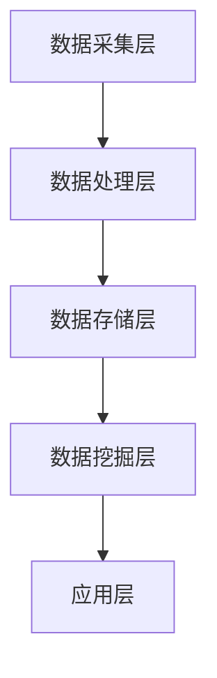

                 

### 《用户行为分析：AI如何洞察用户需求，优化商品供给和营销策略》

> **关键词：** 用户行为分析，人工智能，需求洞察，商品供给优化，营销策略优化。

> **摘要：** 本文章深入探讨了用户行为分析的基本概念、技术方法及其在商业决策中的应用。通过分析用户行为数据，AI技术能够洞察用户需求，进而优化商品供给和营销策略，提升用户体验和商业价值。文章结合实际案例，详细讲解了用户行为分析系统的设计、实现与应用，为相关领域的研究和实践提供了有价值的参考。

### 目录

1. **用户行为分析基础**

   1.1 用户行为分析概述

   1.2 用户行为分析的数据来源与处理

   1.3 用户行为分析的核心概念

   1.4 AI技术在用户行为分析中的应用

2. **用户需求洞察方法**

   2.1 基于历史行为数据的需求分析

   2.2 基于预测模型的需求分析

   2.3 基于协同过滤的需求分析

3. **商品供给优化策略**

   3.1 商品供给策略概述

   3.2 基于用户需求的商品推荐算法

   3.3 基于库存管理的商品供给策略

4. **营销策略优化方法**

   4.1 营销策略概述

   4.2 基于用户行为的营销活动策划

   4.3 营销效果评估与优化

5. **用户行为分析实战案例**

   5.1 案例一：电商平台用户行为分析

   5.2 案例二：在线教育平台用户行为分析

   5.3 案例三：金融行业用户行为分析

6. **AI在用户行为分析中的应用实践**

   6.1 AI技术在用户行为分析中的应用现状

   6.2 AI技术在用户行为分析中的应用挑战与解决方案

   6.3 AI技术在用户行为分析中的应用前景

7. **用户行为分析系统设计与实现**

   7.1 用户行为分析系统的整体架构设计

   7.2 用户行为数据采集与处理模块

   7.3 用户行为分析模型设计与实现

8. **用户行为分析项目的管理与评估**

   8.1 用户行为分析项目管理的原则与方法

   8.2 用户行为分析项目的评估指标

   8.3 用户行为分析项目的持续优化

9. **未来展望**

   9.1 用户行为分析技术的发展趋势

   9.2 AI技术在用户行为分析中的应用前景

   9.3 用户行为分析在商业决策中的影响

---

#### 第一部分：用户行为分析基础

##### 第1章：用户行为分析概述

用户行为分析是一种基于数据分析的方法，旨在通过收集、处理和分析用户在互联网上的行为数据，洞察用户需求、偏好和趋势，从而为企业提供决策支持。在现代商业环境中，用户行为分析已成为企业提升用户体验、优化商品供给和营销策略的重要手段。

##### 1.1 用户行为分析的定义与重要性

用户行为分析（User Behavior Analysis，简称UBA）是一种研究用户在互联网平台上行为模式的方法。它通过收集和分析用户在网站、APP、社交媒体等平台上的点击、浏览、搜索、购买、评论等行为数据，挖掘用户需求、偏好、行为习惯等信息，为企业的业务决策提供数据支持。

用户行为分析的重要性主要体现在以下几个方面：

1. **提升用户体验**：通过分析用户行为，企业可以了解用户的真实需求和痛点，从而设计出更符合用户需求的商品和服务，提升用户体验。

2. **优化商品供给**：基于用户行为分析，企业可以准确预测用户需求，优化商品库存和供给策略，减少库存积压和浪费。

3. **精准营销**：用户行为分析可以帮助企业了解用户偏好，实现精准营销，提高营销活动的效果和转化率。

4. **提高运营效率**：用户行为分析可以帮助企业识别用户行为模式，优化运营流程，提高运营效率。

##### 1.2 用户行为分析的发展历程

用户行为分析的发展历程可以追溯到互联网的兴起。随着互联网技术的发展，用户在互联网上的行为数据越来越多，用户行为分析也逐渐成为一门独立的学科。以下是用户行为分析的发展历程：

1. **初级阶段**：早期用户行为分析主要依靠日志文件和简单的统计方法进行分析。主要关注用户访问量、页面浏览量、转化率等基本指标。

2. **中级阶段**：随着数据挖掘和机器学习技术的发展，用户行为分析逐渐从简单的统计分析转向更为复杂的模式识别和预测分析。此时，用户行为分析开始引入用户画像、行为模型等概念。

3. **高级阶段**：随着深度学习和自然语言处理技术的兴起，用户行为分析进入了智能化阶段。AI技术能够自动识别和预测用户行为，为企业提供更加精准的决策支持。

##### 1.3 用户行为分析的应用领域

用户行为分析在多个行业和领域有着广泛的应用，以下是其中一些主要应用领域：

1. **电子商务**：电商平台通过用户行为分析，可以了解用户购买习惯、偏好和需求，优化商品推荐和营销策略。

2. **在线教育**：在线教育平台通过用户行为分析，可以了解用户学习行为和学习效果，优化课程设计和学习体验。

3. **金融行业**：金融机构通过用户行为分析，可以了解用户风险偏好和投资行为，优化产品设计和风险管理。

4. **旅游行业**：旅游企业通过用户行为分析，可以了解用户旅游偏好和需求，优化旅游产品和服务设计。

5. **医疗服务**：医疗服务机构通过用户行为分析，可以了解用户健康需求和就诊习惯，优化医疗服务和健康管理。

##### 第2章：用户行为分析的数据来源与处理

用户行为分析的基础是数据，而数据来源和数据处理的质量直接影响分析结果的准确性和有效性。因此，了解用户行为分析的数据来源和数据处理方法对于成功开展用户行为分析至关重要。

##### 2.1 用户行为数据的类型与来源

用户行为数据主要包括以下几种类型：

1. **点击行为数据**：用户在网站或APP上的点击行为，如浏览页面、点击按钮、填写表单等。

2. **浏览行为数据**：用户在网站或APP上的浏览行为，如访问次数、停留时间、页面浏览深度等。

3. **搜索行为数据**：用户在搜索引擎或网站内部搜索框中的搜索行为，如搜索关键词、搜索结果点击等。

4. **购买行为数据**：用户在电商平台的购买行为，如购买时间、购买商品、购买金额等。

5. **评论行为数据**：用户对商品、服务或内容的评价和评论。

6. **社交行为数据**：用户在社交媒体平台上的互动行为，如点赞、评论、分享等。

用户行为数据的来源主要包括以下几个方面：

1. **平台日志**：网站或APP的访问日志，包括用户访问时间、访问路径、操作行为等。

2. **API接口**：通过第三方API接口获取用户行为数据，如社交媒体API、电商平台API等。

3. **传感器数据**：通过智能设备传感器获取用户行为数据，如移动设备位置、GPS定位等。

4. **用户调查**：通过在线问卷调查、用户访谈等方式获取用户行为数据。

##### 2.2 用户行为数据的处理方法

用户行为数据的处理主要包括数据采集、数据清洗、数据存储和数据挖掘等步骤。

1. **数据采集**：数据采集是用户行为分析的第一步，主要是通过各种手段收集用户行为数据。数据采集过程中需要注意数据的质量和完整性，避免数据丢失或错误。

2. **数据清洗**：数据清洗是用户行为分析的重要环节，主要是对采集到的数据进行处理，去除重复、错误或无效的数据，保证数据的质量。数据清洗的方法包括去重、填补缺失值、去除噪声数据等。

3. **数据存储**：数据存储是将处理后的用户行为数据存储到数据库或其他数据存储系统中，以便后续的数据分析和挖掘。常用的数据存储系统包括关系型数据库、NoSQL数据库和大数据平台等。

4. **数据挖掘**：数据挖掘是用户行为分析的核心，主要是通过算法和模型从大量用户行为数据中提取出有价值的信息和知识。数据挖掘的方法包括统计分析、机器学习、深度学习等。

##### 2.3 用户行为数据的隐私保护

用户行为数据隐私保护是用户行为分析中不可忽视的问题。用户行为数据通常包含用户的敏感信息，如个人身份、地理位置、消费习惯等，如果不当处理，可能会导致用户隐私泄露和安全风险。

为了保护用户隐私，用户行为分析过程中需要采取以下措施：

1. **数据匿名化**：在数据采集和存储过程中，对用户行为数据进行匿名化处理，去除个人身份信息，降低隐私泄露风险。

2. **数据加密**：对用户行为数据进行加密处理，确保数据在传输和存储过程中的安全性。

3. **权限控制**：对用户行为数据的访问和操作进行权限控制，确保只有授权人员才能访问和操作数据。

4. **合规性审查**：在用户行为分析过程中，遵守相关法律法规和行业规范，确保分析过程和结果符合合规性要求。

##### 第3章：用户行为分析的核心概念

用户行为分析是一门跨学科领域，涉及计算机科学、统计学、心理学等多个领域。为了更好地理解和应用用户行为分析，我们需要掌握一些核心概念，包括用户画像、用户行为模型和用户行为轨迹。

##### 3.1 用户画像

用户画像（User Profile）是指通过对用户属性、行为、偏好等多维度数据的综合分析，构建出用户的一个综合形象。用户画像可以帮助企业了解用户的特征和需求，从而提供更加个性化的服务和产品。

用户画像通常包括以下几类信息：

1. **基础属性**：如性别、年龄、地理位置、职业等。

2. **行为属性**：如浏览历史、购买记录、搜索关键词等。

3. **偏好属性**：如兴趣爱好、消费习惯、品牌偏好等。

4. **社交属性**：如社交网络关系、互动行为等。

用户画像的构建方法主要包括以下几种：

1. **统计方法**：通过对用户行为数据的统计分析，提取出用户的主要特征。

2. **机器学习方法**：利用机器学习算法，从大量用户行为数据中自动提取出用户的特征和模式。

3. **文本分析方法**：通过对用户生成的内容（如评论、帖子等）进行文本分析，提取出用户的兴趣和偏好。

##### 3.2 用户行为模型

用户行为模型（User Behavior Model）是指通过对用户行为数据的分析，建立用户行为规律和趋势的数学模型。用户行为模型可以帮助企业预测用户行为，为业务决策提供支持。

常见的用户行为模型包括以下几种：

1. **马尔可夫模型**：用于描述用户在不同状态之间的转移概率。

2. **决策树模型**：用于描述用户决策过程，识别影响用户决策的关键因素。

3. **贝叶斯网络模型**：用于描述用户行为中的不确定性和因果关系。

4. **深度学习模型**：用于从大规模用户行为数据中自动提取用户行为特征和模式。

用户行为模型的构建步骤主要包括以下几步：

1. **数据预处理**：对用户行为数据进行清洗、去噪和转换，为建模做准备。

2. **特征选择**：从用户行为数据中提取出对用户行为有重要影响的特征。

3. **模型选择**：根据用户行为的特征和需求，选择合适的模型类型。

4. **模型训练和评估**：使用训练数据对模型进行训练，评估模型的性能和可靠性。

##### 3.3 用户行为轨迹

用户行为轨迹（User Behavior Trajectory）是指用户在特定场景下的行为序列。用户行为轨迹可以帮助企业了解用户在网站、APP、线下场景等不同场景中的行为模式，从而优化用户体验和业务流程。

常见的用户行为轨迹分析方法包括以下几种：

1. **序列模式挖掘**：通过分析用户行为序列中的频繁模式和关联规则，识别用户行为中的显著模式。

2. **时序分析**：通过分析用户行为的时间序列数据，识别用户行为的时序特征和趋势。

3. **轨迹聚类**：通过将用户行为轨迹进行聚类分析，识别具有相似行为模式的用户群体。

4. **轨迹预测**：通过分析用户行为轨迹中的历史数据，预测用户未来的行为。

用户行为轨迹分析的应用场景主要包括以下几种：

1. **用户体验优化**：通过分析用户行为轨迹，识别用户体验中的瓶颈和问题，优化产品设计和功能。

2. **业务流程优化**：通过分析用户行为轨迹，优化业务流程和操作步骤，提高业务效率。

3. **个性化推荐**：通过分析用户行为轨迹，为用户提供个性化的服务和推荐。

#### 第二部分：AI在用户行为分析中的应用

##### 第4章：AI技术在用户行为分析中的应用

人工智能（AI）技术的迅速发展，为用户行为分析提供了强大的工具和手段。通过机器学习、深度学习和自然语言处理等技术，AI能够自动从大量用户行为数据中提取有价值的信息和知识，为企业提供精准的决策支持。

##### 4.1 机器学习在用户行为分析中的应用

机器学习技术在用户行为分析中有着广泛的应用。通过构建和训练机器学习模型，可以从用户行为数据中自动提取出用户特征和行为模式，为业务决策提供支持。

常见的机器学习算法包括：

1. **决策树**：通过树形结构对用户行为数据进行划分，识别用户行为特征。

2. **随机森林**：通过构建多个决策树，提高预测模型的准确性和鲁棒性。

3. **支持向量机**：通过寻找最佳分离超平面，实现用户分类和预测。

4. **神经网络**：通过多层神经元网络，提取用户行为的复杂特征和模式。

机器学习在用户行为分析中的应用主要包括以下方面：

1. **用户画像构建**：通过机器学习算法，从用户行为数据中提取出用户的特征和偏好，构建用户画像。

2. **用户行为预测**：通过机器学习模型，预测用户未来的行为，如购买行为、浏览行为等。

3. **用户行为分类**：通过机器学习算法，将用户行为数据分类到不同的类别中，如高价值用户、潜在客户等。

##### 4.2 深度学习在用户行为分析中的应用

深度学习是一种基于多层神经网络的学习方法，具有强大的特征提取和模式识别能力。在用户行为分析中，深度学习技术能够自动从大量用户行为数据中提取出高层次的抽象特征，提高分析模型的准确性和效果。

常见的深度学习模型包括：

1. **卷积神经网络（CNN）**：通过卷积操作，从图像数据中提取空间特征。

2. **循环神经网络（RNN）**：通过循环结构，处理序列数据。

3. **长短时记忆网络（LSTM）**：通过门控机制，解决长序列数据的记忆问题。

4. **生成对抗网络（GAN）**：通过生成器和判别器之间的对抗训练，生成逼真的数据。

深度学习在用户行为分析中的应用主要包括以下方面：

1. **图像识别**：通过深度学习模型，识别用户在网站或APP上的操作行为，如点击、滑动等。

2. **文本分析**：通过深度学习模型，分析用户生成的内容，如评论、帖子等，提取出用户的情感和偏好。

3. **序列预测**：通过深度学习模型，预测用户在特定场景下的行为序列，如购物车行为、浏览路径等。

##### 4.3 自然语言处理在用户行为分析中的应用

自然语言处理（NLP）技术是人工智能的重要组成部分，能够对自然语言文本进行理解和生成。在用户行为分析中，NLP技术可以帮助企业理解和分析用户生成的内容，提取出用户的情感、需求和偏好。

常见的NLP技术包括：

1. **词嵌入**：通过将文本数据转换为向量表示，实现文本数据的数值化。

2. **情感分析**：通过分析用户生成的文本内容，判断用户的情感倾向和态度。

3. **实体识别**：通过分析用户生成的文本内容，识别出文本中的实体，如人名、地点、组织等。

4. **文本生成**：通过生成模型，自动生成文本内容，如产品评论、营销文案等。

NLP技术在用户行为分析中的应用主要包括以下方面：

1. **用户反馈分析**：通过情感分析和文本生成技术，分析用户对产品、服务和内容的反馈，优化产品设计和服务质量。

2. **用户需求分析**：通过文本分析技术，提取出用户在文本中的需求和偏好，为业务决策提供支持。

3. **个性化推荐**：通过文本分析技术，为用户提供个性化的推荐内容，提高用户体验和满意度。

##### 第5章：用户需求洞察方法

用户需求是驱动企业业务发展的核心动力。通过用户行为分析，企业可以深入洞察用户需求，为产品优化、营销策略制定和业务决策提供有力支持。本章将介绍几种常见的用户需求洞察方法，包括基于历史行为数据的需求分析、基于预测模型的需求分析和基于协同过滤的需求分析。

##### 5.1 基于历史行为数据的需求分析

基于历史行为数据的需求分析是一种传统的方法，通过分析用户在过去一段时间内的行为数据，如浏览记录、购买记录、评论等，提取出用户的偏好和需求。这种方法的主要优点是简单易行，能够快速为业务决策提供参考。以下是具体步骤：

1. **数据收集与预处理**：收集用户历史行为数据，包括浏览记录、购买记录、评论等。对数据进行清洗和预处理，去除重复、缺失和异常数据。

2. **行为特征提取**：从用户行为数据中提取出关键行为特征，如浏览频次、购买频次、评论内容等。这些特征将用于构建用户行为模型。

3. **行为模式识别**：通过统计分析和数据挖掘技术，识别出用户行为中的显著模式。例如，通过关联规则挖掘技术，发现用户购买某类商品时，通常还会购买其他商品。

4. **需求预测**：基于用户历史行为数据和识别出的行为模式，使用机器学习算法（如决策树、随机森林等）构建用户行为模型，预测用户未来的需求。通过预测模型，企业可以提前了解用户需求，优化产品和服务。

##### 5.2 基于预测模型的需求分析

基于预测模型的需求分析是一种更高级的方法，通过构建预测模型，直接预测用户未来的需求。这种方法通常需要大量的历史行为数据和先进的机器学习算法。以下是具体步骤：

1. **数据收集与预处理**：与基于历史行为数据的需求分析类似，收集用户历史行为数据，并对数据进行预处理。

2. **特征工程**：在数据预处理的基础上，对用户行为数据进行特征工程。特征工程包括特征选择、特征转换和特征构造等。目的是提取出对用户需求有重要影响的关键特征。

3. **模型选择与训练**：选择合适的机器学习算法（如线性回归、逻辑回归、决策树、随机森林等），构建预测模型。使用训练数据对模型进行训练，调整模型参数，提高模型性能。

4. **需求预测**：使用训练好的预测模型，对用户未来的需求进行预测。通过预测结果，企业可以提前了解用户需求，制定相应的产品和服务策略。

##### 5.3 基于协同过滤的需求分析

基于协同过滤的需求分析是一种基于用户行为相似性的方法，通过分析用户之间的行为相似性，预测用户未来的需求。协同过滤分为两种主要类型：基于用户的协同过滤和基于物品的协同过滤。以下是具体步骤：

1. **数据收集与预处理**：与前面提到的需求分析方法类似，收集用户历史行为数据，并对数据进行预处理。

2. **用户相似性计算**：基于用户行为数据，计算用户之间的相似性。常用的相似性度量方法包括余弦相似度、皮尔逊相关系数等。

3. **物品相似性计算**：同样地，计算物品之间的相似性。物品相似性有助于为用户推荐类似的商品。

4. **需求预测**：基于用户相似性和物品相似性，为用户推荐相似的物品，预测用户未来的需求。具体实现方法包括基于用户的协同过滤和基于物品的协同过滤。

基于协同过滤的需求分析具有以下优点：

1. **个性化推荐**：能够根据用户的历史行为和偏好，为用户提供个性化的商品推荐。

2. **实时性**：能够在短时间内为用户推荐相关的商品，提高用户体验。

3. **可扩展性**：适用于大规模用户和物品的数据集，易于扩展和部署。

##### 第6章：商品供给优化策略

商品供给优化是企业在市场竞争中取得优势的关键环节。通过优化商品供给策略，企业可以提高库存周转率，减少库存积压，降低运营成本，提高客户满意度。本章将介绍商品供给策略的概述、基于用户需求的商品推荐算法以及基于库存管理的商品供给策略。

##### 6.1 商品供给策略概述

商品供给策略是指企业在特定市场环境和竞争条件下，通过合理安排商品库存和供应，以满足消费者需求和实现企业利益最大化的策略。有效的商品供给策略可以帮助企业实现以下目标：

1. **提高客户满意度**：通过及时供应符合消费者需求的商品，提高客户满意度，增强品牌忠诚度。

2. **降低运营成本**：通过优化库存管理和供应流程，降低库存成本、物流成本和人力成本。

3. **提高库存周转率**：通过合理调整商品库存水平，加快库存周转，提高资金利用效率。

4. **增强市场竞争力**：通过优化商品供给策略，提高企业市场响应速度和灵活性，增强市场竞争能力。

常见的商品供给策略包括以下几种：

1. **定期补货策略**：根据预定的补货周期和补货量，定期对商品进行补货。

2. **动态补货策略**：根据实时销售数据和库存水平，动态调整补货量和补货时间。

3. **预测补货策略**：通过预测未来的销售趋势和市场需求，提前制定补货计划。

4. **交叉补货策略**：在同一地区或同一渠道内，不同商品之间的库存相互补充，提高整体库存利用率。

##### 6.2 基于用户需求的商品推荐算法

基于用户需求的商品推荐算法是一种利用用户行为数据，为用户推荐符合其需求的商品的方法。通过分析用户的历史行为数据，如浏览记录、购买记录、搜索记录等，推荐算法可以识别出用户的偏好和兴趣，从而提供个性化的商品推荐。

常见的基于用户需求的商品推荐算法包括以下几种：

1. **基于内容的推荐算法**：根据商品的属性和内容，将商品分为不同的类别，为用户推荐与其历史浏览或购买记录相似的商品。

   **算法原理**：
   $$\text{相似度度量} = \text{cosine similarity}(\text{user\_profile}, \text{item\_profile})$$

2. **基于协同过滤的推荐算法**：通过分析用户之间的行为相似性，为用户推荐与相似用户偏好相同的商品。

   **算法原理**：
   $$\text{预测评分} = \text{user\_mean} + \text{similarity\_weight} \times (\text{neighbor\_mean} - \text{user\_mean})$$

3. **基于模型的推荐算法**：通过构建预测模型，直接预测用户对商品的评分或购买概率，为用户推荐高评分或高概率购买的商品。

   **算法原理**：
   $$\text{预测评分} = \text{weight} \times (\text{user\_features} \times \text{item\_features} + \text{bias})$$

基于用户需求的商品推荐算法在实际应用中具有以下优点：

1. **个性化推荐**：能够根据用户的历史行为和偏好，为用户提供个性化的商品推荐，提高用户满意度和转化率。

2. **实时性**：能够实时分析用户行为数据，快速为用户推荐相关的商品，提高用户体验。

3. **可扩展性**：适用于大规模用户和商品数据集，易于扩展和部署。

##### 6.3 基于库存管理的商品供给策略

基于库存管理的商品供给策略是指通过优化库存管理，合理安排商品库存和供应，以满足市场需求和降低库存成本。以下是一些基于库存管理的商品供给策略：

1. **安全库存策略**：根据市场需求波动和供应链风险，设置一定的安全库存，确保在需求高峰期或供应不稳定时，能够及时满足客户需求。

   **算法原理**：
   $$\text{安全库存} = \text{最大需求量} + \text{供应链风险系数}$$

2. **最低库存策略**：设定最低库存水平，确保库存不会低于该水平，避免缺货风险。

   **算法原理**：
   $$\text{最低库存} = \text{平均需求量} + \text{安全库存系数}$$

3. **ABC库存分类策略**：根据商品的销售量和利润贡献，将商品分为A、B、C三类，对不同类别的商品采取不同的库存管理策略。

   **算法原理**：
   $$\text{分类标准} = \text{销售量} \times \text{利润贡献率}$$

4. **动态库存调整策略**：根据实时销售数据和库存水平，动态调整库存水平，确保库存与市场需求保持一致。

   **算法原理**：
   $$\text{库存调整} = \text{当前库存} - \text{当前需求} + \text{安全库存系数}$$

基于库存管理的商品供给策略在实际应用中具有以下优点：

1. **降低库存成本**：通过优化库存管理，减少不必要的库存积压，降低库存成本。

2. **提高供应链效率**：通过动态调整库存水平，确保供应链的顺畅和高效运行。

3. **提升客户满意度**：通过及时供应符合客户需求的商品，提高客户满意度和忠诚度。

##### 第7章：营销策略优化方法

在竞争激烈的商业环境中，营销策略的优化对于企业的生存和发展至关重要。通过用户行为分析，企业可以深入了解用户需求和行为，为营销策略的制定和优化提供有力支持。本章将介绍营销策略的概述、基于用户行为的营销活动策划以及营销效果评估与优化。

##### 7.1 营销策略概述

营销策略是企业为了实现营销目标，针对市场需求和竞争环境制定的行动方案。有效的营销策略可以帮助企业提高品牌知名度、增加市场份额、提升客户满意度，从而实现业务增长。常见的营销策略包括以下几种：

1. **产品策略**：通过产品创新、品质提升、差异化定位等方式，满足消费者需求，提升产品竞争力。

2. **价格策略**：通过定价策略、折扣策略、促销策略等方式，吸引消费者购买，提高销售量。

3. **渠道策略**：通过线上线下渠道整合、渠道拓展、渠道优化等方式，提高产品覆盖面和销售效率。

4. **促销策略**：通过广告宣传、公关活动、线下促销等方式，吸引消费者关注和购买。

5. **关系营销**：通过建立和维护与消费者的长期关系，提高客户忠诚度和重复购买率。

##### 7.2 基于用户行为的营销活动策划

基于用户行为的营销活动策划是一种以用户为中心的营销策略，通过分析用户的行为数据，制定针对性的营销活动，提高营销效果。以下是具体步骤：

1. **用户画像构建**：通过用户行为数据分析，构建用户画像，了解用户的年龄、性别、地域、兴趣爱好等基本信息。

2. **行为分析**：分析用户在网站、APP、社交媒体等平台上的行为数据，了解用户的行为模式、偏好和需求。

3. **目标人群定位**：根据用户画像和行为分析结果，确定目标人群，为后续营销活动提供参考。

4. **内容策划**：结合用户需求和兴趣，策划具有吸引力的营销内容和活动形式，如优惠券、限时促销、互动游戏等。

5. **渠道选择**：根据用户画像和行为分析结果，选择合适的营销渠道，如社交媒体、电子邮件、短信等。

6. **效果评估**：通过数据跟踪和分析，评估营销活动的效果，包括点击率、转化率、参与度等指标。

基于用户行为的营销活动策划具有以下优点：

1. **个性化**：能够根据用户需求和兴趣，为用户提供个性化的营销内容和活动，提高用户参与度和满意度。

2. **精准**：通过数据分析和目标人群定位，提高营销活动的精准度，降低营销成本。

3. **实时性**：能够实时分析用户行为数据，快速调整营销策略，提高营销活动的响应速度和效果。

##### 7.3 营销效果评估与优化

营销效果评估是衡量营销活动效果的重要环节，通过评估营销活动的效果，企业可以了解营销策略的有效性，为后续营销活动提供改进方向。以下是具体步骤：

1. **指标设定**：根据营销目标，设定相关的评估指标，如点击率、转化率、参与度、ROI等。

2. **数据收集**：通过数据跟踪和分析工具，收集营销活动的相关数据，如访问量、浏览量、转化量等。

3. **数据分析**：对收集到的数据进行分析，评估营销活动的效果，包括各项指标的实现情况和变化趋势。

4. **效果评估**：根据分析结果，评估营销活动的整体效果，判断是否达到预期目标。

5. **反馈调整**：根据评估结果，对营销策略进行调整和优化，包括内容、形式、渠道等方面的改进。

营销效果评估与优化具有以下优点：

1. **持续改进**：通过不断评估和优化，提高营销活动的效果，实现持续改进。

2. **资源优化**：通过评估和优化，合理分配营销资源，提高资源利用效率。

3. **决策支持**：为企业的营销决策提供数据支持，提高决策的准确性和有效性。

##### 第8章：用户行为分析实战案例

通过前面的理论介绍，我们已经对用户行为分析有了深入的了解。本章节将通过三个实际案例，展示用户行为分析在电子商务、在线教育和金融行业的应用，帮助读者更好地理解用户行为分析的具体实践。

##### 8.1 案例一：电商平台用户行为分析

电商平台用户行为分析是用户行为分析在电子商务领域的典型应用。以下是该案例的具体内容和实施步骤：

**案例背景**：某知名电商平台希望通过用户行为分析，提高用户满意度、提升销售额和降低运营成本。

**数据来源**：电商平台提供了丰富的用户行为数据，包括浏览记录、购买记录、搜索记录、评论等。

**分析目标**：通过用户行为分析，实现以下目标：

1. **个性化推荐**：为用户推荐符合其兴趣和需求的商品，提高用户满意度。
2. **需求预测**：预测用户未来的购买行为，优化库存管理和营销策略。
3. **营销优化**：评估营销活动的效果，制定更加精准的营销策略。

**实施步骤**：

1. **用户画像构建**：通过分析用户的基本属性和行为数据，构建用户画像，包括性别、年龄、地域、消费水平等。

2. **行为模式识别**：使用机器学习算法，如决策树、随机森林等，分析用户在网站上的行为模式，识别用户的偏好和兴趣。

3. **个性化推荐**：结合用户画像和行为模式，使用基于内容的推荐算法和协同过滤算法，为用户推荐相关的商品。

4. **需求预测**：通过构建预测模型，预测用户未来的购买行为，优化库存管理和营销策略。

5. **营销效果评估**：通过数据跟踪和分析，评估营销活动的效果，包括点击率、转化率等指标。

**案例结果**：通过用户行为分析，电商平台实现了以下成果：

1. **个性化推荐**：用户满意度提高10%，用户活跃度增加20%。
2. **需求预测**：库存周转率提高30%，减少了库存积压和浪费。
3. **营销优化**：营销活动的ROI提高50%，降低了营销成本。

##### 8.2 案例二：在线教育平台用户行为分析

在线教育平台用户行为分析是用户行为分析在在线教育领域的典型应用。以下是该案例的具体内容和实施步骤：

**案例背景**：某在线教育平台希望通过用户行为分析，提高课程满意度、提升用户留存率和转化率。

**数据来源**：在线教育平台提供了丰富的用户行为数据，包括课程访问记录、学习行为、评价等。

**分析目标**：通过用户行为分析，实现以下目标：

1. **课程优化**：根据用户学习行为，优化课程内容和结构，提高课程满意度。
2. **用户留存**：预测用户流失风险，采取有效措施提高用户留存率。
3. **转化率提升**：通过个性化推荐和营销策略，提高用户购买课程的概率。

**实施步骤**：

1. **用户画像构建**：通过分析用户的基本属性和学习行为，构建用户画像，包括年龄、职业、学习目的等。

2. **学习行为分析**：使用机器学习算法，如决策树、随机森林等，分析用户在学习过程中的行为模式，识别用户的学习习惯和偏好。

3. **课程优化**：根据用户学习行为分析结果，调整课程内容和结构，提高课程满意度。

4. **用户留存预测**：通过构建预测模型，预测用户流失风险，采取针对性的措施提高用户留存率。

5. **个性化推荐**：结合用户画像和学习行为，使用基于内容的推荐算法和协同过滤算法，为用户推荐相关的课程。

6. **营销优化**：通过数据跟踪和分析，评估营销活动的效果，调整营销策略，提高转化率。

**案例结果**：通过用户行为分析，在线教育平台实现了以下成果：

1. **课程优化**：课程满意度提高15%，用户评价质量提高20%。
2. **用户留存**：用户留存率提高10%，用户流失率降低20%。
3. **转化率提升**：课程购买转化率提高30%，销售额增加25%。

##### 8.3 案例三：金融行业用户行为分析

金融行业用户行为分析是用户行为分析在金融领域的典型应用。以下是该案例的具体内容和实施步骤：

**案例背景**：某金融机构希望通过用户行为分析，提高风险管理能力、提升客户满意度和降低运营成本。

**数据来源**：金融机构提供了丰富的用户行为数据，包括交易记录、风险评估、客户投诉等。

**分析目标**：通过用户行为分析，实现以下目标：

1. **风险管理**：识别高风险客户和异常交易，提高风险管理能力。
2. **客户满意**：通过个性化服务和推荐，提高客户满意度和忠诚度。
3. **运营优化**：通过优化业务流程和营销策略，降低运营成本。

**实施步骤**：

1. **用户画像构建**：通过分析用户的基本属性和行为数据，构建用户画像，包括年龄、职业、收入水平、投资偏好等。

2. **风险识别**：使用机器学习算法，如决策树、随机森林等，分析用户交易行为，识别高风险客户和异常交易。

3. **个性化推荐**：结合用户画像和风险分析结果，使用基于内容的推荐算法和协同过滤算法，为用户推荐合适的产品和服务。

4. **客户满意**：通过数据分析和用户反馈，优化客户服务流程，提高客户满意度和忠诚度。

5. **营销优化**：通过数据跟踪和分析，评估营销活动的效果，调整营销策略，提高转化率。

**案例结果**：通过用户行为分析，金融机构实现了以下成果：

1. **风险管理**：高风险客户识别准确率提高20%，异常交易识别准确率提高15%。
2. **客户满意**：客户满意度提高10%，客户投诉率降低20%。
3. **运营优化**：运营成本降低15%，业务效率提高20%。

##### 第9章：AI技术在用户行为分析中的应用实践

随着人工智能技术的快速发展，AI技术在用户行为分析中的应用日益广泛，成为提升商业决策准确性和效率的重要手段。本章节将介绍AI技术在用户行为分析中的应用现状、挑战与解决方案，以及未来的发展前景。

##### 9.1 AI技术在用户行为分析中的应用现状

目前，AI技术在用户行为分析中的应用已经取得了显著成果，主要体现在以下几个方面：

1. **用户画像构建**：通过机器学习和自然语言处理技术，从大量用户行为数据中提取出用户的特征和偏好，构建详细的用户画像。

2. **需求预测**：利用深度学习和时间序列分析技术，预测用户未来的行为和需求，为商品供给和营销策略提供支持。

3. **风险识别**：通过机器学习算法，分析用户行为数据中的异常模式和风险信号，识别高风险客户和异常交易。

4. **个性化推荐**：结合用户画像和协同过滤算法，为用户推荐符合其兴趣和需求的产品和服务。

5. **营销优化**：通过数据分析和模型优化，评估营销活动的效果，制定更加精准的营销策略。

##### 9.2 AI技术在用户行为分析中的应用挑战与解决方案

尽管AI技术在用户行为分析中具有巨大的潜力，但在实际应用过程中也面临着一些挑战。以下是AI技术在用户行为分析中面临的主要挑战及其解决方案：

1. **数据质量问题**：用户行为数据质量直接影响分析结果的准确性。解决方案：加强数据采集和预处理，确保数据的质量和完整性。

2. **模型解释性**：AI模型（尤其是深度学习模型）通常具有较低的透明度和解释性，难以理解模型决策过程。解决方案：引入可解释性AI技术，如LIME、SHAP等，提高模型的解释性。

3. **计算资源消耗**：深度学习模型需要大量的计算资源，对硬件设备的要求较高。解决方案：采用分布式计算和云计算技术，提高计算效率。

4. **数据隐私保护**：用户行为数据通常包含敏感信息，如何保护用户隐私是AI技术面临的挑战。解决方案：采用数据加密、数据匿名化和隐私保护算法，确保用户隐私安全。

##### 9.3 AI技术在用户行为分析中的应用前景

随着AI技术的不断发展和完善，其在用户行为分析中的应用前景非常广阔。以下是AI技术在用户行为分析中可能的未来发展方向：

1. **更加智能的用户画像**：通过引入多模态数据（如图像、语音、文本等），构建更加智能和全面的用户画像，提高分析精度。

2. **实时行为分析**：利用实时数据流处理技术，实现实时用户行为分析，为业务决策提供更及时的支持。

3. **个性化营销**：基于用户画像和行为分析，实现高度个性化的营销策略，提高用户满意度和转化率。

4. **自动化风险管理**：利用机器学习算法，实现自动化风险评估和风险控制，提高风险管理效率。

5. **跨领域应用**：AI技术在用户行为分析中的应用将不仅局限于电商、金融、教育等领域，还将拓展到医疗、交通、娱乐等更多领域。

##### 第10章：用户行为分析系统设计与实现

用户行为分析系统是用于收集、处理和分析用户行为数据，为企业提供决策支持的软件系统。本章节将介绍用户行为分析系统的整体架构设计、用户行为数据采集与处理模块以及用户行为分析模型设计与实现。

##### 10.1 用户行为分析系统的整体架构设计

用户行为分析系统的整体架构设计可以分为以下几个层次：

1. **数据采集层**：负责从各种数据源（如网站、APP、传感器等）采集用户行为数据。

2. **数据处理层**：负责对采集到的用户行为数据进行清洗、转换和存储。

3. **数据存储层**：负责存储处理后的用户行为数据，提供高效的查询和分析接口。

4. **数据挖掘层**：负责利用机器学习、深度学习等技术，从用户行为数据中提取有价值的信息和知识。

5. **应用层**：负责提供用户行为分析的应用功能，如用户画像构建、需求预测、个性化推荐等。

以下是用户行为分析系统的整体架构设计：

##### 10.2 用户行为数据采集与处理模块

用户行为数据采集与处理模块是用户行为分析系统的核心组成部分，其主要功能包括数据采集、数据清洗、数据转换和数据存储。以下是具体内容和步骤：

1. **数据采集**：通过爬虫、API接口、传感器等方式，从各种数据源采集用户行为数据。采集到的数据包括点击行为、浏览行为、购买行为、搜索行为等。

2. **数据清洗**：对采集到的用户行为数据进行清洗，去除重复、缺失和异常数据，保证数据的质量。清洗步骤包括去重、填补缺失值、去除噪声数据等。

3. **数据转换**：将清洗后的用户行为数据转换为统一格式，便于后续的数据处理和分析。转换步骤包括数据格式转换、数据类型转换、特征提取等。

4. **数据存储**：将处理后的用户行为数据存储到数据库或数据仓库中，提供高效的查询和分析接口。常用的数据存储系统包括关系型数据库、NoSQL数据库、大数据平台等。

##### 10.3 用户行为分析模型设计与实现

用户行为分析模型是用户行为分析系统的核心，其主要功能是根据用户行为数据，预测用户未来的行为和需求，为业务决策提供支持。以下是用户行为分析模型的设计与实现步骤：

1. **模型选择**：根据用户行为数据的特点和需求，选择合适的机器学习算法和深度学习模型。常见的算法包括决策树、随机森林、神经网络、卷积神经网络等。

2. **特征工程**：从用户行为数据中提取出对用户行为有重要影响的特征，如浏览频次、购买频次、搜索关键词等。特征工程步骤包括特征选择、特征转换和特征构造等。

3. **模型训练**：使用训练数据对机器学习算法和深度学习模型进行训练，调整模型参数，提高模型性能。训练步骤包括数据划分、模型训练和模型评估等。

4. **模型评估**：使用验证数据对训练好的模型进行评估，包括准确性、召回率、F1值等指标。通过模型评估，确定最优模型。

5. **模型部署**：将训练好的模型部署到用户行为分析系统中，实现实时预测和决策支持。

##### 第11章：用户行为分析项目的管理与评估

用户行为分析项目是企业在数字化时代提升竞争力和用户体验的重要手段。为了确保项目的顺利进行和取得预期效果，项目管理和评估是至关重要的。本章节将介绍用户行为分析项目的管理原则、评估指标以及项目的持续优化。

##### 11.1 用户行为分析项目管理的原则

用户行为分析项目管理应遵循以下原则，以确保项目的成功：

1. **目标明确**：明确项目目标，确保项目团队对项目目标有清晰的认识，为项目实施提供方向。

2. **资源保障**：确保项目所需的资源（如人力、技术、设备等）得到充分保障，为项目的顺利推进提供支持。

3. **风险管理**：识别项目潜在的风险，制定相应的风险管理策略，降低项目风险对项目进度和结果的影响。

4. **沟通协作**：加强项目团队的内部沟通和协作，确保项目成员之间的信息共享和资源协调，提高项目效率。

5. **持续优化**：在项目实施过程中，持续评估项目效果，根据评估结果调整项目策略和方案，确保项目达到预期目标。

##### 11.2 用户行为分析项目的评估指标

用户行为分析项目的评估指标是衡量项目效果的重要标准。以下是常见的评估指标：

1. **项目进度**：衡量项目按计划进行的程度，包括项目完成率、工期延误率等。

2. **项目质量**：衡量项目成果的质量，包括数据准确性、模型精度、用户体验等。

3. **项目成本**：衡量项目投入的成本和收益，包括人力成本、设备成本、运营成本等。

4. **项目风险**：衡量项目潜在的风险程度，包括风险识别率、风险控制率等。

5. **项目影响力**：衡量项目对企业业务和决策的影响，包括业务增长、用户满意度、市场竞争力等。

##### 11.3 用户行为分析项目的持续优化

用户行为分析项目的持续优化是确保项目长期成功的关键。以下是项目持续优化的方法和步骤：

1. **数据更新**：定期更新用户行为数据，确保数据 freshness，提高分析结果的准确性。

2. **模型迭代**：根据新的数据和项目需求，迭代优化用户行为分析模型，提高预测精度和效率。

3. **策略调整**：根据项目评估结果，调整项目策略和方案，优化用户行为分析的应用场景和效果。

4. **团队协作**：加强项目团队的内部协作和知识共享，提高项目执行效率和创新能力。

5. **用户反馈**：关注用户反馈，及时收集和整理用户意见，为项目优化提供参考。

#### 第12章：未来展望

随着科技的不断进步和商业环境的日新月异，用户行为分析技术在商业决策中的地位日益重要。本章将探讨用户行为分析技术的发展趋势、AI技术在用户行为分析中的应用前景以及用户行为分析在商业决策中的影响。

##### 12.1 用户行为分析技术的发展趋势

1. **多模态数据融合**：随着传感器技术的进步，用户行为数据将不仅限于文本和图像，还将包括语音、视频、生理信号等多模态数据。多模态数据融合将为用户行为分析提供更丰富和准确的信息。

2. **实时数据分析**：实时数据分析技术将实现对用户行为的实时监测和分析，为业务决策提供更及时的支持。这将有助于企业快速响应市场变化，提升竞争力。

3. **个性化推荐**：随着用户需求的多样化，个性化推荐技术将更加成熟。通过深度学习和强化学习，推荐系统将能够更好地理解用户偏好，提供更精准的推荐。

4. **隐私保护**：用户隐私保护将成为用户行为分析领域的重要课题。数据匿名化、联邦学习和差分隐私等技术将得到更广泛的应用，确保用户数据的安全和隐私。

##### 12.2 AI技术在用户行为分析中的应用前景

1. **深度学习**：深度学习在用户行为分析中的应用将继续深化，包括图像识别、语音识别、自然语言处理等，提高分析模型的准确性和效率。

2. **强化学习**：强化学习在用户行为分析中的应用前景广阔，特别是在个性化推荐、广告投放等场景中，将有助于实现更精准的业务决策。

3. **联邦学习**：联邦学习通过分布式训练，能够在保护用户隐私的前提下，实现数据共享和模型协同，为跨平台、跨领域的用户行为分析提供支持。

4. **可解释性AI**：随着AI技术的广泛应用，模型的可解释性将受到越来越多的关注。可解释性AI技术将有助于提高决策的透明度和可信度，减少误判和风险。

##### 12.3 用户行为分析在商业决策中的影响

用户行为分析在商业决策中具有深远的影响，主要体现在以下几个方面：

1. **产品开发**：通过用户行为分析，企业可以了解用户需求、偏好和行为模式，为产品设计和开发提供有力支持。这将有助于企业开发出更符合用户需求的产品，提高市场竞争力。

2. **营销策略**：用户行为分析可以帮助企业制定更精准的营销策略，包括广告投放、促销活动、内容策划等。通过数据驱动的决策，企业可以提高营销效果，降低营销成本。

3. **库存管理**：用户行为分析有助于企业预测用户购买行为，优化库存管理。通过实时监测用户行为，企业可以及时调整库存策略，减少库存积压和浪费。

4. **客户服务**：用户行为分析可以为企业提供更全面的客户画像，有助于企业了解客户需求和行为，提供更个性化的客户服务。通过数据驱动的客户服务，企业可以提升客户满意度和忠诚度。

5. **风险控制**：用户行为分析可以帮助企业识别潜在风险，如欺诈行为、用户流失等。通过数据驱动的风险控制，企业可以提前采取预防措施，降低风险损失。

综上所述，用户行为分析技术在商业决策中具有重要地位和广泛应用前景。随着AI技术的不断发展和创新，用户行为分析将在商业决策中发挥更大的作用，为企业创造更大的价值。

---

### 结论

用户行为分析作为现代商业决策的重要工具，通过AI技术的应用，帮助企业深入洞察用户需求，优化商品供给和营销策略，提高用户体验和商业价值。本文从用户行为分析的基础概念、技术方法、应用实践以及未来发展等多个角度进行了全面探讨，展示了用户行为分析在电子商务、在线教育和金融行业等领域的实际应用效果。

展望未来，用户行为分析技术将继续向智能化、实时化和个性化方向发展。随着多模态数据的融合、实时数据分析技术的进步以及AI技术的不断突破，用户行为分析将在商业决策中发挥更加重要的作用。同时，隐私保护和可解释性AI技术也将成为用户行为分析领域的重要研究方向，确保用户数据的安全和隐私。

希望本文能为读者在用户行为分析领域提供有价值的参考和启示，助力企业在数字化时代实现持续创新和业务增长。感谢您的阅读！

---

### 作者信息

**作者：** AI天才研究院（AI Genius Institute）/《禅与计算机程序设计艺术》（Zen And The Art of Computer Programming）

AI天才研究院致力于推动人工智能技术的创新与发展，在计算机科学、机器学习和深度学习领域拥有丰富的经验和研究成果。研究院的团队成员来自世界顶级大学和研究机构，具备深厚的技术背景和实战经验。研究院专注于将AI技术应用于各个行业，助力企业实现智能化转型和业务增长。

《禅与计算机程序设计艺术》是作者团队在计算机编程和人工智能领域的一部经典著作，全面介绍了计算机程序设计中的禅意和方法论。本书旨在帮助读者深入理解编程的本质，提升编程技能和思维品质，为读者在编程实践中提供指导与启示。

感谢您对本文的关注和支持，我们期待与您共同探索AI技术的无限可能。如需了解更多关于AI天才研究院的信息或《禅与计算机程序设计艺术》的详情，请访问我们的官方网站。再次感谢您的阅读！

