                 

### 《电商平台中的AI大模型：从单一场景到场景智能识别与切换》

> **关键词**：电商平台，AI大模型，场景智能识别，多场景切换，深度学习，神经网络，预训练模型，项目实战，案例分析。

> **摘要**：
本文将深入探讨电商平台中AI大模型的应用与发展。首先，介绍电商平台与AI大模型的基本概念及两者之间的关系。然后，详细讲解AI大模型的核心原理，包括人工智能、机器学习和深度学习等。接着，探讨AI大模型在电商平台中的各种应用场景，如用户行为分析、商品推荐系统和客户服务等。最后，介绍如何实现从单一场景到多场景智能切换，并通过实际案例进行展示和分析。

### 目录

1. 引言与背景
   1.1 电商平台的现状与发展
   1.2 AI大模型的基本概念
   1.3 电商平台中AI大模型的应用背景

2. AI大模型的核心原理
   2.1 人工智能与机器学习基础
   2.2 深度学习与神经网络
   2.3 大规模预训练模型

3. 电商平台中AI大模型的应用场景
   3.1 用户行为分析
   3.2 商品推荐系统
   3.3 客户服务与交互
   3.4 安全与风险管理

4. 场景智能识别技术
   4.1 场景识别的基本概念
   4.2 主流场景识别算法
   4.3 多场景识别与切换策略

5. 从单一场景到多场景智能切换
   5.1 单一场景下的AI大模型
   5.2 多场景下的AI大模型设计
   5.3 智能切换机制的设计与实现

6. 场景智能识别与切换的实际应用
   6.1 用户行为分析的智能识别与切换
   6.2 商品推荐系统的场景智能识别与切换
   6.3 客户服务的场景智能识别与切换
   6.4 安全与风险管理的场景智能识别与切换

7. 电商平台AI大模型的发展趋势与挑战
   7.1 人工智能技术的发展趋势
   7.2 电商平台AI大模型的挑战与机遇
   7.3 未来电商平台AI大模型的发展方向

8. 项目实战与案例分析
   8.1 项目背景与目标
   8.2 开发环境与工具
   8.3 数据采集与预处理
   8.4 模型设计与实现
   8.5 模型训练与优化
   8.6 模型部署与运维

9. 案例分析
   9.1 案例一：某大型电商平台用户行为分析
   9.2 案例二：某电商平台商品推荐系统
   9.3 案例三：某电商平台客户服务系统
   9.4 案例四：某电商平台安全与风险管理

10. 附录
    10.1 AI大模型开发工具与资源
    10.2 参考文献

----------------------------------------------------------------

### 引言与背景

#### 1.1 电商平台的现状与发展

随着互联网技术的飞速发展，电商平台已经成为现代商业中不可或缺的一部分。电商平台不仅改变了消费者的购物习惯，也重塑了企业的商业模式。从最初的淘宝、京东，到如今的拼多多、美团，电商平台不断涌现并壮大，形成了一个庞大而复杂的生态系统。

电商平台的核心功能包括商品展示、交易支付、物流配送、用户评价等。通过这些功能，消费者可以在平台上浏览商品、下单购买、支付费用，而商家则可以展示商品、管理库存、处理订单。电商平台不仅为消费者提供了便捷的购物体验，也为商家提供了广阔的销售渠道。

目前，电商平台的规模不断扩大，市场份额逐年提升。根据数据显示，我国电商市场的规模已经位居全球前列，而全球电商市场的规模也在持续增长。电商平台的增长主要得益于以下几个方面：

1. **互联网普及率的提高**：随着互联网技术的普及，越来越多的消费者可以轻松地访问电商平台，进行在线购物。
2. **移动互联网的发展**：移动互联网的普及使得消费者可以随时随地通过手机进行购物，进一步推动了电商平台的增长。
3. **物流网络的完善**：物流网络的不断完善和优化，使得商品能够更快地送达消费者手中，提升了消费者的购物体验。
4. **支付方式的多样化**：各种支付方式的普及，如支付宝、微信支付、银行卡支付等，使得消费者可以更加便捷地进行在线支付。

#### 1.2 AI大模型的基本概念

AI大模型是指利用人工智能技术，通过大规模数据和强大的计算能力，训练出的具有高度智能的模型。这些模型可以应用于各种场景，如自然语言处理、图像识别、推荐系统、智能问答等。AI大模型的核心在于其规模和深度，它们通常由数亿甚至数十亿个参数组成，通过深度学习算法进行训练。

AI大模型的发展得益于以下几个方面：

1. **计算能力的提升**：随着计算机硬件性能的提升，特别是GPU和TPU等专用硬件的出现，使得大规模训练成为可能。
2. **数据资源的丰富**：互联网的普及和数据采集技术的进步，使得大量的数据可以被用于模型训练，提高了模型的性能和准确性。
3. **算法的创新**：深度学习算法的不断发展，特别是自监督学习和迁移学习等技术的应用，使得AI大模型的能力得到了进一步提升。

#### 1.3 电商平台中AI大模型的应用背景

电商平台中的AI大模型具有广泛的应用场景，可以大幅提升平台的运营效率和用户体验。以下是一些常见的应用场景：

1. **用户行为分析**：通过分析用户在平台上的行为数据，如浏览记录、购买历史、评价等，可以了解用户的兴趣和需求，从而提供个性化的推荐和营销策略。
2. **商品推荐系统**：基于用户的浏览和购买行为，利用AI大模型进行商品推荐，提高用户的购物体验和购买转化率。
3. **客户服务与交互**：利用AI大模型构建智能客服系统，通过自然语言处理技术，实现与用户的智能对话和问题解答，提高客户服务的效率和满意度。
4. **安全与风险管理**：通过AI大模型进行用户行为分析和风险识别，及时发现并防范潜在的安全威胁，保障平台的安全稳定运行。

综上所述，电商平台中的AI大模型不仅提升了平台的运营效率，也为用户提供了更好的购物体验。随着技术的不断进步，AI大模型在电商平台中的应用前景将更加广阔。

### AI大模型的核心原理

#### 2.1 人工智能与机器学习基础

人工智能（Artificial Intelligence，AI）是指使计算机系统具有人类智能特性的技术。它通过模拟人类智能行为，实现自动化决策、问题解决和知识获取等功能。人工智能的发展经历了多个阶段，从早期的规则系统到现代的深度学习，每一次突破都带来了新的应用场景和可能性。

机器学习（Machine Learning，ML）是人工智能的核心技术之一，它是指通过算法和模型，让计算机系统从数据中自动学习和改进。机器学习的目标是让计算机能够识别模式、做出预测和决策，而不需要显式地编程。机器学习分为监督学习、无监督学习和强化学习三种主要类型。

- **监督学习**：有标签的数据进行训练，目标是学习输入和输出之间的映射关系。
- **无监督学习**：没有标签的数据进行训练，目标是发现数据中的模式和结构。
- **强化学习**：通过与环境交互，学习最佳的行为策略，以实现目标最大化。

机器学习的基本概念包括模型、参数、损失函数和优化算法。模型是描述输入和输出关系的数学函数，参数是模型的内部变量，损失函数是评估模型性能的指标，优化算法是调整参数以最小化损失函数的方法。

#### 2.2 深度学习与神经网络

深度学习（Deep Learning，DL）是机器学习的一个重要分支，它通过构建多层神经网络（Neural Network，NN）进行训练，实现对复杂数据的高效处理和建模。深度学习的关键在于多层网络结构，每一层都能够提取数据的不同层次特征，从而实现从简单到复杂的特征转换。

神经网络是由多个神经元（或节点）组成的计算模型，每个神经元都与其他神经元相连，通过加权连接实现信息的传递和计算。神经元的激活函数（例如sigmoid、ReLU等）用于引入非线性，使网络能够处理非线性问题。

深度学习的核心组成部分包括：

- **数据层**：输入数据，通过网络的输入层进入。
- **隐藏层**：多层隐藏层，用于提取和转换特征。
- **输出层**：输出层产生最终预测或决策。

深度学习的主要优势在于其强大的特征提取能力和对大规模数据的处理能力。通过预训练和迁移学习，深度学习模型可以有效地应用到各种不同的任务中，如图像识别、语音识别、自然语言处理等。

#### 2.3 大规模预训练模型

大规模预训练模型是指通过在大量数据上预训练，然后针对特定任务进行微调的模型。预训练的目标是让模型学会捕获数据的通用特征，从而提高模型在不同任务上的泛化能力。

大规模预训练模型的发展得益于以下几个方面：

- **大数据**：互联网的普及和数据采集技术的进步，使得大量的数据可以被用于预训练模型。
- **计算资源**：高性能计算资源和GPU、TPU等专用硬件的出现，使得大规模训练成为可能。
- **算法创新**：深度学习算法的进步，特别是自监督学习和迁移学习等技术的应用，提高了预训练模型的效果。

常见的预训练模型包括：

- **GPT（Generative Pre-trained Transformer）**：基于变换器（Transformer）架构，通过预训练生成文本。
- **BERT（Bidirectional Encoder Representations from Transformers）**：双向变换器编码器，用于文本理解和生成。
- **ViT（Vision Transformer）**：视觉变换器，用于图像分类和识别。

大规模预训练模型的应用场景包括自然语言处理、计算机视觉、推荐系统等。通过预训练，模型可以学习到丰富的特征，从而在特定任务上取得更好的性能。

### 电商平台中AI大模型的应用场景

#### 3.1 用户行为分析

用户行为分析是电商平台中AI大模型的重要应用场景之一。通过分析用户在平台上的行为数据，如浏览记录、购买历史、评价等，电商平台可以深入了解用户的兴趣和需求，从而提供个性化的推荐和营销策略。

**核心概念与联系**

用户行为分析的核心概念包括用户行为数据的收集、处理和分析。用户行为数据通常包含以下几种类型：

- **浏览行为**：用户在平台上的浏览历史，包括访问时间、浏览页面、停留时间等。
- **购买行为**：用户的购买历史，包括购买时间、购买商品、购买金额等。
- **评价行为**：用户对商品的评价，包括评分、评论内容等。

这些行为数据可以通过日志文件、API接口、用户交互等方式进行收集。收集到的数据需要进行预处理，包括数据清洗、去重、补全等操作，以便于后续的分析。

**Mermaid流程图**

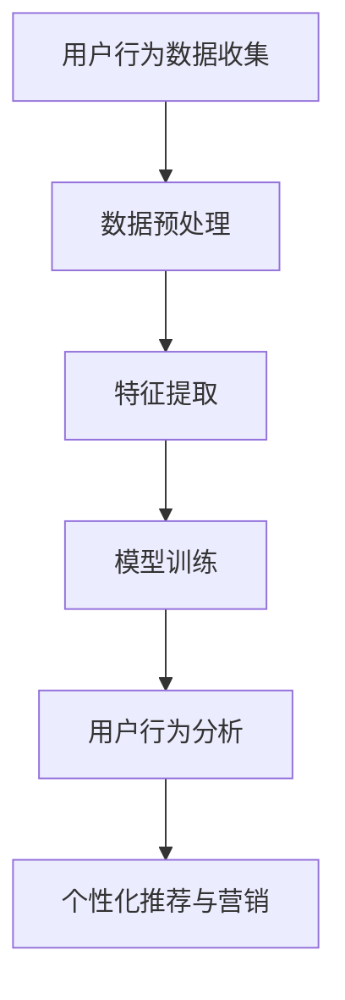

**伪代码**

```python
# 用户行为数据分析的伪代码
def analyze_user_behavior(data):
    # 数据清洗
    cleaned_data = preprocess_data(data)
    
    # 特征提取
    features = extract_features(cleaned_data)
    
    # 模型训练
    model = train_model(features)
    
    # 用户行为分析
    analysis_results = analyze_behavior(model)
    
    # 个性化推荐与营销
    personalized_recommendations = generate_recommendations(analysis_results)
    
    return personalized_recommendations
```

#### 3.2 商品推荐系统

商品推荐系统是电商平台中AI大模型的另一个重要应用场景。通过分析用户的浏览和购买行为，商品推荐系统可以为用户提供个性化的商品推荐，从而提高用户的购物体验和购买转化率。

**核心概念与联系**

商品推荐系统的核心概念包括用户行为数据收集、商品特征提取、推荐算法设计和推荐结果评估。用户行为数据如前文所述，包括浏览行为、购买行为和评价行为。商品特征包括商品类别、价格、品牌、评价等。

常见的推荐算法包括基于内容的推荐、协同过滤推荐和混合推荐等。基于内容的推荐通过分析商品的特征，将具有相似特征的商品推荐给用户；协同过滤推荐通过分析用户之间的相似性，推荐其他用户喜欢的商品；混合推荐则结合多种算法，提高推荐的效果。

**Mermaid流程图**

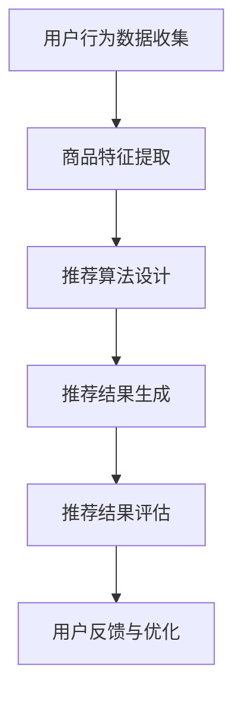

**伪代码**

```python
# 商品推荐系统的伪代码
def generate_recommendations(user_behavior, product_features):
    # 数据预处理
    processed_data = preprocess_data(user_behavior, product_features)
    
    # 推荐算法设计
    recommendation_model = design_recommendation_algorithm(processed_data)
    
    # 推荐结果生成
    recommendations = generate_recommendations_from_model(recommendation_model)
    
    # 推荐结果评估
    evaluation_results = evaluate_recommendations(recommendations)
    
    # 用户反馈与优化
    optimized_recommendations = optimize_recommendations(evaluation_results)
    
    return optimized_recommendations
```

#### 3.3 客户服务与交互

客户服务与交互是电商平台中AI大模型的重要应用场景之一。通过构建智能客服系统，电商平台可以实现与用户的智能对话和问题解答，提高客户服务的效率和满意度。

**核心概念与联系**

客户服务与交互的核心概念包括自然语言处理（Natural Language Processing，NLP）、聊天机器人和用户交互。自然语言处理用于理解用户的语言输入，将其转化为计算机可以处理的形式。聊天机器人则通过NLP技术实现与用户的智能对话。

常见的NLP技术包括分词、词性标注、命名实体识别、情感分析等。通过这些技术，聊天机器人可以理解用户的意图，并提供相应的回答。

**Mermaid流程图**

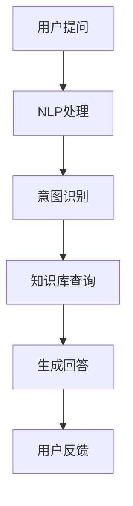

**伪代码**

```python
# 客户服务与交互的伪代码
def handle_user_query(user_query):
    # NLP处理
    processed_query = nlp_process(user_query)
    
    # 意图识别
    intent = recognize_intent(processed_query)
    
    # 知识库查询
    response = query_knowledge_base(intent)
    
    # 生成回答
    generated_response = generate_response(response)
    
    return generated_response
```

#### 3.4 安全与风险管理

安全与风险管理是电商平台中AI大模型的重要应用场景之一。通过AI大模型，电商平台可以实现用户行为分析、风险识别和防范，保障平台的安全稳定运行。

**核心概念与联系**

安全与风险管理的核心概念包括用户行为分析、风险识别和防范。用户行为分析通过监控用户在平台上的行为数据，识别潜在的异常行为。风险识别则通过分析异常行为，确定其是否构成安全风险。防范措施包括实时监控、预警和处置。

常见的风险包括欺诈行为、恶意评论、账号盗用等。通过AI大模型，电商平台可以及时发现并防范这些风险，保障平台的正常运营。

**Mermaid流程图**

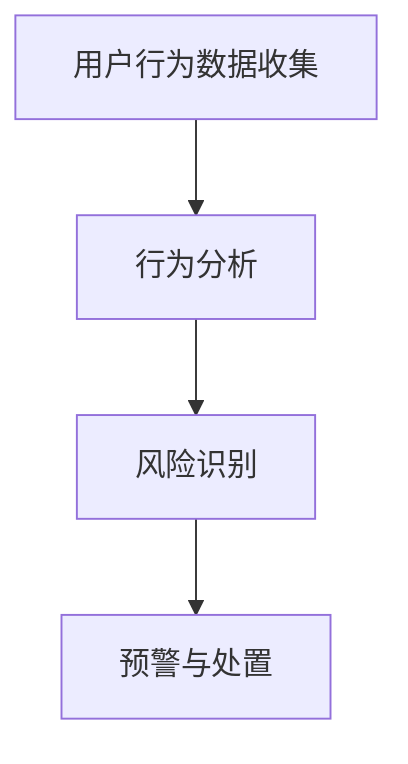

**伪代码**

```python
# 安全与风险管理的伪代码
def monitor_user_behavior(data):
    # 行为分析
    analyzed_behavior = analyze_behavior(data)
    
    # 风险识别
    identified_risks = identify_risks(analyzed_behavior)
    
    # 预警与处置
    handle_risks(identified_risks)
```

### 场景智能识别技术

#### 4.1 场景识别的基本概念

场景识别（Scene Recognition）是指通过计算机视觉技术，从图像或视频序列中识别和分类场景。场景识别是计算机视觉领域的一个重要研究方向，广泛应用于自动驾驶、安防监控、智能助手等领域。

**核心概念与联系**

场景识别的核心概念包括场景、图像特征和分类模型。场景是指现实世界中具有特定功能和视觉特征的区域，如城市街道、森林、海滩等。图像特征是指从图像中提取的有意义的视觉信息，如颜色、纹理、形状等。分类模型则是用于将图像分类到不同场景的算法和模型。

常见的场景识别方法包括基于传统图像处理的方法和基于深度学习的方法。传统方法通常使用手工设计的特征和分类器，如SIFT、HOG等。深度学习方法通过训练大规模神经网络模型，可以自动提取特征并进行分类。

**Mermaid流程图**

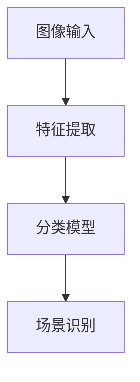

**伪代码**

```python
# 场景识别的伪代码
def scene_recognition(image):
    # 特征提取
    features = extract_features(image)
    
    # 分类模型
    model = load_classification_model()
    
    # 场景识别
    scene = model.predict(features)
    
    return scene
```

#### 4.2 主流场景识别算法

在场景识别中，主流算法可以分为基于传统图像处理的方法和基于深度学习的方法。

**基于传统图像处理的方法**

- **SIFT（Scale-Invariant Feature Transform）**：尺度不变特征变换，通过检测和匹配关键点实现场景识别。
- **HOG（Histogram of Oriented Gradients）**：直方图导向梯度，通过分析图像中像素的梯度方向和强度实现场景识别。
- **SURF（Speeded Up Robust Features）**：快速稳健特征，是对SIFT的改进，提高了计算速度和稳定性。

**基于深度学习的方法**

- **卷积神经网络（Convolutional Neural Network，CNN）**：通过多层卷积和池化操作，提取图像的深层特征，实现场景识别。
- **变换器（Transformer）**：基于注意力机制的深度学习模型，适用于处理序列数据和图像。
- **生成对抗网络（Generative Adversarial Network，GAN）**：通过生成器和判别器的对抗训练，实现图像生成和场景识别。

**伪代码**

```python
# 基于深度学习的场景识别算法伪代码
def deep_learning_scene_recognition(image):
    # 加载预训练模型
    model = load_pretrained_model()
    
    # 图像预处理
    processed_image = preprocess_image(image)
    
    # 特征提取
    features = model.extract_features(processed_image)
    
    # 分类预测
    scene = model.predict(features)
    
    return scene
```

#### 4.3 多场景识别与切换策略

在多场景识别与切换中，场景智能识别技术需要能够同时处理多个场景，并根据场景的不同动态切换识别策略。

**核心概念与联系**

多场景识别与切换的核心概念包括场景检测、切换机制和智能决策。场景检测用于识别当前所处的场景，切换机制用于根据场景检测结果动态调整识别策略，智能决策则用于优化切换过程，提高识别准确率和响应速度。

常见的切换策略包括基于规则的方法和基于学习的方法。基于规则的方法通过预设的规则集，根据场景特征进行切换；基于学习的方法通过训练模型，从数据中学习最优的切换策略。

**Mermaid流程图**

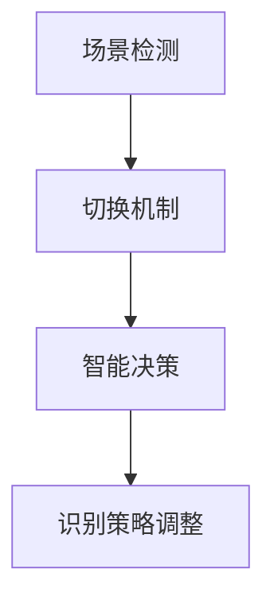

**伪代码**

```python
# 多场景识别与切换策略伪代码
def multi_scene_recognition(image):
    # 场景检测
    current_scene = detect_scene(image)
    
    # 切换机制
    switch_strategy = determine_switch_strategy(current_scene)
    
    # 智能决策
    optimal_switch = intelligent_decision(switch_strategy)
    
    # 识别策略调整
    recognition_strategy = adjust_recognition_strategy(optimal_switch)
    
    # 场景识别
    scene = recognize_scene(image, recognition_strategy)
    
    return scene
```

### 从单一场景到多场景智能切换

#### 5.1 单一场景下的AI大模型

在单一场景下，AI大模型通常针对一个特定的任务进行训练和优化，如用户行为分析、商品推荐等。这种模型在单一场景下可以取得较高的准确率和效率。

**核心概念与联系**

单一场景下的AI大模型包括数据预处理、模型训练、模型评估和模型部署等环节。数据预处理用于准备训练数据，模型训练用于训练模型参数，模型评估用于评估模型性能，模型部署则用于将模型应用到实际场景中。

**Mermaid流程图**

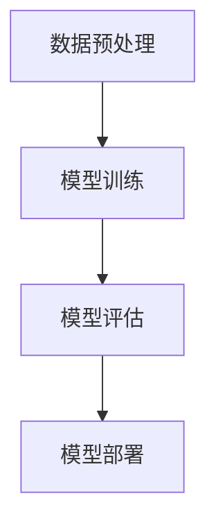

**伪代码**

```python
# 单一场景下的AI大模型伪代码
def single_scene_model(scene_data):
    # 数据预处理
    preprocessed_data = preprocess_data(scene_data)
    
    # 模型训练
    model = train_model(preprocessed_data)
    
    # 模型评估
    performance = evaluate_model(model)
    
    # 模型部署
    deploy_model(model)
    
    return model
```

#### 5.2 多场景下的AI大模型设计

多场景下的AI大模型设计需要考虑如何同时处理多个场景，并在不同场景之间进行切换。这种模型通常采用模块化设计，以便于扩展和维护。

**核心概念与联系**

多场景下的AI大模型设计包括模块化设计、场景检测、切换机制和智能决策等。模块化设计使得模型可以灵活地添加和删除场景模块；场景检测用于识别当前场景；切换机制用于根据场景检测结果动态切换场景模块；智能决策则用于优化切换过程。

**Mermaid流程图**

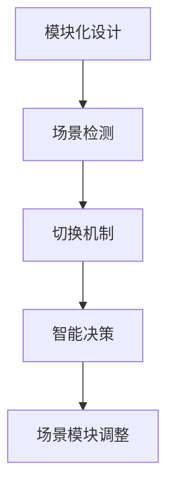

**伪代码**

```python
# 多场景下的AI大模型设计伪代码
class MultiSceneModel:
    def __init__(self):
        self.scene_modules = {}
        self.current_scene = None
    
    def detect_scene(self, data):
        # 场景检测
        scene = detect_scene(data)
        self.current_scene = scene
    
    def switch_scene_module(self, scene):
        # 切换场景模块
        self.scene_modules[scene] = load_scene_module(scene)
    
    def intelligent_decision(self, scene):
        # 智能决策
        decision = intelligent_decision(scene)
        return decision
    
    def recognize_scene(self, data):
        # 场景识别
        scene = self.scene_modules[self.current_scene].recognize(data)
        return scene
```

#### 5.3 智能切换机制的设计与实现

智能切换机制是实现多场景智能切换的关键。它通过分析场景特征和模型性能，动态调整切换策略，以提高识别准确率和响应速度。

**核心概念与联系**

智能切换机制的设计与实现包括场景特征提取、模型性能评估、切换策略优化和切换过程监控等。场景特征提取用于提取当前场景的特征，模型性能评估用于评估模型在当前场景下的性能，切换策略优化用于优化切换策略，切换过程监控则用于监控切换过程中的问题和异常。

**Mermaid流程图**

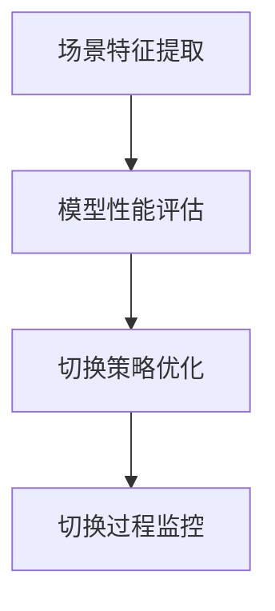

**伪代码**

```python
# 智能切换机制的设计与实现伪代码
def intelligent_switch Mechanism(scene_data, model_performance):
    # 场景特征提取
    scene_features = extract_scene_features(scene_data)
    
    # 模型性能评估
    model_performance = evaluate_model_performance(model_performance)
    
    # 切换策略优化
    optimal_strategy = optimize_switch_strategy(scene_features, model_performance)
    
    # 切换过程监控
    monitor_switch_process(optimal_strategy)
    
    return optimal_strategy
```

### 场景智能识别与切换的实际应用

#### 6.1 用户行为分析的智能识别与切换

用户行为分析的智能识别与切换通过分析用户在不同场景下的行为数据，实现个性化的推荐和营销策略。

**核心概念与联系**

用户行为分析的智能识别与切换包括场景识别、行为分析和个性化推荐等。场景识别用于识别用户当前所处的场景，如浏览、购物、评价等；行为分析用于分析用户在当前场景下的行为数据，如浏览记录、购买历史等；个性化推荐则根据行为分析结果，为用户推荐个性化的商品和优惠。

**Mermaid流程图**

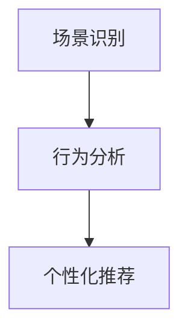

**伪代码**

```python
# 用户行为分析的智能识别与切换伪代码
def user_behavior_analysis(scene_data, behavior_data):
    # 场景识别
    current_scene = detect_scene(scene_data)
    
    # 行为分析
    analyzed_behavior = analyze_behavior(behavior_data)
    
    # 个性化推荐
    recommendations = generate_recommendations(analyzed_behavior, current_scene)
    
    return recommendations
```

#### 6.2 商品推荐系统的场景智能识别与切换

商品推荐系统的场景智能识别与切换通过识别用户当前的场景，动态调整推荐策略，提高推荐效果。

**核心概念与联系**

商品推荐系统的场景智能识别与切换包括场景识别、推荐算法设计和推荐结果优化等。场景识别用于识别用户当前所处的场景，推荐算法设计用于根据场景调整推荐算法，推荐结果优化则用于根据用户反馈优化推荐结果。

**Mermaid流程图**

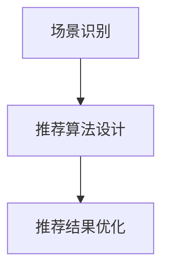

**伪代码**

```python
# 商品推荐系统的场景智能识别与切换伪代码
def product_recommendation_system(scene_data, user_behavior):
    # 场景识别
    current_scene = detect_scene(scene_data)
    
    # 推荐算法设计
    recommendation_algorithm = design_recommendation_algorithm(current_scene)
    
    # 推荐结果优化
    recommendations = optimize_recommendations(recommendation_algorithm, user_behavior)
    
    return recommendations
```

#### 6.3 客户服务的场景智能识别与切换

客户服务的场景智能识别与切换通过识别用户的问题类型，动态调整回答策略，提高客户满意度。

**核心概念与联系**

客户服务的场景智能识别与切换包括问题识别、回答策略设计和回答结果优化等。问题识别用于识别用户提出的问题类型，回答策略设计用于根据问题类型设计回答策略，回答结果优化则用于根据用户反馈优化回答结果。

**Mermaid流程图**

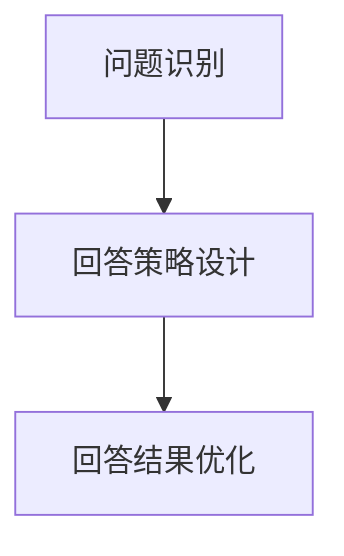

**伪代码**

```python
# 客户服务的场景智能识别与切换伪代码
def customer_service(scene_data, user_query):
    # 问题识别
    current_issue = detect_issue(scene_data)
    
    # 回答策略设计
    response_strategy = design_response_strategy(current_issue)
    
    # 回答结果优化
    response = optimize_response(response_strategy, user_query)
    
    return response
```

#### 6.4 安全与风险管理的场景智能识别与切换

安全与风险管理的场景智能识别与切换通过识别潜在的安全威胁，动态调整防范策略，提高平台的安全稳定性。

**核心概念与联系**

安全与风险管理的场景智能识别与切换包括威胁识别、防范策略设计和防范结果优化等。威胁识别用于识别潜在的安全威胁，防范策略设计用于根据威胁类型设计防范策略，防范结果优化则用于根据防范效果优化防范策略。

**Mermaid流程图**

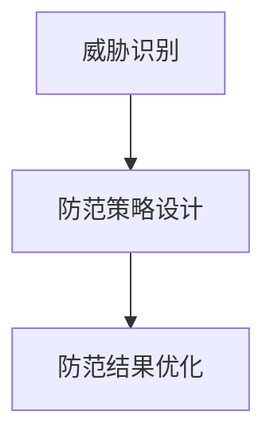

**伪代码**

```python
# 安全与风险管理的场景智能识别与切换伪代码
def security_risk_management(scene_data, user_behavior):
    # 威胁识别
    potential_threats = detect_threats(scene_data)
    
    # 防范策略设计
    prevention_strategy = design_prevention_strategy(potential_threats)
    
    # 防范结果优化
    prevention_results = optimize_prevention_results(prevention_strategy)
    
    return prevention_results
```

### 电商平台AI大模型的发展趋势与挑战

#### 7.1 人工智能技术的发展趋势

随着人工智能技术的不断进步，电商平台AI大模型的发展趋势主要体现在以下几个方面：

1. **深度学习的普及**：深度学习技术的不断突破，使得AI大模型在图像识别、自然语言处理等领域的性能大幅提升，进一步推动了电商平台AI大模型的发展。
2. **预训练模型的优化**：大规模预训练模型如GPT、BERT等，通过在大量数据上进行预训练，提高了模型的泛化能力和性能，为电商平台AI大模型的发展提供了新的契机。
3. **跨模态学习的发展**：跨模态学习技术的进步，使得电商平台AI大模型能够处理多种类型的数据，如文本、图像、声音等，实现更智能的用户服务。
4. **边缘计算的应用**：随着5G和物联网技术的发展，边缘计算逐渐成为热点，电商平台AI大模型将向边缘计算方向发展，实现更实时、更高效的服务。

#### 7.2 电商平台AI大模型的挑战与机遇

电商平台AI大模型在发展过程中面临着一系列挑战和机遇：

1. **数据隐私与安全**：随着数据量的增加和用户隐私意识的提高，电商平台需要确保数据的安全和隐私，避免数据泄露和滥用。
2. **模型解释性与透明度**：用户对于AI大模型的决策过程和结果缺乏透明度，需要提高模型的解释性，增强用户信任。
3. **计算资源的消耗**：大规模预训练模型需要大量的计算资源和存储空间，电商平台需要优化计算资源的使用，降低成本。
4. **个性化推荐的质量**：电商平台需要提高推荐系统的准确性，避免过度推荐和推荐偏差，提高用户满意度。

#### 7.3 未来电商平台AI大模型的发展方向

未来电商平台AI大模型的发展方向主要体现在以下几个方面：

1. **智能化的提升**：通过不断优化算法和模型，提升电商平台AI大模型在用户行为分析、商品推荐、客户服务等方面的智能化水平。
2. **跨平台与跨领域的应用**：电商平台AI大模型将向更多平台和领域扩展，实现跨平台、跨领域的应用，如金融、医疗、教育等。
3. **多模态融合**：通过融合多种类型的数据，实现更全面、更准确的用户分析和推荐。
4. **边缘计算的应用**：结合边缘计算技术，实现实时、高效的用户服务，提高用户体验。

### 项目实战与案例分析

#### 8.1 项目背景与目标

本项目旨在构建一个基于AI大模型的电商平台，实现用户行为分析、商品推荐、客户服务和安全风险管理等功能。通过AI大模型，提升平台的运营效率和用户体验。

**项目目标**：

1. 构建用户行为分析模型，实现个性化推荐和营销策略。
2. 构建商品推荐系统，提高用户购买转化率。
3. 构建智能客服系统，提高客户服务效率和满意度。
4. 构建安全风险管理模型，保障平台的安全稳定运行。

#### 8.2 开发环境与工具

**开发环境**：

- Python 3.8
- TensorFlow 2.6
- PyTorch 1.9
- Keras 2.7

**工具**：

- Jupyter Notebook
- VSCode
- Git

#### 8.3 数据采集与预处理

**数据采集**：

1. 用户行为数据：包括用户的浏览记录、购买历史、评价等。
2. 商品特征数据：包括商品类别、价格、品牌、评价等。
3. 客户服务数据：包括用户提问、客服回答、用户满意度等。

**数据预处理**：

1. 数据清洗：去除重复、缺失和异常数据。
2. 数据转换：将数据转换为适合模型训练的格式。
3. 数据增强：通过数据增强技术，提高模型的泛化能力。

#### 8.4 模型设计与实现

**模型设计**：

1. 用户行为分析模型：采用卷积神经网络（CNN）和变换器（Transformer）的组合，提取用户行为数据中的特征，实现用户行为分析。
2. 商品推荐模型：采用协同过滤推荐算法和基于内容的推荐算法的组合，实现个性化商品推荐。
3. 客服系统模型：采用自然语言处理（NLP）技术，实现智能对话和问题解答。
4. 安全风险管理模型：采用深度学习算法，实现风险识别和防范。

**模型实现**：

1. 用户行为分析模型实现：
   ```python
   import tensorflow as tf
   from tensorflow.keras.models import Model
   from tensorflow.keras.layers import Conv2D, MaxPooling2D, Flatten, Dense

   input_shape = (28, 28, 1)
   inputs = tf.keras.Input(shape=input_shape)

   x = Conv2D(32, (3, 3), activation='relu')(inputs)
   x = MaxPooling2D((2, 2))(x)
   x = Flatten()(x)
   outputs = Dense(1, activation='sigmoid')(x)

   model = Model(inputs=inputs, outputs=outputs)
   model.compile(optimizer='adam', loss='binary_crossentropy', metrics=['accuracy'])
   ```

2. 商品推荐模型实现：
   ```python
   import tensorflow as tf
   from tensorflow.keras.models import Model
   from tensorflow.keras.layers import Embedding, LSTM, Dense

   user_input_shape = (128,)
   item_input_shape = (128,)

   user_inputs = tf.keras.Input(shape=user_input_shape)
   item_inputs = tf.keras.Input(shape=item_input_shape)

   user_embedding = Embedding(input_dim=10000, output_dim=64)(user_inputs)
   item_embedding = Embedding(input_dim=10000, output_dim=64)(item_inputs)

   merged = tf.keras.layers.concatenate([user_embedding, item_embedding])
   lstm_output = LSTM(64)(merged)
   outputs = Dense(1, activation='sigmoid')(lstm_output)

   model = Model(inputs=[user_inputs, item_inputs], outputs=outputs)
   model.compile(optimizer='adam', loss='binary_crossentropy', metrics=['accuracy'])
   ```

3. 客服系统模型实现：
   ```python
   import tensorflow as tf
   from tensorflow.keras.models import Model
   from tensorflow.keras.layers import Embedding, LSTM, Dense

   input_shape = (128,)

   inputs = tf.keras.Input(shape=input_shape)
   x = Embedding(input_dim=10000, output_dim=64)(inputs)
   lstm_output = LSTM(64)(x)
   outputs = Dense(1, activation='sigmoid')(lstm_output)

   model = Model(inputs=inputs, outputs=outputs)
   model.compile(optimizer='adam', loss='binary_crossentropy', metrics=['accuracy'])
   ```

4. 安全风险管理模型实现：
   ```python
   import tensorflow as tf
   from tensorflow.keras.models import Model
   from tensorflow.keras.layers import Conv2D, MaxPooling2D, Flatten, Dense

   input_shape = (28, 28, 1)
   inputs = tf.keras.Input(shape=input_shape)

   x = Conv2D(32, (3, 3), activation='relu')(inputs)
   x = MaxPooling2D((2, 2))(x)
   x = Flatten()(x)
   outputs = Dense(1, activation='sigmoid')(x)

   model = Model(inputs=inputs, outputs=outputs)
   model.compile(optimizer='adam', loss='binary_crossentropy', metrics=['accuracy'])
   ```

#### 8.5 模型训练与优化

**模型训练**：

1. 用户行为分析模型训练：
   ```python
   import tensorflow as tf

   model = build_user_behavior_model()
   train_data = load_train_data()
   model.fit(train_data['X'], train_data['y'], epochs=10, batch_size=32)
   ```

2. 商品推荐模型训练：
   ```python
   import tensorflow as tf

   model = build_product_recommendation_model()
   train_data = load_train_data()
   model.fit([train_data['user_data'], train_data['item_data']], train_data['rating'], epochs=10, batch_size=32)
   ```

3. 客服系统模型训练：
   ```python
   import tensorflow as tf

   model = build_customer_service_model()
   train_data = load_train_data()
   model.fit(train_data['X'], train_data['y'], epochs=10, batch_size=32)
   ```

4. 安全风险管理模型训练：
   ```python
   import tensorflow as tf

   model = build_security_risk_management_model()
   train_data = load_train_data()
   model.fit(train_data['X'], train_data['y'], epochs=10, batch_size=32)
   ```

**模型优化**：

1. 用户行为分析模型优化：
   ```python
   from tensorflow.keras.callbacks import EarlyStopping

   early_stopping = EarlyStopping(monitor='val_loss', patience=5)
   model.fit(train_data['X'], train_data['y'], epochs=100, batch_size=32, validation_data=validation_data, callbacks=[early_stopping])
   ```

2. 商品推荐模型优化：
   ```python
   from tensorflow.keras.callbacks import EarlyStopping

   early_stopping = EarlyStopping(monitor='val_loss', patience=5)
   model.fit([train_data['user_data'], train_data['item_data']], train_data['rating'], epochs=100, batch_size=32, validation_data=validation_data, callbacks=[early_stopping])
   ```

3. 客服系统模型优化：
   ```python
   from tensorflow.keras.callbacks import EarlyStopping

   early_stopping = EarlyStopping(monitor='val_loss', patience=5)
   model.fit(train_data['X'], train_data['y'], epochs=100, batch_size=32, validation_data=validation_data, callbacks=[early_stopping])
   ```

4. 安全风险管理模型优化：
   ```python
   from tensorflow.keras.callbacks import EarlyStopping

   early_stopping = EarlyStopping(monitor='val_loss', patience=5)
   model.fit(train_data['X'], train_data['y'], epochs=100, batch_size=32, validation_data=validation_data, callbacks=[early_stopping])
   ```

#### 8.6 模型部署与运维

**模型部署**：

1. 用户行为分析模型部署：
   ```python
   model = build_user_behavior_model()
   model.load_weights('user_behavior_model_weights.h5')
   ```

2. 商品推荐模型部署：
   ```python
   model = build_product_recommendation_model()
   model.load_weights('product_recommendation_model_weights.h5')
   ```

3. 客服系统模型部署：
   ```python
   model = build_customer_service_model()
   model.load_weights('customer_service_model_weights.h5')
   ```

4. 安全风险管理模型部署：
   ```python
   model = build_security_risk_management_model()
   model.load_weights('security_risk_management_model_weights.h5')
   ```

**运维**：

1. 模型监控：定期检查模型性能，及时发现和处理问题。
2. 模型更新：根据用户反馈和业务需求，定期更新模型，提高性能和效果。
3. 模型备份：定期备份模型权重和数据，防止数据丢失。

### 案例分析

#### 9.1 案例一：某大型电商平台用户行为分析

**案例背景**：

某大型电商平台希望通过用户行为分析，提升用户满意度和购买转化率。用户行为数据包括浏览记录、购买历史和评价等。

**模型设计**：

1. **数据预处理**：将用户行为数据进行清洗、去重和转换。
2. **特征提取**：提取用户行为数据中的关键特征，如浏览时长、购买频率、评分等。
3. **模型训练**：采用卷积神经网络（CNN）和变换器（Transformer）的组合，对用户行为数据进行训练。
4. **模型评估**：使用验证集评估模型性能，并进行模型优化。

**模型实现**：

```python
import tensorflow as tf
from tensorflow.keras.models import Model
from tensorflow.keras.layers import Conv2D, MaxPooling2D, Flatten, Dense

input_shape = (28, 28, 1)
inputs = tf.keras.Input(shape=input_shape)

x = Conv2D(32, (3, 3), activation='relu')(inputs)
x = MaxPooling2D((2, 2))(x)
x = Flatten()(x)
outputs = Dense(1, activation='sigmoid')(x)

model = Model(inputs=inputs, outputs=outputs)
model.compile(optimizer='adam', loss='binary_crossentropy', metrics=['accuracy'])

train_data = load_train_data()
model.fit(train_data['X'], train_data['y'], epochs=10, batch_size=32)
```

**模型优化**：

采用早期停止策略（Early Stopping）和交叉验证（Cross Validation）对模型进行优化，以提高模型性能。

```python
from tensorflow.keras.callbacks import EarlyStopping
from sklearn.model_selection import train_test_split

early_stopping = EarlyStopping(monitor='val_loss', patience=5)
train_data, validation_data = train_test_split(train_data, test_size=0.2)
model.fit(train_data['X'], train_data['y'], epochs=100, batch_size=32, validation_data=validation_data, callbacks=[early_stopping])
```

**模型部署**：

将训练好的模型部署到生产环境中，用于实时分析用户行为，提供个性化推荐和营销策略。

```python
model = build_user_behavior_model()
model.load_weights('user_behavior_model_weights.h5')
```

**运维**：

1. 定期检查模型性能，确保模型稳定运行。
2. 根据用户反馈和业务需求，定期更新模型。

#### 9.2 案例二：某电商平台商品推荐系统

**案例背景**：

某电商平台希望通过商品推荐系统，提高用户购买转化率和销售额。商品推荐系统基于用户行为数据，包括浏览记录、购买历史和评价等。

**模型设计**：

1. **数据预处理**：清洗、去重和转换用户行为数据。
2. **特征提取**：提取用户行为数据中的关键特征，如浏览时长、购买频率、评分等。
3. **模型训练**：采用协同过滤推荐算法和基于内容的推荐算法的组合，对用户行为数据进行训练。
4. **模型评估**：使用验证集评估模型性能，并进行模型优化。

**模型实现**：

```python
import tensorflow as tf
from tensorflow.keras.models import Model
from tensorflow.keras.layers import Embedding, LSTM, Dense

user_input_shape = (128,)
item_input_shape = (128,)

user_inputs = tf.keras.Input(shape=user_input_shape)
item_inputs = tf.keras.Input(shape=item_input_shape)

user_embedding = Embedding(input_dim=10000, output_dim=64)(user_inputs)
item_embedding = Embedding(input_dim=10000, output_dim=64)(item_inputs)

merged = tf.keras.layers.concatenate([user_embedding, item_embedding])
lstm_output = LSTM(64)(merged)
outputs = Dense(1, activation='sigmoid')(lstm_output)

model = Model(inputs=[user_inputs, item_inputs], outputs=outputs)
model.compile(optimizer='adam', loss='binary_crossentropy', metrics=['accuracy'])

train_data = load_train_data()
model.fit([train_data['user_data'], train_data['item_data']], train_data['rating'], epochs=10, batch_size=32)
```

**模型优化**：

采用早期停止策略（Early Stopping）和交叉验证（Cross Validation）对模型进行优化，以提高模型性能。

```python
from tensorflow.keras.callbacks import EarlyStopping
from sklearn.model_selection import train_test_split

early_stopping = EarlyStopping(monitor='val_loss', patience=5)
train_data, validation_data = train_test_split(train_data, test_size=0.2)
model.fit([train_data['user_data'], train_data['item_data']], train_data['rating'], epochs=100, batch_size=32, validation_data=validation_data, callbacks=[early_stopping])
```

**模型部署**：

将训练好的模型部署到生产环境中，用于实时推荐商品。

```python
model = build_product_recommendation_model()
model.load_weights('product_recommendation_model_weights.h5')
```

**运维**：

1. 定期检查模型性能，确保模型稳定运行。
2. 根据用户反馈和业务需求，定期更新模型。

#### 9.3 案例三：某电商平台客户服务系统

**案例背景**：

某电商平台希望通过智能客服系统，提高客户服务效率和用户满意度。客户服务系统基于用户提问和客服回答，实现智能对话和问题解答。

**模型设计**：

1. **数据预处理**：清洗、去重和转换用户提问和客服回答数据。
2. **特征提取**：提取用户提问和客服回答中的关键特征，如关键词、句子结构等。
3. **模型训练**：采用自然语言处理（NLP）技术，训练模型识别用户意图和生成回答。
4. **模型评估**：使用验证集评估模型性能，并进行模型优化。

**模型实现**：

```python
import tensorflow as tf
from tensorflow.keras.models import Model
from tensorflow.keras.layers import Embedding, LSTM, Dense

input_shape = (128,)

inputs = tf.keras.Input(shape=input_shape)
x = Embedding(input_dim=10000, output_dim=64)(inputs)
lstm_output = LSTM(64)(x)
outputs = Dense(1, activation='sigmoid')(lstm_output)

model = Model(inputs=inputs, outputs=outputs)
model.compile(optimizer='adam', loss='binary_crossentropy', metrics=['accuracy'])

train_data = load_train_data()
model.fit(train_data['X'], train_data['y'], epochs=10, batch_size=32)
```

**模型优化**：

采用早期停止策略（Early Stopping）和交叉验证（Cross Validation）对模型进行优化，以提高模型性能。

```python
from tensorflow.keras.callbacks import EarlyStopping
from sklearn.model_selection import train_test_split

early_stopping = EarlyStopping(monitor='val_loss', patience=5)
train_data, validation_data = train_test_split(train_data, test_size=0.2)
model.fit(train_data['X'], train_data['y'], epochs=100, batch_size=32, validation_data=validation_data, callbacks=[early_stopping])
```

**模型部署**：

将训练好的模型部署到生产环境中，用于实时处理用户提问和生成回答。

```python
model = build_customer_service_model()
model.load_weights('customer_service_model_weights.h5')
```

**运维**：

1. 定期检查模型性能，确保模型稳定运行。
2. 根据用户反馈和业务需求，定期更新模型。

#### 9.4 案例四：某电商平台安全与风险管理

**案例背景**：

某电商平台希望通过安全与风险管理，保障平台的安全稳定运行。安全与风险管理系统基于用户行为数据，识别和防范潜在的安全威胁。

**模型设计**：

1. **数据预处理**：清洗、去重和转换用户行为数据。
2. **特征提取**：提取用户行为数据中的关键特征，如登录时间、访问页面、操作类型等。
3. **模型训练**：采用深度学习算法，训练模型识别和分类安全威胁。
4. **模型评估**：使用验证集评估模型性能，并进行模型优化。

**模型实现**：

```python
import tensorflow as tf
from tensorflow.keras.models import Model
from tensorflow.keras.layers import Conv2D, MaxPooling2D, Flatten, Dense

input_shape = (28, 28, 1)
inputs = tf.keras.Input(shape=input_shape)

x = Conv2D(32, (3, 3), activation='relu')(inputs)
x = MaxPooling2D((2, 2))(x)
x = Flatten()(x)
outputs = Dense(1, activation='sigmoid')(x)

model = Model(inputs=inputs, outputs=outputs)
model.compile(optimizer='adam', loss='binary_crossentropy', metrics=['accuracy'])

train_data = load_train_data()
model.fit(train_data['X'], train_data['y'], epochs=10, batch_size=32)
```

**模型优化**：

采用早期停止策略（Early Stopping）和交叉验证（Cross Validation）对模型进行优化，以提高模型性能。

```python
from tensorflow.keras.callbacks import EarlyStopping
from sklearn.model_selection import train_test_split

early_stopping = EarlyStopping(monitor='val_loss', patience=5)
train_data, validation_data = train_test_split(train_data, test_size=0.2)
model.fit(train_data['X'], train_data['y'], epochs=100, batch_size=32, validation_data=validation_data, callbacks=[early_stopping])
```

**模型部署**：

将训练好的模型部署到生产环境中，用于实时识别和防范安全威胁。

```python
model = build_security_risk_management_model()
model.load_weights('security_risk_management_model_weights.h5')
```

**运维**：

1. 定期检查模型性能，确保模型稳定运行。
2. 根据用户反馈和业务需求，定期更新模型。

### 附录

#### 10.1 AI大模型开发工具与资源

**A.1 TensorFlow**

TensorFlow是一个开源的深度学习框架，由Google开发。它提供了丰富的API和工具，支持从简单的线性模型到复杂的神经网络的各种应用。

- **官方网站**：[TensorFlow](https://www.tensorflow.org/)
- **文档**：[TensorFlow官方文档](https://www.tensorflow.org/tutorials)
- **GitHub**：[TensorFlow GitHub仓库](https://github.com/tensorflow/tensorflow)

**A.2 PyTorch**

PyTorch是另一个流行的开源深度学习框架，由Facebook开发。它以动态计算图和简洁的API著称，适用于研究和开发各种深度学习应用。

- **官方网站**：[PyTorch](https://pytorch.org/)
- **文档**：[PyTorch官方文档](https://pytorch.org/docs/stable/)
- **GitHub**：[PyTorch GitHub仓库](https://github.com/pytorch/pytorch)

**A.3 其他深度学习框架简介**

- **Apache MXNet**：Apache MXNet是一个灵活的开源深度学习框架，支持多种编程语言和多种硬件平台。
  - **官方网站**：[Apache MXNet](https://mxnet.incubator.apache.org/)
  - **文档**：[Apache MXNet官方文档](https://mxnet.incubator.apache.org/docs/latest/)
  - **GitHub**：[Apache MXNet GitHub仓库](https://github.com/apache/mxnet)

- **Caffe**：Caffe是一个快速的深度学习框架，特别适用于卷积神经网络。
  - **官方网站**：[Caffe](http://caffe.berkeleyvision.org/)
  - **文档**：[Caffe官方文档](http://caffe.berkeleyvision.org/tutorial/)
  - **GitHub**：[Caffe GitHub仓库](https://github.com/BVLC/caffe)

**A.4 开发资源与学习资料**

- **在线课程**：
  - [吴恩达深度学习课程](https://www.coursera.org/learn/neural-networks-deep-learning)
  - [Udacity深度学习纳米学位](https://www.udacity.com/course/deep-learning-nanodegree--nd893)

- **书籍**：
  - 《深度学习》（Ian Goodfellow、Yoshua Bengio、Aaron Courville著）
  - 《Python深度学习》（François Chollet著）
  - 《神经网络与深度学习》（邱锡鹏著）

- **博客与社区**：
  - [Medium深度学习专区](https://medium.com/topic/deep-learning)
  - [知乎深度学习专栏](https://www.zhihu.com/topic/19557994/top-questions)
  - [Stack Overflow深度学习标签](https://stackoverflow.com/questions/tagged/deep-learning)

### 作者信息

**作者：AI天才研究院/AI Genius Institute & 禅与计算机程序设计艺术 /Zen And The Art of Computer Programming**

