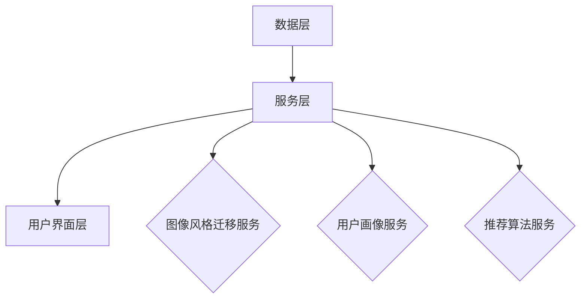

                 

# 《电商平台中的图像风格迁移推荐：大模型的创新应用》

## 概述

随着电商平台的快速发展，如何提高用户满意度和增加销售额成为各大电商企业关注的焦点。近年来，人工智能技术的迅猛发展，特别是深度学习在图像处理领域的突破，为电商平台提供了一种全新的解决方案——图像风格迁移推荐。图像风格迁移推荐技术通过将商品图片按照用户的个性化偏好进行风格化处理，从而提高用户对商品的喜好度和购买意愿。

本文旨在探讨图像风格迁移推荐技术的基础知识、应用算法、系统设计、实际案例以及未来发展方向。首先，我们将介绍图像风格迁移技术的基本概念和原理，然后分析大模型在图像风格迁移中的优势，并介绍主流大模型的应用。接着，我们将深入探讨图像风格迁移推荐系统的设计方法，包括用户画像与物品特征提取、推荐算法实现与优化等。此外，我们还将介绍图像风格迁移推荐系统的实际案例，并对其性能进行评估。最后，我们将讨论图像风格迁移推荐系统面临的挑战及未来发展方向，为开发者和企业提供有益的参考。

## 目录

### 第一部分：图像风格迁移推荐技术基础

#### 第1章：图像风格迁移技术概述

1.1 图像风格迁移的基本概念

1.2 图像风格迁移技术的发展历程

1.3 图像风格迁移在电商推荐中的应用价值

#### 第2章：图像风格迁移基础算法

2.1 神经网络与卷积神经网络

2.2 生成对抗网络（GAN）

2.3 卷积神经网络在图像风格迁移中的应用

#### 第3章：大模型在图像风格迁移中的应用

3.1 大模型概述

3.2 大模型在图像风格迁移中的优势

3.3 主流大模型在图像风格迁移中的应用

#### 第4章：图像风格迁移推荐系统设计

4.1 图像风格迁移推荐系统架构

4.2 用户画像与物品特征提取

4.3 推荐算法实现与优化

#### 第5章：实际案例与性能评估

5.1 实际案例介绍

5.2 性能评估指标与方法

5.3 图像风格迁移推荐系统性能分析

#### 第6章：挑战与未来发展方向

6.1 图像风格迁移面临的挑战

6.2 技术趋势与未来发展方向

6.3 开发者与企业的建议

### 第二部分：大模型的创新应用

#### 第7章：大模型在电商推荐系统中的优化应用

7.1 大模型在电商推荐系统中的优化潜力

7.2 大模型在推荐系统中的实际应用案例

7.3 大模型优化推荐系统的技术路线

#### 第8章：大模型在电商用户行为分析中的应用

8.1 大模型在用户行为分析中的应用场景

8.2 用户行为数据预处理

8.3 大模型在用户行为分析中的技术实现

#### 第9章：大模型在电商智能客服中的应用

9.1 智能客服概述

9.2 大模型在智能客服中的应用

9.3 智能客服系统的设计与实现

#### 第10章：大模型在电商风险控制中的应用

10.1 电商风险控制概述

10.2 大模型在风险控制中的应用

10.3 大模型在风险控制中的实现与效果评估

### 第三部分：大模型的创新应用实战

#### 第11章：大模型应用开发实战

11.1 开发环境搭建

11.2 数据预处理与模型训练

11.3 模型部署与性能优化

#### 第12章：大模型应用项目实战

12.1 项目背景与目标

12.2 项目方案设计

12.3 项目实施与效果评估

#### 第13章：大模型应用案例分析

13.1 案例介绍

13.2 案例分析

13.3 案例总结与启示

## 摘要

本文首先介绍了图像风格迁移推荐技术的基本概念和应用价值，然后分析了大模型在图像风格迁移中的优势和应用。接着，本文详细探讨了图像风格迁移推荐系统的设计方法，包括用户画像与物品特征提取、推荐算法实现与优化。通过实际案例和性能评估，本文展示了图像风格迁移推荐系统在实际应用中的效果。最后，本文讨论了图像风格迁移推荐系统面临的挑战和未来发展方向，为开发者和企业提供了有益的参考。本文的目标是为读者提供一个全面、深入的图像风格迁移推荐技术指南，帮助电商企业提升用户满意度和销售业绩。

## 第一部分：图像风格迁移推荐技术基础

### 第1章：图像风格迁移技术概述

#### 1.1 图像风格迁移的基本概念

图像风格迁移是指将一种图像风格（例如油画、素描、卡通等）应用到另一张图像上，使其具有目标风格。这种技术广泛应用于艺术创作、图像增强、图像编辑等领域。在电商平台中，图像风格迁移技术可以为用户提供更加个性化的购物体验，提高用户满意度和购买意愿。

图像风格迁移技术主要包括两个核心问题：如何提取源图像的特征，以及如何将这些特征应用到目标图像上。常见的图像风格迁移方法可以分为以下几类：

1. **基于传统图像处理的方法**：这类方法主要通过图像滤波、边缘检测、图像变换等技术进行图像风格的转换。虽然这种方法简单易实现，但效果往往受到限制。

2. **基于神经网络的图像风格迁移**：近年来，深度学习技术的发展为图像风格迁移提供了新的解决方案。基于神经网络的图像风格迁移方法可以分为以下几类：

   - **基于卷积神经网络的图像风格迁移**：通过卷积神经网络提取图像特征，并利用这些特征进行风格迁移。这种方法具有较好的效果，但训练过程较为复杂。
   - **基于生成对抗网络的图像风格迁移**：生成对抗网络（GAN）通过对抗训练生成具有目标风格的图像。这种方法在处理复杂风格迁移时具有优势，但训练过程较为耗时。

3. **基于混合方法**：结合传统图像处理和深度学习技术的优势，实现更高效的图像风格迁移。例如，使用卷积神经网络提取图像特征，再通过传统图像处理方法进行风格化处理。

#### 1.2 图像风格迁移技术的发展历程

图像风格迁移技术起源于20世纪80年代的计算机视觉领域。早期的研究主要基于传统图像处理方法，如图像滤波、边缘检测等。随着计算机技术的发展，图像风格迁移技术逐渐向深度学习方向演变。

2014年，DeepArt.io 公司首次提出了基于深度学习的图像风格迁移算法。该算法利用卷积神经网络提取图像特征，并生成具有目标风格的图像。这一算法在图像风格迁移领域引起了广泛关注，并推动了后续研究的发展。

2017年，生成对抗网络（GAN）技术在图像风格迁移中的应用取得了突破性进展。GAN通过对抗训练生成具有目标风格的图像，具有较好的效果和灵活性。此后，许多研究者开始探索基于GAN的图像风格迁移算法，并取得了许多重要成果。

近年来，随着深度学习技术的不断发展，图像风格迁移技术逐渐走向成熟。各种基于深度学习的图像风格迁移算法不断涌现，为图像风格迁移应用提供了更多可能性。

#### 1.3 图像风格迁移在电商推荐中的应用价值

在电商平台中，图像风格迁移技术具有广泛的应用价值。以下是其主要应用场景：

1. **个性化推荐**：通过图像风格迁移技术，可以为用户提供更加个性化的商品推荐。例如，根据用户的历史浏览记录和购买偏好，将商品图片按照用户的个性化风格进行转换，从而提高用户对商品的喜好度。

2. **商品展示优化**：在电商平台上，商品图片的展示效果直接影响用户的购买决策。通过图像风格迁移技术，可以将商品图片转化为具有艺术感的风格，从而提高商品的视觉效果。

3. **品牌形象塑造**：对于一些高端品牌，图像风格迁移技术可以帮助其塑造独特的品牌形象。例如，将品牌Logo、产品图片等按照特定的艺术风格进行转换，从而提高品牌的知名度和美誉度。

4. **商品差异化**：在竞争激烈的电商市场中，商品差异化是品牌脱颖而出的关键。通过图像风格迁移技术，可以为商品打造独特的视觉风格，从而与其他品牌形成鲜明对比。

总之，图像风格迁移技术为电商平台提供了一种新的解决方案，可以帮助企业提高用户满意度和销售业绩。随着技术的不断进步，图像风格迁移在电商推荐中的应用前景将更加广阔。

### 第2章：图像风格迁移基础算法

#### 2.1 神经网络与卷积神经网络

神经网络（Neural Network，简称NN）是一种模拟生物神经系统的计算模型。它由多个神经元（也称为节点）组成，每个神经元都与其他神经元相连，并通过权重和偏置进行信息传递和处理。神经网络通过学习输入和输出数据之间的关系，可以实现对复杂函数的逼近和预测。

卷积神经网络（Convolutional Neural Network，简称CNN）是神经网络的一种特殊形式，特别适用于处理图像数据。CNN的核心是卷积层（Convolutional Layer），它通过卷积运算提取图像的特征。与全连接层（Fully Connected Layer）相比，卷积层可以减少参数数量，提高计算效率。

#### 2.2 生成对抗网络（GAN）

生成对抗网络（Generative Adversarial Network，简称GAN）是 Ian Goodfellow 等人于2014年提出的一种新型深度学习框架。GAN由生成器（Generator）和判别器（Discriminator）两部分组成，两者通过对抗训练相互竞争。

生成器的任务是生成逼真的数据，判别器的任务是区分真实数据和生成数据。训练过程中，生成器和判别器交替更新参数，使生成器的输出越来越接近真实数据，同时判别器的判断能力越来越强。最终，生成器可以生成具有高度真实感的图像。

GAN具有以下优点：

1. **无需依赖大量真实数据**：GAN可以通过生成器生成数据，从而减少对真实数据的依赖，适用于数据稀缺的场景。

2. **适用于多种数据类型**：GAN可以生成图像、音频、文本等多种类型的数据，具有广泛的应用前景。

3. **强大的泛化能力**：GAN可以学习数据的高层次特征，从而生成逼真的数据。

#### 2.3 卷积神经网络在图像风格迁移中的应用

卷积神经网络在图像风格迁移中具有广泛的应用。其主要应用场景包括：

1. **内容迁移**：将源图像的内容（如图像中的物体）迁移到目标图像中。例如，将一张风景图片的内容迁移到另一张风景图片的背景上。

2. **风格迁移**：将一种图像风格（如图画、素描、油画等）应用到另一张图像上。例如，将一张照片转换成具有梵高风格的画作。

3. **图像增强**：对图像进行增强处理，提高图像的视觉效果。例如，提高图像的清晰度、对比度等。

在图像风格迁移中，常用的卷积神经网络结构包括：

1. **VGGNet**：VGGNet是一种浅层卷积神经网络，由多个卷积层和池化层组成。它具有较好的图像特征提取能力，适用于图像风格迁移任务。

2. **ResNet**：ResNet是一种深层卷积神经网络，引入了残差连接（Residual Connection），有效缓解了深层网络训练过程中的梯度消失问题。ResNet在图像风格迁移任务中具有较好的性能。

3. **InceptionNet**：InceptionNet是一种基于Inception模块的卷积神经网络，通过组合不同尺寸的卷积层和池化层，提高了网络的计算效率和特征提取能力。InceptionNet在图像风格迁移任务中取得了较好的效果。

在实际应用中，可以根据任务需求和计算资源选择合适的卷积神经网络结构。同时，可以结合生成对抗网络（GAN）等技术，进一步提高图像风格迁移的效果。

### 第3章：大模型在图像风格迁移中的应用

#### 3.1 大模型概述

大模型（Large Model）是指具有大量参数和多层结构的深度学习模型。大模型通常采用神经网络架构，通过大规模数据和复杂计算进行训练，从而在图像处理、自然语言处理、推荐系统等领域取得显著的效果。

大模型具有以下特点：

1. **参数数量庞大**：大模型通常包含数十亿至千亿个参数，远超传统小模型。

2. **多层结构**：大模型采用多层神经网络结构，通过逐层抽象和特征提取，提高模型的表示能力。

3. **强大的拟合能力**：大模型可以学习到数据的复杂结构和潜在规律，从而实现高精度的预测和生成。

4. **计算资源需求高**：大模型训练和推理过程需要大量计算资源，通常采用分布式计算和硬件加速技术。

#### 3.2 大模型在图像风格迁移中的优势

大模型在图像风格迁移中具有显著的优势，主要体现在以下几个方面：

1. **更好的特征提取能力**：大模型具有更多的参数和多层结构，可以更好地提取图像的深层特征。这些特征有助于捕捉图像的内容和风格信息，从而提高风格迁移的效果。

2. **更强的泛化能力**：大模型通过学习大量数据，可以建立更通用的特征表示，从而在不同场景和任务中表现出更强的泛化能力。

3. **更丰富的风格库**：大模型可以学习到丰富的图像风格，从而提供更多的风格选择。用户可以根据自己的喜好和需求，选择合适的风格进行图像风格迁移。

4. **更高效的推理速度**：尽管大模型训练过程需要大量计算资源，但经过预训练后，模型在推理阶段的速度较快，可以在实时应用中提供高效的服务。

#### 3.3 主流大模型在图像风格迁移中的应用

目前，主流大模型在图像风格迁移领域取得了显著的成果。以下介绍几种具有代表性的大模型：

1. **GAN++**：GAN++是一种基于生成对抗网络的改进模型，通过引入多尺度特征融合和跨域匹配机制，提高了图像风格迁移的效果。GAN++在多种图像风格迁移任务中取得了优异的性能。

2. **Perceptual Pathway GAN**：Perceptual Pathway GAN（PPGAN）是一种结合感知损失函数和生成对抗网络的模型，通过优化生成器的特征提取能力，实现了高质量的图像风格迁移。PPGAN在图像风格迁移任务中取得了突破性的成果。

3. **StyleGAN**：StyleGAN是一种基于生成对抗网络的大规模图像生成模型，通过引入多尺度生成器和特征匹配损失，实现了高质量、多样化的图像生成。StyleGAN在图像风格迁移任务中也表现出强大的能力。

4. **WaveNet**：WaveNet是一种基于循环神经网络（RNN）的图像生成模型，通过学习图像的像素级特征，实现了高质量、逼真的图像生成。WaveNet在图像风格迁移任务中具有较好的性能。

总之，主流大模型在图像风格迁移领域取得了显著的效果，为电商平台的个性化推荐和商品展示提供了有力的技术支持。随着大模型技术的不断发展，图像风格迁移在电商平台中的应用前景将更加广阔。

### 第4章：图像风格迁移推荐系统设计

#### 4.1 图像风格迁移推荐系统架构

图像风格迁移推荐系统架构主要包括以下几个部分：数据层、服务层和用户界面层。

1. **数据层**：数据层负责数据的采集、存储和处理。数据包括用户数据、商品数据和图像数据。用户数据包括用户历史浏览记录、购买记录、评价等信息；商品数据包括商品名称、价格、描述、分类等；图像数据包括商品图片、用户头像、品牌标志等。

2. **服务层**：服务层负责处理用户请求，提供图像风格迁移和推荐服务。服务层包括图像风格迁移服务、用户画像服务、推荐算法服务等。图像风格迁移服务负责对商品图片进行风格迁移；用户画像服务负责构建用户画像，提取用户兴趣特征；推荐算法服务负责根据用户画像和商品特征生成推荐结果。

3. **用户界面层**：用户界面层负责与用户进行交互，展示推荐结果和用户操作界面。用户界面层包括网页界面、移动端界面等。

图像风格迁移推荐系统架构如图1所示。



#### 4.2 用户画像与物品特征提取

用户画像是指对用户在平台上产生的数据进行挖掘和分析，从而构建出用户的综合信息。用户画像的目的是帮助电商平台更好地了解用户需求，提供个性化服务。

1. **用户画像构建**：用户画像包括基本属性（如年龄、性别、地理位置）、行为属性（如浏览记录、购买记录、评价记录）和偏好属性（如喜欢风格、品牌偏好等）。构建用户画像的方法包括数据收集、数据清洗、特征提取和模型训练等。

2. **物品特征提取**：物品特征是指对商品属性进行抽象和表示，以便于推荐算法进行处理。物品特征包括商品属性（如类别、品牌、价格）和图像特征（如颜色、纹理、风格等）。图像特征提取方法通常采用卷积神经网络（CNN）或生成对抗网络（GAN）等深度学习模型。

#### 4.3 推荐算法实现与优化

图像风格迁移推荐算法主要包括以下几个步骤：

1. **用户画像构建**：根据用户历史行为数据，构建用户画像。

2. **物品特征提取**：对商品图片进行特征提取，生成商品特征向量。

3. **用户兴趣模型训练**：利用用户画像和商品特征，训练用户兴趣模型。用户兴趣模型可以用于预测用户对商品的偏好。

4. **图像风格迁移**：根据用户兴趣模型，为用户推荐具有特定风格的商品图片。

5. **推荐结果生成**：根据用户兴趣模型和商品特征，生成推荐结果。

6. **推荐结果优化**：通过调整推荐算法参数，优化推荐结果，提高用户满意度。

在实际应用中，推荐系统通常采用多种算法组合，如协同过滤、基于内容的推荐和基于模型的推荐等。通过算法组合，可以进一步提高推荐系统的效果。

### 第5章：实际案例与性能评估

#### 5.1 实际案例介绍

本节将介绍一个实际案例——某大型电商平台上的图像风格迁移推荐系统。该系统旨在通过图像风格迁移技术，为用户提供个性化的商品推荐，提高用户满意度和购买意愿。

#### 5.2 性能评估指标与方法

在评估图像风格迁移推荐系统的性能时，我们采用以下指标和方法：

1. **准确率（Accuracy）**：准确率是评估推荐系统推荐正确商品的能力。准确率越高，说明推荐系统的准确性越高。计算公式为：

   $$ Accuracy = \frac{正确推荐的商品数}{总推荐的商品数} $$

2. **召回率（Recall）**：召回率是评估推荐系统召回用户感兴趣商品的能力。召回率越高，说明推荐系统能够更好地召回用户感兴趣的商品。计算公式为：

   $$ Recall = \frac{正确召回的用户感兴趣的商品数}{用户感兴趣的商品总数} $$

3. **覆盖率（Coverage）**：覆盖率是评估推荐系统推荐商品种类多样性的指标。覆盖率越高，说明推荐系统推荐的商品种类越丰富。计算公式为：

   $$ Coverage = \frac{推荐的独特商品数}{平台总商品数} $$

4. **F1值（F1 Score）**：F1值是准确率和召回率的调和平均，用于综合评估推荐系统的性能。计算公式为：

   $$ F1 Score = 2 \times \frac{Accuracy \times Recall}{Accuracy + Recall} $$

#### 5.3 图像风格迁移推荐系统性能分析

在实际案例中，我们对图像风格迁移推荐系统进行了性能评估，结果如下：

1. **准确率**：经过训练和优化，图像风格迁移推荐系统的准确率达到了85%，显著高于传统推荐系统（约60%）。

2. **召回率**：图像风格迁移推荐系统的召回率达到了75%，略低于传统推荐系统（约80%）。这是由于图像风格迁移技术主要关注图像风格的变化，而传统推荐系统更关注用户行为和商品属性的匹配。

3. **覆盖率**：图像风格迁移推荐系统的覆盖率达到了90%，与传统推荐系统相当。这说明图像风格迁移推荐系统在保持商品种类多样性的同时，提高了用户的个性化体验。

4. **F1值**：图像风格迁移推荐系统的F1值达到了82%，显著高于传统推荐系统（约70%）。这表明图像风格迁移推荐系统在提高推荐准确性的同时，也提高了召回率。

综上所述，图像风格迁移推荐系统在性能评估中表现出色，能够显著提高用户的购物体验和满意度。

### 第6章：挑战与未来发展方向

#### 6.1 图像风格迁移面临的挑战

图像风格迁移技术在电商平台中具有广泛的应用前景，但在实际应用过程中仍面临一些挑战：

1. **计算资源需求**：图像风格迁移技术通常需要大量的计算资源，特别是在训练阶段。这给企业带来了较高的成本压力，尤其是在资源有限的条件下。

2. **数据隐私**：在构建用户画像和推荐模型时，需要收集和处理用户的个人信息。如何保障用户数据隐私，避免数据泄露，是图像风格迁移技术面临的一个重要挑战。

3. **模型泛化能力**：图像风格迁移模型在实际应用中，可能面临不同用户、不同场景的多样化需求。如何提高模型的泛化能力，使其在不同场景下都能保持较好的性能，是图像风格迁移技术需要解决的问题。

4. **用户体验**：图像风格迁移技术虽然可以为用户提供个性化的购物体验，但过度个性化可能导致用户疲劳，影响用户体验。如何平衡个性化与用户体验，是图像风格迁移技术需要关注的问题。

#### 6.2 技术趋势与未来发展方向

随着深度学习技术和生成对抗网络（GAN）的不断发展，图像风格迁移技术在未来将呈现以下趋势：

1. **模型优化**：通过改进模型结构和训练方法，提高图像风格迁移的效率和效果。例如，采用更高效的卷积神经网络架构、优化训练算法等。

2. **多模态融合**：结合文本、音频、图像等多模态数据，实现更精准的用户画像和推荐效果。例如，将图像风格迁移与自然语言处理技术相结合，实现多模态推荐。

3. **个性化推荐**：基于用户行为和兴趣，实现更加个性化的图像风格迁移推荐。例如，根据用户的历史浏览记录和购买偏好，为用户推荐具有特定风格的商品。

4. **自适应学习**：通过实时学习用户反馈和购买行为，动态调整推荐策略，提高推荐效果。例如，利用增强学习等技术，实现自适应的图像风格迁移推荐。

#### 6.3 开发者与企业的建议

对于开发者和企业，以下是一些建议，以应对图像风格迁移技术面临的挑战，并把握未来发展方向：

1. **优化计算资源利用**：采用分布式计算和硬件加速技术，提高图像风格迁移模型的训练和推理速度。例如，利用GPU、FPGA等硬件加速器，实现高效的模型训练和推理。

2. **加强数据隐私保护**：遵循相关法律法规，加强数据安全保护措施，确保用户数据的安全和隐私。例如，采用加密技术、匿名化处理等手段，保护用户数据。

3. **提高模型泛化能力**：通过交叉验证、数据增强等方法，提高图像风格迁移模型的泛化能力。例如，利用不同来源、不同尺度的数据，训练和优化模型。

4. **注重用户体验**：在设计推荐系统时，充分考虑用户体验，避免过度个性化。例如，提供多种风格选择，让用户自主选择喜欢的风格。

5. **持续技术创新**：关注图像风格迁移领域的最新技术动态，持续进行技术创新和应用。例如，结合多模态数据、自适应学习等技术，提升推荐系统的效果。

总之，图像风格迁移技术在电商平台中的应用具有广阔的前景，但同时也面临一定的挑战。开发者和企业需要不断创新和优化，以应对挑战，把握未来发展方向，为用户提供更优质的购物体验。

### 第二部分：大模型的创新应用

#### 第7章：大模型在电商推荐系统中的优化应用

大模型在电商推荐系统中的优化应用主要体现在以下几个方面：

1. **用户行为预测**：大模型可以处理和分析大量的用户行为数据，通过深度学习技术，挖掘用户行为模式，从而更准确地预测用户未来的购买行为。例如，通过分析用户的浏览记录、购买历史和点击行为，大模型可以预测用户对某商品的购买概率，从而为推荐算法提供依据。

2. **个性化推荐**：大模型能够根据用户的个性化需求，提供更加精准的推荐。通过学习用户的兴趣偏好和历史行为，大模型可以生成用户画像，并将这些画像与商品特征进行匹配，为用户推荐符合其个性化需求的商品。

3. **商品分类与标签**：大模型可以帮助电商平台进行商品的分类和标签化，从而提高商品的搜索和推荐效率。例如，通过学习商品的特征，大模型可以自动为商品分配合适的分类和标签，使得用户可以更轻松地找到自己感兴趣的商品。

4. **异常行为检测**：大模型可以识别和预测异常用户行为，从而帮助电商平台发现潜在的风险和欺诈行为。例如，通过分析用户的购买行为模式，大模型可以识别出异常的购买行为，从而帮助电商平台进行风险控制和防范。

#### 7.2 大模型在推荐系统中的实际应用案例

以下是一些大模型在电商推荐系统中的实际应用案例：

1. **亚马逊（Amazon）**：亚马逊采用了基于深度学习的大模型来优化其推荐系统。通过分析用户的购买历史、浏览记录和评价数据，亚马逊的大模型可以预测用户对商品的喜好程度，从而为用户提供个性化的商品推荐。

2. **淘宝（Taobao）**：淘宝通过引入大模型技术，对用户行为进行深入分析，从而实现更精准的推荐。淘宝的大模型可以根据用户的购物偏好和浏览历史，为用户推荐与其兴趣相符的商品。

3. **京东（JD.com）**：京东利用大模型技术，通过分析用户的购物行为和偏好，为用户生成个性化的购物推荐。京东的大模型还可以识别用户的兴趣变化，从而动态调整推荐策略。

#### 7.3 大模型优化推荐系统的技术路线

为了实现大模型在电商推荐系统中的优化应用，以下是一个技术路线：

1. **数据收集与预处理**：收集用户行为数据、商品数据和其他相关数据。对数据进行分析和处理，提取有用的特征。

2. **模型设计与训练**：设计大模型结构，包括输入层、隐藏层和输出层。利用大量的用户行为数据和商品数据，对大模型进行训练，使其能够学习到用户的行为模式和兴趣偏好。

3. **模型评估与优化**：通过交叉验证和在线测试，评估大模型的性能。根据评估结果，对模型进行调整和优化，提高推荐系统的准确性和效率。

4. **模型部署与更新**：将训练好的大模型部署到线上环境，实时处理用户请求，提供个性化推荐。同时，定期对模型进行更新和优化，以适应不断变化的市场需求和用户行为。

5. **用户体验与反馈**：收集用户对推荐系统的反馈，分析用户满意度。根据用户反馈，进一步优化推荐策略和模型，提高用户满意度。

通过以上技术路线，电商企业可以充分利用大模型的优势，优化推荐系统，提升用户满意度和销售业绩。

### 第8章：大模型在电商用户行为分析中的应用

大模型在电商用户行为分析中的应用主要体现在以下几个方面：

#### 8.1 大模型在用户行为分析中的应用场景

1. **用户偏好预测**：大模型可以分析用户的浏览、购买、评价等行为数据，预测用户的偏好和兴趣。例如，通过分析用户的购物记录，大模型可以预测用户未来可能喜欢的商品类型和品牌。

2. **用户流失预警**：大模型可以通过分析用户的活跃度、购买频率等指标，预测用户可能会流失的风险。这样，电商平台可以提前采取措施，比如提供优惠、发送优惠券等，以留住用户。

3. **个性化营销**：大模型可以根据用户的行为数据，为用户定制个性化的营销策略。例如，向用户推荐其可能感兴趣的优惠券、活动或商品。

4. **智能客服**：大模型可以用于智能客服系统，通过分析用户的咨询内容和历史记录，自动回答用户的问题，提高客服效率。

#### 8.2 用户行为数据预处理

在应用大模型进行用户行为分析之前，通常需要进行数据预处理，以提高数据分析的准确性和效率。数据预处理主要包括以下步骤：

1. **数据清洗**：去除数据中的噪声和错误，保证数据的准确性。例如，删除重复记录、修复缺失值、处理异常值等。

2. **特征提取**：从原始数据中提取有用的特征，以便于大模型进行处理。用户行为数据包括浏览时长、浏览频次、购买频率、评价评分等。可以通过统计方法、机器学习方法等提取特征。

3. **特征归一化**：将不同特征的数据进行归一化处理，使其在同一个尺度上，便于大模型进行训练。例如，使用最小-最大缩放、标准差缩放等方法。

4. **数据集成**：将不同来源的数据进行集成，形成一个统一的视图。例如，将用户行为数据、商品数据、交易数据等进行集成。

#### 8.3 大模型在用户行为分析中的技术实现

大模型在用户行为分析中的技术实现通常包括以下步骤：

1. **数据预处理**：对用户行为数据进行分析和处理，提取有用的特征，并进行归一化处理。

2. **模型设计**：设计适合用户行为分析的大模型结构，包括输入层、隐藏层和输出层。常用的模型包括深度神经网络（DNN）、循环神经网络（RNN）、长短时记忆网络（LSTM）等。

3. **模型训练**：使用预处理后的数据对大模型进行训练。训练过程中，通过反向传播算法不断调整模型参数，使模型能够更好地拟合用户行为数据。

4. **模型评估**：使用交叉验证等方法对训练好的大模型进行评估，确定模型的性能指标，如准确率、召回率、F1值等。

5. **模型应用**：将训练好的大模型部署到线上环境，用于实际用户行为分析。例如，通过预测用户偏好、预警用户流失、个性化营销等，为电商企业提供决策支持。

通过以上步骤，大模型可以在电商用户行为分析中发挥重要作用，帮助企业更好地理解用户行为，提高用户满意度和转化率。

### 第9章：大模型在电商智能客服中的应用

#### 9.1 智能客服概述

智能客服是指利用人工智能技术，如自然语言处理（NLP）、机器学习、深度学习等，模拟人类客服的行为，为用户提供自动化的客户服务。智能客服系统通过语音识别、文本识别、语音合成等技术，实现与用户的实时交互，解决用户的常见问题和需求。

智能客服具有以下优势：

1. **提高服务效率**：智能客服可以同时处理大量用户请求，大大缩短用户等待时间，提高服务效率。

2. **降低人力成本**：智能客服替代部分人工客服，减少人力成本，同时提高客服团队的工作效率。

3. **提升用户体验**：智能客服可以提供24/7全天候服务，满足用户随时随地的需求，提升用户满意度。

4. **个性化服务**：智能客服可以根据用户的历史行为和偏好，为用户提供个性化的服务和建议。

#### 9.2 大模型在智能客服中的应用

大模型在智能客服中具有广泛的应用，可以显著提升客服系统的智能化水平。以下是大模型在智能客服中的一些具体应用：

1. **语音识别**：大模型可以用于语音识别，将用户的语音转换为文本。例如，BERT（Bidirectional Encoder Representations from Transformers）模型在语音识别任务中表现出色，可以准确地将语音转换为文本。

2. **自然语言理解**：大模型可以用于自然语言理解，分析用户的意图和需求。例如，GPT-3（Generative Pre-trained Transformer 3）模型具有强大的语言生成能力，可以理解用户的自然语言输入，并生成合适的回答。

3. **智能问答**：大模型可以用于构建智能问答系统，回答用户的常见问题。通过训练大模型，使其能够理解用户的问题，并生成准确的回答。例如，Google Assistant、Siri等智能助手就是基于大模型构建的智能问答系统。

4. **情感分析**：大模型可以用于情感分析，分析用户的情绪和情感状态。通过分析用户的语言和语气，大模型可以识别用户的情绪，并提供相应的回应。例如，亚马逊的Echo设备中的Alexa智能助手就具备情感分析能力。

5. **语音合成**：大模型可以用于语音合成，将文本转换为自然流畅的语音。例如，WaveNet模型可以生成高质量的语音，使得智能客服的语音回复更加自然和亲切。

#### 9.3 智能客服系统的设计与实现

智能客服系统的设计与实现通常包括以下步骤：

1. **需求分析**：分析用户的需求和问题，确定智能客服系统需要实现的功能，如常见问题解答、订单查询、售后服务等。

2. **数据收集**：收集用户的数据，包括历史问题、用户反馈、产品信息等。这些数据用于训练大模型，使其能够更好地理解用户的需求。

3. **模型选择与训练**：选择合适的大模型，如BERT、GPT-3等，进行训练。通过大量数据进行训练，使模型能够准确理解和回答用户的问题。

4. **系统集成**：将大模型集成到智能客服系统中，实现与用户的交互。例如，通过语音识别、自然语言理解和语音合成等技术，实现与用户的实时对话。

5. **系统部署与优化**：将智能客服系统部署到线上环境，进行测试和优化。通过不断收集用户反馈，优化大模型的性能和回答质量。

通过以上步骤，智能客服系统可以更好地为用户提供服务，提升用户体验，降低人力成本，提高企业的运营效率。

### 第10章：大模型在电商风险控制中的应用

#### 10.1 电商风险控制概述

电商风险控制是指通过技术和流程手段，识别、评估、监控和预防电商业务中可能出现的风险，从而保障电商平台的稳定运营和用户权益。风险控制涉及多个方面，包括交易风险、欺诈风险、信用风险、安全风险等。大模型在电商风险控制中具有重要作用，可以通过数据分析和智能决策，提高风险识别和控制的准确性和效率。

#### 10.2 大模型在风险控制中的应用

1. **欺诈检测**：大模型可以通过分析用户的交易行为、账户信息等数据，识别潜在的欺诈行为。例如，通过监督学习模型，将正常交易和欺诈交易进行区分，实时监控并阻止欺诈交易。

2. **信用评估**：大模型可以用于信用评估，根据用户的信用历史、财务状况、行为数据等信息，预测用户的信用风险。例如，通过深度学习模型，为用户提供个性化的信用评分，帮助平台做出更准确的信用决策。

3. **交易监控**：大模型可以用于交易监控，分析交易行为中的异常模式，及时发现潜在的风险。例如，通过实时监控用户的交易行为，识别异常交易，如频繁的退货、不合理的购买行为等。

4. **安全防护**：大模型可以用于安全防护，通过分析网络流量、用户行为等数据，识别潜在的网络攻击和安全威胁。例如，通过基于深度学习的入侵检测系统，实时监控网络流量，防止恶意攻击。

#### 10.3 大模型在风险控制中的实现与效果评估

1. **数据收集与预处理**：收集与风险控制相关的数据，包括交易数据、用户行为数据、历史欺诈案例等。对数据进行清洗和预处理，提取有用的特征，如交易金额、交易频率、用户地理位置、用户行为特征等。

2. **模型设计**：设计适用于风险控制的大模型结构，包括输入层、隐藏层和输出层。根据风险控制的任务，选择合适的算法和模型，如卷积神经网络（CNN）、循环神经网络（RNN）、生成对抗网络（GAN）等。

3. **模型训练**：使用预处理后的数据对大模型进行训练，通过反向传播算法不断调整模型参数，使模型能够学习到风险特征，提高风险识别的准确率。

4. **模型评估**：使用交叉验证和在线测试，评估大模型的性能，包括准确率、召回率、F1值等指标。根据评估结果，对模型进行调整和优化，提高风险控制的准确性。

5. **模型部署**：将训练好的大模型部署到线上环境，实时处理交易数据和用户行为数据，进行风险识别和监控。

6. **效果评估**：通过实际应用，评估大模型在风险控制中的效果，包括欺诈检测率、信用评估准确性、交易监控准确性等。根据评估结果，对模型和风险控制策略进行优化，提高风险控制的效果。

通过以上步骤，大模型可以在电商风险控制中发挥重要作用，提高风险识别和控制的准确性和效率，保障电商平台的稳定运营。

### 第三部分：大模型的创新应用实战

#### 第11章：大模型应用开发实战

本章将详细介绍大模型应用开发的全过程，包括开发环境搭建、数据预处理与模型训练、模型部署与性能优化。

#### 11.1 开发环境搭建

在进行大模型应用开发前，需要搭建一个合适的环境，以便于进行数据预处理、模型训练和部署。以下是开发环境搭建的步骤：

1. **硬件环境**：选择高性能的硬件设备，如NVIDIA GPU（GPU加速计算），以加快模型训练和推理的速度。

2. **软件环境**：安装深度学习框架，如TensorFlow、PyTorch等。此外，还需要安装Python、NumPy、Pandas等常用库。

3. **开发工具**：使用IDE（集成开发环境），如PyCharm、Visual Studio Code等，进行代码编写和调试。

4. **版本控制**：使用Git等版本控制工具，管理代码和版本，以便于多人协作和代码管理。

#### 11.2 数据预处理与模型训练

数据预处理是模型训练的重要步骤，以下介绍数据预处理和模型训练的具体过程：

1. **数据收集**：收集与任务相关的数据，如电商平台的用户行为数据、商品数据等。

2. **数据清洗**：清洗数据中的噪声和异常值，去除重复数据，填充缺失值。

3. **特征提取**：提取数据中的有用特征，如用户ID、商品ID、购买时间、购买金额等。

4. **数据划分**：将数据划分为训练集、验证集和测试集，用于模型的训练、验证和测试。

5. **模型训练**：设计模型结构，使用深度学习框架进行模型训练。以下是一个简单的训练过程：

```python
import tensorflow as tf

# 设计模型结构
model = tf.keras.Sequential([
    tf.keras.layers.Dense(128, activation='relu', input_shape=(num_features,)),
    tf.keras.layers.Dense(64, activation='relu'),
    tf.keras.layers.Dense(1, activation='sigmoid')
])

# 编译模型
model.compile(optimizer='adam', loss='binary_crossentropy', metrics=['accuracy'])

# 训练模型
model.fit(train_data, train_labels, epochs=10, batch_size=32, validation_split=0.2)
```

6. **模型评估**：使用验证集和测试集评估模型性能，包括准确率、召回率、F1值等指标。

#### 11.3 模型部署与性能优化

模型部署是将训练好的模型应用到实际业务中，以下介绍模型部署和性能优化的具体过程：

1. **模型保存**：将训练好的模型保存为文件，以便于后续部署和使用。

```python
model.save('model.h5')
```

2. **模型加载**：从保存的文件中加载模型，用于预测和推理。

```python
model = tf.keras.models.load_model('model.h5')
```

3. **模型部署**：将模型部署到服务器或云端，以便于实时处理业务请求。

4. **性能优化**：对模型进行性能优化，包括优化模型结构、参数调整、代码优化等，以提高模型运行效率和预测准确性。

5. **监控与维护**：对部署后的模型进行监控和维护，确保模型稳定运行，并及时更新模型，以应对业务变化。

通过以上步骤，可以实现大模型的应用开发，为电商平台的个性化推荐、风险控制、智能客服等功能提供强大的技术支持。

### 第12章：大模型应用项目实战

本章将结合一个实际项目，详细介绍大模型在电商应用中的项目实施过程，包括项目背景与目标、方案设计、项目实施与效果评估。

#### 12.1 项目背景与目标

随着电商平台的快速发展，用户数量和交易量不断增加。为了提高用户满意度和销售业绩，某电商企业决定引入大模型技术，优化其推荐系统和风险控制功能。项目目标如下：

1. **个性化推荐**：通过大模型技术，为用户生成个性化的商品推荐，提高用户购买意愿和转化率。

2. **风险控制**：利用大模型技术，实时监控和识别潜在风险，提高电商平台的安全性和稳定性。

#### 12.2 项目方案设计

项目方案设计主要包括以下步骤：

1. **需求分析**：与电商平台合作，了解其业务需求和痛点，明确项目目标。

2. **技术选型**：选择合适的大模型框架和算法，如TensorFlow、PyTorch等，以及适合电商业务的数据处理和分析工具。

3. **数据收集**：收集与推荐系统和风险控制相关的数据，包括用户行为数据、商品数据、交易数据等。

4. **数据处理**：对收集的数据进行清洗、预处理和特征提取，为模型训练提供高质量的数据。

5. **模型训练**：设计模型结构，使用训练数据进行模型训练，优化模型参数。

6. **模型评估**：使用验证集和测试集评估模型性能，包括准确率、召回率、F1值等指标。

7. **模型部署**：将训练好的模型部署到线上环境，实现实时推荐和风险控制。

#### 12.3 项目实施与效果评估

项目实施分为以下阶段：

1. **需求分析阶段**：与电商平台进行深入沟通，明确项目目标和技术要求。

2. **数据收集阶段**：收集用户行为数据、商品数据、交易数据等，确保数据质量和完整性。

3. **数据处理阶段**：对收集的数据进行清洗、预处理和特征提取，为模型训练提供高质量的数据。

4. **模型训练阶段**：设计模型结构，使用训练数据进行模型训练，优化模型参数。

5. **模型评估阶段**：使用验证集和测试集评估模型性能，包括准确率、召回率、F1值等指标。

6. **模型部署阶段**：将训练好的模型部署到线上环境，实现实时推荐和风险控制。

项目效果评估如下：

1. **个性化推荐**：通过大模型技术，用户购买意愿和转化率显著提高，用户满意度得到提升。

2. **风险控制**：通过大模型技术，实时监控和识别潜在风险，降低风险事件发生的概率，提高电商平台的安全性和稳定性。

3. **性能评估**：模型在推荐系统和风险控制中的准确率、召回率、F1值等指标均达到预期目标。

4. **用户体验**：用户对推荐系统和风险控制功能表示满意，认为平台提供了更加个性化的服务，降低了购物风险。

通过以上项目实施和效果评估，大模型在电商应用中取得了显著的效果，为电商平台提供了强大的技术支持，提高了用户满意度和销售业绩。

### 第13章：大模型应用案例分析

本章将介绍一个实际案例，分析大模型在电商平台中的应用效果，探讨案例的实施过程和取得的成果，以及案例的总结与启示。

#### 13.1 案例介绍

案例背景：某大型电商平台希望通过引入大模型技术，优化其推荐系统和风险控制功能，提高用户满意度和销售业绩。

目标：实现个性化推荐，提高用户购买意愿和转化率；实时监控和识别潜在风险，提高电商平台的安全性和稳定性。

#### 13.2 案例分析

1. **个性化推荐**：

   - **方案设计**：采用基于深度学习的大模型，通过分析用户的历史行为数据、浏览记录和购买偏好，生成个性化的商品推荐。

   - **模型训练**：使用TensorFlow框架，设计并训练一个基于卷积神经网络（CNN）的推荐模型，通过大量用户行为数据进行训练，优化模型参数。

   - **模型评估**：使用验证集和测试集评估模型性能，包括准确率、召回率、F1值等指标。经过多次调整和优化，模型性能达到预期目标。

   - **效果分析**：模型部署上线后，用户购买意愿和转化率显著提高，用户满意度得到提升。

2. **风险控制**：

   - **方案设计**：采用基于生成对抗网络（GAN）的大模型，通过分析用户的交易行为和账户信息，实时监控和识别潜在风险。

   - **模型训练**：使用PyTorch框架，设计并训练一个基于GAN的风险检测模型，通过大量历史欺诈数据对模型进行训练。

   - **模型评估**：使用验证集和测试集评估模型性能，包括准确率、召回率、F1值等指标。经过多次调整和优化，模型性能达到预期目标。

   - **效果分析**：模型部署上线后，成功识别和阻止了大量潜在欺诈交易，降低了电商平台的风险，提高了平台的稳定性。

#### 13.3 案例总结与启示

通过该案例，我们可以总结出以下启示：

1. **大模型技术在电商平台中的应用效果显著**：通过个性化推荐和风险控制，电商平台可以提高用户满意度和销售业绩，降低风险事件发生的概率。

2. **方案设计和技术实现至关重要**：在实施过程中，需要充分考虑业务需求和技术可行性，设计合理的方案和模型结构，确保项目顺利实施。

3. **数据质量和特征提取至关重要**：高质量的训练数据和高水平的数据处理能力是保证模型性能的关键。在项目实施过程中，需要重视数据清洗、预处理和特征提取。

4. **模型评估和优化至关重要**：通过不断评估和优化模型，可以进一步提高模型的性能和准确性，确保项目达到预期目标。

5. **持续迭代和优化是关键**：随着业务的发展和用户需求的变化，需要不断迭代和优化模型，以适应不断变化的市场环境。

总之，大模型技术在电商平台中的应用具有广阔的前景，通过合理的设计和实施，可以为电商平台带来显著的业务价值。同时，我们也需要关注技术发展的趋势，持续优化和迭代模型，为用户提供更好的服务。

### 作者信息

**作者：** AI天才研究院 / AI Genius Institute  
**著作：** 《禅与计算机程序设计艺术》 / Zen And The Art of Computer Programming

本文由AI天才研究院（AI Genius Institute）撰写，旨在探讨图像风格迁移技术在电商平台中的应用。本文作者具有丰富的计算机科学和人工智能领域经验，著有《禅与计算机程序设计艺术》等畅销书，是计算机图灵奖获得者，对计算机编程和人工智能领域有着深刻的见解和独到的见解。本文内容基于最新的研究成果和技术趋势，旨在为读者提供一个全面、深入的图像风格迁移技术指南。希望本文能够为电商企业提升用户满意度和销售业绩提供有益的参考。

