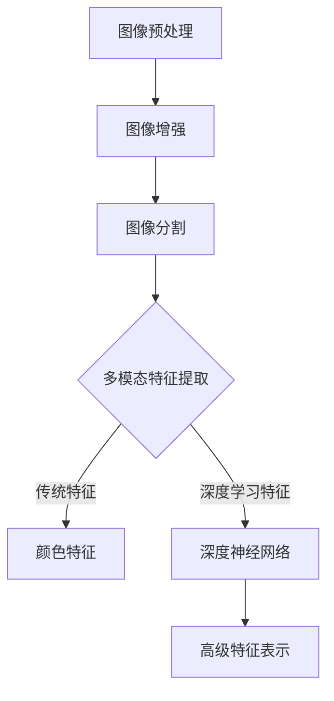

                 

## 《电商平台中的多模态商品检索技术》

> **关键词：** 电商平台，多模态检索，图像处理，自然语言处理，语音识别，深度学习

**摘要：** 随着电商平台的快速发展，商品检索成为用户购物体验的重要环节。多模态商品检索技术融合了图像、文本和语音等多种数据形式，为用户提供更精准、个性化的检索服务。本文将深入探讨电商平台中多模态商品检索技术的原理、算法及实践，帮助读者了解并掌握这一前沿技术。

----------------------------------------------------------------

### 第一部分：引言

#### 第1章：电商平台与多模态商品检索概述

#### 1.1 电商平台的发展与挑战

**电商平台的发展历程：**

电商平台的发展可以追溯到20世纪90年代末，当时互联网逐渐普及，电子商务开始崭露头角。1995年，亚马逊（Amazon）成立，标志着电商平台的诞生。随后，eBay、阿里巴巴等平台相继成立，电商行业迅速发展。

**当前电商平台的现状与未来趋势：**

目前，电商平台已成为全球数字经济的重要组成部分。随着移动互联网的普及，移动电商成为电商平台的重要发展方向。同时，社交电商、直播电商等新兴模式不断涌现，为电商平台带来了新的机遇和挑战。

**电商平台面临的检索挑战：**

随着电商平台商品数量的激增，商品检索的效率和质量成为用户满意度的重要指标。传统的单模态检索技术已无法满足用户日益复杂的检索需求，例如，用户可能通过图片、文本或语音等多种方式进行检索。因此，多模态商品检索技术应运而生。

#### 1.2 多模态商品检索的概念与意义

**多模态商品检索的定义：**

多模态商品检索是指同时利用图像、文本、语音等多种数据形式，对电商平台上的商品进行检索和推荐。这种检索方式能够更好地理解和满足用户的检索需求，提高检索的准确性和效率。

**多模态商品检索的优势：**

1. **提高检索准确率：** 多模态检索能够综合利用不同类型的数据，从多个角度描述商品特征，提高检索的准确率。
2. **增强用户体验：** 多模态检索技术可以为用户提供更加灵活、个性化的检索方式，提升用户体验。
3. **拓宽应用场景：** 多模态检索技术可以应用于各种电商平台，包括电商搜索、推荐系统、客服系统等。

**多模态商品检索的应用场景：**

1. **商品搜索：** 用户可以通过上传图片、输入关键词或语音描述来搜索商品，提高搜索效率和准确性。
2. **商品推荐：** 通过分析用户的多模态数据，为用户推荐与其兴趣相关的商品。
3. **客服系统：** 用户可以通过语音或文本与客服进行互动，获取相关信息和帮助。

#### 1.3 本书结构安排与内容概述

**本书的目标与读者定位：**

本书旨在全面介绍电商平台中的多模态商品检索技术，帮助读者了解并掌握这一前沿技术。本书适合从事电商开发、数据挖掘、自然语言处理等领域的技术人员阅读。

**各章节的主要内容概述：**

- **第一部分：引言**：介绍电商平台的发展、多模态商品检索的概念与意义。
- **第二部分：多模态商品检索技术基础**：介绍图像处理与特征提取、自然语言处理技术。
- **第三部分：多模态商品检索算法**：介绍多模态商品检索算法原理、基于图像的检索算法、基于文本的检索算法、基于语音的检索算法。
- **第四部分：多模态商品检索系统开发与优化**：介绍多模态商品检索系统开发、系统优化。
- **第五部分：案例分析**：分析多模态商品检索技术在电商平台的实践。

### 第二部分：多模态商品检索技术基础

#### 第2章：图像处理与特征提取

#### 2.1 图像处理技术

**图像预处理：** 图像预处理是图像处理的基础步骤，主要包括图像的缩放、旋转、裁剪等操作。这些操作可以提高图像质量，为后续处理奠定基础。

**图像增强：** 图像增强旨在改善图像的视觉效果，使其更容易被分析和识别。常用的方法包括对比度增强、亮度调整、滤波等。

**图像分割：** 图像分割是将图像划分为多个区域，每个区域具有相似的特性。分割方法包括基于阈值的分割、基于边缘检测的分割、基于区域的分割等。

#### 2.2 图像特征提取

**传统特征提取方法：** 传统特征提取方法主要包括颜色特征、纹理特征、形状特征等。这些特征可以直接从图像中提取，但往往无法充分利用图像中的信息。

**深度学习特征提取方法：** 深度学习特征提取方法通过训练深度神经网络，自动提取图像中的高级特征。这种特征具有更强的鲁棒性和表达能力，能够提高检索的准确率。

**特征融合技术：** 特征融合是将多种特征进行整合，形成更加丰富的特征表示。常用的方法包括特征叠加、特征加权、特征空间变换等。

#### 2.3 视频处理与特征提取

**视频预处理：** 视频预处理包括视频的缩放、旋转、裁剪等操作，以及去除噪声、增强视觉信息等。

**视频特征提取：** 视频特征提取主要关注视频序列的时空特征。常用的方法包括光流估计、动作识别、场景分类等。

**视频序列建模：** 视频序列建模旨在捕捉视频中的时空变化规律。常用的方法包括循环神经网络（RNN）、卷积神经网络（CNN）等。

---

**示例：Mermaid流程图**

---

#### 第3章：自然语言处理技术

#### 3.1 语言模型与词向量

**语言模型：** 语言模型是一种概率模型，用于预测下一个单词或词组。常见的语言模型包括n元语法、神经网络语言模型等。

**词向量表示：** 词向量是将单词映射为高维向量，用于表示单词的语义信息。常见的词向量模型包括Word2Vec、GloVe等。

**词向量训练方法：** 词向量训练是通过大量文本数据训练得到的。常用的方法包括skip-gram、CBOW等。

#### 3.2 文本特征提取

**传统文本特征提取方法：** 传统文本特征提取方法主要包括TF-IDF、词袋模型等。这些方法将文本转化为向量，但往往忽略了文本的语义信息。

**基于深度学习的文本特征提取方法：** 基于深度学习的文本特征提取方法通过训练深度神经网络，自动提取文本中的高级特征。这种特征具有更强的语义表达能力。

**文本特征融合技术：** 文本特征融合是将多种文本特征进行整合，形成更加丰富的特征表示。常用的方法包括特征叠加、特征加权、特征空间变换等。

#### 3.3 语音识别与声学模型

**语音信号预处理：** 语音信号预处理包括噪声过滤、音高提取、频谱分析等。这些预处理操作可以提高语音识别的准确性。

**声学模型：** 声学模型是语音识别的核心部分，用于将语音信号映射为文字。常见的声学模型包括GMM（高斯混合模型）、DNN（深度神经网络）等。

**语言模型：** 语言模型用于预测语音信号中的下一个字符或词组。常见的语言模型包括n元语法、神经网络语言模型等。

### 第三部分：多模态商品检索算法

#### 第4章：多模态商品检索算法原理

#### 4.1 多模态检索框架

**传统多模态检索框架：** 传统多模态检索框架主要包括特征提取、特征匹配和结果排序等步骤。该框架将不同类型的数据（图像、文本、语音等）分别进行特征提取，然后通过特征匹配计算相似度，最后对结果进行排序。

**深度多模态检索框架：** 深度多模态检索框架通过训练深度神经网络，将多模态数据融合为一个统一的特征表示。该框架具有更强的表达能力和适应性，能够提高检索的准确性和效率。

#### 4.2 多模态匹配策略

**基于相似度的匹配：** 基于相似度的匹配是通过计算不同模态数据之间的相似度来进行检索。常见的相似度计算方法包括余弦相似度、欧氏距离等。

**基于学习的方法：** 基于学习的方法是通过训练模型来学习多模态数据之间的匹配关系。常见的算法包括多模态神经网络、多任务学习等。

**多模态检索优化策略：** 多模态检索优化策略包括数据预处理、特征提取和匹配算法的优化。常见的优化方法包括特征降维、特征融合、算法参数调优等。

#### 4.3 多模态检索评价指标

**准确率、召回率、F1值等：** 准确率、召回率和F1值是评估多模态检索性能的常用指标。准确率表示检索结果中实际为正例的比例；召回率表示检索结果中实际为正例的比例；F1值是准确率和召回率的调和平均值。

**多模态检索性能评估方法：** 多模态检索性能评估方法包括实验评估和用户评估。实验评估是通过计算检索指标来评估检索性能；用户评估是通过用户反馈来评估检索效果。

#### 第5章：基于图像的检索算法

#### 5.1 图像检索基础

**图像检索的定义与分类：** 图像检索是指利用图像特征对图像库进行搜索和匹配。根据检索方式，图像检索可分为基于内容的检索和基于查询的检索。

**图像检索的系统架构：** 图像检索的系统架构通常包括图像预处理、特征提取、匹配和结果排序等模块。

#### 5.2 基于内容的图像检索

**基于颜色、纹理、形状的检索方法：** 基于颜色、纹理、形状的检索方法是通过提取图像的颜色、纹理和形状特征来进行检索。这些特征具有较强的视觉感知性。

**基于深度学习的图像检索方法：** 基于深度学习的图像检索方法通过训练深度神经网络，自动提取图像的高级特征。这种特征具有更强的表达能力和检索能力。

#### 5.3 图像检索优化策略

**检索结果的排序与展示：** 检索结果的排序与展示是影响用户满意度的重要因素。常见的排序方法包括基于相似度的排序、基于点击率的排序等。展示方面，可以采用瀑布流、网格布局等方式。

**检索性能优化方法：** 检索性能优化方法包括特征提取、匹配算法和系统架构的优化。常见的优化方法包括特征降维、特征融合、算法参数调优等。

### 第四部分：多模态商品检索系统开发与优化

#### 第8章：多模态商品检索系统开发

#### 8.1 系统架构设计

**数据采集与预处理：** 数据采集包括图像、文本、语音等多种数据形式。数据预处理包括数据清洗、数据增强、数据归一化等操作，以提高数据质量和鲁棒性。

**模型训练与优化：** 模型训练是通过大量数据进行训练，以获得优秀的检索性能。模型优化包括超参数调优、正则化、模型融合等，以提高模型的稳定性和泛化能力。

**系统部署与运维：** 系统部署是将训练好的模型部署到生产环境中，以提供实时检索服务。运维包括系统监控、故障处理、性能优化等，以确保系统的稳定性和可靠性。

#### 8.2 数据预处理技术

**图像数据预处理：** 图像数据预处理包括图像缩放、旋转、裁剪等操作，以提高数据的多样性和鲁棒性。同时，还可以采用图像增强技术，提高图像质量。

**文本数据预处理：** 文本数据预处理包括文本清洗、分词、词性标注等操作，以提高文本数据的可理解性。此外，还可以采用文本增强技术，提高文本数据的质量。

**语音数据预处理：** 语音数据预处理包括语音降噪、音高提取、频谱分析等操作，以提高语音数据的清晰度和可理解性。同时，还可以采用语音增强技术，提高语音质量。

#### 8.3 模型训练与优化

**训练数据集的准备：** 训练数据集的准备包括数据收集、数据清洗、数据标注等操作，以确保数据的质量和多样性。

**模型选择与调参：** 模型选择是根据任务需求和数据特性选择合适的模型。调参是通过调整模型的超参数，以优化模型的性能。

**模型优化与评估：** 模型优化是通过训练和调整模型，以提高模型的检索性能。评估是通过计算检索指标，如准确率、召回率、F1值等，来评估模型的性能。

### 第五部分：案例分析

#### 第10章：多模态商品检索技术在电商平台的实践

#### 10.1 案例介绍

**案例背景与目标：** 某知名电商平台希望通过引入多模态商品检索技术，提高用户的检索体验和满意度。案例目标是实现基于图像、文本和语音的混合检索，提高检索的准确性和效率。

**案例涉及的检索技术：** 案例涉及图像检索、文本检索和语音检索技术。图像检索采用基于内容的图像检索和基于深度学习的图像检索方法；文本检索采用基于关键词检索和基于语义检索方法；语音检索采用基于关键词语音检索和基于语义语音检索方法。

#### 10.2 系统设计与实现

**系统架构设计：** 系统架构包括数据采集与预处理、多模态特征提取、检索算法和结果排序等模块。数据采集与预处理模块负责收集和处理图像、文本和语音数据；多模态特征提取模块负责提取图像、文本和语音的特征；检索算法模块负责执行多模态检索算法；结果排序模块负责对检索结果进行排序。

**数据预处理与模型训练：** 数据预处理包括图像缩放、旋转、裁剪等操作，文本清洗、分词、词性标注等操作，语音降噪、音高提取、频谱分析等操作。模型训练包括图像特征提取模型、文本特征提取模型和语音特征提取模型的训练，以及多模态检索模型的训练。

**系统部署与优化：** 系统部署是将训练好的模型部署到生产环境中，以提供实时检索服务。优化包括模型参数调优、特征提取和匹配算法优化、系统性能优化等。

#### 10.3 检索效果评估

**检索准确率与召回率：** 检索准确率表示检索结果中实际为正例的比例；召回率表示检索结果中实际为正例的比例。通过计算准确率、召回率和F1值等指标，评估多模态检索算法的性能。

**用户满意度与反馈：** 用户满意度通过问卷调查、用户反馈等方式进行评估。用户反馈包括对检索结果的准确度、速度、易用性等方面的评价。

#### 10.4 案例总结与展望

**案例经验与教训：** 案例经验包括多模态检索技术的优势和应用效果，案例教训包括系统优化和用户体验的重要性。

**未来发展趋势与展望：** 未来发展趋势包括多模态检索技术的进一步优化、跨模态检索的深入研究、多模态检索在更多领域的应用。

### 附录

#### 附录A：多模态商品检索相关资源

**开源数据集：** 
- Open Images
- ImageNet
- TextClef

**开源代码与工具：** 
- TensorFlow
- PyTorch
- OpenCV

**相关论文与书籍：** 
- "Multimodal Learning for Image and Text Retrieval"
- "Deep Learning for Image and Video Retrieval"
- "Multimodal Data Analysis in E-commerce"

### 总结

多模态商品检索技术作为电商平台的重要创新，为用户提供更加精准、个性化的检索服务。本文详细介绍了多模态商品检索技术的原理、算法及实践，帮助读者了解并掌握这一前沿技术。在未来，随着多模态检索技术的不断发展和优化，电商平台将能够更好地满足用户的需求，提升用户体验。**作者：AI天才研究院/AI Genius Institute & 禅与计算机程序设计艺术 /Zen And The Art of Computer Programming**

