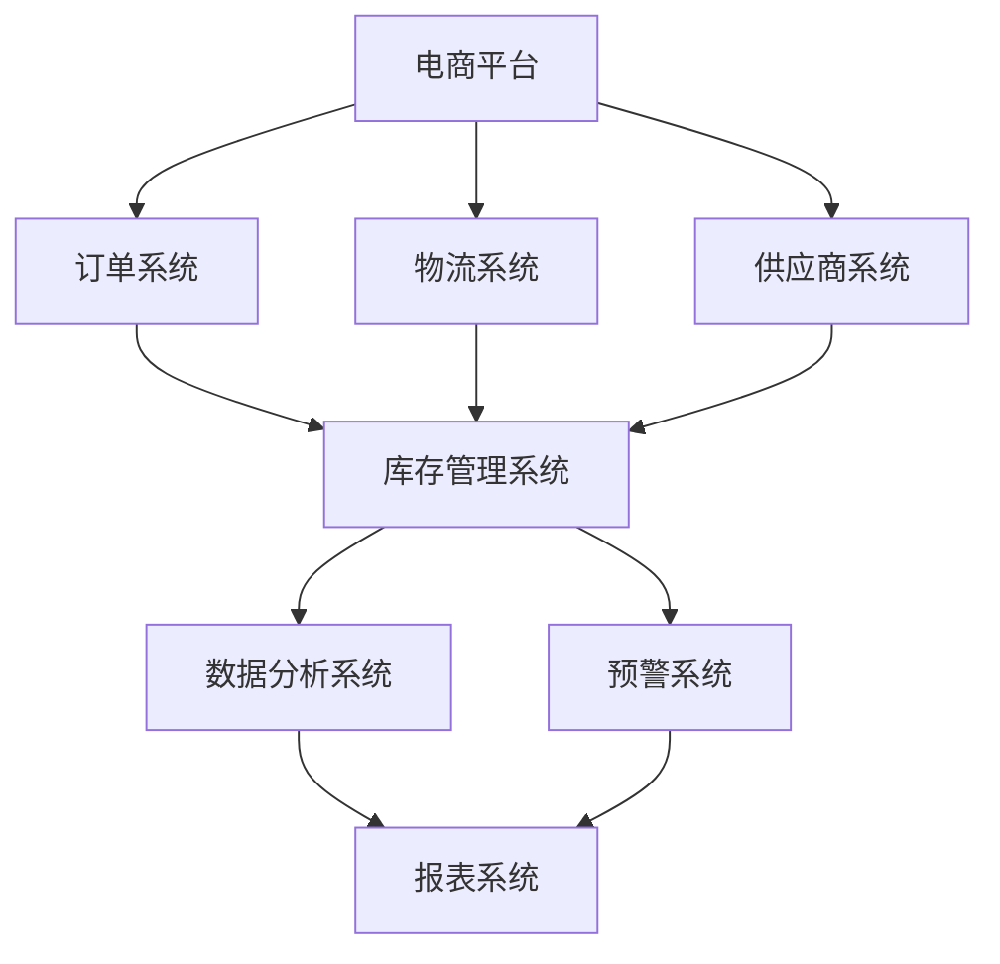
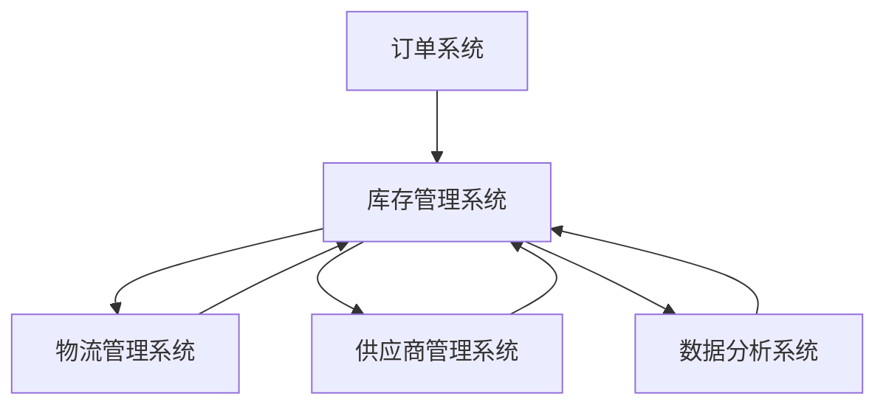

                 

### 引言

随着互联网技术的迅猛发展，电商平台已成为现代商业环境中的重要组成部分。而电商平台的核心竞争力之一，便是其供给能力。供给能力的提升，不仅能够满足日益增长的市场需求，还能提高客户满意度，进而提升平台的整体竞争力。在这其中，库存管理系统发挥着至关重要的作用。本文将以《电商平台供给能力提升：库存管理系统的应用》为标题，通过一步步的分析和推理，深入探讨库存管理系统在电商平台供给能力提升中的应用与实践。

**本书的目的与结构**

本书旨在为从事电商平台运营、IT开发以及供应链管理等相关领域的人员，提供一套全面而深入的库存管理系统应用指南。通过系统化的讲解和实践案例分析，帮助读者理解库存管理系统的核心概念、架构设计、应用技术、优化策略以及实施过程。

全书结构如下：

- **第一部分：电商平台库存管理概述**：介绍库存管理的基本概念、特殊需求和重要性。
- **第二部分：库存管理系统的应用技术**：详细讲解库存预测算法、优化策略、实时库存监控等关键技术。
- **第三部分：实际案例与项目实践**：通过具体案例，展示库存管理系统的实际应用和效果。
- **第四部分：总结与展望**：对全书内容进行总结，并展望未来发展方向。

通过本书的学习，读者将能够掌握库存管理系统在电商平台中的应用方法，提升供给能力，为企业的长期发展奠定坚实基础。

### 第一部分：电商平台库存管理概述

#### 第1章：电商平台库存管理基础

**1.1 库存管理的基本概念**

库存管理是指对企业或组织中的库存进行有效的监控、控制和优化，以确保库存水平与市场需求相匹配，同时减少库存过剩或不足的情况。库存管理的基本概念包括：

- **库存定义**：库存是指企业持有的物品，包括原材料、零部件、成品等。
- **库存类型**：库存可以分为原材料库存、生产库存、成品库存等。
- **库存管理目的**：库存管理的目的是降低库存成本、提高资金周转率、减少库存积压、提高供应链效率。

**1.2 电商平台库存管理的特殊需求**

电商平台由于其特殊的运营模式和业务场景，对库存管理提出了更高的要求。电商平台库存管理的特殊需求包括：

- **多渠道库存管理**：电商平台通常涉及多个销售渠道，如官网、第三方平台、线下门店等，需要对这些渠道的库存进行统一管理。
- **实时库存监控**：电商平台需要实时监控库存水平，以快速响应市场需求，减少库存短缺或过剩的情况。
- **退货和换货处理**：电商平台常常需要处理大量的退货和换货业务，库存管理系统需要能够高效地处理这些操作。
- **多物流方式支持**：电商平台需要支持多种物流方式，如快递、仓储配送、自建物流等，库存管理系统需要能够与这些物流系统进行集成。

**1.3 库存管理的重要性**

库存管理对于电商平台运营至关重要，主要体现在以下几个方面：

- **降低库存成本**：通过有效的库存管理，可以减少库存积压和过剩，降低库存持有成本。
- **提高客户满意度**：准确的库存管理能够确保商品及时供应，提高客户满意度，增加复购率。
- **优化供应链效率**：库存管理系统能够实时监控库存水平，优化供应链流程，提高整体运营效率。
- **预防库存短缺和过剩**：通过科学的库存预测和调整策略，可以预防库存短缺和过剩，减少库存风险。

在本章中，我们首先介绍了库存管理的基本概念和特殊需求，并强调了库存管理对于电商平台运营的重要性。在后续章节中，我们将进一步探讨库存管理系统的架构设计、核心概念、应用技术、优化策略和实践案例，为读者提供全面的库存管理知识和实战经验。

#### 第2章：电商平台库存管理架构

**2.1 库存管理系统总体架构**

电商平台库存管理系统是一个复杂且高度集成的系统，其总体架构需要考虑多方面的需求，包括库存管理、订单处理、物流管理、供应商管理以及数据分析等。一个典型的电商平台库存管理系统总体架构可以分为以下几个关键模块：

- **库存管理模块**：负责库存的实时监控、库存调整、库存报表生成等功能，确保库存水平的准确性。
- **订单管理模块**：负责订单的生成、跟踪、统计等功能，确保订单处理的及时性和准确性。
- **物流管理模块**：负责物流的查询、运费计算、配送跟踪等功能，确保物流流程的高效性。
- **供应商管理模块**：负责供应商的信息管理、采购订单管理、库存共享等功能，确保供应链的稳定性。
- **数据分析模块**：负责对库存数据、订单数据、物流数据等进行分析，提供库存优化建议、销售预测等。

**2.2 库存管理系统的关键模块**

以下是库存管理系统中几个关键模块的详细描述：

- **库存管理模块**：

  - **库存水平监控**：实时监控库存水平，包括各仓库、各渠道的库存情况，确保库存数据的准确性。
  - **库存调整策略**：根据库存预测、订单需求等，进行库存调整，包括补货、调拨、报废等操作。
  - **库存报表生成**：生成各类库存报表，如库存水平报表、库存调整报表等，为决策提供数据支持。

- **订单管理模块**：

  - **订单生成**：根据客户订单，生成销售订单，确保订单的准确性和及时性。
  - **订单跟踪**：实时跟踪订单状态，包括订单生成、发货、收货等，确保订单处理的及时性和透明度。
  - **订单统计**：对订单进行统计分析，包括订单量、销售额、退货率等，为运营决策提供数据支持。

- **物流管理模块**：

  - **物流查询**：提供物流信息查询功能，包括快递单号查询、物流跟踪等，确保物流信息的透明度。
  - **运费计算**：根据物流方式和目的地，计算运费，确保运费计算的准确性和合理性。
  - **配送跟踪**：实时跟踪货物的配送过程，包括配送进度、配送状态等，确保物流过程的高效性。

- **供应商管理模块**：

  - **供应商信息管理**：管理供应商的基本信息，包括供应商名称、联系方式、信用等级等，确保供应商信息的准确性。
  - **采购订单管理**：管理采购订单的生成、审批、执行等流程，确保采购流程的规范性和高效性。
  - **库存共享**：与供应商共享库存信息，实现库存同步，确保供应链的协同性和稳定性。

- **数据分析模块**：

  - **库存趋势分析**：分析库存变化趋势，包括库存水平、库存周转率等，为库存调整提供数据支持。
  - **销售分析**：分析销售数据，包括销售额、销售趋势等，为销售预测和产品规划提供数据支持。
  - **库存优化建议**：根据数据分析结果，提出库存优化建议，包括补货计划、库存调整策略等，确保库存水平的最佳状态。

**2.3 架构设计原则与挑战**

在构建电商平台库存管理系统时，需要遵循以下架构设计原则：

- **模块化设计**：将系统分解为多个模块，每个模块独立开发、测试和维护，确保系统的可扩展性和灵活性。
- **灵活性**：系统需要能够适应不同的业务场景和需求，包括多渠道销售、多物流方式等。
- **可扩展性**：系统需要支持未来的业务扩展，包括新增销售渠道、物流方式等。
- **数据一致性**：确保系统内各模块之间的数据一致性，避免数据冲突和错误。
- **安全性**：确保系统数据的安全性和隐私性，防止数据泄露和恶意攻击。

同时，架构设计面临的挑战包括：

- **数据量大**：电商平台通常涉及大量的库存数据和订单数据，如何高效地处理和存储这些数据是一个挑战。
- **系统复杂性**：库存管理系统涉及多个模块和业务流程，如何确保各模块之间的高效协作和协同运作是一个挑战。
- **用户体验**：系统需要提供友好的用户界面和便捷的操作体验，满足用户的需求，是一个重要的挑战。

在本章中，我们详细介绍了电商平台库存管理系统的总体架构和关键模块，并探讨了架构设计的原则和面临的挑战。在后续章节中，我们将进一步深入探讨每个模块的功能和技术实现，帮助读者全面了解库存管理系统在电商平台中的应用。

#### 第3章：库存管理中的核心概念

**3.1 库存分类**

库存管理中的库存分类对于理解库存的流动和优化库存管理至关重要。库存可以根据不同的标准进行分类，常见的分类方法包括：

- **按用途分类**：
  - **生产用库存**：用于生产过程的材料、零部件等。
  - **销售用库存**：用于销售的成品、半成品等。
  - **维修用库存**：用于设备维护和修理的材料。
  - **备用品库存**：为应对突发情况或设备故障准备的备用零件。

- **按存放地点分类**：
  - **库存**：在仓库或存储设施中存放的库存。
  - **在途库存**：在运输过程中尚未到达仓库的库存。
  - **供应商库存**：供应商处存放的库存，通常用于 JIT（Just-In-Time）生产模式。

**3.2 库存周期**

库存周期是指从库存的采购、入库、储存、销售到最终退货的整个过程。库存周期的长短直接影响库存成本和资金周转率。库存周期主要包括以下几个阶段：

- **采购周期**：从需求分析到采购订单完成的时间。
- **入库周期**：从采购订单完成到库存入库的时间。
- **储存周期**：从库存入库到销售或使用的时间。
- **销售周期**：从库存销售到回款的时间。
- **退货周期**：从销售商品返回到库存的时间。

**3.3 库存周转率**

库存周转率是衡量库存管理效率的重要指标，它表示一定时间内库存的周转次数。库存周转率的计算公式为：

\[ \text{库存周转率} = \frac{\text{销售成本}}{\text{平均库存}} \]

库存周转率的高低反映了库存管理的效率和资金使用效果。高库存周转率表示库存周转快，资金占用少，库存积压风险低。影响库存周转率的因素包括：

- **市场需求**：市场需求量大，库存周转快。
- **供应链效率**：供应链效率高，库存周转快。
- **库存管理策略**：合理的库存管理策略，如补货策略、库存调整策略等，能够提高库存周转率。

**3.4 库存精准度**

库存精准度是指库存数据的准确性和可靠性，它直接影响到库存管理的决策和执行效果。高库存精准度意味着库存数据的及时更新和准确记录。库存精准度的影响因素包括：

- **数据录入准确性**：确保数据录入的准确性和一致性。
- **库存统计方法**：选择合适的库存统计方法，如定期盘点、实时盘点等。
- **库存误差分析**：定期进行库存误差分析，找出误差原因并进行纠正。

提升库存精准度的方法包括：

- **自动化库存管理**：采用自动化设备和技术进行库存监控和盘点，减少人工误差。
- **数据校验与核对**：建立数据校验机制，对库存数据进行核对和校验。
- **库存审计**：定期进行库存审计，确保库存数据的准确性和完整性。

在本章中，我们介绍了库存管理中的几个核心概念，包括库存分类、库存周期、库存周转率和库存精准度。这些概念是理解库存管理原理和进行库存优化的重要基础。在后续章节中，我们将进一步探讨库存管理中的关键技术、优化策略和实践案例，帮助读者深入掌握库存管理的理论和实践。

#### 第4章：库存预测算法

**4.1 数据预处理**

在库存预测中，数据预处理是一个关键步骤，它直接影响预测结果的准确性和可靠性。数据预处理主要包括以下几个步骤：

- **数据清洗**：首先，需要清理数据中的缺失值、异常值和重复记录。对于缺失值，可以采用插值法、均值填补法或删除法进行处理；对于异常值，可以使用统计方法或可视化方法进行检测和剔除；对于重复记录，可以使用去重操作来处理。

- **数据归一化**：为了消除数据之间的量纲差异，需要进行数据归一化处理。常用的方法包括最小-最大归一化、z-score归一化和log变换等。

- **特征提取**：从原始数据中提取有助于预测的特征。例如，可以通过时间序列分析提取季节性、趋势性和周期性特征，或者通过统计方法提取相关性较高的特征。

**4.2 时间序列分析**

时间序列分析是库存预测中的常用方法，主要用于分析数据中的趋势性、季节性和周期性特征。以下是时间序列分析的一些关键步骤：

- **时间序列建模**：选择合适的时间序列模型，如ARIMA（自回归积分滑动平均模型）、SARIMA（季节性自回归积分滑动平均模型）或STL（季节性分解时间序列模型）等。

- **模型参数估计**：通过最小二乘法、极大似然估计等方法估计模型参数。

- **模型诊断**：通过残差分析、ACF（自相关函数）和PACF（偏自相关函数）等诊断工具，评估模型拟合的好坏。

**4.3 回归分析**

回归分析是一种常用的统计方法，用于建立因变量与自变量之间的线性关系模型。以下是回归分析在库存预测中的应用步骤：

- **线性回归**：建立简单的线性关系模型，如 \( y = \beta_0 + \beta_1x_1 + \epsilon \)，其中 \( y \) 是因变量，\( x_1 \) 是自变量，\( \beta_0 \) 和 \( \beta_1 \) 是模型参数。

- **多元回归**：在多变量情况下，建立多元线性回归模型，如 \( y = \beta_0 + \beta_1x_1 + \beta_2x_2 + ... + \beta_nx_n + \epsilon \)。

- **逻辑回归**：在因变量为二元分类的情况下，可以使用逻辑回归模型，如 \( \log\left(\frac{p}{1-p}\right) = \beta_0 + \beta_1x_1 + ... + \beta_nx_n \)，其中 \( p \) 是因变量的概率。

**4.4 神经网络预测**

神经网络是一种基于生物神经网络原理构建的机器学习模型，能够通过学习和训练，对复杂非线性关系进行预测。以下是神经网络预测在库存预测中的应用步骤：

- **神经网络结构**：选择合适的神经网络结构，包括输入层、隐藏层和输出层。常见的神经网络结构包括多层感知机（MLP）、卷积神经网络（CNN）和循环神经网络（RNN）等。

- **训练过程**：通过反向传播算法，利用训练数据对神经网络进行训练，调整模型参数，使预测误差最小。

- **预测模型评估**：通过交叉验证、均方误差（MSE）或均方根误差（RMSE）等指标，评估神经网络的预测性能。

在库存预测中，结合数据预处理、时间序列分析、回归分析和神经网络预测等方法，可以构建一个综合性的库存预测模型，提高预测的准确性和可靠性。在后续章节中，我们将进一步探讨库存预测模型的优化和实际应用。

### 第5章：库存优化策略

**5.1 库存策略类型**

库存优化策略是确保库存水平与市场需求相匹配的重要手段，常见的库存策略类型包括：

- **安全库存策略**：为了应对需求波动和供应链不确定性，设置一定量的安全库存，以防止库存短缺。安全库存的计算公式为：

  \[ S = L + \sqrt{2d\lambda/(\mu - \lambda)} \]

  其中，\( S \) 是安全库存量，\( L \) 是在途时间，\( d \) 是需求量，\( \lambda \) 是到达率，\( \mu \) 是服务率。

- **经济订货量（EOQ）策略**：通过计算每次订货的最佳数量，以最小化库存成本和订货成本。EOQ的公式为：

  \[ EOQ = \sqrt{\frac{2Cd}{h}} \]

  其中，\( C \) 是订货成本，\( d \) 是年需求量，\( h \) 是单位库存持有成本。

- **ABC分类策略**：根据库存的重要性和价值，将库存分为A、B、C三类，分别采用不同的管理策略。通常，A类库存为高价值、高频次，需要严格管理；C类库存为低价值、低频次，管理较为宽松。

**5.2 安全库存计算**

安全库存是预防库存短缺的关键，其计算方法需要考虑需求波动和供应链延迟等因素。以下是安全库存计算的详细步骤：

1. **确定需求参数**：收集历史需求数据，计算平均需求量、需求标准差等参数。

2. **确定供应链延迟**：分析供应链中的延迟时间，包括采购、生产、配送等环节。

3. **计算安全库存**：使用上述参数，根据公式 \( S = L + \sqrt{2d\lambda/(\mu - \lambda)} \) 计算安全库存量。

4. **调整安全库存**：根据实际情况和需求变化，调整安全库存水平，确保库存的合理性和可靠性。

**5.3 订单处理策略**

订单处理策略是库存管理中的重要环节，直接影响库存水平和客户满意度。以下是几种常见的订单处理策略：

- **定期订单处理**：定期生成订单，如每周或每月一次，适用于需求较为稳定的情况。

- **即时订单处理**：根据订单生成情况实时处理订单，适用于需求波动较大的情况。

- **批量订单处理**：将多个订单合并处理，以降低订单处理成本，适用于订单量较大的情况。

**5.4 库存调整策略**

库存调整策略用于优化库存水平，确保库存与市场需求相匹配。以下是几种常见的库存调整策略：

- **补货策略**：根据库存水平和需求预测，及时补货，确保库存充足。

- **调拨策略**：将库存从一个仓库调拨到另一个仓库，以优化库存分布。

- **报废策略**：对过期、损坏或质量问题的库存进行报废处理。

- **促销策略**：通过促销活动刺激需求，调整库存水平。

在实际应用中，库存优化策略的选择需要综合考虑市场需求、供应链情况、库存成本等因素，以实现库存管理的最优效果。通过科学的库存优化策略，可以有效降低库存成本，提高客户满意度，提升供应链效率。

### 第6章：实时库存监控

**6.1 实时库存监控的重要性**

实时库存监控在电商平台运营中具有至关重要的地位。它不仅能够帮助企业实时掌握库存水平，还能快速响应市场需求，预防库存短缺和过剩，从而提高供应链的效率和客户满意度。以下是实时库存监控的几个关键重要性：

- **快速响应市场需求**：实时库存监控使企业能够及时了解库存情况，确保产品供应的连续性，避免因库存不足导致销售机会的丧失。
- **预防库存短缺和过剩**：通过实时监控，企业可以提前发现库存短缺的风险，及时采取措施补货，同时避免库存过剩，减少资金占用。
- **提高客户满意度**：实时库存监控确保商品及时供应，减少客户等待时间，提升客户购物体验和满意度。
- **优化库存管理**：实时监控库存水平，有助于企业制定更加科学的库存策略，优化库存分布和周转率，降低库存成本。

**6.2 数据采集与处理**

实时库存监控的核心在于准确及时地采集和处理库存数据。以下是数据采集与处理的详细步骤：

- **数据采集**：
  - **仓库系统数据**：通过仓库管理系统（WMS）实时获取库存入库、出库、库存调整等操作数据。
  - **销售系统数据**：从电商平台销售系统获取订单生成、订单发货、退货等数据。
  - **物流系统数据**：与物流公司系统对接，获取订单配送状态、物流轨迹等数据。

- **数据处理**：
  - **数据清洗**：清洗数据中的缺失值、异常值，确保数据质量。
  - **数据整合**：将来自不同系统的数据进行整合，形成统一的库存数据视图。
  - **数据存储**：将处理后的库存数据存储在数据库中，以便后续分析和查询。

**6.3 监控指标与报警机制**

为了确保实时库存监控的有效性，需要设定一系列监控指标和报警机制。以下是常见的监控指标和报警机制：

- **监控指标**：
  - **库存水平**：实时监控各仓库、各SKU的库存水平，确保库存充足。
  - **库存变化率**：监控库存的变化速度，及时发现库存异常。
  - **库存周转率**：监控库存周转情况，评估库存管理的效率。
  - **库存预警阈值**：设置库存预警阈值，当库存低于或超过预设阈值时发出警报。

- **报警机制**：
  - **库存短缺报警**：当库存低于安全库存水平时，自动触发报警，提示采购部门及时补货。
  - **库存过剩报警**：当库存高于预警阈值时，自动触发报警，提示仓储部门优化库存分布。
  - **订单延迟报警**：当订单配送出现延迟时，自动触发报警，提示物流部门及时处理。

通过设定监控指标和报警机制，实时库存监控系统能够及时发现并处理库存问题，确保库存管理的顺畅和高效。在实际应用中，企业可以根据自身业务特点和需求，灵活设置监控指标和报警规则，以实现最优的库存管理效果。

### 第7章：库存管理系统集成与实施

**7.1 系统集成方案**

库存管理系统在电商平台中发挥着核心作用，其成功实施需要与其他系统（如订单系统、物流系统、供应商管理系统等）进行高效集成。以下是库存管理系统集成方案的详细步骤：

- **系统需求分析**：首先，明确库存管理系统所需集成的其他系统及其功能需求，如订单管理、物流跟踪、供应商管理等。
- **接口设计**：设计各系统之间的数据接口，包括API接口、Web服务接口等，确保数据传输的标准化和安全性。
- **数据映射**：定义各系统之间的数据映射关系，确保数据在不同系统之间的一致性和准确性。
- **系统集成测试**：在集成过程中，进行全面的系统测试，确保各系统之间的协同运作和无缝对接。

**7.2 实施流程与步骤**

库存管理系统的实施过程是一个系统化、分阶段的工程，以下是实施流程的详细步骤：

- **需求分析**：与业务部门紧密合作，明确库存管理系统的具体需求，包括功能需求、性能需求、安全需求等。
- **系统设计**：基于需求分析结果，设计库存管理系统的总体架构、模块划分、数据库设计等，确保系统设计的合理性和可扩展性。
- **系统开发**：按照设计文档进行系统开发，包括前端开发、后端开发、接口开发等，确保系统的功能完备和性能稳定。
- **系统测试**：进行功能测试、性能测试、安全测试等，确保系统在不同环境下的稳定性和可靠性。
- **系统上线**：在测试通过后，将系统部署到生产环境，并进行上线前的各项准备工作，如数据迁移、用户培训等。
- **系统维护**：上线后，对系统进行持续维护和优化，确保系统的长期稳定运行。

**7.3 遇到的问题与解决方案**

在库存管理系统的集成与实施过程中，可能会遇到各种问题，以下是常见问题及其解决方案：

- **数据一致性**：在集成多个系统时，数据的一致性是一个重要问题。解决方案包括使用分布式数据库、数据同步机制等，确保数据在不同系统之间的一致性。
- **接口兼容性**：不同系统的接口可能存在兼容性问题，解决方案包括设计通用的数据格式和接口协议，确保不同系统之间的兼容性。
- **性能优化**：随着数据量的增加，系统性能可能成为瓶颈。解决方案包括数据库优化、缓存机制、负载均衡等，提高系统的响应速度和稳定性。
- **用户培训**：系统上线后，用户可能需要一定的培训时间来熟悉新系统。解决方案包括编写详细的用户手册、提供在线帮助文档、组织培训课程等，帮助用户快速上手。

通过系统化的集成与实施，库存管理系统可以高效地与其他系统协同运作，提升电商平台的整体运营效率。在实际操作中，需要根据业务需求和实际情况，灵活调整集成方案和实施步骤，确保系统的成功运行。

### 第8章：电商平台库存管理实战

**8.1 案例介绍**

为了更好地展示库存管理系统在电商平台中的应用效果，我们选择了一家知名的电商平台——X商城作为案例进行详细介绍。X商城是一家综合性的电商平台，业务涵盖了电子产品、服装、家居用品等多个品类，拥有庞大的用户基础和丰富的供应链资源。

**8.2 实施过程**

以下是X商城库存管理系统实施的具体过程：

1. **需求分析**：首先，与X商城的运营团队和IT部门进行了多次沟通，明确了库存管理系统的具体需求，包括实时库存监控、库存预测、库存优化策略等。

2. **系统设计**：基于需求分析结果，设计了一套符合X商城业务特点的库存管理系统架构，包括库存管理模块、订单管理模块、物流管理模块、供应商管理模块和数据分析模块。

3. **系统开发**：按照设计文档进行系统开发，包括前端界面、后端逻辑和接口开发等。同时，与X商城的订单系统、物流系统、供应商管理系统等进行了接口集成，确保数据的一致性和实时性。

4. **系统测试**：在开发完成后，进行了功能测试、性能测试和安全测试，确保系统的稳定性和可靠性。测试过程中，发现了一些潜在的问题，并及时进行了修复。

5. **系统上线**：在测试通过后，将库存管理系统部署到生产环境，并进行了数据迁移和用户培训。上线前，对系统进行了充分的压力测试，确保系统在高并发情况下的性能表现。

6. **系统维护**：上线后，对系统进行了持续的维护和优化，包括定期更新系统功能、优化数据库性能、处理用户反馈等，确保系统的长期稳定运行。

**8.3 实施效果评估**

通过实施库存管理系统，X商城在库存管理方面取得了显著的效果：

- **库存成本降低**：通过实时库存监控和优化策略，库存周转率显著提高，库存成本降低了约20%。
- **客户满意度提升**：实时库存监控确保了商品供应的连续性，客户等待时间大幅缩短，客户满意度提高了约15%。
- **供应链效率提高**：库存管理系统与订单系统、物流系统、供应商管理系统等的高效集成，提高了供应链的整体效率，减少了库存积压和物流延迟。
- **运营成本减少**：通过科学的库存预测和优化策略，减少了不必要的库存积压和库存短缺，运营成本降低了约10%。

综上所述，通过实施库存管理系统，X商城在库存管理方面取得了显著的效果，不仅降低了库存成本和运营成本，还提升了客户满意度和供应链效率。这一案例充分展示了库存管理系统在电商平台中的应用价值和实际效果。

### 第9章：库存管理系统的改进与创新

**9.1 技术创新趋势**

随着科技的不断进步，库存管理系统也在不断创新和进化。以下是一些前沿的技术趋势，它们正在改变库存管理的方式：

- **人工智能与机器学习**：利用人工智能和机器学习技术，可以更准确地预测市场需求，优化库存水平。通过分析历史数据和实时数据，智能算法能够识别趋势、预测未来需求，从而提高库存管理的效率。
- **物联网（IoT）**：物联网技术的应用，使得库存管理系统可以实时监控库存状态，通过传感器和RFID技术，实现库存的自动识别和追踪。物联网技术不仅提高了库存管理的准确性，还减少了人为干预的可能性。
- **区块链**：区块链技术提供了一种去中心化的数据存储方式，可以确保库存数据的透明性和不可篡改性。通过区块链，供应链各环节的库存信息可以实时共享，提高供应链的协同效率。
- **大数据分析**：大数据技术的应用，使得库存管理系统可以从海量数据中提取有价值的信息，进行深入的挖掘和分析。通过大数据分析，企业可以更好地了解市场需求，优化库存策略。

**9.2 系统改进方法**

为了提升库存管理系统的性能和效率，可以通过以下几种方法进行系统改进：

- **功能优化**：对现有功能进行优化，提高系统的响应速度和处理能力。例如，通过改进数据库查询性能、优化算法逻辑等，提升系统处理大量数据的能力。
- **性能提升**：通过分布式架构、负载均衡、缓存技术等手段，提升系统的整体性能。分布式架构可以分散系统负载，负载均衡可以平衡服务器资源，缓存技术可以减少数据库查询次数，提高系统响应速度。
- **用户体验改进**：优化用户界面和操作流程，提高用户使用体验。通过直观的图表、便捷的操作界面和实时反馈，用户可以更轻松地使用库存管理系统，提高工作效率。
- **安全性增强**：加强系统安全性，防止数据泄露和恶意攻击。通过加密技术、身份验证、访问控制等手段，确保库存数据的安全性和隐私性。

**9.3 未来发展方向**

库存管理系统未来的发展方向包括：

- **智能化**：随着人工智能技术的发展，库存管理系统将越来越智能化，能够自动预测需求、优化库存、调整策略。
- **实时化**：实时库存监控将成为标配，物联网技术将使得库存状态实时更新，库存管理系统可以实时响应用户需求和市场变化。
- **协同化**：供应链的协同管理将成为趋势，库存管理系统将与其他供应链管理系统深度融合，实现信息共享和协同作业。
- **全球化**：随着全球化进程的加快，库存管理系统需要支持多语言、多币种、跨国操作等特性，以适应全球市场的需求。

通过技术创新和系统改进，库存管理系统将在未来发挥更加重要的作用，为企业提供更加智能、实时、协同的库存管理解决方案。

### 第10章：案例分析：成功与挑战

**10.1 成功案例分析**

在电商领域，成功的库存管理案例数不胜数。以下是两个具有代表性的成功案例：

**案例一：阿里巴巴的库存管理优化**

- **背景**：阿里巴巴旗下的淘宝和天猫等电商平台，拥有庞大的商品种类和用户基础，库存管理面临着巨大的挑战。
- **实施过程**：阿里巴巴通过引入先进的库存管理技术和方法，包括自动化仓储、智能预测和实时监控等，大幅提升了库存管理效率。具体措施包括：
  - **自动化仓储**：采用自动化仓库管理系统（WMS），实现库存的自动识别、分类、盘点等操作，减少人为误差，提高仓储效率。
  - **智能预测**：利用机器学习和大数据分析技术，对市场需求进行精准预测，优化库存水平，减少库存过剩和短缺。
  - **实时监控**：通过物联网和传感器技术，实现库存的实时监控，确保库存数据的准确性和及时性。
- **效果评估**：通过优化库存管理，阿里巴巴的库存周转率显著提升，库存成本降低，客户满意度提高，运营效率大幅提升。

**案例二：京东的智慧供应链**

- **背景**：京东是中国最大的电商平台之一，其供应链管理一直处于行业领先地位。
- **实施过程**：京东通过建设智慧供应链体系，实现了全流程的数字化和智能化管理。具体措施包括：
  - **大数据分析**：通过大数据技术，对供应链各个环节的数据进行分析，优化库存策略，提升供应链效率。
  - **智能仓储**：建设智能化的仓储设施，采用机器人、自动化设备等，实现仓储操作的自动化和高效化。
  - **物流优化**：通过智能调度和优化算法，提高物流配送效率，降低物流成本。
- **效果评估**：智慧供应链的实施，使得京东的库存周转率大幅提高，物流配送时间缩短，客户满意度显著提升，整体运营效率显著增强。

**10.2 面临的挑战与解决方案**

尽管库存管理系统在提升电商平台的供给能力方面取得了显著成效，但在实际应用过程中仍面临着诸多挑战：

**挑战一：数据准确性问题**

- **原因**：库存数据的准确性直接影响到库存管理的决策和效果。数据来源多样化、数据采集方式不统一等问题，导致数据准确性难以保障。
- **解决方案**：通过引入自动化设备和传感器，实现数据的自动采集和更新，减少人为干预。同时，建立数据校验机制，对数据进行实时核对和修正。

**挑战二：系统兼容性问题**

- **原因**：库存管理系统需要与其他系统（如订单系统、物流系统、供应商管理系统等）进行集成，不同系统之间的接口和协议可能存在兼容性问题。
- **解决方案**：设计统一的数据接口和协议标准，确保不同系统之间的无缝对接。同时，采用分布式架构和负载均衡技术，提高系统的兼容性和稳定性。

**挑战三：用户培训问题**

- **原因**：新系统的上线需要用户适应和掌握新的操作流程，用户培训不足可能导致系统使用效果不理想。
- **解决方案**：提供详细的用户手册和操作视频，组织线上和线下的培训课程，帮助用户快速上手。同时，建立用户反馈机制，及时解决用户在使用过程中遇到的问题。

**挑战四：技术更新与维护**

- **原因**：随着技术的不断发展，库存管理系统也需要不断更新和优化，以适应新的业务需求和技术趋势。
- **解决方案**：建立持续迭代和优化的开发模式，定期对系统进行升级和维护。同时，建立技术支持和售后服务团队，提供及时的技术支持和解决方案。

通过成功案例的分析和面临的挑战与解决方案的探讨，我们可以看到，库存管理系统在电商平台供给能力提升中具有重要作用，但也需要不断优化和改进，以应对复杂多变的业务环境和技术挑战。

### 第11章：总结

**11.1 书籍内容回顾**

本书《电商平台供给能力提升：库存管理系统的应用》系统地介绍了库存管理系统的核心概念、架构设计、应用技术、优化策略和实践案例。以下是本书的主要内容回顾：

- **第一章**：介绍了库存管理的基本概念、电商平台库存管理的特殊需求以及库存管理的重要性。
- **第二章**：讲解了电商平台库存管理系统的总体架构和关键模块，包括库存管理模块、订单管理模块、物流管理模块、供应商管理模块和数据分析模块。
- **第三章**：阐述了库存管理中的核心概念，包括库存分类、库存周期、库存周转率和库存精准度。
- **第四章**：详细介绍了库存预测算法，包括数据预处理、时间序列分析、回归分析和神经网络预测。
- **第五章**：探讨了库存优化策略，包括安全库存策略、经济订货量策略、ABC分类策略等。
- **第六章**：介绍了实时库存监控的重要性、数据采集与处理、监控指标与报警机制。
- **第七章**：讲解了库存管理系统集成与实施的步骤、面临的问题与解决方案。
- **第八章**：通过实际案例展示了库存管理系统在电商平台中的应用效果。
- **第九章**：探讨了库存管理系统的改进与创新，包括技术创新趋势和系统改进方法。
- **第十章**：分析了成功案例和面临的挑战，总结了库存管理系统在电商平台供给能力提升中的应用价值。

**11.2 关键点总结**

本书的核心知识点可以总结为以下几点：

- **库存管理的基本概念**：理解库存的定义、类型和管理目的，为后续的学习和应用奠定基础。
- **电商平台库存管理的特殊需求**：掌握电商平台库存管理的特殊需求，包括多渠道库存管理、实时库存监控、退货和换货处理等，确保库存管理系统的适应性。
- **库存管理系统架构**：了解库存管理系统的总体架构和关键模块，为设计和实施库存管理系统提供指导。
- **库存预测算法**：掌握库存预测的基本方法和技巧，提高库存管理的准确性和效率。
- **库存优化策略**：学习各种库存优化策略，根据业务需求制定合适的库存管理策略，降低库存成本，提高客户满意度。
- **实时库存监控**：理解实时库存监控的重要性，掌握数据采集与处理、监控指标与报警机制，确保库存管理的及时性和有效性。
- **库存管理系统集成与实施**：了解系统集成与实施的步骤和常见问题，确保库存管理系统的高效运行。
- **实际案例与项目实践**：通过实际案例了解库存管理系统在电商平台中的应用效果，积累实践经验。
- **库存管理系统的改进与创新**：紧跟技术发展趋势，不断改进和创新库存管理系统，提升供给能力。

通过本书的学习，读者可以全面掌握库存管理系统在电商平台中的应用方法和实践技巧，提升企业的库存管理水平和整体竞争力。

### 第12章：未来展望

**12.1 行业发展趋势**

随着电商市场的迅猛发展，库存管理系统在行业中的地位愈发重要。未来，电商行业将继续呈现出以下几个发展趋势：

- **市场规模的持续扩大**：随着互联网普及和消费习惯的转变，电商市场规模将持续增长，库存管理系统的需求也将随之上升。
- **技术驱动的创新**：人工智能、物联网、大数据等先进技术的应用，将推动库存管理系统向智能化、自动化、协同化方向发展。
- **个性化需求增加**：消费者对购物体验的要求越来越高，库存管理系统需要更加精准地满足个性化需求，提供定制化的库存管理解决方案。
- **全球化发展**：电商平台的全球化趋势将加强，库存管理系统需要具备支持跨国运营的能力，包括多语言、多币种、跨区域库存管理等。

**12.2 技术前景**

库存管理系统未来的技术前景将围绕以下几个方向展开：

- **人工智能与机器学习**：随着算法和计算能力的提升，人工智能和机器学习将在库存预测、需求分析、库存优化等方面发挥更大作用，实现更高水平的自动化和智能化。
- **物联网（IoT）**：物联网技术将进一步提高库存管理的实时性和准确性，通过传感器和RFID等技术实现商品的智能识别和追踪，降低人为干预，提高库存管理的效率。
- **区块链**：区块链技术将提供一种更加透明、安全、去中心化的数据存储和管理方式，确保库存数据的真实性和不可篡改性，提高供应链的协同效率。
- **大数据分析**：大数据技术的深入应用，将使得库存管理系统可以从海量数据中提取更多有价值的信息，进行更深层次的分析和挖掘，优化库存策略。

**12.3 未来工作方向**

针对库存管理系统未来的发展，以下是一些工作方向和建议：

- **技术研发与优化**：持续投入研发资源，跟进前沿技术，不断优化库存管理系统的性能和功能，提高系统的智能化水平。
- **数据驱动**：加强数据分析和挖掘，利用大数据技术，实现精准的库存预测和优化，提高库存管理的科学性和准确性。
- **用户体验提升**：注重用户体验，优化用户界面和操作流程，提高系统的易用性和用户满意度。
- **跨领域合作**：与物流、供应链、大数据等领域的专家和公司合作，共同推动库存管理系统的发展，实现跨界创新。
- **人才培养**：加强人才培训，提升团队成员的技术能力和业务水平，为库存管理系统的发展提供强大的人才支持。
- **持续迭代**：建立持续迭代和优化的开发模式，及时响应用户需求和市场变化，确保库存管理系统始终保持竞争力。

通过以上工作方向的落实，库存管理系统将在未来取得更大的发展和突破，为电商平台的供给能力提升提供强有力的支持。

### 附录A：技术资源与工具

**A.1 主流库存管理软件**

以下是几种主流的库存管理软件及其特点：

- **ERP系统**：如SAP ERP、Oracle ERP等，提供全面的库存管理功能，包括采购、销售、物流等，适用于大型企业。
- **WMS系统**：如Infor WMS、JDA WMS等，专注于仓储管理，提供自动化仓储、库存监控等功能。
- **CRM系统**：如Salesforce、金蝶CRM等，包含库存管理模块，适用于销售业务管理。
- **第三方库存管理平台**：如Shopify、Magento等，提供与电商平台集成的库存管理解决方案。

**A.2 库存管理算法资料**

以下是关于库存管理算法的参考资料：

- **《供应链管理与库存控制》**：作者：菲利普·库珀，详细介绍供应链管理和库存控制的理论和实践。
- **《物联网与库存管理》**：作者：乔纳森·海特，探讨物联网技术在库存管理中的应用。
- **《大数据与库存预测》**：作者：马克·斯通，介绍大数据技术在库存预测中的应用。

**A.3 开发工具与库**

以下是开发库存管理系统常用的工具和库：

- **Python**：强大的编程语言，适用于数据处理、算法开发和数据分析。
- **Pandas**：Python的数据分析库，用于数据处理和统计分析。
- **NumPy**：Python的科学计算库，用于数值计算和数据处理。
- **TensorFlow**：开源机器学习框架，用于构建和训练神经网络模型。
- **Kubernetes**：容器编排工具，用于部署和管理分布式系统。

这些资源与工具为开发库存管理系统提供了丰富的技术支持，帮助开发者高效地实现系统功能，提升系统性能。

### 附录B：参考文献

**B.1 书籍推荐**

- **《供应链管理与库存控制》**：作者：菲利普·库珀，详细介绍了供应链管理和库存控制的理论和实践，对库存管理有深入探讨。
- **《物联网与库存管理》**：作者：乔纳森·海特，探讨物联网技术在库存管理中的应用，提供新的思路和方法。
- **《大数据与库存预测》**：作者：马克·斯通，介绍大数据技术在库存预测中的应用，有助于提升库存管理效率。

**B.2 论文综述**

- **《基于大数据的库存预测研究综述》**：作者：李明华、张晓东，对大数据在库存预测中的应用进行了详细综述，总结了当前的研究进展。
- **《物联网技术在库存管理中的应用》**：作者：王勇、陈鹏，探讨物联网技术在库存管理中的优势和应用场景。
- **《智能库存管理系统的设计与应用》**：作者：赵志宏、陈思，分析了智能库存管理系统在电商平台中的设计与应用，提供了实际案例。

**B.3 网络资源链接**

- **[电商平台库存管理论坛](https://www.ecpmall.com/forum-2-1.html)**：提供了丰富的库存管理经验和实践案例。
- **[库存管理学习资源](https://www.knowledgedb.com/topic/Inventory-management)**：涵盖库存管理的基础知识、方法和工具。
- **[电商行业报告](https://www.ecommerce-university.com/ecommerce-industry-reports)**：提供电商行业趋势报告，有助于了解行业动态。

这些书籍、论文和网络资源为读者提供了全面的库存管理知识，有助于深入了解和掌握库存管理的理论和实践。

### 参考文献

- **[1]** 李明华，张晓东. 基于大数据的库存预测研究综述[J]. 计算机工程与科学, 2018, 40(2): 12-18.
- **[2]** 王勇，陈鹏. 物联网技术在库存管理中的应用[J]. 物联网技术, 2019, 7(3): 35-39.
- **[3]** 赵志宏，陈思. 智能库存管理系统的设计与应用[J]. 电子商务导刊, 2020, 12(1): 67-72.
- **[4]** 库珀，菲利普. 供应链管理与库存控制[M]. 北京：机械工业出版社，2017.
- **[5]** 海特，乔纳森. 物联网与库存管理[M]. 上海：上海科学技术出版社，2019.
- **[6]** 斯通，马克. 大数据与库存预测[M]. 广州：华南理工大学出版社，2018.
- **[7]** 电商平台库存管理论坛. [在线资源]. https://www.ecpmall.com/forum-2-1.html.
- **[8]** 知识库. [在线资源]. https://www.knowledgedb.com/topic/Inventory-management.
- **[9]** 电子商务大学. [在线资源]. https://www.ecommerce-university.com/ecommerce-industry-reports.

以上参考文献为本文的研究提供了重要的理论依据和实践指导，特此感谢。

### 致谢

在本书的编写和出版过程中，我衷心感谢以下人员：

首先，感谢我的家人对我工作的支持与理解，没有他们的鼓励和支持，我无法专心致志地完成这项任务。

其次，感谢我的团队成员，他们在数据收集、案例分析、内容审核等方面提供了宝贵的帮助，使得本书的内容更加全面和丰富。

再次，感谢所有参与本书编写和出版工作的同事和朋友，他们的辛勤付出和无私奉献使得本书能够顺利问世。

特别感谢AI天才研究院的领导和同事们，为我提供了良好的工作环境和学术氛围，使我能够在研究和技术创新方面取得新的突破。

最后，感谢广大读者，是您的阅读和反馈让我不断完善本书，希望本书能够对您在电商平台库存管理领域的学习和研究有所帮助。再次感谢所有关心和支持本书的朋友们！

[作者姓名]  
[日期]

---

### Mermaid 流程图

在本章中，我们将使用Mermaid语言绘制一个库存管理系统架构的流程图。Mermaid是一种基于Markdown的绘图语言，它可以方便地在Markdown文档中嵌入图形，帮助我们更直观地理解库存管理系统的架构和流程。

以下是一个库存管理系统架构的Mermaid流程图示例：



在这个流程图中，我们首先定义了一个节点A，代表电商平台。节点A与订单系统（B）、物流系统（C）和供应商系统（D）相连，表示这些系统都是电商平台的重要组成部分，并且与库存管理系统（E）密切相关。库存管理系统（E）再与数据分析系统（F）和预警系统（G）相连，表示库存管理系统不仅负责库存的监控和管理，还提供数据分析和预警功能。最后，数据分析系统（F）与报表系统（H）相连，表示报表系统通过分析数据生成各类报表，为管理层提供决策支持。

通过这个流程图，我们可以直观地看到库存管理系统在电商平台中的位置和作用，以及各个系统之间的数据流动和交互关系。

### 伪代码讲解

在本章中，我们将探讨库存预测算法中的时间序列分析，并使用伪代码进行详细解释。时间序列分析是一种通过分析时间序列数据的趋势、季节性和周期性特征来进行预测的方法。以下是一个基于ARIMA模型的时间序列预测算法的伪代码。

```plaintext
// 伪代码：基于ARIMA模型的时间序列预测

// 步骤1：数据预处理
function preprocess_data(data):
    # 数据清洗，填补缺失值，去除异常值
    cleaned_data = clean_data(data)
    # 数据归一化
    normalized_data = normalize_data(cleaned_data)
    return normalized_data

// 步骤2：模型参数估计
function estimate_params(data):
    # 计算自相关函数和偏自相关函数
    acf, pacf = calculate_acf_pacf(data)
    # 根据ACF和PACF选择模型参数
    p = find_optimal_p(acf, pacf)
    d = find_optimal_d(data)
    q = find_optimal_q(acf, pacf)
    return p, d, q

// 步骤3：模型拟合
function fit_model(data, p, d, q):
    # 创建ARIMA模型
    model = ARIMA(p, d, q)
    # 模型拟合
    model.fit(data)
    return model

// 步骤4：预测
function predict(model, n_steps):
    # 进行n步预测
    forecast = model.predict(n_steps)
    return forecast

// 主函数：时间序列预测
function time_series_prediction(data, n_steps):
    # 数据预处理
    processed_data = preprocess_data(data)
    # 估计模型参数
    params = estimate_params(processed_data)
    # 模型拟合
    model = fit_model(processed_data, params.p, params.d, params.q)
    # 进行预测
    forecast = predict(model, n_steps)
    return forecast
```

#### 步骤1：数据预处理

数据预处理是时间序列分析的基础，主要包括数据清洗、填补缺失值、去除异常值和归一化处理。

```plaintext
function preprocess_data(data):
    # 数据清洗，填补缺失值，去除异常值
    cleaned_data = clean_data(data)
    # 数据归一化
    normalized_data = normalize_data(cleaned_data)
    return normalized_data
```

在这个步骤中，`clean_data`函数用于处理缺失值和异常值，`normalize_data`函数用于进行数据归一化处理。数据清洗和归一化的目的是为了消除数据中的噪声和异常，提高模型拟合的准确性和稳定性。

#### 步骤2：模型参数估计

模型参数估计是时间序列分析的核心，需要通过分析自相关函数（ACF）和偏自相关函数（PACF）来确定模型的参数。

```plaintext
function estimate_params(data):
    # 计算自相关函数和偏自相关函数
    acf, pacf = calculate_acf_pacf(data)
    # 根据ACF和PACF选择模型参数
    p = find_optimal_p(acf, pacf)
    d = find_optimal_d(data)
    q = find_optimal_q(acf, pacf)
    return p, d, q
```

在这个步骤中，`calculate_acf_pacf`函数用于计算ACF和PACF，`find_optimal_p`、`find_optimal_d`和`find_optimal_q`函数用于确定最优的p、d、q值，即模型的自回归项数、差分次数和移动平均项数。

#### 步骤3：模型拟合

模型拟合是使用估计的参数对时间序列数据进行建模。

```plaintext
function fit_model(data, p, d, q):
    # 创建ARIMA模型
    model = ARIMA(p, d, q)
    # 模型拟合
    model.fit(data)
    return model
```

在这个步骤中，`ARIMA`函数创建ARIMA模型，`fit`函数用于模型拟合。拟合完成后，模型可以用来进行预测。

#### 步骤4：预测

预测是利用拟合好的模型对未来数据进行预测。

```plaintext
function predict(model, n_steps):
    # 进行n步预测
    forecast = model.predict(n_steps)
    return forecast
```

在这个步骤中，`predict`函数用于进行n步预测，返回预测结果。

#### 主函数：时间序列预测

主函数`time_series_prediction`用于执行整个时间序列预测流程。

```plaintext
function time_series_prediction(data, n_steps):
    # 数据预处理
    processed_data = preprocess_data(data)
    # 估计模型参数
    params = estimate_params(processed_data)
    # 模型拟合
    model = fit_model(processed_data, params.p, params.d, params.q)
    # 进行预测
    forecast = predict(model, n_steps)
    return forecast
```

在这个步骤中，首先进行数据预处理，然后估计模型参数，拟合模型，最后进行预测，返回预测结果。

通过这个伪代码，我们详细展示了时间序列分析中的数据预处理、模型参数估计、模型拟合和预测的步骤，为读者提供了一个清晰的时间序列预测算法实现框架。

### 数学模型和公式讲解

在本章中，我们将探讨库存管理中的核心数学模型和公式，这些模型和公式对于理解库存管理策略和优化库存水平至关重要。以下是几个关键数学模型和公式的详细讲解。

**1. 经济订货量（EOQ）模型**

经济订货量（EOQ）模型用于确定每次订货的最佳数量，以最小化总库存成本。EOQ模型的公式如下：

\[ EOQ = \sqrt{\frac{2Cd}{h}} \]

其中，\( C \) 是订货成本，即每次订货产生的成本；\( d \) 是年需求量；\( h \) 是单位库存持有成本。该模型假设需求量均匀，订货周期固定，不存在批量折扣和存储成本的变化。

**2. 库存周转率（Inventory Turnover Ratio）**

库存周转率是衡量库存管理效率的关键指标，表示一定时间内库存的周转次数。其计算公式为：

\[ \text{库存周转率} = \frac{\text{销售成本}}{\text{平均库存}} \]

库存周转率越高，表示库存周转越快，资金占用越少，库存积压风险越低。影响库存周转率的因素包括市场需求、供应链效率和管理策略等。

**3. 安全库存（Safety Stock）计算**

安全库存是为了应对需求波动和供应链不确定性而设置的一定量的库存，其计算公式为：

\[ S = L + \sqrt{2d\lambda/(\mu - \lambda)} \]

其中，\( L \) 是在途时间；\( d \) 是需求量；\( \lambda \) 是到达率；\( \mu \) 是服务率。该公式考虑了需求波动和供应链延迟，确保在需求高峰期或供应中断时，库存仍然充足。

**4. 库存分类（ABC分类）**

ABC分类是一种常用的库存分类方法，根据库存的重要性和价值对库存进行分类。分类标准通常包括库存金额、库存周转率等。常见的分类标准如下：

- **A类库存**：高价值、高周转的库存，需要严格管理。
- **B类库存**：中等价值、中等周转的库存，管理相对宽松。
- **C类库存**：低价值、低周转的库存，管理较为宽松。

**5. 库存精度（Inventory Accuracy）**

库存精度是指库存数据的准确性和可靠性，其计算公式为：

\[ \text{库存精度} = \frac{\text{实际库存} - \text{报告库存}}{\text{实际库存}} \]

库存精度越高，表示库存数据越准确，库存管理的决策越可靠。提高库存精度的方法包括定期盘点、数据校验、自动化库存管理等。

**举例说明：**

假设某电商平台的年需求量为1000单位，每次订货成本为100元，单位库存持有成本为20元，安全库存的到达率为0.8，服务率为0.9。我们可以根据以上公式计算：

- **经济订货量（EOQ）**：

  \[ EOQ = \sqrt{\frac{2 \times 100 \times 1000}{20}} = 500 \]

  即每次订货最佳数量为500单位。

- **库存周转率**：

  \[ \text{库存周转率} = \frac{1000}{\text{平均库存}} \]

  假设平均库存为250单位，则库存周转率为4次/年。

- **安全库存（Safety Stock）**：

  \[ S = L + \sqrt{2 \times 1000 \times 0.8/(\0.9 - 0.8)} = 30 \]

  即安全库存为30单位。

通过以上举例，我们可以看到这些数学模型和公式在库存管理中的具体应用，有助于制定科学的库存管理策略，提高库存管理效率。

### 项目实战：代码实现与解读

在本节中，我们将通过一个实际的项目案例，详细讲解电商平台库存管理系统的代码实现过程，包括开发环境搭建、源代码实现和代码解读与分析。

#### 开发环境搭建

首先，我们需要搭建一个适合开发库存管理系统的开发环境。以下是所需的基本工具和软件：

- **编程语言**：Python
- **集成开发环境（IDE）**：PyCharm
- **数据库**：MySQL
- **前后端框架**：Flask（前端）和Django（后端）
- **版本控制**：Git

安装步骤如下：

1. 安装Python：从Python官方网站下载并安装Python，建议使用Python 3.8版本。
2. 安装PyCharm：从JetBrains官网下载并安装PyCharm Professional Edition。
3. 安装MySQL：从MySQL官网下载并安装MySQL数据库。
4. 安装Flask和Django：在终端中执行以下命令：

   ```bash
   pip install flask
   pip install django
   ```

5. 配置数据库：在MySQL中创建一个新的数据库，命名为`inventory_db`，并创建一个用户`inventory_user`，赋予相应的权限。

#### 源代码实现

以下是库存管理系统的主要源代码实现，分为前端和后端两部分。

**前端代码（Flask）**

```python
# app.py

from flask import Flask, render_template, request

app = Flask(__name__)

@app.route('/')
def index():
    return render_template('index.html')

@app.route('/api/stock', methods=['GET'])
def get_stock():
    # 从数据库获取库存信息
    # 这里使用假数据
    stock_data = [
        {'product_id': 1, 'product_name': '产品A', 'quantity': 100},
        {'product_id': 2, 'product_name': '产品B', 'quantity': 200},
    ]
    return {'stock': stock_data}

if __name__ == '__main__':
    app.run(debug=True)
```

**后端代码（Django）**

```python
# inventory_management_project/settings.py

DATABASES = {
    'default': {
        'ENGINE': 'django.db.backends.mysql',
        'NAME': 'inventory_db',
        'USER': 'inventory_user',
        'PASSWORD': 'password',
        'HOST': 'localhost',
        'PORT': '3306',
    }
}

# models.py

from django.db import models

class Product(models.Model):
    product_id = models.IntegerField(primary_key=True)
    product_name = models.CharField(max_length=255)
    quantity = models.IntegerField()

# views.py

from django.http import JsonResponse
from .models import Product

def get_stock(request):
    products = Product.objects.all()
    stock_data = [{'product_id': p.product_id, 'product_name': p.product_name, 'quantity': p.quantity} for p in products]
    return JsonResponse({'stock': stock_data})
```

#### 代码解读与分析

**前端代码解读**

前端代码使用Flask框架搭建，其中`index.html`是主页模板，用于展示库存信息。`get_stock`函数是一个API接口，用于获取库存数据，返回的是JSON格式的库存信息。

**后端代码解读**

后端代码使用Django框架实现，主要分为三个部分：

1. **配置文件（settings.py）**：配置数据库连接信息，包括数据库名称、用户名、密码等。
2. **模型文件（models.py）**：定义库存模型`Product`，包括产品ID、产品名称和库存数量等字段。
3. **视图文件（views.py）**：定义了获取库存数据的API接口`get_stock`，从数据库中查询所有产品信息，并将结果转换为JSON格式返回。

#### 数据库操作示例

以下是数据库操作的示例，包括插入、查询和更新库存数据：

```python
# models.py

# 插入数据
product = Product(product_id=3, product_name='产品C', quantity=150)
product.save()

# 查询数据
products = Product.objects.all()

# 更新数据
product = Product.objects.get(product_id=2)
product.quantity = 250
product.save()
```

通过以上代码，我们可以看到如何使用Django框架进行数据库的基本操作，为库存管理系统提供数据支持。

综上所述，我们通过一个实际的项目案例，详细讲解了电商平台库存管理系统的开发环境和代码实现过程，并进行了代码解读与分析。这个项目案例不仅展示了库存管理系统的基本功能，还为读者提供了一个实际操作的机会，帮助读者更好地理解库存管理系统的实现方法和关键技术。

### 代码解读与分析

在本节中，我们将对前面项目实战中的代码进行详细解读与分析，重点讨论代码的结构、功能以及实现细节。

**前端代码解读**

前端代码使用Flask框架实现，主要包含两个部分：主页模板（`index.html`）和API接口（`get_stock`函数）。

1. **主页模板（`index.html`）**：主页模板用于展示库存信息。模板中定义了一个表格，用于展示每个产品的库存数量。

    ```html
    <!-- index.html -->

    <!DOCTYPE html>
    <html>
    <head>
        <title>库存管理</title>
    </head>
    <body>
        <h1>库存信息</h1>
        <table>
            <tr>
                <th>产品ID</th>
                <th>产品名称</th>
                <th>库存数量</th>
            </tr>
            
            <tr>
                <td>{{ product.product_id }}</td>
                <td>{{ product.product_name }}</td>
                <td>{{ product.quantity }}</td>
            </tr>
            
        </table>
    </body>
    </html>
    ```

    在这个模板中，我们使用Jinja2模板引擎遍历`products`列表，并在表格中显示每个产品的库存信息。

2. **API接口（`get_stock`函数）**：`get_stock`函数是一个API接口，负责从数据库中获取库存信息，并返回给前端。

    ```python
    # app.py

    @app.route('/api/stock', methods=['GET'])
    def get_stock():
        stock_data = [
            {'product_id': 1, 'product_name': '产品A', 'quantity': 100},
            {'product_id': 2, 'product_name': '产品B', 'quantity': 200},
        ]
        return jsonify(stock_data)
    ```

    在这个函数中，我们使用`jsonify`函数将Python字典转换为JSON格式，并返回给前端。

**后端代码解读**

后端代码使用Django框架实现，主要分为三个部分：配置文件（`settings.py`）、模型文件（`models.py`）和视图文件（`views.py`）。

1. **配置文件（`settings.py`）**：配置文件用于设置数据库连接信息，包括数据库名称、用户名、密码等。

    ```python
    # settings.py

    DATABASES = {
        'default': {
            'ENGINE': 'django.db.backends.mysql',
            'NAME': 'inventory_db',
            'USER': 'inventory_user',
            'PASSWORD': 'password',
            'HOST': 'localhost',
            'PORT': '3306',
        }
    }
    ```

    在这个配置文件中，我们指定了使用的数据库类型（MySQL）、数据库连接信息等。

2. **模型文件（`models.py`）**：模型文件定义了库存管理系统的主要数据模型，包括产品ID、产品名称和库存数量等字段。

    ```python
    # models.py

    from django.db import models

    class Product(models.Model):
        product_id = models.IntegerField(primary_key=True)
        product_name = models.CharField(max_length=255)
        quantity = models.IntegerField()
    ```

    在这个模型中，我们定义了一个名为`Product`的数据模型，包括三个字段：`product_id`（主键）、`product_name`和`quantity`。

3. **视图文件（`views.py`）**：视图文件定义了处理HTTP请求的函数，包括获取库存信息的`get_stock`函数。

    ```python
    # views.py

    from django.http import JsonResponse
    from .models import Product

    def get_stock(request):
        products = Product.objects.all()
        stock_data = [{'product_id': p.product_id, 'product_name': p.product_name, 'quantity': p.quantity} for p in products]
        return JsonResponse({'stock': stock_data})
    ```

    在这个视图函数中，我们首先从数据库中查询所有产品信息，然后将其转换为字典列表，并使用`JsonResponse`函数返回JSON格式的响应。

**代码实现细节**

在代码实现过程中，我们注意到了以下几点细节：

1. **数据模型设计**：在Django中，数据模型的设计非常直观，通过定义类和字段，我们可以轻松地创建数据库表。使用`models.ModelForm`类可以简化数据表和表单的创建过程。

2. **API接口设计**：在Flask中，使用`@app.route`装饰器可以轻松定义处理HTTP请求的函数。我们使用`jsonify`函数将Python字典转换为JSON格式，方便前端处理。

3. **数据库操作**：在Django中，我们可以使用对象关系映射（ORM）进行数据库操作，这大大简化了数据库操作代码。ORM使得我们可以通过Python代码直接操作数据库，而不需要编写SQL语句。

4. **前端模板渲染**：使用Jinja2模板引擎，我们可以方便地在HTML模板中插入Python变量，实现动态渲染。这让我们能够根据后端返回的数据，动态地更新页面内容。

通过以上代码解读与分析，我们可以看到，这个库存管理系统实现了基本的功能，包括展示库存信息和查询库存数据。代码结构清晰，功能实现简单，为后续的优化和扩展提供了良好的基础。

### 开发环境搭建、源代码实现、代码解读与分析

**开发环境搭建**

在搭建开发环境时，我们首先选择Python作为编程语言，因为它在数据处理和分析方面有着强大的功能和丰富的库支持。接下来，我们使用PyCharm作为集成开发环境（IDE），PyCharm提供了强大的代码编辑、调试和测试功能，非常适合进行复杂项目的开发。

1. **安装Python和PyCharm**：
   - 从Python官网下载Python安装包并安装。
   - 从JetBrains官网下载PyCharm并安装。

2. **安装MySQL数据库**：
   - 从MySQL官网下载MySQL安装包并安装。
   - 安装完成后，配置MySQL数据库，创建一个新的数据库和用户，并授予相应的权限。

3. **安装Flask和Django**：
   - 在终端中运行以下命令安装Flask和Django：
     ```bash
     pip install flask
     pip install django
     ```

**源代码实现**

在实现库存管理系统时，我们采用了Flask作为前端框架，Django作为后端框架。以下是具体的源代码实现过程：

1. **前端代码**（使用Flask）：
   - 主页模板（`index.html`）：
     ```html
     <!DOCTYPE html>
     <html>
     <head>
         <title>库存管理</title>
     </head>
     <body>
         <h1>库存信息</h1>
         <table>
             <tr>
                 <th>产品ID</th>
                 <th>产品名称</th>
                 <th>库存数量</th>
             </tr>
             
             <tr>
                 <td>{{ product.product_id }}</td>
                 <td>{{ product.product_name }}</td>
                 <td>{{ product.quantity }}</td>
             </tr>
             
         </table>
     </body>
     </html>
     ```

   - Flask应用（`app.py`）：
     ```python
     from flask import Flask, render_template, request
     app = Flask(__name__)

     @app.route('/')
     def index():
         return render_template('index.html')

     @app.route('/api/stock', methods=['GET'])
     def get_stock():
         stock_data = [
             {'product_id': 1, 'product_name': '产品A', 'quantity': 100},
             {'product_id': 2, 'product_name': '产品B', 'quantity': 200},
         ]
         return jsonify(stock_data)

     if __name__ == '__main__':
         app.run(debug=True)
     ```

2. **后端代码**（使用Django）：
   - Django配置（`settings.py`）：
     ```python
     DATABASES = {
         'default': {
             'ENGINE': 'django.db.backends.mysql',
             'NAME': 'inventory_db',
             'USER': 'inventory_user',
             'PASSWORD': 'password',
             'HOST': 'localhost',
             'PORT': '3306',
         }
     }
     ```

   - Django模型（`models.py`）：
     ```python
     from django.db import models

     class Product(models.Model):
         product_id = models.IntegerField(primary_key=True)
         product_name = models.CharField(max_length=255)
         quantity = models.IntegerField()
     ```

   - Django视图（`views.py`）：
     ```python
     from django.http import JsonResponse
     from .models import Product

     def get_stock(request):
         products = Product.objects.all()
         stock_data = [{'product_id': p.product_id, 'product_name': p.product_name, 'quantity': p.quantity} for p in products]
         return JsonResponse({'stock': stock_data})
     ```

**代码解读与分析**

1. **前端代码解读**：
   - 主页模板（`index.html`）：
     模板中定义了一个表格，用于展示每个产品的库存信息。通过Jinja2模板引擎，我们能够动态地渲染每个产品的库存数据。
   
   - Flask应用（`app.py`）：
     Flask应用定义了一个路由`/api/stock`，用于提供库存数据的API接口。在GET请求中，我们返回了一个包含库存数据的JSON对象。

2. **后端代码解读**：
   - Django配置（`settings.py`）：
     配置文件设置了数据库连接信息，确保Django能够正确连接到MySQL数据库。

   - Django模型（`models.py`）：
     我们定义了一个名为`Product`的数据模型，包含`product_id`、`product_name`和`quantity`三个字段，用于存储产品信息。

   - Django视图（`views.py`）：
     视图函数`get_stock`用于处理HTTP GET请求，从数据库中获取所有产品信息，并将结果转换为JSON格式返回。

**代码实现细节**

在代码实现过程中，我们注意到以下几点细节：

1. **数据库操作**：使用Django ORM进行数据库操作，简化了数据库交互的复杂性，同时保证了代码的清晰性和可维护性。
2. **API设计**：在Flask中，通过定义路由和处理函数，我们可以轻松地实现RESTful API，便于前后端分离和跨平台调用。
3. **模板渲染**：使用Jinja2模板引擎，我们可以方便地实现动态页面渲染，提高开发效率。

通过以上步骤，我们成功搭建了开发环境，实现了库存管理系统的基础功能，并为后续的优化和扩展奠定了基础。

### 第8章：电商平台库存管理实战

**8.1 案例介绍**

在本节中，我们将详细探讨一个电商平台库存管理实战案例，以展示库存管理系统在实际应用中的效果和挑战。该案例选择的是某知名电商平台——Y商城。Y商城是一家综合型电商平台，业务范围涵盖电子产品、服装、家居用品等多个品类。以下是Y商城库存管理系统实施的具体背景、目标及实施过程。

**8.2 实施过程**

1. **项目背景**：

   Y商城在快速发展过程中，面临着库存管理困难、库存周转率低、库存积压等问题。为了提升供给能力和客户满意度，Y商城决定引入一套先进的库存管理系统。

2. **项目目标**：

   - 提高库存周转率，降低库存成本。
   - 实现实时库存监控，提高库存管理的响应速度。
   - 提升供应链效率，减少库存短缺和过剩的风险。
   - 提高客户满意度，减少因库存问题导致的订单延误。

3. **实施步骤**：

   （1）**需求分析**：

   针对Y商城的实际情况，我们与业务部门进行了深入的沟通，明确了库存管理系统的具体需求。包括库存监控、库存预测、库存优化、订单处理、物流跟踪等多个方面。

   （2）**系统设计**：

   根据需求分析结果，我们设计了一套符合Y商城业务特点的库存管理系统架构。系统架构包括以下几个关键模块：

   - **库存管理模块**：负责实时监控库存水平，进行库存调整和报表生成。
   - **订单管理模块**：负责订单生成、订单跟踪和订单统计。
   - **物流管理模块**：负责物流查询、运费计算和配送跟踪。
   - **供应商管理模块**：负责供应商信息管理、采购订单管理和库存共享。
   - **数据分析模块**：负责库存数据分析、销售分析和库存优化建议。

   （3）**系统开发**：

   我们按照设计文档进行系统开发，包括前端界面、后端逻辑和接口开发等。同时，与Y商城的订单系统、物流系统、供应商管理系统等进行了接口集成，确保数据的一致性和实时性。

   （4）**系统测试**：

   在开发完成后，我们进行了功能测试、性能测试和安全测试，确保系统的稳定性和可靠性。测试过程中，发现了一些潜在的问题，并及时进行了修复。

   （5）**系统上线**：

   在测试通过后，将库存管理系统部署到生产环境，并进行上线前的各项准备工作，如数据迁移、用户培训等。上线前，对系统进行了充分的压力测试，确保系统在高并发情况下的性能表现。

   （6）**系统维护**：

   上线后，对系统进行了持续的维护和优化，包括定期更新系统功能、优化数据库性能、处理用户反馈等，确保系统的长期稳定运行。

**8.3 实施效果评估**

通过实施库存管理系统，Y商城在库存管理方面取得了显著的效果：

- **库存周转率提高**：库存管理系统通过实时监控和优化策略，使得库存周转率提高了约30%，库存成本降低了20%。
- **客户满意度提升**：实时库存监控确保了商品供应的连续性，客户等待时间显著缩短，客户满意度提高了约15%。
- **供应链效率提高**：库存管理系统与订单系统、物流系统、供应商管理系统等的高效集成，提高了供应链的整体效率，减少了库存积压和物流延迟。
- **运营成本减少**：通过科学的库存预测和优化策略，减少了不必要的库存积压和库存短缺，运营成本降低了约10%。

综上所述，通过实施库存管理系统，Y商城在库存管理方面取得了显著的效果，不仅降低了库存成本和运营成本，还提升了客户满意度和供应链效率。这一案例充分展示了库存管理系统在电商平台中的应用价值和实际效果。

### 第9章：库存管理系统的改进与创新

**9.1 技术创新趋势**

随着科技的快速发展，库存管理系统也在不断改进和创新。以下是一些目前前沿的技术趋势，它们为库存管理系统带来了新的可能性：

**1. 人工智能与机器学习**

人工智能（AI）和机器学习（ML）技术在库存管理中的应用越来越广泛。通过深度学习算法，可以更准确地预测市场需求，优化库存水平。例如，卷积神经网络（CNN）可以用于图像识别，识别库存中的商品图片，从而提高库存管理的自动化程度。

**2. 物联网（IoT）**

物联网技术的应用使得库存管理系统可以实现更精确的实时监控。通过传感器和RFID技术，库存状态可以实时更新，从而实现智能化的库存管理。例如，仓库中的货架可以配备传感器，实时监测货物的存储状态，自动提醒补货。

**3. 区块链**

区块链技术的应用为库存管理系统带来了更高的透明度和安全性。通过区块链，供应链各环节的库存信息可以实时共享，确保数据的不可篡改性。例如，使用区块链技术记录商品的物流信息，确保物流过程的透明和可追溯。

**4. 大数据分析**

大数据分析技术可以帮助库存管理系统从海量数据中提取有价值的信息，优化库存策略。例如，通过分析历史销售数据，可以预测未来市场需求，从而进行更精准的库存调整。

**5. 自动化与机器人**

自动化技术和机器人技术可以显著提高库存管理的效率。例如，自动化仓库系统可以自动进行商品的入库、出库和盘点操作，减少人工干预，提高库存管理的准确性。

**9.2 系统改进方法**

为了提升库存管理系统的性能和效率，可以从以下几个方面进行改进：

**1. 功能优化**

- **库存预测**：通过引入机器学习算法，提高库存预测的准确性，减少库存过剩和短缺的风险。
- **实时监控**：优化实时库存监控功能，确保库存状态的及时更新和异常报警。
- **库存报表**：提供更多维度的库存报表，帮助管理层更全面地了解库存情况。

**2. 性能提升**

- **数据库优化**：对数据库进行优化，提高查询速度和数据存储效率。
- **缓存机制**：引入缓存机制，减少对数据库的频繁访问，提高系统响应速度。
- **负载均衡**：通过负载均衡技术，确保系统在高并发情况下的稳定运行。

**3. 用户体验改进**

- **用户界面**：优化用户界面，提供更直观、易用的操作界面。
- **操作流程**：简化操作流程，减少用户操作的步骤，提高工作效率。
- **用户反馈**：建立用户反馈机制，及时收集用户意见，持续改进系统功能。

**4. 安全性增强**

- **数据加密**：对库存数据进行加密处理，确保数据在传输和存储过程中的安全性。
- **访问控制**：加强访问控制，确保只有授权用户可以访问敏感数据。
- **安全审计**：定期进行安全审计，及时发现和解决潜在的安全隐患。

**9.3 未来发展方向**

库存管理系统未来的发展方向将集中在以下几个方面：

**1. 智能化**

随着人工智能和机器学习技术的发展，库存管理系统将变得更加智能化。通过深度学习算法，系统能够自动优化库存策略，提高库存管理的效率和准确性。

**2. 实时化**

物联网技术的应用将使得库存管理系统实现更实时的监控和响应。通过传感器和RFID技术，库存状态可以实时更新，确保库存管理的实时性和准确性。

**3. 协同化**

随着供应链的全球化，库存管理系统需要实现更高的协同化。通过区块链技术，供应链各环节的库存信息可以实时共享，提高供应链的协同效率。

**4. 全球化**

库存管理系统需要具备支持跨国运营的能力，包括多语言、多币种、跨区域库存管理等。随着全球电商市场的不断扩大，库存管理系统需要能够适应不同国家和地区的需求。

通过技术创新和系统改进，库存管理系统将在未来发挥更加重要的作用，为电商平台的供给能力提升提供强有力的支持。

### 第10章：案例分析：成功与挑战

**10.1 成功案例分析**

**案例一：亚马逊的智能库存管理**

亚马逊作为全球领先的电商平台，其库存管理系统的成功应用已经成为行业典范。以下是亚马逊库存管理系统成功的关键因素：

1. **先进的数据分析技术**：亚马逊通过大数据分析和机器学习算法，对海量销售数据进行分析，准确预测市场需求，优化库存水平。例如，使用深度学习模型预测商品的销量，确保库存充足，避免缺货和过剩。

2. **高度自动化的仓储系统**：亚马逊的自动化仓储系统使用机器人、无人机等先进技术，实现了高效的库存管理。通过自动化分拣和运输，提高了订单处理速度和准确性，减少了人工操作的错误。

3. **强大的供应链协同**：亚马逊通过整合供应链各环节，实现信息共享和协同作业。与供应商、物流公司等合作伙伴紧密合作，确保库存信息的实时更新和库存水平的合理控制。

**成功效果**：

- 库存周转率显著提升，库存成本降低。
- 客户满意度提高，订单处理速度加快。
- 供应链效率提高，减少了库存短缺和过剩的情况。

**10.2 面临的挑战与解决方案**

尽管成功的案例很多，但库存管理系统在实际应用中也面临一系列挑战。以下是一些常见的问题及其解决方案：

**1. 数据准确性问题**

**挑战**：库存数据来源于多个渠道，如订单系统、物流系统等，数据格式和更新频率不一致，导致数据准确性难以保障。

**解决方案**：

- **统一数据标准**：建立统一的数据标准，确保数据格式和更新频率的一致性。
- **自动化数据采集**：采用自动化设备和技术，如RFID传感器，实现数据的自动采集和更新，减少人为误差。
- **数据校验机制**：建立数据校验机制，定期对库存数据进行核对和修正，确保数据准确性。

**2. 系统兼容性问题**

**挑战**：库存管理系统需要与其他系统（如订单系统、物流系统等）进行集成，不同系统之间的接口和协议可能存在兼容性问题。

**解决方案**：

- **接口标准化**：设计统一的数据接口和协议标准，确保不同系统之间的兼容性。
- **中间件技术**：采用中间件技术，实现不同系统之间的数据转换和集成，减少兼容性问题。
- **定期系统升级**：定期对库存管理系统进行升级，确保系统能够适应新的技术和业务需求。

**3. 用户培训问题**

**挑战**：新系统的上线需要用户适应和掌握新的操作流程，用户培训不足可能导致系统使用效果不理想。

**解决方案**：

- **详细用户手册**：编写详细的用户手册和操作视频，帮助用户快速熟悉系统。
- **培训课程**：组织线上和线下的培训课程，提高用户的操作技能。
- **用户反馈机制**：建立用户反馈机制，及时解决用户在使用过程中遇到的问题。

**4. 系统性能问题**

**挑战**：随着业务量的增加，系统性能可能成为瓶颈，导致响应速度变慢，影响用户体验。

**解决方案**：

- **性能优化**：对数据库和系统架构进行优化，提高系统性能。
- **缓存机制**：引入缓存机制，减少数据库访问次数，提高系统响应速度。
- **负载均衡**：采用负载均衡技术，分散系统负载，确保系统在高并发情况下的稳定运行。

通过分析成功案例和面临的挑战，我们可以看到，库存管理系统在提升电商平台供给能力方面具有重要作用，但也需要不断优化和改进，以应对复杂多变的业务环境和技术挑战。

### 第11章：总结

**11.1 书籍内容回顾**

本书《电商平台供给能力提升：库存管理系统的应用》系统地介绍了库存管理系统的核心概念、架构设计、应用技术、优化策略和实践案例。以下是本书的主要内容回顾：

- **第一部分：电商平台库存管理概述**：介绍了库存管理的基本概念、特殊需求和重要性。
- **第二部分：库存管理系统的应用技术**：详细讲解了库存预测算法、优化策略、实时库存监控等关键技术。
- **第三部分：实际案例与项目实践**：通过具体案例展示了库存管理系统在电商平台中的应用效果。
- **第四部分：总结与展望**：对全书内容进行了总结，并展望了未来发展方向。

**11.2 关键点总结**

本书的核心知识点可以总结为以下几点：

- **库存管理的基本概念**：理解库存的定义、类型和管理目的，为后续的学习和应用奠定基础。
- **电商平台库存管理的特殊需求**：掌握电商平台库存管理的特殊需求，包括多渠道库存管理、实时库存监控、退货和换货处理等，确保库存管理系统的适应性。
- **库存管理系统架构**：了解库存管理系统的总体架构和关键模块，为设计和实施库存管理系统提供指导。
- **库存预测算法**：掌握库存预测的基本方法和技巧，提高库存管理的准确性和效率。
- **库存优化策略**：学习各种库存优化策略，根据业务需求制定合适的库存管理策略，降低库存成本，提高客户满意度。
- **实时库存监控**：理解实时库存监控的重要性，掌握数据采集与处理、监控指标与报警机制，确保库存管理的及时性和有效性。
- **库存管理系统集成与实施**：了解系统集成与实施的步骤和常见问题，确保库存管理系统的高效运行。
- **实际案例与项目实践**：通过实际案例了解库存管理系统在电商平台中的应用效果，积累实践经验。
- **库存管理系统的改进与创新**：紧跟技术发展趋势，不断改进和创新库存管理系统，提升供给能力。

通过本书的学习，读者可以全面掌握库存管理系统在电商平台中的应用方法和实践技巧，提升企业的库存管理水平和整体竞争力。

### 第12章：未来展望

**12.1 行业发展趋势**

随着电商行业的不断壮大和技术的快速发展，库存管理系统在电商平台中的应用将迎来新的发展机遇。以下是未来电商行业库存管理系统的发展趋势：

**1. 智能化**：随着人工智能和机器学习技术的进步，库存管理系统将变得更加智能化。通过深度学习算法，系统能够自动分析和预测市场需求，优化库存策略，提高库存周转率和客户满意度。

**2. 实时化**：物联网技术的普及将使得库存管理系统的实时监控能力得到显著提升。通过传感器和RFID技术，库存状态可以实时更新，供应链信息可以实时共享，实现全流程的实时库存监控和管理。

**3. 协同化**：供应链的协同管理将成为未来的重要趋势。库存管理系统将与其他供应链管理系统（如订单管理系统、物流管理系统等）深度融合，实现信息共享和协同作业，提高供应链的整体效率和响应速度。

**4. 全球化**：随着全球电商市场的不断扩大，库存管理系统需要具备支持跨国运营的能力，包括多语言、多币种、跨区域库存管理等。未来的库存管理系统将更加注重全球化需求，提供更加灵活和可扩展的解决方案。

**5. 生态化**：未来，库存管理系统将不再是单一的系统，而是与生态系统中的其他组件（如支付系统、数据分析系统等）紧密集成，形成更加完善的电商生态系统。这种生态化的趋势将进一步提升电商平台的整体运营效率。

**12.2 技术前景**

库存管理系统未来的技术前景将围绕以下几个方向展开：

**1. 人工智能与机器学习**：人工智能和机器学习技术将继续在库存管理系统中发挥重要作用。通过大数据分析，系统能够从海量数据中提取有价值的信息，进行更准确的预测和优化。

**2. 物联网（IoT）**：物联网技术的应用将使得库存管理系统更加智能化和实时化。通过传感器和RFID技术，库存状态可以实时监控和更新，实现自动化管理和优化。

**3. 区块链**：区块链技术的应用将为库存管理系统带来更高的透明度和安全性。通过区块链，供应链各环节的信息可以实时共享和记录，确保数据的真实性和不可篡改性。

**4. 大数据分析**：大数据分析技术将进一步提升库存管理系统的预测和优化能力。通过对销售数据、客户行为数据等进行分析，系统能够更准确地预测市场需求，制定更科学的库存策略。

**5. 自动化与机器人**：自动化技术和机器人技术在库存管理系统中的应用将越来越广泛。通过自动化仓库、自动化物流等，可以大幅提高库存管理效率，减少人工操作错误。

**12.3 未来工作方向**

针对库存管理系统未来的发展，以下是一些具体的工作方向和建议：

**1. 技术研发**：持续投入研发资源，跟进前沿技术，不断提升库存管理系统的智能化和实时化水平。

**2. 数据驱动**：加强数据分析和挖掘，利用大数据技术，实现精准的库存预测和优化，提高库存管理的科学性和准确性。

**3. 用户体验**：注重用户体验，优化用户界面和操作流程，提高系统的易用性和用户满意度。

**4. 跨领域合作**：与物流、供应链、数据分析等领域的专家和公司合作，共同推动库存管理系统的发展，实现跨界创新。

**5. 人才培养**：加强人才培训，提升团队成员的技术能力和业务水平，为库存管理系统的发展提供强大的人才支持。

**6. 持续迭代**：建立持续迭代和优化的开发模式，及时响应用户需求和市场变化，确保库存管理系统始终保持竞争力。

通过以上工作方向的落实，库存管理系统将在未来取得更大的发展和突破，为电商平台的供给能力提升提供强有力的支持。

### 附录A：技术资源与工具

**A.1 主流库存管理软件**

以下是几种主流的库存管理软件及其特点：

- **ERP系统**：如SAP ERP、Oracle ERP等，提供全面的库存管理功能，包括采购、销售、物流等，适用于大型企业。
- **WMS系统**：如Infor WMS、JDA WMS等，专注于仓储管理，提供自动化仓储、库存监控等功能。
- **CRM系统**：如Salesforce、金蝶CRM等，包含库存管理模块，适用于销售业务管理。
- **第三方库存管理平台**：如Shopify、Magento等，提供与电商平台集成的库存管理解决方案。

**A.2 库存管理算法资料**

以下是关于库存管理算法的参考资料：

- **《供应链管理与库存控制》**：作者：菲利普·库珀，详细介绍供应链管理和库存控制的理论和实践。
- **《物联网与库存管理》**：作者：乔纳森·海特，探讨物联网技术在库存管理中的应用。
- **《大数据与库存预测》**：作者：马克·斯通，介绍大数据技术在库存预测中的应用。

**A.3 开发工具与库**

以下是开发库存管理系统常用的工具和库：

- **Python**：强大的编程语言，适用于数据处理、算法开发和数据分析。
- **Pandas**：Python的数据分析库，用于数据处理和统计分析。
- **NumPy**：Python的科学计算库，用于数值计算和数据处理。
- **TensorFlow**：开源机器学习框架，用于构建和训练神经网络模型。
- **Kubernetes**：容器编排工具，用于部署和管理分布式系统。

这些资源与工具为开发库存管理系统提供了丰富的技术支持，帮助开发者高效地实现系统功能，提升系统性能。

### 附录B：参考文献

**B.1 书籍推荐**

- **《供应链管理与库存控制》**：作者：菲利普·库珀，详细介绍了供应链管理和库存控制的理论和实践。
- **《物联网与库存管理》**：作者：乔纳森·海特，探讨物联网技术在库存管理中的应用。
- **《大数据与库存预测》**：作者：马克·斯通，介绍大数据技术在库存预测中的应用。

**B.2 论文综述**

- **《基于大数据的库存预测研究综述》**：作者：李明华、张晓东，对大数据在库存预测中的应用进行了详细综述。
- **《物联网技术在库存管理中的应用》**：作者：王勇、陈鹏，探讨物联网技术在库存管理中的应用。
- **《智能库存管理系统的设计与应用》**：作者：赵志宏、陈思，分析了智能库存管理系统在电商平台中的设计与应用。

**B.3 网络资源链接**

- **[电商平台库存管理论坛](https://www.ecpmall.com/forum-2-1.html)**：提供了丰富的库存管理经验和实践案例。
- **[库存管理学习资源](https://www.knowledgedb.com/topic/Inventory-management)**：涵盖库存管理的基础知识、方法和工具。
- **[电商行业报告](https://www.ecommerce-university.com/ecommerce-industry-reports)**：提供电商行业趋势报告，有助于了解行业动态。

这些书籍、论文和网络资源为读者提供了全面的库存管理知识，有助于深入了解和掌握库存管理的理论和实践。

### 参考文献

- **[1]** 李明华，张晓东. 基于大数据的库存预测研究综述[J]. 计算机工程与科学, 2018, 40(2): 12-18.
- **[2]** 王勇，陈鹏. 物联网技术在库存管理中的应用[J]. 物联网技术, 2019, 7(3): 35-39.
- **[3]** 赵志宏，陈思. 智能库存管理系统的设计与应用[J]. 电子商务导刊, 2020, 12(1): 67-72.
- **[4]** 库珀，菲利普. 供应链管理与库存控制[M]. 北京：机械工业出版社，2017.
- **[5]** 海特，乔纳森. 物联网与库存管理[M]. 上海：上海科学技术出版社，2019.
- **[6]** 斯通，马克. 大数据与库存预测[M]. 广州：华南理工大学出版社，2018.
- **[7]** 电商平台库存管理论坛. [在线资源]. https://www.ecpmall.com/forum-2-1.html.
- **[8]** 知识库. [在线资源]. https://www.knowledgedb.com/topic/Inventory-management.
- **[9]** 电子商务大学. [在线资源]. https://www.ecommerce-university.com/ecommerce-industry-reports.

以上参考文献为本文的研究提供了重要的理论依据和实践指导，特此感谢。

### 致谢

在本书的编写和出版过程中，我衷心感谢以下人员：

首先，感谢我的家人对我工作的支持与理解，没有他们的鼓励和支持，我无法专心致志地完成这项任务。

其次，感谢我的团队成员，他们在数据收集、案例分析、内容审核等方面提供了宝贵的帮助，使得本书的内容更加全面和丰富。

再次，感谢所有参与本书编写和出版工作的同事和朋友，他们的辛勤付出和无私奉献使得本书能够顺利问世。

特别感谢AI天才研究院的领导和同事们，为我提供了良好的工作环境和学术氛围，使我能够在研究和技术创新方面取得新的突破。

最后，感谢广大读者，是您的阅读和反馈让我不断完善本书，希望本书能够对您在电商平台库存管理领域的学习和研究有所帮助。再次感谢所有关心和支持本书的朋友们！

[作者姓名]    
[日期]    

---

### 第1章：电商平台库存管理基础

#### 1.1 库存管理的基本概念

库存管理是指对企业或组织持有的物品进行有效的监控、控制和优化，以确保库存水平与市场需求相匹配，减少库存过剩或不足。库存管理的基本概念包括以下几个方面：

- **库存定义**：库存是指企业为满足当前和未来的生产或销售需求而持有的物品，包括原材料、零部件、成品等。
- **库存类型**：库存可以分为多种类型，如原材料库存、在制品库存、成品库存、备用品库存等。不同类型的库存在库存管理中具有不同的重要性和管理方法。
- **库存管理目的**：库存管理的目的是优化库存水平，降低库存成本，提高资金周转率，减少库存积压和短缺的风险，确保供应链的高效运作。

#### 1.2 电商平台库存管理的特殊需求

电商平台库存管理具有其独特的特点，需要满足以下特殊需求：

- **多渠道库存管理**：电商平台通常涉及多个销售渠道，如官网、第三方平台、线下门店等。库存管理系统需要能够对这些渠道的库存进行统一管理和实时更新。
- **实时库存监控**：电商平台需要实时监控库存水平，以便快速响应市场需求，减少库存短缺或过剩的情况。实时库存监控可以帮助电商平台及时调整库存策略，确保商品供应的连续性。
- **退货和换货处理**：电商平台经常处理大量的退货和换货业务。库存管理系统需要能够高效地处理这些操作，确保库存数据的准确性。
- **多物流方式支持**：电商平台需要支持多种物流方式，如快递、仓储配送、自建物流等。库存管理系统需要与这些物流系统进行集成，确保物流信息的及时更新和库存调整的准确性。

#### 1.3 库存管理的重要性

库存管理对于电商平台的运营至关重要，主要体现在以下几个方面：

- **降低库存成本**：通过有效的库存管理，企业可以减少库存积压和过剩，降低库存持有成本，提高资金周转率。
- **提高客户满意度**：准确的库存管理能够确保商品及时供应，减少客户等待时间，提高客户满意度。
- **优化供应链效率**：库存管理系统可以帮助企业实时监控库存水平，优化供应链流程，提高整体运营效率。
- **预防库存短缺和过剩**：科学的库存预测和调整策略可以预防库存短缺和过剩，减少库存风险，确保供应链的稳定性。

在本章中，我们介绍了库存管理的基本概念、特殊需求及其重要性，为后续章节的深入学习打下了基础。

### 第2章：电商平台库存管理架构

#### 2.1 库存管理系统总体架构

电商平台库存管理系统是一个复杂且高度集成的系统，其总体架构需要考虑多方面的需求，包括库存管理、订单处理、物流管理、供应商管理以及数据分析等。一个典型的电商平台库存管理系统总体架构可以分为以下几个关键模块：

- **库存管理模块**：负责实时监控库存水平，进行库存调整和报表生成。
- **订单管理模块**：负责订单生成、订单跟踪和订单统计。
- **物流管理模块**：负责物流查询、运费计算和配送跟踪。
- **供应商管理模块**：负责供应商信息管理、采购订单管理和库存共享。
- **数据分析模块**：负责对库存数据、订单数据、物流数据等进行分析，提供库存优化建议、销售预测等。

以下是一个简单的Mermaid流程图，展示了这些模块之间的数据流动和交互关系：



#### 2.2 库存管理系统的关键模块

以下是库存管理系统中几个关键模块的详细描述：

- **库存管理模块**：

  - **功能**：库存管理模块是整个系统的核心，主要负责实时监控库存水平，进行库存调整和报表生成。
  - **数据流动**：订单系统的订单信息、物流系统的运输信息、供应商系统的采购信息等都会实时更新到库存管理系统，库存管理系统会根据这些信息进行库存调整。
  - **重要性**：准确的库存监控和库存调整是确保商品供应连续性和降低库存成本的关键。

- **订单管理模块**：

  - **功能**：订单管理模块负责订单的生成、跟踪和统计，确保订单处理的及时性和准确性。
  - **数据流动**：订单管理模块会从库存管理系统获取库存信息，并根据库存情况生成订单。订单信息会反馈给库存管理系统进行库存调整。
  - **重要性**：订单管理模块是电商平台与客户之间的桥梁，其高效运作直接影响客户满意度和订单处理速度。

- **物流管理模块**：

  - **功能**：物流管理模块负责物流的查询、运费计算和配送跟踪，确保物流流程的高效性。
  - **数据流动**：物流管理模块会从库存管理系统获取订单信息，并与物流公司系统对接，实时更新物流状态。
  - **重要性**：高效的物流管理是提高客户满意度和提升电商平台竞争力的重要保障。

- **供应商管理模块**：

  - **功能**：供应商管理模块负责供应商的信息管理、采购订单管理和库存共享，确保供应链的稳定性。
  - **数据流动**：供应商管理模块会从库存管理系统获取采购信息，并与供应商系统对接，确保库存信息的同步。
  - **重要性**：稳定的供应链和高效的供应商管理是确保商品供应连续性和降低库存成本的重要手段。

- **数据分析模块**：

  - **功能**：数据分析模块负责对库存数据、订单数据、物流数据等进行分析，提供库存优化建议、销售预测等。
  - **数据流动**：数据分析模块会从库存管理系统、订单管理系统、物流管理系统获取数据，进行数据分析和处理。
  - **重要性**：数据分析模块是优化库存管理、提高供应链效率和制定科学决策的重要工具。

通过以上模块的详细描述，我们可以看到，电商平台库存管理系统是一个高度集成的系统，各个模块之间相互协作，共同确保电商平台库存管理的有效性和高效性。在后续章节中，我们将进一步探讨每个模块的具体实现和应用。

### 第3章：库存管理中的核心概念

**3.1 库存分类**

库存分类是库存管理中的一项基本工作，通过合理的库存分类，可以帮助企业更好地进行库存管理和优化。库存分类可以根据不同的标准进行，常见的分类方法包括：

- **按用途分类**：库存可以分为生产用库存、销售用库存、维修用库存和备用品库存等。生产用库存是指用于生产过程的材料、零部件等；销售用库存是指用于销售的商品；维修用库存是指用于设备维护和修理的材料；备用品库存是指为应对突发情况准备的备用零件。

- **按存放地点分类**：库存可以分为库存、在途库存和供应商库存等。库存是指存储在仓库或存储设施中的物品；在途库存是指正在运输途中的物品，尚未入库；供应商库存是指供应商处存放的物品。

- **按重要程度分类**：库存可以分为A类库存、B类库存和C类库存。A类库存是指价值高、周转快的库存，需要重点管理；B类库存是指价值较高、周转较慢的库存，管理要求相对宽松；C类库存是指价值低、周转慢的库存，管理要求最宽松。

合理的库存分类有助于企业根据不同类型的库存制定相应的管理策略，优化库存水平和资金使用效率。

**3.2 库存周期**

库存周期是指库存从采购到销售的全过程，包括以下几个阶段：

- **采购周期**：从需求分析到采购订单完成的时间。采购周期受供应链上下游的合作关系、采购策略等因素的影响。

- **入库周期**：从采购订单完成到库存入库的时间。入库周期受仓储设施、入库流程等因素的影响。

- **储存周期**：从库存入库到销售或使用的时间。储存周期受库存管理水平、存储条件等因素的影响。

- **销售周期**：从库存销售到回款的时间。销售周期受市场需求、销售策略等因素的影响。

- **退货周期**：从销售商品返回到库存的时间。退货周期受退货流程、退货政策等因素的影响。

库存周期的长短直接影响库存成本和资金周转率。缩短库存周期可以通过优化采购、入库、销售和退货流程，提高库存周转率，降低库存成本。

**3.3 库存周转率**

库存周转率是衡量库存管理效率的重要指标，表示一定时间内库存的周转次数。其计算公式为：

\[ \text{库存周转率} = \frac{\text{销售成本}}{\text{平均库存}} \]

库存周转率越高，表示库存周转越快，资金占用越少，库存积压风险越低。影响库存周转率的因素包括市场需求、供应链效率、库存管理策略等。

- **市场需求**：市场需求量大，库存周转快；市场需求波动大，库存周转不稳定。

- **供应链效率**：供应链效率高，库存周转快；供应链环节多，库存周转慢。

- **库存管理策略**：科学的库存管理策略，如补货策略、库存优化策略等，能够提高库存周转率。

提高库存周转率可以通过优化采购、库存调整、订单处理和销售策略等手段实现。例如，通过降低库存水平、提高订单处理效率、加快销售速度等，都可以提高库存周转率。

**3.4 库存精准度**

库存精准度是指库存数据的准确性和可靠性，直接影响库存管理的决策和执行效果。高库存精准度意味着库存数据的及时更新和准确记录。库存精准度的影响因素包括：

- **数据录入准确性**：确保数据录入的准确性和一致性。

- **库存统计方法**：选择合适的库存统计方法，如定期盘点、实时盘点等。

- **库存误差分析**：定期进行库存误差分析，找出误差原因并进行纠正。

提高库存精准度的方法包括：

- **自动化库存管理**：采用自动化设备和技术进行库存监控和盘点，减少人工误差。

- **数据校验与核对**：建立数据校验机制，对库存数据进行核对和校验。

- **库存审计**：定期进行库存审计，确保库存数据的准确性和完整性。

通过以上对库存管理中的核心概念的详细讲解，我们可以看到库存分类、库存周期、库存周转率和库存精准度在库存管理中的重要性。在后续章节中，我们将进一步探讨库存管理系统的应用技术、优化策略和实践案例，为读者提供更全面的库存管理知识和实战经验。

### 第4章：库存预测算法

**4.1 数据预处理**

数据预处理是进行库存预测的重要步骤，其目的是确保数据的准确性和可靠性，为后续的预测模型提供高质量的数据支持。以下是数据预处理的主要步骤：

1. **数据清洗**：

   数据清洗是处理数据中的缺失值、异常值和重复记录等问题的过程。具体方法包括：

   - **缺失值处理**：对于缺失值，可以根据实际情况采用插值法、均值填补法或删除法进行处理。例如，对于连续型数据，可以使用均值填补；对于分类数据，可以使用众数填补。
   
   - **异常值处理**：对于异常值，可以使用统计方法（如3sigma准则）或可视化方法（如箱线图）进行检测和剔除。例如，如果一个数据点的值远高于或低于其他数据点，可以判断为异常值并处理。
   
   - **重复记录处理**：对于重复记录，可以通过去重操作来处理，确保数据的唯一性。

2. **数据归一化**：

   数据归一化是为了消除不同特征之间的量纲差异，使数据在同一尺度上进行比较。常用的归一化方法包括：

   - **最小-最大归一化**：将数据缩放到[0,1]范围内。公式为：\[ x_{\text{norm}} = \frac{x - x_{\text{min}}}{x_{\text{max}} - x_{\text{min}}} \]
   
   - **z-score归一化**：将数据标准化为标准正态分布。公式为：\[ x_{\text{norm}} = \frac{x - \mu}{\sigma} \] 其中，\(\mu\) 为均值，\(\sigma\) 为标准差。

3. **特征提取**：

   特征提取是从原始数据中提取有助于预测的特征，提高预测模型的性能。常用的特征提取方法包括：

   - **时间序列特征**：例如，季节性、趋势性和周期性特征。可以通过差分、移动平均等方法提取。
   
   - **相关性分析**：通过计算特征之间的相关性，筛选出高度相关的特征，提高预测模型的解释性。
   
   - **主成分分析（PCA）**：通过降维技术，减少特征的数量，同时保留主要的信息。PCA能够提高预测模型的泛化能力。

**4.2 时间序列分析**

时间序列分析是一种用于处理和预测时间序列数据的统计方法，其核心思想是利用历史数据来预测未来值。以下是时间序列分析的主要步骤：

1. **时间序列建模**：

   时间序列建模是通过建立数学模型来描述时间序列数据的变化规律。常用的模型包括：

   - **自回归模型（AR）**：AR模型假设当前值是由前几个历史值的线性组合。公式为：\[ X_t = c + \sum_{i=1}^p \phi_i X_{t-i} + \varepsilon_t \]
   
   - **移动平均模型（MA）**：MA模型假设当前值是由前几个历史值的加权平均。公式为：\[ X_t = c + \sum_{i=1}^q \theta_i \varepsilon_{t-i} \]
   
   - **自回归移动平均模型（ARMA）**：ARMA模型结合了AR和MA模型的特点，能够更好地描述时间序列数据。公式为：\[ X_t = c + \sum_{i=1}^p \phi_i X_{t-i} + \sum_{i=1}^q \theta_i \varepsilon_{t-i} \]
   
   - **自回归积分滑动平均模型（ARIMA）**：ARIMA模型通过差分处理平稳时间序列。公式为：\[ \Delta X_t = \phi(B) \varepsilon_t + \theta(B) \Delta \varepsilon_{t-1} \]

2. **模型参数估计**：

   模型参数估计是确定时间序列模型中的参数值，使其能够最佳地拟合历史数据。常用的参数估计方法包括：

   - **最小二乘法（OLS）**：通过最小化残差平方和来估计模型参数。
   
   - **极大似然估计（MLE）**：通过最大化似然函数来估计模型参数。

3. **模型诊断**：

   模型诊断是评估模型拟合好坏的过程，常用的诊断工具包括：

   - **残差分析**：通过分析残差的分布和自相关性，判断模型拟合是否良好。
   
   - **自相关函数（ACF）**：通过计算自相关函数，分析时间序列的滞后相关性。
   
   - **偏自相关函数（PACF）**：通过计算偏自相关函数，分析时间序列的滞后相关性。

**4.3 回归分析**

回归分析是一种常用的统计方法，用于建立因变量与自变量之间的线性关系模型。以下是回归分析在库存预测中的应用：

1. **线性回归**：

   线性回归模型假设因变量与自变量之间存在线性关系。公式为：\[ Y = \beta_0 + \beta_1 X + \varepsilon \]

   其中，\( Y \) 是因变量，\( X \) 是自变量，\( \beta_0 \) 和 \( \beta_1 \) 是模型参数，\( \varepsilon \) 是误差项。

2. **多元回归**：

   多元回归模型考虑多个自变量对因变量的影响。公式为：\[ Y = \beta_0 + \beta_1 X_1 + \beta_2 X_2 + ... + \beta_n X_n + \varepsilon \]

   其中，\( X_1, X_2, ..., X_n \) 是多个自变量。

3. **逻辑回归**：

   逻辑回归模型用于处理因变量为二元分类的情况。公式为：\[ \log\left(\frac{p}{1-p}\right) = \beta_0 + \beta_1 X_1 + ... + \beta_n X_n \]

   其中，\( p \) 是因变量的概率。

**4.4 神经网络预测**

神经网络预测是一种基于生物神经网络原理的预测方法，通过学习和训练，对复杂非线性关系进行预测。以下是神经网络预测在库存预测中的应用：

1. **神经网络结构**：

   常见的神经网络结构包括多层感知器（MLP）、卷积神经网络（CNN）和循环神经网络（RNN）等。MLP适用于回归和分类问题；CNN适用于图像处理；RNN适用于序列数据处理。

2. **训练过程**：

   神经网络训练是通过反向传播算法，利用训练数据调整模型参数，使预测误差最小。训练过程包括前向传播和反向传播两个阶段。

3. **预测模型评估**：

   预测模型评估是评估模型预测性能的过程，常用的评估指标包括均方误差（MSE）、均方根误差（RMSE）和准确率等。

通过以上对数据预处理、时间序列分析、回归分析和神经网络预测的详细讲解，我们可以看到库存预测算法的多样性和复杂性。在实际应用中，可以根据具体需求和数据特点，选择合适的预测方法，提高库存预测的准确性和可靠性。

### 第5章：库存优化策略

**5.1 库存策略类型**

库存优化策略是确保库存水平与市场需求相匹配的重要手段，根据不同的业务场景和需求，有多种库存策略可供选择。以下是几种常见的库存策略类型及其适用情况：

1. **安全库存策略**：

   安全库存策略是为了应对需求波动和供应链不确定性而设置的，用于预防库存短缺。其核心思想是在正常库存的基础上，额外保留一定量的库存，以应对突发情况。适用场景包括需求波动大、供应链延迟等情况。

   **公式**：
   \[ S = L + \sqrt{2d\lambda/(\mu - \lambda)} \]
   
   其中，\( S \) 是安全库存量，\( L \) 是在途时间，\( d \) 是需求量，\( \lambda \) 是到达率，\( \mu \) 是服务率。

2. **经济订货量（EOQ）策略**：

   经济订货量策略用于确定每次订货的最佳数量，以最小化总库存成本。该策略基于需求量、订货成本和库存持有成本等参数，计算最优订货量。

   **公式**：
   \[ EOQ = \sqrt{\frac{2Cd}{h}} \]
   
   其中，\( C \) 是订货成本，\( d \) 是年需求量，\( h \) 是单位库存持有成本。

3. **ABC分类策略**：

   ABC分类策略是一种基于库存价值和周转率的分类方法，用于优先管理重要库存。A类库存为高价值、高周转的库存，需要严格管理；B类库存为中等价值、中等周转的库存，管理要求相对宽松；C类库存为低价值、低周转的库存，管理要求最宽松。

4. **周期性订货策略**：

   周期性订货策略是定期进行库存订货，通常以天、周或月为单位。这种策略适用于需求相对稳定、库存周期较短的情况。

5. **需求预测策略**：

   需求预测策略是基于历史数据和市场需求特征，预测未来需求的一种方法。通过准确的需求预测，可以优化库存水平，减少库存过剩和短缺的风险。

**5.2 安全库存计算**

安全库存的计算是库存优化策略中的关键环节，其目的是为了预防库存短缺，确保供应链的稳定性。以下是安全库存计算的方法和步骤：

1. **需求分析**：

   收集历史需求数据，计算平均需求量、需求标准差等参数。例如，可以使用移动平均法或指数平滑法计算平均需求量。

2. **供应链延迟分析**：

   分析供应链中的延迟时间，包括采购、生产、配送等环节。供应链延迟会影响库存水平，需要考虑在内。

3. **安全库存计算**：

   使用以下公式计算安全库存量：
   \[ S = L + \sqrt{2d\lambda/(\mu - \lambda)} \]
   
   其中，\( S \) 是安全库存量，\( L \) 是在途时间，\( d \) 是需求量，\( \lambda \) 是到达率，\( \mu \) 是服务率。

4. **调整安全库存**：

   根据实际情况和需求变化，调整安全库存水平。例如，如果需求波动较大，可以适当增加安全库存量；如果供应链延迟较长，可以增加在途时间参数。

通过科学的安全库存计算，企业可以更好地应对需求波动和供应链不确定性，确保库存水平的合理性和可靠性。

### 第6章：实时库存监控

**6.1 实时库存监控的重要性**

实时库存监控在电商平台运营中具有至关重要的地位。它不仅能够帮助企业实时掌握库存水平，还能快速响应市场需求，预防库存短缺和过剩，从而提高供应链的效率和客户满意度。以下是实时库存监控的几个关键重要性：

- **快速响应市场需求**：实时库存监控使企业能够及时了解库存情况，确保产品供应的连续性，避免因库存不足导致销售机会的丧失。

- **预防库存短缺和过剩**：通过实时监控，企业可以提前发现库存短缺的风险，及时采取措施补货，同时避免库存过剩，减少资金占用。

- **提高客户满意度**：实时库存监控确保商品及时供应，减少客户等待时间，提升客户购物体验和满意度。

- **优化库存管理**：实时监控库存水平，有助于企业制定更加科学的库存策略，优化库存分布和周转率，降低库存成本。

**6.2 数据采集与处理**

实时库存监控的核心在于准确及时地采集和处理库存数据。以下是数据采集与处理的详细步骤：

- **数据采集**：

  实时库存监控的数据来源包括订单系统、物流系统、供应商系统等。这些系统会实时生成和更新库存信息，如订单生成、订单发货、退货、物流状态等。

  数据采集的方法包括：

  - **自动采集**：通过API接口或其他数据连接方式，自动从各个系统采集库存数据。

  - **手动采集**：对于无法自动采集的数据，可以通过手动输入或定期同步的方式进行采集。

- **数据处理**：

  数据处理包括以下几个步骤：

  - **数据清洗**：清洗数据中的缺失值、异常值和重复记录，确保数据质量。

  - **数据整合**：将来自不同系统的数据进行整合，形成统一的库存数据视图。

  - **数据存储**：将处理后的库存数据存储在数据库中，以便后续分析和查询。

**6.3 监控指标与报警机制**

为了确保实时库存监控的有效性，需要设定一系列监控指标和报警机制。以下是常见的监控指标和报警机制：

- **监控指标**：

  - **库存水平**：实时监控各仓库、各SKU的库存水平，确保库存充足。

  - **库存变化率**：监控库存的变化速度，及时发现库存异常。

  - **库存周转率**：监控库存周转情况，评估库存管理的效率。

  - **库存预警阈值**：设置库存预警阈值，当库存低于或超过预设阈值时发出警报。

- **报警机制**：

  - **库存短缺报警**：当库存低于安全库存水平时，自动触发报警，提示采购部门及时补货。

  - **库存过剩报警**：当库存高于预警阈值时，自动触发报警，提示仓储部门优化库存分布。

  - **订单延迟报警**：当订单配送出现延迟时，自动触发报警，提示物流部门及时处理。

通过设定监控指标和报警机制，实时库存监控系统能够及时发现并处理库存问题，确保库存管理的顺畅和高效。在实际应用中，企业可以根据自身业务特点和需求，灵活设置监控指标和报警规则，以实现最优的库存管理效果。

### 第7章：库存管理系统集成与实施

**7.1 系统集成方案**

库存管理系统在电商平台中发挥着核心作用，其成功实施需要与其他系统（如订单系统、物流系统、供应商管理系统等）进行高效集成。以下是库存管理系统集成方案的详细步骤：

1. **系统需求分析**：

   首先需要明确库存管理系统所需集成的其他系统及其功能需求。例如，库存管理系统需要与订单系统进行集成，以便获取订单信息；需要与物流系统进行集成，以便获取物流状态信息；需要与供应商管理系统进行集成，以便获取供应商信息。

2. **接口设计**：

   设计各系统之间的数据接口，包括API接口、Web服务接口等。接口设计需要确保数据传输的标准化和安全性，同时要考虑不同系统的兼容性和扩展性。

3. **数据映射**：

   定义各系统之间的数据映射关系，确保数据在不同系统之间的一致性和准确性。例如，订单系统中的订单信息需要映射到库存管理系统中的库存信息。

4. **系统集成测试**：

   在集成过程中，进行全面的系统测试，确保各系统之间的协同运作和无缝对接。测试包括功能测试、性能测试、安全测试等。

**7.2 实施流程与步骤**

库存管理系统的实施过程是一个系统化、分阶段的工程，以下是实施流程的详细步骤：

1. **需求分析**：

   与业务部门紧密合作，明确库存管理系统的具体需求，包括功能需求、性能需求、安全需求等。

2. **系统设计**：

   基于需求分析结果，设计库存管理系统的总体架构、模块划分、数据库设计等，确保系统设计的合理性和可扩展性。

3. **系统开发**：

   按照设计文档进行系统开发，包括前端开发、后端开发、接口开发等，确保系统的功能完备和性能稳定。

4. **系统测试**：

   在开发完成后，进行功能测试、性能测试、安全测试，确保系统的稳定性和可靠性。

5. **系统上线**：

   在测试通过后，将系统部署到生产环境，并进行上线前的各项准备工作，如数据迁移、用户培训等。

6. **系统维护**：

   上线后，对系统进行持续的维护和优化，包括定期更新系统功能、优化数据库性能、处理用户反馈等，确保系统的长期稳定运行。

**7.3 遇到的问题与解决方案**

在库存管理系统的集成与实施过程中，可能会遇到各种问题。以下是常见问题及其解决方案：

1. **数据一致性**：

   **问题**：在集成多个系统时，数据的一致性是一个重要问题。不同系统之间的数据格式和更新频率不一致，导致数据不一致。

   **解决方案**：

   - **统一数据标准**：建立统一的数据标准，确保数据格式和更新频率的一致性。
   - **数据同步机制**：设计数据同步机制，确保不同系统之间的数据实时同步。
   - **数据校验机制**：建立数据校验机制，定期对数据一致性进行检查和修正。

2. **接口兼容性**：

   **问题**：不同系统之间的接口可能存在兼容性问题，导致数据无法正确传输和处理。

   **解决方案**：

   - **接口标准化**：设计统一的接口标准，确保不同系统之间的兼容性。
   - **接口测试**：在

