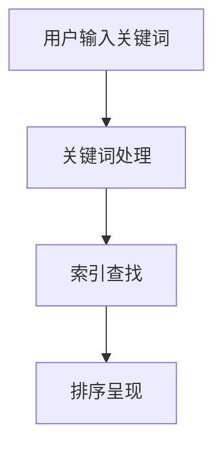

                 

### 《电商搜索中的上下文感知排序优化》

> **关键词：**电商搜索、上下文感知、排序算法、优化实践、案例分析

**摘要：**  
本文深入探讨了电商搜索中的上下文感知排序优化问题。首先，我们从电商搜索的基础出发，介绍了电商搜索的重要性、基本原理以及面临的挑战。接着，我们详细阐述了上下文感知技术的基础知识，包括自然语言处理基础、上下文信息提取方法等。随后，本文重点介绍了基于上下文感知的排序算法，包括传统的排序算法、基于机器学习的排序算法以及上下文感知排序算法。在此基础上，本文通过实践案例分析，展示了上下文感知排序优化在实际电商搜索中的应用。最后，本文探讨了上下文感知排序的发展趋势、面临的挑战及未来研究方向，为电商搜索的优化提供了有益的参考。

---

### 第一部分：电商搜索基础

#### 第1章：电商搜索概述

##### **1.1 电商搜索的重要性**

在电子商务领域，搜索引擎扮演着至关重要的角色。首先，搜索引擎是用户寻找商品信息的主要途径，能够帮助用户快速找到所需商品，从而提高用户满意度和购物体验。其次，搜索引擎有助于提高电商平台的转化率。当用户通过搜索引擎找到心仪的商品时，他们更有可能进行购买。因此，一个高效、准确的搜索引擎对于电商平台的盈利能力有着直接影响。

##### **1.2 电商搜索的基本原理**

电商搜索的基本原理主要包括关键词提取与处理、索引构建与查询处理。首先，用户输入关键词，搜索引擎会对其进行处理，包括去除停用词、词干提取、词性标注等。然后，搜索引擎会从索引中查找与关键词相关的商品信息，并按照一定规则进行排序，最终呈现给用户。

**Mermaid 流程图：**


##### **1.3 电商搜索的挑战**

电商搜索面临的主要挑战包括以下几个方面：

1. **多样化的商品信息**：电商平台上的商品种类繁多，不同商品的属性、价格、销量等都有所不同，这给搜索算法的设计带来了很大的挑战。

2. **用户个性化需求的满足**：用户的需求是多样化的，如何在海量商品中为每个用户提供最相关的商品，是电商搜索需要解决的重要问题。

3. **实时性要求**：随着用户行为的不断变化，搜索结果需要实时更新，以满足用户的即时需求。

4. **计算资源优化**：在保证搜索结果准确性的同时，如何优化计算资源，提高搜索效率，也是一个重要的挑战。

### 第2章：上下文感知技术基础

##### **2.1 上下文感知的概念**

上下文感知（Context Awareness）是指系统在特定环境中能够感知和理解环境信息，并根据这些信息做出智能决策的能力。在电商搜索中，上下文感知技术可以帮助搜索引擎更好地理解用户的搜索意图，从而提高搜索结果的准确性。

##### **2.2 自然语言处理基础**

自然语言处理（Natural Language Processing，NLP）是人工智能的重要分支，旨在让计算机理解和处理人类语言。在上下文感知技术中，NLP 技术起着关键作用。

- **词嵌入技术**：词嵌入是将词汇映射到高维空间中的向量表示，以便计算机能够理解词汇之间的关系。

- **序列模型与注意力机制**：序列模型（如循环神经网络 RNN 和长短时记忆网络 LSTM）能够处理序列数据，注意力机制则能够帮助模型关注重要的信息。

##### **2.3 上下文信息提取方法**

上下文信息提取是上下文感知技术的核心。以下是一些常用的上下文信息提取方法：

- **文本特征提取**：包括词袋模型、TF-IDF、词嵌入等。

- **时序特征提取**：包括用户点击行为的时间序列、用户浏览行为的时间间隔等。

- **空间特征提取**：包括用户地理位置、商品销售地区等。

### 第3章：上下文感知排序算法

##### **3.1 基于传统的排序算法**

传统的排序算法（如冒泡排序、选择排序、插入排序等）在电商搜索中有着广泛的应用。这些算法的主要优点是简单易懂，实现成本低。然而，它们在处理海量数据和高维度特征时，性能往往不佳。

**伪代码：**
```python
def bubble_sort(arr):
    n = len(arr)
    for i in range(n):
        for j in range(0, n-i-1):
            if arr[j] > arr[j+1]:
                arr[j], arr[j+1] = arr[j+1], arr[j]
    return arr
```

##### **3.2 基于机器学习的排序算法**

基于机器学习的排序算法能够更好地处理复杂特征和海量数据。以下是一些常用的机器学习算法：

- **传统机器学习算法**：如支持向量机（SVM）、决策树、随机森林等。

- **基于深度学习的排序算法**：如循环神经网络（RNN）、长短时记忆网络（LSTM）、Transformer 等。

**伪代码：**
```python
import tensorflow as tf

model = tf.keras.Sequential([
    tf.keras.layers.Embedding(input_dim=vocab_size, output_dim=embedding_dim),
    tf.keras.layers.LSTM(units=128),
    tf.keras.layers.Dense(units=1, activation='sigmoid')
])

model.compile(optimizer='adam', loss='binary_crossentropy', metrics=['accuracy'])
model.fit(x_train, y_train, epochs=10, batch_size=32)
```

##### **3.3 上下文感知排序算法综述**

上下文感知排序算法旨在通过融合用户上下文信息和商品特征，提高搜索结果的准确性。以下是一些典型的上下文感知排序算法：

- **基于上下文的协同过滤**：通过用户历史行为和上下文信息，预测用户对商品的偏好。

- **基于上下文的排序网络**：将用户上下文信息和商品特征输入到深度学习模型中，进行联合排序。

- **基于上下文的注意力机制**：通过注意力机制，动态调整商品特征在排序过程中的权重。

### 第二部分：上下文感知排序优化实践

#### 第4章：用户行为分析

##### **4.1 用户行为数据的收集**

用户行为数据是上下文感知排序优化的重要依据。以下是一些常用的数据收集方法：

- **用户点击行为**：通过日志收集用户在电商平台上的点击行为，如搜索关键词、点击的商品等。

- **用户浏览行为**：通过页面浏览数据，收集用户在电商平台上的浏览路径、停留时间等。

##### **4.2 用户行为数据分析**

用户行为数据分析主要包括数据预处理和特征工程。以下是一些常用的方法：

- **数据预处理**：包括数据清洗、数据去重、数据归一化等。

- **特征工程**：包括用户兴趣特征、用户需求特征、商品属性特征等。

##### **4.3 用户行为模型构建**

用户行为模型主要包括用户兴趣建模和用户需求建模。以下是一些常用的方法：

- **用户兴趣建模**：通过用户历史行为数据，预测用户可能感兴趣的商品。

- **用户需求建模**：通过用户历史行为数据，预测用户对商品的具体需求，如价格、品牌、功能等。

### 第5章：商品属性分析与关联

##### **5.1 商品属性分类**

商品属性分类是商品信息处理的重要环节。以下是一些常用的分类方法：

- **商品属性的类型**：包括商品基本属性（如品牌、价格、颜色等）和用户属性（如性别、年龄、购买力等）。

- **商品属性的层次结构**：包括商品分类体系（如一级分类、二级分类等）和属性层次（如基本属性、衍生属性等）。

##### **5.2 商品关联规则挖掘**

商品关联规则挖掘可以帮助电商平台发现用户之间的购买关联，提高商品推荐的准确性。以下是一些常用的关联规则挖掘算法：

- **Apriori算法**：通过支持度和置信度，发现商品之间的关联规则。

- **FP-Growth算法**：通过频繁模式挖掘，发现商品之间的关联规则。

##### **5.3 基于上下文的商品推荐**

基于上下文的商品推荐是电商搜索中的一项重要技术。以下是一些常用的推荐算法：

- **基于协同过滤的推荐算法**：通过用户历史行为和商品属性，预测用户可能感兴趣的商品。

- **基于内容的推荐算法**：通过商品属性和用户兴趣，预测用户可能感兴趣的

