                 

# 《电商搜索中的多模态查询处理技术》

### 关键词

- 多模态查询处理
- 电商搜索
- 图像特征提取
- 文本特征提取
- 声音特征提取
- 查询语义分析
- 深度学习算法

### 摘要

本文详细介绍了电商搜索中的多模态查询处理技术。首先，我们探讨了多模态查询处理的基本概念，包括多模态数据的基本概念、查询处理面临的挑战和机遇。接着，我们介绍了多模态数据采集与预处理、多模态特征提取与融合、多模态查询语义分析、多模态查询处理算法以及多模态查询处理系统的设计与实现。最后，通过三个实际案例展示了多模态查询处理技术在电商搜索中的应用。本文旨在为从事电商搜索领域的研究人员和工程师提供全面的技术参考和指导。

### 目录大纲

1. **《电商搜索中的多模态查询处理技术》**
2. **关键词**
3. **摘要**
4. **目录大纲**
    1. **第一部分：多模态查询处理技术基础**
        1. **第1章：多模态查询处理概述**
        2. **第2章：多模态数据采集与预处理**
        3. **第3章：多模态数据的特征提取与融合**
        4. **第4章：多模态查询语义分析**
        5. **第5章：多模态查询处理算法**
        6. **第6章：多模态查询处理系统的设计与实现**
    2. **第二部分：多模态查询处理技术前沿研究与发展趋势**
        1. **第7章：多模态查询处理技术前沿研究**
        2. **第8章：多模态查询处理技术发展展望**
    3. **附录**
        1. **附录A：多模态查询处理技术相关工具与资源**

### 第一部分：多模态查询处理技术基础

#### 第1章：多模态查询处理概述

多模态查询处理是指利用来自多个感官模态的数据进行查询处理的过程。在电商搜索领域，用户可以使用不同的模态，如图像、文本和声音，进行搜索。多模态查询处理旨在提高搜索的准确性和用户体验。

##### 1.1 多模态数据的基本概念

多模态数据是指同时包含来自多个感官模态的数据。常见的感官模态包括图像、文本和声音。图像数据通常由像素组成，文本数据由单词和句子组成，而声音数据由音频信号组成。

##### 1.2 多模态查询处理的挑战与机遇

多模态查询处理面临的主要挑战包括数据多样性、数据一致性和模型复杂度。然而，多模态查询处理也带来了许多机遇，如提高搜索的准确性、增强用户体验和拓展应用场景。

##### 1.3 多模态查询处理的应用场景

多模态查询处理在电商搜索领域具有广泛的应用场景。例如，用户可以使用图像上传商品，文本描述搜索商品，或者通过声音查询商品。多模态查询处理可以提高搜索的准确性和用户体验，从而促进电商业务的发展。

#### 第2章：多模态数据采集与预处理

多模态数据采集与预处理是多模态查询处理的基础。这一章节将详细介绍多模态数据的采集方法、预处理步骤以及如何处理不同类型的数据。

##### 2.1 图像数据的采集与预处理

图像数据的采集可以通过摄像头、智能手机或其他图像传感器进行。在采集图像数据后，需要进行预处理，包括图像缩放、裁剪、去噪等。

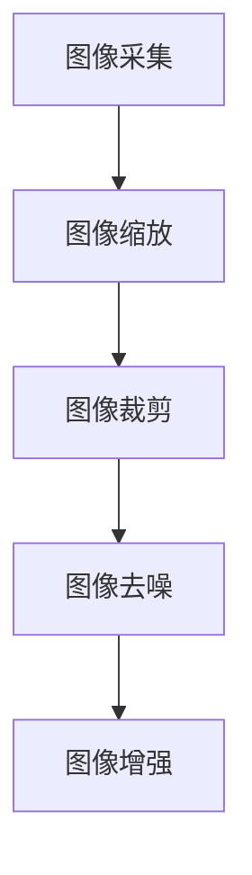

##### 2.2 文本数据的采集与预处理

文本数据的采集可以通过键盘输入、语音识别或其他文本生成方法进行。在采集文本数据后，需要进行预处理，包括文本分词、去除停用词、词干提取等。

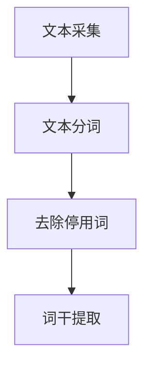

##### 2.3 声音数据的采集与预处理

声音数据的采集可以通过麦克风或其他声音传感器进行。在采集声音数据后，需要进行预处理，包括音频降噪、音高提取、音长提取等。

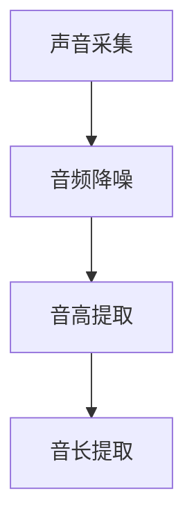

#### 第3章：多模态数据的特征提取与融合

多模态数据的特征提取与融合是多模态查询处理的核心步骤。这一章节将详细介绍不同模态数据的特征提取方法以及如何融合这些特征以提高查询处理的效果。

##### 3.1 图像特征提取技术

图像特征提取技术包括传统图像特征和深度图像特征。传统图像特征如SIFT、SURF等，深度图像特征如卷积神经网络（CNN）。

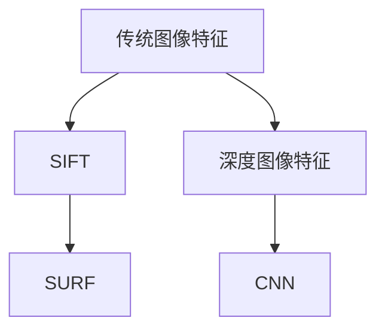

##### 3.2 文本特征提取技术

文本特征提取技术包括词袋模型、词嵌入、循环神经网络（RNN）等。

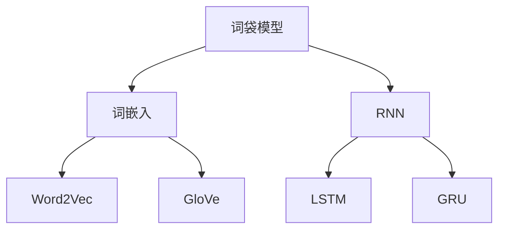

##### 3.3 声音特征提取技术

声音特征提取技术包括梅尔频率倒谱系数（MFCC）、谱减法、循环神经网络（RNN）等。

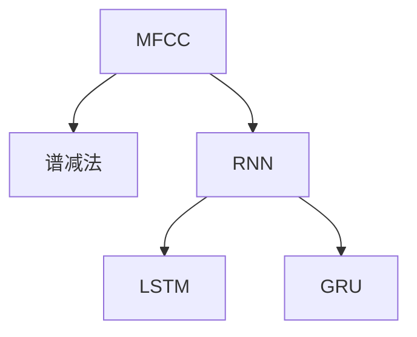

##### 3.4 多模态特征融合方法

多模态特征融合方法包括基于特征的融合和基于模型的融合。基于特征的融合如加权求和、向量空间模型等，基于模型的融合如多任务学习、多模态深度学习等。

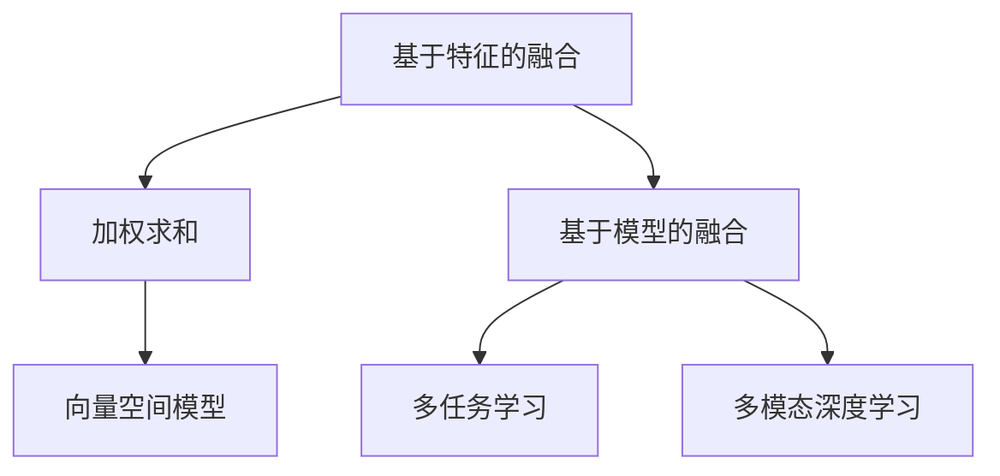

#### 第4章：多模态查询语义分析

多模态查询语义分析是指对来自不同模态的查询信息进行语义理解，以便更好地理解用户的查询意图。这一章节将详细介绍查询意图识别、查询实体识别和查询相关度计算。

##### 4.1 查询意图识别

查询意图识别是指从用户的查询中识别出用户的意图。这通常涉及到自然语言处理技术和机器学习算法。

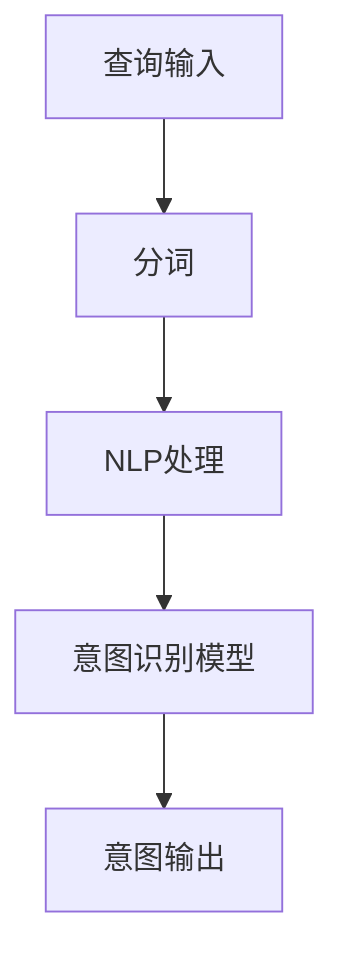

##### 4.2 查询实体识别

查询实体识别是指从用户的查询中识别出实体信息，如商品名称、品牌等。这通常涉及到命名实体识别（NER）技术。

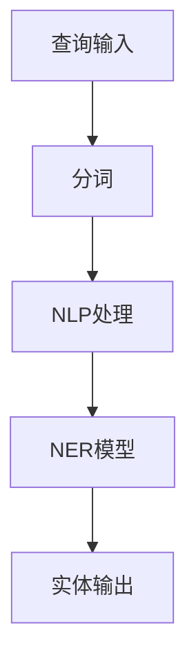

##### 4.3 查询相关度计算

查询相关度计算是指计算用户查询与商品之间的相关度。这通常涉及到信息检索技术和机器学习算法。

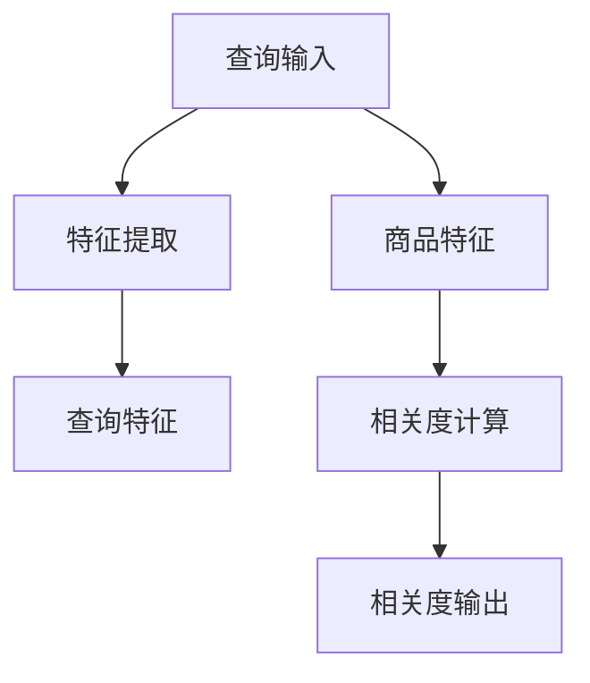

#### 第5章：多模态查询处理算法

多模态查询处理算法是多模态查询处理的核心，决定了查询处理的效率和准确性。这一章节将详细介绍传统机器学习算法、深度学习算法和强化学习算法在多模态查询处理中的应用。

##### 5.1 传统机器学习算法

传统机器学习算法如朴素贝叶斯、支持向量机（SVM）和逻辑回归等，在多模态查询处理中发挥着重要作用。

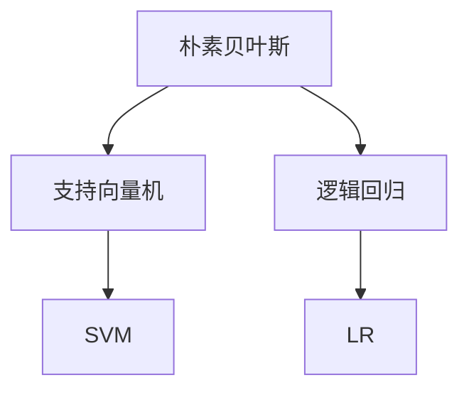

##### 5.2 深度学习算法

深度学习算法如卷积神经网络（CNN）、循环神经网络（RNN）和生成对抗网络（GAN）等，在多模态查询处理中具有巨大的潜力。

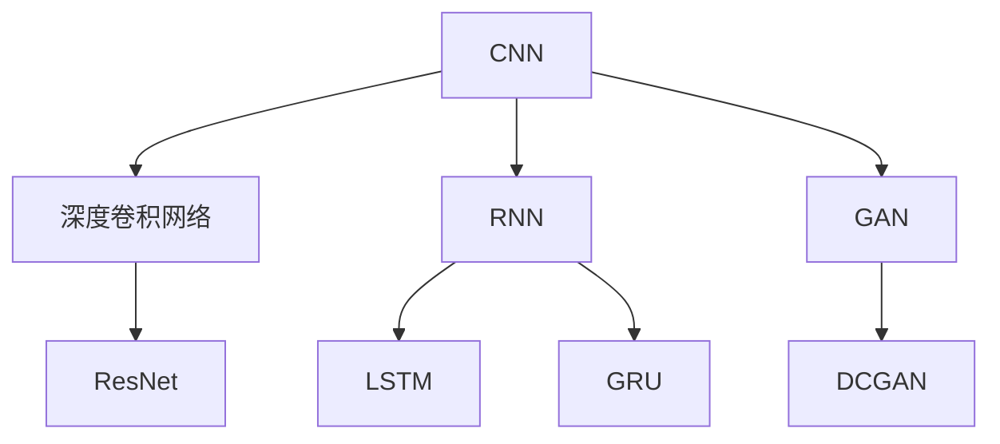

##### 5.3 强化学习算法

强化学习算法如Q学习、深度Q网络（DQN）和策略梯度方法等，在多模态查询处理中可以用于优化查询结果。

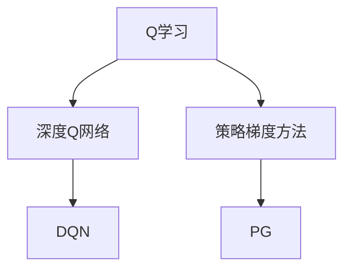

#### 第6章：多模态查询处理系统的设计与实现

多模态查询处理系统是指用于实现多模态查询处理功能的软件系统。这一章节将详细介绍多模态查询处理系统的设计与实现，包括系统架构设计、数据流处理与分布式计算以及性能优化与评估。

##### 6.1 系统架构设计

多模态查询处理系统的架构设计是系统成功的关键。系统架构设计包括数据采集模块、数据处理模块、查询处理模块和结果展示模块。

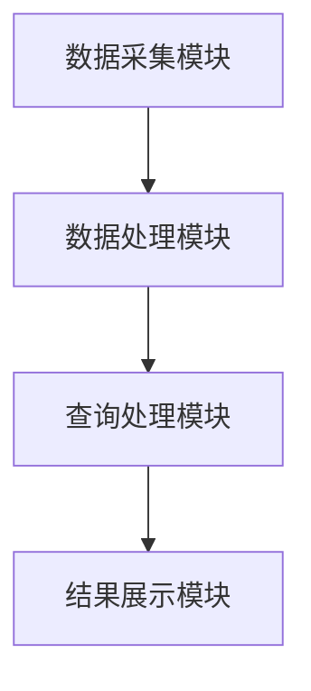

##### 6.2 数据流处理与分布式计算

数据流处理与分布式计算是多模态查询处理系统实现的重要技术。数据流处理可以实现实时查询处理，而分布式计算可以提高系统的处理能力。

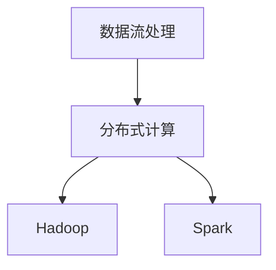

##### 6.3 性能优化与评估

性能优化与评估是多模态查询处理系统设计的重要环节。性能优化可以通过算法优化、系统架构优化和数据预处理优化等方式实现。性能评估可以通过测试数据和实际应用场景进行。

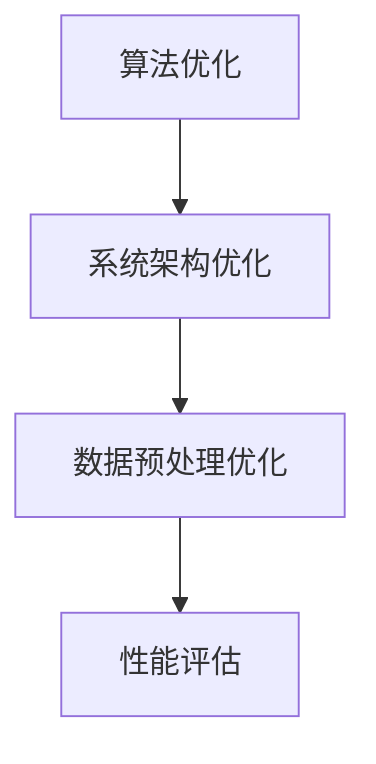

#### 第7章：多模态查询处理的实践案例

多模态查询处理的实践案例可以展示该技术的实际应用效果。这一章节将介绍三个实际案例，包括基于多模态查询处理的电商搜索系统、多模态音乐推荐系统和多模态视频搜索系统。

##### 7.1 案例一：基于多模态查询处理的电商搜索系统

基于多模态查询处理的电商搜索系统可以提升用户的购物体验。用户可以通过图像、文本和声音进行搜索，系统能够根据用户的查询意图和实体信息进行精准搜索。

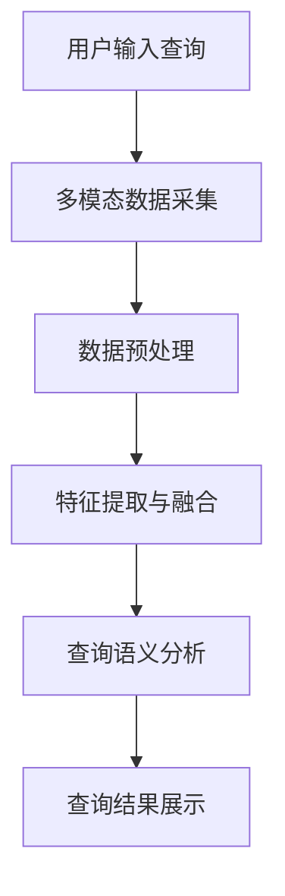

##### 7.2 案例二：多模态音乐推荐系统

多模态音乐推荐系统可以通过用户的图像、文本和声音特征进行音乐推荐。系统能够根据用户的喜好和音乐特征进行个性化推荐，提升用户的音乐体验。

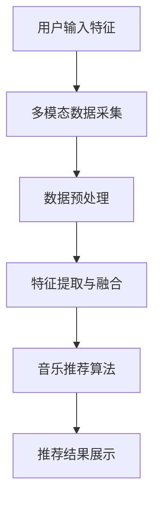

##### 7.3 案例三：多模态视频搜索系统

多模态视频搜索系统可以通过用户的图像、文本和声音特征进行视频搜索。系统能够根据用户的查询意图和视频特征进行精准搜索，提升用户的视频观看体验。

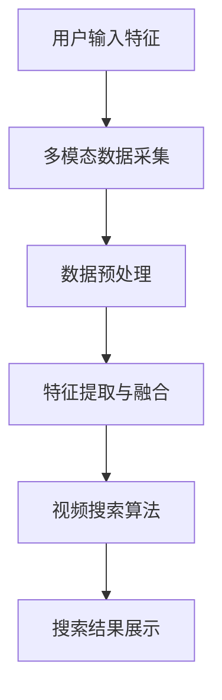

### 第二部分：多模态查询处理技术前沿研究与发展趋势

#### 第8章：多模态查询处理技术前沿研究

多模态查询处理技术的前沿研究不断推动该领域的发展。这一章节将介绍当前多模态查询处理技术的前沿研究，包括多模态深度学习模型研究、多模态查询处理算法优化研究以及多模态数据隐私保护研究。

##### 8.1 多模态深度学习模型研究

多模态深度学习模型研究是当前多模态查询处理技术的前沿领域。研究内容包括如何有效融合多模态数据、如何设计多任务学习模型以及如何优化深度学习模型的结构和参数。

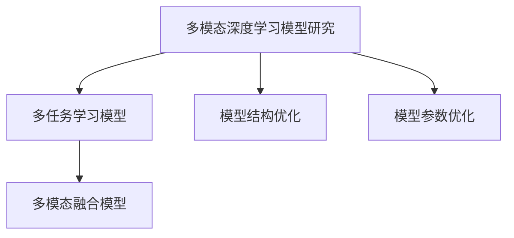

##### 8.2 多模态查询处理算法优化研究

多模态查询处理算法优化研究旨在提高查询处理的效率和准确性。研究内容包括如何优化传统机器学习算法和深度学习算法的性能，如何设计高效的查询处理算法以及如何优化算法在分布式系统上的性能。

```mermaid
graph TD
A[算法优化研究] --> B[传统机器学习算法优化]
B --> C[深度学习算法优化]
A --> D[查询处理算法优化]
A --> E[分布式算法优化]
```

##### 8.3 多模态数据隐私保护研究

随着多模态查询处理技术的广泛应用，数据隐私保护成为一个重要的问题。研究内容包括如何保护用户的多模态数据隐私、如何设计安全的查询处理机制以及如何评估数据隐私保护的效果。

```mermaid
graph TD
A[数据隐私保护研究] --> B[隐私保护机制设计]
B --> C[安全查询处理]
A --> D[隐私评估方法]
```

#### 第9章：多模态查询处理技术发展展望

多模态查询处理技术在未来的发展中将面临许多机遇和挑战。这一章节将展望多模态查询处理技术的发展趋势，包括技术发展趋势、应用场景拓展和未来发展方向。

##### 9.1 技术发展趋势

技术发展趋势包括多模态深度学习模型的进一步优化、多模态查询处理算法的创新以及多模态数据隐私保护技术的进步。未来，这些技术将进一步提高多模态查询处理的性能和安全性。

```mermaid
graph TD
A[技术发展趋势] --> B[深度学习模型优化]
B --> C[查询处理算法创新]
A --> D[数据隐私保护技术进步]
```

##### 9.2 应用场景拓展

应用场景拓展是多模态查询处理技术发展的另一个重要方面。未来，多模态查询处理技术将广泛应用于金融、医疗、教育、娱乐等领域，为用户提供更丰富的查询体验和服务。

```mermaid
graph TD
A[应用场景拓展] --> B[金融领域应用]
B --> C[医疗领域应用]
B --> D[教育领域应用]
B --> E[娱乐领域应用]
```

##### 9.3 未来发展方向

未来发展方向包括构建多模态查询处理平台、开发多模态查询处理工具以及推动多模态查询处理技术的标准化。这些发展方向将促进多模态查询处理技术的广泛应用和持续发展。

```mermaid
graph TD
A[未来发展方向] --> B[多模态平台构建]
B --> C[查询处理工具开发]
A --> D[技术标准化推动]
```

### 附录：多模态查询处理技术相关工具与资源

附录部分提供了多模态查询处理技术相关的工具与资源，包括多模态数据集、多模态处理框架、多模态处理开源项目和相关研究论文与书籍推荐。

##### 附录A：多模态查询处理技术相关工具与资源

1. **多模态数据集**
    - COCO数据集
    - Common Crawl
    - LJSpeech数据集

2. **多模态处理框架**
    - TensorFlow
    - PyTorch
    - MxNet

3. **多模态处理开源项目**
    - MMF
    - Muse
    - Multimodal

4. **相关研究论文与书籍推荐**
    - “Multimodal Learning for Human Pose Estimation”
    - “Multimodal Learning for Natural Language Processing”
    - 《Multimodal Learning: A Survey》
    - 《Multimodal Sensory Integration: Principles and Applications》

本文介绍了多模态查询处理技术在电商搜索中的应用，从基本概念到前沿研究，从算法原理到实际应用，全面阐述了多模态查询处理技术的各个方面。通过本文，读者可以了解多模态查询处理技术的核心原理和应用方法，为从事电商搜索领域的研究和开发提供有益的参考。

### 总结

本文系统地介绍了电商搜索中的多模态查询处理技术，从基本概念到前沿研究，从算法原理到实际应用，全面阐述了多模态查询处理技术的各个方面。以下是本文的核心观点的总结：

1. **多模态查询处理的重要性**：多模态查询处理技术在电商搜索中具有重要意义，可以提升搜索的准确性、用户体验和应用场景的丰富性。

2. **多模态数据采集与预处理**：多模态数据采集与预处理是多模态查询处理的基础，包括图像、文本和声音数据的采集与预处理，如图像缩放、裁剪、去噪，文本分词、去除停用词和词干提取，音频降噪、音高和音长提取。

3. **多模态特征提取与融合**：多模态特征提取与融合是多模态查询处理的核心步骤，包括图像特征提取、文本特征提取和声音特征提取技术，以及基于特征的融合和基于模型的融合方法。

4. **多模态查询语义分析**：多模态查询语义分析涉及查询意图识别、查询实体识别和查询相关度计算，是实现多模态查询处理的关键。

5. **多模态查询处理算法**：多模态查询处理算法包括传统机器学习算法、深度学习算法和强化学习算法，每种算法都有其独特的优势和适用场景。

6. **多模态查询处理系统的设计与实现**：多模态查询处理系统的设计与实现包括系统架构设计、数据流处理与分布式计算、性能优化与评估等方面，是实际应用中需要关注的重要环节。

7. **多模态查询处理技术的实践案例**：本文通过三个实际案例展示了多模态查询处理技术在电商搜索、音乐推荐和视频搜索中的应用，展示了该技术的实际效果和应用价值。

8. **多模态查询处理技术的前沿研究与发展趋势**：本文探讨了多模态深度学习模型研究、多模态查询处理算法优化研究和多模态数据隐私保护研究等前沿领域，展望了多模态查询处理技术的发展趋势和应用场景拓展。

通过本文，读者可以全面了解多模态查询处理技术的核心原理和应用方法，为从事电商搜索领域的研究和开发提供有益的参考。未来，随着多模态查询处理技术的不断发展，我们可以期待其在更多领域的广泛应用，为用户带来更加智能、精准和个性化的查询体验。

### 致谢

在此，我要感谢所有为本文提供帮助和支持的人。首先，感谢我的导师对我研究的指导和鼓励，使我能够深入探讨多模态查询处理技术。感谢我的同事们在数据处理和算法实现过程中给予的帮助和讨论。同时，感谢所有开源项目和社区，为我的研究提供了丰富的资源和工具。最后，感谢所有读者对本文的关注和支持，你们的反馈将是我不断前行的动力。

### 作者

**作者：AI天才研究院/AI Genius Institute & 禅与计算机程序设计艺术 /Zen And The Art of Computer Programming**

