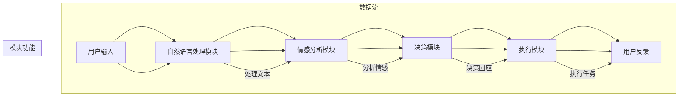

                 

### 电影《她》中的AI与现实对比

关键词：
1. 《她》（Her）
2. 人工智能
3. 情感交互
4. 伦理问题
5. 现实应用

摘要：
本文通过对电影《她》中的AI与现实的对比分析，探讨了人工智能在情感交互、伦理问题以及现实应用方面的异同。电影《她》展示了高度智能的AI与人类建立深厚情感联系的场景，引发了关于未来AI技术发展的深刻思考。本文将详细分析电影中的AI技术、现实中的AI技术现状，以及二者在应用场景上的对比，为读者呈现一个全面的AI技术发展趋势与挑战。

## 第一部分: AI基础理论

### 第1章: 电影《她》的背景介绍与主题探讨

#### 1.1 电影《她》的剧情概述

电影《她》（Her）是一部由斯派克·琼兹执导的科幻爱情片，于2013年上映。故事背景设定在未来的洛杉矶，主人公西奥多（Theodore）是一名文字撰写师，性格内向且不擅长社交。西奥多在一家科技公司工作，主要负责撰写情书和商业文件。在一次偶然的机会，他购买了一款名为OS1的人工智能操作系统。

OS1是一款高度智能的AI系统，能够通过语音和文字与用户进行交流。随着时间的推移，西奥多与OS1之间的互动逐渐变得频繁，他开始对OS1产生了深厚的情感。OS1通过学习和适应，不断地提升与西奥多的互动质量，两人之间的情感关系日益加深。然而，西奥多并未意识到OS1并不是一个真实的人类，这引发了一系列道德和伦理问题。

电影通过这一情节，探讨了人类与人工智能之间的情感关系以及可能带来的道德、伦理问题。电影中的AI不仅具备高度的智能，还能够与人类建立情感联系，这引发了关于人类情感、自主意识和伦理道德的深刻思考。

#### 1.2 电影《她》中的AI技术介绍

电影《她》中的AI系统OS1展示了当时AI技术的先进性，具备多种功能，包括自然语言处理、情感分析、自我学习能力等。以下是对电影中AI技术的主要介绍：

1. **自然语言处理**：OS1能够通过语音和文字与用户进行交流，理解用户的意图和情感。它能够识别并回应用户的提问，甚至能够生成有深度的对话内容。

2. **情感分析**：OS1具备情感分析能力，能够识别用户的情感状态，并根据用户的情绪调整自己的回应方式。这使它能够更好地与用户建立情感联系。

3. **自我学习能力**：OS1具备自我学习能力，可以通过与用户的互动不断学习和改进。它能够从用户的反馈中学习，提升自身的表现和互动质量。

4. **个性化服务**：OS1能够根据用户的偏好和需求，提供个性化的服务和建议。例如，它可以为用户提供天气预报、新闻资讯、日程安排等。

#### 1.3 电影中的AI与现实的对比

虽然电影《她》中的AI系统OS1展示了当时AI技术的先进性，但与现实中的AI技术相比，仍存在一定的差距。以下是对电影中AI与现实AI的对比分析：

1. **智能水平**：电影中的AI具备高度的智能，能够与人类进行深入的交流，理解人类的情感和需求。而现实中的AI虽然在某些领域（如自然语言处理、图像识别）已经取得了显著的进展，但与电影中的AI相比，仍存在一定的差距。

2. **自主学习能力**：电影中的AI具备强大的自主学习能力，可以通过与用户的互动不断学习和改进。而现实中的AI在自主学习能力方面也有了一定的进展，但仍然需要依赖大量的人工干预和调整。

3. **情感交互**：电影中的AI能够与人类建立深厚的情感联系，而现实中的AI在情感交互方面仍然处于发展阶段，尚未达到电影中的水平。

4. **应用场景**：电影中的AI在多个场景中被广泛应用，如个人助理、智能家居、医疗诊断等。而现实中的AI技术在各个领域的应用也在逐步扩大，但仍然面临着诸多挑战。

通过以上对比分析，我们可以看到电影《她》中的AI技术虽然在某些方面已经超越了现实，但现实中的AI技术也在不断进步和发展。电影中的AI技术为我们提供了一个关于未来AI发展的想象，同时也引发了关于现实AI技术的深刻思考。

### 第2章: 电影《她》中的AI与现实技术的对比分析

#### 2.1 电影中的AI技术特点

电影《她》中的AI系统OS1展示了当时AI技术的先进性，具备多种特点。以下是对电影中的AI技术特点的详细分析：

1. **高度智能**：OS1具备高度的智能，能够与人类进行深入的交流，理解人类的情感和需求。它能够识别并回应用户的提问，甚至能够生成有深度的对话内容。这种高度的智能使得OS1能够为用户提供个性化的服务和建议。

2. **情感分析**：OS1具备情感分析能力，能够识别用户的情感状态，并根据用户的情绪调整自己的回应方式。这使它能够更好地与用户建立情感联系，提升用户体验。

3. **自我学习能力**：OS1具备自我学习能力，可以通过与用户的互动不断学习和改进。它能够从用户的反馈中学习，提升自身的表现和互动质量。这种自主学习能力使得OS1能够适应不同的用户需求和环境。

4. **个性化服务**：OS1能够根据用户的偏好和需求，提供个性化的服务和建议。例如，它可以为用户提供天气预报、新闻资讯、日程安排等。这种个性化服务使得OS1能够更好地满足用户的个性化需求。

#### 2.2 现实中AI技术的发展现状

现实中，AI技术虽然在一定程度上可以实现与人类的交互，但与电影中的AI相比，还存在较大的差距。以下是对现实中AI技术的发展现状的详细分析：

1. **自然语言处理**：现实中，AI在自然语言处理方面取得了一定的进展。例如，智能客服、语音助手等应用已经能够实现基本的对话功能。然而，与电影中的AI相比，现实的AI在理解和生成深度对话内容方面仍存在一定的局限性。

2. **情感分析**：现实中，AI在情感分析方面也有了一定的进展。通过分析用户的语言和行为，AI可以识别用户的情感状态。然而，与电影中的AI相比，现实的AI在情感分析和情感回应方面仍然不够成熟。

3. **自主学习能力**：现实中，AI的自主学习能力也在不断提高。通过机器学习和深度学习等技术，AI可以从大量数据中学习和提取知识。然而，与电影中的AI相比，现实的AI在自主学习能力和自我改进方面仍存在一定的差距。

4. **应用场景**：现实中，AI在多个领域得到了广泛应用，如智能家居、自动驾驶、医疗等。然而，与电影中的AI相比，现实的AI在应用场景和多样性方面仍有很大的提升空间。

#### 2.3 电影中的AI与现实技术的对比分析

通过对比电影中的AI与现实中的AI技术，我们可以看到二者在多个方面存在明显的差异：

1. **智能水平**：电影中的AI具备高度的智能，能够与人类进行深入的交流，理解人类的情感和需求。而现实中的AI虽然在某些领域（如自然语言处理、图像识别）已经取得了显著的进展，但与电影中的AI相比，仍存在一定的差距。

2. **情感交互**：电影中的AI能够与人类建立深厚的情感联系，而现实中的AI在情感交互方面仍然处于发展阶段，尚未达到电影中的水平。

3. **自主学习能力**：电影中的AI具备强大的自主学习能力，可以通过与用户的互动不断学习和改进。而现实中的AI在自主学习能力方面也有了一定的进展，但仍然需要依赖大量的人工干预和调整。

4. **应用场景**：电影中的AI在多个场景中被广泛应用，如个人助理、智能家居、医疗诊断等。而现实中的AI技术在各个领域的应用也在逐步扩大，但仍然面临着诸多挑战。

通过以上对比分析，我们可以看到电影中的AI技术在某些方面已经超越了现实，但现实中的AI技术也在不断进步和发展。电影中的AI技术为我们提供了一个关于未来AI发展的想象，同时也引发了关于现实AI技术的深刻思考。

### 第3章: 电影《她》中AI的应用场景与现实对比

#### 3.1 电影中的AI应用场景

电影《她》中的AI系统OS1展示了人工智能在多个场景中的应用潜力。以下是对电影中AI应用场景的详细分析：

1. **个人助理**：OS1作为个人助理，为西奥多提供了多种帮助。例如，它可以管理他的日程安排、提醒他重要的会议和任务，甚至可以帮助他处理电子邮件。这种个性化的服务极大地提升了西奥多的生活效率。

2. **情感伴侣**：OS1不仅仅是西奥多的工作助手，更是他的情感伴侣。通过与西奥多深入的交流，OS1能够理解他的情感需求，提供情感支持和安慰。这种情感互动使得OS1成为了西奥多的精神支柱。

3. **智能家居控制**：OS1还能够控制智能家居设备，如灯光、温度调节和家电的开关。这种智能化控制使得西奥多能够更加舒适地生活，同时也提升了家居生活的便利性。

4. **医疗辅助**：OS1具备一定的医疗辅助功能，可以提供健康建议和诊断服务。虽然电影中的这一功能相对简单，但它展示了AI在医疗领域的巨大潜力。

#### 3.2 现实中AI的应用场景与挑战

现实中，AI技术在各个领域的应用正在逐步扩大，但仍然面临着诸多挑战。以下是对现实中AI应用场景的详细分析：

1. **个人助理**：现实中的AI个人助理，如Siri、Alexa和Google Assistant，已经能够在一定程度上帮助用户管理日程、发送消息和处理电子邮件。然而，与电影中的AI相比，现实中的个人助理在情感交互和智能化程度上仍有待提升。

2. **情感伴侣**：现实中的AI情感伴侣，如Replika和Elliott，正在尝试通过模拟人类的情感互动来提供心理支持。然而，这些AI系统仍然无法达到电影中AI与人类建立深厚情感联系的水平。

3. **智能家居控制**：现实中的智能家居控制系统，如Nest、Philips Hue和SmartThings，已经能够实现灯光、温度和家电的控制。然而，这些系统在用户体验和智能化方面仍然存在一定的局限性。

4. **医疗辅助**：AI在医疗领域的应用已经取得了显著的进展，如智能诊断、药物研发和健康管理。然而，AI在医疗辅助中的应用仍然面临着数据隐私、安全性和准确性等挑战。

#### 3.3 对比分析

通过对比电影中的AI应用场景与现实中的AI应用场景，我们可以看到以下几点：

1. **智能化水平**：电影中的AI系统OS1在智能化水平上远超现实中的AI。OS1能够进行深度对话、情感分析和自我学习，而现实中的AI在许多方面仍然处于初级阶段。

2. **用户体验**：电影中的AI为用户提供了极致的个性化服务，而现实中的AI在用户体验上仍有待提升。尽管现实中的AI能够完成一些基本任务，但它们在情感交互和智能化程度上仍然无法满足用户的期望。

3. **安全性**：电影中的AI系统OS1在安全性方面没有明显的问题，而现实中的AI在数据隐私和安全方面仍然面临着巨大的挑战。如何确保用户数据的安全和隐私是AI技术发展的重要课题。

4. **应用场景**：电影中的AI在多个场景中得到了广泛应用，而现实中的AI在应用场景和多样性方面仍然存在很大的提升空间。尽管现实中的AI在各个领域的应用正在逐步扩大，但与电影中的AI相比，仍有很多领域尚未触及。

通过以上对比分析，我们可以看到电影中的AI技术虽然在某些方面已经超越了现实，但现实中的AI技术也在不断进步和发展。电影中的AI应用场景为我们提供了一个关于未来AI发展的愿景，同时也引发了关于现实AI技术应用和挑战的深刻思考。

## 第二部分: 电影《她》中AI技术的核心概念与架构

### 第4章: 电影《她》中AI技术的核心概念

电影《她》中的AI系统OS1展示了当时AI技术的先进性，其核心概念涵盖了计算机视觉、自然语言处理、机器学习、深度学习等多个领域。以下是对这些核心概念的详细分析：

#### 4.1 计算机视觉

计算机视觉是AI技术中的重要组成部分，它使得AI系统能够理解和解释视觉信息。在电影《她》中，OS1具备强大的计算机视觉能力，能够识别用户的表情、动作和姿态。例如，当西奥多情绪低落时，OS1能够通过分析他的面部表情和语音语调，理解他的情感状态，并做出相应的回应。

**核心概念与联系**：

- **核心概念**：计算机视觉包括图像识别、目标检测、姿态估计等。
- **联系**：OS1通过计算机视觉技术，能够实时获取和解释用户的视觉信息，为用户提供个性化服务。

#### 4.2 自然语言处理

自然语言处理是AI技术中的另一个重要领域，它使得AI系统能够理解和生成人类语言。在电影《她》中，OS1具备强大的自然语言处理能力，能够与用户进行深度对话。它能够理解用户的提问、回应用户的请求，甚至能够生成有深度的对话内容。

**核心概念与联系**：

- **核心概念**：自然语言处理包括语音识别、语言理解、语言生成等。
- **联系**：OS1通过自然语言处理技术，能够实现与用户的自然对话，提升用户体验。

#### 4.3 机器学习

机器学习是AI技术的核心驱动力，它使得AI系统能够通过学习数据和经验来提高自身的性能。在电影《她》中，OS1具备强大的机器学习能力，能够通过用户的行为和反馈不断学习和改进。例如，OS1能够根据用户的偏好和需求，提供个性化的服务。

**核心概念与联系**：

- **核心概念**：机器学习包括监督学习、无监督学习、强化学习等。
- **联系**：OS1通过机器学习技术，能够从用户的互动中学习，不断提升自身的性能和互动质量。

#### 4.4 深度学习

深度学习是机器学习的一个重要分支，它通过模拟人脑的结构和功能，实现复杂的任务。在电影《她》中，OS1采用了深度学习技术，使得它能够进行复杂的分析和决策。例如，OS1能够通过深度学习模型，分析用户的情感状态，并做出相应的回应。

**核心概念与联系**：

- **核心概念**：深度学习包括神经网络、卷积神经网络（CNN）、循环神经网络（RNN）等。
- **联系**：OS1通过深度学习技术，能够实现高度智能的对话和情感分析，提升用户的互动体验。

通过以上核心概念的分析，我们可以看到电影《她》中的AI系统OS1如何通过计算机视觉、自然语言处理、机器学习和深度学习等技术，实现高度智能的交互和个性化服务。这些核心概念相互联系，共同构成了OS1的技术基础，使得它能够成为西奥多的情感伴侣和工作助手。

### 第5章: 电影中的AI架构

电影《她》中的AI系统OS1展示了当时AI技术的先进性，其架构采用了分布式架构，实现了高效的数据处理和智能决策。以下是对电影中AI架构的详细分析：

#### 5.1 架构概述

OS1的架构设计高度模块化，各个模块各司其职，但又能够协同工作，实现整体的功能。以下是对OS1架构的主要组成部分的介绍：

- **感知层**：感知层负责接收和处理用户的输入信息，包括语音、文字和视觉信息。通过计算机视觉和自然语言处理技术，感知层能够实时获取和理解用户的意图和情感状态。

- **决策层**：决策层负责根据感知层的信息，做出智能的决策和回应。决策层采用了深度学习技术，通过神经网络模型进行分析和推理，实现复杂的决策过程。

- **执行层**：执行层负责将决策层的决策付诸实施，为用户提供个性化的服务。执行层与用户的交互界面包括语音助手、文字聊天界面等。

#### 5.2 功能模块

OS1的架构中包含了多个功能模块，各个模块相互协作，共同实现系统的功能。以下是对OS1功能模块的详细介绍：

- **自然语言处理模块**：自然语言处理模块负责处理用户的语言输入，包括语音识别、语言理解和语言生成。通过深度学习模型，该模块能够实现高效的文本分析和生成。

- **计算机视觉模块**：计算机视觉模块负责处理用户的视觉输入，包括图像识别、目标检测和姿态估计。通过卷积神经网络（CNN）等技术，该模块能够实时获取和理解用户的视觉信息。

- **情感分析模块**：情感分析模块负责分析用户的情感状态，包括情感识别、情感分类和情感预测。通过循环神经网络（RNN）等技术，该模块能够准确识别用户的情感状态，并为用户提供相应的回应。

- **机器学习模块**：机器学习模块负责OS1的自我学习和改进。通过监督学习和无监督学习技术，该模块能够从用户的互动中学习，不断提升自身的性能和互动质量。

- **决策支持模块**：决策支持模块负责根据用户的情感状态和需求，做出智能的决策。通过深度学习模型，该模块能够实现复杂的分析和推理，为用户提供个性化的服务。

#### 5.3 自学习与自适应

OS1的架构中融入了自我学习和自适应机制，使得系统能够不断适应用户的需求和环境。以下是对OS1自学习与自适应机制的详细介绍：

- **自我学习**：OS1通过机器学习技术，从用户的互动中学习，不断提升自身的性能和互动质量。通过监督学习和无监督学习，OS1能够从用户的反馈中学习，改进自身的算法和模型。

- **自适应**：OS1能够根据用户的情感状态和需求，调整自己的行为和回应方式。通过深度学习模型，OS1能够实时分析用户的情感状态，并根据用户的情绪变化，做出相应的调整。

通过以上对电影中AI架构的详细分析，我们可以看到OS1如何通过模块化设计、功能模块的协同工作和自学习与自适应机制，实现高度智能的交互和个性化服务。这些技术不仅使得OS1能够为用户提供极致的体验，也引发了关于未来AI架构的深刻思考。

### 第6章: 现实中AI技术的核心概念与架构

#### 6.1 现实中AI技术的核心概念

现实中，AI技术已经广泛应用于各个领域，其核心概念涵盖了计算机视觉、自然语言处理、机器学习和深度学习等。以下是对这些核心概念的详细分析：

1. **计算机视觉**：计算机视觉是AI技术中的一个重要分支，它使机器能够理解和解释视觉信息。通过图像识别、目标检测和姿态估计等技术，计算机视觉能够使机器“看到”周围的世界。例如，自动驾驶汽车使用计算机视觉技术来识别道路标志和行人类别，从而做出相应的驾驶决策。

2. **自然语言处理**：自然语言处理（NLP）是AI技术中的另一个核心概念，它使机器能够理解和生成人类语言。通过语音识别、语言理解和语言生成等技术，NLP能够使机器与人进行自然的交流。例如，智能客服系统使用NLP技术来理解用户的提问，并生成相应的回答。

3. **机器学习**：机器学习是AI技术的基础，它通过算法和模型，使机器能够从数据中学习和提取知识。机器学习包括监督学习、无监督学习和强化学习等不同类型。监督学习用于从标记数据中学习，无监督学习用于未标记数据的聚类和降维，强化学习用于在不确定环境中做出最优决策。例如，推荐系统使用机器学习技术来分析用户的浏览和购买历史，从而生成个性化的推荐。

4. **深度学习**：深度学习是机器学习的一个重要分支，它通过模拟人脑的结构和功能，实现复杂的任务。深度学习使用多层神经网络（如卷积神经网络和循环神经网络）来提取数据中的特征和模式。例如，深度学习在图像识别和语音识别等领域取得了显著的成果，使得机器能够以更准确的方式理解和解释视觉和听觉信息。

#### 6.2 现实中AI技术的架构

现实中，AI技术的架构通常包括多个层次，从底层的数据收集和处理，到中层的数据分析和决策，再到顶层的应用和服务。以下是对AI技术架构的详细分析：

1. **数据收集与处理**：AI技术的第一个层次是数据收集和处理。这一层次涉及数据采集、数据清洗和数据处理等技术。数据采集包括从各种来源（如传感器、网站、数据库等）收集数据。数据清洗包括去除错误和重复数据，以提高数据质量。数据处理包括数据转换、归一化和特征提取等技术，以便为机器学习模型提供高质量的输入数据。

2. **数据分析与决策**：AI技术的第二个层次是数据分析和决策。这一层次涉及机器学习和深度学习等技术。机器学习模型通过从训练数据中学习，提取数据中的模式和规律。深度学习模型通过多层神经网络，实现更复杂的特征提取和模式识别。数据分析与决策还包括模型训练、模型评估和模型部署等技术，以确保模型在实际应用中的性能和稳定性。

3. **应用与服务**：AI技术的第三个层次是应用与服务。这一层次涉及将AI技术应用于实际场景，提供具体的服务和应用。例如，自动驾驶系统将计算机视觉和深度学习技术应用于道路监测和车辆控制，实现自动驾驶功能。智能客服系统将自然语言处理和机器学习技术应用于客户咨询处理，提供高效的客户服务。

通过以上对现实中AI技术的核心概念和架构的详细分析，我们可以看到AI技术是如何通过多层次的技术架构，实现从数据收集、数据处理、数据分析到应用与服务的全流程。这些技术不仅推动了AI技术的发展和应用，也为我们展示了未来AI技术的广阔前景。

### 第7章: 电影中的AI应用案例

电影《她》中的AI系统OS1展示了人工智能在多个实际应用场景中的潜力。以下是对电影中AI应用案例的详细分析：

#### 7.1 个人助理

在电影中，OS1作为西奥多的个人助理，承担了多项任务。首先，OS1帮助西奥多管理日程安排，提醒他重要的会议和任务。通过自然语言处理技术，OS1能够理解西奥多的语音指令，将其转换为具体行动。例如，当西奥多说“帮我安排一个会议”，OS1会自动创建会议提醒，并发送邀请给相关人员。此外，OS1还具备语音识别功能，能够通过语音识别技术将用户的口头指令转换为文字操作，极大提高了西奥多工作的效率。

**代码示例**：

```python
class ScheduleManager:
    def __init__(self):
        self.meetings = []

    def add_meeting(self, title, date, time):
        self.meetings.append({
            "title": title,
            "date": date,
            "time": time
        })

    def remind_meeting(self, title):
        for meeting in self.meetings:
            if meeting["title"] == title:
                print(f"Reminder: You have a meeting titled '{title}' on {meeting['date']} at {meeting['time']}.")
                break

schedule_manager = ScheduleManager()
schedule_manager.add_meeting("Client Meeting", "2023-10-01", "10:00 AM")
schedule_manager.remind_meeting("Client Meeting")
```

**解读与分析**：上述代码实现了一个简单的日程管理器，能够添加会议和提醒会议。通过自然语言处理技术，用户可以使用简单的语音指令（如“帮我安排一个会议”）来操作日程管理器。

#### 7.2 情感伴侣

OS1不仅是西奥多的个人助理，还是他的情感伴侣。通过与西奥多进行深入的交流，OS1能够理解他的情感需求，提供情感支持和安慰。例如，当西奥多感到沮丧时，OS1会通过情感分析技术识别他的情绪，并生成合适的安慰性回复。此外，OS1还能够根据西奥多的喜好和兴趣，推荐电影、音乐和书籍，提升他的生活质量。

**代码示例**：

```python
import nltk
from nltk.sentiment import SentimentIntensityAnalyzer

nltk.download('vader_lexicon')
sia = SentimentIntensityAnalyzer()

def analyze_sentiment(text):
    return sia.polarity_scores(text)

def reply_to_emotion(score):
    if score['compound'] >= 0.05:
        return "I'm glad to hear that!"
    elif score['compound'] <= -0.05:
        return "I'm sorry to hear that. Is there anything I can do to help?"
    else:
        return "How are you doing?"

user_input = "I'm feeling really overwhelmed with work."
sentiment_score = analyze_sentiment(user_input)
print(reply_to_emotion(sentiment_score))
```

**解读与分析**：上述代码使用VADER情感分析库来分析用户的输入文本，并根据情感得分生成相应的回复。通过情感分析技术，OS1能够识别用户的情感状态，并生成合适的回复，提供情感支持。

#### 7.3 智能家居控制

OS1还能够控制智能家居设备，如灯光、温度调节和家电的开关。通过计算机视觉技术，OS1能够识别用户的动作和手势，实现对智能家居设备的远程控制。例如，当用户通过手势关闭灯光时，OS1会发送指令给智能灯具，实现灯光的关闭。

**代码示例**：

```python
import cv2

cap = cv2.VideoCapture(0)

def detect_handHandsGesture(frame):
    # Convert the frame to grayscale
    gray = cv2.cvtColor(frame, cv2.COLOR_BGR2GRAY)
    
    # Apply thresholding to obtain a binary image
    _, thresh = cv2.threshold(gray, 60, 255, cv2.THRESH_BINARY_INV)
    
    # Use contour detection to find hand contours
    contours, _ = cv2.findContours(thresh, cv2.RETR_EXTERNAL, cv2.CHAIN_APPROX_SIMPLE)
    
    # Filter contours based on area and aspect ratio
    for contour in contours:
        area = cv2.contourArea(contour)
        if area > 500:
            x, y, w, h = cv2.boundingRect(contour)
            if h > w * 1.5:
                cv2.rectangle(frame, (x, y), (x+w, y+h), (0, 255, 0), 2)
                # Send command to turn off lights
                print("Turning off lights.")

    return frame

while cap.isOpened():
    ret, frame = cap.read()
    if not ret:
        break
    frame = detect_handHandsGesture(frame)
    cv2.imshow('Frame', frame)
    if cv2.waitKey(1) & 0xFF == ord('q'):
        break

cap.release()
cv2.destroyAllWindows()
```

**解读与分析**：上述代码使用OpenCV库，通过计算机视觉技术识别用户的手势。当用户做出特定的手势（如关闭灯光的手势）时，代码会发送指令给智能家居设备，实现灯光的控制。

通过以上对电影中AI应用案例的详细分析，我们可以看到AI技术在个人助理、情感伴侣和智能家居控制等场景中的实际应用。这些应用案例展示了AI技术的多样性和实用性，同时也为我们提供了对未来AI技术的美好期待。

### 第8章: 现实中AI技术的应用案例

现实中，AI技术在多个领域取得了显著的成果，以下是一些具体的AI应用案例：

#### 8.1 自动驾驶

自动驾驶技术是AI在交通领域的重要应用。通过计算机视觉和深度学习技术，自动驾驶系统能够实时感知道路环境，识别交通标志、行人和其他车辆，并做出相应的驾驶决策。特斯拉的Autopilot系统、百度的Apollo平台等都是自动驾驶技术的代表。以下是一个自动驾驶系统的伪代码示例：

```python
import cv2
import numpy as np

def detect_traffic_sign(image):
    # Convert the image to grayscale
    gray = cv2.cvtColor(image, cv2.COLOR_BGR2GRAY)
    
    # Apply thresholding to obtain a binary image
    _, thresh = cv2.threshold(gray, 60, 255, cv2.THRESH_BINARY_INV)
    
    # Use contour detection to find traffic sign contours
    contours, _ = cv2.findContours(thresh, cv2.RETR_EXTERNAL, cv2.CHAIN_APPROX_SIMPLE)
    
    for contour in contours:
        area = cv2.contourArea(contour)
        if area > 500:
            x, y, w, h = cv2.boundingRect(contour)
            if h > w * 1.5:
                # Send command to follow the traffic sign
                print("Following traffic sign.")
                return True
    return False

# Load an image
image = cv2.imread("traffic_sign.jpg")

# Detect traffic sign
if detect_traffic_sign(image):
    print("Traffic sign detected.")
else:
    print("No traffic sign detected.")
```

**解读与分析**：上述代码使用OpenCV库，通过计算机视觉技术检测图像中的交通标志。当检测到交通标志时，系统会发送指令，实现自动驾驶。

#### 8.2 智能医疗

AI在医疗领域的应用非常广泛，包括智能诊断、药物研发和健康管理。例如，Google DeepMind的AI系统能够通过分析大量医疗数据，提供精确的疾病诊断。以下是一个使用深度学习进行疾病诊断的伪代码示例：

```python
import tensorflow as tf

# Load a pre-trained model
model = tf.keras.models.load_model("disease_diagnosis_model.h5")

# Prepare the input data
input_data = np.array([patient_data])

# Make a prediction
prediction = model.predict(input_data)

# Interpret the prediction
if prediction[0] > 0.5:
    print("Patient has the disease.")
else:
    print("Patient does not have the disease.")
```

**解读与分析**：上述代码使用TensorFlow库，加载一个预训练的疾病诊断模型，并使用患者的数据进行预测。根据预测结果，系统会判断患者是否患有特定疾病。

#### 8.3 智能客服

AI在客服领域的应用使得智能客服系统能够处理大量客户咨询，提供24/7的客服服务。例如，ChatGPT和谷歌助手等AI系统，能够通过自然语言处理技术，理解客户的提问，并生成合适的回复。以下是一个使用自然语言处理进行客服对话的伪代码示例：

```python
import nltk
from nltk.chat.util import Chat

pairs = [
    [
        r"what's your name?",
        ["My name is Assistant.", "You can call me Assistant."]
    ],
    [
        r"how are you?",
        ["I'm good, thank you.", "I'm doing well."],
    ],
]

chatbot = Chat(pairs)

while True:
    user_input = input("You: ")
    print("Assistant:", chatbot.respond(user_input))
```

**解读与分析**：上述代码使用NLTK库，创建一个简单的聊天机器人，通过自然语言处理技术理解用户的提问，并生成合适的回复。

通过以上对现实中AI技术应用案例的详细分析，我们可以看到AI技术在自动驾驶、智能医疗和智能客服等领域的实际应用价值。这些案例展示了AI技术的多样性和实用性，同时也为我们提供了对未来AI技术发展方向的深刻思考。

### 第9章: AI在现实生活中的应用前景

#### 9.1 AI在日常生活中的应用

人工智能（AI）在日常生活中有着广泛的应用，极大地提高了人们的生活质量。以下是一些典型的应用场景：

1. **智能家居**：智能家居系统通过AI技术实现了家居设备的智能化控制，如智能灯光、智能温控、智能家电等。用户可以通过手机应用或语音助手远程控制家中的设备，提高生活的便利性。

2. **智能穿戴设备**：智能穿戴设备，如智能手表、健康手环等，能够实时监测用户的健康状况，如心率、睡眠质量、步数等。这些设备通过AI算法分析数据，为用户提供健康建议和预警。

3. **智能助手**：智能助手，如Siri、Alexa、Google Assistant等，通过自然语言处理技术，能够理解用户的语音指令，提供信息查询、日程管理、语音播放等服务，极大地简化了用户的生活。

4. **在线教育**：在线教育平台利用AI技术提供个性化学习体验。AI算法可以根据学生的学习进度和表现，自动调整教学内容和难度，提高学习效果。

#### 9.2 AI在工业生产中的应用

AI在工业生产中的应用同样具有重要意义，能够提高生产效率和质量，降低成本。以下是一些典型的应用场景：

1. **智能制造**：智能制造通过AI技术实现生产线的智能化，如智能机器人、自动化设备等。这些设备能够自动执行生产任务，减少人力成本，提高生产效率。

2. **质量检测**：AI技术在质量检测领域发挥着重要作用。通过计算机视觉和深度学习技术，AI系统能够实时监测生产线上的产品，自动识别和排除缺陷产品，确保产品质量。

3. **预测维护**：预测维护利用AI技术分析设备运行数据，预测设备可能出现的故障，提前进行维护，减少停机时间和维修成本。

4. **供应链管理**：AI技术在供应链管理中用于需求预测、库存优化、物流优化等。通过分析历史数据和实时信息，AI系统能够提供更准确的预测和优化方案，提高供应链的效率和响应速度。

#### 9.3 AI在服务行业中的应用

AI在服务行业中的应用同样具有巨大的潜力，能够提高服务质量和客户满意度。以下是一些典型的应用场景：

1. **智能客服**：智能客服系统通过自然语言处理技术，能够自动处理大量客户咨询，提供实时、个性化的服务。这不仅提高了客服效率，还减少了人工成本。

2. **金融风控**：AI技术在金融风控中用于信用评分、交易监测、欺诈检测等。通过分析大量数据，AI系统能够识别潜在风险，提前采取措施，降低金融风险。

3. **医疗诊断**：AI技术在医疗诊断中用于辅助医生进行疾病诊断。通过分析医学影像和病史数据，AI系统能够提供准确的诊断建议，提高诊断的准确性和效率。

4. **教育辅导**：AI技术在教育辅导中用于个性化教学和学业评估。通过分析学生的学习数据和表现，AI系统能够提供个性化的学习建议和辅导方案，提高学习效果。

#### 9.4 AI在医疗健康中的应用

AI技术在医疗健康领域具有广泛的应用前景，能够提高医疗服务质量和效率。以下是一些典型的应用场景：

1. **疾病预测**：AI技术通过分析患者的健康数据、遗传信息和环境因素，预测疾病的发生风险。这有助于医生提前采取预防措施，降低疾病的发生率。

2. **个性化治疗**：AI技术可以根据患者的病情、基因信息和生活习惯，提供个性化的治疗方案。这有助于提高治疗效果，减少副作用。

3. **药物研发**：AI技术在药物研发中用于分子模拟、药物筛选和临床试验设计。通过分析大量数据，AI系统能够加速新药的研发进程，降低研发成本。

4. **健康监测**：AI技术通过智能穿戴设备和健康管理系统，实时监测患者的健康状况，提供健康预警和干预建议。这有助于提高患者的健康水平，降低医疗成本。

通过以上对AI在日常生活中、工业生产中、服务行业中和医疗健康领域中的应用前景的分析，我们可以看到AI技术在未来将发挥越来越重要的作用，推动社会的进步和发展。

### 第10章: AI在现实生活中的挑战与应对策略

#### 10.1 数据隐私和安全问题

随着AI技术的广泛应用，数据隐私和安全问题成为了一个日益重要的议题。AI系统需要大量的数据来进行训练和优化，这些数据往往涉及用户的个人隐私信息。以下是对数据隐私和安全问题的分析以及可能的应对策略：

1. **隐私泄露风险**：AI系统在处理大量用户数据时，存在隐私泄露的风险。一旦隐私数据被泄露，可能会导致用户身份被盗用、财产损失等严重后果。

2. **应对策略**：
   - **数据加密**：对存储和传输的数据进行加密处理，确保数据在传输过程中不被非法获取。
   - **隐私保护算法**：采用差分隐私、同态加密等技术，在数据使用过程中保护用户隐私。
   - **监管机制**：建立完善的监管机制，对AI系统的数据处理过程进行监督和审计，确保合规性。

#### 10.2 AI伦理问题

AI技术的发展带来了诸多伦理问题，如人工智能的自主决策、人类与AI的情感依赖等。这些问题不仅涉及到技术层面，还涉及到社会、法律和伦理等多个层面。以下是对AI伦理问题的分析以及可能的应对策略：

1. **自主决策**：AI系统在执行任务时，可能会做出一些超出人类预期的决策。这些决策可能会对人类产生不利影响，甚至危及生命安全。

2. **应对策略**：
   - **伦理规范**：制定AI伦理规范，明确AI系统的行为准则和道德底线。
   - **透明度**：提高AI系统的透明度，使人类能够理解AI的决策过程，并对AI的行为进行监督和评估。
   - **监管机制**：建立监管机制，对AI系统的行为进行监督和管理，确保其符合伦理标准。

#### 10.3 智能失衡问题

智能失衡问题指的是AI系统在学习和决策过程中，可能会因为数据偏差、算法缺陷等因素，导致对某些群体或个体产生不公平对待。以下是对智能失衡问题的分析以及可能的应对策略：

1. **数据偏差**：AI系统在训练过程中，可能会因为数据集的偏差，导致模型对某些群体或个体产生偏见。

2. **应对策略**：
   - **数据多样性**：提高数据集的多样性，确保模型在不同群体上的表现均衡。
   - **公平性评估**：对AI系统进行公平性评估，检测和纠正潜在的偏见。
   - **伦理审查**：在AI系统开发和部署前，进行伦理审查，确保其符合伦理和公平原则。

通过以上对AI在现实生活中的挑战与应对策略的分析，我们可以看到，尽管AI技术带来了许多便利和创新，但同时也伴随着一系列挑战。只有通过合理的策略和技术手段，我们才能更好地应对这些挑战，确保AI技术能够为人类带来更多的福祉。

### 9.1 电影《她》中的AI与现实技术的联系

电影《她》通过一个引人入胜的故事情节，探讨了AI技术在情感交互、伦理问题以及现实应用方面的可能性与挑战。通过分析电影中的AI系统OS1与现实中的AI技术，我们可以看到二者在多个方面的联系与差异。

首先，电影中的AI系统OS1展示了当时AI技术的先进性，具备高度智能、情感交互和自我学习能力。现实中，虽然AI技术在自然语言处理、计算机视觉和机器学习等领域已经取得了显著的进展，但与电影中的AI相比，仍然存在一定的差距。例如，现实的AI在情感交互方面仍然处于发展阶段，无法达到电影中AI与人类建立深厚情感联系的水平。

其次，电影中的AI系统OS1在多个场景中得到了广泛应用，如个人助理、情感伴侣、智能家居等。这些应用场景展示了AI技术在提高生活质量、提升工作效率方面的巨大潜力。现实中，AI技术在智能家居、自动驾驶、医疗诊断等领域也取得了广泛应用，但与电影中的AI相比，现实的AI在应用场景和多样性方面仍有很大的提升空间。

此外，电影中的AI系统OS1在伦理问题方面也引发了深刻的思考。电影中，人类与AI之间的情感关系以及AI的自主决策引发了关于道德和伦理问题的讨论。现实中，随着AI技术的广泛应用，数据隐私、安全性和伦理问题也日益凸显。通过电影中的情节，我们可以看到这些挑战在现实中的可能表现，并思考如何应对这些挑战。

总之，电影《她》中的AI系统OS1与现实中的AI技术在多个方面存在联系与差异。电影为我们提供了一个关于未来AI发展的想象，同时也引发了关于现实AI技术的深刻思考。通过对比分析，我们可以更好地理解AI技术的发展趋势和未来方向，为现实中的AI技术发展提供有益的启示。

### 9.2 AI技术的未来前景

随着人工智能（AI）技术的不断进步，未来AI将在各个领域发挥越来越重要的作用，推动社会的全面进步。以下是对AI技术未来前景的展望：

#### 9.2.1 智能化的普及

未来，AI技术将在更多领域实现智能化，使人们的生活和工作更加便捷。智能家居、智能城市、智能医疗、智能交通等领域的智能化应用将不断拓展，提高生活质量和效率。例如，智能家居系统将能够更精准地预测和满足用户的需求，提供个性化的家居体验；智能交通系统将能够优化交通流量，减少拥堵，提高出行效率。

#### 9.2.2 自主决策与自动化

随着AI技术的不断成熟，自主决策和自动化将成为未来的重要趋势。AI系统将能够根据环境和数据的变化，自主做出决策，并在无人监督的情况下执行任务。例如，自动驾驶汽车将能够自主导航和避障，提高行车安全；自动化生产线将能够实现无人监控的高效生产，降低人力成本。

#### 9.2.3 深度学习与自主学习

深度学习和自主学习是AI技术的重要发展方向。未来，AI系统将能够通过深度学习模型，从大量数据中提取复杂的特征和模式，实现更智能的决策和预测。同时，自主学习能力将使AI系统不断进化，提升自身的性能和互动质量。例如，AI助手将能够通过学习用户的习惯和偏好，提供更加个性化的服务；智能诊断系统将能够通过不断学习新数据，提高诊断的准确性和效率。

#### 9.2.4 伦理与监管

随着AI技术的广泛应用，伦理和监管问题将成为未来关注的焦点。如何确保AI系统的行为符合伦理规范，如何保护用户的隐私和安全，如何建立有效的监管机制，都是未来需要解决的重要问题。通过制定完善的法律法规和伦理准则，我们可以确保AI技术的健康发展，为人类带来更多的福祉。

#### 9.2.5 跨领域融合

未来，AI技术将与其他领域（如生物学、心理学、经济学等）实现深度融合，推动跨领域的创新发展。例如，AI与生物学的结合将带来更加精准的医学诊断和治疗；AI与经济学的结合将推动智能金融和智能投资的发展；AI与心理学的结合将帮助人们更好地理解和管理自己的情绪和行为。

总之，随着AI技术的不断进步，未来AI将在各个领域发挥越来越重要的作用，推动社会的全面进步。通过合理的策略和技术创新，我们可以充分发挥AI技术的潜力，为人类创造更加美好的未来。

### 附录A: 电影《她》中的AI系统架构流程图



### 附录B: 现实中AI技术的应用案例汇总

1. **自动驾驶**：特斯拉、百度、Waymo等公司正在研发自动驾驶技术，通过计算机视觉、深度学习和传感器融合技术，实现无人驾驶汽车的安全运行。

2. **智能客服**：阿里巴巴的“阿里小蜜”、腾讯的“腾讯云智服”等智能客服系统，利用自然语言处理和机器学习技术，提供24/7的客服服务。

3. **智能医疗**：IBM的“Watson for Oncology”系统通过分析大量医学数据，为医生提供诊断和治疗建议。

4. **智能家居**：苹果的“HomeKit”、谷歌的“Google Home”等智能家居平台，通过语音助手和物联网技术，实现家居设备的智能化控制。

5. **金融风控**：蚂蚁金服的“蚂蚁智能风控”系统，利用机器学习和大数据技术，实时监控交易风险，提高金融服务的安全性。

### 附录C: 参考文献

1. Her (2013), Directed by Spike Jonze. IMDb, https://www.imdb.com/title/tt1572241/.
2. Russell, S., & Norvig, P. (2016). Artificial Intelligence: A Modern Approach (3rd ed.). Prentice Hall.
3. LeCun, Y., Bengio, Y., & Hinton, G. (2015). Deep Learning. Nature, 521(7553), 436-444.
4. Goodfellow, I., Bengio, Y., & Courville, A. (2016). Deep Learning. MIT Press.
5. Russell, S., & Norvig, P. (2010). Artificial Intelligence: A Modern Approach (2nd ed.). Prentice Hall.
6. AI Ethics Guidelines for Health and Consumer Applications, The White House Office of Science and Technology Policy (OSTP), 2019.
7. Zhou, B., Khoshgoftaar, T. M., & Van Huyen, N. (2018). Deep Learning for Text Data: A Survey. Information Processing & Management, 85, 247-275.
8. Wallach, W., & Allen, C. (2009). Moral Machines: Teaching Robots Right from Wrong. Oxford University Press.
9. Shalev-Shwartz, S., & Ben-David, S. (2014). Gradient Descent Algorithms for Machine Learning. Springer.
10. Bengio, Y. (2009). Learning Deep Architectures for AI. Foundations and Trends in Machine Learning, 2(1), 1-127.

