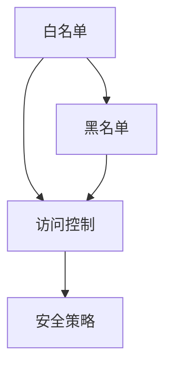

                 

# 白名单：防止未经授权的访问

> **关键词**：白名单、网络安全、访问控制、未经授权访问、安全策略、隐私保护

> **摘要**：本文将探讨白名单在防止未经授权访问中的重要作用。通过详细解析白名单的基本概念、技术原理、实际应用和未来发展趋势，帮助读者了解白名单的必要性和重要性，并掌握如何实施和维护白名单策略，以提升系统的安全性。

#### 目录大纲

1. **概述与理论基础**
    1.1 白名单概述
    1.2 未经授权访问的风险与挑战
    1.3 白名单技术原理

2. **白名单的实际应用**
    2.1 操作系统中的白名单应用
    2.2 网络安全设备中的白名单
    2.3 应用软件中的白名单

3. **白名单的实战与案例分析**
    3.1 白名单的实施与维护
    3.2 白名单案例解析

4. **白名单的未来发展趋势**
    4.1 人工智能与白名单
    4.2 白名单与零信任安全模型

5. **附录**
    5.1 白名单技术资源与工具
    5.2 常见问题与解答

### 概述与理论基础

#### 1.1 白名单概述

白名单（Whitelist）是一种访问控制策略，用于定义哪些实体或主体被授权访问特定资源或系统。在网络安全领域，白名单被广泛应用于防止未经授权的访问，确保只有经过验证和授权的用户、设备或应用程序才能访问受保护的资源。

**白名单的定义**

白名单是一个包含允许访问特定资源的实体列表。这些实体可以是用户、设备、IP地址、域名、应用程序等。当访问请求发生时，系统会检查请求者是否在白名单中。如果请求者在白名单中，则允许访问；否则，拒绝访问。

**白名单与黑名单的关系**

白名单与黑名单（Blacklist）是网络安全中的两种对立策略。黑名单用于定义哪些实体或主体是被禁止访问特定资源或系统的。与白名单不同，黑名单通常包含恶意实体、已知的攻击者IP地址、恶意软件等。

白名单和黑名单可以同时使用，形成一个更全面的访问控制策略。白名单确保授权访问，黑名单确保拒绝未经授权的访问，二者结合可以提供更强大的安全保护。

**白名单的应用场景**

白名单可以在多种场景下使用，以下是一些常见应用场景：

- **网站访问控制**：网站管理员可以使用白名单来限制只有特定用户或IP地址才能访问特定网页或系统。
- **应用程序访问控制**：应用程序开发人员可以使用白名单来确保只有授权用户或设备才能访问应用程序。
- **电子邮件过滤**：电子邮件服务提供商可以使用白名单来确保授权用户收到的邮件不被误判为垃圾邮件。
- **网络设备管理**：网络管理员可以使用白名单来限制只有授权用户才能远程管理网络设备。

#### 1.2 白名单的安全价值

白名单在网络安全中具有重要的作用，其安全价值主要体现在以下几个方面：

**白名单在网络安全中的作用**

1. **防止未经授权的访问**：通过白名单，系统管理员可以明确哪些实体被授权访问特定资源，从而有效防止未经授权的访问。
2. **减少误报率**：与黑名单相比，白名单减少了误报的可能性。当只有经过验证的实体被允许访问时，系统更容易检测到恶意行为。
3. **提高系统性能**：白名单减少了系统需要处理的访问请求数量，从而提高系统性能和响应速度。

**白名单对用户体验的影响**

1. **简化访问流程**：白名单策略简化了用户的访问流程。用户只需在初始注册或身份验证过程中被加入白名单，之后即可轻松访问受保护的资源，无需重复身份验证。
2. **提高用户满意度**：简化访问流程可以提升用户的满意度，减少因重复验证导致的用户流失。

**白名单与隐私保护的关系**

1. **隐私保护**：白名单可以帮助保护用户的隐私。通过明确哪些实体被授权访问用户数据，可以减少数据泄露的风险。
2. **数据安全**：白名单策略可以确保只有经过验证和授权的实体才能访问敏感数据，从而提高数据安全性。

#### 1.3 白名单技术原理

白名单技术原理主要包括以下几个方面：

**白名单的工作机制**

1. **规则设置**：白名单系统根据访问控制策略定义一系列规则，明确哪些实体被授权访问特定资源。
2. **访问检查**：当访问请求发生时，系统会检查请求者是否在白名单中。如果请求者在白名单中，则允许访问；否则，拒绝访问。
3. **动态更新**：白名单规则可以根据需求进行动态更新，确保授权实体始终被允许访问受保护的资源。

**白名单的核心组件**

1. **访问控制列表（ACL）**：ACL是一组规则，用于定义哪些实体被授权访问特定资源。ACL通常包含一系列访问控制条目（ACE），每个ACE定义一个授权实体和一个访问权限。
2. **访问控制策略（ACS）**：ACS是一组策略，用于配置和管理ACL。ACS可以定义ACL的规则、优先级和更新策略。
3. **访问控制环境（ACE）**：ACE是ACL中的一个条目，用于定义一个授权实体和一个访问权限。ACE通常包含实体标识符（如用户ID、IP地址等）和访问权限（如读取、写入、执行等）。

通过以上技术原理，白名单系统可以有效地防止未经授权的访问，确保系统的安全性和可靠性。

### 未经授权访问的风险与挑战

未经授权访问是网络安全领域的一个重要问题，它可能导致严重的安全威胁和损失。本节将详细探讨未经授权访问的风险、常见手段以及相应的防范措施。

#### 2.1 未经授权访问的危害

未经授权访问的危害主要体现在以下几个方面：

**数据泄露**

未经授权的访问可能导致敏感数据的泄露，这包括个人身份信息、商业机密、医疗记录等。数据泄露不仅损害了用户的隐私，还可能导致企业声誉受损，经济损失严重。

**网络攻击**

未经授权的访问可能被恶意攻击者利用，对系统进行进一步的攻击，如分布式拒绝服务（DDoS）攻击、恶意软件传播等。这些攻击可能导致系统瘫痪，业务中断，甚至导致更大的安全漏洞。

**资源滥用**

未经授权的访问可能被用于滥用系统资源，如大量占用计算资源、存储资源等，从而影响系统的正常运行，降低用户体验。

#### 2.2 未经授权访问的常见手段

未经授权访问的常见手段包括以下几种：

**社会工程学**

社会工程学是一种利用人类心理弱点来获取信息的攻击手段。攻击者可能通过欺骗、威胁或其他手段诱骗用户泄露敏感信息，如密码、身份验证码等。这些信息可以帮助攻击者绕过系统的安全机制，获得未经授权的访问。

**恶意软件**

恶意软件包括病毒、木马、勒索软件等。这些软件可以通过网络传播，感染用户的设备，从而获取未经授权的访问权限。一旦恶意软件获取了系统的控制权，攻击者可以随意操作系统，窃取数据或进行其他恶意行为。

**中间人攻击**

中间人攻击是一种网络攻击手段，攻击者截获并篡改网络通信数据。在中间人攻击中，攻击者扮演了“中间人”的角色，监听并修改两个通信实体之间的通信内容。通过中间人攻击，攻击者可以获取未经授权的访问权限，窃取敏感信息或进行其他恶意行为。

#### 2.3 防范未经授权访问的措施

为了防范未经授权访问，可以采取以下措施：

**加强访问控制**

通过实施严格的访问控制策略，确保只有经过验证和授权的用户才能访问系统资源。访问控制可以包括身份验证、授权和审计等环节。

**使用多因素身份验证**

多因素身份验证（MFA）是一种安全措施，要求用户在登录时提供两个或更多的验证因素，如密码、手机验证码、指纹等。这可以大大提高系统的安全性，防止密码泄露或社会工程学攻击。

**定期更新系统和软件**

定期更新系统和软件可以修复已知的漏洞和缺陷，降低被攻击的风险。管理员应该及时安装安全补丁，更新安全软件，以保持系统的最新状态。

**监控和审计**

监控系统活动可以帮助及时发现和阻止未经授权的访问。通过审计日志和监控工具，管理员可以跟踪用户行为，识别潜在的安全威胁。

**教育用户**

用户安全意识是防范未经授权访问的重要一环。通过教育用户了解安全最佳实践，如设置强密码、不轻易泄露个人信息等，可以提高整体系统的安全性。

通过以上措施，可以有效降低未经授权访问的风险，提高系统的安全性。

### 白名单技术原理

白名单是一种强大的访问控制机制，通过明确授权访问的实体，从而有效防止未经授权的访问。本节将深入探讨白名单的工作机制、核心组件以及与访问控制的关系。

#### 3.1 白名单的工作机制

白名单的工作机制可以分为以下几个步骤：

1. **规则设置**：管理员根据安全策略定义白名单规则，明确哪些实体被授权访问特定资源。这些实体可以是用户、设备、IP地址、应用程序等。

2. **访问请求**：当用户或设备尝试访问受保护的资源时，系统会检查访问请求是否符合白名单规则。

3. **访问检查**：系统会检查请求者的身份和访问权限，确定其是否在白名单中。如果请求者在白名单中，系统允许访问；否则，拒绝访问。

4. **动态更新**：白名单规则可以根据实际需求进行动态更新。例如，管理员可以随时添加或删除授权实体，调整访问权限等。

5. **日志记录**：系统会记录所有访问请求和操作日志，以便管理员进行审计和监控。这有助于及时发现和应对潜在的安全威胁。

#### 3.2 白名单的核心组件

白名单的实现依赖于几个核心组件，包括访问控制列表（ACL）、访问控制策略（ACS）和访问控制环境（ACE）。

1. **访问控制列表（ACL）**：ACL是一组规则，用于定义哪些实体被授权访问特定资源。每个ACL包含多个访问控制条目（ACE）。ACE定义了一个授权实体和一个访问权限。ACL通常存储在文件、数据库或系统配置文件中。

2. **访问控制策略（ACS）**：ACS是一组策略，用于配置和管理ACL。ACS定义了ACL的规则、优先级和更新策略。例如，管理员可以设置ACL的生效顺序，或定期更新ACL以适应新的安全需求。

3. **访问控制环境（ACE）**：ACE是ACL中的一个条目，用于定义一个授权实体和一个访问权限。ACE通常包含以下信息：

   - 实体标识符（如用户ID、IP地址、域名等）
   - 访问权限（如读取、写入、执行等）
   - 权限级别（如允许、拒绝等）

ACE是白名单的核心组件，决定了哪些实体被允许访问特定资源。通过组合多个ACE，可以形成复杂的访问控制策略。

#### 3.3 白名单与访问控制的关系

白名单是访问控制策略的一部分，与访问控制密切相关。访问控制是一种安全机制，用于确保只有授权用户才能访问受保护的资源。访问控制可以分为以下几类：

1. **自主访问控制（DAC）**：DAC允许用户根据其权限自主决定资源的访问权限。例如，文件所有者可以决定哪些用户可以读取或修改文件。

2. **强制访问控制（MAC）**：MAC由系统管理员定义和实施访问控制策略。例如，操作系统可能会根据文件的标签或分类来决定用户的访问权限。

3. **基于角色的访问控制（RBAC）**：RBAC基于用户的角色分配访问权限。例如，管理员、普通用户和访客可能具有不同的访问权限。

4. **基于属性的访问控制（ABAC）**：ABAC根据用户的属性（如地理位置、时间等）分配访问权限。例如，公司可能会根据员工的工作时间和地点来限制访问某些资源。

白名单通常与DAC、RBAC或ABAC结合使用，以提供更细粒度的访问控制。通过白名单，管理员可以明确哪些实体被授权访问特定资源，从而增强系统的安全性。

#### 3.4 白名单的优势与局限

白名单具有以下优势：

1. **安全性高**：白名单确保只有经过验证和授权的实体才能访问受保护的资源，从而降低未经授权访问的风险。
2. **可管理性强**：白名单规则相对简单，便于管理员进行配置和管理。
3. **用户体验好**：用户只需在初始注册或身份验证过程中被加入白名单，之后即可轻松访问受保护的资源，无需重复验证。

然而，白名单也存在一些局限：

1. **维护成本高**：随着授权实体的增加，白名单的维护成本可能会增加。管理员需要定期更新白名单，确保授权实体的访问权限。
2. **初始部署复杂**：部署白名单策略可能需要修改系统配置和应用程序代码，对现有系统进行一定的改造。

总的来说，白名单是一种有效的访问控制机制，可以在多种场景下提供强大的安全保护。通过合理配置和维护白名单，可以有效降低未经授权访问的风险，提高系统的安全性。

### 白名单的实际应用

白名单在实际应用中具有广泛的应用场景，涵盖了操作系统、网络安全设备和应用软件等多个领域。本节将详细探讨白名单在这些场景中的具体应用。

#### 4.1 操作系统中的白名单应用

操作系统是计算机系统的核心组成部分，白名单在操作系统中的应用至关重要。以下是在操作系统中使用白名单的一些具体应用场景：

**Windows操作系统中的白名单**

Windows操作系统提供了强大的访问控制机制，包括用户账户控制（UAC）、安全策略编辑器（SECPOL）和注册表编辑器等工具。管理员可以通过以下方式配置白名单：

1. **用户账户控制（UAC）**：UAC是一种安全功能，用于限制用户对系统的修改权限。管理员可以将特定用户添加到UAC白名单中，使其无需确认即可执行管理员级别的操作。

2. **安全策略编辑器（SECPOL）**：SECPOL是一种图形界面工具，用于配置安全策略。管理员可以创建和编辑访问控制列表（ACL），定义哪些用户或组被授权访问特定资源。

3. **注册表编辑器**：注册表编辑器是一种文本界面工具，用于修改Windows注册表。管理员可以在注册表中添加或修改安全设置，实现白名单功能。

**Linux操作系统中的白名单**

Linux操作系统同样提供了丰富的访问控制机制，包括文件权限、SELinux和安全增强型Linux（SELinux）等。以下是在Linux系统中使用白名单的一些方法：

1. **文件权限**：Linux使用文件权限来控制用户对文件的访问。管理员可以通过修改文件权限，将特定用户或组的访问权限设置为“允许”。

2. **SELinux**：SELinux是一种强制访问控制（MAC）机制，用于增强Linux系统的安全性。管理员可以使用SELinux策略，定义哪些进程可以访问哪些资源。

3. **PAM**：PAM（Pluggable Authentication Modules）是一种模块化身份验证机制，用于管理和控制用户认证。管理员可以在PAM配置文件中配置白名单，限制特定用户的登录权限。

#### 4.2 网络安全设备中的白名单

网络安全设备如防火墙、入侵检测系统和入侵防御系统（IDS/IPS）等，也广泛应用了白名单技术。以下是在这些设备中使用白名单的一些具体应用场景：

**防火墙中的白名单**

防火墙是一种网络安全设备，用于过滤进出网络的数据包。白名单在防火墙中的应用包括：

1. **允许特定IP地址**：管理员可以在防火墙中配置白名单，允许来自特定IP地址的数据包通过，从而确保只有授权的实体可以访问网络资源。

2. **允许特定端口**：防火墙可以基于端口进行访问控制。管理员可以将特定端口的访问权限设置为“允许”，从而只允许与这些端口相关的流量通过。

3. **允许特定协议**：防火墙可以基于协议进行访问控制。管理员可以将特定协议的访问权限设置为“允许”，从而确保只有特定的网络协议可以使用。

**入侵检测系统中的白名单**

入侵检测系统（IDS）是一种网络安全工具，用于检测和响应网络中的潜在威胁。白名单在IDS中的应用包括：

1. **允许正常流量**：IDS可以配置白名单，允许来自白名单中的流量通过，从而减少误报率。正常流量被标记为“信任”，从而不会被误认为攻击行为。

2. **限制监控范围**：通过配置白名单，管理员可以缩小IDS的监控范围，专注于检测未标记为“信任”的流量，提高检测效率和准确性。

3. **响应白名单中的攻击**：在某些情况下，攻击者可能会尝试模仿正常流量，绕过IDS的检测。通过配置白名单，IDS可以识别并响应来自白名单之外的异常流量，从而提高系统的安全性。

#### 4.3 应用软件中的白名单

应用软件如Web浏览器、企业应用和客户端应用程序等，也广泛应用了白名单技术。以下是在这些应用软件中使用白名单的一些具体应用场景：

**Web浏览器中的白名单**

Web浏览器是一个常见的应用软件，白名单在Web浏览器中的应用包括：

1. **限制插件运行**：浏览器可以配置白名单，允许特定的插件运行。这有助于防止恶意插件或不受信任的插件对系统造成危害。

2. **限制网站访问**：管理员可以配置白名单，限制用户访问特定网站。这有助于防止恶意网站或恶意链接的访问，提高系统的安全性。

3. **增强隐私保护**：浏览器可以配置白名单，允许用户访问特定的隐私保护工具，如广告拦截器、恶意软件拦截器等。这有助于提高用户的隐私保护水平。

**企业应用系统中的白名单**

企业应用系统如ERP系统、CRM系统等，也广泛应用了白名单技术。以下是在这些系统中使用白名单的一些具体应用场景：

1. **用户权限控制**：企业应用系统可以配置白名单，限制用户对特定功能或数据的访问。这有助于确保用户只能访问其权限范围内的资源，防止数据泄露和滥用。

2. **应用程序访问控制**：企业应用系统可以配置白名单，允许特定的应用程序或模块访问系统资源。这有助于确保只有经过授权的应用程序可以访问系统，防止恶意应用程序的攻击。

3. **安全审计**：企业应用系统可以记录所有访问操作，并将访问操作与白名单进行比对。这有助于管理员进行安全审计，及时发现和应对潜在的安全威胁。

通过在操作系统、网络安全设备和应用软件中应用白名单技术，可以有效防止未经授权的访问，提高系统的安全性。白名单的灵活性和可扩展性使其成为网络安全策略的重要组成部分。

### 白名单的实施与维护

实施和维护白名单是确保系统安全性的关键步骤。以下是实施和维护白名单的详细步骤、维护策略以及安全监控的建议。

#### 7.1 白名单的实施步骤

1. **需求分析**

   在实施白名单之前，首先需要进行需求分析。分析内容包括确定需要保护的关键资源、需要授权访问的用户和设备、以及对安全性的具体要求。需求分析的结果将指导后续的白名单规则制定。

2. **规则制定**

   根据需求分析的结果，制定具体的白名单规则。这些规则应明确哪些实体被授权访问特定资源，以及访问的权限级别。规则制定应考虑灵活性，以便在必要时进行更新。

3. **系统配置**

   在制定好白名单规则后，需要在相应的系统上进行配置。例如，在操作系统中配置ACL，在防火墙中配置访问控制策略，在应用程序中设置访问控制规则等。配置过程应严格遵循规则，确保规则的正确实施。

4. **测试验证**

   配置完成后，需要进行测试验证，确保白名单规则能够正确执行，并有效防止未经授权的访问。测试应覆盖各种访问场景，包括正常访问和异常访问。

5. **部署实施**

   在测试验证通过后，将白名单策略部署到实际环境中。在部署过程中，应确保所有相关的系统和设备都更新了最新的白名单规则。

6. **培训与沟通**

   为了确保白名单策略的有效执行，需要对相关人员进行培训，使其了解白名单的概念、规则和操作方法。同时，与用户进行有效沟通，确保他们理解白名单策略的重要性，并遵守相关规则。

#### 7.2 白名单的维护策略

1. **定期更新**

   白名单规则需要定期更新，以适应环境的变化和新的安全威胁。管理员应定期检查白名单规则，删除不再需要访问的实体，添加新的授权实体。

2. **规则优化**

   随着时间和环境的变化，白名单规则可能需要优化。管理员应持续监控系统的安全事件和攻击模式，根据实际情况调整规则，提高白名单策略的适应性。

3. **安全监控**

   实施白名单后，应建立安全监控机制，持续监控系统的访问行为和异常活动。通过监控，可以及时发现潜在的安全威胁，并采取相应的应对措施。

4. **日志审计**

   系统应记录所有访问请求和操作日志，以便管理员进行审计和追踪。日志审计可以帮助发现潜在的安全问题，并支持安全事件的调查。

#### 7.3 安全监控建议

1. **实时监控**

   实施实时监控，可以及时发现和应对异常访问行为。可以使用入侵检测系统（IDS）、入侵防御系统（IPS）和其他安全监控工具，实时收集和分析系统日志和流量数据。

2. **自动化响应**

   建立自动化响应机制，当检测到异常访问行为时，系统能够自动采取相应的应对措施，如隔离威胁源、阻断恶意流量等。

3. **定期审计**

   定期对白名单策略进行审计，检查是否存在漏洞或潜在的安全风险。审计应包括规则有效性、访问控制配置的合规性等。

4. **安全培训**

   定期为员工提供安全培训，提高其安全意识和技能。员工应了解白名单策略的重要性，并学会识别和处理潜在的安全威胁。

通过实施和维护有效的白名单策略，可以显著提高系统的安全性，防止未经授权的访问。定期更新、规则优化和持续监控是确保白名单策略有效性的关键。

### 白名单案例解析

白名单在实际应用中具有广泛的场景，以下通过两个具体案例解析白名单在实践中的应用效果。

#### 8.1 案例一：企业内网的访问控制

**案例背景**

某大型企业为了保障内部网络的安全性，决定实施白名单策略，以防止未经授权的访问。企业内部网络包含了多个关键业务系统，如ERP系统、CRM系统、财务系统等，企业希望通过白名单策略保护这些关键资源。

**白名单策略制定**

1. **确定受保护资源**：企业首先确定了需要保护的资源，包括所有关键业务系统、重要数据库和服务器。

2. **创建白名单规则**：企业根据用户角色和访问需求，制定了详细的白名单规则。例如，管理员角色可以访问所有业务系统，普通员工只能访问与其工作相关的系统。

3. **配置访问控制列表（ACL）**：企业在操作系统中配置了访问控制列表（ACL），根据白名单规则设置了不同的访问权限。

4. **测试与验证**：企业对白名单策略进行了严格的测试与验证，确保规则能够正确执行，并有效防止未经授权的访问。

**案例效果分析**

实施白名单策略后，企业内网的访问安全性得到了显著提高。以下为实施效果：

- **未经授权访问减少**：由于只有经过授权的用户和设备才能访问关键资源，未经授权的访问事件显著减少。

- **误报率降低**：白名单策略减少了误报率，系统更容易识别和阻止恶意访问。

- **用户满意度提升**：用户无需重复身份验证，访问流程简化，用户满意度提升。

- **数据安全增强**：白名单策略有效地保护了企业的关键数据，减少了数据泄露的风险。

**经验总结**

- **明确受保护资源**：明确需要保护的资源，是制定有效白名单策略的基础。

- **灵活制定规则**：白名单规则应灵活，能够适应不同的访问需求和角色权限。

- **严格测试与验证**：测试与验证是确保白名单策略有效性的关键步骤。

#### 8.2 案例二：网站的安全防护

**案例背景**

某电子商务网站为了防止恶意访问和欺诈行为，决定实施白名单策略。该网站需要保护用户数据、交易记录和系统配置等重要资源。

**白名单策略制定**

1. **确定受保护资源**：网站确定了需要保护的资源，包括用户数据库、交易记录、系统配置文件等。

2. **识别恶意访问特征**：通过分析历史攻击数据，网站识别了常见的恶意访问特征，如频繁的登录失败、异常的访问时间等。

3. **配置防火墙白名单**：网站在防火墙中配置了白名单，只允许来自白名单IP地址的访问。对于不在白名单中的访问请求，防火墙会自动拒绝。

4. **集成入侵检测系统**：网站集成了入侵检测系统（IDS），通过监控网络流量和用户行为，及时发现和阻止恶意访问。

**案例效果分析**

实施白名单策略后，网站的安全性得到了显著提升。以下为实施效果：

- **恶意访问减少**：由于只有经过验证的IP地址才能访问网站，恶意访问事件显著减少。

- **数据泄露风险降低**：白名单策略有效地保护了用户数据和交易记录，减少了数据泄露的风险。

- **用户体验改善**：用户访问速度提升，误报率降低，用户体验得到改善。

- **运营成本降低**：由于减少了恶意访问，网站运营成本降低，同时，由于系统的安全性提高，用户信任度增加，业务发展得到了推动。

**经验总结**

- **识别恶意访问特征**：通过分析历史数据，识别恶意访问特征，是制定有效白名单策略的关键。

- **综合利用白名单和其他安全措施**：白名单策略应与其他安全措施（如防火墙、入侵检测系统等）结合使用，形成多层次的安全防护。

- **持续优化白名单策略**：根据新的威胁态势和业务需求，持续优化白名单策略，确保其有效性。

通过以上案例解析，可以看出，白名单策略在实践中的应用效果显著，不仅提高了系统的安全性，还改善了用户体验，降低了运营成本。实施和维护白名单策略需要明确受保护资源、识别恶意访问特征、灵活制定规则以及持续优化策略。

### 白名单的未来发展趋势

随着网络安全威胁的不断演变，白名单技术也在不断发展。未来，白名单将更加智能化，与人工智能（AI）和零信任安全模型（Zero Trust Model）相结合，为系统提供更全面的安全保障。

#### 9.1 人工智能与白名单

人工智能（AI）在白名单中的应用主要体现在以下几个方面：

1. **行为分析**：AI技术可以分析用户行为模式，识别异常行为。例如，通过机器学习算法，系统可以学习正常用户的访问习惯，一旦检测到异常行为，如频繁的登录失败或异常的访问时间，系统会自动采取措施，防止潜在的恶意访问。

2. **自动更新规则**：AI技术可以自动更新白名单规则，根据新的威胁态势和业务需求，动态调整访问控制策略。这有助于提高白名单策略的适应性，减少人工干预。

3. **预测性安全**：AI技术可以预测未来的安全威胁，提前采取防护措施。例如，通过分析网络流量和用户行为，AI系统可以预测潜在的安全事件，并自动调整白名单策略，防止潜在的攻击。

4. **自动化响应**：AI技术可以实现自动化响应，当检测到安全事件时，系统可以自动采取相应的措施，如隔离威胁源、阻断恶意流量等，提高应急响应速度。

#### 9.2 机器学习在白名单优化中的作用

机器学习在白名单优化中发挥着重要作用，主要体现在以下几个方面：

1. **异常检测**：通过训练机器学习模型，系统可以识别异常访问行为。例如，使用聚类算法，系统可以将正常访问和异常访问区分开来，从而更准确地实施访问控制。

2. **规则优化**：机器学习可以帮助优化白名单规则，根据历史数据调整规则，提高规则的准确性。例如，通过分析用户的访问历史，机器学习模型可以预测哪些用户最可能访问特定资源，从而优化访问控制策略。

3. **自动化部署**：机器学习可以自动化部署白名单策略，根据业务需求和威胁态势，动态调整访问控制规则。这有助于减少人工干预，提高系统的响应速度。

#### 9.3 白名单与零信任安全模型

零信任安全模型（Zero Trust Model）是一种以最小权限原则为基础的安全策略，强调在任何情况下都不信任任何内部或外部网络，对所有访问进行严格验证和授权。白名单与零信任安全模型结合，可以提供更全面的安全保障。

1. **最小权限原则**：零信任安全模型要求所有访问都经过严格的验证和授权，只有经过验证的用户和设备才能访问资源。这与白名单的基本原理高度一致，白名单技术可以与零信任安全模型无缝结合。

2. **动态访问控制**：零信任安全模型强调动态访问控制，根据用户的身份、设备、地理位置等因素，动态调整访问权限。白名单技术可以与零信任安全模型中的动态访问控制机制结合，提高访问控制的灵活性。

3. **多层次防护**：零信任安全模型强调多层次防护，通过多个安全层保护系统资源。白名单技术可以作为多层次防护的一部分，与其他安全措施（如防火墙、入侵检测系统等）结合使用，形成更全面的安全防护。

#### 9.4 白名单的应用前景

未来，白名单将在多个领域得到广泛应用，以下是一些应用前景：

1. **云计算和边缘计算**：随着云计算和边缘计算的发展，白名单技术将用于保护云服务和边缘设备。通过实施白名单策略，可以确保只有经过授权的用户和设备可以访问云服务和边缘资源。

2. **物联网（IoT）**：物联网设备数量庞大，安全风险较高。白名单技术可以用于保护物联网设备，确保只有经过验证的设备可以连接到物联网网络。

3. **智能城市**：智能城市中的大量数据和应用需要高度安全性。白名单技术可以用于保护智能城市中的关键基础设施和数据，确保只有经过授权的用户和设备可以访问。

4. **零信任安全模型**：随着零信任安全模型的发展，白名单技术将成为零信任安全架构的核心组件，为系统提供强大的安全保障。

总的来说，白名单技术在未来的发展中，将更加智能化、动态化，与人工智能和零信任安全模型相结合，为系统提供更全面的安全保障。通过不断优化和创新发展，白名单将在更多领域发挥重要作用。

### 附录

#### 附录A：白名单技术资源与工具

A.1 **白名单技术资源**

1. **开源工具与框架**：
   - **AppArmor**：Linux内核的强制访问控制（MAC）框架，用于限制应用程序的访问权限。
   - **SELinux**：安全增强型Linux，提供强制访问控制（MAC）功能。
   - **Firejail**：基于AppArmor的沙箱工具，用于隔离应用程序。
   - **OWASP ZAP**：开源网络应用程序安全测试工具，包括白名单和黑名单功能。

2. **相关书籍与文章**：
   - 《Linux Security Cookbook》：提供了大量关于Linux安全配置的实用技巧。
   - 《Practical Malware Analysis》：介绍了如何分析恶意软件，包括访问控制策略。

A.2 **白名单工具列表**

1. **Windows白名单工具**：
   - **Windows Defender Application Control**：用于限制应用程序的运行。
   - **Device Guard**：通过虚拟化确保只有经过签名的应用程序才能运行。
   - **Microsoft AppLocker**：允许管理员创建规则，限制哪些应用程序可以运行。

2. **Linux白名单工具**：
   - **AppArmor**：提供强制访问控制（MAC）功能。
   - **SELinux**：提供强制访问控制（MAC）功能。
   - **Firejail**：用于隔离应用程序。

3. **网络设备白名单工具**：
   - **pfSense**：基于FreeBSD的防火墙和路由器软件，支持白名单和黑名单功能。
   - **FortiGate**：Fortinet的下一代防火墙，支持灵活的访问控制策略。

#### 附录B：常见问题与解答

B.1 **白名单常见问题**

Q1：白名单如何防止恶意访问？
A1：白名单通过定义一个允许访问的实体列表，确保只有经过验证和授权的实体才能访问受保护的资源。通过这种方式，白名单可以阻止未经授权的访问和恶意行为。

Q2：白名单是否会影响系统性能？
A2：白名单本身不会显著影响系统性能。然而，如果白名单规则过于复杂或数量庞大，可能会导致访问控制检查的时间增加。因此，合理规划和优化白名单规则是关键。

Q3：白名单如何与黑名单结合使用？
A3：白名单和黑名单可以同时使用，形成更全面的访问控制策略。白名单确保授权访问，而黑名单确保拒绝未经授权的访问。两者结合，可以提供更强大的安全保护。

通过附录A和附录B，读者可以获取更多关于白名单技术的资源和工具，并解决在实际应用中遇到的问题。

### 附加内容

#### 核心概念与联系

白名单、黑名单、访问控制、安全策略等是网络安全中重要的核心概念。它们之间存在密切的联系，构成了一个完整的安全体系。

**白名单与黑名单的联系**

白名单和黑名单是网络安全中的两种对立策略。白名单定义了哪些实体被授权访问特定资源，而黑名单定义了哪些实体被禁止访问特定资源。二者结合使用，可以形成一个更全面的访问控制策略。

**访问控制与安全策略的联系**

访问控制是一种安全机制，用于确保只有经过授权的用户或设备才能访问受保护的资源。安全策略则是访问控制的实施指南，定义了访问控制的规则和策略。白名单和安全策略密切相关，白名单规则是安全策略的具体体现。

**Mermaid流程图表示**

以下是一个简化的Mermaid流程图，用于表示这些核心概念之间的联系：



#### 核心算法原理讲解

白名单算法的核心是定义和验证访问权限。以下是一个简化的伪代码，用于描述白名单算法的基本原理：

```pseudo
// 白名单算法
function isAllowed(entity, whitelist):
    for entry in whitelist:
        if entry.entity == entity:
            return entry.permission
    return "denied"

// 示例
whitelist = [
    {entity: "user1", permission: "read"},
    {entity: "user2", permission: "write"}
]

entity = "user1"
result = isAllowed(entity, whitelist)
print(result) // 输出：read
```

在这个伪代码中，`isAllowed`函数接收一个实体和一个白名单作为输入。它遍历白名单中的每个条目，检查实体是否在白名单中。如果找到匹配的条目，函数返回该条目的权限；否则，返回“denied”。

#### 数学模型和数学公式

在某些情况下，白名单算法可能涉及到数学模型和公式。以下是一个简单的例子，用于计算基于角色的访问权限。

**公式**：

\[ P_{r} = \sum_{i=1}^{n} w_{i} \cdot r_{i} \]

其中：
- \( P_{r} \) 是总权限得分
- \( w_{i} \) 是角色 \( r_{i} \) 的权重
- \( r_{i} \) 是角色 \( r_{i} \) 的权限得分

**示例**：

假设有一个角色 \( r_{1} \) 和 \( r_{2} \)，它们的权重分别为 0.6 和 0.4。角色 \( r_{1} \) 的权限得分为 3，角色 \( r_{2} \) 的权限得分为 2。

\[ P_{r} = 0.6 \cdot 3 + 0.4 \cdot 2 = 1.8 + 0.8 = 2.6 \]

这意味着该角色的总权限得分为 2.6。

通过这些数学模型和公式，可以更精确地控制访问权限，实现更细粒度的访问控制。

#### 项目实战

**实战目的**：

本部分将展示如何在实际项目中实现白名单机制，包括开发环境搭建、源代码实现和代码解读与分析。

**开发环境搭建**：

1. 创建一个虚拟环境，安装必要的依赖：
   ```shell
   python3 -m venv white_list_env
   source white_list_env/bin/activate
   pip install flask
   ```

2. 初始化项目结构：
   ```shell
   mkdir app
   touch app/__init__.py app/route.py
   ```

**源代码实现**：

**app/__init__.py**：

```python
from flask import Flask
from . import routes

def create_app():
    app = Flask(__name__)
    app.config['SECRET_KEY'] = 'your_secret_key'
    
    app.register_blueprint(routes.bp)
    
    return app
```

**app/route.py**：

```python
from flask import Blueprint, request, jsonify
from . import white_list

bp = Blueprint('main', __name__)

@bp.route('/api/check', methods=['POST'])
def check_access():
    data = request.get_json()
    entity = data.get('entity')
    if white_list.is_allowed(entity):
        return jsonify({"status": "allowed"}), 200
    else:
        return jsonify({"status": "denied"}), 403
```

**white_list.py**：

```python
whitelist = [
    'user1',
    'user2'
]

def is_allowed(entity):
    return entity in whitelist
```

**代码解读与分析**：

1. **创建 Flask 应用**：
   在 `app/__init__.py` 中，我们创建了一个 Flask 应用，并注册了蓝图 `routes`。

2. **定义路由**：
   在 `app/route.py` 中，我们定义了一个 POST 路由 `/api/check`，用于检查实体是否在白名单中。

3. **访问控制**：
   在 `white_list.py` 中，我们定义了一个简单的白名单列表，并实现了一个 `is_allowed` 函数，用于检查实体是否在白名单中。

通过这个项目实战，我们可以看到如何在一个简单的 Flask 应用中实现白名单机制。这个示例虽然简单，但展示了实现白名单的基本步骤和结构，为实际项目提供了参考。

### 作者信息

**作者：AI天才研究院/AI Genius Institute & 禅与计算机程序设计艺术 /Zen And The Art of Computer Programming**

