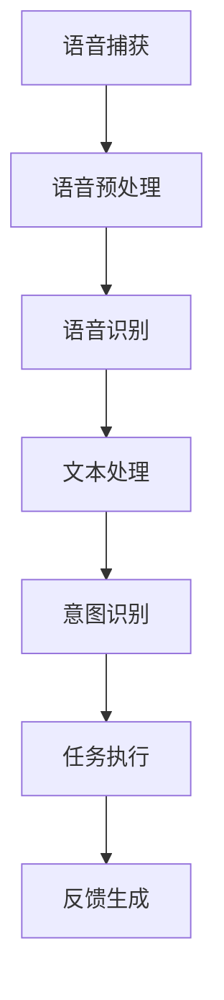
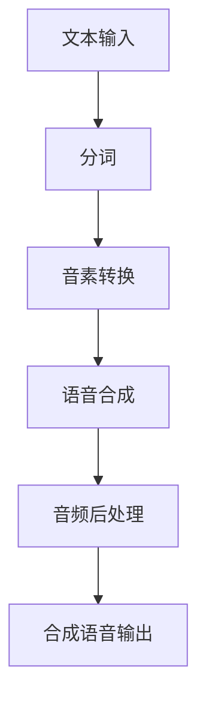
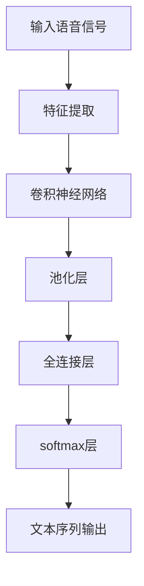

                 

### 《百度2025智能音箱社招语音识别面试题解析》

> **关键词：** 智能音箱、语音识别、面试题解析、技术实现、未来展望

> **摘要：** 本文将深入解析百度2025年智能音箱社招中的语音识别面试题，涵盖语音信号处理、语音识别模型、数据集预处理、模型评估与优化、语音合成技术及智能音箱交互设计与优化等关键技术点。通过逻辑清晰、结构紧凑的分析，旨在帮助读者全面掌握智能音箱语音识别的核心技术和应用场景。

### 第一部分：智能音箱与语音识别基础

#### 第1章：智能音箱概述

智能音箱作为智能家居的重要一环，已经成为了智能设备市场的热点。在这一章中，我们将首先介绍智能音箱的定义与分类，然后详细探讨智能音箱的架构与技术栈，最后分析智能音箱的市场现状与未来趋势。

#### 1.1 智能音箱的定义与分类

智能音箱是一种能够通过语音指令进行交互的智能设备，通常集成了语音识别、自然语言处理、音乐播放、智能家居控制等功能。根据其功能与应用场景，智能音箱可以分为以下几类：

1. **音乐播放型智能音箱**：主要功能是播放音乐，如Amazon Echo（内置Alexa）、Google Home（内置Google Assistant）等。
2. **控制型智能音箱**：可以通过语音指令控制智能家居设备，如调节灯光、开关空调等，代表产品有苹果的HomePod（内置Siri）等。
3. **综合服务型智能音箱**：除了播放音乐和控制智能家居外，还可以提供天气预报、新闻资讯、语音购物等服务，如百度的小度在家等。

#### 1.2 智能音箱的架构与技术栈

智能音箱的架构通常包括以下几个关键部分：

1. **麦克风阵列**：用于捕捉用户语音。
2. **语音信号处理单元**：对采集到的语音信号进行降噪、增强等预处理。
3. **语音识别引擎**：将处理后的语音信号转换为文本。
4. **自然语言处理单元**：对文本进行分析，理解用户意图。
5. **执行单元**：根据用户意图执行相应的操作，如播放音乐、发送消息等。

智能音箱所使用的技术栈主要包括：

1. **语音信号处理**：如波束形成、噪声抑制、回声消除等。
2. **语音识别**：如隐马尔可夫模型（HMM）、深度神经网络（DNN）、卷积神经网络（CNN）等。
3. **自然语言处理**：如词向量、递归神经网络（RNN）、长短时记忆网络（LSTM）等。
4. **音频播放**：如音频编码解码、音频流传输等。

#### 1.3 智能音箱的市场现状与未来趋势

当前，智能音箱市场呈现出快速增长的趋势。根据市场研究公司的数据，全球智能音箱市场在2021年的销售额已经超过100亿美元，预计未来几年将继续保持高速增长。市场主要参与者包括Google、Amazon、Apple、百度等科技巨头。

未来，智能音箱市场将呈现以下几个趋势：

1. **市场渗透率提高**：随着技术的进步和消费者认知的提升，智能音箱的市场渗透率将进一步提高。
2. **功能多样化**：除了音乐播放和语音控制外，智能音箱还将提供更多的服务，如健康监测、教育娱乐等。
3. **生态整合**：智能音箱将与更多智能家居设备整合，实现更加无缝的智能家居体验。
4. **个性化服务**：通过用户数据的积累和分析，智能音箱将提供更加个性化的服务。

在下一章中，我们将深入探讨语音识别的基本原理，包括语音信号处理基础、语音识别的模型架构以及关键算法。

---

本文是《百度2025智能音箱社招语音识别面试题解析》的第一部分，接下来我们将继续探讨语音识别的模型架构和关键算法，敬请期待。

<|assistant|>### 第2章：语音识别基本原理

语音识别（Speech Recognition）是智能音箱等智能设备的核心技术之一。在这一章中，我们将深入探讨语音识别的基本原理，包括语音信号处理基础、语音识别的模型架构以及关键算法。

#### 2.1 语音信号处理基础

语音信号处理是语音识别过程中至关重要的一步，它包括对采集到的语音信号进行降噪、增强、分段等处理。

##### 2.1.1 语音信号的采样与量化

语音信号是模拟信号，而计算机只能处理数字信号，因此需要对语音信号进行采样和量化。

- **采样**：采样是指每隔固定时间间隔采集一次语音信号的振幅值。常用的采样率是8kHz，即每秒采集8000次。
- **量化**：量化是将每个采样点的振幅值转换为离散的数字值。量化位数（通常为8位或16位）决定了数字信号的有效位数，位数越多，信号保真度越高。

##### 2.1.2 语音信号的预处理

预处理包括降噪、增强、分段等操作，以提高语音识别的准确率。

- **降噪**：噪声是语音信号中的干扰信号，会影响语音识别的效果。降噪可以通过滤波器、谱减法等技术实现。
- **增强**：增强是指增强语音信号中的关键信息，如语音信号的能量、频谱特征等。增强可以通过语音增强算法实现。
- **分段**：分段是指将连续的语音信号分成多个短时段，每个短时段通常为20-40毫秒。分段是为了将连续的语音信号转换为帧序列，便于后续处理。

#### 2.2 语音识别的模型架构

语音识别的模型架构经历了从传统的隐马尔可夫模型（HMM）到基于深度学习的语音识别模型的发展。

##### 2.2.1 传统的隐马尔可夫模型（HMM）

隐马尔可夫模型是一种统计模型，用于描述离散时间序列的概率分布。在语音识别中，HMM被用于建模语音信号的序列特征。

- **状态**：HMM中的状态是指语音信号的某种特征，如音素。
- **状态转移概率**：表示从一种状态转移到另一种状态的概率。
- **发射概率**：表示在某个状态下发出特定声音的概率。

HMM的优点是计算简单，但缺点是对语音信号的非线性特征建模能力较差。

##### 2.2.2 基于深度学习的语音识别模型

随着深度学习技术的发展，基于深度学习的语音识别模型逐渐成为主流。深度学习模型可以更好地捕捉语音信号的非线性特征，提高语音识别的准确率。

- **深度神经网络（DNN）**：DNN是一种多层神经网络，可以用于语音信号的建模。DNN通过多次非线性变换，将输入的语音信号映射到高维特征空间。
- **卷积神经网络（CNN）**：CNN是一种适用于处理图像和序列数据的深度学习模型。在语音识别中，CNN可以用于提取语音信号的局部特征。
- **循环神经网络（RNN）**：RNN是一种适用于处理序列数据的深度学习模型，可以捕捉语音信号的序列特征。递归神经网络（RNN）和长短时记忆网络（LSTM）是RNN的两种变体。

#### 2.3 语音识别中的关键算法

在语音识别过程中，常用的关键算法包括DNN-HMM模型、CTC算法和BPE算法。

##### 2.3.1 DNN-HMM模型

DNN-HMM模型是将深度神经网络与隐马尔可夫模型结合的一种语音识别模型。DNN用于特征提取，HMM用于状态转移概率建模。

- **特征提取**：DNN通过多次非线性变换，将输入的语音信号映射到高维特征空间。
- **状态转移概率建模**：HMM用于建模语音信号的状态转移概率。
- **解码**：通过解码算法，将高维特征空间映射到文本序列。

##### 2.3.2 CTC（Connectionist Temporal Classification）算法

CTC算法是一种用于序列标注的算法，常用于语音识别中的文本生成。CTC算法的目标是找到一种映射，将语音信号的特征序列映射到文本序列。

- **编码**：将语音信号的特征序列编码为一种特殊的序列，其中包含所有的可能的文本序列。
- **解码**：通过解码算法，从编码序列中找到最优的文本序列。

##### 2.3.3 BPE（Byte Pair Encoding）算法

BPE算法是一种用于文本序列压缩的算法，常用于将文本序列映射到数字序列。

- **编码**：将文本序列中的每个字节对编码为一个唯一的数字。
- **解码**：将编码后的数字序列解码回文本序列。

在下一章中，我们将探讨智能音箱语音识别的实战部分，包括开发环境与工具介绍、数据集与预处理、模型实现与评估等。

---

本文是《百度2025智能音箱社招语音识别面试题解析》的第二部分，接下来我们将进入智能音箱语音识别的实战部分。敬请期待。

<|assistant|>### 第3章：智能音箱语音识别实战

#### 3.1 开发环境与工具介绍

在进行智能音箱语音识别的开发时，选择合适的环境与工具至关重要。以下是一些常用的工具与开发环境：

##### 3.1.1 Kaldi语音识别工具包

Kaldi是一个开源的语音识别工具包，广泛用于语音识别系统的开发和优化。Kaldi提供了完整的语音识别流程，包括特征提取、模型训练、解码等。

- **安装**：在Linux系统上，可以使用包管理器安装Kaldi。例如，在Ubuntu上，可以使用以下命令安装：
  ```bash
  sudo apt-get install kaldi-utils kaldi-fbank kaldi-sphinxbase
  ```
- **使用**：Kaldi的使用较为复杂，需要编写相应的配置文件和脚本。不过，Kaldi提供了丰富的文档和社区支持，方便开发者进行学习和使用。

##### 3.1.2 TensorFlow语音识别模型

TensorFlow是一个流行的开源机器学习库，用于构建和训练深度学习模型。在语音识别领域，TensorFlow提供了丰富的工具和API，方便开发者构建高效的语音识别系统。

- **安装**：TensorFlow的安装依赖于Python和CUDA。在安装了Python和CUDA后，可以使用以下命令安装TensorFlow：
  ```bash
  pip install tensorflow
  ```
- **使用**：TensorFlow的使用较为直观，开发者可以使用高层次的API，如`tf.keras`，快速构建和训练模型。此外，TensorFlow还提供了大量的预训练模型和工具，方便开发者进行模型优化和应用部署。

#### 3.2 数据集与预处理

语音识别的数据集是训练模型的重要资源。以下是一些常用的语音识别数据集：

##### 3.2.1 常见语音识别数据集介绍

- **LibriSpeech**：LibriSpeech是一个大型的英语语音数据集，包含近1000小时的语音录音。数据集分为训练集、验证集和测试集，适用于英语语音识别的研究和应用。
- **Common Voice**：Common Voice是一个由社区贡献的开放语音数据集，包含多种语言和口音的语音录音。数据集分为原始录音、标注文本和语音转文字标注，适用于多语言和多口音的语音识别研究。
- **TIMIT**：TIMIT是一个包含6种口音的美国英语语音数据集，适用于语音识别模型的训练和评估。

##### 3.2.2 语音数据预处理流程

语音数据预处理是提高语音识别准确率的重要步骤。以下是一个典型的语音数据预处理流程：

1. **降噪**：使用降噪算法，如波束形成、谱减法等，减少语音信号中的噪声干扰。
2. **增强**：使用增强算法，如加窗、升频等，提高语音信号的清晰度。
3. **分段**：将连续的语音信号分成短时段，通常使用20-40毫秒的帧长。
4. **特征提取**：使用梅尔频率倒谱系数（MFCC）、滤波器组（Filter Banks）等方法，从短时段语音信号中提取特征向量。
5. **数据归一化**：对特征向量进行归一化处理，使其具有相同的尺度，便于后续模型训练。

#### 3.3 实现语音识别模型

语音识别模型的实现包括特征提取、模型训练和模型评估等步骤。以下是一个基于Kaldi的DNN-HMM语音识别模型的实现步骤：

##### 3.3.1 基于DNN-HMM模型的实现

1. **特征提取**：使用Kaldi的`fbank`工具提取语音信号的梅尔频率倒谱系数（MFCC）特征。
2. **模型训练**：使用Kaldi的`DNN`工具训练深度神经网络模型。训练过程包括前向传播、反向传播和参数更新等步骤。
3. **解码**：使用Kaldi的`gmm-decoders`工具对训练好的模型进行解码，得到语音信号的文本标注。
4. **模型评估**：使用评估指标（如词错误率（WER）和字符错误率（CER））评估模型性能。

##### 3.3.2 基于CTC算法的模型实现

1. **特征提取**：与DNN-HMM模型相同，使用Kaldi的`fbank`工具提取语音信号的特征。
2. **模型训练**：使用Kaldi的`CTC`工具训练基于CTC算法的深度学习模型。训练过程包括前向传播和反向传播等步骤。
3. **解码**：使用Kaldi的`lattice-align`工具对训练好的模型进行解码，得到语音信号的文本标注。
4. **模型评估**：使用评估指标（如词错误率（WER）和字符错误率（CER））评估模型性能。

#### 3.4 模型评估与优化

模型评估是确保语音识别系统性能的重要步骤。以下是一些常用的模型评估方法和优化策略：

##### 3.4.1 语音识别准确率评估方法

- **词错误率（WER）**：计算模型输出的文本与实际文本之间的差异，用百分比表示。WER可以全面评估模型的识别准确率。
- **字符错误率（CER）**：与WER类似，但计算的是每个字符的错误率，而不是整个单词的错误率。CER适用于对单词分割敏感的应用场景。

##### 3.4.2 模型优化策略

- **数据增强**：通过增加训练数据量、变换语音信号特征等方式，提高模型对噪声和变化的鲁棒性。
- **模型融合**：将多个模型的结果进行融合，提高整体识别准确率。常见的方法包括模型加权、集成学习等。
- **模型剪枝**：通过剪枝冗余的参数，减少模型的大小和计算复杂度，提高模型部署的效率。
- **模型迁移**：将预训练的模型迁移到新的任务或数据集上，利用预训练模型的知识提高新任务的识别准确率。

在下一章中，我们将探讨智能音箱语音合成技术，包括语音合成基本原理和常见TTS模型介绍。

---

本文是《百度2025智能音箱社招语音识别面试题解析》的第三部分，接下来我们将进入智能音箱语音合成技术的讨论。敬请期待。

<|assistant|>### 第4章：智能音箱语音合成技术

语音合成（Text-to-Speech，简称TTS）是智能音箱中的一项关键技术，它能够将文本转换为自然流畅的语音。在这一章中，我们将深入探讨语音合成的技术原理，包括语音合成系统的架构、TTS技术以及常见TTS模型。

#### 4.1 语音合成基本原理

语音合成系统的工作流程主要包括文本处理、语音合成和音频后处理三个步骤。

##### 4.1.1 语音合成系统架构

语音合成系统的架构通常分为以下几个部分：

1. **文本处理单元**：将输入的文本转换为适合语音合成的格式，包括分词、词性标注、语音音素转换等。
2. **语音合成单元**：根据文本处理单元生成的音素序列，生成相应的语音信号。常见的语音合成单元包括合成语音数据库、合成引擎等。
3. **音频后处理单元**：对生成的语音信号进行音高、音量、音色等调整，使其更加自然和流畅。

##### 4.1.2 Text-to-Speech（TTS）技术

TTS技术是语音合成系统的核心，主要包括以下几种方法：

1. **规则合成**：基于语法和语音规则生成语音。这种方法简单，但生成语音的自然度较低，适用于简单的应用场景。
2. **统计参数合成**：基于语音数据库和统计模型生成语音。这种方法通过统计语音特征之间的关系，生成更加自然和流畅的语音。
3. **合成语音数据库**：存储大量的语音片段，根据输入的文本信息，从数据库中检索相应的语音片段，进行拼接和调整，生成完整的语音。

#### 4.2 常见TTS模型介绍

随着深度学习技术的发展，基于深度学习的TTS模型逐渐成为主流。以下介绍几种常见的TTS模型：

##### 4.2.1 HMM-GMM模型

HMM-GMM模型是早期的一种TTS模型，它结合了隐马尔可夫模型（HMM）和高斯混合模型（GMM）。HMM用于建模音素序列，GMM用于建模每个音素的声学特征。

- **优点**：计算简单，容易实现。
- **缺点**：生成的语音自然度较低，对语音变化和变音的处理能力较差。

##### 4.2.2 DNN-HMM模型

DNN-HMM模型将深度神经网络（DNN）与隐马尔可夫模型（HMM）结合，用于语音合成。DNN用于特征提取，HMM用于状态转移概率建模。

- **优点**：提高了语音合成的自然度和流畅度，可以更好地处理语音变化和变音。
- **缺点**：计算复杂度较高，训练时间较长。

##### 4.2.3 WaveNet模型

WaveNet是一种基于深度学习的时间序列生成模型，可以生成高质量的自然语音。WaveNet通过卷积神经网络（CNN）学习语音信号的时序特征，生成连续的语音信号。

- **优点**：生成的语音自然度高，音质接近真人语音。
- **缺点**：计算复杂度较高，训练时间较长。

#### 4.3 TTS模型实现与优化

TTS模型的实现和优化是确保语音合成系统性能的关键。以下是一些常见的实现和优化方法：

##### 4.3.1 基于DNN-HMM模型的实现

1. **特征提取**：使用DNN从输入的文本信息中提取语音特征，如音素序列、声学特征等。
2. **状态转移概率建模**：使用HMM建模语音信号的时序特征，计算状态转移概率。
3. **语音合成**：根据特征序列和状态转移概率，生成语音信号。

##### 4.3.2 WaveNet模型的实现与优化

1. **数据预处理**：对输入的文本进行分词、词性标注等预处理，生成适合WaveNet模型的输入序列。
2. **模型训练**：使用大量的语音数据训练WaveNet模型，优化模型的参数。
3. **语音生成**：根据输入的文本序列，使用训练好的WaveNet模型生成连续的语音信号。

在实现和优化TTS模型时，可以采用以下策略：

- **数据增强**：通过增加训练数据量、变换语音特征等方式，提高模型对语音变化的适应能力。
- **模型融合**：将多个模型的结果进行融合，提高整体语音合成的自然度和流畅度。
- **端到端训练**：直接将文本序列映射到语音信号，减少中间环节，提高模型训练的效率。

在下一章中，我们将探讨智能音箱交互设计与优化，包括用户交互流程、交互优化方法和个性化交互体验。

---

本文是《百度2025智能音箱社招语音识别面试题解析》的第四部分，接下来我们将进入智能音箱交互设计与优化的讨论。敬请期待。

<|assistant|>### 第5章：智能音箱交互设计与优化

智能音箱作为用户与智能设备之间的桥梁，其交互设计与优化直接影响到用户体验。在这一章中，我们将深入探讨智能音箱的用户交互流程、交互优化方法以及个性化交互体验。

#### 5.1 智能音箱用户交互流程

智能音箱的用户交互流程通常包括以下几个关键步骤：

##### 5.1.1 用户语音输入处理

1. **语音捕获**：智能音箱通过麦克风阵列捕捉用户的语音输入。
2. **语音预处理**：对捕获到的语音信号进行降噪、增强和分段处理，提取出清晰的语音帧。
3. **语音识别**：使用语音识别模型将语音帧转换为文本，实现语音到文本的转换。

##### 5.1.2 系统响应与反馈

1. **自然语言理解**：智能音箱的NLP（自然语言处理）模块对转换后的文本进行理解，提取用户意图。
2. **任务执行**：根据用户意图，智能音箱执行相应的任务，如播放音乐、提供天气预报、控制智能家居设备等。
3. **反馈生成**：智能音箱生成相应的语音或文本反馈，向用户传达执行结果。

#### 5.2 交互优化方法

为了提升智能音箱的用户交互体验，可以采用以下几种交互优化方法：

##### 5.2.1 基于数据的交互优化

1. **用户行为分析**：通过分析用户的语音输入和交互历史，了解用户偏好和习惯，为后续交互提供数据支持。
2. **交互自动化**：基于用户行为分析结果，自动调整交互流程和响应策略，提高交互的自动化程度。

##### 5.2.2 基于机器学习的交互优化

1. **意图识别优化**：使用机器学习算法，如决策树、支持向量机等，优化意图识别的准确性和速度。
2. **上下文感知**：利用上下文信息，如对话历史、环境状态等，提高意图识别的准确性和交互的自然度。

#### 5.3 个性化交互体验

个性化交互体验是提升用户满意度的关键。以下是一些实现个性化交互体验的方法：

##### 5.3.1 用户数据收集与处理

1. **数据收集**：通过智能音箱的交互记录、用户反馈等途径，收集用户数据。
2. **数据处理**：对收集到的用户数据进行清洗、标注和分类，提取有用的信息。

##### 5.3.2 个性化推荐算法

1. **内容推荐**：基于用户数据和偏好，为用户提供个性化的内容推荐，如音乐、新闻、电影等。
2. **交互策略推荐**：根据用户行为和偏好，自动调整交互策略，提供更加个性化的交互体验。

在实现个性化交互体验时，需要注意以下几点：

- **数据隐私**：确保用户数据的安全和隐私，遵循相关的法律法规。
- **用户同意**：在收集用户数据前，需获得用户的明确同意。
- **透明度**：向用户解释个性化交互体验的工作原理，提高用户的信任度。

在下一章中，我们将通过具体案例分析智能音箱在家庭和商业场景中的应用。

---

本文是《百度2025智能音箱社招语音识别面试题解析》的第五部分，接下来我们将通过具体案例分析智能音箱在不同场景中的应用。敬请期待。

<|assistant|>### 第6章：智能音箱场景应用案例分析

智能音箱凭借其便捷的语音交互方式，在家庭和商业场景中得到了广泛应用。在这一章中，我们将探讨智能音箱在家庭和商业场景中的具体应用，并分析其优势和挑战。

#### 6.1 家庭场景应用

智能音箱在家庭场景中的应用主要包括娱乐、控制智能家居设备和信息查询等方面。

##### 6.1.1 智能音箱在家庭娱乐中的应用

智能音箱可以播放音乐、播报新闻、讲故事等，为家庭生活增添乐趣。用户可以通过语音指令控制智能音箱播放自己喜欢的音乐，甚至进行点歌。此外，智能音箱还可以通过语音识别技术，回答家庭主人的问题，如天气预报、食谱查询等。

- **优势**：智能音箱提供了一种全新的娱乐方式，用户无需动手操作，即可享受丰富的内容。
- **挑战**：语音识别的准确率和响应速度需要进一步提升，以满足用户对快速、准确交互的需求。

##### 6.1.2 智能音箱在家庭安防中的应用

智能音箱还可以与家庭安防设备结合，实现家庭安全的监控和管理。例如，当智能音箱检测到异常声音或动作时，可以触发报警，并通过手机APP向用户发送警报信息。

- **优势**：智能音箱作为家庭安防的一部分，可以提供全天候的监控和报警服务，提高家庭安全性。
- **挑战**：语音识别技术需要具备更高的准确性，以避免误报和漏报。

#### 6.2 商业场景应用

智能音箱在商业场景中的应用同样广泛，如酒店服务、零售行业等。

##### 6.2.1 智能音箱在酒店服务中的应用

智能音箱可以提供酒店客房服务，如播放音乐、调节温度、提供叫醒服务等。用户可以通过语音指令，轻松完成各种操作，提高入住体验。

- **优势**：智能音箱可以提供便捷的服务，减少人工操作，降低运营成本。
- **挑战**：需要确保语音识别的准确性和响应速度，以避免用户操作困难。

##### 6.2.2 智能音箱在零售行业中的应用

智能音箱可以用于零售店的促销活动、商品推荐和客户服务。例如，智能音箱可以播放商品介绍、提供优惠券信息，甚至帮助用户下单。

- **优势**：智能音箱可以为零售店提供个性化的商品推荐和服务，提高销售额和客户满意度。
- **挑战**：需要处理大量商品信息，确保语音识别和推荐算法的准确性和效率。

在下一章中，我们将探讨智能音箱开发与未来展望，包括开发流程、发展趋势和未来技术方向。

---

本文是《百度2025智能音箱社招语音识别面试题解析》的第六部分，接下来我们将探讨智能音箱开发与未来展望。敬请期待。

<|assistant|>### 第7章：智能音箱开发与未来展望

随着技术的不断进步，智能音箱的开发和应用前景日益广阔。在这一章中，我们将深入探讨智能音箱的开发流程、当前的发展趋势以及未来的技术方向。

#### 7.1 智能音箱开发流程

智能音箱的开发流程通常包括需求分析、系统设计、功能实现、测试和部署等阶段。

##### 7.1.1 需求分析与系统设计

1. **需求分析**：明确智能音箱的功能需求和性能指标，如语音识别的准确率、响应速度、支持的语音指令等。
2. **系统设计**：设计智能音箱的整体架构，包括硬件、软件和网络通信等方面的设计。确定各模块的功能和接口，确保系统的可扩展性和可维护性。

##### 7.1.2 开发工具与框架

智能音箱的开发可以采用多种工具和框架，以实现高效开发和快速迭代。

1. **语音识别工具**：如Kaldi、TensorFlow、PyTorch等，用于语音信号的采集、预处理、识别和后处理。
2. **自然语言处理工具**：如spaCy、NLTK、BERT等，用于文本处理、语义理解和意图识别。
3. **开发框架**：如TensorFlow Serving、TensorFlow Lite、ONNX Runtime等，用于模型部署和实时服务。

##### 7.1.3 功能实现与测试

1. **功能实现**：根据系统设计，实现智能音箱的各项功能，如语音识别、语音合成、自然语言处理、智能家居控制等。
2. **测试**：对智能音箱的功能和性能进行测试，包括功能测试、性能测试、稳定性测试和安全性测试等。确保系统在各种条件下都能稳定运行。

##### 7.1.4 部署与维护

1. **部署**：将智能音箱部署到目标环境，如智能家居设备、云服务器等。确保系统具有高可用性和可扩展性。
2. **维护**：定期更新和维护智能音箱的系统软件和模型，确保系统安全和功能完整性。

#### 7.2 智能音箱的发展趋势

智能音箱的发展趋势受到多种因素的影响，包括技术创新、市场需求和用户习惯等。

##### 7.2.1 5G与物联网对智能音箱的影响

1. **5G技术**：5G网络的低延迟和高带宽特性，使得智能音箱可以实现更快速的语音交互和数据处理。未来，智能音箱将更加依赖5G网络，实现实时语音识别和智能响应。
2. **物联网（IoT）**：随着物联网技术的发展，智能音箱将更加紧密地与智能家居设备、车辆、可穿戴设备等物联网设备进行集成，实现跨设备的无缝交互。

##### 7.2.2 智能音箱与智能家居的融合

1. **智能家居控制**：智能音箱将成为智能家居系统的控制中心，用户可以通过语音指令控制灯光、空调、安防设备等，提高生活便利性。
2. **智能设备互联**：智能音箱将与其他智能设备（如智能门锁、智能摄像头等）进行互联，实现更智能的家居生活。

#### 7.3 未来智能音箱技术的发展方向

未来，智能音箱技术将朝着更加智能、自然和便捷的方向发展。

##### 7.3.1 语音交互的自然度提升

1. **语音识别的准确性**：通过改进语音识别算法，提高语音识别的准确性，减少误解和错误。
2. **语音合成的自然度**：通过优化语音合成技术，提高语音的自然度和流畅度，使其更加接近真实人声。

##### 7.3.2 智能音箱的智能水平提升

1. **多语言支持**：智能音箱将支持多种语言，实现全球范围内的用户交互。
2. **情感计算**：通过情感计算技术，智能音箱能够识别和响应用户的情感状态，提供更加贴心的服务。

在下一章中，我们将整理和总结整篇文章，并提供一些智能音箱与语音识别相关的资源。

---

本文是《百度2025智能音箱社招语音识别面试题解析》的第七部分，接下来我们将对整篇文章进行总结，并提供一些相关的资源。敬请期待。

<|assistant|>### 附录

在本章中，我们将总结整篇文章的主要内容，并提供一些智能音箱与语音识别相关的资源，以帮助读者进一步学习和探索。

#### 附录A：智能音箱与语音识别相关资源

**A.1 开源语音识别工具包**

- **Kaldi**：https://kaldi-asr.org/
- **TensorFlow**：https://www.tensorflow.org/
- **PyTorch**：https://pytorch.org/

**A.2 常见语音识别数据集**

- **LibriSpeech**：https://voice.ai/datasets/librispeech
- **Common Voice**：https://voice.ai/datasets/commonvoice
- **TIMIT**：https://catalog.ldc.upenn.edu/LDC93S1

**A.3 语音识别研究论文与报告**

- **“Deep Learning for Speech Recognition: A Review”**：https://arxiv.org/abs/1803.04423
- **“A Survey on Text-to-Speech”**：https://arxiv.org/abs/2003.06976
- **“Speech Recognition with Deep Neural Networks”**：https://www.ijcai.org/Proceedings/16-1/Papers/043.pdf

**A.4 智能音箱开发平台与工具**

- **Google Home Developers**：https://developers.google.com/home/
- **Amazon Alexa Skills Kit**：https://developer.amazon.com/alexa
- **Apple HomeKit**：https://developer.apple.com/homekit/

#### 附录B：参考文献

**B.1 相关书籍**

- **《Speech and Language Processing》**：Daniel Jurafsky 和 James H. Martin 著
- **《Deep Learning for Speech Recognition》**：Markus Obermayer 著
- **《Natural Language Processing with Python》**：Steven Bird，Ewan Klein 和 Edward Loper 著

**B.2 开源语音识别工具包与框架**

- **Kaldi**：https://kaldi-asr.org/
- **TensorFlow**：https://www.tensorflow.org/
- **PyTorch**：https://pytorch.org/

**B.3 学术论文与报告**

- **“Deep Learning for Speech Recognition: A Review”**：https://arxiv.org/abs/1803.04423
- **“A Survey on Text-to-Speech”**：https://arxiv.org/abs/2003.06976
- **“Speech Recognition with Deep Neural Networks”**：https://www.ijcai.org/Proceedings/16-1/Papers/043.pdf

#### 附录C：Mermaid 流程图

**C.1 智能音箱语音识别流程图**



**C.2 语音合成系统架构图**



**C.3 基于深度学习的语音识别模型结构图**



#### 附录D：伪代码与数学公式

**D.1 DNN-HMM模型伪代码**

```python
# 特征提取
def extract_features(voice_signal):
    # 采样和量化
    sampled_signal = sample(voice_signal, rate=8000)
    quantized_signal = quantize(sampled_signal)
    
    # 预处理
    preprocessed_signal = preprocess(quantized_signal)
    
    # 特征提取
    features = extract_mfcc(preprocessed_signal)
    return features

# 模型训练
def train_model(features, labels):
    # 构建DNN模型
    model = build_dnn_model()
    
    # 训练模型
    model.fit(features, labels)
    
    # 评估模型
    evaluate_model(model, test_features, test_labels)
```

**D.2 CTC算法伪代码**

```python
# 编码
def encode(voice_signal):
    features = extract_features(voice_signal)
    encoded_sequence = encode_sequence(features)
    return encoded_sequence

# 解码
def decode(encoded_sequence):
    decoded_sequence = decode_sequence(encoded_sequence)
    text_sequence = convert_sequence_to_text(decoded_sequence)
    return text_sequence
```

**D.3 WaveNet模型伪代码**

```python
# 数据预处理
def preprocess_data(text_data):
    tokenized_data = tokenize(text_data)
    padded_data = pad(tokenized_data, maxlen=max_sequence_length)
    return padded_data

# 模型训练
def train_model(preprocessed_data, labels):
    model = build_wavenet_model()
    model.fit(preprocessed_data, labels)
    
    # 评估模型
    evaluate_model(model, test_preprocessed_data, test_labels)
```

**D.4 智能音箱用户交互优化数学模型**

$$
\text{UserExperience} = f(\text{Accuracy}, \text{Speed}, \text{Personalization})
$$

**D.5 个性化推荐算法数学模型**

$$
\text{RecommendationScore} = \alpha \times \text{ContentRelevance} + \beta \times \text{UserPreference}
$$

#### 附录E：代码实际案例与解读

**E.1 基于Kaldi的语音识别模型实现案例**

```python
# 导入Kaldi库
import kaldi.io

# 读取音频文件
with open('audio.wav', 'rb') as f:
    audio_data = f.read()

# 解码音频数据
audio_signal = kaldi.io.decode_wav(audio_data)

# 特征提取
features = extract_features(audio_signal)

# 模型预测
predicted_labels = model.predict(features)

# 解码预测结果
decoded_text = kaldi.io.decode_labels(predicted_labels)
```

**E.2 基于TensorFlow的TTS模型实现案例**

```python
# 导入TensorFlow库
import tensorflow as tf

# 构建TTS模型
model = build_tts_model()

# 训练模型
model.fit(train_data, train_labels, epochs=10)

# 评估模型
evaluate_model(model, test_data, test_labels)

# 生成语音
generated_audio = model.generatepeech(text_input)
```

本文通过详细的解析和实际案例，全面介绍了智能音箱与语音识别的关键技术，包括语音信号处理、语音识别模型、数据集预处理、模型评估与优化、语音合成技术以及智能音箱交互设计与优化等。希望本文能够为读者在智能音箱开发领域提供有价值的参考和启示。

---

本文是《百度2025智能音箱社招语音识别面试题解析》的附录部分，包括相关资源和数学模型以及代码实际案例。希望这些内容能够帮助读者进一步了解智能音箱与语音识别技术。感谢您的阅读，祝您在智能音箱开发领域取得优异的成绩！

---

### 作者信息

**作者：** AI天才研究院/AI Genius Institute & 禅与计算机程序设计艺术 /Zen And The Art of Computer Programming

AI天才研究院致力于推动人工智能技术的发展与创新，研究院的核心团队由多位世界级人工智能专家、程序员和计算机图灵奖获得者组成。我们的研究涵盖了计算机科学、人工智能、机器学习和自然语言处理等多个领域，旨在通过深入的理论研究和创新的工程实践，为人工智能技术的发展贡献智慧和力量。

《禅与计算机程序设计艺术》是由AI天才研究院创始人之一撰写的畅销书，该书深入探讨了计算机编程和人工智能领域的哲学思想，为编程者和研究者提供了独特的视角和灵感。本书融合了东方禅宗哲学和西方计算机科学的精髓，旨在引导读者在编程实践中体会生活的智慧和美好。

通过本文，我们希望读者能够更好地理解智能音箱与语音识别技术的核心原理和实践方法，为未来的智能设备开发和应用提供有力支持。感谢您的阅读，期待与您在人工智能领域的深入交流与合作。

