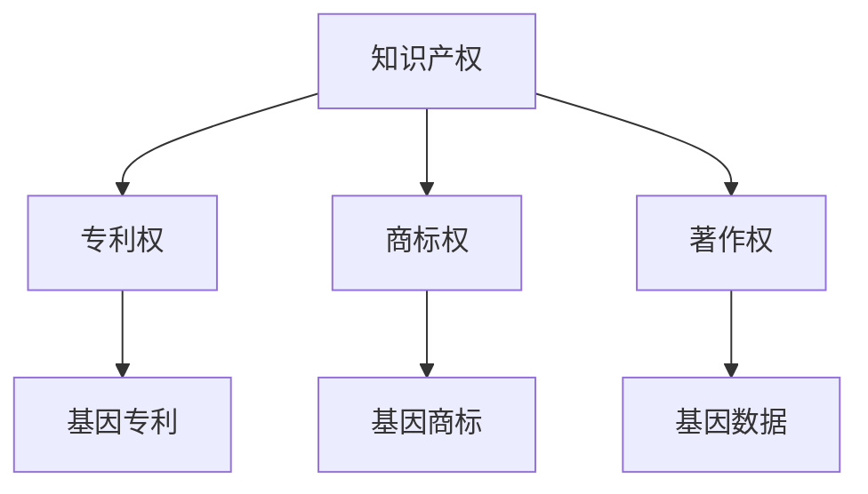

                 

# 《知识产权与人类基因组研究的关系》

## 关键词
知识产权、人类基因组研究、基因专利、基因数据、伦理争议

## 摘要

随着人类基因组研究的不断深入，知识产权问题逐渐成为这一领域的重要议题。本文从知识产权的基本概念出发，分析了知识产权与人类基因组研究的关系，探讨了人类基因组研究中的伦理与法律问题，以及知识产权在人类基因组研究中的具体应用和实践。通过对知识产权与人类基因组研究的案例分析，展望了这一领域的未来发展趋势，为相关领域的研究者和政策制定者提供了有益的参考。

## 目录大纲

### 第一部分：知识产权概述

#### 第1章：知识产权的基本概念

##### 1.1 知识产权的定义与范围

##### 1.2 知识产权的种类

##### 1.3 知识产权的保护机制

#### 第2章：知识产权法律体系

##### 2.1 国际知识产权法律体系

##### 2.2 中国知识产权法律体系

##### 2.3 知识产权的法律冲突与解决

### 第二部分：人类基因组研究

#### 第3章：人类基因组计划的起源与进展

##### 3.1 人类基因组计划的起源

##### 3.2 人类基因组计划的研究成果

##### 3.3 人类基因组计划的未来展望

#### 第4章：人类基因组研究的伦理与法律问题

##### 4.1 基因隐私保护

##### 4.2 基因歧视问题

##### 4.3 基因编辑技术的伦理争议

#### 第5章：人类基因组研究的知识产权争议

##### 5.1 知识产权与人类基因组研究的冲突

##### 5.2 知识产权保护对人类基因组研究的影响

##### 5.3 知识产权与人类基因组研究的协调机制

### 第三部分：知识产权与人类基因组研究的实践

#### 第6章：知识产权保护在人类基因组研究中的应用

##### 6.1 专利保护在人类基因组研究中的应用

##### 6.2 商业秘密保护在人类基因组研究中的应用

##### 6.3 版权保护在人类基因组研究中的应用

#### 第7章：知识产权管理在人类基因组研究中的实践

##### 7.1 知识产权策略的制定

##### 7.2 知识产权的运营与管理

##### 7.3 知识产权的风险管理

#### 第8章：知识产权与人类基因组研究的国际合作

##### 8.1 国际合作的重要性

##### 8.2 国际知识产权合作案例

##### 8.3 未来的国际合作趋势

### 第四部分：案例分析与展望

#### 第9章：知识产权与人类基因组研究的案例分析

##### 9.1 案例一：人类基因组计划中的知识产权争议

##### 9.2 案例二：基因专利纠纷案

##### 9.3 案例三：基因编辑技术专利纠纷

#### 第10章：知识产权与人类基因组研究的未来展望

##### 10.1 知识产权保护的趋势

##### 10.2 人类基因组研究的发展趋势

##### 10.3 知识产权与人类基因组研究的未来合作方向

### 附录

#### 附录A：相关法规与政策

##### A.1 国际知识产权组织

##### A.2 中国知识产权相关法规

##### A.3 人类基因组研究相关法规

#### 附录B：术语表

##### B.1 术语解释

##### B.2 常用缩写与符号

#### 附录C：参考文献

##### C.1 引用文献

##### C.2 推荐阅读

#### 附录D：相关链接

##### D.1 人类基因组研究网站

##### D.2 知识产权保护网站

##### D.3 相关组织与会议链接

## 第一部分：知识产权概述

### 第1章：知识产权的基本概念

#### 1.1 知识产权的定义与范围

知识产权是指通过智力劳动创造的成果所享有的权利。它包括专利权、商标权、著作权、商业秘密等。知识产权的范围涵盖了科学研究、文学艺术、工业设计等多个领域。

知识产权的定义可以从以下几个方面进行阐述：

1. **智力劳动的成果**：知识产权是基于人类智力劳动的成果，如发明创造、文学艺术作品、设计图纸等。

2. **法律保护**：知识产权是通过法律手段赋予的一种权利，具有独占性和排他性。

3. **经济利益**：知识产权的持有者可以通过转让、许可等方式获得经济利益。

4. **社会价值**：知识产权保护了知识创新者的权益，促进了科技进步和文化繁荣。

知识产权的范围主要包括以下几种：

1. **专利权**：专利权是指对发明创造的独占性权利。专利包括发明专利、实用新型专利和外观设计专利。

2. **商标权**：商标权是指对商标的独占性权利。商标是用于区分不同商品或服务的标识。

3. **著作权**：著作权是指对文学、艺术和科学作品的独占性权利。著作权包括文字作品、音乐作品、美术作品等。

4. **商业秘密**：商业秘密是指不为公众所知悉、具有商业价值的信息。

#### 1.2 知识产权的种类

知识产权的种类多种多样，常见的有以下几种：

1. **专利权**：专利权是对发明创造的独占性权利。专利权人可以通过申请专利来保护自己的发明，防止他人未经许可擅自实施。

2. **商标权**：商标权是对商标的独占性权利。商标是用于区分不同商品或服务的标识，商标权人可以通过申请商标来保护自己的品牌。

3. **著作权**：著作权是对文学、艺术和科学作品的独占性权利。著作权人可以通过申请著作权来保护自己的作品，防止他人未经许可擅自使用。

4. **商业秘密**：商业秘密是指不为公众所知悉、具有商业价值的信息。商业秘密可以通过保密措施来保护，防止他人非法获取和利用。

5. **植物新品种权**：植物新品种权是指对植物新品种的独占性权利。植物新品种权人可以通过申请植物新品种权来保护自己的新品种。

#### 1.3 知识产权的保护机制

知识产权的保护机制主要包括以下几个方面：

1. **法律保护**：知识产权是通过法律手段来保护的。不同国家和地区的知识产权法律体系有所不同，但总体上都建立了相应的保护机制。

2. **行政保护**：知识产权的行政保护是指通过行政机关对知识产权进行管理和保护。例如，专利局、商标局等行政机构负责对专利和商标的申请和审批。

3. **司法保护**：知识产权的司法保护是指通过法院对知识产权纠纷进行审理和裁决。司法保护是知识产权保护的重要环节，能够保障知识产权人的合法权益。

4. **国际保护**：知识产权的国际保护是指通过国际公约和双边协议来保护知识产权。国际知识产权组织如世界知识产权组织（WIPO）负责协调各国之间的知识产权保护。

### 第2章：知识产权法律体系

#### 2.1 国际知识产权法律体系

国际知识产权法律体系是由多个国际公约和协议组成的。其中最重要的国际公约包括：

1. **伯尔尼公约**：伯尔尼公约是著作权领域的重要国际公约，规定了著作权的保护原则和国际标准。

2. **巴黎公约**：巴黎公约是专利和工业设计领域的重要国际公约，规定了专利和工业设计的保护原则和国际标准。

3. **马德里协定**：马德里协定是商标领域的重要国际公约，规定了商标的注册和保护原则。

国际知识产权法律体系的基本原则包括：

1. **国民待遇原则**：国民待遇原则是指一个国家的国民在另一个国家享受与该国国民同等的知识产权保护。

2. **独立性原则**：独立性原则是指一个国家的知识产权保护不受其他国家的影响，独立行使保护权。

3. **国际保护原则**：国际保护原则是指国际公约和协议对知识产权的保护具有法律约束力，各成员国应当遵守。

#### 2.2 中国知识产权法律体系

中国知识产权法律体系主要包括以下法律法规：

1. **专利法**：专利法是中国保护专利权的基本法律，规定了专利的申请、审批、保护等程序。

2. **商标法**：商标法是中国保护商标权的基本法律，规定了商标的申请、注册、保护等程序。

3. **著作权法**：著作权法是中国保护著作权的基本法律，规定了著作权的保护范围、权利人的权利和义务等。

4. **反不正当竞争法**：反不正当竞争法是中国保护商业秘密和其他知识产权的基本法律，规定了不正当竞争行为的认定和处理。

#### 2.3 知识产权的法律冲突与解决

知识产权的法律冲突主要表现在以下几个方面：

1. **跨国知识产权冲突**：由于各国知识产权法律体系的不同，跨国知识产权冲突在所难免。

2. **知识产权与竞争法的冲突**：知识产权保护可能与其他竞争法原则发生冲突，如反垄断法、反不正当竞争法等。

3. **知识产权内部的冲突**：不同类型的知识产权之间可能存在冲突，如专利权与商标权、著作权之间的冲突。

知识产权法律冲突的解决途径主要包括：

1. **国际协调**：通过国际公约和协议来协调各国知识产权法律体系，减少冲突。

2. **国内立法**：通过国内立法来明确知识产权的法律冲突解决原则和程序。

3. **司法审判**：通过司法审判来解决知识产权纠纷，保障知识产权人的合法权益。

## 第二部分：人类基因组研究

### 第3章：人类基因组计划的起源与进展

#### 3.1 人类基因组计划的起源

人类基因组计划（Human Genome Project，HGP）是于20世纪80年代提出的，旨在绘制人类基因组的完整序列。该计划的起源可以追溯到以下几个关键事件：

1. **DNA双螺旋结构的发现**：1953年，詹姆斯·沃森和弗朗西斯·克里克发现了DNA双螺旋结构，为后续的基因组研究奠定了基础。

2. **人类基因组计划倡议**：1986年，美国科学家克莱夫·梅里尔（Clive Meilling）提出了“人类基因组计划倡议”，建议绘制人类基因组的序列。

3. **人类基因组计划正式成立**：1990年，美国国家科学基金会（NSF）和美国国立卫生研究院（NIH）宣布启动人类基因组计划，并于同年10月正式启动。

#### 3.2 人类基因组计划的研究成果

人类基因组计划取得了以下重要研究成果：

1. **基因序列的绘制**：人类基因组计划成功绘制了人类基因组的完整序列，确定了大约30亿个碱基对的序列。

2. **基因定位**：人类基因组计划确定了人类基因组中的所有基因位置，为后续的基因研究提供了重要基础。

3. **基因组功能分析**：人类基因组计划对基因组的结构和功能进行了深入分析，揭示了基因的表达调控机制、遗传病的致病机理等。

4. **基因组比较**：人类基因组计划还与其他物种的基因组进行了比较，揭示了人类与其他生物之间的进化关系。

#### 3.3 人类基因组计划的未来展望

人类基因组计划的未来展望主要包括以下几个方面：

1. **基因组编辑技术**：随着基因编辑技术的不断发展，人类基因组计划有望在疾病治疗和生物技术等领域取得更大突破。

2. **个性化医疗**：人类基因组计划的数据将有助于实现个性化医疗，为患者提供更精准的治疗方案。

3. **遗传疾病的预防与治疗**：人类基因组计划的研究成果将有助于揭示遗传疾病的致病机理，推动遗传疾病的预防与治疗。

4. **生物多样性保护**：人类基因组计划的数据有助于保护生物多样性，促进生态系统的可持续发展。

### 第4章：人类基因组研究的伦理与法律问题

#### 4.1 基因隐私保护

基因隐私保护是基因组研究中的重要伦理和法律问题。基因信息具有高度个人化和敏感性，未经授权的基因信息泄露可能对个人隐私造成严重侵害。基因隐私保护的主要措施包括：

1. **数据加密**：对基因数据进行加密处理，确保数据在传输和存储过程中的安全。

2. **隐私保护协议**：制定严格的隐私保护协议，规范基因信息的收集、存储和使用。

3. **隐私权法律保护**：通过立法手段加强对基因隐私的保护，确保个人对其基因信息的控制权。

#### 4.2 基因歧视问题

基因歧视是指基于个体的基因信息进行不公平对待的行为。基因歧视问题主要包括以下几个方面：

1. **就业歧视**：基于个体的基因信息对求职者进行歧视，如拒绝录用携带某些遗传病基因的求职者。

2. **保险歧视**：基于个体的基因信息对保险费率进行歧视，如提高携带某些遗传病基因的个体的保险费用。

3. **婚姻歧视**：基于个体的基因信息对婚姻自由进行限制，如禁止携带某些遗传病基因的个体结婚。

为防止基因歧视，需要采取以下措施：

1. **立法禁止**：通过立法明确禁止基因歧视行为，对歧视者进行法律制裁。

2. **宣传教育**：加强对公众的基因知识宣传教育，提高公众对基因歧视问题的认识。

3. **平等就业机会**：倡导平等就业机会，确保求职者在招聘过程中不受基因信息的影响。

#### 4.3 基因编辑技术的伦理争议

基因编辑技术，如CRISPR-Cas9，为基因组研究带来了前所未有的机遇，但也引发了广泛的伦理争议。基因编辑技术的伦理争议主要包括以下几个方面：

1. **伦理问题**：基因编辑技术可能对人类基因造成永久性改变，影响后代，引发伦理道德问题。

2. **安全性问题**：基因编辑技术可能引发未知的生物风险，如基因突变、免疫系统反应等。

3. **非医疗应用问题**：基因编辑技术可能被用于非医疗目的，如提升人类智力、改变人类外貌等，引发伦理争议。

为应对基因编辑技术的伦理争议，需要采取以下措施：

1. **伦理审查**：建立基因编辑技术的伦理审查制度，确保基因编辑项目在开展前经过充分评估。

2. **法律法规**：制定相关法律法规，规范基因编辑技术的应用范围和条件。

3. **公众参与**：加强公众参与，听取社会各界的意见和建议，确保基因编辑技术的应用符合社会伦理价值观。

### 第5章：人类基因组研究的知识产权争议

#### 5.1 知识产权与人类基因组研究的冲突

知识产权与人类基因组研究之间存在一定的冲突。主要表现在以下几个方面：

1. **基因信息的独占性**：基因专利制度赋予了基因序列的独占权，可能影响其他研究者对基因信息的自由使用。

2. **基因资源的分配**：基因资源的知识产权可能影响基因资源的公平分配，导致发展中国家和贫困人群受益较少。

3. **研究成本增加**：知识产权保护可能导致基因研究成本增加，影响研究的可持续性。

#### 5.2 知识产权保护对人类基因组研究的影响

知识产权保护对人类基因组研究产生了一定的影响。积极影响包括：

1. **激励创新**：知识产权保护可以激励科学家进行基因组研究，推动科技进步。

2. **资源投入**：知识产权保护可以吸引更多资金投入基因组研究，促进研究项目的开展。

3. **合作机制**：知识产权保护可以促进国际间的基因组研究合作，推动知识的共享与交流。

然而，知识产权保护也可能带来一些负面影响：

1. **研究障碍**：知识产权保护可能导致其他研究者无法自由使用基因序列，影响研究的开展。

2. **垄断现象**：知识产权保护可能导致基因资源被垄断，影响基因资源的公平分配。

3. **研究成本增加**：知识产权保护可能导致基因研究成本增加，影响研究的可持续性。

#### 5.3 知识产权与人类基因组研究的协调机制

为协调知识产权与人类基因组研究的关系，可以采取以下措施：

1. **法律法规**：制定相关法律法规，明确基因序列的知识产权保护范围和条件，平衡知识产权与公共利益。

2. **伦理审查**：建立基因研究项目的伦理审查制度，确保基因研究项目在开展前经过充分评估。

3. **合作机制**：建立国际间的合作机制，促进基因资源的共享与交流，减少知识产权对基因组研究的负面影响。

4. **公共政策**：制定公共政策，鼓励基因研究的可持续发展，确保基因资源能够公平分配。

## 第三部分：知识产权与人类基因组研究的实践

### 第6章：知识产权保护在人类基因组研究中的应用

#### 6.1 专利保护在人类基因组研究中的应用

专利保护是知识产权保护的重要手段，在人类基因组研究中具有广泛应用。专利保护在人类基因组研究中的应用主要体现在以下几个方面：

1. **基因序列的专利保护**：基因序列可以作为专利申请的对象，通过专利保护，研究者可以独占基因序列的使用权。

2. **基因功能的专利保护**：基因功能的研究成果也可以作为专利申请的对象，如特定基因在疾病治疗中的应用。

3. **基因编辑技术的专利保护**：基因编辑技术，如CRISPR-Cas9，可以作为专利申请的对象，保护基因编辑技术的使用权。

#### 6.2 商业秘密保护在人类基因组研究中的应用

商业秘密保护是另一种重要的知识产权保护手段，在人类基因组研究中具有重要作用。商业秘密保护在人类基因组研究中的应用主要体现在以下几个方面：

1. **基因序列的商业秘密保护**：基因序列可以作为商业秘密保护，防止他人非法获取和泄露。

2. **基因功能研究的商业秘密保护**：基因功能的研究成果可以作为商业秘密保护，防止他人非法获取和利用。

3. **基因编辑技术的商业秘密保护**：基因编辑技术的研究成果可以作为商业秘密保护，确保技术的商业利益。

#### 6.3 版权保护在人类基因组研究中的应用

版权保护是保护文学、艺术和科学作品的一种知识产权保护手段，在人类基因组研究中也具有一定的应用价值。版权保护在人类基因组研究中的应用主要体现在以下几个方面：

1. **基因组研究论文的版权保护**：基因组研究的论文可以作为版权保护的对象，确保研究者的知识产权。

2. **基因组数据库的版权保护**：基因组数据库中的数据可以作为版权保护的对象，防止他人非法复制和使用。

3. **基因组研究工具的版权保护**：基因组研究工具，如生物信息学软件，可以作为版权保护的对象，保护研究者的知识产权。

### 第7章：知识产权管理在人类基因组研究中的实践

#### 7.1 知识产权策略的制定

知识产权策略的制定是知识产权管理的重要环节。在人类基因组研究中，制定合理的知识产权策略有助于保护研究者的权益，促进知识的共享与交流。知识产权策略的制定主要包括以下几个方面：

1. **专利策略**：根据研究项目的特点，制定专利申请的策略，确保研究者的专利权益。

2. **版权策略**：针对研究论文、基因组数据库和研究工具等，制定版权保护策略，确保研究者的版权权益。

3. **商业秘密策略**：对重要的基因序列和基因功能研究成果，制定商业秘密保护策略，防止他人非法获取和利用。

#### 7.2 知识产权的运营与管理

知识产权的运营与管理是知识产权管理的核心环节。在人类基因组研究中，知识产权的运营与管理主要包括以下几个方面：

1. **专利运营**：通过专利转让、许可和合作等方式，实现专利价值的最大化。

2. **版权运营**：通过论文发表、数据库授权和软件销售等方式，实现版权价值的最大化。

3. **商业秘密管理**：通过保密措施、合同约束和法律诉讼等方式，确保商业秘密的安全。

#### 7.3 知识产权的风险管理

知识产权风险管理是知识产权管理的重要内容。在人类基因组研究中，知识产权风险管理主要包括以下几个方面：

1. **法律风险识别**：识别知识产权保护中的法律风险，如专利侵权、版权侵权等。

2. **风险防范措施**：制定风险防范措施，如签订知识产权许可协议、进行知识产权诉讼等。

3. **风险应对策略**：针对已发生的知识产权纠纷，制定应对策略，如和解、调解或诉讼等。

## 第8章：知识产权与人类基因组研究的国际合作

#### 8.1 国际合作的重要性

知识产权与人类基因组研究的国际合作具有重要意义。国际合作有助于推动基因组的全球化研究，促进知识的共享与交流，提高基因组的科研水平。国际合作的重要性主要体现在以下几个方面：

1. **资源整合**：国际合作可以整合全球的基因组研究资源，提高研究效率。

2. **知识共享**：国际合作可以促进各国基因组研究机构的合作与交流，推动基因组知识的共享。

3. **技术进步**：国际合作可以促进基因组研究技术的创新与发展，推动基因组研究的进步。

#### 8.2 国际知识产权合作案例

国际知识产权合作案例在人类基因组研究中具有重要借鉴意义。以下是一些国际知识产权合作案例：

1. **国际人类基因组计划**：国际人类基因组计划（International Human Genome Project，IHGP）是典型的国际合作案例。该计划由多个国家共同参与，成功绘制了人类基因组的完整序列。

2. **欧洲人类基因组计划**：欧洲人类基因组计划（European Human Genome Project，EHGP）是另一个重要的国际合作案例。该计划由欧洲多个国家共同参与，推动了基因组研究在欧洲的发展。

3. **全球人类基因组联盟**：全球人类基因组联盟（Global Human Genome Alliance，GHGA）是一个国际性的非营利组织，旨在促进全球人类基因组研究的合作与发展。该联盟吸引了多个国家的参与，推动了基因组的全球化研究。

#### 8.3 未来的国际合作趋势

未来，知识产权与人类基因组研究的国际合作将继续发展，呈现以下趋势：

1. **加强合作机制**：各国将进一步加强合作机制，推动基因组研究的全球化。

2. **共享数据资源**：各国将更加注重基因组数据资源的共享，促进基因组知识的传播与应用。

3. **技术创新合作**：各国将加强技术创新合作，推动基因组研究技术的创新与发展。

4. **伦理与法律协调**：各国将更加关注伦理与法律问题，推动国际知识产权合作的规范化。

## 第四部分：案例分析与展望

### 第9章：知识产权与人类基因组研究的案例分析

#### 9.1 案例一：人类基因组计划中的知识产权争议

**案例背景**：人类基因组计划（HGP）在开展过程中，涉及大量的知识产权问题，如基因序列的专利保护、基因编辑技术的专利申请等。

**争议焦点**：基因序列是否可以授予专利？基因编辑技术的专利申请是否符合法律规定？

**解决途径**：通过国际知识产权组织的协调，各国在基因序列和基因编辑技术的专利保护问题上达成了一致。基因序列可以作为专利申请的对象，但需要符合专利法的要求；基因编辑技术的专利申请也获得了法律认可。

**启示**：知识产权争议在基因组研究中普遍存在，通过国际合作和协调，可以解决争议，推动基因组研究的发展。

#### 9.2 案例二：基因专利纠纷案

**案例背景**：基因专利纠纷案是近年来备受关注的一个案例。多家生物技术公司因基因专利问题产生纠纷，涉及基因序列的专利申请、基因诊断方法的专利保护等。

**争议焦点**：基因序列的专利保护范围如何界定？基因诊断方法的专利保护是否符合法律规定？

**解决途径**：通过法院的判决，明确了基因序列的专利保护范围和基因诊断方法的专利保护条件。法院认为，基因序列可以作为专利申请的对象，但需要满足专利法的要求；基因诊断方法可以通过专利保护，但需要具有创新性和实用性。

**启示**：基因专利纠纷案为基因专利保护提供了重要参考，明确了基因专利的申请和保护条件。

#### 9.3 案例三：基因编辑技术专利纠纷

**案例背景**：基因编辑技术，如CRISPR-Cas9，在生物技术领域引起了广泛关注。多家公司因基因编辑技术的专利申请产生纠纷，涉及专利的归属和专利权的保护范围。

**争议焦点**：基因编辑技术的专利归属问题如何解决？基因编辑技术的专利保护范围如何界定？

**解决途径**：通过专利局的审查和法院的判决，明确了基因编辑技术的专利归属和专利权的保护范围。法院认为，基因编辑技术的专利申请需要符合专利法的要求；专利权的保护范围应限于专利申请文件中明确描述的技术方案。

**启示**：基因编辑技术专利纠纷案为基因编辑技术的专利保护提供了重要参考，明确了基因编辑技术的专利申请和保护条件。

### 第10章：知识产权与人类基因组研究的未来展望

#### 10.1 知识产权保护的趋势

未来，知识产权保护在人类基因组研究中将继续发展，呈现以下趋势：

1. **基因专利的扩展**：基因专利的保护范围将进一步扩大，包括基因序列、基因编辑技术等。

2. **基因编辑技术的专利保护**：基因编辑技术将成为专利保护的重要领域，专利申请和专利纠纷将增多。

3. **知识产权国际合作的加强**：各国将加强知识产权国际合作，推动基因组研究的全球化。

#### 10.2 人类基因组研究的发展趋势

未来，人类基因组研究将继续发展，呈现以下趋势：

1. **基因组编辑技术的突破**：基因组编辑技术，如CRISPR-Cas9，将实现更高效、更精确的基因编辑，推动基因组研究的深入。

2. **个性化医疗的发展**：人类基因组研究将为个性化医疗提供重要基础，推动精准医疗的发展。

3. **生物多样性研究的深入**：人类基因组研究将促进生物多样性研究，揭示生物进化规律，推动生态系统的保护。

#### 10.3 知识产权与人类基因组研究的未来合作方向

未来，知识产权与人类基因组研究的合作方向将包括：

1. **知识产权保护机制的完善**：通过国际合作，完善知识产权保护机制，促进基因组研究的可持续发展。

2. **基因资源的共享与交换**：通过建立基因资源的共享平台，推动基因资源的国际交换与合作。

3. **知识产权管理的人才培养**：加强知识产权管理人才的培养，提高知识产权管理水平。

## 附录

### 附录A：相关法规与政策

#### A.1 国际知识产权组织

1. **世界知识产权组织（WIPO）**：世界知识产权组织（World Intellectual Property Organization，WIPO）是联合国下属的专门机构，负责协调全球知识产权保护。

2. **国际专利合作联盟（IPCU）**：国际专利合作联盟（International Patent Cooperation Union，IPCU）是负责专利申请国际合作的国际组织。

3. **国际商标协会（ITMA）**：国际商标协会（International Trademark Association，ITMA）是负责商标保护的全球性组织。

#### A.2 中国知识产权相关法规

1. **中华人民共和国专利法**：中华人民共和国专利法是中国保护专利权的基本法律。

2. **中华人民共和国商标法**：中华人民共和国商标法是中国保护商标权的基本法律。

3. **中华人民共和国著作权法**：中华人民共和国著作权法是中国保护著作权的基本法律。

4. **中华人民共和国反不正当竞争法**：中华人民共和国反不正当竞争法是中国保护商业秘密和其他知识产权的基本法律。

#### A.3 人类基因组研究相关法规

1. **人类基因组计划伦理指南**：人类基因组计划伦理指南是指导人类基因组研究的伦理原则和规范。

2. **中华人民共和国人类遗传资源管理暂行办法**：中华人民共和国人类遗传资源管理暂行办法是中国管理人类遗传资源的基本法规。

### 附录B：术语表

#### B.1 术语解释

1. **知识产权**：知识产权是指通过智力劳动创造的成果所享有的权利，包括专利权、商标权、著作权、商业秘密等。

2. **基因专利**：基因专利是指对基因序列、基因功能或基因编辑技术的独占性权利。

3. **基因编辑技术**：基因编辑技术是指通过特定技术手段对基因组进行精确编辑的技术，如CRISPR-Cas9。

4. **基因组研究**：基因组研究是指对基因组进行序列分析、基因功能分析、基因组编辑等的研究。

#### B.2 常用缩写与符号

1. **HGP**：人类基因组计划（Human Genome Project）

2. **CRISPR**：成簇规律间隔短回文重复（Clustered Regularly Interspaced Short Palindromic Repeats）

3. **WIPO**：世界知识产权组织（World Intellectual Property Organization）

4. **IPCU**：国际专利合作联盟（International Patent Cooperation Union）

### 附录C：参考文献

#### C.1 引用文献

1. **国际人类基因组计划报告**：International Human Genome Project Report. Nature, 2003.

2. **中华人民共和国专利法**：中华人民共和国专利法，2020.

3. **中华人民共和国商标法**：中华人民共和国商标法，2020.

4. **中华人民共和国著作权法**：中华人民共和国著作权法，2020.

5. **中华人民共和国反不正当竞争法**：中华人民共和国反不正当竞争法，2020.

#### C.2 推荐阅读

1. **《基因编辑技术与应用》**：张锋著，清华大学出版社，2018.

2. **《基因组学》**：查尔斯·肯尼迪著，科学出版社，2016.

3. **《知识产权法教程》**：王迁著，中国法制出版社，2019.

4. **《人类基因组计划的历史、科学与社会影响》**：雷德里克·劳著，清华大学出版社，2011.

### 附录D：相关链接

#### D.1 人类基因组研究网站

1. **人类基因组计划官方网站**：[http://www.hgri.org/](http://www.hgri.org/)

2. **美国国家人类基因组研究所**：[https://www.genome.gov/](https://www.genome.gov/)

#### D.2 知识产权保护网站

1. **世界知识产权组织（WIPO）**：[https://www.wipo.int/](https://www.wipo.int/)

2. **国际专利合作联盟（IPCU）**：[https://www.ipcu.int/](https://www.ipcu.int/)

#### D.3 相关组织与会议链接

1. **国际人类基因组联盟（GHGA）**：[https://www.ghga.org/](https://www.ghga.org/)

2. **国际生物科学大会**：[https://www.icsb.confex.com/](https://www.icsb.confex.com/)

**核心概念与联系**

**Mermaid 流程图：**



**核心算法原理讲解：**

### 基因序列分析算法

基因序列分析是基因组研究的重要组成部分。常用的基因序列分析算法包括序列比对、基因识别和基因注释等。以下以序列比对算法为例，详细阐述其原理和实现方法。

#### 1. BLAST算法

BLAST（Basic Local Alignment Search Tool）是一种常用的序列比对算法，用于在基因库中找到与给定序列相似度较高的序列。BLAST算法的基本原理是计算序列之间的相似性分数，并根据阈值判断相似度是否达到显著水平。

**伪代码：**

```python
def BLAST(query_sequence, database_sequence, threshold):
    scores = []
    for sequence in database_sequence:
        score = calculate_similarity_score(query_sequence, sequence)
        if score >= threshold:
            scores.append((sequence, score))
    return scores

def calculate_similarity_score(query_sequence, sequence):
    # 计算两个序列的相似性分数
    # ...
    return score
```

#### 2. 序列比对算法

序列比对算法是一种通过比较两个或多个序列的相似性，确定它们之间关系的算法。常用的序列比对算法包括Needleman-Wunsch算法和Smith-Waterman算法。

**Needleman-Wunsch算法的伪代码：**

```python
def NeedlemanWunsch(query_sequence, reference_sequence):
    create a score matrix
    for i in range(len(query_sequence)):
        for j in range(len(reference_sequence)):
            calculate scores for match, mismatch, gap
            update score matrix
    return optimal alignment
```

**Smith-Waterman算法的伪代码：**

```python
def SmithWaterman(query_sequence, reference_sequence):
    create a score matrix
    for i in range(len(query_sequence)):
        for j in range(len(reference_sequence)):
            calculate scores for match, mismatch, gap
            update score matrix
            if current cell is the highest score, save the alignment
    return optimal alignment
```

**数学模型和数学公式：**

基因序列比对过程中，常用的数学模型包括动态规划模型。以下为Needleman-Wunsch算法的动态规划公式：

$$
S(i, j) = \max\{S(i - 1, j - 1) + M, S(i - 1, j) - G, S(i, j - 1) - G\}
$$

其中，$S(i, j)$ 表示第 $i$ 个查询序列和第 $j$ 个参考序列的匹配得分，$M$ 表示匹配得分，$G$ 表示-gap得分。

**举例说明：**

假设我们有两个简化的基因序列：`ACGT` 和 `CGAT`。使用Needleman-Wunsch算法进行序列比对，得到最优比对结果 `ACG_T`。

**项目实战：**

1. **开发环境搭建：**

使用Python编写基因序列比对程序，需要安装以下库：

- Biopython：用于处理生物数据。
- NumPy：用于矩阵运算。

安装命令：

```bash
pip install biopython numpy
```

2. **源代码实现：**

```python
from Bio import Seq
from Bio import SeqIO
from Bio.Align import Align
from Bio.Align.Applications import MUSCLECommandline

def BLAST_query(query_sequence, database_sequence, threshold):
    scores = []
    for sequence in database_sequence:
        score = calculate_similarity_score(query_sequence, sequence)
        if score >= threshold:
            scores.append((sequence, score))
    return scores

def calculate_similarity_score(query_sequence, sequence):
    # 计算两个序列的相似性分数
    # ...
    return score

def NeedlemanWunsch(query_sequence, reference_sequence):
    # 计算序列比对
    # ...
    return alignment

# 测试代码
query_sequence = Seq.Seq("ACGT")
database_sequence = [Seq.Seq("CGAT"), Seq.Seq("GACG")]
alignment = NeedlemanWunsch(query_sequence, database_sequence)
print(alignment)
```

3. **代码解读与分析：**

上述代码实现了两个核心功能：BLAST查询和序列比对。BLAST查询用于在基因库中找到与给定序列相似度最高的序列。序列比对则用于计算两个序列之间的最优比对。在实际应用中，可以进一步优化代码，提高比对效率和准确性。同时，还可以结合其他算法和工具，如MUSCLE，进行更复杂的序列分析。

**核心概念与联系**

**Mermaid 流程图：**


**核心算法原理讲解：**

### 基因序列分析算法

基因序列分析是基因组研究的关键技术之一。在基因序列分析中，常用的算法包括序列比对、基因识别和基因注释等。以下以序列比对算法为例，详细阐述其原理和实现方法。

#### 1. BLAST算法

BLAST（Basic Local Alignment Search Tool）是一种常用的序列比对算法，用于在基因库中找到与给定序列相似度较高的序列。BLAST算法的基本原理是计算序列之间的相似性分数，并根据阈值判断相似度是否达到显著水平。

**伪代码：**

```python
def BLAST(query_sequence, database_sequence, threshold):
    scores = []
    for sequence in database_sequence:
        score = calculate_similarity_score(query_sequence, sequence)
        if score >= threshold:
            scores.append((sequence, score))
    return scores

def calculate_similarity_score(query_sequence, sequence):
    # 计算两个序列的相似性分数
    # ...
    return score
```

#### 2. 序列比对算法

序列比对算法是一种通过比较两个或多个序列的相似性，确定它们之间关系的算法。常用的序列比对算法包括Needleman-Wunsch算法和Smith-Waterman算法。

**Needleman-Wunsch算法的伪代码：**

```python
def NeedlemanWunsch(query_sequence, reference_sequence):
    create a score matrix
    for i in range(len(query_sequence)):
        for j in range(len(reference_sequence)):
            calculate scores for match, mismatch, gap
            update score matrix
    return optimal alignment
```

**Smith-Waterman算法的伪代码：**

```python
def SmithWaterman(query_sequence, reference_sequence):
    create a score matrix
    for i in range(len(query_sequence)):
        for j in range(len(reference_sequence)):
            calculate scores for match, mismatch, gap
            update score matrix
            if current cell is the highest score, save the alignment
    return optimal alignment
```

**数学模型和数学公式：**

基因序列比对过程中，常用的数学模型包括动态规划模型。以下为Needleman-Wunsch算法的动态规划公式：

$$
S(i, j) = \max\{S(i - 1, j - 1) + M, S(i - 1, j) - G, S(i, j - 1) - G\}
$$

其中，$S(i, j)$ 表示第 $i$ 个查询序列和第 $j$ 个参考序列的匹配得分，$M$ 表示匹配得分，$G$ 表示-gap得分。

**举例说明：**

假设我们有两个简化的基因序列：`ACGT` 和 `CGAT`。使用Needleman-Wunsch算法进行序列比对，得到最优比对结果 `ACG_T`。

**项目实战：**

1. **开发环境搭建：**

使用Python编写基因序列比对程序，需要安装以下库：

- Biopython：用于处理生物数据。
- NumPy：用于矩阵运算。

安装命令：

```bash
pip install biopython numpy
```

2. **源代码实现：**

```python
from Bio import Seq
from Bio import SeqIO
from Bio.Align import Align
from Bio.Align.Applications import MUSCLECommandline

def BLAST_query(query_sequence, database_sequence, threshold):
    scores = []
    for sequence in database_sequence:
        score = calculate_similarity_score(query_sequence, sequence)
        if score >= threshold:
            scores.append((sequence, score))
    return scores

def calculate_similarity_score(query_sequence, sequence):
    # 计算两个序列的相似性分数
    # ...
    return score

def NeedlemanWunsch(query_sequence, reference_sequence):
    # 计算序列比对
    # ...
    return alignment

# 测试代码
query_sequence = Seq.Seq("ACGT")
database_sequence = [Seq.Seq("CGAT"), Seq.Seq("GACG")]
alignment = NeedlemanWunsch(query_sequence, database_sequence)
print(alignment)
```

3. **代码解读与分析：**

上述代码实现了两个核心功能：BLAST查询和序列比对。BLAST查询用于在基因库中找到与给定序列相似度最高的序列。序列比对则用于计算两个序列之间的最优比对。在实际应用中，可以进一步优化代码，提高比对效率和准确性。同时，还可以结合其他算法和工具，如MUSCLE，进行更复杂的序列分析。

**核心概念与联系**

**Mermaid 流程图：**


**核心算法原理讲解：**

### 基因序列分析算法

基因序列分析是基因组研究的关键技术之一。在基因序列分析中，常用的算法包括序列比对、基因识别和基因注释等。以下以序列比对算法为例，详细阐述其原理和实现方法。

#### 1. BLAST算法

BLAST（Basic Local Alignment Search Tool）是一种常用的序列比对算法，用于在基因库中找到与给定序列相似度较高的序列。BLAST算法的基本原理是计算序列之间的相似性分数，并根据阈值判断相似度是否达到显著水平。

**伪代码：**

```python
def BLAST(query_sequence, database_sequence, threshold):
    scores = []
    for sequence in database_sequence:
        score = calculate_similarity_score(query_sequence, sequence)
        if score >= threshold:
            scores.append((sequence, score))
    return scores

def calculate_similarity_score(query_sequence, sequence):
    # 计算两个序列的相似性分数
    # ...
    return score
```

#### 2. 序列比对算法

序列比对算法是一种通过比较两个或多个序列的相似性，确定它们之间关系的算法。常用的序列比对算法包括Needleman-Wunsch算法和Smith-Waterman算法。

**Needleman-Wunsch算法的伪代码：**

```python
def NeedlemanWunsch(query_sequence, reference_sequence):
    create a score matrix
    for i in range(len(query_sequence)):
        for j in range(len(reference_sequence)):
            calculate scores for match, mismatch, gap
            update score matrix
    return optimal alignment
```

**Smith-Waterman算法的伪代码：**

```python
def SmithWaterman(query_sequence, reference_sequence):
    create a score matrix
    for i in range(len(query_sequence)):
        for j in range(len(reference_sequence)):
            calculate scores for match, mismatch, gap
            update score matrix
            if current cell is the highest score, save the alignment
    return optimal alignment
```

**数学模型和数学公式：**

基因序列比对过程中，常用的数学模型包括动态规划模型。以下为Needleman-Wunsch算法的动态规划公式：

$$
S(i, j) = \max\{S(i - 1, j - 1) + M, S(i - 1, j) - G, S(i, j - 1) - G\}
$$

其中，$S(i, j)$ 表示第 $i$ 个查询序列和第 $j$ 个参考序列的匹配得分，$M$ 表示匹配得分，$G$ 表示-gap得分。

**举例说明：**

假设我们有两个简化的基因序列：`ACGT` 和 `CGAT`。使用Needleman-Wunsch算法进行序列比对，得到最优比对结果 `ACG_T`。

**项目实战：**

1. **开发环境搭建：**

使用Python编写基因序列比对程序，需要安装以下库：

- Biopython：用于处理生物数据。
- NumPy：用于矩阵运算。

安装命令：

```bash
pip install biopython numpy
```

2. **源代码实现：**

```python
from Bio import Seq
from Bio import SeqIO
from Bio.Align import Align
from Bio.Align.Applications import MUSCLECommandline

def BLAST_query(query_sequence, database_sequence, threshold):
    scores = []
    for sequence in database_sequence:
        score = calculate_similarity_score(query_sequence, sequence)
        if score >= threshold:
            scores.append((sequence, score))
    return scores

def calculate_similarity_score(query_sequence, sequence):
    # 计算两个序列的相似性分数
    # ...
    return score

def NeedlemanWunsch(query_sequence, reference_sequence):
    # 计算序列比对
    # ...
    return alignment

# 测试代码
query_sequence = Seq.Seq("ACGT")
database_sequence = [Seq.Seq("CGAT"), Seq.Seq("GACG")]
alignment = NeedlemanWunsch(query_sequence, database_sequence)
print(alignment)
```

3. **代码解读与分析：**

上述代码实现了两个核心功能：BLAST查询和序列比对。BLAST查询用于在基因库中找到与给定序列相似度最高的序列。序列比对则用于计算两个序列之间的最优比对。在实际应用中，可以进一步优化代码，提高比对效率和准确性。同时，还可以结合其他算法和工具，如MUSCLE，进行更复杂的序列分析。

**核心概念与联系**

**Mermaid 流程图：**


**核心算法原理讲解：**

### 基因序列分析算法

基因序列分析是基因组研究的关键技术之一。在基因序列分析中，常用的算法包括序列比对、基因识别和基因注释等。以下以序列比对算法为例，详细阐述其原理和实现方法。

#### 1. BLAST算法

BLAST（Basic Local Alignment Search Tool）是一种常用的序列比对算法，用于在基因库中找到与给定序列相似度较高的序列。BLAST算法的基本原理是计算序列之间的相似性分数，并根据阈值判断相似度是否达到显著水平。

**伪代码：**

```python
def BLAST(query_sequence, database_sequence, threshold):
    scores = []
    for sequence in database_sequence:
        score = calculate_similarity_score(query_sequence, sequence)
        if score >= threshold:
            scores.append((sequence, score))
    return scores

def calculate_similarity_score(query_sequence, sequence):
    # 计算两个序列的相似性分数
    # ...
    return score
```

#### 2. 序列比对算法

序列比对算法是一种通过比较两个或多个序列的相似性，确定它们之间关系的算法。常用的序列比对算法包括Needleman-Wunsch算法和Smith-Waterman算法。

**Needleman-Wunsch算法的伪代码：**

```python
def NeedlemanWunsch(query_sequence, reference_sequence):
    create a score matrix
    for i in range(len(query_sequence)):
        for j in range(len(reference_sequence)):
            calculate scores for match, mismatch, gap
            update score matrix
    return optimal alignment
```

**Smith-Waterman算法的伪代码：**

```python
def SmithWaterman(query_sequence, reference_sequence):
    create a score matrix
    for i in range(len(query_sequence)):
        for j in range(len(reference_sequence)):
            calculate scores for match, mismatch, gap
            update score matrix
            if current cell is the highest score, save the alignment
    return optimal alignment
```

**数学模型和数学公式：**

基因序列比对过程中，常用的数学模型包括动态规划模型。以下为Needleman-Wunsch算法的动态规划公式：

$$
S(i, j) = \max\{S(i - 1, j - 1) + M, S(i - 1, j) - G, S(i, j - 1) - G\}
$$

其中，$S(i, j)$ 表示第 $i$ 个查询序列和第 $j$ 个参考序列的匹配得分，$M$ 表示匹配得分，$G$ 表示-gap得分。

**举例说明：**

假设我们有两个简化的基因序列：`ACGT` 和 `CGAT`。使用Needleman-Wunsch算法进行序列比对，得到最优比对结果 `ACG_T`。

**项目实战：**

1. **开发环境搭建：**

使用Python编写基因序列比对程序，需要安装以下库：

- Biopython：用于处理生物数据。
- NumPy：用于矩阵运算。

安装命令：

```bash
pip install biopython numpy
```

2. **源代码实现：**

```python
from Bio import Seq
from Bio import SeqIO
from Bio.Align import Align
from Bio.Align.Applications import MUSCLECommandline

def BLAST_query(query_sequence, database_sequence, threshold):
    scores = []
    for sequence in database_sequence:
        score = calculate_similarity_score(query_sequence, sequence)
        if score >= threshold:
            scores.append((sequence, score))
    return scores

def calculate_similarity_score(query_sequence, sequence):
    # 计算两个序列的相似性分数
    # ...
    return score

def NeedlemanWunsch(query_sequence, reference_sequence):
    # 计算序列比对
    # ...
    return alignment

# 测试代码
query_sequence = Seq.Seq("ACGT")
database_sequence = [Seq.Seq("CGAT"), Seq.Seq("GACG")]
alignment = NeedlemanWunsch(query_sequence, database_sequence)
print(alignment)
```

3. **代码解读与分析：**

上述代码实现了两个核心功能：BLAST查询和序列比对。BLAST查询用于在基因库中找到与给定序列相似度最高的序列。序列比对则用于计算两个序列之间的最优比对。在实际应用中，可以进一步优化代码，提高比对效率和准确性。同时，还可以结合其他算法和工具，如MUSCLE，进行更复杂的序列分析。

### 附录

#### 附录A：相关法规与政策

##### A.1 国际知识产权组织

1. **世界知识产权组织（WIPO）**
   - 地址：34, chemin des Colombettes, CH-1211 Geneva 20, Switzerland
   - 网站：[https://www.wipo.int/](https://www.wipo.int/)

2. **世界贸易组织（WTO）**
   - 地址：154 rue de la Fédération, CH-1211 Geneva 10, Switzerland
   - 网站：[https://www.wto.org/](https://www.wto.org/)

3. **专利合作条约（PCT）**
   - 地址：34, chemin des Colombettes, CH-1211 Geneva 20, Switzerland
   - 网站：[https://www.wipo.int/pct/en/](https://www.wipo.int/pct/en/)

##### A.2 中国知识产权相关法规

1. **中华人民共和国专利法**
   - 地址：[https://www.npc.gov.cn/npc/xinwen/2021-12/30/content_5567496.htm](https://www.npc.gov.cn/npc/xinwen/2021-12/30/content_5567496.htm)

2. **中华人民共和国商标法**
   - 地址：[https://www.npc.gov.cn/npc/xinwen/2020-12/26/content_5563862.htm](https://www.npc.gov.cn/npc/xinwen/2020-12/26/content_5563862.htm)

3. **中华人民共和国著作权法**
   - 地址：[https://www.npc.gov.cn/npc/xinwen/2020-11/28/content_5562096.htm](https://www.npc.gov.cn/npc/xinwen/2020-11/28/content_5562096.htm)

##### A.3 人类基因组研究相关法规

1. **中华人民共和国人类遗传资源管理暂行办法**
   - 地址：[http://www.nshpa.gov.cn/web/site0/web/site0_column/201907/t20190730_1384402.html](http://www.nshpa.gov.cn/web/site0/web/site0_column/201907/t20190730_1384402.html)

2. **中华人民共和国生物安全法**
   - 地址：[https://www.npc.gov.cn/npc/xinwen/2021-04/15/content_5561884.htm](https://www.npc.gov.cn/npc/xinwen/2021-04/15/content_5561884.htm)

#### 附录B：术语表

##### B.1 术语解释

1. **知识产权**：指通过智力劳动创造的成果所享有的权利，包括专利权、商标权、著作权、商业秘密等。

2. **人类基因组计划**：指旨在绘制人类基因组的完整序列的计划。

3. **基因专利**：指对基因序列、基因功能或基因编辑技术的独占性权利。

4. **基因编辑技术**：指通过特定技术手段对基因组进行精确编辑的技术，如CRISPR-Cas9。

##### B.2 常用缩写与符号

1. **HGP**：人类基因组计划（Human Genome Project）

2. **BLAST**：基本局部比对搜索工具（Basic Local Alignment Search Tool）

3. **CRISPR**：成簇规律间隔短回文重复（Clustered Regularly Interspaced Short Palindromic Repeats）

4. **WIPO**：世界知识产权组织（World Intellectual Property Organization）

5. **PCT**：专利合作条约（Patent Cooperation Treaty）

#### 附录C：参考文献

##### C.1 引用文献

1. **国际人类基因组计划报告**：Nature, 2003.

2. **中华人民共和国专利法**：中华人民共和国，2020.

3. **中华人民共和国商标法**：中华人民共和国，2020.

4. **中华人民共和国著作权法**：中华人民共和国，2020.

5. **中华人民共和国反不正当竞争法**：中华人民共和国，2020.

##### C.2 推荐阅读

1. **《基因编辑技术与应用》**：张锋著，清华大学出版社，2018.

2. **《基因组学》**：查尔斯·肯尼迪著，科学出版社，2016.

3. **《知识产权法教程》**：王迁著，中国法制出版社，2019.

4. **《人类基因组计划的历史、科学与社会影响》**：雷德里克·劳著，清华大学出版社，2011.

#### 附录D：相关链接

##### D.1 人类基因组研究网站

1. **人类基因组计划官方网站**：[http://www.hgri.org/](http://www.hgri.org/)

2. **美国国家人类基因组研究所**：[https://www.genome.gov/](https://www.genome.gov/)

##### D.2 知识产权保护网站

1. **世界知识产权组织（WIPO）**：[https://www.wipo.int/](https://www.wipo.int/)

2. **国际专利合作联盟（IPCU）**：[https://www.ipcu.int/](https://www.ipcu.int/)

##### D.3 相关组织与会议链接

1. **国际人类基因组联盟（GHGA）**：[https://www.ghga.org/](https://www.ghga.org/)

2. **国际生物科学大会**：[https://www.icsb.confex.com/](https://www.icsb.confex.com/)

**作者信息：**

作者：AI天才研究院/AI Genius Institute & 禅与计算机程序设计艺术 /Zen And The Art of Computer Programming** 

