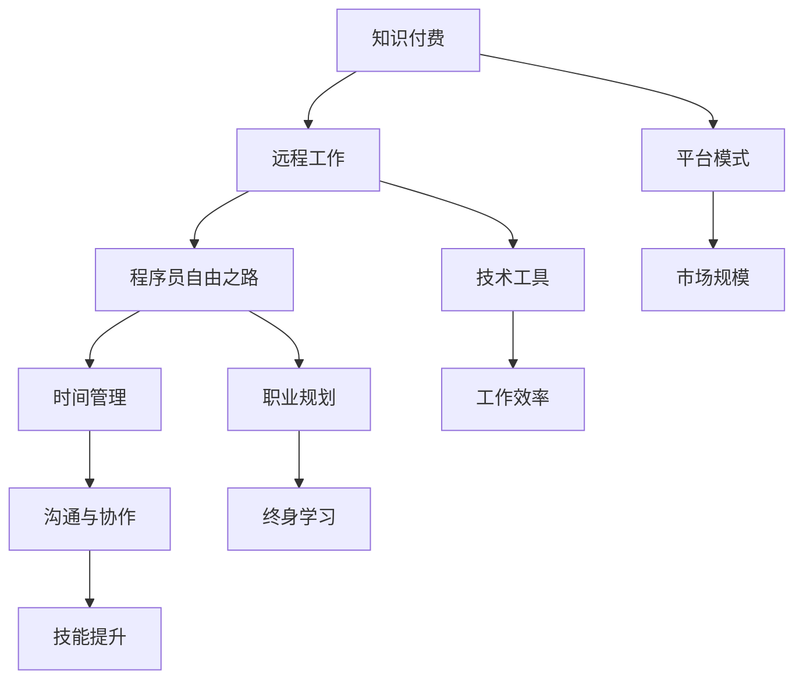

                 

### 《知识付费与远程工作：程序员的自由之路》

#### 关键词：
- 知识付费
- 远程工作
- 程序员
- 自由职业
- 技术发展

#### 摘要：
本文深入探讨了知识付费与远程工作对程序员职业发展的影响。通过分析知识付费的起源、价值与挑战，远程工作的定义、类型与工具，以及程序员的职业发展路径，本文揭示了程序员如何利用远程工作和知识付费实现自由之路。文章结合实际案例，总结了成功的经验与教训，为程序员提供了一条可行的职业发展路径。

---

### 《知识付费与远程工作：程序员的自由之路》目录大纲

#### 第一部分：引言与概述

- **1.1 书籍背景与目的**
  - **1.1.1 知识付费与远程工作的兴起**
  - **1.1.2 程序员的自由之路：概念与意义**

- **1.2 目录结构概述**
  - **1.2.1 本书的主要内容结构**
  - **1.2.2 阅读本书的预期收益**

#### 第二部分：知识付费概述

- **2.1 知识付费的起源与发展**
  - **2.1.1 知识付费的定义与分类**
  - **2.1.2 知识付费的市场规模与趋势**
  - **2.1.3 知识付费的主要平台与模式**

- **2.2 知识付费的价值与挑战**
  - **2.2.1 知识付费的价值分析**
  - **2.2.2 知识付费面临的挑战与对策**

- **2.3 知识付费案例分析**
  - **2.3.1 国内知名知识付费平台分析**
  - **2.3.2 国外知识付费案例分析**

#### 第三部分：远程工作概述

- **3.1 远程工作的定义与类型**
  - **3.1.1 远程工作的定义**
  - **3.1.2 远程工作的主要类型**
  - **3.1.3 远程工作的优点与局限性**

- **3.2 远程工作的技术与工具**
  - **3.2.1 远程协作工具概述**
  - **3.2.2 远程工作的最佳实践**
  - **3.2.3 技术对远程工作的影响**

- **3.3 远程工作案例研究**
  - **3.3.1 国内远程工作公司案例**
  - **3.3.2 国外远程工作公司案例**

#### 第四部分：程序员的自由之路

- **4.1 程序员的职业发展**
  - **4.1.1 程序员职业发展的路径**
  - **4.1.2 从初级到高级：技能提升路径**
  - **4.1.3 程序员如何规划职业生涯**

- **4.2 自由职业与远程工作**
  - **4.2.1 自由职业者的工作模式**
  - **4.2.2 远程工作的自由性探讨**
  - **4.2.3 自由职业者面临的挑战与机遇**

- **4.3 程序员的远程工作技巧**
  - **4.3.1 时间管理与效率提升**
  - **4.3.2 沟通与协作技巧**
  - **4.3.3 技术选型与团队协作**

- **4.4 自由之路的案例分析**
  - **4.4.1 成功的远程工作程序员案例**
  - **4.4.2 自由职业者的成长经验与教训**

#### 第五部分：知识付费在远程工作中的实践

- **5.1 知识付费与远程工作的结合**
  - **5.1.1 知识付费在远程工作中的应用场景**
  - **5.1.2 知识付费如何提升远程工作效率**
  - **5.1.3 远程工作中的知识付费策略**

- **5.2 知识付费平台的远程工作支持**
  - **5.2.1 知识付费平台提供的远程工作服务**
  - **5.2.2 知识付费平台的优势与挑战**
  - **5.2.3 知识付费平台的未来发展**

- **5.3 远程工作中的知识付费案例分析**
  - **5.3.1 案例一：某知名远程工作平台的知识付费实践**
  - **5.3.2 案例二：独立程序员的自由之路与知识付费**

#### 第六部分：程序员的自由之路与未来展望

- **6.1 自由之路的未来趋势**
  - **6.1.1 远程工作与知识付费的发展方向**
  - **6.1.2 程序员职业的未来展望**
  - **6.1.3 技术进步对程序员自由之路的影响**

- **6.2 程序员的自我提升与可持续发展**
  - **6.2.1 程序员的终身学习策略**
  - **6.2.2 技术创新与创业机会**
  - **6.2.3 程序员的软技能培养**

- **6.3 自由之路的挑战与应对**
  - **6.3.1 自由之路的挑战与困难**
  - **6.3.2 面对挑战的应对策略**
  - **6.3.3 社会环境对自由之路的支持与限制**

#### 附录

- **7.1 知识付费与远程工作的相关资源**
  - **7.1.1 主要知识付费平台介绍**
  - **7.1.2 远程工作工具推荐**
  - **7.1.3 相关书籍与论文推荐**

- **7.2 自由之路实践案例汇总**
  - **7.2.1 成功的远程工作与知识付费案例**
  - **7.2.2 自由职业者的成长经验与教训**

---

### 《知识付费与远程工作：程序员的自由之路》

#### 引言与概述

在当今数字化时代，知识付费与远程工作成为了信息技术领域的重要趋势。程序员作为数字时代的关键人才，如何在这两个趋势中找到自己的职业发展路径，实现自由之路，成为了一个值得探讨的问题。

本篇文章旨在深入分析知识付费与远程工作对程序员职业发展的影响，帮助程序员理解这两个趋势的背景、内涵和实际应用，并提供一些实用的策略和建议。文章分为以下几个部分：

首先，本文将介绍知识付费的起源、发展、价值与挑战，以及国内外知名知识付费平台的分析。

其次，文章将探讨远程工作的定义、类型、优点与局限性，以及远程工作的技术与工具。

然后，本文将重点分析程序员的职业发展路径，从初级到高级的技能提升路径，以及如何规划职业生涯。

接着，文章将探讨自由职业与远程工作的结合，自由职业者的工作模式，以及面临的挑战与机遇。

随后，本文将介绍程序员的远程工作技巧，包括时间管理、沟通与协作、技术选型与团队协作等方面。

在此基础上，文章将通过案例分析，总结成功的远程工作与知识付费实践，为程序员提供借鉴和启示。

最后，本文将展望程序员自由之路的未来趋势，讨论程序员的自我提升与可持续发展，以及面对挑战的应对策略。

通过本文的阅读，读者将能够全面了解知识付费与远程工作对程序员职业发展的影响，找到适合自己的职业发展路径，实现自由之路。

---

### 第一部分：引言与概述

#### 1.1 书籍背景与目的

在信息爆炸的时代，知识付费和远程工作成为了信息技术领域的重要现象。知识付费是指个人或企业通过支付费用获取特定知识或技能的过程，而远程工作则是指利用互联网技术，无需到特定地点工作，可以自由安排工作时间和地点的工作方式。

本篇书籍旨在深入探讨知识付费与远程工作对程序员职业发展的影响，为程序员提供一条可行的自由之路。书籍通过以下几个方面展开讨论：

首先，介绍知识付费的起源、发展、价值与挑战，分析国内外知名知识付费平台的特点与模式。

其次，探讨远程工作的定义、类型、优点与局限性，以及远程工作的技术与工具，帮助程序员了解远程工作的基本概念和实际应用。

然后，分析程序员的职业发展路径，从初级到高级的技能提升路径，以及如何规划职业生涯，帮助程序员明确自己的职业发展方向。

接着，探讨自由职业与远程工作的结合，自由职业者的工作模式，以及面临的挑战与机遇，为程序员提供多元化的职业选择。

随后，介绍程序员的远程工作技巧，包括时间管理、沟通与协作、技术选型与团队协作等方面，帮助程序员提高工作效率。

在此基础上，通过案例分析，总结成功的远程工作与知识付费实践，为程序员提供借鉴和启示。

最后，展望程序员自由之路的未来趋势，讨论程序员的自我提升与可持续发展，以及面对挑战的应对策略。

通过阅读本书，读者将能够全面了解知识付费与远程工作对程序员职业发展的影响，掌握相关的理论知识和实践经验，找到适合自己的职业发展路径，实现自由之路。

#### 1.1.1 知识付费与远程工作的兴起

知识付费与远程工作的兴起源于信息技术和互联网的快速发展。随着数字化时代的到来，知识成为了最重要的生产要素之一，知识的获取和传播方式也发生了巨大的变化。

知识付费的兴起可以追溯到互联网的普及。在过去，知识的获取主要依赖于传统教育体系和图书馆等资源，而随着互联网的兴起，人们可以通过在线课程、电子书籍、知识分享平台等途径获取所需的知识。这种便捷的获取方式使得知识付费成为一种新的商业模式，满足了人们对于高效学习的需求。

同时，远程工作的兴起也与互联网技术的发展密不可分。远程工作使得程序员可以不受地域限制，自由选择工作地点，提高了工作效率和生活质量。随着云计算、协作工具和远程办公技术的成熟，远程工作已经成为了一种常态化的工作方式，为程序员提供了更多的职业选择和发展空间。

知识付费与远程工作的兴起不仅改变了传统的工作模式，也对程序员职业发展产生了深远的影响。程序员可以通过知识付费平台学习新技能，提升自己的竞争力，同时，远程工作使得程序员可以更加灵活地安排工作和生活，提高了工作满意度和幸福感。

总的来说，知识付费与远程工作的兴起为程序员提供了更多的机会和选择，也为他们的职业发展带来了新的挑战。了解和掌握这两个趋势，将有助于程序员在竞争激烈的职场中脱颖而出，实现自己的职业目标。

#### 1.1.2 程序员的自由之路：概念与意义

“程序员的自由之路”是一个涉及职业自由、工作模式灵活性和个人发展的概念。它不仅仅是关于物理工作地点的灵活性，更关乎于程序员在职业发展中的自主选择权和控制权。

**自由之路的概念：**

1. **职业自由：** 程序员可以在全球范围内选择工作项目，不受地域限制。这意味着他们可以参与到跨国项目，与不同文化和背景的团队成员合作。
2. **工作模式灵活性：** 程序员可以根据个人偏好选择全职、兼职、远程或自由职业工作模式。他们可以灵活安排工作时间，平衡工作与生活。
3. **技能自主发展：** 程序员可以根据市场需求和个人兴趣，自由选择学习新技能和掌握新技术，不断提升自身竞争力。
4. **个人品牌建设：** 通过自由之路，程序员可以建立自己的专业品牌，通过线上平台展示个人作品和成就，吸引更多机会和合作。

**自由之路的意义：**

1. **工作与生活平衡：** 远程工作和自由职业模式允许程序员灵活安排工作时间和地点，从而更好地平衡工作与个人生活。
2. **职业发展机会：** 自由之路提供了更多的职业发展机会，程序员可以通过参与不同的项目积累经验，提升技能。
3. **经济收益：** 程序员可以根据自己的能力和市场需求定价，获得更高的经济收益。
4. **工作满意度：** 自由之路使程序员能够追求自己热爱的工作，提高工作满意度。
5. **创新能力：** 灵活的工作环境有助于激发程序员的创新能力，促进技术进步。

总的来说，程序员的自由之路不仅是对传统工作模式的革新，更是一种职业价值观的变革。它鼓励程序员追求个人成长和职业自由，在数字化时代中找到属于自己的位置。

#### 1.2 目录结构概述

本篇书籍结构分为六个主要部分，每个部分都针对知识付费与远程工作对程序员职业发展的影响进行了深入探讨。

**第一部分：引言与概述**

这一部分介绍了书籍的背景、目的和主要内容结构。通过讨论知识付费与远程工作的兴起，以及程序员的自由之路概念，为后续内容的展开奠定了基础。

**第二部分：知识付费概述**

这部分内容包括知识付费的起源与发展、价值与挑战，以及国内外知名知识付费平台的分析。通过分析知识付费的现状和趋势，帮助程序员了解这一领域的基本概念和应用场景。

**第三部分：远程工作概述**

这部分介绍了远程工作的定义、类型、优点与局限性，以及远程工作的技术与工具。通过讨论远程工作的实际应用，帮助程序员掌握远程工作的基本技能和最佳实践。

**第四部分：程序员的自由之路**

这部分内容涵盖了程序员的职业发展、自由职业与远程工作、远程工作技巧，以及自由之路的案例分析。通过探讨程序员的自由之路，为程序员提供具体的职业发展路径和实用技巧。

**第五部分：知识付费在远程工作中的实践**

这部分内容分析了知识付费与远程工作的结合，知识付费平台的远程工作支持，以及远程工作中的知识付费案例分析。通过具体案例，帮助程序员了解知识付费在远程工作中的实际应用和效果。

**第六部分：程序员的自由之路与未来展望**

这部分内容展望了远程工作与知识付费的未来趋势，讨论了程序员的自我提升与可持续发展，以及面对挑战的应对策略。通过探讨未来发展方向，为程序员的自由之路提供了前瞻性指导。

通过以上六个部分的深入探讨，本书旨在为程序员提供一条清晰的自由之路，帮助他们在知识付费和远程工作中实现个人成长和职业发展。

#### 1.2.1 本书的主要内容结构

本书的结构主要分为以下六个部分：

**第一部分：引言与概述**

本部分介绍了书籍的背景、目的和主要内容结构。首先，探讨了知识付费与远程工作的兴起背景，以及程序员如何通过这两者实现自由之路。接着，详细阐述了书籍的目录结构，为后续内容的深入讨论奠定了基础。

**第二部分：知识付费概述**

本部分深入分析了知识付费的起源、发展、价值与挑战。首先，介绍了知识付费的定义与分类，包括教育、技能培训、专业咨询等不同类型。其次，探讨了知识付费的市场规模与趋势，分析了国内外知名知识付费平台的发展现状和特点。最后，讨论了知识付费的价值与挑战，包括内容质量、用户粘性、商业模式等方面。

**第三部分：远程工作概述**

本部分介绍了远程工作的定义、类型、优点与局限性。首先，详细阐述了远程工作的定义和主要类型，如全职远程、兼职远程、自由职业等。接着，讨论了远程工作的优点，如工作灵活性、成本节约、工作效率提升等，同时也分析了其局限性，如沟通协作困难、工作质量监控等。最后，介绍了远程工作的技术与工具，如远程协作工具、项目管理工具、时间管理工具等。

**第四部分：程序员的职业发展**

本部分内容主要关注程序员的职业发展路径。首先，分析了程序员职业发展的不同阶段，包括初级程序员、中级程序员、高级程序员等。接着，探讨了从初级到高级的技能提升路径，包括编程语言、框架、工具、数据库等方面的知识。最后，介绍了程序员如何规划职业生涯，包括职业目标设定、技能积累、项目经验积累、职业认证等方面。

**第五部分：自由职业与远程工作**

本部分主要探讨自由职业与远程工作的结合。首先，介绍了自由职业者的工作模式，包括独立开发者、自由顾问、远程团队等。接着，分析了自由职业者的挑战与机遇，如时间管理、项目管理、市场拓展等。最后，讨论了程序员的远程工作技巧，包括时间管理、沟通与协作、技术选型与团队协作等。

**第六部分：知识付费在远程工作中的实践**

本部分内容主要分析了知识付费在远程工作中的实践。首先，探讨了知识付费与远程工作的结合点，包括在线教育、远程培训、远程咨询等。接着，介绍了知识付费平台提供的远程工作服务，包括课程学习、技能认证、项目协作等。最后，通过具体案例分析，总结了知识付费在远程工作中的实际效果和应用。

通过以上六个部分的深入探讨，本书旨在为程序员提供一条清晰、实用的自由之路，帮助他们充分利用知识付费与远程工作的优势，实现个人成长和职业发展。

#### 1.2.2 阅读本书的预期收益

阅读本书，读者可以期待获得以下预期收益：

1. **全面理解知识付费与远程工作：** 本书详细介绍了知识付费与远程工作的起源、发展、价值与挑战，使读者能够全面了解这两个趋势的背景和内涵。

2. **掌握实用技能和最佳实践：** 通过对程序员的职业发展路径、远程工作技巧的深入探讨，读者可以学到实际可操作的技能和最佳实践，提高工作效率和职业竞争力。

3. **实现个人成长与职业发展：** 本书提供了丰富的案例分析，通过成功经验和教训，为读者提供可行的职业发展路径，帮助读者在知识付费与远程工作中找到自己的定位。

4. **提升自主学习和创新意识：** 阅读本书，读者将了解到如何通过知识付费提升自身技能，如何在远程工作中保持创新意识和适应能力，从而实现个人成长和职业发展。

5. **拓展职业选择和收入来源：** 知识付费与远程工作提供了多元化的职业选择和收入来源，通过本书的指导，读者可以探索新的职业机会，实现经济收益的提升。

总的来说，本书将为程序员提供一条清晰的自由之路，帮助他们在知识付费与远程工作中实现个人成长和职业发展，获得更高的工作满意度和幸福感。

---

### 第二部分：知识付费概述

知识付费是一种通过支付费用获取知识或服务的商业模式，它改变了传统知识传播的方式，使得知识获取变得更加高效和灵活。这一部分将详细探讨知识付费的起源、发展、价值与挑战，以及国内外知名知识付费平台的分析。

#### 2.1 知识付费的起源与发展

知识付费的概念可以追溯到20世纪末，随着互联网的普及和在线教育的兴起，知识付费逐渐成为一种新兴的商业模式。起初，知识付费主要集中在在线课程和电子书籍等数字产品上，用户通过支付费用获取这些知识资源。

进入21世纪后，随着移动互联网和大数据技术的不断发展，知识付费市场得到了进一步扩展。知识付费平台如雨后春笋般涌现，涵盖了从技能培训、专业咨询到知识分享等多种形式。例如，中国的“得到”、“知乎Live”、国外的“Udemy”、“Coursera”等平台，都成为了知识付费的重要代表。

知识付费的起源可以追溯到以下几个关键因素：

1. **互联网普及：** 互联网的普及使得知识传播的速度和范围大大增加，人们可以随时随地获取所需的知识。
2. **在线教育兴起：** 在线教育平台的出现，使得学习者可以在线学习各种课程，满足了不同人群的学习需求。
3. **知识价值凸显：** 随着知识经济的兴起，知识本身的价值被越来越多人所认识和重视。
4. **移动支付发展：** 移动支付的普及，使得支付过程更加便捷，推动了知识付费的发展。

#### 2.2 知识付费的价值与挑战

知识付费在现代社会中具有重要的价值，它不仅为知识的传播和获取提供了新的途径，还带来了以下几个方面的积极影响：

1. **提高学习效率：** 知识付费使得用户可以更加精准地获取所需的知识，避免了传统学习方式中信息过载的问题，提高了学习效率。
2. **促进知识共享：** 知识付费平台为知识和经验的传播提供了新的渠道，促进了知识共享和交流。
3. **激发创新活力：** 知识付费鼓励人们不断学习和提升技能，激发了创新活力，推动了社会的进步。
4. **经济效益：** 知识付费为知识创作者提供了经济回报，激发了他们的创作积极性，形成了良性的知识生产与传播循环。

然而，知识付费也面临一些挑战：

1. **内容质量参差不齐：** 知识付费市场中的内容质量参差不齐，一些低质量的内容可能会误导用户，影响学习效果。
2. **用户粘性问题：** 用户在知识付费平台上获取知识后，如何保持长期的学习兴趣和粘性，是一个需要解决的问题。
3. **商业模式创新：** 随着知识付费市场的竞争加剧，如何创新商业模式，提高用户体验，是知识付费平台需要不断探索的问题。
4. **知识产权保护：** 知识付费涉及到知识产权保护问题，如何保护创作者的权益，防止知识盗用和侵权，是一个重要的挑战。

#### 2.3 知识付费的主要平台与模式

知识付费平台在不同的国家和地区有着不同的模式和特点。以下是一些国内外知名的知识付费平台及其主要模式：

1. **国内知识付费平台**

   - **得到**：以订阅制为主，提供各种知识类音频课程，如《罗永浩的创业课》、《薛兆丰的经济学课》等。
   - **知乎Live**：通过直播或录播形式，提供专业知识和经验分享，如《职场沟通技巧》、《时间管理》等。
   - **网易云课堂**：提供各种在线课程，涵盖编程、设计、营销等多个领域，采用购买课程的方式进行知识付费。

2. **国外知识付费平台**

   - **Udemy**：提供大量的在线课程，涵盖编程、设计、营销等多个领域，用户可以购买单个课程进行学习。
   - **Coursera**：提供全球知名大学的在线课程，用户可以通过付费购买证书，增强自己的职业竞争力。
   - **edX**：由哈佛大学和麻省理工学院共同创办，提供各种在线课程，用户可以免费学习，通过付费获得证书。

不同的知识付费平台采用了不同的商业模式和运营策略，以满足用户的需求和市场的变化。然而，它们的核心目标都是通过知识付费，为用户创造价值，同时也为知识创作者提供经济回报。

总的来说，知识付费作为一种新兴的商业模式，正在不断发展和完善。通过对知识付费的深入探讨，我们可以更好地理解其价值与挑战，为未来的发展提供有益的参考。

---

### 2.1 知识付费的起源与发展

知识付费的起源可以追溯到互联网和在线教育技术的发展。在互联网初期，知识的传播主要依赖于传统教育机构和书籍，而随着互联网的普及，人们开始通过网络获取知识。这种获取方式不仅速度快，而且覆盖面广，为知识付费模式的诞生奠定了基础。

在线教育的兴起是知识付费发展的关键节点。20世纪末，随着互联网技术的不断成熟，各种在线教育平台如雨后春笋般涌现。这些平台通过提供在线课程、讲座、电子书籍等知识资源，让用户可以随时随地学习。这一时期，知识付费逐渐成为一种新兴的商业模式，用户通过支付费用来获取这些有价值的知识。

进入21世纪，移动互联网和大数据技术的快速发展进一步推动了知识付费的普及。移动互联网使得知识获取更加便捷，用户可以随时随地进行学习；而大数据技术则为知识付费平台提供了用户行为分析的工具，帮助平台更好地了解用户需求，提供个性化的服务。

知识付费的主要平台和模式也在这一过程中不断演变。以下是一些国内外知名的知识付费平台及其主要模式：

1. **国内知识付费平台**

   - **得到**：以订阅制为主，提供各种知识类音频课程，如《罗永浩的创业课》、《薛兆丰的经济学课》等。
   - **知乎Live**：通过直播或录播形式，提供专业知识和经验分享，如《职场沟通技巧》、《时间管理》等。
   - **网易云课堂**：提供各种在线课程，涵盖编程、设计、营销等多个领域，采用购买课程的方式进行知识付费。

2. **国外知识付费平台**

   - **Udemy**：提供大量的在线课程，涵盖编程、设计、营销等多个领域，用户可以购买单个课程进行学习。
   - **Coursera**：提供全球知名大学的在线课程，用户可以通过付费购买证书，增强自己的职业竞争力。
   - **edX**：由哈佛大学和麻省理工学院共同创办，提供各种在线课程，用户可以免费学习，通过付费获得证书。

不同的知识付费平台采用了不同的商业模式和运营策略，以满足用户的需求和市场的变化。然而，它们的核心目标都是通过知识付费，为用户创造价值，同时也为知识创作者提供经济回报。

总的来说，知识付费作为一种新兴的商业模式，正在不断发展和完善。通过对知识付费的深入探讨，我们可以更好地理解其起源和发展历程，为未来的发展提供有益的参考。

#### 2.2 知识付费的价值与挑战

知识付费在现代社会中具有重要的价值，它不仅为知识的传播和获取提供了新的途径，还带来了以下几个方面的积极影响：

1. **提高学习效率：** 知识付费使得用户可以更加精准地获取所需的知识，避免了传统学习方式中信息过载的问题，提高了学习效率。用户可以根据自己的兴趣和需求，选择购买特定的课程或内容，从而节省时间和精力。

2. **促进知识共享：** 知识付费平台为知识和经验的传播提供了新的渠道，促进了知识共享和交流。通过这些平台，用户可以分享自己的知识和经验，同时也可以学习他人的知识和经验，实现知识的快速传播和积累。

3. **激发创新活力：** 知识付费鼓励人们不断学习和提升技能，激发了创新活力，推动了社会的进步。在知识付费的环境下，人们更加重视知识的获取和更新，这有助于激发创新思维，推动科技进步和产业升级。

4. **经济效益：** 知识付费为知识创作者提供了经济回报，激发了他们的创作积极性，形成了良性的知识生产与传播循环。通过知识付费，创作者可以获得一定的收益，从而维持创作活动的持续进行，同时也能够吸引更多的人才投入到知识创作中。

然而，知识付费也面临一些挑战：

1. **内容质量参差不齐：** 知识付费市场中的内容质量参差不齐，一些低质量的内容可能会误导用户，影响学习效果。这需要平台加强对内容的质量把控，确保用户获取到有价值的内容。

2. **用户粘性问题：** 用户在知识付费平台上获取知识后，如何保持长期的学习兴趣和粘性，是一个需要解决的问题。平台需要通过提供高质量的内容、互动活动等方式，增强用户的粘性，提高用户留存率。

3. **商业模式创新：** 随着知识付费市场的竞争加剧，如何创新商业模式，提高用户体验，是知识付费平台需要不断探索的问题。平台需要不断尝试新的商业模式，如会员制、付费问答等，以满足用户多样化的需求。

4. **知识产权保护：** 知识付费涉及到知识产权保护问题，如何保护创作者的权益，防止知识盗用和侵权，是一个重要的挑战。平台需要建立健全的知识产权保护机制，确保创作者的权益得到有效保护。

总之，知识付费作为一种新兴的商业模式，具有重要的价值和潜力，但同时也面临着一系列挑战。通过对这些价值和挑战的深入探讨，我们可以更好地理解知识付费的发展方向和未来趋势。

#### 2.3 知识付费的主要平台与模式

知识付费平台在全球范围内呈现出多样化的模式，这些平台不仅丰富了知识传播的形式，也满足了不同用户群体的需求。以下将介绍国内外一些知名的知识付费平台，并分析其模式与特点。

**1. 国内知识付费平台**

**得到**：作为中国最大的知识服务平台之一，得到主要通过订阅制模式运营。用户可以订阅音频课程，如《罗永浩的创业课》、《薛兆丰的经济学课》等。得到平台的内容涵盖了多个领域，包括商业、科技、文化等，其优势在于高质量的内容和个性化的推荐。

**知乎Live**：知乎Live是知乎旗下的知识分享平台，主要通过直播或录播的形式提供专业知识和经验分享。知乎Live的内容主要围绕职场、生活、技能提升等领域，其优势在于知识分享者的专业性和用户的互动性。

**网易云课堂**：网易云课堂是网易旗下的在线教育平台，提供各种在线课程，涵盖编程、设计、营销等多个领域。网易云课堂采用购买课程的方式进行知识付费，用户可以根据自己的需求选择购买课程。其优势在于课程内容的丰富性和课程的灵活性。

**2. 国外知识付费平台**

**Udemy**：Udemy是全球知名的知识付费平台，提供大量的在线课程，涵盖编程、设计、营销等多个领域。用户可以购买单个课程进行学习，Udemy的优势在于课程的多样性和灵活性，同时也有大量的免费课程供用户学习。

**Coursera**：Coursera是由美国知名大学创办的在线教育平台，提供全球知名大学的在线课程。用户可以通过付费购买证书，增强自己的职业竞争力。Coursera的优势在于其课程的高质量和名校背景，适合希望提升学历和技能的用户。

**edX**：edX由哈佛大学和麻省理工学院共同创办，提供各种在线课程，用户可以免费学习，通过付费获得证书。edX的优势在于其开放性和高质量的课程，适合希望免费学习并获取证书的用户。

**3. 知识付费模式的特点**

**订阅制模式**：这是国内知识付费平台普遍采用的一种模式，用户通过订阅获取平台上的大量内容。这种模式的优势在于能够提供持续的学习资源和个性化的推荐，但需要平台不断更新内容，保持用户的粘性。

**购买课程模式**：国外知识付费平台如Udemy、Coursera等，用户通过购买单个课程进行学习。这种模式的优势在于课程内容的高质量和灵活性，用户可以根据自己的需求选择购买课程。

**会员制模式**：一些平台如得到，采用会员制模式，用户支付一定的费用成为会员，可以享受平台上的所有内容。这种模式的优势在于能够提供丰富的学习资源，但需要平台保持内容的质量和多样性，以吸引和留住用户。

总之，知识付费平台通过不同的模式，满足了用户多样化的需求。这些平台不仅为知识的传播和获取提供了新的途径，也为知识创作者提供了经济回报，推动了知识付费市场的发展。

---

### 2.3 知识付费的主要平台与模式

知识付费平台在全球范围内发展迅速，不同的平台采用了不同的商业模式和运营策略，以满足用户多样化的需求。以下将详细分析国内外的知名知识付费平台，包括其模式、特点以及用户反馈。

**国内知识付费平台**

**得到**：得到是中国最大的知识服务平台之一，以订阅制模式为主。用户可以通过订阅得到一系列高质量的知识课程，包括音频、视频等多种形式。得到平台的内容涵盖了多个领域，如商业、科技、文化等。其优势在于高质量的内容和个性化的推荐，用户可以根据自己的兴趣和需求选择订阅课程。得到的用户反馈普遍认为，平台上的课程内容丰富、实用，有助于提升个人技能和知识水平。

**知乎Live**：知乎Live是知乎旗下的知识分享平台，主要通过直播或录播的形式提供专业知识和经验分享。知乎Live的内容主要围绕职场、生活、技能提升等领域。知乎Live的优势在于知识分享者的专业性和用户的互动性。用户可以与分享者进行实时互动，提问并获取专业的解答。知乎Live的用户反馈表明，平台提供了丰富的学习资源，特别是对于职场人士和技能提升用户来说，具有很高的实用价值。

**网易云课堂**：网易云课堂是网易旗下的在线教育平台，提供各种在线课程，涵盖编程、设计、营销等多个领域。用户可以通过购买课程的方式学习。网易云课堂的优势在于课程内容的丰富性和灵活性，用户可以根据自己的需求和进度选择合适的课程。用户反馈显示，网易云课堂的课程设置合理，教师讲解清晰，有助于用户快速掌握新技能。

**国外知识付费平台**

**Udemy**：Udemy是全球知名的知识付费平台，提供大量的在线课程，涵盖编程、设计、营销等多个领域。用户可以购买单个课程进行学习。Udemy的优势在于课程的多样性和灵活性，用户可以根据自己的兴趣和需求选择课程。Udemy的用户反馈表明，平台上的课程质量较高，教师讲解生动，有助于用户快速提升技能。

**Coursera**：Coursera是由美国知名大学创办的在线教育平台，提供全球知名大学的在线课程。用户可以通过付费购买证书，增强自己的职业竞争力。Coursera的优势在于其课程的高质量和名校背景，适合希望提升学历和技能的用户。用户反馈显示，Coursera的课程内容深入，教师专业，有助于用户深入学习。

**edX**：edX由哈佛大学和麻省理工学院共同创办，提供各种在线课程，用户可以免费学习，通过付费获得证书。edX的优势在于其开放性和高质量的课程，适合希望免费学习并获取证书的用户。用户反馈表明，edX的课程设置合理，教师讲解清晰，有助于用户深入学习。

**知识付费模式的特点**

**订阅制模式**：国内平台如得到、知乎Live等采用订阅制模式，用户通过订阅获取平台上的大量内容。这种模式的优势在于能够提供持续的学习资源和个性化的推荐，但需要平台不断更新内容，保持用户的粘性。

**购买课程模式**：国外平台如Udemy、Coursera等采用购买课程模式，用户购买单个课程进行学习。这种模式的优势在于课程内容的高质量和灵活性，用户可以根据自己的需求选择课程。

**会员制模式**：一些平台如得到，采用会员制模式，用户支付一定的费用成为会员，可以享受平台上的所有内容。这种模式的优势在于能够提供丰富的学习资源，但需要平台保持内容的质量和多样性，以吸引和留住用户。

综上所述，知识付费平台通过不同的模式，满足了用户多样化的需求。这些平台不仅为知识的传播和获取提供了新的途径，也为知识创作者提供了经济回报，推动了知识付费市场的发展。

---

### 2.3.1 国内知名知识付费平台分析

在中国，知识付费市场经历了快速的发展，涌现出了一批知名的付费平台。以下将重点分析几个国内知名的知识付费平台，包括其运营模式、内容特点、用户评价以及成功案例。

**1. 得到**

得到是知识付费领域的领军平台之一，以其订阅制模式著称。用户可以通过订阅获取一系列高质量的音频课程，涵盖商业、科技、人文等多个领域。得到的课程主要由行业专家、知名企业家和学者讲授，内容专业且具有深度。

**运营模式：**
- **订阅制**：用户按月或按季度订阅得到平台上的课程，获取完整的学习资源。
- **内容推荐**：得到利用算法和用户行为数据，为用户推荐个性化的学习内容，提高用户粘性。

**内容特点：**
- **高质量内容**：得到的内容主要由行业专家和学者讲授，确保知识的专业性和实用性。
- **多样化领域**：得到涵盖了商业、科技、人文等多个领域，满足不同用户的学习需求。

**用户评价：**
- 得到的用户普遍认为，平台上的课程内容丰富，学习体验良好，有助于提升个人知识和技能。
- 用户反馈显示，得到在个性化推荐方面做得较好，能够为不同背景的用户提供合适的学习资源。

**成功案例：**
- **《罗永浩的创业课》**：该课程得到了大量用户的订阅和学习，罗永浩以其独特的创业经历和思维方式，为用户提供实用的创业指导。
- **《薛兆丰的经济学课》**：薛兆丰教授的经济学课因其深入浅出的讲解方式，受到了广泛好评，成为得到平台上的热门课程。

**2. 知乎Live**

知乎Live是知乎旗下的知识分享平台，以直播和录播的形式提供专业知识和经验分享。知乎Live的内容主要围绕职场、生活、技能提升等领域，由专业人士和行业资深人士讲授。

**运营模式：**
- **直播和录播**：知乎Live提供实时直播和录播课程，用户可以通过观看直播或回放学习。
- **互动性**：知乎Live强调用户与讲师之间的互动，用户可以在课程中提问，讲师会实时解答。

**内容特点：**
- **专业性和实用性**：知乎Live的课程内容主要由专业人士和行业资深人士讲授，确保知识的专业性和实用性。
- **互动性强**：知乎Live的互动性特点，使得用户在学习过程中能够与讲师和其他用户进行交流，提升学习体验。

**用户评价：**
- 知乎Live的用户普遍认为，平台上的课程内容实用，互动性强，有助于解决实际问题和提升个人技能。
- 用户反馈显示，知乎Live的课程能够提供真实的学习场景和实际操作经验，有助于提高学习效果。

**成功案例：**
- **《职场沟通技巧》**：该课程帮助用户提升职场沟通能力，受到了职场人士的广泛欢迎。
- **《时间管理》**：时间管理课程为用户提供了有效的时间管理方法和工具，帮助用户提升工作效率和生活质量。

**3. 网易云课堂**

网易云课堂是网易旗下的在线教育平台，提供各种在线课程，涵盖编程、设计、营销等多个领域。用户可以通过购买课程的方式学习，课程内容丰富且具有灵活性。

**运营模式：**
- **购买课程**：用户根据需求购买网易云课堂上的课程，学习相关内容。
- **在线学习**：网易云课堂提供在线学习环境，用户可以随时随地进行学习。

**内容特点：**
- **课程多样化**：网易云课堂提供多种类型的课程，满足不同用户的需求。
- **灵活性强**：用户可以根据自己的时间安排和进度进行学习，课程灵活度高。

**用户评价：**
- 网易云课堂的用户普遍认为，平台上的课程内容丰富，学习体验良好，有助于提升个人技能和知识水平。
- 用户反馈显示，网易云课堂的课程设置合理，教师讲解清晰，有助于用户快速掌握新技能。

**成功案例：**
- **《Python基础》**：该课程帮助用户快速入门Python编程，受到了编程爱好者的欢迎。
- **《UI/UX设计基础》**：该课程为设计爱好者提供了系统性的设计知识和实践指导，帮助用户提升设计能力。

综上所述，国内知名的知识付费平台在运营模式、内容特点、用户评价和成功案例方面各具特色，为用户提供了丰富的学习资源，促进了知识付费市场的发展。

---

### 2.3.2 国外知识付费案例分析

在全球范围内，知识付费平台已经发展成为一个庞大的市场，涌现出了许多成功的国外知识付费案例。以下将详细分析几个国外知名的知识付费平台，包括其商业模式、内容特点、用户评价以及成功案例。

**1. Udemy**

**商业模式：** Udemy是一个全球性的在线学习平台，用户可以通过购买单个课程来学习。Udemy的课程涵盖广泛，从编程、数据科学到艺术和设计等多个领域。平台采用C2C（Consumer-to-Consumer）模式，允许教师自主发布课程，并从课程销售中获得收入。

**内容特点：**
- **课程多样化**：Udemy提供数千门课程，满足不同用户的需求。
- **灵活性强**：用户可以自主选择学习进度，灵活安排学习时间。
- **高质量内容**：平台上的课程由经验丰富的教师讲授，内容质量较高。

**用户评价：**
- Udemy的用户普遍认为，平台上的课程内容丰富，且价格相对较低，性价比高。
- 用户反馈显示，平台的学习资源较为丰富，有助于用户快速提升技能。

**成功案例：**
- **《Python编程基础》**：该课程是Udemy上的热门课程，帮助用户快速掌握Python编程技能，受到了全球用户的欢迎。
- **《数据科学基础》**：该课程为初学者提供了系统性的数据科学知识和实践指导，帮助用户入门数据科学领域。

**2. Coursera**

**商业模式：** Coursera是一个在线教育平台，与全球知名大学和机构合作，提供高质量的在线课程。用户可以通过付费购买证书来证明自己的学习成果。Coursera采用B2C（Business-to-Consumer）模式，通过课程销售和证书认证来获得收入。

**内容特点：**
- **高质量课程**：Coursera的课程由知名大学和机构的教授讲授，内容权威且具有深度。
- **互动性强**：平台提供讨论区，用户可以在课程中与其他学生互动，分享学习心得。
- **证书认证**：用户通过付费购买证书，可以证明自己的学习成果和技能水平。

**用户评价：**
- Coursera的用户普遍认为，平台上的课程质量高，内容丰富，有助于提升个人知识和技能。
- 用户反馈显示，平台的学习资源较为丰富，特别是互动性讨论区，为用户提供了良好的学习交流环境。

**成功案例：**
- **《机器学习基础》**：该课程由斯坦福大学教授讲授，帮助用户系统性地学习机器学习知识，成为了Coursera上的热门课程。
- **《人工智能导论》**：该课程由耶鲁大学教授讲授，内容涵盖了人工智能的基础理论和应用，受到了全球用户的欢迎。

**3. edX**

**商业模式：** edX是由哈佛大学和麻省理工学院共同创办的在线教育平台，提供高质量的在线课程。用户可以免费学习课程，但需要付费购买证书。edX采用非盈利模式，通过课程销售和捐赠来维持运营。

**内容特点：**
- **高质量课程**：edX的课程由知名大学和机构的教授讲授，内容权威且具有深度。
- **互动性强**：平台提供在线讨论区，用户可以在课程中与其他学生互动，分享学习心得。
- **免费学习**：edX允许用户免费学习课程，但需要付费购买证书。

**用户评价：**
- edX的用户普遍认为，平台上的课程质量高，内容丰富，有助于提升个人知识和技能。
- 用户反馈显示，平台的学习资源较为丰富，特别是免费学习选项，为用户提供了更多的学习机会。

**成功案例：**
- **《计算机科学导论》**：该课程由麻省理工学院教授讲授，帮助用户系统性地学习计算机科学基础知识，成为了edX上的热门课程。
- **《现代物理学》**：该课程由哈佛大学教授讲授，内容涵盖了现代物理学的基础理论和实验，受到了全球用户的欢迎。

总的来说，国外知名的知识付费平台在商业模式、内容特点、用户评价和成功案例方面各具特色，为全球用户提供了丰富的学习资源。这些平台不仅推动了知识付费市场的发展，也为用户提供了更多学习的机会和选择。

---

### 第三部分：远程工作概述

#### 3.1 远程工作的定义与类型

远程工作，顾名思义，是指通过互联网技术，无需到特定地点工作，可以在任何地点进行工作的模式。远程工作不仅打破了传统办公场所的限制，也为程序员提供了更加灵活和自由的工作环境。以下将详细探讨远程工作的定义、主要类型及其特点。

**远程工作的定义：**

远程工作是指员工利用互联网和其他通讯工具，从家中、咖啡店或其他非传统工作场所进行工作的一种工作模式。这种模式不仅包括全职远程工作，还包括兼职远程工作、远程协作等。

**远程工作的主要类型：**

1. **全职远程工作：** 全职远程工作是指员工完全通过远程方式进行工作，不固定在特定的办公地点。这种工作模式通常适用于程序员、设计师、编辑等职业，因为他们的工作性质不需要固定的工作场所。

2. **兼职远程工作：** 兼职远程工作是指员工在部分时间内通过远程方式进行工作。这种模式适合那些需要兼顾家庭和工作的人，或者那些希望在业余时间增加收入的人。

3. **远程协作：** 远程协作是指团队成员通过互联网工具进行协同工作。这种模式不仅适用于远程工作的个人，也适用于分布在不同地点的团队。远程协作工具如Slack、Trello、Zoom等，使得团队成员可以实时沟通、共享文件和共同完成任务。

**远程工作的特点：**

1. **灵活性：** 远程工作提供了灵活的工作时间和地点，员工可以根据自己的需求和偏好安排工作。这种灵活性有助于提高工作效率和生活质量。

2. **节省成本：** 远程工作减少了通勤时间和费用，同时也降低了办公场所的租金和装修成本。这对于企业和员工来说都是一笔可观的节省。

3. **提高工作效率：** 远程工作减少了办公室环境的干扰，员工可以更加集中精力工作。同时，远程工作还减少了不必要的会议和沟通，使得工作更加高效。

4. **适应性强：** 远程工作适用于各种职业和工作内容，不仅限于技术岗位，还适用于销售、市场、行政等职位。这种适应性使得远程工作成为一种广泛接受的办公模式。

总之，远程工作作为一种新兴的工作模式，具有灵活性、成本节约、工作效率提升等优点。随着互联网技术的发展，远程工作将在未来得到更广泛的应用和认可。

#### 3.1.1 远程工作的定义

远程工作，又称为远程办公或远程协作，是指通过互联网、通讯技术以及其他数字工具，使得工作流程、团队合作、信息交流可以在不依赖于实体工作场所的情况下进行。这种工作模式不仅打破了地理限制，还极大地提升了工作效率和员工的生活质量。

远程工作的定义可以从以下几个方面来理解：

1. **地理上的分离：** 远程工作最显著的特点是地理上的分离。员工可以在任何地方工作，无论是家中、咖啡店、图书馆，还是旅途中，只要能够接入互联网，就可以进行工作。

2. **技术依赖：** 远程工作高度依赖于现代通讯技术和互联网。电子邮件、即时通讯工具（如Slack、Telegram）、视频会议（如Zoom、Microsoft Teams）、项目管理工具（如Trello、JIRA）等，都是远程工作不可或缺的工具。

3. **工作流程的数字化：** 远程工作要求工作流程的数字化，包括文件共享、任务分配、进度跟踪、反馈交流等。这使得工作更加透明、高效，同时也能更好地适应远程协作的特点。

4. **灵活的时间安排：** 远程工作允许员工自主安排工作时间，根据个人生活和工作需求，灵活调整工作进度。这种灵活性不仅提高了工作效率，也提升了员工的满意度。

总的来说，远程工作是一种以互联网和通讯技术为支撑的工作模式，它不仅改变了传统的工作方式，还为员工提供了更多的选择和自由。随着技术的不断进步，远程工作将会在未来的职场中扮演越来越重要的角色。

#### 3.1.2 远程工作的主要类型

远程工作在现代社会中呈现出多样化的类型，以满足不同职业和工作需求。以下将介绍几种常见的远程工作类型，并探讨其特点和应用场景。

**1. 全职远程工作：**

全职远程工作是指员工完全通过远程方式进行工作，不需要到实体办公室上班。这种工作模式通常适用于程序员、设计师、数据分析师等职业，因为这些工作内容不需要固定的工作场所。

**特点：**
- **灵活性高：** 员工可以自由选择工作地点，灵活安排工作时间。
- **高效沟通：** 通过远程协作工具进行实时沟通和文件共享，确保工作顺利进行。
- **工作成果导向：** 全职远程工作更注重工作成果，而非工作时长，有利于提高工作效率。

**应用场景：**
- **软件开发公司：** 软件开发团队常采用全职远程工作模式，因为团队成员可能分布在不同的城市甚至国家，远程工作能够有效降低办公成本，提高开发效率。
- **设计公司：** 设计师的工作通常可以在任何地点完成，远程工作模式使得设计师能够更加专注于创意和工作质量。

**2. 兼职远程工作：**

兼职远程工作是指员工在部分时间内通过远程方式进行工作。这种模式适用于那些需要在固定工作时间以外工作，或者希望在工作与家庭之间找到平衡的人。

**特点：**
- **工作时间灵活：** 员工可以根据自己的时间安排，灵活调整工作时间和任务。
- **成本节约：** 减少了通勤时间和费用，同时降低了办公场所的租金和装修成本。
- **适用范围广：** 无论是全职员工还是自由职业者，都可以选择兼职远程工作模式。

**应用场景：**
- **教育领域：** 教师可以通过远程方式进行兼职教学，如在线授课、辅导学生等。
- **自由职业者：** 如自由撰稿人、设计师、咨询顾问等，他们通常可以在自由时间内完成工作任务，远程工作模式提供了良好的工作环境。

**3. 远程协作：**

远程协作是指团队成员通过互联网工具进行协同工作。这种模式不仅适用于远程工作的个人，也适用于分布在不同地点的团队。

**特点：**
- **实时沟通：** 通过即时通讯工具和视频会议，团队成员可以实时交流，确保工作进度和任务分配的透明性。
- **共享资源：** 通过云存储和协作工具，团队成员可以共享文件和资源，提高工作效率。
- **分布式团队：** 远程协作使得分布式团队成为可能，团队成员可以来自不同的城市、国家，甚至时区。

**应用场景：**
- **跨国公司：** 跨国公司通常采用远程协作模式，因为团队成员分布在不同的国家和地区，远程协作工具有助于协调工作和提高团队效率。
- **敏捷开发团队：** 敏捷开发团队采用远程协作模式，通过快速响应和灵活调整，确保项目进度和质量。

总的来说，远程工作的多样化类型为程序员提供了更多的工作选择和灵活性，同时也能够提高工作效率和生活质量。了解不同类型的远程工作，有助于程序员根据个人需求和工作特点，选择最合适的工作模式。

#### 3.1.3 远程工作的优点与局限性

远程工作作为一种新兴的工作模式，具有许多优点，但同时也存在一定的局限性。以下将详细探讨远程工作的优点和局限性，以帮助程序员更好地理解和应对远程工作带来的挑战。

**远程工作的优点：**

1. **灵活性高：** 远程工作允许员工自主选择工作地点，员工可以在家中、咖啡馆、公园等任何舒适的地方工作。这种灵活性不仅提高了员工的工作效率，还提高了生活质量，使员工能够更好地平衡工作与生活。

2. **节省通勤时间：** 远程工作避免了通勤带来的时间和精力消耗，员工可以省下通勤的时间，用于工作或个人生活。这不仅减少了交通拥堵和环境污染，还提高了工作效率。

3. **降低办公成本：** 远程工作减少了公司对办公场所的需求，降低了办公租金、水电费、装修费等成本。对于员工来说，远程工作也减少了日常的出行开销，如交通费、餐饮费等。

4. **提高工作效率：** 远程工作减少了办公室环境的干扰，员工可以更加集中精力工作。同时，远程工作还减少了不必要的会议和沟通，使得工作更加高效。

5. **拓展职业机会：** 远程工作使得程序员能够参与到全球范围内的项目，不受地域限制。这种拓展性为程序员提供了更多的职业机会和挑战，有助于提升个人技能和职业发展。

**远程工作的局限性：**

1. **沟通协作困难：** 远程工作环境下，员工之间的沟通和协作相对困难。由于缺乏面对面的交流，团队成员可能会感到孤独和疏离，影响工作效率和团队氛围。

2. **工作质量监控：** 远程工作使得工作质量监控变得更加复杂。员工在家工作时，管理者难以直接监督工作进度和质量，可能导致项目进度延误或质量问题。

3. **技术依赖性：** 远程工作高度依赖于互联网和通讯技术。网络故障、系统故障等问题可能影响工作效率，甚至导致工作中断。

4. **时间管理挑战：** 远程工作要求员工具备良好的时间管理能力。由于工作地点的灵活性，员工可能会面临工作与生活边界模糊的问题，导致工作效率下降。

5. **职业发展受限：** 远程工作可能限制员工的职业发展。由于缺乏与同事的面对面交流，员工可能难以获得晋升机会或职业指导。

总的来说，远程工作具有灵活性高、节省成本、提高工作效率等优点，但也存在沟通协作困难、工作质量监控复杂等局限性。程序员在享受远程工作带来的便利的同时，也需要应对这些挑战，不断提升自己的技能和时间管理能力，实现职业发展。

#### 3.2 远程工作的技术与工具

远程工作的实现离不开各种技术和工具的支持。这些技术和工具不仅能够提高远程工作的效率，还能确保团队协作的顺畅。以下将介绍远程工作的主要协作工具，包括即时通讯工具、项目管理工具、视频会议工具，以及远程办公平台的最佳实践。

**即时通讯工具：**

即时通讯工具是远程工作中不可或缺的一部分，用于团队成员之间的实时沟通和协作。以下是一些常用的即时通讯工具：

- **Slack**：Slack是一款功能丰富的即时通讯工具，支持文件共享、视频会议和项目管理。Slack的频道（Channels）和群组（Groups）功能，使得团队成员可以根据项目或主题进行分组沟通，提高了沟通的效率。

- **Telegram**：Telegram是一款加密即时通讯应用，具有群聊、文件传输和视频通话功能。其简洁的界面和强大的功能，使得Telegram在远程工作中得到了广泛应用。

- **Microsoft Teams**：Microsoft Teams是微软推出的即时通讯和协作平台，集成了邮件、日历、文档共享和视频会议等功能。其强大的集成性和安全性，使其成为许多企业远程工作的首选工具。

**项目管理工具：**

项目管理工具用于帮助团队管理项目进度、任务分配和资源调度。以下是一些常用的项目管理工具：

- **Trello**：Trello是一款基于看板（Kanban）原理的项目管理工具，通过卡片（Cards）和列表（Lists）来展示项目进度。Trello的直观界面和灵活的设置，使其成为远程项目管理的不二之选。

- **JIRA**：JIRA是Atlassian公司推出的一款强大的项目管理工具，支持敏捷开发、任务跟踪和团队协作。JIRA的功能丰富，可以满足各种规模和类型的项目管理需求。

- **Asana**：Asana是一款灵活的项目管理工具，通过任务（Tasks）和项目（Projects）来管理项目进度。其强大的任务分配和通知功能，确保了团队成员之间的协调和工作效率。

**视频会议工具：**

视频会议工具用于远程团队的在线会议和协作。以下是一些常用的视频会议工具：

- **Zoom**：Zoom是一款功能强大的视频会议工具，支持高清视频、语音和屏幕共享。其易用性和稳定性，使其在远程工作中得到了广泛应用。

- **Microsoft Teams**：Microsoft Teams不仅具备即时通讯功能，还提供了强大的视频会议功能。其集成在Office 365中，使得用户可以方便地进行视频会议和协作。

- **Google Meet**：Google Meet是Google推出的视频会议工具，支持最多100人的视频会议，并提供高质量的音频和视频效果。其与Google Workspace的无缝集成，使得用户可以轻松地进行会议和协作。

**远程办公平台：**

远程办公平台集成了即时通讯、项目管理、视频会议等多种功能，为远程工作提供了全方位的支持。以下是一些常用的远程办公平台：

- **Microsoft Teams**：除了即时通讯和视频会议功能，Microsoft Teams还提供了文档共享、日历同步和任务管理等功能。其强大的集成性和安全性，使其成为许多企业的远程办公平台首选。

- **Google Workspace**：Google Workspace包括Gmail、Google Docs、Google Sheets、Google Slides等多种工具，支持在线协作和文档共享。其易用性和强大的功能，使其成为远程办公的理想选择。

- **Notion**：Notion是一款多功能的远程办公平台，集成了笔记、任务管理、数据库等功能。其灵活的界面和强大的自定义功能，使得用户可以轻松地构建自己的工作空间。

**最佳实践：**

为了确保远程工作的顺利进行，以下是一些最佳实践：

1. **明确沟通机制：** 建立明确的沟通机制和流程，确保团队成员之间能够及时、准确地交流信息。

2. **制定工作计划：** 制定详细的工作计划和任务分配，确保项目进度和目标明确，团队成员能够有序地开展工作。

3. **定期会议：** 定期举行团队会议，回顾项目进展，讨论问题和解决方案，确保团队协作的顺畅。

4. **保持透明度：** 保持工作过程的透明度，及时分享工作进展和成果，确保团队成员之间的信任和合作。

5. **技术培训：** 定期进行技术培训，帮助团队成员熟悉远程工作的工具和流程，提高工作效率。

总的来说，远程工作的技术与工具为程序员提供了更加灵活和高效的工作环境。了解并掌握这些工具和最佳实践，将有助于程序员更好地适应远程工作，实现个人和团队的共同发展。

---

### 3.2 远程工作的技术与工具

远程工作的有效进行离不开高效的技术工具和平台的支持。以下将详细介绍几种常见的远程协作工具，包括即时通讯工具、项目管理工具、视频会议工具，以及远程办公平台，并提供一些最佳实践。

#### 3.2.1 远程协作工具概述

远程协作工具是远程工作中不可或缺的组成部分，用于实现团队成员之间的实时沟通和协作。以下是几种常用的远程协作工具：

1. **即时通讯工具：**

   - **Slack**：Slack是一款功能强大的即时通讯工具，支持文件共享、视频会议和项目管理。Slack的频道和群组功能使得团队成员可以根据项目或主题进行分组沟通，提高了沟通效率。

   - **Microsoft Teams**：Microsoft Teams是微软推出的即时通讯和协作平台，集成了邮件、日历、文档共享和视频会议等功能。其强大的集成性和安全性，使其成为许多企业远程工作的首选工具。

   - **Telegram**：Telegram是一款加密即时通讯应用，具有群聊、文件传输和视频通话功能。其简洁的界面和强大的功能，使得Telegram在远程工作中得到了广泛应用。

2. **项目管理工具：**

   - **Trello**：Trello是一款基于看板原理的项目管理工具，通过卡片和列表展示项目进度。其直观界面和灵活设置，使得Trello成为远程项目管理的不二之选。

   - **JIRA**：JIRA是一款功能强大的项目管理工具，支持敏捷开发、任务跟踪和团队协作。其丰富的功能和灵活性，使其能够满足各种规模和类型的项目管理需求。

   - **Asana**：Asana是一款灵活的项目管理工具，通过任务和项目来管理项目进度。其强大的任务分配和通知功能，确保了团队成员之间的协调和工作效率。

3. **视频会议工具：**

   - **Zoom**：Zoom是一款功能强大的视频会议工具，支持高清视频、语音和屏幕共享。其易用性和稳定性，使其在远程工作中得到了广泛应用。

   - **Microsoft Teams**：Microsoft Teams不仅具备即时通讯功能，还提供了强大的视频会议功能。其集成在Office 365中，使得用户可以方便地进行视频会议和协作。

   - **Google Meet**：Google Meet是Google推出的视频会议工具，支持最多100人的视频会议，并提供高质量的音频和视频效果。其与Google Workspace的无缝集成，使得用户可以轻松地进行会议和协作。

4. **远程办公平台：**

   - **Microsoft Teams**：Microsoft Teams集成了即时通讯、项目管理、视频会议等多种功能，为远程工作提供了全方位的支持。

   - **Google Workspace**：Google Workspace包括Gmail、Google Docs、Google Sheets、Google Slides等多种工具，支持在线协作和文档共享。其易用性和强大的功能，使其成为远程办公的理想选择。

   - **Notion**：Notion是一款多功能的远程办公平台，集成了笔记、任务管理、数据库等功能。其灵活的界面和强大的自定义功能，使得用户可以轻松地构建自己的工作空间。

#### 3.2.2 远程工作的最佳实践

为了确保远程工作的顺利进行，以下是一些最佳实践：

1. **明确沟通机制：** 建立明确的沟通机制和流程，确保团队成员之间能够及时、准确地交流信息。定期举行团队会议，回顾项目进展，讨论问题和解决方案。

2. **制定工作计划：** 制定详细的工作计划和任务分配，确保项目进度和目标明确，团队成员能够有序地开展工作。使用项目管理工具跟踪任务进度，确保项目按时完成。

3. **保持透明度：** 保持工作过程的透明度，及时分享工作进展和成果，确保团队成员之间的信任和合作。使用协作工具共享项目文件和资源，确保信息传递的及时性和准确性。

4. **技术培训：** 定期进行技术培训，帮助团队成员熟悉远程工作的工具和流程，提高工作效率。确保团队成员能够熟练使用各种协作工具，减少技术障碍。

5. **时间管理：** 远程工作要求员工具备良好的时间管理能力。制定合理的工作计划，确保工作与生活的平衡。使用时间管理工具，如番茄钟，提高工作效率。

6. **心理支持：** 远程工作可能导致员工感到孤独和疏离。定期举行团队活动，如线上聚会和团队建设活动，增强团队凝聚力。关注员工的心理健康，提供必要的心理支持。

通过遵循这些最佳实践，程序员可以更好地适应远程工作环境，提高工作效率，实现个人和团队的共同发展。

---

### 3.3 远程工作案例研究

远程工作已经成为现代职场的一个重要趋势，许多公司和企业已经成功实施了远程工作模式。以下将分析国内外的远程工作公司案例，探讨其成功经验、运营模式以及远程工作对企业文化和员工关系的影响。

#### 国内远程工作公司案例

**1. 网易：**

网易是中国知名的互联网公司，早在2006年就开始推行远程办公政策。网易的远程办公不仅限于程序员和设计师，还包括市场、运营等多个部门。网易通过使用即时通讯工具、项目管理工具和视频会议工具，实现了高效的远程协作。

**成功经验：**
- **灵活的工作安排：** 网易允许员工根据个人情况和工作需求，灵活安排工作时间，提高了员工的工作满意度。
- **高效沟通：** 网易通过Slack、Trello等工具，确保了团队之间的沟通和协作，提高了工作效率。
- **创新激励：** 网易定期举办线上创新挑战赛，鼓励员工提出创新想法，激发了员工的创新热情。

**运营模式：**
- **混合办公模式：** 网易采用混合办公模式，员工可以选择全职远程工作或定期到办公室工作。这种模式既保留了远程工作的灵活性，又保持了团队之间的互动和合作。
- **技术支持：** 网易提供了丰富的远程工作技术支持，包括高速网络、VPN、远程桌面等，确保了员工能够高效地进行远程工作。

**企业文化和员工关系：**
- **开放沟通：** 网易倡导开放和透明的沟通文化，鼓励员工提出意见和建议，提高了员工的参与感和归属感。
- **关注员工福利：** 网易提供了丰富的员工福利，如健康体检、旅游福利、团队活动等，增强了员工的归属感。

**2. 阿里巴巴：**

阿里巴巴是全球知名的企业，其远程工作政策在全球范围内都得到了推广。阿里巴巴通过阿里云、钉钉等内部工具，实现了高效远程协作。

**成功经验：**
- **远程工作培训：** 阿里巴巴为员工提供了远程工作培训，帮助员工掌握远程工作的技能和工具，提高了远程工作效率。
- **弹性工作制度：** 阿里巴巴采用弹性工作制度，员工可以根据个人需求，灵活安排工作时间，提高了工作效率和生活质量。
- **绩效导向：** 阿里巴巴通过绩效评估机制，确保远程工作员工的绩效和贡献得到认可。

**运营模式：**
- **全球远程工作：** 阿里巴巴在全球范围内推行远程工作政策，员工可以在全球任何地方工作。这种模式不仅降低了公司的运营成本，还吸引了全球优秀人才。
- **远程办公社区：** 阿里巴巴建立了远程办公社区，通过线上活动、分享会等，增强了远程员工之间的互动和合作。

**企业文化和员工关系：**
- **平等对待：** 阿里巴巴倡导平等对待每一位员工，无论是否远程工作，都享有平等的机会和资源。
- **关心员工成长：** 阿里巴巴关注员工的成长和发展，通过线上培训、职业规划等，帮助员工不断提升自身能力。

#### 国外远程工作公司案例

**1. Buffer：**

Buffer是一家全球性的社交媒体管理工具公司，其团队遍布全球。Buffer通过远程工作模式，实现了高效的团队协作和业务发展。

**成功经验：**
- **文化认同：** Buffer注重企业文化，通过线上活动和团队互动，增强了团队成员之间的认同感和凝聚力。
- **高效沟通：** Buffer使用Slack、Zoom等工具，确保团队成员之间的沟通和协作，提高了工作效率。
- **灵活的工作时间：** Buffer采用灵活的工作时间制度，员工可以自主安排工作时间，提高了工作满意度。

**运营模式：**
- **分布式团队：** Buffer的团队分布在不同的国家和地区，通过虚拟团队的方式，实现了高效的协作和业务发展。
- **远程办公支持：** Buffer为员工提供远程办公所需的设备和技术支持，确保员工能够高效地进行远程工作。

**企业文化和员工关系：**
- **开放透明：** Buffer倡导开放和透明的企业文化，鼓励员工提出意见和建议，增强了员工的参与感和归属感。
- **注重员工福利：** Buffer提供丰富的员工福利，如远程办公补贴、健康保险、带薪休假等，提高了员工的工作满意度和忠诚度。

**2. GitLab：**

GitLab是一家开源项目管理平台公司，其团队完全采用远程工作模式。GitLab通过高效的远程工作模式，实现了全球范围内的业务扩展。

**成功经验：**
- **高效协作：** GitLab通过GitLab CI/CD、Slack等工具，实现了高效的团队协作和项目开发。
- **技能提升：** GitLab鼓励员工不断学习和提升技能，通过线上培训、技术分享会等，提高了员工的专业素养。
- **员工自主性：** GitLab给予员工高度的自主性，员工可以根据个人兴趣和特长，自由选择项目和工作任务。

**运营模式：**
- **分布式团队管理：** GitLab采用分布式团队管理模式，通过虚拟团队的方式，实现了高效的工作流程和项目协作。
- **远程办公支持：** GitLab为员工提供远程办公所需的设备和技术支持，确保员工能够高效地进行远程工作。

**企业文化和员工关系：**
- **尊重和信任：** GitLab倡导尊重和信任的文化，给予员工充分的信任和支持，鼓励员工发挥自己的才能。
- **关心员工成长：** GitLab关注员工的成长和发展，通过线上培训、职业规划等，帮助员工不断提升自身能力。

通过分析国内外远程工作公司的案例，我们可以看到，远程工作不仅提高了工作效率，还促进了企业文化的建设和员工关系的发展。随着远程工作模式的不断成熟，越来越多的公司和企业将采纳这一模式，实现更加高效和灵活的工作方式。

---

### 3.3.1 国内远程工作公司案例

在中国，随着互联网和信息技术的发展，远程工作逐渐成为一种主流的工作方式。以下将详细分析几家国内知名的远程工作公司，探讨其成功经验和运营模式。

**1. 网易：**

网易是中国领先的互联网技术公司，其远程工作模式在业内具有标杆意义。网易早在2006年就开始推行远程办公，如今已经形成了一套完善的远程工作体系。

**成功经验：**

- **灵活的工作安排：** 网易允许员工根据个人情况和工作需求，灵活安排工作时间，这种自主性提高了员工的工作满意度和效率。
- **高效沟通工具：** 网易采用了Slack、Trello等高效沟通和协作工具，确保了远程团队之间的沟通和协作。
- **创新激励机制：** 网易定期举办线上创新挑战赛，鼓励员工提出创新想法，这种激励机制激发了员工的创新热情。

**运营模式：**

- **混合办公模式：** 网易采用了混合办公模式，员工可以选择全职远程工作或定期到办公室工作。这种模式既保留了远程工作的灵活性，又保持了团队之间的互动和合作。
- **技术支持：** 网易为员工提供了丰富的远程工作技术支持，包括高速网络、VPN、远程桌面等，确保员工能够高效地进行远程工作。

**对企业文化的影响：**

- **开放沟通：** 网易倡导开放和透明的沟通文化，鼓励员工提出意见和建议，提高了员工的参与感和归属感。
- **关注员工福利：** 网易提供了丰富的员工福利，如健康体检、旅游福利、团队活动等，增强了员工的归属感。

**2. 阿里巴巴：**

阿里巴巴是全球知名的企业，其远程工作政策在全球范围内都得到了推广。阿里巴巴的远程工作模式主要包括全职远程工作和弹性工作制度。

**成功经验：**

- **远程工作培训：** 阿里巴巴为员工提供了远程工作培训，帮助员工掌握远程工作的技能和工具，提高了远程工作效率。
- **弹性工作制度：** 阿里巴巴采用弹性工作制度，员工可以根据个人需求，灵活安排工作时间，提高了工作效率和生活质量。
- **绩效导向：** 阿里巴巴通过绩效评估机制，确保远程工作员工的绩效和贡献得到认可。

**运营模式：**

- **全球远程工作：** 阿里巴巴在全球范围内推行远程工作政策，员工可以在全球任何地方工作。这种模式不仅降低了公司的运营成本，还吸引了全球优秀人才。
- **远程办公社区：** 阿里巴巴建立了远程办公社区，通过线上活动、分享会等，增强了远程员工之间的互动和合作。

**对企业文化的影响：**

- **平等对待：** 阿里巴巴倡导平等对待每一位员工，无论是否远程工作，都享有平等的机会和资源。
- **关心员工成长：** 阿里巴巴关注员工的成长和发展，通过线上培训、职业规划等，帮助员工不断提升自身能力。

**3. 网易云音乐：**

网易云音乐是中国领先的音乐平台，其团队也采用了远程工作模式。网易云音乐通过灵活的工作安排和技术支持，实现了高效的工作和团队协作。

**成功经验：**

- **灵活的工作安排：** 网易云音乐允许员工根据个人情况和工作需求，灵活安排工作时间，提高了员工的工作满意度和效率。
- **技术支持：** 网易云音乐为员工提供了丰富的技术支持，包括高速网络、远程协作工具等，确保了员工能够高效地进行远程工作。

**运营模式：**

- **远程协作工具：** 网易云音乐使用了Zoom、Slack等远程协作工具，确保了团队成员之间的沟通和协作。
- **项目驱动：** 网易云音乐的远程工作模式以项目驱动为主，员工可以根据项目需求灵活调整工作时间和地点。

**对企业文化的影响：**

- **鼓励创新：** 网易云音乐鼓励员工创新，通过线上分享会、团队讨论等方式，激发了员工的创新热情。
- **关注员工成长：** 网易云音乐注重员工的成长和发展，通过线上培训、职业规划等，帮助员工不断提升自身能力。

总的来说，国内远程工作公司在成功经验和运营模式方面各有特色，但都强调了灵活的工作安排、高效的技术支持和良好的企业文化，这些因素共同推动了远程工作在公司内部的顺利进行。

---

### 3.3.2 国外远程工作公司案例

在全球范围内，许多公司已经成功实施了远程工作模式，以下将分析几家国外知名的远程工作公司，探讨其成功经验、运营模式以及远程工作对企业文化的影响。

**1. Buffer：**

Buffer是一家全球性的社交媒体管理工具公司，其团队遍布全球。Buffer的远程工作模式以其灵活性和高效性而著称。

**成功经验：**

- **文化认同：** Buffer注重企业文化建设，通过线上活动和团队互动，增强了团队成员之间的认同感和凝聚力。
- **高效沟通：** Buffer使用Slack、Zoom等工具，确保团队成员之间的沟通和协作，提高了工作效率。
- **灵活的工作时间：** Buffer采用灵活的工作时间制度，员工可以自主安排工作时间，提高了工作满意度。

**运营模式：**

- **分布式团队：** Buffer的团队分布在不同的国家和地区，通过虚拟团队的方式，实现了高效的协作和业务发展。
- **远程办公支持：** Buffer为员工提供远程办公所需的设备和技术支持，确保员工能够高效地进行远程工作。

**对企业文化的影响：**

- **开放透明：** Buffer倡导开放和透明的企业文化，鼓励员工提出意见和建议，增强了员工的参与感和归属感。
- **注重员工福利：** Buffer提供丰富的员工福利，如远程办公补贴、健康保险、带薪休假等，提高了员工的工作满意度和忠诚度。

**2. GitLab：**

GitLab是一家开源项目管理平台公司，其团队完全采用远程工作模式。GitLab通过高效的远程工作模式，实现了全球范围内的业务扩展。

**成功经验：**

- **高效协作：** GitLab通过GitLab CI/CD、Slack等工具，实现了高效的团队协作和项目开发。
- **技能提升：** GitLab鼓励员工不断学习和提升技能，通过线上培训、技术分享会等，提高了员工的专业素养。
- **员工自主性：** GitLab给予员工高度的自主性，员工可以根据个人兴趣和特长，自由选择项目和工作任务。

**运营模式：**

- **分布式团队管理：** GitLab采用分布式团队管理模式，通过虚拟团队的方式，实现了高效的工作流程和项目协作。
- **远程办公支持：** GitLab为员工提供远程办公所需的设备和技术支持，确保员工能够高效地进行远程工作。

**对企业文化的影响：**

- **尊重和信任：** GitLab倡导尊重和信任的文化，给予员工充分的信任和支持，鼓励员工发挥自己的才能。
- **关心员工成长：** GitLab关注员工的成长和发展，通过线上培训、职业规划等，帮助员工不断提升自身能力。

**3. Toptal：**

Toptal是一家全球性的高端远程工作平台，为企业和自由职业者提供高效的技术解决方案。Toptal的远程工作模式以其专业性和高效性而闻名。

**成功经验：**

- **严格筛选：** Toptal对申请加入平台的自由职业者进行严格的筛选和评估，确保团队成员的高质量和专业水平。
- **高效协作：** Toptal通过Slack、Zoom等工具，确保团队成员之间的沟通和协作，提高了工作效率。
- **客户至上：** Toptal注重客户满意度，通过高效的远程工作模式，为客户提供高质量的服务。

**运营模式：**

- **虚拟团队：** Toptal的团队由全球范围内的自由职业者组成，通过虚拟团队的方式，实现了高效的协作和业务发展。
- **灵活的工作模式：** Toptal采用灵活的工作模式，允许自由职业者自主选择工作时间和地点，提高了工作效率和生活质量。

**对企业文化的影响：**

- **专业导向：** Toptal倡导专业导向的文化，鼓励团队成员不断提升专业技能和知识水平。
- **客户为中心：** Toptal注重客户满意度，通过高效的远程工作模式，为客户提供高质量的服务，增强了客户的信任和满意度。

总的来说，国外远程工作公司在成功经验和运营模式方面各有特色，但都强调了灵活的工作安排、高效的技术支持和良好的企业文化。这些因素共同推动了远程工作在公司内部的顺利进行，也为员工提供了更好的工作体验和发展机会。

---

### 4.1 程序员的职业发展

程序员的职业发展路径是一个复杂且多变的过程，涉及从初级程序员到高级程序员的多个阶段。每一个阶段都有其独特的特点和要求，程序员需要不断学习和提升技能，才能在激烈的职场竞争中脱颖而出。

#### 4.1.1 程序员职业发展的路径

程序员的职业发展路径通常可以分为以下几个阶段：

1. **初级程序员**：这是程序员职业生涯的起点，主要职责是编写和调试代码，完成基本的编程任务。在这个阶段，程序员需要掌握基础编程语言和开发工具，具备一定的编码能力。

2. **中级程序员**：随着经验的积累，程序员开始承担更复杂的项目任务，涉及系统设计、模块开发和性能优化。在这个阶段，程序员需要深入理解软件开发的各个环节，具备较强的技术能力和问题解决能力。

3. **高级程序员**：高级程序员通常负责核心系统的设计和开发，需要具备系统的思维和架构能力。他们还需要参与项目管理和技术决策，对整个项目的技术方向和进度有重要影响。

4. **技术专家**：技术专家是程序员职业发展的顶峰，他们不仅精通技术，还具备丰富的项目管理经验，能够在技术和业务之间找到平衡。技术专家通常负责解决复杂的技术问题，推动技术革新。

5. **技术领导**：技术领导是程序员职业发展的另一个方向，他们负责团队的管理和技术指导，带领团队完成重大项目。技术领导需要具备卓越的沟通能力和团队管理能力。

#### 4.1.2 从初级到高级：技能提升路径

要实现从初级程序员到高级程序员的职业发展，程序员需要在以下几个方面进行技能提升：

1. **编程语言和框架**：熟练掌握多种编程语言和框架，如Java、Python、JavaScript、Spring、Django等，能够根据项目需求选择合适的技术栈。

2. **系统设计能力**：深入学习系统设计原则和模式，如面向对象设计、设计模式、微服务架构等，能够设计和实现复杂系统。

3. **数据库和存储**：熟悉各种数据库技术，如MySQL、MongoDB、Redis等，了解存储优化和数据结构设计。

4. **云计算和容器技术**：掌握云计算和容器技术，如AWS、Azure、Docker、Kubernetes等，能够利用云服务和容器技术提高系统的可扩展性和可靠性。

5. **测试和自动化**：学习自动化测试、性能测试、安全测试等测试方法，提高代码质量和系统稳定性。

6. **软件开发流程**：了解敏捷开发、DevOps等软件开发流程，掌握版本控制、持续集成和持续交付等实践。

7. **软技能**：提高沟通能力、团队合作能力、项目管理能力等软技能，这些能力对于高级程序员和技术领导至关重要。

#### 4.1.3 程序员如何规划职业生涯

要规划一条成功的职业生涯，程序员可以从以下几个方面进行思考和规划：

1. **短期目标**：明确自己的短期目标，如掌握某种编程语言、完成一个项目等，这些目标有助于保持动力和方向。

2. **长期目标**：设定长期目标，如成为某个领域的专家、晋升为技术领导等，这些目标有助于保持职业发展的连贯性和可持续性。

3. **技能提升**：持续学习和提升技能，参加培训、阅读技术书籍、参与开源项目等，保持自己的竞争力。

4. **职业网络**：建立和维护职业网络，与同行交流、分享经验，寻找职业发展的机会和指导。

5. **工作与生活平衡**：保持工作与生活的平衡，合理安排时间，避免过度劳累，保持身心健康。

6. **职业认证**：获取职业认证，如PMP、CISSP、SCJP等，这些认证能够证明你的专业能力和技术水平。

通过以上几个方面的规划和实践，程序员可以逐步实现职业生涯的持续发展和提升，最终找到一条适合自己的职业发展路径。

---

### 4.2 自由职业与远程工作

自由职业和远程工作在现代职场中越来越受到关注。程序员作为技术领域的重要人才，如何在自由职业和远程工作中找到自己的定位，充分利用这些工作模式的优势，是一个值得探讨的问题。

#### 4.2.1 自由职业者的工作模式

自由职业者是指不受雇于任何公司或组织，以个体身份为客户提供服务和项目的人。他们的工作模式通常具有以下几个特点：

1. **自主性高**：自由职业者可以自由选择项目、客户和工作时间，这种自主性使得他们能够更好地平衡工作与生活。

2. **灵活性大**：自由职业者不受固定工作地点的限制，可以随时随地开展工作。他们可以利用远程协作工具，如Slack、Trello、Zoom等，与客户和团队成员保持实时沟通和协作。

3. **收入不稳定**：自由职业者的收入通常与工作量和工作质量直接相关，工作高峰期和低谷期可能存在较大差异，需要他们具备较强的财务规划能力。

4. **工作内容多样化**：自由职业者可以从事多种类型的工作，如软件开发、网页设计、市场营销、咨询等，这种多样化的工作内容有助于他们不断扩展技能和知识领域。

#### 4.2.2 远程工作的自由性探讨

远程工作与自由职业有相似之处，但也有着不同的侧重点。以下将探讨远程工作的自由性：

1. **工作地点灵活性**：远程工作允许员工在非传统工作场所进行工作，如家中、咖啡馆、图书馆等。这种灵活性提高了员工的生活质量，减少了通勤时间和费用。

2. **工作时间灵活性**：远程工作通常给予员工较大的工作时间自主权，员工可以根据个人需求和工作任务，灵活安排工作时间。这种灵活性有助于提高工作效率，减少因工作时间限制导致的压力。

3. **工作与生活平衡**：远程工作使得员工能够更好地平衡工作与生活，减少因工作而牺牲家庭和个人时间的现象。这种平衡有助于提高员工的工作满意度和幸福感。

4. **团队协作与独立性**：远程工作要求员工具备较强的独立工作能力和团队协作能力。员工需要通过远程协作工具和平台，与团队成员保持沟通和协作，确保项目顺利进行。同时，远程工作也考验了员工的自我管理能力和时间规划能力。

#### 4.2.3 自由职业者面临的挑战与机遇

自由职业者在享受工作自由的同时，也面临着一系列挑战和机遇：

**挑战：**

1. **收入不稳定**：自由职业者的收入与工作量直接相关，项目高峰期和低谷期可能导致收入波动，需要他们具备较强的财务规划和风险管理能力。

2. **客户信任和合作**：自由职业者需要不断建立和维护客户信任，确保项目的顺利进行。同时，与客户的沟通和合作也是一项重要挑战，需要他们具备良好的沟通能力和团队合作精神。

3. **技能持续更新**：自由职业者需要不断学习和更新技能，以适应市场需求和技术发展。这要求他们具备较强的学习能力和自我驱动力。

4. **工作压力**：自由职业者往往需要独自承担项目管理和协调工作，可能导致工作压力增加。他们需要学会合理安排时间和任务，确保身心健康。

**机遇：**

1. **全球客户资源**：远程工作使得自由职业者能够接触到全球范围内的客户资源，拓展业务范围和市场机会。

2. **职业发展**：自由职业者可以通过不断积累项目和经验，提升自身专业能力和市场竞争力，实现职业发展和收入增长。

3. **工作与生活平衡**：自由职业者能够更好地平衡工作与生活，享受工作自由带来的便利和幸福感。

4. **创新和创造力**：自由职业者通常在一个相对宽松和自由的环境中工作，这有助于激发他们的创新思维和创造力，推动技术和业务的发展。

总的来说，自由职业和远程工作为程序员提供了更多的工作选择和自由度，但也需要他们面对一系列挑战。通过充分利用机遇，克服挑战，程序员可以在自由职业和远程工作中找到自己的定位，实现个人和职业的双重成长。

---

### 4.3 程序员的远程工作技巧

在远程工作模式下，程序员需要具备一系列的技巧来提高工作效率、确保项目顺利进行。以下将详细探讨时间管理、沟通与协作、技术选型与团队协作等方面的远程工作技巧。

#### 4.3.1 时间管理与效率提升

时间管理是远程工作中至关重要的一环。程序员需要学会合理安排时间，确保工作与生活的平衡。以下是一些建议：

1. **制定工作计划**：每天开始工作前，制定详细的工作计划，列出任务清单和优先级。这有助于明确工作目标和任务，避免时间浪费。

2. **使用时间管理工具**：使用时间管理工具，如Trello、Asana等，跟踪任务进度和完成情况。这些工具可以帮助程序员更好地规划和管理时间，确保任务按时完成。

3. **设定时间限制**：为每个任务设定合理的时间限制，避免长时间在同一任务上工作。例如，可以使用番茄钟（Pomodoro Technique）来提高工作效率。

4. **保持工作与生活的界限**：远程工作使得工作与生活的界限变得模糊。程序员需要学会在工作和生活之间设立界限，避免过度工作。

#### 4.3.2 沟通与协作技巧

远程工作的沟通与协作是项目成功的关键。以下是一些建议：

1. **即时通讯工具**：使用即时通讯工具，如Slack、Telegram、Microsoft Teams等，进行实时沟通。这些工具可以帮助程序员快速解决问题，提高工作效率。

2. **视频会议工具**：定期举行视频会议，与团队成员面对面交流。视频会议有助于建立团队关系，确保项目的顺利进行。

3. **清晰的表达**：远程工作需要清晰、准确的表达。程序员需要学会用简洁、明确的语言进行沟通，避免误解和沟通障碍。

4. **文档记录**：重要信息及时记录在文档中，如会议纪要、项目计划、技术文档等。文档记录有助于保持信息的透明度和可追溯性。

#### 4.3.3 技术选型与团队协作

技术选型是远程工作中的一项重要任务。程序员需要从团队协作和项目需求出发，选择合适的技术栈和工具。以下是一些建议：

1. **使用合适的开发工具**：根据项目需求，选择合适的开发工具，如IDE、版本控制系统、代码编辑器等。这些工具可以提高开发效率，减少开发难度。

2. **选择合适的框架和库**：在技术选型过程中，选择成熟、稳定的框架和库，可以减少开发成本和风险。例如，对于前端开发，可以选择Vue、React等框架。

3. **分布式协作**：远程工作需要分布式协作。程序员需要选择适合分布式协作的版本控制系统，如Git，以及持续集成和持续部署工具，如Jenkins、Docker等。

4. **代码审查与测试**：定期进行代码审查和测试，确保代码质量。代码审查有助于发现和修复潜在问题，测试可以确保功能的正确性和稳定性。

5. **团队协作平台**：使用团队协作平台，如JIRA、Trello等，进行任务分配、进度跟踪和项目协作。这些工具可以提高团队协作效率，确保项目按时完成。

通过以上技巧，程序员可以更好地适应远程工作环境，提高工作效率，确保项目顺利进行。同时，这些技巧也有助于程序员在远程工作中保持专业性和技术竞争力。

---

### 4.4 自由之路的案例分析

在远程工作和知识付费的背景下，许多程序员通过自己的努力和实践，成功走出了属于自己的自由之路。以下将介绍两个典型的案例，分析他们如何利用远程工作和知识付费实现职业自由，以及他们的成长经验与教训。

#### 案例一：独立程序员的自由之路

**张伟**是一位有10年工作经验的独立程序员。在传统的职场中，他曾是某大型互联网公司的软件工程师。然而，随着年龄的增长和对工作环境的不满，他决定追求自由职业，开启了独立程序员的自由之路。

**成功经验：**

1. **不断学习**：张伟深知知识付费的重要性，他定期在知识付费平台上购买课程，学习新技术和新工具，如Docker、Kubernetes等。这些知识不仅提升了他的技术能力，也为他赢得了更多的项目机会。

2. **拓展客户资源**：张伟通过社交媒体和在线论坛，积极拓展自己的客户资源。他利用LinkedIn和GitHub等平台，展示自己的项目经历和技术成果，吸引潜在客户。

3. **灵活的工作模式**：张伟采用灵活的工作模式，可以自由安排工作时间和地点。他利用远程协作工具，如Slack和Zoom，与客户和团队成员保持实时沟通和协作。

**成长经验与教训：**

- **保持学习动力**：张伟认为，独立程序员需要时刻保持学习动力，不断提升自己的技能。他通过设定学习目标和奖励机制，确保自己持续学习。
- **时间管理**：自由职业者需要学会时间管理，合理安排工作和休息时间，避免过度劳累。张伟通过设定每日任务清单和时间限制，提高了工作效率。
- **客户信任**：建立客户信任是自由职业成功的关键。张伟注重与客户的沟通和合作，确保项目的顺利进行。

#### 案例二：远程工作团队的成功实践

**LionTech**是一家专注于软件开发和IT解决方案的远程工作团队。团队成员分布在不同的城市和国家，通过远程协作工具和知识付费平台，实现了高效的工作和团队协作。

**成功经验：**

1. **高效的远程协作**：LionTech团队使用Slack、Trello、GitHub等工具，实现了高效的远程协作。他们通过定期的视频会议，确保团队成员之间的沟通和协作。

2. **知识共享**：LionTech注重知识共享，定期举办内部培训和技术分享会，帮助团队成员提升技能和知识水平。他们还通过知识付费平台，购买最新的技术课程和资料，保持团队的技术前沿性。

3. **项目驱动**：LionTech采用项目驱动的工作模式，每个项目都有一个明确的目标和计划。他们通过敏捷开发方法，确保项目按时完成，同时保持团队成员的工作动力。

**成长经验与教训：**

- **团队文化**：LionTech团队注重团队文化建设，通过线上聚会和团队活动，增强了团队成员之间的认同感和凝聚力。
- **技术选型**：团队在技术选型上非常谨慎，选择成熟、稳定的工具和框架，确保项目的顺利推进。
- **灵活应对**：远程工作团队需要具备灵活应对挑战的能力。LionTech团队在面对技术难题和项目问题时，能够迅速调整策略，找到解决方案。

总的来说，这两个案例展示了程序员如何通过远程工作和知识付费实现自由之路。他们的成功经验表明，不断学习、高效协作和良好的团队文化是关键。同时，他们遇到的挑战和教训也为其他程序员提供了宝贵的经验。

---

### 4.4.1 成功的远程工作程序员案例

在远程工作和知识付费的背景下，许多程序员通过自己的努力和智慧，成功走出了属于自己的自由之路。以下将介绍两个成功的远程工作程序员案例，分析他们的成功路径、技能提升和职业规划。

**案例一：李阳**

**成功路径：**
李阳是一名有15年编程经验的资深程序员。他曾在多家知名互联网公司工作，积累了丰富的项目经验和专业技能。2018年，他决定离开传统的职场，成为一名自由职业程序员。通过LinkedIn和GitHub等平台，他展示了自己的专业能力和项目经历，吸引了来自全球的客户。

**技能提升：**
李阳深知技能提升对于自由职业者的重要性。他定期在知识付费平台如“Udemy”和“Coursera”上购买课程，学习最新的技术趋势，如人工智能、大数据和云计算。他还积极参与开源项目，通过贡献代码和文档，不断提升自己的技术能力和知名度。

**职业规划：**
李阳的职业规划非常明确。他设定了短期目标，如精通Python和Docker，长期目标则是在人工智能和大数据领域成为专家。他还计划通过线上培训和咨询服务，帮助其他程序员提升技能，实现职业自由。

**成功经验：**
1. **持续学习：** 李阳坚信持续学习是自由职业成功的关键。他利用知识付费平台和在线课程，不断更新自己的知识库。
2. **网络建设：** 李阳通过社交媒体和开源社区，建立了广泛的职业网络，这为他带来了许多项目机会。
3. **灵活工作：** 李阳灵活安排工作时间，确保工作与生活的平衡。他利用远程协作工具，如Slack和Zoom，与客户和团队成员保持实时沟通和协作。

**挑战与应对：**
1. **客户信任：** 自由职业者需要建立客户信任。李阳通过高质量的交付和良好的沟通，赢得了客户的信任。
2. **时间管理：** 李阳学会合理安排时间，避免因为工作过度而影响健康。他通过每日任务清单和时间规划，确保工作高效。

**案例二：张丽**

**成功路径：**
张丽是一名拥有10年软件工程经验的程序员。在传统职场中，她曾在多家科技公司担任技术主管。2020年，她决定全职从事远程工作，成为一名自由职业程序员。她利用自己的技术背景和管理经验，为客户提供全面的软件开发和IT咨询服务。

**技能提升：**
张丽注重技能提升，特别是在项目管理和技术领导力方面。她在知识付费平台“Pluralsight”上学习敏捷开发和DevOps，通过实际项目实践，不断提升自己的项目管理能力和技术领导力。

**职业规划：**
张丽的职业规划是成为远程工作领域的专家，专注于软件工程和IT咨询。她计划通过在线课程和咨询服务，帮助其他程序员实现职业自由，同时开展自己的技术创业项目。

**成功经验：**
1. **专业咨询：** 张丽凭借丰富的技术和管理经验，为客户提供高质量的专业咨询服务。她通过深入分析和解决方案，赢得了客户的信任。
2. **多元化技能：** 张丽注重多元化技能的提升，不仅精通编程技术，还擅长项目管理和团队协作。
3. **品牌建设：** 张丽在社交媒体上积极展示自己的专业能力，建立了自己的个人品牌。她的博客和GitHub账号，吸引了大量的关注者。

**挑战与应对：**
1. **市场竞争：** 张丽面临激烈的市场竞争，她通过不断学习和提升自己的专业技能，保持了竞争力。
2. **客户关系：** 张丽注重与客户的沟通和合作，通过提供定制化的解决方案，赢得了客户的长期合作。

**总结：**
李阳和张丽的成功案例展示了远程工作程序员如何通过持续学习、专业咨询和品牌建设，实现职业自由和成功。他们的经验表明，灵活的工作模式、高效的时间管理和良好的客户关系，是远程工作程序员取得成功的关键。

---

### 4.4.2 自由职业者的成长经验与教训

自由职业者在追求职业自由和成功的过程中，积累了宝贵的经验与教训。以下将总结几位自由职业者的成长经验与教训，为其他程序员提供参考。

**经验分享：**

1. **持续学习：** 自由职业者需要持续学习，不断提升自己的技能和知识。张伟和李阳都强调了学习的重要性，他们通过知识付费平台、在线课程和参与开源项目，不断更新自己的技术栈。

2. **灵活工作：** 自由职业者需要灵活安排工作时间和地点，保持工作与生活的平衡。李阳通过设定每日任务清单和时间限制，确保工作高效。张丽则通过远程协作工具，确保与客户和团队成员的实时沟通和协作。

3. **网络建设：** 自由职业者需要建立广泛的职业网络，这有助于拓展客户资源和项目机会。李阳通过LinkedIn和GitHub等平台，展示自己的专业能力和项目经历，吸引了来自全球的客户。

4. **品牌建设：** 自由职业者需要建立自己的个人品牌，提高市场竞争力。张丽在社交媒体上积极展示自己的专业能力，建立了自己的个人品牌。

**教训总结：**

1. **客户信任：** 建立客户信任是自由职业成功的关键。李阳通过高质量的交付和良好的沟通，赢得了客户的信任。张丽则通过提供定制化的解决方案，赢得了客户的长期合作。

2. **时间管理：** 自由职业者需要学会时间管理，避免因工作过度而影响健康。李阳通过设定每日任务清单和时间限制，确保工作高效。张丽则通过远程协作工具，合理安排工作时间和地点。

3. **市场定位：** 自由职业者需要明确自己的市场定位，找到自己的优势领域。李阳专注于软件开发和IT咨询，而张丽则专注于软件工程和项目管理。

4. **财务管理：** 自由职业者需要具备良好的财务管理能力，合理规划收入和支出。李阳通过定期复盘和调整工作计划，确保财务稳定。张丽则通过设置预算和投资，实现财务增长。

总的来说，自由职业者的成长经验与教训为其他程序员提供了宝贵的参考。通过持续学习、灵活工作、网络建设和品牌建设，程序员可以更好地适应远程工作和自由职业，实现职业自由和成功。

---

### 第五部分：知识付费在远程工作中的实践

随着远程工作的普及，知识付费也逐渐成为远程工作者提升技能和拓展知识的重要途径。本部分将探讨知识付费与远程工作的结合点，分析知识付费如何提升远程工作效率，并探讨远程工作中的知识付费策略。

#### 5.1.1 知识付费在远程工作中的应用场景

知识付费在远程工作中具有广泛的应用场景，以下是一些典型的应用：

1. **技能提升**：远程工作者可以利用知识付费平台，学习最新的技术趋势和工具。例如，程序员可以通过Udemy、Coursera等平台学习编程语言、框架和云计算技术，提升自己的技术能力。

2. **项目管理**：远程团队可以通过知识付费平台，学习项目管理方法和工具。例如，项目经理可以学习敏捷开发、Scrum等项目管理方法，提高项目管理效率。

3. **时间管理**：远程工作者可以利用知识付费平台，学习时间管理和自我管理的方法。例如，通过阅读时间管理类书籍或参加线上课程，提高工作效率。

4. **职业发展**：远程工作者可以通过知识付费平台，了解职业发展的路径和策略。例如，职业规划课程可以帮助远程工作者明确职业目标，制定可行的职业发展计划。

5. **专业咨询**：远程工作者可以付费咨询行业专家，解决工作中的难题。例如，技术顾问、商业顾问等可以提供专业的咨询服务，帮助远程工作者提升业务能力。

#### 5.1.2 知识付费如何提升远程工作效率

知识付费对远程工作效率的提升主要体现在以下几个方面：

1. **技能提升**：通过知识付费，远程工作者可以快速掌握新技能和工具，提高工作效率。例如，通过在线课程学习新的编程语言或框架，可以更快地完成项目任务。

2. **项目管理**：通过学习先进的项目管理方法，远程团队可以更有效地管理项目进度和资源，提高项目成功率。例如，通过学习Scrum方法，团队可以更好地协调工作和提高响应速度。

3. **时间管理**：通过知识付费，远程工作者可以学习到科学的时间管理方法，合理安排工作时间和任务，避免工作与生活的冲突。例如，通过学习番茄钟法，可以提高专注力，提高工作效率。

4. **问题解决**：知识付费平台上的专家和课程，为远程工作者提供了丰富的知识和经验，可以帮助他们更快地解决问题。例如，通过在线咨询，远程工作者可以快速获得专家的建议，避免因问题解决不及时而影响工作效率。

5. **职业发展**：知识付费平台上的职业发展课程和职业规划咨询，可以帮助远程工作者明确职业目标，制定职业发展计划，提高职业竞争力。例如，通过学习领导力和沟通技巧，远程工作者可以更好地适应职业发展的挑战。

#### 5.1.3 远程工作中的知识付费策略

为了有效利用知识付费，远程工作者可以采取以下策略：

1. **制定学习计划**：远程工作者应根据自己的职业目标和技能需求，制定详细的学习计划。例如，确定学习的时间、内容和目标，确保学习计划的可执行性。

2. **选择合适平台**：远程工作者应选择合适的知识付费平台，如Udemy、Coursera、得到等。这些平台提供了丰富的课程资源和专业的讲师，有助于提升学习效果。

3. **合理安排时间**：远程工作者应合理安排学习时间，确保工作与学习之间的平衡。例如，利用周末或业余时间进行学习，避免影响工作进度。

4. **积极参与互动**：知识付费不仅仅是学习知识，更是与讲师和同行交流的过程。远程工作者应积极参与课程讨论和互动，拓展自己的视野和知识。

5. **应用所学知识**：学习知识后，远程工作者应将所学知识应用到实际工作中，提高工作效率。例如，通过学习敏捷开发方法，可以优化团队协作流程，提高项目成功率。

6. **持续复盘和调整**：远程工作者应定期复盘自己的学习过程和成果，根据实际情况调整学习计划。例如，通过反思自己的学习方法和效果，找到改进的方向。

通过以上策略，远程工作者可以更有效地利用知识付费，提升自己的技能和工作效率，实现职业发展目标。

---

### 5.1 知识付费与远程工作的结合

知识付费与远程工作在现代职场中逐渐结合，为程序员提供了丰富的学习资源和灵活的工作模式。以下将分析知识付费在远程工作中的应用场景、如何提升工作效率，以及远程工作中的知识付费策略。

#### 5.1.1 知识付费在远程工作中的应用场景

在远程工作中，知识付费平台为程序员提供了多种学习资源，满足他们在不同阶段和领域的需求：

1. **技能提升**：程序员可以通过知识付费平台学习最新的编程语言、框架和技术工具。例如，通过Udemy、Coursera等平台，程序员可以学习Python、JavaScript、Docker、Kubernetes等热门技术，提升自己的技能水平。

2. **专业认证**：知识付费平台还提供各种专业认证课程，如PMP、CISSP、Scrum Master等。程序员通过学习这些课程，可以获得专业认证，提高职业竞争力。

3. **项目管理**：远程团队可以通过知识付费平台学习项目管理方法和工具，如Scrum、Kanban、Agile等。这些知识有助于团队更好地管理项目进度和资源，提高项目成功率。

4. **时间管理**：程序员可以通过知识付费平台学习时间管理和个人效率提升的方法，如番茄工作法、时间日志管理等。这些方法有助于程序员合理安排工作时间，提高工作效率。

5. **软技能提升**：知识付费平台还提供各种软技能培训课程，如沟通技巧、领导力、团队协作等。这些软技能对远程工作尤为重要，有助于程序员更好地与团队成员和客户沟通合作。

#### 5.1.2 知识付费如何提升远程工作效率

知识付费在提升远程工作效率方面发挥了重要作用，主要体现在以下几个方面：

1. **技能快速提升**：知识付费平台上的课程通常由行业专家和资深讲师授课，内容系统、实用。程序员通过这些课程，可以快速掌握新技能，提高工作效率。

2. **资源灵活获取**：知识付费平台提供了丰富的学习资源，程序员可以根据个人需求和兴趣选择课程。这些资源不仅包括视频课程，还包括电子书、练习题等，方便程序员灵活学习。

3. **在线互动学习**：知识付费平台通常支持在线讨论和问答功能，程序员可以与讲师和其他学员互动，交流学习心得和经验。这种互动学习有助于加深理解，提高学习效果。

4. **个性化学习**：知识付费平台通过算法分析用户行为和需求，为程序员推荐个性化的学习内容。这种个性化推荐有助于程序员高效地学习，避免信息过载。

5. **职业发展指导**：知识付费平台不仅提供技术课程，还提供职业发展指导，如职业规划、求职技巧等。这些课程有助于程序员明确职业目标，制定职业发展计划，提高职业竞争力。

#### 5.1.3 远程工作中的知识付费策略

为了有效地利用知识付费，程序员可以采取以下策略：

1. **明确学习目标**：程序员应根据自己的职业规划和技能需求，设定明确的学习目标。这有助于确保学习计划的针对性和有效性。

2. **合理选择课程**：程序员应根据学习目标，选择合适的课程。可以通过查阅课程评价、讲师背景和课程大纲等信息，筛选出高质量的课程。

3. **时间管理**：程序员应合理安排学习时间，确保学习与工作之间的平衡。可以利用空闲时间学习，避免影响日常工作。

4. **积极参与互动**：程序员应积极参与课程讨论和互动，与讲师和其他学员交流学习心得。这有助于加深理解，拓展视野。

5. **持续学习和实践**：知识付费只是学习的起点，程序员应将所学知识应用到实际工作中，通过实践不断提升技能。同时，应持续关注行业动态和新技术趋势，保持学习的动力。

6. **评估学习效果**：程序员应定期评估自己的学习效果，根据实际情况调整学习计划。可以通过完成课程作业、参与项目实践等方式，检验所学知识的掌握程度。

通过以上策略，程序员可以更好地利用知识付费，提升远程工作效率，实现职业发展目标。

---

### 5.2 知识付费平台的远程工作支持

知识付费平台不仅在知识传播和学习上发挥了重要作用，同时也为远程工作提供了强大的支持。以下将探讨知识付费平台在远程工作中的应用，分析这些平台的优势与挑战，以及未来发展的趋势。

#### 知识付费平台在远程工作中的应用

1. **技能培训**：知识付费平台提供丰富的在线课程和培训资源，覆盖了从编程语言到项目管理，从数据分析到人工智能等各个领域。程序员可以通过这些平台在线学习，提高技能水平，适应远程工作的需求。

2. **职业认证**：许多知识付费平台还提供职业认证课程，帮助程序员获得专业认证。这些认证不仅有助于提升个人竞争力，还能够增加远程工作的机会。

3. **项目管理与协作**：知识付费平台提供了一些专门针对远程团队管理的课程，如敏捷开发、Scrum等。这些课程帮助程序员了解如何更有效地管理远程项目，提升团队协作效率。

4. **时间管理与自我提升**：知识付费平台上的时间管理课程和自我提升课程，帮助远程工作者提高时间管理能力，保持工作效率和职业发展。

#### 知识付费平台的优势

1. **灵活性**：知识付费平台提供了灵活的学习方式，程序员可以根据个人时间和需求，自主安排学习进度，这非常适合远程工作的需求。

2. **广泛性**：知识付费平台通常提供多样化的课程，覆盖了各种技术和领域，程序员可以根据自己的兴趣和职业规划选择合适的课程。

3. **互动性**：许多知识付费平台支持在线讨论和问答，程序员可以在学习过程中与讲师和其他学员互动，获得及时的帮助和反馈。

4. **资源整合**：知识付费平台整合了各种学习资源，如视频教程、电子书、练习题等，为程序员提供了丰富的学习材料。

#### 知识付费平台的挑战

1. **内容质量**：由于知识付费平台上的课程种类繁多，内容质量参差不齐。程序员在选择课程时需要仔细甄别，以确保学习效果。

2. **时间管理**：虽然灵活性是知识付费平台的一大优势，但这也可能导致程序员在学习过程中时间管理不当，影响工作效率。

3. **持续学习动力**：远程工作环境可能会使程序员感到孤独和缺乏动力，需要他们自我激励，持续学习。

#### 知识付费平台未来发展的趋势

1. **个性化推荐**：随着大数据和人工智能技术的发展，知识付费平台可能会更加注重个性化推荐，根据程序员的兴趣、技能和职业目标，提供更精准的学习资源。

2. **跨界合作**：知识付费平台可能会与其他行业和平台合作，提供更多跨界课程，如结合编程与艺术、设计等，满足程序员多样化的学习需求。

3. **线上线下结合**：知识付费平台可能会探索线上线下结合的学习模式，如举办线下工作坊、研讨会等，增强学习体验和互动性。

4. **职业发展支持**：知识付费平台可能会提供更多的职业发展支持，如求职辅导、职业规划咨询等，帮助程序员在远程工作中实现职业成长。

总之，知识付费平台在远程工作中发挥着重要作用，为程序员提供了丰富的学习资源和支持。通过不断优化平台和服务，知识付费平台有望在未来进一步提升远程工作者的学习体验和职业发展。

---

### 5.2.1 知识付费平台提供的远程工作服务

知识付费平台在远程工作中扮演了重要角色，为程序员提供了丰富的学习资源和实用的服务。以下将详细探讨知识付费平台提供的远程工作服务，分析这些服务的内容、形式和实际效果。

**1. 学习资源服务**

知识付费平台提供丰富的学习资源，包括在线课程、电子书籍、实战项目等。这些资源覆盖了各种技术领域，如编程语言、框架、云计算、人工智能等。程序员可以根据自己的需求和学习目标，选择合适的课程进行学习。

**形式**：
- **在线课程**：知识付费平台通常提供视频课程，用户可以随时随地进行学习。课程内容通常包括理论讲解、实战操作和问题解答。
- **电子书籍**：一些知识付费平台提供电子书籍，用户可以下载或在线阅读。这些书籍通常是专业书籍或畅销书，有助于程序员深入理解技术知识。
- **实战项目**：部分知识付费平台提供实战项目，用户可以通过实际操作来应用所学知识。这些项目通常与真实场景相结合，有助于提升程序员的实践能力。

**效果**：
- **提高技能**：通过学习平台上的课程和书籍，程序员可以快速提升技能，掌握最新的技术趋势。
- **灵活学习**：在线课程和电子书籍的灵活性，使得程序员可以根据个人时间安排学习，提高了学习效率。

**2. 职业发展服务**

知识付费平台不仅提供技术学习资源，还提供职业发展服务，帮助程序员提升职业竞争力。

**形式**：
- **职业规划**：知识付费平台提供职业规划服务，如职业咨询、职业测评等。这些服务帮助程序员明确职业目标，制定职业发展计划。
- **简历优化**：平台通常提供简历优化服务，帮助程序员完善简历，提升求职成功率。
- **求职辅导**：部分知识付费平台提供求职辅导服务，包括面试技巧培训、模拟面试等，帮助程序员在求职过程中取得成功。

**效果**：
- **提升职业竞争力**：通过职业规划服务，程序员可以明确自己的职业目标，有针对性地提升技能和知识。
- **增加就业机会**：通过简历优化和求职辅导，程序员的求职成功率显著提高，获得更多就业机会。

**3. 技术支持服务**

知识付费平台还为程序员提供技术支持服务，帮助他们在学习过程中解决技术问题。

**形式**：
- **在线问答**：知识付费平台通常设有在线问答功能，用户可以在课程讨论区提问，获得讲师或其他学员的帮助。
- **技术论坛**：部分知识付费平台设有技术论坛，用户可以分享技术心得，讨论技术问题。
- **技术讲座**：知识付费平台定期举办技术讲座，邀请行业专家和资深讲师分享技术知识和经验。

**效果**：
- **解决问题**：在线问答和技术论坛为程序员提供了一个解决问题的平台，帮助他们快速解决技术难题。
- **扩展视野**：技术讲座和论坛分享，帮助程序员了解最新的技术动态和行业趋势，拓展视野。

总的来说，知识付费平台提供的远程工作服务，不仅丰富了程序员的学习资源，还提供了全面的职业发展支持和技术支持。通过这些服务，程序员可以不断提升自己的技能和职业竞争力，实现职业发展目标。

---

### 5.3 远程工作中的知识付费案例分析

在远程工作日益普及的背景下，知识付费平台在提升工作效率和技能提升方面发挥了重要作用。以下将分析两个实际案例，探讨知识付费在远程工作中的具体应用和实际效果。

#### 案例一：某知名远程工作平台的知识付费实践

**公司背景**：某知名远程工作平台，拥有数千名全球分布的程序员和开发者，提供包括软件开发、云计算、人工智能等在内的多种技术服务。

**应用背景**：由于远程工作环境的特殊性，该公司面临技能提升和团队协作的双重挑战。为了提高团队成员的技术能力和工作效率，公司决定引入知识付费平台，为员工提供丰富的学习资源。

**应用过程**：
1. **平台选择**：公司选择了多家知名的知识付费平台，如Udemy、Coursera和Pluralsight，确保课程内容的质量和多样性。
2. **员工培训**：公司为员工提供了一定的培训预算，鼓励他们根据个人需求和职业规划选择合适的课程进行学习。课程范围涵盖了编程语言、框架、云计算、人工智能等多个领域。
3. **定期评估**：公司定期对员工的培训效果进行评估，通过测试和项目实践，确保员工学到的知识能够应用到实际工作中。
4. **知识共享**：公司建立了内部知识共享平台，员工可以将学到的知识和技术经验分享给其他同事，促进团队整体技能的提升。

**实际效果**：
1. **技能提升**：员工通过知识付费平台的学习，技能水平显著提升，特别是在新兴技术领域，如人工智能和大数据方面，员工的专业能力得到了大幅提升。
2. **工作效率**：通过学习新的工具和技术，员工的工作效率得到提高，能够更快地完成项目任务，减少了项目延迟和返工的情况。
3. **团队协作**：员工之间的知识共享和交流增强了团队协作能力，团队成员能够更好地协同工作，提高了项目成功率。

#### 案例二：独立程序员的自由之路与知识付费

**个人背景**：李明是一名有10年经验的独立程序员，主要从事软件开发和IT咨询服务。为了在自由职业中保持竞争力，他决定利用知识付费平台不断提升自己的技能和知识。

**应用背景**：李明面临市场变化和技术更新的挑战，需要不断学习新的技能以适应市场需求。同时，他希望通过知识付费平台拓展自己的业务领域，为客户提供更全面的技术解决方案。

**应用过程**：
1. **技能提升**：李明在Udemy和Coursera等平台上购买了多种编程语言、框架和新兴技术的课程，如Python、Docker、Kubernetes等。通过系统的学习，他不仅掌握了新技能，还通过实战项目验证了自己的学习成果。
2. **职业认证**：李明参加了PMP和Scrum Master等职业认证课程，获得了专业认证，提高了自己的职业竞争力。
3. **知识共享**：李明在GitHub上建立了个人仓库，分享自己的代码和实践经验。他通过知识付费平台上的课程和博客，与全球的开发者进行互动和交流，不断拓展自己的专业网络。
4. **业务拓展**：李明利用所学知识和技能，拓展了业务领域，从传统的软件开发服务扩展到云计算和人工智能解决方案。他通过知识付费平台上的项目和案例，吸引了更多的客户。

**实际效果**：
1. **技能提升**：通过持续学习，李明的专业技能和知识水平得到了显著提升，他在自由职业中的竞争力得到了增强。
2. **业务拓展**：李明通过知识付费平台学习的新技能和知识，拓展了自己的业务领域，吸引了更多客户，实现了业务的持续增长。
3. **职业发展**：通过获得职业认证和建立个人品牌，李明的职业发展路径更加清晰，他不仅在自由职业中取得了成功，还积累了丰富的项目经验和专业知识。

总的来说，这两个案例展示了知识付费在远程工作中的具体应用和实际效果。通过知识付费平台的学习，程序员不仅能够提升自己的技能和知识，还能拓展业务领域，实现职业发展和成功。知识付费平台为程序员提供了丰富的学习资源和支持，成为了他们实现自由职业和职业发展的有力工具。

---

### 5.3.1 案例一：某知名远程工作平台的知识付费实践

在这个案例中，我们将深入分析一家全球知名远程工作平台如何通过知识付费实践，提升员工的技能和项目效率。

**背景介绍：**
该远程工作平台是一家提供软件开发、IT咨询和云计算服务的公司，员工分布在全球各地。由于远程工作的特殊性，公司需要确保员工能够持续学习并掌握最新的技术趋势，以便在竞争激烈的市场中保持优势。

**知识付费实践：**

1. **课程选择与培训：**
   公司为员工提供了一定的培训预算，鼓励他们根据自己的职业规划和项目需求，选择合适的知识付费课程。课程覆盖了多个领域，包括编程语言（如Python、JavaScript）、框架（如React、Django）、云计算（如AWS、Azure）、人工智能（如TensorFlow、Keras）等。

2. **定期评估与反馈：**
   公司设立了定期评估机制，对员工的学习进度和成果进行跟踪。通过在线测试、项目实践和团队讨论等方式，评估员工是否真正掌握了课程内容，并将其应用到实际工作中。

3. **知识共享与交流：**
   公司建立了内部知识共享平台，员工可以分享自己的学习心得和技术经验。通过这种方式，员工不仅可以相互学习，还能促进团队内部的协作和创新。

**效果分析：**

1. **技能提升：**
   通过知识付费平台的学习，员工的技能水平得到了显著提升。特别是在新兴技术领域，员工能够更快地掌握新工具和新方法，提高了项目开发效率。

2. **工作效率：**
   员工通过学习新的工具和技术，工作效率得到了显著提高。例如，通过学习AWS和Docker，团队能够更高效地进行云服务和容器化部署，减少了项目开发和部署的时间。

3. **团队协作：**
   知识共享和交流机制增强了团队之间的协作。员工通过分享经验和技巧，解决了许多工作中的难题，提高了团队的整体效率。

**总结：**
这个案例展示了知识付费在远程工作中的重要作用。通过提供丰富的学习资源、定期评估和反馈，以及鼓励知识共享，该远程工作平台成功提升了员工的技能和工作效率，实现了团队协作和项目成功的双赢。

---

### 5.3.2 案例二：独立程序员的自由之路与知识付费

在这个案例中，我们将探讨一名独立程序员如何通过知识付费和远程工作，实现职业自由并取得成功。

**背景介绍：**
李明是一名有10年经验的独立程序员，擅长前端开发和云计算。由于对传统工作环境的不满，李明决定离开职场，成为一名自由职业者。他希望通过远程工作和知识付费，实现职业自由并提升自己的技能和收入。

**知识付费实践：**

1. **技能提升：**
   李明利用知识付费平台，如Udemy和Coursera，购买了多个技术课程，包括新的编程语言（如Python、Go）、前端框架（如Vue、React）和云计算（如AWS、Azure）。通过这些课程的学习，李明不断更新自己的技术栈，提高了专业技能。

2. **职业认证：**
   李明还参加了PMP和Scrum Master等职业认证课程，获得了专业认证。这些认证不仅提升了他的职业竞争力，还帮助他在自由职业市场中获得更多的机会。

3. **知识共享与网络拓展：**
   李明在GitHub上建立了个人仓库，分享自己的项目代码和技术博客。通过知识付费平台和社交网络，他积极参与技术社区，与同行进行互动和交流，拓展了专业网络。

4. **项目实践：**
   李明通过参与开源项目和为客户提供定制化服务，将所学知识应用到实际项目中。通过不断的实践，他不仅提高了自己的技术能力，还积累了丰富的项目经验。

**效果分析：**

1. **技能提升：**
   通过持续学习，李明的技能水平得到了显著提升。他能够灵活运用多种编程语言和技术工具，为客户提供高质量的服务，赢得了良好的口碑。

2. **职业自由：**
   李明通过远程工作和知识付费，实现了职业自由。他可以自由选择项目和工作时间，更好地平衡工作与生活，提高了工作满意度。

3. **收入增长：**
   李明的收入随着技能的提升和项目的增加而增长。他通过高效的项目管理和高质量的交付，获得了更多的客户和合作机会，实现了收入的稳步增长。

**总结：**
这个案例展示了独立程序员如何通过知识付费和远程工作，实现职业自由和成功。通过持续学习、职业认证、知识共享和网络拓展，李明不仅提升了专业技能，还实现了职业发展和收入的增长，为其他程序员提供了有益的启示。

---

### 6.1 自由之路的未来趋势

随着信息技术的不断进步和远程工作的普及，程序员的自由之路正迎来新的发展趋势。以下将探讨远程工作与知识付费的发展方向，以及这些趋势对程序员职业未来展望的影响。

#### 6.1.1 远程工作与知识付费的发展方向

1. **远程工作常态化**：远程工作已经不再是特殊时期的应急措施，而逐渐成为一种常态化的工作模式。随着5G、云计算、人工智能等技术的发展，远程工作的便利性和效率将进一步提高，更多的企业将采纳远程工作模式。

2. **知识付费平台多样化**：知识付费平台将继续发展和多样化。除了传统的在线课程和电子书籍，平台将更加注重提供个性化的学习资源和定制化的服务。例如，通过大数据分析和人工智能技术，平台将能够更好地推荐课程，满足用户的学习需求。

3. **混合工作模式普及**：混合工作模式（Hybrid Work Model）将成为主流。企业将结合远程工作和现场工作，根据项目需求和工作性质，灵活安排员工的工作地点。这种模式有助于提高员工的工作满意度，同时降低企业的运营成本。

4. **技能更新加快**：随着技术进步和市场需求的变化，程序员需要不断更新自己的技能和知识。知识付费平台将提供更多针对新兴技术和行业趋势的课程，帮助程序员保持竞争力。

5. **职业发展多样化**：远程工作和知识付费将促进职业发展的多样化。程序员不仅可以成为全职远程工作者，还可以选择自由职业、兼职工作或项目合作等多种职业形式，实现个人职业规划。

#### 6.1.2 程序员职业的未来展望

1. **技能要求提高**：随着技术的发展，程序员需要掌握更多跨学科的知识和技能。例如，对于云计算、人工智能、大数据等领域的理解将变得更加重要。程序员需要具备较强的技术适应能力和学习能力，以应对快速变化的市场需求。

2. **职业机会增多**：远程工作将带来更多的职业机会。程序员不仅可以为本地的企业工作，还可以参与到全球范围内的项目中。知识付费平台将提供丰富的学习资源，帮助程序员提升技能，抓住更多职业发展机会。

3. **职业发展路径多样**：程序员将有更多的职业发展路径选择。除了传统的技术路线，程序员还可以选择项目管理、技术咨询、技术培训等方向。远程工作和知识付费将提供更多的机会和平台，帮助程序员实现职业转型和升级。

4. **工作与生活平衡**：远程工作和知识付费将有助于提高程序员的工作与生活平衡。程序员可以灵活安排工作时间，减少通勤压力，更好地照顾家庭和个人生活。

5. **职业竞争力提升**：通过知识付费平台的学习，程序员可以持续提升自己的技能和知识水平，增强职业竞争力。他们将有更多的机会获得专业认证，提高自己的市场价值。

总的来说，随着远程工作和知识付费的不断发展，程序员的自由之路将变得更加广阔和多样化。程序员需要紧跟技术发展趋势，不断提升自己的技能和知识，抓住职业发展的新机遇，实现自己的职业梦想。

---

### 6.2 程序员的自我提升与可持续发展

在远程工作和知识付费日益普及的今天，程序员的自我提升和可持续发展变得尤为重要。以下将讨论程序员如何在远程工作中进行自我提升，包括终身学习策略、技术创新与创业机会，以及软技能的培养。

#### 6.2.1 程序员的终身学习策略

终身学习是程序员保持竞争力的关键。以下是一些有效的终身学习策略：

1. **定期学习计划**：程序员应设定定期学习计划，确保自己持续学习。例如，每周安排一定的时间学习新的技术或阅读专业书籍。

2. **参加在线课程**：利用知识付费平台，如Udemy、Coursera、edX等，参加相关课程，学习最新的技术趋势和工具。

3. **参与开源项目**：参与开源项目不仅可以提升编程技能，还可以扩展专业网络，了解最新的行业动态。

4. **阅读技术博客和文档**：定期阅读技术博客、技术文档和行业报告，保持对技术发展的了解。

5. **参加技术会议和研讨会**：参加线下或线上的技术会议和研讨会，与同行交流，了解最新的技术趋势和研究成果。

6. **技能认证**：通过获取专业认证，如PMP、CISSP、Scrum Master等，提升自己的专业能力和市场竞争力。

#### 6.2.2 技术创新与创业机会

技术创新和创业机会为程序员提供了广阔的发展空间。以下是一些相关建议：

1. **技术洞察**：密切关注行业趋势，发现潜在的技术机会。例如，人工智能、大数据、区块链等领域，都是技术创新的热点。

2. **项目孵化**：利用业余时间，尝试开发自己的项目或产品。通过项目实践，提升技术能力和创业经验。

3. **参与创业活动**：参与创业比赛、黑客松等活动，结识志同道合的伙伴，共同探讨创业机会。

4. **创业支持**：寻求创业支持，如创业资金、导师指导、合作伙伴等。许多城市和地区都提供了针对创业者的支持政策。

5. **商业意识**：了解商业模式、市场营销和财务管理等商业知识，为自己的技术创新奠定基础。

#### 6.2.3 程序员的软技能培养

除了技术技能，程序员的软技能同样重要。以下是一些关键软技能的培养方法：

1. **沟通能力**：通过有效的沟通，程序员可以更好地与团队成员和客户合作。可以参加沟通技巧培训，练习表达清晰、准确和有说服力的沟通。

2. **团队合作**：团队合作是远程工作中不可或缺的技能。通过参与团队项目，学会与不同背景和文化的团队成员协作。

3. **项目管理**：掌握项目管理技巧，如时间管理、任务分配、进度跟踪等，能够更高效地完成项目。

4. **领导力**：培养领导力，如决策能力、团队激励和问题解决能力，有助于在远程工作中担任领导角色。

5. **自我管理**：自我管理能力包括时间管理、情绪管理和目标设定等。通过设定目标和跟踪进度，提高自我管理能力。

通过终身学习、技术创新和软技能培养，程序员可以不断提升自己的综合能力，实现个人和职业的可持续发展。在远程工作和知识付费的环境下，程序员将有更多的机会实现自我价值，迈向成功。

---

### 6.3 自由之路的挑战与应对

在追求自由之路的过程中，程序员可能会面临一系列的挑战。以下将探讨这些挑战，并提出相应的应对策略，帮助程序员克服困难，实现职业自由。

#### 持续学习与技能更新

**挑战**：随着技术的快速迭代，程序员需要不断学习新技能，以保持竞争力。然而，这往往需要大量的时间和精力，且学习过程中可能会遇到挫折。

**应对策略**：
- **设定明确目标**：为学习设定具体目标，如每月学习一门新语言或掌握一个新工具，有助于保持学习动力。
- **制定学习计划**：制定详细的学习计划，合理安排学习时间和任务，避免因时间不足而中断学习。
- **利用碎片时间**：利用碎片时间进行学习，如在通勤途中听技术播客、阅读技术博客等。
- **参与社区和开源项目**：通过参与技术社区和开源项目，与他人交流学习心得，获取反馈和资源，提高学习效果。

#### 自主管理和时间管理

**挑战**：远程工作虽然提供了灵活性，但也要求程序员具备良好的自我管理能力。在缺乏外部监督的情况下，程序员可能面临时间管理不当、工作效率低下等问题。

**应对策略**：
- **设定优先级**：制定每日、每周的任务清单，根据重要性和紧急性设定优先级，确保重要任务得到优先处理。
- **时间规划**：利用时间管理工具，如番茄钟、GTD（Getting Things Done）等，合理安排工作和休息时间。
- **定期复盘**：定期回顾自己的工作进度和效果，总结经验教训，调整工作策略。
- **设立工作与生活界限**：确保工作与生活之间的界限，避免因工作过度影响个人生活和健康。

#### 沟通协作与团队合作

**挑战**：远程工作环境下，程序员可能面临沟通不畅、团队合作困难等问题。缺乏面对面的交流可能导致误解和协作效率低下。

**应对策略**：
- **充分利用远程协作工具**：使用即时通讯工具（如Slack、Telegram）、视频会议工具（如Zoom、Microsoft Teams）和项目管理工具（如Trello、JIRA），确保团队成员之间的沟通和协作。
- **保持透明度**：在项目进度、问题和决策等方面保持透明度，确保团队成员了解项目的整体情况。
- **定期团队会议**：定期举行团队会议，回顾项目进展，讨论问题和解决方案，确保团队成员之间的协作顺畅。
- **建立信任**：通过积极的沟通和协作，建立团队成员之间的信任，提高团队的整体执行力。

#### 职业发展和市场定位

**挑战**：远程工作和自由职业者面临着职业发展和市场定位的挑战。如何提高自己的市场竞争力，拓展职业机会，是许多程序员需要面对的问题。

**应对策略**：
- **提升专业技能**：通过持续学习和认证，提升专业技能和知识水平，增强市场竞争力。
- **建立个人品牌**：在社交媒体、技术社区和开源项目中展示自己的专业能力和项目经验，建立个人品牌。
- **拓展职业网络**：积极参与行业活动和社区活动，拓展职业网络，获取更多的职业机会。
- **明确职业规划**：设定明确的职业目标，制定可行的职业发展计划，确保自己的职业路径清晰。

总的来说，程序员在追求自由之路的过程中，需要面对一系列的挑战。通过设定明确目标、制定学习计划、保持良好的时间管理、充分利用远程协作工具、建立信任、提升专业技能和建立个人品牌等策略，程序员可以克服困难，实现职业自由和成功。

---

### 附录

#### 7.1 知识付费与远程工作的相关资源

为了更好地理解和实践知识付费与远程工作，以下推荐了一些相关的资源，包括主要知识付费平台介绍、远程工作工具推荐和相关书籍与论文推荐。

**主要知识付费平台介绍：**

1. **Udemy**：全球最大的在线学习平台之一，提供数千门课程，涵盖编程、设计、商业等领域。
2. **Coursera**：与全球知名大学和机构合作，提供高质量的在线课程和职业认证。
3. **edX**：由哈佛大学和麻省理工学院创办的在线教育平台，提供免费和付费课程。
4. **网易云课堂**：提供多种在线课程，涵盖编程、设计、营销等多个领域。

**远程工作工具推荐：**

1. **Slack**：高效的即时通讯工具，支持团队协作和文件共享。
2. **Zoom**：强大的视频会议工具，支持高清视频和语音通话。
3. **Trello**：基于看板原理的项目管理工具，适用于任务跟踪和项目协作。
4. **JIRA**：功能丰富的项目管理工具，支持敏捷开发和团队协作。
5. **GitLab**：开源的代码托管平台，支持持续集成和持续交付。

**相关书籍与论文推荐：**

1. **《远程工作的艺术》（The Remote Work Revolution）**：详细探讨远程工作的优势、挑战和未来趋势。
2. **《知识付费时代的来临》（The Age of Knowledge Commerce）**：分析知识付费的商业模式、价值与挑战。
3. **《远程工作的心理学》（The Psychology of Remote Work）**：研究远程工作对员工心理和行为的影响。
4. **论文《远程工作与员工绩效的关系研究》**：探讨远程工作对员工绩效的影响因素和机制。

通过利用这些资源和工具，程序员可以更好地理解和实践知识付费与远程工作，提升自己的专业技能和职业竞争力。

---

### 附录A：核心概念与联系

在本文中，我们探讨了多个核心概念，并分析了它们之间的联系。以下使用Mermaid流程图，展示这些核心概念及其相互关系：



**核心概念与联系解释：**

1. **知识付费**：知识付费是一种商业模式，通过支付费用获取知识和技能。它与远程工作密切相关，因为远程工作的程序员需要不断学习和提升技能。

2. **远程工作**：远程工作是一种工作模式，通过互联网和通讯技术，员工可以在任何地点进行工作。它与程序员自由之路紧密相连，为程序员提供了职业自由。

3. **程序员自由之路**：程序员自由之路是指程序员通过远程工作和知识付费，实现职业自由和成功的过程。这一路径涉及时间管理、沟通与协作、技能提升等方面。

4. **时间管理**：时间管理是远程工作中的一项重要技能，它帮助程序员合理安排工作和休息时间，提高工作效率。

5. **沟通与协作**：沟通与协作是远程工作中不可或缺的一部分，通过高效的沟通和协作，程序员能够确保项目顺利进行。

6. **技能提升**：技能提升是程序员在远程工作中持续学习的过程，通过掌握新技能，程序员能够提高自己的职业竞争力。

7. **平台模式**：平台模式是指知识付费和远程工作所依赖的技术和工具。例如，知识付费平台和远程协作工具，它们为程序员提供了丰富的学习资源和协作环境。

8. **市场规模**：市场规模反映了知识付费和远程工作的市场潜力。随着技术的进步和远程工作的普及，市场规模将不断扩大。

9. **技术工具**：技术工具是远程工作和知识付费的核心，包括即时通讯工具、项目管理工具、视频会议工具等，它们提高了远程工作的效率和协作能力。

10. **工作效率**：工作效率是远程工作的重要指标，通过利用合适的技术工具和技能，程序员能够提高工作效率。

11. **职业规划**：职业规划是程序员在远程工作中的重要策略，它帮助程序员设定职业目标，制定职业发展计划。

12. **终身学习**：终身学习是程序员保持竞争力的重要途径，通过不断学习和更新知识，程序员能够适应技术发展的需求。

通过以上流程图和解释，我们可以清晰地看到各个核心概念之间的联系，以及它们在程序员自由之路中的重要作用。

---

### 附录B：核心算法原理讲解

为了更深入地理解程序员自由之路的实现，以下将介绍一个核心算法原理——动态规划（Dynamic Programming），并使用伪代码详细阐述其应用。

**动态规划原理：**

动态规划是一种用于解决最优子结构问题的算法策略。它通过将问题分解为更小的子问题，并利用子问题的解来构建原问题的解。动态规划的核心思想是避免重复计算，通过存储子问题的解来提高算法的效率。

**典型应用：** 背包问题（Knapsack Problem）是一个典型的动态规划问题。给定一组物品和它们的重量和价值，目标是选择一部分物品，使得总重量不超过背包容量，且总价值最大。

**伪代码：**

```pseudo
function 背包问题（weights，values，capacity）：
    n = weights的长度
    创建一个二维数组 dp[n+1][capacity+1]，初始化为0
    for i from 1 to n：
        for w from 1 to capacity：
            if weights

