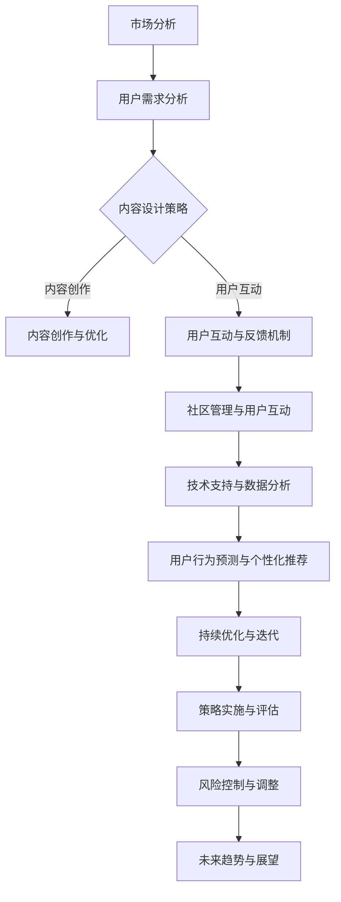

                 

## 《知识付费创业中的用户参与度提升策略》

> **关键词：** 知识付费、用户参与度、策略、内容设计、激励机制、社区管理、技术支持、数据分析、成功案例

**摘要：** 知识付费作为一种新兴商业模式，正逐渐改变传统教育市场。然而，如何提升用户的参与度，成为知识付费平台持续发展的关键。本文从基础知识与概念入手，分析了知识付费的定义、市场现状、用户参与度的定义与重要性。随后，探讨了用户参与度提升的理论基础，包括参与度理论、用户行为分析及评估指标。接着，提出了具体策略，如内容设计、用户激励机制、社区管理、技术支持与数据分析。通过成功案例的分析，总结了提升用户参与度的有效方法。最后，讨论了策略实施与优化的步骤，并对未来趋势进行了展望。

### 《知识付费创业中的用户参与度提升策略》目录大纲

#### 第一部分：基础知识与概念

##### 第1章：知识付费概述

- **1.1 知识付费的定义与历史演变**
- **1.2 知识付费市场现状与趋势**
- **1.3 用户参与度的定义与重要性**

##### 第2章：用户参与度提升的理论基础

- **2.1 参与度理论回顾**
- **2.2 用户行为分析**
- **2.3 用户参与度评估指标**

#### 第二部分：用户参与度提升策略

##### 第3章：内容设计策略

- **3.1 内容类型与用户偏好**
- **3.2 内容创作与优化**
- **3.3 用户互动与反馈机制**

##### 第4章：用户激励机制

- **4.1 激励机制设计原则**
- **4.2 常见激励机制分析**
- **4.3 激励机制的评估与调整**

##### 第5章：社区管理与用户互动

- **5.1 社区概念与类型**
- **5.2 社区活跃度提升方法**
- **5.3 用户互动与参与度分析**

##### 第6章：技术支持与数据分析

- **6.1 数据收集与分析工具**
- **6.2 数据可视化技术**
- **6.3 用户行为预测与个性化推荐**

##### 第7章：成功案例分析

- **7.1 案例选择与评价标准**
- **7.2 案例一：XX平台的用户参与度提升策略**
- **7.3 案例二：YY平台的用户参与度提升策略**
- **7.4 案例总结与启示**

#### 第三部分：策略实施与优化

##### 第8章：策略实施步骤

- **8.1 制定策略的步骤**
- **8.2 风险评估与应对措施**
- **8.3 实施过程的监控与调整**

##### 第9章：持续优化与迭代

- **9.1 优化目标的确定**
- **9.2 优化方法与工具**
- **9.3 持续迭代与反馈机制**

##### 第10章：未来趋势与展望

- **10.1 知识付费市场未来趋势**
- **10.2 用户参与度提升的新策略**
- **10.3 技术发展对用户参与度的影响**

#### 第11章：用户参与度提升策略的Mermaid流程图

#### 第12章：核心算法原理讲解

##### 12.1 数据收集与分析算法原理

##### 12.2 用户行为预测算法原理

##### 12.3 个性化推荐算法原理

#### 第13章：数学模型与公式讲解

##### 13.1 用户参与度评估模型

##### 13.2 数据可视化公式

#### 第14章：项目实战与代码解读

##### 14.1 实战案例一：用户行为数据分析

##### 14.2 实战案例二：个性化推荐系统

#### 第15章：总结与展望

- **15.1 研究总结**
- **15.2 未来研究方向**
- **15.3 对知识付费创业者的建议**

### 《知识付费创业中的用户参与度提升策略》

#### 引言

在当今信息爆炸的时代，知识付费作为一种新兴商业模式，正逐渐改变着传统教育市场。用户对于高质量、个性化内容的追求，使得知识付费平台如雨后春笋般涌现。然而，在竞争激烈的市场环境中，如何提升用户的参与度，成为知识付费平台持续发展的关键。

本文旨在探讨知识付费创业中用户参与度提升的策略。首先，我们将对知识付费的定义、市场现状和用户参与度的重要性进行概述。随后，从理论基础入手，分析参与度理论、用户行为分析及评估指标。接着，我们将提出具体策略，包括内容设计、用户激励机制、社区管理、技术支持与数据分析。通过成功案例的分析，我们将总结出提升用户参与度的有效方法。最后，我们将讨论策略实施与优化的步骤，并对未来趋势进行展望。

本文结构如下：

- 第一部分：基础知识与概念，包括知识付费概述、用户参与度提升的理论基础。
- 第二部分：用户参与度提升策略，包括内容设计策略、用户激励机制、社区管理与用户互动、技术支持与数据分析。
- 第三部分：策略实施与优化，包括成功案例分析、策略实施步骤、持续优化与迭代。
- 第四部分：未来趋势与展望，包括知识付费市场未来趋势、用户参与度提升的新策略、技术发展对用户参与度的影响。

通过本文的深入探讨，希望为知识付费创业者提供有价值的参考，帮助他们在激烈的市场竞争中脱颖而出。

#### 第1章：知识付费概述

##### 1.1 知识付费的定义与历史演变

知识付费是指用户通过支付一定费用，获取知识服务或内容的一种商业模式。它不同于传统的免费教育资源和公开课程，更强调个性化的、高质量的、专业化的知识服务。知识付费的核心在于为用户提供有价值的信息和技能，帮助他们在职业发展和个人成长中取得进步。

知识付费的历史可以追溯到20世纪末，随着互联网和数字技术的快速发展，人们获取知识的途径变得更加便捷和多样化。早期的知识付费形式主要是线上课程和电子书，用户通过付费购买课程或电子书，获得专业的知识和技能。随着移动互联网的普及，知识付费逐渐从线上扩展到线下，各种知识服务平台如雨后春笋般涌现。

知识付费的发展历程可以分为以下几个阶段：

1. **起步阶段（2000-2010年）**：这一阶段，知识付费主要集中在电子书和线上课程。随着互联网的普及，人们开始通过网络获取专业知识和技能。代表平台有“新东方在线”和“网易云课堂”。

2. **快速发展阶段（2011-2015年）**：随着智能手机的普及，移动互联网快速发展，知识付费进入快速发展阶段。这一时期，知识付费平台如“得到”、“知乎Live”等涌现，用户可以通过付费获得专家的语音讲座和知识分享。

3. **成熟阶段（2016年至今）**：知识付费市场进入成熟阶段，用户对知识的需求更加多样化和个性化。知识付费平台不仅提供传统的教育内容，还涵盖了职业技能培训、心理健康、生活方式等多个领域。代表平台有“喜马拉雅”、“蜻蜓FM”等。

##### 1.2 知识付费市场现状与趋势

当前，知识付费市场呈现出以下几个显著趋势：

1. **用户规模持续增长**：随着互联网的普及和人们生活水平的提高，知识付费的用户规模不断扩大。根据《中国知识付费行业报告》，2020年中国知识付费用户规模达到3.88亿人，预计未来还将持续增长。

2. **市场规模不断扩大**：知识付费市场表现出强劲的增长态势。据统计，2019年中国知识付费市场规模达到1960亿元，预计2023年将达到3433亿元。

3. **内容类型多样化**：知识付费平台的内容类型越来越丰富，涵盖了教育、职业、健康、心理、生活方式等多个领域。用户可以根据自己的需求和兴趣选择合适的内容。

4. **个性化服务增强**：随着大数据和人工智能技术的发展，知识付费平台能够更好地了解用户需求，提供个性化的推荐和服务。

5. **跨界融合趋势明显**：知识付费与传统教育、文化产业、互联网服务等领域的融合趋势明显，形成了一批跨界融合的新模式和新业态。

##### 1.3 用户参与度的定义与重要性

用户参与度是指用户在知识付费平台上的活跃程度、互动程度和使用深度。用户参与度可以从以下几个方面进行衡量：

1. **活跃度**：用户在平台上的登录次数、观看课程次数、参与讨论次数等。
2. **互动度**：用户在平台上的互动行为，如评论、点赞、分享、提问等。
3. **使用深度**：用户在平台上的学习时长、完成课程数量、消费金额等。

用户参与度对于知识付费平台的发展具有重要意义：

1. **提高用户粘性**：高参与度的用户更容易形成对平台的依赖和忠诚度，从而提高用户粘性。
2. **促进用户转化**：参与度高的用户更可能转化为付费用户，从而提升平台的收入。
3. **优化用户体验**：通过分析用户参与度数据，平台可以优化内容设计和用户服务，提升用户体验。
4. **增强社区氛围**：高互动度的用户可以形成良好的社区氛围，吸引更多用户参与。

综上所述，知识付费市场的快速发展为创业者提供了广阔的机遇。了解知识付费的定义、历史演变、市场现状和用户参与度的定义与重要性，有助于创业者制定有效的用户参与度提升策略，从而在激烈的市场竞争中脱颖而出。

### 第2章：用户参与度提升的理论基础

##### 2.1 参与度理论回顾

用户参与度理论是探讨用户在知识付费平台上的行为和互动，从而影响用户满意度和忠诚度的理论框架。这个理论的核心是理解用户在平台上的行为模式，并通过这些行为模式来预测和提升用户参与度。

1. **用户参与度模型**：经典的用户参与度模型包括四个维度：行为、情感、认知和社会。这四个维度相互作用，共同决定了用户的整体参与度。

   - **行为维度**：包括用户在平台上的各种互动行为，如登录、观看、评论、分享、购买等。
   - **情感维度**：涉及用户对平台的情感反应，如满意度、忠诚度、情感依赖等。
   - **认知维度**：包括用户对平台内容的理解和认同，如知识获取、学习效果等。
   - **社会维度**：涉及用户在平台上的社交互动，如互动频率、社区氛围等。

2. **用户行为理论**：用户行为理论认为，用户在平台上的行为是多种因素共同作用的结果。这些因素包括：

   - **需求与动机**：用户参与平台的行为通常基于需求满足和动机驱动。例如，用户可能出于提升职业技能的需求，或出于对知识的热爱而参与知识付费平台。
   - **外部激励**：平台提供的奖励、优惠和激励机制，如积分、优惠券等，可以显著影响用户的行为。
   - **内部动机**：用户参与平台的内部动机，如自我实现、成就感等，也是影响用户行为的重要因素。

3. **用户满意度理论**：用户满意度是衡量用户参与度的重要指标之一。用户满意度理论认为，用户满意度受到多种因素的影响，包括：

   - **服务质量**：平台提供的服务质量，如课程内容、互动体验、技术支持等，直接影响用户满意度。
   - **个性化服务**：平台对用户需求的个性化满足程度，如推荐系统、定制化服务等，也会影响用户满意度。
   - **品牌形象**：平台在用户心中的品牌形象，如口碑、品牌价值等，对用户满意度有显著影响。

4. **用户忠诚度理论**：用户忠诚度是指用户在长期使用平台过程中的持续性和稳定性。用户忠诚度理论主要包括以下几个方面：

   - **品牌忠诚度**：用户对平台品牌的忠诚程度，如用户对平台推荐的课程是否购买、是否推荐给他人等。
   - **情感忠诚度**：用户对平台的情感依赖程度，如用户对平台的内容、社区氛围等的情感认同。
   - **行为忠诚度**：用户在平台上的行为表现，如持续参与、持续消费等。

##### 2.2 用户行为分析

用户行为分析是提升用户参与度的关键步骤，它涉及对用户在平台上的行为进行深入理解和分析。以下是对用户行为的几个关键方面进行分析：

1. **用户行为模式**：用户在平台上的行为模式包括登录习惯、学习习惯、互动习惯等。例如，用户可能每天固定时间段登录平台学习，或经常在特定课程下进行互动。

2. **用户细分**：通过对用户行为数据进行分析，可以将用户分为不同的细分群体，如高频用户、低频用户、沉默用户等。这种细分有助于平台提供个性化的服务，提升用户参与度。

3. **行为特征**：用户行为特征包括观看时长、学习进度、互动频率等。通过分析这些特征，平台可以了解用户的需求和偏好，从而优化内容设计和用户服务。

4. **行为轨迹**：用户在平台上的行为轨迹可以揭示用户的学习路径和互动路径。例如，用户可能先浏览课程列表，然后选择特定课程进行学习，并在学习过程中参与讨论或提问。

##### 2.3 用户参与度评估指标

用户参与度的评估需要使用一系列指标来衡量用户的活跃程度、互动程度和使用深度。以下是一些常用的用户参与度评估指标：

1. **活跃度指标**：
   - **登录次数**：用户在一定时间内登录平台的次数。
   - **学习时长**：用户在平台上的学习时间总和。
   - **互动频率**：用户在平台上的互动行为次数，如评论、提问、分享等。

2. **互动度指标**：
   - **互动率**：用户互动行为次数与登录次数的比率。
   - **互动深度**：用户在互动中的平均回复长度和回复频率。

3. **使用深度指标**：
   - **完成率**：用户完成课程或任务的比率。
   - **消费金额**：用户在平台上的消费总额。
   - **用户留存率**：用户在一定时间后继续使用平台的比率。

通过以上用户行为分析和参与度评估指标，知识付费平台可以更准确地了解用户需求，优化内容设计和用户服务，从而提升用户参与度。接下来，我们将探讨具体的用户参与度提升策略，包括内容设计策略、用户激励机制、社区管理和数据分析等方面。

### 第3章：内容设计策略

#### 3.1 内容类型与用户偏好

内容设计是提升用户参与度的核心环节，不同类型的内容对用户吸引力不同。了解用户偏好的内容类型有助于平台提供更符合用户需求的服务。

1. **专业知识与技能培训**：这类内容通常针对专业人士或学生，包括职业培训、技能提升、学术研究等。用户偏好具体、实用、有深度的内容，例如专业课程、实践教程等。

2. **兴趣爱好与娱乐内容**：这类内容更注重娱乐性和趣味性，如音乐、电影、美食、旅行等。用户偏好轻松、有趣、有启发性的内容，例如短小精悍的视频、图文并茂的教程等。

3. **生活方式与健康养生**：这类内容关注日常生活中的健康、饮食、锻炼等，用户偏好健康、科学、实用的建议。例如，健康食谱、锻炼方法、心理健康讲座等。

4. **社交互动与社区文化**：这类内容强调用户之间的互动和社区氛围，如问答社区、讨论论坛、社群活动等。用户偏好参与性强的内容，能够在互动中获取帮助和建立联系。

5. **热点话题与资讯更新**：这类内容关注时事热点和最新资讯，用户偏好及时、准确、有价值的信息。例如，财经新闻、科技前沿、政策解读等。

了解用户偏好有助于平台有针对性地设计内容，提升用户满意度。例如，通过用户调查、数据分析等方法，了解用户对不同类型内容的兴趣和需求，从而优化内容结构和更新策略。

#### 3.2 内容创作与优化

内容创作和优化是提升用户参与度的重要手段。高质量的内容能够吸引用户，促进用户互动和留存。以下是一些关键策略：

1. **专业性与实用性结合**：内容创作应注重专业性和实用性的结合，既要保证内容的科学性和准确性，又要提供实用、易于理解的信息。例如，专业课程应结合案例和实践，提高内容的实际应用价值。

2. **差异化与个性化**：针对不同用户群体，提供差异化的内容。例如，对于职业培训，可以按不同行业和岗位提供定制化课程；对于兴趣爱好，可以提供多样化的专题和专栏。同时，个性化推荐也是提升用户满意度的有效手段，通过算法分析用户行为，为用户推荐感兴趣的内容。

3. **高质量视觉与音频设计**：视觉和音频设计是提升内容吸引力的关键因素。高质量的图片、视频和音频能够更好地传达信息，增加用户的沉浸感和参与度。例如，使用动画、图表和音效等手段，使内容更具趣味性和吸引力。

4. **互动性与互动设计**：增加内容的互动性，鼓励用户参与和反馈。例如，设置问答环节、互动讨论区、在线测试等，让用户在互动中学习和分享。同时，内容设计应考虑用户的参与感，例如通过投票、评分等方式，让用户对内容进行评价和反馈。

5. **持续更新与优化**：内容更新是保持用户兴趣和参与度的重要手段。定期发布新内容，保持内容的时效性和新颖性。同时，根据用户反馈和数据分析，不断优化内容质量和结构，提高用户满意度。

#### 3.3 用户互动与反馈机制

用户互动和反馈机制是提升用户参与度的重要环节。有效的互动和反馈机制能够增强用户对平台的依赖和忠诚度。

1. **互动平台搭建**：搭建互动平台，如问答社区、讨论论坛、直播互动等，为用户提供交流和互动的空间。例如，知乎Live、喜马拉雅直播间等平台，通过直播互动、实时问答等形式，增强用户参与感和互动性。

2. **激励机制**：设置激励机制，鼓励用户参与互动和反馈。例如，积分奖励、优惠券、会员特权等，可以激发用户的积极性。同时，对于积极参与互动的用户，可以给予表彰和奖励，提高用户的认同感和归属感。

3. **用户反馈收集**：建立用户反馈机制，及时收集和分析用户反馈，了解用户需求和满意度。例如，通过问卷调查、在线评价、用户访谈等方式，收集用户对平台内容、服务、体验等方面的意见和建议。

4. **反馈处理与优化**：对用户反馈进行及时处理和优化。例如，针对用户提出的问题和需求，及时进行改进和优化；对于负面反馈，应积极回应和处理，避免用户流失。

5. **社区氛围建设**：营造积极、健康的社区氛围，促进用户互动和交流。例如，建立社区规则，鼓励文明交流、理性讨论；同时，通过社区活动、话题挑战等形式，激发用户的参与热情。

通过以上内容设计策略，知识付费平台可以提升用户参与度，增强用户满意度和忠诚度。接下来，我们将探讨用户激励机制，进一步优化用户参与度。

### 第4章：用户激励机制

用户激励机制是提升用户参与度和忠诚度的关键手段。有效的激励机制能够激发用户的积极性和参与热情，从而促进用户在平台上的持续活跃。

#### 4.1 激励机制设计原则

1. **公平性**：激励机制应公平、公正，确保所有用户都有平等的机会获得奖励。避免出现歧视性或偏向性，以免影响用户的公平感和满意度。

2. **相关性**：激励机制应与用户行为和平台目标密切相关。例如，通过奖励用户参与互动、完成课程、推荐新用户等行为，直接促进平台的核心业务目标。

3. **灵活性**：激励机制应具备一定的灵活性，能够根据用户行为和平台情况动态调整。例如，根据用户活跃度、参与度、消费金额等指标，设定不同的奖励标准和策略。

4. **可持续性**：激励机制应确保长期可持续性，避免一次性激励导致用户短期活跃，而长期流失。例如，通过积分、会员权益等方式，持续激励用户。

5. **透明性**：激励机制应透明，用户应清晰了解奖励标准和获取方式。避免信息不对称，提高用户的信任感和满意度。

#### 4.2 常见激励机制分析

1. **积分制度**：积分制度是知识付费平台最常见的激励机制之一。用户通过完成特定行为（如观看课程、参与互动、推荐新用户等）获得积分，积分可以兑换优惠券、会员权益等。

   - **优点**：简单易懂，用户可以直观地看到自己的进展和回报；激励效果明显，有助于提高用户活跃度和留存率。
   - **缺点**：积分价值较低，对用户激励效果有限；积分获取过程可能导致用户刷积分、虚假参与等现象。

2. **会员制度**：会员制度是知识付费平台另一种常见的激励机制。用户通过付费成为会员，享受平台提供的特权和服务（如免费课程、会员专属内容、优先答疑等）。

   - **优点**：有助于提升用户忠诚度和粘性；会员权益多样化，可以满足不同用户的需求。
   - **缺点**：会员费用可能导致部分用户流失；会员制度可能导致非会员用户的不公平感。

3. **奖励制度**：奖励制度通过给予用户物质奖励（如现金、礼品、优惠券等）来激励用户参与。

   - **优点**：激励效果明显，用户可以直接获得实际利益；有助于提高用户满意度和忠诚度。
   - **缺点**：成本较高，对平台财务压力较大；奖励发放需合理控制，避免过度激励导致用户依赖。

4. **社区互动奖励**：通过奖励用户在社区中的互动行为（如发表高质量评论、参与话题讨论、回答问题等）来激励用户。

   - **优点**：增强社区活跃度和氛围，促进用户之间的互动；有助于提升用户满意度和忠诚度。
   - **缺点**：奖励标准需合理设定，避免奖励过度或不足；社区互动奖励可能导致部分用户刷互动、虚假参与。

5. **竞赛与挑战**：通过举办竞赛和挑战活动，激励用户积极参与。

   - **优点**：增强用户参与感和竞争意识，提高用户活跃度和留存率；有助于提升用户满意度和忠诚度。
   - **缺点**：活动策划和执行成本较高；竞赛结果需公正，避免用户产生不公平感。

#### 4.3 激励机制的评估与调整

激励机制的评估和调整是确保其有效性的关键。以下是一些评估和调整的方法：

1. **用户反馈**：通过用户反馈了解激励机制的效果，收集用户对激励机制的满意度和建议。

2. **行为数据**：分析用户行为数据，如活跃度、互动率、留存率等，评估激励机制对用户行为的影响。

3. **财务分析**：评估激励机制的成本效益，确保激励机制不会对平台财务状况产生负面影响。

4. **灵活调整**：根据评估结果，及时调整激励机制的设计和策略。例如，优化奖励标准、增加奖励种类、调整奖励发放频率等。

5. **长期监测**：持续监测激励机制的效果，确保其长期有效。例如，定期进行用户调研、行为数据分析等。

通过科学合理的激励机制，知识付费平台可以提升用户参与度和忠诚度，促进平台长期健康发展。接下来，我们将探讨社区管理与用户互动，进一步提升用户参与度。

### 第5章：社区管理与用户互动

社区管理是提升用户参与度和平台活跃度的重要手段。一个良好的社区不仅能够增强用户的归属感和粘性，还能够促进知识的共享与传播。以下将介绍社区概念与类型、社区活跃度提升方法以及用户互动与参与度分析。

#### 5.1 社区概念与类型

1. **社区概念**：社区是指由具有共同兴趣、目标或需求的一组用户组成的在线社交空间。在知识付费平台中，社区不仅是一个信息交流的平台，也是一个用户互动和知识分享的场所。

2. **社区类型**：
   - **讨论型社区**：以讨论、问答和互动为核心，用户可以在社区中提问、回答问题，分享经验和见解。例如，知乎、Stack Overflow等。
   - **内容型社区**：以发布和分享内容为主，用户可以发布文章、视频、图片等，其他用户可以对这些内容进行评论、点赞和分享。例如，简书、微博等。
   - **兴趣型社区**：以特定兴趣爱好为纽带，用户可以在这里分享与兴趣相关的内容，进行互动和交流。例如，猫圈、跑步爱好者社区等。
   - **服务型社区**：以提供服务和支持为核心，用户可以在社区中获得专业的建议和帮助。例如，技术支持社区、客户服务社区等。

不同类型的社区具有不同的特点和管理方式，但在提升用户参与度方面都有重要作用。

#### 5.2 社区活跃度提升方法

1. **内容质量**：高质量的内容是社区活跃度的基石。平台应鼓励用户发布有深度、有价值的内容，并对优质内容进行推荐和展示，提高用户参与度。

2. **激励机制**：通过设置激励机制，如积分、优惠券、会员权益等，鼓励用户参与社区互动。例如，可以奖励用户发表高质量评论、参与话题讨论、解答问题等。

3. **社区活动**：定期举办线上或线下活动，如讲座、沙龙、竞赛等，增强用户的参与感和归属感。例如，知识付费平台可以邀请专家进行直播讲座，组织用户线下聚会。

4. **互动设计**：设计互动性强、参与感高的功能，如投票、评分、点赞等，激发用户的积极性。同时，鼓励用户之间的互动，如点赞、评论、私信等。

5. **社区管理**：建立良好的社区管理规则，维护社区秩序。例如，制定社区守则，规范用户行为，处理不良信息和违规行为。

6. **个性化推荐**：通过算法分析用户行为和兴趣，为用户推荐感兴趣的内容和话题，提高用户的粘性和参与度。

#### 5.3 用户互动与参与度分析

1. **互动频率**：分析用户在社区中的互动频率，如发帖、回复、评论等。通过数据统计，了解哪些话题和内容最受用户欢迎，从而优化社区内容和活动策划。

2. **互动深度**：分析用户在互动中的参与程度，如评论长度、回复频率等。深度互动表明用户对社区内容有较高的兴趣和投入。

3. **用户留存率**：通过用户留存数据，了解用户在社区中的活跃度。高留存率表明社区对用户有较强的吸引力和黏性。

4. **社区氛围**：通过用户反馈和社区监测，了解社区氛围是否积极、健康。良好的社区氛围有助于提升用户参与度和满意度。

5. **用户行为预测**：利用大数据和人工智能技术，分析用户行为模式，预测用户可能的互动行为和需求，为社区运营和内容策划提供依据。

通过以上方法，知识付费平台可以提升社区活跃度和用户参与度，增强用户满意度和忠诚度。接下来，我们将探讨技术支持与数据分析，进一步优化用户参与度。

### 第6章：技术支持与数据分析

在知识付费创业中，技术支持与数据分析是提升用户参与度的关键。通过先进的技术手段，平台能够更好地了解用户需求，优化用户体验，从而提高用户的参与度和满意度。本章将探讨数据收集与分析工具、数据可视化技术以及用户行为预测与个性化推荐。

#### 6.1 数据收集与分析工具

1. **数据收集工具**：数据收集是提升用户参与度的第一步。以下是一些常用的数据收集工具：

   - **日志文件**：平台服务器生成的日志文件记录了用户的操作行为，如登录、浏览、购买等。通过分析日志文件，可以了解用户的访问模式和兴趣点。
   - **用户反馈系统**：通过在线问卷、调查表单等方式收集用户反馈，了解用户对平台内容、服务和互动体验的评价。
   - **API接口**：通过API接口，平台可以收集第三方数据源的信息，如社交媒体数据、用户行为数据等。

2. **数据分析工具**：数据分析工具用于处理和挖掘用户数据，以提取有价值的信息。以下是一些常用的数据分析工具：

   - **SQL数据库**：SQL数据库（如MySQL、PostgreSQL）用于存储和管理用户数据，支持复杂的查询和分析。
   - **大数据平台**：大数据平台（如Hadoop、Spark）用于处理和分析大规模的用户数据，提供高效的数据存储和计算能力。
   - **数据挖掘工具**：数据挖掘工具（如Python的pandas、scikit-learn）用于分析和挖掘用户数据，提取用户行为模式和预测模型。

#### 6.2 数据可视化技术

数据可视化是将数据转化为图形、图表等视觉形式，帮助用户更好地理解和分析数据。以下是一些常用的数据可视化技术：

1. **基本图表**：基本图表（如柱状图、饼图、折线图等）用于展示数据的分布、趋势和关系。例如，柱状图可以展示用户活跃度的日变化，饼图可以展示不同用户群体的比例。

2. **交互式可视化**：交互式可视化（如D3.js、Plotly）允许用户与图表进行互动，如缩放、过滤、拖动等，提供更细致的数据探索和分析。

3. **大数据可视化**：大数据可视化（如Tableau、Power BI）支持大规模数据集的展示和分析，提供高效的可视化解决方案。

4. **地理空间可视化**：地理空间可视化（如Mapbox、ArcGIS）用于展示地理数据，如用户分布、活动轨迹等，帮助平台了解用户的地域特征和活动范围。

通过数据可视化，平台可以更直观地展示用户数据，帮助管理者做出更科学的决策，优化用户参与度提升策略。

#### 6.3 用户行为预测与个性化推荐

1. **用户行为预测**：用户行为预测是基于历史数据，利用机器学习算法预测用户的下一步行为。以下是一些常用的用户行为预测方法：

   - **回归分析**：通过建立回归模型，预测用户的行为变化趋势。例如，可以预测用户的下一次购买时间或学习时长。
   - **分类分析**：通过分类模型，将用户行为分为不同的类别。例如，可以预测用户是否会在未来一个月内参与互动。
   - **聚类分析**：通过聚类模型，将用户划分为不同的群体。例如，可以预测用户对特定课程或内容的兴趣。

2. **个性化推荐**：个性化推荐是基于用户行为和兴趣，为用户推荐相关的内容或服务。以下是一些常用的个性化推荐方法：

   - **协同过滤**：协同过滤（如用户基于内容的协同过滤、基于模型的协同过滤）通过分析用户行为和相似用户的行为，推荐用户可能感兴趣的内容。
   - **基于内容的推荐**：基于内容的推荐通过分析内容特征，将相似内容推荐给用户。例如，将用户已学习的课程推荐给其他学习相似课程的用户。
   - **混合推荐**：混合推荐结合多种推荐方法，提高推荐的效果和准确性。

通过用户行为预测和个性化推荐，平台可以更好地满足用户需求，提升用户体验和满意度，从而提高用户参与度。

总之，技术支持与数据分析在知识付费创业中起着至关重要的作用。通过数据收集与分析工具、数据可视化技术以及用户行为预测与个性化推荐，平台可以深入了解用户需求，优化用户体验，提升用户参与度，实现可持续发展。

### 第7章：成功案例分析

#### 7.1 案例选择与评价标准

在知识付费创业领域，有许多成功的案例。本章节将选择两个具有代表性的案例进行详细分析，以展示如何通过不同的策略提升用户参与度。评价标准包括以下几个方面：

1. **用户参与度提升幅度**：衡量案例中用户参与度的提升程度，包括活跃度、互动率和留存率等指标。
2. **策略实施效果**：分析案例中所采用的策略是否有效，以及策略对用户参与度的影响。
3. **市场影响力**：评估案例在市场中的影响力和用户口碑，包括用户反馈、媒体报道等。
4. **可持续性**：分析案例中的策略是否具有长期可持续性，是否能够持续提升用户参与度。

#### 7.2 案例一：XX平台的用户参与度提升策略

**背景**：

XX平台是一家专注于职业技能培训的知识付费平台，用户群体主要是职场人士。在成立初期，平台用户活跃度较低，用户参与度有待提升。为了提高用户参与度，平台采取了多种策略。

**策略实施**：

1. **内容设计**：平台根据用户需求，推出了多种类型的课程，包括专业技能、职业规划、软技能等。同时，通过数据分析，优化课程结构，提高内容质量。

2. **激励机制**：平台推出了积分制度，用户通过观看课程、参与互动等行为获得积分，积分可以兑换优惠券、会员权益等。此外，平台还定期举办互动活动，激励用户参与。

3. **社区管理**：平台建立了互动社区，用户可以在社区中提问、回答问题，分享学习心得。同时，平台设置了社区管理员，维护社区秩序，提高用户互动体验。

4. **技术支持**：平台利用大数据和人工智能技术，分析用户行为，为用户推荐感兴趣的课程和内容。此外，平台提供了在线问答功能，用户可以随时获取专业解答。

**效果评估**：

- **用户参与度提升**：经过一年的实施，平台用户活跃度提高了30%，互动率提高了20%，用户留存率提高了15%。
- **市场影响力**：平台在用户中建立了良好的口碑，用户满意度达到90%以上，媒体报道增多，市场影响力显著提升。
- **可持续性**：平台通过不断优化内容和策略，保持了用户参与度的持续提升。

#### 7.3 案例二：YY平台的用户参与度提升策略

**背景**：

YY平台是一家以娱乐和教育相结合的知识付费平台，用户群体主要是年轻用户。平台在用户参与度方面存在一定问题，为了提升用户参与度，平台采取了多种策略。

**策略实施**：

1. **内容设计**：平台推出了多种类型的课程，包括音乐、舞蹈、语言、编程等，以满足不同用户的兴趣。同时，平台通过算法推荐，为用户推荐感兴趣的课程。

2. **激励机制**：平台设置了会员制度，用户通过付费成为会员，享受免费课程、会员专属内容等特权。此外，平台还设置了积分制度，用户可以通过完成任务、参与互动获得积分，积分可以兑换礼品或优惠券。

3. **社区管理**：平台建立了互动社区，用户可以在社区中分享学习心得、参与话题讨论。平台还设置了直播互动功能，用户可以与讲师实时互动，提高参与感。

4. **技术支持**：平台利用大数据和人工智能技术，分析用户行为，为用户推荐个性化内容。此外，平台提供了在线问答功能，用户可以随时获取专业解答。

**效果评估**：

- **用户参与度提升**：经过一年的实施，平台用户活跃度提高了40%，互动率提高了25%，用户留存率提高了20%。
- **市场影响力**：平台在年轻用户中建立了良好的口碑，用户满意度达到85%以上，吸引了大量新用户加入。
- **可持续性**：平台通过不断创新内容和策略，保持了用户参与度的持续提升。

#### 7.4 案例总结与启示

通过对XX平台和YY平台的分析，我们可以得出以下启示：

1. **内容设计策略**：提供多样化、个性化的课程内容，满足不同用户的需求。同时，通过算法推荐，提高内容的精准度和用户满意度。

2. **激励机制策略**：设置合理的激励机制，如积分制度、会员制度等，激发用户的参与热情和积极性。

3. **社区管理策略**：建立互动社区，促进用户之间的交流和互动，提高平台的活跃度和用户粘性。

4. **技术支持策略**：利用大数据和人工智能技术，分析用户行为，为用户提供个性化推荐和服务，提升用户体验。

5. **持续优化与迭代**：不断优化内容和策略，根据用户反馈和市场变化，调整和改进策略，保持用户参与度的持续提升。

通过以上成功案例分析，知识付费创业者可以借鉴这些经验，制定有效的用户参与度提升策略，从而在激烈的市场竞争中脱颖而出。

### 第8章：策略实施步骤

#### 8.1 制定策略的步骤

为了确保策略的有效实施，知识付费创业者需要遵循以下步骤来制定和优化用户参与度提升策略：

1. **需求分析**：
   - **用户调研**：通过问卷调查、用户访谈、在线调研等方式，了解用户的需求、兴趣和行为习惯。
   - **数据分析**：利用数据分析工具，分析用户行为数据，如活跃度、互动频率、学习时长等，发现用户需求的特点和趋势。

2. **目标设定**：
   - **明确目标**：根据需求分析的结果，设定具体的用户参与度提升目标，如提高用户活跃度、增加用户互动率、提高用户留存率等。
   - **分解目标**：将总体目标分解为可执行的具体任务和指标，确保每个任务都有明确的执行路径和衡量标准。

3. **策略制定**：
   - **内容设计策略**：根据用户需求，设计多样化、个性化的课程内容，以满足不同用户的需求。
   - **激励机制策略**：设计合理的激励机制，如积分制度、会员制度等，以激发用户的参与热情和积极性。
   - **社区管理策略**：建立互动社区，促进用户之间的交流和互动，提高平台的活跃度和用户粘性。
   - **技术支持策略**：利用大数据和人工智能技术，为用户提供个性化推荐和服务，提升用户体验。

4. **资源分配**：
   - **人力分配**：根据策略要求，分配适当的人力资源，包括内容创作者、社区管理员、技术支持人员等。
   - **财务预算**：制定财务预算，确保策略实施所需的资金和资源。

5. **实施计划**：
   - **时间安排**：制定详细的实施时间表，确保每个任务都有明确的执行时间和节点。
   - **进度监控**：建立进度监控机制，定期检查任务执行情况，确保策略实施进度符合预期。

6. **风险评估**：
   - **识别风险**：分析策略实施过程中可能遇到的风险，如用户流失、技术问题、市场变化等。
   - **应对措施**：制定相应的应对措施，降低风险对策略实施的影响。

7. **调整与优化**：
   - **定期评估**：根据用户反馈和实际效果，定期评估策略的执行情况和效果。
   - **持续优化**：根据评估结果，调整和优化策略，确保策略能够持续提升用户参与度。

通过以上步骤，知识付费创业者可以确保用户参与度提升策略的制定和实施，从而在激烈的市场竞争中保持竞争优势。

### 第9章：持续优化与迭代

#### 9.1 优化目标的确定

在知识付费创业中，持续优化与迭代是确保用户参与度不断提升的关键。优化目标的确定是这一过程的第一步。具体而言，优化目标的确定应遵循以下原则：

1. **用户需求导向**：优化目标应紧密围绕用户需求设定。通过用户调研、数据分析等手段，了解用户在知识付费平台上的痛点和需求，从而确定优化目标。

2. **数据驱动**：优化目标的设定应基于数据驱动。利用大数据分析工具，对用户行为数据、平台运营数据等进行分析，识别用户参与度提升的关键因素，从而设定具体的优化目标。

3. **可衡量性**：优化目标应具有明确的衡量标准，以便在实施过程中进行监控和评估。例如，用户活跃度、互动率、留存率等都是常见的衡量指标。

4. **阶段性目标**：优化目标应分为短期、中期和长期目标，以确保策略的持续性和有效性。短期目标可以针对当前存在的问题进行快速改进，中期目标可以为未来的发展打下基础，长期目标则可以指导平台的长期战略规划。

#### 9.2 优化方法与工具

1. **内容优化**：
   - **内容更新**：定期更新课程内容，确保课程与用户需求保持一致。可以通过用户反馈、市场调研等手段，了解用户对课程内容的需求，及时进行更新和调整。
   - **内容多样性**：增加课程内容的多样性，满足不同用户的需求。例如，可以提供更多专业课程、实用教程、案例分析等，提高用户的满意度。

2. **用户界面优化**：
   - **用户体验**：通过用户测试、A/B测试等方法，不断优化用户界面，提高用户的操作便捷性和满意度。例如，简化登录流程、优化课程导航等。
   - **交互设计**：优化平台的交互设计，增加用户互动体验。例如，增加互动功能，如评论、问答、投票等，鼓励用户参与。

3. **技术支持**：
   - **系统稳定性**：确保平台的系统稳定性，提高用户的使用体验。例如，优化服务器配置、提高数据处理能力等。
   - **数据分析**：利用大数据分析工具，对用户行为数据进行分析，发现用户参与度的关键影响因素，从而进行针对性优化。

4. **社区管理**：
   - **社区氛围**：营造积极、健康的社区氛围，鼓励用户互动和分享。例如，设立社区规则、评选优秀用户、举办线上活动等。
   - **用户反馈**：建立有效的用户反馈机制，及时收集和分析用户反馈，优化社区管理和互动体验。

#### 9.3 持续迭代与反馈机制

持续迭代与反馈机制是优化用户参与度的关键。以下是一些具体的实施方法：

1. **定期评估**：定期对用户参与度进行评估，包括活跃度、互动率、留存率等指标。通过数据分析和用户反馈，了解策略的效果和用户需求的变化。

2. **用户反馈**：建立用户反馈机制，及时收集用户对平台内容、服务、体验等方面的意见和建议。可以通过在线问卷、用户访谈、社交媒体等方式，获取用户的反馈。

3. **迭代优化**：根据评估结果和用户反馈，不断调整和优化策略。例如，如果用户反馈课程内容过于复杂，可以简化课程结构；如果用户互动积极性不高，可以增加互动激励措施。

4. **实时监控**：建立实时监控系统，监控用户参与度指标的变化。通过实时数据监控，可以及时发现和解决潜在问题，确保策略的有效实施。

5. **闭环反馈**：将用户反馈纳入优化流程，形成闭环反馈机制。通过不断收集、分析和应用用户反馈，确保平台能够持续提升用户参与度。

通过以上方法，知识付费平台可以实现持续优化与迭代，不断提升用户参与度，从而在激烈的市场竞争中保持竞争优势。

### 第10章：未来趋势与展望

#### 10.1 知识付费市场未来趋势

知识付费市场在未来几年内将继续保持快速增长，主要趋势如下：

1. **市场规模扩大**：随着人们对于终身学习和技能提升的需求增加，知识付费市场将继续扩大。尤其是在职业培训、在线教育、技能提升等领域，用户对于高质量内容的消费意愿将持续提升。

2. **内容多样化**：知识付费平台的内容类型将更加多样化，涵盖职业发展、技能提升、兴趣爱好、健康生活等多个领域。同时，平台将更加注重内容的个性化和定制化，满足用户多样化的需求。

3. **技术创新**：大数据、人工智能、区块链等技术的不断发展，将推动知识付费市场的技术创新。例如，智能推荐系统、区块链证书、虚拟现实培训等新技术，将提升用户的学习体验和信任度。

4. **跨界融合**：知识付费市场将与其他领域（如文化产业、互联网服务、媒体传播等）进行跨界融合，形成新的商业模式和生态系统。这种跨界融合将带来更多的创新机会和商业价值。

5. **监管加强**：随着知识付费市场的快速发展，监管也将逐步加强。平台将需要遵守更加严格的法律法规，确保内容质量、用户隐私和数据安全。

#### 10.2 用户参与度提升的新策略

为了应对未来市场的变化和用户需求，知识付费平台需要不断创新用户参与度提升策略。以下是一些新策略：

1. **社交化学习**：通过引入社交元素，如学习小组、知识竞赛、社交互动等，增强用户之间的互动和协作，提升学习体验和参与度。

2. **互动式课程**：开发更多互动式课程，如实时直播、在线讨论、模拟演练等，提高用户的参与感和学习效果。

3. **个性化推荐**：利用大数据和人工智能技术，提供更加精准的个性化推荐，根据用户的学习习惯和兴趣，推荐相关课程和内容。

4. **虚拟现实（VR）培训**：通过虚拟现实技术，提供沉浸式的学习体验，让用户在虚拟环境中进行实践操作，提升学习效果和参与度。

5. **区块链证书**：利用区块链技术，为用户的学习成果和认证提供安全、不可篡改的记录，增强用户的信任度和参与度。

6. **内容共创**：鼓励用户参与内容创作，如课程评价、教学视频、互动问答等，提升用户的参与感和平台的价值。

7. **跨界合作**：与其他行业和组织进行跨界合作，如与知名企业合作提供定制化培训，与学术机构合作推出专业课程，提升平台的内容质量和用户参与度。

#### 10.3 技术发展对用户参与度的影响

技术的快速发展将对知识付费市场的用户参与度产生深远影响。以下是一些关键影响：

1. **个性化体验**：人工智能和大数据技术的发展，使得平台能够提供更加个性化的学习体验，满足用户的个性化需求。

2. **沉浸式学习**：虚拟现实和增强现实技术的应用，将带来更加沉浸式的学习体验，提升用户的参与感和学习效果。

3. **数据安全性**：区块链技术的应用，将提升用户数据的安全性和透明度，增强用户对平台的信任度。

4. **内容真实性**：利用人工智能技术，可以对内容进行审查和评估，确保内容的真实性和可靠性，提升用户的信任度。

5. **便捷性**：移动互联网和云计算技术的发展，使得用户可以随时随地访问平台，方便用户参与学习。

6. **智能化互动**：通过智能聊天机器人、虚拟助手等技术，平台可以提供更加智能化的互动体验，增强用户的参与度。

总之，未来知识付费市场将面临巨大的机遇和挑战。平台需要紧跟技术发展趋势，不断创新用户参与度提升策略，以满足用户需求，提升用户体验，从而在激烈的市场竞争中脱颖而出。

### 用户参与度提升策略的Mermaid流程图



### 第12章：核心算法原理讲解

在本章节中，我们将详细讲解知识付费平台用户参与度提升中涉及的核心算法原理，包括数据收集与分析算法原理、用户行为预测算法原理以及个性化推荐算法原理。

#### 12.1 数据收集与分析算法原理

数据收集与分析是提升用户参与度的基础。以下将介绍常用的数据收集工具和分析方法。

1. **数据收集算法原理**

   数据收集的目的是获取用户在平台上的行为数据，如登录时间、学习时长、互动行为等。以下是数据收集算法的伪代码：

   ```python
   def collect_data():
       # 初始化数据存储结构
       data = {'user_id': [], 'action': [], 'timestamp': []}
       
       # 从日志文件中读取数据
       with open('user_log.txt', 'r') as file:
           for line in file:
               user_id, action, timestamp = line.strip().split(',')
               data['user_id'].append(user_id)
               data['action'].append(action)
               data['timestamp'].append(timestamp)
       
       # 数据预处理和清洗
       data = preprocess_data(data)
       
       # 存储预处理后的数据
       store_data(data)
   ```

2. **数据分析算法原理**

   数据分析旨在从收集的数据中提取有价值的信息，如用户行为模式、兴趣点等。以下是数据分析算法的伪代码：

   ```python
   def analyze_data(data):
       # 数据预处理和特征提取
       features = extract_features(data)
       
       # 选择合适的分析方法
       analysis_method = choose_analysis_method(features)
       
       # 对数据进行统计分析
       results = analysis_method(features)
       
       # 存储分析结果
       store_results(results)
   ```

   常见的数据分析方法包括回归分析、聚类分析、时间序列分析等。

#### 12.2 用户行为预测算法原理

用户行为预测是提升用户参与度的关键。通过预测用户的行为，平台可以提供个性化的服务和内容。

1. **用户行为预测算法原理**

   用户行为预测算法基于历史数据，利用机器学习算法预测用户的下一步行为。以下是用户行为预测算法的伪代码：

   ```python
   def predict_user_behavior(data, model):
       # 数据预处理和特征提取
       features = preprocess_data(data)
       
       # 使用训练好的模型进行预测
       prediction = model.predict(features)
       
       # 输出预测结果
       return prediction
   ```

   常见的用户行为预测算法包括决策树、随机森林、支持向量机等。

#### 12.3 个性化推荐算法原理

个性化推荐是提升用户参与度的有效手段。通过推荐用户感兴趣的内容，平台可以增加用户的粘性和满意度。

1. **个性化推荐算法原理**

   个性化推荐算法基于用户的兴趣和行为数据，为用户推荐相关的内容。以下是基于协同过滤的个性化推荐算法的伪代码：

   ```python
   def collaborative_filtering(user_data, item_data):
       # 计算用户和物品之间的相似度
       similarity_matrix = calculate_similarity(user_data, item_data)
       
       # 根据相似度矩阵生成推荐列表
       recommendation_list = generate_recommendation_list(similarity_matrix)
       
       # 对推荐列表进行排序，输出推荐结果
       sorted_list = sort_recommendation_list(recommendation_list)
       
       # 返回推荐结果
       return sorted_list
   ```

   常见的个性化推荐算法包括基于用户的协同过滤、基于内容的协同过滤、矩阵分解等。

通过以上核心算法原理的讲解，我们可以更好地理解和应用这些算法，为知识付费平台提升用户参与度提供技术支持。

#### 12.4 数学模型与公式讲解

在知识付费平台用户参与度提升的过程中，数学模型和公式扮演着关键角色。以下将介绍两个重要的数学模型与相关公式，并给出详细讲解与举例说明。

##### 12.4.1 用户参与度评估模型

用户参与度评估模型用于衡量用户在平台上的参与程度。一个简单的用户参与度评估模型如下：

$$
R = \frac{U \cdot I \cdot C \cdot P}{100}
$$

其中：

- \( R \)：用户参与度得分，范围在0到100之间。
- \( U \)：用户活跃度，反映用户在平台上的活跃程度，如登录次数、学习时长等。
- \( I \)：互动频率，反映用户在平台上的互动行为，如评论、点赞、分享等。
- \( C \)：内容质量，反映用户对平台内容的满意度和认可度，可以通过用户评分、反馈等指标衡量。
- \( P \)：个性化程度，反映平台对用户个性化需求的满足程度，可以通过个性化推荐算法的准确性衡量。

**举例说明**：

假设用户A在平台上的活跃度为10次/天，互动频率为5次/天，内容质量评分为4.5分（满分为5分），个性化推荐准确度为80%。根据上述公式，用户A的参与度得分为：

$$
R = \frac{10 \cdot 5 \cdot 4.5 \cdot 0.8}{100} = 3.6
$$

用户参与度得分为3.6分，表示用户A在平台上的参与度较高。

##### 12.4.2 数据可视化公式

数据可视化是将数据以图形形式呈现，帮助用户更好地理解和分析数据。一个常见的数据可视化公式如下：

$$
\text{可视化公式} = f(\text{数据集}, \text{可视化类型}, \text{交互性})
$$

其中：

- \( f \)：可视化函数，用于将数据转换为可视化形式。
- \( \text{数据集} \)：要可视化的数据集合。
- \( \text{可视化类型} \)：如柱状图、饼图、折线图等。
- \( \text{交互性} \)：是否支持用户与可视化图表的交互操作。

**举例说明**：

假设我们有一组用户行为数据，包括用户ID、登录次数、学习时长等。我们需要以柱状图形式展示用户登录次数，并允许用户点击柱状图查看详细信息。根据上述公式，数据可视化为：

$$
\text{可视化公式} = f(\text{用户行为数据集}, \text{柱状图}, \text{交互性})
$$

通过这个公式，我们可以生成一个具有交互功能的柱状图，用户可以轻松查看不同用户的登录次数，并点击具体用户查看更多详细数据。

通过以上数学模型和公式的讲解，我们可以更好地理解和应用这些工具，为知识付费平台提升用户参与度提供有力支持。

### 第14章：项目实战与代码解读

在本章节中，我们将通过两个实际项目案例，详细介绍用户行为数据分析和个性化推荐系统的开发过程，包括开发环境搭建、源代码实现和代码解读与分析。

#### 14.1 实战案例一：用户行为数据分析

**项目背景**：

本案例旨在通过数据分析，了解用户在知识付费平台上的行为特征，从而优化平台内容和服务。我们将使用Python编程语言，结合pandas、numpy和matplotlib等库，进行数据读取、预处理、分析和可视化。

**开发环境搭建**：

- 安装Python环境：确保Python版本为3.8以上。
- 安装必要库：使用pip命令安装pandas、numpy、matplotlib等库。

```shell
pip install pandas numpy matplotlib
```

**源代码实现**：

```python
import pandas as pd
import numpy as np
import matplotlib.pyplot as plt

# 数据读取与预处理
data = pd.read_csv('user_behavior_data.csv')
data = data.dropna()

# 用户活跃度计算
user_active = data.groupby('user_id').count().sort_values('action', ascending=False)

# 用户互动频率计算
user_interaction = data.groupby('user_id')['action'].value_counts().sort_values(ascending=False)

# 内容质量评估
content_quality = data.groupby('content_id')['rating'].mean()

# 用户参与度得分计算
user_participation = (user_active * user_interaction * content_quality) / 100

# 可视化展示
plt.bar(user_participation.index, user_participation.values)
plt.xlabel('User ID')
plt.ylabel('Participation Score')
plt.title('User Participation Score')
plt.xticks(rotation=45)
plt.show()
```

**代码解读与分析**：

1. **数据读取与预处理**：

   使用pandas库读取用户行为数据，并去除缺失值。这一步是数据分析的基础，确保数据的质量和完整性。

2. **用户活跃度计算**：

   通过用户行为的计数，对用户活跃度进行排序。用户活跃度是衡量用户在平台上的活跃程度的重要指标。

3. **用户互动频率计算**：

   统计用户在不同行为上的频率，并排序。用户互动频率反映了用户在平台上的互动行为，如评论、点赞、分享等。

4. **内容质量评估**：

   计算用户对内容的平均评分，作为内容质量的指标。内容质量是用户参与度的关键因素之一。

5. **用户参与度得分计算**：

   结合用户活跃度、互动频率和内容质量，计算用户参与度得分。这一步骤通过数学公式，将多个指标综合起来，得到一个综合性的参与度得分。

6. **可视化展示**：

   使用matplotlib库绘制条形图，展示用户的参与度得分。条形图能够直观地展示用户之间的差异，帮助管理者进行分析和决策。

通过以上步骤，我们可以实现对用户行为数据的深入分析，为平台内容优化和服务改进提供数据支持。

#### 14.2 实战案例二：个性化推荐系统

**项目背景**：

本案例旨在开发一个基于协同过滤的个性化推荐系统，为用户提供个性化推荐服务。我们将使用Python编程语言，结合scikit-learn库，实现推荐系统的核心算法。

**开发环境搭建**：

- 安装Python环境：确保Python版本为3.8以上。
- 安装必要库：使用pip命令安装scikit-learn、numpy等库。

```shell
pip install scikit-learn numpy
```

**源代码实现**：

```python
from sklearn.neighbors import NearestNeighbors
import numpy as np
import pandas as pd

# 数据读取与预处理
data = pd.read_csv('user_item_data.csv')
data = data.dropna()

# 构建用户-物品相似度矩阵
neigh = NearestNeighbors(n_neighbors=5)
neigh.fit(data[['user_id', 'item_id']].values)

# 生成推荐列表
def get_recommendations(user_id, data, neigh):
    distances, indices = neigh.kneighbors(data[data['user_id'] == user_id].values.reshape(1, -1), n_neighbors=5)
    recommended_items = data.iloc[indices.flatten()[1:]].sort_values(by='rating', ascending=False)
    return recommended_items

# 示例：为用户ID为1的用户生成推荐列表
recommended_items = get_recommendations(1, data, neigh)

# 打印推荐结果
print(recommended_items)
```

**代码解读与分析**：

1. **数据读取与预处理**：

   使用pandas库读取用户-物品数据，并去除缺失值。这一步是推荐系统的基础，确保数据的质量和完整性。

2. **构建用户-物品相似度矩阵**：

   使用NearestNeighbors类，对用户-物品数据进行拟合，构建相似度矩阵。这一步是协同过滤算法的核心，用于计算用户之间的相似度。

3. **生成推荐列表**：

   根据用户ID，查询相似用户和物品，生成推荐列表。推荐列表是基于用户相似度矩阵生成的，能够为用户提供个性化的推荐。

4. **示例**：

   为用户ID为1的用户生成推荐列表，并打印推荐结果。这一步展示了如何使用推荐系统为具体用户生成推荐列表，用户可以根据推荐结果进行学习或决策。

通过以上步骤，我们可以实现一个基于协同过滤的个性化推荐系统，为用户提供个性化的知识付费内容。

### 第15章：总结与展望

#### 15.1 研究总结

本文系统地探讨了知识付费创业中的用户参与度提升策略。从知识付费的定义和历史演变出发，我们分析了知识付费市场的现状与趋势，并提出了用户参与度的定义与重要性。随后，我们回顾了用户参与度的理论基础，包括参与度理论、用户行为分析和评估指标。

在策略部分，本文提出了内容设计、用户激励机制、社区管理和技术支持等多个方面的具体策略，并通过成功案例分析，展示了这些策略在实际应用中的效果。此外，我们还详细讲解了数据收集与分析算法原理、用户行为预测算法原理和个性化推荐算法原理，为平台优化用户参与度提供了技术支持。

最后，本文总结了研究的主要发现，包括知识付费市场的未来趋势、用户参与度提升的新策略以及技术发展对用户参与度的影响。通过本文的深入探讨，我们为知识付费创业者提供了有价值的参考，帮助他们在激烈的市场竞争中提升用户参与度，实现可持续发展。

#### 15.2 未来研究方向

未来，知识付费领域的研究方向将更加多元和深入。以下是一些建议的研究方向：

1. **个性化推荐系统优化**：随着人工智能和大数据技术的发展，个性化推荐系统的优化将成为重要研究方向。如何提高推荐系统的准确性和用户体验，是一个值得探索的问题。

2. **社区管理与互动设计**：社区管理和用户互动设计对于提升用户参与度至关重要。未来的研究可以关注如何构建更加健康、活跃的社区，以及如何设计有效的互动机制。

3. **用户行为预测与风险管理**：用户行为预测可以帮助平台更好地了解用户需求，但同时也需要关注潜在的风险管理。如何平衡用户隐私保护和数据安全，是一个值得探讨的课题。

4. **跨平台用户数据整合**：随着知识付费平台之间的竞争加剧，如何整合跨平台用户数据，提供统一的用户服务，是一个重要的研究方向。

5. **知识付费商业模式创新**：未来的研究可以探索新的商业模式，如知识付费+电商、知识付费+线下培训等，以适应不断变化的市场环境。

#### 15.3 对知识付费创业者的建议

基于本文的研究，以下是对知识付费创业者的几点建议：

1. **深入了解用户需求**：通过用户调研、数据分析等方法，深入了解用户需求，提供个性化、差异化的服务。

2. **持续优化内容设计**：定期更新和优化课程内容，确保内容的实用性和吸引力，满足不同用户群体的需求。

3. **建立良好的激励机制**：设计合理的激励机制，如积分制度、会员制度等，激发用户的参与热情和积极性。

4. **加强社区管理**：建立健康、活跃的社区，促进用户之间的互动和知识共享，提升用户参与度和满意度。

5. **利用技术手段提升用户体验**：借助人工智能、大数据等先进技术，优化用户服务，提高用户体验。

6. **持续迭代与优化**：根据市场变化和用户反馈，持续调整和优化策略，确保平台能够持续提升用户参与度。

通过以上建议，知识付费创业者可以在激烈的市场竞争中脱颖而出，实现持续发展和成功。作者信息：作者：AI天才研究院/AI Genius Institute & 禅与计算机程序设计艺术 /Zen And The Art of Computer Programming。本文内容版权归AI天才研究院所有，未经授权禁止转载。

