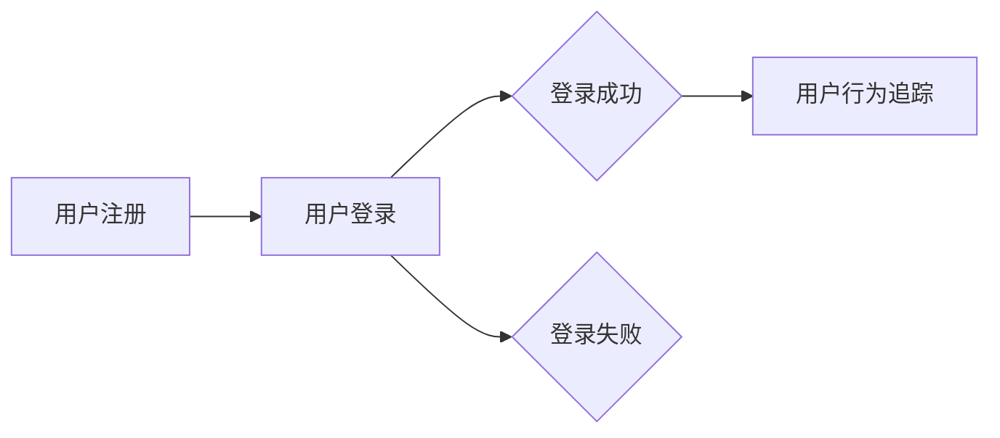
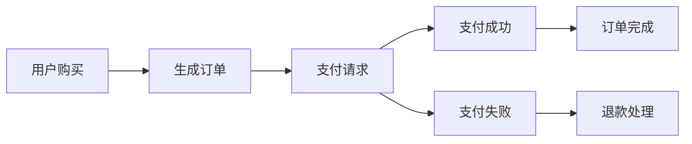
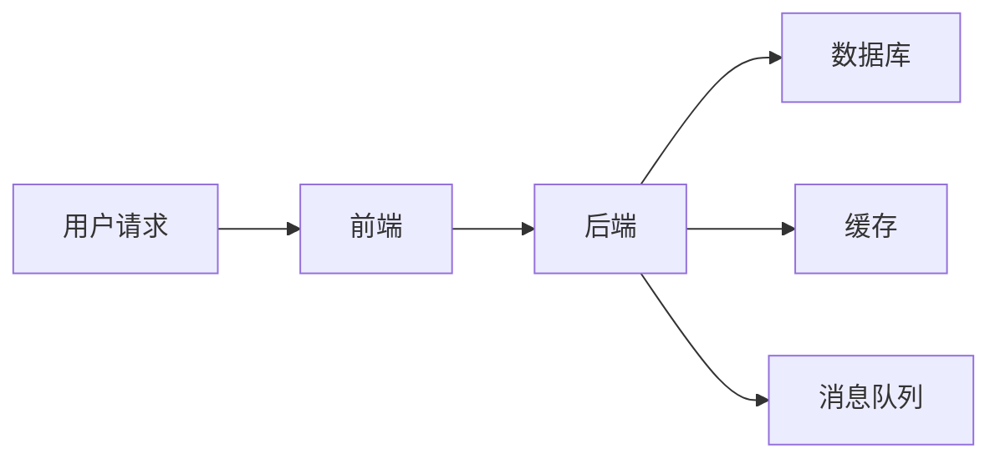
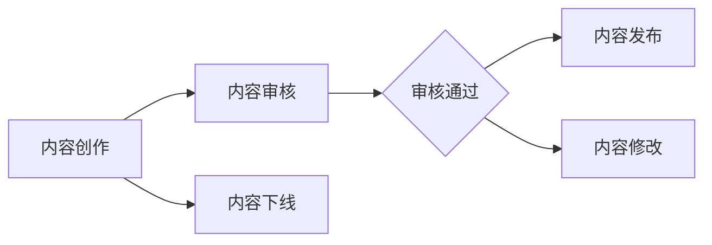

                 

# 知识付费平台为程序员赋能

> **关键词：知识付费、程序员、技能提升、职业发展、平台技术架构**

> **摘要：本文将深入探讨知识付费平台如何为程序员赋能，涵盖平台概述、核心功能、具体应用、技术实现与运营管理以及案例分析，提供全方位的视角，帮助程序员更好地利用知识付费平台提升技能和职业发展。**

---

## 第一部分：知识付费平台为程序员赋能的概述

### 第1章：知识付费平台的崛起

#### 1.1 知识付费的起源与发展

##### 1.1.1 知识付费的兴起背景

知识付费作为一种商业模式，起源于互联网的普及和人们对于知识分享需求的增长。随着互联网技术的发展，尤其是在移动设备和宽带网络的普及下，用户获取知识的方式发生了巨大变化。传统的知识传播方式，如书籍、报纸和讲座等，逐渐被线上知识付费平台所取代。

知识付费的兴起背景可以追溯到以下几个方面：

1. **信息爆炸与知识需求增长**：随着信息技术的快速发展，信息量呈现爆炸式增长。人们需要更高效的方式获取和整理信息，而知识付费平台提供了这种可能性。
2. **互联网普及与在线学习需求**：互联网的普及使得在线学习变得更加便捷，人们可以在任何时间、任何地点学习。知识付费平台满足了这种灵活的学习需求。
3. **知识经济时代来临**：知识经济时代，知识和技能成为核心竞争力。人们愿意为优质的知识和技能付费，以提升自身竞争力。

##### 1.1.2 知识付费市场的发展现状

目前，知识付费市场已形成一定的规模，并且呈现出以下特点：

1. **市场规模扩大**：根据相关报告，知识付费市场的规模逐年扩大，用户数量和付费意愿不断提升。
2. **领域多元化**：知识付费涉及的领域广泛，包括职业培训、技能提升、学术研究、兴趣爱好等。
3. **平台竞争激烈**：市场上涌现出大量的知识付费平台，如得到、知乎Live、网易云课堂等，竞争激烈。
4. **用户需求多样化**：用户对于知识的需求多样化，不仅关注知识本身，还关注学习体验和社交互动。

##### 1.1.3 知识付费对程序员职业发展的影响

知识付费平台对程序员的职业发展有着积极的影响，具体表现在以下几个方面：

1. **技能提升**：程序员可以通过付费平台学习最新的编程语言、框架和工具，提升自己的技术能力。
2. **职业规划**：知识付费平台提供丰富的职业发展指导，帮助程序员制定清晰的职业规划。
3. **职业网络拓展**：程序员可以通过知识付费平台与其他从业者建立联系，拓展职业网络。
4. **个人品牌建设**：优秀的内容创作者可以在知识付费平台建立个人品牌，提升自身的知名度。

#### 1.2 程序员在知识付费平台的角色

程序员在知识付费平台中扮演多重角色，既是知识提供者，也是学习者，还是平台的积极参与者。

##### 1.2.1 程序员作为知识提供者

程序员作为知识提供者的角色主要体现在以下几个方面：

1. **课程开发**：程序员可以开发自己的课程，分享自己的专业技能和经验。
2. **内容创作**：程序员可以通过写作、视频等多种形式创作知识内容。
3. **互动交流**：程序员可以与其他学习者互动，解答疑问，分享学习心得。

##### 1.2.2 程序员作为学习者

程序员作为学习者的角色同样重要，通过知识付费平台，他们可以：

1. **学习新技能**：程序员可以通过付费课程学习新的编程语言、框架和工具。
2. **提升职业素养**：程序员可以通过付费内容提升自己的职业素养和软技能。
3. **参与社区**：程序员可以加入知识付费平台的社区，与其他从业者交流。

##### 1.2.3 程序员作为平台参与者

程序员作为平台的参与者，不仅可以学习知识，还可以参与平台的建设和发展：

1. **反馈建议**：程序员可以反馈平台的使用体验，为平台改进提供建议。
2. **参与社区活动**：程序员可以参与平台组织的活动，提升自身的知名度和影响力。
3. **平台推广**：程序员可以通过分享和推荐，帮助平台扩大用户基础。

### 第2章：知识付费平台的核心功能

#### 2.1 内容创作与分发

##### 2.1.1 教程与课程设计

知识付费平台的核心功能之一是内容创作与分发。教程与课程设计是平台内容创作的重要环节，包括以下几个方面：

1. **课程内容规划**：首先，课程设计师需要根据市场需求和用户需求，规划课程的内容和结构。
2. **课程材料准备**：根据课程规划，准备相关的教学材料，如PPT、文档、视频等。
3. **课程开发**：通过录制视频、编写文档等方式，将课程内容呈现给学习者。
4. **课程迭代**：根据用户反馈，不断优化和迭代课程内容，提高教学质量。

##### 2.1.2 知识分享与互动

知识分享与互动是知识付费平台的重要组成部分，旨在增强学习者的参与感和学习效果。具体措施包括：

1. **在线讨论区**：设立在线讨论区，鼓励学习者提问和交流。
2. **实时互动**：通过直播、问答等方式，实现学习者的实时互动。
3. **作业与评测**：设置作业和评测，帮助学习者巩固所学知识。

##### 2.1.3 内容审核与质量控制

为了保证知识内容的质量，知识付费平台需要对内容进行审核和质量控制。具体措施包括：

1. **内容审核流程**：制定内容审核标准，对课程内容进行严格审核。
2. **质量控制机制**：通过用户评价、专家评审等方式，对内容质量进行监督和控制。
3. **内容更新机制**：定期更新课程内容，确保知识的新颖性和实用性。

#### 2.2 用户管理与服务

##### 2.2.1 用户注册与身份验证

用户管理是知识付费平台的重要功能之一，包括用户注册与身份验证。具体措施如下：

1. **用户注册**：平台提供用户注册功能，用户可以通过邮箱、手机号、社交媒体账号等多种方式注册。
2. **身份验证**：为了确保用户身份的真实性，平台需要对用户进行身份验证，如实名认证、银行卡绑定等。

##### 2.2.2 用户行为分析

用户行为分析是提升用户体验和平台服务质量的重要手段。具体措施包括：

1. **学习行为分析**：通过分析用户的学习行为，如学习时间、学习进度、知识点掌握情况等，为用户提供个性化的学习建议。
2. **用户满意度调查**：定期进行用户满意度调查，收集用户反馈，不断优化平台服务。

##### 2.2.3 用户服务与支持

为了提高用户满意度，知识付费平台需要提供全方位的用户服务与支持。具体措施包括：

1. **在线客服**：设立在线客服，为用户提供实时咨询服务。
2. **常见问题解答**：在平台网站上设立常见问题解答专栏，帮助用户解决常见问题。
3. **学习指导**：为用户提供学习指导，帮助用户更好地掌握知识。

#### 2.3 付费机制与财务结算

##### 2.3.1 付费模式与价格策略

知识付费平台的付费模式多样，包括一次性购买、订阅制、课时制等。价格策略需要根据市场情况、用户需求和平台定位来制定。具体措施包括：

1. **定价策略**：根据课程难度、时长、知名度等因素，合理定价。
2. **优惠活动**：定期推出优惠活动，吸引用户购买。
3. **价格调整**：根据市场反馈，适时调整价格策略。

##### 2.3.2 交易支付与风险控制

为了保证交易的顺利进行，知识付费平台需要建立完善的交易支付体系，并采取有效的风险控制措施。具体措施包括：

1. **支付方式**：支持多种支付方式，如支付宝、微信支付、信用卡等。
2. **支付安全**：确保支付过程的安全性，防止用户信息泄露。
3. **风险控制**：建立风险控制机制，如支付欺诈检测、资金安全保管等。

##### 2.3.3 财务结算与税务处理

知识付费平台需要建立完善的财务结算与税务处理体系，确保财务的合规性。具体措施包括：

1. **财务结算**：定期进行财务结算，确保收支平衡。
2. **税务处理**：按照相关规定，进行税务申报和缴纳。

## 第二部分：知识付费平台为程序员赋能的具体应用

### 第3章：编程技能的提升

#### 3.1 编程技能学习路径规划

编程技能提升是程序员在知识付费平台的重要目标之一。为了实现这一目标，需要制定科学的学习路径规划。具体措施包括：

##### 3.1.1 技能分类与评估

首先，需要对编程技能进行分类，如前端开发、后端开发、移动开发、数据库等。然后，根据用户的实际情况和需求，对用户的技能进行评估，确定他们的技能水平和学习需求。

##### 3.1.2 学习计划制定

根据技能分类和评估结果，制定个性化的学习计划。学习计划应包括学习目标、学习内容、学习方法等。例如，对于前端开发技能，学习计划可能包括HTML、CSS、JavaScript等基础知识，以及Vue、React等框架的学习。

##### 3.1.3 学习效果评估与反馈

学习过程中，需要定期对学习效果进行评估，收集用户反馈，以便及时调整学习计划。评估方式可以包括在线测试、作业提交、学习报告等。

#### 3.2 编程实战项目指导

编程实战项目是提升程序员技能的重要手段。知识付费平台可以通过以下措施提供编程实战项目指导：

##### 3.2.1 项目选题与需求分析

首先，需要根据市场需求和用户需求，选择合适的实战项目。然后，对项目进行详细的需求分析，明确项目目标、功能需求和技术需求。

##### 3.2.2 项目开发流程

根据项目需求和开发流程，提供详细的开发指导。开发流程包括需求分析、设计、编码、测试、部署等阶段。在项目开发过程中，需要提供必要的工具和资源支持。

##### 3.2.3 项目评估与优化

项目完成后，需要对项目进行评估，评估项目质量、功能实现情况等。同时，根据用户反馈，不断优化项目，提升项目质量和用户体验。

### 第4章：职业发展指导

#### 4.1 职业规划与职业素养提升

职业规划与职业素养提升是程序员在知识付费平台的重要关注点。具体措施包括：

##### 4.1.1 职业生涯规划

首先，需要帮助程序员制定清晰的职业生涯规划。职业生涯规划包括短期目标、中长期目标等。例如，短期内可能目标是提升某一技能，中长期目标是实现职业晋升。

##### 4.1.2 求职技巧与面试策略

为了帮助程序员顺利求职，需要提供求职技巧和面试策略指导。求职技巧包括简历制作、面试技巧等。面试策略包括模拟面试、面试问题准备等。

##### 4.1.3 职业素养与软技能培养

职业素养和软技能是程序员在职场中成功的重要因素。知识付费平台可以通过以下方式培养职业素养和软技能：

1. **沟通能力**：通过在线讨论、实时互动等方式，提高程序员的沟通能力。
2. **团队合作**：通过项目协作、团队活动等方式，培养程序员的团队合作精神。
3. **问题解决能力**：通过案例分析和实战项目，提高程序员的解决问题的能力。

#### 4.2 职场晋升与领导力培养

为了帮助程序员实现职业晋升，知识付费平台需要提供以下支持：

##### 4.2.1 晋升路径与晋升策略

首先，需要明确程序员的晋升路径，如技术岗位、管理岗位等。然后，制定相应的晋升策略，包括技能要求、工作表现等。

##### 4.2.2 领导力培养与团队管理

领导力是程序员在职业发展中不可或缺的能力。知识付费平台可以通过以下方式培养领导力：

1. **团队建设**：通过团队活动、团队建设培训等方式，培养程序员的团队管理能力。
2. **领导力课程**：提供领导力课程，帮助程序员提升领导力素质。
3. **案例分析**：通过案例分析，让程序员了解成功的团队管理和领导力实践。

##### 4.2.3 职业发展案例分析

为了更好地帮助程序员实现职业发展，知识付费平台可以分享成功案例，分析成功原因，为程序员提供借鉴和启示。案例分析可以从以下几个方面展开：

1. **职业规划**：分析成功的职业规划案例，了解如何制定和实现职业目标。
2. **技能提升**：分析通过技能提升实现职业发展的案例，了解如何通过学习提升技能。
3. **职场晋升**：分析通过职场晋升实现职业发展的案例，了解如何提升职场竞争力。

### 第5章：职业网络拓展

#### 5.1 社交媒体与职业社交平台

社交媒体和职业社交平台是程序员拓展职业网络的重要工具。具体应用包括：

##### 5.1.1 社交媒体在职业发展中的应用

1. **品牌建设**：通过社交媒体建立个人品牌，提升知名度。
2. **信息获取**：关注行业动态，获取最新技术资讯和职业机会。
3. **人脉拓展**：通过社交媒体与同行交流，拓展职业网络。

##### 5.1.2 职业社交平台的选择与使用

1. **LinkedIn**：全球最大的职业社交平台，适合程序员拓展国际职业网络。
2. **MooC平台**：如Coursera、edX等，适合程序员学习新技能和结识同行。
3. **GitHub**：全球最大的代码托管平台，适合程序员展示技术能力和参与开源项目。

##### 5.1.3 社交技巧与人际关系管理

1. **建立联系**：主动与其他从业者建立联系，交换联系方式。
2. **互动交流**：通过评论、私信等方式，积极与同行互动。
3. **内容分享**：分享专业知识和学习心得，提升个人影响力。

#### 5.2 行业会议与活动参与

参与行业会议和活动是拓展职业网络的有效途径。具体措施包括：

##### 5.2.1 行业会议的组织与参与

1. **参会准备**：提前了解会议主题和议程，准备相关资料。
2. **演讲与分享**：如有机会，可以申请演讲或分享，展示个人能力。
3. **现场互动**：积极参与现场互动，与同行建立联系。

##### 5.2.2 活动策划与执行

1. **活动策划**：根据行业需求，策划有针对性的活动。
2. **活动执行**：确保活动顺利进行，提供高质量的服务。
3. **活动反馈**：收集活动反馈，不断优化活动质量和效果。

##### 5.2.3 行业资源的获取与整合

1. **资源获取**：通过活动结识行业专家，获取行业资源。
2. **资源整合**：将获取的资源进行整合，为职业发展提供支持。
3. **资源共享**：与他人分享资源，建立互利共赢的关系。

## 第三部分：知识付费平台的技术实现与运营管理

### 第6章：知识付费平台技术架构

#### 6.1 技术架构设计

知识付费平台的技术架构设计是确保平台稳定、高效运行的关键。以下是技术架构设计的关键环节：

##### 6.1.1 系统架构概述

知识付费平台的系统架构通常包括前端、后端、数据库、缓存、消息队列等组件。以下是一个简化的系统架构图：

```
+----------------+       +----------------+       +----------------+
|      前端       |       |      后端       |       |      数据库     |
+----------------+       +----------------+       +----------------+
        |           HTTP请求                          |                   |
        V                                             |
+----------------+       +----------------+       +----------------+
|     缓存系统     |       |     消息队列     |       |    数据库系统    |
+----------------+       +----------------+       +----------------+
        | 读写分离、数据一致性         数据同步、消息处理        |
        V                                             |
+----------------+       +----------------+       +----------------+
|      数据库      |       |     应用服务     |       |      存储服务     |
+----------------+       +----------------+       +----------------+
```

##### 6.1.2 技术选型与架构优化

在选择技术栈时，需要考虑以下几个因素：

1. **性能与稳定性**：选择高性能、高可用的技术组件。
2. **开发效率**：选择易于开发、维护和扩展的技术。
3. **安全性**：确保数据安全和用户隐私。
4. **可扩展性**：设计可扩展的架构，以应对业务增长。

常见的后端技术选型包括：

- **Web框架**：如Spring Boot、Django、Express等。
- **数据库**：如MySQL、PostgreSQL、MongoDB等。
- **缓存**：如Redis、Memcached等。
- **消息队列**：如RabbitMQ、Kafka等。

##### 6.1.3 数据存储与处理架构

数据存储与处理架构设计是确保数据安全和高效访问的关键。以下是一些常见的架构设计：

1. **关系型数据库**：适用于结构化数据存储，如MySQL、PostgreSQL。
2. **NoSQL数据库**：适用于非结构化数据存储，如MongoDB、Cassandra。
3. **分布式数据库**：适用于大数据场景，如HBase、Hive。
4. **数据缓存**：通过缓存减少数据库压力，提高数据访问速度，如Redis、Memcached。

#### 6.2 技术实现细节

##### 6.2.1 内容管理系统（CMS）设计

内容管理系统（CMS）是知识付费平台的核心组件之一，负责内容的管理、发布和展示。以下是CMS设计的关键环节：

1. **内容模型设计**：定义内容的基本属性，如标题、摘要、正文、标签等。
2. **内容发布流程**：设计内容发布、审核、上线等流程。
3. **内容展示**：设计内容的展示方式，如列表、详情页等。

以下是一个简单的Mermaid流程图：


##### 6.2.2 用户管理系统（UMS）设计

用户管理系统（UMS）负责用户注册、登录、权限管理等。以下是UMS设计的关键环节：

1. **用户注册与登录**：设计用户注册、登录接口，支持多种认证方式，如用户名密码、手机号、邮箱等。
2. **用户权限管理**：设计用户权限管理机制，确保用户只能访问权限范围内的资源。
3. **用户行为追踪**：记录用户行为，如登录、学习、购买等，用于数据分析和个性化推荐。

以下是一个简单的Mermaid流程图：



##### 6.2.3 付费系统与交易处理

付费系统是知识付费平台的核心功能之一，负责课程购买、支付、退款等。以下是付费系统设计的关键环节：

1. **支付接口集成**：集成第三方支付接口，如支付宝、微信支付等。
2. **订单管理系统**：设计订单管理系统，负责订单生成、支付、退款等。
3. **支付流程**：设计支付流程，确保支付过程的安全性和可靠性。

以下是一个简单的Mermaid流程图：



### 第7章：运营管理策略

#### 7.1 运营策略规划

运营策略规划是确保知识付费平台长期稳定发展的关键。以下是运营策略规划的关键环节：

##### 7.1.1 运营目标设定

首先，需要设定清晰的运营目标，如用户增长、收入增长、用户满意度等。运营目标应与平台整体战略保持一致。

##### 7.1.2 运营数据分析

通过数据分析，了解平台运营状况，发现潜在问题和机会。关键指标包括用户活跃度、转化率、留存率等。

##### 7.1.3 运营活动策划与执行

根据运营目标和数据分析结果，策划和执行运营活动，如课程促销、用户互动活动、品牌推广等。

#### 7.2 用户增长与留存

用户增长与留存是知识付费平台成功的关键因素。以下是用户增长与留存策略的关键环节：

##### 7.2.1 用户增长策略

1. **内容营销**：通过高质量的内容吸引潜在用户。
2. **社交媒体推广**：利用社交媒体平台推广平台和课程。
3. **合作伙伴关系**：与相关行业合作伙伴建立合作关系，扩大用户基础。

##### 7.2.2 用户留存策略

1. **个性化推荐**：根据用户行为数据，为用户推荐感兴趣的课程。
2. **用户互动**：设计用户互动活动，增强用户粘性。
3. **用户关怀**：通过用户反馈、客服等方式，关注用户需求，提供高质量服务。

##### 7.2.3 用户满意度提升

1. **服务质量**：确保课程内容质量，提供优质的用户服务。
2. **用户体验**：优化平台用户体验，提升用户满意度。
3. **用户反馈**：收集用户反馈，不断优化平台功能和内容。

#### 7.3 营销推广与品牌建设

营销推广与品牌建设是知识付费平台扩大影响力、提升知名度的重要手段。以下是营销推广与品牌建设的关键环节：

##### 7.3.1 营销策略规划

1. **市场调研**：了解市场需求和用户偏好，制定针对性的营销策略。
2. **目标受众**：明确目标受众，制定针对性的营销方案。
3. **预算分配**：合理分配营销预算，确保营销效果最大化。

##### 7.3.2 品牌建设与传播

1. **品牌定位**：明确品牌定位，塑造品牌形象。
2. **内容营销**：通过高质量的内容传播品牌理念。
3. **线上线下活动**：举办线上线下活动，提升品牌知名度。

##### 7.3.3 线上线下营销活动策划与执行

1. **线上活动**：设计线上活动，如直播、优惠券等，吸引潜在用户。
2. **线下活动**：举办线下活动，如讲座、研讨会等，提升品牌影响力。
3. **活动效果评估**：对活动效果进行评估，不断优化活动策划和执行。

## 第四部分：案例分析与未来展望

### 第8章：成功案例解析

#### 8.1 案例分析

##### 8.1.1 案例选取与背景介绍

本文选取的知识付费平台案例是知名的教育平台“网易云课堂”。网易云课堂是中国领先的知识付费平台之一，提供包括编程、设计、语言、职场等多领域的在线课程。

##### 8.1.2 案例执行过程与效果评估

1. **课程内容规划**：网易云课堂通过市场调研和用户反馈，确定课程内容，涵盖热门编程语言、框架和技术。
2. **内容创作与分发**：邀请行业专家和知名讲师进行课程创作，确保内容质量。通过多种形式（视频、文档、直播）进行内容分发。
3. **用户互动与支持**：建立在线讨论区，鼓励用户互动。提供在线客服，解决用户问题。

效果评估：
- 用户活跃度高，日均访问量持续增长。
- 用户满意度高，课程评价良好。
- 付费转化率高，收入稳步增长。

##### 8.1.3 案例成功经验与启示

1. **内容质量**：提供高质量的内容是知识付费平台成功的关键。
2. **用户体验**：优化用户体验，提升用户满意度。
3. **用户互动**：增强用户互动，提高用户粘性。

### 8.2 行业趋势与未来展望

##### 8.2.1 行业发展趋势分析

1. **市场规模扩大**：随着知识付费理念的普及，知识付费市场规模将继续扩大。
2. **内容多元化**：知识付费内容将更加多元化，涵盖更多领域。
3. **个性化推荐**：基于人工智能的个性化推荐将更加精准，提升用户学习体验。

##### 8.2.2 知识付费平台面临的挑战与机遇

挑战：
1. **市场竞争**：知识付费市场竞争激烈，平台需要不断创新。
2. **内容质量**：确保内容质量是平台发展的关键。
3. **用户留存**：提升用户留存率是平台长期发展的关键。

机遇：
1. **技术进步**：人工智能、大数据等技术的进步，将提升知识付费平台的服务质量和效率。
2. **线上线下融合**：线上线下活动的融合，将拓展知识付费平台的市场空间。
3. **国际市场**：开拓国际市场，将知识付费理念带到全球。

##### 8.2.3 未来发展方向与建议

1. **技术创新**：持续投入技术创新，提升平台服务质量和用户体验。
2. **内容优化**：不断优化内容，提升内容质量和多样性。
3. **用户运营**：加强用户运营，提升用户满意度和留存率。

## 附录

### 附录 A：知识付费平台资源与工具

#### A.1 开发工具与平台

1. **知识付费平台开发工具**：
   - **内容管理系统（CMS）**：如WordPress、Joomla等，用于内容的管理和发布。
   - **在线教育平台**：如Moodle、Canvas等，用于课程的教学和管理。
   - **直播工具**：如Zoom、Google Meet等，用于实时互动和直播教学。

2. **内容创作与分发工具**：
   - **视频制作工具**：如Adobe Premiere Pro、Final Cut Pro等，用于视频内容的制作。
   - **文档编辑工具**：如Microsoft Word、Google Docs等，用于文档内容的编辑。
   - **PPT制作工具**：如Microsoft PowerPoint、Keynote等，用于PPT内容的制作。

3. **用户管理与服务工具**：
   - **用户管理系统（UMS）**：如Auth0、OAuth等，用于用户的注册、登录和权限管理。
   - **在线客服系统**：如Zendesk、Freshdesk等，用于提供在线客服服务。
   - **用户行为分析工具**：如Google Analytics、Mixpanel等，用于分析用户行为。

#### A.2 市场分析报告

1. **知识付费市场报告**：
   - **市场规模**：分析知识付费市场的规模和发展趋势。
   - **用户画像**：分析知识付费平台的目标用户群体特征。
   - **竞争格局**：分析知识付费平台的市场竞争状况。

2. **程序员职业发展报告**：
   - **技能需求**：分析程序员在职场中所需的技能。
   - **职业路径**：分析程序员的职业发展路径和晋升策略。
   - **薪酬待遇**：分析程序员的薪酬待遇和发展前景。

3. **竞争对手分析报告**：
   - **竞争者分析**：分析主要竞争对手的市场表现、产品特点和竞争优势。
   - **市场定位**：分析知识付费平台的市场定位和竞争优势。
   - **用户评价**：分析用户对竞争对手的评价和反馈。

#### A.3 行业白皮书

1. **知识付费行业发展白皮书**：
   - **行业概述**：分析知识付费行业的起源、发展和现状。
   - **市场趋势**：分析知识付费行业的发展趋势和机遇。
   - **政策法规**：分析知识付费行业的政策法规和监管环境。

2. **程序员赋能白皮书**：
   - **技能提升**：分析程序员如何通过知识付费平台提升技能。
   - **职业发展**：分析程序员在知识付费平台上的职业发展路径。
   - **行业影响**：分析知识付费平台对程序员行业的影响。

3. **技术发展与应用白皮书**：
   - **技术趋势**：分析知识付费平台所采用的关键技术和趋势。
   - **应用场景**：分析知识付费平台在不同行业中的应用场景。
   - **技术挑战**：分析知识付费平台在技术实现中面临的挑战。

---

**作者：AI天才研究院/AI Genius Institute & 禅与计算机程序设计艺术 /Zen And The Art of Computer Programming**## 第1章：知识付费的起源与发展

### 1.1.1 知识付费的兴起背景

知识付费的兴起可以追溯到互联网技术的快速发展以及人们对于知识获取方式的变革。在过去，知识的获取主要通过传统的教育体系，如学校教育、图书馆阅读等。然而，随着互联网的普及，尤其是移动互联网的兴起，人们获取知识的方式发生了翻天覆地的变化。互联网打破了时间和空间的限制，使知识传播变得更加高效和便捷。

知识付费的兴起背景主要受到以下几个因素的影响：

1. **信息爆炸与知识需求增长**：随着信息技术的快速发展，信息的产生和传播速度呈指数级增长。人们需要更高效的方式获取和整理信息，以满足自身对知识的渴求。知识付费平台提供了这种可能性，通过将知识内容进行系统化、结构化的整理和呈现，使用户可以更快捷地获取所需的知识。

2. **在线学习需求的增加**：互联网的普及使得在线学习成为可能，用户可以随时随地通过手机、电脑等设备进行学习。在线学习不仅提供了灵活的学习时间，还提供了丰富的学习资源和互动方式，满足了现代用户多样化的学习需求。知识付费平台为在线学习提供了重要的支撑，通过提供高质量的课程内容，帮助用户实现自我提升。

3. **知识经济时代的来临**：在知识经济时代，知识和技能成为企业竞争力和个人职业发展的重要资本。传统的知识获取方式，如学校教育、自学等，已经无法满足快速变化的市场需求。知识付费平台通过提供专业的知识和技能培训，帮助用户提升自身竞争力，适应快速变化的市场环境。

4. **移动互联网的普及**：移动互联网的普及使得知识付费变得更加便捷。用户可以通过手机应用、浏览器等设备随时随地访问知识付费平台，获取所需的知识。移动互联网的普及为知识付费的推广和普及提供了强大的技术支持。

### 1.1.2 知识付费市场的发展现状

知识付费市场自兴起以来，经历了快速的发展。目前，知识付费市场呈现出以下特点：

1. **市场规模扩大**：根据相关数据，知识付费市场的规模逐年扩大。知识付费用户数量不断增加，用户消费能力也逐渐提升。知识付费市场已经成为一个具有巨大潜力的新兴市场。

2. **领域多元化**：知识付费涉及的领域广泛，包括职业培训、技能提升、学术研究、兴趣爱好等。不同领域的知识付费产品不断丰富，满足了用户多样化的需求。

3. **平台竞争激烈**：目前市场上涌现出大量的知识付费平台，如得到、知乎Live、网易云课堂等。这些平台通过不同的定位、内容和运营策略，争夺市场份额。知识付费市场的竞争日益激烈。

4. **用户需求多样化**：用户对知识的需求呈现出多样化、个性化的特点。除了关注知识的内容本身，用户还关注学习体验、社交互动和个性化推荐等。知识付费平台需要不断优化产品和服务，以满足用户多样化的需求。

### 1.1.3 知识付费对程序员职业发展的影响

知识付费对程序员的职业发展有着深远的影响，主要表现在以下几个方面：

1. **技能提升**：知识付费平台提供了大量的编程课程和实战项目，帮助程序员提升技能。程序员可以通过付费学习，掌握新的编程语言、框架和技术，提升自身的竞争力。

2. **职业规划**：知识付费平台提供了丰富的职业发展指导，如职业规划课程、求职技巧等。程序员可以通过这些课程，了解职业发展的路径和策略，制定清晰的职业规划。

3. **职业网络拓展**：知识付费平台为程序员提供了与其他从业者交流和互动的机会。程序员可以通过平台建立职业网络，拓展人脉资源，获取职业机会。

4. **个人品牌建设**：优秀的程序员可以通过知识付费平台，分享自己的专业知识和经验，建立个人品牌。个人品牌有助于提升程序员的知名度和影响力，为职业发展带来更多机会。

### 1.2 程序员在知识付费平台的角色

程序员在知识付费平台中扮演多重角色，既是知识提供者，也是学习者，还是平台的积极参与者。

#### 1.2.1 程序员作为知识提供者

程序员作为知识提供者，可以通过以下方式参与知识付费平台：

1. **课程开发**：程序员可以开发自己的课程，分享自己的专业技能和经验。通过编写教材、录制视频、设计实战项目等，将知识系统化地呈现给学习者。

2. **内容创作**：程序员可以通过写作、视频等多种形式创作知识内容。例如，撰写技术博客、发布技术教程、制作视频教程等，分享自己的学习心得和技术见解。

3. **互动交流**：程序员可以与其他学习者互动，解答疑问，分享学习心得。通过在线讨论区、直播互动等方式，增强学习体验，提高课程质量。

#### 1.2.2 程序员作为学习者

程序员作为学习者，可以从知识付费平台获得以下收益：

1. **学习新技能**：程序员可以通过付费课程学习新的编程语言、框架和工具，提升自己的技术能力。例如，学习Python、JavaScript、React、Vue等热门技术。

2. **提升职业素养**：程序员可以通过付费课程提升自己的职业素养和软技能，如时间管理、团队协作、沟通技巧等，提升职场竞争力。

3. **参与社区**：程序员可以加入知识付费平台的社区，与其他从业者交流，获取行业动态和职业机会。通过参与社区讨论、提问和解答问题，不断扩展自己的知识面和视野。

#### 1.2.3 程序员作为平台参与者

程序员作为平台的参与者，不仅可以学习知识，还可以参与平台的建设和发展：

1. **反馈建议**：程序员可以反馈平台的使用体验，为平台改进提供建议。例如，提出对课程内容、平台功能、用户体验等方面的改进意见。

2. **参与社区活动**：程序员可以参与平台组织的社区活动，如技术沙龙、线上讲座、代码挑战等，提升自身的知名度和影响力。

3. **平台推广**：程序员可以通过分享和推荐，帮助平台扩大用户基础。通过社交媒体、个人博客等方式，传播平台优势和课程价值，吸引更多学习者加入。

### 1.3 知识付费平台的核心功能

知识付费平台的核心功能主要包括内容创作与分发、用户管理与服务、付费机制与财务结算等方面。这些功能共同构成了一个完整的知识付费生态系统，为程序员的学习和职业发展提供了全方位的支持。

#### 1.3.1 内容创作与分发

内容创作与分发是知识付费平台的核心功能之一。平台需要通过以下方式实现内容创作与分发：

1. **课程开发**：平台需要邀请行业专家和知名讲师，开发高质量的课程内容。课程内容应涵盖热门的编程语言、框架和技术，满足程序员的学习需求。

2. **内容审核**：为了确保课程质量，平台需要对课程内容进行严格审核。审核包括内容完整性、准确性、实用性等方面，确保学习者能够获得优质的知识。

3. **内容分发**：平台需要通过多种形式（如视频、文档、直播等）将课程内容分发给学习者。同时，平台应提供便捷的课程搜索和推荐功能，帮助学习者快速找到所需的知识。

4. **互动交流**：平台应提供在线讨论区、问答社区等互动功能，鼓励学习者之间的交流与讨论。通过互动，学习者可以更好地理解和掌握知识，同时也可以为平台创造更多的价值。

#### 1.3.2 用户管理与服务

用户管理与服务是知识付费平台的重要组成部分，直接影响用户的满意度和留存率。平台需要通过以下方式实现用户管理与服务：

1. **用户注册与身份验证**：平台需要提供便捷的用户注册功能，同时确保用户身份的真实性。例如，可以通过手机号、邮箱等注册方式，并进行实名认证。

2. **用户行为分析**：平台需要对用户的学习行为进行分析，如学习时长、学习进度、知识点掌握情况等。通过分析用户行为，平台可以提供个性化的学习建议，提高学习效果。

3. **用户服务与支持**：平台需要提供完善的用户服务与支持，包括在线客服、常见问题解答、学习指导等。通过优质的用户服务，平台可以增强用户满意度，提高用户留存率。

4. **用户成长体系**：平台可以建立用户成长体系，激励用户持续学习和提升技能。例如，通过积分系统、等级制度等方式，给予用户学习奖励和荣誉。

#### 1.3.3 付费机制与财务结算

付费机制与财务结算是知识付费平台的另一个核心功能，直接关系到平台的盈利能力和用户体验。平台需要通过以下方式实现付费机制与财务结算：

1. **付费模式**：平台可以提供多种付费模式，如一次性购买、订阅制、课时制等。根据用户需求和市场情况，选择适合的付费模式，提高用户购买的便捷性和满意度。

2. **价格策略**：平台需要制定合理的价格策略，确保课程价格的竞争力。价格策略可以考虑课程难度、时长、知名度、市场情况等因素。

3. **交易支付**：平台需要提供安全的交易支付功能，支持多种支付方式，如支付宝、微信支付、信用卡等。同时，确保支付过程的安全性和便捷性，提高用户购买体验。

4. **财务结算**：平台需要建立完善的财务结算体系，确保收入的准确记录和及时结算。例如，可以定期与支付平台对账，确保财务数据的准确性。

5. **税务处理**：平台需要按照相关法规和规定，进行税务申报和缴纳。确保财务的合规性，避免法律风险。

## 第2章：知识付费平台的核心功能

### 2.1 内容创作与分发

#### 2.1.1 教程与课程设计

知识付费平台的核心功能之一是内容创作与分发。教程与课程设计是知识付费平台内容创作的关键环节。以下是教程与课程设计的重要步骤和注意事项：

1. **需求分析**：在开始教程或课程设计之前，需要对目标用户进行需求分析。通过调查问卷、用户访谈等方式，了解用户的学习需求、兴趣点和痛点。这有助于确保课程内容能够满足用户的需求。

2. **内容规划**：根据需求分析结果，制定课程内容规划。内容规划应包括课程目标、知识点分布、教学方式等。确保课程内容结构合理、逻辑清晰，有利于用户学习和掌握。

3. **内容创作**：在内容创作阶段，需要撰写课程教材、编写教学脚本、制作多媒体素材等。教材应通俗易懂，有利于用户理解；教学脚本应详细说明教学步骤、知识点和注意事项；多媒体素材可以包括图片、视频、动画等，丰富课程内容，提高用户体验。

4. **内容审核**：教程或课程创作完成后，需要进行严格的内容审核。审核内容应包括准确性、完整性、实用性等方面。确保课程内容质量，避免错误和不准确的信息传播。

5. **课程发布**：审核通过的课程可以正式发布。在发布过程中，需要制定发布计划，包括发布时间、发布渠道等。确保课程内容能够及时、高效地传递给用户。

#### 2.1.2 知识分享与互动

知识分享与互动是知识付费平台的重要组成部分，有助于提高用户的学习体验和效果。以下是知识分享与互动的关键措施：

1. **在线讨论区**：建立在线讨论区，鼓励用户在课程学习过程中提出问题和分享心得。平台可以设置讨论区管理员，负责监管讨论区氛围，确保讨论内容健康、积极。

2. **实时互动**：通过直播、在线问答等方式，实现用户与讲师的实时互动。讲师可以在线解答用户的问题，分享经验和见解，提高学习效果。

3. **学习小组**：组织学习小组，让用户在小组内进行讨论和交流。通过小组学习，用户可以互相激励、共同进步，提高学习效果。

4. **案例分享**：邀请优秀用户分享自己的学习经验和成果，激发其他用户的学习热情。案例分享可以包括项目实战、技术分享、职业发展等方面。

#### 2.1.3 内容审核与质量控制

为了确保知识付费平台的内容质量，需要建立完善的内容审核与质量控制机制。以下是内容审核与质量控制的关键步骤：

1. **内容审核标准**：制定内容审核标准，明确审核内容应满足的要求，如准确性、完整性、实用性等。审核标准应具备可操作性和可量化性，便于审核人员执行。

2. **审核流程**：建立内容审核流程，明确审核人员职责、审核标准、审核结果处理等。审核流程应确保内容从创作到发布的每个环节都经过严格审核。

3. **内容质量评估**：定期对发布的内容进行质量评估，收集用户反馈和专家评审意见。通过评估，发现内容存在的问题，及时进行整改。

4. **内容更新与优化**：根据用户反馈和内容质量评估结果，及时更新和优化内容。内容更新应确保知识的时效性和实用性，满足用户需求。

### 2.2 用户管理与服务

#### 2.2.1 用户注册与身份验证

用户管理是知识付费平台的重要功能之一。用户注册与身份验证是用户管理的基础，以下是用户注册与身份验证的关键步骤：

1. **注册方式**：平台应提供多种注册方式，如手机号、邮箱、第三方账号（如微信、QQ、微博等）注册。多种注册方式可以提高用户的注册便利性，降低注册门槛。

2. **注册流程**：注册流程应简单、清晰。用户在注册时，需要填写基本信息（如姓名、手机号、邮箱等），并同意平台的用户协议和隐私政策。平台应在注册过程中对用户信息进行验证，确保信息的真实性和准确性。

3. **身份验证**：为了确保用户身份的真实性，平台应提供身份验证功能。例如，通过发送验证码、邮箱验证、人脸识别等方式，验证用户身份。身份验证有助于防范恶意注册和账号盗用。

4. **用户信息保护**：平台应严格遵守相关法律法规，保护用户个人信息安全。例如，采用加密技术存储用户信息，确保用户数据的安全性和隐私性。

#### 2.2.2 用户行为分析

用户行为分析是提升知识付费平台用户体验和运营效果的重要手段。以下是用户行为分析的关键步骤：

1. **行为数据收集**：平台需要收集用户在平台上的行为数据，如学习时长、学习进度、课程浏览量、购买行为等。这些数据可以通过技术手段（如日志记录、数据分析等）进行收集。

2. **数据分析**：对收集到的用户行为数据进行分析，发现用户的行为规律和需求。例如，分析用户的学习偏好、购买习惯等，为平台运营提供数据支持。

3. **个性化推荐**：基于用户行为分析结果，平台可以提供个性化推荐功能。例如，根据用户的学习历史和偏好，推荐相关的课程、文章等，提高用户的满意度。

4. **反馈与改进**：根据用户行为分析结果，平台应及时反馈和改进。例如，优化课程内容、调整推荐策略等，提高用户的学习体验。

#### 2.2.3 用户服务与支持

为了提高用户满意度，知识付费平台需要提供全方位的用户服务与支持。以下是用户服务与支持的关键步骤：

1. **在线客服**：平台应设立在线客服系统，为用户提供实时咨询服务。客服人员应具备专业知识，能够解答用户在学习过程中遇到的问题。

2. **常见问题解答**：平台应建立常见问题解答专栏，收集和整理用户常见问题，为用户提供便捷的查询服务。常见问题解答应涵盖课程内容、注册登录、支付购买等方面。

3. **学习指导**：平台可以提供学习指导服务，帮助用户解决学习过程中的疑难问题。学习指导可以包括学习计划制定、学习方法指导、课程讲解等。

4. **用户关怀**：平台应定期向用户发送关怀邮件、短信等，了解用户的学习进展和需求。通过用户关怀，增强用户与平台之间的黏性，提高用户满意度。

### 2.3 付费机制与财务结算

#### 2.3.1 付费模式与价格策略

知识付费平台的付费模式多样，不同的付费模式适用于不同的用户需求。以下是几种常见的付费模式：

1. **一次性购买**：用户一次性支付课程费用，获得课程永久访问权限。适用于用户对课程有明确需求和购买意愿的情况。

2. **订阅制**：用户支付一定费用，获得一段时间内对平台课程的免费访问权限。适用于用户希望持续学习、探索更多课程的情况。

3. **课时制**：用户按课程课时支付费用，完成课时后，获得相应课程的学习权限。适用于用户对课程时长有明确需求的情况。

4. **免费试听**：提供部分课程或章节免费试听，吸引用户购买完整课程。适用于用户对课程质量有较高要求，但不确定是否值得购买的情况。

价格策略是知识付费平台的重要环节，以下是几种常见的价格策略：

1. **成本加成法**：以课程制作成本为基础，加上一定的利润率，确定课程价格。这种方法适用于成本较为清晰、竞争激烈的市场环境。

2. **市场定价法**：根据市场情况和用户需求，确定课程价格。市场定价法需要充分了解用户对课程的价值感知和市场行情，以确保价格具有竞争力。

3. **价值定价法**：以课程对用户的价值为基础，确定课程价格。这种方法需要准确评估用户对课程的价值感知，以提供有吸引力的价格。

4. **促销定价法**：通过优惠券、折扣活动等方式，降低课程价格，吸引用户购买。促销定价法适用于特定时期或特定用户群体的需求。

#### 2.3.2 交易支付与风险控制

知识付费平台的交易支付与风险控制是确保用户支付安全和交易顺利进行的重要保障。以下是交易支付与风险控制的关键步骤：

1. **支付方式**：平台应支持多种支付方式，如支付宝、微信支付、银联支付等，以满足用户的支付需求。同时，确保支付过程的安全性和便捷性。

2. **支付流程**：支付流程应简单明了，用户可以轻松完成支付操作。支付流程包括选择课程、确认订单、选择支付方式、输入支付密码等。

3. **支付安全**：平台应采用加密技术，确保支付过程的安全性。例如，使用HTTPS协议、SSL证书等，防止用户支付信息泄露。

4. **风险控制**：平台应建立风险控制机制，防范支付欺诈、恶意退款等风险。例如，采用反欺诈技术、设置支付限额等。

#### 2.3.3 财务结算与税务处理

知识付费平台的财务结算与税务处理是确保平台财务合规和用户权益的重要环节。以下是财务结算与税务处理的关键步骤：

1. **财务结算**：平台应建立完善的财务结算体系，确保收入的准确记录和及时结算。财务结算应包括订单处理、支付对账、收入统计等环节。

2. **税务处理**：平台应按照相关法律法规，进行税务申报和缴纳。税务处理包括税费计算、发票开具、税务申报等。

3. **用户权益保护**：平台应确保用户购买课程的费用合理、透明。在财务结算和税务处理过程中，不得无故扣除用户费用，确保用户权益。

4. **财务报表**：平台应定期生成财务报表，包括收入报表、支出报表、利润报表等。财务报表应真实、准确、完整，为平台决策提供数据支持。

## 第3章：编程技能的提升

### 3.1 编程技能学习路径规划

编程技能的提升是程序员职业生涯中至关重要的一环。为了高效地提升编程技能，需要制定科学合理的编程技能学习路径规划。以下是编程技能学习路径规划的关键步骤：

#### 3.1.1 技能分类与评估

首先，需要对编程技能进行分类，以便更清晰地了解各个技能的重要性。常见的编程技能分类包括：

1. **基础编程语言**：如Python、Java、C++等。
2. **前端开发技术**：如HTML、CSS、JavaScript、Vue、React等。
3. **后端开发技术**：如Spring、Django、Node.js、Ruby on Rails等。
4. **数据库技术**：如MySQL、PostgreSQL、MongoDB等。
5. **框架与库**：如Django、Flask、React Native、Angular等。
6. **开发工具与平台**：如Visual Studio Code、Git、Docker等。
7. **软件工程方法**：如敏捷开发、测试驱动开发、持续集成等。

在分类基础上，对程序员当前的技能水平进行评估。评估可以通过以下方式：

1. **自我评估**：程序员可以根据自己的学习经历和实践经验，自我评估已掌握的编程技能。
2. **在线测评**：利用在线编程测评工具，如LeetCode、HackerRank等，评估编程技能水平。
3. **面试模拟**：通过模拟面试，评估程序员对编程知识的应用能力和解决实际问题的能力。

#### 3.1.2 学习计划制定

根据技能分类和评估结果，制定个性化的学习计划。学习计划应包括以下内容：

1. **学习目标**：明确学习目标，如掌握某项技术、通过某个认证等。
2. **学习内容**：根据学习目标，选择合适的学习内容。例如，如果目标是掌握Python，可以选择Python基础教程、进阶教程和实战项目。
3. **学习方法**：选择合适的学习方法，如自学、参加线上课程、参与社区讨论等。
4. **学习时间**：合理安排学习时间，确保学习计划的执行。

以下是一个简单的学习计划示例：

| 学期 | 学习目标 | 学习内容 | 学习方法 |
| ---- | -------- | -------- | -------- |
| 第1学期 | 掌握Python基础 | 《Python基础教程》、《Python编程快速上手》 | 自学、在线课程 |
| 第2学期 | 学习数据结构和算法 | 《算法导论》、《Python数据结构与算法分析》 | 在线课程、实战项目 |
| 第3学期 | 掌握前端开发技术 | 《HTML、CSS、JavaScript实战》、《Vue.js实战》 | 在线课程、实战项目 |

#### 3.1.3 学习效果评估与反馈

学习过程中，需要对学习效果进行定期评估，以了解学习进度和存在的问题。以下是一些评估方法和反馈机制：

1. **自我评估**：定期进行自我评估，检查是否达到学习目标，记录学习进度和心得体会。
2. **作业与项目**：通过完成作业和项目，检验学习成果。作业和项目应涵盖所学知识，具有一定的挑战性。
3. **在线测评**：利用在线编程测评工具，进行阶段性测评，了解技能掌握情况。
4. **社区讨论**：参与社区讨论，与其他学习者交流学习心得和问题，获取反馈和建议。

通过以上评估和反馈，及时调整学习计划，确保学习效果。

### 3.2 编程实战项目指导

编程实战项目是提升程序员技能和解决实际问题的有效途径。知识付费平台可以通过以下措施提供编程实战项目指导：

#### 3.2.1 项目选题与需求分析

1. **项目选题**：项目选题应结合编程技能学习目标和市场需求。例如，可以选择常见的技术应用场景，如电商系统、社交媒体平台、数据分析工具等。

2. **需求分析**：在项目开始前，进行需求分析，明确项目的目标、功能需求和用户需求。需求分析可以通过访谈、问卷调查等方式进行。

以下是一个简单的项目选题和需求分析示例：

| 项目名称 | 项目描述 | 目标 | 功能需求 | 用户需求 |
| -------- | -------- | ---- | -------- | -------- |
| 电商系统 | 实现商品展示、购物车、订单管理等功能 | 构建一个功能完整的电商系统 | 商品展示、购物车、订单管理、支付接口 | 可以在线浏览商品、添加购物车、下单支付 |

#### 3.2.2 项目开发流程

1. **需求分析**：明确项目的目标、功能需求和用户需求。

2. **设计阶段**：
   - **系统架构设计**：设计系统的整体架构，包括前端、后端、数据库等。
   - **详细设计**：设计各个模块的详细功能和技术方案。

3. **编码阶段**：
   - **前端开发**：实现用户界面和交互功能。
   - **后端开发**：实现服务器端的逻辑处理和数据存储。
   - **数据库设计**：设计数据库表结构，实现数据存储和查询。

4. **测试阶段**：
   - **单元测试**：对各个模块进行单元测试，确保功能正确。
   - **集成测试**：对整个系统进行集成测试，确保模块之间协同工作。

5. **部署阶段**：
   - **部署环境**：配置服务器和部署环境。
   - **部署操作**：将系统部署到服务器，并进行调试和测试。

#### 3.2.3 项目评估与优化

1. **项目评估**：完成项目后，对项目进行评估，包括功能实现、性能、用户体验等方面。

2. **用户反馈**：收集用户反馈，了解项目的实际效果和存在的问题。

3. **项目优化**：根据评估和用户反馈，对项目进行优化和改进，提高项目质量。

以下是一个简单的项目评估和优化示例：

| 项目评估指标 | 评估结果 | 优化建议 |
| ------------ | -------- | -------- |
| 功能实现完整性 | 95% | 增加购物车保存功能 |
| 系统性能 | 满足需求 | 优化数据库查询速度 |
| 用户体验 | 较好 | 增加用户操作指引 |

## 第4章：职业发展指导

### 4.1 职业规划与职业素养提升

职业规划与职业素养提升是程序员职业发展的重要组成部分。知识付费平台可以通过以下措施为程序员提供职业规划和职业素养提升服务：

#### 4.1.1 职业生涯规划

职业生涯规划是指程序员根据自己的兴趣、能力和职业目标，制定长期和短期的职业发展计划。以下是职业生涯规划的关键步骤：

1. **自我分析**：程序员需要对自己的兴趣、能力和优势进行深入分析，了解自己的职业兴趣和职业目标。

2. **市场调研**：了解当前市场和行业的发展趋势，分析不同职业的发展前景和需求。

3. **职业选择**：根据自我分析和市场调研结果，选择适合自己的职业方向。例如，可以选择技术专家、项目经理、技术顾问等方向。

4. **制定计划**：制定具体的职业发展计划，包括短期目标和长期目标。短期目标可以是掌握某项技术、通过某个认证等；长期目标可以是职业晋升、薪资提升等。

#### 4.1.2 求职技巧与面试策略

求职技巧与面试策略是程序员成功求职的关键。以下是求职技巧和面试策略的关键点：

1. **简历制作**：简历是求职的第一步，程序员需要制作一份突出个人优势和技能的简历。简历应包括基本信息、教育背景、工作经验、项目经验、技能证书等。

2. **求职渠道**：选择合适的求职渠道，如招聘网站、社交媒体、内推等。通过多种渠道提高求职成功率。

3. **面试准备**：面试前，程序员需要准备常见的面试问题，如自我介绍、项目经验、技术问题等。同时，了解目标公司的背景、文化和面试流程。

4. **面试技巧**：面试过程中，程序员需要展现自信、积极的态度，清晰表达自己的观点和想法。同时，注意倾听面试官的问题，做出准确回答。

5. **面试反馈**：面试结束后，程序员需要总结面试经验，了解自己的优势和不足，为下一次面试做好准备。

#### 4.1.3 职业素养与软技能培养

职业素养与软技能是程序员在职场中成功的重要因素。以下是职业素养与软技能培养的关键点：

1. **沟通能力**：良好的沟通能力是程序员在团队合作和项目管理中不可或缺的技能。程序员需要学会清晰表达自己的观点，有效倾听他人的意见，并具备良好的团队合作精神。

2. **学习能力**：随着技术的快速发展，程序员需要具备快速学习新知识、新技能的能力。通过不断学习，程序员可以保持自己的竞争力，适应市场需求。

3. **时间管理**：时间管理是提高工作效率、确保项目按时完成的关键。程序员需要学会合理安排时间，设定优先级，避免拖延。

4. **问题解决能力**：在软件开发过程中，程序员经常遇到各种问题。具备良好的问题解决能力，可以帮助程序员更高效地解决问题，提升工作效率。

5. **团队协作**：在团队合作中，程序员需要具备良好的团队协作能力。通过有效沟通、合理分工、共同解决问题，团队可以更高效地完成任务。

#### 4.1.4 职业发展规划课程

知识付费平台可以提供职业发展规划课程，帮助程序员制定和实现职业目标。以下是一些常见的职业发展规划课程：

1. **职业规划入门**：介绍职业规划的基本概念和方法，帮助程序员了解职业规划的重要性。

2. **职业素养提升**：包括沟通技巧、团队合作、时间管理、问题解决能力等，帮助程序员提升职业素养。

3. **求职技巧与面试策略**：介绍简历制作、求职渠道选择、面试准备和面试技巧，帮助程序员成功求职。

4. **职业晋升路径**：分析不同职业方向的晋升路径，提供职业晋升策略和案例分析。

5. **职业发展案例分析**：分享成功程序员的职业发展经历，分析他们的职业规划、求职策略和职业发展路径。

## 第5章：职业网络拓展

### 5.1 社交媒体与职业社交平台

社交媒体和职业社交平台是程序员拓展职业网络的重要工具。通过这些平台，程序员可以建立联系、获取信息、提升知名度，从而促进职业发展。

#### 5.1.1 社交媒体在职业发展中的应用

社交媒体在职业发展中的应用主要体现在以下几个方面：

1. **建立个人品牌**：通过社交媒体，程序员可以发布技术博客、分享项目经验、展示专业技能，建立个人品牌。个人品牌有助于提高程序员在行业内的知名度和影响力。

2. **获取行业信息**：通过关注行业专家、技术社区和行业动态，程序员可以及时了解行业最新趋势和技术发展，把握职业发展机遇。

3. **拓展人脉资源**：通过社交媒体，程序员可以结识同行、行业专家和潜在雇主，建立广泛的职业网络。这些人际关系可以为程序员提供职业机会、指导和建议。

4. **参与讨论和交流**：通过参与社交媒体上的技术讨论和交流，程序员可以分享知识、学习他人的经验，提升自己的专业水平。

#### 5.1.2 职业社交平台的选择与使用

职业社交平台为程序员提供了专业的职业网络和资源，以下是一些常见的职业社交平台及其特点：

1. **LinkedIn**：LinkedIn是全球最大的职业社交平台，拥有庞大的用户群体和丰富的职业资源。程序员可以通过LinkedIn建立专业形象、发布职业动态、参与行业讨论，拓展职业网络。

2. **GitHub**：GitHub是全球最大的代码托管平台，程序员可以通过GitHub展示自己的代码作品、参与开源项目，结识同行，提升专业技能。

3. **Stack Overflow**：Stack Overflow是程序员问答社区，程序员可以通过Stack Overflow提问、解答问题，分享知识和经验，拓展职业网络。

4. **领英（LinkedIn）**：领英（LinkedIn）是全球最大的职业社交平台，程序员可以通过领英建立专业形象、发布职业动态、参与行业讨论，拓展职业网络。

5. **MooC平台**：如Coursera、edX等，程序员可以通过MooC平台学习新技能、获得证书，展示自己的学习成果，拓展职业网络。

使用职业社交平台时，程序员需要注意以下几点：

1. **完善个人资料**：确保个人资料完整、准确，包括姓名、联系方式、教育背景、工作经历、技能和证书等。

2. **定期更新动态**：发布自己的工作进展、学习成果和项目经验，保持活跃度，提高关注度。

3. **积极参与讨论**：参与平台上的技术讨论和交流，分享知识和经验，建立良好的人际关系。

4. **建立专业形象**：通过发布高质量的内容、参与行业活动，建立专业的个人形象，提高在行业内的知名度和影响力。

#### 5.1.3 社交技巧与人际关系管理

在社交媒体和职业社交平台上，程序员需要掌握一定的社交技巧，以便更好地拓展职业网络：

1. **主动沟通**：主动与同行、行业专家和潜在雇主建立联系，发送私信、参与讨论，表达自己的观点和见解。

2. **倾听与互动**：倾听他人的意见和需求，积极参与讨论和互动，建立良好的沟通氛围。

3. **分享与互助**：分享自己的知识和经验，帮助他人解决问题，建立互助关系。

4. **尊重与礼貌**：在社交平台上，尊重他人，保持礼貌，避免冲突和争议。

5. **专业与中立**：在讨论和交流中，保持专业和客观，不发表偏激言论，树立良好的形象。

#### 5.1.4 社交媒体在职业发展中的案例分析

以下是一个社交媒体在职业发展中的案例分析：

**案例背景**：程序员张三在GitHub上积极参与开源项目，通过提交高质量的代码、参与技术讨论，逐渐在GitHub上建立了一定的知名度。

**案例过程**：
1. **开源项目贡献**：张三在GitHub上找到了一个开源项目，参与其中，提交了多个功能模块的代码，并积极参与项目讨论。
2. **技术博客分享**：张三在GitHub上发布了一系列技术博客，详细介绍了项目的技术实现、问题和解决方案，吸引了众多关注。
3. **社交互动**：张三在GitHub上与其他贡献者保持互动，回答他们的问题，分享自己的经验和见解。

**案例结果**：
1. **职业机会**：张三的技术博客和项目贡献吸引了多家公司的关注，收到了面试邀请。
2. **职业晋升**：张三凭借在GitHub上的表现，成功获得了一家公司的高级职位，薪资和地位得到了提升。

**案例启示**：通过社交媒体平台，程序员可以展示自己的技术实力和专业知识，拓展职业网络，获取更多的职业机会。同时，积极参与开源项目和技术讨论，可以提高自己的技术水平和知名度，为职业发展奠定基础。

### 5.2 行业会议与活动参与

行业会议与活动是程序员拓展职业网络、了解行业动态、提升专业技能的重要途径。通过参与行业会议与活动，程序员可以结识业内专家、同行，获取最新的行业资讯，拓展人脉资源。

#### 5.2.1 行业会议的组织与参与

1. **会议准备**：在参与行业会议前，需要做好充分准备，包括了解会议主题、议程、参会人员等。可以提前准备相关话题的演讲或分享内容，以便在会议中展示自己的专业能力。

2. **会议参与**：在会议期间，积极参与讨论和互动，与其他参会者分享经验和见解。可以主动结识业内专家和同行，建立联系，拓展职业网络。

3. **会议总结**：会议结束后，对会议内容进行总结，梳理关键信息，将其应用于实际工作和学习中。同时，可以撰写会议心得或博客，分享给同行。

#### 5.2.2 活动策划与执行

1. **活动策划**：策划有针对性的行业活动，如技术沙龙、研讨会、培训课程等。活动策划应包括活动主题、时间、地点、议程、演讲嘉宾等。

2. **活动执行**：确保活动顺利进行，包括现场布置、设备调试、现场管理、嘉宾接待等。在活动过程中，要确保参会者的需求得到满足，营造良好的会议氛围。

3. **活动反馈**：活动结束后，收集参会者的反馈意见，了解活动效果，为后续活动改进提供参考。同时，可以整理活动资料，如演讲稿、PPT、照片等，分享给参会者。

#### 5.2.3 行业资源的获取与整合

1. **资源获取**：通过参与行业会议与活动，可以结识业内专家和同行，获取行业资讯、技术资源、人脉资源等。

2. **资源整合**：将获取的行业资源进行整合，如技术资料、人脉关系、市场信息等。通过整合资源，可以提升自己在行业中的竞争力。

3. **资源共享**：与他人分享资源，建立互利共赢的关系。通过资源共享，可以扩大自己的资源网络，为职业发展提供更多支持。

4. **合作机会**：通过行业资源整合，可以寻找合作机会，如项目合作、技术交流、市场推广等。合作机会有助于提升自身能力和职业发展。

### 5.3 专业社群与论坛

专业社群与论坛是程序员拓展职业网络、交流经验、学习新技术的有效途径。通过加入专业社群与论坛，程序员可以结识志同道合的朋友，获取行业资讯，提升自己的专业水平。

#### 5.3.1 专业社群的加入与参与

1. **社群选择**：选择与自己专业领域相关的社群，如编程语言社群、开发框架社群等。选择社群时，可以参考社群规模、活跃度、专业程度等因素。

2. **社群参与**：在社群中积极参与讨论，分享自己的经验和见解，回答他人的问题。通过积极参与，可以提升自己的知名度，拓展职业网络。

3. **社群互动**：在社群中与其他成员保持互动，如点赞、评论、私信等。互动有助于建立良好的人际关系，为职业发展奠定基础。

#### 5.3.2 论坛的使用与分享

1. **论坛使用**：利用论坛进行学习、交流和分享。可以在论坛中查找自己感兴趣的话题，阅读他人的经验分享，参与讨论。

2. **分享经验**：在论坛中分享自己的经验和见解，如项目实战、技术学习心得等。通过分享，可以提升自己的知名度，吸引更多同行关注。

3. **提问与解答**：在论坛中提问，寻求他人的帮助和建议；同时，解答他人的问题，帮助他人解决问题。通过提问和解答，可以扩大自己的知识面，提升专业水平。

#### 5.3.3 社群与论坛的管理

1. **社群管理**：积极参与社群管理，如组织活动、维护社群秩序等。通过管理社群，可以提升自己的组织能力和管理能力。

2. **论坛管理**：参与论坛管理，如审核帖子、组织讨论等。通过管理论坛，可以提升自己的沟通能力、协调能力和解决问题的能力。

3. **社群与论坛的互动**：将社群与论坛结合起来，如将论坛讨论内容分享到社群中，组织线上讨论会等。通过互动，可以提升社群和论坛的活跃度，为程序员提供更好的交流和学习平台。

### 5.4 行业影响力与个人品牌建设

行业影响力与个人品牌建设是程序员职业发展的重要目标。通过在行业内建立影响力，程序员可以提升自己的知名度，获取更多的职业机会和资源。

#### 5.4.1 行业影响力建设

1. **专业能力**：不断提升自己的专业能力，成为所在领域的专家。通过参与项目、解决复杂问题、发表论文等方式，展示自己的专业实力。

2. **技术分享**：通过博客、GitHub、技术论坛等方式，分享自己的技术经验和见解。高质量的分享可以吸引更多同行关注，提升个人影响力。

3. **行业参与**：积极参与行业会议、技术沙龙等活动，与业内专家和同行交流，拓展人脉资源。通过参与行业活动，可以增加自己的曝光度，提升个人影响力。

4. **口碑传播**：通过优质的技术作品、项目经验和行业贡献，赢得同行的认可和好评。口碑传播有助于提升个人在行业内的知名度。

#### 5.4.2 个人品牌建设

1. **个人形象**：塑造良好的个人形象，包括专业、敬业、有责任心等。良好的个人形象可以赢得他人的信任和尊重。

2. **专业定位**：明确自己的专业定位，专注于某一领域，成为该领域的专家。专业定位有助于提升个人在行业内的地位和影响力。

3. **社交媒体**：利用社交媒体平台，展示自己的专业能力和成就。通过社交媒体，可以扩大自己的影响力，吸引更多的关注和机会。

4. **合作与交流**：与业内专家和同行建立良好的合作关系，通过合作和交流，提升自己的专业水平和知名度。合作与交流可以增加自己的曝光度，提升个人品牌。

5. **持续学习**：保持持续学习的态度，不断提升自己的专业知识和技能。持续学习可以保持自己在行业内的竞争力，为个人品牌建设提供支持。

## 第6章：知识付费平台技术架构

### 6.1 技术架构设计

知识付费平台的技术架构设计是确保平台稳定、高效运行的关键。以下是技术架构设计的关键环节：

#### 6.1.1 系统架构概述

知识付费平台的系统架构通常包括前端、后端、数据库、缓存、消息队列等组件。以下是一个简化的系统架构图：



在这个架构中，用户请求首先通过前端进行解析和展示，后端负责处理业务逻辑和数据操作，数据库用于存储用户数据和课程内容，缓存用于加速数据访问，消息队列用于异步处理和任务调度。

#### 6.1.2 技术选型与架构优化

在选择技术栈时，需要考虑以下几个因素：

1. **性能与稳定性**：选择高性能、高可用的技术组件，如Nginx、Redis等。
2. **开发效率**：选择易于开发、维护和扩展的技术，如Spring Boot、Django等。
3. **安全性**：确保数据安全和用户隐私，如SSL加密、权限控制等。
4. **可扩展性**：设计可扩展的架构，以应对业务增长，如分布式数据库、负载均衡等。

常见的后端技术选型包括：

- **Web框架**：如Spring Boot、Django、Express等。
- **数据库**：如MySQL、PostgreSQL、MongoDB等。
- **缓存**：如Redis、Memcached等。
- **消息队列**：如RabbitMQ、Kafka等。

架构优化措施：

1. **微服务架构**：将系统拆分为多个微服务，每个微服务负责一个特定的业务功能，提高系统的可扩展性和可维护性。
2. **分布式架构**：通过分布式数据库、分布式缓存等组件，提高系统的性能和可用性。
3. **负载均衡**：使用负载均衡器，如Nginx、HAProxy等，均衡系统负载，提高系统的响应速度。

#### 6.1.3 数据存储与处理架构

数据存储与处理架构设计是确保数据安全和高效访问的关键。以下是一些常见的数据存储与处理架构设计：

1. **关系型数据库**：适用于结构化数据存储，如MySQL、PostgreSQL。关系型数据库具有强大的数据一致性和事务支持。
2. **NoSQL数据库**：适用于非结构化数据存储，如MongoDB、Cassandra。NoSQL数据库具有高可扩展性和灵活性。
3. **分布式数据库**：适用于大数据场景，如HBase、Hive。分布式数据库能够处理海量数据，提高数据存储和处理效率。
4. **数据缓存**：使用缓存（如Redis、Memcached）减少数据库压力，提高数据访问速度。

数据存储与处理架构设计应考虑以下几个方面：

1. **数据一致性**：确保数据的一致性和完整性，避免数据冲突。
2. **数据安全性**：采取安全措施（如数据加密、访问控制）保护用户数据安全。
3. **数据备份与恢复**：建立数据备份和恢复机制，确保数据的安全性和可靠性。
4. **数据访问性能**：优化数据访问性能，提高系统的响应速度。

### 6.2 技术实现细节

#### 6.2.1 内容管理系统（CMS）设计

内容管理系统（CMS）是知识付费平台的核心组件之一，负责内容的管理、发布和展示。以下是CMS设计的关键环节：

1. **内容模型设计**：定义内容的基本属性，如标题、摘要、正文、标签等。内容模型应支持多种内容类型，如文本、图片、视频等。

2. **内容发布流程**：设计内容发布、审核、上线等流程。内容发布流程应确保内容的质量和安全性。

3. **内容展示**：设计内容的展示方式，如列表、详情页等。展示界面应简洁、直观，提高用户体验。

以下是CMS设计的一个示例Mermaid流程图：



#### 6.2.2 用户管理系统（UMS）设计

用户管理系统（UMS）负责用户注册、登录、权限管理等。以下是UMS设计的关键环节：

1. **用户注册与登录**：设计用户注册、登录接口，支持多种认证方式，如用户名密码、手机号、邮箱等。

2. **用户权限管理**：设计用户权限管理机制，确保用户只能访问权限范围内的资源。

3. **用户行为追踪**：记录用户行为，如登录、学习、购买等，用于数据分析和个性化推荐。

以下是UMS设计的一个示例Mermaid流程图：


#### 6.2.3 付费系统与交易处理

付费系统是知识付费平台的核心功能之一，负责课程购买、支付、退款等。以下是付费系统设计的关键环节：

1. **支付接口集成**：集成第三方支付接口，如支付宝、微信支付等。

2. **订单管理系统**：设计订单管理系统，负责订单生成、支付、退款等。

3. **支付流程**：设计支付流程，确保支付过程的安全性和可靠性。

以下是付费系统设计的一个示例Mermaid流程图：


### 6.3 技术挑战与解决方案

#### 6.3.1 性能优化

知识付费平台需要处理大量的用户请求和数据操作，性能优化是技术实现中的重要挑战。以下是性能优化的一些解决方案：

1. **缓存策略**：使用缓存（如Redis、Memcached）减少数据库压力，提高数据访问速度。缓存策略应包括数据预热、过期策略等。

2. **负载均衡**：使用负载均衡器（如Nginx、HAProxy）均衡系统负载，提高系统的响应速度。负载均衡策略应包括请求分发、健康检查等。

3. **数据库优化**：优化数据库查询，如使用索引、优化SQL语句等。同时，可以考虑使用分布式数据库，提高数据存储和处理的性能。

4. **静态资源优化**：使用内容分发网络（CDN）加速静态资源（如图片、CSS、JavaScript等）的加载，减少用户访问延迟。

#### 6.3.2 安全性保障

知识付费平台需要保障用户数据的安全和支付过程的安全性。以下是安全性保障的一些解决方案：

1. **数据加密**：对用户敏感数据进行加密存储和传输，如用户密码、支付信息等。

2. **访问控制**：使用访问控制（ACL）机制，确保用户只能访问权限范围内的资源。

3. **支付安全**：确保支付过程的安全性，如使用SSL/TLS加密、支付协议安全等。同时，应建立支付欺诈检测机制，防范恶意支付行为。

4. **安全审计**：定期进行安全审计，检查系统漏洞和安全隐患，及时修复和更新。

#### 6.3.3 可扩展性设计

知识付费平台需要具备良好的可扩展性，以应对业务增长和用户需求的变化。以下是可扩展性设计的一些解决方案：

1. **微服务架构**：将系统拆分为多个微服务，每个微服务负责一个特定的业务功能。微服务架构可以提高系统的可扩展性和可维护性。

2. **分布式架构**：使用分布式数据库、分布式缓存等组件，提高系统的性能和可用性。分布式架构可以提高系统的处理能力和容错能力。

3. **弹性伸缩**：使用容器化技术（如Docker、Kubernetes），实现系统的弹性伸缩。根据业务需求，自动调整系统资源，确保系统的高可用性。

4. **服务化架构**：将业务功能模块化，通过服务化架构实现业务功能的解耦。服务化架构可以提高系统的灵活性和可扩展性。

## 第7章：运营管理策略

### 7.1 运营策略规划

知识付费平台的运营管理策略是确保平台长期稳定发展的关键。以下是运营策略规划的关键环节：

#### 7.1.1 运营目标设定

在制定运营策略之前，需要明确平台的发展目标。这些目标可以包括：

- 用户增长：设定用户增长的具体目标，如每月新增用户数、年度活跃用户数等。
- 收入增长：设定平台的收入增长目标，包括总交易额、订阅用户数等。
- 用户满意度：设定用户满意度目标，通过用户反馈和满意度调查评估。
- 品牌影响力：设定品牌影响力目标，如提升在行业内的知名度、增加媒体曝光等。

#### 7.1.2 运营数据分析

运营数据分析是制定和优化运营策略的重要依据。以下是运营数据分析的关键步骤：

1. **关键指标监测**：监测关键运营指标（KPI），如用户活跃度、用户留存率、转化率、付费率等。这些指标可以帮助了解平台的运营状况。

2. **用户行为分析**：分析用户行为数据，如学习时长、课程完成率、购买习惯等。通过用户行为分析，可以了解用户需求和行为模式，为内容优化和个性化推荐提供依据。

3. **市场趋势分析**：分析市场趋势和竞争对手的表现，了解行业动态和用户需求变化，为平台战略调整提供参考。

4. **数据可视化**：使用数据可视化工具（如Tableau、Google Data Studio等），将数据以图表、报表等形式展示，便于分析和决策。

#### 7.1.3 运营活动策划与执行

运营活动是提升用户活跃度、增加用户粘性和提升品牌影响力的重要手段。以下是运营活动策划与执行的关键步骤：

1. **活动主题确定**：根据平台目标、用户需求和行业趋势，确定活动主题。例如，可以举办技术沙龙、课程促销、用户调研等。

2. **活动策划**：制定详细的活动策划方案，包括活动目标、时间、地点、参与人员、活动流程、宣传推广等。

3. **活动执行**：确保活动顺利进行，包括现场布置、设备调试、现场管理、嘉宾接待等。

4. **活动宣传**：通过社交媒体、邮件、短信、平台公告等方式，宣传和推广活动，吸引目标用户参与。

5. **活动反馈**：活动结束后，收集用户反馈和评价，分析活动效果，为后续活动改进提供参考。

### 7.2 用户增长与留存

用户增长与留存是知识付费平台运营的核心目标之一。以下是用户增长与留存策略的关键环节：

#### 7.2.1 用户增长策略

1. **内容营销**：通过高质量的内容吸引潜在用户。例如，发布专业的技术博客、案例分析、行业报告等，提升平台的权威性和吸引力。

2. **社交媒体推广**：利用社交媒体平台（如微信、微博、LinkedIn等）推广平台和课程。通过发布有价值的内容、参与行业讨论、开展互动活动等方式，增加平台的曝光度和用户参与度。

3. **合作伙伴关系**：与相关行业合作伙伴建立合作关系，通过资源共享、联合推广等方式，扩大用户基础。

4. **线上线

