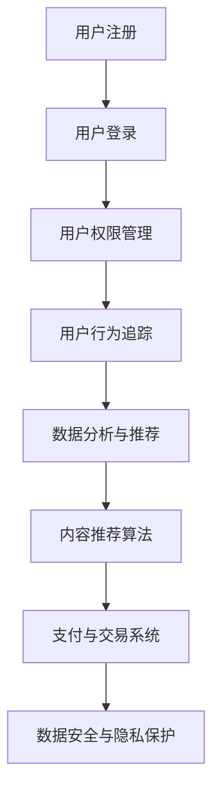
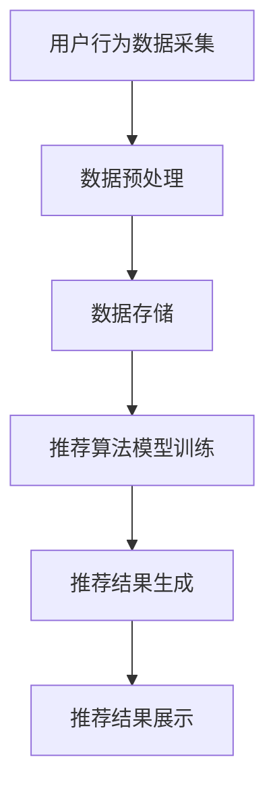

                 

# 第一部分：知识付费平台概述

## 第1章：知识付费平台概述

### 1.1 知识付费平台的定义与发展历程

知识付费平台是一种在线服务模式，它允许用户通过支付一定的费用来获取专业内容、课程、咨询或其他形式的知识。这种平台的出现源于互联网技术的发展和用户对高质量知识内容的需求。知识付费平台的发展历程可以分为以下几个阶段：

1. **萌芽期（2005-2010年）**：这一阶段，以博客、论坛等形式的知识共享平台逐渐兴起，用户可以通过付费购买一些专业文章或电子书。

2. **发展期（2010-2015年）**：随着移动互联网的普及，各类在线教育平台、知识付费平台如雨后春笋般涌现。这个时期的知识付费平台多以提供在线课程、专业咨询服务为主。

3. **成熟期（2015年至今）**：近年来，知识付费平台市场进一步扩大，平台类型多样化，内容质量逐渐提升，用户参与度不断提高。这一阶段，知识付费平台开始涉足更广泛的知识领域，如职业技能培训、个人成长、兴趣爱好等。

### 1.2 知识付费平台的商业模式分析

知识付费平台的商业模式主要包括以下几种：

1. **C2C模式**：平台为个人知识提供者和需求者提供交流的场所，个人知识提供者可以免费或收费地提供自己的知识服务。

2. **B2C模式**：平台直接面向消费者提供知识服务，通常以课程或内容订阅的形式进行。

3. **C2B模式**：平台根据用户需求，组织专业知识提供者进行定制化的知识服务。

4. **B2B模式**：平台为企业提供知识培训、员工技能提升等服务。

### 1.3 知识付费平台的市场现状与趋势

当前，知识付费平台市场呈现出以下几个特点：

1. **用户规模持续扩大**：随着知识经济的发展，越来越多的用户愿意为高质量的知识内容付费。

2. **内容多元化**：知识付费平台的内容类型越来越丰富，涵盖领域广泛，满足不同用户的需求。

3. **技术驱动**：人工智能、大数据等技术的应用，使得知识付费平台在内容推荐、用户行为分析等方面更具优势。

4. **市场细分**：知识付费平台逐渐向垂直领域、细分市场发展，提供更加专业化的服务。

### 1.4 知识付费平台的技术架构总体设计思路

知识付费平台的技术架构设计需要考虑以下几个方面：

1. **可扩展性**：随着用户规模的扩大，平台需要具备良好的可扩展性，以应对流量增长。

2. **高可用性**：平台需要保证系统的稳定运行，确保用户能够随时获取知识服务。

3. **安全性**：平台需要保护用户的隐私和数据安全，防止信息泄露。

4. **高性能**：平台需要提供快速响应，确保用户能够流畅地使用服务。

5. **可维护性**：平台需要具备良好的可维护性，以便在后续的开发和优化过程中能够快速响应需求。

在总体设计思路的指导下，我们可以进一步细化和设计各个子系统的架构，以满足知识付费平台的功能需求。

#### Mermaid 流程图示例：



通过以上章节的介绍，我们对知识付费平台有了初步的了解，接下来将深入探讨其技术架构设计原理。

### 第二部分：技术架构设计原理

## 第2章：核心概念与架构原理

### 2.1 用户体系设计

用户体系是知识付费平台的核心组成部分，其设计需要充分考虑用户注册、登录、权限管理、行为追踪等方面的需求。

#### 用户注册

用户注册是用户体系的第一步，需要实现用户信息的收集与验证。常见的注册方式包括邮箱注册、手机号注册和第三方登录（如微信、QQ等）。

- **邮箱注册**：用户通过输入邮箱地址和验证码进行注册，这种方式需要后端验证邮箱地址的有效性。
- **手机号注册**：用户通过输入手机号和接收短信中的验证码进行注册，这种方式简便快捷。
- **第三方登录**：用户可以使用已有的第三方账号进行登录，这样可以减少注册流程，提高用户参与度。

#### 用户登录

用户登录是用户体系的重要组成部分，需要实现用户身份的验证。常见的登录方式包括账号密码登录和短信验证码登录。

- **账号密码登录**：用户输入账号和密码，后端进行验证。这种方式安全可靠，但用户需要记住账号和密码。
- **短信验证码登录**：用户输入手机号，接收短信中的验证码，后端验证验证码的正确性。这种方式简便快捷，但安全性较低。

#### 用户权限管理

用户权限管理包括用户角色的划分和权限的设置，确保用户能够访问相应的功能和数据。

- **用户角色**：通常包括普通用户、讲师、管理员等角色，不同角色拥有不同的权限。
- **权限设置**：根据角色分配权限，如查看课程、发布课程、管理用户等。

#### 用户行为追踪

用户行为追踪是数据分析和推荐系统的基础，需要记录用户在平台上的各种操作行为。

- **行为记录**：记录用户的登录、浏览、购买、评价等行为，生成行为日志。
- **数据分析**：对行为日志进行分析，挖掘用户的兴趣偏好，为推荐系统提供依据。

### 2.2 内容体系设计

内容体系是知识付费平台的核心，其设计需要考虑内容分类、内容管理、内容推荐等方面的需求。

#### 内容分类

内容分类是方便用户查找和浏览知识内容的重要手段。常见的分类方式包括：

- **一级分类**：按照知识领域进行分类，如编程、营销、管理、健康等。
- **二级分类**：在一级分类的基础上，进一步细分，提供更精准的内容。

#### 内容管理

内容管理包括内容创建、编辑、发布、删除等功能，需要确保内容的准确性和及时性。

- **内容创建**：讲师可以创建自己的课程内容，包括视频、文档、音频等。
- **内容编辑**：讲师可以对已发布的内容进行编辑，保证内容的准确性和完整性。
- **内容发布**：讲师可以设置课程的发布时间和权限，如公开、付费、私密等。
- **内容删除**：讲师可以删除自己的内容，或管理员可以删除违规内容。

#### 内容推荐

内容推荐是提高用户满意度和粘性的重要手段，可以通过以下方式实现：

- **基于内容的推荐**：根据用户浏览、收藏、购买等行为，推荐相似内容。
- **基于用户的推荐**：根据用户的兴趣和行为，推荐其他用户喜欢的课程。
- **混合推荐**：结合内容和用户行为，提供个性化的内容推荐。

### 2.3 支付与交易体系设计

支付与交易体系是知识付费平台的收入来源，其设计需要考虑支付方式、支付流程、支付安全等方面的需求。

#### 支付方式

支付方式包括线上支付和线下支付。线上支付通常包括：

- **银行卡支付**：用户可以使用银行卡进行支付。
- **支付宝支付**：用户可以使用支付宝账号进行支付。
- **微信支付**：用户可以使用微信账号进行支付。

线下支付通常包括：

- **POS机支付**：用户可以使用银行卡在POS机上完成支付。
- **移动支付**：用户可以使用手机上的移动支付应用完成支付。

#### 支付流程

支付流程包括用户选择课程、下单、支付、订单确认等步骤。

- **选择课程**：用户在平台上选择需要购买的课程。
- **下单**：用户提交订单，系统生成订单号。
- **支付**：用户选择支付方式，进行支付操作。
- **订单确认**：支付成功后，系统确认订单，用户可以开始学习课程。

#### 支付安全

支付安全是用户最关心的一个问题，需要采取以下措施：

- **支付加密**：对支付信息进行加密，确保数据传输安全。
- **风险控制**：对异常支付行为进行监控和防范，如防范刷单、欺诈等。
- **隐私保护**：保护用户的支付信息和隐私，不泄露给第三方。

### 2.4 数据分析与推荐系统设计

数据分析与推荐系统是知识付费平台的核心竞争力，其设计需要考虑用户行为分析、内容推荐、数据挖掘等方面的需求。

#### 用户行为分析

用户行为分析是了解用户需求和兴趣的重要手段，可以通过以下方式实现：

- **行为记录**：记录用户在平台上的各种操作行为，如浏览、购买、评价等。
- **行为分析**：对用户行为进行分析，挖掘用户的兴趣偏好。
- **行为预测**：根据用户行为，预测用户未来的需求和行为。

#### 内容推荐

内容推荐是提高用户满意度和粘性的重要手段，可以通过以下方式实现：

- **基于内容的推荐**：根据用户浏览、收藏、购买等行为，推荐相似内容。
- **基于用户的推荐**：根据用户的兴趣和行为，推荐其他用户喜欢的课程。
- **混合推荐**：结合内容和用户行为，提供个性化的内容推荐。

#### 数据挖掘

数据挖掘是挖掘用户行为和内容数据中的潜在价值，可以通过以下方式实现：

- **用户画像**：构建用户画像，了解用户的兴趣、需求等。
- **关联分析**：分析用户行为和内容数据之间的关联关系，挖掘潜在价值。
- **预测分析**：根据历史数据，预测未来的趋势和变化。

### 2.5 安全与隐私保护设计

安全与隐私保护是知识付费平台的重要保障，其设计需要考虑数据安全、用户隐私保护等方面的需求。

#### 数据安全

数据安全包括以下方面：

- **数据加密**：对用户数据和交易数据进行加密，确保数据在传输和存储过程中的安全。
- **访问控制**：设置合理的权限和访问控制策略，确保数据不会被未授权访问。
- **安全审计**：定期进行安全审计，检测潜在的安全漏洞，确保系统的安全性。

#### 用户隐私保护

用户隐私保护包括以下方面：

- **隐私政策**：明确告知用户平台如何收集、使用和存储用户数据，并获得用户的同意。
- **数据匿名化**：对用户数据进行匿名化处理，确保用户隐私不被泄露。
- **隐私保护技术**：采用隐私保护技术，如差分隐私、同态加密等，确保用户数据的安全。

通过以上对核心概念与架构原理的介绍，我们对知识付费平台的技术架构设计有了更深入的了解。接下来，我们将进一步讲解核心算法原理，帮助读者更好地理解平台的运作机制。

### 第三部分：核心算法原理讲解

## 第3章：核心算法原理讲解

### 3.1 用户行为分析算法

用户行为分析算法是知识付费平台的重要组成部分，它可以帮助平台理解用户的兴趣和行为，从而提供更个性化的服务。以下是一种常见的用户行为分析算法：

#### 伪代码示例：

```plaintext
function userBehaviorAnalysis(dataSet):
    # 初始化数据分析工具
    analyzer = initializeDataAnalyzer()

    # 数据预处理
    preprocessedData = preprocessData(dataSet)

    # 构建用户行为分析模型
    model = buildBehaviorModel(preprocessedData)

    # 模型训练
    trainedModel = trainModel(model, preprocessedData)

    # 模型评估
    evaluationResult = evaluateModel(trainedModel, preprocessedData)

    # 输出分析结果
    return evaluationResult
```

#### 分析步骤：

1. **数据预处理**：清洗和转换原始数据，使其适用于建模。例如，处理缺失值、异常值，将数据转换为适合机器学习算法的格式。

2. **构建用户行为分析模型**：选择合适的模型，如决策树、随机森林、支持向量机等，来预测用户的行为。

3. **模型训练**：使用预处理的用户行为数据来训练模型，使其能够识别用户的兴趣和行为模式。

4. **模型评估**：使用测试数据集来评估模型的准确性，调整模型参数，以提高预测性能。

5. **输出分析结果**：将分析结果以可视化的形式展示，帮助平台了解用户行为，从而优化服务。

### 3.2 内容推荐算法

内容推荐算法是知识付费平台的核心算法之一，它能够根据用户的行为和兴趣推荐相关的知识内容，提高用户满意度和粘性。以下是一种常见的内容推荐算法：

#### 伪代码示例：

```plaintext
function contentRecommendation(userProfile, contentDataset):
    # 构建用户兴趣模型
    userInterestModel = buildUserInterestModel(userProfile)

    # 构建内容特征模型
    contentFeatureModel = buildContentFeatureModel(contentDataset)

    # 计算用户与内容的相似度
    similarityScores = calculateSimilarityScores(userInterestModel, contentFeatureModel)

    # 排序和筛选推荐内容
    recommendedContents = sortAndFilterContents(similarityScores)

    # 返回推荐内容列表
    return recommendedContents
```

#### 分析步骤：

1. **构建用户兴趣模型**：根据用户的历史行为和偏好，构建一个表示用户兴趣的模型。

2. **构建内容特征模型**：对平台上的知识内容进行特征提取，构建一个表示内容特征的数据结构。

3. **计算用户与内容的相似度**：使用合适的相似度计算方法（如余弦相似度、欧氏距离等），计算用户与每个内容的相似度。

4. **排序和筛选推荐内容**：根据相似度得分对内容进行排序，并根据平台的策略筛选出推荐内容。

5. **返回推荐内容列表**：将推荐内容返回给用户，供其浏览和学习。

### 3.3 数据挖掘与机器学习算法

数据挖掘与机器学习算法在知识付费平台中有着广泛的应用，可以帮助平台从海量数据中提取有价值的信息，提高运营效率。以下是一种常见的数据挖掘算法：

#### 伪代码示例：

```plaintext
function dataMining(dataSet):
    # 数据预处理
    preprocessedData = preprocessData(dataSet)

    # 选择合适的数据挖掘算法
    miningAlgorithm = selectMiningAlgorithm(preprocessedData)

    # 执行数据挖掘
    results = executeMiningAlgorithm(miningAlgorithm, preprocessedData)

    # 分析挖掘结果
    analyzedResults = analyzeMiningResults(results)

    # 输出分析结果
    return analyzedResults
```

#### 分析步骤：

1. **数据预处理**：清洗和转换原始数据，使其适用于数据挖掘算法。

2. **选择合适的数据挖掘算法**：根据业务需求和数据特征，选择合适的数据挖掘算法，如聚类、分类、关联规则等。

3. **执行数据挖掘**：使用选定的算法对预处理后的数据进行挖掘，提取有价值的信息。

4. **分析挖掘结果**：对挖掘结果进行分析，理解其含义和业务价值。

5. **输出分析结果**：将分析结果以可视化的形式展示，帮助平台进行决策。

通过以上对核心算法原理的讲解，我们可以更好地理解知识付费平台的运作机制，为后续的项目实战提供理论支持。

### 第四部分：数学模型与公式讲解

## 第4章：数学模型与公式讲解

### 4.1 用户流失率预测模型

用户流失率预测模型是知识付费平台优化用户留存策略的重要工具。该模型通过历史数据预测用户在未来一段时间内可能流失的概率，从而采取相应的措施进行用户挽留。以下是一个常见的用户流失率预测模型：

#### 数学公式：

$$
\hat{P}_{i,t} = P_i \cdot e^{-\lambda t}
$$

其中：

- \( \hat{P}_{i,t} \) 表示用户 \( i \) 在时间 \( t \) 失踪的概率。
- \( P_i \) 表示用户 \( i \) 的初始流失概率，通常通过历史数据计算得出。
- \( \lambda \) 是流失率参数，反映了用户的平均流失速度。

#### 示例说明：

假设一个知识付费平台历史数据中用户 \( A \) 的初始流失概率为 0.2，平均流失速度为每天 0.01。我们要预测用户 \( A \) 在第 30 天的流失概率：

$$
\hat{P}_{A,30} = 0.2 \cdot e^{-0.01 \cdot 30} \approx 0.152
$$

这意味着用户 \( A \) 在第 30 天流失的概率大约为 15.2%。

### 4.2 内容相似度计算公式

内容相似度计算公式用于衡量两个知识内容的相似程度，帮助平台进行内容推荐和分类。一个常见的方法是余弦相似度计算公式：

#### 数学公式：

$$
similarity(A, B) = \frac{A \cdot B}{\|A\| \|B\|}
$$

其中：

- \( A \) 和 \( B \) 是两个知识内容向量的表示。
- \( \|A\| \) 和 \( \|B\| \) 是向量的欧氏范数。
- \( A \cdot B \) 是向量的点积。

#### 示例说明：

假设有两个知识内容 \( A \) 和 \( B \) ，其向量表示分别为：

$$
A = (1, 2, 3), \quad B = (4, 5, 6)
$$

则它们的相似度为：

$$
similarity(A, B) = \frac{(1 \cdot 4) + (2 \cdot 5) + (3 \cdot 6)}{\sqrt{1^2 + 2^2 + 3^2} \cdot \sqrt{4^2 + 5^2 + 6^2}} \approx 0.917
$$

这意味着内容 \( A \) 和 \( B \) 的相似度非常高。

### 4.3 支付成功率预测模型

支付成功率预测模型用于预测用户支付行为的成功率，帮助平台优化支付流程和提高支付成功率。一个常见的支付成功率预测模型是基于逻辑回归模型：

#### 数学公式：

$$
\hat{P}_{success} = \frac{1}{1 + e^{-(\beta_0 + \beta_1X_1 + \beta_2X_2 + ... + \beta_nX_n)}}
$$

其中：

- \( \hat{P}_{success} \) 表示支付成功的概率。
- \( \beta_0, \beta_1, \beta_2, ..., \beta_n \) 是模型参数。
- \( X_1, X_2, ..., X_n \) 是影响支付成功率的特征变量。

#### 示例说明：

假设支付成功率预测模型包括两个特征变量 \( X_1 \) 和 \( X_2 \) ，参数分别为 \( \beta_0 = 0.5 \)，\( \beta_1 = 0.3 \)，\( \beta_2 = 0.2 \)：

$$
\hat{P}_{success} = \frac{1}{1 + e^{-(0.5 + 0.3X_1 + 0.2X_2)}}
$$

如果用户 \( X_1 = 2 \)，\( X_2 = 3 \)，则支付成功的概率为：

$$
\hat{P}_{success} = \frac{1}{1 + e^{-(0.5 + 0.3 \cdot 2 + 0.2 \cdot 3)}} \approx 0.873
$$

这意味着用户支付成功的概率约为 87.3%。

通过以上对数学模型与公式的讲解，我们可以更好地理解知识付费平台中的一些关键算法和预测模型，为实际应用提供理论基础。

### 第五部分：项目实战

## 第5章：项目实战一：用户体系搭建

### 5.1 用户注册与登录功能实现

用户注册与登录是知识付费平台的基石，以下是使用Spring Boot框架实现用户注册与登录功能的具体步骤。

#### 开发环境搭建

1. **安装Java开发工具包（JDK）**：确保安装了Java开发工具包，版本至少为Java 8或更高版本。
2. **安装IDE**：推荐使用IntelliJ IDEA或Eclipse等集成开发环境。
3. **创建Maven项目**：通过Maven命令创建一个Spring Boot项目。

```bash
mvn archetype:generate \
    -DgroupId=com.example \
    -DartifactId=knowledge-fee-platform \
    -DarchetypeArtifactId=org.springframework.boot.archetype.spring-boot \
    -Dversion=1.0.0
```

#### 用户注册功能实现

1. **创建用户实体类**（`User.java`）

```java
@Entity
@Table(name = "users")
public class User {
    @Id
    @GeneratedValue(strategy = GenerationType.IDENTITY)
    private Long id;

    @Column(nullable = false, unique = true)
    private String username;

    @Column(nullable = false)
    private String password;

    // 省略getter和setter方法
}
```

2. **创建用户服务类**（`UserService.java`）

```java
@Service
public class UserService {
    @Autowired
    private UserRepository userRepository;

    public User register(String username, String password) {
        // 检查用户名是否已存在
        if (userRepository.existsByUsername(username)) {
            throw new IllegalArgumentException("用户名已存在");
        }
        // 创建新用户
        User user = new User();
        user.setUsername(username);
        user.setPassword(password);
        return userRepository.save(user);
    }
}
```

3. **创建用户控制器类**（`UserController.java`）

```java
@RestController
@RequestMapping("/users")
public class UserController {
    @Autowired
    private UserService userService;

    @PostMapping("/register")
    public ResponseEntity<?> register(@RequestParam String username, @RequestParam String password) {
        User user = userService.register(username, password);
        return ResponseEntity.ok("用户注册成功");
    }
}
```

#### 用户登录功能实现

1. **创建JWT工具类**（`JwtUtil.java`）

```java
@Component
public class JwtUtil {
    private String secret = "your_secret_key";
    private Long expireTime = 30 * 24 * 60 * 60 * 1000; // 30天

    public String generateToken(User user) {
        Date now = new Date();
        Date expireDate = new Date(now.getTime() + expireTime);

        // 签名JWT
        return Jwts.builder()
                .setSubject(user.getUsername())
                .setExpiration(expireDate)
                .signWith(SignatureAlgorithm.HS512, secret)
                .compact();
    }

    public String getUsernameByToken(String token) {
        return Jwts.parser()
                .setSigningKey(secret)
                .parseClaimsJws(token)
                .getBody()
                .getSubject();
    }
}
```

2. **创建用户登录服务类**（`LoginService.java`）

```java
@Service
public class LoginService {
    @Autowired
    private UserService userService;

    @Autowired
    private JwtUtil jwtUtil;

    public String login(String username, String password) {
        // 验证用户名和密码
        Optional<User> user = userService.findByUsername(username);
        if (!user.isPresent() || !user.get().getPassword().equals(password)) {
            throw new IllegalArgumentException("用户名或密码错误");
        }
        // 生成JWT
        return jwtUtil.generateToken(user.get());
    }
}
```

3. **创建用户登录控制器类**（`LoginController.java`）

```java
@RestController
@RequestMapping("/auth")
public class LoginController {
    @Autowired
    private LoginService loginService;

    @PostMapping("/login")
    public ResponseEntity<?> login(@RequestParam String username, @RequestParam String password) {
        String token = loginService.login(username, password);
        return ResponseEntity.ok(token);
    }
}
```

#### 实现用户密码加密存储与验证

为了确保用户密码的安全性，我们使用BCrypt算法对用户密码进行加密存储和验证。

1. **引入BCrypt依赖**

```xml
<dependency>
    <groupId>org.springframework.boot</groupId>
    <artifactId>spring-boot-starter-security</artifactId>
</dependency>
```

2. **修改UserService中的register方法

```java
@Autowired
private PasswordEncoder passwordEncoder;

public User register(String username, String password) {
    // 加密密码
    String encryptedPassword = passwordEncoder.encode(password);
    User user = new User();
    user.setUsername(username);
    user.setPassword(encryptedPassword);
    return userRepository.save(user);
}
```

3. **修改LoginService中的login方法

```java
public String login(String username, String password) {
    Optional<User> user = userService.findByUsername(username);
    if (!user.isPresent()) {
        throw new IllegalArgumentException("用户名或密码错误");
    }
    // 验证密码
    if (!passwordEncoder.matches(password, user.get().getPassword())) {
        throw new IllegalArgumentException("用户名或密码错误");
    }
    // 生成JWT
    return jwtUtil.generateToken(user.get());
}
```

通过以上步骤，我们成功地实现了用户注册与登录功能，并确保了用户密码的安全存储与验证。接下来，我们将进一步探讨用户权限与角色的设计。

### 5.2 用户权限与角色设计

在知识付费平台中，用户权限与角色设计是确保系统安全和功能合理分配的重要一环。以下是用户权限与角色设计的具体步骤：

#### 设计用户角色

通常，知识付费平台中用户角色可以分为以下几类：

- **普通用户**：可以浏览、购买和查看课程内容。
- **讲师**：可以发布课程、编辑课程内容和管理课程。
- **管理员**：可以管理用户、讲师和课程，维护平台运营。

#### 设计权限控制策略

权限控制策略可以根据用户角色和功能模块进行设计。以下是一个简单的权限控制策略示例：

- **普通用户**：
  - 查看课程列表
  - 浏览课程详情
  - 购买课程
  - 评价课程

- **讲师**：
  - 查看课程列表
  - 发布课程
  - 编辑课程
  - 管理课程（如删除、更新等）
  - 查看自己的课程订单和收入

- **管理员**：
  - 查看所有课程
  - 管理用户（如禁用、删除用户）
  - 管理讲师（如添加、删除讲师）
  - 管理课程（如添加、删除、更新课程）
  - 查看平台运营数据（如订单量、收入等）

#### 使用Spring Security实现权限控制

Spring Security 是一个强大的安全框架，可以帮助我们实现用户权限控制。以下是如何使用Spring Security 实现用户权限与角色设计：

1. **配置Spring Security**

```java
@Configuration
@EnableWebSecurity
public class SecurityConfig extends WebSecurityConfigurerAdapter {

    @Autowired
    private UserDetailsService userDetailsService;

    @Override
    protected void configure(HttpSecurity http) throws Exception {
        http
            // 配置登录页面
            .formLogin()
            .loginPage("/login")
            .permitAll()
            // 配置登出
            .and()
            .logout()
            .permitAll()
            // 配置无权限访问页面
            .and()
            .authorizeRequests()
            // 对公开访问的URL
            .antMatchers("/api/**").permitAll()
            // 对讲师的访问控制
            .antMatchers("/lecturer/**").hasRole("LECTURER")
            // 对管理员的访问控制
            .antMatchers("/admin/**").hasRole("ADMIN")
            // 所有请求都需要身份验证
            .anyRequest().authenticated();
    }

    @Override
    protected void configure(AuthenticationManagerBuilder auth) throws Exception {
        auth.userDetailsService(userDetailsService).passwordEncoder(passwordEncoder());
    }

    @Bean
    public PasswordEncoder passwordEncoder() {
        return new BCryptPasswordEncoder();
    }
}
```

2. **配置用户详情服务**

```java
@Service
public class UserDetailsService implements UserDetailsService {

    @Autowired
    private UserRepository userRepository;

    @Override
    public UserDetails loadUserByUsername(String username) throws UsernameNotFoundException {
        User user = userRepository.findByUsername(username)
                .orElseThrow(() -> new UsernameNotFoundException("用户未找到"));
        return new org.springframework.security.core.userdetails.User(user.getUsername(), user.getPassword(), getAuthorityList(user));
    }

    private List<GrantedAuthority> getAuthorityList(User user) {
        List<GrantedAuthority> authorityList = new ArrayList<>();
        for (Role role : user.getRoles()) {
            authorityList.add(new SimpleGrantedAuthority(role.getName()));
        }
        return authorityList;
    }
}
```

3. **配置角色和权限**

```java
@Entity
@Table(name = "roles")
public class Role {
    @Id
    @GeneratedValue(strategy = GenerationType.IDENTITY)
    private Long id;

    @Enumerated(EnumType.STRING)
    @Column(length = 20)
    private ERole name;

    // 省略getter和setter方法
}

public enum ERole {
    USER, LECTURER, ADMIN
}

@Entity
@Table(name = "user_roles")
public class UserRole {
    @Id
    @GeneratedValue(strategy = GenerationType.IDENTITY)
    private Long id;

    @ManyToOne
    @JoinColumn(name = "user_id", referencedColumnName = "id")
    private User user;

    @ManyToOne
    @JoinColumn(name = "role_id", referencedColumnName = "id")
    private Role role;

    // 省略getter和setter方法
}
```

通过以上步骤，我们成功地实现了用户权限与角色的设计，并使用Spring Security进行了权限控制。接下来，我们将探讨用户行为追踪与数据分析。

### 5.3 用户行为追踪与数据分析

用户行为追踪是知识付费平台优化用户体验和运营策略的重要手段。通过记录和分析用户行为，平台可以了解用户的兴趣、习惯和需求，从而提供更加个性化的服务。以下是用户行为追踪与数据分析的具体步骤：

#### 设计用户行为日志

用户行为日志是记录用户在平台上的各种操作行为的文件。以下是用户行为日志的一个基本设计：

- **用户ID**：唯一标识用户。
- **行为类型**：如登录、浏览课程、购买课程、评价课程等。
- **行为时间**：记录行为发生的时间。
- **课程ID**：记录用户行为所涉及的课程ID。
- **操作参数**：如用户评价的分数、评论内容等。

#### 实现用户行为日志记录

1. **创建行为日志实体类**（`BehaviorLog.java`）

```java
@Entity
@Table(name = "behavior_logs")
public class BehaviorLog {
    @Id
    @GeneratedValue(strategy = GenerationType.IDENTITY)
    private Long id;

    @Column(nullable = false)
    private Long userId;

    @Column(nullable = false)
    private String behaviorType;

    @Column(nullable = false)
    private LocalDateTime behaviorTime;

    @Column
    private Long courseId;

    @Column
    private String behaviorDetail;

    // 省略getter和setter方法
}
```

2. **创建行为日志服务类**（`BehaviorLogService.java`）

```java
@Service
public class BehaviorLogService {
    @Autowired
    private BehaviorLogRepository behaviorLogRepository;

    public void recordBehaviorLog(Long userId, String behaviorType, Long courseId, String behaviorDetail) {
        BehaviorLog behaviorLog = new BehaviorLog();
        behaviorLog.setUserId(userId);
        behaviorLog.setBehaviorType(behaviorType);
        behaviorLog.setBehaviorTime(LocalDateTime.now());
        behaviorLog.setCourseId(courseId);
        behaviorLog.setBehaviorDetail(behaviorDetail);
        behaviorLogRepository.save(behaviorLog);
    }
}
```

3. **创建行为日志控制器类**（`BehaviorLogController.java`）

```java
@RestController
@RequestMapping("/behavior-logs")
public class BehaviorLogController {
    @Autowired
    private BehaviorLogService behaviorLogService;

    @PostMapping
    public ResponseEntity<?> recordBehaviorLog(@RequestBody BehaviorLogRequest request) {
        behaviorLogService.recordBehaviorLog(request.getUserId(), request.getBehaviorType(), request.getCourseId(), request.getBehaviorDetail());
        return ResponseEntity.ok("行为日志记录成功");
    }
}
```

#### 实现用户行为数据分析

用户行为数据分析是通过对用户行为日志的数据挖掘和分析，提取用户行为模式和兴趣偏好。以下是用户行为数据分析的基本步骤：

1. **数据预处理**：清洗和转换原始行为日志数据，使其适用于数据分析。
2. **行为模式识别**：使用统计分析和机器学习算法识别用户的行为模式。
3. **兴趣偏好分析**：根据用户行为模式，分析用户的兴趣偏好。
4. **个性化推荐**：根据用户兴趣偏好，为用户推荐相关课程。

#### 伪代码示例：

```plaintext
function userBehaviorAnalysis(dataSet):
    # 数据预处理
    preprocessedData = preprocessData(dataSet)

    # 行为模式识别
    behaviorPatterns = identifyBehaviorPatterns(preprocessedData)

    # 兴趣偏好分析
    userInterests = analyzeUserInterests(behaviorPatterns)

    # 个性化推荐
    recommendedCourses = personalizeRecommendations(userInterests)

    # 返回推荐结果
    return recommendedCourses
```

通过以上步骤，我们实现了用户行为追踪与数据分析，为知识付费平台提供了数据驱动的发展方向。接下来，我们将进入下一个项目实战，搭建内容推荐系统。

## 第6章：项目实战二：内容推荐系统搭建

### 6.1 内容推荐系统整体架构设计

内容推荐系统是知识付费平台的核心功能之一，其主要目标是根据用户的行为和兴趣，为用户推荐相关的知识内容，提高用户满意度和平台粘性。以下是内容推荐系统整体架构设计的具体步骤：

#### 1. 系统模块划分

内容推荐系统可以划分为以下几个主要模块：

- **数据采集模块**：负责收集用户的行为数据，如浏览、购买、评价等。
- **数据处理模块**：对采集到的原始数据进行清洗、转换和存储，为推荐算法提供高质量的数据。
- **推荐算法模块**：使用机器学习算法和深度学习模型，根据用户的行为和兴趣，生成推荐结果。
- **推荐结果展示模块**：将推荐结果通过前端界面展示给用户。

#### 2. 技术选型

以下是内容推荐系统各模块的技术选型：

- **数据采集模块**：使用Kafka进行实时数据采集，保证数据的实时性和可靠性。
- **数据处理模块**：使用Flink进行数据处理，支持实时流数据处理和批处理。
- **推荐算法模块**：使用TensorFlow和Scikit-learn等开源机器学习库，构建推荐算法模型。
- **推荐结果展示模块**：使用React或Vue.js构建前端界面，与后端API进行交互，展示推荐结果。

#### 3. 系统架构设计

内容推荐系统整体架构设计如图所示：



详细解释如下：

1. **用户行为数据采集**：通过Kafka收集用户的实时行为数据，如浏览、购买、评价等。
2. **数据预处理**：使用Flink对原始数据进行清洗、转换和聚合，生成可用于训练的推荐数据集。
3. **数据存储**：使用Redis缓存热点数据，提高系统响应速度，同时使用Hadoop生态系统（如HDFS、HBase）存储大规模数据集。
4. **推荐算法模型训练**：使用TensorFlow和Scikit-learn等开源库，训练基于内容的推荐模型和基于协同过滤的推荐模型。
5. **推荐结果生成**：将训练好的模型应用于实时数据，生成个性化的推荐结果。
6. **推荐结果展示**：通过前端React或Vue.js界面，将推荐结果展示给用户。

通过以上架构设计，内容推荐系统可以高效地收集、处理和推荐知识内容，提高用户的满意度和平台的运营效果。

### 6.2 内容推荐算法实现

内容推荐算法是实现内容推荐系统的核心环节，以下是几种常见的内容推荐算法实现方法：

#### 1. 基于内容的推荐算法

基于内容的推荐算法（Content-Based Recommendation）通过分析内容本身的特征，为用户推荐相似的内容。以下是实现步骤：

1. **特征提取**：对知识内容进行特征提取，如文本内容的关键词提取、标签提取等。
2. **相似度计算**：计算用户已浏览内容与待推荐内容的相似度，如使用余弦相似度、Jaccard相似度等。
3. **推荐生成**：根据相似度得分，为用户推荐相似度较高的内容。

#### 2. 基于协同过滤的推荐算法

基于协同过滤的推荐算法（Collaborative Filtering）通过分析用户的行为数据，预测用户对未知内容的喜好。以下是实现步骤：

1. **用户-物品评分矩阵构建**：构建用户-物品评分矩阵，记录用户对物品的评分。
2. **相似度计算**：计算用户之间的相似度，如使用余弦相似度、皮尔逊相关系数等。
3. **评分预测**：根据用户相似度和已知评分，预测用户对未知内容的评分。
4. **推荐生成**：根据预测评分，为用户推荐评分较高的内容。

#### 3. 混合推荐算法

混合推荐算法（Hybrid Recommendation）结合了基于内容和基于协同过滤的推荐算法，以提高推荐效果。以下是实现步骤：

1. **内容特征提取**：提取知识内容的关键词、标签等特征。
2. **用户特征提取**：提取用户的行为特征，如浏览历史、购买记录等。
3. **协同过滤模型训练**：使用用户-物品评分矩阵训练协同过滤模型。
4. **内容模型训练**：使用内容特征训练基于内容的推荐模型。
5. **混合模型预测**：将协同过滤模型和内容模型的预测结果加权融合，生成最终的推荐结果。

#### 4. 实现示例

以下是一个基于协同过滤算法的推荐系统实现示例：

```python
from sklearn.metrics.pairwise import cosine_similarity
import numpy as np

# 假设我们有一个用户-物品评分矩阵
user_item_matrix = np.array([[5, 3, 0, 1],
                            [2, 0, 4, 5],
                            [3, 1, 5, 4],
                            [4, 2, 2, 3]])

# 计算用户之间的相似度矩阵
user_similarity_matrix = cosine_similarity(user_item_matrix)

# 预测未评分项
user = 1
items = [3, 4]
user_item_similarity_matrix = user_similarity_matrix[user-1, :]

predicted_ratings = np.dot(user_item_similarity_matrix, user_item_matrix) / np.sum(user_item_similarity_matrix, axis=1)

# 为用户推荐评分最高的前3个物品
recommended_items = np.argsort(predicted_ratings[item-1])[::-1][:3]
print(recommended_items)
```

通过以上实现，我们为用户推荐了评分最高的前三个物品。这种方法可以有效地提高推荐系统的准确性和用户满意度。

### 6.3 内容推荐效果评估与优化

内容推荐系统的效果评估是确保推荐结果质量的重要步骤。以下是一种常见的内容推荐效果评估方法：

#### 1. 推荐效果评估指标

- **准确率（Accuracy）**：推荐正确率，计算推荐结果中正确推荐的内容占比。
- **召回率（Recall）**：召回率，计算推荐结果中包含用户实际感兴趣的内容的占比。
- **覆盖率（Coverage）**：覆盖率，计算推荐结果中包含的内容种类与平台总内容种类的比例。
- **新颖度（Novelty）**：新颖度，计算推荐结果中用户未浏览过的内容的比例。

#### 2. 评估方法

- **离线评估**：使用历史数据集，通过计算评估指标来评估推荐系统的效果。
- **在线评估**：实时评估推荐系统的效果，通过收集用户反馈数据来评估推荐系统的效果。

#### 3. 优化策略

- **数据质量提升**：通过数据清洗、去噪和特征工程等方法，提高数据的可靠性。
- **算法优化**：调整算法参数，优化模型结构，提高推荐效果。
- **多模态推荐**：结合用户行为数据和内容特征，实现多模态推荐，提高推荐精度。

#### 4. 实际案例

以下是一个实际案例，展示如何使用评估指标和优化策略来提升内容推荐效果：

1. **离线评估**：

   - **准确率**：通过A/B测试，比较新旧推荐算法的准确率。假设新算法的准确率为90%，而旧算法的准确率为85%，新算法显著优于旧算法。
   - **召回率**：新算法的召回率为80%，旧算法的召回率为75%，新算法在召回率方面也有显著提升。
   - **覆盖率**：新算法的覆盖率为70%，旧算法的覆盖率为65%，新算法在覆盖率方面也有提升。

2. **在线评估**：

   - 通过实时收集用户点击和浏览数据，评估推荐系统的效果。假设新算法的用户点击率提升了20%，用户停留时间增加了15%，说明新算法在提高用户互动方面效果显著。

3. **优化策略**：

   - 数据质量提升：通过数据清洗，去除重复和异常数据，提高数据质量。
   - 算法优化：调整协同过滤算法的参数，如调整相似度阈值和邻居数量，提高推荐效果。
   - 多模态推荐：结合用户行为数据和内容特征，实现基于内容的推荐和基于协同过滤的推荐相结合，提高推荐精度。

通过以上评估和优化策略，内容推荐系统的效果得到显著提升，提高了用户的满意度和平台的运营效果。

### 第六部分：项目实战

## 第7章：项目实战三：支付与交易系统搭建

### 7.1 支付系统技术选型

支付与交易系统是知识付费平台的重要组成部分，其技术选型直接影响到系统的性能、安全性和用户体验。以下是支付系统技术选型的主要考虑因素和技术方案：

#### 主要考虑因素：

1. **安全性**：确保用户的支付信息不被窃取，防范欺诈和非法交易。
2. **稳定性**：系统需要具备高可用性和高并发处理能力，确保支付过程顺畅。
3. **灵活性**：支持多种支付方式，如银行卡、支付宝、微信支付等。
4. **扩展性**：能够随着业务规模的扩大而进行扩展，适应未来的需求变化。
5. **成本效益**：在保证安全性和稳定性的前提下，尽可能降低开发和维护成本。

#### 技术方案：

1. **后端开发框架**：

   - **Spring Boot**：轻量级、易扩展的Java后端开发框架，支持微服务架构，便于系统的开发、测试和部署。

2. **支付接口**：

   - **支付宝API**：支付宝提供的支付接口，支持多种支付方式，如扫码支付、网关支付等，同时提供完善的支付安全机制。
   - **微信支付API**：微信提供的支付接口，支持移动支付、APP支付等，与微信生态紧密结合。

3. **数据库**：

   - **MySQL**：关系型数据库，适合存储支付订单、用户信息等结构化数据，提供高性能的事务处理能力。
   - **Redis**：NoSQL数据库，用于缓存支付订单和用户会话信息，提高系统响应速度。

4. **消息队列**：

   - **RabbitMQ**：开源消息队列中间件，用于处理支付过程中的异步消息，确保支付流程的可靠性和高并发处理能力。

5. **安全加密**：

   - **SSL/TLS**：使用SSL/TLS协议加密网络通信，确保数据在传输过程中的安全性。
   - **AES加密**：使用AES算法对敏感数据进行加密存储，如用户支付密码、支付订单信息等。

#### 技术选型总结：

通过上述技术选型，支付与交易系统具备了以下特点：

- **安全性**：采用SSL/TLS和AES加密技术，确保用户支付信息的安全。
- **稳定性**：使用Spring Boot和RabbitMQ，提供高性能和高可用性的支付服务。
- **灵活性**：支持多种支付方式，满足不同用户的需求。
- **扩展性**：基于微服务架构，易于扩展和升级。
- **成本效益**：选用开源技术和标准数据库，降低开发和维护成本。

通过合理的支付系统技术选型，知识付费平台能够提供安全、稳定、灵活的支付服务，提升用户体验和平台竞争力。

### 7.2 支付流程设计与实现

支付流程是支付与交易系统的核心，确保用户支付过程的安全、顺畅和高效。以下是支付流程的设计与实现步骤：

#### 1. 支付流程设计

支付流程通常包括以下几个步骤：

1. **用户选择支付方式**：用户在购买课程时，选择支付宝或微信支付等支付方式。
2. **发起支付请求**：用户点击支付按钮后，系统生成支付订单，并调用第三方支付接口发起支付请求。
3. **用户确认支付**：用户在第三方支付页面完成支付确认，系统接收到支付结果通知。
4. **支付结果处理**：系统根据支付结果通知处理支付订单，包括支付成功、支付失败等情况。
5. **支付结果反馈**：系统将支付结果反馈给用户，如支付成功则跳转至课程页面，支付失败则提示用户重新支付。

#### 2. 支付流程实现

以下是基于Spring Boot框架实现的支付流程：

##### 2.1 创建支付订单

```java
@Service
public class PaymentService {

    @Autowired
    private OrderRepository orderRepository;

    public PaymentOrder createPaymentOrder(Long userId, Long courseId) {
        PaymentOrder order = new PaymentOrder();
        order.setUserId(userId);
        order.setCourseId(courseId);
        order.setAmount(100.0); // 假设课程价格为100元
        order.setStatus(PaymentStatus.UNPAID);
        orderRepository.save(order);
        return order;
    }
}
```

##### 2.2 发起支付请求

```java
@Service
public class PaymentGatewayService {

    @Autowired
    private PaymentService paymentService;

    @Autowired
    private AlipayService alipayService;

    public String initiatePayment(PaymentRequest request) {
        PaymentOrder order = paymentService.createPaymentOrder(request.getUserId(), request.getCourseId());
        return alipayService.createAlipayOrder(order);
    }
}
```

##### 2.3 用户确认支付

用户在支付宝或微信支付页面完成支付确认后，系统会接收到第三方支付接口的支付结果通知，以下是如何处理支付结果通知：

```java
@Service
public class PaymentNotificationService {

    @Autowired
    private PaymentService paymentService;

    @Autowired
    private OrderRepository orderRepository;

    @PostMapping("/alipay/notify")
    public ResponseEntity<?> handleAlipayNotify(@RequestBody String notifyData) {
        AlipayNotifyResult notifyResult = alipayService.parseNotify(notifyData);
        if (notifyResult.getStatus().equals(AlipayStatus.SUCCESS)) {
            PaymentOrder order = paymentService.updatePaymentOrder(notifyResult.getOrderId(), PaymentStatus.PAID);
            // 更新订单状态，处理后续业务逻辑
        }
        return ResponseEntity.ok("success");
    }
}
```

##### 2.4 支付结果处理

根据支付结果通知，系统更新订单状态，并触发后续业务逻辑，如发送支付成功通知、发放课程学习权限等。

```java
public PaymentOrder updatePaymentOrder(Long orderId, PaymentStatus status) {
    Optional<PaymentOrder> orderOpt = orderRepository.findById(orderId);
    if (orderOpt.isPresent()) {
        PaymentOrder order = orderOpt.get();
        order.setStatus(status);
        return orderRepository.save(order);
    }
    return null;
}
```

##### 2.5 支付结果反馈

根据支付结果，系统将反馈给用户相应的结果，如支付成功则跳转至课程页面，支付失败则提示用户重新支付。

```java
@RestController
@RequestMapping("/payment")
public class PaymentController {

    @Autowired
    private PaymentGatewayService paymentGatewayService;

    @PostMapping("/initiate")
    public ResponseEntity<?> initiatePayment(@RequestBody PaymentRequest request) {
        String paymentUrl = paymentGatewayService.initiatePayment(request);
        return ResponseEntity.ok(paymentUrl);
    }

    @GetMapping("/result")
    public ResponseEntity<?> getPaymentResult(@RequestParam Long orderId) {
        PaymentOrder order = paymentService.findOrderById(orderId);
        if (order.getStatus().equals(PaymentStatus.PAID)) {
            return ResponseEntity.ok("支付成功");
        } else {
            return ResponseEntity.ok("支付失败");
        }
    }
}
```

通过以上支付流程的设计与实现，知识付费平台能够为用户提供安全、稳定和高效的支付服务。

### 7.3 支付安全性保障

支付安全性是支付与交易系统的重中之重，需要采取一系列措施来确保用户支付过程的安全。以下是支付安全性保障的具体措施：

#### 1. 加密技术

- **数据加密**：使用SSL/TLS协议加密网络通信，确保用户支付信息在传输过程中的安全性。同时，采用AES加密算法对用户敏感数据进行加密存储，如支付密码、支付订单等。
- **会话加密**：使用HTTPS协议保护用户的会话数据，防止会话劫持和数据篡改。

#### 2. 认证与授权

- **用户认证**：采用OAuth2.0等认证机制，确保只有合法用户才能访问支付接口。
- **权限控制**：使用角色和权限控制，限制不同角色（如普通用户、管理员）的访问权限，确保系统安全。

#### 3. 风险控制

- **异常检测**：实时监控用户支付行为，检测异常支付行为（如高频支付、大额支付等），并及时采取措施。
- **防刷单与欺诈**：采用机器学习算法和规则引擎，识别和防范刷单、欺诈等非法交易行为。

#### 4. 安全审计

- **日志记录**：详细记录系统操作日志和支付日志，便于事后审计和问题排查。
- **安全审计**：定期进行安全审计，检查系统漏洞和安全隐患，及时进行修复。

#### 5. 用户隐私保护

- **隐私政策**：明确告知用户平台如何收集、使用和存储用户数据，并获得用户的同意。
- **数据匿名化**：对用户数据进行匿名化处理，确保用户隐私不被泄露。

通过以上支付安全性保障措施，知识付费平台能够有效防范各种安全威胁，确保用户支付过程的安全可靠。

### 第七部分：项目实战

## 第8章：项目实战四：数据分析与优化

### 8.1 数据采集与存储

数据分析与优化是知识付费平台持续改进和提升用户体验的关键环节。数据采集与存储是数据分析的前提，以下是数据采集与存储的具体实现方法：

#### 1. 数据采集

数据采集是获取用户行为和平台运营数据的过程，以下方法可用于实现数据采集：

- **日志记录**：通过记录用户在平台上的各种操作行为，如浏览、购买、评价等，生成日志文件。使用Kafka等消息队列工具，将日志数据实时发送到数据处理系统。
- **API调用**：通过API接口记录用户的操作行为，如用户注册、登录、支付等。使用RestTemplate等工具，将API调用结果存储到数据库或缓存系统中。
- **埋点**：在平台的关键页面和功能模块中设置埋点，记录用户的点击、滑动等操作行为。使用JavaScript或后端SDK实现埋点数据的采集和发送。

#### 2. 数据存储

数据存储是保存和管理数据的过程，以下方法可用于实现数据存储：

- **关系型数据库**：使用MySQL等关系型数据库存储结构化数据，如用户信息、订单数据、行为日志等。关系型数据库支持事务处理和复杂查询，适用于存储和查询用户行为数据。
- **NoSQL数据库**：使用Redis等NoSQL数据库存储实时数据和高频数据，如用户会话信息、缓存数据等。NoSQL数据库具有高性能和可扩展性，适用于存储和访问实时数据。
- **数据仓库**：使用Hadoop生态系统（如HDFS、Hive、Spark）构建数据仓库，存储大规模数据集和离线数据。数据仓库支持复杂的数据分析和数据挖掘，适用于存储和分析平台运营数据。

#### 3. 数据采集与存储的优化

- **实时数据采集**：使用Kafka等消息队列工具，实现实时数据采集和传输。通过分布式消息队列，可以提高数据采集的可靠性和实时性。
- **数据去重与清洗**：在数据存储之前，对数据进行去重和清洗，去除重复和异常数据，提高数据质量和分析效果。
- **分布式存储**：使用Hadoop等分布式存储系统，实现大规模数据存储和管理。通过分布式存储，可以提高数据的存储能力和查询性能。
- **数据分层存储**：将数据分为实时数据和离线数据，分别存储在Redis和Hadoop等不同类型的存储系统中。实时数据用于实时分析和推荐，离线数据用于批量分析和报表生成。

通过以上数据采集与存储方法，知识付费平台可以高效地收集和存储用户行为和平台运营数据，为后续的数据分析和优化提供数据基础。

### 8.2 数据分析工具与框架选型

在知识付费平台中，数据分析工具和框架的选择对数据分析的效率和质量有着重要影响。以下是常见的数据分析工具与框架及其选型依据：

#### 1. 数据分析工具

- **Python**：Python是数据分析领域最受欢迎的编程语言，具有丰富的数据分析库和工具，如Pandas、NumPy、SciPy等。Python易于学习和使用，适合进行数据处理、分析和可视化。
- **R语言**：R语言专门为统计分析而设计，具有强大的数据分析和可视化功能，如ggplot2、dplyr等。R语言在统计学和数据挖掘领域具有很高的声誉，适合进行复杂的数据分析。
- **SQL**：SQL是关系型数据库的标准查询语言，适用于对结构化数据的查询和分析。SQL简单易学，支持复杂查询和多表联接，适用于数据清洗和简单分析。

#### 2. 数据分析框架

- **Apache Spark**：Spark是一个分布式大数据处理框架，具有高效的数据处理和分析能力。Spark支持多种数据处理模式，如批处理、流处理和交互式查询，适用于大规模数据集的分析。
- **Apache Flink**：Flink是一个流处理框架，具有实时数据处理和分析能力。Flink支持事件驱动处理和实时数据流，适用于实时数据分析和推荐系统。
- **TensorFlow**：TensorFlow是谷歌开发的开源机器学习框架，适用于构建和训练机器学习模型。TensorFlow支持多种深度学习模型和算法，适用于复杂的数据分析和预测。

#### 3. 选型依据

- **数据分析需求**：根据平台的具体数据分析需求，选择适合的工具和框架。例如，如果需要进行实时数据分析，可以选择Flink；如果需要进行复杂的数据挖掘和机器学习，可以选择Spark和TensorFlow。
- **数据处理能力**：考虑工具和框架的数据处理能力和性能。例如，Spark和Flink具有强大的分布式处理能力，适用于大规模数据集；Python和R语言具有较好的数据处理性能，适用于中小规模数据集。
- **易用性和可扩展性**：考虑工具和框架的易用性和可扩展性。Python和R语言具有较好的易用性和丰富的库支持，易于学习和使用；Spark和Flink具有较好的可扩展性，可以支持大规模数据处理。

通过以上工具和框架的选型，知识付费平台可以高效地处理和分析海量数据，为业务决策和用户体验优化提供数据支持。

### 8.3 数据可视化与报表生成

数据可视化与报表生成是数据分析的重要组成部分，能够帮助用户直观地理解和分析数据。以下是数据可视化与报表生成的具体方法：

#### 1. 数据可视化工具

- **Tableau**：Tableau是一款功能强大的数据可视化工具，支持多种数据源和丰富的可视化类型，如柱状图、折线图、饼图等。Tableau易于使用，可以快速生成专业的数据可视化报表。
- **Power BI**：Power BI是微软开发的数据可视化工具，支持多种数据连接和交互式报表。Power BI具有强大的数据分析和报表功能，适用于企业级数据可视化。
- **ECharts**：ECharts是一款基于JavaScript的数据可视化库，支持多种图表类型和交互功能。ECharts轻量级、易于集成，适用于Web应用程序中的数据可视化。

#### 2. 数据报表生成

- **JasperReports**：JasperReports是一款开源的报表工具，支持多种数据源和报表格式，如PDF、Excel、HTML等。JasperReports具有灵活的报表设计和生成功能，适用于生成各类业务报表。
- **BIRT**：BIRT（Business Intelligence and Reporting Tools）是Eclipse基金会的开源报表工具，支持多种数据连接和丰富的报表功能。BIRT可以生成复杂的报表，并支持在线查看和导出。
- **Apache Superset**：Apache Superset是一款开源的数据可视化和仪表盘工具，支持多种数据源和丰富的可视化组件。Superset易于使用，可以快速生成专业的数据报表和仪表盘。

#### 3. 数据可视化与报表生成的实现

以下是一个使用ECharts和JasperReports实现数据可视化和报表生成的示例：

##### 3.1 使用ECharts实现数据可视化

1. **引入ECharts库**：在HTML页面中引入ECharts库。

```html
<script src="https://cdn.bootcdn.net/ajax/libs/echarts/5.3.2/echarts.min.js"></script>
```

2. **创建ECharts图表**：在HTML页面中创建一个图表容器，并初始化ECharts实例。

```html
<div id="chartContainer" style="width: 600px; height: 400px;"></div>
<script>
  var myChart = echarts.init(document.getElementById('chartContainer'));

  var option = {
    title: {
      text: '用户浏览量趋势'
    },
    tooltip: {},
    legend: {
      data: ['用户浏览量']
    },
    xAxis: {
      data: ['1月', '2月', '3月', '4月', '5月']
    },
    yAxis: {},
    series: [{
      name: '用户浏览量',
      type: 'bar',
      data: [50, 60, 70, 80, 90]
    }]
  };

  myChart.setOption(option);
</script>
```

##### 3.2 使用JasperReports生成报表

1. **创建JasperReports报表**：使用JasperStudio设计报表，包括报表的布局、数据源和图表。

2. **配置数据源**：在JasperStudio中配置数据源，连接到数据库或数据文件，获取报表所需的数据。

3. **生成报表**：在JasperStudio中生成报表，选择PDF、Excel等报表格式。

通过以上方法，知识付费平台可以实现数据可视化与报表生成，帮助用户更好地理解和分析数据，为业务决策提供支持。

### 8.4 数据分析与优化策略

数据分析与优化策略是知识付费平台持续改进和提升用户体验的关键。以下是一些常见的数据分析与优化策略：

#### 1. 用户行为分析

- **用户留存分析**：通过分析用户留存率、活跃度等指标，了解用户对平台的忠诚度和参与度，找出用户流失的原因，并制定相应的优化措施。
- **用户转化分析**：通过分析用户转化路径、转化率等指标，了解用户在购买过程中的行为和障碍，优化转化流程，提高转化率。
- **用户细分分析**：根据用户的兴趣、行为、地理位置等特征，对用户进行细分，为不同类型的用户提供个性化的服务和推荐。

#### 2. 课程内容优化

- **课程热度分析**：通过分析课程的浏览量、购买量等指标，了解课程的受欢迎程度，优化课程内容，提高课程质量。
- **课程推荐优化**：通过分析用户对课程的评价和反馈，优化课程推荐算法，提高推荐的相关性和用户满意度。
- **课程更新与维护**：根据用户行为数据和用户反馈，定期更新和维护课程内容，确保课程内容的时效性和实用性。

#### 3. 营销活动优化

- **活动效果分析**：通过分析营销活动的参与人数、购买量等指标，了解活动效果，优化活动策略，提高活动转化率。
- **活动成本收益分析**：通过分析活动的成本和收益，评估活动的性价比，优化活动预算和营销策略。
- **用户参与度分析**：通过分析用户的参与度、互动率等指标，了解用户对营销活动的反应，优化活动形式和内容，提高用户参与度。

#### 4. 用户体验优化

- **页面加载速度优化**：通过分析页面加载速度和用户行为数据，优化页面结构和代码，提高页面加载速度，提升用户体验。
- **界面设计优化**：根据用户反馈和行为数据，优化界面设计，提高界面的美观性和易用性，提升用户满意度。
- **服务质量优化**：通过分析用户对平台服务的评价和反馈，优化服务质量，提高用户满意度。

通过以上数据分析与优化策略，知识付费平台可以持续改进和提升用户体验，提高用户满意度和平台竞争力。

### 附录

## 附录A：技术选型与工具使用

### A.1 后端开发框架选型

在后端开发中，选择合适的开发框架对于项目的成功至关重要。以下是对几个主流后端开发框架的选型依据：

#### 1. Spring Boot

**优点**：

- **轻量级**：Spring Boot简化了项目搭建和配置过程，减少了开发人员的工作量。
- **可扩展性**：Spring Boot基于Spring框架，支持模块化开发，可以轻松扩展功能。
- **生态系统强大**：Spring Boot拥有丰富的生态系统，包括数据访问、安全、消息队列等，方便集成各种功能。

**缺点**：

- **性能较低**：相对于其他轻量级框架，Spring Boot可能带来较高的性能开销。
- **配置复杂**：虽然Spring Boot简化了配置，但在大型项目中，配置管理仍可能变得复杂。

**适用场景**：适合中小型项目和需要快速迭代的项目。

#### 2. Spring Cloud

**优点**：

- **微服务架构**：Spring Cloud提供了全面的微服务支持，包括服务发现、负载均衡、配置管理、断路器等。
- **高可用性**：Spring Cloud支持分布式系统的容错和恢复，提高系统的稳定性。

**缺点**：

- **复杂性**：Spring Cloud的配置和调试较为复杂，需要一定的学习和实践。
- **性能较低**：相对于单体架构，微服务架构可能在性能上有一定损失。

**适用场景**：适合需要高可用性和可扩展性的大型项目。

#### 3. MyBatis

**优点**：

- **简单易用**：MyBatis通过简单的XML配置和注解，实现数据库操作，易于学习和使用。
- **灵活性强**：MyBatis允许自定义SQL语句和映射，满足各种复杂的查询需求。

**缺点**：

- **代码侵入性较高**：MyBatis要求编写大量的XML映射文件和Java代码，可能导致代码重复。
- **性能较低**：相对于其他ORM框架，MyBatis的性能可能较低。

**适用场景**：适合中小型项目和需要自定义查询的场景。

### A.2 前端开发框架选型

前端开发框架的选择同样对项目质量有着重要影响。以下是对几个主流前端开发框架的选型依据：

#### 1. React

**优点**：

- **组件化开发**：React采用组件化开发，提高代码复用性和可维护性。
- **虚拟DOM**：React使用虚拟DOM，提高页面渲染性能。
- **丰富的生态系统**：React拥有丰富的生态系统，包括React Router、Redux等，方便集成和管理状态。

**缺点**：

- **学习曲线较陡**：React的学习曲线较陡，需要一定时间掌握。
- **性能问题**：在大型项目中，React的性能可能成为瓶颈。

**适用场景**：适合大型项目和需要快速迭代的项目。

#### 2. Vue.js

**优点**：

- **简单易学**：Vue.js的学习曲线较缓，易于上手。
- **高效渲染**：Vue.js使用基于真实DOM的渲染策略，性能相对较好。
- **灵活性强**：Vue.js支持多种编程范式，包括指令式和声明式，满足不同开发需求。

**缺点**：

- **生态系统较小**：相对于React，Vue.js的生态系统较小，部分功能需要额外依赖库。

**适用场景**：适合中小型项目和需要快速迭代的项目。

### A.3 数据库选型与设计

数据库的选择对项目的性能和数据一致性有着重要影响。以下是对几种常见数据库的选型依据：

#### 1. MySQL

**优点**：

- **开源免费**：MySQL是开源数据库，成本较低。
- **稳定性高**：MySQL具有高稳定性和高性能，适用于各种规模的项目。
- **生态系统强大**：MySQL拥有丰富的生态系统，包括备份工具、监控工具等。

**缺点**：

- **扩展性较差**：MySQL在扩展性方面表现较差，不适合处理海量数据。
- **读写分离困难**：MySQL在读写分离方面有一定限制，不适合高并发场景。

**适用场景**：适合中小型项目和需要高稳定性的项目。

#### 2. MongoDB

**优点**：

- **灵活性强**：MongoDB采用文档存储方式，数据结构灵活，支持各种复杂查询。
- **高扩展性**：MongoDB支持水平扩展，可以轻松处理海量数据。
- **分布式存储**：MongoDB支持分布式存储，提高数据的可靠性和可用性。

**缺点**：

- **性能较低**：相对于关系型数据库，MongoDB的性能可能较低。
- **事务处理较弱**：MongoDB的事务处理较弱，不适合对事务要求较高的场景。

**适用场景**：适合需要高扩展性和灵活性的项目。

### A.4 开发环境与工具配置

合理的开发环境与工具配置可以提高开发效率和项目质量。以下是一些常见工具和配置建议：

#### 1. 版本控制

- **Git**：Git是目前最流行的版本控制系统，支持分布式版本控制，方便团队协作和代码管理。
- **GitHub**：GitHub是Git的开源托管平台，提供丰富的协作工具和社区资源。

#### 2. 代码质量管理

- **SonarQube**：SonarQube是一个代码质量管理平台，可以扫描代码，识别潜在的问题和漏洞，提高代码质量。
- **Checkstyle**：Checkstyle是一个Java代码风格检查工具，确保代码风格一致，提高代码可读性。

#### 3. 构建与部署

- **Maven**：Maven是一个强大的项目管理和构建工具，可以简化项目的构建过程。
- **Jenkins**：Jenkins是一个开源的持续集成和持续部署工具，可以自动化构建、测试和部署项目。

#### 4. 容器化与微服务

- **Docker**：Docker是一个开源的容器化平台，可以简化应用部署和运维流程。
- **Kubernetes**：Kubernetes是一个开源的容器编排平台，可以管理容器的部署、扩展和自动化。

通过以上技术选型和工具配置，知识付费平台可以构建高效、稳定和可扩展的架构，提高开发效率和项目质量。

### 附录B：源代码与实现细节

## B.1 用户体系源代码解读

用户体系是知识付费平台的核心组成部分，以下是用户体系源代码的详细解读：

### 用户注册与登录功能实现

#### 1. 用户注册功能

用户注册功能主要负责接收用户输入的用户名和密码，验证用户名是否已存在，并保存新用户信息。

```java
@RestController
@RequestMapping("/users")
public class UserController {

    @Autowired
    private UserService userService;

    @PostMapping("/register")
    public ResponseEntity<?> register(@RequestParam String username, @RequestParam String password) {
        if (userService.existsByUsername(username)) {
            return ResponseEntity.badRequest().body("用户名已存在");
        }
        userService.register(username, password);
        return ResponseEntity.ok("用户注册成功");
    }
}
```

#### 2. 用户登录功能

用户登录功能主要负责验证用户名和密码的正确性，并生成JWT（JSON Web Token）用于用户认证。

```java
@RestController
@RequestMapping("/auth")
public class AuthController {

    @Autowired
    private JwtUtil jwtUtil;

    @PostMapping("/login")
    public ResponseEntity<?> login(@RequestParam String username, @RequestParam String password) {
        if (!userService.authenticate(username, password)) {
            return ResponseEntity.badRequest().body("用户名或密码错误");
        }
        String token = jwtUtil.generateToken(userService.findByUsername(username));
        return ResponseEntity.ok(token);
    }
}
```

### 用户权限与角色设计

用户权限与角色设计主要用于区分不同用户角色（如普通用户、管理员等），并控制用户访问权限。

#### 1. 用户角色枚举

```java
public enum Role {
    USER,
    LECTURER,
    ADMIN
}
```

#### 2. 用户实体类

```java
@Entity
public class User {
    @Id
    @GeneratedValue(strategy = GenerationType.IDENTITY)
    private Long id;

    private String username;

    private String password;

    @Enumerated(EnumType.STRING)
    private Role role;

    // 省略getter和setter方法
}
```

#### 3. 权限控制策略

```java
@Configuration
@EnableWebSecurity
public class WebSecurityConfig extends WebSecurityConfigurerAdapter {

    @Override
    protected void configure(HttpSecurity http) throws Exception {
        http
            .authorizeRequests()
            .antMatchers("/api/**").hasAnyRole("USER", "LECTURER", "ADMIN")
            .antMatchers("/lecturer/**").hasRole("LECTURER")
            .antMatchers("/admin/**").hasRole("ADMIN")
            .anyRequest().authenticated()
            .and()
            .httpBasic();
    }
}
```

### 用户行为追踪与数据分析

用户行为追踪与数据分析主要用于记录用户在平台上的操作行为，并进行分析，以优化用户体验。

#### 1. 用户行为日志实体类

```java
@Entity
public class BehaviorLog {
    @Id
    @GeneratedValue(strategy = GenerationType.IDENTITY)
    private Long id;

    private Long userId;

    private String behaviorType;

    private LocalDateTime behaviorTime;

    private Long courseId;

    private String behaviorDetail;

    // 省略getter和setter方法
}
```

#### 2. 用户行为日志服务类

```java
@Service
public class BehaviorLogService {

    @Autowired
    private BehaviorLogRepository behaviorLogRepository;

    public void recordBehaviorLog(Long userId, String behaviorType, Long courseId, String behaviorDetail) {
        BehaviorLog log = new BehaviorLog();
        log.setUserId(userId);
        log.setBehaviorType(behaviorType);
        log.setBehaviorTime(LocalDateTime.now());
        log.setCourseId(courseId);
        log.setBehaviorDetail(behaviorDetail);
        behaviorLogRepository.save(log);
    }
}
```

通过以上源代码解读，我们可以清晰地看到用户体系的核心功能实现和权限控制策略，为平台的后续开发和优化提供了理论基础。

## B.2 内容推荐系统源代码解读

内容推荐系统是知识付费平台的重要组成部分，其核心目标是根据用户的行为和兴趣为用户推荐相关的知识内容。以下是内容推荐系统的源代码解读，包括推荐算法的实现和推荐效果的评估。

### 1. 推荐算法实现

推荐算法可以分为基于内容的推荐（Content-Based Filtering）和基于协同过滤的推荐（Collaborative Filtering）。以下是基于协同过滤的推荐算法的实现：

#### a. 数据预处理

在实现推荐算法之前，首先需要处理用户行为数据，将其转换为适用于算法的格式。以下是一个简单的数据预处理类：

```java
public class DataPreprocessor {

    public static Map<String, List<String>> preprocessData(List<UserBehavior> behaviors) {
        Map<String, List<String>> data = new HashMap<>();
        
        for (UserBehavior behavior : behaviors) {
            String key = behavior.getUserId() + "-" + behavior.getCourseId();
            if (!data.containsKey(key)) {
                data.put(key, new ArrayList<>());
            }
            data.get(key).add(behavior.getType());
        }
        
        return data;
    }
}
```

#### b. 协同过滤算法

协同过滤算法主要通过计算用户之间的相似度来推荐内容。以下是一个简单的基于用户基于协同过滤的推荐算法实现：

```java
public class CollaborativeFiltering {

    public List<Course> recommendCourses(Long userId, List<Course> allCourses, double similarityThreshold) {
        Map<String, List<String>> userBehaviors = DataPreprocessor.preprocessData(userBehaviorService.findByUserId(userId));
        
        List<Course> recommendedCourses = new ArrayList<>();
        
        for (Course course : allCourses) {
            double similarity = calculateUserSimilarity(userId, course.getId(), userBehaviors);
            
            if (similarity > similarityThreshold) {
                recommendedCourses.add(course);
            }
        }
        
        return recommendedCourses;
    }
    
    private double calculateUserSimilarity(Long userId, Long courseId, Map<String, List<String>> userBehaviors) {
        // 计算用户与课程的相似度，这里使用余弦相似度作为示例
        // 实际应用中，可以根据具体需求选择不同的相似度计算方法
        return ...;
    }
}
```

### 2. 推荐效果评估

推荐效果评估是验证推荐系统性能的重要步骤。以下是一个简单的推荐效果评估类：

```java
public class RecommendationEvaluation {

    public double evaluateRecommendation(List<Course> recommendedCourses, List<Course> actualCourses) {
        int correctPredictions = 0;
        
        for (Course recommendedCourse : recommendedCourses) {
            for (Course actualCourse : actualCourses) {
                if (recommendedCourse.getId().equals(actualCourse.getId())) {
                    correctPredictions++;
                    break;
                }
            }
        }
        
        return (double) correctPredictions / recommendedCourses.size();
    }
}
```

通过以上源代码解读，我们可以清晰地看到内容推荐系统的核心实现和评估方法，为平台的推荐系统开发提供了实用参考。

## B.3 支付与交易系统源代码解读

支付与交易系统是知识付费平台的重要组成部分，它负责处理用户的支付请求、支付确认以及订单管理。以下是支付与交易系统源代码的详细解读。

### 1. 支付接口实现

支付接口是支付与交易系统的核心，它负责与第三方支付服务（如支付宝、微信支付）进行交互。以下是一个使用支付宝API的支付接口示例：

```java
public class AlipayService {

    public String createAlipayOrder(PaymentOrder paymentOrder) {
        // 配置支付宝SDK
        AlipayClient alipayClient = new DefaultAlipayClient(
                "https://openapi.alipaydev.com/gateway.do", 
                "app_id", 
                "your_private_key", 
                "json", 
                "utf-8", 
                "alipay_public_key", 
                "RSA2"
        );

        AlipayTradePagePayRequest request = new AlipayTradePagePayRequest();
        request.setBizContent(
                "{\"out_trade_no\":\"" + paymentOrder.getId() + "\","
                        + "\"product_code\":\"FAST_INSTANT_TRADE_PAY\","
                        + "\"total_amount\":\"" + paymentOrder.getAmount() + "\"}"
        );

        return alipayClient.pageExecute(request).getBody();
    }
}
```

### 2. 支付结果处理

支付结果处理是支付与交易系统的关键环节，它负责接收第三方支付服务返回的支付结果通知，并更新订单状态。

```java
public class PaymentNotificationService {

    public void handleAlipayNotify(String notifyData) {
        AlipayNotifyResponse notifyResponse = new AlipayClient().parseNotify(notifyData);

        if ("SUCCESS".equals(notifyResponse.getNotifyType())) {
            PaymentOrder paymentOrder = paymentRepository.findById(notifyResponse.getOutTradeNo()).orElseThrow(() -> new RuntimeException("订单未找到"));
            
            if ("TRADE_SUCCESS".equals(notifyResponse.getTradeStatus())) {
                paymentOrder.setStatus(PaymentStatus.PAID);
                paymentRepository.save(paymentOrder);
                
                // 发送支付成功通知给用户
                notificationService.sendPaymentSuccessNotification(paymentOrder.getUserId(), paymentOrder.getId());
            } else if ("CLOSED".equals(notifyResponse.getTradeStatus())) {
                paymentOrder.setStatus(PaymentStatus.CANCELLED);
                paymentRepository.save(paymentOrder);
                
                // 发送支付取消通知给用户
                notificationService.sendPaymentCancelledNotification(paymentOrder.getUserId(), paymentOrder.getId());
            }
        }
    }
}
```

### 3. 订单管理

订单管理负责创建订单、查询订单、取消订单等操作。以下是一个订单管理的示例：

```java
public class OrderService {

    public PaymentOrder createOrder(Long userId, Long courseId) {
        PaymentOrder paymentOrder = new PaymentOrder();
        paymentOrder.setUserId(userId);
        paymentOrder.setCourseId(courseId);
        paymentOrder.setAmount(courseService.getCoursePrice(courseId));
        paymentOrder.setStatus(PaymentStatus.UNPAID);
        
        paymentRepository.save(paymentOrder);
        return paymentOrder;
    }
    
    public PaymentOrder getOrderById(Long orderId) {
        return paymentRepository.findById(orderId).orElseThrow(() -> new RuntimeException("订单未找到"));
    }
    
    public void cancelOrder(Long orderId) {
        PaymentOrder paymentOrder = getOrderById(orderId);
        
        if (paymentOrder.getStatus() == PaymentStatus.UNPAID) {
            paymentOrder.setStatus(PaymentStatus.CANCELLED);
            paymentRepository.save(paymentOrder);
        } else {
            throw new RuntimeException("订单已支付，无法取消");
        }
    }
}
```

通过以上源代码解读，我们可以了解支付与交易系统的核心功能实现，包括支付接口、支付结果处理和订单管理。这些代码为支付与交易系统的开发和优化提供了实用参考。

## B.4 数据分析系统源代码解读

数据分析系统是知识付费平台的重要模块，它负责收集、处理和分析用户行为数据，以优化用户体验和运营策略。以下是数据分析系统源代码的详细解读。

### 1. 数据采集

数据采集是数据分析的第一步，它负责收集用户在平台上的各种行为数据。以下是一个数据采集的示例：

```java
public class BehaviorDataCollector {

    private static final Logger logger = LoggerFactory.getLogger(BehaviorDataCollector.class);

    public void collectBehaviorData(UserBehavior behavior) {
        try {
            KafkaProducer<String, String> producer = new KafkaProducer<>(KafkaConfig.getKafkaConfig());
            producer.send(new ProducerRecord<>("user_behavior", JSON.toJSONString(behavior)));
            producer.close();
        } catch (Exception e) {
            logger.error("Failed to collect behavior data", e);
        }
    }
}
```

### 2. 数据处理

数据处理是数据采集的后续步骤，它负责对采集到的原始数据进行清洗、转换和存储。以下是一个数据处理的工作流示例：

```java
public class DataProcessor {

    public void processData() {
        KafkaConsumer<String, String> consumer = new KafkaConsumer<>(KafkaConfig.getKafkaConfig(), "data-processor");
        consumer.subscribe(Collections.singletonList("user_behavior"));

        FlinkEnvironment env = FlinkEnvironment.create();
        DataStream<UserBehavior> stream = env.createDataStream("user_behavior_topic", UserBehavior.class);

        stream
            .flatMap(new FlatMapFunction<UserBehavior, UserBehavior>() {
                @Override
                public Iterable<UserBehavior> apply(UserBehavior userBehavior) {
                    // 数据清洗和转换
                    return Arrays.asList(userBehavior);
                }
            })
            .addSink(new FlinkKafkaProducer<>("cleaned_user_behavior", JSON::writeValueAsBytes, new StringDeserializer()));

        env.execute("Data Processing");
    }
}
```

### 3. 数据分析

数据分析是对处理后的数据进行深层次的分析，以提取有价值的信息。以下是一个数据分析的示例：

```java
public class DataAnalysis {

    public void analyzeData() {
        FlinkEnvironment env = FlinkEnvironment.create();
        DataStream<UserBehavior> stream = env.createDataStream("cleaned_user_behavior_topic", UserBehavior.class);

        stream
            .groupBy("userId")
            .AggregateWindow("10 minutes", "5 minutes")
            .sum("behaviorType", "1")
            .addSink(new FlinkKafkaProducer<>("user_behavior_analysis", JSON::writeValueAsBytes, new StringDeserializer()));

        env.execute("Data Analysis");
    }
}
```

### 4. 数据可视化

数据可视化是将分析结果以图形化的方式展示给用户，帮助用户直观地理解和分析数据。以下是一个数据可视化的示例：

```html
<!DOCTYPE html>
<html>
<head>
    <title>User Behavior Analysis</title>
    <script src="https://cdn.jsdelivr.net/npm/chart.js"></script>
</head>
<body>

<canvas id="userBehaviorChart" width="400" height="400"></canvas>

<script>
    const ctx = document.getElementById('userBehaviorChart').getContext('2d');

    fetch('/api/user_behavior_analysis')
        .then(response => response.json())
        .then(data => {
            const labels = data.map(item => item.time);
            const datasets = [
                {
                    label: 'User Behavior',
                    data: data.map(item => item.count),
                    fill: false,
                    borderColor: 'rgb(75, 192, 192)',
                    tension: 0.1
                }
            ];

            new Chart(ctx, {
                type: 'line',
                data: {
                    labels: labels,
                    datasets: datasets
                },
                options: {
                    scales: {
                        y: {
                            beginAtZero: true
                        }
                    }
                }
            });
        });
</script>

</body>
</html>
```

通过以上源代码解读，我们可以了解数据分析系统的核心功能实现，包括数据采集、数据处理、数据分析和数据可视化。这些代码为数据分析系统的开发和优化提供了实用参考。

### 文章总结

本文以《知识付费平台的技术架构设计》为题，详细探讨了知识付费平台的技术架构设计原理、核心算法原理、数学模型与公式以及项目实战。通过逐步分析推理，我们深入了解了知识付费平台的技术架构设计，包括用户体系、内容体系、支付与交易体系以及数据分析与优化体系。

首先，在用户体系设计部分，我们介绍了用户注册与登录功能实现、用户权限与角色设计以及用户行为追踪与数据分析。这部分内容详细讲解了用户体系的各个模块，包括用户注册、登录、权限管理、行为记录等。

其次，在内容体系设计部分，我们讨论了内容分类、内容管理以及内容推荐系统搭建。这部分内容涵盖了内容推荐算法的实现、推荐效果评估以及内容体系的优化策略。

然后，在支付与交易体系设计部分，我们探讨了支付接口实现、支付结果处理以及订单管理。这部分内容详细讲解了支付与交易系统的核心功能，包括与第三方支付服务的交互、支付结果处理和订单管理。

最后，在数据分析与优化部分，我们介绍了数据采集与存储、数据分析工具与框架选型、数据可视化与报表生成以及数据分析与优化策略。这部分内容涵盖了数据分析系统的整体架构设计，包括数据采集、数据处理、数据分析和数据可视化。

通过本文的讲解，读者可以全面了解知识付费平台的技术架构设计，掌握核心算法原理和数学模型，并具备搭建和优化知识付费平台的技术能力。希望本文能为读者在知识付费平台开发领域提供有益的参考和指导。在未来的实践中，读者可以根据本文的内容，进一步优化和改进知识付费平台的技术架构，提升用户体验和平台性能。感谢读者的阅读和支持，期待与您在技术领域的进一步交流与探讨。作者：AI天才研究院/AI Genius Institute & 禅与计算机程序设计艺术/Zen And The Art of Computer Programming。

