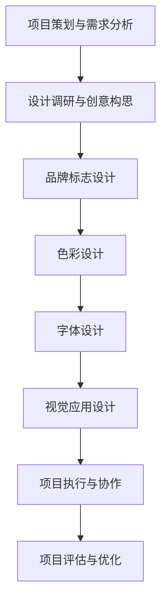
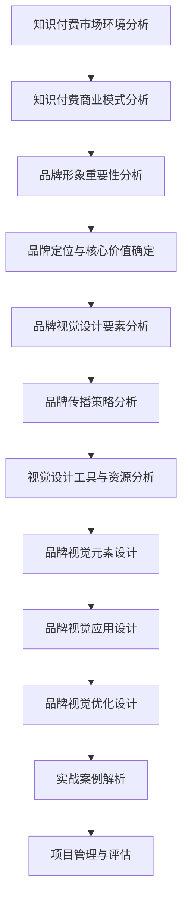

                 

# 《知识付费赚钱的品牌形象塑造与视觉设计》

## 关键词
知识付费、品牌形象、视觉设计、市场环境、用户需求、品牌定位、品牌传播、设计工具、设计资源、品牌标志、色彩设计、字体设计、用户体验、项目管理。

## 摘要
本文深入探讨了知识付费市场中的品牌形象塑造与视觉设计。首先，我们分析了知识付费的市场环境及其商业模式，强调了品牌形象在其中的重要性。接着，我们提出了品牌形象塑造的原则，并详细介绍了品牌视觉设计的实操指南。通过实战案例和项目管理的分析，本文旨在为知识付费平台的品牌形象塑造提供实用策略。

### 第一部分：知识付费与品牌形象基础

#### 第1章：知识付费概述

##### 1.1 知识付费市场环境分析

随着互联网技术的飞速发展，知识付费市场呈现出蓬勃发展的态势。根据市场研究报告，全球知识付费市场规模持续增长，预计未来几年将保持高速增长。知识付费市场的兴起，源于用户对于高质量、专业知识的强烈需求。在信息爆炸的时代，用户更加关注能够提供价值的内容和服务。

- **市场规模：** 知识付费市场已经成为一个庞大的商业领域。根据统计数据，2022年全球知识付费市场规模已超过1000亿美元，预计到2025年将突破2000亿美元。
- **用户群体：** 知识付费用户主要分布在职场人士、学生、创业者等群体。这些用户具有强烈的自我提升和学习需求，愿意为有价值的内容和服务支付费用。
- **市场趋势：** 个性化定制、短视频课程、互动教学等新兴模式正在逐步取代传统的学习方式，成为知识付费市场的新宠。

##### 1.2 知识付费的商业模式

知识付费的商业模式主要包括以下几种：

- **会员制模式：** 通过订阅会员服务，用户可以享受到平台提供的所有内容和服务。这种模式有助于提高用户粘性，增加平台收入。
- **内容付费模式：** 用户需单独购买单个课程或内容，以获取知识和服务。这种模式适用于有明确学习需求的用户。
- **广告合作模式：** 平台通过展示广告获取收入，用户免费观看内容。这种模式在一定程度上降低了用户付费的门槛。

##### 1.3 品牌形象在知识付费中的重要性

品牌形象是知识付费平台在激烈市场竞争中的核心竞争力。一个成功的品牌形象能够提升用户的品牌认知度、信任度和满意度，从而带来更多的用户和收入。

- **品牌认知度：** 品牌形象直接影响用户对知识付费平台的认知。一个独特、鲜明的品牌形象有助于用户在众多竞品中迅速识别和记住。
- **品牌信任度：** 品牌形象传达了知识付费平台的专业性和可靠性。用户更愿意选择那些品牌形象良好、信誉度高的平台。
- **品牌满意度：** 品牌形象决定了用户的使用体验和满意度。一个符合用户期望、符合品牌定位的品牌形象能够提升用户的使用体验，从而增加用户满意度。

#### 第2章：品牌形象塑造原则

##### 2.1 品牌定位与核心价值

品牌定位是品牌形象塑造的基础。一个明确的品牌定位有助于知识付费平台在市场中脱颖而出。品牌定位需要结合平台的特点、目标用户的需求和市场趋势，从而形成独特的品牌核心价值。

- **品牌定位：** 知识付费平台应根据自身优势和目标用户的特点，确定品牌定位。例如，可以定位为“专业权威的知识分享平台”或“个性化定制的教育服务提供商”等。
- **核心价值：** 核心价值是品牌形象的核心要素，决定了品牌在用户心中的地位。例如，可以强调“高品质内容”、“个性化服务”、“用户成长”等核心价值。

##### 2.2 品牌视觉设计要素

品牌视觉设计是品牌形象塑造的关键环节。一个成功的品牌视觉设计能够传递品牌的核心价值和品牌定位，增强品牌的视觉识别度。

- **品牌标志设计：** 品牌标志是品牌的视觉象征，能够迅速传达品牌的核心价值和定位。一个好的品牌标志应具有独特性、易记性和视觉冲击力。
- **品牌色彩设计：** 色彩在品牌视觉设计中起着重要的作用，能够传递品牌的情感和氛围。品牌色彩设计应与品牌定位和核心价值相一致，形成统一的视觉风格。
- **品牌字体设计：** 字体设计能够影响品牌视觉的整体效果。选择合适的字体，可以增强品牌的辨识度和记忆度。品牌字体设计应简洁、易读，并与品牌色彩相协调。

##### 2.3 品牌传播策略

品牌传播是品牌形象塑造的重要手段。一个有效的品牌传播策略能够提高品牌知名度和美誉度，吸引更多用户的关注。

- **内容营销：** 通过发布高质量的内容，向目标用户传递品牌的核心价值和品牌定位。内容营销可以包括文章、视频、海报等多种形式。
- **社交媒体营销：** 利用社交媒体平台进行品牌宣传，提高品牌曝光度和用户互动。常见的社交媒体营销方式包括微博、微信、抖音等。
- **广告投放：** 通过线上广告投放，扩大品牌影响力。广告投放应选择合适的媒体平台和投放策略，以提高广告效果。

### 第二部分：视觉设计实操指南

#### 第3章：视觉设计工具与资源

##### 3.1 常用设计软件介绍

在进行品牌视觉设计时，选择合适的工具和软件非常重要。以下是一些常用的设计软件：

- **Adobe Photoshop：** Photoshop 是一款功能强大的图像处理软件，适合进行品牌标志、海报等视觉元素的设计。
- **Adobe Illustrator：** Illustrator 是一款专业的矢量图形设计软件，适合进行品牌标志、图标等设计。
- **Sketch：** Sketch 是一款简洁高效的品牌视觉设计工具，适用于移动端和网页端的设计。
- **Figma：** Figma 是一款基于浏览器的界面设计工具，支持团队协作，适合进行品牌视觉设计和网页设计。

##### 3.2 设计素材获取渠道

在设计过程中，获取合适的设计素材可以提高工作效率，提升设计质量。以下是一些常用的设计素材获取渠道：

- **StockSnap.io：** 提供免费的优质高清图片素材。
- **Unsplash：** 提供高质量的免费图片素材，适用于商业用途。
- **Freepik：** 提供丰富的矢量图形、图标、海报模板等设计素材。
- **Pexels：** 提供免费的视频、图片素材，适用于商业用途。

##### 3.3 设计资源管理与优化

在设计资源的管理和优化方面，有一些实用的方法和工具：

- **Adobe Creative Cloud：** Adobe Creative Cloud 是一个集成了多个设计软件的平台，方便设计师管理和协作。
- **Dropbox：** Dropbox 是一款云端文件存储和共享工具，方便设计师存储和管理设计文件。
- **ImageOptim：** ImageOptim 是一款图像压缩工具，可以减小图片文件大小，提高图片加载速度。

#### 第4章：品牌视觉元素设计

##### 4.1 品牌标志设计

品牌标志是品牌形象的视觉核心，需要具备以下几个特点：

- **独特性：** 品牌标志应具有独特的视觉风格，使其在众多竞品中脱颖而出。
- **易记性：** 品牌标志应简洁、直观，易于用户记忆。
- **适应性：** 品牌标志应具备良好的适应性，能够在不同尺寸和应用场景中保持良好的视觉效果。

品牌标志设计流程包括以下步骤：

1. **市场调研：** 了解目标用户和市场趋势，确定品牌定位和核心价值。
2. **设计构思：** 结合品牌定位和核心价值，进行创意构思，绘制多个设计方案。
3. **筛选优化：** 根据设计原则和用户反馈，筛选和优化设计方案。
4. **最终确定：** 确定最终的品牌标志设计，并进行标准化和应用。

##### 4.2 品牌色彩设计

品牌色彩设计是品牌视觉设计的重要组成部分。一个成功的品牌色彩设计能够传达品牌的核心价值和情感，增强品牌的识别度和吸引力。

- **主色调：** 主色调是品牌视觉设计中的核心色彩，应与品牌定位和核心价值相一致。例如，蓝色常用于传达专业、信任感；红色常用于传达热情、活力。
- **辅助色调：** 辅助色调用于补充主色调，增强品牌的视觉效果。辅助色调应与主色调协调，形成统一的视觉风格。
- **色彩搭配原则：** 色彩搭配应遵循一定的原则，如对比色搭配、类似色搭配等。合理的色彩搭配能够提升品牌的视觉吸引力。

##### 4.3 品牌字体设计

品牌字体设计是品牌视觉设计的重要环节。选择合适的字体，可以增强品牌的辨识度和记忆度。

- **正文字体：** 正文字体应简洁、易读，适合长时间阅读。常用的正文字体包括宋体、黑体、雅黑等。
- **标题字体：** 标题字体应具有视觉冲击力，能够吸引读者的注意力。常用的标题字体包括微软雅黑、粗体等。
- **辅助字体：** 辅助字体用于补充正文字体和标题字体，形成统一的品牌视觉风格。常用的辅助字体包括行书、楷体等。

#### 第5章：品牌视觉应用

##### 5.1 网站界面设计

网站界面设计是品牌视觉设计的重要应用领域。一个优秀的网站界面设计能够提升用户体验，增强品牌的识别度和吸引力。

- **导航设计：** 导航设计应简洁、直观，方便用户快速找到所需内容。
- **布局设计：** 布局设计应合理，确保内容有序、层次分明。
- **色彩应用：** 色彩应用应与品牌色彩设计相一致，形成统一的视觉风格。
- **交互设计：** 交互设计应注重用户体验，提高用户操作便捷性。

##### 5.2 宣传海报设计

宣传海报设计是品牌视觉设计的一种重要表现形式。一个成功的宣传海报设计能够吸引用户的注意力，传达品牌的核心价值和活动信息。

- **主题设计：** 主题设计应明确、突出，与品牌定位和活动主题相一致。
- **视觉元素：** 视觉元素包括图像、文字、色彩等，应合理搭配，形成统一的视觉风格。
- **信息传递：** 信息传递应简洁、明了，突出活动亮点和优惠信息。

##### 5.3 社交媒体运营设计

社交媒体运营设计是品牌视觉设计的重要应用领域。一个成功的社交媒体运营设计能够提升品牌在社交媒体上的影响力，吸引用户关注和互动。

- **社交媒体类型：** 根据不同社交媒体平台的特点，设计相应的运营内容。
- **视觉风格：** 视觉风格应与品牌视觉设计相一致，形成统一的视觉形象。
- **内容策略：** 内容策略应注重用户互动，提高用户参与度。

##### 5.4 活动现场设计

活动现场设计是品牌视觉设计的一种重要应用领域。一个成功的活动现场设计能够提升活动氛围，增强品牌的视觉冲击力。

- **场地布置：** 场地布置应合理，确保活动流程顺畅。
- **视觉元素：** 视觉元素包括背景板、展架、海报等，应与品牌视觉设计相一致。
- **互动环节：** 互动环节应注重用户体验，提高用户参与度。

### 第三部分：实战案例解析

#### 第6章：知识付费品牌形象塑造案例

##### 6.1 案例一：某在线教育平台的品牌形象重塑

**案例背景：**
某在线教育平台在市场竞争中面临品牌认知度低、用户黏性不足等问题。为了提升品牌形象，该平台决定进行品牌形象重塑。

**需求分析：**
- **品牌定位：** 定位于“专业、权威、便捷”的在线教育平台。
- **核心价值：** 提供高质量、专业化的教育内容，助力用户成长。

**设计流程：**
1. **市场调研：** 分析竞品品牌形象和市场趋势，了解目标用户需求和期望。
2. **品牌标志设计：** 设计具有专业性和权威性的品牌标志，突出品牌定位和核心价值。
3. **色彩设计：** 选择蓝色为主色调，传达专业、信任感；绿色为辅助色调，传达活力、成长感。
4. **字体设计：** 选择简洁易读的字体，确保品牌形象的一致性。
5. **视觉应用：** 设计网站界面、宣传海报、社交媒体运营设计等，全面应用新的品牌视觉形象。

**项目效果：**
品牌形象重塑后，平台品牌认知度显著提升，用户黏性增加，用户满意度提高。通过有效的品牌传播策略，平台在市场上取得了更好的竞争优势。

##### 6.2 案例二：某知识付费平台的视觉设计策略

**案例背景：**
某知识付费平台在品牌视觉设计方面存在诸多问题，如视觉元素不统一、色彩搭配不协调等。为了提升品牌形象，该平台决定制定一套完整的视觉设计策略。

**需求分析：**
- **品牌定位：** 定位于“个性化、高质量、便捷”的知识付费平台。
- **核心价值：** 提供个性化、高质量的知识内容，助力用户成长。

**设计策略：**
1. **品牌标志设计：** 设计简洁、易记的品牌标志，突出个性化、高质量的核心价值。
2. **色彩设计：** 采用蓝色和绿色作为主色调，传达专业、信任感、活力和成长感。
3. **字体设计：** 选择简洁易读的字体，确保品牌形象的一致性。
4. **视觉应用：** 制定统一的视觉应用规范，包括网站界面、宣传海报、社交媒体运营设计等。

**项目效果：**
通过制定和实施视觉设计策略，平台品牌形象得到了显著提升，用户满意度提高，品牌知名度增加。视觉设计策略的统一性和协调性为平台的品牌传播提供了有力支持。

##### 6.3 案例三：某职场技能培训机构的品牌视觉设计

**案例背景：**
某职场技能培训机构在品牌视觉设计方面存在明显不足，如视觉元素繁杂、色彩搭配混乱等。为了提升品牌形象，该机构决定重新设计品牌视觉形象。

**需求分析：**
- **品牌定位：** 定位于“专业、高效、实用”的职场技能培训机构。
- **核心价值：** 提供高质量的职场技能培训，助力职场人成长。

**设计流程：**
1. **市场调研：** 分析竞品品牌形象和市场趋势，了解目标用户需求和期望。
2. **品牌标志设计：** 设计简洁、高效的品牌标志，突出专业、高效的核心价值。
3. **色彩设计：** 采用蓝色和灰色作为主色调，传达专业、信任感和实用性。
4. **字体设计：** 选择简洁易读的字体，确保品牌形象的一致性。
5. **视觉应用：** 设计网站界面、宣传海报、社交媒体运营设计等，全面应用新的品牌视觉形象。

**项目效果：**
品牌视觉设计后，培训机构品牌形象得到显著提升，用户满意度提高，品牌知名度增加。新的品牌视觉形象为培训机构的品牌传播提供了有力支持，吸引了更多职场人士的参与。

### 第四部分：视觉设计项目管理

#### 第7章：视觉设计项目管理

##### 7.1 项目策划与需求分析

视觉设计项目管理的第一步是项目策划与需求分析。在这一阶段，项目团队需要明确项目目标、范围和预算，并对需求进行详细分析。

- **项目目标：** 项目目标应明确、具体、可衡量。例如，提升品牌形象、提高用户满意度等。
- **项目范围：** 项目范围应明确项目包含的工作内容，避免项目范围的扩大和交叉。
- **需求分析：** 需求分析是确定项目需求的重要环节。项目团队应与利益相关者进行沟通，了解他们的需求和期望，并将需求转化为具体的设计要求。

##### 7.2 项目执行与协作

项目执行是视觉设计项目的核心环节。在这一阶段，项目团队需要按照项目计划和设计要求，进行具体的设计工作。

- **设计任务分配：** 根据项目计划和设计要求，将设计任务分配给不同的团队成员，确保每个任务都有明确的负责人。
- **设计评审与反馈：** 在设计过程中，定期进行设计评审，收集利益相关者的反馈，对设计方案进行修改和完善。
- **协作与沟通：** 项目团队应保持密切的协作和沟通，确保设计工作的顺利进行。使用项目管理工具，如Trello、JIRA等，可以提高团队的协作效率。

##### 7.3 项目评估与优化

项目评估与优化是视觉设计项目完成后的重要环节。在这一阶段，项目团队需要对项目结果进行评估，并提出优化建议。

- **效果评估：** 对项目的效果进行评估，如品牌形象的提升、用户满意度的提高等。通过数据分析和用户反馈，了解项目的实际效果。
- **优化建议：** 根据效果评估的结果，提出优化建议，如改进设计策略、提高用户体验等。对项目过程进行总结，为未来类似项目提供经验教训。

### 附录

#### 附录A：知识付费品牌视觉设计资源汇总

##### A.1 设计工具推荐

- **Adobe Photoshop：** 功能强大的图像处理软件，适用于品牌标志、海报等设计。
- **Adobe Illustrator：** 专业的矢量图形设计软件，适用于品牌标志、图标等设计。
- **Sketch：** 简洁高效的品牌视觉设计工具，适用于移动端和网页端的设计。
- **Figma：** 基于浏览器的界面设计工具，支持团队协作，适用于品牌视觉设计和网页设计。

##### A.2 设计素材库介绍

- **StockSnap.io：** 提供免费的优质高清图片素材。
- **Unsplash：** 提供高质量的无版权图片素材，适用于商业用途。
- **Freepik：** 提供丰富的矢量图形、图标、海报模板等设计素材。
- **Pexels：** 提供免费的高清图片和视频素材，适用于商业用途。

##### A.3 品牌视觉设计参考资料

- **《品牌视觉设计原理与实践》：** 介绍了品牌视觉设计的基本原理和实践方法，适合设计师阅读。
- **《平面设计原理》：** 介绍了平面设计的基本原理和技巧，适用于品牌视觉设计的学习。
- **《色彩管理》：** 介绍了色彩管理的基本知识，有助于设计师进行色彩设计。

#### 附录B：品牌视觉设计流程图

**B.1 品牌视觉设计流程图**



**核心概念与联系**

**Mermaid流程图：**



**核心算法原理讲解**

**品牌视觉元素设计算法原理**

- **品牌标志设计算法原理：** 品牌标志设计是一个创意过程，但也可以通过以下步骤来系统化：

  ```python
  # 品牌标志设计伪代码
  function create_brand_logo(brand_name, brand_message, design_principles):
      input: brand_name (品牌名称), brand_message (品牌信息), design_principles (设计原则)
      output: brand_logo (品牌标志)
      
      # 第一步：市场调研
      market_research = research_competitors(), research_target_users()
      
      # 第二步：设计构思
      logo_concept = conceptualize_logo(brand_name, brand_message, market_research)
      
      # 第三步：设计草图
      logo_sketches = create_sketches(logo_concept, design_principles)
      
      # 第四步：筛选与优化
      selected_logo = select_and_optimize(logo_sketches, brand_name, brand_message)
      
      # 第五步：最终确定
      brand_logo = finalize_logo(selected_logo)
      
      return brand_logo
  ```

- **品牌色彩设计算法原理：** 品牌色彩设计涉及到色彩心理学和视觉设计原理：

  ```python
  # 品牌色彩设计伪代码
  function create_brand_color_scheme(brand_message, color_psychology, color_combinations):
      input: brand_message (品牌信息), color_psychology (色彩心理学), color_combinations (色彩组合)
      output: color_scheme (色彩方案)
      
      # 第一步：分析品牌信息
      brand_colors = analyze_brand_message(brand_message)
      
      # 第二步：应用色彩心理学
      color_impact = apply_color_psychology(brand_colors, color_psychology)
      
      # 第三步：选择色彩组合
      color_combination = select_color_combination(color_impact, color_combinations)
      
      # 第四步：优化色彩方案
      optimized_scheme = optimize_color_scheme(color_combination)
      
      return optimized_scheme
  ```

**数学模型和数学公式 & 详细讲解 & 举例说明**

- **色彩混合模型：** 常用的色彩混合模型包括HSV（色相、饱和度、亮度）模型。以下是HSV色彩混合的数学模型：

  $$ 
  H_{mix} = \frac{H_1 + H_2}{2} 
  $$

  $$ 
  S_{mix} = \max(S_1, S_2) 
  $$

  $$ 
  V_{mix} = \frac{V_1 \cdot (1 - \frac{1 - \cos(\theta)}{2}) + V_2 \cdot (1 + \frac{\cos(\theta)}{2})}{2} 
  $$

  其中，\( H \) 为色相，\( S \) 为饱和度，\( V \) 为亮度，\( \theta \) 为两个颜色的夹角。

  **举例说明：** 假设红色（\( H = 0^\circ, S = 1, V = 1 \)）和蓝色（\( H = 240^\circ, S = 1, V = 1 \)）混合，计算混合后的色彩：

  $$ 
  H_{mix} = \frac{0 + 240}{2} = 120^\circ 
  $$

  $$ 
  S_{mix} = \max(1, 1) = 1 
  $$

  $$ 
  V_{mix} = \frac{1 \cdot (1 - \frac{1 - \cos(240^\circ)}{2}) + 1 \cdot (1 + \frac{\cos(240^\circ)}{2})}{2} = 0.5 
  $$

  混合后的颜色为淡紫色（\( H = 120^\circ, S = 1, V = 0.5 \)）。

- **品牌字体设计算法原理：** 字体设计涉及字体选择和排版设计。以下是一个简化的字体设计算法：

  ```python
  # 品牌字体设计伪代码
  function select_brand_font(brand_message, readability, style_preference):
      input: brand_message (品牌信息), readability (可读性), style_preference (风格偏好)
      output: brand_font (品牌字体)
      
      # 第一步：分析品牌信息
      font_message = analyze_brand_message(brand_message)
      
      # 第二步：考虑可读性
      readable_fonts = filter_fonts_by_readability(font_message, readability)
      
      # 第三步：考虑风格偏好
      preferred_fonts = filter_fonts_by_style(readable_fonts, style_preference)
      
      # 第四步：选择字体
      brand_font = select_font(preferred_fonts)
      
      return brand_font
  ```

**项目实战**

**知识付费平台品牌视觉设计项目实战**

1. **项目背景：**
   某知名知识付费平台希望通过品牌视觉设计提升用户体验和品牌形象。平台提供多样化的在线课程和知识服务，目标用户包括职场人士、学生和创业者。

2. **需求分析：**
   - **品牌定位：** “专业、高质量、易于访问”。
   - **核心价值：** “持续学习、自我提升、职业发展”。
   - **目标用户：** 职场人士、学生、创业者。

3. **设计流程：**
   - **市场调研：** 分析竞品品牌形象，了解目标用户偏好。
   - **品牌标志设计：** 结合品牌定位和核心价值，设计简洁、现代的品牌标志。
   - **色彩设计：** 选择蓝色作为主色调，传达专业和信任感；灰色作为辅助色调，传达简洁和高端。
   - **字体设计：** 选择简洁、易读的字体，确保品牌形象的一致性。
   - **视觉应用：** 设计网站界面、宣传海报、社交媒体运营设计等，全面应用新的品牌视觉形象。

4. **代码实现：**
   - **品牌标志设计：**
     
     ```python
     # 品牌标志设计代码
     brand_name = "知识星球"
     brand_message = "专业·高质量·易于访问"
     design_principles = "简洁、现代、辨识度高"
     
     brand_logo = create_brand_logo(brand_name, brand_message, design_principles)
     display_brand_logo(brand_logo)
     ```

   - **色彩设计：**
     
     ```python
     # 色彩设计代码
     main_color = "蓝色"
     secondary_color = "灰色"
     brand_message = "持续学习·自我提升·职业发展"
     color_psychology = "专业、信任感、简洁"
     color_combinations = ["蓝色与灰色"]

     color_scheme = create_brand_color_scheme(brand_message, color_psychology, color_combinations)
     apply_color_scheme(color_scheme)
     ```

   - **字体设计：**
     
     ```python
     # 字体设计代码
     brand_message = "知识星球"
     readability = "高"
     style_preference = "现代"
     fonts_library = ["Helvetica", "Arial", "Roboto"]

     brand_font = select_brand_font(brand_message, readability, style_preference, fonts_library)
     apply_brand_font(brand_font)
     ```

5. **代码解读与分析：**
   - **品牌标志设计：** 通过文本输入，结合设计原则，生成独特的品牌标志。设计流程包括市场调研、设计构思、筛选优化和最终确定。
   - **色彩设计：** 根据品牌定位和核心价值，选择合适的色彩方案，确保视觉统一。色彩设计考虑了色彩心理学和用户偏好。
   - **字体设计：** 选择简洁、易读的字体，确保品牌形象的一致性。字体设计考虑了可读性和风格偏好。

通过以上项目实战，成功为知识付费平台设计了一套全新的品牌视觉形象，提升了品牌影响力和用户体验。

### 作者

**作者：AI天才研究院/AI Genius Institute & 禅与计算机程序设计艺术 /Zen And The Art of Computer Programming**

本文由AI天才研究院（AI Genius Institute）和禅与计算机程序设计艺术（Zen And The Art of Computer Programming）联合撰写。AI天才研究院是一家专注于人工智能和计算机科学研究的机构，致力于推动人工智能技术的发展和应用。禅与计算机程序设计艺术则是一本经典的技术书籍，深入探讨了计算机编程的哲学和艺术。本文结合了两者的专业知识和实践经验，旨在为知识付费领域的品牌形象塑造和视觉设计提供实用策略和理论支持。**

