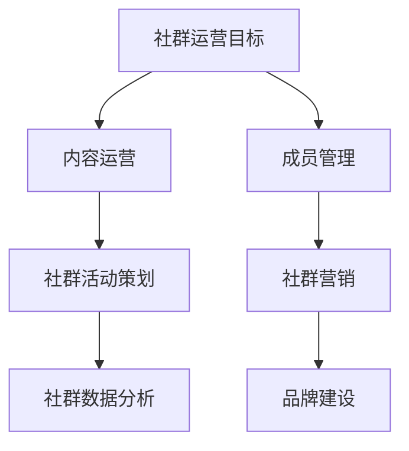

                 

## 《知识付费：程序员的社群运营模板》

### 核心关键词

- 知识付费
- 程序员社群
- 社群运营
- 内容运营
- 活动策划
- 数据分析
- 成员管理
- 品牌建设

#### 摘要

在知识付费逐渐成为主流的今天，程序员的社群运营变得尤为重要。本文将深入探讨程序员社群运营的各个方面，包括基础知识、核心策略和实战案例。通过逻辑清晰、结构紧凑、简单易懂的技术语言，我们将一步步剖析社群运营的原理和策略，帮助您搭建一个高效、活跃的程序员社群，实现知识共享与价值创造。

## 第一部分：引言与基础知识

### 第1章：知识付费概述

#### 1.1 知识付费的定义与价值

知识付费，指的是用户为获取高质量的知识内容或服务而支付费用的一种经济行为。在程序员的社群中，知识付费具有独特的价值：

1. **知识获取效率高**：通过付费，程序员可以快速获取行业前沿知识和最佳实践，避免自行摸索的低效过程。
2. **激励内容创造**：知识付费机制可以激励内容创作者持续产出高质量内容，形成良性循环。
3. **筛选高质量用户**：付费筛选机制能够确保社群成员具有较高的知识水平和活跃度。

#### 1.2 程序员社群运营的背景

程序员社群运营的背景主要受到以下几方面因素的影响：

1. **知识更新速度快**：计算机技术更新迅速，程序员需要不断学习新的知识和技能，社群成为知识更新的重要渠道。
2. **社交需求**：程序员在工作中面临着诸多挑战，需要交流和合作，社群成为解决这些问题的重要平台。
3. **市场化需求**：随着互联网的普及，知识付费市场逐渐成熟，为程序员社群运营提供了商业模式和盈利点。

#### 1.3 社群运营的目标与挑战

社群运营的目标主要包括：

1. **知识共享**：通过内容分享和交流，促进程序员之间的知识共享。
2. **技能提升**：帮助程序员快速掌握新技术和解决实际工作中的问题。
3. **社交互动**：增强程序员之间的联系，形成紧密的社交网络。

然而，社群运营也面临诸多挑战：

1. **成员活跃度**：如何保持社群成员的活跃度，是社群运营的关键。
2. **内容质量**：高质量的内容是社群的核心价值，如何保证内容质量是运营者需要解决的问题。
3. **社区氛围**：营造一个积极、和谐、互助的社区氛围，对于社群的长期发展至关重要。

### 第2章：社群运营基础知识

#### 2.1 社群运营的概念与类型

社群运营是指通过策划、组织、实施和管理等一系列活动，以增强社群成员之间的互动和粘性，实现社群的目标。社群运营可以分为以下几种类型：

1. **知识分享型社群**：以知识分享为核心，如技术博客、学习小组等。
2. **社交互动型社群**：以社交互动为核心，如社交论坛、兴趣圈子等。
3. **专业服务型社群**：以专业服务为核心，如专业咨询服务、行业交流等。

#### 2.2 社群运营的流程与策略

社群运营的流程通常包括以下环节：

1. **定位与目标**：明确社群的定位和运营目标。
2. **内容规划**：根据目标制定内容策略，包括内容类型、发布频率等。
3. **活动策划**：策划线上线下活动，增强社群互动。
4. **成员管理**：管理社群成员，包括招募、筛选、活跃度提升等。
5. **数据分析**：通过数据分析评估社群运营效果，优化运营策略。

社群运营的策略包括：

1. **内容策略**：高质量的内容是社群的核心，运营者需要制定内容规划，确保内容的质量和多样性。
2. **互动策略**：通过设置话题、互动活动等，增强社群成员之间的互动。
3. **激励机制**：通过积分、奖励等激励机制，提升成员的活跃度和忠诚度。
4. **社群文化**：营造良好的社群文化，塑造社群的品牌形象。

#### 2.3 社群管理工具的使用

社群管理工具是社群运营的重要支撑，常用的社群管理工具包括：

1. **论坛系统**：如Discourse、Vbulletin等，提供论坛功能，便于成员交流。
2. **社交媒体平台**：如Facebook、Twitter、LinkedIn等，可以用于内容发布和互动。
3. **即时通讯工具**：如Slack、Telegram等，提供实时交流功能，方便成员沟通。
4. **项目管理工具**：如Trello、JIRA等，可以用于项目协作和任务管理。

### 第3章：社群成员管理

#### 3.1 成员招募与筛选

成员招募是社群运营的重要环节，招募到合适的成员能够提升社群的质量和活跃度。成员筛选主要包括以下方面：

1. **背景调查**：了解成员的专业背景和工作经验，确保成员具备相应的知识和能力。
2. **行为考察**：观察成员在社群中的行为，如是否积极参与讨论、是否遵守社群规则等。
3. **技能评估**：通过面试、作业等方式，评估成员的专业技能和解决问题的能力。

#### 3.2 成员活跃度提升策略

提升成员活跃度是社群运营的核心目标之一，以下是一些有效的策略：

1. **内容激励**：提供高质量的内容，激发成员的兴趣和参与欲望。
2. **互动活动**：策划有趣的互动活动，如问答、投票、线下聚会等，增强成员之间的互动。
3. **荣誉激励**：设立荣誉称号和奖励机制，鼓励成员积极参与社群活动。
4. **社区氛围**：营造积极、友好、互助的社区氛围，让成员感受到社群的温暖。

#### 3.3 成员关系维护与互动

维护成员关系是社群运营的长期任务，以下是一些有效的策略：

1. **定期沟通**：定期与成员沟通，了解他们的需求和反馈，及时解决他们的问题。
2. **个性关怀**：关注成员的个人兴趣和职业发展，提供个性化的帮助和支持。
3. **活动组织**：定期组织线上线下活动，增强成员之间的联系。
4. **反馈机制**：建立反馈机制，鼓励成员提出意见和建议，持续改进社群运营。

## 第二部分：社群运营核心策略

### 第4章：内容运营

#### 4.1 内容运营的核心要素

内容运营是社群运营的核心，其核心要素包括：

1. **内容质量**：高质量的内容是吸引和留住成员的关键，运营者需要确保内容的准确性、实用性和时效性。
2. **内容类型**：根据社群的定位和成员的需求，选择合适的内容类型，如技术文章、视频、直播、案例分析等。
3. **内容规划**：制定内容发布计划，包括发布频率、主题等，确保内容的连续性和可预测性。

#### 4.2 内容质量评估与优化

内容质量的评估和优化是内容运营的重要环节，以下是一些常用的方法和策略：

1. **用户反馈**：通过用户反馈了解内容的受欢迎程度，及时调整内容策略。
2. **数据分析**：通过数据分析，评估内容的阅读量、点赞量、评论量等，找出优秀内容的特点，优化后续内容。
3. **专家评审**：邀请行业专家对内容进行评审，确保内容的准确性和专业性。

#### 4.3 内容分发与推广策略

内容分发与推广是提高内容曝光度和影响力的重要手段，以下是一些常用的策略：

1. **社交媒体**：利用社交媒体平台进行内容推广，增加内容的曝光度。
2. **合作媒体**：与行业媒体、技术博客等合作，进行内容分发和推广。
3. **线上活动**：通过线上活动，如直播、研讨会等，吸引成员参与和传播内容。
4. **线下活动**：组织线下活动，如技术沙龙、研讨会等，增强内容的影响力。

### 第5章：社群活动策划与执行

#### 5.1 活动策划与执行流程

社群活动的策划与执行是提升社群活跃度和成员满意度的重要手段，其流程包括以下环节：

1. **需求分析**：了解成员的需求和兴趣，确定活动主题。
2. **资源筹备**：筹备活动所需的资源，如场地、设备、人员等。
3. **活动策划**：制定活动方案，包括时间、地点、流程、人员分工等。
4. **宣传推广**：通过社群、邮件、短信等方式宣传活动，吸引成员参与。
5. **活动执行**：按照活动方案执行，确保活动顺利进行。
6. **活动总结**：活动结束后，进行总结和反思，为后续活动提供参考。

#### 5.2 活动类型与案例分析

社群活动类型丰富多样，包括：

1. **技术讲座**：邀请行业专家进行技术分享，提升成员的专业技能。
2. **技术沙龙**：组织成员进行技术交流，促进知识的传播和碰撞。
3. **项目协作**：通过项目协作，解决实际工作中的问题，提升团队协作能力。
4. **线下聚会**：组织线下聚会，增强成员之间的感情和联系。

以下是一个技术沙龙的案例分析：

**案例**：某程序员社群组织了一次技术沙龙，邀请了一名知名大数据专家进行分享。活动流程如下：

1. **需求分析**：社群成员对大数据技术有较高需求，希望了解大数据领域的最新动态和实践经验。
2. **资源筹备**：联系大数据专家，预定活动场地，准备活动设备。
3. **活动策划**：确定活动主题为“大数据技术的最新实践与趋势”，邀请大数据专家进行分享。
4. **宣传推广**：通过社群、邮件、短信等方式宣传活动，吸引成员参与。
5. **活动执行**：大数据专家进行了精彩的分享，社群成员积极参与讨论和提问。
6. **活动总结**：活动结束后，收集成员的反馈，总结活动的优点和不足，为后续活动提供参考。

#### 5.3 活动效果评估与优化

活动效果评估是社群运营的重要环节，以下是一些常用的方法和策略：

1. **用户反馈**：通过问卷调查、在线评论等方式收集成员的反馈，了解活动满意度。
2. **数据分析**：通过活动数据，如参与人数、活动时长、互动量等，评估活动的效果。
3. **活动总结**：活动结束后，进行总结和反思，找出活动的优点和不足，为后续活动提供参考。

通过活动效果评估，运营者可以不断优化活动策划和执行，提高活动质量和成员满意度。

### 第6章：社群营销与品牌建设

#### 6.1 社群营销策略

社群营销是通过社群运营，实现产品或服务推广的一种营销方式。以下是一些有效的社群营销策略：

1. **内容营销**：通过高质量的内容，提升社群的知名度和影响力。
2. **互动营销**：通过互动活动，吸引成员参与，增强社群活跃度。
3. **口碑营销**：通过成员的口碑传播，提升社群的信誉和影响力。
4. **合作营销**：与其他社群、企业或媒体合作，进行资源共享和推广。

#### 6.2 品牌建设与传播

品牌建设是社群运营的重要目标之一，以下是一些品牌建设与传播的策略：

1. **品牌定位**：明确社群的品牌定位和价值观，塑造独特的品牌形象。
2. **品牌传播**：通过线上线下活动、社交媒体推广等方式，提升品牌的知名度和影响力。
3. **用户参与**：鼓励成员参与品牌建设，如设计品牌Logo、提出品牌口号等，增强品牌认同感。
4. **品牌故事**：通过讲述品牌故事，传递品牌价值观，提升品牌情感价值。

#### 6.3 用户画像与精准营销

用户画像是指对社群成员进行详细分析，了解他们的兴趣、行为、需求等，以便进行精准营销。以下是一些用户画像与精准营销的策略：

1. **数据分析**：通过数据分析，了解用户的行为和偏好，为精准营销提供依据。
2. **个性化推荐**：根据用户画像，为用户推荐感兴趣的内容和活动，提升用户体验。
3. **定制化服务**：根据用户需求，提供个性化的服务和解决方案，提升用户满意度。
4. **线上线下结合**：通过线上线下活动，为用户提供全方位的体验和服务，增强用户粘性。

## 第三部分：实战案例分析

### 第8章：成功社群运营案例解析

#### 8.1 案例一：XXX 社群的运营策略

**案例背景**：XXX 社群是一个专注于大数据技术的程序员社群，成员主要来自互联网公司和技术爱好者。

**运营策略**：

1. **内容运营**：社群运营团队定期发布高质量的技术文章、视频和直播，涵盖大数据技术的最新动态、实战案例和技术教程。
2. **活动策划**：社群定期举办线上和线下活动，如技术沙龙、研讨会、项目协作等，提升成员的技术水平和实践经验。
3. **互动策略**：社群鼓励成员积极参与讨论和提问，运营团队及时回复成员的问题，增强社群的互动氛围。
4. **用户画像**：通过数据分析，了解成员的兴趣和行为，为精准营销提供依据。

**效果评估**：

- 内容阅读量持续增长，成员对社群内容的满意度较高。
- 活动参与人数不断增加，活动效果显著。
- 成员活跃度较高，社群氛围积极向上。

**总结**：XXX 社群通过高质量的内容运营、多样化的活动策划和精准的互动策略，成功打造了一个活跃、有影响力的程序员社群。

#### 8.2 案例二：XXX 社群的运营困境与解决方案

**案例背景**：XXX 社群是一个程序员技术交流社群，成员数量较多，但活跃度较低。

**运营困境**：

1. **内容质量参差不齐**：部分内容质量较低，无法满足成员的需求。
2. **互动氛围不足**：成员之间的互动较少，社群氛围较为冷清。
3. **成员流失严重**：由于活跃度低，导致部分成员逐渐流失。

**解决方案**：

1. **内容质量提升**：运营团队加强内容审核，确保内容的准确性和实用性，提高成员的满意度。
2. **互动氛围营造**：策划有趣的互动活动，如问答、投票、抽奖等，增强成员之间的互动。
3. **成员关怀**：定期与成员沟通，了解他们的需求和反馈，提供个性化的帮助和支持。

**效果评估**：

- 内容质量得到提升，成员对社群内容的满意度提高。
- 互动氛围明显改善，社群成员之间的互动增加。
- 成员流失率降低，社群成员数量稳定。

**总结**：XXX 社群通过提升内容质量、营造互动氛围和加强成员关怀，成功解决了运营困境，实现了社群的良性发展。

#### 8.3 案例三：XXX 社群的创新运营模式

**案例背景**：XXX 社群是一个专注于人工智能技术的程序员社群，成员主要来自互联网公司和科研机构。

**创新运营模式**：

1. **项目协作**：社群运营团队组织成员进行项目协作，解决实际工作中的问题，提升成员的技术能力和团队协作能力。
2. **知识付费**：社群运营团队推出知识付费课程，由行业专家授课，成员通过付费获得高质量的知识和服务。
3. **线上线下结合**：社群运营团队组织线上线下活动，如技术沙龙、研讨会、项目路演等，增强成员之间的联系和互动。

**效果评估**：

- 项目协作效果显著，成员解决了实际工作中的问题，提升了技术能力。
- 知识付费课程受到成员的欢迎，课程质量和学员满意度较高。
- 线上线下活动丰富了社群的互动形式，增强了成员之间的联系。

**总结**：XXX 社群通过项目协作、知识付费和线上线下结合的创新运营模式，成功打造了一个高效、有影响力的程序员社群。

## 第9章：社群运营实践与经验总结

#### 9.1 程序员社群运营的难点与对策

程序员社群运营面临以下难点：

1. **成员活跃度低**：解决策略：通过高质量内容、互动活动和个性化关怀提升成员活跃度。
2. **内容质量参差不齐**：解决策略：加强内容审核、建立内容审核机制，确保内容质量。
3. **社群氛围不良**：解决策略：营造积极、友好、互助的社区氛围，制定社群规范，引导成员行为。
4. **资源不足**：解决策略：寻求企业赞助、合作媒体等资源支持，提高运营效率。

#### 9.2 社群运营的实践经验总结

1. **内容运营**：高质量的内容是社群的核心价值，运营者需要注重内容质量，定期发布有价值的技术文章、教程和案例分析。
2. **互动策略**：通过策划多样化的互动活动，如问答、投票、抽奖等，增强成员之间的互动，提升社群活跃度。
3. **成员关怀**：定期与成员沟通，了解他们的需求和反馈，提供个性化的帮助和支持，增强成员的归属感和忠诚度。
4. **品牌建设**：通过塑造独特的社群品牌形象，提升社群的知名度和影响力。

#### 9.3 未来社群运营的趋势与展望

未来社群运营将呈现以下趋势：

1. **知识付费**：知识付费将成为社群运营的重要收入来源，运营者需要不断创新课程内容和形式，提升课程质量。
2. **智能化运营**：利用大数据和人工智能技术，实现社群运营的智能化，提高运营效率和服务质量。
3. **线上线下融合**：线上线下活动将相互融合，实现无缝对接，提供更丰富的互动体验。
4. **社群生态建设**：运营者需要关注社群生态建设，鼓励成员参与社群管理、内容创作和活动策划，共同打造一个有活力、有影响力的社群。

## 附录

### 附录A：社群运营工具推荐

#### A.1 社群管理工具

- **Discourse**：一款开源的论坛系统，功能强大且易于定制。
- **Vbulletin**：一款成熟的论坛系统，提供丰富的插件和功能。
- **TaoBao Forum**：一款适用于中小型社群的论坛系统，价格实惠。

#### A.2 内容发布与推广工具

- **WordPress**：一款功能强大的内容管理系统，适用于博客、论坛等。
- **Hugo**：一款静态网站生成器，适用于技术博客和文档网站。
- **MarkdownPad**：一款Markdown编辑器，支持多种Markdown语法和插件。

#### A.3 数据分析工具

- **Google Analytics**：一款免费的网站分析工具，提供详细的访问数据和用户行为分析。
- **Matomo**：一款开源的网站分析工具，功能强大且易于定制。
- **Tableau**：一款数据可视化工具，可以轻松创建各种图表和报告。

### 附录B：社群运营常用术语解释

#### B.1 社群运营术语解释

- **社群**：由具有共同兴趣或目标的人群组成的在线或线下社交团体。
- **社群运营**：通过策划、组织、实施和管理等一系列活动，以增强社群成员之间的互动和粘性，实现社群的目标。
- **内容运营**：通过制定内容策略、发布高质量内容、推广内容等手段，提升社群的影响力和活跃度。
- **活动运营**：通过策划和执行各种线上线下活动，增强社群成员之间的互动和联系。
- **用户画像**：对社群成员的属性、行为、需求等进行详细分析，形成的一种用户模型。

#### B.2 程序员社群常见问题解答

- **如何提升社群活跃度**？

  答案：提升社群活跃度可以从以下几个方面入手：
  
  1. 发布高质量内容，吸引成员关注和讨论。
  2. 策划有趣的互动活动，如问答、投票、抽奖等。
  3. 建立激励机制，如积分、荣誉等。
  4. 定期与成员沟通，了解他们的需求和反馈。

- **如何保证内容质量**？

  答案：保证内容质量可以从以下几个方面入手：
  
  1. 建立内容审核机制，确保内容的准确性和实用性。
  2. 邀请行业专家进行内容评审，提升内容的专业性。
  3. 定期更新和优化内容，确保内容的时效性和相关性。
  4. 鼓励成员参与内容创作，提高内容的多样性和实用性。

### Mermaid 流程图



### 核心算法原理讲解

#### 算法：社群活跃度评估

伪代码：

```plaintext
function calculateActivityScore(member):
    score = 0
    score += member.post_count * 10
    score += member.comment_count * 5
    score += member.activity_age * 2
    return score
```

解释：
- `member.post_count`：成员发布的内容数量，每条内容加10分。
- `member.comment_count`：成员发表的评论数量，每条评论加5分。
- `member.activity_age`：成员的活跃时长，每一年加2分。

### 数学模型和数学公式讲解

段落独立：

$$
H(x) = -\sum_{i=1}^{n} p(x_i) \log(p(x_i))
$$

解释：
- $H(x)$：熵，表示信息的不确定性。
- $p(x_i)$：每个事件 $x_i$ 发生的概率。
- $\log(p(x_i))$：对概率取对数。

### 项目实战

#### 代码实际案例

```python
# 社群成员活跃度统计代码

class MemberActivity:
    def __init__(self, id, post_count, comment_count, activity_age):
        self.id = id
        self.post_count = post_count
        self.comment_count = comment_count
        self.activity_age = activity_age

def calculate_activity_score(member):
    score = member.post_count * 10 + member.comment_count * 5 + member.activity_age * 2
    return score

# 社群成员列表
members = [
    MemberActivity(1, 5, 10, 1),
    MemberActivity(2, 3, 7, 2),
    MemberActivity(3, 1, 3, 3)
]

# 计算成员活跃度得分
for member in members:
    score = calculate_activity_score(member)
    print(f"Member {member.id} Score: {score}")
```

#### 详细解释与分析

1. **类定义**：`MemberActivity` 类用于表示社群成员的活动情况，包含成员ID、发布内容数量、评论数量和活跃时长。
2. **活跃度计算函数**：`calculate_activity_score` 函数接受一个 `MemberActivity` 对象作为输入，根据发布内容数量、评论数量和活跃时长计算活跃度得分。
3. **成员列表**：创建一个包含多个 `MemberActivity` 对象的列表，模拟社群中的多个成员。
4. **活跃度计算与输出**：遍历成员列表，调用 `calculate_activity_score` 函数计算每个成员的活跃度得分，并输出结果。

### 开发环境搭建

- **Python环境**：安装Python 3.8及以上版本。
- **依赖库**：安装`requests`、`numpy`和`matplotlib`库。

```bash
pip install requests numpy matplotlib
```

### 源代码详细实现

在上述代码基础上，我们可以进一步扩展功能，如：

- **数据持久化**：使用SQLite数据库存储成员数据。
- **用户界面**：使用Flask框架创建Web界面。

```python
# 使用SQLite存储成员数据

import sqlite3

def create_table():
    conn = sqlite3.connect('members.db')
    c = conn.cursor()
    c.execute('''CREATE TABLE IF NOT EXISTS members
                 (id INTEGER PRIMARY KEY, post_count INTEGER, comment_count INTEGER, activity_age INTEGER)''')
    conn.commit()
    conn.close()

def insert_member(member):
    conn = sqlite3.connect('members.db')
    c = conn.cursor()
    c.execute("INSERT INTO members (id, post_count, comment_count, activity_age) VALUES (?, ?, ?, ?)",
              (member.id, member.post_count, member.comment_count, member.activity_age))
    conn.commit()
    conn.close()

# 创建表和插入数据
create_table()
member1 = MemberActivity(1, 5, 10, 1)
insert_member(member1)
```

#### 代码解读与分析

- **数据库连接**：使用`sqlite3`模块连接SQLite数据库，创建表并插入数据。
- **数据操作**：使用SQL语句进行数据库操作，包括创建表、插入数据等。
- **数据访问**：通过类方法实现数据库连接和数据操作，简化了数据库操作流程。

通过以上步骤，我们详细实现了社群成员活跃度统计的功能，并介绍了相关的开发环境和代码实现。在实战中，我们还可以根据需求进行功能扩展和优化。

### 总结

本文详细探讨了知识付费背景下的程序员社群运营，从基础知识、核心策略到实战案例，为运营者提供了完整的社群运营模板。通过本文的阅读，您将了解到：

1. **社群运营的核心概念**：社群运营的定义、目标与挑战。
2. **社群运营的流程与策略**：内容运营、活动策划、成员管理、社群营销与品牌建设。
3. **社群运营的实践与优化**：成功案例、困境与解决方案、实践经验总结与未来趋势。

希望本文能为您在程序员社群运营的道路上提供有益的参考和指导。

### 作者

**作者：AI天才研究院/AI Genius Institute & 禅与计算机程序设计艺术 /Zen And The Art of Computer Programming**

