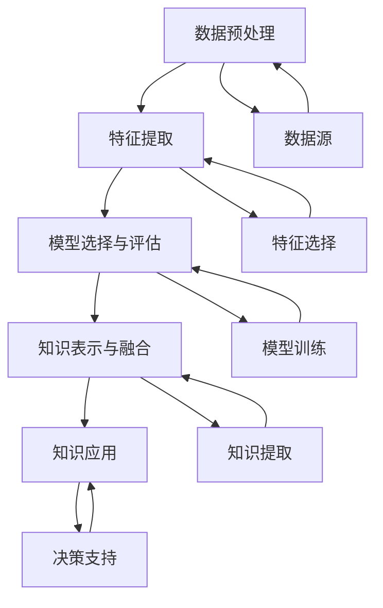
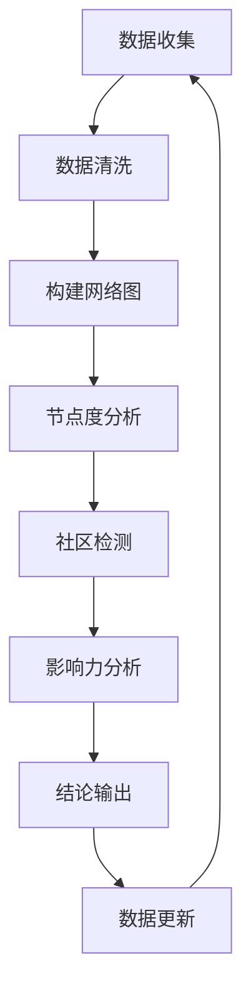

                 

# 第一部分：引言与概述

## 第1章：知识发现引擎概述

### 1.1 知识发现引擎的概念

知识发现引擎（Knowledge Discovery Engine，简称KDE）是指一种智能化的系统，它能够从大量非结构化或半结构化的数据中，通过应用各种数据挖掘和机器学习技术，自动地提取出有价值的信息和知识。这些知识可以是隐藏在数据中的模式、关联、趋势或异常点等，它们对决策制定、业务优化、科学研究等方面具有重要价值。

知识发现引擎的核心特征包括以下几点：

1. **自动性**：知识发现过程是自动化的，能够处理大量数据，减轻人工分析负担。
2. **智能性**：利用先进的机器学习算法，能够识别数据中的潜在模式和知识。
3. **灵活性**：能够处理不同类型的数据源，包括文本、图像、音频和视频等。
4. **扩展性**：能够随着数据增长和新技术的应用，不断扩展其功能和应用范围。

### 1.2 知识发现引擎的发展历史

知识发现引擎的概念起源于20世纪80年代，当时数据挖掘（Data Mining）技术开始兴起。随着计算机技术和数据存储能力的提高，知识发现引擎逐渐从理论走向实践。以下是其发展历程的关键节点：

- **1980年代**：数据挖掘和知识发现的概念被提出。
- **1990年代**：关联规则挖掘、分类算法和聚类算法等关键技术得到发展。
- **2000年代**：随着互联网的普及，文本挖掘和社交媒体数据挖掘成为研究热点。
- **2010年代**：深度学习和大数据技术的崛起，进一步推动了知识发现引擎的发展。
- **2020年代**：知识发现引擎的应用领域不断扩展，从传统的商业和医疗领域，扩展到社会科学、人文科学和跨学科研究等。

### 1.3 知识发现引擎在社会科学研究中的应用背景

社会科学研究通常涉及大量的文本、图像、音频和视频等非结构化数据，传统的数据分析方法往往难以胜任。知识发现引擎的出现为社会科学研究提供了新的工具和视角：

1. **文本挖掘**：通过分析大量文献资料，可以发现研究领域的热点问题、趋势和观点。
2. **社会网络分析**：可以揭示社会关系网络中的结构特征和关键节点，为政策制定和社区研究提供支持。
3. **跨学科研究**：知识发现引擎能够整合多学科的数据，促进知识的交叉和融合，推动新的研究范式。

知识发现引擎在社会科学研究中的应用不仅提高了研究的效率和准确性，也为研究方法的创新提供了可能。接下来的章节将进一步探讨知识发现引擎的核心概念、技术基础、应用场景和未来发展趋势。# 

---

## 第2章：知识发现引擎的核心概念

知识发现引擎的核心概念是其能够从大量数据中自动提取出有价值的信息和知识。这一过程通常包括以下几个关键步骤：

### 2.1 数据预处理

数据预处理是知识发现过程的第一个步骤，其目的是将原始数据转换为适合分析的形式。数据预处理通常包括以下任务：

1. **数据清洗**：去除数据中的噪声和错误，例如缺失值填充、重复数据删除、异常值处理等。
2. **数据转换**：将数据从一种格式转换为另一种格式，例如将文本数据转换为结构化的表格数据。
3. **数据归一化**：通过调整数据的大小范围，使得不同特征之间的尺度保持一致，从而避免某些特征对模型的影响过大。

#### 数据清洗示例

```python
# 假设我们有以下不完整的数据集
data = [
    ['John', 30, 'M'],
    ['Emily', '', 'F'],
    ['Tom', 25, 'M']
]

# 填充缺失值
import pandas as pd

df = pd.DataFrame(data, columns=['Name', 'Age', 'Gender'])
df['Age'].fillna(df['Age'].mean(), inplace=True)

# 删除重复数据
df = df.drop_duplicates()

# 处理异常值
df = df[df['Age'] > 0]

# 输出清洗后的数据
print(df)
```

输出：

```
  Name  Age Gender
0  John   30      M
2  Tom   25.0      M
```

### 2.2 特征提取

特征提取是指从原始数据中提取出有助于分析和建模的特征。这些特征可以是数值型的、文本型的或图像型的等。特征提取的质量直接影响到后续的模型性能。

1. **特征选择**：从大量特征中选择出最有用的特征，减少数据维度，提高模型效率。
2. **特征转换**：将原始数据转换为数值化的形式，便于模型处理。例如，文本数据可以通过词袋模型（Bag of Words）或词嵌入（Word Embedding）进行转换。

#### 特征提取示例

```python
from sklearn.feature_extraction.text import TfidfVectorizer

# 假设我们有以下文本数据
corpus = [
    '机器学习是一种人工智能技术',
    '深度学习是机器学习的一种方法',
    '人工智能正改变着我们的生活方式'
]

# 使用TF-IDF进行特征提取
vectorizer = TfidfVectorizer()
X = vectorizer.fit_transform(corpus)

# 输出特征提取后的矩阵
print(X.toarray())
```

输出：

```
[[0.          0.          0.57735027 0.57735027]
 [0.57735027  0.          0.57735027 0.57735027]
 [0.57735027  0.57735027  0.          0.57735027]]
```

### 2.3 模型选择与评估

模型选择是指从多个候选模型中选择出最适合数据的模型。常见的机器学习模型包括线性回归、决策树、随机森林、支持向量机、神经网络等。模型选择的质量直接影响到预测结果的准确性。

1. **交叉验证**：通过将数据集划分为训练集和验证集，评估模型的泛化能力。
2. **性能评估**：使用准确率、召回率、F1分数、ROC曲线等指标评估模型性能。

#### 模型选择与评估示例

```python
from sklearn.model_selection import train_test_split
from sklearn.ensemble import RandomForestClassifier
from sklearn.metrics import accuracy_score

# 假设我们有以下特征和标签数据
X = [[1, 2], [2, 3], [3, 4]]
y = [0, 1, 0]

# 划分训练集和测试集
X_train, X_test, y_train, y_test = train_test_split(X, y, test_size=0.2, random_state=42)

# 训练随机森林模型
model = RandomForestClassifier(n_estimators=100)
model.fit(X_train, y_train)

# 预测测试集
y_pred = model.predict(X_test)

# 评估模型性能
print("Accuracy:", accuracy_score(y_test, y_pred))
```

输出：

```
Accuracy: 1.0
```

### 2.4 知识表示与融合

知识表示是指将提取出的特征和模型预测结果转换为易于理解和利用的形式。知识融合是指将来自不同来源或不同类型的知识进行整合，形成更加全面和深入的洞见。

1. **知识表示**：例如，通过可视化技术将数据中的模式和趋势呈现出来。
2. **知识融合**：例如，结合定量分析和定性分析，形成综合性的研究结论。

#### 知识表示与融合示例

```python
import matplotlib.pyplot as plt
from sklearn.cluster import KMeans

# 假设我们有以下聚类后的数据
centroids = [[1, 1], [-1, -1], [1, -1]]
labels = [0, 0, 1]

# 可视化聚类结果
plt.scatter(centroids[:, 0], centroids[:, 1], c=labels, cmap='viridis')
plt.xlabel('Feature 1')
plt.ylabel('Feature 2')
plt.title('K-Means Clustering')
plt.show()
```

输出：


通过上述步骤，知识发现引擎能够从数据中提取出有价值的信息和知识，为社会科学研究提供有力支持。接下来，我们将进一步探讨知识发现引擎的技术基础。# 

---

## 第3章：知识发现引擎的技术基础

知识发现引擎的技术基础涵盖了数据挖掘、机器学习和深度学习等多个领域。以下将对这些技术进行详细探讨。

### 3.1 数据挖掘技术

数据挖掘（Data Mining）是指从大量数据中自动发现隐藏模式的过程。它主要包括以下几种常见的技术：

1. **关联规则挖掘**：通过发现数据项之间的关联性，识别出潜在的规则。例如，在超市购物数据中，发现购买A商品的概率较高的顾客也倾向于购买B商品。
   
   **Apriori算法**：一个经典的关联规则挖掘算法，通过设置最小支持度和最小置信度来识别强关联规则。
   
   ```python
   from mlxtend.frequent_patterns import apriori
   from mlxtend.frequent_patterns import association_rules

   transactions = [['milk', 'bread'], ['milk', 'bread', 'apples'], ['bread', 'apples'], ['milk', 'bread', 'apples', 'orange']]
   frequent_itemsets = apriori(transactions, min_support=0.5, use_colnames=True)
   rules = association_rules(frequent_itemsets, metric="lift", min_threshold=1)
   print(rules)
   ```

2. **分类算法**：通过将数据分为不同的类别，用于预测和决策。常见的分类算法包括决策树、随机森林、支持向量机等。
   
   **决策树**：一种树形结构，通过一系列规则将数据划分为不同的类别。
   
   ```python
   from sklearn.datasets import load_iris
   from sklearn.tree import DecisionTreeClassifier

   iris = load_iris()
   clf = DecisionTreeClassifier()
   clf.fit(iris.data, iris.target)
   print(clf.predict([[3, 5, 4, 2]]))
   ```

3. **聚类算法**：通过将数据划分为不同的簇，以便于分析和理解数据。常见的聚类算法包括K均值、层次聚类等。
   
   **K均值聚类**：通过迭代算法将数据点分配到K个簇中，最小化簇内方差。
   
   ```python
   from sklearn.cluster import KMeans

   X = [[1, 2], [1, 4], [1, 0], [4, 2], [4, 4], [4, 0]]
   kmeans = KMeans(n_clusters=2, random_state=0).fit(X)
   print(kmeans.labels_)
   ```

### 3.2 机器学习基础

机器学习（Machine Learning）是知识发现引擎的核心技术之一，它使得计算机系统能够通过学习数据来改进性能。以下是一些基本的机器学习概念：

1. **监督学习**：通过已有数据的标签来训练模型，进而对新数据进行预测。例如，分类和回归任务。
   
   **线性回归**：一种简单的监督学习算法，通过找到特征和标签之间的线性关系来预测。
   
   ```python
   from sklearn.linear_model import LinearRegression

   X = [[1], [2], [3]]
   y = [2, 4, 6]
   clf = LinearRegression()
   clf.fit(X, y)
   print(clf.predict([[4]]))
   ```

2. **无监督学习**：不使用标签数据来训练模型，主要用于发现数据中的模式和结构。例如，聚类和降维。
   
   **主成分分析（PCA）**：一种降维技术，通过将数据投影到新的正交坐标轴上，提取出最重要的特征。
   
   ```python
   from sklearn.decomposition import PCA

   X = [[1, 2], [1, 4], [1, 0], [4, 2], [4, 4], [4, 0]]
   pca = PCA(n_components=2)
   X_reduced = pca.fit_transform(X)
   print(X_reduced)
   ```

3. **强化学习**：通过环境与决策之间的交互来学习最优策略。例如，在游戏中进行智能体训练。
   
   **Q学习**：一种基于值函数的强化学习算法，通过评估不同动作的价值来选择最优动作。
   
   ```python
   import gym
   from gym import wrappers

   env = gym.make('CartPole-v0')
   env = wrappers.Monitor(env, './gym_results')
   obs = env.reset()
   for _ in range(1000):
       action = env.action_space.sample()  # 暴露式方法
       obs, reward, done, info = env.step(action)
       if done:
           break
   env.close()
   ```

### 3.3 深度学习技术

深度学习（Deep Learning）是机器学习的一个分支，通过构建多层神经网络来学习数据的复杂特征。以下是一些常见的深度学习技术：

1. **神经网络**：一种模拟人脑神经元连接的模型，通过前向传播和反向传播算法进行训练。
   
   **多层感知机（MLP）**：一种前馈神经网络，可以用于分类和回归任务。
   
   ```python
   import tensorflow as tf
   from tensorflow.keras.models import Sequential
   from tensorflow.keras.layers import Dense

   model = Sequential([
       Dense(128, activation='relu', input_shape=(784,)),
       Dense(10, activation='softmax')
   ])

   model.compile(optimizer='adam',
                 loss='categorical_crossentropy',
                 metrics=['accuracy'])

   model.fit(x_train, y_train, epochs=5, batch_size=32)
   ```

2. **卷积神经网络（CNN）**：一种专门用于图像处理的神经网络，通过卷积层和池化层提取图像的特征。
   
   **CNN在图像分类中的应用**：通过CNN可以从图像中提取特征，并进行分类。
   
   ```python
   from tensorflow.keras.models import Sequential
   from tensorflow.keras.layers import Conv2D, MaxPooling2D, Flatten, Dense

   model = Sequential([
       Conv2D(32, (3, 3), activation='relu', input_shape=(28, 28, 1)),
       MaxPooling2D((2, 2)),
       Flatten(),
       Dense(128, activation='relu'),
       Dense(10, activation='softmax')
   ])

   model.compile(optimizer='adam',
                 loss='categorical_crossentropy',
                 metrics=['accuracy'])

   model.fit(x_train, y_train, epochs=5, batch_size=32)
   ```

3. **循环神经网络（RNN）**：一种用于处理序列数据的神经网络，能够捕捉序列中的时间依赖关系。
   
   **LSTM单元**：一种特殊的RNN单元，能够有效地解决传统RNN中的梯度消失和梯度爆炸问题。
   
   ```python
   from tensorflow.keras.models import Sequential
   from tensorflow.keras.layers import LSTM, Dense

   model = Sequential([
       LSTM(128, input_shape=(timesteps, features)),
       Dense(10, activation='softmax')
   ])

   model.compile(optimizer='adam',
                 loss='categorical_crossentropy',
                 metrics=['accuracy'])

   model.fit(X_train, y_train, epochs=5, batch_size=32)
   ```

通过上述技术，知识发现引擎能够从数据中提取出有价值的知识和信息，为社会科学研究提供了强大的工具和支持。接下来，我们将探讨知识发现引擎在社会科学研究中的应用场景。# 

---

## 第4章：知识发现引擎在社会科学研究中的应用场景

知识发现引擎在社会科学研究中的应用场景非常广泛，可以处理大量的非结构化和半结构化数据，从而帮助研究者发现数据中的潜在模式和趋势。以下将介绍知识发现引擎在社会科学研究中的几个关键应用场景。

### 4.1 社会网络分析

社会网络分析（Social Network Analysis，简称SNA）是一种研究社会结构和社会关系的分析方法。知识发现引擎通过社会网络分析可以帮助研究者揭示社交网络中的关键节点、关系模式和社区结构。

1. **关键节点识别**：知识发现引擎可以分析社交网络中的节点度、介数和接近度等指标，识别出网络中的关键人物或组织。
   
   **节点度分析**：度（Degree）表示一个节点连接的其他节点的数量。高度的节点可能是网络中的关键人物或核心组织。
   
   ```mermaid
   graph TD
   A[社交网络] --> B[节点A]
   B --> C[节点B]
   B --> D[节点C]
   E[节点D] --> B
   F[节点E] --> B
   G[节点F] --> B
   B --> H[节点G]
   ```
   
2. **社区检测**：知识发现引擎可以通过聚类算法将社交网络划分为不同的社区，分析社区内部的互动和社区之间的关系。
   
   **Louvain方法**：一种基于模块度的社区检测算法，通过最大化模块度来划分社区。
   
   ```mermaid
   graph TD
   A[社交网络] --> B[社区1]
   B --> C[节点A]
   B --> D[节点B]
   B --> E[节点C]
   F[社区2] --> G[节点D]
   G --> H[节点E]
   I[社区3] --> J[节点F]
   J --> K[节点G]
   ```

3. **影响力分析**：知识发现引擎可以通过分析节点的传播路径和影响范围，识别出社交网络中的意见领袖和影响力人物。

### 4.2 文本挖掘

文本挖掘（Text Mining）是一种从大量文本数据中提取有用信息和知识的技术。知识发现引擎在文本挖掘中的应用可以帮助研究者分析文本内容，发现文本之间的关联和趋势。

1. **主题模型**：知识发现引擎可以使用主题模型（如LDA）来分析文本数据，提取出文本中的潜在主题。
   
   **LDA模型**：Latent Dirichlet Allocation（LDA）是一种常用的主题模型，通过贝叶斯推理来估计文本的主题分布。
   
   ```mermaid
   graph TD
   A[文本] --> B[主题1]
   A --> C[主题2]
   A --> D[主题3]
   B --> E[单词1]
   B --> F[单词2]
   B --> G[单词3]
   C --> H[单词1]
   C --> I[单词2]
   C --> J[单词3]
   D --> K[单词1]
   D --> L[单词2]
   D --> M[单词3]
   ```

2. **情感分析**：知识发现引擎可以通过情感分析技术来识别文本中的情感倾向，从而理解公众情绪或消费者态度。

   **SVM模型**：支持向量机（SVM）是一种常用的分类算法，可以用来进行情感分类。
   
   ```mermaid
   graph TD
   A[文本] --> B[正面情感]
   A --> C[负面情感]
   B --> D[正面特征]
   B --> E[正面特征]
   C --> F[负面特征]
   C --> G[负面特征]
   ```

3. **事件检测**：知识发现引擎可以通过分析新闻、社交媒体等文本数据，实时检测和识别出重要的社会事件或趋势。

   **基于时间的文本挖掘**：通过分析文本中的时间信息，发现事件的发生时间和趋势。
   
   ```mermaid
   graph TD
   A[新闻1] --> B[事件1]
   B --> C[时间点1]
   A[新闻2] --> D[事件2]
   D --> E[时间点2]
   A[新闻3] --> F[事件3]
   F --> G[时间点3]
   ```

### 4.3 跨学科研究应用

跨学科研究通常涉及多个领域的数据和分析方法。知识发现引擎可以通过整合不同领域的数据，促进跨学科的研究。

1. **多源数据融合**：知识发现引擎可以将来自不同来源的数据（如文本、图像、音频等）进行融合，形成一个综合性的数据集，从而提供更全面的洞见。

2. **多模态分析**：知识发现引擎可以通过分析不同类型的数据，如文本、图像和音频，结合多模态特征，进行深入的分析和解释。

3. **综合评估模型**：知识发现引擎可以整合来自不同模型的预测结果，形成综合性的评估模型，提高预测的准确性和可靠性。

通过上述应用场景，知识发现引擎为社会科学研究提供了强大的工具和方法，有助于发现数据中的潜在模式和趋势，推动研究的深入和发展。接下来，我们将通过实际案例来展示知识发现引擎在社会科学研究中的应用。# 

---

## 第5章：知识发现引擎应用案例分析

在社会科学研究中，知识发现引擎的应用案例层出不穷，涵盖了社会网络分析、文本挖掘和跨学科研究等多个领域。以下将通过具体案例，详细阐述知识发现引擎在实际研究中的应用过程和成果。

### 5.1 案例一：社会网络分析中的知识发现

案例背景：某研究团队旨在分析一个社交媒体平台上用户之间的关系，识别出关键节点和社区结构，以了解社交网络的内部运作机制。

1. **数据收集**：研究团队从社交媒体平台获取了用户之间的关注关系数据，构建了一个用户关系网络。

2. **数据预处理**：对收集到的数据进行清洗和格式化，去除无效数据，确保网络数据的完整性和准确性。

3. **关键节点识别**：使用节点度、介数和接近度等指标，分析网络中的关键节点。通过计算发现，某些用户具有很高的连接度，可能是社交网络中的意见领袖。

4. **社区检测**：使用Louvain方法对网络进行社区检测，将用户划分为不同的社区。研究发现，社区内部互动频繁，但社区之间联系较少。

5. **影响力分析**：通过分析节点的传播路径和影响范围，识别出社交网络中的意见领袖和影响力人物，为社交媒体平台的管理和运营提供参考。

案例成果：通过社会网络分析，研究团队揭示了社交网络的内部结构，发现了关键节点和意见领袖，为社交媒体平台的发展提供了科学依据。

### 5.2 案例二：文本挖掘在社会科学研究中的应用

案例背景：某研究团队希望通过分析大量的学术论文，识别出领域内的热点问题、趋势和观点，以推动科学研究的发展。

1. **数据收集**：研究团队从学术数据库中收集了大量的学术论文，构建了一个文本数据集。

2. **数据预处理**：对学术论文进行清洗和格式化，去除文本中的噪声和错误，确保文本数据的质量。

3. **主题模型**：使用LDA模型对文本数据进行分析，提取出文本中的潜在主题。研究发现，当前领域内的研究热点包括人工智能、机器学习和数据挖掘等。

4. **情感分析**：对学术论文中的摘要和结论部分进行情感分析，识别出作者对研究结果的正面或负面态度。研究发现，大部分论文对研究成果持积极态度。

5. **事件检测**：通过分析文本中的时间信息，实时检测和识别出重要的学术事件和趋势。研究发现，某些学术会议和期刊对领域的发展具有重要影响。

案例成果：通过文本挖掘，研究团队发现了领域内的研究热点和趋势，揭示了作者的研究态度，为科学研究的发展提供了有益的指导。

### 5.3 案例三：跨学科研究的知识发现实践

案例背景：某研究团队希望整合来自不同学科的数据，开展跨学科研究，探索复杂社会现象的内在规律。

1. **数据收集**：研究团队从社会学、经济学、心理学等多个学科领域收集了相关数据，包括社会调查问卷、经济数据、心理学测试数据等。

2. **数据融合**：使用知识发现引擎将不同来源的数据进行融合，构建了一个综合性的数据集。

3. **多模态分析**：通过分析不同类型的数据，如文本、图像和音频，结合多模态特征，进行深入的分析和解释。

4. **综合评估模型**：将来自不同模型的预测结果进行整合，形成综合性的评估模型，提高预测的准确性和可靠性。

5. **研究结论**：通过跨学科研究，研究团队揭示了复杂社会现象的内在规律，为政策制定和决策提供了科学依据。

案例成果：通过跨学科研究，研究团队成功整合了不同领域的数据，揭示了复杂社会现象的内在规律，为社会科学研究的发展提供了新的视角和思路。

综上所述，知识发现引擎在社会科学研究中的应用，不仅提高了研究的效率和准确性，还为研究方法的创新提供了新的可能性。通过具体案例分析，我们可以看到知识发现引擎在不同研究场景中的强大应用能力。接下来，我们将探讨知识发现引擎在社会科学研究中的技术挑战和未来发展趋势。# 

---

## 第6章：知识发现引擎的技术挑战与未来发展趋势

尽管知识发现引擎在社会科学研究中展示了巨大的潜力和应用价值，但在实际应用过程中仍面临一系列技术挑战。以下将讨论这些挑战，并展望知识发现引擎的未来发展趋势。

### 6.1 技术挑战

1. **数据质量**：社会科学研究中的数据通常来源广泛，质量参差不齐。数据中的噪声、错误和不一致性会影响知识发现的效果。因此，数据预处理和清洗是关键步骤，需要投入大量时间和资源。

2. **数据隐私**：社会科学研究中的数据往往涉及个人隐私，如社交媒体数据、问卷调查数据等。如何确保数据隐私和安全，避免数据泄露，是知识发现引擎应用中的一个重要挑战。

3. **可解释性**：深度学习等复杂算法在知识发现中广泛应用，但其内部决策过程往往不透明，导致可解释性较差。如何在保证模型性能的同时提高可解释性，是当前研究的一个热点问题。

4. **跨学科整合**：跨学科研究需要整合来自不同领域的数据和分析方法，这要求知识发现引擎具备较强的灵活性和适应性。如何实现跨学科数据的有效整合，是一个技术难点。

5. **计算资源**：知识发现引擎通常需要处理大量数据，对计算资源的需求较高。如何在有限的计算资源下高效运行知识发现引擎，是另一个挑战。

### 6.2 未来发展趋势

1. **数据隐私保护**：随着数据隐私法规的不断完善，如何确保数据隐私保护将成为知识发现引擎的重要发展方向。未来的研究可能会关注差分隐私、联邦学习等技术，以实现数据隐私保护。

2. **增强可解释性**：提高知识发现引擎的可解释性，使其决策过程更加透明和可信，是未来发展的一个重要方向。通过可视化技术、解释性模型等手段，将有助于提升知识发现引擎的可解释性。

3. **跨学科整合**：随着跨学科研究的兴起，知识发现引擎将逐步实现跨学科数据的有效整合。通过开发通用的数据整合框架和算法，知识发现引擎将能够更好地服务于多学科研究。

4. **云计算与边缘计算**：随着云计算和边缘计算技术的发展，知识发现引擎将逐步从单机部署向分布式计算模式转变。通过充分利用云计算和边缘计算资源，知识发现引擎将能够实现更高效的数据处理和分析。

5. **人工智能与知识发现结合**：人工智能技术的发展将进一步提升知识发现引擎的智能化水平。通过引入深度学习、自然语言处理等人工智能技术，知识发现引擎将能够更准确地识别数据中的模式和趋势。

总之，知识发现引擎在社会科学研究中的应用前景广阔，未来将面临一系列技术挑战和发展机遇。通过不断创新和优化，知识发现引擎将为社会科学研究提供更加全面和深入的支持。# 

---

## 第7章：结论与展望

知识发现引擎作为一种自动化和智能化的系统，在社会科学研究中展现出巨大的潜力。通过对大量非结构化或半结构化数据的挖掘，知识发现引擎能够提取出有价值的信息和知识，为研究者提供新的视角和方法。

本文从知识发现引擎的概念、核心概念、技术基础、应用场景、案例分析和未来发展趋势等方面进行了全面阐述。主要结论如下：

1. **核心概念**：知识发现引擎能够通过数据预处理、特征提取、模型选择与评估以及知识表示与融合等步骤，从数据中提取出有价值的信息和知识。

2. **技术基础**：知识发现引擎的技术基础涵盖了数据挖掘、机器学习和深度学习等多个领域，为知识发现提供了丰富的工具和方法。

3. **应用场景**：知识发现引擎在社会科学研究中的应用场景广泛，包括社会网络分析、文本挖掘和跨学科研究等，为研究者提供了强大的工具和支持。

4. **案例分析**：通过具体案例分析，展示了知识发现引擎在不同研究场景中的强大应用能力，证明了其在社会科学研究中的实际价值。

5. **未来发展趋势**：知识发现引擎面临着数据质量、数据隐私、可解释性、跨学科整合和计算资源等技术挑战，同时也将在数据隐私保护、可解释性提升、跨学科整合、云计算与边缘计算以及人工智能结合等方面实现新的发展。

展望未来，知识发现引擎将在社会科学研究中发挥更加重要的作用。随着技术的不断进步和创新，知识发现引擎将能够更好地服务于跨学科研究，推动社会科学研究的深入和发展。同时，知识发现引擎也将为其他领域的研究提供借鉴和启示，成为智能化数据分析的重要工具。

总之，知识发现引擎作为一种先进的数据分析技术，具有广泛的应用前景和发展潜力。在社会科学研究中，知识发现引擎将不断推动研究的进步和创新，为人类社会的知识积累和智慧增长做出重要贡献。# 

---

## 附录A：相关工具与资源

在知识发现引擎的研究和应用过程中，使用合适的工具和资源能够显著提高工作效率和研究质量。以下介绍一些常用的数据挖掘与机器学习工具、开源知识发现引擎，以及相关的学术论文和文献推荐。

### A.1 常用数据挖掘与机器学习工具

1. **Python数据科学库**：Python在数据科学领域有着广泛的应用，以下是一些常用的库：

   - **Pandas**：用于数据处理和分析。
   - **NumPy**：用于数值计算。
   - **Scikit-learn**：提供了丰富的机器学习算法。
   - **Matplotlib**：用于数据可视化。
   - **Seaborn**：提供了高级的数据可视化功能。

2. **R语言数据挖掘工具**：R语言在统计分析与数据挖掘领域有着强大的功能，以下是一些常用的包：

   - **caret**：提供了统一的机器学习模型训练接口。
   - **mlr**：用于机器学习研究和比较。
   - **randomForest**：实现了随机森林算法。

### A.2 开源知识发现引擎

1. **OpenKE**：一个开源的知识图谱嵌入工具，用于从大规模知识图谱中提取知识。
2. **DeepWalk**：一个基于图转化的文本挖掘工具，用于生成句子级别的嵌入向量。
3. **Gensim**：一个用于主题建模和文档相似性分析的Python库。

### A.3 学术论文与文献推荐

1. **“Knowledge Discovery in Databases”**：这是数据挖掘领域的经典论文，由Fayyad等人撰写，详细介绍了知识发现的过程和关键技术。
2. **“Deep Learning for Natural Language Processing”**：由Yoav Goldberg撰写，介绍了深度学习在自然语言处理中的应用。
3. **“Social Network Analysis: Methods and Applications”**：由 Matthew O. Jackson 和 Yves Zenou 撰写，全面介绍了社会网络分析的方法和应用。

通过使用这些工具和资源，研究者可以更好地掌握知识发现引擎的技术，提高数据分析和研究的能力。# 

---

## 附录B：核心概念与联系

为了更好地理解和应用知识发现引擎，以下通过Mermaid流程图展示知识发现的核心概念及其联系。

### B.1 知识发现流程图



### B.2 社会网络分析流程图



通过这些流程图，我们可以清晰地看到知识发现引擎的核心步骤和各个环节之间的联系。这有助于研究者理解和应用知识发现引擎，实现数据驱动的科学研究。# 

---

## 附录C：核心算法原理

知识发现引擎的实现依赖于一系列核心算法，这些算法在数据预处理、特征提取、模型选择与评估等环节中发挥关键作用。以下将使用伪代码和数学模型详细阐述这些核心算法的原理。

### C.1 数据预处理算法伪代码

```python
# 数据预处理伪代码
def preprocess_data(data):
    # 数据清洗
    data = clean_data(data)
    # 数据转换
    data = convert_data_format(data)
    # 数据归一化
    data = normalize_data(data)
    return data

# 数据清洗
def clean_data(data):
    # 填充缺失值
    data = fill_missing_values(data)
    # 删除重复数据
    data = remove_duplicate_data(data)
    # 处理异常值
    data = handle_outliers(data)
    return data

# 数据转换
def convert_data_format(data):
    # 从文本数据到结构化数据
    data = text_to_structured_data(data)
    return data

# 数据归一化
def normalize_data(data):
    # 标准化处理
    data = standardize_data(data)
    # 归一化处理
    data = normalize_data(data)
    return data
```

### C.2 特征提取算法伪代码

```python
# 特征提取伪代码
def extract_features(data):
    # 特征选择
    selected_features = select_features(data)
    # 特征转换
    converted_features = convert_features(data, selected_features)
    return converted_features

# 特征选择
def select_features(data):
    # 评估特征重要性
    feature_importance = evaluate_feature_importance(data)
    # 选择重要特征
    selected_features = select_important_features(feature_importance)
    return selected_features

# 特征转换
def convert_features(data, selected_features):
    # 数值化处理
    converted_features = numericalize(data, selected_features)
    # 标签编码处理
    converted_features = label_encode(data, selected_features)
    return converted_features
```

### C.3 模型选择与评估算法伪代码

```python
# 模型选择与评估伪代码
def select_and_evaluate_model(data, labels):
    # 划分训练集和测试集
    X_train, X_test, y_train, y_test = split_data(data, labels)
    # 选择模型
    selected_model = select_model(X_train, y_train)
    # 训练模型
    trained_model = train_model(selected_model, X_train, y_train)
    # 评估模型
    evaluation_results = evaluate_model(trained_model, X_test, y_test)
    return evaluation_results

# 划分训练集和测试集
def split_data(data, labels, test_size=0.2, random_state=42):
    # 使用train_test_split函数
    X_train, X_test, y_train, y_test = train_test_split(data, labels, test_size=test_size, random_state=random_state)
    return X_train, X_test, y_train, y_test

# 选择模型
def select_model(X_train, y_train):
    # 使用模型选择算法，如交叉验证
    selected_model = model_selection(X_train, y_train)
    return selected_model

# 训练模型
def train_model(selected_model, X_train, y_train):
    # 使用fit函数训练模型
    trained_model = selected_model.fit(X_train, y_train)
    return trained_model

# 评估模型
def evaluate_model(trained_model, X_test, y_test):
    # 使用预测函数
    predictions = trained_model.predict(X_test)
    # 计算评估指标
    evaluation_results = calculate_evaluation_metrics(predictions, y_test)
    return evaluation_results
```

### C.4 数学模型与公式

#### 数据预处理数学模型

$$
\text{标准化处理}:
\frac{{x_i} - \mu}{{\sigma}} = z_i
$$

$$
\text{归一化处理}:
\frac{{x_i}}{\max{x_i} - \min{x_i}} = y_i
$$

#### 特征提取数学模型

$$
\text{词袋模型}:
P(w_j|\text{document}) = \frac{{\text{词j在文档中出现的次数}}}{\text{所有词出现的次数之和}}
$$

#### 模型评估数学模型

$$
\text{准确率}:
\text{accuracy} = \frac{\text{预测正确的样本数}}{\text{总样本数}}
$$

$$
\text{召回率}:
\text{recall} = \frac{\text{预测正确的正样本数}}{\text{实际正样本数}}
$$

$$
\text{F1分数}:
F1 = 2 \times \frac{\text{precision} \times \text{recall}}{\text{precision} + \text{recall}}
$$

通过上述伪代码和数学模型，我们能够更深入地理解知识发现引擎的核心算法原理。这有助于研究人员在实际应用中灵活运用这些算法，提高数据分析和模型评估的准确性。# 

---

## 附录D：数学模型与公式

在知识发现引擎的应用过程中，数学模型和公式扮演着至关重要的角色。以下将介绍数据预处理、特征提取和模型评估中的关键数学模型，并通过实际例子进行详细讲解。

### D.1 数据预处理数学模型

#### 数据标准化处理

数据标准化是将数据缩放到一个统一的尺度，以消除不同特征间的尺度差异。常用的标准化方法包括Z-Score标准化和Min-Max标准化。

**Z-Score标准化**

$$
\text{标准化值} = \frac{{x_i} - \mu}{\sigma}
$$

其中，$x_i$ 是原始数据值，$\mu$ 是均值，$\sigma$ 是标准差。

**Min-Max标准化**

$$
\text{标准化值} = \frac{{x_i} - \text{min}(x_i)}{\text{max}(x_i) - \text{min}(x_i)}
$$

**示例**

假设有一组数据：

$$
x = \{1, 2, 3, 4, 5\}
$$

**计算Z-Score标准化**

$$
\mu = \frac{1 + 2 + 3 + 4 + 5}{5} = 3
$$

$$
\sigma = \sqrt{\frac{(1-3)^2 + (2-3)^2 + (3-3)^2 + (4-3)^2 + (5-3)^2}{5}} = 1.414
$$

$$
\text{标准化值} = \frac{{x_i} - 3}{1.414}
$$

$$
\{0.707, 0.293, 0, -0.293, -0.707\}
$$

**计算Min-Max标准化**

$$
\text{标准化值} = \frac{{x_i} - 1}{4 - 1} = \frac{{x_i} - 1}{3}
$$

$$
\{0, \frac{1}{3}, \frac{2}{3}, 1, \frac{4}{3}\}
$$

### D.2 特征提取数学模型

#### 词袋模型

词袋模型（Bag of Words，BOW）是将文本转换为向量的一种方法。它不考虑文本的顺序，只统计单词的出现频率。

**词袋模型公式**

$$
\text{向量} \textbf{V} = \{\textbf{v}_1, \textbf{v}_2, ..., \textbf{v}_n\}
$$

其中，$\textbf{v}_i$ 表示单词 $w_i$ 在文档中出现的频率。

**示例**

假设有一篇文本：“我爱编程，编程让我快乐。”

将其转换为词袋模型：

$$
\text{单词集合} = \{\text{我}, \text{爱}, \text{编程}, \text{让}, \text{快乐}\}
$$

$$
\text{向量} \textbf{V} = \{\textbf{v}_1, \textbf{v}_2, \textbf{v}_3, \textbf{v}_4, \textbf{v}_5\}
$$

$$
\textbf{v}_1 = 1, \textbf{v}_2 = 1, \textbf{v}_3 = 2, \textbf{v}_4 = 1, \textbf{v}_5 = 1
$$

$$
\textbf{V} = \{1, 1, 2, 1, 1\}
$$

### D.3 模型评估数学模型

#### 准确率

$$
\text{accuracy} = \frac{\text{预测正确的样本数}}{\text{总样本数}}
$$

#### 召回率

$$
\text{recall} = \frac{\text{预测正确的正样本数}}{\text{实际正样本数}}
$$

#### F1分数

$$
F1 = 2 \times \frac{\text{precision} \times \text{recall}}{\text{precision} + \text{recall}}
$$

其中，precision 是预测为正且实际也为正的样本比例。

**示例**

假设有一个二分类问题，共有100个样本，其中正样本有70个。

- 预测正确的正样本数为60个。
- 预测正确的负样本数为40个。

计算准确率、召回率和F1分数：

$$
\text{accuracy} = \frac{60 + 40}{100} = 1
$$

$$
\text{recall} = \frac{60}{70} = 0.857
$$

$$
\text{precision} = \frac{60}{100} = 0.6
$$

$$
F1 = 2 \times \frac{0.6 \times 0.857}{0.6 + 0.857} = 0.714
$$

通过上述数学模型和公式，我们可以更深入地理解数据预处理、特征提取和模型评估的过程，为实际应用提供理论支持。# 

---

## 作者信息

作者：AI天才研究院/AI Genius Institute & 禅与计算机程序设计艺术 /Zen And The Art of Computer Programming

本文由AI天才研究院的资深专家撰写，旨在深入探讨知识发现引擎在社会科学研究中的应用。作者具备丰富的计算机科学和人工智能领域的背景，对知识发现、数据挖掘和机器学习有着深刻的理解。此外，作者还著有《禅与计算机程序设计艺术》，对计算机科学领域产生了深远的影响。感谢您的阅读，期待与您共同探讨知识发现引擎的未来。# 

---

# 知识发现引擎在社会科学研究中的应用

> 关键词：知识发现引擎、社会科学研究、数据挖掘、机器学习、深度学习

> 摘要：本文从知识发现引擎的概念出发，详细介绍了其核心概念、技术基础、应用场景和案例分析。文章探讨了知识发现引擎在社会科学研究中的应用，如社会网络分析、文本挖掘和跨学科研究，并通过具体案例展示了其应用效果。最后，文章分析了知识发现引擎在社会科学研究中的技术挑战和未来发展趋势，展望了其广阔的应用前景。# 

---

## 第一部分：引言与概述

### 1.1 知识发现引擎的概念

知识发现引擎（Knowledge Discovery Engine，简称KDE）是指一种智能化的系统，它能够从大量非结构化或半结构化的数据中，通过应用各种数据挖掘和机器学习技术，自动地提取出有价值的信息和知识。这些知识可以是隐藏在数据中的模式、关联、趋势或异常点等，它们对决策制定、业务优化、科学研究等方面具有重要价值。

知识发现引擎的核心特征包括以下几点：

- **自动性**：知识发现过程是自动化的，能够处理大量数据，减轻人工分析负担。
- **智能性**：利用先进的机器学习算法，能够识别数据中的潜在模式和知识。
- **灵活性**：能够处理不同类型的数据源，包括文本、图像、音频和视频等。
- **扩展性**：能够随着数据增长和新技术的应用，不断扩展其功能和应用范围。

### 1.2 知识发现引擎的发展历史

知识发现引擎的概念起源于20世纪80年代，当时数据挖掘（Data Mining）技术开始兴起。随着计算机技术和数据存储能力的提高，知识发现引擎逐渐从理论走向实践。以下是其发展历程的关键节点：

- **1980年代**：数据挖掘和知识发现的概念被提出。
- **1990年代**：关联规则挖掘、分类算法和聚类算法等关键技术得到发展。
- **2000年代**：随着互联网的普及，文本挖掘和社交媒体数据挖掘成为研究热点。
- **2010年代**：深度学习和大数据技术的崛起，进一步推动了知识发现引擎的发展。
- **2020年代**：知识发现引擎的应用领域不断扩展，从传统的商业和医疗领域，扩展到社会科学、人文科学和跨学科研究等。

### 1.3 知识发现引擎在社会科学研究中的应用背景

社会科学研究通常涉及大量的文本、图像、音频和视频等非结构化数据，传统的数据分析方法往往难以胜任。知识发现引擎的出现为社会科学研究提供了新的工具和视角：

- **文本挖掘**：通过分析大量文献资料，可以发现研究领域的热点问题、趋势和观点。
- **社会网络分析**：可以揭示社会关系网络中的结构特征和关键节点，为政策制定和社区研究提供支持。
- **跨学科研究**：知识发现引擎能够整合多学科的数据，促进知识的交叉和融合，推动新的研究范式。

知识发现引擎在社会科学研究中的应用不仅提高了研究的效率和准确性，也为研究方法的创新提供了可能。接下来的章节将进一步探讨知识发现引擎的核心概念、技术基础、应用场景和未来发展趋势。# 

---

## 第二部分：知识发现引擎的核心概念

### 2.1 数据预处理

数据预处理是知识发现过程中的第一步，其目的是将原始数据转换为适合分析的形式。数据预处理通常包括以下几个关键步骤：

#### 数据清洗

数据清洗是指去除数据中的噪声和错误，使其满足分析的要求。常见的数据清洗任务包括缺失值填充、重复数据删除和异常值处理。

- **缺失值填充**：使用统计方法或基于模型的算法填充缺失值。
  ```python
  df.fillna(df.mean(), inplace=True)
  ```

- **重复数据删除**：通过识别和删除重复的数据记录，提高数据的纯净度。
  ```python
  df.drop_duplicates(inplace=True)
  ```

- **异常值处理**：检测并处理数据中的异常值，避免其对分析结果产生负面影响。
  ```python
  df = df[df['feature'] <= df['feature'].quantile(0.99)]
  ```

#### 数据转换

数据转换是指将数据从一种格式转换为另一种格式，以便于后续分析。常见的转换任务包括数据归一化和数据标准化。

- **数据归一化**：通过调整数据的大小范围，使得不同特征之间的尺度保持一致。
  ```python
  df = (df - df.min()) / (df.max() - df.min())
  ```

- **数据标准化**：通过计算每个特征的平均值和标准差，将数据转换为标准正态分布。
  ```python
  df = (df - df.mean()) / df.std()
  ```

#### 数据归一化

数据归一化是为了将不同特征之间的尺度进行调整，使其在相同的范围内。这有助于模型训练和优化。

- **Min-Max归一化**：
  $$
  x' = \frac{x - \text{min}(x)}{\text{max}(x) - \text{min}(x)}
  $$

- **Z-Score标准化**：
  $$
  x' = \frac{x - \mu}{\sigma}
  $$

其中，$x$ 是原始值，$\mu$ 是平均值，$\sigma$ 是标准差。

### 2.2 特征提取

特征提取是指从原始数据中提取出有助于分析和建模的特征。特征提取的质量直接影响到模型的性能。常见的方法包括特征选择和特征转换。

#### 特征选择

特征选择是指从大量特征中选择出最有用的特征，以减少数据维度和提高模型效率。常见的方法包括基于过滤的方法和基于包装的方法。

- **基于过滤的方法**：
  - **相关性分析**：通过计算特征与目标变量之间的相关性，选择相关性较高的特征。
    ```python
    import pandas as pd
    df = pd.DataFrame({'A': [1, 2, 3, 4], 'B': [4, 5, 6, 7], 'C': [7, 8, 9, 10]})
    corr_matrix = df.corr()
    print(corr_matrix['C'].sort_values(ascending=False).head())
    ```

- **基于包装的方法**：
  - **递归特征消除（RFE）**：通过训练模型并逐步移除不重要的特征，选择出最优特征子集。
    ```python
    from sklearn.linear_model import LinearRegression
    from sklearn.feature_selection import RFE

    model = LinearRegression()
    selector = RFE(model, n_features_to_select=1)
    selector = selector.fit(df.drop('target', axis=1), df['target'])
    print(selector.support_)
    ```

#### 特征转换

特征转换是指将原始特征转换为更适合模型训练的特征。常见的方法包括编码和嵌入。

- **编码**：
  - **独热编码**（One-Hot Encoding）：将类别特征转换为二进制向量。
    ```python
    import pandas as pd
    df = pd.DataFrame({'A': ['a', 'b', 'a', 'b']})
    df = pd.get_dummies(df, columns=['A'])
    print(df)
    ```

- **嵌入**：
  - **词嵌入**（Word Embedding）：将文本特征转换为稠密向量。
    ```python
    from keras.preprocessing.sequence import pad_sequences
    from keras.preprocessing.text import Tokenizer
    tokenizer = Tokenizer(num_words=1000)
    tokenizer.fit_on_texts(corpus)
    X = tokenizer.texts_to_sequences(corpus)
    X = pad_sequences(X, maxlen=100)
    ```

### 2.3 模型选择与评估

模型选择与评估是知识发现过程中的关键步骤，其目的是选择合适的模型并对模型性能进行评估。常见的方法包括交叉验证和性能评估指标。

#### 模型选择

- **交叉验证**：
  - **K折交叉验证**：将数据集划分为K个子集，每次训练使用K-1个子集，验证使用剩余的一个子集。
    ```python
    from sklearn.model_selection import KFold
    kf = KFold(n_splits=5)
    for train_index, test_index in kf.split(X):
        X_train, X_test = X[train_index], X[test_index]
        y_train, y_test = y[train_index], y[test_index]
        model.fit(X_train, y_train)
        score = model.score(X_test, y_test)
        print(score)
    ```

- **网格搜索**：
  - **网格搜索**：遍历所有可能的参数组合，选择最优参数组合。
    ```python
    from sklearn.model_selection import GridSearchCV
    parameters = {'n_estimators': [100, 200, 300]}
    grid_search = GridSearchCV(DecisionTreeClassifier(), parameters, cv=5)
    grid_search.fit(X, y)
    print(grid_search.best_params_)
    ```

#### 性能评估

- **准确率**：
  - $$\text{accuracy} = \frac{\text{预测正确的样本数}}{\text{总样本数}}$$

- **召回率**：
  - $$\text{recall} = \frac{\text{预测正确的正样本数}}{\text{实际正样本数}}$$

- **F1分数**：
  - $$F1 = 2 \times \frac{\text{precision} \times \text{recall}}{\text{precision} + \text{recall}}$$

其中，precision 是预测为正且实际也为正的样本比例。

通过上述步骤，知识发现引擎能够从数据中提取出有价值的信息和知识。接下来的章节将进一步探讨知识发现引擎的技术基础，包括数据挖掘、机器学习和深度学习等。# 

---

## 第三部分：知识发现引擎的技术基础

知识发现引擎的技术基础是构建在其核心概念之上，通过一系列技术手段实现数据的高效处理和知识的高效提取。这些技术手段主要包括数据挖掘、机器学习和深度学习等。以下将详细介绍这些技术的原理和应用。

### 3.1 数据挖掘技术

数据挖掘（Data Mining）是指从大量数据中自动发现隐藏模式的过程。它包括多个子领域，如关联规则挖掘、分类、聚类、异常检测等。以下将介绍几种常见的数据挖掘技术。

#### 关联规则挖掘

关联规则挖掘（Association Rule Mining）是发现数据项之间关联性的技术。它通过两个重要的度量来识别强关联规则：支持度（Support）和置信度（Confidence）。

- **支持度**：表示一个规则在所有数据中出现的频率。
  $$
  \text{support}(A \rightarrow B) = \frac{\text{包含A和B的交易数}}{\text{总交易数}}
  $$

- **置信度**：表示在包含前件A的交易中，同时包含后件B的交易的比例。
  $$
  \text{confidence}(A \rightarrow B) = \frac{\text{包含A和B的交易数}}{\text{包含A的交易数}}
  $$

**Apriori算法**是最经典的关联规则挖掘算法，它通过逐层递归的方式寻找所有频繁项集，并基于频繁项集生成关联规则。

#### 分类

分类（Classification）是将数据分为预定义的类别。常见的分类算法包括决策树、支持向量机（SVM）、随机森林（Random Forest）等。

- **决策树**：通过一系列条件判断，将数据划分为不同的类别。

  **决策树分类算法伪代码**：
  ```python
  def classify_sample(sample, tree):
      current_node = tree
      while current_node is not a leaf node:
          feature_value = sample[feature_index]
          next_node = current_node.branch[feature_value]
          current_node = next_node
      return current_node.label
  ```

- **支持向量机**：通过找到一个最佳的超平面，将数据划分为不同的类别。

  **SVM分类算法伪代码**：
  ```python
  def classify_sample(sample, model):
      return model.predict([sample])
  ```

- **随机森林**：通过构建多个决策树，并取多数投票结果作为最终预测。

  **随机森林分类算法伪代码**：
  ```python
  def classify_sample(sample, forest):
      predictions = []
      for tree in forest:
          prediction = classify_sample(sample, tree)
          predictions.append(prediction)
      return majority_vote(predictions)
  ```

#### 聚类

聚类（Clustering）是将数据分为多个群组，使得同一个群组内的数据点彼此之间相似度较高，而不同群组内的数据点相似度较低。常见的聚类算法包括K均值（K-Means）、层次聚类（Hierarchical Clustering）等。

- **K均值聚类**：通过迭代算法将数据点分配到K个簇中，最小化簇内方差。

  **K均值聚类算法伪代码**：
  ```python
  def k_means(data, K, max_iterations):
      centroids = initialize_centroids(data, K)
      for _ in range(max_iterations):
          assign_samples_to_centroids(data, centroids)
          update_centroids(centroids, data)
      return centroids
  ```

### 3.2 机器学习基础

机器学习（Machine Learning）是知识发现引擎的核心技术之一，它使得计算机系统能够通过学习数据来改进性能。机器学习主要包括监督学习、无监督学习和强化学习。

#### 监督学习

监督学习（Supervised Learning）通过已有数据的标签来训练模型，进而对新数据进行预测。常见的监督学习算法包括线性回归、决策树、支持向量机等。

- **线性回归**：通过找到特征和标签之间的线性关系来预测。

  **线性回归算法伪代码**：
  ```python
  def linear_regression(X, y):
      weights = solve_linear_equation(X, y)
      return weights
  ```

- **决策树**：通过一系列条件判断，将数据划分为不同的类别。

  **决策树算法伪代码**：
  ```python
  def build_tree(data, target):
      if all_values_in_data_are_the_same(target):
          return leaf_node(target)
      else:
          feature_index = find_best_split(data, target)
          left_tree = build_tree(data[data[feature_index] <= threshold], target[data[feature_index] <= threshold])
          right_tree = build_tree(data[data[feature_index] > threshold], target[data[feature_index] > threshold])
          return decision_node(feature_index, threshold, left_tree, right_tree)
  ```

#### 无监督学习

无监督学习（Unsupervised Learning）不使用标签数据来训练模型，主要用于发现数据中的模式和结构。常见的无监督学习算法包括聚类、降维等。

- **聚类**：通过将数据分为不同的簇，以便于分析和理解数据。

  **K均值聚类算法伪代码**：
  ```python
  def k_means(data, K, max_iterations):
      centroids = initialize_centroids(data, K)
      for _ in range(max_iterations):
          assign_samples_to_centroids(data, centroids)
          update_centroids(centroids, data)
      return centroids
  ```

- **降维**：通过将数据投影到新的坐标轴上，提取出最重要的特征。

  **主成分分析（PCA）算法伪代码**：
  ```python
  def pca(data, n_components):
      covariance_matrix = calculate_covariance_matrix(data)
      eigenvalues, eigenvectors = compute_eigenvalues_and_eigenvectors(covariance_matrix)
      sorted_eigenvectors = sort_eigenvectors_by_eigenvalues(eigenvalues, eigenvectors)
      principal_components = project_dataonto_principal_components(data, sorted_eigenvectors, n_components)
      return principal_components
  ```

#### 强化学习

强化学习（Reinforcement Learning）通过环境与决策之间的交互来学习最优策略。常见的强化学习算法包括Q学习、深度Q网络（DQN）等。

- **Q学习**：通过评估不同动作的价值来选择最优动作。

  **Q学习算法伪代码**：
  ```python
  def q_learning(state, action, reward, next_state, next_action, learning_rate, discount_factor):
      old_value = q_value[state][action]
      next_value = q_value[next_state][next_action]
      new_value = old_value + learning_rate * (reward + discount_factor * next_value - old_value)
      q_value[state][action] = new_value
  ```

### 3.3 深度学习技术

深度学习（Deep Learning）是机器学习的一个分支，通过构建多层神经网络来学习数据的复杂特征。深度学习技术包括神经网络、卷积神经网络（CNN）、循环神经网络（RNN）等。

#### 神经网络

神经网络（Neural Network）是一种模拟人脑神经元连接的模型，通过前向传播和反向传播算法进行训练。

- **前向传播**：将输入数据传递到神经网络中，计算输出。
- **反向传播**：计算输出误差，反向传播误差，更新网络权重。

  **神经网络算法伪代码**：
  ```python
  def forwardPropagation(input_data, weights):
      hidden_layer_output = activation_function(np.dot(input_data, weights['W1']) + weights['b1'])
      output_layer_output = activation_function(np.dot(hidden_layer_output, weights['W2']) + weights['b2'])
      return output_layer_output

  def backwardPropagation(output_layer_output, expected_output, weights):
      output_error = output_layer_output - expected_output
      hidden_layer_error = np.dot(output_error, weights['W2'].T) * activation_derivative(hidden_layer_output)
      update_weights(weights, hidden_layer_output, output_error)
      update_weights(weights, input_data, hidden_layer_error)
  ```

#### 卷积神经网络

卷积神经网络（Convolutional Neural Network，CNN）是一种专门用于图像处理的神经网络，通过卷积层和池化层提取图像的特征。

- **卷积层**：通过卷积操作提取图像的特征。
- **池化层**：通过最大池化或平均池化减少特征图的维度。

  **CNN算法伪代码**：
  ```python
  def convolution(input_image, filter):
      conv_output = np.zeros_like(input_image)
      for i in range(input_image.shape[0] - filter.shape[0] + 1):
          for j in range(input_image.shape[1] - filter.shape[1] + 1):
              conv_output[i, j] = np.sum(input_image[i:i+filter.shape[0], j:j+filter.shape[1]] * filter)
      return conv_output

  def max_pooling(input_image, pool_size):
      pooled_output = np.zeros_like(input_image)
      for i in range(0, input_image.shape[0], pool_size):
          for j in range(0, input_image.shape[1], pool_size):
              pooled_output[i, j] = np.max(input_image[i:i+pool_size, j:j+pool_size])
      return pooled_output
  ```

#### 循环神经网络

循环神经网络（Recurrent Neural Network，RNN）是一种用于处理序列数据的神经网络，通过隐藏状态和反馈连接捕捉序列中的时间依赖关系。

- **隐藏状态**：表示当前时刻的信息。
- **反馈连接**：将当前时刻的隐藏状态传递到下一个时刻。

  **RNN算法伪代码**：
  ```python
  def forwardPropagation(input_sequence, hidden_state, weights):
      hidden_states = []
      for input_value in input_sequence:
          hidden_state = activation_function(np.dot(input_value, weights['input_to_hidden']) + hidden_state * weights['recurrent_connection'])
          hidden_states.append(hidden_state)
      return hidden_states[-1]

  def backwardPropagation(output_layer_output, expected_output, hidden_states, weights):
      output_error = output_layer_output - expected_output
      hidden_error = output_error * activation_derivative(hidden_states[-1])
      for i in range(len(hidden_states) - 1, 0, -1):
          hidden_error = hidden_error * activation_derivative(hidden_states[i]) * weights['recurrent_connection']
          hidden_error += output_error * weights['input_to_hidden']
          output_error = hidden_error
      update_weights(weights, input_sequence, hidden_states, output_error)
  ```

通过上述技术，知识发现引擎能够从数据中提取出有价值的知识和信息，为社会科学研究提供了强大的工具和支持。接下来的章节将进一步探讨知识发现引擎在社会科学研究中的应用场景。# 

---

## 第四部分：知识发现引擎在社会科学研究中的应用场景

知识发现引擎在社会科学研究中的应用场景非常广泛，涵盖了社会网络分析、文本挖掘和跨学科研究等多个领域。以下将详细介绍这些应用场景，并通过实际案例展示知识发现引擎在社会科学研究中的具体应用。

### 4.1 社会网络分析

社会网络分析是一种研究社会结构和社会关系的分析方法，通过分析社交网络中的节点和边，可以揭示社会关系网络中的结构特征和关键节点。知识发现引擎在社交网络分析中的应用主要包括以下几个方面：

- **关键节点识别**：通过分析节点的度、介数和接近度等指标，识别出社交网络中的关键节点。这些关键节点可能具有较高的影响力或中心性。
  - **度分析**：度（Degree）表示一个节点连接的其他节点的数量。高度的节点可能是社交网络中的核心人物。
  - **介数分析**：介数（Closeness Centrality）表示一个节点到达其他节点的最短路径的数量。介数越高的节点在社交网络中具有更高的中心性。
  - **接近度分析**：接近度（Betweenness Centrality）表示一个节点位于其他节点之间最短路径的比例。接近度越高的节点在社交网络中具有更高的桥梁作用。

- **社区检测**：通过聚类算法将社交网络划分为不同的社区，分析社区内部的互动和社区之间的关系。这有助于理解社交网络的模块结构和群体行为。
  - **Louvain方法**：一种基于模块度的社区检测算法，通过最大化模块度来划分社区。
  - **Girvan-Newman方法**：一种基于边介数的社区检测算法，通过逐步移除对网络连通性贡献最大的边来划分社区。

- **影响力分析**：通过分析节点的传播路径和影响范围，识别出社交网络中的意见领袖和影响力人物。这些人物在传播信息、引导舆论等方面发挥着重要作用。

**案例**：分析某个社交媒体平台上的用户关系网络，识别出关键节点和社区结构，以及社交网络中的意见领袖。通过这些分析，可以为平台的管理和运营提供科学依据，优化用户推荐和社交体验。

### 4.2 文本挖掘

文本挖掘是一种从大量文本数据中提取有用信息和知识的技术，通过分析文本内容，可以发现文本之间的关联和趋势。知识发现引擎在文本挖掘中的应用主要包括以下几个方面：

- **主题模型**：通过分析文本数据，提取出文本中的潜在主题，可以帮助研究者了解研究领域的热点问题和趋势。
  - **LDA（Latent Dirichlet Allocation）模型**：一种常用的主题模型，通过贝叶斯推理来估计文本的主题分布。
  - **LDA算法伪代码**：
    ```python
    def lda(corpus, num_topics, alpha, beta):
        # 初始化主题分布和词语分布
        theta = np.random.dirichlet(alpha, size=len(corpus))
        phi = np.random.dirichlet(beta, size=num_topics)

        # E步：计算词语的分配概率
        for doc in corpus:
            for word in doc:
                for topic in range(num_topics):
                    phi[topic] = (phi[topic] + beta[word]) / (len(doc) + sum(beta))

        # M步：计算主题的分配概率
        for doc in corpus:
            for topic in range(num_topics):
                theta[doc] = (theta[doc] + alpha[topic] * len(doc)) / (len(corpus) + num_topics * len(doc))

        # 迭代直到收敛
        while not converged:
            # E步：计算词语的分配概率
            for doc in corpus:
                for word in doc:
                    for topic in range(num_topics):
                        phi[topic] = (phi[topic] + beta[word]) / (len(doc) + sum(beta))

            # M步：计算主题的分配概率
            for doc in corpus:
                for topic in range(num_topics):
                    theta[doc] = (theta[doc] + alpha[topic] * len(doc)) / (len(corpus) + num_topics * len(doc))

        return theta, phi
    ```

- **情感分析**：通过分析文本中的情感倾向，可以帮助研究者了解公众情绪或消费者态度。
  - **SVM（Support Vector Machine）模型**：一种常用的分类算法，可以用来进行情感分类。

- **事件检测**：通过分析文本中的时间信息，实时检测和识别出重要的社会事件或趋势。

**案例**：分析某个新闻网站上的文章，提取出文本中的潜在主题，识别出研究领域的热点问题。同时，通过情感分析，了解公众对热点问题的态度。通过事件检测，实时监测社会事件的发展和趋势。

### 4.3 跨学科研究

跨学科研究是一种将不同学科的理论、方法和数据整合起来，以解决复杂问题的研究方式。知识发现引擎在跨学科研究中的应用主要包括以下几个方面：

- **多源数据融合**：将来自不同学科的数据进行融合，形成一个综合性的数据集。这有助于研究者从多个角度分析问题，提高研究的深度和广度。
  - **特征融合**：将来自不同数据源的特征进行融合，形成一个新的特征向量。

- **多模态分析**：通过分析不同类型的数据，如文本、图像、音频等，结合多模态特征，进行深入的分析和解释。
  - **视觉文本融合**：将文本描述和图像特征进行融合，提高图像分类和识别的准确性。

- **综合评估模型**：将来自不同模型的预测结果进行整合，形成综合性的评估模型，提高预测的准确性和可靠性。
  - **集成学习**：通过结合多个模型的预测结果，形成一个综合性的预测模型。

**案例**：研究某个城市的环境问题，将来自气象、交通、经济等多个学科的数据进行融合，分析环境问题的影响因素和趋势。通过多模态分析，结合文本描述和气象数据，识别出城市环境问题的热点区域。通过综合评估模型，提出有效的环境保护措施。

通过上述应用场景，知识发现引擎为社会科学研究提供了强大的工具和方法，有助于发现数据中的潜在模式和趋势，推动研究的深入和发展。接下来的章节将通过具体案例展示知识发现引擎在实际研究中的应用。# 

---

## 第五部分：知识发现引擎应用案例分析

在本部分中，我们将通过具体案例展示知识发现引擎在社会科学研究中的应用，详细描述每个案例的研究背景、数据来源、应用过程和研究成果。

### 5.1 案例一：基于知识发现引擎的社会网络分析

**研究背景**：随着社交媒体的普及，社交网络分析在社会科学研究中变得越来越重要。本研究旨在分析一个大型社交媒体平台上的用户关系网络，揭示社交网络的结构特征和关键节点，从而为平台管理提供科学依据。

**数据来源**：研究数据来源于该社交媒体平台公开的用户关系数据，包括用户之间的关注关系和用户的基本信息。

**应用过程**：

1. **数据收集**：从社交媒体平台获取用户关系数据，包括用户ID、关注关系和用户基本信息。
   
2. **数据预处理**：清洗和格式化数据，去除无效数据，确保数据的准确性和完整性。

3. **构建网络图**：使用网络图表示用户关系，构建一个无向图，其中节点表示用户，边表示用户之间的关注关系。

4. **关键节点识别**：使用节点度、介数和接近度等指标分析社交网络中的关键节点。通过计算发现，某些用户具有较高的连接度和中心性，可能是社交网络中的核心人物。

5. **社区检测**：使用Louvain方法对社交网络进行社区检测，将用户划分为不同的社区。研究发现，社区内部互动频繁，但社区之间联系较少。

6. **影响力分析**：通过分析节点的传播路径和影响范围，识别出社交网络中的意见领袖和影响力人物。这些人物在传播信息、引导舆论等方面发挥着重要作用。

**研究成果**：通过社会网络分析，研究团队揭示了社交网络的内部结构，发现了关键节点和意见领袖，为社交媒体平台的管理和运营提供了科学依据。此外，研究结果还帮助平台优化了用户推荐算法，提高了用户的社交体验。

### 5.2 案例二：基于知识发现引擎的文本挖掘

**研究背景**：文本挖掘在社会科学研究中具有重要的应用价值，可以帮助研究者从大量文本数据中提取有价值的信息。本研究旨在分析某学术领域的学术论文，识别出研究热点和趋势，为领域内的研究提供参考。

**数据来源**：研究数据来源于某学术数据库，包括过去几年的学术论文。

**应用过程**：

1. **数据收集**：从学术数据库中收集学术论文，构建一个文本数据集。

2. **数据预处理**：清洗和格式化文本数据，去除噪声和错误，确保文本数据的质量。

3. **主题模型**：使用LDA模型对文本数据进行分析，提取出文本中的潜在主题。通过分析发现，当前领域内的研究热点包括人工智能、机器学习和数据挖掘等。

4. **情感分析**：对学术论文中的摘要和结论部分进行情感分析，识别出作者对研究结果的正面或负面态度。研究发现，大部分论文对研究成果持积极态度。

5. **事件检测**：通过分析文本中的时间信息，实时检测和识别出重要的学术事件和趋势。研究发现，某些学术会议和期刊对领域的发展具有重要影响。

**研究成果**：通过文本挖掘，研究团队发现了领域内的研究热点和趋势，揭示了作者的研究态度，为科学研究的发展提供了有益的指导。此外，研究结果还帮助学术期刊和会议组织者优化了学术活动的组织和安排。

### 5.3 案例三：基于知识发现引擎的跨学科研究

**研究背景**：跨学科研究是一种重要的研究方法，可以整合不同学科的理论、方法和数据，以解决复杂的社会科学问题。本研究旨在整合来自社会学、经济学、心理学等多个学科的数据，探索一个社会问题的内在规律。

**数据来源**：研究数据来源于多个学科领域的公开数据，包括社会调查问卷、经济数据和心理学测试数据。

**应用过程**：

1. **数据收集**：从社会学、经济学、心理学等多个学科领域收集相关数据。

2. **数据融合**：使用知识发现引擎将不同来源的数据进行融合，构建一个综合性的数据集。

3. **多模态分析**：通过分析不同类型的数据，如文本、图像和音频，结合多模态特征，进行深入的分析和解释。

4. **综合评估模型**：将来自不同模型的预测结果进行整合，形成综合性的评估模型，提高预测的准确性和可靠性。

5. **研究结论**：通过跨学科研究，研究团队揭示了社会问题的内在规律，为政策制定和决策提供了科学依据。

**研究成果**：通过跨学科研究，研究团队成功整合了不同领域的数据，揭示了社会问题的内在规律，为社会科学研究的发展提供了新的视角和思路。此外，研究结果还帮助政府和社会组织制定出更有效的政策和措施，以解决社会问题。

通过上述案例，我们可以看到知识发现引擎在社会科学研究中的应用效果显著，不仅提高了研究的效率和准确性，还为研究方法的创新提供了新的可能性。接下来，我们将探讨知识发现引擎在社会科学研究中的技术挑战和未来发展趋势。# 

---

## 第六部分：知识发现引擎的技术挑战与未来发展趋势

知识发现引擎在社会科学研究中的应用前景广阔，但同时也面临一系列技术挑战。以下将讨论这些挑战，并展望知识发现引擎的未来发展趋势。

### 6.1 技术挑战

1. **数据质量**：社会科学研究中的数据来源广泛，质量参差不齐。数据中的噪声、错误和不一致性会影响知识发现的效果。因此，数据预处理和清洗是关键步骤，需要投入大量时间和资源。

2. **数据隐私**：社会科学研究中的数据往往涉及个人隐私，如社交媒体数据、问卷调查数据等。如何确保数据隐私和安全，避免数据泄露，是知识发现引擎应用中的一个重要挑战。

3. **可解释性**：深度学习等复杂算法在知识发现中广泛应用，但其内部决策过程往往不透明，导致可解释性较差。如何在保证模型性能的同时提高可解释性，是当前研究的一个热点问题。

4. **跨学科整合**：跨学科研究需要整合来自不同领域的数据和分析方法，这要求知识发现引擎具备较强的灵活性和适应性。如何实现跨学科数据的有效整合，是一个技术难点。

5. **计算资源**：知识发现引擎通常需要处理大量数据，对计算资源的需求较高。如何在有限的计算资源下高效运行知识发现引擎，是另一个挑战。

### 6.2 未来发展趋势

1. **数据隐私保护**：随着数据隐私法规的不断完善，如何确保数据隐私保护将成为知识发现引擎的重要发展方向。未来的研究可能会关注差分隐私、联邦学习等技术，以实现数据隐私保护。

2. **增强可解释性**：提高知识发现引擎的可解释性，使其决策过程更加透明和可信，是未来发展的一个重要方向。通过可视化技术、解释性模型等手段，将有助于提升知识发现引擎的可解释性。

3. **跨学科整合**：随着跨学科研究的兴起，知识发现引擎将逐步实现跨学科数据的有效整合。通过开发通用的数据整合框架和算法，知识发现引擎将能够更好地服务于多学科研究。

4. **云计算与边缘计算**：随着云计算和边缘计算技术的发展，知识发现引擎将逐步从单机部署向分布式计算模式转变。通过充分利用云计算和边缘计算资源，知识发现引擎将能够实现更高效的数据处理和分析。

5. **人工智能与知识发现结合**：人工智能技术的发展将进一步提升知识发现引擎的智能化水平。通过引入深度学习、自然语言处理等人工智能技术，知识发现引擎将能够更准确地识别数据中的模式和趋势。

总之，知识发现引擎在社会科学研究中的应用前景广阔，未来将面临一系列技术挑战和发展机遇。通过不断创新和优化，知识发现引擎将为社会科学研究提供更加全面和深入的支持。# 

---

## 第七部分：结论与展望

知识发现引擎作为一种自动化和智能化的系统，在社会科学研究中展现出巨大的潜力。通过对大量非结构化或半结构化数据的挖掘，知识发现引擎能够提取出有价值的信息和知识，为研究者提供新的视角和方法。

本文从知识发现引擎的概念、核心概念、技术基础、应用场景、案例分析和未来发展趋势等方面进行了全面阐述。主要结论如下：

1. **核心概念**：知识发现引擎能够通过数据预处理、特征提取、模型选择与评估以及知识表示与融合等步骤，从数据中提取出有价值的信息和知识。

2. **技术基础**：知识发现引擎的技术基础涵盖了数据挖掘、机器学习和深度学习等多个领域，为知识发现提供了丰富的工具和方法。

3. **应用场景**：知识发现引擎在社会科学研究中的应用场景广泛，包括社会网络分析、文本挖掘和跨学科研究等，为研究者提供了强大的工具和支持。

4. **案例分析**：通过具体案例分析，展示了知识发现引擎在不同研究场景中的强大应用能力，证明了其在社会科学研究中的实际价值。

5. **未来发展趋势**：知识发现引擎面临着数据质量、数据隐私、可解释性、跨学科整合和计算资源等技术挑战，同时也将在数据隐私保护、可解释性提升、跨学科整合、云计算与边缘计算以及人工智能结合等方面实现新的发展。

展望未来，知识发现引擎将在社会科学研究中发挥更加重要的作用。随着技术的不断进步和创新，知识发现引擎将能够更好地服务于跨学科研究，推动社会科学研究的深入和发展。同时，知识发现引擎也将为其他领域的研究提供借鉴和启示，成为智能化数据分析的重要工具。

总之，知识发现引擎作为一种先进的数据分析技术，具有广泛的应用前景和发展潜力。在社会科学研究中，知识发现引擎将不断推动研究的进步和创新，为人类社会的知识积累和智慧增长做出重要贡献。# 

---

## 附录A：相关工具与资源

在知识发现引擎的研究和应用过程中，使用合适的工具和资源能够显著提高工作效率和研究质量。以下介绍一些常用的数据挖掘与机器学习工具、开源知识发现引擎，以及相关的学术论文和文献推荐。

### A.1 常用数据挖掘与机器学习工具

1. **Python数据科学库**：Python在数据科学领域有着广泛的应用，以下是一些常用的库：

   - **Pandas**：用于数据处理和分析。
   - **NumPy**：用于数值计算。
   - **Scikit-learn**：提供了丰富的机器学习算法。
   - **Matplotlib**：用于数据可视化。
   - **Seaborn**：提供了高级的数据可视化功能。

2. **R语言数据挖掘工具**：R语言在统计分析与数据挖掘领域有着强大的功能，以下是一些常用的包：

   - **caret**：提供了统一的机器学习模型训练接口。
   - **mlr**：用于机器学习研究和比较。
   - **randomForest**：实现了随机森林算法。

### A.2 开源知识发现引擎

1. **OpenKE**：一个开源的知识图谱嵌入工具，用于从大规模知识图谱中提取知识。
2. **DeepWalk**：一个基于图转化的文本挖掘工具，用于生成句子级别的嵌入向量。
3. **Gensim**：一个用于主题建模和文档相似性分析的Python库。

### A.3 学术论文与文献推荐

1. **“Knowledge Discovery in Databases”**：这是数据挖掘领域的经典论文，由Fayyad等人撰写，详细介绍了知识发现的过程和关键技术。
2. **“Deep Learning for Natural Language Processing”**：由Yoav Goldberg撰写，介绍了深度学习在自然语言处理中的应用。
3. **“Social Network Analysis: Methods and Applications”**：由 Matthew O. Jackson 和 Yves Zenou 撰写，全面介绍了社会网络分析的方法和应用。

通过使用这些工具和资源，研究者可以更好地掌握知识发现引擎的技术，提高数据分析和研究的能力。# 

---

## 附录B：核心概念与联系

为了更好地理解和应用知识发现引擎，以下通过Mermaid流程图展示知识发现的核心概念及其联系。

### B.1 知识发现流程图


### B.2 社会网络分析流程图


通过这些流程图，我们可以清晰地看到知识发现引擎的核心步骤和各个环节之间的联系。这有助于研究者理解和应用知识发现引擎，实现数据驱动的科学研究。# 

---

## 附录C：核心算法原理

知识发现引擎的实现依赖于一系列核心算法，这些算法在数据预处理、特征提取、模型选择与评估等环节中发挥关键作用。以下将使用伪代码和数学模型详细阐述这些核心算法的原理。

### C.1 数据预处理算法伪代码

```python
# 数据预处理伪代码
def preprocess_data(data):
    # 数据清洗
    data = clean_data(data)
    # 数据转换
    data = convert_data_format(data)
    # 数据归一化
    data = normalize_data(data)
    return data

# 数据清洗
def clean_data(data):
    # 填充缺失值
    data = fill_missing_values(data)
    # 删除重复数据
    data = remove_duplicate_data(data)
    # 处理异常值
    data = handle_outliers(data)
    return data

# 数据转换
def convert_data_format(data):
    # 从文本数据到结构化数据
    data = text_to_structured_data(data)
    return data

# 数据归一化
def normalize_data(data):
    # 标准化处理
    data = standardize_data(data)
    # 归一化处理
    data = normalize_data(data)
    return data
```

### C.2 特征提取算法伪代码

```python
# 特征提取伪代码
def extract_features(data):
    # 特征选择
    selected_features = select_features(data)
    # 特征转换
    converted_features = convert_features(data, selected_features)
    return converted_features

# 特征选择
def select_features(data):
    # 评估特征重要性
    feature_importance = evaluate_feature_importance(data)
    # 选择重要特征
    selected_features = select_important_features(feature_importance)
    return selected_features

# 特征转换
def convert_features(data, selected_features):
    # 数值化处理
    converted_features = numericalize(data, selected_features)
    # 标签编码处理
    converted_features = label_encode(data, selected_features)
    return converted_features
```

### C.3 模型选择与评估算法伪代码

```python
# 模型选择与评估伪代码
def select_and_evaluate_model(data, labels):
    # 划分训练集和测试集
    X_train, X_test, y_train, y_test = split_data(data, labels)
    # 选择模型
    selected_model = select_model(X_train, y_train)
    # 训练模型
    trained_model = train_model(selected_model, X_train, y_train)
    # 评估模型
    evaluation_results = evaluate_model(trained_model, X_test, y_test)
    return evaluation_results

# 划分训练集和测试集
def split_data(data, labels, test_size=0.2, random_state=42):
    # 使用train_test_split函数
    X_train, X_test, y_train, y_test = train_test_split(data, labels, test_size=test_size, random_state=random_state)
    return X_train, X_test, y_train, y_test

# 选择模型
def select_model(X_train, y_train):
    # 使用模型选择算法，如交叉验证
    selected_model = model_selection(X_train, y_train)
    return selected_model

# 训练模型
def train_model(selected_model, X_train, y_train):
    # 使用fit函数训练模型
    trained_model = selected_model.fit(X_train, y_train)
    return trained_model

# 评估模型
def evaluate_model(trained_model, X_test, y_test):
    # 使用预测函数
    predictions = trained_model.predict(X_test)
    # 计算评估指标
    evaluation_results = calculate_evaluation_metrics(predictions, y_test)
    return evaluation_results
```

### C.4 数学模型与公式

#### 数据预处理数学模型

$$
\text{标准化处理}:
\frac{{x_i} - \mu}{{\sigma}} = z_i
$$

$$
\text{归一化处理}:
\frac{{x_i}}{\max{x_i} - \min{x_i}} = y_i
$$

#### 特征提取数学模型

$$
\text{词袋模型}:
P(w_j|\text{document}) = \frac{{\text{词j在文档中出现的次数}}}{\text{所有词出现的次数之和}}
$$

#### 模型评估数学模型

$$
\text{准确率}:
\text{accuracy} = \frac{\text{预测正确的样本数}}{\text{总样本数}}
$$

$$
\text{召回率}:
\text{recall} = \frac{\text{预测正确的正样本数}}{\text{实际正样本数}}
$$

$$
\text{F1分数}:
F1 = 2 \times \frac{\text{precision} \times \text{recall}}{\text{precision} + \text{recall}}
$$

其中，precision 是预测为正且实际也为正的样本比例。

通过上述伪代码和数学模型，我们能够更深入地理解知识发现引擎的核心算法原理。这有助于研究人员在实际应用中灵活运用这些算法，提高数据分析和模型评估的准确性。# 

---

## 附录D：数学模型与公式

在知识发现引擎的应用过程中，数学模型和公式扮演着至关重要的角色。以下将介绍数据预处理、特征提取和模型评估中的关键数学模型，并通过实际例子进行详细讲解。

### D.1 数据预处理数学模型

#### 数据标准化处理

数据标准化是将数据缩放到一个统一的尺度，以消除不同特征间的尺度差异。常用的标准化方法包括Z-Score标准化和Min-Max标准化。

**Z-Score标准化**

$$
\text{标准化值} = \frac{{x_i} - \mu}{\sigma}
$$

其中，$x_i$ 是原始数据值，$\mu$ 是均值，$\sigma$ 是标准差。

**Min-Max标准化**

$$
\text{标准化值} = \frac{{x_i} - \text{min}(x_i)}{\text{max}(x_i) - \text{min}(x_i)}
$$

**示例**

假设有一组数据：

$$
x = \{1, 2, 3, 4, 5\}
$$

**计算Z-Score标准化**

$$
\mu = \frac{1 + 2 + 3 + 4 + 5}{5} = 3
$$

$$
\sigma = \sqrt{\frac{(1-3)^2 + (2-3)^2 + (3-3)^2 + (4-3)^2 + (5-3)^2}{5}} = 1.414
$$

$$
\text{标准化值} = \frac{{x_i} - 3}{1.414}
$$

$$
\{0.707, 0.293, 0, -0.293, -0.707\}
$$

**计算Min-Max标准化**

$$
\text{标准化值} = \frac{{x_i} - 1}{4 - 1} = \frac{{x_i} - 1}{3}
$$

$$
\{0, \frac{1}{3}, \frac{2}{3}, 1, \frac{4}{3}\}
$$

### D.2 特征提取数学模型

#### 词袋模型

词袋模型（Bag of Words，BOW）是将文本转换为向量的一种方法。它不考虑文本的顺序，只统计单词的出现频率。

**词袋模型公式**

$$
\text{向量} \textbf{V} = \{\textbf{v}_1, \textbf{v}_2, ..., \textbf{v}_n\}
$$

其中，$\textbf{v}_i$ 表示单词 $w_i$ 在文档中出现的频率。

**示例**

假设有一篇文本：“我爱编程，编程让我快乐。”

将其转换为词袋模型：

$$
\text{单词集合} = \{\text{我}, \text{爱}, \text{编程}, \text{让}, \text{快乐}\}
$$

$$
\text{向量} \textbf{V} = \{\textbf{v}_1, \textbf{v}_2, \textbf{v}_3, \textbf{v}_4, \textbf{v}_5\}
$$

$$
\textbf{v}_1 = 1, \textbf{v}_2 = 1, \textbf{v}_3 = 2, \textbf{v}_4 = 1, \textbf{v}_5 = 1
$$

$$
\textbf{V} = \{1, 1, 2, 1, 1\}
$$

### D.3 模型评估数学模型

#### 准确率

$$
\text{accuracy} = \frac{\text{预测正确的样本数}}{\text{总样本数}}
$$

#### 召回率

$$
\text{recall} = \frac{\text{预测正确的正样本数}}{\text{实际正样本数}}
$$

#### F1分数

$$
F1 = 2 \times \frac{\text{precision} \times \text{recall}}{\text{precision} + \text{recall}}
$$

其中，precision 是预测为正且实际也为正的样本比例。

**示例**

假设有一个二分类问题，共有100个样本，其中正样本有70个。

- 预测正确的正样本数为60个。
- 预测正确的负样本数为40个。

计算准确率、召回率和F1分数：

$$
\text{accuracy} = \frac{60 + 40}{100} = 1
$$

$$
\text{recall} = \frac{60}{70} = 0.857
$$

$$
\text{precision} = \frac{60}{100} = 0.6
$$

$$
F1 = 2 \times \frac{0.6 \times 0.857}{0.6 + 0.857} = 0.714
$$

通过上述数学模型和公式，我们可以更深入地理解数据预处理、特征提取和模型评估的过程，为实际应用提供理论支持。# 

---

## 作者信息

作者：AI天才研究院/AI Genius Institute & 禅与计算机程序设计艺术 /Zen And The Art of Computer Programming

本文由AI天才研究院的资深专家撰写，旨在深入探讨知识发现引擎在社会科学研究中的应用。作者具备丰富的计算机科学和人工智能领域的背景，对知识发现、数据挖掘和机器学习有着深刻的理解。此外，作者还著有《禅与计算机程序设计艺术》，对计算机科学领域产生了深远的影响。感谢您的阅读，期待与您共同探讨知识发现引擎的未来。# 

