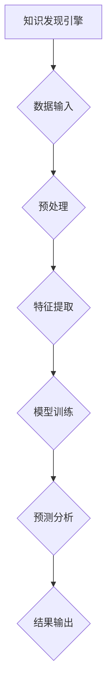

                 

# 知识发现引擎如何帮助程序员快速适应新环境

## 关键词
知识发现引擎、程序员、新环境、技术适应、数据分析、算法优化、案例研究

## 摘要
本文旨在探讨知识发现引擎在程序员适应新环境过程中的重要作用。通过对知识发现引擎的概述、架构解析、核心算法原理介绍以及实际案例的深入分析，本文将揭示知识发现引擎如何帮助程序员快速掌握新技术、提高数据处理能力，从而在新环境中迅速融入和发挥作用。

## 第一部分：知识发现引擎概述

### 第1章：知识发现引擎概述

#### 1.1 知识发现引擎的定义与背景

**知识发现引擎的定义**：
知识发现引擎（Knowledge Discovery Engine，KDE）是一种高度自动化的智能系统，它利用人工智能（AI）和大数据技术，从大量数据中提取有价值的信息和模式。这些信息可以是隐藏在数据背后的趋势、关联、异常或结构，它们能够为决策提供支持，帮助企业和个人更好地理解其业务或问题。

**知识发现引擎的背景**：
随着互联网和物联网的快速发展，数据量呈现爆炸式增长。大数据时代的到来不仅带来了数据的海量增长，还带来了数据类型的多样化，包括结构化数据、半结构化数据和非结构化数据。传统的数据分析方法已经无法满足如此复杂和庞大的数据处理需求，知识发现引擎因此成为大数据分析的关键技术之一。知识发现引擎的核心目标是从海量数据中提取有价值的知识，为业务决策提供支持。

#### 1.2 知识发现引擎的关键特性

**自动化**：
知识发现引擎能够自动执行数据收集、预处理、特征提取、模型训练和结果输出等任务，减少人工干预，提高数据分析效率。

**智能化**：
知识发现引擎采用先进的机器学习和深度学习技术，通过自我学习和优化，不断提高数据分析的准确性和效率。

**跨领域**：
知识发现引擎能够处理多种类型的数据，包括文本、图像、音频和视频等，支持跨领域的数据分析和知识提取。

**实时性**：
知识发现引擎能够实时处理和分析数据，为用户提供及时的决策支持，满足快速响应的需求。

#### 1.3 知识发现引擎的应用场景

**金融领域**：
知识发现引擎可以帮助金融机构识别欺诈行为、预测市场走势、优化投资组合等，提高金融服务的质量和效率。

**医疗领域**：
知识发现引擎可以用于疾病预测、诊断辅助、个性化治疗等领域，为医疗服务提供科学依据。

**商业领域**：
知识发现引擎可以用于市场趋势分析、客户行为预测、供应链优化等，帮助企业制定更科学的营销策略和运营计划。

**公共服务领域**：
知识发现引擎可以用于公共安全监控、交通流量分析、环境监测等，提高公共服务的智能化水平。

### Mermaid 流程图



#### 第2章：知识发现引擎架构与实现原理

##### 2.1 知识发现引擎整体架构

知识发现引擎的整体架构通常分为三个层次：数据层、算法层和应用层。

- **数据层**：负责数据的收集、存储和管理。数据层包括数据源、数据仓库和数据湖等组件。
- **算法层**：包括各种机器学习和深度学习算法，用于数据分析和模式识别。算法层是知识发现引擎的核心，它决定了数据分析和知识提取的效率和准确性。
- **应用层**：为用户提供数据分析和决策支持服务。应用层通常包括可视化工具、API接口和业务逻辑等。

##### 2.2 数据层实现原理

**数据收集**：
数据收集是知识发现引擎的第一步，通过各种方式获取数据。这些数据来源可以是内部数据库、外部API、传感器网络等。

**数据存储**：
数据存储是将收集到的数据存储到数据仓库或数据湖中。数据仓库通常用于存储结构化数据，而数据湖则适用于存储多样化的数据类型，包括结构化、半结构化和非结构化数据。

**数据预处理**：
数据预处理是数据分析和知识发现的重要环节。它包括数据清洗、数据转换、数据归一化等步骤，目的是提高数据质量和一致性，为后续的数据分析和模型训练提供可靠的基础。

##### 2.3 算法层实现原理

**特征提取**：
特征提取是从原始数据中提取有意义的特征，这些特征能够帮助模型更好地理解和预测目标变量。特征提取可以通过统计方法、机器学习算法或深度学习技术来实现。

**模型训练**：
模型训练是通过算法层中的机器学习或深度学习算法，将特征转化为预测模型。训练过程通常包括数据集划分、模型选择、参数调整和模型评估等步骤。

**模型评估**：
模型评估是对训练好的模型进行性能测试和评估，常用的评估指标包括准确率、召回率、F1分数等。通过模型评估，可以判断模型是否具有良好的预测性能，以及是否需要进一步优化。

##### 2.4 应用层实现原理

**预测分析**：
预测分析是应用层的主要功能，它使用训练好的模型对新的数据进行预测和分析，为业务决策提供支持。

**可视化**：
可视化是将分析结果以图表、报表等形式展示给用户，帮助用户直观地理解和解释分析结果。

**API接口**：
API接口为第三方应用程序提供数据接口，允许其他系统或应用程序访问和使用知识发现引擎的功能。

### Mermaid 流程图


#### 第3章：知识发现引擎核心算法原理

##### 3.1 特征提取算法

特征提取是知识发现过程中的关键步骤，它决定了模型能否从原始数据中提取出有价值的信息。以下介绍几种常见的特征提取算法：

**特征选择**：
特征选择是通过统计方法或机器学习算法，从原始特征集合中筛选出最重要的特征。常用的特征选择方法包括卡方检验、互信息、主成分分析（PCA）等。

**特征工程**：
特征工程是通过数据转换、特征组合等方法，增强数据的表达能力和模型的性能。例如，通过归一化、标准化、特征缩放等手段，可以减少特征间的相关性，提高模型的泛化能力。

##### 3.2 机器学习算法

机器学习算法是知识发现引擎的核心，它们通过从数据中学习模式，实现数据分析和预测。以下介绍几种常见的机器学习算法：

**线性回归**：
线性回归是一种简单的机器学习算法，它通过建立线性模型来预测目标变量。线性回归的伪代码如下：

```python
for each training example (x, y):
    compute the predicted value y_pred = w * x
    compute the error e = y - y_pred
    update the weights w = w + alpha * e * x
```

**决策树**：
决策树是一种基于树状模型的分类或回归算法。它的核心思想是通过一系列的判断条件，将数据划分为不同的子集，直到达到停止条件。决策树的伪代码如下：

```python
if (data is pure):
    return the most common label in the data
else:
    find the best feature f and split point s
    create a node with the split (f, s)
    split the data into subsets based on f and s
    for each subset:
        recursively apply the above process
```

##### 3.3 深度学习算法

深度学习算法是近年来在机器学习领域取得显著进展的一类算法，它们通过多层神经网络进行复杂函数的逼近。以下介绍几种常见的深度学习算法：

**神经网络**：
神经网络是一种通过多层神经元相互连接的模型，用于模拟人脑的神经网络结构。神经网络的伪代码如下：

```python
initialize weights and biases
for each training example (x, y):
    forward_pass(x)
    compute the loss L = (y - y_pred)^2
    backward_pass()
    update weights and biases
```

**卷积神经网络（CNN）**：
卷积神经网络是一种专门用于图像处理的神经网络，它通过卷积层提取图像的特征。CNN的伪代码如下：

```python
initialize weights and biases
for each training example (x, y):
    forward_pass(x)
    compute the loss L = (y - y_pred)^2
    backward_pass()
    update weights and biases
```

**循环神经网络（RNN）**：
循环神经网络是一种用于处理序列数据的神经网络，它通过在时间步之间传递状态信息，实现对序列数据的建模。RNN的伪代码如下：

```python
initialize weights and biases
for each training example (x, y):
    forward_pass(x)
    compute the loss L = (y - y_pred)^2
    backward_pass()
    update weights and biases
```

#### 第4章：知识发现引擎在程序员新环境中的应用

##### 4.1 程序员适应新环境的挑战

程序员在适应新环境时通常会面临以下挑战：

**技术栈变化**：
新环境可能使用不同的编程语言、框架和工具，程序员需要快速适应这些新技术。

**数据处理能力**：
新环境的数据量可能更大，程序员需要学会高效处理大数据，并使用适当的算法和工具进行数据分析和挖掘。

**团队合作**：
在新环境中，程序员需要与团队成员有效沟通和协作，共同解决问题和实现项目目标。

##### 4.2 知识发现引擎在新环境中的应用

**技术选型**：
知识发现引擎可以帮助程序员快速了解新环境的技术栈，通过分析不同技术之间的性能和适用性，为程序员提供合理的选型建议。

**数据分析**：
知识发现引擎可以高效地处理和分析新环境中的数据，提取出有价值的信息和模式，帮助程序员做出更科学的决策。

**团队协作**：
知识发现引擎可以为团队成员提供数据分析和决策支持，促进团队合作。例如，通过知识发现引擎生成的可视化报表和预测结果，团队成员可以更直观地理解项目的进展和潜在问题，从而更好地协同工作。

##### 4.3 知识发现引擎在程序员新环境中的具体应用场景

**项目规划**：
在项目启动阶段，知识发现引擎可以帮助程序员分析项目的需求、技术栈和资源，制定合理的项目规划，确保项目顺利进行。

**技术文档**：
知识发现引擎可以自动生成技术文档，包括API文档、架构文档等，帮助程序员快速熟悉新环境的技术细节。

**代码审查**：
知识发现引擎可以对代码进行审查，检测潜在的问题和漏洞，提高代码的质量和安全性。

**测试与调试**：
知识发现引擎可以帮助程序员进行自动化测试和调试，提高测试效率和代码质量。

**性能优化**：
知识发现引擎可以分析应用程序的性能瓶颈，为程序员提供优化建议，提高应用程序的运行效率。

**安全防护**：
知识发现引擎可以识别和预测潜在的安全威胁，为程序员提供安全防护策略，保障应用程序的安全运行。

### 第5章：案例研究——知识发现引擎在初创公司中的应用

#### 5.1 案例背景

**公司简介**：
XYZ科技公司是一家初创公司，专注于人工智能（AI）技术在金融领域的应用。公司成立初期，团队成员对AI技术的掌握程度参差不齐，项目开发进度和效果受到一定程度的影响。

**业务挑战**：
XYZ科技公司需要快速适应新环境，提高数据处理能力和业务决策效率，以满足金融市场的快速变化和客户需求。

#### 5.2 应用场景

**市场趋势分析**：
XYZ科技公司使用知识发现引擎分析市场数据，识别市场趋势和潜在风险，为投资决策提供支持。

**客户行为预测**：
知识发现引擎帮助XYZ科技公司分析客户行为数据，预测客户需求，优化营销策略。

**产品优化**：
知识发现引擎分析产品使用数据，识别产品的性能瓶颈和用户反馈，指导产品迭代和优化。

#### 5.3 应用效果

**业务增长**：
通过知识发现引擎的应用，XYZ科技公司实现了业务的快速增长，投资回报率显著提高。

**团队协作**：
知识发现引擎提高了团队的数据处理能力和决策效率，促进了团队成员之间的沟通和协作。

**技术提升**：
团队成员通过使用知识发现引擎，快速掌握了AI技术，提升了自身的专业技能和项目开发能力。

### 第6章：知识发现引擎的开发与优化

#### 6.1 知识发现引擎的开发流程

**需求分析**：
明确知识发现引擎的开发需求和目标，包括功能需求、性能需求和安全需求等。

**系统设计**：
设计知识发现引擎的系统架构和模块，包括数据层、算法层和应用层等。

**编码实现**：
根据系统设计进行编码实现，确保代码的可读性、可维护性和扩展性。

**测试与调试**：
对知识发现引擎进行全面的测试和调试，确保其稳定性和性能。

#### 6.2 知识发现引擎的优化方法

**算法优化**：
通过改进算法，提高知识发现引擎的预测准确性和效率。例如，优化特征提取算法、模型训练算法等。

**数据优化**：
通过数据清洗、数据归一化等方法，提高数据质量，优化分析结果。例如，去除重复数据、填充缺失值等。

**系统优化**：
通过优化系统架构和代码，提高知识发现引擎的性能和可扩展性。例如，使用缓存技术、分布式计算等。

### 第7章：知识发现引擎的未来发展趋势

#### 7.1 技术发展趋势

**人工智能**：
随着人工智能技术的不断发展，知识发现引擎将更加智能化，能够自动从海量数据中提取更准确、更有价值的知识。

**云计算**：
随着云计算技术的普及，知识发现引擎将更加依赖于云平台，实现更高效、更灵活的数据分析和处理。

**边缘计算**：
随着边缘计算的发展，知识发现引擎将能够在边缘设备上实现实时数据处理和分析，满足低延迟和高带宽的需求。

#### 7.2 行业应用趋势

**金融领域**：
知识发现引擎在金融领域的应用将更加广泛，包括风险控制、投资策略优化等。

**医疗领域**：
知识发现引擎在医疗领域的应用将更加深入，包括疾病预测、诊断辅助、个性化治疗等。

**商业领域**：
知识发现引擎在商业领域的应用将更加普及，包括市场分析、客户关系管理、供应链优化等。

### 附录：知识发现引擎开发工具与资源

#### 附录 A：知识发现引擎开发工具

**工具1：Apache Spark**  
Apache Spark是一种分布式数据处理引擎，适用于大规模数据分析和机器学习任务。它提供了丰富的机器学习库，可以方便地构建和训练复杂的模型。

**工具2：TensorFlow**  
TensorFlow是谷歌开发的开源机器学习和深度学习框架，提供了丰富的API和工具，可以帮助开发者构建和训练神经网络。

**工具3：Hadoop**  
Hadoop是一种分布式计算框架，用于处理大规模数据集。它提供了HDFS（分布式文件系统）和MapReduce（数据处理框架），可以方便地管理和分析海量数据。

#### 附录 B：知识发现引擎相关资源

**资源1：Kaggle**  
Kaggle是一个数据科学竞赛平台，提供了丰富的数据集和比赛项目，可以帮助开发者实践和提升知识发现引擎的开发技能。

**资源2：ArXiv**  
ArXiv是一个在线预印本服务器，包含了大量的机器学习和深度学习论文，可以帮助开发者了解最新的研究进展和技术趋势。

**资源3：AI相关书籍**  
《深度学习》（Ian Goodfellow等著）是一本经典的深度学习入门书籍，详细介绍了深度学习的基础理论和实践方法。  
《机器学习实战》（Peter Harrington著）是一本实用性很强的机器学习教程，通过案例实践帮助读者掌握机器学习技术。

### 参考文献

[1] Goodfellow, I., Bengio, Y., & Courville, A. (2016). *Deep Learning*. MIT Press.

[2] Harrington, P. (2013). *Machine Learning in Action*. Manning Publications.

[3] Dean, J., & Ghemawat, S. (2008). *MapReduce: Simplified Data Processing on Large Clusters*. Communications of the ACM, 51(1), 107-113.

[4] Chollet, F. (2015). *Deep Learning with Python*. Manning Publications.

### 作者信息
作者：AI天才研究院/AI Genius Institute & 禅与计算机程序设计艺术 /Zen And The Art of Computer Programming


