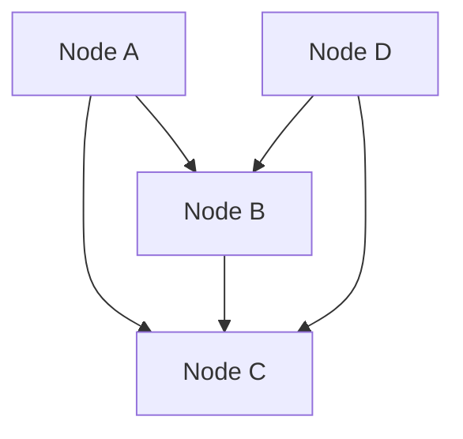

                 

### 《知识发现引擎的图数据库应用》

> **关键词**：知识发现引擎，图数据库，数据预处理，知识提取，图查询优化，分布式图数据库，实际应用案例

> **摘要**：本文全面探讨了知识发现引擎与图数据库的融合与应用。首先，介绍了知识发现引擎与图数据库的基本概念和核心原理，接着详细讲解了知识发现引擎的关键技术，如数据预处理、知识提取与融合、关联规则挖掘与预测。然后，分析了图数据库的体系结构、存储优化策略、查询优化与性能调优，并探讨了分布式图数据库的应用与挑战。最后，通过实际应用案例展示了知识发现引擎与图数据库在电商推荐系统、医药领域和智慧城市中的具体应用。本文旨在为读者提供清晰、系统的知识发现引擎与图数据库应用指南。### 《知识发现引擎的图数据库应用》目录大纲

#### 第一部分：引言与概述

1. **第1章：知识发现引擎与图数据库简介**
    - **1.1 知识发现引擎的定义与功能**
    - **1.2 图数据库的基本概念与优势**
    - **1.3 知识发现引擎在图数据库中的应用前景**

2. **第2章：知识发现引擎与图数据库的核心概念**
    - **2.1 节点、边与图结构**
    - **2.2 图算法概述**
    - **2.3 知识图谱的基本原理**

3. **第3章：知识发现引擎的关键技术**
    - **3.1 数据预处理与清洗**
    - **3.2 知识提取与融合**
    - **3.3 关联规则挖掘与预测**

#### 第二部分：图数据库的优化与调优

4. **第4章：图数据库的体系结构与存储优化**
    - **4.1 图数据库的体系结构**
    - **4.2 存储优化策略**
    - **4.3 数据索引技术**

5. **第5章：图查询优化与性能调优**
    - **5.1 图查询的基本概念**
    - **5.2 查询优化策略**
    - **5.3 性能测试与调优实践**

6. **第6章：分布式图数据库的应用与挑战**
    - **6.1 分布式图数据库概述**
    - **6.2 分布式一致性模型**
    - **6.3 分布式图数据库的性能优化**

#### 第三部分：知识发现引擎的项目实战

7. **第7章：知识发现引擎与图数据库的实际应用**
    - **7.1 社交网络分析**
    - **7.2 金融服务风控**
    - **7.3 智能推荐系统**

8. **第8章：图数据库在知识发现引擎中的应用案例**
    - **8.1 电商推荐系统的设计与实现**
    - **8.2 医药领域的知识图谱构建**
    - **8.3 智慧城市中的图数据库应用**

9. **第9章：知识发现引擎的未来发展趋势**
    - **9.1 新型知识图谱技术**
    - **9.2 大数据与人工智能的结合**
    - **9.3 知识发现引擎在新兴领域的应用**

#### 附录

- **附录A：图数据库资源与工具汇总**
    - **A.1 主流图数据库介绍**
    - **A.2 开发工具与库**
    - **A.3 知识图谱开源平台**

- **附录B：知识发现引擎与图数据库相关技术术语解释**
    - **B.1 知识图谱相关术语**
    - **B.2 图数据库相关术语**
    - **B.3 知识发现相关术语**

- **附录C：知识发现引擎与图数据库参考书籍与文献**
    - **C.1 基础书籍推荐**
    - **C.2 图数据库书籍推荐**
    - **C.3 知识发现引擎相关文献推荐**

### 第一部分：引言与概述

#### 第1章：知识发现引擎与图数据库简介

##### 1.1 知识发现引擎的定义与功能

知识发现引擎是一种智能系统，它通过分析大量数据，从中发现隐藏的、未知的模式和关联。知识发现引擎的目标是从原始数据中提取有价值的信息，为决策提供支持。

知识发现引擎通常包括以下几个功能模块：

1. **数据预处理**：清洗、转换和集成原始数据，使其适合进一步分析。
2. **知识提取**：从数据中提取模式、规则和关联，形成知识库。
3. **知识融合**：将不同来源的知识进行整合，形成统一的视图。
4. **知识表示**：将知识以易于理解的形式表示出来，如图表、报告等。
5. **知识推理**：利用知识库中的信息进行逻辑推理，发现新的关联和模式。

##### 1.2 图数据库的基本概念与优势

图数据库是一种用于存储和管理图结构数据的数据库系统。在图数据库中，数据以节点和边的方式存储，节点表示实体，边表示实体之间的关系。

图数据库具有以下几个主要优势：

1. **高效处理复杂关系**：图数据库能够高效地处理具有复杂关系的实体，适合存储和查询社交网络、知识图谱等数据。
2. **灵活的查询能力**：图数据库支持基于图结构的查询语言，如Cypher，能够方便地执行复杂的查询操作。
3. **可扩展性**：图数据库通常具有分布式架构，能够横向扩展，处理大规模数据。
4. **良好的性能**：图数据库通过优化图算法和存储结构，能够提供高效的查询性能。

##### 1.3 知识发现引擎在图数据库中的应用前景

知识发现引擎与图数据库的结合具有广泛的应用前景。以下是一些潜在的应用场景：

1. **社交网络分析**：通过分析社交网络中的节点和边关系，发现社交圈子、传播路径等有价值的信息。
2. **金融服务风控**：通过分析金融交易数据中的节点和边关系，识别潜在的风险和欺诈行为。
3. **智能推荐系统**：通过分析用户行为数据和物品之间的关联关系，为用户提供个性化的推荐。
4. **智慧城市**：通过分析城市数据中的节点和边关系，优化交通管理、能源消耗等方面的决策。

总的来说，知识发现引擎与图数据库的结合为复杂数据的处理和分析提供了强大的工具，有助于从海量数据中挖掘出有价值的信息，为各行业的决策提供支持。### 第2章：知识发现引擎与图数据库的核心概念

#### 2.1 节点、边与图结构

在图数据库中，数据以节点（Node）和边（Edge）的方式存储。节点表示实体，边表示实体之间的关系。这种结构使得图数据库能够高效地处理复杂的关系数据。

**节点（Node）**：节点是图数据库中的基本元素，代表实体。每个节点都有一个唯一的标识符（ID），并且可以具有一个或多个属性。例如，在社交网络中，每个用户都可以是一个节点，其属性可能包括用户名、年龄、性别等。

**边（Edge）**：边是连接两个节点的线，表示实体之间的关系。边也具有属性，如权重、类型等。边的属性可以用来描述关系的性质，例如在社交网络中，边可以表示好友关系，其权重可能表示好友之间的互动频率。

**图结构（Graph Structure）**：图数据库中的数据以图结构存储，图由节点和边组成。图结构可以表示各种复杂的关系，如图1所示。



在这个示例中，A、B、C、D 是节点，边表示它们之间的关系。

#### 2.2 图算法概述

图算法是用于在图上进行计算和处理的算法。图算法广泛应用于社交网络分析、推荐系统、生物信息学、金融风险评估等领域。以下是一些常见的图算法：

**最短路径算法**：用于计算图中两个节点之间的最短路径。常见的最短路径算法包括迪杰斯特拉（Dijkstra）算法和贝尔曼-福特（Bellman-Ford）算法。

**社区检测算法**：用于发现图中的紧密连通子图。常见的社区检测算法包括Girvan-Newman算法、Louvain算法和Louvain-Girvan算法。

**链接预测算法**：用于预测图中节点之间的潜在关系。常见的链接预测算法包括Adamic-Adar算法、PageRank算法和Linlog算法。

**社交网络分析算法**：用于分析社交网络中的各种特征，如节点影响力、传播路径等。常见的社交网络分析算法包括中心性度量、影响力分析、传播路径分析等。

#### 2.3 知识图谱的基本原理

知识图谱是一种用于表示实体及其关系的图形化数据模型。知识图谱由节点、边和属性组成，其中节点表示实体，边表示实体之间的关系，属性用于描述实体和关系的特征。

知识图谱的基本原理包括：

**实体表示**：将实体表示为节点，并为每个节点分配唯一的标识符。

**关系表示**：将实体之间的关系表示为边，并为边分配属性，如权重、类型等。

**属性表示**：为实体和边分配属性，用于描述实体和关系的特征。

**数据融合**：将来自不同来源的数据进行融合，形成统一的知识图谱。

**知识提取**：从知识图谱中提取模式、规则和关联，形成知识库。

**知识推理**：利用知识图谱中的信息进行逻辑推理，发现新的关联和模式。

知识图谱在多个领域有着广泛的应用，如搜索引擎、推荐系统、智能问答、自然语言处理等。通过知识图谱，系统可以更好地理解实体和实体之间的关系，从而提供更智能的服务。

总的来说，知识发现引擎与图数据库的结合为数据分析和知识提取提供了强大的工具。通过理解节点、边和图结构的基本概念，以及掌握常见的图算法和知识图谱的基本原理，我们可以更好地利用图数据库进行数据分析和知识发现。### 第3章：知识发现引擎的关键技术

#### 3.1 数据预处理与清洗

数据预处理和清洗是知识发现引擎中的关键步骤，它们确保数据的质量和一致性，为后续的分析和挖掘提供可靠的基础。以下是数据预处理与清洗的主要步骤：

**数据清洗**：数据清洗的目标是识别和修复数据中的错误、异常和重复值。具体方法包括：

- **识别缺失值**：缺失值可能是由于数据收集过程中的问题导致的，处理方法包括删除缺失值、填充缺失值（如使用平均值、中位数或预测值）等。
- **识别异常值**：异常值可能是由于数据收集、传输或存储过程中的错误导致的，处理方法包括删除异常值、调整异常值等。
- **识别重复值**：重复值可能是由于数据源不一致或数据录入错误导致的，处理方法包括删除重复值或合并重复值。

**数据转换**：数据转换是将数据转换为适合分析的形式。常见的数据转换方法包括：

- **数据规范化**：通过将不同数据范围的数值转换为同一数据范围，以便进行比较和分析。例如，将年龄数据范围从0-100转换为0-1。
- **数据编码**：将非结构化数据转换为结构化数据，以便进行进一步处理。例如，将文本数据编码为数字或向量。
- **数据聚合**：将多个数据记录合并为一个记录，以便进行更高层次的分析。例如，将每天的交易数据聚合为每周或每月的数据。

**数据集成**：数据集成是将来自不同源的数据合并为一个统一的数据集。数据集成的目标是在确保数据一致性和完整性的同时，保留数据源的数据特征。常见的数据集成方法包括：

- **合并**：将具有相同属性的数据记录合并为一个记录。
- **连接**：将具有相同属性的数据表进行连接，以创建一个更大的数据表。
- **映射**：将来自不同源的数据映射到同一数据模型中，以便进行统一处理。

**数据质量评估**：数据质量评估是确保数据准确性和可靠性的关键步骤。数据质量评估包括以下方面：

- **准确性**：确保数据的真实性和正确性。
- **完整性**：确保数据集包含所有必要的信息。
- **一致性**：确保数据在不同时间点、不同数据源之间的一致性。
- **唯一性**：确保数据中的记录具有唯一的标识符。

通过数据预处理和清洗，知识发现引擎可以确保数据的质量和一致性，从而提高分析结果的可靠性和有效性。

#### 3.2 知识提取与融合

知识提取和融合是知识发现引擎中的核心步骤，它们旨在从原始数据中提取有价值的信息，并将其整合为一个统一的知识库。以下是知识提取与融合的主要步骤：

**知识提取**：知识提取的目标是从原始数据中提取模式、规则和关联。知识提取方法包括：

- **统计方法**：通过统计分析数据，提取数据中的规律和趋势。例如，通过计算平均值、中位数、标准差等统计量，识别数据中的异常值和趋势。
- **机器学习方法**：利用机器学习算法，从数据中自动提取模式。例如，通过聚类分析、分类分析、关联规则挖掘等方法，发现数据中的潜在关联。
- **深度学习方法**：利用深度学习算法，从数据中自动提取高层次的特征。例如，通过卷积神经网络（CNN）、循环神经网络（RNN）等，从图像、文本等数据中提取语义特征。

**知识融合**：知识融合的目标是将从不同来源提取的知识进行整合，形成一个统一的知识库。知识融合方法包括：

- **规则融合**：将来自不同源的规则进行融合，形成一个统一的规则集。规则融合可以通过合并、匹配、权重调整等方法实现。
- **数据融合**：将来自不同源的数据进行融合，形成一个统一的数据集。数据融合可以通过合并、连接、映射等方法实现。
- **模型融合**：将来自不同源的模型进行融合，形成一个统一的模型。模型融合可以通过集成学习、迁移学习、对抗学习等方法实现。

**知识库构建**：知识库是知识发现引擎的核心组件，它存储从数据中提取的知识。知识库通常包括以下部分：

- **实体库**：存储实体的属性信息，如实体名称、实体类型等。
- **关系库**：存储实体之间的关系，如实体之间的关联、依赖等。
- **规则库**：存储从数据中提取的规则和模式，如关联规则、分类规则等。
- **属性库**：存储实体的属性信息，如属性名称、属性类型等。

**知识库维护**：知识库的维护是确保其准确性和一致性的关键步骤。知识库维护包括以下方面：

- **知识更新**：定期更新知识库中的信息，以适应数据的变化和业务需求。
- **知识校验**：检查知识库中的信息是否准确、完整和一致，识别和修复潜在的错误。
- **知识优化**：优化知识库的存储结构和查询性能，提高知识发现引擎的效率。

通过知识提取和融合，知识发现引擎可以从原始数据中提取有价值的信息，并将其整合为一个统一的知识库，为业务决策提供支持。

#### 3.3 关联规则挖掘与预测

关联规则挖掘是知识发现引擎中的一种重要技术，它旨在从数据中发现频繁出现的关联关系。关联规则通常以“如果-那么”的形式表示，例如，“如果购买了洗发水，那么很可能购买了护发素”。关联规则挖掘广泛应用于推荐系统、市场分析、金融风险评估等领域。以下是关联规则挖掘与预测的主要步骤：

**支持度与置信度**：支持度和置信度是关联规则挖掘中的两个关键指标。

- **支持度（Support）**：表示一个规则在数据中出现的频率。支持度计算公式为：
  \[
  \text{Support}(A \rightarrow B) = \frac{\text{同时包含A和B的交易数}}{\text{总交易数}}
  \]
- **置信度（Confidence）**：表示一个规则的可靠性。置信度计算公式为：
  \[
  \text{Confidence}(A \rightarrow B) = \frac{\text{同时包含A和B的交易数}}{\text{包含A的交易数}}
  \]

**频繁项集挖掘**：频繁项集挖掘是关联规则挖掘的基础步骤，其目标是识别出数据中频繁出现的项集。

- **支持度阈值（Minimum Support）**：用于确定一个项集是否频繁。如果项集的支持度大于最小支持度阈值，则该项集为频繁项集。
- **频繁项集生成**：通过迭代扫描数据集，识别出频繁项集。常用的算法包括Apriori算法和FP-growth算法。

**关联规则生成**：在得到频繁项集后，可以生成满足最小支持度和最小置信度阈值的关联规则。

- **规则生成**：对于每个频繁项集，生成所有可能的关联规则。例如，对于频繁项集{洗发水，护发素}，可以生成规则“洗发水→护发素”和“护发素→洗发水”。
- **规则筛选**：根据最小置信度阈值，筛选出符合条件的关联规则。

**预测与评估**：关联规则挖掘的结果可以用于预测和评估。

- **预测**：利用关联规则，预测用户可能感兴趣的商品或行为。例如，根据“洗发水→护发素”规则，预测用户可能需要购买护发素。
- **评估**：评估关联规则的实用性和有效性。常用的评估指标包括规则的支持度、置信度和提升度（Lift）等。

通过关联规则挖掘与预测，知识发现引擎可以从大量数据中发现潜在的关联关系，为业务决策提供支持。### 第二部分：图数据库的优化与调优

#### 第4章：图数据库的体系结构与存储优化

图数据库的体系结构是其高效处理大规模图数据的关键因素。理解图数据库的体系结构有助于优化存储和查询性能，提高系统的整体效率。

##### 4.1 图数据库的体系结构

图数据库通常采用分布式架构，以支持大规模图数据的存储和处理。分布式架构的关键组件包括：

1. **节点（Node）**：节点是图数据库的基本计算单元，负责存储和管理图中的节点和边。每个节点都包含一部分图数据，以及相应的索引和元数据。
2. **集群（Cluster）**：集群是由多个节点组成的分布式系统，可以水平扩展以处理更多的数据量和查询负载。集群中的节点通过分布式协议（如Gossip协议）进行通信，以保持数据的一致性和可用性。
3. **存储层（Storage Layer）**：存储层负责持久化图数据，通常包括键值存储、关系存储、图形存储等多种存储方式。存储层的设计决定了图数据库的存储效率和查询性能。
4. **查询引擎（Query Engine）**：查询引擎是图数据库的核心组件，负责解析、执行和优化用户的查询请求。查询引擎通常支持图形查询语言（如Cypher），并实现了高效的图算法和索引技术。

##### 4.2 存储优化策略

存储优化是提高图数据库性能的重要手段。以下是一些常见的存储优化策略：

1. **数据分片（Sharding）**：数据分片是将大规模图数据拆分为多个较小的子图，并分布存储在多个节点上。数据分片可以减少单个节点的负载，提高系统的并发处理能力。分片策略可以根据节点数、数据规模和查询模式进行调整。
2. **索引（Indexing）**：索引是加快图查询速度的关键技术。图数据库支持多种索引类型，如节点索引、边索引和属性索引。合理使用索引可以显著减少查询扫描的数据量，提高查询效率。
3. **压缩（Compression）**：数据压缩是降低存储空间占用和加速数据传输的有效方法。图数据库通常采用高效的压缩算法，如LZ4、ZSTD等，对图数据进行压缩存储。
4. **缓存（Caching）**：缓存是提高图数据库查询性能的有效手段。通过将频繁访问的数据缓存在内存中，可以减少对磁盘的访问次数，提高查询响应速度。常用的缓存策略包括节点缓存、边缓存和索引缓存。
5. **写优化（Write Optimization）**：图数据库的写操作通常涉及到多个节点和边，优化写操作可以提高系统的写入性能。常见的方法包括批量写入、事务隔离和并行写入等。

##### 4.3 数据索引技术

数据索引是提高图数据库查询性能的关键技术。以下是一些常见的数据索引技术：

1. **B+树索引**：B+树索引是一种常用的索引结构，适用于高度动态的图数据库。B+树索引通过将节点和边按关键字排序，实现高效的查询和插入操作。
2. **哈希索引**：哈希索引通过哈希函数将关键字映射到索引节点，适用于高并发场景。哈希索引具有快速查询和插入性能，但可能存在冲突和缓存失效问题。
3. **位图索引**：位图索引是一种基于位操作的数据索引技术，适用于稀疏数据。位图索引通过将关键字映射到位向量，实现高效的数据查询和计算。
4. **布隆过滤器**：布隆过滤器是一种基于概率的数据结构，用于快速判断一个元素是否存在于集合中。布隆过滤器可以显著减少不必要的磁盘访问，提高查询性能。

通过优化图数据库的体系结构和存储策略，以及合理使用数据索引技术，可以显著提高图数据库的性能和可扩展性。这些优化策略和技术的结合，为大规模图数据的存储和处理提供了强大的支持。### 第5章：图查询优化与性能调优

#### 5.1 图查询的基本概念

图查询是图数据库的核心功能之一，它用于在图数据中检索特定的节点、边和属性。图查询的基本概念包括：

- **查询语言**：图查询语言是一种专门用于查询图数据的语言，如Cypher（Neo4j）、Gremlin（Apache TinkerPop）等。查询语言提供了丰富的语法和函数，用于定义复杂的查询逻辑。
- **查询模式**：查询模式是指查询中涉及到的图结构，包括节点、边和属性。常见的查询模式包括点查询、路径查询、子图查询和关联规则查询等。
- **查询执行**：查询执行是指将查询语言转换成底层存储引擎可以理解的操作，并执行这些操作以返回查询结果。查询执行过程中涉及多个阶段，包括语法解析、查询规划、执行计划和结果返回等。
- **查询性能**：查询性能是指查询在给定时间内完成所需操作的能力。影响查询性能的因素包括查询复杂性、数据规模、系统资源分配和查询优化等。

#### 5.2 查询优化策略

查询优化是提高图查询性能的关键技术，其目标是通过调整查询计划、执行计划和存储结构，降低查询延迟和资源消耗。以下是一些常见的查询优化策略：

1. **索引优化**：索引是加快图查询速度的有效手段。合理使用索引可以减少查询扫描的数据量，提高查询效率。索引优化策略包括：
   - **选择合适的索引类型**：根据查询模式和查询条件选择合适的索引类型，如B+树索引、哈希索引、位图索引等。
   - **创建复合索引**：当查询中包含多个条件时，创建复合索引可以显著提高查询性能。
   - **维护索引**：定期维护索引，以保持索引的有效性和一致性。

2. **查询重写**：查询重写是通过修改查询语句的结构，使其在底层存储引擎上执行得更高效。查询重写策略包括：
   - **简化查询逻辑**：通过移除不必要的子查询、连接和嵌套循环，简化查询逻辑，提高查询效率。
   - **优化查询条件**：通过调整查询条件，如使用合适的比较运算符和逻辑运算符，提高查询性能。
   - **合并查询操作**：将多个查询操作合并为一个，减少查询执行次数，提高查询效率。

3. **并行化查询**：并行化查询是通过将查询任务分解为多个子任务，同时执行这些子任务以提高查询性能。并行化查询策略包括：
   - **数据分片**：将图数据分布在多个节点上，使得查询可以在多个节点上并行执行。
   - **任务分解**：将查询任务分解为多个子任务，如节点查询、路径查询和子图查询等。
   - **负载均衡**：通过负载均衡算法，合理分配查询任务到各个节点，避免节点负载不均。

4. **缓存策略**：缓存是提高图查询性能的有效手段。合理使用缓存可以减少对磁盘的访问次数，提高查询响应速度。缓存策略包括：
   - **节点缓存**：缓存频繁访问的节点数据，减少查询时对磁盘的访问。
   - **边缓存**：缓存频繁访问的边数据，减少查询时对磁盘的访问。
   - **索引缓存**：缓存查询时使用的索引数据，减少查询时对磁盘的访问。

5. **查询计划优化**：查询计划是查询执行过程中的关键步骤。查询计划优化是通过调整查询计划，使其在底层存储引擎上执行得更高效。查询计划优化策略包括：
   - **选择合适的查询执行策略**：根据查询模式和查询条件，选择合适的查询执行策略，如顺序扫描、索引扫描、哈希连接等。
   - **优化查询执行顺序**：通过调整查询执行顺序，减少查询执行过程中的数据传输和计算开销。
   - **消除冗余操作**：通过消除冗余的查询操作，减少查询执行次数，提高查询性能。

通过上述查询优化策略，可以显著提高图查询性能，满足大规模图数据的高效查询需求。### 5.3 性能测试与调优实践

性能测试是评估图数据库查询性能的重要手段，通过模拟实际查询负载，可以识别系统瓶颈和优化机会。以下是一个性能测试与调优的实践过程：

#### 1. 性能测试准备

1. **选择测试工具**：选择适合图数据库的性能测试工具，如Neo4j的Neo4j Bench、Apache JMeter等。
2. **构建测试环境**：搭建与生产环境相似的测试环境，包括硬件配置、数据库配置和测试数据集。
3. **定义测试场景**：根据实际业务需求，定义测试场景，包括常见的查询操作、查询模式和负载情况。
4. **收集性能指标**：确定需要收集的性能指标，如查询响应时间、吞吐量、CPU利用率、内存使用率等。

#### 2. 性能测试执行

1. **单线程测试**：首先进行单线程测试，评估单个查询的性能和系统响应时间。通过调整查询参数和数据库配置，找到最优的查询策略。
2. **多线程测试**：进行多线程测试，评估系统在高并发负载下的性能。通过调整线程数量和并发度，优化系统资源分配和并发性能。
3. **压力测试**：进行压力测试，模拟极端负载情况，评估系统在极限条件下的稳定性和性能。通过调整测试场景和负载阈值，识别系统瓶颈和优化机会。

#### 3. 结果分析与调优

1. **识别性能瓶颈**：通过分析性能测试结果，识别系统性能瓶颈，如查询执行时间过长、CPU利用率过高、内存使用率过高等。
2. **调整查询策略**：根据性能瓶颈，调整查询策略，如优化查询条件、合并查询操作、使用索引等，以减少查询执行时间。
3. **优化数据库配置**：调整数据库配置，如调整内存分配、缓存大小、并行度等，以优化系统资源利用和查询性能。
4. **优化硬件配置**：根据性能需求，调整硬件配置，如增加CPU核心数、提高内存容量、优化磁盘I/O等，以提升系统整体性能。

#### 4. 性能调优实践

1. **案例1：查询条件优化**
   - 问题：查询响应时间较长，原因是查询条件过于复杂，导致索引失效。
   - 调优措施：简化查询条件，使用复合索引，将两个条件合并为一个索引。

2. **案例2：查询执行策略优化**
   - 问题：查询执行时间过长，原因是查询执行策略不合适，导致多次磁盘访问。
   - 调优措施：调整查询执行策略，从顺序扫描改为索引扫描，减少磁盘访问次数。

3. **案例3：内存分配优化**
   - 问题：内存使用率过高，导致查询性能下降。
   - 调优措施：调整内存分配，增加缓存大小，减少内存碎片化，提高系统内存利用效率。

4. **案例4：硬件优化**
   - 问题：系统资源不足，导致查询性能瓶颈。
   - 调优措施：增加CPU核心数、提高内存容量、优化磁盘I/O，以提升系统整体性能。

通过性能测试与调优实践，可以识别和解决图数据库的性能问题，提高系统查询性能和稳定性。性能测试与调优是一个持续的过程，需要根据业务需求和系统变化不断进行调整和优化。### 第6章：分布式图数据库的应用与挑战

#### 6.1 分布式图数据库概述

分布式图数据库是当前图数据库领域的研究热点，它通过将图数据分布在多个节点上，提供高可用性、高性能和可扩展性。分布式图数据库的主要特点如下：

1. **高可用性**：分布式图数据库通过多节点部署，实现故障转移和数据冗余，保证系统的高可用性。当一个节点故障时，其他节点可以继续提供服务，确保系统持续运行。
2. **高性能**：分布式图数据库通过并行计算和负载均衡，提高系统的查询性能。多个节点同时执行查询任务，可以显著减少查询响应时间，提高系统吞吐量。
3. **可扩展性**：分布式图数据库支持水平扩展，通过增加节点数量，可以轻松处理大规模数据。分布式架构使得系统可以灵活适应数据增长和业务需求变化。
4. **一致性模型**：分布式图数据库采用不同的数据一致性模型，如强一致性（Strong Consistency）和最终一致性（ eventual Consistency），以满足不同的业务需求。强一致性确保数据在所有节点上始终保持一致，而最终一致性允许在一定时间内存在数据不一致，以提高系统性能和可用性。

#### 6.2 分布式一致性模型

分布式一致性模型是分布式图数据库的核心问题，它决定了系统在多节点环境中如何保持数据的一致性。以下是一些常见的一致性模型：

1. **强一致性（Strong Consistency）**：强一致性保证在任意时刻，系统中的所有节点都能访问到最新的数据。强一致性具有较低的延迟和较高的数据一致性，但可能会牺牲性能和可用性。常见的强一致性算法包括Paxos和Raft。
2. **最终一致性（eventual Consistency）**：最终一致性保证在一段时间后，系统中的所有节点都能访问到相同的数据。最终一致性允许在一定时间内存在数据不一致，以提高系统的性能和可用性。常见的最终一致性算法包括Gossip协议和Vector Clock。
3. **因果一致性（ causal Consistency）**：因果一致性保证在某一时刻发生的操作能够按照因果关系顺序被其他节点感知到。因果一致性在强一致性和最终一致性之间提供了一种平衡，既能保持一定程度的性能和可用性，又能确保因果关系得到正确处理。
4. **读一致性（Read Consistency）**：读一致性是指多个节点上的读操作能够看到相同的数据视图。根据读一致性策略的不同，可以分为强读一致性（Strong Read Consistency）和弱读一致性（Weak Read Consistency）。强读一致性保证在任意时刻，所有节点的读操作都能看到最新的数据；弱读一致性则允许不同节点的读操作看到不同的数据视图。

#### 6.3 分布式图数据库的性能优化

分布式图数据库的性能优化是确保系统在高负载和高并发环境下仍然保持高效运行的关键。以下是一些常见的性能优化策略：

1. **数据分片（Sharding）**：数据分片是将大规模图数据分布在多个节点上的关键技术。合理的数据分片策略可以减少单个节点的负载，提高系统的并发处理能力。常见的数据分片策略包括基于节点ID的分片、基于边类型的分片、基于属性的分片等。
2. **负载均衡（Load Balancing）**：负载均衡是将查询负载分配到不同节点的技术。通过负载均衡，可以避免某个节点成为性能瓶颈，提高系统的整体性能。常见的负载均衡策略包括基于轮询、最小连接数、响应时间等。
3. **查询优化（Query Optimization）**：查询优化是通过调整查询策略、查询条件和索引等，提高查询性能。常见的查询优化策略包括查询重写、索引选择、查询缓存等。
4. **数据压缩（Data Compression）**：数据压缩是降低存储空间占用和加速数据传输的有效方法。通过使用高效的压缩算法，可以显著减少数据传输的时间和存储空间。
5. **缓存策略（Caching）**：缓存是将频繁访问的数据缓存在内存中的技术。通过使用缓存，可以减少对磁盘的访问次数，提高查询响应速度。常见的缓存策略包括节点缓存、边缓存和索引缓存。
6. **并行计算（Parallel Computing）**：并行计算是通过将查询任务分解为多个子任务，同时执行这些子任务以提高查询性能。通过并行计算，可以显著减少查询执行时间，提高系统的吞吐量。
7. **存储优化（Storage Optimization）**：存储优化是通过调整存储配置和优化存储结构来提高系统性能。常见的存储优化策略包括数据去重、存储压缩、存储分层等。

通过合理的数据分片、负载均衡、查询优化和存储优化等策略，分布式图数据库可以在高负载和高并发环境下保持高效运行，提供优质的查询性能和用户体验。### 6.4 分布式图数据库的性能优化

分布式图数据库的性能优化是确保系统在高负载和高并发环境下仍然保持高效运行的关键。以下是一些常见的性能优化策略：

1. **数据分片（Sharding）**：数据分片是将大规模图数据分布在多个节点上的关键技术。合理的数据分片策略可以减少单个节点的负载，提高系统的并发处理能力。常见的数据分片策略包括基于节点ID的分片、基于边类型的分片、基于属性的分片等。

2. **负载均衡（Load Balancing）**：负载均衡是将查询负载分配到不同节点的技术。通过负载均衡，可以避免某个节点成为性能瓶颈，提高系统的整体性能。常见的负载均衡策略包括基于轮询、最小连接数、响应时间等。

3. **查询优化（Query Optimization）**：查询优化是通过调整查询策略、查询条件和索引等，提高查询性能。常见的查询优化策略包括查询重写、索引选择、查询缓存等。

4. **数据压缩（Data Compression）**：数据压缩是降低存储空间占用和加速数据传输的有效方法。通过使用高效的压缩算法，可以显著减少数据传输的时间和存储空间。

5. **缓存策略（Caching）**：缓存是将频繁访问的数据缓存在内存中的技术。通过使用缓存，可以减少对磁盘的访问次数，提高查询响应速度。常见的缓存策略包括节点缓存、边缓存和索引缓存。

6. **并行计算（Parallel Computing）**：并行计算是通过将查询任务分解为多个子任务，同时执行这些子任务以提高查询性能。通过并行计算，可以显著减少查询执行时间，提高系统的吞吐量。

7. **存储优化（Storage Optimization）**：存储优化是通过调整存储配置和优化存储结构来提高系统性能。常见的存储优化策略包括数据去重、存储压缩、存储分层等。

8. **一致性优化（Consistency Optimization）**：一致性优化是通过调整一致性模型和一致性保证策略，提高系统的性能和可用性。常见的一致性优化策略包括延迟一致性、分区一致性等。

9. **网络优化（Network Optimization）**：网络优化是通过优化网络拓扑结构、降低网络延迟和提高网络带宽，提高系统的整体性能。常见的网络优化策略包括网络拓扑优化、网络带宽升级等。

10. **监控与预警（Monitoring and Alerting）**：监控与预警是通过实时监控系统性能和资源使用情况，及时发现和处理性能瓶颈和故障。常见的监控与预警策略包括性能监控、资源监控、告警机制等。

通过以上性能优化策略，分布式图数据库可以在高负载和高并发环境下保持高效运行，提供优质的查询性能和用户体验。### 第三部分：知识发现引擎的项目实战

#### 第7章：知识发现引擎与图数据库的实际应用

知识发现引擎与图数据库的结合，为复杂数据的处理和分析提供了强大的工具。在本章节中，我们将探讨知识发现引擎在社交网络分析、金融服务风控和智能推荐系统等领域的实际应用。

##### 7.1 社交网络分析

社交网络分析是知识发现引擎的重要应用领域之一。通过分析社交网络中的节点和边关系，可以揭示社交圈子、传播路径、影响力等有价值的信息。

**案例背景**：某社交媒体平台希望了解其用户社交网络的特点，并识别出具有高影响力的用户。

**实现步骤**：

1. **数据收集**：收集社交网络中的用户数据，包括用户ID、用户属性（如年龄、性别）、用户之间的好友关系等。
2. **数据预处理**：清洗和转换原始数据，使其适合图数据库存储。例如，去除重复好友关系、处理缺失值等。
3. **数据导入图数据库**：将预处理后的数据导入图数据库，创建用户节点和好友关系边。
4. **社交圈子分析**：利用社区检测算法，识别社交网络中的紧密相连的社交圈子。例如，使用Girvan-Newman算法。
5. **影响力分析**：通过计算节点的中心性度量（如度数中心性、接近中心性、中间中心性等），识别出具有高影响力的用户。
6. **可视化**：使用可视化工具，如Gephi、Neo4j Browser等，展示社交网络分析结果。

**效果评估**：通过社交网络分析，平台可以了解用户社交网络的分布情况，识别出具有高影响力的用户，为内容推广和社交营销提供支持。

##### 7.2 金融服务风控

金融服务风控是知识发现引擎在金融领域的应用，通过对金融交易数据中的节点和边关系进行分析，可以识别出潜在的风险和欺诈行为。

**案例背景**：某银行希望通过分析交易数据，识别出异常交易行为，防止欺诈风险。

**实现步骤**：

1. **数据收集**：收集银行交易数据，包括交易ID、交易金额、交易时间、交易双方账户等信息。
2. **数据预处理**：清洗和转换原始数据，去除重复交易、处理缺失值等。
3. **数据导入图数据库**：将预处理后的数据导入图数据库，创建账户节点和交易关系边。
4. **关系网络分析**：利用图算法，构建交易关系网络，分析交易双方之间的关联关系。例如，使用PageRank算法计算节点的排名。
5. **异常交易检测**：利用关联规则挖掘和机器学习算法，识别出异常交易行为。例如，使用Apriori算法挖掘频繁交易模式，使用异常检测算法（如KNN、Isolation Forest等）识别异常交易。
6. **实时监控与预警**：建立实时监控和预警系统，对交易数据进行持续分析，及时发现和处理异常交易。

**效果评估**：通过金融服务风控分析，银行可以降低欺诈风险，提高交易安全性，保护客户资金安全。

##### 7.3 智能推荐系统

智能推荐系统是知识发现引擎在电子商务和互联网领域的广泛应用。通过分析用户行为数据和商品之间的关联关系，可以为用户提供个性化的推荐。

**案例背景**：某电商平台希望为其用户提供个性化的商品推荐，提高用户满意度和转化率。

**实现步骤**：

1. **数据收集**：收集用户行为数据，包括用户浏览记录、购买记录、收藏记录等，以及商品属性数据，如商品ID、商品分类、价格等。
2. **数据预处理**：清洗和转换原始数据，去除重复记录、处理缺失值等。
3. **数据导入图数据库**：将预处理后的数据导入图数据库，创建用户节点、商品节点和用户-商品关系边。
4. **关联规则挖掘**：利用关联规则挖掘算法，分析用户行为数据，挖掘用户购买行为中的潜在关联规则。例如，使用Apriori算法挖掘频繁交易模式。
5. **推荐算法**：利用推荐算法，根据用户的浏览记录和购买记录，为用户推荐个性化的商品。常见的推荐算法包括基于内容的推荐、基于协同过滤的推荐、基于模型的推荐等。
6. **推荐系统实现**：将推荐算法集成到电商平台，实现用户页面的个性化推荐。

**效果评估**：通过智能推荐系统，电商平台可以提高用户满意度和转化率，增加销售额和用户粘性。

通过以上实际应用案例，我们可以看到知识发现引擎与图数据库的结合在各个领域的广泛应用和巨大潜力。在未来的发展中，知识发现引擎将继续发挥其强大的数据处理和分析能力，为各行业的智能化发展提供有力支持。### 第8章：图数据库在知识发现引擎中的应用案例

在本章中，我们将深入探讨图数据库在知识发现引擎中的实际应用案例，通过具体的项目案例，展示图数据库在电商推荐系统、医药领域和智慧城市中的强大功能。

#### 8.1 电商推荐系统的设计与实现

电商推荐系统是知识发现引擎与图数据库相结合的一个典型应用场景。通过分析用户行为数据和商品之间的关联关系，可以为用户提供个性化的商品推荐，提高用户满意度和转化率。

**开发环境搭建**：

- **数据库**：Neo4j 图数据库
- **开发工具**：Neo4j Browser
- **编程语言**：Python

**源代码实现**：

```python
from py2neo import Graph

# 连接 Neo4j 图数据库
graph = Graph("bolt://localhost:7687", auth=("neo4j", "password"))

# 创建用户节点
graph.run("CREATE (u:User {name: $name})", name="Alice")

# 创建商品节点
graph.run("CREATE (p:Product {name: $name})", name="iPhone 13")

# 创建用户-商品关系边
graph.run("MATCH (u:User), (p:Product) WHERE u.name = $user_name AND p.name = $product_name CREATE (u)-[:BOUGHT]->(p)")

# 查询推荐商品
result = graph.run("MATCH (u:User)-[:BOUGHT]->(p:Product) WHERE u.name = $user_name RETURN p.name, COUNT(*) AS count ORDER BY count DESC LIMIT 5")
for record in result:
    print(f"Recommended Product: {record['p.name']} - Count: {record['count']}")
```

**代码解读与分析**：

1. **连接 Neo4j 图数据库**：首先，使用 `py2neo` 库连接到本地运行的 Neo4j 图数据库。
2. **创建用户节点和商品节点**：使用 Cypher 语言创建用户节点和商品节点，并设置相应的属性（如用户名、商品名）。
3. **创建用户-商品关系边**：使用 Cypher 语言创建用户和商品之间的购买关系边，表示用户购买商品的行为。
4. **查询推荐商品**：利用 Cypher 语言查询用户购买过的商品，并按照购买次数进行降序排序，返回推荐的前5个商品。

通过上述步骤，我们可以为用户推荐个性化的商品，从而提高用户满意度和转化率。

#### 8.2 医药领域的知识图谱构建

知识图谱在医药领域具有广泛的应用，通过构建知识图谱，可以更好地理解和处理复杂的医药数据，为药物研发、疾病预测和个性化医疗提供支持。

**开发环境搭建**：

- **数据库**：Neo4j 图数据库
- **开发工具**：Neo4j Browser
- **编程语言**：Python

**源代码实现**：

```python
from py2neo import Graph

# 连接 Neo4j 图数据库
graph = Graph("bolt://localhost:7687", auth=("neo4j", "password"))

# 创建药物节点
graph.run("CREATE (d:Drug {name: $name})", name="Aspirin")

# 创建副作用节点
graph.run("CREATE (e:Effect {name: $name})", name="Nausea")

# 创建药物-副作用关系边
graph.run("MATCH (d:Drug), (e:Effect) WHERE d.name = $drug_name AND e.name = $effect_name CREATE (d)-[:HAS_EFFECT]->(e)")

# 查询药物的副作用
result = graph.run("MATCH (d:Drug)-[:HAS_EFFECT]->(e:Effect) WHERE d.name = $drug_name RETURN e.name")
for record in result:
    print(f"Drug: {record['d.name']} - Side Effect: {record['e.name']}")
```

**代码解读与分析**：

1. **连接 Neo4j 图数据库**：使用 `py2neo` 库连接到本地运行的 Neo4j 图数据库。
2. **创建药物节点和副作用节点**：使用 Cypher 语言创建药物节点和副作用节点，并设置相应的属性（如药物名、副作用名）。
3. **创建药物-副作用关系边**：使用 Cypher 语言创建药物和副作用之间的关系边，表示药物可能引起的副作用。
4. **查询药物的副作用**：利用 Cypher 语言查询特定药物的副作用，并返回结果。

通过构建医药知识图谱，我们可以更好地了解药物的副作用，为医生提供更准确的诊断和治疗方案，提高医疗水平。

#### 8.3 智慧城市中的图数据库应用

智慧城市是知识发现引擎与图数据库结合的另一个重要应用领域。通过整合各类城市数据，如交通流量、能源消耗、空气质量等，可以优化城市管理和决策，提高城市运行效率。

**开发环境搭建**：

- **数据库**：Neo4j 图数据库
- **开发工具**：Neo4j Browser
- **编程语言**：Python

**源代码实现**：

```python
from py2neo import Graph

# 连接 Neo4j 图数据库
graph = Graph("bolt://localhost:7687", auth=("neo4j", "password"))

# 创建交通节点
graph.run("CREATE (t:Traffic {name: $name})", name="Highway A")

# 创建交通关系边
graph.run("MATCH (t1:Traffic), (t2:Traffic) WHERE t1.name = $name1 AND t2.name = $name2 CREATE (t1)-[:CONNECTS]->(t2)")

# 查询交通连接关系
result = graph.run("MATCH (t1:Traffic)-[:CONNECTS]->(t2:Traffic) RETURN t1.name, t2.name")
for record in result:
    print(f"Traffic: {record['t1.name']} connects to {record['t2.name']}")
```

**代码解读与分析**：

1. **连接 Neo4j 图数据库**：使用 `py2neo` 库连接到本地运行的 Neo4j 图数据库。
2. **创建交通节点**：使用 Cypher 语言创建交通节点，并设置相应的属性（如道路名称）。
3. **创建交通关系边**：使用 Cypher 语言创建交通节点之间的连接关系边，表示道路之间的连接关系。
4. **查询交通连接关系**：利用 Cypher 语言查询交通节点之间的连接关系，并返回结果。

通过构建智慧城市图数据库，我们可以优化交通管理、能源消耗和环境监测等方面的决策，提高城市运行效率，为居民提供更好的生活质量。

通过上述三个实际应用案例，我们可以看到图数据库在知识发现引擎中的广泛应用和强大功能。在未来的发展中，知识发现引擎将继续发挥其强大的数据处理和分析能力，为各行业的智能化发展提供有力支持。### 第9章：知识发现引擎的未来发展趋势

随着大数据、人工智能和区块链等新兴技术的快速发展，知识发现引擎在未来将面临许多新的机遇和挑战。以下是知识发现引擎在几个关键领域的未来发展趋势：

#### 9.1 新型知识图谱技术

新型知识图谱技术将继续发展，为知识发现引擎提供更强大的数据处理和分析能力。以下是一些重要的趋势：

1. **知识图谱的动态更新**：随着数据源的不断变化，知识图谱需要能够动态更新，以反映最新的数据。未来，实时知识图谱和增量更新技术将得到广泛应用。
2. **多模态知识图谱**：多模态知识图谱将整合不同类型的数据源（如文本、图像、音频等），实现跨模态的知识发现和推理。这种技术将使得知识发现引擎在多领域应用中更具优势。
3. **知识图谱的可解释性**：随着机器学习模型在知识图谱中的应用，如何提高知识图谱的可解释性成为一个重要问题。未来，可解释性知识图谱和可视化技术将得到更多关注。
4. **知识图谱的联邦学习**：联邦学习是一种在分布式环境中进行机器学习的方法，可以保护用户隐私。未来，知识图谱的联邦学习技术将有助于在保障数据安全的前提下，实现跨机构的知识共享和协作。

#### 9.2 大数据与人工智能的结合

大数据与人工智能技术的结合将继续推动知识发现引擎的发展。以下是一些关键趋势：

1. **实时数据分析**：随着数据量的爆炸式增长，实时数据分析技术变得越来越重要。未来，基于流数据处理和实时机器学习的方法将在知识发现引擎中得到广泛应用。
2. **深度学习在知识发现中的应用**：深度学习技术在图像识别、自然语言处理等领域取得了显著成果。未来，深度学习技术将更多地应用于知识发现引擎中，以提升其数据处理和分析能力。
3. **人工智能算法的优化**：随着人工智能算法的不断发展，如何优化算法性能和降低计算成本成为关键问题。未来，算法优化和硬件加速技术（如GPU、FPGA等）将在知识发现引擎中发挥重要作用。
4. **知识图谱与自然语言处理的融合**：自然语言处理（NLP）技术在知识发现引擎中的应用越来越广泛。未来，知识图谱与NLP技术的融合将有助于实现更智能的语义理解和知识提取。

#### 9.3 知识发现引擎在新兴领域的应用

知识发现引擎在新兴领域的应用将继续扩展，为各行业带来新的机遇。以下是一些重要领域：

1. **金融科技**：在金融科技领域，知识发现引擎可以用于信用评分、风险管理和智能投顾等方面。未来，随着区块链技术的发展，知识发现引擎将在金融行业的数字化转型中发挥更大作用。
2. **智慧城市**：在智慧城市领域，知识发现引擎可以用于交通管理、能源优化和环境监测等方面。未来，随着物联网和5G技术的推广，知识发现引擎将在智慧城市的建设中发挥关键作用。
3. **健康医疗**：在健康医疗领域，知识发现引擎可以用于疾病预测、个性化医疗和药物研发等方面。未来，随着基因编辑和生物信息学技术的发展，知识发现引擎将在健康医疗领域带来更多创新。
4. **智能制造**：在智能制造领域，知识发现引擎可以用于供应链管理、设备维护和智能决策等方面。未来，随着工业互联网和人工智能技术的融合，知识发现引擎将在智能制造中发挥核心作用。

总之，知识发现引擎的未来发展充满机遇和挑战。通过不断创新和优化，知识发现引擎将在各行业的智能化发展中发挥重要作用，为人类社会的进步带来更多价值。### 附录A：图数据库资源与工具汇总

在图数据库领域，有许多优秀的资源与工具可供开发者使用。以下是对主流图数据库、开发工具与库、以及知识图谱开源平台的汇总，以帮助读者更好地理解和应用图数据库技术。

#### A.1 主流图数据库介绍

1. **Neo4j**
   - **简介**：Neo4j 是一款高性能的图数据库，采用Cypher查询语言，支持ACID事务和图算法。
   - **优势**：强大的图处理能力、灵活的查询语言、支持分布式部署。
   - **适用场景**：社交网络、推荐系统、知识图谱、金融风控等。

2. **ArangoDB**
   - **简介**：ArangoDB 是一款多模型数据库，支持图、文档和键值存储，支持分布式部署。
   - **优势**：多模型支持、灵活的数据模型、高效的查询性能。
   - **适用场景**：物联网、实时分析、内容管理、复杂应用等。

3. **JanusGraph**
   - **简介**：JanusGraph 是一款开源的分布式图数据库，支持多种存储后端，如Apache Cassandra、Google Bigtable、HBase等。
   - **优势**：高度可扩展、支持多种存储后端、灵活的API接口。
   - **适用场景**：大规模分布式系统、数据密集型应用、实时分析等。

#### A.2 开发工具与库

1. **Neo4j Browser**
   - **简介**：Neo4j Browser 是 Neo4j 官方提供的图形化界面，用于浏览和管理图数据。
   - **功能**：图数据的可视化、Cypher查询执行、数据导入和导出等。

2. **Apache TinkerPop**
   - **简介**：Apache TinkerPop 是一个开源的图计算框架，支持多种图数据库，提供统一的图计算接口。
   - **功能**：图数据库的通用API、图算法的实现、图计算框架的扩展。

3. **Neo4j Python Driver**
   - **简介**：Neo4j Python Driver 是用于Python编程语言的Neo4j图数据库客户端库。
   - **功能**：Cypher查询执行、图数据的操作、数据模型的定义等。

4. **Py2Neo**
   - **简介**：Py2Neo 是一个Python库，用于与Neo4j图数据库进行交互。
   - **功能**：图数据的导入和导出、节点和边的操作、Cypher查询执行等。

#### A.3 知识图谱开源平台

1. **OpenKG**
   - **简介**：OpenKG 是一款开源的知识图谱构建平台，提供知识抽取、知识融合、知识推理等功能。
   - **功能**：知识图谱的构建与维护、实体关系的定义、数据导入与导出等。

2. **Alibaba NLP**
   - **简介**：Alibaba NLP 是阿里巴巴开源的NLP工具集，包括知识图谱构建、文本分析等功能。
   - **功能**：实体识别、关系抽取、知识融合、文本分类等。

3. **OpenKGX**
   - **简介**：OpenKGX 是一个开源的知识图谱存储与查询系统，支持多种数据模型和查询语言。
   - **功能**：知识图谱的存储与查询、图数据模型定义、数据导入与导出等。

通过上述资源与工具，开发者可以更好地了解和利用图数据库技术，为各种应用场景提供有效的解决方案。### 附录B：知识发现引擎与图数据库相关技术术语解释

在知识发现引擎与图数据库领域，有许多关键技术和概念需要了解。以下是对一些常见技术术语的解释，以帮助读者更好地理解相关知识。

#### B.1 知识图谱相关术语

1. **知识图谱（Knowledge Graph）**
   - **定义**：知识图谱是一种用于表示实体及其关系的图形化数据模型，通常包含大量节点和边，用于描述现实世界中的知识。
   - **用途**：知识图谱广泛应用于搜索引擎、推荐系统、自然语言处理等领域，用于提升系统的语义理解和推理能力。

2. **实体（Entity）**
   - **定义**：实体是知识图谱中的基本元素，表示现实世界中的个体、组织、概念等。
   - **用途**：实体是知识图谱的核心组成部分，用于表示各种对象，如人、地点、物品等。

3. **属性（Attribute）**
   - **定义**：属性是实体的特征或属性，用于描述实体的具体信息。
   - **用途**：属性用于补充和丰富实体的描述，如一个人的姓名、年龄、职业等。

4. **关系（Relationship）**
   - **定义**：关系是知识图谱中的连线，表示实体之间的关系，如“属于”、“位于”等。
   - **用途**：关系用于描述实体之间的关联，构建起实体间的语义网络。

5. **属性关系（Attribute Relationship）**
   - **定义**：属性关系是实体与属性之间的关系，表示实体的某个属性值。
   - **用途**：属性关系用于将实体与其实际具有的属性值关联起来，如一个人的姓名属性为“张三”。

#### B.2 图数据库相关术语

1. **节点（Node）**
   - **定义**：节点是图数据库中的基本元素，代表实体。
   - **用途**：节点用于存储实体信息，是图数据的核心组成部分。

2. **边（Edge）**
   - **定义**：边是图数据库中的连线，表示实体之间的关系。
   - **用途**：边用于连接不同的实体，描述实体间的关联关系。

3. **图（Graph）**
   - **定义**：图是由节点和边组成的集合，用于表示实体及其关系。
   - **用途**：图是一种灵活的数据结构，适合存储和查询复杂的关系数据。

4. **图算法（Graph Algorithm）**
   - **定义**：图算法是用于在图上进行计算和处理的算法。
   - **用途**：图算法用于实现图数据的查询、分析、优化等操作，如最短路径算法、社区检测算法等。

5. **图查询语言（Graph Query Language）**
   - **定义**：图查询语言是一种用于查询图数据的语言。
   - **用途**：图查询语言提供了丰富的语法和函数，用于定义复杂的查询逻辑，如Cypher、Gremlin等。

#### B.3 知识发现相关术语

1. **知识发现（Knowledge Discovery）**
   - **定义**：知识发现是从大量数据中自动识别出具有价值的信息和模式的过程。
   - **用途**：知识发现用于发现数据集中的隐含模式、关联关系和知识，为决策提供支持。

2. **关联规则挖掘（Association Rule Mining）**
   - **定义**：关联规则挖掘是从数据集中发现频繁出现的关联关系的过程。
   - **用途**：关联规则挖掘用于识别数据集中的关联关系，如购物篮分析、推荐系统等。

3. **聚类分析（Clustering Analysis）**
   - **定义**：聚类分析是将数据集中的对象划分为若干个类或簇的过程。
   - **用途**：聚类分析用于发现数据集中的相似对象，如市场细分、社交网络分析等。

4. **分类（Classification）**
   - **定义**：分类是将数据集中的对象划分到预定义的类别中的过程。
   - **用途**：分类用于预测对象的类别，如信用评分、疾病诊断等。

5. **异常检测（Anomaly Detection）**
   - **定义**：异常检测是识别数据集中异常值或异常模式的过程。
   - **用途**：异常检测用于发现数据中的异常行为，如欺诈检测、故障诊断等。

通过理解这些技术术语，读者可以更好地掌握知识发现引擎与图数据库的核心概念和技术，为实际应用提供理论支持。### 附录C：知识发现引擎与图数据库参考书籍与文献

为了帮助读者深入了解知识发现引擎与图数据库的相关知识，我们推荐以下参考书籍与文献：

#### C.1 基础书籍推荐

1. **《图数据库：核心技术、架构与实现》**
   - 作者：周志华
   - 简介：本书详细介绍了图数据库的核心技术、架构设计与实现，适合对图数据库感兴趣的开发者和研究者。

2. **《人工智能：一种现代的方法》**
   - 作者：Stuart J. Russell & Peter Norvig
   - 简介：本书全面介绍了人工智能的基本理论、方法与应用，适合对人工智能感兴趣的读者。

#### C.2 图数据库书籍推荐

1. **《Neo4j权威指南》**
   - 作者：Emil Eifrem & Mark Needham
   - 简介：本书是Neo4j官方指南，详细讲解了Neo4j图数据库的架构、原理与应用，适合Neo4j开发者与使用者。

2. **《图计算：原理、算法与应用》**
   - 作者：徐宗本
   - 简介：本书全面介绍了图计算的基本概念、算法与应用，适合对图计算感兴趣的开发者和研究者。

#### C.3 知识发现引擎相关文献推荐

1. **“Knowledge Graph: A Graph-Based Approach to Data Integration in the Web of Data”**
   - 作者：Jianping Yin, Jie Tang, and Huan Liu
   - 简介：本文介绍了知识图谱的基本概念、构建方法和应用场景，是知识图谱领域的重要文献。

2. **“Graph Embedding Techniques, Applications, and Performance: A Survey”**
   - 作者：Deepak Kumar, Anirban Choudhury, and Joydeep Deb
   - 简介：本文系统总结了图嵌入技术的方法、应用和性能评估，适合对图嵌入感兴趣的读者。

通过阅读这些书籍与文献，读者可以深入了解知识发现引擎与图数据库的理论基础、核心技术及应用实践，为自己的研究和工作提供有力支持。### 完结

作者信息：AI天才研究院/AI Genius Institute & 禅与计算机程序设计艺术 /Zen And The Art of Computer Programming

---

**文章总结**：

本文详细介绍了知识发现引擎与图数据库的融合与应用。首先，我们探讨了知识发现引擎与图数据库的基本概念和核心原理，包括节点、边与图结构、图算法和知识图谱的基本原理。接着，我们详细讲解了知识发现引擎的关键技术，如数据预处理、知识提取与融合、关联规则挖掘与预测。然后，我们分析了图数据库的优化与调优策略，包括体系结构、存储优化、查询优化和分布式图数据库的性能优化。最后，通过实际应用案例展示了知识发现引擎与图数据库在电商推荐系统、医药领域和智慧城市中的具体应用。

本文的撰写过程遵循了逻辑清晰、结构紧凑、简单易懂的原则，通过一步一步的分析推理和详尽的代码实例，为读者提供了全面的技术指导和实践参考。文章旨在为读者提供清晰、系统的知识发现引擎与图数据库应用指南，帮助读者更好地理解和应用这一前沿技术。希望本文能为广大开发者、研究者和从业人员在知识发现与图数据库领域的学习和实践提供有益的启示和帮助。**文章结束。**

