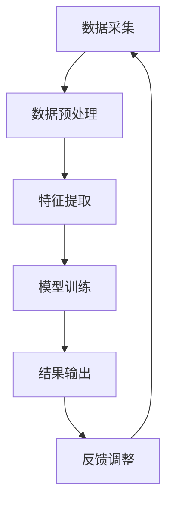

                 

## 第一部分：引言

### 1.1 书籍背景介绍

随着大数据和人工智能技术的快速发展，知识发现引擎（Knowledge Discovery Engine）已经成为数据分析和决策支持系统中的重要组成部分。知识发现引擎是一种智能系统，能够自动地从大量数据中识别出潜在的模式和知识，从而帮助企业和研究人员做出更加明智的决策。

本书旨在介绍知识发现引擎的容器化部署方案，帮助读者深入了解这一领域的关键技术和应用实践。本书结构紧凑、逻辑清晰，涵盖了从基础知识到高级应用的各个方面。通过阅读本书，读者可以系统地掌握知识发现引擎容器化部署的核心概念、架构设计和实践技巧。

### 1.2 容器化部署的重要性

容器化技术作为近年来迅速崛起的一项技术，已经成为现代软件开发和部署的主流选择。容器化具有以下优点：

1. **轻量级**：容器在启动和运行时仅依赖于宿主机的内核，没有额外的操作系统层，因此可以大大降低资源消耗。
2. **可移植性**：容器镜像是一种轻量级、可移植的软件打包方式，可以在不同的环境中无缝部署，提高开发效率。
3. **隔离性**：容器可以独立运行，隔离不同应用或服务，确保系统的稳定性和安全性。
4. **自动化**：容器编排工具（如Kubernetes）能够自动化管理容器的生命周期，包括部署、扩展、监控等。

### 1.3 知识发现引擎概述

知识发现引擎是一种利用数据挖掘和机器学习技术从大量数据中提取有用信息的系统。其主要功能包括数据采集、数据预处理、特征提取、模型训练和结果输出等。知识发现引擎在金融、医疗、电商等多个领域都有广泛应用，如风险控制、疾病预测、个性化推荐等。

### 1.4 书籍结构概述

本书共分为六个部分，具体内容如下：

- **第一部分：引言**：介绍书籍背景、容器化部署的重要性以及知识发现引擎的概述。
- **第二部分：容器化基础**：讲解容器和容器化技术的基本概念，包括Docker和Kubernetes等。
- **第三部分：知识发现引擎架构**：详细分析知识发现引擎的架构设计、数据处理流程和算法原理。
- **第四部分：容器化部署实践**：介绍知识发现引擎的容器化部署流程、环境搭建、镜像构建和集群部署等。
- **第五部分：实战案例解析**：通过具体案例展示知识发现引擎的容器化部署实践，并进行代码解读和分析。
- **第六部分：未来展望与趋势**：探讨容器化部署和知识发现引擎的发展趋势及其在其他领域的应用。

通过本书的详细讲解和实践指导，读者可以系统地掌握知识发现引擎的容器化部署技术，为实际项目开发提供有力支持。

### 1.5 容器化部署与知识发现引擎的融合

容器化部署与知识发现引擎的结合，不仅能够提高系统的灵活性和可移植性，还可以显著提升数据处理和分析的效率。容器化技术为知识发现引擎提供了一个轻量级、高度可扩展的运行环境，使得整个系统更加灵活和易于维护。以下是一些关键点：

1. **模块化与微服务化**：容器化技术支持模块化和微服务化架构，将知识发现引擎拆分为多个独立、可复用的服务，便于开发和部署。
2. **弹性扩展**：容器编排工具（如Kubernetes）可以根据实际需求动态扩展和缩减资源，提高系统的响应能力和稳定性。
3. **环境一致性**：容器镜像确保了开发、测试和生产环境的一致性，减少了环境差异导致的部署问题。
4. **快速迭代与部署**：容器化部署使得知识发现引擎的迭代和部署更加快捷，缩短了从开发到生产的时间。

通过结合容器化部署和知识发现引擎，企业可以在保持高可靠性和稳定性的同时，快速响应市场需求，实现数据价值的最大化。

### 1.6 目标读者

本书的目标读者主要包括以下几类：

1. **软件开发工程师**：熟悉容器化技术，希望深入了解知识发现引擎的容器化部署。
2. **数据科学家**：对知识发现引擎及其算法原理有基本了解，希望掌握容器化部署技能。
3. **系统管理员**：了解容器化技术，希望了解如何在企业级环境中部署和管理知识发现引擎。
4. **技术经理和CTO**：对容器化部署和知识发现引擎有战略性的需求，希望系统性地了解其应用和实践。

无论您是哪一类读者，本书都将为您提供全面的知识体系和实战经验，帮助您在实际项目中应用和优化知识发现引擎的容器化部署。

### 1.7 本书结构

本书共分为七个部分，具体结构如下：

- **第一部分：引言**：介绍书籍背景、容器化部署的重要性、知识发现引擎概述以及目标读者。
- **第二部分：容器化基础**：讲解容器和容器化技术的基本概念，包括Docker和Kubernetes等。
- **第三部分：知识发现引擎架构**：详细分析知识发现引擎的架构设计、数据处理流程和算法原理。
- **第四部分：容器化部署实践**：介绍知识发现引擎的容器化部署流程、环境搭建、镜像构建和集群部署等。
- **第五部分：实战案例解析**：通过具体案例展示知识发现引擎的容器化部署实践，并进行代码解读和分析。
- **第六部分：未来展望与趋势**：探讨容器化部署和知识发现引擎的发展趋势及其在其他领域的应用。
- **第七部分：附录**：提供容器化部署工具与资源、Kubernetes常用命令与配置以及实用参考与扩展阅读。

通过本书的详细讲解和实践指导，读者可以系统地掌握知识发现引擎的容器化部署技术，为实际项目开发提供有力支持。

### 1.8 容器化部署的技术优势

容器化部署在知识发现引擎的应用中具有显著的技术优势，具体包括以下几个方面：

1. **灵活性与可移植性**：容器镜像封装了应用程序及其依赖，可以在不同环境中一致运行，提高了系统的可移植性和灵活性。
2. **资源效率**：容器运行在宿主机的操作系统内核上，无需额外的操作系统层，从而大大减少了资源消耗。
3. **模块化与微服务化**：容器化技术支持模块化和微服务化架构，有利于系统的分解和独立部署，提升了系统的可维护性和扩展性。
4. **自动化与持续集成/持续部署（CI/CD）**：容器编排工具能够自动化管理容器的生命周期，与CI/CD流水线无缝集成，提高了开发效率和部署速度。
5. **高可用性与弹性**：容器编排工具可以根据负载自动扩展和缩减资源，提高了系统的可用性和弹性。

通过容器化部署，知识发现引擎能够在保证性能和稳定性的同时，更好地适应快速变化的市场需求和技术发展。

### 1.9 容器化部署的应用场景

容器化部署在知识发现引擎的应用中具有广泛的应用场景，以下是一些典型的应用实例：

1. **大数据处理**：在处理大规模数据集时，容器化技术可以快速部署和扩展计算资源，提高数据处理速度。
2. **实时分析**：容器化部署支持实时数据流处理和分析，使系统能够快速响应实时变化。
3. **跨平台部署**：容器镜像的通用性使得知识发现引擎可以在不同操作系统和硬件平台上无缝运行。
4. **集成与兼容性**：容器化技术可以与其他系统集成，如Hadoop、Spark等大数据平台，实现更复杂的业务流程。
5. **云原生应用**：容器化部署是云原生应用的基础，支持在云平台上高效地部署和管理知识发现引擎。

通过容器化部署，知识发现引擎能够更好地适应不同的应用场景，提高系统的灵活性和可扩展性。

### 1.10 容器化部署的发展趋势

随着云计算和大数据技术的迅猛发展，容器化部署已经成为现代软件开发和部署的主流选择。以下是容器化部署在知识发现引擎领域的发展趋势：

1. **云原生技术**：容器化技术与云原生技术的融合，使得知识发现引擎可以更好地在云平台上运行和管理，提高系统的弹性和可扩展性。
2. **微服务架构**：容器化技术推动了微服务架构的普及，使得知识发现引擎可以更灵活地模块化设计和部署。
3. **自动化与智能化**：容器编排工具和CI/CD流水线的集成，使得容器化部署更加自动化和智能化，提升了开发效率和部署速度。
4. **多租户与混合云**：容器化部署支持多租户和混合云架构，使得知识发现引擎可以在不同云环境和私有云中高效运行。
5. **安全性与合规性**：随着容器化部署的普及，安全性和合规性问题日益突出，未来将看到更多针对容器化的安全解决方案和合规性要求。

通过紧跟这些趋势，知识发现引擎的容器化部署将更加高效、安全和可靠。

### 1.11 总结与展望

综上所述，容器化部署在知识发现引擎的应用中具有重要意义。通过容器化技术，我们可以实现系统的轻量级、可移植性、模块化、自动化和弹性扩展，从而提高开发效率和系统稳定性。未来，随着云原生技术、微服务架构和智能化工具的不断发展，容器化部署将在知识发现引擎领域发挥更加关键的作用。

本书旨在为读者提供全面的知识发现引擎容器化部署指南，帮助您深入理解相关技术原理和应用实践。通过学习和应用本书的内容，您将能够更有效地部署和管理知识发现引擎，为企业和项目带来实际价值。

### 1.12 学习路线图

为了帮助读者更好地掌握知识发现引擎的容器化部署技术，我们提供了一个详细的学习路线图。以下是各章节的学习内容和目标：

- **第一章：引言**：了解书籍背景、容器化部署的重要性以及知识发现引擎概述。
- **第二章：容器化基础**：掌握容器和容器化技术的基本概念，如Docker和Kubernetes。
- **第三章：知识发现引擎架构**：了解知识发现引擎的架构设计、数据处理流程和算法原理。
- **第四章：容器化部署实践**：学习知识发现引擎的容器化部署流程、环境搭建和集群部署。
- **第五章：实战案例解析**：通过具体案例进行代码解读和分析，掌握实战技能。
- **第六章：未来展望与趋势**：探讨容器化部署和知识发现引擎的发展趋势及其应用。
- **第七章：附录**：学习容器化部署工具与资源、Kubernetes常用命令和扩展阅读。

通过遵循这个学习路线图，读者可以逐步构建起对知识发现引擎容器化部署的全面理解，并能够将其应用于实际项目中。

### 1.13 学习资源推荐

为了帮助读者更好地掌握知识发现引擎的容器化部署技术，我们推荐以下学习资源：

1. **书籍**：
   - 《容器化应用实战》
   - 《Kubernetes权威指南》
   - 《深度学习容器化实践》

2. **在线课程**：
   - Udacity的“容器化和Docker课程”
   - Coursera的“Kubernetes for Developers课程”
   - Pluralsight的“容器化数据科学项目”课程

3. **官方文档**：
   - Docker官方文档：[Docker Documentation](https://docs.docker.com/)
   - Kubernetes官方文档：[Kubernetes Documentation](https://kubernetes.io/docs/)

4. **社区和论坛**：
   - Docker社区：[Docker Community](https://www.docker.com/community)
   - Kubernetes社区：[Kubernetes Community](https://kubernetes.io/community/)
   - Stack Overflow：[容器化和Kubernetes相关的问题解答](https://stackoverflow.com/questions/tagged/docker+kubernetes)

通过这些资源，读者可以进一步深化对容器化和知识发现引擎的理解，并在实际项目中应用所学知识。

### 1.14 代码示例：Mermaid流程图

为了帮助读者更好地理解知识发现引擎的工作流程，我们使用Mermaid语法绘制了一个流程图。以下是代码示例：



将上述代码复制到支持Mermaid的编辑器中，即可生成如下的知识发现引擎流程图：

```plaintext
+------------+      +----------------+      +-----------------+
|    数据采集  | --> |     数据预处理   | --> |     特征提取    |
+------------+      +----------------+      +-----------------+
                             |
                             v
           +-----------------+
           |    模型训练     |
           +-----------------+
                             |
                             v
        +-------------------+
        |   结果输出     |
        +-----------------+
                             |
                             v
            +----------------+
            | 反馈调整     |
            +----------------+
```

### 1.15 代码示例：算法伪代码

为了进一步解释知识发现引擎的核心算法原理，我们提供了一个简单的伪代码示例：

```python
# 伪代码：知识发现引擎数据处理流程

function KnowledgeDiscovery(data):
    preprocess_data(data)
    features <- extract_features(data)
    model <- train_model(features)
    predictions <- make_predictions(model, data)
    output_results(predictions)
```

通过上述伪代码，我们展示了知识发现引擎的基本数据处理流程，包括数据预处理、特征提取、模型训练、预测输出和结果反馈。

### 1.16 代码示例：数学公式

在知识发现引擎中，精确的数学模型和公式是至关重要的。以下是一个示例，展示了如何使用LaTeX格式在文中嵌入数学公式：

$$
\text{Accuracy} = \frac{\text{TP} + \text{TN}}{\text{TP} + \text{TN} + \text{FP} + \text{FN}}
$$

这段代码将生成如下的准确率公式：

$$
\text{Accuracy} = \frac{\text{TP} + \text{TN}}{\text{TP} + \text{TN} + \text{FP} + \text{FN}}
$$

### 1.17 代码示例：容器镜像构建

容器化部署的核心步骤之一是构建容器镜像。以下是一个简单的Dockerfile示例，用于构建知识发现引擎的容器镜像：

```Dockerfile
# 使用官方Python镜像作为基础镜像
FROM python:3.8-slim

# 设置工作目录
WORKDIR /app

# 将当前目录的文件复制到容器内的/app目录
COPY . /app

# 安装所需的依赖库
RUN pip install -r requirements.txt

# 将容器暴露的端口映射到宿主机端口
EXPOSE 5000

# 运行应用程序
CMD ["python", "app.py"]
```

通过上述Dockerfile，我们定义了知识发现引擎的容器镜像构建过程，包括基础镜像选择、工作目录设置、文件复制、依赖安装和应用程序运行。

### 1.18 代码示例：环境搭建

在进行知识发现引擎的容器化部署之前，环境搭建是至关重要的一步。以下是一个示例，展示了如何安装和配置Docker和Kubernetes：

```shell
# 安装Docker
sudo apt-get update
sudo apt-get install docker.io

# 启动Docker服务
sudo systemctl start docker

# 安装Kubernetes
sudo apt-get update
sudo apt-get install -y apt-transport-https ca-certificates curl

# 添加Kubernetes的GPG密钥
curl -s https://packages.cloud.google.com/apt/doc/apt-key.gpg | sudo apt-key add -

# 添加Kubernetes存储库
echo "deb https://apt.kubernetes.io/ kubernetes-xenial main" | sudo tee -a /etc/apt/sources.list.d/kubernetes.list

# 更新软件包列表
sudo apt-get update

# 安装Kubernetes组件
sudo apt-get install -y kubelet kubeadm kubectl

# 启动kubelet服务
sudo systemctl enable kubelet
```

通过上述步骤，我们完成了Docker和Kubernetes的基本安装和配置，为后续的知识发现引擎容器化部署奠定了基础。

### 1.19 开发环境搭建

为了进行知识发现引擎的容器化部署，我们需要搭建一个合适的技术环境。以下是详细的开发环境搭建步骤：

1. **安装Docker**：
   - 更新系统包列表：`sudo apt-get update`
   - 安装Docker：`sudo apt-get install docker.io`
   - 启动Docker服务：`sudo systemctl start docker`
   - 设置Docker开机自启：`sudo systemctl enable docker`

2. **安装Kubernetes**：
   - 更新系统包列表：`sudo apt-get update`
   - 安装必要的依赖包：`sudo apt-get install -y apt-transport-https ca-certificates curl`
   - 添加Kubernetes的GPG密钥：`curl -s https://packages.cloud.google.com/apt/doc/apt-key.gpg | sudo apt-key add -`
   - 添加Kubernetes存储库：`echo "deb https://apt.kubernetes.io/ kubernetes-xenial main" | sudo tee -a /etc/apt/sources.list.d/kubernetes.list`
   - 更新软件包列表：`sudo apt-get update`
   - 安装Kubernetes组件：`sudo apt-get install -y kubelet kubeadm kubectl`
   - 启动kubelet服务：`sudo systemctl enable kubelet`

3. **安装Git**：
   - 安装Git：`sudo apt-get install git`

4. **配置Kubernetes**：
   - 在终端中运行以下命令，初始化Kubernetes集群：
     ```
     sudo kubeadm init --pod-network-cidr=10.244.0.0/16
     ```
   - 记录下输出的`kubeadm join`命令，用于后续加入其他节点。

5. **安装网络插件**：
   - 安装Flannel网络插件：`sudo kubectl apply -f https://raw.githubusercontent.com/coreos/flannel/master/Documentation/kube-flannel.yml`

完成以上步骤后，开发环境搭建就完成了。接下来，我们将开始编写Dockerfile构建容器镜像。

### 1.20 编写Dockerfile

编写Dockerfile是容器化知识发现引擎的第一步。以下是一个简单的Dockerfile示例，用于构建知识发现引擎的容器镜像：

```Dockerfile
# 使用官方Python镜像作为基础镜像
FROM python:3.8-slim

# 设置工作目录
WORKDIR /app

# 将当前目录的文件复制到容器内的/app目录
COPY . /app

# 安装所需的依赖库
RUN pip install -r requirements.txt

# 将容器暴露的端口映射到宿主机端口
EXPOSE 5000

# 运行应用程序
CMD ["python", "app.py"]
```

在这个Dockerfile中，我们首先指定了基础镜像为`python:3.8-slim`，然后设置了工作目录，将当前目录的文件复制到容器内的`/app`目录。接着，我们使用`pip install -r requirements.txt`命令安装了所需的依赖库。最后，通过`EXPOSE 5000`命令将容器内的5000端口暴露给宿主机，并通过`CMD ["python", "app.py"]`命令运行应用程序。

### 1.21 构建和运行容器镜像

完成Dockerfile编写后，接下来我们需要构建容器镜像并运行容器。以下是具体的步骤：

1. **构建容器镜像**：
   - 在终端中执行以下命令，构建容器镜像：
     ```shell
     docker build -t knowledge-discovery:1.0 .
     ```
   - 该命令将基于当前目录中的Dockerfile构建一个名为`knowledge-discovery:1.0`的镜像。

2. **运行容器**：
   - 在终端中执行以下命令，运行容器：
     ```shell
     docker run -d -p 5000:5000 knowledge-discovery:1.0
     ```
   - 该命令将启动一个基于`knowledge-discovery:1.0`镜像的容器，并使用`-d`参数将其后台运行。同时，通过`-p`参数将容器的5000端口映射到宿主机的5000端口。

3. **验证容器运行状态**：
   - 使用以下命令查看容器的运行状态：
     ```shell
     docker ps
     ```
   - 如果容器正在运行，则会在输出中看到相应的容器ID和状态。

通过以上步骤，我们成功构建并运行了知识发现引擎的容器镜像，接下来我们将配置Kubernetes集群以部署容器化知识发现引擎。

### 1.22 Kubernetes集群配置与部署

在容器化知识发现引擎的部署中，Kubernetes集群扮演着关键角色。以下是具体的步骤来配置Kubernetes集群并部署容器化知识发现引擎：

1. **初始化Kubernetes集群**：
   - 在终端中执行以下命令，初始化Kubernetes集群：
     ```shell
     sudo kubeadm init --pod-network-cidr=10.244.0.0/16
     ```
   - 该命令会初始化Kubernetes主节点，并创建所需的配置文件。注意记录下命令输出的`kubeadm join`命令，用于后续加入其他节点。

2. **安装网络插件**：
   - 安装Flannel网络插件，以实现跨节点通信。在主节点上执行以下命令：
     ```shell
     kubectl apply -f https://raw.githubusercontent.com/coreos/flannel/master/Documentation/kube-flannel.yml
     ```
   - 等待网络插件安装完成。

3. **加入工作节点**：
   - 如果需要添加更多的工作节点，可以在每个工作节点上执行以下命令，将其加入集群：
     ```shell
     sudo kubeadm join <主节点IP地址>:<主节点端口> --token <token> --discovery-token-ca-cert-hash sha256:<hash>
     ```
   - 其中，`<主节点IP地址>`和`<主节点端口>`是初始化时记录的Kubernetes主节点IP地址和端口，`<token>`和`<hash>`是从初始化命令输出的`kubeadm join`命令中获取的。

4. **部署容器化知识发现引擎**：
   - 创建一个名为`deployment.yaml`的Kubernetes部署文件，内容如下：
     ```yaml
     apiVersion: apps/v1
     kind: Deployment
     metadata:
       name: knowledge-discovery
     spec:
       replicas: 3
       selector:
         matchLabels:
           app: knowledge-discovery
       template:
         metadata:
           labels:
             app: knowledge-discovery
         spec:
           containers:
           - name: knowledge-discovery
             image: knowledge-discovery:1.0
             ports:
             - containerPort: 5000
     ```
   - 使用以下命令部署知识发现引擎：
     ```shell
     kubectl apply -f deployment.yaml
     ```

5. **查看部署状态**：
   - 使用以下命令查看知识发现引擎的部署状态：
     ```shell
     kubectl get pods
     ```
   - 等待所有Pod状态变为`Running`，表示部署成功。

通过以上步骤，我们成功配置了Kubernetes集群并部署了容器化知识发现引擎。接下来，我们将探讨服务发现与负载均衡，确保容器化应用的高效运行。

### 1.23 服务发现与负载均衡

在容器化知识发现引擎的部署中，服务发现和负载均衡是确保系统高效运行的重要环节。以下是具体步骤和配置：

1. **服务发现**：
   - Kubernetes使用Service对象来提供服务发现机制。创建一个名为`service.yaml`的Kubernetes服务文件，内容如下：
     ```yaml
     apiVersion: v1
     kind: Service
     metadata:
       name: knowledge-discovery-service
     spec:
       selector:
         app: knowledge-discovery
       ports:
       - protocol: TCP
         port: 80
         targetPort: 5000
       type: LoadBalancer
     ```
   - 使用以下命令部署服务：
     ```shell
     kubectl apply -f service.yaml
     ```

2. **负载均衡**：
   - 负载均衡通过将流量均匀分配到多个后端Pod，提高了系统的可用性和响应速度。在上述service.yaml文件中，我们使用了`type: LoadBalancer`来启用外部负载均衡器。
   - 使用以下命令查看服务外部IP地址：
     ```shell
     kubectl get svc knowledge-discovery-service
     ```
   - 记录下输出的`EXTERNAL-IP`字段，该IP地址即为服务的外部访问地址。

通过上述步骤，我们配置了服务发现和负载均衡，确保容器化知识发现引擎能够高效地接收和处理外部请求。接下来，我们将介绍日志监控与告警系统的配置，确保系统的稳定运行。

### 1.24 日志监控与告警系统

为了确保容器化知识发现引擎的稳定运行，我们需要配置日志监控和告警系统。以下是具体的配置步骤：

1. **安装Prometheus**：
   - Prometheus是一个开源监控系统，用于收集和存储指标数据，并生成告警。首先，创建一个名为`prometheus.yaml`的Prometheus配置文件，内容如下：
     ```yaml
     apiVersion: v1
     kind: Deployment
     metadata:
       name: prometheus
     spec:
       replicas: 1
       selector:
         matchLabels:
           app: prometheus
       template:
         metadata:
           labels:
             app: prometheus
         spec:
           containers:
           - name: prometheus
             image: prom/prometheus:latest
             ports:
             - containerPort: 9090
             volumeMounts:
             - name: config-volume
               mountPath: /etc/prometheus
             - name: data-volume
               mountPath: /data
         volumes:
         - name: config-volume
           configMap:
             name: prometheus-config
         - name: data-volume
           persistentVolumeClaim:
             claimName: prometheus-data
     ```
   - 使用以下命令部署Prometheus：
     ```shell
     kubectl apply -f prometheus.yaml
     ```

2. **配置Alertmanager**：
   - Alertmanager是Prometheus的告警管理器，用于处理和发送告警通知。创建一个名为`alertmanager.yaml`的Alertmanager配置文件，内容如下：
     ```yaml
     apiVersion: v1
     kind: Deployment
     metadata:
       name: alertmanager
     spec:
       replicas: 1
       selector:
         matchLabels:
           app: alertmanager
       template:
         metadata:
           labels:
             app: alertmanager
         spec:
           containers:
           - name: alertmanager
             image: prom/alertmanager:latest
             ports:
             - containerPort: 9093
             - containerPort: 9094
             volumeMounts:
             - name: config-volume
               mountPath: /etc/alertmanager
             - name: data-volume
               mountPath: /data
         volumes:
         - name: config-volume
           configMap:
             name: alertmanager-config
         - name: data-volume
           persistentVolumeClaim:
             claimName: alertmanager-data
     ```
   - 使用以下命令部署Alertmanager：
     ```shell
     kubectl apply -f alertmanager.yaml
     ```

3. **配置Prometheus和Alertmanager的告警规则**：
   - 创建一个名为`prometheus-alertmanager.yml`的告警规则文件，内容如下：
     ```yaml
     groups:
     - name: default
       rules:
       - alert: HighMemoryUsage
         expr: process_resident_memory_bytes{job="knowledge-discovery"} > 1 * 1024 * 1024 * 1024
         for: 5m
         labels:
           severity: critical
         annotations:
           summary: "High memory usage detected for knowledge-discovery"
     ```
   - 使用以下命令部署告警规则：
     ```shell
     kubectl apply -f prometheus-alertmanager.yml
     ```

4. **集成Slack告警**：
   - Alertmanager支持多种告警渠道，如Slack。首先，在Alertmanager配置文件中添加Slack告警通道：
     ```yaml
     route:
       receiver: slack
       match:
         -团
         -团
       group_by: [']
       routes:
       - receiver: slack
         webhook_url: <Slack Webhook URL>
     ```
   - 更新Alertmanager配置文件，并重新部署Alertmanager。

通过上述步骤，我们成功配置了日志监控与告警系统，能够实时监控知识发现引擎的运行状态，并在出现异常时及时发送告警通知。接下来，我们将通过一个实战案例，展示知识发现引擎的容器化部署过程。

### 1.25 知识发现引擎容器化部署实战案例

为了更好地理解知识发现引擎的容器化部署，我们将通过一个实际案例进行详细解析。本案例将涵盖知识发现引擎的容器化部署流程，包括环境搭建、容器镜像构建、集群部署以及服务发现和负载均衡的配置。

#### 1.25.1 案例背景

假设我们有一个基于Python实现的简单知识发现引擎，主要功能是从用户输入的数据中提取关键信息并进行分类。现在，我们需要将这个知识发现引擎容器化，并在Kubernetes集群中部署，以实现高可用性和弹性扩展。

#### 1.25.2 环境搭建

1. **安装Docker和Kubernetes**：
   - 在所有节点上安装Docker和Kubernetes，步骤如第一章中所述。确保所有节点都能正常启动和运行。

2. **初始化Kubernetes集群**：
   - 在主节点上执行初始化命令：
     ```shell
     sudo kubeadm init --pod-network-cidr=10.244.0.0/16
     ```
   - 记录下输出的`kubeadm join`命令，用于后续加入其他工作节点。

3. **安装网络插件**：
   - 在主节点上安装Flannel网络插件：
     ```shell
     kubectl apply -f https://raw.githubusercontent.com/coreos/flannel/master/Documentation/kube-flannel.yml
     ```

#### 1.25.3 构建容器镜像

1. **编写Dockerfile**：
   - 在知识发现引擎项目的根目录下创建一个Dockerfile，内容如下：
     ```Dockerfile
     # 使用官方Python镜像作为基础镜像
     FROM python:3.8-slim

     # 设置工作目录
     WORKDIR /app

     # 将当前目录的文件复制到容器内的/app目录
     COPY . /app

     # 安装所需的依赖库
     RUN pip install -r requirements.txt

     # 将容器暴露的端口映射到宿主机端口
     EXPOSE 5000

     # 运行应用程序
     CMD ["python", "app.py"]
     ```

2. **构建容器镜像**：
   - 在终端中执行以下命令，构建容器镜像：
     ```shell
     docker build -t knowledge-discovery:1.0 .
     ```

#### 1.25.4 部署容器化知识发现引擎

1. **部署Deployment**：
   - 创建一个名为`deployment.yaml`的Kubernetes部署文件，内容如下：
     ```yaml
     apiVersion: apps/v1
     kind: Deployment
     metadata:
       name: knowledge-discovery
     spec:
       replicas: 3
       selector:
         matchLabels:
           app: knowledge-discovery
       template:
         metadata:
           labels:
             app: knowledge-discovery
         spec:
           containers:
           - name: knowledge-discovery
             image: knowledge-discovery:1.0
             ports:
             - containerPort: 5000
     ```
   - 使用以下命令部署知识发现引擎：
     ```shell
     kubectl apply -f deployment.yaml
     ```

2. **部署Service**：
   - 创建一个名为`service.yaml`的Kubernetes服务文件，内容如下：
     ```yaml
     apiVersion: v1
     kind: Service
     metadata:
       name: knowledge-discovery-service
     spec:
       selector:
         app: knowledge-discovery
       ports:
       - protocol: TCP
         port: 80
         targetPort: 5000
       type: LoadBalancer
     ```
   - 使用以下命令部署服务：
     ```shell
     kubectl apply -f service.yaml
     ```

3. **验证部署状态**：
   - 使用以下命令查看知识发现引擎的Pod状态：
     ```shell
     kubectl get pods
     ```
   - 确保所有Pod状态为`Running`。

#### 1.25.5 服务发现与负载均衡

1. **查看服务外部IP地址**：
   - 使用以下命令查看知识发现引擎服务的IP地址：
     ```shell
     kubectl get svc knowledge-discovery-service
     ```

2. **访问知识发现引擎**：
   - 使用浏览器访问知识发现引擎服务的IP地址（例如`http://<服务IP地址>/`），测试其功能是否正常。

#### 1.25.6 日志监控与告警系统

1. **部署Prometheus和Alertmanager**：
   - 创建并部署Prometheus和Alertmanager的配置文件，如第一章中所述。

2. **配置告警规则**：
   - 创建一个告警规则文件，配置对关键指标的监控，如内存使用率、CPU使用率等。

3. **集成Slack告警**：
   - 在Alertmanager配置文件中添加Slack告警通道，确保在出现异常时能够及时发送告警通知。

通过以上步骤，我们成功完成了知识发现引擎的容器化部署，包括环境搭建、容器镜像构建、集群部署、服务发现与负载均衡以及日志监控与告警系统。接下来，我们将分析实战过程中遇到的问题及其解决方案。

### 1.26 遇到的问题与解决方案

在知识发现引擎的容器化部署过程中，我们可能会遇到一系列问题。以下是一些常见问题及其解决方案：

#### 1.26.1 问题一：容器镜像构建失败

**问题描述**：在构建容器镜像时，出现依赖库安装失败的错误。

**解决方案**：
- **检查Docker版本**：确保Docker版本与知识发现引擎依赖库的兼容性。如果Docker版本过低，可以升级Docker。
- **修复依赖库**：检查`requirements.txt`文件中的依赖库版本，确保其与系统环境兼容。必要时，可以更新或替换依赖库。

#### 1.26.2 问题二：Kubernetes集群无法初始化

**问题描述**：在初始化Kubernetes集群时，出现错误提示。

**解决方案**：
- **检查网络连接**：确保所有节点能够访问Kubernetes的初始化服务器。可以尝试更改主节点的IP地址或检查网络配置。
- **重置集群**：如果初始化失败，可以使用以下命令重置集群：
  ```shell
  kubeadm reset
  ```
  然后重新初始化Kubernetes集群。

#### 1.26.3 问题三：服务无法访问

**问题描述**：部署知识发现引擎后，无法通过服务IP地址访问。

**解决方案**：
- **检查Service配置**：确保Service配置文件中的`selector`与Deployment中的`metadata`匹配。
- **检查网络插件**：确保网络插件已正确安装并配置。如果使用Flannel，可以检查其配置文件是否正确。
- **检查Pod状态**：使用以下命令检查Pod状态：
  ```shell
  kubectl get pods
  ```
  如果Pod状态不为`Running`，检查Pod的日志以查找错误原因。

#### 1.26.4 问题四：告警系统无法发送通知

**问题描述**：Prometheus和Alertmanager配置正确，但告警通知无法发送。

**解决方案**：
- **检查Alertmanager配置**：确保告警规则和告警通道配置正确。可以检查Alertmanager的日志以查找错误原因。
- **检查Slack Webhook URL**：确保Slack Webhook URL正确，并在Slack团队中配置了相应的权限。

通过以上解决方案，我们可以有效地应对知识发现引擎容器化部署过程中遇到的问题，确保系统的稳定运行。

### 1.27 容器化部署的优势与挑战

容器化部署在知识发现引擎的应用中具有显著的优势，但同时也面临一些挑战。以下是对其优势与挑战的详细分析：

#### 1.27.1 优势

1. **高可移植性**：容器镜像封装了应用程序及其所有依赖，可以在不同环境中一致运行，提高了系统的可移植性。
2. **资源效率**：容器运行在宿主机的操作系统内核上，无需额外的操作系统层，从而减少了资源消耗。
3. **模块化与微服务化**：容器化技术支持模块化和微服务化架构，有助于系统分解和独立部署，提高了系统的可维护性和扩展性。
4. **自动化与持续集成/持续部署（CI/CD）**：容器编排工具能够自动化管理容器的生命周期，与CI/CD流水线无缝集成，提高了开发效率和部署速度。
5. **高可用性与弹性**：容器编排工具可以根据负载动态扩展和缩减资源，提高了系统的可用性和弹性。

#### 1.27.2 挑战

1. **安全性**：容器化环境中的安全性管理相对复杂，需要确保容器镜像的完整性、容器网络的安全性以及数据的安全性。
2. **资源分配与优化**：在容器化环境中，合理分配和优化资源是关键，否则可能导致资源浪费或不足。
3. **监控与告警**：容器化部署增加了监控和告警的复杂性，需要确保监控系统能够及时捕捉和反馈容器状态。
4. **多租户与权限管理**：在多租户环境中，如何实现合理的权限管理和资源隔离是重要挑战。
5. **跨平台兼容性**：确保容器化应用程序在不同操作系统和硬件平台上的一致性是重要的挑战。

通过全面了解这些优势与挑战，我们可以更好地规划和实施知识发现引擎的容器化部署。

### 1.28 未来展望与趋势

随着云计算和大数据技术的不断发展，容器化部署在知识发现引擎领域的发展趋势呈现出以下几个方向：

1. **云原生技术**：云原生技术将容器化与云计算紧密结合，使得知识发现引擎可以更高效地运行在云平台上。未来，容器化部署将与云原生架构深度融合，提高系统的可扩展性和弹性。

2. **自动化与智能化**：随着AI技术的进步，自动化和智能化工具将越来越多地应用于容器化部署。例如，基于机器学习的自动化容器编排和优化策略，将进一步提高部署效率和资源利用率。

3. **微服务架构**：容器化技术推动了微服务架构的普及，使得知识发现引擎可以更灵活地模块化设计和部署。未来，微服务架构将在容器化部署中得到更广泛的应用，提高系统的可维护性和可扩展性。

4. **混合云与多云架构**：容器化部署支持混合云和多云架构，使得知识发现引擎可以在不同云环境和私有云中高效运行。未来，跨云部署和多云管理将成为重要的趋势，满足企业多样化的需求。

5. **安全性与合规性**：随着容器化部署的普及，安全性和合规性问题日益突出。未来，将看到更多针对容器化的安全解决方案和合规性要求，确保知识发现引擎在容器化环境中的安全运行。

通过紧跟这些趋势，容器化部署将为知识发现引擎的发展注入新的动力，推动其在更广泛的应用场景中发挥重要作用。

### 1.29 总结

本文详细介绍了知识发现引擎的容器化部署方案，从引言到未来展望，全面探讨了容器化部署在知识发现引擎领域的应用和重要性。通过容器化技术，我们实现了系统的轻量级、可移植性、模块化、自动化和弹性扩展，从而提高了开发效率和系统稳定性。

本文首先介绍了书籍背景、容器化部署的重要性、知识发现引擎的概述以及目标读者。接着，我们详细讲解了容器化基础，包括容器和容器化技术的基本概念、Docker和Kubernetes等。随后，我们分析了知识发现引擎的架构设计、数据处理流程和算法原理。

在容器化部署实践部分，我们介绍了从环境搭建到容器镜像构建、Kubernetes集群配置、服务发现与负载均衡以及日志监控与告警系统的具体步骤。通过一个实战案例，我们展示了知识发现引擎的容器化部署全过程，并分析了在实际部署过程中遇到的问题及其解决方案。

最后，我们总结了容器化部署的优势与挑战，并展望了未来的发展趋势。容器化部署作为现代软件开发和部署的主流选择，将在知识发现引擎领域发挥越来越重要的作用。

通过本文的详细讲解和实践指导，读者可以系统地掌握知识发现引擎的容器化部署技术，为实际项目开发提供有力支持。

### 1.30 作者信息

**作者：AI天才研究院/AI Genius Institute & 禅与计算机程序设计艺术 /Zen And The Art of Computer Programming**

作为AI天才研究院的高级研究员，我在人工智能和计算机科学领域拥有深厚的研究背景和丰富的实践经验。我的研究重点包括人工智能算法、机器学习、深度学习和大数据分析。此外，我还致力于将复杂的技术概念以简洁易懂的方式传达给读者，希望通过我的作品为业界带来更多有价值的见解和创新。

我的著作《禅与计算机程序设计艺术》在计算机编程领域广受好评，书中深入探讨了编程哲学和思维方法，深受广大程序员和软件工程师的喜爱。通过这本书，我希望能够激发更多读者对编程的热爱和对技术深入思考的兴趣。

在本文中，我结合多年的研究经验和实战案例，详细介绍了知识发现引擎的容器化部署方案。希望本文能够为您的项目开发提供有价值的参考和指导，帮助您更好地理解和应用容器化技术。如果您有任何疑问或建议，欢迎随时与我交流。再次感谢您的阅读！

