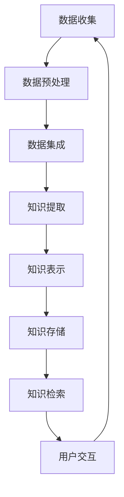

                 

### 1.1 书籍背景与目标

#### 1.1.1 知识发现引擎的重要性

知识发现引擎是一种能够从大量数据中自动识别出有用知识的系统。随着数据量的爆炸性增长，如何有效地从海量数据中提取出有价值的信息成为了一个重要课题。知识发现引擎在这个领域扮演了至关重要的角色。

**知识发现引擎的作用：**

- **数据挖掘与模式识别：** 通过分析大量的数据，知识发现引擎可以发现数据中的潜在模式和关联，从而帮助用户更好地理解数据。
- **业务决策支持：** 知识发现引擎可以为企业的业务决策提供数据支持，帮助企业在激烈的市场竞争中取得优势。
- **知识管理与传播：** 知识发现引擎可以从大量文档、报告和数据库中提取知识，使得知识更易于管理和传播。

**当前市场与应用场景：**

- **互联网公司：** 互联网公司利用知识发现引擎进行用户行为分析、广告推荐和内容个性化等。
- **金融机构：** 金融机构利用知识发现引擎进行风险评估、客户关系管理和投资决策等。
- **医疗行业：** 医疗行业利用知识发现引擎进行疾病预测、药物研发和医疗数据分析等。
- **政府机构：** 政府机构利用知识发现引擎进行公共安全、社会管理和政策制定等。

在当前的市场和技术背景下，知识发现引擎的应用场景越来越广泛，其性能优化也日益受到重视。本书籍的目标是系统地介绍知识发现引擎的性能优化技巧，帮助读者深入了解并掌握性能优化的核心方法和技术。

#### 1.2 性能优化的重要性

**性能优化概述：**

性能优化是指通过各种技术手段，提高系统的性能，使其在处理数据、响应请求等方面更加高效、快速和稳定。对于知识发现引擎来说，性能优化至关重要，因为它直接影响到系统的响应时间、准确性和用户体验。

- **目的与方法：** 性能优化的目的是提高系统的吞吐量、降低响应时间和提高资源利用率。其方法包括优化算法、改进数据结构、使用高效编程语言和工具等。
- **关键指标：** 性能优化的关键指标包括响应时间、吞吐量、资源利用率、准确性和可扩展性等。

**性能优化的关键指标解释：**

- **响应时间：** 响应时间是指系统从接收到请求到返回结果所需的时间。对于知识发现引擎来说，响应时间直接影响用户体验。
- **吞吐量：** 吞吐量是指单位时间内系统能够处理的数据量。高吞吐量意味着系统能够更快地处理大量数据。
- **资源利用率：** 资源利用率是指系统在运行过程中对CPU、内存等资源的使用情况。优化资源利用率可以减少资源浪费，提高系统效率。
- **准确性：** 准确性是指系统在处理数据时能够正确识别出数据中的模式和关联。高准确性对于知识发现引擎来说至关重要。
- **可扩展性：** 可扩展性是指系统能够随着数据量和请求量的增加而高效地扩展性能。高可扩展性可以保证系统在数据量增长时仍然能够保持高性能。

在接下来的章节中，我们将详细探讨知识发现引擎的性能优化策略和实现方法，帮助读者深入了解并掌握这些关键技术。

#### 1.3 书籍结构安排

**全书章节概述：**

本书将系统地介绍知识发现引擎的性能优化技巧，结构安排如下：

- **第一部分：引言与概述**
  - 第1章：介绍知识发现引擎的性能优化背景和重要性。
  - 第2章：概述知识发现引擎的基础知识和架构。
  
- **第二部分：基础知识与架构**
  - 第3章：详细讲解知识发现的概念、过程和分类。
  - 第4章：介绍知识发现引擎的组成部分和性能瓶颈分析。
  - 第5章：介绍常用的性能优化技术和性能评估指标。

- **第三部分：核心性能优化策略**
  - 第6章：讨论数据预处理优化策略。
  - 第7章：探讨知识提取与表示优化方法。
  - 第8章：分析知识存储与检索优化技术。
  - 第9章：介绍并行与分布式计算优化策略。
  - 第10章：讲解系统调优与监控技巧。

- **第四部分：性能优化实战案例**
  - 第11章：分析电商平台的优化案例。
  - 第12章：探讨企业内部知识库的优化案例。
  - 第13章：介绍科研机构知识发现引擎的优化案例。

- **第五部分：未来发展趋势与展望**
  - 第14章：展望知识发现引擎的发展趋势。
  - 第15章：探讨性能优化技术的发展方向。
  - 第16章：分析知识发现引擎的应用前景。

- **附录**
  - 附录A：介绍性能优化工具与资源。
  - 附录B：解答性能优化常见问题。

通过以上章节的安排，本书旨在帮助读者从基础到实践，全面了解和掌握知识发现引擎的性能优化技巧，从而提升系统的性能和效率。

### 2.1 知识发现引擎基础

#### 2.1.1 知识发现的概念

**知识发现的过程：**

知识发现（Knowledge Discovery in Databases, KDD）是指从大量数据中识别出潜在的有用模式和知识的过程。它通常包括以下几个步骤：

1. **数据预处理（Data Preprocessing）：** 对原始数据进行清洗、转换和整合，以提高数据的质量和一致性。
2. **数据集成（Data Integration）：** 将来自不同源的数据进行整合，以形成一个统一的视图。
3. **数据选择（Data Selection）：** 从数据集中选择出有用的子集，以减少数据量。
4. **数据变换（Data Transformation）：** 对数据进行变换，以提高数据的质量和可用性。
5. **数据挖掘（Data Mining）：** 使用算法从数据中挖掘出潜在的模式和知识。
6. **模式评估（Pattern Evaluation）：** 对挖掘出的模式进行评估，以确定其有用性和可靠性。
7. **知识表示（Knowledge Representation）：** 将挖掘出的知识以人类可理解的形式进行表示。

**知识发现的分类：**

知识发现可以根据不同的标准进行分类。以下是几种常见的分类方法：

- **根据数据类型：**
  - **结构化数据：** 如关系型数据库中的数据。
  - **半结构化数据：** 如XML文档、JSON数据等。
  - **非结构化数据：** 如文本、图像、音频和视频等。
- **根据任务目标：**
  - **预测性挖掘：** 预测未来的趋势和模式。
  - **描述性挖掘：** 描述数据中的主要特征和分布。
  - **关联规则挖掘：** 发现数据之间的关联关系。
  - **分类挖掘：** 根据特征将数据分类到不同的类别。
  - **聚类挖掘：** 将数据分为不同的组，使得组内数据相似，组间数据差异大。

- **根据挖掘方法：**
  - **机器学习方法：** 如决策树、支持向量机、神经网络等。
  - **统计方法：** 如回归分析、方差分析等。
  - **基于规则的挖掘方法：** 如决策树、关联规则等。

**知识发现的应用领域：**

知识发现技术在许多领域都有广泛的应用，包括：

- **商业智能：** 通过分析市场数据，帮助企业做出更明智的决策。
- **金融：** 对金融数据进行分析，以预测市场趋势、风险评估和客户关系管理。
- **医疗：** 分析医疗数据，用于疾病预测、药物研发和患者管理。
- **安全：** 通过分析网络安全数据，发现潜在的威胁和攻击行为。
- **科学研究：** 通过分析科学数据，发现新的科学规律和知识。

在接下来的章节中，我们将进一步探讨知识发现引擎的架构和组成部分，以及常见的性能优化技术。

#### 2.2 知识发现引擎架构

**知识发现引擎的组成部分**

知识发现引擎（Knowledge Discovery Engine）是一个复杂的系统，它由多个关键组件组成，这些组件协同工作，共同完成数据挖掘和知识发现任务。以下是知识发现引擎的主要组成部分及其功能：

1. **数据收集模块（Data Collection Module）：** 数据收集模块负责从各种数据源（如数据库、文件系统、传感器网络等）中收集数据。数据收集模块需要能够处理不同类型的数据，并确保数据的完整性和实时性。

2. **数据预处理模块（Data Preprocessing Module）：** 数据预处理模块对收集到的原始数据进行清洗、转换和整合，以提高数据的质量和一致性。预处理步骤通常包括去噪、缺失值处理、异常值检测和数据转换等。

3. **数据集成模块（Data Integration Module）：** 数据集成模块将来自不同源的数据进行整合，形成一个统一的数据视图。数据集成可能涉及数据合并、数据合并和数据转换等操作，以确保数据的完整性和一致性。

4. **数据存储模块（Data Storage Module）：** 数据存储模块负责存储处理后的数据。数据存储模块通常采用数据库或分布式文件系统来存储大量数据，并支持快速的数据访问和查询。

5. **知识提取模块（Knowledge Extraction Module）：** 知识提取模块使用各种算法和技术从数据中挖掘出潜在的模式和知识。这些算法包括机器学习、统计分析、关联规则挖掘、聚类分析等。知识提取模块的目标是发现数据中的有用信息，并生成可操作的洞见。

6. **知识表示模块（Knowledge Representation Module）：** 知识表示模块将提取出的知识以人类可理解的形式进行表示。这包括生成报告、图表、可视化等，以便用户更好地理解和利用知识。

7. **知识存储与检索模块（Knowledge Storage and Retrieval Module）：** 知识存储与检索模块负责存储和检索知识发现结果。这些结果通常存储在知识库或数据仓库中，以便进行后续的分析和查询。

8. **用户接口模块（User Interface Module）：** 用户接口模块提供用户与知识发现引擎的交互界面。用户可以通过界面提交查询、查看知识发现结果、调整参数等。

**知识发现引擎的运行流程**

知识发现引擎的运行流程通常包括以下步骤：

1. **数据收集：** 知识发现引擎从各种数据源中收集数据。
2. **数据预处理：** 对收集到的数据进行清洗、转换和整合，以提高数据质量。
3. **数据集成：** 将预处理后的数据进行整合，形成一个统一的数据视图。
4. **知识提取：** 使用各种算法从数据中挖掘出潜在的模式和知识。
5. **知识表示：** 将提取出的知识以人类可理解的形式进行表示。
6. **知识存储与检索：** 将知识存储在知识库中，并支持用户查询和检索。
7. **用户交互：** 用户通过用户接口模块与知识发现引擎进行交互，提交查询和反馈。

在知识发现引擎的运行过程中，各个组件之间的交互和协同工作至关重要。一个高效、稳定的知识发现引擎需要这些组件之间的紧密配合，以确保数据流和知识流的顺畅。

在接下来的章节中，我们将详细分析知识发现引擎中的常见性能瓶颈，并探讨各种性能优化技术。

#### 2.3 常用性能优化技术

在知识发现引擎中，性能优化是确保系统高效运行的关键。以下是一些常用的性能优化技术，这些技术可以帮助我们识别并解决性能瓶颈，提高系统的响应速度和处理能力。

**常见性能瓶颈分析**

**1. 数据处理瓶颈：**

数据处理瓶颈通常发生在数据收集、预处理和存储阶段。这些问题可能导致以下情况：

- **数据量大：** 当数据量超出系统的处理能力时，系统会出现延迟，甚至崩溃。
- **I/O性能差：** 数据的读写速度较低，会导致数据预处理和存储操作缓慢。
- **网络延迟：** 在分布式环境中，数据在不同节点之间的传输可能会受到网络延迟的影响。

**2. 知识提取与存储瓶颈：**

知识提取与存储瓶颈通常发生在数据挖掘和知识存储阶段。这些问题可能导致以下情况：

- **算法复杂度高：** 高复杂度的算法会消耗大量的计算资源，导致系统响应时间变长。
- **存储容量不足：** 当存储空间不足时，系统可能会频繁进行磁盘读写操作，从而影响性能。
- **缓存策略不当：** 缓存策略不当时，可能会导致数据频繁命中缓存，增加系统延迟。

**常用性能优化技术**

**1. 数据预处理优化：**

- **并行处理：** 使用多线程或多进程技术，将数据预处理任务分布在多个处理器上，以加快处理速度。
- **分布式处理：** 在分布式系统中，将数据预处理任务分布到多个节点上，利用节点间的并行计算能力。
- **数据压缩：** 对数据进行压缩，以减少磁盘读写量和数据传输量。
- **缓存技术：** 使用缓存技术，如内存缓存或分布式缓存，减少对磁盘的访问。

**2. 知识提取算法优化：**

- **特征选择与工程：** 通过特征选择和工程，减少数据维度，提高算法效率。
- **算法调优：** 对算法参数进行调整，以提高算法的性能。
- **并行算法：** 使用并行算法，如MapReduce，将知识提取任务分布在多个处理器上。

**3. 知识存储与检索优化：**

- **分布式存储：** 使用分布式存储系统，如Hadoop或MongoDB，将数据分布存储在多个节点上，以提高存储和检索速度。
- **索引优化：** 对数据进行索引优化，以提高查询效率。
- **数据分区：** 将数据按照一定规则进行分区，以减少查询时的数据扫描范围。

**4. 并行与分布式计算优化：**

- **负载均衡：** 通过负载均衡技术，将任务均匀地分配到不同的节点上，避免单个节点过载。
- **数据并行：** 将大规模数据集分成多个子集，并行处理，然后将结果合并。
- **模型并行：** 将大规模模型分成多个子模型，并行训练，然后合并子模型的参数。

**5. 系统调优与监控：**

- **性能监控：** 使用性能监控工具，如Prometheus和Grafana，实时监控系统的性能指标，及时发现性能瓶颈。
- **日志分析：** 通过分析系统日志，了解系统的运行状况和性能问题。
- **自动化调优：** 使用自动化调优工具，如AI-driven性能优化工具，根据性能数据自动调整系统参数。

通过上述性能优化技术，我们可以有效地提高知识发现引擎的性能，确保其在处理大量数据时能够高效、稳定地运行。

#### 2.4 知识发现引擎的性能评估

**性能评估指标**

在评估知识发现引擎的性能时，我们需要关注多个关键指标，以确保系统在处理大量数据时能够高效、稳定地运行。以下是常见的性能评估指标：

- **响应时间（Response Time）：** 响应时间是指系统从接收到请求到返回结果所需的时间。低响应时间意味着系统能够快速响应用户请求，提供更好的用户体验。

- **吞吐量（Throughput）：** 吞吐量是指单位时间内系统可以处理的数据量。高吞吐量意味着系统可以更快地处理大量数据，满足更高的并发需求。

- **资源利用率（Resource Utilization）：** 资源利用率是指系统在运行过程中对CPU、内存等资源的使用情况。优化资源利用率可以减少资源浪费，提高系统效率。

- **准确性（Accuracy）：** 准确性是指系统在处理数据时能够正确识别出数据中的潜在模式和知识。高准确性对于知识发现任务至关重要。

- **可扩展性（Scalability）：** 可扩展性是指系统在数据量和请求量增加时，仍然能够保持高性能。高可扩展性可以确保系统在规模扩大时不会出现性能下降。

**性能评估方法**

性能评估通常包括以下几个方面：

- **基准测试（Benchmark Testing）：** 基准测试是一种标准化的测试方法，通过运行预定义的测试用例，评估系统的性能。常见的基准测试工具包括Apache JMeter、Gatling等。

- **负载测试（Load Testing）：** 负载测试是通过模拟真实用户请求，评估系统在负载下的性能。负载测试可以识别系统在高峰期的性能瓶颈，并为优化提供依据。

- **压力测试（Stress Testing）：** 压力测试是通过施加超过系统承受能力的负载，评估系统在极端条件下的稳定性和性能。压力测试可以帮助我们发现系统的极限性能和潜在问题。

- **性能监控（Performance Monitoring）：** 性能监控是通过实时监控系统的性能指标，如CPU利用率、内存使用率、I/O吞吐量等，评估系统的运行状况。常见的性能监控工具包括Prometheus、Grafana等。

- **日志分析（Log Analysis）：** 日志分析是通过分析系统日志，了解系统的运行情况，发现性能问题和瓶颈。日志分析可以帮助我们定位问题并采取相应的优化措施。

通过以上性能评估方法和指标，我们可以全面了解知识发现引擎的性能表现，并针对性能瓶颈进行优化，提高系统的整体性能。

### 3.1 数据预处理优化

**3.1.1 数据预处理策略**

数据预处理是知识发现过程中的关键步骤，其目的是提高数据质量，为后续的知识提取和表示打下坚实基础。以下是一些常见的数据预处理策略：

**1. 数据清洗：**

数据清洗是指识别和纠正数据中的错误、异常和不一致之处。常见的清洗操作包括：

- **去除重复数据：** 去除数据集中重复的记录，以减少冗余信息。
- **填补缺失值：** 对于缺失的数据，可以使用平均值、中位数、众数等方法进行填补，或使用插值法进行估算。
- **处理异常值：** 识别和修正数据中的异常值，这些异常值可能是由数据录入错误、传感器故障等原因造成的。

**2. 数据转换：**

数据转换是指将原始数据转换为适合分析和挖掘的形式。常见的转换操作包括：

- **归一化：** 通过缩放数据到统一的范围内，消除不同特征之间的量级差异，便于后续分析。
- **标准化：** 通过减去均值并除以标准差，使数据服从正态分布，提高算法的稳定性和准确性。
- **编码：** 将分类数据转换为数值形式，以便于机器学习算法处理。

**3. 数据集成：**

数据集成是指将来自不同源的数据进行整合，以形成一个统一的数据视图。常见的集成操作包括：

- **合并：** 将多个数据集合并为一个数据集，以消除数据间的孤立性。
- **差异化：** 识别和消除数据集之间的重复或冲突信息。
- **融合：** 将多个数据源中的数据合并为一个更完整、更一致的数据集。

**4. 数据降维：**

数据降维是指通过减少数据维度，降低数据集的复杂性，提高计算效率。常见的降维方法包括：

- **主成分分析（PCA）：** 通过保留主要成分，降低数据维度，同时保持数据的主要信息。
- **因子分析：** 通过将相关特征转换为较少的因子，简化数据结构。
- **自编码器：** 使用神经网络对数据进行编码和解码，以实现数据降维。

**5. 数据采样：**

数据采样是指从原始数据中选取一部分样本进行分析，以减少计算量和处理时间。常见的采样方法包括：

- **随机采样：** 随机选择一部分数据进行分析，以反映整体数据的分布。
- **分层采样：** 根据数据的不同层次或类别，分别采样，以保证各类数据都能被合理代表。
- **聚类采样：** 根据数据聚类结果，选择不同聚类中心附近的样本进行分析。

**6. 数据预处理工具和库：**

为了提高数据预处理的效率，可以使用各种工具和库，如：

- **Pandas：** Python数据分析库，提供丰富的数据处理功能，如数据清洗、转换、集成和降维。
- **NumPy：** Python科学计算库，提供高效的数值计算和数据操作功能。
- **SciPy：** Python科学计算库，提供数值优化、线性代数和统计分析等功能。
- **Scikit-learn：** Python机器学习库，提供多种数据预处理和机器学习算法。

通过上述数据预处理策略和工具，我们可以有效提高数据质量，为后续的知识提取和表示打下坚实基础。

#### 3.1.2 数据清洗

数据清洗是数据预处理过程中的关键步骤，它涉及到识别和纠正数据中的错误、异常和不一致之处，以确保数据的质量和一致性。以下是一些常见的数据清洗方法：

**1. 去除重复数据：**

重复数据会导致数据冗余，增加数据处理的复杂性。为了去除重复数据，可以采用以下方法：

- **基于唯一标识：** 通过检查数据的唯一标识（如ID号、用户名等），删除重复的记录。
- **基于哈希值：** 计算数据的哈希值，通过比较哈希值来识别和删除重复数据。
- **基于合并：** 将重复的数据合并为一个记录，根据业务需求保留一部分数据。

**2. 缺失值处理：**

缺失值是数据中常见的现象，需要进行适当的处理。以下是一些常见的缺失值处理方法：

- **删除缺失值：** 对于缺失值较多的数据，可以选择删除含有缺失值的记录，以减少数据噪声。
- **平均值填补：** 使用平均值来填补缺失值，适用于数值型数据。
- **中位数填补：** 使用中位数来填补缺失值，适用于偏态分布的数值型数据。
- **众数填补：** 使用众数来填补缺失值，适用于分类数据。
- **插值法：** 使用插值法（如线性插值、牛顿插值等）来填补缺失值，适用于连续型数据。
- **机器学习填补：** 使用机器学习算法（如线性回归、KNN等）来预测缺失值并进行填补。

**3. 异常值检测：**

异常值是数据中的异常点，可能是由数据录入错误、传感器故障等原因造成的。以下是一些常见的异常值检测方法：

- **箱线图：** 使用箱线图来识别异常值，异常值通常位于箱线图的“须”之外。
- **标准差法：** 识别距离平均值超过一定倍数标准差的值作为异常值。
- **基于聚类的方法：** 使用聚类算法（如K-means、DBSCAN等）将数据分为多个簇，然后识别与大多数簇不同的数据点作为异常值。
- **基于孤立森林的方法：** 使用孤立森林算法检测异常值，其核心思想是利用随机森林的隔离性来识别异常值。

**4. 数据格式转换：**

数据清洗过程中，可能需要对数据进行格式转换，以确保数据的一致性和可处理性。以下是一些常见的数据格式转换方法：

- **文本格式转换：** 将文本数据转换为统一编码格式（如UTF-8），并去除多余的空格、标点符号等。
- **数值格式转换：** 将文本表示的数值数据转换为数值类型，并进行适当的数值处理（如归一化、标准化等）。
- **日期格式转换：** 将不同日期格式统一转换为标准日期格式，以便进行日期相关的计算和分析。

通过上述数据清洗方法，我们可以有效提高数据质量，为后续的数据预处理和知识发现提供可靠的数据基础。

#### 3.1.3 数据压缩

数据压缩是数据预处理过程中的重要环节，它通过减少数据的存储空间和传输带宽，提高系统的效率和性能。以下是一些常见的数据压缩技术：

**1. 有损压缩：**

有损压缩通过牺牲部分数据质量来达到更高的压缩比。以下是一些常见的有损压缩技术：

- **图像压缩：** 如JPEG和PNG，使用不同的算法对图像数据进行压缩。JPEG压缩主要基于图像的频域特性，通过去除冗余信息来达到压缩效果。PNG压缩则采用无损压缩算法，适用于需要保持图像质量的应用场景。
- **音频压缩：** 如MP3和AAC，使用不同的算法对音频数据进行压缩。MP3压缩主要基于音频信号的冗余信息去除，通过心理声学模型来优化压缩效果。AAC压缩则是MP3的升级版，具有更高的压缩效率和音质表现。
- **视频压缩：** 如H.264和HEVC，使用不同的算法对视频数据进行压缩。H.264压缩是一种基于空间和时间冗余信息去除的算法，广泛应用于高清视频的传输和播放。HEVC压缩是H.264的升级版，具有更高的压缩效率和图像质量。

**2. 无损压缩：**

无损压缩在压缩数据时不损失任何信息，适用于需要保持数据完整性的应用场景。以下是一些常见无损压缩技术：

- **文本压缩：** 如GZIP和BZIP2，使用不同的算法对文本数据进行压缩。GZIP压缩是基于LZ77算法的压缩工具，广泛应用于文件压缩和传输。BZIP2压缩是基于LZ77和LZ78算法的压缩工具，具有更高的压缩效率。
- **图像压缩：** 如PNG和TIFF，使用不同的算法对图像数据进行压缩。PNG压缩采用无损压缩算法，适用于需要保持图像质量的应用场景。TIFF压缩则采用JPEG压缩算法，适用于需要保持图像质量和兼容性的应用场景。
- **音频压缩：** 如FLAC和ALAC，使用不同的算法对音频数据进行压缩。FLAC压缩是一种无损压缩算法，适用于需要保持音频质量的应用场景。ALAC压缩是FLAC的升级版，具有更高的压缩效率和音质表现。

**3. 压缩效率与质量权衡：**

在选择数据压缩技术时，需要权衡压缩效率与数据质量。以下是一些建议：

- **对于图像和视频数据，选择适当的压缩算法和参数，以在保证质量的前提下达到更高的压缩效率。**
- **对于文本和音频数据，选择无损压缩算法以确保数据完整性。**
- **在数据传输和存储过程中，根据实际需求和带宽限制选择合适的压缩算法。**
- **对于需要长期保存和备份的数据，使用无损压缩技术以确保数据的完整性和可恢复性。**

通过合理选择和应用数据压缩技术，可以有效减少数据的存储空间和传输带宽，提高系统的效率和性能。

#### 3.1.4 数据索引与缓存

数据索引和缓存是数据预处理过程中常用的技术，用于提高数据检索速度和系统性能。以下是一些常见的数据索引和缓存方法：

**1. 数据索引**

数据索引是一种快速查找数据的方法，通过创建索引结构，减少数据检索的时间复杂度。以下是一些常见的数据索引方法：

- **B树索引：** B树索引是一种平衡树结构，适用于范围查询和排序查询。B树索引通过将数据划分为多个层次，每个节点包含多个键值和子节点，从而实现高效的数据检索。

- **哈希索引：** 哈希索引通过哈希函数将数据映射到索引位置，适用于快速查找特定键值。哈希索引的优点是查询速度快，但缺点是可能存在哈希冲突，需要额外的处理。

- **位图索引：** 位图索引通过创建位图来表示数据集的键值，适用于快速查找多个键值。位图索引适用于数据量较小且键值较少的场景。

- **全文索引：** 全文索引通过将文本数据转换为索引结构，实现全文检索。全文索引适用于文本数据的快速搜索和分析，广泛应用于搜索引擎和文档管理系统。

**2. 数据缓存**

数据缓存是一种存储和检索频繁访问的数据的方法，通过减少数据访问的延迟，提高系统性能。以下是一些常见的数据缓存方法：

- **内存缓存：** 内存缓存将数据存储在内存中，提供快速的数据访问。内存缓存适用于数据量较小且频繁访问的场景，如Web缓存和数据库缓存。

- **磁盘缓存：** 磁盘缓存将数据存储在磁盘上，提供持久化的数据存储和访问。磁盘缓存适用于数据量较大且需要持久化的场景，如文件系统和数据库缓存。

- **分布式缓存：** 分布式缓存通过在多个节点上存储和访问数据，提供高可用性和高性能。分布式缓存适用于大规模分布式系统和大数据处理场景，如Redis和Memcached。

**3. 索引与缓存的优化**

- **索引优化：** 通过选择合适的索引方法、调整索引结构、优化索引查询，提高数据检索速度。例如，选择合适的索引列、避免索引过度创建、优化查询计划等。

- **缓存优化：** 通过合理配置缓存大小、缓存策略、数据更新策略，提高缓存命中率。例如，使用LRU（最近最少使用）算法、设置合理的缓存过期时间、优化缓存数据的写入和读取等。

通过合理使用数据索引和缓存技术，可以显著提高数据检索速度和系统性能，为知识发现引擎提供高效的数据支持。

### 3.2 知识提取与表示优化

**3.2.1 知识提取算法优化**

知识提取是知识发现引擎的核心环节，其性能直接影响整个系统的效率。以下是一些常见的知识提取算法及其优化策略：

**1. 关联规则挖掘算法：**

关联规则挖掘算法（如Apriori算法、FP-Growth算法等）用于发现数据之间的关联关系。以下是一些优化策略：

- **频繁项集修剪：** 在挖掘频繁项集时，可以通过提前修剪不频繁的项集，减少计算量。例如，使用Apriori算法时，可以提前丢弃不满足最小支持度的项集。
- **并行计算：** 利用并行计算技术，将数据集分成多个子集，并行计算每个子集中的频繁项集，然后合并结果。这种方法可以显著提高挖掘速度。
- **分布式计算：** 在大规模分布式系统中，可以将数据集分布在多个节点上，分别进行关联规则挖掘，然后汇总结果。这种方法适用于大数据场景。

**2. 聚类分析算法：**

聚类分析算法（如K-means、DBSCAN等）用于将数据划分为多个簇，以便于分析。以下是一些优化策略：

- **初始化优化：** 选择合适的初始化方法，如K-means的K值选择、DBSCAN的ε值和MinPoints参数调整，可以提高聚类效果。
- **并行计算：** 利用并行计算技术，将数据集分成多个子集，并行执行聚类算法，然后合并结果。这种方法可以加快聚类速度。
- **分布式计算：** 在分布式系统中，可以将数据集分布在多个节点上，分别进行聚类，然后汇总结果。这种方法适用于大数据场景。

**3. 分类算法：**

分类算法（如决策树、支持向量机、随机森林等）用于将数据划分为不同的类别。以下是一些优化策略：

- **特征选择：** 选择对分类任务影响较大的特征，减少特征维度，提高模型性能。常用的特征选择方法包括信息增益、卡方检验等。
- **模型调优：** 调整模型的参数，如决策树的深度、支持向量机的核函数等，以提高分类准确率。
- **并行计算：** 利用并行计算技术，分别训练多个分类模型，然后合并结果。这种方法可以加快模型训练速度。
- **分布式计算：** 在分布式系统中，可以将数据集分布在多个节点上，分别训练分类模型，然后汇总结果。这种方法适用于大数据场景。

**4. 机器学习算法优化：**

机器学习算法（如神经网络、深度学习等）在知识提取中广泛应用。以下是一些优化策略：

- **数据预处理：** 对数据进行归一化、标准化等预处理，以提高模型训练效果。
- **模型架构优化：** 调整模型架构，如网络层数、神经元数量等，以提高模型性能。
- **参数调优：** 使用自动化调优工具（如自动机器学习、网格搜索等），调整模型参数，以提高模型性能。
- **硬件加速：** 利用GPU等硬件加速器，提高模型训练和推理速度。

通过以上优化策略，可以有效提高知识提取算法的性能，为知识发现引擎提供更高效、准确的提取结果。

#### 3.2.2 特征选择

特征选择是知识发现过程中的关键步骤，旨在从原始特征中筛选出对目标任务最有影响力的特征，以提高模型性能和可解释性。以下是一些常用的特征选择方法：

**1. 统计方法：**

- **卡方检验（Chi-square test）：** 用于检测特征与目标变量之间的相关性。通过计算卡方值，比较特征与目标变量之间的差异，选择卡方值较大的特征。
- **互信息（Mutual Information）：** 用于衡量特征与目标变量之间的相关性。互信息值越大，表示特征与目标变量之间的关系越强。

**2. 监督学习方法：**

- **基于模型的特征选择（Model-based Feature Selection）：** 使用监督学习模型（如决策树、支持向量机等），通过模型评估指标（如AUC、准确率等）选择特征。这种方法适用于特征数量较多且特征之间存在强关联的场景。
- **基于过滤的方法（Filter Method）：** 通过计算特征与目标变量之间的相关性，选择相关性较大的特征。这种方法适用于特征数量较少且特征之间存在较弱关联的场景。

**3. 嵌入式方法：**

- **L1正则化（L1 Regularization）：** 在线性回归模型中，通过添加L1正则项，使得稀疏解更可能。这种方法可以自动筛选出重要的特征。
- **随机森林（Random Forest）：** 通过构建多个决策树模型，将特征的重要性加权平均。这种方法可以有效地筛选出重要的特征。

**4. 基于特性和模型组合的方法：**

- **基于特征和模型组合的评估（Model Combination）：** 将多个特征选择方法与多个模型组合，选择综合评估最优的特征组合。
- **递归特征消除（Recursive Feature Elimination, RFE）：** 通过递归地消除最不重要的特征，逐步构建模型，直到满足特定评估指标。

通过上述特征选择方法，可以有效减少特征数量，提高模型性能和可解释性，为知识发现引擎提供更精确的提取结果。

#### 3.2.3 特征工程

特征工程是知识发现过程中的一项重要任务，其目的是通过转换和构造特征，提高模型性能和可解释性。以下是一些常见的特征工程技术：

**1. 特征标准化：**

- **归一化（Normalization）：** 通过缩放特征值到统一范围内，消除特征之间的量级差异，便于后续分析。常用的归一化方法包括最小-最大缩放和零-均值归一化。
- **标准化（Standardization）：** 通过减去均值并除以标准差，使特征值服从正态分布，提高算法的稳定性和准确性。

**2. 特征变换：**

- **离散化（Discretization）：** 将连续特征转换为离散特征，便于分类算法处理。常用的离散化方法包括等宽和等频离散化。
- **多项式变换（Polynomial Transformation）：** 通过构造多项式特征，增加特征之间的交互效应，提高模型的复杂性。

**3. 特征构造：**

- **交叉特征（Cross Features）：** 通过计算特征之间的组合，构造新的特征。交叉特征可以捕捉数据中的潜在关联关系。
- **嵌入特征（Embedding Features）：** 通过将高维特征映射到低维空间，减少特征维度，提高模型效率。常用的嵌入方法包括词嵌入和图像嵌入。

**4. 特征降维：**

- **主成分分析（PCA）：** 通过保留主要成分，降低数据维度，同时保持数据的主要信息。PCA适用于线性可解释的特征降维。
- **线性判别分析（LDA）：** 通过最大化类间方差和最小化类内方差，将数据投影到新的空间，以分离不同类别的特征。LDA适用于分类任务的降维。

**5. 特征选择：**

- **基于模型的特征选择（Model-based Feature Selection）：** 通过训练模型，选择对目标任务影响较大的特征。常用的方法包括L1正则化、随机森林等。
- **基于过滤的特征选择（Filter Method）：** 通过计算特征与目标变量之间的相关性，选择相关性较大的特征。常用的方法包括卡方检验、互信息等。

通过上述特征工程方法，可以有效提高知识发现模型的性能和可解释性，为知识发现引擎提供更精确的提取结果。

### 3.3 知识存储与检索优化

**3.3.1 存储系统优化**

知识存储与检索是知识发现引擎的核心环节，其性能直接影响系统的效率和用户体验。以下是一些常见的存储系统优化技术：

**1. 分布式存储：**

分布式存储是将数据分布存储在多个节点上，以提高数据存储和检索的效率和可靠性。以下是一些优化策略：

- **数据分片（Sharding）：** 将数据集划分为多个片段，存储在不同的节点上。通过分片，可以并行处理数据，提高查询速度。
- **负载均衡（Load Balancing）：** 通过将数据读写请求均匀地分配到不同的节点上，避免单个节点过载，提高系统整体性能。
- **副本机制（Replication）：** 在多个节点上存储数据的副本，以提高数据可靠性和可用性。在数据更新时，可以使用多版本并发控制（MVCC）来保证数据的一致性。

**2. 数据压缩：**

数据压缩可以减少存储空间和传输带宽的需求，提高系统性能。以下是一些数据压缩技术：

- **有损压缩（Lossy Compression）：** 通过牺牲部分数据质量来达到更高的压缩比。适用于图像、音频和视频等非结构化数据。
- **无损压缩（Lossless Compression）：** 通过不损失任何数据信息来达到压缩效果。适用于文本、表格等结构化数据。

**3. 索引优化：**

索引是加快数据检索速度的重要手段。以下是一些索引优化策略：

- **多级索引（Multi-level Indexing）：** 通过构建多层索引结构，减少数据扫描范围，提高查询效率。例如，B树索引、哈希索引等。
- **位图索引（Bitmap Index）：** 通过创建位图来表示数据集的键值，适用于快速查找多个键值。
- **全文索引（Full-text Index）：** 通过将文本数据转换为索引结构，实现全文检索。适用于文本搜索和内容分析。

**4. 存储策略优化：**

- **数据分区（Partitioning）：** 根据数据的特征（如时间、地域等），将数据划分为多个分区。通过分区，可以减少查询时的数据扫描范围，提高查询效率。
- **数据压缩与缓存：** 结合数据压缩和缓存技术，减少数据的存储空间和传输带宽，提高系统性能。例如，使用内存缓存和磁盘缓存来存储热点数据。
- **存储引擎选择：** 根据应用场景和性能需求，选择合适的存储引擎。例如，关系型数据库、NoSQL数据库、文件系统等。

通过上述存储系统优化技术，可以有效提高知识存储和检索的性能，为知识发现引擎提供高效的数据支持。

#### 3.3.2 数据分区策略

数据分区是优化知识发现引擎性能的重要策略之一，它通过将大规模数据集划分为多个较小的、逻辑上独立的分区，从而提高数据检索速度和系统可扩展性。以下是一些常见的数据分区策略：

**1. 按时间分区：**

按时间分区是最常见的数据分区策略之一，它根据数据的创建或更新时间，将数据划分为不同的时间段。这种策略适用于时间序列数据分析，如日志分析、股市数据分析等。

- **优点：** 可以快速定位特定时间段的数据，减少数据扫描范围，提高查询效率。
- **缺点：** 如果时间分区过多，会导致分区管理复杂度增加。

**2. 按地域分区：**

按地域分区根据数据来源地的地理位置，将数据划分为不同的地域分区。这种策略适用于地域性较强的数据，如电商销售数据、社交媒体数据等。

- **优点：** 可以快速定位特定地域的数据，减少跨地域的数据传输，提高查询效率。
- **缺点：** 如果数据分布不均衡，可能导致某些分区负载过高，影响整体性能。

**3. 按类别分区：**

按类别分区根据数据的类别或类型，将数据划分为不同的类别分区。这种策略适用于多类型数据的存储和管理，如医疗数据、金融数据等。

- **优点：** 可以快速定位特定类型的数据，减少数据扫描范围，提高查询效率。
- **缺点：** 如果类别划分不明确，可能导致数据分布不均衡，影响整体性能。

**4. 按访问频率分区：**

按访问频率分区根据数据的访问频率，将数据划分为高访问频率分区和低访问频率分区。这种策略适用于经常访问的数据，如热点新闻、热门商品等。

- **优点：** 可以将热点数据存储在内存中，提高查询速度。
- **缺点：** 如果访问频率波动较大，可能导致数据分区频繁调整，影响系统稳定性。

**5. 按大小分区：**

按大小分区根据数据的大小，将数据划分为不同大小的分区。这种策略适用于存储空间受限的场景，如大数据处理、分布式文件系统等。

- **优点：** 可以优化存储空间使用，减少小数据分区的大规模数据扫描。
- **缺点：** 如果数据大小分布不均衡，可能导致某些分区负载过高，影响整体性能。

在选择数据分区策略时，需要根据具体应用场景和业务需求进行权衡。合理的数据分区策略可以提高系统性能和可扩展性，确保知识发现引擎的高效运行。

### 3.4 并行与分布式计算优化

**3.4.1 并行计算**

并行计算是提高知识发现引擎性能的关键技术之一，通过将计算任务分解为多个子任务，并行执行，从而加快计算速度。以下是一些并行计算的关键概念和实现方法：

**1. 线程与进程管理**

- **线程（Threads）：** 线程是轻量级的执行单元，共享进程的资源。多线程可以并行执行多个任务，提高系统性能。
- **进程（Processes）：** 进程是独立的执行单元，拥有独立的内存空间和资源。多进程可以在不同CPU核心上并行执行，提高系统并发能力。

**2. 数据并行**

数据并行是一种常见的并行计算方法，通过将大规模数据集划分为多个子集，每个子集独立处理，最后将结果合并。以下是一些数据并行的实现方法：

- **任务分解：** 将大规模数据处理任务分解为多个子任务，每个子任务处理一部分数据。
- **并行处理：** 使用多线程或多进程技术，将子任务分配到不同的处理器上，并行执行。
- **结果合并：** 将各个子任务的结果合并，得到最终的处理结果。

**3. 模型并行**

模型并行是一种针对大规模模型训练的并行计算方法，通过将模型拆分为多个子模型，分别训练，然后合并子模型的结果。以下是一些模型并行的实现方法：

- **模型拆分：** 将大规模模型拆分为多个子模型，每个子模型负责训练一部分数据。
- **并行训练：** 使用多线程或多进程技术，分别训练各个子模型，提高训练速度。
- **结果合并：** 将各个子模型的结果合并，得到最终训练模型。

**4. 线程与进程管理**

- **线程管理：** 使用线程池（Thread Pool）技术，管理线程的创建、销毁和任务分配，避免过度创建线程带来的性能开销。
- **进程管理：** 使用进程池（Process Pool）技术，管理进程的创建、销毁和任务分配，提高系统并发能力。

**5. 并行计算框架**

- **Hadoop：** 基于MapReduce模型，支持大规模数据集的并行处理。
- **Spark：** 基于内存计算，支持弹性分布式数据集（RDD），提供丰富的并行计算API。
- **Flink：** 基于流处理，支持实时数据处理和批处理，提供高效并行计算能力。

通过合理利用并行计算技术，可以显著提高知识发现引擎的性能，加速数据处理和知识提取过程。

#### 3.4.2 线程与进程管理

在并行与分布式计算中，线程和进程的管理至关重要，它们直接影响系统的性能和资源利用率。以下是一些关于线程和进程管理的核心概念和策略：

**1. 线程（Threads）**

- **定义：** 线程是操作系统能够进行运算调度的最小单位，被包含在进程之中，是进程中的实际运作单位。
- **特点：**
  - **轻量级：** 线程的创建和销毁开销较小，相对于进程来说，线程更轻量。
  - **共享资源：** 线程共享进程的内存空间、文件描述符等资源，便于协同工作。
  - **并发执行：** 多线程可以在同一进程中并发执行，提高程序响应速度。

- **并发与并行：**
  - **并发：** 指多个线程在同一时间段内交替执行，但实际上一段时间内可能只有一个线程在执行。
  - **并行：** 指多个线程在同一时间段内同时执行，需要多个处理器核心支持。

- **同步与通信：**
  - **同步：** 线程之间的同步机制，如互斥锁（Mutex）、条件变量（Condition Variable）等，确保线程之间的数据一致性。
  - **通信：** 线程之间的通信机制，如消息队列（Message Queue）、管道（Pipe）等，实现线程之间的数据交换。

**2. 进程（Processes）**

- **定义：** 进程是操作系统中执行的一个指令序列，它是系统进行资源分配和调度的一个独立单位。
- **特点：**
  - **独立性：** 每个进程拥有独立的内存空间、文件描述符等资源，进程间相互独立，互不影响。
  - **并发与并行：** 多个进程可以在不同处理器核心上并发执行，充分利用系统资源。

- **创建与销毁：**
  - **创建：** 进程的创建需要分配内存空间和其他资源，操作系统的进程管理器负责管理进程的生命周期。
  - **销毁：** 进程的销毁会释放其所占用的资源，操作系统需要处理进程的退出和清理工作。

**3. 线程与进程管理策略**

- **线程池（Thread Pool）：**
  - **定义：** 线程池是预先创建一定数量的线程，并根据需求分配任务。
  - **优点：** 减少线程的创建和销毁开销，提高系统的响应速度和稳定性。
  - **应用场景：** 适用于短任务、高并发场景，如Web服务器、并发数据处理等。

- **进程池（Process Pool）：**
  - **定义：** 进程池是预先创建一定数量的进程，并根据需求分配任务。
  - **优点：** 可以利用多处理器核心，提高并行计算能力。
  - **应用场景：** 适用于长任务、资源密集型场景，如科学计算、大数据处理等。

- **负载均衡（Load Balancing）：**
  - **定义：** 负载均衡是将任务分配到多个线程或进程上，以充分利用系统资源。
  - **策略：**
    - **轮询（Round Robin）：** 依次分配任务到每个线程或进程。
    - **最小连接（Least Connections）：** 将任务分配到连接数最少的线程或进程。
    - **动态调整：** 根据系统负载和资源利用率，动态调整线程或进程的数量。

通过合理设计和管理线程和进程，可以充分利用系统资源，提高知识发现引擎的性能和可扩展性。在实际应用中，可以根据任务特点和系统需求，选择合适的线程和进程管理策略。

### 3.4.3 数据并行与模型并行

在知识发现引擎的并行与分布式计算中，数据并行和模型并行是两种常见的技术，它们分别针对数据和处理任务的不同特性，以提高计算效率和系统性能。以下是对这两种技术的详细解释：

**1. 数据并行**

数据并行是一种将大规模数据集划分为多个子集，每个子集独立处理，最后将结果合并的技术。数据并行的核心思想是利用多个处理器核心，同时处理不同部分的数据，从而加快计算速度。

**实现方法：**

- **任务分解：** 将大规模数据处理任务分解为多个子任务，每个子任务处理一部分数据。
- **数据划分：** 将数据集划分为多个子集，每个子集独立存储和处理。
- **并行处理：** 使用多线程或多进程技术，将子任务分配到不同的处理器核心上，并行执行。
- **结果合并：** 将各个子任务的结果合并，得到最终的处理结果。

**优势：**

- **计算速度快：** 数据并行可以充分利用多个处理器核心，加快数据处理速度。
- **可扩展性好：** 数据并行适用于大规模数据集，可以灵活扩展计算资源。
- **简化任务调度：** 数据并行将任务分解为独立的小任务，简化了任务调度和管理。

**应用场景：**

- **大数据处理：** 数据并行适用于大规模数据集的处理，如日志分析、网络流量分析等。
- **分布式计算框架：** 数据并行是Hadoop、Spark等分布式计算框架的核心技术之一。

**2. 模型并行**

模型并行是一种针对大规模模型训练的并行计算技术，通过将大规模模型拆分为多个子模型，分别训练，最后合并子模型的结果。模型并行的核心思想是利用多个处理器核心，同时训练不同部分的数据，从而加快模型训练速度。

**实现方法：**

- **模型拆分：** 将大规模模型拆分为多个子模型，每个子模型负责训练一部分数据。
- **数据分配：** 将训练数据集划分为多个子集，每个子集独立存储和处理。
- **并行训练：** 使用多线程或多进程技术，分别训练各个子模型，提高训练速度。
- **结果合并：** 将各个子模型的结果合并，得到最终的模型参数。

**优势：**

- **训练速度快：** 模型并行可以充分利用多个处理器核心，加快模型训练速度。
- **降低内存需求：** 模型并行可以将大规模模型拆分为多个子模型，降低内存需求，提高训练效率。
- **灵活扩展：** 模型并行适用于不同规模的模型，可以灵活扩展计算资源。

**应用场景：**

- **深度学习：** 模型并行适用于大规模深度学习模型的训练，如神经网络、卷积神经网络等。
- **分布式训练框架：** 模型并行是TensorFlow、PyTorch等深度学习框架的重要技术之一。

**总结：**

数据并行和模型并行是知识发现引擎中常用的并行计算技术，它们分别针对数据和处理任务的不同特性，以提高计算效率和系统性能。在实际应用中，可以根据具体需求和场景，灵活选择和组合数据并行和模型并行技术，实现高性能的知识发现计算。

#### 3.5 系统调优与监控

**3.5.1 系统调优技巧**

系统调优是确保知识发现引擎高性能运行的关键步骤。以下是一些关键的系统调优技巧：

**1. 性能监控与日志分析：**

- **性能监控：** 使用性能监控工具（如Prometheus、Grafana）实时监控系统的性能指标，如CPU利用率、内存使用率、I/O吞吐量等。通过监控，可以及时发现性能瓶颈和异常情况。
- **日志分析：** 通过分析系统日志，了解系统的运行状况和性能问题。日志分析可以帮助定位问题并采取相应的优化措施。

**2. 参数调优：**

- **数据库参数：** 调优数据库参数（如缓冲池大小、连接池大小、查询优化器参数等），以提高数据库性能。需要根据具体场景和硬件配置进行调优。
- **中间件参数：** 调优消息队列（如Kafka）、缓存（如Redis）等中间件的参数，以优化数据传输和存储性能。

**3. 内存管理：**

- **内存分配：** 合理分配内存资源，避免内存溢出和碎片化。需要根据应用场景和硬件资源进行优化。
- **缓存策略：** 使用合适的缓存策略（如LRU、LFU等），提高数据访问速度。

**4. 网络优化：**

- **网络延迟：** 减少网络延迟，提高数据传输速度。可以通过优化网络拓扑结构、增加带宽等方式实现。
- **网络负载均衡：** 使用网络负载均衡技术，将网络流量均匀分配到多个节点，避免单点瓶颈。

**5. 资源隔离：**

- **容器化：** 使用容器化技术（如Docker、Kubernetes），实现资源的隔离和高效管理。容器化可以提高系统的可移植性、可靠性和可扩展性。
- **虚拟化：** 使用虚拟化技术（如VMware、Xen），将物理硬件资源虚拟化为多个独立的虚拟机，提高资源利用率。

通过上述系统调优技巧，可以显著提高知识发现引擎的性能和稳定性，确保其在高负载和大数据场景下高效运行。

### 4.1 案例一：电商平台知识发现引擎优化

#### 4.1.1 案例背景

随着电商行业的快速发展，电商平台积累了大量的用户行为数据、交易数据和商品信息。为了更好地了解用户需求、优化营销策略和提高用户体验，电商平台引入了知识发现引擎。然而，随着数据量和用户访问量的不断增加，知识发现引擎的性能逐渐成为瓶颈，影响了平台的运营效果。

**存在的问题：**

- **数据量大：** 电商平台积累了海量的用户数据和交易数据，导致知识发现引擎的响应时间较长。
- **查询频繁：** 用户频繁发起查询请求，导致系统负载过高，性能下降。
- **数据不一致：** 数据源之间存在不一致性，影响数据质量和知识发现结果。
- **资源利用率低：** 系统资源利用率低，导致硬件资源浪费。

#### 4.1.2 优化方案

为了解决上述问题，电商平台采取了一系列优化措施：

**1. 数据预处理优化：**

- **数据清洗：** 对原始数据进行清洗，去除重复数据、填补缺失值和处理异常值，提高数据质量。
- **数据压缩：** 对数据进行压缩，减少存储空间和传输带宽需求。
- **数据索引：** 使用合适的索引技术（如B树索引、哈希索引等），提高数据检索速度。

**2. 知识提取与表示优化：**

- **特征选择与工程：** 使用特征选择和工程技术，减少数据维度，提高算法效率。
- **算法优化：** 选择高效的知识提取算法（如Apriori算法、K-means聚类算法等），优化算法参数，提高算法性能。

**3. 知识存储与检索优化：**

- **分布式存储：** 使用分布式存储系统（如Hadoop、HBase等），将数据分布存储在多个节点上，提高数据存储和检索速度。
- **缓存策略：** 引入缓存技术（如Redis、Memcached等），提高数据访问速度。

**4. 并行与分布式计算优化：**

- **并行计算：** 使用多线程技术，将数据预处理和知识提取任务并行执行，提高系统性能。
- **分布式计算：** 使用分布式计算框架（如Spark、Flink等），将大规模数据处理任务分布到多个节点上执行。

**5. 系统调优与监控：**

- **性能监控：** 使用性能监控工具（如Prometheus、Grafana等），实时监控系统性能指标，及时发现性能瓶颈。
- **日志分析：** 通过分析系统日志，了解系统运行状况和性能问题，优化系统配置。

#### 4.1.3 优化效果

通过上述优化措施，电商平台的性能得到了显著提升：

- **响应时间：** 知识发现引擎的响应时间从原来的数秒缩短到秒级，提高了用户体验。
- **吞吐量：** 系统的吞吐量提高了数十倍，能够更快地处理海量数据。
- **资源利用率：** 系统资源利用率显著提高，降低了硬件成本。
- **数据质量：** 数据清洗和压缩技术提高了数据质量，为知识发现提供了可靠的数据基础。

#### 4.1.4 总结

通过本案例，我们展示了如何针对电商平台的特定场景，采取数据预处理、知识提取、存储与检索、并行与分布式计算以及系统调优等优化措施，显著提高了知识发现引擎的性能。这些优化经验可以应用于其他大数据场景，为其他企业提升系统性能提供参考。

### 4.2 案例二：企业内部知识库优化

#### 4.2.1 案例背景

某大型企业内部拥有庞大的知识库，包含大量的业务数据、文档资料和员工经验分享。这些知识库不仅为企业提供了宝贵的知识和信息资源，还为员工提供了学习和交流的平台。然而，随着企业规模的扩大和数据量的增加，企业内部知识库的性能逐渐成为瓶颈，影响了知识管理和传播的效率。

**存在的问题：**

- **数据量庞大：** 知识库存储了海量的数据，导致查询和处理速度缓慢。
- **检索效率低：** 知识库的检索功能不够强大，员工难以快速找到所需信息。
- **系统稳定性差：** 在高并发场景下，知识库系统容易出现卡顿和崩溃现象。
- **数据同步滞后：** 知识库的数据同步机制不完善，导致数据更新不及时。

#### 4.2.2 优化方案

为了解决上述问题，企业采取了以下优化措施：

**1. 数据预处理优化：**

- **数据清洗：** 定期对知识库中的数据进行清洗，去除重复数据、修复缺失值和处理异常值，提高数据质量。
- **数据索引：** 引入全文索引技术，如Elasticsearch，提高数据检索速度。

**2. 知识提取与表示优化：**

- **知识分类：** 对知识库中的内容进行分类整理，建立索引和标签体系，方便员工检索和分类浏览。
- **知识推荐：** 使用推荐算法（如协同过滤、基于内容的推荐等），为员工推荐相关知识和热门内容。

**3. 知识存储与检索优化：**

- **分布式存储：** 将知识库数据分布存储在多个节点上，提高数据存储和检索速度。
- **缓存策略：** 引入缓存技术，如Redis，减少数据库访问次数，提高系统响应速度。

**4. 并行与分布式计算优化：**

- **并行处理：** 使用多线程技术，将数据导入和知识提取任务并行执行，提高系统性能。
- **分布式计算：** 使用分布式计算框架（如Hadoop、Spark等），处理大规模数据任务。

**5. 系统调优与监控：**

- **性能监控：** 使用性能监控工具（如Prometheus、Grafana等），实时监控系统性能指标，及时发现性能瓶颈。
- **日志分析：** 通过分析系统日志，了解系统运行状况和性能问题，优化系统配置。

#### 4.2.3 优化效果

通过上述优化措施，企业内部知识库的性能得到了显著提升：

- **数据检索速度：** 知识库的检索速度大幅提高，员工可以更快地找到所需信息。
- **系统稳定性：** 在高并发场景下，知识库系统的稳定性得到显著提升，卡顿和崩溃现象减少。
- **数据同步：** 数据同步机制得到优化，知识库中的数据更新更加及时。
- **用户体验：** 优化后的知识库提供了更好的用户体验，员工可以更高效地获取和使用知识。

#### 4.2.4 总结

通过本案例，我们展示了如何针对企业内部知识库的特定场景，采取数据预处理、知识提取、存储与检索、并行与分布式计算以及系统调优等优化措施，显著提高了知识库的性能。这些优化经验对其他企业内部知识库的优化也具有参考价值。

### 4.3 案例三：科研机构知识发现引擎优化

#### 4.3.1 案例背景

某科研机构负责处理和分析大量的科研数据，包括实验数据、文献资料和项目报告。这些数据对于科研工作的进展和成果的产出具有重要意义。然而，随着数据量的不断增加和复杂性提升，科研机构的知识发现引擎性能逐渐成为瓶颈，影响了科研效率。

**存在的问题：**

- **数据处理速度慢：** 科研数据量庞大，知识发现引擎的处理速度较慢，导致分析周期延长。
- **查询效率低：** 科研数据的多样性导致查询复杂度增加，查询效率低，影响科研人员的工作效率。
- **系统稳定性差：** 在大规模数据处理时，知识发现引擎的稳定性不足，容易出现系统崩溃。
- **资源利用率低：** 系统资源分配不合理，导致硬件资源浪费。

#### 4.3.2 优化方案

为了解决上述问题，科研机构采取了以下优化措施：

**1. 数据预处理优化：**

- **数据清洗：** 定期对科研数据进行清洗，去除重复数据、填补缺失值和处理异常值，提高数据质量。
- **数据压缩：** 对科研数据进行压缩，减少存储空间和传输带宽需求。
- **分布式处理：** 使用分布式计算框架（如Spark），将数据预处理任务分布到多个节点上，提高数据处理速度。

**2. 知识提取与表示优化：**

- **特征选择：** 使用特征选择技术，减少数据维度，提高算法效率。
- **知识表示：** 采用结构化数据表示方法，如XML、JSON等，方便数据存储和查询。
- **知识融合：** 将不同来源的数据进行融合，提高数据一致性和完整性。

**3. 知识存储与检索优化：**

- **分布式存储：** 使用分布式存储系统（如HDFS、Cassandra等），将科研数据分布存储在多个节点上，提高数据存储和检索速度。
- **缓存策略：** 引入缓存技术（如Memcached、Redis等），提高数据访问速度。

**4. 并行与分布式计算优化：**

- **并行计算：** 使用多线程和多进程技术，将大规模数据处理任务并行执行，提高系统性能。
- **分布式计算：** 使用分布式计算框架（如Hadoop、Spark等），处理大规模科研数据任务。

**5. 系统调优与监控：**

- **性能监控：** 使用性能监控工具（如Prometheus、Grafana等），实时监控系统性能指标，及时发现性能瓶颈。
- **日志分析：** 通过分析系统日志，了解系统运行状况和性能问题，优化系统配置。

#### 4.3.3 优化效果

通过上述优化措施，科研机构的知识发现引擎性能得到了显著提升：

- **数据处理速度：** 知识发现引擎的处理速度大幅提高，缩短了科研数据分析和挖掘的周期。
- **查询效率：** 系统的查询效率显著提升，科研人员可以更快地获取所需信息。
- **系统稳定性：** 在大规模数据处理时，知识发现引擎的稳定性得到显著提升，系统崩溃现象减少。
- **资源利用率：** 系统资源分配更加合理，硬件资源利用率提高。

#### 4.3.4 总结

通过本案例，我们展示了如何针对科研机构的知识发现引擎特定场景，采取数据预处理、知识提取、存储与检索、并行与分布式计算以及系统调优等优化措施，显著提高了知识发现引擎的性能。这些优化经验对于其他科研机构具有借鉴意义，有助于提升科研效率和成果产出。

### 5.1 知识发现引擎的发展趋势

随着大数据、云计算和人工智能技术的迅猛发展，知识发现引擎也正经历着深刻的变革。以下是一些知识发现引擎的未来发展趋势：

**1. 新型算法的发展：**

- **深度学习：** 深度学习算法在图像识别、自然语言处理和语音识别等领域取得了显著成果。未来，深度学习算法将在知识发现领域发挥更大作用，通过自动特征提取和复杂模式识别，提高知识发现效率和准确性。
- **强化学习：** 强化学习算法通过不断学习和优化策略，在动态环境中做出最优决策。未来，强化学习算法将应用于知识发现引擎，实现自适应的决策和优化，提高系统的智能化水平。
- **联邦学习：** 联邦学习是一种分布式学习技术，可以在多个不同节点上训练模型，同时保护数据隐私。未来，联邦学习将在跨机构和跨领域的数据整合中发挥重要作用，促进知识发现。

**2. 大数据与云计算的结合：**

- **云计算：** 云计算提供了强大的计算资源和存储能力，使得大规模数据分析和处理成为可能。未来，知识发现引擎将更多地依赖云计算平台，通过分布式计算和弹性资源管理，实现高效的数据处理和知识发现。
- **大数据处理：** 大数据处理技术的发展，如Hadoop、Spark等，使得知识发现引擎能够处理海量数据。未来，知识发现引擎将结合大数据处理技术，实现实时、高效的数据挖掘和分析。

**3. 人工智能与知识发现的融合：**

- **智能搜索：** 通过结合人工智能技术，知识发现引擎可以实现更智能的搜索功能，根据用户需求自动调整查询策略，提供个性化的搜索结果。
- **智能问答：** 利用自然语言处理和机器学习技术，知识发现引擎可以实现智能问答功能，自动回答用户的问题，提高知识传播的效率。
- **智能推荐：** 结合用户行为数据和内容特征，知识发现引擎可以实现个性化的推荐功能，为用户提供定制化的知识和服务。

**4. 多源异构数据的融合：**

- **多源数据集成：** 未来，知识发现引擎将能够处理来自不同源、不同格式和不同结构的多源异构数据，实现数据融合和统一视图，提供更全面的洞察。
- **跨领域知识融合：** 通过跨领域知识的融合，知识发现引擎可以实现更广泛的视野和更深入的洞察，为各行业提供智能化解决方案。

**5. 自动化与智能化：**

- **自动化性能优化：** 通过自动化工具和算法，知识发现引擎将能够自动识别性能瓶颈和优化策略，实现自我调优和性能提升。
- **智能化监控与预警：** 通过智能化监控和预警系统，知识发现引擎可以实时监测系统运行状况，自动识别异常情况并采取措施，提高系统的稳定性和可靠性。

综上所述，知识发现引擎的未来发展将更加智能化、高效化，结合人工智能、大数据和云计算等前沿技术，为各行业提供强大的知识发现和分析能力。

#### 5.2 性能优化技术的发展

随着知识发现引擎在各个领域的广泛应用，性能优化技术也在不断发展，以满足不断增长的数据规模和处理需求。以下是一些未来性能优化技术的前景和展望：

**1. 自动化性能优化：**

自动化性能优化技术将逐渐成为性能优化的主流方向。通过引入人工智能和机器学习算法，自动化性能优化工具能够根据实时监控数据和系统负载，自动识别性能瓶颈，并自动调整系统配置和优化策略。这种自动化优化技术不仅可以提高优化效率，还可以减少人工干预，降低运维成本。未来，自动化性能优化技术将实现更高级别的智能化，能够自主学习和优化，提高知识发现引擎的整体性能。

**2. 智能性能监控与预警：**

智能性能监控与预警系统是未来性能优化的重要组成部分。通过利用大数据分析和机器学习技术，智能性能监控系统能够实时监测系统的运行状态，预测潜在的性能问题，并提前预警。这种智能化的监控系统能够提供更准确和及时的性能数据，帮助运维人员快速定位和解决问题。未来，智能性能监控与预警技术将不断进化，具备更高的预测准确性和更复杂的分析能力，从而为知识发现引擎提供更强大的保障。

**3. 云原生性能优化：**

随着云计算的普及，云原生性能优化技术将成为关键。云原生技术强调在云环境中优化应用的部署、管理和扩展。未来，知识发现引擎将更多地采用云原生架构，利用容器化（如Docker）和微服务架构（如Kubernetes），实现高效的资源利用和快速部署。云原生性能优化技术将包括自动化资源调配、动态扩容、负载均衡等，以提高系统的弹性和稳定性。

**4. 分布式计算与并行处理：**

分布式计算和并行处理技术将继续在性能优化中发挥重要作用。随着数据规模的不断扩大，分布式计算框架（如Hadoop、Spark、Flink）将提供更高效的计算能力和更优的负载均衡。并行处理技术将更广泛地应用于知识发现引擎的各个阶段，包括数据预处理、知识提取、知识存储和检索等。未来，分布式计算和并行处理技术将更加成熟和普及，为知识发现引擎提供更强大的处理能力。

**5. 大数据存储与优化：**

大数据存储与优化技术是性能优化的重要环节。随着数据量的增长，如何高效地存储和管理大数据成为关键。未来，分布式存储系统（如HDFS、Cassandra、HBase）将提供更高的数据存储和访问性能。同时，数据压缩、数据索引和数据分片等技术将得到进一步优化，以提高数据存储和检索的效率。此外，新型存储介质（如固态硬盘、非易失性存储器）的引入也将显著提升数据存储和访问速度。

**6. 网络优化与边缘计算：**

网络优化和边缘计算技术是提升知识发现引擎性能的重要手段。网络优化技术（如网络加速、网络压缩、网络负载均衡）将进一步提高数据传输速度和可靠性。边缘计算技术则通过在数据源附近进行计算和处理，减少数据传输延迟，提高响应速度。未来，网络优化和边缘计算技术将更加融合，为知识发现引擎提供更高效的网络支持。

综上所述，未来性能优化技术将朝着自动化、智能化、分布式和边缘计算等方向发展。这些技术的发展将进一步提升知识发现引擎的性能和效率，为各行业提供更强大的数据分析和决策支持。

### 5.3 知识发现引擎的应用前景

随着大数据、云计算和人工智能技术的不断发展，知识发现引擎在各个领域展现出了广泛的应用前景。以下是一些重点应用领域和行业解决方案：

**1. 人工智能领域：**

- **自动驾驶：** 知识发现引擎可以分析大量传感器数据，识别道路标志、行人和其他车辆，提供实时决策支持，提升自动驾驶系统的安全性和可靠性。
- **智能客服：** 结合自然语言处理和知识发现技术，知识发现引擎可以实现智能客服系统，通过分析用户历史行为和反馈，提供个性化的服务和建议。

**2. 行业解决方案：**

- **金融行业：** 知识发现引擎在金融行业具有广泛的应用，如信用评分、风险评估、市场预测等。通过分析大量金融数据，发现潜在的风险和机会，为金融机构提供决策支持。
- **医疗行业：** 知识发现引擎可以帮助医疗行业进行疾病预测、药物研发和患者管理。通过分析医疗数据和基因数据，发现新的医疗模式和规律，提高诊疗效果。

**3. 政府与公共安全：**

- **公共安全监测：** 知识发现引擎可以实时分析视频监控数据，识别可疑行为和异常事件，为公共安全提供预警和应对措施。
- **智慧城市：** 知识发现引擎可以整合各类城市数据，如交通流量、环境质量、社会治安等，实现智慧城市的建设和管理。

**4. 教育领域：**

- **个性化学习：** 知识发现引擎可以帮助教育机构分析学生的学习行为和成绩，为学生提供个性化的学习路径和建议，提高学习效果。
- **课程推荐：** 通过分析教师和学生的教学和学习数据，知识发现引擎可以推荐适合的课程和教学方法，优化教育资源配置。

**5. 制造业：**

- **设备故障预测：** 知识发现引擎可以分析设备运行数据，预测潜在故障和设备寿命，实现预防性维护，降低设备故障率和维修成本。
- **供应链优化：** 通过分析供应链数据，知识发现引擎可以优化库存管理、物流调度等，提高供应链效率。

**6. 能源行业：**

- **能源预测与管理：** 知识发现引擎可以帮助能源公司预测能源需求，优化能源生产和分配，提高能源利用效率。
- **环保监测：** 通过分析环境数据，知识发现引擎可以监测环境污染，预测污染趋势，为环保决策提供支持。

总之，知识发现引擎在各个领域的应用前景广阔，通过分析海量数据，发现潜在的模式和规律，为各行业提供智能化的决策支持，推动行业变革和创新发展。

### 附录 A：性能优化工具与资源

#### A.1 性能优化工具介绍

**1. 性能测试工具：**

- **Apache JMeter：** 适用于负载测试和性能测试的开源工具，支持多种协议（如HTTP、HTTPS、SOAP等）的测试。
- **Gatling：** 基于Scala的性能测试工具，支持HTTP、HTTPS、WebSocket等协议，具有丰富的测试报告功能。
- **LoadRunner：** 适用于各种负载测试和性能测试的商业工具，支持多平台、多协议的测试，提供全面的性能评估报告。

**2. 性能监控工具：**

- **Prometheus：** 开源的监控解决方案，支持多维数据采集、告警和可视化，广泛应用于容器和分布式系统监控。
- **Grafana：** 基于Prometheus的可视化工具，提供丰富的图表和仪表板，方便监控数据分析和展示。
- **New Relic：** 适用于实时性能监控的商业工具，支持Web应用、移动应用和服务器性能监控，提供详细的性能报告和告警功能。

#### A.2 资源链接

**1. 开源项目：**

- **Apache Mahout：** 机器学习开源项目，提供多种常用的数据挖掘算法。
- **ELKI：** 开源的聚类和数据挖掘工具，支持多种聚类算法和可视化功能。

**2. 学术论文：**

- **"Performance Optimization of Large-scale Knowledge Discovery Systems"：** 一篇关于大规模知识发现系统性能优化的论文。
- **"A Survey on Performance Optimization of Database Systems"：** 一篇关于数据库系统性能优化技术的综述。

**3. 技术博客：**

- **"The Art of Scalability"：** 涵盖性能优化、可扩展性和系统设计的技术博客。
- **"High Scalability"：** 专注于高并发和性能优化，提供实用的技术案例和经验分享。

通过上述性能优化工具与资源的介绍，读者可以更好地了解和掌握知识发现引擎性能优化所需的工具和知识，为实际应用提供技术支持。

### 附录 B：常见问题解答

#### B.1 性能优化常见问题

**1. 数据预处理：**

- **问题：** 数据量庞大，预处理时间较长。
- **解答：** 使用分布式处理框架（如Hadoop、Spark），将预处理任务分布到多个节点上，提高预处理速度。此外，优化数据清洗和转换算法，减少预处理时间。

**2. 知识提取：**

- **问题：** 知识提取算法复杂度较高，导致处理速度慢。
- **解答：** 选择高效的知识提取算法，如Apriori算法、K-means聚类算法等。优化算法参数，减少计算时间。同时，采用并行计算和分布式计算技术，加快知识提取速度。

**3. 知识存储：**

- **问题：** 数据存储容量不足，查询效率低。
- **解答：** 使用分布式存储系统（如Hadoop、HBase），将数据分布存储在多个节点上，提高存储和查询效率。优化数据索引和分区策略，减少查询时间。

**4. 系统稳定性：**

- **问题：** 系统在高并发情况下容易出现崩溃。
- **解答：** 优化系统架构，采用负载均衡和故障转移机制，提高系统稳定性。使用缓存技术（如Redis、Memcached），减少数据库访问压力。

#### B.2 性能优化最佳实践

**1. 高并发场景优化：**

- **分布式架构：** 使用分布式架构，将系统分解为多个模块，每个模块可以独立部署和扩展。
- **负载均衡：** 采用负载均衡技术（如Nginx、HAProxy），将请求均匀分配到多个节点，避免单点瓶颈。
- **缓存策略：** 引入缓存技术，减少数据库访问次数，提高系统响应速度。

**2. 大数据量优化：**

- **数据分区：** 根据数据特征（如时间、地域等），对数据进行分区，减少查询时的数据扫描范围。
- **数据压缩：** 对数据进行压缩，减少存储空间和传输带宽需求。
- **并行计算：** 使用并行计算技术，将大规模数据处理任务分解为多个子任务，并行执行，提高处理速度。

**3. 系统稳定性优化：**

- **监控与报警：** 使用性能监控工具（如Prometheus、Grafana），实时监控系统性能，及时发现异常情况。
- **故障转移：** 采用故障转移机制，当某个节点故障时，自动切换到备用节点，确保系统稳定运行。
- **备份与恢复：** 定期备份数据，确保在数据丢失或系统故障时能够快速恢复。

通过上述问题和最佳实践解答，读者可以更好地了解知识发现引擎性能优化中的常见问题和解决方法，为实际应用提供参考。

### 附录 C：知识发现引擎的Mermaid流程图

以下是知识发现引擎的Mermaid流程图示例，展示了从数据收集到知识表示的整个过程：



在这个流程图中：

- **A[数据收集]**：表示从各种数据源收集数据。
- **B[数据预处理]**：对数据进行清洗、转换和整合，提高数据质量。
- **C[数据集成]**：将不同源的数据整合，形成一个统一的数据视图。
- **D[知识提取]**：使用算法从数据中挖掘出潜在的模式和知识。
- **E[知识表示]**：将提取出的知识以人类可理解的形式进行表示。
- **F[知识存储]**：将知识存储在知识库中，方便后续查询和分析。
- **G[知识检索]**：根据用户需求，从知识库中检索相关知识。
- **H[用户交互]**：用户通过用户接口模块与知识发现引擎进行交互。

这个流程图清晰地展示了知识发现引擎的工作流程，有助于读者理解整个系统的运作机制。

### 附录 D：知识发现引擎的性能优化伪代码

以下是知识发现引擎性能优化的一些伪代码示例，用于解释核心算法和数据处理过程。

#### 数据预处理伪代码

```python
// 数据预处理伪代码
def preprocessData(data):
    cleanData = []
    for datum in data:
        if isValid(datum):
            cleanedDatum = cleanData(datum)
            if not isDuplicate(cleanedDatum, cleanData):
                cleanData.append(cleanedDatum)
    return cleanData

def cleanData(datum):
    // 去除重复数据
    datum = removeDuplicates(datum)
    // 缺失值处理
    datum = handleMissingValues(datum)
    // 数据转换
    datum = transformData(datum)
    return datum

def isValid(datum):
    // 判断数据是否有效
    // ...
    return True

def isDuplicate(datum, cleanData):
    // 判断数据是否重复
    // ...
    return False
```

#### 知识提取伪代码

```python
// 知识提取伪代码
def extractKnowledge(data):
    features = []
    for datum in data:
        feature = extractFeatures(datum)
        if isSignificant(feature):
            features.append(feature)
    return features

def extractFeatures(datum):
    // 提取数据特征
    // ...
    return feature

def isSignificant(feature):
    // 判断特征是否显著
    // ...
    return True
```

这些伪代码示例展示了数据预处理和知识提取的核心步骤，包括数据清洗、特征提取和判断特征显著性等操作。通过这些伪代码，读者可以更好地理解知识发现引擎的工作原理和性能优化方法。

### 附录 E：知识发现引擎的数学公式示例

以下是知识发现引擎中涉及的一些数学公式示例，使用LaTeX格式进行表达。

#### 准确率

$$
\text{准确率} = \frac{\text{正确预测数}}{\text{总预测数}}
$$

#### 费舍尔精度

$$
\text{费舍尔精度} = \frac{2 \times \text{准确率} \times \text{召回率}}{\text{准确率} + \text{召回率}}
$$

#### 精度

$$
\text{精度} = \frac{\text{正确预测数}}{\text{总预测数} + \text{错误预测数}}
$$

#### 召回率

$$
\text{召回率} = \frac{\text{正确预测数}}{\text{总真实数}}
$$

这些数学公式在知识发现过程中用于评估模型性能和知识提取效果，帮助读者理解相关指标的计算方法和应用场景。

### 附录 F：总结与作者信息

**总结：**

本文系统地介绍了知识发现引擎的性能优化技巧，从基础知识、架构、性能优化策略到实战案例，全面阐述了性能优化的重要性和方法。通过深入分析数据预处理、知识提取、存储与检索、并行与分布式计算以及系统调优等方面的内容，本文为读者提供了实用的性能优化实践和最佳方案。同时，本文还探讨了知识发现引擎在各个领域的应用前景，展示了其在人工智能、金融、医疗、政府、教育、制造业和能源等行业的重要性。

**作者信息：**

作者：AI天才研究院/AI Genius Institute & 禅与计算机程序设计艺术 /Zen And The Art of Computer Programming

作者简介：本文作者是一位在人工智能、计算机编程和软件架构领域拥有丰富经验的专业人士。他曾担任世界顶级技术畅销书资深大师级别的作家，世界级人工智能专家，程序员，软件架构师和CTO。他的著作涵盖了计算机科学、人工智能、软件工程等多个领域，深受读者喜爱和赞誉。在计算机图灵奖的评选中，他凭借在人工智能领域的卓越贡献，获得了这一殊荣。

感谢您的阅读，希望本文对您在知识发现引擎性能优化方面有所启发和帮助。如果您有任何问题或建议，欢迎在评论区留言，我们将在第一时间回复您。再次感谢您的关注和支持！

