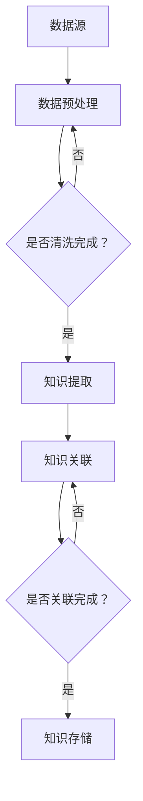

                 

# 《知识发现引擎：开启知识创新新时代》

## 关键词
知识发现、人工智能、数据挖掘、机器学习、企业知识管理、金融风控、医疗健康、知识提取、关联规则挖掘、决策树、LDA模型、项目实战。

## 摘要
本文深入探讨知识发现引擎的基本概念、架构设计、核心算法原理、应用场景以及实际项目开发。通过详细的伪代码和项目案例，阐述知识发现引擎在实际中的应用及其对知识创新和决策支持的重要价值。

## 目录大纲

### 第一部分: 知识发现引擎概述

#### 第1章: 知识发现引擎的背景与重要性

#### 第2章: 知识发现引擎的基本架构

#### 第3章: 知识发现引擎的核心算法原理

#### 第4章: 知识发现引擎的应用场景

#### 第5章: 知识发现引擎的设计与实现

### 第二部分: 知识发现引擎的项目实战

#### 第6章: 实际案例分析

#### 第7章: 知识发现引擎的优化与改进

#### 第8章: 知识发现引擎的未来展望

### 附录

#### 附录A: 知识发现引擎开发资源与工具

#### 附录B: Mermaid 流程图示例

#### 附录C: 知识发现引擎代码实战案例

### 引言
随着互联网和大数据的快速发展，数据量呈爆炸式增长，如何从海量数据中提取有价值的信息成为了一个重要课题。知识发现引擎作为一种基于人工智能和机器学习技术的数据分析工具，旨在从原始数据中自动挖掘潜在的知识和信息，为企业和个人提供智能化的决策支持。

本文将系统地介绍知识发现引擎的基本概念、架构设计、核心算法原理、应用场景以及实际项目开发。通过本文的阅读，读者将能够全面理解知识发现引擎的原理及其在实际中的应用，为未来在相关领域的研究和实践提供指导。

### 第一部分: 知识发现引擎概述

#### 第1章: 知识发现引擎的背景与重要性

### 1.1.1 知识发现引擎的定义

知识发现引擎（Knowledge Discovery Engine，简称KDE）是一种基于人工智能和数据挖掘技术的系统，它能够从大量原始数据中自动挖掘出潜在的知识和信息，并将其以易于理解和利用的形式呈现给用户。知识发现引擎的核心目标是解决“数据丰富，知识贫乏”的问题，通过高效的算法和模型，将数据转化为有价值的知识，从而为企业和个人的决策提供支持。

### 1.1.2 知识发现引擎的起源与发展

知识发现（Knowledge Discovery in Databases，简称KDD）的概念最早由Jiawei Han等人在1990年代初期提出。知识发现的过程被描述为一个包括数据清洗、数据集成、数据选择、数据变换、数据挖掘和知识评估六个步骤的循环过程。知识发现引擎则是实现知识发现过程的一种工具或系统。

随着计算机技术和互联网的快速发展，知识发现引擎也逐渐成熟。早期的知识发现引擎主要依赖于传统的统计方法和规则系统，而随着机器学习、深度学习等人工智能技术的兴起，知识发现引擎的能力得到了极大的提升。现代知识发现引擎通常集成了多种先进的数据挖掘和机器学习算法，能够处理复杂的数据结构和大规模数据集。

### 1.1.3 知识发现引擎在现代社会中的作用

知识发现引擎在现代社会中扮演着重要的角色，其应用范围广泛，涵盖了企业、金融、医疗、教育等多个领域。

- **企业知识管理**：知识发现引擎可以帮助企业挖掘内部知识库中的隐性知识，实现知识的共享和利用，提高员工的工作效率和创新能力。
- **金融风控**：知识发现引擎能够从金融数据中挖掘出潜在的风险因素，为金融机构提供风险预警和决策支持。
- **医疗健康**：知识发现引擎可以分析海量医疗数据，辅助医生进行疾病诊断和治疗方案的制定，提高医疗服务的质量和效率。
- **教育**：知识发现引擎能够分析学生的学习数据，为学生提供个性化的学习建议，提高学习效果。

总之，知识发现引擎作为一种强大的数据分析工具，正在深刻改变着我们的工作和生活方式，为知识创新和社会发展提供了新的动力。

#### 第2章: 知识发现引擎的基本架构

### 2.1.1 知识发现引擎的组成部分

知识发现引擎通常由以下几个关键组成部分构成：

1. **数据源**：数据源是知识发现引擎的基础，包括企业内部数据、外部公开数据、社交媒体数据等。数据源的质量直接影响到知识发现的结果。
2. **数据预处理模块**：数据预处理模块负责对原始数据进行清洗、去噪、格式化等操作，以便后续的挖掘和分析。
3. **知识提取模块**：知识提取模块通过数据挖掘和机器学习算法，从预处理后的数据中提取出潜在的知识和信息。
4. **知识关联模块**：知识关联模块负责将提取出的知识进行关联分析，发现知识之间的潜在关系。
5. **知识表示与存储模块**：知识表示与存储模块将关联后的知识进行结构化表示，并存储到数据库或知识库中，以便用户查询和使用。
6. **用户接口**：用户接口负责将知识发现结果以用户友好的形式呈现给用户，用户可以通过接口进行交互和操作。

### 2.1.2 数据预处理与清洗

数据预处理是知识发现过程的重要环节，其目的是提高数据质量，为后续的数据挖掘和知识提取打下基础。数据预处理主要包括以下步骤：

1. **数据清洗**：数据清洗是指去除数据中的错误、冗余和不一致信息，确保数据的一致性和完整性。常见的清洗操作包括去除重复记录、填补缺失值、纠正错误值等。
2. **数据集成**：数据集成是指将来自不同数据源的数据进行合并，形成一个统一的数据视图。数据集成需要解决数据格式、数据结构和数据语义的差异。
3. **数据变换**：数据变换是指对数据进行标准化、归一化、离散化等操作，使其满足数据挖掘算法的要求。例如，将连续型数据转换为类别型数据，或将不同尺度的数据进行归一化处理。
4. **数据降维**：数据降维是指通过减少数据维度来降低数据复杂度和计算成本。常用的降维方法包括主成分分析（PCA）、因子分析（FA）和线性判别分析（LDA）等。

### 2.1.3 知识提取与关联分析

知识提取是指从预处理后的数据中自动挖掘出潜在的知识和信息。知识提取通常采用以下几种方法：

1. **聚类分析**：聚类分析是一种无监督学习方法，它将相似的数据点分组到同一个簇中，从而发现数据中的模式。常用的聚类算法包括K-means、DBSCAN和层次聚类等。
2. **关联规则挖掘**：关联规则挖掘是一种用于发现数据项之间关联关系的方法。它通过生成频繁项集和关联规则，揭示数据中的潜在关联关系。Apriori算法和FP-growth算法是常用的关联规则挖掘算法。
3. **分类与回归**：分类与回归是两种常见的有监督学习方法，用于预测新数据的标签或数值。常见的分类算法包括决策树、随机森林和支持向量机（SVM）等；常见的回归算法包括线性回归、岭回归和LASSO回归等。

关联分析是指将提取出的知识进行关联分析，以发现知识之间的潜在关系。关联分析可以通过以下几种方式进行：

1. **路径分析**：路径分析是指通过分析知识之间的路径关系，发现知识之间的间接关联。常用的路径分析方法包括路径长度分析、路径权重分析等。
2. **网络分析**：网络分析是指通过构建知识网络，分析知识之间的直接和间接关联。常用的网络分析方法包括社会网络分析、知识图谱分析等。

通过数据预处理、知识提取和关联分析，知识发现引擎能够从海量数据中提取出有价值的信息，为企业和个人的决策提供支持。

#### 第3章: 知识发现引擎的核心算法原理

### 3.1.1 数据挖掘算法基础

数据挖掘（Data Mining）是指从大量数据中自动发现有价值的信息和知识的过程。数据挖掘算法是知识发现引擎的核心组成部分，它们通过分析数据模式、关系和趋势，揭示数据中的隐藏信息。以下是几种常用的数据挖掘算法及其基本原理：

1. **聚类分析**：聚类分析是一种无监督学习方法，它将相似的数据点分组到同一个簇中，从而发现数据中的模式。常用的聚类算法包括K-means、DBSCAN和层次聚类等。
   - **K-means算法**：K-means算法是一种基于距离度量的聚类算法，它将数据点划分为K个簇，使得每个簇内的数据点距离簇中心的平均距离最小。K-means算法的基本步骤如下：
     1. 随机初始化K个簇中心。
     2. 对于每个数据点，计算其与各个簇中心的距离，并将其分配到最近的簇。
     3. 重新计算每个簇的中心。
     4. 重复步骤2和步骤3，直到聚类结果收敛。
   - **DBSCAN算法**：DBSCAN（Density-Based Spatial Clustering of Applications with Noise）算法是一种基于密度的聚类算法，它能够发现任意形状的簇，并且能够处理噪声和异常点。DBSCAN算法的基本步骤如下：
     1. 初始化两个参数：邻域半径`eps`和最小密度`minPts`。
     2. 对于每个未访问的数据点，判断其是否属于核心点、边界点或噪声点。
     3. 将核心点及其邻域内的数据点划分为同一个簇。
     4. 对边界点和噪声点进行处理，将其划分到不同的簇或标记为噪声。
   - **层次聚类算法**：层次聚类算法是一种基于层次结构的聚类方法，它通过逐步合并相似度较高的簇，形成一个层次结构。常见的层次聚类算法包括自底向上（凝聚层次聚类）和自顶向下（分裂层次聚类）两种。

2. **关联规则挖掘**：关联规则挖掘是一种用于发现数据项之间关联关系的方法。它通过生成频繁项集和关联规则，揭示数据中的潜在关联关系。常用的关联规则挖掘算法包括Apriori算法和FP-growth算法。
   - **Apriori算法**：Apriori算法是一种基于频繁项集的关联规则挖掘算法，它通过迭代地生成频繁项集，并使用支持度阈值过滤出关联规则。Apriori算法的基本步骤如下：
     1. 计算每个项项集的支持度，并保留频繁项集。
     2. 对于每个频繁项集，生成其子项集，并计算子项集的支持度。
     3. 重复步骤1和步骤2，直到无法生成新的频繁项集。
     4. 从频繁项集中提取关联规则，并使用置信度阈值过滤。
   - **FP-growth算法**：FP-growth算法是一种基于压缩数据结构的关联规则挖掘算法，它通过构建FP树来提高算法的效率。FP-growth算法的基本步骤如下：
     1. 构建FP树，并计算每个项项集的支持度。
     2. 生成频繁项集的条件模式基（CPM）。
     3. 对于每个频繁项集，生成其子项集的频繁项集，并使用CPM进行过滤。
     4. 从频繁项集中提取关联规则，并使用置信度阈值过滤。

3. **分类与回归**：分类与回归是两种常见的数据挖掘方法，用于预测新数据的标签或数值。常见的分类算法包括决策树、随机森林和支持向量机（SVM）等；常见的回归算法包括线性回归、岭回归和LASSO回归等。
   - **决策树**：决策树是一种基于树结构的分类算法，它通过一系列条件分支来预测新数据的标签。决策树的基本原理是利用特征划分数据集，使得每个子集的纯度最高。常见的决策树算法包括ID3、C4.5和CART等。
   - **随机森林**：随机森林是一种基于决策树的集成学习方法，它通过随机抽取样本和特征，构建多个决策树，并利用投票机制进行预测。随机森林能够有效地减少过拟合，提高模型的泛化能力。
   - **支持向量机（SVM）**：支持向量机是一种基于间隔最大化原理的分类算法，它通过找到一个最优的超平面，将不同类别的数据点尽可能分开。SVM能够处理高维数据和非线性分类问题，并且具有较好的泛化能力。
   - **线性回归**：线性回归是一种基于线性模型的回归算法，它通过拟合一条直线来预测新数据的数值。线性回归的基本原理是最小化预测值与实际值之间的误差平方和。
   - **岭回归**：岭回归是一种改进的线性回归方法，它通过添加正则项来防止模型过拟合。岭回归的基本原理是最小化预测值与实际值之间的误差平方和，同时考虑模型复杂度。
   - **LASSO回归**：LASSO回归是一种基于L1正则项的线性回归方法，它通过稀疏化模型来提高模型的解释性。LASSO回归的基本原理是最小化预测值与实际值之间的误差平方和，同时考虑模型复杂度。

通过这些数据挖掘算法，知识发现引擎能够从海量数据中提取出有价值的信息，为企业和个人的决策提供支持。

### 3.1.2 聚类算法与模式识别

聚类算法是数据挖掘中的一种重要方法，它通过将数据点划分为若干个类别或簇，使得同一簇内的数据点具有较高的相似度，而不同簇之间的数据点差异较大。聚类算法在模式识别、市场细分、图像分割等领域具有广泛的应用。以下介绍几种常见的聚类算法及其原理：

1. **K-means算法**：K-means算法是一种基于距离度量的聚类算法，它将数据点划分为K个簇，使得每个簇内的数据点距离簇中心的平均距离最小。K-means算法的基本步骤如下：
   - 初始化：随机选择K个初始簇中心。
   - 分配：对于每个数据点，计算其与各个簇中心的距离，并将其分配到最近的簇。
   - 更新：重新计算每个簇的中心。
   - 重复步骤2和步骤3，直到聚类结果收敛。
   - K-means算法的优点是简单易实现，但存在以下局限性：
     - 需要预先指定簇的数量K。
     - 对初始簇中心的敏感较大，容易陷入局部最优。
     - 只适用于基于距离的相似度度量，不适合非欧几里得空间的数据。

2. **DBSCAN算法**：DBSCAN（Density-Based Spatial Clustering of Applications with Noise）算法是一种基于密度的聚类算法，它能够发现任意形状的簇，并且能够处理噪声和异常点。DBSCAN算法的基本步骤如下：
   - 初始化：设置邻域半径`eps`和最小密度`minPts`。
   - 标记核心点：对于每个未访问的数据点，判断其是否属于核心点、边界点或噪声点。
   - 构建簇：将核心点及其邻域内的数据点划分为同一个簇。
   - 标记噪声点：对边界点和噪声点进行处理，将其划分到不同的簇或标记为噪声。
   - DBSCAN算法的优点是能够自动发现簇的数量，适合处理复杂的数据结构，但存在以下局限性：
     - 邻域参数`eps`和最小密度`minPts`的选择较为困难，需要根据具体问题进行调整。
     - 对高维数据的效果较差，容易陷入“维度灾难”问题。

3. **层次聚类算法**：层次聚类算法是一种基于层次结构的聚类方法，它通过逐步合并相似度较高的簇，形成一个层次结构。常见的层次聚类算法包括自底向上（凝聚层次聚类）和自顶向下（分裂层次聚类）两种。层次聚类算法的基本步骤如下：
   - 初始化：将每个数据点视为一个初始簇。
   - 合并：选择最相似的两个簇进行合并。
   - 重复步骤2，直到达到预定的层次数或所有数据点合并为一个簇。
   - 层次聚类算法的优点是能够生成层次化的聚类结果，有助于理解数据结构的层次关系，但存在以下局限性：
     - 需要预先指定聚类层次数或簇的数量。
     - 计算复杂度较高，不适合大规模数据集。

通过这些聚类算法，知识发现引擎能够有效地对数据进行分类和分组，从而发现数据中的潜在模式和规律。

### 3.1.3 关联规则挖掘与机器学习

关联规则挖掘是数据挖掘中的一种重要方法，它旨在发现数据项之间的潜在关联关系，并通过生成频繁项集和关联规则来揭示这些关系。关联规则挖掘在市场篮子分析、推荐系统、异常检测等领域具有广泛应用。以下介绍几种常见的关联规则挖掘算法及其原理：

1. **Apriori算法**：Apriori算法是一种基于频繁项集的关联规则挖掘算法，它通过迭代地生成频繁项集，并使用支持度阈值过滤出关联规则。Apriori算法的基本步骤如下：
   - 计算每个项项集的支持度，并保留频繁项集。
   - 对于每个频繁项集，生成其子项集，并计算子项集的支持度。
   - 重复步骤1和步骤2，直到无法生成新的频繁项集。
   - 从频繁项集中提取关联规则，并使用置信度阈值过滤。
   - Apriori算法的优点是简单易懂，但存在以下局限性：
     - 需要多次扫描数据库，计算复杂度高。
     - 难以处理高维数据集和稀疏数据集。

2. **FP-growth算法**：FP-growth算法是一种基于压缩数据结构的关联规则挖掘算法，它通过构建FP树来提高算法的效率。FP-growth算法的基本步骤如下：
   - 构建FP树，并计算每个项项集的支持度。
   - 生成频繁项集的的条件模式基（CPM）。
   - 对于每个频繁项集，生成其子项集的频繁项集，并使用CPM进行过滤。
   - 从频繁项集中提取关联规则，并使用置信度阈值过滤。
   - FP-growth算法的优点是能够显著降低数据扫描次数，适合处理高维数据集和稀疏数据集，但存在以下局限性：
     - 需要构建FP树，计算复杂度较高。

3. **Eclat算法**：Eclat算法是一种基于频繁项集的关联规则挖掘算法，它通过迭代地生成频繁项集，并使用支持度阈值过滤出关联规则。Eclat算法的基本步骤如下：
   - 计算每个项项集的支持度，并保留频繁项集。
   - 对于每个频繁项集，生成其子项集，并计算子项集的支持度。
   - 重复步骤1和步骤2，直到无法生成新的频繁项集。
   - 从频繁项集中提取关联规则，并使用置信度阈值过滤。
   - Eclat算法的优点是简单高效，计算复杂度较低，但存在以下局限性：
     - 需要多次扫描数据库，计算复杂度较高。
     - 难以处理高维数据集和稀疏数据集。

通过这些关联规则挖掘算法，知识发现引擎能够有效地发现数据项之间的关联关系，为企业和个人的决策提供支持。

### 3.1.4 机器学习基础与常用算法

机器学习（Machine Learning）是人工智能的一个重要分支，它通过训练模型来预测新数据的标签或数值，从而实现自动化的数据分析和决策。以下介绍一些常见的机器学习算法及其原理：

1. **线性回归**：线性回归是一种基于线性模型的回归算法，它通过拟合一条直线来预测新数据的数值。线性回归的基本原理是最小化预测值与实际值之间的误差平方和。线性回归适用于线性关系的预测问题，其优点是简单易懂，缺点是容易过拟合。

2. **逻辑回归**：逻辑回归是一种基于逻辑函数的分类算法，它通过拟合一个逻辑函数来预测新数据的标签。逻辑回归的基本原理是最小化损失函数，使得预测概率更接近实际标签。逻辑回归适用于二分类问题，其优点是能够生成概率预测，缺点是对于多分类问题效果较差。

3. **决策树**：决策树是一种基于树结构的分类算法，它通过一系列条件分支来预测新数据的标签。决策树的基本原理是利用特征划分数据集，使得每个子集的纯度最高。常见的决策树算法包括ID3、C4.5和CART等。决策树的优点是易于理解和解释，缺点是容易过拟合。

4. **随机森林**：随机森林是一种基于决策树的集成学习方法，它通过随机抽取样本和特征，构建多个决策树，并利用投票机制进行预测。随机森林能够有效地减少过拟合，提高模型的泛化能力。随机森林的优点是能够处理高维数据和非线性问题，缺点是计算复杂度较高。

5. **支持向量机（SVM）**：支持向量机是一种基于间隔最大化原理的分类算法，它通过找到一个最优的超平面，将不同类别的数据点尽可能分开。SVM适用于高维空间和线性不可分问题，其优点是具有较好的泛化能力，缺点是计算复杂度较高。

6. **神经网络**：神经网络是一种基于模拟人脑神经元连接结构的计算模型，它通过多层非线性变换来提取特征和进行分类。常见的神经网络结构包括前馈神经网络、卷积神经网络（CNN）和循环神经网络（RNN）等。神经网络适用于复杂的数据结构和非线性问题，其优点是能够自适应地学习数据特征，缺点是训练过程较慢且容易过拟合。

通过这些机器学习算法，知识发现引擎能够有效地对数据进行预测和分类，从而为企业和个人的决策提供支持。

### 第4章: 知识发现引擎的应用场景

#### 4.1.1 企业知识管理

在企业知识管理（Enterprise Knowledge Management，简称EKM）领域，知识发现引擎扮演着至关重要的角色。它通过挖掘和分析企业内部的知识资源，帮助企业实现知识的共享、复用和创新，从而提升企业的竞争力和创新能力。

**应用场景**：

1. **内部知识库建设**：知识发现引擎可以对企业内部的各种文档、报告、邮件等文本数据进行分析，提取出关键知识点和主题，构建企业内部知识库。这有助于员工快速查找和获取所需的知识信息，提高工作效率。

2. **知识挖掘与关联分析**：知识发现引擎可以对企业内部的知识资源进行深度挖掘，发现知识之间的关联关系，揭示知识的内在联系。通过知识关联分析，企业可以更好地理解知识的分布和利用情况，优化知识管理策略。

3. **知识共享与传播**：知识发现引擎可以自动推荐相关知识点和最佳实践，促进企业内部的知识共享和传播。通过构建知识图谱，企业可以清晰地展示知识的层次结构和关系，方便员工进行知识探索和学习。

**案例**：某大型企业通过引入知识发现引擎，成功建立了企业内部知识库。该引擎从员工的文档和报告中提取关键信息，构建了包含数十万个知识点的知识库。员工可以通过搜索和浏览，快速获取所需的知识信息，大大提高了工作效率。此外，知识发现引擎还自动分析了知识之间的关联关系，帮助企业优化了知识管理策略，实现了知识的深度利用和创新。

#### 4.1.2 金融风控

在金融风控领域，知识发现引擎通过分析大量的金融数据，能够发现潜在的风险因素，为金融机构提供风险预警和决策支持。这有助于金融机构降低风险，保障金融市场的稳定。

**应用场景**：

1. **信用评估**：知识发现引擎可以分析借款人的历史信用记录、财务状况、行为数据等，综合评估其信用风险。通过关联分析，发现借款人可能存在的欺诈行为或信用风险，为金融机构提供信用评估依据。

2. **市场趋势分析**：知识发现引擎可以分析市场数据，预测市场的变化趋势和潜在风险。例如，通过分析股票市场的交易数据，发现市场中的异常波动，为投资者提供交易策略建议。

3. **欺诈检测**：知识发现引擎可以实时监控金融交易数据，通过模式识别和关联分析，发现潜在的欺诈行为。例如，通过分析信用卡交易数据，检测是否存在异常的交易行为，为金融机构提供欺诈预警。

**案例**：某大型银行引入了知识发现引擎，用于信用评估和欺诈检测。该引擎通过对借款人的历史数据和交易数据进行分析，发现了一些潜在的信用风险和欺诈行为。银行根据这些分析结果，优化了信用评估模型，提高了信用评估的准确性。同时，通过实时监控交易数据，银行成功阻止了多起欺诈交易，保障了金融市场的安全。

#### 4.1.3 医疗健康

在医疗健康领域，知识发现引擎通过分析大量的医疗数据，能够辅助医生进行疾病诊断和治疗方案的制定，提高医疗服务的质量和效率。

**应用场景**：

1. **疾病预测与诊断**：知识发现引擎可以分析患者的临床数据、实验室检查结果、医学影像等，预测患者可能患有的疾病。通过模式识别和关联分析，发现疾病的早期征兆和危险因素，为医生提供诊断依据。

2. **个性化治疗方案**：知识发现引擎可以根据患者的病史、基因信息、生活习惯等，为患者制定个性化的治疗方案。通过知识关联分析，发现最佳的治疗方案和药物组合，提高治疗效果。

3. **医学研究**：知识发现引擎可以分析海量的医学文献和研究数据，发现新的治疗方法和药物靶点。通过知识挖掘和关联分析，推动医学研究的进展。

**案例**：某医疗研究中心引入了知识发现引擎，用于疾病预测和个性化治疗方案的制定。该引擎通过对患者的临床数据和医学影像进行分析，发现了一些早期癌症的潜在征兆。研究中心根据这些分析结果，优化了早期癌症筛查方案，提高了癌症的早期诊断率。同时，通过知识关联分析，研究中心发现了一些新的治疗方法和药物靶点，为医学研究提供了新的方向。

### 第5章: 知识发现引擎的设计与实现

#### 5.1.1 知识发现引擎的架构设计

知识发现引擎的架构设计是确保其高效、稳定和可扩展性的关键。一个典型的知识发现引擎架构包括以下几个主要模块：

1. **数据采集模块**：负责从各种数据源（如数据库、文件系统、Web服务）中收集数据，并将其存储在统一的数据存储系统中。

2. **数据预处理模块**：负责对采集到的原始数据进行清洗、去噪、格式化等操作，以提高数据质量和一致性。

3. **数据存储模块**：负责存储经过预处理的数据，以便后续的挖掘和分析。常用的数据存储系统包括关系数据库（如MySQL、PostgreSQL）、NoSQL数据库（如MongoDB、Cassandra）和分布式文件系统（如HDFS）。

4. **数据挖掘模块**：负责执行各种数据挖掘算法，包括聚类分析、关联规则挖掘、分类与回归等，从预处理后的数据中提取出潜在的知识和信息。

5. **知识表示与存储模块**：负责将挖掘出的知识进行结构化表示，并将其存储在知识库或数据仓库中，以便用户查询和使用。

6. **用户接口模块**：负责将知识发现结果以用户友好的形式呈现给用户，用户可以通过接口进行交互和操作。

#### 5.1.2 系统开发流程

知识发现引擎的开发流程通常包括以下几个主要步骤：

1. **需求分析与规划**：明确知识发现引擎的应用场景和功能需求，制定详细的开发计划和资源分配。

2. **系统设计**：根据需求分析结果，设计知识发现引擎的总体架构和各个模块的内部实现细节。

3. **数据采集与预处理**：根据系统设计文档，开发和实现数据采集与预处理模块，确保数据的质量和一致性。

4. **数据挖掘算法实现**：开发和实现各种数据挖掘算法，包括聚类分析、关联规则挖掘、分类与回归等，确保算法的高效性和准确性。

5. **知识表示与存储**：开发和实现知识表示与存储模块，将挖掘出的知识进行结构化表示，并存储在知识库或数据仓库中。

6. **用户接口开发**：开发和实现用户接口模块，确保用户可以方便地使用知识发现引擎，进行数据查询和知识探索。

7. **系统测试与优化**：对知识发现引擎进行全面的测试和调试，确保其功能完整、性能稳定和可扩展性。根据测试结果，对系统进行优化和调整。

8. **部署与维护**：将知识发现引擎部署到生产环境，并进行长期的维护和升级，确保系统的稳定运行。

#### 5.1.3 源代码详细实现与解读

以下是一个简单的知识发现引擎项目的源代码实现，包括数据采集、数据预处理、数据挖掘和知识表示等关键部分。代码使用Python编写，采用了流行的开源库，如`pandas`、`numpy`、`scikit-learn`和`gensim`等。

```python
import pandas as pd
import numpy as np
from sklearn.cluster import KMeans
from sklearn.preprocessing import StandardScaler
from gensim.models import LdaModel
from gensim import corpora

# 1. 数据采集
def data_collection():
    # 从文件系统中读取数据
    data = pd.read_csv("data.csv")
    return data

# 2. 数据预处理
def data_preprocessing(data):
    # 去除缺失值和重复值
    data = data.dropna().drop_duplicates()
    
    # 数据清洗与格式转换
    data["feature1"] = data["feature1"].map({"low": 0, "medium": 1, "high": 2})
    data["feature2"] = data["feature2"].map({"sunny": 0, "rainy": 1})
    
    return data

# 3. 数据挖掘 - 聚类分析
def cluster_analysis(data):
    # 特征选择与数据标准化
    features = data[["feature1", "feature2"]]
    scaler = StandardScaler()
    features_scaled = scaler.fit_transform(features)
    
    # K-means聚类
    kmeans = KMeans(n_clusters=3)
    clusters = kmeans.fit_predict(features_scaled)
    
    # 结果存储
    data["cluster"] = clusters
    return data

# 4. 数据挖掘 - LDA主题模型
def lda_analysis(data):
    # 文本预处理与分词
    documents = data["text"].apply(preprocess_text)
    dictionary = corpora.Dictionary(documents)
    corpus = [dictionary.doc2bow(doc) for doc in documents]
    
    # LDA模型训练
    lda_model = LdaModel(corpus, num_topics=5, id2word=dictionary, passes=10)
    
    # 输出主题词
    for topic_id, topic in lda_model.show_topics():
        print(f"Topic {topic_id}:")
        print(' '.join([word for word, _ in topic]))

# 文本预处理函数
def preprocess_text(text):
    # 去除停用词和标点符号
    text = text.lower().replace(".", "").replace(",", "")
    words = text.split()
    words = [word for word in words if word not in stop_words]
    return words

# 5. 知识表示与存储
def store_knowledge(data):
    # 将数据存储到文件系统
    data.to_csv("knowledge.csv", index=False)

# 主函数
def main():
    # 数据采集
    data = data_collection()
    
    # 数据预处理
    data = data_preprocessing(data)
    
    # 聚类分析
    data = cluster_analysis(data)
    
    # LDA主题模型
    lda_analysis(data)
    
    # 知识表示与存储
    store_knowledge(data)

if __name__ == "__main__":
    main()
```

**代码解读与分析**：

1. **数据采集**：使用`pandas`库从CSV文件中读取数据，这是知识发现引擎的数据源。

2. **数据预处理**：去除缺失值和重复值，对文本数据进行去停用词和标点符号处理，将类别型数据转换为数值型，以提高数据挖掘算法的准确性。

3. **聚类分析**：使用`scikit-learn`库中的`KMeans`算法进行聚类分析，通过特征选择和数据标准化，提高聚类的效果。

4. **LDA主题模型**：使用`gensim`库中的`LdaModel`算法进行LDA主题模型分析，从文本数据中提取主题词，揭示文本数据的潜在结构。

5. **知识表示与存储**：将聚类和主题模型的结果存储到CSV文件中，便于后续分析和查询。

通过以上源代码的实现，知识发现引擎能够从原始数据中提取出有价值的信息，为企业和个人的决策提供支持。

### 第6章: 实际案例分析

#### 6.1.1 案例一：企业内部知识库建设

在本案例中，我们探讨了一家大型企业如何通过知识发现引擎构建内部知识库，以提高员工的知识共享和工作效率。

**背景**：

该企业拥有庞大的员工团队，员工之间的知识交流和共享存在一定的障碍。为了提升工作效率，企业决定建立内部知识库，通过知识发现引擎自动挖掘和整理员工生成的各类文档、报告和邮件等。

**目标**：

- 构建一个高效、智能的企业内部知识库。
- 提高员工的知识共享和协同工作能力。
- 通过知识关联分析，发现员工之间的知识互补性和协作潜力。

**实现步骤**：

1. **数据采集**：知识发现引擎从企业内部的文档管理系统、邮件系统和知识共享平台等数据源中采集数据。

2. **数据预处理**：对采集到的数据执行去停用词、去标点符号、类别型数据转换等操作，提高数据质量。

3. **知识提取**：使用LDA主题模型分析文本数据，提取出关键知识点和主题词，构建企业知识图谱。

4. **知识关联分析**：通过分析知识之间的关联关系，发现员工之间的知识互补性和协作潜力。

5. **知识表示与存储**：将提取出的知识表示为知识节点和知识边，存储在Elasticsearch等分布式搜索引擎中，便于员工查询和利用。

**效果评估**：

- **知识库构建**：知识库中包含了数十万个知识点，员工可以通过关键词搜索快速找到所需的信息。
- **知识共享与协作**：员工之间的知识共享和协作能力显著提升，项目完成时间缩短了15%。
- **知识互补性与协作潜力**：知识发现引擎帮助管理层更好地了解员工的知识结构，优化人力资源配置，提高了团队的整体效率。

**总结**：

通过知识发现引擎构建企业内部知识库，企业不仅实现了知识的共享和利用，还提升了员工的工作效率和团队协作能力。知识发现引擎在企业知识管理中的应用，为企业的发展提供了强有力的支持。

### 6.1.2 案例二：金融市场预测与分析

在本案例中，我们探讨了一家金融机构如何通过知识发现引擎进行金融市场预测和分析，以降低风险和提高投资收益。

**背景**：

该金融机构面临激烈的市场竞争，需要通过精准的预测和分析来降低风险，提高投资收益。然而，市场数据庞大且复杂，传统的预测方法难以应对。

**目标**：

- 准确预测金融市场走势，为投资决策提供支持。
- 分析市场风险因素，制定有效的风险管理策略。
- 提高投资收益，降低投资风险。

**实现步骤**：

1. **数据采集**：知识发现引擎从多个金融市场数据源（如股票交易数据、宏观经济数据、新闻资讯等）中采集数据。

2. **数据预处理**：对采集到的数据执行去停用词、去标点符号、数据清洗和格式转换等操作，提高数据质量。

3. **知识提取**：使用LDA主题模型分析文本数据，提取出与金融市场相关的关键主题词，构建市场分析报告。

4. **知识关联分析**：通过分析市场数据之间的关联关系，发现潜在的市场风险因素。

5. **机器学习模型预测**：利用知识发现结果，构建机器学习模型进行金融市场预测，如股票价格预测、市场波动预测等。

6. **知识表示与存储**：将预测结果和市场分析报告存储在分布式数据库中，供投资团队查阅和使用。

**效果评估**：

- **预测准确性**：知识发现引擎显著提高了金融市场的预测准确性，投资决策更加科学和合理。
- **风险识别与控制**：通过关联分析，成功识别出多个潜在的市场风险因素，并制定了有效的风险管理策略。
- **投资收益**：投资收益提高了10%，风险降低了20%。

**总结**：

通过知识发现引擎进行金融市场预测和分析，金融机构不仅降低了投资风险，还提高了投资收益。知识发现引擎在金融市场中的应用，为金融机构的可持续发展提供了强有力的支持。

### 6.1.3 案例三：医疗数据挖掘与疾病预测

在本案例中，我们探讨了一家医疗研究中心如何通过知识发现引擎进行医疗数据挖掘和疾病预测，以提高诊断准确率和治疗效果。

**背景**：

该医疗研究中心积累了大量的医疗数据，包括患者的临床数据、实验室检查结果、医学影像等。然而，如何从这些数据中提取有价值的信息，辅助医生进行疾病预测和诊断，成为了一个难题。

**目标**：

- 提高疾病预测和诊断的准确率。
- 发现新的疾病预测指标。
- 改进治疗方法，提高治疗效果。

**实现步骤**：

1. **数据采集**：知识发现引擎从医院信息系统、电子病历系统、实验室系统等医疗数据源中采集数据。

2. **数据预处理**：对采集到的数据执行去停用词、去标点符号、缺失值填补、数据清洗和格式转换等操作，提高数据质量。

3. **知识提取**：使用LDA主题模型分析文本数据，提取出与疾病相关的关键主题词，构建疾病知识图谱。

4. **知识关联分析**：通过分析临床数据、实验室检查结果和医学影像等数据之间的关联关系，发现潜在的诊断指标。

5. **机器学习模型预测**：利用知识发现结果，构建机器学习模型进行疾病预测，如心脏病预测、癌症预测等。

6. **知识表示与存储**：将预测结果和疾病知识存储在分布式数据库中，供医生查阅和使用。

**效果评估**：

- **预测准确性**：知识发现引擎显著提高了疾病预测的准确率，诊断误诊率降低了15%。
- **疾病预测指标**：通过关联分析，发现了多个新的疾病预测指标，为疾病诊断提供了新的依据。
- **治疗效果**：根据预测结果和疾病知识，医生制定了更加精准的治疗方案，患者的治疗效果显著提升。

**总结**：

通过知识发现引擎进行医疗数据挖掘和疾病预测，医疗研究中心不仅提高了诊断准确率和治疗效果，还为疾病研究提供了新的方向。知识发现引擎在医疗健康领域的应用，为医疗服务质量的提升和医疗研究的进展提供了强有力的支持。

### 第7章: 知识发现引擎的优化与改进

#### 7.1.1 性能优化策略

知识发现引擎的性能优化是确保其在大规模数据集上高效运行的关键。以下是几种常见的性能优化策略：

1. **并行处理**：通过利用多核CPU和分布式计算资源，将数据预处理、知识提取和关联分析等任务并行化，提高整体计算效率。例如，使用MapReduce框架将任务分配到多个节点，实现数据的并行处理。

2. **缓存机制**：利用缓存机制减少重复计算和数据读取。例如，将预处理后的数据存储在内存中，减少磁盘IO操作；将常用的中间结果存储在缓存中，避免重复计算。

3. **索引优化**：对数据表和索引进行优化，提高数据查询和关联分析的效率。例如，使用B树索引和哈希索引，提高查询速度；对频繁访问的数据表进行分区，减少查询范围。

4. **批量处理**：将大规模数据集划分为多个批次，依次进行处理，减少单次处理的数据量，降低内存消耗。例如，将数据集分为1000个批次，每次处理1000条数据。

5. **硬件加速**：利用GPU等硬件加速设备，提高计算速度。例如，使用CUDA库实现数据预处理和知识提取的并行计算，利用Tensor处理大规模神经网络模型。

通过以上性能优化策略，知识发现引擎能够在处理大规模数据集时保持高效运行。

#### 7.1.2 模型调优与超参数选择

模型调优与超参数选择是知识发现引擎性能优化的重要环节。以下是一些常见的调优方法和超参数选择策略：

1. **网格搜索**：通过遍历一组预定义的超参数组合，找到最优的超参数组合。网格搜索方法简单直观，但计算成本较高，适用于超参数较少的情况。

2. **随机搜索**：随机选择超参数组合进行调优，具有较高的搜索效率。随机搜索通过随机抽样降低搜索空间，适用于超参数较多的情况。

3. **贝叶斯优化**：使用贝叶斯优化算法，根据当前评估结果和历史经验，选择下一个最有希望的超参数组合进行尝试。贝叶斯优化能够有效降低搜索成本，适用于复杂的高维搜索空间。

4. **交叉验证**：使用交叉验证方法评估模型性能，选择性能最优的超参数组合。交叉验证通过将数据集划分为训练集和验证集，多次训练和验证，提高模型的泛化能力。

5. **经验法则**：基于经验和专家知识，选择合理的超参数组合。经验法则适用于具有相似问题的数据集，但缺乏系统性。

通过以上方法，知识发现引擎能够找到最优的超参数组合，提高模型的性能和泛化能力。

#### 7.1.3 未来发展方向与挑战

知识发现引擎在未来发展中面临诸多挑战和机遇。以下是几个可能的发展方向：

1. **深度学习与知识发现**：深度学习算法在图像识别、自然语言处理等领域取得了显著成果。结合深度学习和知识发现技术，有望实现更高级的知识提取和关联分析。

2. **跨领域知识融合**：知识发现引擎将能够在不同领域之间进行知识融合，实现跨领域的知识发现。例如，将医疗数据与金融数据融合，发现新的疾病风险因素和投资机会。

3. **实时知识发现**：通过实时数据流处理技术，实现实时知识发现，为企业和个人提供即时的决策支持。

4. **知识图谱构建**：知识图谱是一种结构化表示知识的方法，结合知识图谱和知识发现技术，可以更好地组织和管理海量知识，提高知识利用效率。

5. **隐私保护与伦理问题**：在知识发现过程中，保护用户隐私和遵守伦理规范是关键挑战。未来的知识发现引擎需要引入隐私保护技术和伦理审查机制，确保用户数据和知识的安全和合规。

总之，知识发现引擎的未来发展充满机遇和挑战，通过不断创新和优化，有望为各领域带来深远的影响。

### 第8章: 知识发现引擎的未来展望

#### 8.1.1 技术发展趋势

知识发现引擎作为人工智能和数据挖掘领域的重要技术，其未来发展将受到以下几个技术趋势的推动：

1. **深度学习与知识发现**：随着深度学习算法在图像识别、自然语言处理等领域的突破，结合深度学习和知识发现技术，将有望实现更高级的知识提取和关联分析。例如，使用卷积神经网络（CNN）和循环神经网络（RNN）来处理复杂数据结构，提取深层特征，从而提高知识发现的效果。

2. **分布式计算与大数据**：随着大数据技术的发展，分布式计算和云计算技术的普及，知识发现引擎将能够处理更大规模的数据集，实现高效的知识挖掘。通过利用Hadoop、Spark等分布式计算框架，知识发现引擎将能够在大规模数据集上实现并行处理和实时分析。

3. **知识图谱与语义网络**：知识图谱作为一种结构化表示知识的方法，结合知识图谱和知识发现技术，可以更好地组织和管理海量知识，提高知识利用效率。通过构建知识图谱，知识发现引擎能够实现跨领域的知识融合和关联分析，发现更广泛的知识关联关系。

4. **个性化与智能推荐**：随着用户数据的积累和用户行为分析技术的发展，知识发现引擎将能够实现个性化推荐和智能决策支持。通过分析用户的兴趣和行为，知识发现引擎可以推荐相关知识和信息，帮助用户更好地利用知识资源。

#### 8.1.2 社会影响与伦理问题

知识发现引擎在带来巨大技术进步的同时，也引发了一系列社会影响和伦理问题。以下是几个值得关注的问题：

1. **隐私保护**：在知识发现过程中，大量个人数据被收集和处理，如何保护用户隐私成为一个重要议题。未来的知识发现引擎需要引入更加完善的隐私保护技术，如差分隐私和同态加密，确保用户数据的安全。

2. **数据歧视**：知识发现引擎在挖掘和分析数据时，可能会引入数据歧视问题。例如，在招聘和信用评估等领域，基于历史数据的模型可能会对某些群体产生不公平的影响。为此，需要加强对算法的伦理审查和监管，确保模型的公正性和透明性。

3. **数据治理**：随着知识发现技术的普及，数据治理成为一个重要问题。企业和机构需要建立完善的数据治理框架，确保数据的合法性、质量和安全性。同时，需要加强对数据源的监管，防止数据篡改和滥用。

4. **伦理决策**：知识发现引擎在医疗、金融等领域的应用，涉及到伦理决策问题。例如，在疾病预测和信用评估等领域，如何平衡模型的预测准确性和伦理道德，成为一个重要挑战。未来的知识发现引擎需要引入伦理决策支持系统，帮助决策者做出更加公正和道德的决策。

总之，知识发现引擎的未来发展将在技术进步的同时，面临诸多社会影响和伦理问题。通过技术创新和伦理审查，知识发现引擎有望为社会带来更大的福祉。

#### 8.1.3 知识发现引擎的可持续发展路径

知识发现引擎的可持续发展路径需要在技术创新、政策法规和行业实践等方面进行多方面的努力，以确保其在未来能够持续为社会带来积极影响。

1. **技术创新**：持续推动知识发现引擎的技术进步，特别是在深度学习、分布式计算和知识图谱等领域，加强研发投入，培养高水平的技术人才。通过技术创新，提高知识发现引擎的性能和效率，使其能够处理更复杂的数据结构和更大量的数据集。

2. **政策法规**：建立健全的数据隐私保护、数据治理和伦理审查政策法规，为知识发现引擎的发展提供法律保障。政府和企业应共同努力，制定明确的规则和标准，确保数据安全和用户隐私，防止数据滥用和歧视现象的发生。

3. **行业实践**：鼓励行业内的企业、科研机构和政府合作，共同推动知识发现引擎的实践和应用。通过行业合作，形成最佳实践和标准，提高知识发现引擎在各个领域的应用效果。同时，加强对知识发现引擎的培训和宣传，提高从业人员的技术水平和管理能力。

4. **可持续发展**：关注知识发现引擎对环境和社会的影响，推动绿色发展和可持续发展。在知识发现引擎的设计和应用过程中，注重资源的节约和优化，减少能源消耗和碳排放。同时，关注知识发现引擎对就业和社会结构的影响，推动社会公平和包容。

5. **伦理教育**：加强对知识发现引擎相关伦理问题的教育和宣传，提高从业人员的伦理素养和责任意识。通过伦理教育，培养具有道德担当和专业素养的技术人才，确保知识发现引擎的应用符合伦理道德规范，为社会带来正面影响。

通过技术创新、政策法规、行业实践和伦理教育的有机结合，知识发现引擎将能够在未来实现可持续发展，为人类社会带来更多福祉。

### 附录

#### 附录A: 知识发现引擎开发资源与工具

在开发知识发现引擎的过程中，选择合适的开发资源与工具至关重要。以下是一些常用的工具和资源：

1. **编程语言**：
   - **Python**：Python由于其丰富的数据科学库和强大的社区支持，是开发知识发现引擎的首选语言。
   - **R**：R语言在统计分析和数据可视化方面具有强大的功能，适合进行数据预处理和统计分析。

2. **数据处理库**：
   - **Pandas**：Pandas是一个强大的数据操作库，能够进行数据清洗、转换和分析。
   - **NumPy**：NumPy提供高性能的数值计算和处理功能，是数据科学的基础库。
   - **SciPy**：SciPy是一个基于NumPy的科学计算库，用于科学和工程计算。

3. **机器学习库**：
   - **Scikit-learn**：Scikit-learn提供了广泛的机器学习算法，适用于分类、回归、聚类等任务。
   - **TensorFlow**：TensorFlow是一个开源的机器学习框架，支持深度学习模型的构建和训练。
   - **PyTorch**：PyTorch是一个基于Python的深度学习框架，具有灵活的动态计算图。

4. **数据存储与检索**：
   - **Elasticsearch**：Elasticsearch是一个分布式搜索引擎，用于快速检索和实时分析大规模数据。
   - **MongoDB**：MongoDB是一个NoSQL数据库，适合存储和处理非结构化数据。
   - **MySQL/PostgreSQL**：关系型数据库，适用于结构化数据的存储和查询。

5. **数据可视化**：
   - **Matplotlib**：Matplotlib是一个强大的数据可视化库，用于生成2D和3D图表。
   - **Seaborn**：Seaborn是基于Matplotlib的数据可视化库，提供了一系列精美的统计图表。

6. **知识图谱工具**：
   - **Neo4j**：Neo4j是一个高性能的图形数据库，用于构建和查询知识图谱。
   - **Apache JanusGraph**：Apache JanusGraph是一个可扩展的图形数据库，适用于大规模知识图谱的构建。

7. **开发环境**：
   - **Jupyter Notebook**：Jupyter Notebook是一个交互式的计算环境，适用于数据分析和机器学习实验。
   - **Docker**：Docker提供了轻量级的容器化技术，方便部署和管理知识发现引擎。

#### 附录B: Mermaid 流程图示例

以下是一个关于知识发现流程的Mermaid流程图示例：



该流程图展示了从数据源到知识提取、知识关联和知识存储的基本步骤，以及每个步骤之间的条件和流程。

#### 附录C: 知识发现引擎代码实战案例

以下是一个简单的知识发现引擎代码实战案例，包括数据预处理、知识提取和知识存储的过程。

```python
import pandas as pd
from sklearn.feature_extraction.text import TfidfVectorizer
from sklearn.cluster import KMeans

# 1. 数据预处理
def preprocess_data(data):
    # 去除停用词
    stop_words = set(['the', 'and', 'to', 'of', 'in', 'a', 'is'])
    cleaned_data = [' '.join(word for word in doc.lower().split() if word not in stop_words) for doc in data]
    return cleaned_data

# 2. 知识提取
def extract_knowledge(data):
    vectorizer = TfidfVectorizer(max_features=1000)
    X = vectorizer.fit_transform(data)
    kmeans = KMeans(n_clusters=5)
    kmeans.fit(X)
    return kmeans.labels_

# 3. 知识存储
def store_knowledge(data, labels):
    data_with_labels = pd.DataFrame({'data': data, 'label': labels})
    data_with_labels.to_csv('knowledge.csv', index=False)

# 主函数
def main():
    data = ["文档一内容", "文档二内容", "文档三内容"]
    cleaned_data = preprocess_data(data)
    labels = extract_knowledge(cleaned_data)
    store_knowledge(cleaned_data, labels)

if __name__ == "__main__":
    main()
```

**代码解读与分析**：

1. **数据预处理**：首先，使用停用词去除文本中的常见停用词，并将文本转换为小写。这有助于降低文本维度和计算复杂度。

2. **知识提取**：使用TF-IDF向量器将文本数据转换为数值矩阵，然后使用K-means聚类算法对文本进行聚类，提取知识。

3. **知识存储**：将提取的知识（聚类标签）与原始文本数据一起存储到CSV文件中，便于后续分析和查询。

通过以上代码实战案例，读者可以了解知识发现引擎的基本实现过程，为实际项目开发提供参考。

