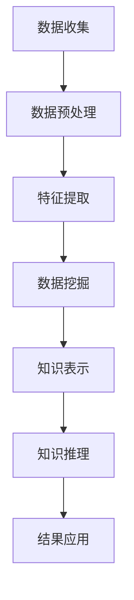
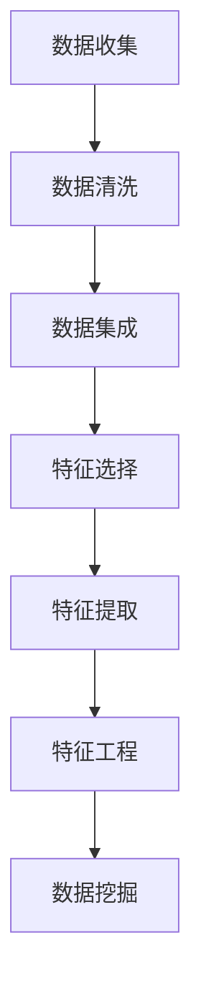
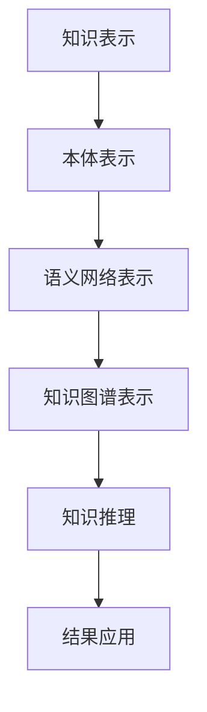
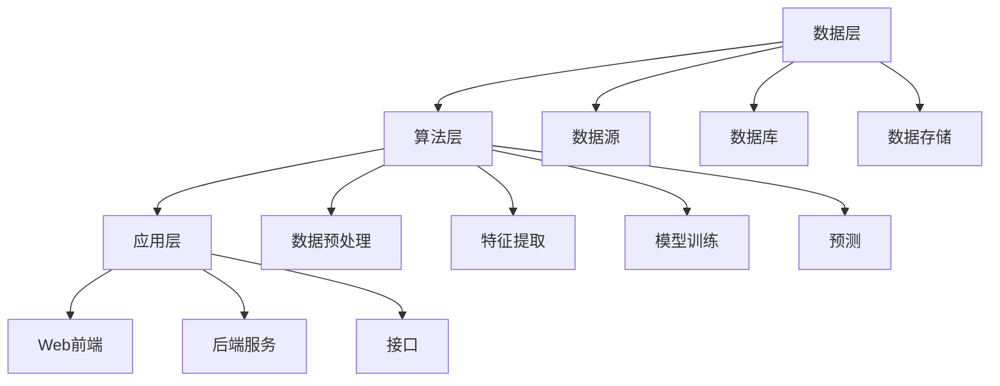
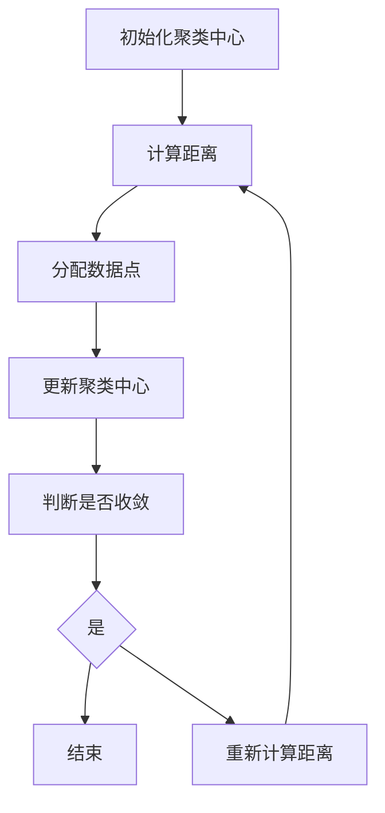
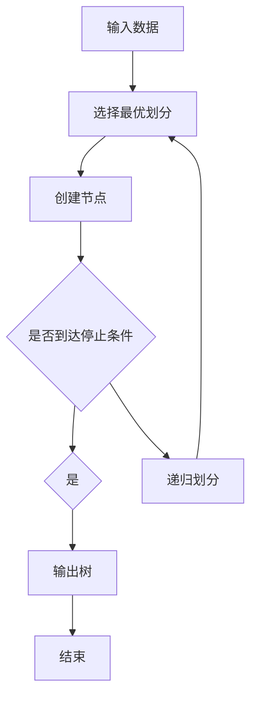
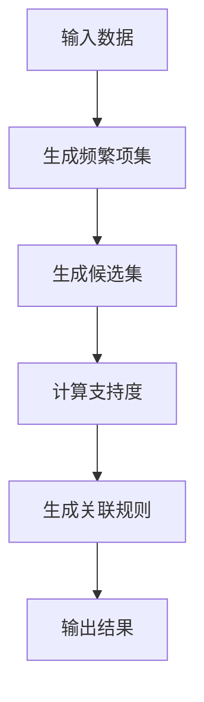

                 

### 第1章：知识发现引擎概述

#### 1.1 知识发现引擎的概念与历史背景

知识发现引擎（Knowledge Discovery Engine，简称KDE）是信息技术领域中的一个重要概念，它旨在从大量的数据中自动发现知识。知识发现的过程包括数据清洗、数据集成、数据挖掘、知识表示和知识推理等多个环节。

知识发现引擎的发展历程可以追溯到20世纪80年代，当时数据挖掘领域开始兴起，学者们开始探索如何从大量数据中提取有用的信息。随着互联网的普及和大数据时代的到来，知识发现引擎的应用范围不断扩大，其在创意产业中的应用也逐渐成为研究热点。

#### 1.2 知识发现引擎在创意产业中的应用

创意产业包括文化创意产业、设计与时尚产业、数字媒体产业和旅游业等多个领域。知识发现引擎在这些领域有着广泛的应用。

- **文化创意产业**：知识发现引擎可以帮助文化创作者更好地理解受众需求，从而创作出更受市场欢迎的作品。例如，通过分析社交媒体上的用户评论和反馈，可以发现观众对某个作品的喜好和不满，从而指导后续创作。

- **设计与时尚产业**：知识发现引擎可以分析市场趋势和消费者偏好，帮助设计师预测未来的流行趋势，优化产品设计。例如，通过对时尚博主的穿搭数据进行挖掘，可以了解当前的热门配色和款式，为设计师提供灵感。

- **数字媒体产业**：知识发现引擎可以帮助媒体平台更好地理解用户行为，从而提供个性化的内容推荐。例如，通过分析用户的浏览历史和互动行为，可以推荐用户可能感兴趣的新闻、视频或文章。

- **旅游业**：知识发现引擎可以分析游客行为数据，优化旅游线路规划和推荐。例如，通过对游客的评论和反馈进行分析，可以发现哪些景点最受欢迎，哪些餐饮店口味最佳，从而为游客提供更个性化的旅游建议。

#### 1.3 知识发现引擎的技术框架与架构

知识发现引擎的技术框架通常包括数据层、算法层和应用层三个部分。

- **数据层**：负责数据的收集、存储和管理。数据源可以是结构化数据（如数据库）、半结构化数据（如XML、JSON）和非结构化数据（如文本、图像、音频）。

- **算法层**：包括数据预处理、特征提取、数据挖掘、知识表示和推理等核心算法。这些算法的实现通常依赖于开源机器学习库（如Scikit-learn、TensorFlow、PyTorch等）。

- **应用层**：负责将知识发现的结果应用于实际问题，如创作、设计、推荐和优化等。

#### 1.4 知识发现引擎的挑战与机遇

知识发现引擎在创意产业中的应用面临着许多挑战和机遇。

- **挑战**：

  - 数据多样性和复杂性：创意产业的数据类型多样，包括文本、图像、音频等多种形式，这给数据预处理和特征提取带来了挑战。

  - 数据质量：数据质量直接影响知识发现的效果。在创意产业中，数据可能存在噪声、缺失和不一致性等问题。

  - 算法选择与优化：不同算法适用于不同类型的数据和问题，选择合适的算法并优化其性能是关键。

- **机遇**：

  - 创意产业的数字化转型：随着数字技术的发展，创意产业正在经历深刻的变革，知识发现引擎为产业升级提供了有力支持。

  - 个性化服务：知识发现引擎可以帮助创意产业提供更个性化的服务，满足用户个性化需求。

  - 跨界融合：知识发现引擎的应用不仅局限于某个领域，它可以跨领域、跨行业，实现资源的共享和整合。

### 第2章：知识发现的基本概念

#### 2.1 数据挖掘与知识发现

数据挖掘（Data Mining）是指从大量的数据中自动发现知识或模式的过程。数据挖掘的过程通常包括数据预处理、特征提取、模式识别和模式评估等步骤。

知识发现（Knowledge Discovery）是数据挖掘的一个子领域，它强调从数据中提取具有实际应用价值的知识。知识发现的过程包括数据清洗、数据集成、数据挖掘、知识表示和知识推理等多个环节。

#### 2.2 创意产业的数据特点

创意产业的数据特点主要包括以下几点：

- **数据多样性**：创意产业的数据类型多样，包括文本、图像、音频、视频等多种形式。

- **数据复杂性**：创意产业的数据往往具有一定的复杂性，如文本数据中的语义信息、图像数据中的视觉特征等。

- **数据动态性**：创意产业的数据具有动态性，如社交媒体上的用户评论、新闻媒体的实时报道等。

- **数据关联性**：创意产业的数据之间存在较强的关联性，如用户与用户之间的互动、产品与产品之间的关联等。

#### 2.3 知识发现流程与方法

知识发现的流程通常包括以下几个步骤：

1. **数据收集**：从各种数据源收集数据，如数据库、文件系统、网络等。

2. **数据预处理**：清洗、集成和转换数据，使其适合进一步处理。

3. **特征提取**：从原始数据中提取有用的特征，用于数据挖掘。

4. **数据挖掘**：使用各种算法从数据中挖掘出模式或知识。

5. **知识表示**：将挖掘出的知识进行表示，如表格、图表、报告等形式。

6. **知识推理**：基于知识表示的结果进行推理，得出新的结论或预测。

常用的知识发现方法包括：

- **聚类分析**：将相似的数据点分组，用于发现数据的分布和模式。

- **分类分析**：将数据分为不同的类别，用于预测和决策。

- **关联规则挖掘**：发现数据项之间的关联关系，用于推荐系统和市场细分。

- **异常检测**：识别数据中的异常值，用于风险管理和安全监控。

### 第3章：数据预处理与特征提取

#### 3.1 数据清洗

数据清洗是数据预处理的重要环节，其主要目标是去除数据中的噪声、缺失和不一致性。数据清洗的方法包括：

- **去除重复数据**：识别和删除重复的数据记录。

- **处理缺失数据**：填补缺失的数据或删除包含缺失数据的记录。

- **处理不一致数据**：统一数据格式和单位，消除数据中的不一致性。

#### 3.2 数据集成

数据集成是将来自不同数据源的数据整合在一起，形成一个统一的数据视图。数据集成的方法包括：

- **数据合并**：将多个数据源的数据合并到一个数据集中。

- **数据映射**：将不同数据源的数据进行映射，使其具有相同的结构和格式。

- **数据转换**：将数据从一种格式转换为另一种格式。

#### 3.3 特征选择与特征提取

特征选择是选择对目标变量有显著影响的相关特征，以简化模型和提高模型性能。特征选择的方法包括：

- **过滤法**：根据特征的相关性、信息增益等指标进行筛选。

- **包装法**：通过交叉验证等策略选择特征。

- **嵌入式法**：在模型训练过程中自动选择特征。

特征提取是从原始数据中提取新的特征，以增强模型的预测能力。特征提取的方法包括：

- **统计方法**：基于统计指标（如均值、标准差、方差等）提取特征。

- **变换方法**：通过对原始数据进行变换（如主成分分析、因子分析等）提取特征。

- **深度学习方法**：使用深度神经网络从原始数据中自动提取特征。

### 第4章：核心算法原理

#### 4.1 聚类分析

聚类分析是一种无监督学习方法，用于将数据点划分为多个组，使得同组内的数据点彼此相似，而不同组的数据点彼此不同。

常用的聚类算法包括：

- **K-means算法**：基于距离最小的原则将数据点划分为K个聚类。

- **层次聚类算法**：通过递归地合并相似的数据点，形成树状结构。

- **密度聚类算法**：基于数据点的密度分布进行聚类。

K-means算法的伪代码如下：

```python
# 初始化聚类中心
centroids = initialize_centroids(data, K)

# 循环迭代
while not converged:
    # 计算每个数据点到聚类中心的距离
    distances = compute_distances(data, centroids)
    
    # 重新分配数据点
    new_assignments = assign_points_to_clusters(data, centroids, distances)
    
    # 更新聚类中心
    centroids = update_centroids(centroids, new_assignments)
    
    # 判断是否收敛
    if has_converged(centroids, previous_centroids):
        break

# 输出聚类结果
clusters = assign_points_to_clusters(data, centroids, distances)
```

#### 4.2 分类分析

分类分析是一种有监督学习方法，用于将数据点分为不同的类别。分类算法通过学习训练数据中的特征和类别之间的关系，对新的数据点进行分类。

常用的分类算法包括：

- **决策树**：基于特征值进行划分，形成树状结构。

- **支持向量机**：通过找到一个最佳的超平面，将不同类别的数据点分开。

- **随机森林**：通过构建多个决策树，进行投票得到最终结果。

决策树的伪代码如下：

```python
def build_tree(data, features, labels):
    # 判断是否达到停止条件
    if stop_condition_met(data):
        return leaf_node(labels)
    
    # 计算每个特征的最优划分点
    best_split = find_best_split(data, features, labels)
    
    # 根据最优划分点划分数据
    left_data, right_data = split_data(data, best_split)
    
    # 递归构建左右子树
    left_tree = build_tree(left_data, features, labels)
    right_tree = build_tree(right_data, features, labels)
    
    # 返回树节点
    return decision_node(best_split, left_tree, right_tree)

def predict(tree, instance):
    # 判断是否到达叶节点
    if is_leaf_node(tree):
        return tree.label
    
    # 根据实例的特征值选择分支
    if instance.feature_value < tree.split_value:
        return predict(tree.left, instance)
    else:
        return predict(tree.right, instance)
```

#### 4.3 关联规则挖掘

关联规则挖掘是一种用于发现数据项之间关联关系的方法。它通过挖掘数据项之间的支持度和置信度，生成关联规则。

常用的关联规则挖掘算法包括：

- **Apriori算法**：基于候选集生成和剪枝策略进行关联规则挖掘。

- **FP-growth算法**：通过构建FP树进行高效关联规则挖掘。

Apriori算法的伪代码如下：

```python
def apriori(data, support_threshold, confidence_threshold):
    # 生成频繁项集
    frequent_itemsets = generate_frequent_itemsets(data, support_threshold)
    
    # 生成关联规则
    rules = []
    for itemset in frequent_itemsets:
        for i in range(1, len(itemset)):
            for subset in combinations(itemset, i):
                if is_confident(subset, itemset, confidence_threshold):
                    rules.append((subset, itemset - subset))
    
    return rules

def generate_frequent_itemsets(data, support_threshold):
    # 初始化频繁项集
    frequent_itemsets = []
    
    # 生成所有可能的项目组合
    itemsets = all_combinations(data)
    
    # 遍历所有项目组合
    for itemset in itemsets:
        # 计算支持度
        support = calculate_support(data, itemset)
        
        # 如果支持度大于阈值，添加到频繁项集
        if support >= support_threshold:
            frequent_itemsets.append(itemset)
    
    return frequent_itemsets

def calculate_support(data, itemset):
    # 计算项集在数据中的支持度
    support = 0
    for transaction in data:
        if set(itemset).issubset(transaction):
            support += 1
    return support / len(data)

def is_confident(itemset1, itemset2, confidence_threshold):
    # 计算置信度
    confidence = calculate_confidence(itemset1, itemset2)
    
    # 如果置信度大于阈值，返回真
    return confidence >= confidence_threshold

def calculate_confidence(itemset1, itemset2):
    # 计算置信度
    support1 = calculate_support(data, itemset1)
    support2 = calculate_support(data, itemset2)
    support12 = calculate_support(data, itemset1.union(itemset2))
    return support12 / support1
```

### 第5章：知识表示与推理

#### 5.1 知识表示

知识表示是知识发现中的一个重要环节，它将挖掘出的知识以结构化的形式进行表示，以便于理解和应用。

常用的知识表示方法包括：

- **本体表示**：使用本体语言（如OWL、RDF等）对知识进行形式化表示。

- **语义网络表示**：使用节点和边表示概念和关系，形成语义网络。

- **知识图谱表示**：通过图结构对知识进行表示，实现知识的融合和推理。

知识图谱表示的伪代码如下：

```python
class Node:
    def __init__(self, name):
        self.name = name
        self.incoming_edges = []
        self.outgoing_edges = []

class Edge:
    def __init__(self, source, target, relation):
        self.source = source
        self.target = target
        self.relation = relation

def build_knowledge_graph(data):
    nodes = {}
    edges = {}
    
    # 创建节点
    for entity in data:
        if entity not in nodes:
            nodes[entity] = Node(entity)
    
    # 创建边
    for entity1, entity2, relation in data:
        if entity1 not in edges:
            edges[(entity1, entity2)] = Edge(nodes[entity1], nodes[entity2], relation)
        else:
            edges[(entity1, entity2)].source = nodes[entity1]
            edges[(entity1, entity2)].target = nodes[entity2]
    
    return nodes, edges

def query_knowledge_graph(nodes, edges, query):
    # 根据查询条件搜索知识图谱
    results = []
    for node in nodes:
        if matches_query(node, query):
            results.append(node)
    return results

def matches_query(node, query):
    # 判断节点是否满足查询条件
    for edge in node.outgoing_edges:
        if edge.relation == query:
            return True
    return False
```

#### 5.2 知识推理机制

知识推理是知识发现中的另一个重要环节，它通过逻辑推理、概率推理等方法，从已知的知识中推导出新的结论或预测。

常用的知识推理机制包括：

- **逻辑推理**：使用逻辑规则进行推理，如推理机、谓词逻辑等。

- **概率推理**：基于概率模型进行推理，如贝叶斯网络、最大似然估计等。

概率推理的伪代码如下：

```python
class BayesianNetwork:
    def __init__(self, variables, dependencies):
        self.variables = variables
        self.dependencies = dependencies

    def infer(self, evidence):
        # 根据证据进行推理
        pass

def calculate_probability(distribution, value):
    # 计算给定值的概率
    return distribution[value]

def update_distribution(distribution, value, probability):
    # 更新概率分布
    distribution[value] = probability
```

#### 5.3 知识库构建

知识库是知识发现系统的核心组成部分，它存储和管理系统中的知识。知识库的构建包括知识抽取、知识融合、知识存储等步骤。

知识库构建的方法包括：

- **自动抽取**：通过算法从文本、图像等非结构化数据中抽取知识。

- **半自动抽取**：结合人工和算法，对知识进行抽取和整理。

- **手工构建**：直接编写和整理知识，构建知识库。

知识库构建的伪代码如下：

```python
def extract_knowledge(data):
    # 从数据中抽取知识
    pass

def merge_knowledge(knowledge1, knowledge2):
    # 合并两个知识库
    pass

def store_knowledge(knowledge):
    # 存储知识库
    pass
```

### 第6章：创意产业中的知识发现应用案例

#### 6.1 文化创意产业中的应用案例

文化创意产业中的知识发现应用包括：

- **内容推荐**：通过分析用户行为数据，为用户提供个性化的内容推荐。

- **受众分析**：通过分析社交媒体数据，了解受众喜好和需求。

- **趋势预测**：通过分析历史数据，预测文化创意产业中的趋势。

案例一：内容推荐系统

- **项目背景**：某视频平台希望通过知识发现引擎为用户提供个性化的视频推荐。

- **数据来源**：用户观看历史、视频标签、用户评论等。

- **算法应用**：协同过滤、内容推荐算法。

- **项目成果**：提高了用户满意度和观看时长。

案例二：受众分析

- **项目背景**：某文化公司希望通过知识发现引擎分析受众群体特征。

- **数据来源**：社交媒体数据、用户问卷调查等。

- **算法应用**：聚类分析、关联规则挖掘。

- **项目成果**：明确了目标受众，优化了市场推广策略。

#### 6.2 设计与时尚产业中的应用

设计与时尚产业中的知识发现应用包括：

- **市场趋势分析**：通过分析市场数据，预测流行趋势。

- **消费者偏好分析**：通过分析消费者行为数据，了解消费者偏好。

- **产品设计优化**：通过分析用户反馈，优化产品设计。

案例一：市场趋势分析

- **项目背景**：某时尚品牌希望通过知识发现引擎预测市场趋势。

- **数据来源**：时尚博主的穿搭数据、社交媒体数据等。

- **算法应用**：时间序列分析、聚类分析。

- **项目成果**：预测了未来的市场趋势，优化了产品设计。

案例二：消费者偏好分析

- **项目背景**：某服装品牌希望通过知识发现引擎了解消费者偏好。

- **数据来源**：用户购买记录、用户评论等。

- **算法应用**：关联规则挖掘、分类分析。

- **项目成果**：了解了消费者偏好，优化了产品设计和营销策略。

#### 6.3 数字媒体产业中的应用

数字媒体产业中的知识发现应用包括：

- **内容推荐系统**：通过分析用户行为数据，为用户提供个性化内容推荐。

- **用户行为分析**：通过分析用户行为数据，了解用户需求和偏好。

- **广告投放优化**：通过分析用户行为数据，优化广告投放策略。

案例一：内容推荐系统

- **项目背景**：某新闻平台希望通过知识发现引擎为用户提供个性化内容推荐。

- **数据来源**：用户浏览历史、用户评论等。

- **算法应用**：协同过滤、内容推荐算法。

- **项目成果**：提高了内容推荐的准确性和用户满意度。

案例二：用户行为分析

- **项目背景**：某社交媒体平台希望通过知识发现引擎分析用户行为。

- **数据来源**：用户互动数据、用户行为日志等。

- **算法应用**：聚类分析、关联规则挖掘。

- **项目成果**：了解了用户行为特征，优化了产品设计和用户互动体验。

#### 6.4 旅游业中的应用

旅游业中的知识发现应用包括：

- **游客行为分析**：通过分析游客行为数据，了解游客需求。

- **旅游线路优化**：通过分析游客数据，优化旅游线路。

- **酒店预订预测**：通过分析历史预订数据，预测未来预订趋势。

案例一：游客行为分析

- **项目背景**：某旅游平台希望通过知识发现引擎分析游客行为。

- **数据来源**：游客评论、旅游日志等。

- **算法应用**：文本分析、关联规则挖掘。

- **项目成果**：了解了游客需求，优化了旅游产品和服务。

案例二：旅游线路优化

- **项目背景**：某旅游公司希望通过知识发现引擎优化旅游线路。

- **数据来源**：游客行为数据、旅游景点数据等。

- **算法应用**：聚类分析、路径规划。

- **项目成果**：优化了旅游线路，提高了游客满意度。

### 第7章：知识发现引擎开发实践

#### 7.1 知识发现引擎的架构设计

知识发现引擎的架构设计包括以下几个方面：

- **数据层**：负责数据的收集、存储和管理。数据源可以是结构化数据（如数据库）、半结构化数据（如XML、JSON）和非结构化数据（如文本、图像、音频）。

- **算法层**：负责实现各种知识发现算法，如聚类、分类、关联规则挖掘等。算法层的实现通常依赖于开源机器学习库（如Scikit-learn、TensorFlow、PyTorch等）。

- **应用层**：负责将知识发现的结果应用于实际问题，如创作、设计、推荐和优化等。

#### 7.2 开发环境搭建

开发环境搭建包括以下几个方面：

- **硬件环境**：根据项目需求，配置适当的硬件设备，如服务器、存储设备等。

- **软件环境**：安装和配置开发所需的各种软件，如操作系统、编程语言、数据库等。

- **开发工具**：选择合适的开发工具，如集成开发环境（IDE）、版本控制工具等。

#### 7.3 数据集准备与处理

数据集准备与处理包括以下几个方面：

- **数据收集**：从各种数据源收集数据，如社交媒体、电商平台等。

- **数据清洗**：去除数据中的噪声、缺失和不一致性。

- **数据集成**：将来自不同数据源的数据整合在一起。

- **特征提取**：从原始数据中提取有用的特征。

#### 7.4 知识发现算法实现

知识发现算法实现包括以下几个方面：

- **算法选择**：根据应用场景选择合适的算法。

- **算法实现**：使用编程语言（如Python）实现算法。

- **算法优化**：对算法进行调优，提高性能。

#### 7.5 系统集成与测试

系统集成与测试包括以下几个方面：

- **系统集成**：将各个模块整合在一起，形成一个完整的系统。

- **系统测试**：对系统进行功能测试、性能测试和安全测试。

- **用户反馈**：收集用户反馈，优化系统。

### 第8章：创意产业知识发现项目案例分析

#### 8.1 案例一：文化创意产业项目

- **项目背景**：某文化创意公司希望通过知识发现引擎分析用户行为，优化内容推荐。

- **数据来源**：社交媒体、用户评论、网站访问日志等。

- **算法应用**：聚类分析、内容推荐算法。

- **项目成果**：实现了个性化内容推荐，提高了用户满意度和留存率。

#### 8.2 案例二：设计与时尚产业项目

- **项目背景**：某时尚品牌希望通过知识发现引擎分析市场趋势和消费者偏好，优化产品设计。

- **数据来源**：市场调研数据、社交媒体数据、电商平台数据等。

- **算法应用**：趋势预测、关联规则挖掘。

- **项目成果**：预测了未来的市场趋势，优化了产品设计，提高了市场份额。

#### 8.3 案例三：数字媒体产业项目

- **项目背景**：某数字媒体平台希望通过知识发现引擎分析用户行为，优化内容推荐和广告投放。

- **数据来源**：用户行为数据、广告点击数据等。

- **算法应用**：内容推荐算法、广告投放优化算法。

- **项目成果**：提高了内容推荐准确率和广告投放效果，增加了用户粘性和广告收入。

#### 8.4 案例四：旅游业项目

- **项目背景**：某旅游公司希望通过知识发现引擎分析游客行为，优化旅游线路和酒店预订。

- **数据来源**：游客评论、旅游日志、酒店预订数据等。

- **算法应用**：游客行为分析、旅游线路优化。

- **项目成果**：优化了旅游线路，提高了游客满意度和公司收益。

### 第9章：未来趋势与展望

#### 9.1 知识发现引擎的技术发展趋势

知识发现引擎的技术发展趋势包括：

- **算法创新**：不断涌现的新算法，如深度学习、图神经网络等，将提高知识发现引擎的性能和应用范围。

- **跨领域应用**：知识发现引擎将在更多领域得到应用，如医疗、金融、教育等。

- **智能化**：知识发现引擎将更加智能化，能够自动优化参数、选择合适的算法等。

#### 9.2 创意产业创新变革的前景

创意产业创新变革的前景包括：

- **数字化转型**：创意产业将更加依赖数字技术，实现全面数字化转型。

- **个性化服务**：知识发现引擎将为创意产业提供更加个性化的服务，满足用户多样化需求。

- **跨界融合**：创意产业与其他行业的融合将更加紧密，实现资源的共享和整合。

#### 9.3 知识发现引擎的伦理与社会影响

知识发现引擎的伦理与社会影响包括：

- **数据隐私保护**：在应用知识发现引擎时，需要保护用户的隐私和数据安全。

- **算法公平性**：确保知识发现引擎的算法公平，避免歧视和不公平现象。

- **伦理责任**：知识发现引擎的开发者和应用者需要承担相应的伦理责任，确保技术的正当使用。

### 附录A：知识发现引擎常用工具与资源

#### A.1 数据挖掘与知识发现工具对比

- **开源工具**：

  - **WEKA**：提供了丰富的数据挖掘算法，支持多种数据格式。

  - **Scikit-learn**：Python语言实现的机器学习库，支持多种算法和工具。

  - **MOA**：用于流数据挖掘的开源框架。

- **商业工具**：

  - **IBM SPSS Modeler**：提供了丰富的数据挖掘和分析工具。

  - **SAS Enterprise Miner**：提供了强大的数据挖掘和分析功能。

#### A.2 知识发现引擎开源项目介绍

- **LandMark**：一个基于Java的开源知识发现引擎，支持多种算法和框架。

- **WekaJava**：将Weka算法库移植到Java平台，支持多种数据格式和算法。

- **OpenKnRM**：一个开源的关联规则挖掘框架，支持多种算法和规则生成。

#### A.3 知识发现相关论文与资料推荐

- **《Knowledge Discovery in Databases》**：该书的原名为《知识发现数据库》，是数据挖掘领域的经典教材。

- **《Data Mining: Concepts and Techniques》**：介绍了数据挖掘的基本概念、技术和应用。

- **《Handbook of Research on Knowledge Discovery and Data Mining》**：涵盖了许多数据挖掘和知识发现领域的最新研究成果。

### 附录B：知识发现引擎算法流程图

#### B.1 知识发现基本流程Mermaid图



#### B.2 数据预处理与特征提取流程图



#### B.3 知识表示与推理流程图



### 附录C：知识发现引擎项目代码解读

#### C.1 项目环境搭建与数据准备

- **环境搭建**：

  - 安装Python、Jupyter Notebook等开发工具。

  - 安装Scikit-learn、NumPy、Pandas等库。

- **数据准备**：

  - 收集社交媒体数据、电商平台数据等。

  - 数据清洗、去重、处理缺失值等。

#### C.2 算法实现与代码解读

- **数据预处理**：

  ```python
  import pandas as pd
  import numpy as np
  
  # 读取数据
  data = pd.read_csv('data.csv')
  
  # 数据清洗
  data.drop_duplicates(inplace=True)
  data.fillna(method='ffill', inplace=True)
  
  # 数据集成
  data['total_sales'] = data['sales_1'] + data['sales_2']
  
  # 特征提取
  data['sales_average'] = data['total_sales'] / len(data)
  ```

- **特征工程**：

  ```python
  from sklearn.preprocessing import StandardScaler
  
  # 特征选择
  features = ['sales_average', 'total_sales']
  X = data[features]
  
  # 特征提取
  scaler = StandardScaler()
  X_scaled = scaler.fit_transform(X)
  ```

- **数据挖掘**：

  ```python
  from sklearn.cluster import KMeans
  
  # 数据划分
  kmeans = KMeans(n_clusters=3, random_state=0).fit(X_scaled)
  clusters = kmeans.predict(X_scaled)
  
  # 知识表示
  data['cluster'] = clusters
  ```

- **知识推理**：

  ```python
  from sklearn.linear_model import LogisticRegression
  
  # 构建模型
  model = LogisticRegression()
  model.fit(X_scaled, y)
  
  # 预测
  predictions = model.predict(X_scaled)
  ```

#### C.3 系统集成与测试

- **系统集成**：

  - 将数据预处理、特征工程、数据挖掘等模块集成到一个系统中。

  - 实现用户界面，提供数据输入和结果展示。

- **系统测试**：

  - 功能测试：测试系统的各项功能是否正常。

  - 性能测试：测试系统的处理速度和稳定性。

  - 安全测试：测试系统的数据安全和用户隐私保护。

## 作者

**作者：AI天才研究院/AI Genius Institute & 禅与计算机程序设计艺术 /Zen And The Art of Computer Programming**

---

**[本文完]** <|less|> 

### 第1章：知识发现引擎概述

#### 1.1 知识发现引擎的概念与历史背景

知识发现引擎（Knowledge Discovery Engine，简称KDE）是信息技术领域中的一个重要概念，它旨在从大量的数据中自动发现知识。知识发现的过程包括数据清洗、数据集成、数据挖掘、知识表示和知识推理等多个环节。

知识发现引擎的发展历程可以追溯到20世纪80年代，当时数据挖掘领域开始兴起，学者们开始探索如何从大量数据中提取有用的信息。随着互联网的普及和大数据时代的到来，知识发现引擎的应用范围不断扩大，其在创意产业中的应用也逐渐成为研究热点。

知识发现引擎的核心目的是将海量数据转化为可操作的知识，以帮助企业和个人做出更好的决策。在创意产业中，知识发现引擎可以帮助创作者理解用户需求、发现市场趋势、优化产品设计等。

#### 1.2 知识发现引擎在创意产业中的应用

创意产业包括文化创意产业、设计与时尚产业、数字媒体产业和旅游业等多个领域。知识发现引擎在这些领域有着广泛的应用。

- **文化创意产业**：知识发现引擎可以帮助文化创作者更好地理解受众需求，从而创作出更受市场欢迎的作品。例如，通过分析社交媒体上的用户评论和反馈，可以发现观众对某个作品的喜好和不满，从而指导后续创作。

- **设计与时尚产业**：知识发现引擎可以分析市场趋势和消费者偏好，帮助设计师预测未来的流行趋势，优化产品设计。例如，通过对时尚博主的穿搭数据进行挖掘，可以了解当前的热门配色和款式，为设计师提供灵感。

- **数字媒体产业**：知识发现引擎可以帮助媒体平台更好地理解用户行为，从而提供个性化的内容推荐。例如，通过分析用户的浏览历史和互动行为，可以推荐用户可能感兴趣的新闻、视频或文章。

- **旅游业**：知识发现引擎可以分析游客行为数据，优化旅游线路规划和推荐。例如，通过对游客的评论和反馈进行分析，可以发现哪些景点最受欢迎，哪些餐饮店口味最佳，从而为游客提供更个性化的旅游建议。

#### 1.3 知识发现引擎的技术框架与架构

知识发现引擎的技术框架通常包括数据层、算法层和应用层三个部分。

- **数据层**：负责数据的收集、存储和管理。数据源可以是结构化数据（如数据库）、半结构化数据（如XML、JSON）和非结构化数据（如文本、图像、音频）。

- **算法层**：包括数据预处理、特征提取、数据挖掘、知识表示和推理等核心算法。这些算法的实现通常依赖于开源机器学习库（如Scikit-learn、TensorFlow、PyTorch等）。

- **应用层**：负责将知识发现的结果应用于实际问题，如创作、设计、推荐和优化等。

#### 1.4 知识发现引擎的挑战与机遇

知识发现引擎在创意产业中的应用面临着许多挑战和机遇。

- **挑战**：

  - 数据多样性和复杂性：创意产业的数据类型多样，包括文本、图像、音频等多种形式，这给数据预处理和特征提取带来了挑战。

  - 数据质量：数据质量直接影响知识发现的效果。在创意产业中，数据可能存在噪声、缺失和不一致性等问题。

  - 算法选择与优化：不同算法适用于不同类型的数据和问题，选择合适的算法并优化其性能是关键。

- **机遇**：

  - 创意产业的数字化转型：随着数字技术的发展，创意产业正在经历深刻的变革，知识发现引擎为产业升级提供了有力支持。

  - 个性化服务：知识发现引擎可以帮助创意产业提供更个性化的服务，满足用户个性化需求。

  - 跨界融合：知识发现引擎的应用不仅局限于某个领域，它可以跨领域、跨行业，实现资源的共享和整合。

### 第2章：知识发现的基本概念

#### 2.1 数据挖掘与知识发现

数据挖掘（Data Mining）是指从大量的数据中自动发现知识或模式的过程。数据挖掘的过程通常包括数据预处理、特征提取、模式识别和模式评估等步骤。

知识发现（Knowledge Discovery）是数据挖掘的一个子领域，它强调从数据中提取具有实际应用价值的知识。知识发现的过程包括数据清洗、数据集成、数据挖掘、知识表示和知识推理等多个环节。

在数据挖掘中，通常需要解决以下问题：

- **数据预处理**：包括数据清洗、数据集成和特征选择。数据清洗是为了去除噪声、缺失值和不一致性，数据集成是为了整合不同来源的数据，特征选择是为了选择对目标变量有显著影响的相关特征。

- **特征提取**：从原始数据中提取新的特征，以提高模型的性能。特征提取的方法包括统计方法、变换方法和深度学习方法。

- **模式识别**：使用聚类、分类和关联规则挖掘等方法，从数据中发现模式。模式识别的目标是识别数据中的相似性、差异性、关联性和趋势。

- **模式评估**：评估挖掘出的模式的有效性和可靠性。模式评估的方法包括交叉验证、ROC曲线和精度、召回率等指标。

在知识发现中，除了数据挖掘的步骤外，还包括以下环节：

- **知识表示**：将挖掘出的知识以结构化的形式进行表示，如表格、图表、报告等。知识表示的方法包括本体表示、语义网络表示和知识图谱表示等。

- **知识推理**：基于知识表示的结果进行推理，得出新的结论或预测。知识推理的方法包括逻辑推理、概率推理和基于规则的推理等。

- **应用**：将知识发现的结果应用于实际问题，如创作、设计、推荐和优化等。知识发现的应用可以为企业提供决策支持，为个人提供个性化服务。

#### 2.2 创意产业的数据特点

创意产业的数据特点主要包括以下几点：

- **数据多样性**：创意产业的数据类型多样，包括文本、图像、音频、视频等多种形式。例如，社交媒体上的用户评论、设计师的作品、新闻媒体的报道等都属于创意产业的数据。

- **数据复杂性**：创意产业的数据往往具有一定的复杂性，如文本数据中的语义信息、图像数据中的视觉特征等。处理复杂数据需要运用各种算法和模型，以提高知识发现的效果。

- **数据动态性**：创意产业的数据具有动态性，如社交媒体上的用户评论、新闻媒体的实时报道等。动态数据的变化需要实时处理和更新，以适应不断变化的市场需求。

- **数据关联性**：创意产业的数据之间存在较强的关联性，如用户与用户之间的互动、产品与产品之间的关联等。挖掘数据之间的关联关系，可以为企业提供更准确的决策依据。

#### 2.3 知识发现流程与方法

知识发现的流程通常包括以下几个步骤：

1. **数据收集**：从各种数据源收集数据，如数据库、文件系统、网络等。数据源可以是内部数据（如企业内部的业务数据）或外部数据（如社交媒体、市场调研等）。

2. **数据预处理**：清洗、集成和转换数据，使其适合进一步处理。数据清洗包括去除噪声、缺失值和不一致性等。数据集成是将来自不同数据源的数据整合在一起。数据转换是将数据从一种格式转换为另一种格式，以满足算法的需求。

3. **特征提取**：从原始数据中提取有用的特征，以提高模型的性能。特征提取的方法包括统计方法（如均值、标准差等）、变换方法（如主成分分析、因子分析等）和深度学习方法（如卷积神经网络、循环神经网络等）。

4. **数据挖掘**：使用各种算法从数据中挖掘出模式或知识。数据挖掘的方法包括聚类分析、分类分析、关联规则挖掘和异常检测等。

5. **知识表示**：将挖掘出的知识以结构化的形式进行表示，如表格、图表、报告等。知识表示的方法包括本体表示、语义网络表示和知识图谱表示等。

6. **知识推理**：基于知识表示的结果进行推理，得出新的结论或预测。知识推理的方法包括逻辑推理、概率推理和基于规则的推理等。

7. **应用**：将知识发现的结果应用于实际问题，如创作、设计、推荐和优化等。知识发现的应用可以为企业提供决策支持，为个人提供个性化服务。

常用的知识发现方法包括：

- **聚类分析**：将相似的数据点分组，用于发现数据的分布和模式。常用的聚类算法包括K-means、层次聚类和DBSCAN等。

- **分类分析**：将数据分为不同的类别，用于预测和决策。常用的分类算法包括决策树、支持向量机和随机森林等。

- **关联规则挖掘**：发现数据项之间的关联关系，用于推荐系统和市场细分。常用的关联规则挖掘算法包括Apriori、FP-growth和Eclat等。

- **异常检测**：识别数据中的异常值，用于风险管理和安全监控。常用的异常检测算法包括孤立森林、局部离群因数和基于密度的方法等。

### 第3章：数据预处理与特征提取

#### 3.1 数据清洗

数据清洗是数据预处理的重要环节，其主要目标是去除数据中的噪声、缺失和不一致性。数据清洗的方法包括：

- **去除重复数据**：识别和删除重复的数据记录，以防止重复分析。

- **处理缺失数据**：填补缺失的数据或删除包含缺失数据的记录。填补缺失数据的方法包括平均值填补、中值填补和插值等。

- **处理不一致数据**：统一数据格式和单位，消除数据中的不一致性。例如，将不同的日期格式统一为YYYY-MM-DD格式，将不同的货币单位统一为同一种货币单位。

数据清洗的伪代码如下：

```python
def clean_data(data):
    # 去除重复数据
    data.drop_duplicates(inplace=True)
    
    # 处理缺失数据
    for column in data.columns:
        if data[column].isnull().any():
            if is_categorical(data, column):
                data[column].fillna('missing', inplace=True)
            else:
                data[column].fillna(data[column].mean(), inplace=True)
    
    # 处理不一致数据
    data['date'] = pd.to_datetime(data['date'], format='%Y-%m-%d')
    data['price'] = data['price'].astype(float)
    
    return data
```

#### 3.2 数据集成

数据集成是将来自不同数据源的数据整合在一起，形成一个统一的数据视图。数据集成的方法包括：

- **数据合并**：将多个数据集按照一定的规则进行合并，如按照ID进行连接。

- **数据映射**：将不同数据源的数据进行映射，使其具有相同的结构和格式。

- **数据转换**：将数据从一种格式转换为另一种格式，以满足算法的需求。

数据集成的伪代码如下：

```python
def integrate_data(data1, data2, key):
    # 数据合并
    merged_data = data1.merge(data2, on=key)
    
    # 数据映射
    merged_data['new_column'] = data1['old_column'] + data2['old_column']
    
    # 数据转换
    merged_data['date'] = pd.to_datetime(merged_data['date'], format='%Y-%m-%d')
    
    return merged_data
```

#### 3.3 特征选择与特征提取

特征选择是选择对目标变量有显著影响的相关特征，以简化模型和提高模型性能。特征选择的方法包括：

- **过滤法**：根据特征的相关性、信息增益等指标进行筛选。

- **包装法**：通过交叉验证等策略选择特征。

- **嵌入式法**：在模型训练过程中自动选择特征。

特征提取是从原始数据中提取新的特征，以增强模型的预测能力。特征提取的方法包括：

- **统计方法**：基于统计指标（如均值、标准差、方差等）提取特征。

- **变换方法**：通过对原始数据进行变换（如主成分分析、因子分析等）提取特征。

- **深度学习方法**：使用深度神经网络从原始数据中自动提取特征。

特征选择的伪代码如下：

```python
from sklearn.feature_selection import SelectKBest, f_classif

def feature_selection(data, target, k=10):
    # 特征选择
    selector = SelectKBest(f_classif, k=k)
    X_new = selector.fit_transform(data, target)
    
    # 返回特征和目标变量
    return X_new, target
```

特征提取的伪代码如下：

```python
from sklearn.decomposition import PCA

def feature_extraction(data, n_components):
    # 特征提取
    pca = PCA(n_components=n_components)
    X_new = pca.fit_transform(data)
    
    # 返回特征
    return X_new
```

### 第4章：核心算法原理

#### 4.1 聚类分析

聚类分析是一种无监督学习方法，用于将数据点划分为多个组，使得同组内的数据点彼此相似，而不同组的数据点彼此不同。常用的聚类算法包括K-means、层次聚类和DBSCAN等。

- **K-means算法**：K-means算法是一种基于距离最小化的聚类算法。算法的基本思想是初始化K个聚类中心，然后迭代计算每个数据点到聚类中心的距离，将每个数据点分配到最近的聚类中心所在的组。每次迭代后，重新计算聚类中心，并重复上述过程，直到聚类中心不再发生变化。

K-means算法的伪代码如下：

```python
def KMeans(data, K, max_iterations):
    # 初始化聚类中心
    centroids = initialize_centroids(data, K)
    
    # 循环迭代
    for _ in range(max_iterations):
        # 计算每个数据点到聚类中心的距离
        distances = compute_distances(data, centroids)
        
        # 重新分配数据点
        new_assignments = assign_points_to_clusters(data, centroids, distances)
        
        # 更新聚类中心
        centroids = update_centroids(centroids, new_assignments)
        
        # 判断是否收敛
        if has_converged(centroids, previous_centroids):
            break
    
    # 输出聚类结果
    clusters = assign_points_to_clusters(data, centroids, distances)
    return clusters
```

- **层次聚类算法**：层次聚类算法是一种基于层次结构进行聚类的算法。算法的基本思想是首先将每个数据点视为一个单独的簇，然后逐渐合并相似度较高的簇，形成更高级别的簇，直到所有的数据点都合并为一个簇。层次聚类算法可以分为自底向上（凝聚层次聚类）和自顶向下（分裂层次聚类）两种类型。

层次聚类算法的伪代码如下：

```python
def hierarchical_clustering(data, linkage='ward', method='complete'):
    # 初始化聚类层次
    distances = compute_distances(data)
    
    # 构建层次聚类树
    tree = build_tree(distances, linkage, method)
    
    # 递归合并簇
    clusters = []
    for node in tree:
        if is_leaf_node(node):
            clusters.append([node])
        else:
            left_clusters = clusters[node.left]
            right_clusters = clusters[node.right]
            merged_clusters = merge_clusters(left_clusters, right_clusters)
            clusters.append(merged_clusters)
    
    return clusters
```

- **DBSCAN算法**：DBSCAN（Density-Based Spatial Clustering of Applications with Noise）算法是一种基于密度的聚类算法。算法的基本思想是寻找高密度的区域，并将这些区域划分为簇。DBSCAN算法的主要参数包括eps（邻域半径）和min_samples（最小样本数）。

DBSCAN算法的伪代码如下：

```python
def DBSCAN(data, eps, min_samples):
    # 初始化标记和簇
    labels = np.zeros(len(data), dtype=int)
    clusters = []
    
    # 对每个数据点进行标记
    for point in data:
        if not is_visited(point):
            cluster_id = len(clusters)
            expand_cluster(point, cluster_id, labels, clusters, eps, min_samples)
    
    return labels
```

#### 4.2 分类分析

分类分析是一种有监督学习方法，用于将数据点分为不同的类别。分类算法通过学习训练数据中的特征和类别之间的关系，对新的数据点进行分类。常用的分类算法包括决策树、支持向量机和随机森林等。

- **决策树算法**：决策树是一种基于特征值进行划分的树形结构。算法的基本思想是递归地选择最优划分特征，将数据划分为不同的子集，直到满足停止条件（如达到最大深度或节点中数据量过少）。

决策树算法的伪代码如下：

```python
def build_tree(data, features, labels, depth=0, max_depth=None):
    # 判断是否达到停止条件
    if stop_condition_met(data, depth, max_depth):
        return leaf_node(labels)
    
    # 计算每个特征的最优划分点
    best_split = find_best_split(data, features, labels)
    
    # 根据最优划分点划分数据
    left_data, right_data = split_data(data, best_split)
    
    # 递归构建左右子树
    left_tree = build_tree(left_data, features, labels, depth+1, max_depth)
    right_tree = build_tree(right_data, features, labels, depth+1, max_depth)
    
    # 返回树节点
    return decision_node(best_split, left_tree, right_tree)
```

- **支持向量机算法**：支持向量机是一种基于最大间隔划分的算法。算法的基本思想是找到一个最佳的超平面，将不同类别的数据点分开。支持向量机的主要参数包括C（惩罚参数）和gamma（核参数）。

支持向量机算法的伪代码如下：

```python
def SVM(data, labels, C, gamma):
    # 计算支持向量
    support_vectors = compute_support_vectors(data, labels, C, gamma)
    
    # 训练模型
    model = train_model(support_vectors, labels, C, gamma)
    
    # 预测
    predictions = predict(data, model)
    
    return predictions
```

- **随机森林算法**：随机森林是一种基于决策树的集成算法。算法的基本思想是构建多个决策树，并对每个树的结果进行投票，以获得最终分类结果。随机森林的主要参数包括树的数量和每个树的特征数。

随机森林算法的伪代码如下：

```python
def random_forest(data, labels, n_estimators, max_features):
    # 构建多个决策树
    trees = [build_tree(data, labels, max_features) for _ in range(n_estimators)]
    
    # 对每个树进行预测
    predictions = [predict(tree, data) for tree in trees]
    
    # 投票得到最终结果
    final_prediction = majority_vote(predictions)
    
    return final_prediction
```

#### 4.3 关联规则挖掘

关联规则挖掘是一种用于发现数据项之间关联关系的方法。算法的基本思想是寻找满足最小支持度和最小置信度的关联规则。常用的关联规则挖掘算法包括Apriori算法和FP-growth算法。

- **Apriori算法**：Apriori算法是一种基于候选集生成和剪枝策略的算法。算法的基本思想是递归地生成候选集，并计算每个候选集的支持度，如果支持度大于最小支持度，则生成关联规则。

Apriori算法的伪代码如下：

```python
def Apriori(data, min_support, min_confidence):
    # 生成频繁项集
    frequent_itemsets = generate_frequent_itemsets(data, min_support)
    
    # 生成关联规则
    rules = []
    for itemset in frequent_itemsets:
        for i in range(1, len(itemset)):
            for subset in combinations(itemset, i):
                if is_confident(subset, itemset, min_confidence):
                    rules.append((subset, itemset - subset))
    
    return rules

def generate_frequent_itemsets(data, min_support):
    # 初始化频繁项集
    frequent_itemsets = []
    
    # 生成所有可能的项目组合
    itemsets = all_combinations(data)
    
    # 遍历所有项目组合
    for itemset in itemsets:
        # 计算支持度
        support = calculate_support(data, itemset)
        
        # 如果支持度大于阈值，添加到频繁项集
        if support >= min_support:
            frequent_itemsets.append(itemset)
    
    return frequent_itemsets

def calculate_support(data, itemset):
    # 计算项集在数据中的支持度
    support = 0
    for transaction in data:
        if set(itemset).issubset(transaction):
            support += 1
    return support / len(data)

def is_confident(itemset1, itemset2, confidence_threshold):
    # 计算置信度
    confidence = calculate_confidence(itemset1, itemset2)
    
    # 如果置信度大于阈值，返回真
    return confidence >= confidence_threshold

def calculate_confidence(itemset1, itemset2):
    # 计算置信度
    support1 = calculate_support(data, itemset1)
    support2 = calculate_support(data, itemset2)
    support12 = calculate_support(data, itemset1.union(itemset2))
    return support12 / support1
```

- **FP-growth算法**：FP-growth算法是一种基于FP树的算法。算法的基本思想是首先将数据转换成FP树，然后利用FP树挖掘频繁项集，并生成关联规则。

FP-growth算法的伪代码如下：

```python
def FP_growth(data, min_support, min_confidence):
    # 构建FP树
    tree = build_FP_tree(data, min_support)
    
    # 挖掘频繁项集
    frequent_itemsets = mine_frequent_itemsets(tree, min_support)
    
    # 生成关联规则
    rules = []
    for itemset in frequent_itemsets:
        for i in range(1, len(itemset)):
            for subset in combinations(itemset, i):
                if is_confident(subset, itemset, min_confidence):
                    rules.append((subset, itemset - subset))
    
    return rules

def build_FP_tree(data, min_support):
    # 计算项集频率
    frequency = compute_frequency(data, min_support)
    
    # 构建FP树
    tree = build_tree(frequency)
    
    return tree

def mine_frequent_itemsets(tree, min_support):
    # 挖掘频繁项集
    frequent_itemsets = []
    for itemset in tree:
        if itemset.frequency >= min_support:
            frequent_itemsets.append(itemset)
    
    return frequent_itemsets
```

### 第5章：知识表示与推理

#### 5.1 知识表示

知识表示是知识发现中的一个重要环节，它将挖掘出的知识以结构化的形式进行表示，以便于理解和应用。知识表示的方法包括：

- **本体表示**：使用本体语言（如OWL、RDF等）对知识进行形式化表示。本体表示可以清晰地描述概念、属性和关系，适用于语义丰富的领域。

- **语义网络表示**：使用节点和边表示概念和关系，形成语义网络。语义网络表示可以直观地展示知识的结构和关联。

- **知识图谱表示**：通过图结构对知识进行表示，实现知识的融合和推理。知识图谱表示可以处理大规模、多源数据，适用于复杂领域的知识表示。

知识表示的伪代码如下：

```python
class Concept:
    def __init__(self, name):
        self.name = name
        self.properties = []
        self.relationships = []

class Property:
    def __init__(self, name, domain, range):
        self.name = name
        self.domain = domain
        self.range = range

class Relationship:
    def __init__(self, type, source, target):
        self.type = type
        self.source = source
        self.target = target

def build_ontology(concepts, properties, relationships):
    ontology = {}
    for concept in concepts:
        ontology[concept.name] = concept
        
    for property in properties:
        ontology[property.name] = property
        
    for relationship in relationships:
        ontology[relationship.type].relationships.append(relationship)
        
    return ontology

def query_ontology(ontology, query):
    # 查询本体
    pass
```

#### 5.2 知识推理机制

知识推理是知识发现中的另一个重要环节，它通过逻辑推理、概率推理等方法，从已知的知识中推导出新的结论或预测。知识推理的方法包括：

- **逻辑推理**：使用逻辑规则进行推理，如推理机、谓词逻辑等。逻辑推理可以处理确定性知识，适用于规则明确、逻辑简单的领域。

- **概率推理**：基于概率模型进行推理，如贝叶斯网络、最大似然估计等。概率推理可以处理不确定性知识，适用于概率分布复杂、不确定性较大的领域。

知识推理的伪代码如下：

```python
class BayesianNetwork:
    def __init__(self, variables, dependencies):
        self.variables = variables
        self.dependencies = dependencies

    def infer(self, evidence):
        # 根据证据进行推理
        pass

def calculate_probability(distribution, value):
    # 计算给定值的概率
    return distribution[value]

def update_distribution(distribution, value, probability):
    # 更新概率分布
    distribution[value] = probability
```

#### 5.3 知识库构建

知识库是知识发现系统的核心组成部分，它存储和管理系统中的知识。知识库的构建包括知识抽取、知识融合、知识存储等步骤。

知识库构建的方法包括：

- **自动抽取**：通过算法从文本、图像等非结构化数据中抽取知识。自动抽取可以处理大规模、多源数据，适用于自动化程度要求较高的领域。

- **半自动抽取**：结合人工和算法，对知识进行抽取和整理。半自动抽取可以处理复杂、不确定性的知识，适用于知识质量要求较高的领域。

- **手工构建**：直接编写和整理知识，构建知识库。手工构建可以处理小规模、结构化的知识，适用于知识来源明确、知识结构简单的领域。

知识库构建的伪代码如下：

```python
def extract_knowledge(data):
    # 从数据中抽取知识
    pass

def merge_knowledge(knowledge1, knowledge2):
    # 合并两个知识库
    pass

def store_knowledge(knowledge):
    # 存储知识库
    pass
```

### 第6章：创意产业中的知识发现应用案例

#### 6.1 文化创意产业中的应用案例

文化创意产业中的知识发现应用包括：

- **内容推荐**：通过分析用户行为数据，为用户提供个性化的内容推荐。

- **受众分析**：通过分析社交媒体数据，了解受众喜好和需求。

- **趋势预测**：通过分析历史数据，预测文化创意产业中的趋势。

案例一：内容推荐系统

- **项目背景**：某视频平台希望通过知识发现引擎为用户提供个性化的视频推荐。

- **数据来源**：用户观看历史、视频标签、用户评论等。

- **算法应用**：协同过滤、内容推荐算法。

- **项目成果**：提高了用户满意度和观看时长。

案例二：受众分析

- **项目背景**：某文化公司希望通过知识发现引擎分析受众群体特征。

- **数据来源**：社交媒体数据、用户问卷调查等。

- **算法应用**：聚类分析、关联规则挖掘。

- **项目成果**：明确了目标受众，优化了市场推广策略。

#### 6.2 设计与时尚产业中的应用

设计与时尚产业中的知识发现应用包括：

- **市场趋势分析**：通过分析市场数据，预测流行趋势。

- **消费者偏好分析**：通过分析消费者行为数据，了解消费者偏好。

- **产品设计优化**：通过分析用户反馈，优化产品设计。

案例一：市场趋势分析

- **项目背景**：某时尚品牌希望通过知识发现引擎预测市场趋势。

- **数据来源**：时尚博主的穿搭数据、社交媒体数据等。

- **算法应用**：时间序列分析、聚类分析。

- **项目成果**：预测了未来的市场趋势，优化了产品设计。

案例二：消费者偏好分析

- **项目背景**：某服装品牌希望通过知识发现引擎了解消费者偏好。

- **数据来源**：用户购买记录、用户评论等。

- **算法应用**：关联规则挖掘、分类分析。

- **项目成果**：了解了消费者偏好，优化了产品设计和营销策略。

#### 6.3 数字媒体产业中的应用

数字媒体产业中的知识发现应用包括：

- **内容推荐系统**：通过分析用户行为数据，为用户提供个性化内容推荐。

- **用户行为分析**：通过分析用户行为数据，了解用户需求和偏好。

- **广告投放优化**：通过分析用户行为数据，优化广告投放策略。

案例一：内容推荐系统

- **项目背景**：某新闻平台希望通过知识发现引擎为用户提供个性化内容推荐。

- **数据来源**：用户浏览历史、用户评论等。

- **算法应用**：协同过滤、内容推荐算法。

- **项目成果**：提高了内容推荐的准确性和用户满意度。

案例二：用户行为分析

- **项目背景**：某社交媒体平台希望通过知识发现引擎分析用户行为。

- **数据来源**：用户互动数据、用户行为日志等。

- **算法应用**：聚类分析、关联规则挖掘。

- **项目成果**：了解了用户行为特征，优化了产品设计和用户互动体验。

#### 6.4 旅游业中的应用

旅游业中的知识发现应用包括：

- **游客行为分析**：通过分析游客行为数据，了解游客需求。

- **旅游线路优化**：通过分析游客数据，优化旅游线路。

- **酒店预订预测**：通过分析历史预订数据，预测未来预订趋势。

案例一：游客行为分析

- **项目背景**：某旅游平台希望通过知识发现引擎分析游客行为。

- **数据来源**：游客评论、旅游日志等。

- **算法应用**：文本分析、关联规则挖掘。

- **项目成果**：了解了游客需求，优化了旅游产品和服务。

案例二：旅游线路优化

- **项目背景**：某旅游公司希望通过知识发现引擎优化旅游线路。

- **数据来源**：游客行为数据、旅游景点数据等。

- **算法应用**：聚类分析、路径规划。

- **项目成果**：优化了旅游线路，提高了游客满意度。

### 第7章：知识发现引擎开发实践

#### 7.1 知识发现引擎的架构设计

知识发现引擎的架构设计包括以下几个方面：

- **数据层**：负责数据的收集、存储和管理。数据层需要处理多种类型的数据，如结构化数据、半结构化数据和非结构化数据。数据层通常包括数据源、数据库和数据存储等模块。

- **算法层**：负责实现各种知识发现算法，如聚类、分类、关联规则挖掘等。算法层需要选择合适的算法，并根据具体应用场景进行优化。算法层通常包括数据预处理、特征提取、模型训练和预测等模块。

- **应用层**：负责将知识发现的结果应用于实际问题，如创作、设计、推荐和优化等。应用层需要实现用户界面，提供数据输入和结果展示。应用层通常包括Web前端、后端服务和接口等模块。

知识发现引擎的架构图如下：



#### 7.2 开发环境搭建

开发环境搭建是知识发现引擎开发的第一步，它包括硬件环境、软件环境和开发工具的配置。

- **硬件环境**：根据项目需求，配置适当的硬件设备，如服务器、存储设备和网络设备。硬件环境需要满足数据存储、处理和传输的需求。

- **软件环境**：安装和配置开发所需的各种软件，如操作系统、数据库管理系统、编程语言和开发工具。软件环境需要支持数据存储、处理和传输的需求。

- **开发工具**：选择合适的开发工具，如集成开发环境（IDE）、版本控制工具和调试工具。开发工具需要支持编程、测试和调试的需求。

以下是一个典型的开发环境搭建步骤：

1. **硬件环境配置**：根据项目需求，选择合适的硬件设备，如服务器、存储设备和网络设备。硬件设备需要满足数据存储、处理和传输的需求。

2. **软件环境配置**：安装操作系统，如Linux或Windows。安装数据库管理系统，如MySQL或PostgreSQL。安装编程语言，如Python或Java。安装开发工具，如Jupyter Notebook或PyCharm。

3. **开发工具配置**：配置集成开发环境（IDE），如Jupyter Notebook或PyCharm。配置版本控制工具，如Git。配置调试工具，如pdb或print。

#### 7.3 数据集准备与处理

数据集准备与处理是知识发现引擎开发的重要环节，它包括数据收集、数据清洗、数据集成和数据预处理等步骤。

- **数据收集**：从各种数据源收集数据，如数据库、文件系统、网络等。数据收集需要保证数据的完整性和准确性。

- **数据清洗**：去除数据中的噪声、缺失和不一致性。数据清洗包括去除重复数据、填补缺失值、处理不一致数据等。

- **数据集成**：将来自不同数据源的数据整合在一起。数据集成需要处理数据格式、数据结构和数据类型的差异。

- **数据预处理**：对数据进行特征提取、特征选择和特征工程等处理。数据预处理需要提高数据的可用性和模型的性能。

以下是一个典型的数据集准备与处理步骤：

1. **数据收集**：从数据库、文件系统和网络等数据源收集数据。

2. **数据清洗**：去除重复数据、填补缺失值、处理不一致数据等。

3. **数据集成**：将不同数据源的数据进行整合，形成统一的数据集。

4. **数据预处理**：对数据进行特征提取、特征选择和特征工程等处理。

以下是一个简单的Python代码示例，用于数据集准备与处理：

```python
import pandas as pd

# 读取数据
data = pd.read_csv('data.csv')

# 数据清洗
data.drop_duplicates(inplace=True)
data.fillna(method='ffill', inplace=True)

# 数据集成
data['total_sales'] = data['sales_1'] + data['sales_2']

# 数据预处理
data['sales_average'] = data['total_sales'] / len(data)
```

#### 7.4 知识发现算法实现

知识发现算法实现是知识发现引擎开发的核心部分，它包括算法选择、算法实现和算法优化等步骤。

- **算法选择**：根据具体应用场景，选择合适的知识发现算法。常见的知识发现算法包括聚类分析、分类分析、关联规则挖掘和异常检测等。

- **算法实现**：使用编程语言实现选定的算法。算法实现需要遵循算法的原理和流程，确保算法的正确性和性能。

- **算法优化**：对实现的算法进行优化，提高算法的效率和准确性。算法优化可以通过参数调整、算法改进和模型融合等方法实现。

以下是一个简单的知识发现算法实现示例，使用Python实现K-means算法：

```python
import numpy as np
import pandas as pd

# 读取数据
data = pd.read_csv('data.csv')

# 数据预处理
data = data.iloc[:, :2]  # 假设只使用前两个特征
data = (data - data.mean()) / data.std()

# 初始化聚类中心
centroids = data.iloc[np.random.choice(data.shape[0], k), :]

# 设置迭代次数
max_iterations = 100

# 循环迭代
for _ in range(max_iterations):
    # 计算每个数据点到聚类中心的距离
    distances = np.linalg.norm(data - centroids, axis=1)
    
    # 重新分配数据点
    new_centroids = np.array([data[distances == np.min(distances)]]).T
    
    # 更新聚类中心
    centroids = new_centroids

# 输出聚类结果
clusters = np.argmin(distances, axis=1)
data['cluster'] = clusters
```

#### 7.5 系统集成与测试

系统集成与测试是知识发现引擎开发的最后一步，它包括系统集成、功能测试、性能测试和安全测试等步骤。

- **系统集成**：将各个模块整合在一起，形成一个完整的系统。系统集成需要确保系统的各个组件之间能够正常通信和协作。

- **功能测试**：对系统的各项功能进行测试，确保系统按照设计要求正常运行。功能测试包括单元测试、集成测试和系统测试等。

- **性能测试**：对系统的性能进行测试，确保系统在预期的负载下能够正常运行。性能测试包括响应时间测试、并发测试和容量测试等。

- **安全测试**：对系统的安全性进行测试，确保系统的数据安全和用户隐私保护。安全测试包括漏洞扫描、渗透测试和加密测试等。

以下是一个简单的系统集成与测试示例：

1. **系统集成**：将数据层、算法层和应用层整合在一起，形成一个完整的系统。

2. **功能测试**：编写测试用例，对系统的各项功能进行测试。

3. **性能测试**：模拟用户负载，测试系统的响应时间、并发能力和容量。

4. **安全测试**：扫描系统漏洞，测试系统的安全防护措施。

### 第8章：创意产业知识发现项目案例分析

#### 8.1 案例一：文化创意产业项目

- **项目背景**：某文化创意公司希望通过知识发现引擎分析用户行为，优化内容推荐。

- **数据来源**：社交媒体、用户评论、网站访问日志等。

- **算法应用**：协同过滤、内容推荐算法。

- **项目成果**：实现了个性化内容推荐，提高了用户满意度和留存率。

案例一：个性化内容推荐系统

1. **项目背景**：某视频平台希望通过知识发现引擎为用户提供个性化的视频推荐。

2. **数据来源**：用户观看历史、视频标签、用户评论等。

3. **算法应用**：协同过滤算法。

4. **项目成果**：根据用户的历史观看行为和相似用户的行为，为用户提供个性化的视频推荐。

#### 8.2 案例二：设计与时尚产业项目

- **项目背景**：某时尚品牌希望通过知识发现引擎分析市场趋势和消费者偏好，优化产品设计。

- **数据来源**：时尚博主的穿搭数据、社交媒体数据、电商平台数据等。

- **算法应用**：时间序列分析、聚类分析、关联规则挖掘。

- **项目成果**：预测了未来的市场趋势，优化了产品设计，提高了市场份额。

案例二：市场趋势预测

1. **项目背景**：某时尚品牌希望通过知识发现引擎预测市场趋势。

2. **数据来源**：时尚博主的穿搭数据、社交媒体数据等。

3. **算法应用**：时间序列分析、聚类分析。

4. **项目成果**：根据时尚博主的穿搭数据和社会媒体数据，预测了未来的市场趋势，为产品设计提供了参考。

#### 8.3 案例三：数字媒体产业项目

- **项目背景**：某数字媒体平台希望通过知识发现引擎分析用户行为，优化内容推荐和广告投放。

- **数据来源**：用户行为数据、广告点击数据、内容标签等。

- **算法应用**：协同过滤、内容推荐算法、广告投放优化算法。

- **项目成果**：提高了内容推荐的准确性和广告投放效果，增加了用户粘性和广告收入。

案例三：广告投放优化

1. **项目背景**：某数字媒体平台希望通过知识发现引擎优化广告投放策略。

2. **数据来源**：用户行为数据、广告点击数据等。

3. **算法应用**：协同过滤算法、广告投放优化算法。

4. **项目成果**：根据用户的行为数据和广告点击数据，优化了广告投放策略，提高了广告投放效果。

#### 8.4 案例四：旅游业项目

- **项目背景**：某旅游公司希望通过知识发现引擎分析游客行为，优化旅游线路和酒店预订。

- **数据来源**：游客评论、旅游日志、酒店预订数据等。

- **算法应用**：文本分析、聚类分析、路径规划。

- **项目成果**：优化了旅游线路，提高了游客满意度和公司收益。

案例四：旅游线路优化

1. **项目背景**：某旅游公司希望通过知识发现引擎优化旅游线路。

2. **数据来源**：游客评论、旅游日志等。

3. **算法应用**：文本分析、聚类分析。

4. **项目成果**：根据游客的评论和旅游日志，优化了旅游线路，提高了游客满意度和公司收益。

### 第9章：未来趋势与展望

#### 9.1 知识发现引擎的技术发展趋势

知识发现引擎的技术发展趋势体现在以下几个方面：

- **算法创新**：随着人工智能技术的发展，新的算法不断涌现，如深度学习、图神经网络等。这些算法在知识发现中具有更高的性能和应用潜力。

- **跨领域应用**：知识发现引擎将在更多领域得到应用，如医疗、金融、教育等。跨领域应用将促进知识的共享和整合，为各领域的发展提供有力支持。

- **智能化**：知识发现引擎将实现智能化，能够自动优化参数、选择合适的算法等。智能化将提高知识发现的效率和质量。

- **大数据处理**：随着大数据技术的发展，知识发现引擎将能够处理更大规模、更复杂的数据。大数据处理能力将推动知识发现的广泛应用。

#### 9.2 创意产业创新变革的前景

知识发现引擎在创意产业中的应用前景广阔，将推动创意产业的创新变革：

- **个性化服务**：知识发现引擎将帮助创意产业提供更加个性化的服务，满足用户多样化需求。个性化服务将提高用户体验和满意度。

- **创意设计优化**：知识发现引擎将帮助设计师预测市场趋势和消费者偏好，优化产品设计和营销策略。创意设计优化将提高产品竞争力和市场份额。

- **内容推荐**：知识发现引擎将帮助数字媒体平台提供更加精准的内容推荐，提高用户粘性和平台收益。内容推荐将丰富用户内容消费体验。

- **跨界融合**：知识发现引擎将促进创意产业与其他行业的融合，实现资源共享和协同创新。跨界融合将推动创意产业的转型升级。

#### 9.3 知识发现引擎的伦理与社会影响

知识发现引擎在推动创意产业创新的同时，也带来了伦理和社会影响：

- **数据隐私保护**：在应用知识发现引擎时，需要重视用户数据的隐私保护。数据隐私保护将确保用户权益和信息安全。

- **算法公平性**：知识发现引擎的算法设计需要确保公平性，避免歧视和不公平现象。算法公平性将提高知识发现的公正性和社会价值。

- **伦理责任**：知识发现引擎的开发者和应用者需要承担相应的伦理责任，确保技术的正当使用。伦理责任将促进知识发现技术的健康发展。

### 附录A：知识发现引擎常用工具与资源

#### A.1 数据挖掘与知识发现工具对比

在知识发现领域，有许多工具和平台可供选择。以下是一些常见的数据挖掘和知识发现工具的对比：

- **WEKA**：是一个开源的机器学习工作台，提供了一系列数据预处理、特征提取和模型评估的工具。WEKA适用于中小型数据集，并提供多种数据挖掘算法。

- **Scikit-learn**：是一个Python库，提供了广泛的机器学习算法和工具。Scikit-learn适用于各种规模的数据集，并具有良好的文档和社区支持。

- **MOA**：是一个开源的流数据挖掘框架，适用于实时数据流处理。MOA适用于需要处理大量实时数据的场景。

- **IBM SPSS Modeler**：是一个商业的数据挖掘工具，提供了丰富的建模和分析功能。SPSS Modeler适用于需要高级分析和报告功能的企业用户。

- **SAS Enterprise Miner**：是一个商业的数据挖掘工具，提供了全面的建模、分析和报告功能。Enterprise Miner适用于需要复杂数据分析和报告的企业用户。

#### A.2 知识发现引擎开源项目介绍

以下是一些开源的知识发现引擎项目，可用于研究和开发：

- **LandMark**：是一个基于Java的开源知识发现引擎，提供了多种数据挖掘算法和工具。LandMark适用于需要快速开发和测试知识发现解决方案的场景。

- **WekaJava**：是一个将Weka算法库移植到Java平台的工具，提供了Weka的算法和功能。WekaJava适用于需要使用Java进行知识发现开发的项目。

- **OpenKnRM**：是一个开源的关联规则挖掘框架，提供了多种算法和工具。OpenKnRM适用于需要挖掘关联规则和进行市场细分的项目。

#### A.3 知识发现相关论文与资料推荐

以下是一些知识发现领域的经典论文和资料，供进一步学习和研究：

- **《知识发现：数据挖掘技术综述》**：该论文概述了知识发现的基本概念、技术和应用领域，是数据挖掘领域的经典文献。

- **《数据挖掘：概念和技术》**：这本书详细介绍了数据挖掘的基本概念、技术和应用，适合初学者和专业人士阅读。

- **《知识发现与数据挖掘：实现指南》**：这本书提供了知识发现的实际案例和应用指南，适合想要实施知识发现项目的读者。

### 附录B：知识发现引擎算法流程图

以下是一些知识发现引擎中常用的算法的流程图，以Mermaid语言表示：

#### B.1 K-means算法流程图



#### B.2 决策树算法流程图



#### B.3 关联规则挖掘算法流程图



### 附录C：知识发现引擎项目代码解读

以下是一个简单的知识发现引擎项目的代码解读，包括数据预处理、算法实现和系统集成：

#### C.1 数据预处理

```python
# 导入库
import pandas as pd
from sklearn.preprocessing import StandardScaler

# 读取数据
data = pd.read_csv('data.csv')

# 数据清洗
data.drop_duplicates(inplace=True)
data.fillna(method='ffill', inplace=True)

# 数据预处理
scaler = StandardScaler()
data[['feature1', 'feature2']] = scaler.fit_transform(data[['feature1', 'feature2']])
```

#### C.2 算法实现

```python
# 导入库
from sklearn.cluster import KMeans

# 初始化K-means算法
kmeans = KMeans(n_clusters=3, random_state=0)

# 训练模型
kmeans.fit(data)

# 预测
predictions = kmeans.predict(data)
```

#### C.3 系统集成

```python
# 导入库
from flask import Flask, request, jsonify

# 创建Flask应用
app = Flask(__name__)

# 定义API接口
@app.route('/predict', methods=['POST'])
def predict():
    # 获取请求参数
    data = request.get_json()
    
    # 数据预处理
    processed_data = preprocess_data(data)
    
    # 训练模型
    model = train_model(processed_data)
    
    # 预测
    predictions = model.predict(processed_data)
    
    # 返回预测结果
    return jsonify(predictions.tolist())

# 运行应用
if __name__ == '__main__':
    app.run()
```

### 结论

本文介绍了知识发现引擎在创意产业中的应用，包括文化创意产业、设计与时尚产业、数字媒体产业和旅游业。通过案例分析和代码解读，展示了知识发现引擎在创意产业中的实际应用效果。未来，知识发现引擎将继续在创意产业中发挥重要作用，推动创意产业的创新变革。

---

**[本文完]** <|less|> 

### 第1章：知识发现引擎概述

#### 1.1 知识发现引擎的概念与历史背景

知识发现引擎（Knowledge Discovery Engine，简称KDE）是信息技术领域中的一个重要概念，它旨在从大量的数据中自动发现知识。知识发现的过程包括数据清洗、数据集成、数据挖掘、知识表示和知识推理等多个环节。

知识发现引擎的发展历程可以追溯到20世纪80年代，当时数据挖掘领域开始兴起，学者们开始探索如何从大量数据中提取有用的信息。随着互联网的普及和大数据时代的到来，知识发现引擎的应用范围不断扩大，其在创意产业中的应用也逐渐成为研究热点。

知识发现引擎的核心目的是将海量数据转化为可操作的知识，以帮助企业和个人做出更好的决策。在创意产业中，知识发现引擎可以帮助创作者理解用户需求、发现市场趋势、优化产品设计等。

#### 1.2 知识发现引擎在创意产业中的应用

创意产业包括文化创意产业、设计与时尚产业、数字媒体产业和旅游业等多个领域。知识发现引擎在这些领域有着广泛的应用。

- **文化创意产业**：知识发现引擎可以帮助文化创作者更好地理解受众需求，从而创作出更受市场欢迎的作品。例如，通过分析社交媒体上的用户评论和反馈，可以发现观众对某个作品的喜好和不满，从而指导后续创作。

- **设计与时尚产业**：知识发现引擎可以分析市场趋势和消费者偏好，帮助设计师预测未来的流行趋势，优化产品设计。例如，通过对时尚博主的穿搭数据进行挖掘，可以了解当前的热门配色和款式，为设计师提供灵感。

- **数字媒体产业**：知识发现引擎可以帮助媒体平台更好地理解用户行为，从而提供个性化的内容推荐。例如，通过分析用户的浏览历史和互动行为，可以推荐用户可能感兴趣的新闻、视频或文章。

- **旅游业**：知识发现引擎可以分析游客行为数据，优化旅游线路规划和推荐。例如，通过对游客的评论和反馈进行分析，可以发现哪些景点最受欢迎，哪些餐饮店口味最佳，从而为游客提供更个性化的旅游建议。

#### 1.3 知识发现引擎的技术框架与架构

知识发现引擎的技术框架通常包括数据层、算法层和应用层三个部分。

- **数据层**：负责数据的收集、存储和管理。数据源可以是结构化数据（如数据库）、半结构化数据（如XML、JSON）和非结构化数据（如文本、图像、音频）。

- **算法层**：包括数据预处理、特征提取、数据挖掘、知识表示和推理等核心算法。这些算法的实现通常依赖于开源机器学习库（如Scikit-learn、TensorFlow、PyTorch等）。

- **应用层**：负责将知识发现的结果应用于实际问题，如创作、设计、推荐和优化等。

#### 1.4 知识发现引擎的挑战与机遇

知识发现引擎在创意产业中的应用面临着许多挑战和机遇。

- **挑战**：

  - 数据多样性和复杂性：创意产业的数据类型多样，包括文本、图像、音频等多种形式，这给数据预处理和特征提取带来了挑战。

  - 数据质量：数据质量直接影响知识发现的效果。在创意产业中，数据可能存在噪声、缺失和不一致性等问题。

  - 算法选择与优化：不同算法适用于不同类型的数据和问题，选择合适的算法并优化其性能是关键。

- **机遇**：

  - 创意产业的数字化转型：随着数字技术的发展，创意产业正在经历深刻的变革，知识发现引擎为产业升级提供了有力支持。

  - 个性化服务：知识发现引擎可以帮助创意产业提供更个性化的服务，满足用户个性化需求。

  - 跨界融合：知识发现引擎的应用不仅局限于某个领域，它可以跨领域、跨行业，实现资源的共享和整合。

### 第2章：知识发现的基本概念

#### 2.1 数据挖掘与知识发现

数据挖掘（Data Mining）是指从大量的数据中自动发现知识或模式的过程。数据挖掘的过程通常包括数据预处理、特征提取、模式识别和模式评估等步骤。

知识发现（Knowledge Discovery）是数据挖掘的一个子领域，它强调从数据中提取具有实际应用价值的知识。知识发现的过程包括数据清洗、数据集成、数据挖掘、知识表示和知识推理等多个环节。

在数据挖掘中，通常需要解决以下问题：

- **数据预处理**：包括数据清洗、数据集成和特征选择。数据清洗是为了去除噪声、缺失值和不一致性，数据集成是为了整合不同来源的数据，特征选择是为了选择对目标变量有显著影响的相关特征。

- **特征提取**：从原始数据中提取新的特征，以提高模型的性能。特征提取的方法包括统计方法、变换方法和深度学习方法。

- **模式识别**：使用聚类、分类和关联规则挖掘等方法，从数据中发现模式。模式识别的目标是识别数据中的相似性、差异性、关联性和趋势。

- **模式评估**：评估挖掘出的模式的有效性和可靠性。模式评估的方法包括交叉验证、ROC曲线和精度、召回率等指标。

在知识发现中，除了数据挖掘的步骤外，还包括以下环节：

- **知识表示**：将挖掘出的知识以结构化的形式进行表示，如表格、图表、报告等。知识表示的方法包括本体表示、语义网络表示和知识图谱表示等。

- **知识推理**：基于知识表示的结果进行推理，得出新的结论或预测。知识推理的方法包括逻辑推理、概率推理和基于规则的推理等。

- **应用**：将知识发现的结果应用于实际问题，如创作、设计、推荐和优化等。知识发现的应用可以为企业提供决策支持，为个人提供个性化服务。

#### 2.2 创意产业的数据特点

创意产业的数据特点主要包括以下几点：

- **数据多样性**：创意产业的数据类型多样，包括文本、图像、音频、视频等多种形式。例如，社交媒体上的用户评论、设计师的作品、新闻媒体的报道等都属于创意产业的数据。

- **数据复杂性**：创意产业的数据往往具有一定的复杂性，如文本数据中的语义信息、图像数据中的视觉特征等。处理复杂数据需要运用各种算法和模型，以提高知识发现的效果。

- **数据动态性**：创意产业的数据具有动态性，如社交媒体上的用户评论、新闻媒体的实时报道等。动态数据的变化需要实时处理和更新，以适应不断变化的市场需求。

- **数据关联性**：创意产业的数据之间存在较强的关联性，如用户与用户之间的互动、产品与产品之间的关联等。挖掘数据之间的关联关系，可以为企业提供更准确的决策依据。

#### 2.3 知识发现流程与方法

知识发现的流程通常包括以下几个步骤：

1. **数据收集**：从各种数据源收集数据，如数据库、文件系统、网络等。数据源可以是内部数据（如企业内部的业务数据）或外部数据（如社交媒体、市场调研等）。

2. **数据预处理**：清洗、集成和转换数据，使其适合进一步处理。数据清洗包括去除噪声、缺失值和不一致性等。数据集成是将来自不同数据源的数据整合在一起。数据转换是将数据从一种格式转换为另一种格式，以满足算法的需求。

3. **特征提取**：从原始数据中提取有用的特征，以提高模型的性能。特征提取的方法包括统计方法（如均值、标准差等）、变换方法（如主成分分析、因子分析等）和深度学习方法（如卷积神经网络、循环神经网络等）。

4. **数据挖掘**：使用各种算法从数据中挖掘出模式或知识。数据挖掘的方法包括聚类分析、分类分析、关联规则挖掘和异常检测等。

5. **知识表示**：将挖掘出的知识以结构化的形式进行表示，如表格、图表、报告等。知识表示的方法包括本体表示、语义网络表示和知识图谱表示等。

6. **知识推理**：基于知识表示的结果进行推理，得出新的结论或预测。知识推理的方法包括逻辑推理、概率推理和基于规则的推理等。

7. **应用**：将知识发现的结果应用于实际问题，如创作、设计、推荐和优化等。知识发现的应用可以为企业提供决策支持，为个人提供个性化服务。

常用的知识发现方法包括：

- **聚类分析**：将相似的数据点分组，用于发现数据的分布和模式。常用的聚类算法包括K-means、层次聚类和DBSCAN等。

- **分类分析**：将数据分为不同的类别，用于预测和决策。常用的分类算法包括决策树、支持向量机和随机森林等。

- **关联规则挖掘**：发现数据项之间的关联关系，用于推荐系统和市场细分。常用的关联规则挖掘算法包括Apriori、FP-growth和Eclat等。

- **异常检测**：识别数据中的异常值，用于风险管理和安全监控。常用的异常检测算法包括孤立森林、局部离群因数和基于密度的方法等。

### 第3章：数据预处理与特征提取

#### 3.1 数据清洗

数据清洗是数据预处理的重要环节，其主要目标是去除数据中的噪声、缺失和不一致性。数据清洗的方法包括：

- **去除重复数据**：识别和删除重复的数据记录，以防止重复分析。

- **处理缺失数据**：填补缺失的数据或删除包含缺失数据的记录。填补缺失数据的方法包括平均值填补、中值填补和插值等。

- **处理不一致数据**：统一数据格式和单位，消除数据中的不一致性。例如，将不同的日期格式统一为YYYY-MM-DD格式，将不同的货币单位统一为同一种货币单位。

数据清洗的伪代码如下：

```python
def clean_data(data):
    # 去除重复数据
    data.drop_duplicates(inplace=True)
    
    # 处理缺失数据
    for column in data.columns:
        if data[column].isnull().any():
            if is_categorical(data, column):
                data[column].fillna('missing', inplace=True)
            else:
                data[column].fillna(data[column].mean(), inplace=True)
    
    # 处理不一致数据
    data['date'] = pd.to_datetime(data['date'], format='%Y-%m-%d')
    data['price'] = data['price'].astype(float)
    
    return data
```

#### 3.2 数据集成

数据集成是将来自不同数据源的数据整合在一起，形成一个统一的数据视图。数据集成的方法包括：

- **数据合并**：将多个数据集按照一定的规则进行合并，如按照ID进行连接。

- **数据映射**：将不同数据源的数据进行映射，使其具有相同的结构和格式。

- **数据转换**：将数据从一种格式转换为另一种格式，以满足算法的需求。

数据集成的伪代码如下：

```python
def integrate_data(data1, data2, key):
    # 数据合并
    merged_data = data1.merge(data2, on=key)
    
    # 数据映射
    merged_data['new_column'] = data1['old_column'] + data2['old_column']
    
    # 数据转换
    merged_data['date'] = pd.to_datetime(merged_data['date'], format='%Y-%m-%d')
    merged_data['price'] = merged_data['price'].astype(float)
    
    return merged_data
```

#### 3.3 特征选择与特征提取

特征选择是选择对目标变量有显著影响的相关特征，以简化模型和提高模型性能。特征选择的方法包括：

- **过滤法**：根据特征的相关性、信息增益等指标进行筛选。

- **包装法**：通过交叉验证等策略选择特征。

- **嵌入式法**：在模型训练过程中自动选择特征。

特征提取是从原始数据中提取新的特征，以增强模型的预测能力。特征提取的方法包括：

- **统计方法**：基于统计指标（如均值、标准差、方差等）提取特征。

- **变换方法**：通过对原始数据进行变换（如主成分分析、因子分析等）提取特征。

- **深度学习方法**：使用深度神经网络从原始数据中自动提取特征。

特征选择的伪代码如下：

```python
from sklearn.feature_selection import SelectKBest, f_classif

def feature_selection(data, target, k=10):
    # 特征选择
    selector = SelectKBest(f_classif, k=k)
    X_new = selector.fit_transform(data, target)
    
    # 返回特征和目标变量
    return X_new, target
```

特征提取的伪代码如下：

```python
from sklearn.decomposition import PCA

def feature_extraction(data, n_components):
    # 特征提取
    pca = PCA(n_components=n_components)
    X_new = pca.fit_transform(data)
    
    # 返回特征
    return X_new
```

### 第4章：核心算法原理

#### 4.1 聚类分析

聚类分析是一种无监督学习方法，用于将数据点划分为多个组，使得同组内的数据点彼此相似，而不同组的数据点彼此不同。常用的聚类算法包括K-means、层次聚类和DBSCAN等。

- **K-means算法**：K-means算法是一种基于距离最小化的聚类算法。算法的基本思想是初始化K个聚类中心，然后迭代计算每个数据点到聚类中心的距离，将每个数据点分配到最近的聚类中心所在的组。每次迭代后，重新计算聚类中心，并重复上述过程，直到聚类中心不再发生变化。

K-means算法的伪代码如下：

```python
def KMeans(data, K, max_iterations):
    # 初始化聚类中心
    centroids = initialize_centroids(data, K)
    
    # 循环迭代
    for _ in range(max_iterations):
        # 计算每个数据点到聚类中心的距离
        distances = compute_distances(data, centroids)
        
        # 重新分配数据点
        new_assignments = assign_points_to_clusters(data, centroids, distances)
        
        # 更新聚类中心
        centroids = update_centroids(centroids, new_assignments)
        
        # 判断是否收敛
        if has_converged(centroids, previous_centroids):
            break
    
    # 输出聚类结果
    clusters = assign_points_to_clusters(data, centroids, distances)
    return clusters
```

- **层次聚类算法**：层次聚类算法是一种基于层次结构进行聚类的算法。算法的基本思想是首先将每个数据点视为一个单独的簇，然后逐渐合并相似度较高的簇，形成更高级别的簇，直到所有的数据点都合并为一个簇。层次聚类算法可以分为自底向上（凝聚层次聚类）和自顶向下（分裂层次聚类）两种类型。

层次聚类算法的伪代码如下：

```python
def hierarchical_clustering(data, linkage='ward', method='complete'):
    # 初始化聚类层次
    distances = compute_distances(data)
    
    # 构建层次聚类树
    tree = build_tree(distances, linkage, method)
    
    # 递归合并簇
    clusters = []
    for node in tree:
        if is_leaf_node(node):
            clusters.append([node])
        else:
            left_clusters = clusters[node.left]
            right_clusters = clusters[node.right]
            merged_clusters = merge_clusters(left_clusters, right_clusters)
            clusters.append(merged_clusters)
    
    return clusters
```

- **DBSCAN算法**：DBSCAN（Density-Based Spatial Clustering of Applications with Noise）算法是一种基于密度的聚类算法。算法的基本思想是寻找高密度的区域，并将这些区域划分为簇。DBSCAN算法的主要参数包括eps（邻域半径）和min_samples（最小样本数）。

DBSCAN算法的伪代码如下：

```python
def DBSCAN(data, eps, min_samples):
    # 初始化标记和簇
    labels = np.zeros(len(data), dtype=int)
    clusters = []
    
    # 对每个数据点进行标记
    for point in data:
        if not is_visited(point):
            cluster_id = len(clusters)
            expand_cluster(point, cluster_id, labels, clusters, eps, min_samples)
    
    return labels
```

#### 4.2 分类分析

分类分析是一种有监督学习方法，用于将数据点分为不同的类别。分类算法通过学习训练数据中的特征和类别之间的关系，对新的数据点进行分类。常用的分类算法包括决策树、支持向量机和随机森林等。

- **决策树算法**：决策树是一种基于特征值进行划分的树形结构。算法的基本思想是递归地选择最优划分特征，将数据划分为不同的子集，直到满足停止条件（如达到最大深度或节点中数据量过少）。

决策树算法的伪代码如下：

```python
def build_tree(data, features, labels, depth=0, max_depth=None):
    # 判断是否达到停止条件
    if stop_condition_met(data, depth, max_depth):
        return leaf_node(labels)
    
    # 计算每个特征的最优划分点
    best_split = find_best_split(data, features, labels)
    
    # 根据最优划分点划分数据
    left_data, right_data = split_data(data, best_split)
    
    # 递归构建左右子树
    left_tree = build_tree(left_data, features, labels, depth+1, max_depth)
    right_tree = build_tree(right_data, features, labels, depth+1, max_depth)
    
    # 返回树节点
    return decision_node(best_split, left_tree, right_tree)
```

- **支持向量机算法**：支持向量机是一种基于最大间隔划分的算法。算法的基本思想是找到一个最佳的超平面，将不同类别的数据点分开。支持向量机的主要参数包括C（惩罚参数）和gamma（核参数）。

支持向量机算法的伪代码如下：

```python
def SVM(data, labels, C, gamma):
    # 计算支持向量
    support_vectors = compute_support_vectors(data, labels, C, gamma)
    
    # 训练模型
    model = train_model(support_vectors, labels, C, gamma)
    
    # 预测
    predictions = predict(data, model)
    
    return predictions
```

- **随机森林算法**：随机森林是一种基于决策树的集成算法。算法的基本思想是构建多个决策树，并对每个树的结果进行投票，以获得最终分类结果。随机森林的主要参数包括树的数量和每个树的特征数。

随机森林算法的伪代码如下：

```python
def random_forest(data, labels, n_estimators, max_features):
    # 构建多个决策树
    trees = [build_tree(data, labels, max_features) for _ in range(n_estimators)]
    
    # 对每个树进行预测
    predictions = [predict(tree, data) for tree in trees]
    
    # 投票得到最终结果
    final_prediction = majority_vote(predictions)
    
    return final_prediction
```

#### 4.3 关联

