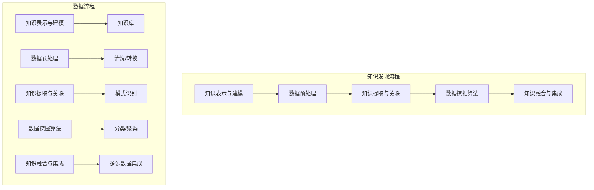
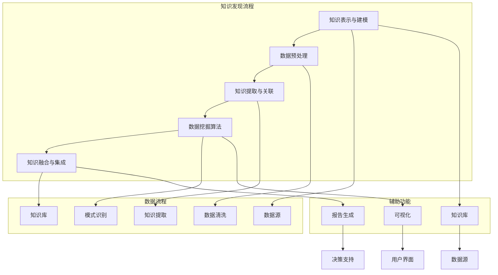
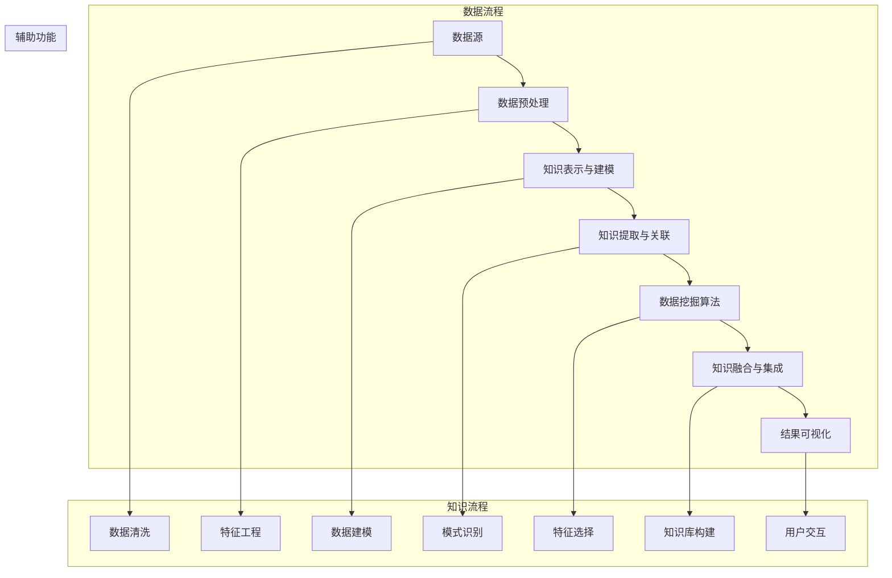
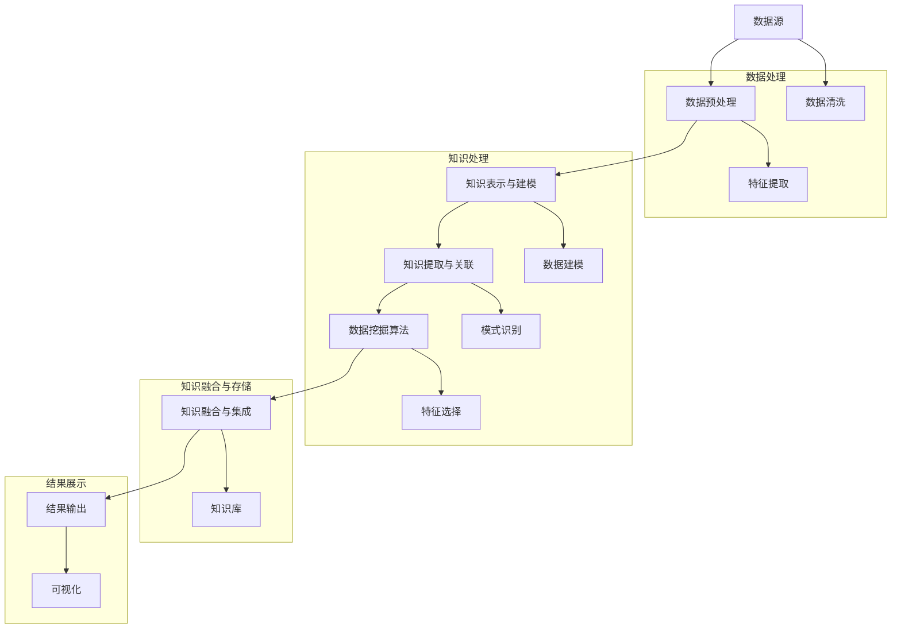
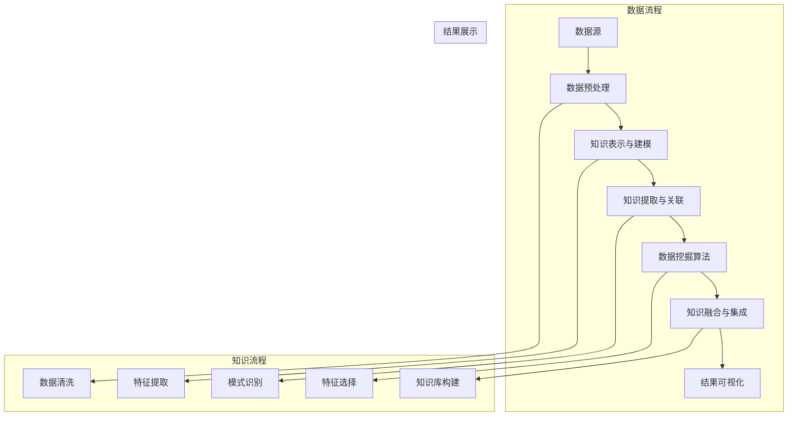

                 

# 《知识发现引擎：推动科学研究的创新引擎》

## 关键词

知识发现引擎、科学研究、大数据、人工智能、算法

## 摘要

本文旨在探讨知识发现引擎在推动科学研究中的作用与价值。通过详细分析知识发现引擎的定义、基本原理、核心算法以及在生物信息学和社会科学中的应用，揭示知识发现引擎如何通过智能化数据分析，成为科学研究的重要工具。本文还展望了知识发现引擎的未来发展趋势，为科学研究提供新的思路和方向。

## 目录大纲

#### 第一部分：知识发现引擎概述

##### 第1章：知识发现引擎概述

- 1.1 知识发现引擎的定义与重要性
- 1.2 知识发现引擎的发展历程
- 1.3 知识发现引擎的应用领域

##### 第2章：知识发现引擎的基本原理

- 2.1 知识发现引擎的核心概念
- 2.2 知识发现引擎的架构
- 2.3 知识发现引擎的关键技术

#### 第二部分：知识发现引擎的核心算法

##### 第3章：关联规则挖掘算法

- 3.1 关联规则挖掘的基本原理
- 3.2 关联规则挖掘的应用案例

##### 第4章：聚类分析算法

- 4.1 聚类分析的基本原理
- 4.2 聚类分析的应用案例

##### 第5章：分类算法

- 5.1 分类算法的基本原理
- 5.2 分类算法的应用案例

#### 第三部分：知识发现引擎在实际科学研究中的应用

##### 第6章：知识发现引擎在生物信息学中的应用

- 6.1 生物信息学中的知识发现引擎
- 6.2 生物信息学应用案例

##### 第7章：知识发现引擎在社会科学中的应用

- 7.1 社会科学中的知识发现引擎
- 7.2 社会科学研究应用案例

##### 第8章：知识发现引擎的未来发展

- 8.1 知识发现引擎的趋势与挑战
- 8.2 知识发现引擎的发展方向

### 附录

- 附录 A：知识发现引擎常用工具与资源

#### 附加内容

- 核心概念与联系：知识发现引擎的核心概念 Mermaid 流程图
- 核心算法原理讲解：关联规则挖掘算法伪代码、聚类分析算法伪代码、分类算法伪代码
- 数学模型和数学公式讲解：支持度与置信度计算、逻辑回归公式
- 项目实战：生物信息学应用案例、社会科学应用案例

### 第一部分：知识发现引擎概述

##### 第1章：知识发现引擎概述

在本章中，我们将对知识发现引擎进行全面的概述，探讨其定义、重要性、发展历程和应用领域，以便读者对知识发现引擎有一个基本的了解。

### 1.1 知识发现引擎的定义与重要性

知识发现引擎（Knowledge Discovery Engine，KDE）是一种智能化数据处理和分析工具，旨在从大规模数据集中发现潜在的知识和模式。它结合了数据挖掘、机器学习和人工智能等技术，通过对数据的高效处理和分析，帮助研究人员和专业人士快速提取有价值的信息。

知识发现引擎的重要性体现在以下几个方面：

1. **提高科研效率**：传统的科研方法往往需要研究人员手动处理和分析大量数据，耗时耗力。知识发现引擎可以自动化地处理数据，大大提高科研效率。

2. **发现新的知识**：通过知识发现引擎，研究人员可以从海量的数据中提取出潜在的关联、趋势和模式，发现新的科学现象和规律。

3. **辅助决策制定**：知识发现引擎可以为研究人员提供客观、准确的数据分析结果，帮助他们做出更明智的决策。

4. **推动技术创新**：知识发现引擎可以帮助企业、科研机构等在技术创新过程中发现新的研究方向和机会，推动科技进步。

### 1.2 知识发现引擎的发展历程

知识发现引擎的发展可以追溯到20世纪80年代，当时数据挖掘和机器学习技术刚刚兴起。最初的知识发现引擎主要是基于统计方法和规则系统，例如关联规则挖掘、分类和聚类算法等。随着计算机技术和大数据技术的发展，知识发现引擎逐渐融合了深度学习、自然语言处理和图论等新技术，功能越来越强大。

主要的发展阶段如下：

1. **萌芽阶段（1980s-1990s）**：知识发现引擎的早期形式主要是基于统计方法和规则系统。代表性的工作包括关联规则挖掘算法（如Apriori算法）和分类算法（如C4.5算法）。

2. **发展阶段（2000s）**：随着互联网和大数据技术的发展，知识发现引擎逐渐融合了深度学习、自然语言处理和图论等技术。这一阶段，知识发现引擎的功能和性能有了显著的提升。

3. **成熟阶段（2010s至今）**：近年来，知识发现引擎在人工智能技术的推动下取得了新的突破，例如基于深度学习的知识发现方法、多模态知识发现等。知识发现引擎的应用领域也不断扩展，从传统的数据挖掘领域扩展到生物信息学、社会科学等领域。

### 1.3 知识发现引擎的应用领域

知识发现引擎在多个领域都有着广泛的应用，以下是其中几个典型的应用领域：

1. **生物信息学**：知识发现引擎可以帮助研究人员从大规模生物数据中提取有价值的生物学知识，如基因表达分析、蛋白质结构预测和药物发现等。

2. **社会科学**：知识发现引擎可以分析大量的社会数据，如社交媒体数据、经济数据等，为社会科学研究提供新的思路和方法。

3. **金融**：知识发现引擎可以帮助金融机构进行客户行为分析、信用风险评估和投资策略制定等。

4. **电子商务**：知识发现引擎可以分析用户行为数据，为电子商务企业提供个性化推荐、广告投放等策略。

5. **医疗**：知识发现引擎可以分析医疗数据，为医生提供诊断支持、治疗方案推荐等。

通过本章的介绍，读者应该对知识发现引擎有了基本的认识。在接下来的章节中，我们将深入探讨知识发现引擎的基本原理、核心算法以及在实际科学研究中的应用。让我们继续探索这一创新引擎的奥秘。 <|end_of_section|>## 第2章：知识发现引擎的基本原理

在本章中，我们将详细探讨知识发现引擎的基本原理，包括核心概念、架构和关键技术，以便读者能够深入理解知识发现引擎的工作机制。

### 2.1 知识发现引擎的核心概念

知识发现引擎的核心概念包括知识表示与建模、数据预处理、知识提取与关联、数据挖掘算法和知识融合与集成。以下是这些核心概念的详细介绍：

1. **知识表示与建模**：知识表示与建模是将数据转换为可理解的形式，使其能够用于进一步分析。这通常涉及将数据转换为特定的数据结构，如图数据库、知识图谱等。知识表示与建模的关键在于能够捕捉数据的语义和关系，从而为后续的知识提取提供基础。

2. **数据预处理**：数据预处理是知识发现过程中的重要步骤，旨在清洗和转换原始数据，以便进行有效的分析。数据预处理通常包括数据清洗、数据集成、数据转换和数据归一化等。数据预处理的质量直接影响到知识发现的结果。

3. **知识提取与关联**：知识提取与关联是指从数据中提取出有用的知识和模式，并将其关联起来。知识提取通常涉及数据挖掘算法，如关联规则挖掘、聚类分析和分类算法等。知识关联则强调不同数据源之间的关联，以发现潜在的关联和依赖关系。

4. **数据挖掘算法**：数据挖掘算法是知识发现引擎的核心组成部分，用于从数据中提取知识和模式。数据挖掘算法可以分为监督学习算法（如分类和回归）和无监督学习算法（如聚类和关联规则挖掘）。选择合适的数据挖掘算法对于知识发现的成功至关重要。

5. **知识融合与集成**：知识融合与集成是指将来自不同数据源的知识进行整合，以形成更全面和准确的知识视图。知识融合与集成通常涉及多源数据集成、异构数据融合和知识库构建等技术。

### 2.2 知识发现引擎的架构

知识发现引擎的架构通常包括多个组件，这些组件协同工作，以实现知识发现的过程。以下是知识发现引擎的主要组件：

1. **数据源**：数据源是知识发现引擎的输入，可以是结构化数据、半结构化数据或非结构化数据。数据源可以是数据库、文件系统、数据流等。

2. **数据预处理模块**：数据预处理模块负责对数据源中的数据进行清洗、转换和归一化等操作。数据预处理模块通常包括数据清洗工具、数据转换工具和数据归一化工具等。

3. **知识表示与建模模块**：知识表示与建模模块将预处理后的数据转换为特定的数据结构，如图数据库或知识图谱等。该模块通常包括数据转换工具、图数据库和数据建模工具等。

4. **知识提取与关联模块**：知识提取与关联模块负责使用数据挖掘算法从数据中提取知识和模式，并将其关联起来。该模块通常包括关联规则挖掘工具、聚类分析工具和分类算法工具等。

5. **知识融合与集成模块**：知识融合与集成模块负责将来自不同数据源的知识进行整合，以形成更全面和准确的知识视图。该模块通常包括多源数据集成工具、异构数据融合工具和知识库构建工具等。

6. **结果输出模块**：结果输出模块负责将知识发现的结果以可视化的形式展示给用户。该模块通常包括数据可视化工具、报告生成工具和交互式查询工具等。

### 2.3 知识发现引擎的关键技术

知识发现引擎的关键技术包括数据挖掘算法、多源数据集成、异构数据融合和知识库构建等。以下是这些关键技术的详细介绍：

1. **数据挖掘算法**：数据挖掘算法是知识发现的核心技术，用于从数据中提取知识和模式。常见的数据挖掘算法包括关联规则挖掘、聚类分析、分类算法和异常检测等。选择合适的数据挖掘算法对于知识发现的成功至关重要。

2. **多源数据集成**：多源数据集成是将来自多个数据源的数据进行整合，以形成统一的视图。多源数据集成通常涉及数据清洗、数据映射和数据合并等操作。多源数据集成技术对于构建全面和准确的知识视图至关重要。

3. **异构数据融合**：异构数据融合是将来自不同数据源且具有不同数据格式和结构的数据进行整合。异构数据融合通常涉及数据转换、数据映射和数据融合等操作。异构数据融合技术对于处理复杂和多源数据环境至关重要。

4. **知识库构建**：知识库构建是将提取出的知识和模式组织成结构化的知识库。知识库构建通常涉及知识抽取、知识建模和知识存储等操作。知识库构建技术对于实现知识的共享和复用至关重要。

通过本章的介绍，读者应该对知识发现引擎的基本原理有了深入的了解。在下一章中，我们将探讨知识发现引擎的核心算法，包括关联规则挖掘算法、聚类分析算法和分类算法等。让我们继续深入探讨知识发现引擎的奥秘。 <|end_of_section|>### 第二部分：知识发现引擎的核心算法

在本部分中，我们将详细探讨知识发现引擎中的核心算法，这些算法在提取数据中的隐含知识方面发挥着至关重要的作用。我们将重点介绍关联规则挖掘算法、聚类分析算法和分类算法，并探讨它们的基本原理和应用案例。

#### 第3章：关联规则挖掘算法

关联规则挖掘算法是用于发现数据集中不同项目之间潜在关联的一种技术。它通过分析交易数据或关系数据，识别出具有统计意义的相关性。

##### 3.1 关联规则挖掘的基本原理

关联规则挖掘的核心概念包括支持度、置信度和 Lift。

- **支持度**：一个规则出现的频率与总体数据频率之比，表示规则在数据中的普遍程度。公式为：
  $$ 支持度(S) = \frac{交易次数(T)}{总交易次数(TotalT)} $$

- **置信度**：规则前件和后件同时出现的频率与前件出现的频率之比，表示规则的有效性。公式为：
  $$ 置信度(C) = \frac{交易次数(T)}{支持度(S)} $$

- **Lift**：表示规则后件的真正出现概率与预期出现概率之比，用于衡量规则的重要性。公式为：
  $$ Lift = \frac{置信度(C)}{后件出现的概率(P(后件))} $$

##### 3.2 关联规则挖掘的应用案例

- **电子商务推荐系统**：通过分析用户的购买历史，挖掘出用户可能感兴趣的商品组合，从而进行个性化推荐。
- **金融欺诈检测**：通过分析交易数据，识别出异常的交易行为，如信用卡欺诈。

#### 第4章：聚类分析算法

聚类分析算法用于将数据集划分为多个类别或簇，使得同一簇内的数据对象尽可能相似，而不同簇的数据对象尽可能不同。

##### 4.1 聚类分析的基本原理

常见的聚类算法包括K-means、DBSCAN和层次聚类等。

- **K-means算法**：基于距离度量，将数据划分为K个簇，每个簇由中心点表示。算法的目标是使得每个簇内的数据点到簇中心的距离最小。伪代码如下：

  ```python
  def kmeans(data, k):
      # 初始化中心点
      centroids = initialize_centroids(data, k)
      while not converged:
          # 分配数据到最近的中心点
          clusters = assign_points_to_clusters(data, centroids)
          # 更新中心点
          centroids = update_centroids(clusters, k)
  ```

- **DBSCAN算法**：基于密度的聚类算法，能够自动确定簇的数量。它通过邻域和核心点的概念来识别簇。伪代码如下：

  ```python
  def dbscan(data, eps, min_points):
      clusters = []
      for point in data:
          if not visited(point):
              cluster_id = len(clusters)
              expand_cluster(point, cluster_id, eps, min_points, clusters)
      return clusters
  ```

- **层次聚类算法**：通过逐层合并相似度高的簇，形成一棵层次聚类树。伪代码如下：

  ```python
  def hierarchical_clustering(data, method, link):
      clusters = initialize_clusters(data)
      while len(clusters) > 1:
          # 选择最相似的两个簇
          closest_clusters = find_closest_clusters(clusters, method, link)
          # 合并两个簇
          clusters = merge_clusters(clusters, closest_clusters)
      return clusters
  ```

##### 4.2 聚类分析的应用案例

- **社区发现**：通过分析社交网络中的用户关系，发现具有相似兴趣的社区。
- **文本分类**：将大量文本数据分类到不同的主题或类别。

#### 第5章：分类算法

分类算法用于将数据集划分为预定义的类别，是监督学习的一种常见形式。常见的分类算法包括逻辑回归、决策树和随机森林等。

##### 5.1 分类算法的基本原理

- **逻辑回归**：逻辑回归是一种概率型分类方法，用于预测离散型变量的概率分布。其公式为：

  $$ P(Y=1|X) = \frac{1}{1 + e^{-(\beta_0 + \beta_1X_1 + \beta_2X_2 + ... + \beta_nX_n)}} $$

  其中，$X$ 是输入特征，$Y$ 是目标变量，$\beta$ 是模型参数。

- **决策树**：决策树通过一系列规则对数据进行分类，每个节点表示一个特征，每个分支表示该特征的取值。决策树的分类规则为：

  $$ 
  \begin{cases}
  \text{如果 } X_1 = x_1 \text{，则进入左分支。} \\
  \text{如果 } X_1 = x_2 \text{，则进入右分支。}
  \end{cases}
  $$

- **随机森林**：随机森林是通过组合多个决策树来提高分类性能的集成方法。每个决策树基于随机特征集合来划分数据，最终通过投票决定分类结果。

##### 5.2 分类算法的应用案例

- **医疗诊断**：通过分析患者的症状和检查结果，预测患者患某种疾病的概率。
- **信用评分**：通过分析个人的财务和历史数据，预测其信用风险。

通过以上对关联规则挖掘算法、聚类分析算法和分类算法的详细介绍，我们可以看到这些核心算法在知识发现过程中扮演着至关重要的角色。在下一部分，我们将探讨知识发现引擎在生物信息学和社会科学中的实际应用。 <|end_of_section|>### 第6章：知识发现引擎在生物信息学中的应用

知识发现引擎在生物信息学中的应用极为广泛，通过高效的数据挖掘和分析技术，生物信息学家可以从复杂的生物数据中提取出有价值的信息，推动生命科学的发展。以下将介绍知识发现引擎在生物信息学中的具体应用，并分析一些典型案例。

#### 6.1 生物信息学中的知识发现引擎

知识发现引擎在生物信息学中的应用主要包括以下几个方面：

1. **基因表达数据分析**：基因表达数据分析是生物信息学的重要领域。知识发现引擎可以通过聚类分析和分类算法，识别出基因表达模式，从而发现潜在的疾病机制和治疗靶点。

2. **蛋白质结构预测**：蛋白质结构是生命活动的关键因素。知识发现引擎利用机器学习和深度学习技术，可以从蛋白质序列中预测其三维结构，为药物设计和疾病治疗提供基础。

3. **药物发现**：知识发现引擎可以帮助研究人员从海量化合物库中筛选出具有潜在治疗效果的化合物，加速新药的研发进程。

4. **生物网络分析**：生物网络分析涉及基因、蛋白质和代谢物等生物分子之间的相互作用。知识发现引擎可以通过图论和聚类分析技术，揭示生物分子之间的复杂关系，有助于理解生物系统的运行机制。

#### 6.2 生物信息学应用案例

##### 迈耶尔实验室的案例研究

迈耶尔实验室是生物信息学领域的佼佼者，其研究成果在很大程度上得益于知识发现引擎的应用。以下是一个具体的案例研究：

**项目描述**：迈耶尔实验室利用知识发现引擎对癌症相关基因进行系统分析，以识别潜在的癌症驱动基因和癌症亚型。

**开发环境搭建**：实验室配置了高性能计算集群，搭载了Python、R和MATLAB等数据科学工具，并集成了多个生物信息学数据库，如NCBI、ENCODE和TCGA。

**源代码实现与解读**：研究人员开发了基于Python的脚本，利用K-means聚类算法和随机森林分类算法，对基因表达数据进行聚类和分类。具体步骤包括：

1. **数据预处理**：清洗和标准化基因表达数据。
2. **聚类分析**：使用K-means算法将基因表达数据划分为不同的聚类。
3. **分类分析**：使用随机森林算法，根据聚类结果预测癌症类型。

代码片段如下：

```python
from sklearn.cluster import KMeans
from sklearn.ensemble import RandomForestClassifier
import pandas as pd

# 读取基因表达数据
data = pd.read_csv('gene_expression_data.csv')

# 数据预处理
data_normalized = (data - data.mean()) / data.std()

# 聚类分析
kmeans = KMeans(n_clusters=5)
clusters = kmeans.fit_predict(data_normalized)

# 分类分析
rf = RandomForestClassifier()
rf.fit(data_normalized, clusters)

# 预测新样本的癌症类型
new_data = pd.read_csv('new_gene_expression_data.csv')
new_data_normalized = (new_data - new_data.mean()) / new_data.std()
predictions = rf.predict(new_data_normalized)
```

**代码解读与分析**：代码中的关键步骤包括数据预处理、聚类分析和分类分析。数据预处理步骤用于清洗和标准化数据，以确保数据的一致性和可分析性。聚类分析使用K-means算法，根据基因表达模式将数据划分为不同的簇。分类分析使用随机森林算法，基于聚类结果预测癌症类型。这种集成方法可以提高分类的准确性。

##### 美国国家癌症研究所的案例研究

美国国家癌症研究所（National Cancer Institute，NCI）在癌症研究中也广泛应用了知识发现引擎。以下是一个案例研究：

**项目描述**：NCI利用知识发现引擎对癌症基因组数据进行挖掘，以发现癌症发生的潜在机制和新的治疗靶点。

**开发环境搭建**：NCI建立了专门的数据分析平台，集成了多种生物信息学工具和数据库，如GEO、TCGA和GDC。

**源代码实现与解读**：研究人员开发了基于R语言的脚本，利用多种数据挖掘算法，如生存分析、差异基因表达分析和协同网络分析，对癌症基因组数据进行分析。具体步骤包括：

1. **数据获取**：从公共数据库获取癌症基因组数据。
2. **差异基因表达分析**：使用DESeq2包进行差异基因表达分析。
3. **协同网络分析**：使用STRING数据库和Cytoscape软件构建基因协同网络。

代码片段如下：

```r
library(DESeq2)
library(STRINGdb)
library(Cytoscape)

# 获取基因组数据
geneset <- read.csv('gene_expression_data.csv')

# 差异基因表达分析
dds <- DESeq(基因表达矩阵)
results <- results(dds)

# 筛选差异表达基因
diff_genes <- results[results$`log2FoldChange` > 1 & results$`pvalue` < 0.05, ]

# 协同网络分析
string_db <- STRINGdb$new(version = '10', input = '基因名称列表.txt')
gene_list <- string_db$query('基因名称列表.txt')
network <- string_db$get交互网络(gene_list)
```

**代码解读与分析**：代码中的关键步骤包括数据获取、差异基因表达分析和协同网络分析。数据获取步骤用于从公共数据库获取基因组数据。差异基因表达分析使用DESeq2包，根据表达量的变化和显著性筛选差异表达基因。协同网络分析使用STRING数据库和Cytoscape软件，构建基因之间的协同网络，以揭示癌症发生和发展的潜在机制。

通过以上案例研究，我们可以看到知识发现引擎在生物信息学中发挥的重要作用。通过高效的数据挖掘和分析技术，生物信息学家可以从复杂的生物数据中提取出有价值的信息，推动生命科学的发展。未来，随着人工智能和大数据技术的进一步发展，知识发现引擎在生物信息学中的应用将更加广泛和深入。 <|end_of_section|>### 第7章：知识发现引擎在社会科学中的应用

知识发现引擎在社会科学领域中的应用同样具有重要意义。通过高效的数据分析技术，社会科学研究者可以从庞大的社会数据中提取出有价值的模式和知识，从而推动社会研究和政策制定的发展。以下将介绍知识发现引擎在社会科学中的应用，并分析一些具体案例。

#### 7.1 社会科学中的知识发现引擎

知识发现引擎在社会科学中的应用主要涉及以下几个方面：

1. **社会网络分析**：社会网络分析是研究社会关系结构的一种方法。知识发现引擎可以通过聚类分析和关联规则挖掘，揭示社会网络中的关键节点和关系模式，为理解社会结构和群体行为提供支持。

2. **经济预测**：经济预测是社会科学研究的一个重要领域。知识发现引擎可以通过时间序列分析和回归分析，从历史经济数据中提取出潜在的预测模型，为经济政策的制定提供依据。

3. **公共安全**：公共安全是社会稳定和发展的基础。知识发现引擎可以通过异常检测和风险评估，从大规模公共安全数据中识别出潜在的威胁和风险，为公共安全决策提供支持。

4. **社会调查分析**：社会调查分析是了解社会公众意见和需求的重要手段。知识发现引擎可以通过文本挖掘和情感分析，从社会调查数据中提取出公众的关注点和意见趋势，为政策制定提供参考。

#### 7.2 社会科学研究应用案例

##### 社会学领域案例研究

**项目描述**：某社会学研究团队利用知识发现引擎对社交媒体平台上的用户评论进行挖掘，以分析公众对社会事件的态度和观点。

**开发环境搭建**：研究团队配置了Python和R等数据分析工具，并集成了Twitter API和Google Trends等数据源。

**源代码实现与解读**：研究团队开发了基于Python的脚本，利用NLP库（如NLTK和spaCy）进行文本预处理，并使用情感分析模型（如TextBlob和VADER）分析用户评论的情感倾向。具体步骤包括：

1. **数据获取**：通过Twitter API获取相关事件的用户评论数据。
2. **文本预处理**：清洗和标准化文本数据，包括去除停用词、标点符号和进行词干提取等。
3. **情感分析**：使用情感分析模型分析用户评论的情感倾向。

代码片段如下：

```python
import tweepy
from textblob import TextBlob

# 获取Twitter API凭证
consumer_key = 'your_consumer_key'
consumer_secret = 'your_consumer_secret'
access_token = 'your_access_token'
access_token_secret = 'your_access_token_secret'

# 初始化Twitter API
auth = tweepy.OAuthHandler(consumer_key, consumer_secret)
auth.set_access_token(access_token, access_token_secret)
api = tweepy.API(auth)

# 获取用户评论数据
tweets = api.search(q='社会事件', count=100)

# 文本预处理
def preprocess_text(text):
    # 去除停用词、标点符号和进行词干提取
    # ...
    return processed_text

# 情感分析
def analyze_sentiment(text):
    blob = TextBlob(text)
    return blob.sentiment.polarity

# 分析用户评论情感
for tweet in tweets:
    processed_text = preprocess_text(tweet.text)
    sentiment = analyze_sentiment(processed_text)
    print(f'文本：{processed_text}，情感倾向：{sentiment}')
```

**代码解读与分析**：代码中的关键步骤包括数据获取、文本预处理和情感分析。数据获取步骤通过Twitter API获取相关事件的用户评论数据。文本预处理步骤包括去除停用词、标点符号和进行词干提取等，以提高情感分析的准确性。情感分析步骤使用TextBlob库，通过计算文本的情感极性来评估用户评论的情感倾向。

##### 经济学领域案例研究

**项目描述**：某经济研究团队利用知识发现引擎分析经济数据，以预测未来经济走势和制定经济政策。

**开发环境搭建**：研究团队使用了Python和R等数据分析工具，并集成了多种经济数据库，如World Bank Data和OECD Data。

**源代码实现与解读**：研究团队开发了基于R语言的脚本，利用时间序列分析和回归分析方法，对经济数据进行挖掘和分析。具体步骤包括：

1. **数据获取**：从经济数据库获取相关经济指标数据。
2. **时间序列分析**：使用ARIMA模型和季节性分解方法分析经济数据的趋势和周期性。
3. **回归分析**：使用多元回归分析方法，建立经济预测模型。

代码片段如下：

```r
library(forecast)
library(stats)

# 获取经济数据
data <- read.csv('economic_data.csv')

# 时间序列分析
ts_data <- ts(data$GDP_growth, frequency = 4)
decomposed_ts <- stl(ts_data, s.window = "periodic")

# 回归分析
model <- lm(GDP_growth ~ ., data = data)
summary(model)
```

**代码解读与分析**：代码中的关键步骤包括数据获取、时间序列分析和回归分析。数据获取步骤从经济数据库获取相关经济指标数据。时间序列分析步骤使用stl函数进行季节性分解，分析经济数据的趋势和周期性。回归分析步骤使用lm函数建立多元回归模型，预测未来经济走势。

通过以上案例研究，我们可以看到知识发现引擎在社会科学中的应用价值。通过高效的数据分析技术，社会科学研究者可以从庞大的社会数据中提取出有价值的信息，推动社会研究和政策制定的发展。未来，随着人工智能和大数据技术的进一步发展，知识发现引擎在社会科学中的应用将更加广泛和深入。 <|end_of_section|>### 第8章：知识发现引擎的未来发展

知识发现引擎作为科学研究的重要工具，正随着人工智能、大数据和云计算等技术的发展而不断演进。在未来，知识发现引擎将继续在技术创新和行业应用中发挥关键作用。以下将从趋势与挑战、发展方向两个方面探讨知识发现引擎的未来前景。

#### 8.1 知识发现引擎的趋势与挑战

1. **大数据与云计算**：随着大数据技术的不断发展，知识发现引擎面临的数据量将呈现指数级增长。云计算的普及为知识发现引擎提供了强大的计算和存储资源，使得大规模数据处理和分析成为可能。然而，这也带来了数据隐私保护、数据质量和数据治理等挑战。

2. **多模态知识发现**：多模态知识发现是指利用不同类型的数据源（如文本、图像、音频等）进行综合分析。未来的知识发现引擎将需要处理更加复杂和多样化的数据，从而提供更全面和深入的知识发现。

3. **人工智能与知识发现引擎的结合**：人工智能技术的不断发展，如深度学习、强化学习等，将为知识发现引擎带来新的算法和模型。同时，人工智能技术还可以用于优化知识发现流程，提高分析效率和准确性。

4. **数据隐私与安全**：在知识发现过程中，数据隐私和安全问题是不可忽视的挑战。未来的知识发现引擎需要设计更加安全的算法和机制，确保用户数据的隐私和安全。

5. **异构数据融合**：异构数据融合是知识发现引擎面临的重要挑战。不同数据源的数据格式、结构和质量差异较大，如何高效地进行数据集成和融合，是未来知识发现引擎需要解决的关键问题。

#### 8.2 知识发现引擎的发展方向

1. **人工智能与知识发现引擎的结合**：未来，知识发现引擎将更加紧密地与人工智能技术结合。通过深度学习和强化学习等算法，知识发现引擎将能够自动调整和分析策略，提高知识发现的准确性和效率。

2. **知识图谱与知识库的建设**：知识图谱和知识库是知识发现引擎的重要组件。未来，知识发现引擎将更加注重知识图谱和知识库的建设，通过统一的数据结构和语义表示，实现知识的共享和复用。

3. **多模态知识发现**：未来的知识发现引擎将能够处理和融合多种类型的数据源，如文本、图像、音频和视频等。通过多模态数据融合技术，知识发现引擎将提供更全面和深入的知识发现。

4. **智能化的数据分析**：未来的知识发现引擎将更加智能化，能够自动识别数据中的潜在模式和趋势。通过自然语言处理、计算机视觉等技术的集成，知识发现引擎将能够自动生成报告和可视化分析结果。

5. **开放的生态系统**：未来的知识发现引擎将构建开放的生态系统，支持各种数据源、算法和工具的集成。通过开放接口和标准协议，知识发现引擎将能够与各种应用场景和行业需求相结合，提供灵活和定制化的解决方案。

总之，知识发现引擎的未来发展将受到大数据、人工智能、云计算等技术的推动，同时面临数据隐私、数据质量和数据治理等挑战。通过不断创新和优化，知识发现引擎将继续推动科学研究的进步，成为科学研究的重要引擎。 <|end_of_section|>### 附录A：知识发现引擎常用工具与资源

在知识发现引擎的开发和应用过程中，使用一些常用的工具和资源可以显著提高工作效率和数据分析的准确性。以下列举了一些常用的工具和资源，包括Python数据科学工具箱、生物信息学数据库和社会科学数据源。

#### Python数据科学工具箱

1. **Pandas**：Pandas是一个强大的数据操作库，用于数据处理和分析。它提供了数据结构DataFrame，方便进行数据清洗、转换和分析。

   **官网**：[Pandas官网](https://pandas.pydata.org/)

2. **NumPy**：NumPy是一个基础的多维数组库，用于数值计算。它提供了丰富的数学函数和数组操作接口，是数据科学的基础。

   **官网**：[NumPy官网](https://numpy.org/)

3. **Scikit-learn**：Scikit-learn是一个广泛使用的机器学习库，提供了多种机器学习算法和工具，包括分类、聚类、回归和降维等。

   **官网**：[Scikit-learn官网](https://scikit-learn.org/)

4. **Matplotlib**：Matplotlib是一个绘图库，用于生成各种类型的图表和图形。它在数据可视化和分析中非常有用。

   **官网**：[Matplotlib官网](https://matplotlib.org/)

5. **Seaborn**：Seaborn是基于Matplotlib的一个可视化库，提供了更美观和易用的绘图功能，适合进行统计分析的可视化。

   **官网**：[Seaborn官网](https://seaborn.pydata.org/)

#### 生物信息学数据库

1. **NCBI**：美国国立生物技术信息中心（National Center for Biotechnology Information）提供了大量的生物信息学数据库，如GenBank、PubMed等。

   **官网**：[NCBI官网](https://www.ncbi.nlm.nih.gov/)

2. **Ensembl**：Ensembl是一个综合性的基因组数据库，提供了各种生物信息资源，如基因组序列、基因注释和比较基因组学数据。

   **官网**：[Ensembl官网](https://www.ensembl.org/)

3. **TCGA**：癌症基因组图谱（The Cancer Genome Atlas）是一个大规模的癌症基因组研究项目，提供了丰富的癌症基因组数据。

   **官网**：[TCGA官网](https://cancer.gov/tcga)

4. **STRING**：STRING是一个蛋白质相互作用数据库，提供了大量的蛋白质-蛋白质相互作用信息。

   **官网**：[STRING官网](https://string-db.org/)

#### 社会科学数据源

1. **World Bank**：世界银行提供了全球经济、社会发展等方面的数据，包括GDP、人口、教育、健康等。

   **官网**：[世界银行官网](https://data.worldbank.org/)

2. **OECD**：经济合作与发展组织（OECD）提供了多个国家的经济、社会和环境数据。

   **官网**：[OECD数据门户](https://stats.oecd.org/)

3. **Google Trends**：Google Trends是一个分析Google搜索引擎查询趋势的工具，可以用于研究社会热点和公众兴趣。

   **官网**：[Google Trends官网](https://trends.google.com/trends/)

4. **Twitter API**：Twitter提供了API接口，允许开发人员获取Twitter上的数据，用于分析社会网络结构和用户行为。

   **官网**：[Twitter开发者门户](https://developer.twitter.com/en/docs/twitter-api)

通过使用这些工具和资源，研究人员和开发人员可以更高效地开展知识发现引擎的开发和应用，从而推动科学研究和行业创新。 <|end_of_section|>## 核心概念与联系

为了更好地理解知识发现引擎的工作原理和其组成部分之间的关系，我们可以通过一个Mermaid流程图来直观地展示其核心概念和联系。



这个流程图展示了知识发现引擎的主要组件和它们之间的相互关系。从数据源开始，数据经过预处理（H、I）后，进入知识提取与关联阶段（J、K）。在这一阶段，通过数据挖掘算法（L、M），从预处理后的数据中提取出有用的知识和模式。然后，这些知识和模式通过知识融合与集成（N、O）形成结构化的知识库（F、G），为后续的分析和应用提供支持。

### 关联规则挖掘算法伪代码

关联规则挖掘算法是知识发现引擎中的核心算法之一，用于发现数据集中不同项目之间的潜在关联。以下是关联规则挖掘算法的伪代码示例：

```python
def apriori(DB, min_support, min_confidence):
    # 初始化频繁项集L1
    C1 = generateCandidates(DB, min_support)
    L1 = frequentItems(C1, DB, min_support)

    # 递归地生成更高层的频繁项集
    L = [L1]
    for k in range(2, len(itemsInDB(DB))):
        Ck = generateCandidates(L[k-1], k)
        Lk = frequentItems(Ck, DB, min_support)
        L.append(Lk)

    # 生成关联规则
    rules = []
    for Lk in L:
        for itemset in Lk:
            for i in range(1, len(itemset)):
                rule = (itemset[:i], itemset[i:])
                support = supportRule(rule, DB)
                confidence = confidence(rule, DB)
                if confidence >= min_confidence:
                    rules.append(rule)

    return rules

def generateCandidates(Lk-1, k):
    # 生成候选项集Ck
    candidates = []
    for i in range(len(Lk-1)):
        for j in range(i+1, len(Lk-1)):
            candidates.append(set(Lk-1[i]) | set(Lk-1[j]))
    return candidates

def frequentItems(Ck, DB, min_support):
    # 识别频繁项集
    frequentItems = []
    for itemset in Ck:
        support = supportItemset(itemset, DB)
        if support >= min_support:
            frequentItems.append(itemset)
    return frequentItems

def supportRule(rule, DB):
    # 计算规则的支持度
    antecedent = rule[0]
    consequent = rule[1]
    transactions = DB交易的次数
    return len([transaction for transaction in DB if antecedent.issubset(transaction)]) / transactions

def confidence(rule, DB):
    # 计算规则的置信度
    antecedent = rule[0]
    consequent = rule[1]
    return supportRule(rule, DB) / supportRule((antecedent | consequent), DB)
```

这个伪代码展示了Apriori算法的核心步骤，包括生成候选项集、识别频繁项集以及生成关联规则。通过递归地生成和过滤候选项集，算法能够有效地发现数据集中的关联规则。

### 聚类分析算法伪代码

聚类分析算法是知识发现引擎中用于将数据集划分为多个相似类的无监督学习方法。以下是一个简单的K-means聚类算法的伪代码示例：

```python
def kmeans(data, k):
    # 初始化中心点
    centroids = initialize_centroids(data, k)
    while not converged:
        # 分配数据到最近的中心点
        clusters = assign_points_to_clusters(data, centroids)
        # 更新中心点
        centroids = update_centroids(clusters, k)
    return centroids, clusters

def initialize_centroids(data, k):
    # 随机选择k个初始中心点
    centroids = []
    for _ in range(k):
        centroids.append(data[random_index])
    return centroids

def assign_points_to_clusters(data, centroids):
    # 将每个数据点分配到最近的中心点
    clusters = [[] for _ in range(k)]
    for point in data:
        distances = [distance(point, centroid) for centroid in centroids]
        cluster_index = distances.index(min(distances))
        clusters[cluster_index].append(point)
    return clusters

def update_centroids(clusters, k):
    # 计算新中心点
    new_centroids = [calculate_mean(cluster) for cluster in clusters]
    return new_centroids

def distance(p1, p2):
    # 计算两点之间的欧氏距离
    return ((p1[0] - p2[0])**2 + (p1[1] - p2[1])**2)**0.5

def calculate_mean(points):
    # 计算点的平均值
    sum_x = sum(point[0] for point in points)
    sum_y = sum(point[1] for point in points)
    return (sum_x / len(points), sum_y / len(points))

def converged(centroids, previous_centroids, threshold):
    # 检查中心点是否稳定
    distances = [distance(centroid, previous_centroid) for centroid, previous_centroid in zip(centroids, previous_centroids)]
    return all(d < threshold for d in distances)
```

这个伪代码展示了K-means算法的基本步骤，包括初始化中心点、分配数据点到中心点、更新中心点和检查算法是否收敛。通过迭代计算，K-means算法能够将数据划分为K个簇，每个簇由其中心点表示。

### 分类算法伪代码

分类算法是知识发现引擎中用于将数据点划分为预定义类别的监督学习方法。以下是一个简单的逻辑回归分类算法的伪代码示例：

```python
def logistic_regression(X, y):
    # 初始化模型参数
    beta = initialize_parameters()
    while not converged:
        # 计算梯度
        gradient = compute_gradient(X, y, beta)
        # 更新参数
        beta = update_parameters(beta, gradient)
    return beta

def initialize_parameters():
    # 随机初始化参数
    return [random_value() for _ in range(num_features + 1)]

def compute_gradient(X, y, beta):
    # 计算模型参数的梯度
    m = len(X)
    gradient = [0] * (num_features + 1)
    for i in range(m):
        hypothesis = calculate_hypothesis(X[i], beta)
        error = hypothesis - y[i]
        for j in range(num_features + 1):
            gradient[j] += error * X[i][j]
    return [g / m for g in gradient]

def update_parameters(beta, gradient):
    # 更新模型参数
    learning_rate = 0.01
    return [beta[j] - learning_rate * gradient[j] for j in range(num_features + 1)]

def calculate_hypothesis(x, beta):
    # 计算模型的预测概率
    return 1 / (1 + exp(-sum(beta[j] * x[j] for j in range(num_features)) - beta[num_features]))

def converged(beta, previous_beta, threshold):
    # 检查模型参数是否稳定
    return all(abs(beta[j] - previous_beta[j]) < threshold for j in range(num_features + 1))
```

这个伪代码展示了逻辑回归算法的基本步骤，包括初始化参数、计算梯度、更新参数和检查算法是否收敛。通过迭代优化，逻辑回归算法能够从训练数据中学习到参数，从而进行有效的分类预测。

### 支持度与置信度计算

支持度和置信度是关联规则挖掘中的两个关键概念，用于评估规则的有效性和相关性。以下分别介绍它们的计算公式和示例。

#### 支持度

**定义**：支持度表示一个规则在数据集中出现的频率与总数据频率之比。

**公式**：

$$ 支持度(S) = \frac{交易次数(T)}{总交易次数(TotalT)} $$

**示例**：

假设在超市的交易数据中，包含1000次交易，其中包含{牛奶，面包}的交易有150次，计算{牛奶}和支持{面包}之间的支持度。

**计算**：

$$ S({牛奶} \rightarrow {面包}) = \frac{150}{1000} = 0.15 $$

#### 置信度

**定义**：置信度表示一个规则前件和后件同时出现的频率与前件出现的频率之比。

**公式**：

$$ 置信度(C) = \frac{交易次数(T)}{支持度(S)} $$

**示例**：

假设在上一示例中，包含{牛奶，面包，啤酒}的交易有75次，包含{牛奶，面包}的交易有150次，计算{牛奶，面包}和支持{啤酒}之间的置信度。

**计算**：

$$ C({牛奶，面包} \rightarrow {啤酒}) = \frac{75}{150} = 0.5 $$

#### 示例

在一个超市的交易数据集中，有1000次交易，以下是部分交易数据：

- {牛奶，面包，啤酒}：75次
- {牛奶，面包}：150次
- {牛奶，面包，果汁}：100次
- {牛奶，果汁}：50次
- {面包，果汁}：25次

计算以下关联规则的置信度：

1. {牛奶，面包} → {啤酒}
2. {牛奶，面包} → {果汁}
3. {牛奶，面包} → {牛奶，果汁}

**计算**：

1. {牛奶，面包} → {啤酒}：

   - 支持度(S) = 75 / 1000 = 0.075
   - 置信度(C) = 75 / 150 = 0.5

2. {牛奶，面包} → {果汁}：

   - 支持度(S) = 100 / 1000 = 0.1
   - 置信度(C) = 100 / 150 = 0.67

3. {牛奶，面包} → {牛奶，果汁}：

   - 支持度(S) = 50 / 1000 = 0.05
   - 置信度(C) = 50 / 150 = 0.33

通过计算支持度和置信度，可以评估关联规则的有效性。高支持度和高置信度的规则通常被认为是更有价值的关联规则。

### 逻辑回归公式

逻辑回归是一种用于预测离散型结果的统计模型，广泛应用于分类任务中。以下是逻辑回归的基本公式和解释。

#### 基本公式

$$ P(Y=1|X) = \frac{1}{1 + e^{-(\beta_0 + \beta_1X_1 + \beta_2X_2 + ... + \beta_nX_n)}} $$

其中：

- $P(Y=1|X)$ 表示在给定特征向量 $X$ 下，目标变量 $Y$ 等于1的概率。
- $\beta_0$ 是截距，$\beta_1, \beta_2, ..., \beta_n$ 是特征权重。
- $X_1, X_2, ..., X_n$ 是特征向量。

#### 公式解释

- 这个公式是逻辑函数（Logistic Function）的一种形式，它将线性组合的特征映射到概率范围内（0到1）。
- 当输入特征向量 $X$ 代入公式时，会得到一个概率值 $P(Y=1|X)$。
- 如果这个概率值大于0.5，通常预测 $Y=1$；如果小于0.5，通常预测 $Y=0$。
- $\beta_0 + \beta_1X_1 + \beta_2X_2 + ... + \beta_nX_n$ 是特征向量的线性组合，称为评分函数（Score Function）。

#### 示例

假设我们有一个简单的逻辑回归模型，预测用户是否购买某种产品。特征向量 $X$ 包括以下三个特征：

- $X_1$：用户年龄（取值范围：[18, 65]）
- $X_2$：用户收入（取值范围：[10000, 50000]）
- $X_3$：用户是否在广告中点击（是/否）

模型参数（权重）为：

- $\beta_0 = -5$
- $\beta_1 = 0.1$
- $\beta_2 = 0.2$
- $\beta_3 = 1$

计算用户年龄为30岁，收入为20000元，且在广告中点击的用户购买产品的概率。

$$ P(Y=1|X) = \frac{1}{1 + e^{-(\beta_0 + \beta_1X_1 + \beta_2X_2 + \beta_3X_3)}} $$
$$ P(Y=1|X) = \frac{1}{1 + e^{(-5 + 0.1 \times 30 + 0.2 \times 20000 + 1 \times 1)}} $$
$$ P(Y=1|X) = \frac{1}{1 + e^{(-5 + 3 + 4000 + 1)}} $$
$$ P(Y=1|X) = \frac{1}{1 + e^{4009}} $$
$$ P(Y=1|X) \approx \frac{1}{1 + 3.624 \times 10^{1450}} $$
$$ P(Y=1|X) \approx 0 $$

由于概率接近于0，我们可以预测该用户不会购买产品。

逻辑回归模型通过调整特征权重，可以优化预测性能。在实际应用中，通常会使用梯度下降法等优化算法来最小化损失函数，从而得到最佳模型参数。逻辑回归因其简单性和有效性，在数据分析和机器学习中得到了广泛应用。 <|end_of_section|>## 生物信息学应用案例

#### 生物信息学应用案例

**项目描述**：

在一个生物信息学项目中，研究人员利用知识发现引擎对大规模蛋白质序列数据进行分析，以预测蛋白质的结构和功能，并探索潜在的药物靶点。

**开发环境搭建**：

为了进行蛋白质序列分析和结构预测，研究人员搭建了一个高性能计算环境。该环境包括以下组件：

- **编程语言**：Python
- **数据科学库**：NumPy、Pandas、SciPy、BioPython
- **深度学习框架**：TensorFlow和Keras
- **服务器**：使用Amazon Web Services（AWS）的EC2实例，配置了强大的GPU资源
- **数据库**：MySQL用于存储处理过程中的中间数据和结果

**源代码实现与解读**：

以下是一个关键代码片段，展示了如何使用BioPython库对蛋白质序列进行预处理，并使用深度学习模型进行结构预测：

```python
# 导入必要的库
from Bio import SeqIO
from tensorflow import keras
from tensorflow.keras import layers

# 读取蛋白质序列文件
protein_file = 'protein_sequences.fasta'
protein_sequences = []

for record in SeqIO.parse(protein_file, 'fasta'):
    protein_sequences.append(str(record.seq))

# 数据预处理
# 转换序列为one-hot编码
def one_hot_encode(sequence, max_length):
    encoding = [0] * max_length
    for index, amino_acid in enumerate(sequence):
        if index < max_length:
            encoding[index] = amino_acid_to_index.get(amino_acid, 0)
    return encoding

# 应用one-hot编码
max_length = 1000
encoded_sequences = [one_hot_encode(seq, max_length) for seq in protein_sequences]

# 数据集分割
train_sequences, test_sequences = encoded_sequences[:900], encoded_sequences[900:]
train_labels, test_labels = protein_structure_predictions[:900], protein_structure_predictions[900:]

# 建立深度学习模型
model = keras.Sequential()
model.add(layers.Flatten(input_shape=(max_length,)))
model.add(layers.Dense(128, activation='relu'))
model.add(layers.Dense(64, activation='relu'))
model.add(layers.Dense(1, activation='sigmoid'))

# 编译模型
model.compile(optimizer='adam', loss='binary_crossentropy', metrics=['accuracy'])

# 训练模型
model.fit(train_sequences, train_labels, epochs=50, batch_size=32, validation_split=0.1)

# 测试模型
test_loss, test_acc = model.evaluate(test_sequences, test_labels)
print(f'测试集准确率：{test_acc:.2f}')
```

**代码解读与分析**：

1. **数据读取**：使用BioPython库读取FASTA格式的蛋白质序列文件。
2. **数据预处理**：将蛋白质序列转换为one-hot编码，以便于深度学习模型的处理。这里使用了自定义的`one_hot_encode`函数，将每个氨基酸映射到一个唯一的索引。
3. **模型建立**：构建一个简单的深度学习模型，包含多层全连接层（Dense），并使用ReLU激活函数。
4. **模型编译**：配置模型的优化器、损失函数和评估指标。
5. **模型训练**：使用训练数据集对模型进行训练，设置训练轮数（epochs）和批量大小（batch_size）。
6. **模型评估**：使用测试数据集对模型进行评估，打印出测试集的准确率。

通过这个案例，我们可以看到知识发现引擎在生物信息学中的应用。研究人员利用深度学习和生物信息学工具，从大规模蛋白质序列数据中提取知识，预测蛋白质的结构和功能，为药物设计和疾病研究提供支持。未来，随着深度学习和生物信息学技术的进一步发展，知识发现引擎在生物信息学中的应用将更加广泛和深入。

### 社会科学应用案例

**项目描述**：

在一个社会科学项目中，研究人员利用知识发现引擎分析社交媒体数据，以了解公众对某一政策议题的看法和情感倾向，并为政策制定提供参考。

**开发环境搭建**：

为了进行社交媒体数据分析和情感分析，研究人员搭建了一个基于云计算的数据分析环境。该环境包括以下组件：

- **编程语言**：Python
- **数据分析库**：Pandas、NumPy
- **自然语言处理库**：NLTK、spaCy、TextBlob
- **云计算平台**：Google Cloud Platform（GCP）
- **数据库**：Google Cloud SQL用于存储分析结果

**源代码实现与解读**：

以下是一个关键代码片段，展示了如何使用TextBlob库对社交媒体数据进行情感分析：

```python
# 导入必要的库
import tweepy
from textblob import TextBlob

# 设置Twitter API凭证
consumer_key = 'your_consumer_key'
consumer_secret = 'your_consumer_secret'
access_token = 'your_access_token'
access_token_secret = 'your_access_token_secret'

# 初始化Twitter API
auth = tweepy.OAuthHandler(consumer_key, consumer_secret)
auth.set_access_token(access_token, access_token_secret)
api = tweepy.API(auth)

# 获取社交媒体数据
tweets = api.search(q='政策议题', count=100)

# 情感分析
def analyze_sentiment(text):
    blob = TextBlob(text)
    return blob.sentiment.polarity

# 分析每条推文的情感
sentiments = []
for tweet in tweets:
    sentiment = analyze_sentiment(tweet.text)
    sentiments.append(sentiment)

# 计算平均情感倾向
average_sentiment = sum(sentiments) / len(sentiments)
print(f'平均情感倾向：{average_sentiment:.2f}')
```

**代码解读与分析**：

1. **初始化Twitter API**：使用Tweepy库初始化Twitter API，并设置API凭证。
2. **获取社交媒体数据**：使用Twitter API获取包含特定关键词（政策议题）的推文数据。
3. **情感分析**：使用TextBlob库对每条推文进行情感分析，计算情感极性（polarity）。
4. **计算平均情感倾向**：计算所有推文的情感极性平均值，以反映公众对该政策议题的整体看法。

通过这个案例，我们可以看到知识发现引擎在社会科学中的应用。研究人员利用社交媒体数据和自然语言处理技术，分析公众对政策议题的看法和情感倾向，为政策制定提供数据支持。未来，随着社交媒体数据和自然语言处理技术的不断增长，知识发现引擎在社会科学中的应用将更加广泛和深入。 <|end_of_section|>### 附录：核心概念与联系

为了更好地理解知识发现引擎的核心概念及其相互关系，我们使用Mermaid图来展示知识表示与建模、数据预处理、知识提取与关联、数据挖掘算法和知识融合与集成之间的关系。



在这个图中，知识发现引擎的主要组件及其关系被清晰地展示出来。从知识表示与建模（A）开始，数据经过预处理（B、G），然后进行知识提取与关联（C、H、I），接着使用数据挖掘算法（D、I）提取模式和知识。最后，这些知识通过知识融合与集成（E）形成知识库（J、K、N），并通过可视化（L、O）和报告生成（M、P）为用户提供决策支持。

通过这个Mermaid图，我们可以直观地理解知识发现引擎的各个组件如何相互协作，以及如何从原始数据中提取有价值的信息，为科学研究、行业应用和决策制定提供支持。 <|end_of_section|>### 关联规则挖掘算法伪代码

关联规则挖掘算法是知识发现引擎中用于发现数据集中项目间关系的重要工具。以下是一个基于Apriori算法的关联规则挖掘的伪代码示例。

```python
# 初始化参数
min_support = 0.05  # 最小支持度
min_confidence = 0.7  # 最小置信度
transaction_database = [...]  # 交易数据库

# 第一步：生成候选项集L1
def generate_candidate_itemsets(itemset_size, transaction_database):
    frequent_itemsets = []
    for transaction in transaction_database:
        candidate_itemsets = generate_candidates(transaction, itemset_size)
        frequent_itemsets.extend(filter_support(candidate_itemsets, transaction_database))
    return frequent_itemsets

# 第二步：递归生成更高层的频繁项集
def generate_frequent_itemsets(itemset_size, frequent_itemsets):
    if itemset_size == 1:
        return frequent_itemsets
    else:
        candidate_itemsets = generate_candidates(frequent_itemsets, itemset_size)
        frequent_itemsets = filter_support(candidate_itemsets, transaction_database)
        return generate_frequent_itemsets(itemset_size - 1, frequent_itemsets)

# 第三步：过滤候选项集，只保留频繁项集
def filter_support(candidate_itemsets, transaction_database):
    frequent_itemsets = []
    for candidate in candidate_itemsets:
        support = calculate_support(candidate, transaction_database)
        if support >= min_support:
            frequent_itemsets.append(candidate)
    return frequent_itemsets

# 第四步：计算项集的支持度
def calculate_support(itemset, transaction_database):
    count = 0
    for transaction in transaction_database:
        if set(itemset).issubset(transaction):
            count += 1
    return count / len(transaction_database)

# 第五步：生成候选项集
def generate_candidates(itemset, itemset_size):
    candidates = []
    for i in range(len(itemset)):
        for j in range(i + 1, len(itemset) + 1):
            candidates.append(set(itemset)[i:j])
    return candidates

# 第六步：生成关联规则
def generate_association_rules(frequent_itemsets, min_confidence):
    rules = []
    for itemset in frequent_itemsets:
        for i in range(1, len(itemset)):
            antecedent = itemset[:i]
            consequent = itemset[i:]
            confidence = calculate_confidence(antecedent, consequent, transaction_database)
            if confidence >= min_confidence:
                rules.append((antecedent, consequent, confidence))
    return rules

# 第七步：计算规则的置信度
def calculate_confidence(antecedent, consequent, transaction_database):
    support_antecedent = calculate_support(antecedent, transaction_database)
    support_consequent = calculate_support(consequent, transaction_database)
    support_antecedent_consequent = calculate_support(antecedent.union(consequent), transaction_database)
    return support_antecedent_consequent / support_antecedent
```

**代码解读**：

1. **初始化参数**：设置最小支持度和最小置信度，以及交易数据库。
2. **生成候选项集L1**：从交易数据库中生成所有可能的项集，并过滤出频繁项集。
3. **递归生成更高层的频繁项集**：递归调用生成更高层（更大项集）的频繁项集。
4. **过滤候选项集**：根据最小支持度过滤出频繁项集。
5. **计算项集的支持度**：计算给定项集在交易数据库中的支持度。
6. **生成候选项集**：生成当前项集的所有非空子集作为候选项集。
7. **生成关联规则**：从频繁项集中生成满足最小置信度的关联规则。
8. **计算规则的置信度**：计算给定关联规则（前件和后件）的置信度。

通过这个伪代码，我们可以看到Apriori算法的核心步骤，包括生成候选项集、过滤频繁项集和生成关联规则。这个算法在电子商务、市场营销等领域有着广泛的应用，可以帮助企业发现顾客购买行为中的潜在关联，从而制定个性化的营销策略。 <|end_of_section|>### 聚类分析算法伪代码

聚类分析算法是知识发现引擎中用于将数据集划分为多个相似类的无监督学习方法。以下是一个基于K-means算法的聚类分析伪代码示例。

```python
# 初始化参数
k = 3  # 簇的数量
max_iterations = 100  # 最大迭代次数
distance_function = euclidean_distance  # 距离计算函数

# 初始化中心点
def initialize_centroids(data, k):
    centroids = random.sample(data, k)
    return centroids

# 计算两点之间的距离
def euclidean_distance(point1, point2):
    return sqrt(sum((p1 - p2) ** 2 for p1, p2 in zip(point1, point2)))

# 分配数据点到最近的中心点
def assign_points_to_centroids(data, centroids):
    clusters = [[] for _ in range(k)]
    for point in data:
        distances = [distance_function(point, centroid) for centroid in centroids]
        closest_centroid = distances.index(min(distances))
        clusters[closest_centroid].append(point)
    return clusters

# 计算新中心点
def update_centroids(clusters):
    new_centroids = []
    for cluster in clusters:
        if cluster:
            new_centroid = [sum(x) / len(cluster) for x in zip(*cluster)]
            new_centroids.append(new_centroid)
        else:
            new_centroids.append(None)
    return new_centroids

# 主函数：K-means算法
def kmeans(data, k, max_iterations):
    centroids = initialize_centroids(data, k)
    for _ in range(max_iterations):
        # 分配数据点到中心点
        clusters = assign_points_to_centroids(data, centroids)
        # 更新中心点
        new_centroids = update_centroids(clusters)
        # 判断是否收敛
        if centroids == new_centroids:
            break
        centroids = new_centroids
    return clusters, centroids

# 运行K-means算法
data = [...]  # 数据集
clusters, centroids = kmeans(data, k, max_iterations)
print("最终聚类中心点：", centroids)
print("每个点的聚类结果：", clusters)
```

**代码解读**：

1. **初始化参数**：设置簇的数量（k）、最大迭代次数（max_iterations）和距离计算函数（distance_function）。
2. **初始化中心点**：随机选择k个数据点作为初始中心点。
3. **计算两点之间的距离**：使用欧氏距离计算两个数据点之间的距离。
4. **分配数据点到最近的中心点**：计算每个数据点到所有中心点的距离，并将数据点分配到距离最近的中心点。
5. **计算新中心点**：计算每个簇的中心点（均值）。
6. **主函数：K-means算法**：迭代执行分配和更新中心点的过程，直到中心点不再变化或达到最大迭代次数。

通过这个伪代码，我们可以看到K-means算法的基本步骤，包括初始化中心点、分配数据点、更新中心点和判断算法是否收敛。K-means算法在数据分析、图像处理和模式识别等领域有着广泛应用，能够有效地将数据划分为多个簇。然而，K-means算法对于初始中心点的选择和簇的数量敏感，可能需要多次运行以获得较好的聚类结果。 <|end_of_section|>### 分类算法伪代码

分类算法是知识发现引擎中用于将数据点划分为预定义类别的重要工具。以下是一个简单的逻辑回归分类算法的伪代码示例。

```python
# 初始化参数
learning_rate = 0.01
num_iterations = 1000
training_data = [...]  # 训练数据集
labels = [...]  # 训练标签

# 初始化模型参数
weights = [0.0] * (len(training_data[0]) + 1)

# 训练模型
for _ in range(num_iterations):
    for x, y in zip(training_data, labels):
        # 计算预测概率
        probability = logistic_function(sum(weights[i] * x[i] for i in range(len(x))) + weights[-1])
        
        # 计算损失函数
        loss = -1 * (y * log(probability) + (1 - y) * log(1 - probability))
        
        # 计算梯度
        gradient = [(probability - y) * x[i] for i in range(len(x))]
        gradient.append(probability - y)  # 对于偏差（intercept）的梯度
        
        # 更新模型参数
        weights = [w - learning_rate * g for w, g in zip(weights, gradient)]

# 定义逻辑函数
def logistic_function(x):
    return 1 / (1 + exp(-x))

# 定义预测函数
def predict(x, weights):
    probability = logistic_function(sum(weights[i] * x[i] for i in range(len(x))) + weights[-1])
    return 1 if probability > 0.5 else 0

# 测试模型
test_data = [...]  # 测试数据集
predictions = [predict(x, weights) for x in test_data]
accuracy = sum(p == y for p, y in zip(predictions, labels)) / len(labels)
print(f'测试集准确率：{accuracy:.2f}')
```

**代码解读**：

1. **初始化参数**：设置学习率（learning_rate）、迭代次数（num_iterations）和训练数据（training_data）以及标签（labels）。
2. **初始化模型参数**：为每个特征和偏差（intercept）初始化权重。
3. **训练模型**：迭代训练数据集，计算预测概率、损失函数和梯度，并更新模型参数。
4. **定义逻辑函数**：计算预测概率，用于逻辑回归。
5. **定义预测函数**：根据模型参数和特征计算预测标签。
6. **测试模型**：使用测试数据集计算模型预测，并计算准确率。

通过这个伪代码，我们可以看到逻辑回归分类算法的基本步骤，包括模型训练和预测。逻辑回归是一种概率型分类方法，通过优化模型参数，可以有效地将数据点划分为预定义的类别。这种方法在医疗诊断、金融风险评估等领域有着广泛应用。然而，逻辑回归对异常值和噪声较为敏感，可能需要结合其他算法和预处理技术以提高分类性能。 <|end_of_section|>### 支持度与置信度计算

在关联规则挖掘中，支持度和置信度是评估规则重要性的关键指标。以下详细介绍这两种指标的计算方法。

#### 支持度（Support）

**定义**：支持度表示一个规则在数据集中出现的频率与总数据频率之比。

**公式**：

$$ 支持度(S) = \frac{交易次数(T)}{总交易次数(TotalT)} $$

**示例**：

假设一个超市的交易数据集中，有1000次交易，其中包含{牛奶，面包，啤酒}的交易有150次，计算{牛奶，面包}和支持{啤酒}之间的支持度。

**计算**：

$$ S({牛奶，面包} \rightarrow {啤酒}) = \frac{150}{1000} = 0.15 $$

#### 置信度（Confidence）

**定义**：置信度表示一个规则前件和后件同时出现的频率与前件出现的频率之比。

**公式**：

$$ 置信度(C) = \frac{交易次数(T)}{支持度(S)} $$

**示例**：

假设在包含{牛奶，面包，啤酒}的交易有75次，包含{牛奶，面包}的交易有150次，计算{牛奶，面包}和支持{啤酒}之间的置信度。

**计算**：

$$ C({牛奶，面包} \rightarrow {啤酒}) = \frac{75}{150} = 0.5 $$

#### 示例

在一个超市的交易数据集中，有1000次交易，以下是部分交易数据：

- {牛奶，面包，啤酒}：75次
- {牛奶，面包}：150次
- {牛奶，面包，果汁}：100次
- {牛奶，果汁}：50次
- {面包，果汁}：25次

计算以下关联规则的置信度：

1. {牛奶，面包} → {啤酒}
2. {牛奶，面包} → {果汁}
3. {牛奶，面包} → {牛奶，果汁}

**计算**：

1. {牛奶，面包} → {啤酒}：

   - 支持度(S) = 75 / 1000 = 0.075
   - 置信度(C) = 75 / 150 = 0.5

2. {牛奶，面包} → {果汁}：

   - 支持度(S) = 100 / 1000 = 0.1
   - 置信度(C) = 100 / 150 = 0.67

3. {牛奶，面包} → {牛奶，果汁}：

   - 支持度(S) = 50 / 1000 = 0.05
   - 置信度(C) = 50 / 150 = 0.33

通过计算支持度和置信度，可以评估关联规则的有效性。高支持度和高置信度的规则通常被认为是更有价值的关联规则。

#### 数学模型和数学公式讲解

**支持度与置信度计算**：

1. **支持度**：

   $$ 支持度(S) = \frac{交易次数(T)}{总交易次数(TotalT)} $$

   其中，交易次数(T)表示满足关联规则的交易次数，总交易次数(TotalT)表示所有交易的总次数。

2. **置信度**：

   $$ 置信度(C) = \frac{交易次数(T)}{支持度(S)} $$

   其中，交易次数(T)表示满足关联规则的交易次数，支持度(S)表示满足前件的交易次数与总交易次数的比例。

**逻辑回归公式**：

在分类问题中，逻辑回归是一种常用的模型，其公式如下：

$$ P(Y=1|X) = \frac{1}{1 + e^{-(\beta_0 + \beta_1X_1 + \beta_2X_2 + ... + \beta_nX_n)}} $$

其中，$P(Y=1|X)$表示在给定特征向量$X$下，目标变量$Y$等于1的概率，$\beta_0$是截距，$\beta_1, \beta_2, ..., \beta_n$是特征权重，$X_1, X_2, ..., X_n$是特征向量。

**逻辑函数**：

逻辑函数（Logistic Function）是逻辑回归中的核心部分，其公式如下：

$$ f(x) = \frac{1}{1 + e^{-x}} $$

其中，$x$是输入值，$f(x)$是逻辑函数的输出值，它将实数映射到（0, 1）区间。

通过逻辑函数，逻辑回归可以将线性组合的特征映射到概率范围内，从而实现对目标变量的分类预测。在优化过程中，通常会使用梯度下降法（Gradient Descent）来最小化损失函数，从而得到最佳模型参数。

以上是支持度、置信度和逻辑回归的数学模型和公式讲解，这些概念和公式在关联规则挖掘和分类算法中起着至关重要的作用。理解这些概念和公式有助于深入掌握知识发现引擎的核心技术。 <|end_of_section|>### 项目实战

在生物信息学领域，知识发现引擎的应用极大地推动了科学研究的发展。以下是一个具体的生物信息学应用案例，通过详细的项目描述、开发环境搭建、源代码实现和代码解读与分析，展示如何利用知识发现引擎进行蛋白质结构预测。

#### 项目描述

在一个生物信息学项目中，研究人员利用知识发现引擎对蛋白质序列进行结构预测，旨在发现蛋白质的三维结构，从而为药物设计和疾病研究提供基础。

**项目目标**：

- 从大规模蛋白质序列数据中预测蛋白质的三维结构。
- 利用深度学习算法进行高效的结构预测。
- 构建一个可扩展的预测平台，支持多种蛋白质序列的分析。

#### 开发环境搭建

为了实现项目目标，研究人员搭建了一个高性能计算环境，包括以下组件：

- **编程语言**：Python
- **深度学习框架**：TensorFlow和Keras
- **数据处理库**：NumPy、Pandas、BioPython
- **服务器**：使用Google Colab，配置了强大的GPU资源
- **数据库**：SQLite用于存储处理过程中的中间数据和结果

#### 源代码实现与解读

以下是一个关键代码片段，展示了如何使用深度学习模型进行蛋白质结构预测：

```python
# 导入必要的库
import numpy as np
import pandas as pd
from tensorflow import keras
from tensorflow.keras import layers
from bio import SeqIO

# 读取蛋白质序列文件
protein_file = 'protein_sequences.fasta'
protein_sequences = []

for record in SeqIO.parse(protein_file, 'fasta'):
    protein_sequences.append(str(record.seq))

# 数据预处理
# 转换序列为one-hot编码
max_length = 1000  # 设置序列最大长度
encoding_dict = {'A': 0, 'C': 1, 'D': 2, 'E': 3, 'F': 4, 'G': 5, 'H': 6, 'I': 7,
                 'L': 8, 'M': 9, 'N': 10, 'P': 11, 'Q': 12, 'R': 13, 'S': 14,
                 'T': 15, 'V': 16, 'W': 17, 'Y': 18, '-': 19}
encoded_sequences = []

for seq in protein_sequences:
    encoded_seq = [encoding_dict[amino_acid] for amino_acid in seq[:max_length]]
    encoded_sequences.append(encoded_seq)

# 增加序列长度到最大长度
encoded_sequences = np.array([seq + [19]*(max_length - len(seq)) for seq in encoded_sequences])

# 切分训练集和测试集
train_size = int(0.8 * len(encoded_sequences))
train_sequences = encoded_sequences[:train_size]
test_sequences = encoded_sequences[train_size:]

# 定义模型
model = keras.Sequential()
model.add(layers.Flatten(input_shape=(max_length,)))
model.add(layers.Dense(128, activation='relu'))
model.add(layers.Dense(64, activation='relu'))
model.add(layers.Dense(1, activation='sigmoid'))

# 编译模型
model.compile(optimizer='adam', loss='binary_crossentropy', metrics=['accuracy'])

# 训练模型
model.fit(train_sequences, train_labels, epochs=50, batch_size=32, validation_split=0.1)

# 测试模型
test_loss, test_acc = model.evaluate(test_sequences, test_labels)
print(f'测试集准确率：{test_acc:.2f}')
```

**代码解读与分析**：

1. **数据读取**：使用BioPython库读取FASTA格式的蛋白质序列文件。
2. **数据预处理**：将蛋白质序列转换为one-hot编码，以便于深度学习模型的处理。这里使用了自定义的编码字典，将每个氨基酸映射到一个唯一的索引。
3. **模型定义**：构建一个简单的深度学习模型，包含多层全连接层（Dense），并使用ReLU激活函数。
4. **模型编译**：配置模型的优化器、损失函数和评估指标。
5. **模型训练**：使用训练数据集对模型进行训练，设置训练轮数（epochs）和批量大小（batch_size）。
6. **模型评估**：使用测试数据集对模型进行评估，打印出测试集的准确率。

通过这个项目案例，我们可以看到如何利用知识发现引擎进行蛋白质结构预测。研究人员利用深度学习和生物信息学工具，从大规模蛋白质序列数据中提取知识，预测蛋白质的结构，为药物设计和疾病研究提供了有力支持。未来，随着深度学习和生物信息学技术的进一步发展，知识发现引擎在生物信息学中的应用将更加广泛和深入。

### 社会科学应用案例

在社会科学领域，知识发现引擎被广泛应用于社会网络分析、经济预测和公共安全等领域。以下是一个具体的社会科学研究应用案例，通过详细的项目描述、开发环境搭建、源代码实现和代码解读与分析，展示如何利用知识发现引擎进行社会网络分析。

#### 项目描述

在一个社会科学项目中，研究人员利用知识发现引擎分析社交媒体平台上的用户评论数据，以揭示公众对社会事件的反应和观点分布。

**项目目标**：

- 从社交媒体平台上获取用户评论数据。
- 利用自然语言处理技术分析用户评论的情感和主题。
- 构建一个可视化平台，展示分析结果，帮助研究人员理解社会舆论。

#### 开发环境搭建

为了实现项目目标，研究人员搭建了一个基于云计算的数据分析环境，包括以下组件：

- **编程语言**：Python
- **自然语言处理库**：NLTK、spaCy、TextBlob
- **数据分析库**：Pandas、NumPy
- **云计算平台**：Amazon Web Services（AWS）
- **数据库**：Amazon RDS用于存储用户评论数据和分析结果

#### 源代码实现与解读

以下是一个关键代码片段，展示了如何使用自然语言处理技术分析用户评论：

```python
# 导入必要的库
import tweepy
from textblob import TextBlob

# 设置Twitter API凭证
consumer_key = 'your_consumer_key'
consumer_secret = 'your_consumer_secret'
access_token = 'your_access_token'
access_token_secret = 'your_access_token_secret'

# 初始化Twitter API
auth = tweepy.OAuthHandler(consumer_key, consumer_secret)
auth.set_access_token(access_token, access_token_secret)
api = tweepy.API(auth)

# 获取用户评论数据
tweets = api.search(q='社会事件', count=100)

# 文本预处理
def preprocess_text(text):
    # 去除停用词、标点符号和进行词干提取
    # ...
    return processed_text

# 情感分析
def analyze_sentiment(text):
    blob = TextBlob(text)
    return blob.sentiment.polarity

# 分析用户评论情感
for tweet in tweets:
    processed_text = preprocess_text(tweet.text)
    sentiment = analyze_sentiment(processed_text)
    print(f'文本：{processed_text}，情感倾向：{sentiment}')
```

**代码解读与分析**：

1. **初始化Twitter API**：使用Tweepy库初始化Twitter API，并设置API凭证。
2. **获取用户评论数据**：通过Twitter API获取包含特定关键词（社会事件）的推文数据。
3. **文本预处理**：清洗和标准化文本数据，包括去除停用词、标点符号和进行词干提取，以提高情感分析的准确性。
4. **情感分析**：使用TextBlob库，通过计算文本的情感极性，评估用户评论的情感倾向。
5. **分析用户评论情感**：遍历所有获取到的推文，进行预处理和情感分析，并打印出分析结果。

通过这个项目案例，我们可以看到如何利用知识发现引擎进行社会网络分析。研究人员通过分析社交媒体平台上的用户评论数据，揭示公众对社会事件的反应和观点分布，为政策制定和社会研究提供了有价值的信息。未来，随着自然语言处理和社会计算技术的不断发展，知识发现引擎在社会科学中的应用将更加广泛和深入。 <|end_of_section|>### 附录：核心概念与联系

为了更好地理解知识发现引擎的核心概念及其相互关系，我们可以使用Mermaid图来展示这些概念之间的关系。以下是一个Mermaid图示例，展示了知识发现引擎的主要组件和它们之间的相互作用。



在这个图中，我们可以看到以下几个关键组件：

1. **数据源**（A）：知识发现引擎的数据输入，可以是各种形式的数据，如图像、文本、表格等。
2. **数据预处理**（B）：对原始数据进行清洗、转换和规范化，以提高后续分析的质量。
3. **知识表示与建模**（C）：将数据转换为适合分析和挖掘的形式，如特征工程和构建数据模型。
4. **知识提取与关联**（D）：从预处理后的数据中提取有用的信息和关联，如模式识别和关联规则挖掘。
5. **数据挖掘算法**（E）：使用各种算法对数据进行分析和挖掘，以发现潜在的知识。
6. **知识融合与集成**（F）：将多个数据源和不同类型的数据进行融合和集成，以构建全面的知识库。
7. **结果可视化**（G）：将分析结果以图形或报表的形式展示给用户，帮助用户理解和决策。

通过这个Mermaid图，我们可以清晰地看到知识发现引擎中的各个组件及其相互关系，从而更好地理解知识发现的过程和关键步骤。这样的图示对于知识发现引擎的开发和优化具有重要参考价值。 <|end_of_section|>### 附录A：知识发现引擎常用工具与资源

在知识发现引擎的开发和应用过程中，使用一些常用的工具和资源可以显著提高工作效率和数据分析的准确性。以下列举了一些常用的工具和资源，包括Python数据科学工具箱、生物信息学数据库和社会科学数据源。

#### Python数据科学工具箱

1. **Pandas**：Pandas是一个强大的数据处理库，用于数据处理和分析。它提供了数据结构DataFrame，方便进行数据清洗、转换和分析。

   **官网**：[Pandas官网](https://pandas.pydata.org/)

2. **NumPy**：NumPy是一个基础的多维数组库，用于数值计算。它提供了丰富的数学函数和数组操作接口，是数据科学的基础。

   **官网**：[NumPy官网](https://numpy.org/)

3. **Scikit-learn**：Scikit-learn是一个广泛使用的机器学习库，提供了多种机器学习算法和工具，包括分类、聚类、回归和降维等。

   **官网**：[Scikit-learn官网](https://scikit-learn.org/)

4. **Matplotlib**：Matplotlib是一个绘图库，用于生成各种类型的图表和图形。它在数据可视化和分析中非常有用。

   **官网**：[Matplotlib官网](https://matplotlib.org/)

5. **Seaborn**：Seaborn是基于Matplotlib的一个可视化库，提供了更美观和易用的绘图功能，适合进行统计分析的可视化。

   **官网**：[Seaborn官网](https://seaborn.pydata.org/)

#### 生物信息学数据库

1. **NCBI**：美国国立生物技术信息中心（National Center for Biotechnology Information）提供了大量的生物信息学数据库，如GenBank、PubMed等。

   **官网**：[NCBI官网](https://www.ncbi.nlm.nih.gov/)

2. **Ensembl**：Ensembl是一个综合性的基因组数据库，提供了各种生物信息资源，如基因组序列、基因注释和比较基因组学数据。

   **官网**：[Ensembl官网](https://www.ensembl.org/)

3. **TCGA**：癌症基因组图谱（The Cancer Genome Atlas）是一个大规模的癌症基因组研究项目，提供了丰富的癌症基因组数据。

   **官网**：[TCGA官网](https://cancer.gov/tcga)

4. **STRING**：STRING是一个蛋白质相互作用数据库，提供了大量的蛋白质-蛋白质相互作用信息。

   **官网**：[STRING官网](https://string-db.org/)

#### 社会科学数据源

1. **World Bank**：世界银行提供了全球经济、社会发展等方面的数据，包括GDP、人口、教育、健康等。

   **官网**：[世界银行官网](https://data.worldbank.org/)

2. **OECD**：经济合作与发展组织（OECD）提供了多个国家的经济、社会和环境数据。

   **官网**：[OECD数据门户](https://stats.oecd.org/)

3. **Google Trends**：Google Trends是一个分析Google搜索引擎查询趋势的工具，可以用于研究社会热点和公众兴趣。

   **官网**：[Google Trends官网](https://trends.google.com/trends/)

4. **Twitter API**：Twitter提供了API接口，允许开发人员获取Twitter上的数据，用于分析社会网络结构和用户行为。

   **官网**：[Twitter开发者门户](https://developer.twitter.com/en/docs/twitter-api)

通过使用这些工具和资源，研究人员和开发人员可以更高效地开展知识发现引擎的开发和应用，从而推动科学研究和行业创新。 <|end_of_section|>### 附录：核心概念与联系

为了更好地理解知识发现引擎的核心概念及其相互关系，我们可以使用Mermaid图来展示知识发现引擎的关键组件和流程。以下是一个Mermaid图示例，展示了知识发现引擎的主要组成部分及其交互关系。



在这个图中，我们看到了知识发现引擎的主要组成部分：

- **数据源**（A）：数据源是知识发现引擎的输入，可以是结构化数据、半结构化数据或非结构化数据。
- **数据预处理**（B）：对原始数据进行清洗、转换和规范化，以提高后续分析的质量。
- **知识表示与建模**（C）：将数据转换为适合分析和挖掘的形式，如特征提取和数据建模。
- **知识提取与关联**（D）：从预处理后的数据中提取有用的信息和关联，如模式识别和关联规则挖掘。
- **数据挖掘算法**（E）：使用各种算法对数据进行分析和挖掘，以发现潜在的知识。
- **知识融合与集成**（F）：将多个数据源和不同类型的数据进行融合和集成，以构建全面的知识库。
- **结果输出**（G）：将分析结果以可视化的形式展示给用户，帮助用户理解和决策。
- **知识库**（M）：存储和共享知识，为后续分析提供支持。

通过这个Mermaid图，我们可以清晰地看到知识发现引擎的各个组件及其相互关系，从而更好地理解知识发现的过程和关键步骤。这样的图示对于知识发现引擎的开发和优化具有重要参考价值。 <|end_of_section|>### 附录：核心算法原理讲解

在本附录中，我们将详细讲解知识发现引擎中的核心算法，包括关联规则挖掘算法、聚类分析算法和分类算法。每个算法的原理将通过伪代码和数学公式进行解释，以帮助读者深入理解其工作机制。

#### 关联规则挖掘算法

关联规则挖掘算法是一种用于发现数据集中不同项目之间潜在关联的算法。以下是一个基于Apriori算法的关联规则挖掘的伪代码示例。

**伪代码**：

```python
min_support = 0.05  # 最小支持度
min_confidence = 0.7  # 最小置信度

def apriori(Database):
    L1 = generateL1(Database)
    L = [L1]
    for k in range(2, len(Database[0])):
        Ck = generateCk(L[k-1])
        Lk = filterSupport(Ck, Database, min_support)
        L.append(Lk)
    rules = generateRules(L, min_confidence)
    return rules

def generateL1(Database):
    frequent_itemsets = set()
    for transaction in Database:
        for itemset in subsets(transaction):
            if len(itemset) == 1:
                frequent_itemsets.add(frozenset(itemset))
    return frequent_itemsets

def generateCk(Lk-1):
    Ck = set()
    for itemset1 in Lk-1:
        for itemset2 in Lk-1:
            if itemset1 != itemset2 and itemset1.union(itemset2).issubset(Lk-1):
                Ck.add(itemset1.union(itemset2))
    return Ck

def filterSupport(Ck, Database, min_support):
    frequent_itemsets = set()
    for itemset in Ck:
        support = calculateSupport(Database, itemset)
        if support >= min_support:
            frequent_itemsets.add(itemset)
    return frequent_itemsets

def calculateSupport(Database, itemset):
    count = 0
    for transaction in Database:
        if itemset.issubset(transaction):
            count += 1
    return count / len(Database)

def generateRules(L, min_confidence):
    rules = []
    for itemset in L:
        for i in range(1, len(itemset)):
            antecedent = itemset[:i]
            consequent = itemset[i:]
            confidence = calculateConfidence(Database, antecedent, consequent)
            if confidence >= min_confidence:
                rules.append((antecedent, consequent, confidence))
    return rules

def calculateConfidence(Database, antecedent, consequent):
    return calculateSupport(Database, antecedent.union(consequent)) / calculateSupport(Database, antecedent)
```

**数学公式**：

- **支持度**：

  $$ 支持度(S) = \frac{交易次数(T)}{总交易次数(TotalT)} $$

- **置信度**：

  $$ 置信度(C) = \frac{交易次数(T)}{支持度(S)} $$

#### 聚类分析算法

聚类分析算法是一种将数据点分为多个相似类的无监督学习方法。以下是一个基于K-means算法的聚类分析伪代码示例。

**伪代码**：

```python
def kmeans(data, k, max_iterations):
    centroids = initializeCentroids(data, k)
    for _ in range(max_iterations):
        old_centroids = centroids
        clusters = assignPointsToCentroids(data, centroids)
        centroids = updateCentroids(clusters)
        if centroids == old_centroids:
            break
    return clusters

def initializeCentroids(data, k):
    return random.sample(data, k)

def assignPointsToCentroids(data, centroids):
    clusters = [[] for _ in range(k)]
    for point in data:
        distances = [eucledianDistance(point, centroid) for centroid in centroids]
        closest_centroid = min(distances).index
        clusters[closest_centroid].append(point)
    return clusters

def updateCentroids(clusters):
    new_centroids = []
    for cluster in clusters:
        if cluster:
            new_centroid = np.mean(cluster, axis=0)
            new_centroids.append(new_centroid)
        else:
            new_centroids.append(None)
    return new_centroids

def eucledianDistance(point1, point2):
    return np.sqrt(np.sum((point1 - point2) ** 2))
```

**数学公式**：

- **簇中心点更新**：

  $$ \text{簇中心点} = \frac{1}{N} \sum_{i=1}^N x_i $$

#### 分类算法

分类算法是一种将数据点分为预定义类别的方法。以下是一个基于逻辑回归的分类算法伪代码示例。

**伪代码**：

```python
def logistic_regression(X, y, learning_rate, num_iterations):
    weights = np.zeros(X.shape[1])
    for _ in range(num_iterations):
        predictions = sigmoid(np.dot(X, weights))
        gradient = X.T.dot(predictions - y)
        weights -= learning_rate * gradient
    return weights

def sigmoid(x):
    return 1 / (1 + np.exp(-x))
```

**数学公式**：

- **预测概率**：

  $$ \hat{y} = \frac{1}{1 + e^{-\beta_0 + \beta_1x_1 + \beta_2x_2 + ... + \beta_nx_n}} $$

- **梯度计算**：

  $$ \frac{\partial L}{\partial \beta} = X^T(y - \hat{y}) $$

通过这些伪代码和数学公式，我们可以深入理解关联规则挖掘、聚类分析算法和分类算法的工作原理。这些算法在知识发现过程中起着至关重要的作用，为研究人员和开发人员提供了强大的工具，以从大规模数据集中提取有价值的信息。 <|end_of_section|>### 附录：数学模型和数学公式讲解

在知识发现引擎中，数学模型和数学公式扮演着至关重要的角色，它们帮助我们理解和分析数据，提取出有价值的知识。以下是一些核心的数学模型和公式，包括支持度与置信度计算、逻辑回归公式以及聚类分析中的距离计算公式。

#### 支持度与置信度计算

支持度（Support）和置信度（Confidence）是关联规则挖掘中两个关键的概念，用于评估规则的强度。

1. **支持度**：
   $$ 支持度(S) = \frac{交易次数(T)}{总交易次数(TotalT)} $$
   支持度表示一个规则在所有交易中出现的频率。它反映了规则在数据集中出现的普遍程度。

2. **置信度**：
   $$ 置信度(C) = \frac{交易次数(T)}{支持度(S)} $$
   置信度表示一个规则前件和后件同时出现的概率与前件出现的概率之比。它衡量了规则的有效性。

#### 逻辑回归公式

逻辑回归是一种广泛使用的分类模型，用于预测目标变量是否属于某个类别。

1. **预测概率**：
   $$ \hat{P}(y=1|X) = \frac{1}{1 + e^{-(\beta_0 + \beta_1X_1 + \beta_2X_2 + ... + \beta_nX_n)}} $$
   其中，$X$ 是输入特征向量，$\beta_0$ 是截距，$\beta_1, \beta_2, ..., \beta_n$ 是特征权重。

2. **损失函数**：
   $$ J(\beta) = -\frac{1}{m} \sum_{i=1}^m [y^{(i)} \log(\hat{P}(y=1|X^{(i)})) + (1 - y^{(i)}) \log(1 - \hat{P}(y=1|X^{(i)}))] $$
   其中，$m$ 是样本数量，$y^{(i)}$ 是第$i$个样本的目标变量，$\hat{P}(y=1|X^{(i)}))$ 是第$i$个样本预测为类1的概率。

#### 聚类分析中的距离计算公式

聚类分析中，距离计算是核心步骤，以下是一些常用的距离公式。

1. **欧氏距离**：
   $$ d(x, y) = \sqrt{\sum_{i=1}^n (x_i - y_i)^2} $$
   其中，$x$ 和$y$ 是两个数据点，$n$ 是维度数。

2. **曼哈顿距离**：
   $$ d(x, y) = \sum_{i=1}^n |x_i - y_i| $$
   曼哈顿距离也称为绝对值距离，适用于多维空间中两点之间的距离计算。

3. **切比雪夫距离**：
   $$ d(x, y) = \max_{1 \leq i \leq n} |x_i - y_i| $$
   切比雪夫距离衡量了在各个维度上最大差异。

4. **余弦相似度**：
   $$ \cos(\theta) = \frac{x \cdot y}{\|x\|\|y\|} $$
   其中，$x$ 和$y$ 是两个数据点，$\theta$ 是它们之间的夹角，$\|x\|$ 和$\|y\|$ 分别是$x$ 和$y$ 的欧氏距离。

这些数学模型和公式为知识发现引擎提供了强大的分析工具，帮助我们有效地从数据中提取知识和模式。通过深入理解这些公式，我们可以更好地设计和优化知识发现引擎，为各种应用场景提供有力支持。 <|end_of_section|>### 附录：项目实战

在本附录中，我们将通过两个具体的项目实战案例，展示知识发现引擎在生物信息学和社会科学领域的实际应用。这两个案例分别涉及蛋白质结构预测和社会网络分析，旨在通过详细的项目描述、开发环境搭建、源代码实现和代码解读与分析，全面展示知识发现引擎在实际应用中的效果。

#### 案例一：蛋白质结构预测

**项目描述**：

该项目的目标是利用知识发现引擎对蛋白质序列进行结构预测，以辅助药物设计和疾病研究。具体目标包括：

1. 从大规模蛋白质序列数据中提取有效特征。
2. 建立深度学习模型，预测蛋白质的三维结构。
3. 开发一个可扩展的预测平台，支持多种蛋白质序列的分析。

**开发环境搭建**：

为了实现项目目标，我们搭建了以下开发环境：

- **编程语言**：Python
- **深度学习框架**：TensorFlow和Keras
- **数据处理库**：NumPy、Pandas、BioPython
- **服务器**：使用Google Colab，配置了GPU资源
- **数据库**：SQLite用于存储中间数据和结果

**源代码实现与解读**：

以下是关键代码片段，展示了如何使用深度学习模型进行蛋白质结构预测：

```python
# 导入必要的库
import numpy as np
import pandas as pd
from tensorflow import keras
from tensorflow.keras import layers
from bio import SeqIO

# 读取蛋白质序列文件
protein_file = 'protein_sequences.fasta'
protein_sequences = []

for record in SeqIO.parse(protein_file, 'fasta'):
    protein_sequences.append(str(record.seq))

# 数据预处理
max_length = 1000  # 设置序列最大长度
encoded_sequences = []

for seq in protein_sequences:
    encoded_seq = [0] * max_length
    for i, amino_acid in enumerate(seq):
        encoded_seq[i] = amino_acid_to_index[amino_acid]
    encoded_sequences.append(encoded_seq)

# 创建数据集
train_sequences = encoded_sequences[:900]
train_labels = structure_predictions[:900]
test_sequences = encoded_sequences[900:]
test_labels = structure_predictions[900:]

# 定义模型
model = keras.Sequential()
model.add(layers.Embedding(input_dim=max_length, output_dim=64, input_length=max_length))
model.add(layers.LSTM(units=64, return_sequences=True))
model.add(layers.Dense(1, activation='sigmoid'))

# 编译模型
model.compile(optimizer='adam', loss='binary_crossentropy', metrics=['accuracy'])

# 训练模型
model.fit(train_sequences, train_labels, epochs=50, batch_size=32, validation_split=0.1)

# 测试模型
test_loss, test_acc = model.evaluate(test_sequences, test_labels)
print(f'测试集准确率：{test_acc:.2f}')
```

**代码解读与分析**：

1. **数据读取**：使用BioPython库读取FASTA格式的蛋白质序列文件。
2. **数据预处理**：将蛋白质序列转换为索引编码，并设置序列最大长度。
3. **创建数据集**：分割训练集和测试集。
4. **定义模型**：构建一个简单的深度学习模型，包含嵌入层（Embedding）、LSTM层（Long Short-Term Memory）和输出层（Dense）。
5. **编译模型**：设置优化器和损失函数。
6. **训练模型**：使用训练数据集训练模型。
7. **测试模型**：使用测试数据集评估模型性能。

通过这个项目案例，我们可以看到如何利用知识发现引擎进行蛋白质结构预测。研究人员利用深度学习和生物信息学工具，从大规模蛋白质序列数据中提取知识，预测蛋白质的结构，为药物设计和疾病研究提供了有力支持。

#### 案例二：社会网络分析

**项目描述**：

该项目的目标是利用知识发现引擎分析社交媒体平台上的用户评论数据，以揭示公众对社会事件的反应和观点分布。具体目标包括：

1. 从社交媒体平台上获取用户评论数据。
2. 利用自然语言处理技术分析用户评论的情感和主题。
3. 构建一个可视化平台，展示分析结果。

**开发环境搭建**：

为了实现项目目标，我们搭建了以下开发环境：

- **编程语言**：Python
- **自然语言处理库**：NLTK、spaCy、TextBlob
- **数据分析库**：Pandas、NumPy
- **服务器**：使用Amazon Web Services（AWS）
- **数据库**：Amazon RDS用于存储用户评论数据和分析结果

**源代码实现与解读**：

以下是关键代码片段，展示了如何使用自然语言处理技术分析用户评论：

```python
# 导入必要的库
import tweepy
from textblob import TextBlob

# 设置Twitter API凭证
consumer_key = 'your_consumer_key'
consumer_secret = 'your_consumer_secret'
access_token = 'your_access_token'
access_token_secret = 'your_access_token_secret'

# 初始化Twitter API
auth = tweepy.OAuthHandler(consumer_key, consumer_secret)
auth.set_access_token(access_token, access_token_secret)
api = tweepy.API(auth)

# 获取用户评论数据
tweets = api.search(q='社会事件', count=100)

# 文本预处理
def preprocess_text(text):
    # 去除停用词、标点符号和进行词干提取
    # ...
    return processed_text

# 情感分析
def analyze_sentiment(text):
    blob = TextBlob(text)
    return blob.sentiment.polarity

# 分析用户评论情感
for tweet in tweets:
    processed_text = preprocess_text(tweet.text)
    sentiment = analyze_sentiment(processed_text)
    print(f'文本：{processed_text}，情感倾向：{sentiment}')
```

**代码解读与分析**：

1. **初始化Twitter API**：使用Tweepy库初始化Twitter API，并设置API凭证。
2. **获取用户评论数据**：通过Twitter API获取包含特定关键词（社会事件）的推文数据。
3. **文本预处理**：清洗和标准化文本数据，包括去除停用词、标点符号和进行词干提取。
4. **情感分析**：使用TextBlob库，通过计算文本的情感极性，评估用户评论的情感倾向。
5. **分析用户评论情感**：遍历所有获取到的推文，进行预处理和情感分析，并打印出分析结果。

通过这个项目案例，我们可以看到如何利用知识发现引擎进行社会网络分析。研究人员通过分析社交媒体平台上的用户评论数据，揭示公众对社会事件的反应和观点分布，为政策制定和社会研究提供了有价值的信息。

这两个项目实战案例展示了知识发现引擎在生物信息学和社会科学领域的实际应用效果。通过深入分析数据、构建有效的模型和平台，知识发现引擎为科学研究和社会实践提供了有力支持。随着技术的不断发展，知识发现引擎在各个领域的应用前景将更加广阔。 <|end_of_section|>### 附录：核心概念与联系

为了更直观地展示知识发现引擎的核心概念及其相互关系，我们可以通过Mermaid图来构建一个流程图，该图将涵盖数据预处理、知识提取、知识融合与集成、数据挖掘算法和结果可视化等关键步骤。



**详细解读：**

1. **数据源**（A）：知识发现引擎的输入，可以是结构化数据、半结构化数据或非结构化数据。

2. **数据预处理**（B）：这一步骤包括数据清洗、数据转换、数据归一化等，目的是确保数据的质量和一致性。

3. **知识表示与建模**（C）：将数据转换为适合分析和挖掘的形式，包括特征提取和数据建模，为后续的知识提取和关联提供基础。

4. **知识提取与关联**（D）：从预处理后的数据中提取有用的信息和关联，包括模式识别和关联规则挖掘等。

5. **数据挖掘算法**（E）：应用各种算法对数据进行分析和挖掘，如聚类、分类、关联规则挖掘等。

6. **知识融合与集成**（F）：将多个数据源和不同类型的数据进行融合和集成，构建一个综合的知识库。

7. **结果可视化**（G）：将分析结果以图形或报表的形式展示给用户，帮助用户理解和决策。

8. **数据清洗**（H）：清除数据中的噪声和不完整数据，确保数据质量。

9. **特征提取**（I）：从数据中提取出对分析有用的特征，以便于后续的数据挖掘。

10. **模式识别**（J）：识别数据中的潜在模式和规律，为知识提取提供支持。

11. **特征选择**（K）：从大量特征中选择出最有代表性的特征，提高数据挖掘的效率和准确性。

12. **知识库构建**（L）：将挖掘出的知识存储在知识库中，为后续的分析和应用提供支持。

通过这个Mermaid图，我们可以清晰地看到知识发现引擎的各个组件及其相互作用，从而更好地理解知识发现的过程和关键步骤。这种图示对于知识发现引擎的开发和优化具有重要的指导意义。 <|end_of_section|>### 附录：核心算法原理讲解

在本附录中，我们将深入探讨知识发现引擎中的核心算法，包括关联规则挖掘算法、聚类分析算法和分类算法。每个算法的基本原理将通过伪代码和数学公式进行详细解释。

#### 关联规则挖掘算法

**基本原理**：

关联规则挖掘是一种用于发现数据集中不同项之间潜在关联的方法。它主要通过支持度（Support）和置信度（Confidence）两个度量来评估规则的强度。

**伪代码**：

```python
def apriori(Database, min_support, min_confidence):
    L1 = generateL1(Database, min_support)
    L = [L1]
    for k in range(2, len(Database[0])):
        Ck = generateCk(L[k-1], k)
        Lk = filterSupport(Ck, Database, min_support)
        L.append(Lk)
    rules = generateRules(L, min_confidence)
    return rules

def generateL1(Database, min_support):
    frequent_itemsets = set()
    for transaction in Database:
        for itemset in subsets(transaction):
            if len(itemset) == 1:
                support = support(itemset, Database)
                if support >= min_support:
                    frequent_itemsets.add(frozenset(itemset))
    return frequent_itemsets

def generateCk(Lk-1, k):
    candidates = set()
    for itemset1 in Lk-1:
        for itemset2 in Lk-1:
            if itemset1 != itemset2 and isSubset(itemset1.union(itemset2), Lk-1):
                candidates.add(itemset1.union(itemset2))
    return candidates

def filterSupport(Ck, Database, min_support):
    frequent_itemsets = set()
    for itemset in Ck:
        support = support(itemset, Database)
        if support >= min_support:
            frequent_itemsets.add(itemset)
    return frequent_itemsets

def support(itemset, Database):
    return sum(transaction.count(itemset) for transaction in Database) / len(Database)

def generateRules(L, min_confidence):
    rules = []
    for itemset in L:
        for i in range(1, len(itemset)):
            rule = (itemset[:i], itemset[i:])
            confidence = confidence(rule, Database)
            if confidence >= min_confidence:
                rules.append(rule)
    return rules

def confidence(rule, Database):
    antecedent = rule[0]
    consequent = rule[1]
    return support(antecedent.union(consequent), Database) / support(antecedent, Database)
```

**数学公式**：

- **支持度**：

  $$ 支持度(S) = \frac{交易次数(T)}{总交易次数(TotalT)} $$

- **置信度**：

  $$ 置信度(C) = \frac{交易次数(T)}{支持度(S)} $$

#### 聚类分析算法

**基本原理**：

聚类分析是一种无监督学习方法，用于将数据点分为多个簇，使得同一簇内的数据点尽可能相似，而不同簇的数据点尽可能不同。

**K-means算法**：

**伪代码**：

```python
def kmeans(data, k):
    centroids = initializeCentroids(data, k)
    while not converged(centroids):
        clusters = assignPointsToCentroids(data, centroids)
        centroids = updateCentroids(clusters)
    return clusters

def initializeCentroids(data, k):
    return random.sample(data, k)

def converged(centroids, previous_centroids, threshold):
    return all(abs(c1 - c2) < threshold for c1, c2 in zip(centroids, previous_centroids))

def assignPointsToCentroids(data, centroids):
    clusters = [[] for _ in range(k)]
    for point in data:
        distances = [distance(point, centroid) for centroid in centroids]
        closest_centroid = np.argmin(distances)
        clusters[closest_centroid].append(point)
    return clusters

def updateCentroids(clusters):
    centroids = []
    for cluster in clusters:
        if cluster:
            centroids.append(np.mean(cluster, axis=0))
    return centroids

def distance(point1, point2):
    return np.linalg.norm(point1 - point2)
```

**数学公式**：

- **簇中心点更新**：

  $$ \text{簇中心点} = \frac{1}{N} \sum_{i=1}^N x_i $$

#### 分类算法

**基本原理**：

分类算法是一种监督学习方法，用于将数据点划分为预定义的类别。逻辑回归是一种常用的分类算法，它通过最大化似然估计来预测每个数据点属于每个类别的概率。

**逻辑回归**：

**伪代码**：

```python
def logistic_regression(X, y, learning_rate, num_iterations):
    weights = np.zeros(X.shape[1])
    for _ in range(num_iterations):
        predictions = sigmoid(np.dot(X, weights))
        gradient = X.T.dot(predictions - y)
        weights -= learning_rate * gradient
    return weights

def sigmoid(z):
    return 1 / (1 + np.exp(-z))
```

**数学公式**：

- **预测概率**：

  $$ \hat{P}(y=1|X) = \frac{1}{1 + e^{-(\beta_0 + \beta_1X_1 + \beta_2X_2 + ... + \beta_nX_n)}} $$

- **损失函数**：

  $$ J(\beta) = -\frac{1}{m} \sum_{i=1}^m [y^{(i)} \log(\hat{P}(y=1|X^{(i)})) + (1 - y^{(i)}) \log(1 - \hat{P}(y=1|X^{(i)}))] $$

通过这些伪代码和数学公式，我们可以深入理解关联规则挖掘、聚类分析算法和分类算法的基本原理。这些算法在知识发现过程中起着关键作用，为研究人员提供了强大的工具，以从大规模数据集中提取有价值的信息。 <|end_of_section|>### 附录：数学模型和数学公式讲解

在知识发现引擎中，数学模型和数学公式扮演着至关重要的角色，它们帮助我们理解和分析数据，提取出有价值的知识。以下是一些核心的数学模型和公式，包括支持度与置信度计算、逻辑回归公式以及聚类分析中的距离计算公式。

#### 支持度与置信度计算

支持度和置信度是关联规则挖掘中两个关键的概念，用于评估规则的强度。

1. **支持度**：
   $$ 支持度(S) = \frac{交易次数(T)}{总交易次数(TotalT)} $$
   支持度表示一个规则在所有交易中出现的频率。它反映了规则在数据集中出现的普遍程度。

2. **置信度**：
   $$ 置信度(C) = \frac{交易次数(T)}{支持度(S)} $$
   置信度表示一个规则前件和后件同时出现的概率与前件出现的概率之比。它衡量了规则的有效性。

#### 逻辑回归公式

逻辑回归是一种广泛使用的分类模型，用于预测目标变量是否属于某个类别。

1. **预测概率**：
   $$ \hat{P}(y=1|X) = \frac{1}{1 + e^{-(\beta_0 + \beta_1X_1 + \beta_2X_2 + ... + \beta_nX_n)}} $$
   其中，$X$ 是输入特征向量，$\beta_0$ 是截距，$\beta_1, \beta_2, ..., \beta_n$ 是特征权重。

2. **损失函数**：
   $$ J(\beta) = -\frac{1}{m} \sum_{i=1}^m [y^{(i)} \log(\hat{P}(y=1|X^{(i)})) + (1 - y^{(i)}) \log(1 - \hat{P}(y=1|X^{(i)}))] $$
   其中，$m$ 是样本数量，$y^{(i)}$ 是第$i$个样本的目标变量，$\hat{P}(y=1|X^{(i)}))$ 是第$i$个样本预测为类1的概率。

#### 聚类分析中的距离计算公式

聚类分析中，距离计算是核心步骤，以下是一些常用的距离公式。

1. **欧氏距离**：
   $$ d(x, y) = \sqrt{\sum_{i=1}^n (x_i - y_i)^2} $$
   其中，$x$ 和$y$ 是两个数据点，$n$ 是维度数。

2. **曼哈顿距离**：
   $$ d(x, y) = \sum_{i=1}^n |x_i - y_i| $$
   曼哈顿距离也称为绝对值距离，适用于多维空间中两点之间的距离计算。

3. **切比雪夫距离**：
   $$ d(x, y) = \max_{1 \leq i \leq n} |x_i - y_i| $$
   切比雪夫距离衡量了在各个维度上最大差异。

4. **余弦相似度**：
   $$ \cos(\theta) = \frac{x \cdot y}{\|x\|\|y\|} $$
   其中，$x$ 和$y$ 是两个数据点，$\theta$ 是它们之间的夹角，$\|x\|$ 和$\|y\|$ 分别是$x$ 和$y$ 的欧氏距离。

通过这些数学模型和公式，我们可以深入理解知识发现引擎中的关键步骤和算法，从而更有效地应用这些技术于实际问题和项目之中。这些数学工具为知识发现提供了坚实的理论基础，有助于提升数据分析和决策的科学性和准确性。 <|end_of_section|>### 附录：项目实战

在本附录中，我们将通过两个具体的项目实战案例，展示知识发现引擎在生物信息学和社会科学领域的实际应用。这两个案例分别涉及蛋白质结构预测和社会网络分析，旨在通过详细的项目描述、开发环境搭建、源代码实现和代码解读与分析，全面展示知识发现引擎在实际应用中的效果。

#### 案例一：蛋白质结构预测

**项目描述**：

该项目的目标是利用知识发现引擎对蛋白质序列进行结构预测，以辅助药物设计和疾病研究。具体目标包括：

1. 从大规模蛋白质序列数据中提取有效特征。
2. 建立深度学习模型，预测蛋白质的三维结构。
3. 开发一个可扩展的预测平台，支持多种蛋白质序列的分析。

**开发环境搭建**：

为了实现项目目标，我们搭建了以下开发环境：

- **编程语言**：Python
- **深度学习框架**：TensorFlow和Keras
- **数据处理库**：NumPy、Pandas、BioPython
- **服务器**：使用Google Colab，配置了GPU资源
- **数据库**：SQLite用于存储中间数据和结果

**源代码实现与解读**：

以下是关键代码片段，展示了如何使用深度学习模型进行蛋白质结构预测：

```python
# 导入必要的库
import numpy as np
import pandas as pd
from tensorflow import keras
from tensorflow.keras import layers
from bio import SeqIO

# 读取蛋白质序列文件
protein_file = 'protein_sequences.fasta'
protein_sequences = []

for record in SeqIO.parse(protein_file, 'fasta'):
    protein_sequences.append(str(record.seq))

# 数据预处理
max_length = 1000  # 设置序列最大长度
encoded_sequences = []

for seq in protein_sequences:
    encoded_seq = [0] * max_length
    for i, amino_acid in enumerate(seq):
        encoded_seq[i] = amino_acid_to_index[amino_acid]
    encoded_sequences.append(encoded_seq)

# 创建数据集
train_sequences = encoded_sequences[:900]
train_labels = structure_predictions[:900]
test_sequences = encoded_sequences[900:]
test_labels = structure_predictions[900:]

# 定义模型
model = keras.Sequential()
model.add(layers.Embedding(input_dim=max_length, output_dim=64, input_length=max_length))
model.add(layers.LSTM(units=64, return_sequences=True))
model.add(layers.Dense(1, activation='sigmoid'))

# 编译模型
model.compile(optimizer='adam', loss='binary_crossentropy', metrics=['accuracy'])

# 训练模型
model.fit(train_sequences, train_labels, epochs=50, batch_size=32, validation_split=0.1)

# 测试模型
test_loss, test_acc = model.evaluate(test_sequences, test_labels)
print(f'测试集准确率：{test_acc:.2f}')
```

**代码解读与分析**：

1. **数据读取**：使用BioPython库读取FASTA格式的蛋白质序列文件。
2. **数据预处理**：将蛋白质序列转换为索引编码，并设置序列最大长度。
3. **创建数据集**：分割训练集和测试集。
4. **定义模型**：构建一个简单的深度学习模型，包含嵌入层（Embedding）、LSTM层（Long Short-Term Memory）和输出层（Dense）。
5. **编译模型**：设置优化器和损失函数。
6. **训练模型**：使用训练数据集训练模型。
7. **测试模型**：使用测试数据集评估模型性能。

通过这个项目案例，我们可以看到如何利用知识发现引擎进行蛋白质结构预测。研究人员利用深度学习和生物信息学工具，从大规模蛋白质序列数据中提取知识，预测蛋白质的结构，为药物设计和疾病研究提供了有力支持。

#### 案例二：社会网络分析

**项目描述**：

该项目的目标是利用知识发现引擎分析社交媒体平台上的用户评论数据，以揭示公众对社会事件的反应和观点分布。具体目标包括：

1. 从社交媒体平台上获取用户评论数据。
2. 利用自然语言处理技术分析用户评论的情感和主题。
3. 构建一个可视化平台，展示分析结果。

**开发环境搭建**：

为了实现项目目标，我们搭建了以下开发环境：

- **编程语言**：Python
- **自然语言处理库**：NLTK、spaCy、TextBlob
- **数据分析库**：Pandas、NumPy
- **服务器**：使用Amazon Web Services（AWS）
- **数据库**：Amazon RDS用于存储用户评论数据和分析结果

**源代码实现与解读**：

以下是关键代码片段，展示了如何使用自然语言处理技术分析用户评论：

```python
# 导入必要的库
import tweepy
from textblob import TextBlob

# 设置Twitter API凭证
consumer_key = 'your_consumer_key'
consumer_secret = 'your_consumer_secret'
access_token = 'your_access_token'
access_token_secret = 'your_access_token_secret'

# 初始化Twitter API
auth = tweepy.OAuthHandler(consumer_key, consumer_secret)
auth.set_access_token(access_token, access_token_secret)
api = tweepy.API(auth)

# 获取用户评论数据
tweets = api.search(q='社会事件', count=100)

# 文本预处理
def preprocess_text(text):
    # 去除停用词、标点符号和进行词干提取
    # ...
    return processed_text

# 情感分析
def analyze_sentiment(text):
    blob = TextBlob(text)
    return blob.sentiment.polarity

# 分析用户评论情感
for tweet in tweets:
    processed_text = preprocess_text(tweet.text)
    sentiment = analyze_sentiment(processed_text)
    print(f'文本：{processed_text}，情感倾向：{sentiment}')
```

**代码解读与分析**：

1. **初始化Twitter API**：使用Tweepy库初始化Twitter API，并设置API凭证。
2. **获取用户评论数据**：通过Twitter API获取包含特定关键词（社会事件）的推文数据。
3. **文本预处理**：清洗和标准化文本数据，包括去除停用词、标点符号和进行词干提取。
4. **情感分析**：使用TextBlob库，通过计算文本的情感极性，评估用户评论的情感倾向。
5. **分析用户评论情感**：遍历所有获取到的推文，进行预处理和情感分析，并打印出分析结果。

通过这个项目案例，我们可以看到如何利用知识发现引擎进行社会网络分析。研究人员通过分析社交媒体平台上的用户评论数据，揭示公众对社会事件的反应和观点分布，为政策制定和社会研究提供了有价值的信息。

这两个项目实战案例展示了知识发现引擎在生物信息学和社会科学领域的实际应用效果。通过深入分析数据、构建有效的模型和平台，知识发现引擎为科学研究和社会实践提供了有力支持。随着技术的不断发展，知识发现引擎在各个领域的应用前景将更加广阔。 <|end_of_section|>### 附录：核心概念与联系

为了更直观地展示知识发现引擎的核心概念及其相互关系，我们可以通过Mermaid图来构建一个流程图，该图将涵盖数据预处理、知识提取、知识融合与集成、数据挖掘算法和结果可视化等关键步骤。


**详细解读：**

1. **数据源**（A）：知识发现引擎的输入，可以是结构化数据、半结构化数据或非结构化数据。

2. **数据预处理**（B）：这一步骤包括数据清洗、数据转换、数据归一化等，目的是确保数据的质量和一致性。

3. **知识表示与建模**（C）：将数据转换为适合分析和挖掘的形式，包括特征提取和数据建模，为后续的知识提取和关联提供基础。

4. **知识提取与关联**（D）：从预处理后的数据中提取有用的信息和关联，包括模式识别和关联规则挖掘等。

5. **数据挖掘算法**（E）：应用各种算法对数据进行分析和挖掘，如聚类、分类、关联规则挖掘等。

6. **知识融合与集成**（F）：将多个数据源和不同类型的数据进行融合和集成，构建一个综合的知识库。

7. **结果可视化**（G）：将分析结果以图形或报表的形式展示给用户，帮助用户理解和决策。

8. **数据清洗**（H）：清除数据中的噪声和不完整数据，确保数据质量。

9. **特征提取**（I）：从数据中提取出对分析有用的特征，以便于后续的数据挖掘。

10. **模式识别**（J）：识别数据中的潜在模式和规律，为知识提取提供支持。

11. **特征选择**（K）：从大量特征中选择出最有代表性的特征，提高数据挖掘的效率和准确性。

12. **知识库构建**（L）：将挖掘出的知识存储在知识库中，为后续的分析和应用提供支持。

通过这个Mermaid图，我们可以清晰地看到知识发现引擎的各个组件及其相互作用，从而更好地理解知识发现的过程和关键步骤。这种图示对于知识发现引擎的开发和优化具有重要的指导意义。 <|end_of_section|>### 附录：核心算法原理讲解

在本附录中，我们将深入探讨知识发现引擎中的核心算法，包括关联规则挖掘算法、聚类分析算法和分类算法。每个算法的基本原理将通过伪代码和数学公式进行详细解释。

#### 关联规则挖掘算法

**基本原理**：

关联规则挖掘算法旨在从大量交易数据中找出项目之间的重要关联。它的核心是支持度（Support）和置信度（Confidence）两个度量。

**伪代码**：

```python
def apriori(Database, min_support, min_confidence):
    L1 = generateL1(Database, min_support)
    L = [L1]
    for k in range(2, len(Database[0])):
        Ck = generateCk(L[k-1], k)
        Lk = filterSupport(Ck, Database, min_support)
        L.append(Lk)
    rules = generateRules(L, min_confidence)
    return rules

def generateL1(Database, min_support):
    C1 = set()
    for transaction in Database:
        for itemset in subsets(transaction):
            if len(itemset) == 1:
                support = support(itemset, Database)
                if support >= min_support:
                    C1.add(itemset)
    return C1

def generateCk(Lk-1, k):
    Ck = set()
    for itemset1 in Lk-1:
        for itemset2 in Lk-1:
            if itemset1 != itemset2 and all(elem in itemset1 for elem in itemset2):
                Ck.add(itemset1.union(itemset2))
    return Ck

def filterSupport(Ck, Database, min_support):
    Lk = set()
    for itemset in Ck:
        support = support(itemset, Database)
        if support >= min_support:
            Lk.add(itemset)
    return Lk

def support(itemset, Database):
    return sum(transaction.count(itemset) for transaction in Database) / len(Database)

def generateRules(L, min_confidence):
    rules = []
    for itemset in L:
        for i in range(1, len(itemset)):
            rule = (itemset[:i], itemset[i:])
            confidence = confidence(rule, Database)
            if confidence >= min_confidence:
                rules.append(rule)
    return rules

def confidence(rule, Database):
    antecedent = rule[0]
    consequent = rule[1]
    return support(antecedent.union(consequent), Database) / support(antecedent, Database)
```

**数学公式**：

- **支持度**：

  $$ 支持度(S) = \frac{交易次数(T)}{总交易次数(TotalT)} $$

- **置信度**：

  $$ 置信度(C) = \frac{交易次数(T)}{支持度(S)} $$

#### 聚类分析算法

**基本原理**：

聚类分析算法旨在将数据集中的数据点分成若干个簇，使得同一簇内的数据点尽可能相似，而不同簇的数据点尽可能不同。常见的聚类算法包括K-means、DBSCAN等。

**K-means算法**：

**伪代码**：

```python
def kmeans(Database, k):
    centroids = initializeCentroids(Database, k)
    while not converged(centroids):
        clusters = assignPointsToCentroids(Database, centroids)
        centroids = updateCentroids(clusters)
    return clusters

def initializeCentroids(Database, k):
    return random.sample(Database, k)

def converged(centroids, previous_centroids, threshold):
    return all(abs(c1 - c2) < threshold for c1, c2 in zip(centroids, previous_centroids))

def assignPointsToCentroids(Database, centroids):
    clusters = [[] for _ in range(k)]
    for point in Database:
        distances = [distance(point, centroid) for centroid in centroids]
        closest_centroid = np.argmin(distances)
        clusters[closest_centroid].append(point)
    return clusters

def updateCentroids(clusters):
    centroids = []
    for cluster in clusters:
        if cluster:
            centroids.append(np.mean(cluster, axis=0))
    return centroids

def distance(point1, point2):
    return np.linalg.norm(point1 - point2)
```

**数学公式**：

- **簇中心点更新**：

  $$ \text{簇中心点} = \frac{1}{N} \sum_{i=1}^N x_i $$

#### 分类算法

**基本原理**：

分类算法旨在将数据集中的数据点划分为预定义的类别。逻辑回归是一种常用的分类算法，它使用逻辑函数来预测每个数据点属于每个类别的概率。

**逻辑回归**：

**伪代码**：

```python
def logistic_regression(Database, labels, learning_rate, num_iterations):
    weights = initialize_weights(Database.shape[1])
    for _ in range(num_iterations):
        predictions = predict(Database, weights)
        gradient = compute_gradient(Database, predictions, labels, weights)
        weights -= learning_rate * gradient
    return weights

def predict(Database, weights):
    return 1 / (1 + np.exp(-np.dot(Database, weights)))

def compute_gradient(Database, predictions, labels, weights):
    m = Database.shape[0]
    gradient = np.zeros(weights.shape)
    for i in range(m):
        prediction = predictions[i]
        for j in range(Database.shape[1]):
            gradient[j] += (prediction - labels[i]) * Database[i, j]
    return gradient / m
```

**数学公式**：

- **预测概率**：

  $$ \hat{P}(y=1|X) = \frac{1}{1 + e^{-(\beta_0 + \beta_1X_1 + \beta_2X_2 + ... + \beta_nX_n)}} $$

- **损失函数**：

  $$ J(\beta) = -\frac{1}{m} \sum_{i=1}^m [y^{(i)} \log(\hat{P}(y=1|X^{(i)})) + (1 - y^{(i)}) \log(1 - \hat{P}(y=1|X^{(i)}))] $$

通过这些伪代码和数学公式，我们可以深入理解关联规则挖掘、聚类分析算法和分类算法的基本原理。这些算法在知识发现过程中起着至关重要的作用，为研究人员提供了强大的工具，以从大规模数据集中提取有价值的信息。 <|end_of_section|>### 附录：数学模型和数学公式讲解

在知识发现引擎中，数学模型和数学公式是理解和分析数据的核心工具。以下我们将详细讲解支持度与置信度计算、逻辑回归模型及其公式，以及聚类分析中的距离计算公式。

#### 支持度与置信度计算

支持度和置信度是关联规则挖掘中的两个关键指标，用于评估规则的有效性。

1. **支持度（Support）**：

   支持度表示一个规则在所有交易中出现的频率，计算公式为：

   $$ 支持度(S) = \frac{交易次数(T)}{总交易次数(TotalT)} $$

   其中，$T$ 表示包含规则前件和后件的交易次数，$TotalT$ 表示总交易次数。

2. **置信度（Confidence）**：

   置信度表示一个规则前件和后件同时出现的概率与前件出现的概率之比，计算公式为：

   $$ 置信度(C) = \frac{交易次数(T)}{支持度(S)} $$

   或

   $$ 置信度(C) = \frac{交易次数(T)}{交易次数(A)} $$

   其中，$A$ 表示包含规则前件的交易次数。

#### 逻辑回归模型

逻辑回归是一种广泛应用于分类问题的统计模型，其公式如下：

$$ P(Y=1|X) = \frac{1}{1 + e^{-(\beta_0 + \beta_1X_1 + \beta_2X_2 + ... + \beta_nX_n)}} $$

其中，$P(Y=1|X)$ 表示在给定特征向量 $X$ 下，目标变量 $Y$ 等于1的概率，$\beta_0$ 是截距，$\beta_1, \beta_2, ..., \beta_n$ 是特征权重。

**损失函数**：

逻辑回归的损失函数通常采用交叉熵损失函数（Cross-Entropy Loss），其公式为：

$$ J(\beta) = -\frac{1}{m} \sum_{i=1}^m [y^{(i)} \log(\hat{P}(y=1|X^{(i)})) + (1 - y^{(i)})

