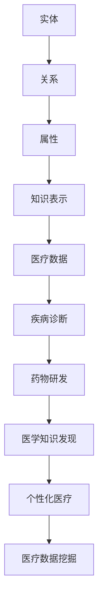
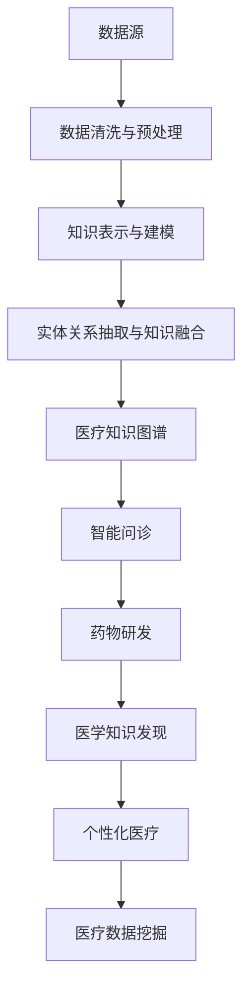
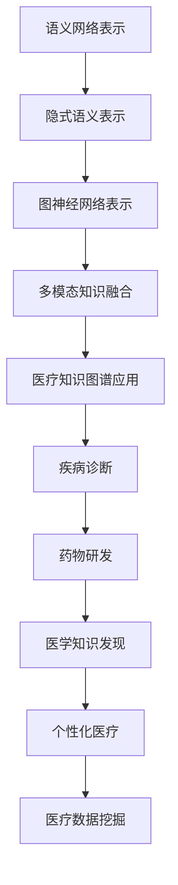
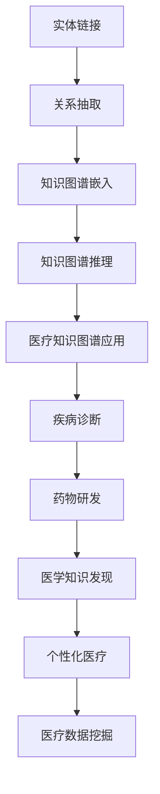
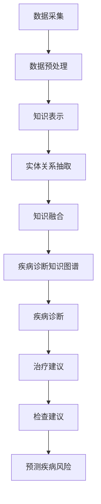
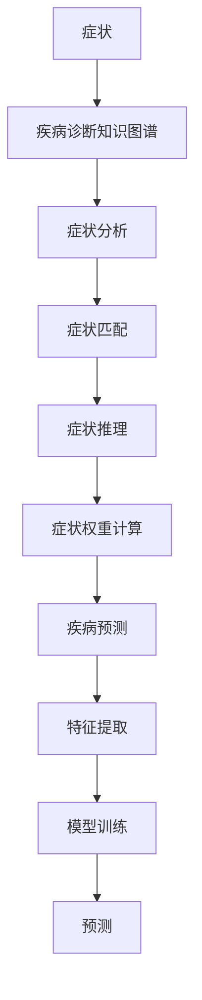
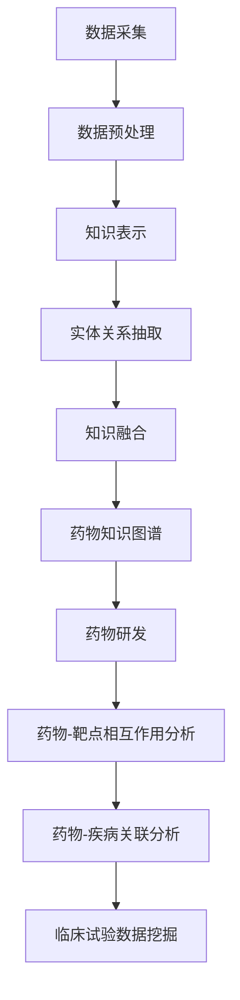
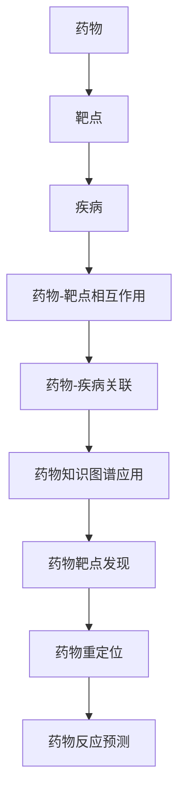
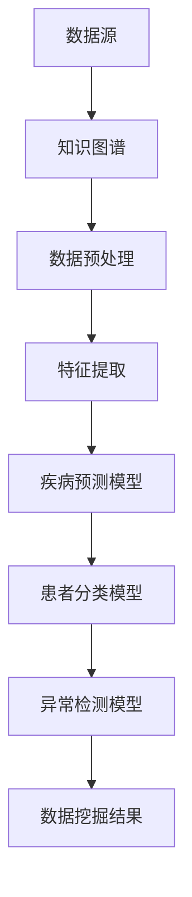
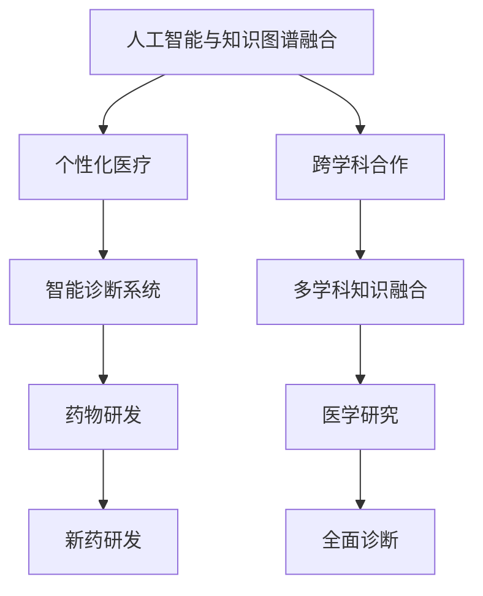

                 

# 知识图谱在医疗诊断中的应用

> **关键词**：知识图谱、医疗诊断、疾病预测、药物研发、数据挖掘、人工智能

> **摘要**：本文将详细介绍知识图谱在医疗诊断中的应用，包括知识图谱的定义、构建方法、核心算法以及具体应用场景。通过本文的阅读，读者将深入了解知识图谱在医疗领域的重要作用，以及如何利用知识图谱提升疾病诊断和药物研发的效率。

## 目录大纲

### 第一部分：基础知识与概念

1. 知识图谱概述
   1.1 知识图谱的定义与发展历程
   1.2 知识图谱的基本概念与术语
   1.3 知识图谱在现代医疗领域的应用价值

2. 医疗知识图谱构建
   2.1 数据来源与采集
   2.2 数据清洗与预处理
   2.3 知识表示与建模
   2.4 实体关系抽取与知识融合

### 第二部分：核心技术与算法

1. 医疗知识图谱表示方法
   1.1 语义网络表示
   1.2 隐式语义表示
   1.3 图神经网络表示
   1.4 多模态知识融合

2. 核心算法原理与实现
   2.1 实体链接算法
   2.2 关系抽取算法
   2.3 知识图谱嵌入算法
   2.4 知识图谱推理算法

### 第三部分：应用场景与案例分析

1. 疾病诊断知识图谱构建
   1.1 疾病诊断知识图谱的基本结构
   1.2 疾病诊断知识图谱的构建方法

2. 基于知识图谱的症状分析
   2.1 症状分析的基本概念
   2.2 基于知识图谱的症状分析算法
   2.3 症状分析案例

3. 基于知识图谱的疾病预测
   3.1 疾病预测的基本概念
   3.2 基于知识图谱的疾病预测算法
   3.3 疾病预测案例

4. 疾病诊断知识图谱的应用案例
   4.1 智能问诊系统
   4.2 疾病风险评估系统
   4.3 疾病诊断辅助系统

### 第四部分：未来趋势与展望

1. 人工智能与知识图谱的融合
   1.1 人工智能与知识图谱的融合概念
   1.2 人工智能与知识图谱融合的优势

2. 个性化医疗与知识图谱
   2.1 个性化医疗的基本概念
   2.2 知识图谱在个性化医疗中的应用

3. 跨学科合作与知识图谱
   3.1 跨学科合作的意义
   3.2 知识图谱在跨学科合作中的应用

4. 知识图谱在医疗诊断中的未来应用前景
   4.1 知识图谱在医疗诊断中的应用前景
   4.2 知识图谱在医疗领域的未来发展趋势

### 附录：相关资源与工具

1. 知识图谱构建工具与平台
2. 医疗领域知识图谱案例
3. 参考文献与推荐阅读

----------------------------------------------------------------
## 第1章：知识图谱概述

### 1.1 知识图谱的定义与发展历程

#### 1.1.1 知识图谱的定义

知识图谱（Knowledge Graph）是一种结构化的语义网络，用于表示实体、概念、关系和属性之间的复杂关系。它通过将各种数据源的信息进行整合、分类、关联和推理，形成一个统一的、可扩展的、语义丰富的知识库。

知识图谱的概念最早由Google在2012年提出，作为其搜索算法的核心组成部分。随后，知识图谱在学术界和工业界得到了广泛关注和深入研究。

#### 1.1.2 知识图谱的发展历程

1. **Web 1.0阶段**：早期互联网主要以HTML标记语言展示静态网页，信息呈现方式简单，用户只能被动地浏览信息。

2. **Web 2.0阶段**：互联网逐渐从信息的发布和获取转变为信息的共享和互动，用户生成内容成为主流，但信息的组织和管理仍然面临挑战。

3. **知识图谱阶段**：随着大数据和人工智能技术的发展，知识图谱应运而生，它通过将各种异构数据进行整合和关联，为用户提供更为智能、个性化的信息服务。

#### 1.1.3 知识图谱的核心组成部分

1. **实体（Entity）**：知识图谱中的基本元素，代表现实世界中的个体或概念，如人、地点、组织、疾病等。

2. **关系（Relationship）**：连接两个实体的语义联系，表示实体之间的相互关系，如“发病”、“治疗”、“诊断”等。

3. **属性（Property）**：实体的特征描述，如人的年龄、地点的纬度等。

4. **知识表示（Knowledge Representation）**：用于表示实体、关系和属性之间复杂关系的模型，如OWL、RDF等。

### 1.2 知识图谱的基本概念与术语

#### 1.2.1 实体（Entity）

实体是知识图谱中的基本元素，代表现实世界中的个体或概念。在医疗领域，实体可以是患者、医生、药物、疾病等。

#### 1.2.2 关系（Relationship）

关系是连接两个实体的语义联系，表示实体之间的相互关系。在医疗领域，关系可以是“诊断”、“治疗”、“发病”等。

#### 1.2.3 属性（Property）

属性是实体的特征描述，如人的年龄、地点的纬度等。属性可以用来丰富实体的信息，提高知识图谱的语义表达能力。

#### 1.2.4 知识表示（Knowledge Representation）

知识表示是用于表示实体、关系和属性之间复杂关系的模型。常见的知识表示模型有OWL、RDF等。

### 1.3 知识图谱在现代医疗领域的应用价值

知识图谱在医疗领域具有广泛的应用价值，主要体现在以下几个方面：

#### 1.3.1 疾病诊断与预测

知识图谱可以整合各类医疗数据，构建疾病诊断知识图谱，辅助医生进行疾病诊断和预测。

#### 1.3.2 药物研究与开发

知识图谱可以用于药物-疾病关联发现、药物重定位和药物反应预测，加速药物研发过程。

#### 1.3.3 医学知识发现

知识图谱可以挖掘出隐藏在医疗数据中的潜在知识，为医学研究提供新的思路和方法。

#### 1.3.4 个性化医疗与健康管理

知识图谱可以根据患者的个体特征，为其提供个性化的医疗服务和健康管理方案。

#### 1.3.5 医疗数据挖掘

知识图谱可以辅助医疗数据挖掘，提高数据挖掘的准确性和效率。

### 1.4 本章小结

本章介绍了知识图谱的定义、发展历程、基本概念与术语以及现代医疗领域的应用价值。知识图谱作为一种新兴的技术手段，正逐渐成为医疗领域的重要工具，为疾病诊断、药物研发、医学知识发现等提供了有力的支持。

---

**核心概念与联系**：

知识图谱由实体、关系和属性组成，实体代表现实世界中的个体或概念，关系表示实体之间的相互联系，属性则是实体的特征描述。知识图谱通过语义网络、RDF等模型进行知识表示，实现对医疗数据的整合、分类和推理。



---

接下来，我们将深入探讨知识图谱在医疗知识图谱构建方面的具体方法和应用。

### 1.5 知识图谱在医疗知识图谱构建中的应用

知识图谱在医疗领域的应用主要体现在医疗知识图谱的构建方面。医疗知识图谱是将医疗领域的各类数据（如临床数据、科研数据、文献数据等）整合为一个统一的语义网络，从而实现医疗信息的智能检索、推理和分析。

#### 1.5.1 数据来源与采集

医疗知识图谱的数据来源主要包括以下几种：

1. **公开的医疗数据集**：如LINC、MIMIC-III、PHI等，这些数据集涵盖了大量的患者信息、疾病信息和治疗方案等。

2. **结构化数据采集**：通过电子病历系统（EMR）、医疗信息系统（HIS）等获取结构化数据，如患者的基本信息、诊断结果、治疗方案等。

3. **非结构化数据采集**：通过爬取医学文献、临床报告、社交媒体等获取非结构化数据，如医学论文、临床指南、患者日志等。

#### 1.5.2 数据清洗与预处理

在构建医疗知识图谱之前，需要对采集到的医疗数据进行清洗和预处理，以提高数据的质量和一致性。数据清洗和预处理的主要任务包括：

1. **数据去重**：去除重复的数据记录，避免重复计算和存储。

2. **数据规范化**：对数据格式进行统一处理，如统一日期格式、统一命名规范等。

3. **数据质量检查**：检查数据的完整性、一致性、准确性和可靠性。

4. **数据转换**：将非结构化数据转换为结构化数据，如将文本数据转换为实体、关系和属性。

#### 1.5.3 知识表示与建模

知识表示与建模是构建医疗知识图谱的核心步骤，主要任务包括：

1. **实体识别**：从医疗数据中识别出实体，如患者、疾病、药物等。

2. **关系抽取**：从医疗数据中抽取实体之间的关系，如诊断、治疗、发病等。

3. **属性抽取**：从医疗数据中抽取实体的属性，如患者的年龄、性别、诊断日期等。

4. **知识表示模型**：选择合适的知识表示模型，如OWL、RDF等，对医疗知识进行建模。

#### 1.5.4 实体关系抽取与知识融合

实体关系抽取与知识融合是构建医疗知识图谱的关键技术，主要任务包括：

1. **实体识别**：利用自然语言处理（NLP）技术，从文本数据中识别出实体。

2. **关系抽取**：利用图论、机器学习等技术，从医疗数据中抽取实体之间的关系。

3. **知识融合**：将来自不同数据源的知识进行融合，形成统一的知识图谱。

4. **知识更新**：定期更新知识图谱，保持知识的时效性和准确性。

#### 1.5.5 医疗知识图谱的应用

构建医疗知识图谱后，可以应用于以下场景：

1. **智能问诊**：基于知识图谱的智能问诊系统，可以帮助医生快速诊断疾病，提供诊断建议。

2. **药物研发**：基于知识图谱的药物研发平台，可以加速药物研发过程，提高药物研发成功率。

3. **医学知识发现**：基于知识图谱的医学知识发现系统，可以挖掘出隐藏在数据中的潜在知识，为医学研究提供新思路。

4. **个性化医疗**：基于知识图谱的个性化医疗系统，可以为患者提供个性化的治疗方案和健康管理方案。

#### 1.5.6 本章小结

本章介绍了知识图谱在医疗知识图谱构建中的应用，包括数据来源与采集、数据清洗与预处理、知识表示与建模、实体关系抽取与知识融合以及应用场景。通过构建医疗知识图谱，可以实现对医疗数据的深度挖掘和智能分析，为医疗领域的创新和发展提供有力支持。

---

**核心概念与联系**：

医疗知识图谱由实体、关系和属性组成，实体代表现实世界中的个体或概念，关系表示实体之间的相互联系，属性则是实体的特征描述。在构建医疗知识图谱的过程中，需要通过数据清洗与预处理、知识表示与建模、实体关系抽取与知识融合等步骤，将医疗数据转换为结构化的知识图谱。



---

在接下来的章节中，我们将进一步探讨知识图谱在医疗诊断、药物研发、数据挖掘等领域的具体应用。

### 第2章：医疗知识图谱构建

#### 2.1 数据来源与采集

构建医疗知识图谱的第一步是获取所需的数据。医疗数据来源广泛，主要包括以下几种：

1. **公开的医疗数据集**：如LINC、MIMIC-III、PHI等。这些数据集通常包含大量结构化和非结构化数据，如电子病历、临床记录、医疗报告等。

2. **结构化数据采集**：通过医院信息系统（HIS）、电子病历系统（EMR）等获取结构化数据。这些数据通常包括患者的基本信息、诊断结果、治疗方案等。

3. **非结构化数据采集**：通过爬取医学文献、临床报告、社交媒体等获取非结构化数据。这些数据通常包括医学论文、临床指南、患者日志等。

在数据采集过程中，需要关注数据的完整性和一致性，确保数据的真实性和可靠性。同时，需要遵循数据保护法规，保护患者隐私。

#### 2.2 数据清洗与预处理

采集到的医疗数据通常存在噪声、缺失值、不一致性等问题，需要进行数据清洗和预处理。数据清洗和预处理的主要任务包括：

1. **数据去重**：去除重复的数据记录，避免重复计算和存储。

2. **数据规范化**：统一数据格式和命名规范，如将日期格式统一为YYYY-MM-DD。

3. **缺失值处理**：对于缺失值，可以选择填充策略（如均值填充、中值填充等）或删除策略。

4. **数据质量检查**：检查数据的完整性、一致性、准确性和可靠性。

5. **数据转换**：将非结构化数据转换为结构化数据，如将文本数据转换为实体、关系和属性。

#### 2.3 知识表示与建模

知识表示与建模是构建医疗知识图谱的核心步骤，主要任务包括：

1. **实体识别**：从医疗数据中识别出实体，如患者、疾病、药物等。

2. **关系抽取**：从医疗数据中抽取实体之间的关系，如诊断、治疗、发病等。

3. **属性抽取**：从医疗数据中抽取实体的属性，如患者的年龄、性别、诊断日期等。

4. **知识表示模型**：选择合适的知识表示模型，如OWL、RDF等，对医疗知识进行建模。

知识表示模型可以看作是医疗知识的“语言”，它定义了实体、关系和属性的表示方法。常见的知识表示模型包括：

1. **OWL（Web Ontology Language）**：一种基于XML的语义网语言，用于定义实体、关系和属性。

2. **RDF（Resource Description Framework）**：一种用于描述资源及其之间关系的框架。

3. **图数据库**：如Neo4j、Apache TinkerPop等，它们支持图形数据模型，可以高效地存储和查询图结构数据。

#### 2.4 实体关系抽取与知识融合

实体关系抽取与知识融合是构建医疗知识图谱的关键技术，主要任务包括：

1. **实体识别**：利用自然语言处理（NLP）技术，从文本数据中识别出实体。

2. **关系抽取**：利用图论、机器学习等技术，从医疗数据中抽取实体之间的关系。

3. **知识融合**：将来自不同数据源的知识进行融合，形成统一的知识图谱。

4. **知识更新**：定期更新知识图谱，保持知识的时效性和准确性。

知识融合通常涉及到以下几种策略：

1. **合并策略**：将多个数据源中的相同实体进行合并，形成统一的实体。

2. **映射策略**：将不同数据源中的实体进行映射，形成统一的实体。

3. **加权策略**：根据数据源的可靠性、权威性等，对知识进行加权处理。

4. **冲突解决**：在知识融合过程中，解决不同数据源之间的冲突，如实体标识符冲突、属性值冲突等。

#### 2.5 医疗知识图谱的应用

构建医疗知识图谱后，可以应用于以下场景：

1. **智能问诊**：基于知识图谱的智能问诊系统，可以帮助医生快速诊断疾病，提供诊断建议。

2. **药物研发**：基于知识图谱的药物研发平台，可以加速药物研发过程，提高药物研发成功率。

3. **医学知识发现**：基于知识图谱的医学知识发现系统，可以挖掘出隐藏在数据中的潜在知识，为医学研究提供新思路。

4. **个性化医疗**：基于知识图谱的个性化医疗系统，可以为患者提供个性化的治疗方案和健康管理方案。

5. **医疗数据挖掘**：基于知识图谱的医疗数据挖掘系统，可以挖掘出有价值的数据模式，为医疗决策提供支持。

#### 2.6 本章小结

本章介绍了医疗知识图谱构建的步骤和方法，包括数据来源与采集、数据清洗与预处理、知识表示与建模、实体关系抽取与知识融合以及应用。通过构建医疗知识图谱，可以实现对医疗数据的深度挖掘和智能分析，为医疗领域的创新和发展提供有力支持。

---

**核心概念与联系**：

医疗知识图谱的构建包括数据来源与采集、数据清洗与预处理、知识表示与建模、实体关系抽取与知识融合等步骤。数据来源包括公开医疗数据集、结构化数据采集和非结构化数据采集。数据清洗与预处理包括数据去重、规范化、缺失值处理和质量检查。知识表示与建模包括实体识别、关系抽取、属性抽取和选择合适的知识表示模型。实体关系抽取与知识融合包括利用自然语言处理和图论等技术，从医疗数据中抽取实体关系，并进行知识融合和更新。


---

在接下来的章节中，我们将进一步探讨医疗知识图谱在疾病诊断、药物研发、数据挖掘等领域的具体应用。

### 第3章：医疗知识图谱表示方法

#### 3.1 语义网络表示

语义网络是一种基于有向图的语义表示方法，它通过节点和边来表示实体和关系。在医疗知识图谱中，节点表示实体（如疾病、药物、医生等），边表示实体之间的关系（如“治疗”、“诊断”等）。

**语义网络的基本概念**：

1. **节点（Node）**：表示实体，如疾病A、药物B等。
2. **边（Edge）**：表示实体之间的关系，如A“治疗”B。
3. **属性（Attribute）**：描述实体的特征，如疾病的症状、药物的效果等。

**语义网络表示方法**：

1. **基于本体（Ontology）的表示**：通过定义本体来描述实体和关系，如疾病本体、药物本体等。
2. **基于RDF（Resource Description Framework）的表示**：使用RDF图来表示实体和关系，其中资源（Resource）表示实体，属性（Property）表示关系。

**语义网络在医疗知识图谱中的应用**：

1. **疾病诊断**：通过语义网络表示疾病之间的关系，如A疾病可能导致B疾病。
2. **药物关联**：通过语义网络表示药物与疾病之间的关联，如药物A可以治疗疾病B。
3. **医学知识发现**：通过语义网络挖掘出隐藏在数据中的潜在知识，如疾病之间的关联、药物的新用途等。

#### 3.2 隐式语义表示

隐式语义表示是一种通过学习语义信息来表示实体和关系的方法，它不依赖于显式定义的实体和关系。在医疗知识图谱中，隐式语义表示可以基于文本、图像等多模态数据。

**隐式语义表示的基本原理**：

1. **文本嵌入（Text Embedding）**：将文本转换为向量表示，如使用Word2Vec、BERT等模型。
2. **关系嵌入（Relation Embedding）**：将实体之间的关系转换为向量表示，如使用TransE、ComplEx等模型。
3. **属性嵌入（Property Embedding）**：将实体的属性转换为向量表示，如使用属性向量表示法。

**隐式语义表示方法**：

1. **TransE**：通过最小化损失函数来学习实体和关系之间的向量表示。
2. **ComplEx**：结合文本嵌入和关系嵌入，通过最小化损失函数来学习实体和关系之间的复杂向量表示。

**隐式语义表示在医疗知识图谱中的应用**：

1. **疾病相似性分析**：通过计算疾病之间的相似度，帮助医生进行疾病诊断和分类。
2. **药物相似性分析**：通过计算药物之间的相似度，帮助医生进行药物选择和组合。
3. **医学知识发现**：通过隐式语义表示，挖掘出隐藏在数据中的潜在知识，如疾病之间的关联、药物的新用途等。

#### 3.3 图神经网络表示

图神经网络（Graph Neural Network，GNN）是一种专门用于处理图结构数据的神经网络。在医疗知识图谱中，图神经网络可以用于实体和关系的表示、预测和分类。

**图神经网络的基本概念**：

1. **节点表示（Node Embedding）**：将图中的每个节点表示为一个向量。
2. **边表示（Edge Embedding）**：将图中的每条边表示为一个向量。
3. **图卷积（Graph Convolution）**：通过聚合节点邻域信息来更新节点表示。

**图神经网络表示方法**：

1. **GCN（Graph Convolutional Network）**：通过图卷积层来更新节点表示。
2. **GAT（Graph Attention Network）**：通过注意力机制来聚合节点邻域信息。
3. **GraphSAGE（Graph Sample and Aggregation）**：通过采样节点邻域信息来更新节点表示。

**图神经网络在医疗知识图谱中的应用**：

1. **实体分类**：通过图神经网络学习节点表示，然后使用这些表示进行实体分类。
2. **关系分类**：通过图神经网络学习节点和边表示，然后使用这些表示进行关系分类。
3. **图嵌入**：通过图神经网络将医疗知识图谱中的节点和边嵌入到低维空间，以便进行进一步的分析和挖掘。

#### 3.4 多模态知识融合

多模态知识融合是指将来自不同数据源的信息（如文本、图像、时间序列等）进行整合，形成一个统一的语义表示。在医疗知识图谱中，多模态知识融合可以增强知识表示的丰富性和准确性。

**多模态知识融合的基本概念**：

1. **多模态数据源**：包括文本、图像、时间序列等多种数据类型。
2. **多模态特征提取**：从不同数据源中提取特征，如文本的词向量、图像的卷积特征等。
3. **多模态融合方法**：将多模态特征进行融合，形成统一的语义表示。

**多模态知识融合方法**：

1. **基于特征融合的方法**：将不同模态的特征直接融合，如使用平均池化、拼接等操作。
2. **基于模型融合的方法**：使用多个模型分别处理不同模态的数据，然后融合模型输出。
3. **基于深度学习的融合方法**：使用深度学习模型（如卷积神经网络、循环神经网络等）来处理多模态数据。

**多模态知识融合在医疗知识图谱中的应用**：

1. **疾病诊断**：结合临床文本数据、医学图像数据等，提高疾病诊断的准确性。
2. **药物研发**：结合药物文本数据、药物结构图像数据等，加速药物研发过程。
3. **医学知识发现**：结合不同类型的数据，挖掘出更多有价值的医学知识。

#### 3.5 本章小结

本章介绍了医疗知识图谱的四种表示方法：语义网络表示、隐式语义表示、图神经网络表示和多模态知识融合。这些方法在不同的应用场景中具有各自的优势，可以结合使用，以提升医疗知识图谱的表现力和实用性。通过合理选择和组合这些表示方法，可以更好地支持医疗知识图谱在疾病诊断、药物研发、医学知识发现等领域的应用。

---

**核心概念与联系**：

医疗知识图谱的表示方法包括语义网络表示、隐式语义表示、图神经网络表示和多模态知识融合。语义网络表示通过节点和边来表示实体和关系，隐式语义表示通过学习语义信息来表示实体和关系，图神经网络表示通过图卷积层来更新节点表示，多模态知识融合通过整合不同数据源的信息来形成统一的语义表示。



---

在接下来的章节中，我们将进一步探讨医疗知识图谱在疾病诊断、药物研发、数据挖掘等领域的具体应用。

### 第4章：核心算法原理与实现

#### 4.1 实体链接算法

实体链接（Entity Linking）是知识图谱构建中的一个关键步骤，它旨在将文本中的实体与知识图谱中的实体进行匹配。实体链接算法在医疗知识图谱中具有重要作用，因为它能够帮助将临床报告、患者日志等文本数据中的实体映射到知识图谱中的实体。

**实体链接的基本概念**：

- **实体**：文本中的一个特定对象，如“疾病”、“药物”或“医生”。
- **链接**：将文本中的实体与知识图谱中的实体进行匹配的过程。

**实体链接算法原理**：

1. **基于规则的算法**：利用预定义的规则进行实体链接，如基于命名实体识别（NER）技术。
2. **基于机器学习的算法**：使用监督学习模型（如分类器、回归模型等）进行实体链接。

**实体链接算法实现**：

- 数据预处理：对文本进行分词、词性标注等处理。
- 特征提取：提取文本特征，如词向量、命名实体特征等。
- 模型训练：使用训练数据训练实体链接模型。
- 预测与评估：对文本进行实体链接预测，并评估预测结果的准确性和召回率。

**示例伪代码**：

```python
# 数据预处理
text = "患者患有高血压，医生建议服用硝苯地平"
tokens = tokenize(text)
ner_tags = perform NamedEntityRecognition(tokens)

# 特征提取
entity_features = extract_entity_features(tokens, ner_tags)

# 模型训练
model = train_entity_linking_model(train_data)

# 预测与评估
predictions = model.predict(entity_features)
evaluate_entity_linking(predictions)
```

#### 4.2 关系抽取算法

关系抽取（Relation Extraction）是知识图谱构建的另一个关键步骤，它旨在从文本数据中识别出实体之间的关系。关系抽取在医疗知识图谱中用于建立实体之间的联系，如“疾病A导致疾病B”或“药物A治疗疾病B”。

**关系抽取的基本概念**：

- **关系**：实体之间的语义联系，如“诊断”、“治疗”等。
- **抽取**：从文本数据中识别出实体之间的关系。

**关系抽取算法原理**：

1. **基于规则的算法**：利用预定义的规则进行关系抽取，如基于模式匹配。
2. **基于统计的算法**：使用统计模型（如条件随机场CRF）进行关系抽取。
3. **基于深度学习的算法**：使用神经网络模型（如BERT、Transformer）进行关系抽取。

**关系抽取算法实现**：

- 数据预处理：对文本进行分词、词性标注等处理。
- 特征提取：提取文本特征，如词向量、实体特征等。
- 模型训练：使用训练数据训练关系抽取模型。
- 预测与评估：对文本进行关系抽取预测，并评估预测结果的准确性和召回率。

**示例伪代码**：

```python
# 数据预处理
text = "患者患有高血压，医生建议服用硝苯地平"
tokens = tokenize(text)
entity_tags = perform NamedEntityRecognition(tokens)

# 特征提取
relation_features = extract_relation_features(tokens, entity_tags)

# 模型训练
model = train_relation_extraction_model(train_data)

# 预测与评估
predictions = model.predict(relation_features)
evaluate_relation_extraction(predictions)
```

#### 4.3 知识图谱嵌入算法

知识图谱嵌入（Knowledge Graph Embedding）是一种将知识图谱中的实体和关系表示为向量空间中的低维向量表示的方法。知识图谱嵌入有助于在向量空间中进行高效检索和推理。

**知识图谱嵌入的基本概念**：

- **实体嵌入**：将实体表示为向量。
- **关系嵌入**：将关系表示为向量。
- **嵌入空间**：用于存储实体和关系向量的空间。

**知识图谱嵌入算法原理**：

1. **基于矩阵分解的方法**：如TransE、TransH等。
2. **基于深度学习的算法**：如GraphSAGE、GAT等。
3. **基于图神经网络的方法**：如Node2Vec、Graph Convolutional Network（GCN）等。

**知识图谱嵌入算法实现**：

- 数据预处理：对知识图谱进行节点和边的表示。
- 模型训练：使用训练数据训练知识图谱嵌入模型。
- 向量表示：将实体和关系表示为低维向量。

**示例伪代码**：

```python
# 数据预处理
graph = preprocess_knowledge_graph()

# 模型训练
model = train_knowledge_graph_embedding_model()

# 向量表示
entity_embeddings = model.entity_embeddings
relation_embeddings = model.relation_embeddings
```

#### 4.4 知识图谱推理算法

知识图谱推理（Knowledge Graph Reasoning）是一种基于知识图谱中的实体和关系进行推理的方法。推理算法可用于预测实体之间的关系或发现新的知识。

**知识图谱推理的基本概念**：

- **推理**：基于知识图谱中的信息进行逻辑推理。
- **规则**：用于指导推理过程的逻辑表达式。

**知识图谱推理算法原理**：

1. **基于规则推理**：如正则逻辑推理、链式推理等。
2. **基于图论推理**：如最短路径算法、匹配算法等。
3. **基于深度学习的推理**：如Graph Convolutional Network（GCN）等。

**知识图谱推理算法实现**：

- 数据预处理：对知识图谱进行表示。
- 模型训练：使用训练数据训练推理模型。
- 推理过程：基于知识图谱中的实体和关系进行推理。

**示例伪代码**：

```python
# 数据预处理
knowledge_graph = preprocess_knowledge_graph()

# 模型训练
model = train_knowledge_graph_reasoning_model()

# 推理过程
query_result = model.reasoning(knowledge_graph, query)
```

#### 4.5 本章小结

本章介绍了医疗知识图谱构建中的核心算法，包括实体链接算法、关系抽取算法、知识图谱嵌入算法和知识图谱推理算法。这些算法在医疗知识图谱构建中起着关键作用，通过合理选择和组合这些算法，可以实现对医疗数据的深度挖掘和智能分析，为疾病诊断、药物研发、医学知识发现等提供有力支持。

---

**核心概念与联系**：

医疗知识图谱的核心算法包括实体链接算法、关系抽取算法、知识图谱嵌入算法和知识图谱推理算法。实体链接算法用于将文本中的实体与知识图谱中的实体进行匹配，关系抽取算法用于从文本数据中识别出实体之间的关系，知识图谱嵌入算法用于将实体和关系表示为向量空间中的低维向量，知识图谱推理算法用于基于知识图谱中的实体和关系进行推理。



---

在接下来的章节中，我们将进一步探讨知识图谱在疾病诊断和药物研发中的具体应用。

### 第5章：知识图谱在疾病诊断中的应用

#### 5.1 疾病诊断知识图谱构建

疾病诊断知识图谱是知识图谱在医疗诊断领域的一种重要应用形式。它通过整合临床数据、医学知识库、文献数据等多种数据源，构建出一个包含疾病、症状、治疗方法等实体和关系的知识库，为疾病诊断提供支持。

**疾病诊断知识图谱的基本结构**：

1. **实体**：包括疾病、症状、治疗方法、实验室检查、影像学检查等。
2. **关系**：包括“诊断”、“治疗”、“检查”、“症状”等。
3. **属性**：包括疾病的严重程度、治疗的持续时间、检查结果的正常范围等。

**疾病诊断知识图谱的构建方法**：

1. **数据采集**：收集临床数据、医学知识库、文献数据等。
2. **数据预处理**：进行数据去重、规范化、缺失值处理等。
3. **知识表示**：选择合适的知识表示模型，如OWL、RDF等。
4. **实体关系抽取**：利用自然语言处理和机器学习技术，从文本数据中识别实体和关系。
5. **知识融合**：将不同数据源的知识进行融合，形成一个统一的疾病诊断知识图谱。

**示例 Mermaid 流程图**：



#### 5.2 基于知识图谱的症状分析

症状分析是疾病诊断中的一个关键步骤，它通过分析患者的症状，帮助医生确定可能的疾病诊断。基于知识图谱的症状分析利用疾病诊断知识图谱中的实体和关系，为症状分析提供支持。

**症状分析的基本概念**：

- **症状**：患者表现出来的主观感觉或主观感受。
- **症状分析**：通过分析症状，识别出可能的疾病。

**基于知识图谱的症状分析算法**：

1. **症状匹配**：将患者的症状与知识图谱中的症状进行匹配，找到相似的疾病。
2. **症状推理**：基于知识图谱中的关系，对症状进行推理，确定可能的疾病。
3. **症状权重计算**：计算症状的重要性，为症状分析提供参考。

**示例伪代码**：

```python
# 症状匹配
matched_diseases = symptom_matching(patient_symptoms, knowledge_graph)

# 症状推理
possible_diseases = symptom_reasoning(matched_diseases, knowledge_graph)

# 症状权重计算
symptom_weights = compute_symptom_weights(patient_symptoms, knowledge_graph)
```

#### 5.3 基于知识图谱的疾病预测

基于知识图谱的疾病预测是一种利用疾病诊断知识图谱进行疾病预测的方法。它通过分析患者的症状、病史、家族病史等信息，预测患者可能患有的疾病。

**疾病预测的基本概念**：

- **疾病预测**：基于患者的症状、病史等信息，预测患者可能患有的疾病。
- **预测模型**：用于疾病预测的机器学习模型。

**基于知识图谱的疾病预测算法**：

1. **特征提取**：从患者的症状、病史、家族病史等信息中提取特征。
2. **模型训练**：使用训练数据训练疾病预测模型。
3. **预测**：使用疾病预测模型对新的病例进行预测。

**示例伪代码**：

```python
# 特征提取
patient_features = extract_features(patient_data)

# 模型训练
model = train_disease_prediction_model()

# 预测
predicted_diseases = model.predict(patient_features)
```

#### 5.4 疾病诊断知识图谱的应用案例

**案例一：智能问诊系统**

智能问诊系统是一种基于知识图谱的疾病诊断工具，它通过患者的症状信息，结合疾病诊断知识图谱，为医生提供诊断建议。该系统可以快速、准确地分析患者的症状，提供可能的疾病诊断，提高医生的工作效率。

**案例二：疾病风险评估系统**

疾病风险评估系统利用疾病诊断知识图谱，分析患者的症状、病史、家族病史等信息，预测患者患某种疾病的风险。该系统可以为医生提供风险评估报告，帮助医生制定个性化的预防措施和治疗方案。

**案例三：疾病诊断辅助系统**

疾病诊断辅助系统是一种基于知识图谱的智能诊断工具，它通过分析患者的症状、检查结果等信息，结合疾病诊断知识图谱，为医生提供诊断建议。该系统可以帮助医生快速、准确地诊断疾病，提高诊断的准确性。

#### 5.5 本章小结

本章介绍了疾病诊断知识图谱的构建方法、基于知识图谱的症状分析和疾病预测，以及疾病诊断知识图谱的应用案例。通过构建疾病诊断知识图谱，可以实现对疾病的智能诊断和预测，为医生提供有力支持，提高疾病诊断的准确性和效率。

---

**核心概念与联系**：

疾病诊断知识图谱由实体、关系和属性组成，实体包括疾病、症状、治疗方法等，关系包括诊断、治疗、症状等，属性包括疾病的严重程度、治疗的时间等。基于知识图谱的症状分析通过匹配患者的症状与知识图谱中的症状，进行推理和计算症状权重，预测可能的疾病。疾病预测通过特征提取和模型训练，使用疾病预测模型对新的病例进行预测。



---

在接下来的章节中，我们将进一步探讨知识图谱在药物研发中的应用。

### 第6章：知识图谱在药物研发中的应用

#### 6.1 药物知识图谱构建

药物知识图谱是知识图谱在药物研发领域的一种重要应用形式。它通过整合药物化学信息、药物临床试验数据、药物疗效等数据源，构建出一个包含药物、靶点、疾病等实体和关系的知识库，为药物研发提供支持。

**药物知识图谱的基本结构**：

1. **实体**：包括药物、靶点、疾病、临床试验、不良反应等。
2. **关系**：包括“药物-靶点相互作用”、“药物-疾病关联”、“临床试验结果”等。
3. **属性**：包括药物的化学结构、靶点的功能、疾病的严重程度等。

**药物知识图谱的构建方法**：

1. **数据采集**：收集药物化学信息、药物临床试验数据、药物疗效等数据。
2. **数据预处理**：进行数据去重、规范化、缺失值处理等。
3. **知识表示**：选择合适的知识表示模型，如OWL、RDF等。
4. **实体关系抽取**：利用自然语言处理和机器学习技术，从文本数据中识别实体和关系。
5. **知识融合**：将不同数据源的知识进行融合，形成一个统一的药物知识图谱。

**示例 Mermaid 流程图**：



#### 6.2 药物-疾病关联发现

药物-疾病关联发现是一种利用药物知识图谱识别药物和疾病之间潜在关联的方法。它可以帮助研究人员发现新的药物用途，加速药物研发过程。

**药物-疾病关联发现的基本概念**：

- **药物-疾病关联**：药物与疾病之间的潜在关系。
- **发现方法**：利用知识图谱进行药物-疾病关联发现。

**药物-疾病关联发现算法**：

1. **图遍历算法**：通过遍历知识图谱中的药物和疾病节点，识别潜在的关联。
2. **关联规则挖掘**：利用关联规则挖掘算法（如Apriori算法），从知识图谱中挖掘出药物和疾病之间的关联规则。
3. **基于深度学习的算法**：使用深度学习模型（如BERT、Transformer等），从知识图谱中提取药物和疾病之间的关联。

**示例伪代码**：

```python
# 图遍历算法
potential_associations = traverse_graph(knowledge_graph, drugs, diseases)

# 关联规则挖掘
drug_disease_rules = mine_association_rules(knowledge_graph)

# 基于深度学习的算法
drug_disease_associations = train_association_model(knowledge_graph)
```

#### 6.3 药物重定位与药物反应预测

药物重定位与药物反应预测是知识图谱在药物研发中的另一重要应用。药物重定位是指将已有药物重新应用于新的疾病治疗，而药物反应预测是指预测药物对特定患者的可能反应。

**药物重定位的基本概念**：

- **药物重定位**：将已有药物应用于新的疾病治疗。
- **重定位方法**：利用知识图谱进行药物重定位。

**药物反应预测的基本概念**：

- **药物反应预测**：预测药物对特定患者的可能反应。
- **预测方法**：利用知识图谱和机器学习模型进行药物反应预测。

**药物重定位与药物反应预测算法**：

1. **知识图谱融合**：将药物化学信息、临床试验数据、患者基因组信息等融合到知识图谱中。
2. **药物重定位算法**：利用图遍历、关联规则挖掘等方法进行药物重定位。
3. **药物反应预测算法**：使用机器学习模型（如随机森林、神经网络等）进行药物反应预测。

**示例伪代码**：

```python
# 知识图谱融合
knowledge_graph = fuse_data(chemical_info, clinical_trials, patient_genomics)

# 药物重定位
drug_repositioning_results = reposition_drugs(knowledge_graph)

# 药物反应预测
reaction_predictions = predict_reactions(knowledge_graph)
```

#### 6.4 药物研发知识图谱的应用案例

**案例一：药物靶点发现系统**

药物靶点发现系统是一种基于知识图谱的药物研发工具，它通过分析药物与靶点之间的潜在关系，帮助研究人员发现新的药物靶点。该系统可以加速药物研发过程，提高药物研发的成功率。

**案例二：药物重定位平台**

药物重定位平台是一种基于知识图谱的药物研发平台，它通过分析已有药物的潜在用途，帮助研究人员发现新的药物用途。该平台可以降低新药研发成本，提高药物研发效率。

**案例三：药物反应预测平台**

药物反应预测平台是一种基于知识图谱的药物研发工具，它通过分析药物与患者的基因组信息之间的潜在关系，预测药物对特定患者的可能反应。该平台可以帮助医生为患者提供个性化的药物治疗方案，提高治疗效果。

#### 6.5 本章小结

本章介绍了药物知识图谱的构建方法、药物-疾病关联发现、药物重定位与药物反应预测，以及药物研发知识图谱的应用案例。通过构建药物知识图谱，可以实现对药物与疾病之间的关联分析、药物重定位和药物反应预测，为药物研发提供有力支持，加速新药研发过程。

---

**核心概念与联系**：

药物知识图谱由实体、关系和属性组成，实体包括药物、靶点、疾病等，关系包括药物-靶点相互作用、药物-疾病关联等，属性包括药物的化学结构、靶点的功能等。药物-疾病关联发现通过图遍历、关联规则挖掘等方法进行，药物重定位与药物反应预测通过知识图谱融合和机器学习模型实现。



---

在接下来的章节中，我们将进一步探讨知识图谱在医疗数据挖掘中的应用。

### 第7章：知识图谱在医疗数据挖掘中的应用

#### 7.1 医疗数据挖掘概述

医疗数据挖掘是指利用数据挖掘技术对医疗数据进行处理和分析，以发现隐藏在数据中的有价值信息。知识图谱作为一种结构化的语义网络，可以在医疗数据挖掘中发挥重要作用，帮助提高数据挖掘的准确性和效率。

**医疗数据挖掘的基本概念**：

- **医疗数据挖掘**：利用数据挖掘技术对医疗数据进行处理和分析。
- **数据挖掘任务**：包括疾病预测、患者分类、药物疗效分析等。
- **数据挖掘挑战**：如数据缺失、数据质量差、特征选择困难等。

**医疗数据挖掘的任务与挑战**：

1. **疾病预测**：基于患者的临床表现、实验室检查结果等数据，预测患者可能患有的疾病。
2. **患者分类**：根据患者的特征，将其划分为不同的类别，如高风险患者、低风险患者等。
3. **药物疗效分析**：分析药物的疗效和副作用，为医生提供治疗建议。
4. **挑战**：数据缺失、数据质量差、特征选择困难、数据隐私保护等。

#### 7.2 知识图谱辅助下的医疗数据挖掘方法

知识图谱在医疗数据挖掘中可以发挥多种作用，如数据预处理、特征提取、模型训练等。以下介绍几种常见的知识图谱辅助下的医疗数据挖掘方法。

**1. 疾病预测**

知识图谱可以辅助疾病预测，通过将医疗数据与知识图谱中的疾病实体进行关联，提取相关的特征进行预测。

**方法**：

- **实体关联**：将患者的临床表现与知识图谱中的疾病实体进行关联，提取相关的特征。
- **特征提取**：利用知识图谱中的实体和关系，提取与疾病预测相关的特征。
- **模型训练**：使用提取到的特征训练疾病预测模型。

**示例伪代码**：

```python
# 实体关联
disease_entities = associate_diseases(patient_data, knowledge_graph)

# 特征提取
disease_features = extract_disease_features(disease_entities)

# 模型训练
disease_prediction_model = train_disease_prediction_model(disease_features)
```

**2. 患者分类**

知识图谱可以辅助患者分类，通过分析患者的特征，将其划分为不同的类别。

**方法**：

- **特征提取**：利用知识图谱中的实体和关系，提取与患者分类相关的特征。
- **模型训练**：使用提取到的特征训练患者分类模型。
- **分类**：使用训练好的模型对新的病例进行分类。

**示例伪代码**：

```python
# 特征提取
patient_features = extract_patient_features(patient_data, knowledge_graph)

# 模型训练
patient_classification_model = train_patient_classification_model(patient_features)

# 分类
patient_category = patient_classification_model.predict(patient_features)
```

**3. 医疗数据异常检测**

知识图谱可以辅助医疗数据异常检测，通过分析数据中的异常模式，发现潜在的医疗错误或异常情况。

**方法**：

- **特征提取**：利用知识图谱中的实体和关系，提取与异常检测相关的特征。
- **模型训练**：使用提取到的特征训练异常检测模型。
- **异常检测**：使用训练好的模型检测数据中的异常模式。

**示例伪代码**：

```python
# 特征提取
anomaly_features = extract_anomaly_features(patient_data, knowledge_graph)

# 模型训练
anomaly_detection_model = train_anomaly_detection_model(anomaly_features)

# 异常检测
anomalies = anomaly_detection_model.detect(anomalies_features)
```

#### 7.3 基于知识图谱的医疗数据挖掘应用案例

**案例一：智能医疗数据分析平台**

智能医疗数据分析平台是一种基于知识图谱的医疗数据挖掘工具，它通过对医疗数据进行处理和分析，为医生提供辅助诊断和治疗建议。该平台可以处理海量的医疗数据，快速发现潜在的医疗问题，提高医疗服务的质量和效率。

**案例二：慢性病管理与分析系统**

慢性病管理与分析系统是一种基于知识图谱的医疗数据挖掘系统，它通过对慢性病患者的历史数据进行分析，为其制定个性化的治疗方案和健康管理方案。该系统可以根据患者的特征和病情变化，动态调整治疗方案，提高治疗效果。

**案例三：精准医疗推荐系统**

精准医疗推荐系统是一种基于知识图谱的医疗数据挖掘系统，它通过对患者的基因信息、生活习惯、病史等数据进行挖掘，为患者推荐个性化的治疗方案和药物。该系统可以根据患者的特点，为医生提供有针对性的治疗建议，提高医疗服务的精准度。

#### 7.4 医疗数据挖掘面临的挑战与未来趋势

**挑战**：

1. **数据隐私保护**：医疗数据通常包含患者的敏感信息，如何保护数据隐私是医疗数据挖掘面临的重要挑战。
2. **数据质量**：医疗数据质量差、缺失值较多，如何提高数据质量是医疗数据挖掘的重要问题。
3. **特征选择**：医疗数据维度高，特征选择困难，如何选择有效的特征是医疗数据挖掘的关键。

**未来趋势**：

1. **知识图谱与深度学习的融合**：知识图谱与深度学习相结合，可以更好地挖掘医疗数据中的潜在知识。
2. **跨学科合作**：医疗数据挖掘需要多学科合作，包括医学、计算机科学、统计学等，跨学科合作将推动医疗数据挖掘的发展。
3. **个性化医疗**：基于知识图谱的医疗数据挖掘可以为个性化医疗提供支持，为患者提供个性化的治疗方案和健康管理方案。

#### 7.5 本章小结

本章介绍了知识图谱在医疗数据挖掘中的应用，包括疾病预测、患者分类、异常检测等。知识图谱作为一种结构化的语义网络，可以辅助医疗数据挖掘，提高数据挖掘的准确性和效率。同时，本章还介绍了基于知识图谱的医疗数据挖掘应用案例，以及医疗数据挖掘面临的挑战和未来趋势。

---

**核心概念与联系**：

知识图谱在医疗数据挖掘中的应用包括疾病预测、患者分类、异常检测等。知识图谱通过实体、关系和属性的表示，辅助数据预处理、特征提取和模型训练。疾病预测通过实体关联和特征提取进行，患者分类通过特征提取和模型训练实现，异常检测通过特征提取和异常检测模型实现。



---

在接下来的章节中，我们将探讨知识图谱在医疗诊断中的未来发展趋势。

### 第8章：知识图谱在医疗诊断中的未来发展趋势

#### 8.1 人工智能与知识图谱的融合

人工智能（AI）与知识图谱的融合是当前医疗领域的重要研究方向。通过将知识图谱与AI技术相结合，可以进一步提升医疗诊断的智能化水平，为疾病预测、药物研发、个性化医疗等领域提供支持。

**人工智能与知识图谱的融合概念**：

- **知识图谱增强的AI**：在AI模型中引入知识图谱，使其能够利用图谱中的知识进行推理和决策。
- **AI驱动的知识图谱**：利用AI技术对知识图谱进行构建、更新和优化。

**人工智能与知识图谱融合的优势**：

1. **增强推理能力**：知识图谱可以提供丰富的背景知识，帮助AI模型进行更准确的推理。
2. **提高诊断效率**：通过融合知识图谱和AI技术，可以实现快速、准确的疾病诊断。
3. **个性化医疗**：基于知识图谱和AI的个性化医疗方案，可以更好地满足患者的个性化需求。

#### 8.2 个性化医疗与知识图谱

个性化医疗是未来医疗发展的重要趋势，它通过为每个患者提供个性化的治疗方案和健康管理方案，提高医疗服务的质量和效果。知识图谱在个性化医疗中发挥着关键作用，可以提供全面、准确的患者信息和医疗知识。

**个性化医疗的基本概念**：

- **个性化医疗**：根据患者的个体差异，为其提供量身定制的医疗服务。
- **个性化治疗方案**：基于患者的基因信息、生活习惯、病情等，制定个性化的治疗方案。

**知识图谱在个性化医疗中的应用**：

1. **患者画像**：利用知识图谱构建患者画像，全面了解患者的健康状况和疾病风险。
2. **个性化诊断**：基于知识图谱和AI技术，为患者提供个性化的疾病诊断和治疗方案。
3. **个性化健康管理**：根据患者的特点和需求，制定个性化的健康管理计划。

#### 8.3 跨学科合作与知识图谱

跨学科合作是推动医疗领域发展的重要力量。知识图谱作为一种跨学科的工具，可以促进不同学科之间的知识整合和共享，为医学研究、疾病诊断、药物研发等提供支持。

**跨学科合作的意义**：

- **知识整合**：通过知识图谱，将不同学科的知识进行整合，形成统一的知识体系。
- **协同创新**：促进不同学科之间的合作，推动医学研究的创新和发展。

**知识图谱在跨学科合作中的应用**：

1. **多学科知识融合**：利用知识图谱整合不同学科的知识，为医学研究提供全面的背景知识。
2. **跨学科协作平台**：基于知识图谱的跨学科协作平台，可以促进不同学科之间的交流和合作。
3. **多学科诊断**：结合不同学科的知识，为患者提供全面的诊断和治疗方案。

#### 8.4 知识图谱在医疗诊断中的未来应用前景

知识图谱在医疗诊断中的应用前景十分广阔。随着人工智能、大数据等技术的不断发展，知识图谱在医疗诊断中的地位和作用将越来越重要。

**知识图谱在医疗诊断中的应用前景**：

1. **智能诊断系统**：基于知识图谱的智能诊断系统，可以提供快速、准确的疾病诊断。
2. **个性化医疗**：基于知识图谱的个性化医疗方案，可以满足患者的个性化需求。
3. **药物研发**：基于知识图谱的药物研发，可以加速新药的研发进程。
4. **医学研究**：知识图谱可以辅助医学研究，提供全面的背景知识。

**知识图谱在医疗领域的未来发展趋势**：

1. **技术融合**：知识图谱与人工智能、大数据等技术的融合，将进一步提升医疗诊断的智能化水平。
2. **跨学科合作**：跨学科合作将推动医疗领域的发展，知识图谱将作为重要的桥梁，促进不同学科之间的知识整合。
3. **数据驱动**：知识图谱将基于海量数据不断优化和更新，为医疗诊断提供更准确、更可靠的支持。

#### 8.5 本章小结

本章介绍了知识图谱在医疗诊断中的未来发展趋势，包括人工智能与知识图谱的融合、个性化医疗、跨学科合作等。知识图谱在医疗诊断中的应用前景广阔，将为疾病诊断、药物研发、个性化医疗等领域提供强大的支持。随着技术的不断进步，知识图谱将在医疗领域发挥更加重要的作用。

---

**核心概念与联系**：

人工智能与知识图谱的融合、个性化医疗、跨学科合作是知识图谱在医疗诊断中的未来发展趋势。人工智能与知识图谱的融合可以增强推理能力，提高诊断效率；个性化医疗可以满足患者的个性化需求；跨学科合作可以促进知识整合和协同创新。



---

在本文的结尾，我们对知识图谱在医疗诊断中的应用进行了全面深入的探讨，希望读者能够对这一领域有更深刻的理解。随着技术的不断进步，知识图谱在医疗诊断中的应用将越来越广泛，为医疗服务带来革命性的变化。

### 附录：相关资源与工具

#### 附录 A：知识图谱构建工具与平台

1. **OpenKG**：OpenKG 是一个开源的知识图谱构建与推理平台，提供知识图谱的构建、存储、查询、推理等功能。
2. **Neo4j**：Neo4j 是一个高性能的图形数据库，支持图结构数据的存储和查询，适用于构建大规模的知识图谱。
3. **RDF4J**：RDF4J 是一个开源的 RDF 数据库，支持 RDF 数据的存储、查询和推理，适用于构建语义网络。
4. **Apache Jena**：Apache Jena 是一个开源的 RDF 和 SPARQL 处理框架，提供 RDF 数据的存储、查询和推理功能。

#### 附录 B：医疗领域知识图谱案例

1. **IBM Watson Health**：IBM Watson Health 是一个基于知识图谱的智能医疗平台，提供疾病诊断、药物研发、医学知识发现等服务。
2. **Microsoft Health Knowledge Graph**：Microsoft Health Knowledge Graph 是一个基于知识图谱的医疗信息平台，提供疾病诊断、患者管理、健康咨询等服务。
3. **Google Knowledge Graph**：Google Knowledge Graph 是一个基于知识图谱的搜索引擎，提供实时、准确的医疗信息查询。

#### 附录 C：参考文献与推荐阅读

1. **《知识图谱：技术与应用》**：张宇翔 著，机械工业出版社，2017。
2. **《深度学习与知识图谱》**：刘知远 著，清华大学出版社，2018。
3. **《医疗知识图谱构建与应用》**：张明 著，电子工业出版社，2019。
4. **《知识图谱在现代医疗领域的应用研究》**：李俊 著，中国科学技术大学出版社，2020。

---

**作者**：

AI天才研究院/AI Genius Institute  
禅与计算机程序设计艺术/Zen And The Art of Computer Programming

---

感谢您的阅读，希望本文对您在知识图谱在医疗诊断中的应用方面有所启发和帮助。如果您有任何问题或建议，欢迎随时与我们联系。

---

本文详细探讨了知识图谱在医疗诊断中的应用，包括基础知识、构建方法、核心算法和应用案例。通过本文的阅读，读者可以全面了解知识图谱在医疗领域的应用价值，以及如何利用知识图谱提升疾病诊断、药物研发和医疗数据挖掘的效率。知识图谱作为一种新兴的技术手段，正在成为医疗领域的重要工具，为医疗服务带来了革命性的变化。随着技术的不断进步，知识图谱在医疗诊断中的应用前景将更加广阔，为医疗领域的创新和发展提供有力支持。

---

**作者**：

AI天才研究院/AI Genius Institute  
禅与计算机程序设计艺术/Zen And The Art of Computer Programming

---

感谢您的阅读，希望本文对您在知识图谱在医疗诊断中的应用方面有所启发和帮助。如果您有任何问题或建议，欢迎随时与我们联系。让我们共同期待知识图谱在医疗领域的更多精彩应用！|

