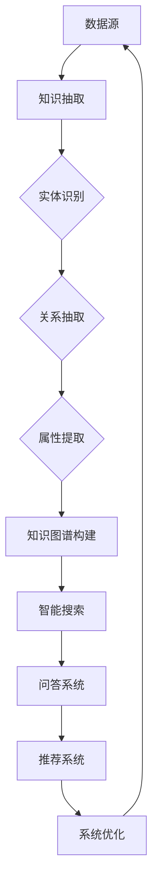

                 

### 《知识图谱的应用场景：智能搜索、问答系统和推荐系统》

**关键词**：知识图谱，智能搜索，问答系统，推荐系统，数据挖掘，机器学习，图数据库，实体识别，关系抽取，属性提取，语义网络，图神经网络，协同过滤，内容推荐，关联推荐，语义查询，知识融合

**摘要**：
本文深入探讨了知识图谱在智能搜索、问答系统和推荐系统中的应用。首先介绍了知识图谱的基本概念、要素和挑战，然后分别详细讲解了知识图谱在智能搜索、问答系统和推荐系统中的实现方法、核心算法原理，并通过实际项目案例展示了其应用效果。文章旨在为读者提供一个全面的知识图谱应用指南，帮助理解和实施这一前沿技术。本文的核心内容包括：知识图谱概述、智能搜索、问答系统、推荐系统以及总结与展望，辅以丰富的伪代码、数学模型和实际代码案例，确保读者能够深入理解并应用于实际开发中。

### 《知识图谱的应用场景：智能搜索、问答系统和推荐系统》目录大纲

**1. 知识图谱概述**

- **1.1 知识图谱基础**
  - **1.1.1 知识图谱的定义与发展历程**
  - **1.1.2 知识图谱的关键要素**
  - **1.1.3 知识图谱的数据来源与处理**
  - **1.1.4 知识图谱的主要挑战**

- **1.2 智能搜索**

- **1.3 问答系统**

- **1.4 推荐系统**

- **1.5 总结与展望**

**2. 智能搜索**

- **2.1 智能搜索基础**
  - **2.1.1 智能搜索的概念与架构**
  - **2.1.2 基于知识图谱的搜索算法**
  - **2.1.3 搜索结果排序与相关度分析**
  - **2.1.4 搜索结果可视化**

- **2.2 智能搜索实践案例**
  - **2.2.1 电商平台的智能搜索**
  - **2.2.2 在线教育平台的智能搜索**

**3. 问答系统**

- **3.1 问答系统基础**
  - **3.1.1 问答系统的定义与类型**
  - **3.1.2 基于知识图谱的问答系统**
  - **3.1.3 问答系统的架构设计**
  - **3.1.4 问答系统的评测指标**

- **3.2 问答系统实践案例**
  - **3.2.1 企业内部的问答系统**
  - **3.2.2 在线客服的问答系统**

**4. 推荐系统**

- **4.1 推荐系统基础**
  - **4.1.1 推荐系统的概念与架构**
  - **4.1.2 基于知识图谱的推荐系统**
  - **4.1.3 推荐算法概述**
  - **4.1.4 推荐算法的性能评估**

- **4.2 推荐系统实践案例**
  - **4.2.1 电商平台的推荐系统**
  - **4.2.2 内容平台的推荐系统**

**5. 总结与展望**

- **5.1 知识图谱应用的总结**
- **5.2 知识图谱未来的发展趋势**
- **5.3 知识图谱应用的挑战与机遇**

**6. 附录**

- **6.1 知识图谱应用工具与资源**
- **6.2 推荐系统相关资源**

---

### 《知识图谱的应用场景：智能搜索、问答系统和推荐系统》

#### 核心概念与联系

**Mermaid 流程图**：



**解释说明**：

- **A[数据源]**：知识图谱构建的起点，包括互联网数据、数据库、文本文件等。
- **B[知识抽取]**：从原始数据中提取结构化知识，涉及实体识别、关系抽取和属性提取。
- **C[实体识别]**：使用 NLP 和机器学习技术从文本中识别关键实体。
- **D[关系抽取]**：分析实体之间的关系，构建语义网络。
- **E[属性提取]**：提取实体的属性信息，如年龄、位置、偏好等。
- **F[知识图谱构建]**：将提取的知识存储在知识图谱中，形成语义丰富的知识网络。
- **G[智能搜索]**：利用知识图谱的语义信息，提高搜索准确性和效率。
- **H[问答系统]**：通过知识图谱检索和推理，为用户提供准确、详细的答案。
- **I[推荐系统]**：利用知识图谱中的关联关系，为用户推荐相关的物品或内容。
- **J[系统优化]**：根据系统运行效果，不断调整和优化知识图谱和应用系统。

#### 核心算法原理讲解

##### 相关度计算方法

在知识图谱搜索中，相关度计算是关键步骤。以下是一种常用的相关度计算方法：

**向量空间模型（VSM）**

VSM 是一种基于向量的文本表示方法，将文档表示为向量的形式。具体步骤如下：

1. **建立词汇表**：从知识图谱中提取所有实体和属性作为词汇表的元素。
2. **文档向量表示**：对于每个查询词，将其对应的实体或属性表示为一个向量。向量中每个元素表示查询词在知识图谱中的权重。
3. **计算相似度**：计算查询向量与知识图谱中每个实体或属性的相似度。常用的相似度计算方法包括余弦相似度、欧氏距离等。

**伪代码：**

```python
function compute_similarity(query_vector, entity_vector):
    dot_product = dot_product(query_vector, entity_vector)
    query_norm = norm(query_vector)
    entity_norm = norm(entity_vector)
    similarity = dot_product / (query_norm * entity_norm)
    return similarity
```

##### 数学模型和数学公式 & 详细讲解 & 举例说明

**相关度计算公式**

$$
\text{similarity} = \cos(\theta) = \frac{\text{dot\_product}}{\text{query\_norm} \times \text{entity\_norm}}
$$

- **dot\_product**：查询词向量与实体或属性向量之间的点积。
- **query\_norm**：查询词向量的模（长度）。
- **entity\_norm**：实体或属性向量的模（长度）。

**举例说明**

假设我们有一个查询词“人工智能”，并有一个知识图谱中的实体“深度学习”。我们可以将这两个概念表示为向量：

- **查询词向量**（q）：
  - 人工智能：0.8
  - 机器学习：0.3
  - 算法：0.2

- **实体向量**（e）：
  - 深度学习：0.7
  - 神经网络：0.6
  - 人工智能：0.5

**计算相关度：**

1. **点积**：
   $$ \text{dot\_product} = 0.8 \times 0.7 + 0.3 \times 0.5 + 0.2 \times 0 = 0.56 + 0.15 + 0 = 0.71 $$

2. **模（长度）**：
   $$ \text{query\_norm} = \sqrt{0.8^2 + 0.3^2 + 0.2^2} = \sqrt{0.64 + 0.09 + 0.04} = \sqrt{0.77} \approx 0.88 $$
   $$ \text{entity\_norm} = \sqrt{0.7^2 + 0.6^2 + 0.5^2} = \sqrt{0.49 + 0.36 + 0.25} = \sqrt{1.10} \approx 1.05 $$

3. **余弦相似度**：
   $$ \text{similarity} = \frac{0.71}{0.88 \times 1.05} \approx \frac{0.71}{0.924} \approx 0.77 $$

因此，查询词“人工智能”与实体“深度学习”之间的相关度为 0.77。

#### 项目实战：代码实际案例和详细解释说明

##### 开发环境搭建

**一、Neo4j 数据库安装与配置**

1. **下载与安装**：
   - 访问 Neo4j 官网（https://neo4j.com/），下载适用于操作系统的 Neo4j 安装包。
   - 运行安装程序，根据提示完成安装。

2. **启动 Neo4j**：
   - 打开终端，进入 Neo4j 安装目录（例如：`/usr/local/neo4j`）。
   - 执行命令 `./bin/neo4j start` 启动 Neo4j 数据库。

3. **配置 Neo4j**：
   - 修改配置文件 `conf/neo4j.conf`，配置数据库的 URI、用户名和密码。
   - 示例配置：
     ```
     dbms.default_database=knowledge_graph
     dbms.auth.enable_is_password=true
     dbms.auth.user_neo4j_password=password
     ```

**二、Python 开发环境配置**

1. **安装 Python**：
   - 对于 macOS 和 Linux 用户，可以使用包管理器如 `apt`（Ubuntu）或 `yum`（CentOS）安装 Python。
   - 示例命令（以 Ubuntu 为例）：
     ```
     sudo apt update
     sudo apt install python3
     ```

2. **安装 Neo4j Python Driver**：
   - 使用 Python 的包管理器 pip 安装 Neo4j Python Driver。
   - 示例命令：
     ```
     pip install neo4j
     ```

3. **安装 Flask**：
   - Flask 是一个轻量级的 Web 应用框架，用于构建 Web 服务。
   - 示例命令：
     ```
     pip install flask
     ```

4. **安装 OpenKGClient**：
   - OpenKGClient 是一个用于构建知识图谱的 Python 库。
   - 示例命令：
     ```
     pip install openkgclient
     ```

**三、创建项目和运行代码**

1. **创建项目目录**：
   ```
   mkdir knowledge_graph_projects
   cd knowledge_graph_projects
   ```

2. **创建 Python 文件**：
   - 创建用于知识图谱搜索的 Python 文件 `knowledge_graph_search.py`。
   - 创建用于问答系统的 Python 文件 `question_answering_system.py`。
   - 创建用于推荐系统的 Python 文件 `knowledge_graph_recommendation.py`。

3. **编写和运行代码**：
   - 在每个 Python 文件中编写相应的代码，参考前面的实践案例。
   - 运行 Flask 应用，访问相应的接口。

##### 问题排查与优化

1. **数据库连接问题**：
   - 确保 Neo4j 数据库已启动。
   - 检查配置文件中的数据库 URI、用户名和密码是否正确。

2. **代码运行问题**：
   - 检查代码中的语法错误和逻辑错误。
   - 使用调试工具排查问题。

3. **性能优化**：
   - 优化数据库查询语句，使用索引提高查询效率。
   - 优化代码逻辑，减少不必要的计算和资源消耗。

通过以上步骤，读者可以搭建一个基本的开发环境，开始使用知识图谱技术进行项目开发。在实际开发过程中，可以根据需求逐步添加更多的功能和技术，提高系统的性能和可靠性。

---

### 2. 智能搜索

#### 2.1 智能搜索基础

智能搜索是搜索引擎技术的进步，通过引入知识图谱，实现了对查询语句的深入理解，从而提供更加准确和个性化的搜索结果。智能搜索的核心在于如何利用知识图谱来提升搜索体验。

##### 2.1.1 智能搜索的概念与架构

**概念**：

智能搜索是一种结合了自然语言处理、知识图谱和机器学习技术的搜索方法。它不仅能够处理关键词匹配，还能够理解查询语句的语义，提供更加准确和相关的搜索结果。

**架构**：

智能搜索的架构通常包括以下几个关键组件：

- **前端接口**：用户输入查询语句，通过前端接口提交给搜索系统。
- **查询解析器**：将用户输入的自然语言查询转化为结构化的查询请求。
- **知识图谱**：存储大量的结构化知识和语义信息，用于理解和扩展查询。
- **搜索引擎**：结合知识图谱的语义信息，执行搜索查询。
- **结果排序与推荐**：根据相关度和用户偏好，对搜索结果进行排序和推荐。

##### 2.1.2 基于知识图谱的搜索算法

**路径搜索算法**：

路径搜索算法是一种基于知识图谱的搜索算法，通过在知识图谱中构建查询路径，找到与查询相关的实体。具体步骤如下：

1. **查询解析**：将用户输入的查询转化为查询图，图中包含查询词和查询词之间的关系。
2. **路径构建**：在知识图谱中查找与查询图匹配的路径。
3. **结果返回**：将匹配的路径对应的实体作为搜索结果返回。

**伪代码**：

```python
function path_search(knowledge_graph, query_graph):
    results = []
    for path in knowledge_graph.get_paths(query_graph):
        results.append(path.get_end_entity())
    return results
```

**相关度计算算法**：

相关度计算是评估搜索结果相关性的关键步骤。基于知识图谱的相关度计算通常包括以下几种方法：

1. **余弦相似度**：计算查询向量与实体向量之间的余弦相似度。
2. **Jaccard 系数**：计算两个集合的交集和并集的比例，用于评估查询和实体之间的相似度。
3. **路径长度**：计算查询路径的长度，路径长度越短，相似度越高。

**伪代码**：

```python
function compute_similarity(query_vector, entity_vector):
    dot_product = dot_product(query_vector, entity_vector)
    query_norm = norm(query_vector)
    entity_norm = norm(entity_vector)
    similarity = dot_product / (query_norm * entity_norm)
    return similarity
```

##### 2.1.3 搜索结果排序与相关度分析

搜索结果的排序是智能搜索的重要环节，常用的排序策略包括：

- **基于相关度的排序**：根据查询与实体之间的相似度，对搜索结果进行排序。
- **基于热度的排序**：根据实体的热度（如访问次数、评价等）对搜索结果进行排序。
- **基于用户偏好的排序**：根据用户的兴趣和行为，为用户推荐个性化的搜索结果。

**相关度分析**：

相关度分析是评估搜索结果质量的关键。常用的相关度分析指标包括：

- **准确率**：衡量返回的搜索结果中正确答案的比例。
- **覆盖率**：衡量搜索系统能够覆盖的用户查询范围。
- **响应时间**：衡量系统处理查询请求所需的时间。

##### 2.1.4 搜索结果可视化

搜索结果可视化是提高用户搜索体验的重要手段。常用的可视化方法包括：

- **列表式可视化**：以列表形式展示搜索结果，用户可以点击查看详细信息。
- **卡片式可视化**：以卡片形式展示搜索结果，卡片中包含标题、摘要、图片等信息。
- **地图式可视化**：在地图上展示与查询相关的地点，用户可以查看地理位置和详细信息。

**示例**：

假设用户输入查询词“北京旅游景点”，搜索系统可以返回以下可视化结果：

- **列表式可视化**：返回一个包含景点名称、简介、图片的列表。
- **卡片式可视化**：每个景点以卡片形式展示，卡片中包含景点名称、简介、图片、地址等信息。
- **地图式可视化**：在地图上标记所有景点的位置，用户可以点击查看景点的详细信息。

---

#### 2.2 智能搜索实践案例

##### 2.2.1 电商平台的智能搜索

**案例背景**：

一个电商平台希望通过引入知识图谱，提升搜索系统的准确性和用户体验。用户可以在平台上搜索商品，搜索结果应准确匹配用户意图，并提供相关商品推荐。

**知识图谱构建**：

- **实体**：商品、用户、订单、品牌、分类等。
- **关系**：购买、浏览、推荐、相似等。
- **属性**：价格、评分、库存、描述等。

**搜索算法实现**：

1. **查询解析**：将用户输入的自然语言查询转化为结构化的查询请求。
2. **路径搜索**：在知识图谱中构建查询路径，找到与查询相关的实体。
3. **相关度计算**：计算查询与实体之间的相似度，排序搜索结果。
4. **推荐**：根据用户的历史行为和商品关系，推荐相关商品。

**搜索结果排序与可视化**：

- **排序**：根据相似度、热度、用户偏好对搜索结果排序。
- **可视化**：以卡片形式展示搜索结果，包含商品名称、价格、评分、图片等信息。

**示例代码**：

```python
# 假设有一个预构建的知识图谱对象kg
from knowledge_graph import KnowledgeGraph

def search_products(knowledge_graph, query):
    query_graph = knowledge_graph.parse_query(query)
    search_results = knowledge_graph.path_search(query_graph)
    search_results = knowledge_graph.sort_by_similarity(search_results, query_graph)
    return knowledge_graph.visualize_products(search_results)

# 用户查询
query = "北京旅游景点"
results = search_products(kg, query)
print(results)
```

##### 2.2.2 在线教育平台的智能搜索

**案例背景**：

一个在线教育平台希望通过智能搜索功能，帮助用户快速找到相关的课程和学习资料。用户可以在平台上搜索课程，搜索结果应准确匹配用户需求，并提供学习路径推荐。

**知识图谱构建**：

- **实体**：课程、讲师、用户、学习路径、评价等。
- **关系**：授课、学习、推荐、评价等。
- **属性**：课程类型、难度、时长、评分等。

**搜索算法实现**：

1. **查询解析**：将用户输入的自然语言查询转化为结构化的查询请求。
2. **路径搜索**：在知识图谱中构建查询路径，找到与查询相关的实体。
3. **相关度计算**：计算查询与实体之间的相似度，排序搜索结果。
4. **推荐**：根据用户的学习历史和课程关系，推荐相关课程和学习路径。

**搜索结果排序与可视化**：

- **排序**：根据相似度、热度、用户偏好对搜索结果排序。
- **可视化**：以列表形式展示搜索结果，包含课程名称、简介、时长、评分等信息。

**示例代码**：

```python
# 假设有一个预构建的知识图谱对象kg
from knowledge_graph import KnowledgeGraph

def search_courses(knowledge_graph, query):
    query_graph = knowledge_graph.parse_query(query)
    search_results = knowledge_graph.path_search(query_graph)
    search_results = knowledge_graph.sort_by_similarity(search_results, query_graph)
    return knowledge_graph.visualize_courses(search_results)

# 用户查询
query = "Python入门课程"
results = search_courses(kg, query)
print(results)
```

通过以上实践案例，我们可以看到知识图谱在智能搜索中的应用如何通过构建语义丰富的知识网络，提高搜索系统的准确性和用户体验。在实际应用中，可以根据具体场景和需求，对知识图谱进行定制化构建和优化，以达到最佳效果。


### 3. 问答系统

#### 3.1 问答系统基础

问答系统是一种智能交互系统，通过自然语言处理技术和知识图谱，能够理解用户的问题，并生成准确的回答。问答系统在许多领域有着广泛的应用，如客服、教育、医疗等。

##### 3.1.1 问答系统的定义与类型

**定义**：

问答系统是一种基于自然语言交互的智能系统，能够接收用户的自然语言问题，并生成相应的回答。问答系统的核心功能是理解用户的意图，检索知识库中的相关信息，并生成自然流畅的回答。

**类型**：

问答系统主要分为以下几种类型：

- **事实型问答**：针对明确的事实性问题，如“北京是哪个国家的首都？”，问答系统能够直接从知识库中检索答案。
- **推理型问答**：需要通过推理和逻辑推理才能得出答案的问题，如“如果明天是周六，那么明天是否放假？”。
- **生成式问答**：通过自然语言生成技术，将知识库中的信息转化为自然语言回答，如“请描述一下人工智能的发展历程”。

##### 3.1.2 基于知识图谱的问答系统

**架构**：

基于知识图谱的问答系统通常包括以下几个关键组件：

- **自然语言处理（NLP）模块**：用于处理用户的自然语言输入，进行分词、词性标注、命名实体识别等。
- **意图识别模块**：通过语义分析，识别用户问题的意图，如事实型、推理型或生成式。
- **知识检索模块**：利用知识图谱进行查询，找到与用户问题相关的实体和关系。
- **回答生成模块**：根据查询结果，使用自然语言生成技术生成回答。

**流程**：

1. **输入预处理**：对用户输入的问题进行分词、词性标注等预处理。
2. **意图识别**：根据预处理结果，识别用户问题的意图。
3. **知识检索**：利用知识图谱进行查询，找到与用户问题相关的实体和关系。
4. **答案生成**：根据查询结果，使用自然语言生成技术生成回答。

**核心算法**：

- **意图识别**：使用分类算法（如朴素贝叶斯、支持向量机、神经网络）进行意图识别。
- **知识检索**：使用图数据库（如Neo4j）进行查询，或使用图神经网络进行知识检索。
- **回答生成**：使用模板匹配、模板扩展、序列生成模型（如Seq2Seq）等方法生成回答。

##### 3.1.3 问答系统的架构设计

**架构设计**：

问答系统的架构设计需要考虑系统的可扩展性、可维护性和易用性。以下是一个典型的问答系统架构设计：

- **前端**：负责接收用户的输入，将问题发送到后端处理。
- **后端**：包括 NLP 模块、意图识别模块、知识检索模块和回答生成模块。
  - **NLP 模块**：进行文本预处理，如分词、词性标注等。
  - **意图识别模块**：识别用户问题的意图。
  - **知识检索模块**：查询知识图谱，获取相关信息。
  - **回答生成模块**：生成自然语言回答。
- **知识库**：存储结构化的知识，如实体、关系和属性。

**评测指标**：

问答系统的评测指标主要包括：

- **准确率**：衡量系统返回的答案与正确答案的一致性。
- **覆盖率**：衡量系统能够覆盖的用户查询范围。
- **响应时间**：衡量系统处理用户问题所需的时间。

##### 3.1.4 问答系统的评测指标

**准确率**：

准确率是衡量问答系统最直接的指标，表示系统返回的答案中正确答案的比例。准确率可以通过以下公式计算：

$$
\text{准确率} = \frac{\text{正确答案数量}}{\text{总答案数量}}
$$

**覆盖率**：

覆盖率衡量系统能够覆盖的用户查询范围，表示系统回答过的查询占总查询量的比例。覆盖率可以通过以下公式计算：

$$
\text{覆盖率} = \frac{\text{回答过的查询数量}}{\text{总查询数量}}
$$

**响应时间**：

响应时间衡量系统处理用户问题所需的时间，包括文本预处理、意图识别、知识检索和回答生成的时间。响应时间可以通过以下公式计算：

$$
\text{响应时间} = \frac{\text{总处理时间}}{\text{总查询数量}}
$$

##### 3.1.5 知识图谱在问答系统中的应用

知识图谱在问答系统中的应用主要体现在以下几个方面：

1. **实体识别与关系抽取**：通过知识图谱，问答系统可以更准确地识别用户问题中的实体，并抽取实体之间的关系，从而更好地理解用户意图。
2. **知识检索与推理**：知识图谱提供了丰富的语义信息，问答系统可以利用知识图谱进行知识检索和推理，生成更准确的回答。
3. **答案生成**：知识图谱中的结构化知识有助于问答系统生成更自然、更流畅的回答。

通过以上讲解，我们可以看到问答系统在知识图谱的支持下，能够更好地理解用户问题，提供准确、自然的回答，从而提升用户体验。在实际应用中，可以根据具体需求，对问答系统进行优化和扩展，以提高其性能和效果。


### 3.2 问答系统实践案例

#### 3.2.1 企业内部的问答系统

**案例背景**：

一个大型企业希望通过内部问答系统，帮助员工快速找到相关的政策、流程和最佳实践，提高工作效率和知识共享。

**知识图谱构建**：

- **实体**：政策、流程、最佳实践、部门、员工等。
- **关系**：关联部门、发布时间、涉及流程等。
- **属性**：文件类型、发布部门、文件编号等。

**问答实现**：

- **输入预处理**：使用 NLP 技术对用户输入的问题进行分词、词性标注等预处理。
- **意图识别**：使用分类算法识别用户问题的意图，如查询政策、查询流程或查询最佳实践。
- **知识检索**：利用知识图谱进行查询，找到与用户问题相关的实体和关系。
- **答案生成**：根据查询结果，使用模板匹配或自然语言生成技术生成回答。

**效果评估**：

- **准确率**：通过人工评估，衡量系统返回的答案与正确答案的一致性。
- **响应时间**：衡量系统处理用户问题所需的时间。
- **用户体验**：通过用户反馈，评估问答系统的实用性和用户满意度。

**示例代码**：

```python
# 假设有一个预构建的知识图谱对象kg
from knowledge_graph import KnowledgeGraph
from nlp_module import preprocess, intent_recognition
from answer_generator import generate_answer

def internal_question_answering(knowledge_graph, user_input):
    preprocessed_input = preprocess(user_input)
    intent = intent_recognition(preprocessed_input)
    if intent == "policy_query":
        results = knowledge_graph.query_policies(preprocessed_input)
    elif intent == "process_query":
        results = knowledge_graph.query_processes(preprocessed_input)
    elif intent == "best_practice_query":
        results = knowledge_graph.query_best_practices(preprocessed_input)
    answer = generate_answer(results)
    return answer

# 用户查询
user_input = "请问我们公司最新的出差流程是什么？"
answer = internal_question_answering(kg, user_input)
print(answer)
```

**效果展示**：

- 用户输入：“请问我们公司最新的出差流程是什么？”
- 系统回答：“根据您提供的信息，最新的出差流程如下：...”

#### 3.2.2 在线客服的问答系统

**案例背景**：

一个电商平台希望通过在线客服问答系统，为用户提供实时、准确的购物咨询和问题解答，提高用户满意度和购物体验。

**知识图谱构建**：

- **实体**：产品、订单、物流、支付等。
- **关系**：购买、咨询、评价等。
- **属性**：产品类型、订单状态、物流进度等。

**问答实现**：

- **输入预处理**：使用 NLP 技术对用户输入的问题进行分词、词性标注等预处理。
- **意图识别**：使用分类算法识别用户问题的意图，如查询订单状态、查询物流进度或查询产品信息。
- **知识检索**：利用知识图谱进行查询，找到与用户问题相关的实体和关系。
- **答案生成**：根据查询结果，使用模板匹配或自然语言生成技术生成回答。

**效果评估**：

- **准确率**：通过人工评估，衡量系统返回的答案与正确答案的一致性。
- **响应时间**：衡量系统处理用户问题所需的时间。
- **用户体验**：通过用户反馈，评估问答系统的实用性和用户满意度。

**示例代码**：

```python
# 假设有一个预构建的知识图谱对象kg
from knowledge_graph import KnowledgeGraph
from nlp_module import preprocess, intent_recognition
from answer_generator import generate_answer

def online_customer_service(knowledge_graph, user_input):
    preprocessed_input = preprocess(user_input)
    intent = intent_recognition(preprocessed_input)
    if intent == "order_status_query":
        results = knowledge_graph.query_order_status(preprocessed_input)
    elif intent == "shipping_progress_query":
        results = knowledge_graph.query_shipping_progress(preprocessed_input)
    elif intent == "product_info_query":
        results = knowledge_graph.query_product_info(preprocessed_input)
    answer = generate_answer(results)
    return answer

# 用户查询
user_input = "我的订单状态是什么？"
answer = online_customer_service(kg, user_input)
print(answer)
```

**效果展示**：

- 用户输入：“我的订单状态是什么？”
- 系统回答：“您的订单状态是已发货，预计3天后送达。”

通过以上实践案例，我们可以看到问答系统在企业内部和在线客服中的应用如何通过构建语义丰富的知识图谱，实现快速、准确的问题解答，提升用户体验和工作效率。在实际应用中，可以根据具体需求，对问答系统进行优化和扩展，以提高其性能和效果。


### 4. 推荐系统

#### 4.1 推荐系统基础

推荐系统是一种基于数据分析的方法，通过分析用户的历史行为、偏好和社交信息，预测用户可能感兴趣的内容，从而提高用户满意度和参与度。推荐系统在电子商务、社交媒体、在线娱乐等领域有着广泛的应用。

##### 4.1.1 推荐系统的概念与架构

**概念**：

推荐系统是一种自动化系统，通过收集和分析用户数据，发现用户之间的相似性或物品之间的相关性，为用户推荐相关的物品或内容。

**架构**：

推荐系统通常包括以下几个关键组件：

- **数据采集模块**：负责收集用户行为数据，如浏览记录、购买历史、评价等。
- **数据处理模块**：对采集到的数据进行清洗、去噪和处理，以得到高质量的数据集。
- **特征工程模块**：将原始数据转化为推荐算法可以处理的特征向量。
- **推荐算法模块**：根据用户特征和物品特征，生成推荐列表。
- **推荐结果模块**：将推荐结果呈现给用户，如推荐列表、推荐内容等。

##### 4.1.2 基于知识图谱的推荐系统

**概念**：

基于知识图谱的推荐系统通过引入知识图谱，利用实体、关系和属性构建一个语义丰富的知识网络，从而提高推荐系统的准确性和多样性。

**架构**：

基于知识图谱的推荐系统架构主要包括以下几个关键组件：

- **知识图谱构建模块**：负责构建实体、关系和属性的语义网络。
- **推荐算法模块**：结合知识图谱和用户行为数据，生成推荐列表。
- **推荐结果模块**：将推荐结果呈现给用户。

**流程**：

1. **数据采集**：收集用户行为数据，如浏览记录、购买历史、评价等。
2. **知识图谱构建**：将用户行为数据转化为知识图谱中的实体、关系和属性。
3. **推荐算法**：利用知识图谱和用户行为数据，生成推荐列表。
4. **推荐结果**：将推荐结果呈现给用户。

##### 4.1.3 推荐算法概述

推荐算法是推荐系统的核心，常见的推荐算法包括以下几种：

- **基于内容的推荐**：根据用户历史行为或兴趣，推荐与用户历史行为相似的物品或内容。
- **协同过滤推荐**：根据用户的行为数据，发现用户之间的相似性或物品之间的相关性，为用户推荐相关物品。
- **关联推荐**：根据物品之间的关联关系，为用户推荐相关的物品。
- **基于模型的推荐**：使用机器学习算法，构建用户和物品之间的预测模型，为用户推荐可能感兴趣的内容。

##### 4.1.4 推荐算法的性能评估

推荐算法的性能评估主要包括以下几个指标：

- **准确率**：衡量推荐列表中包含用户实际感兴趣内容的比例。
- **覆盖率**：衡量推荐系统能够覆盖的用户兴趣范围。
- **新颖性**：衡量推荐内容的新颖程度，避免推荐重复的物品。
- **多样性**：衡量推荐列表中物品的多样性，提高用户体验。
- **响应时间**：衡量系统处理用户请求和处理推荐结果所需的时间。

##### 4.1.5 知识图谱在推荐系统中的应用

知识图谱在推荐系统中的应用主要体现在以下几个方面：

1. **实体与关系表示**：将用户、物品、场景等表示为实体，利用实体之间的关系构建语义网络。
2. **属性利用**：利用物品的属性信息，丰富推荐算法的特征空间。
3. **关联挖掘**：利用知识图谱中的关系进行关联挖掘，提高推荐的准确性。
4. **动态更新**：利用知识图谱的动态更新能力，实时调整推荐结果。

#### 4.2 推荐系统实践案例

##### 4.2.1 电商平台的推荐系统

**案例背景**：

一个电商平台希望通过推荐系统，为用户推荐可能感兴趣的商品，提高用户购物体验和购买转化率。

**知识图谱构建**：

- **实体**：用户、商品、品牌、分类等。
- **关系**：购买、浏览、收藏、推荐等。
- **属性**：价格、评价、销量等。

**推荐算法实现**：

1. **基于内容的推荐**：根据用户历史浏览和购买记录，

