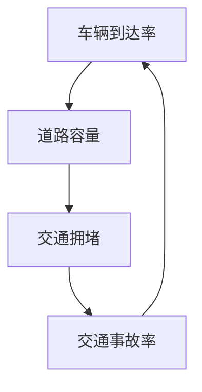
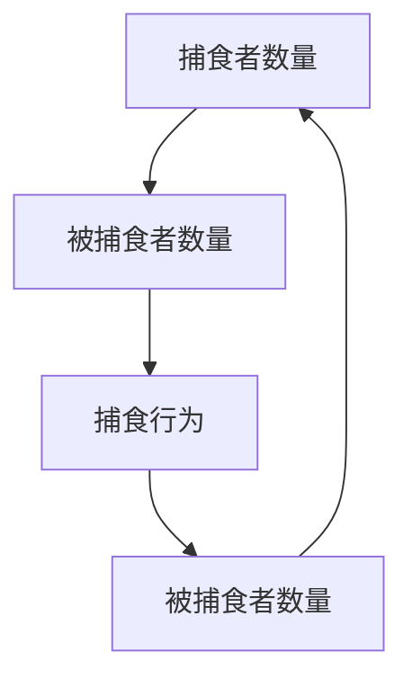
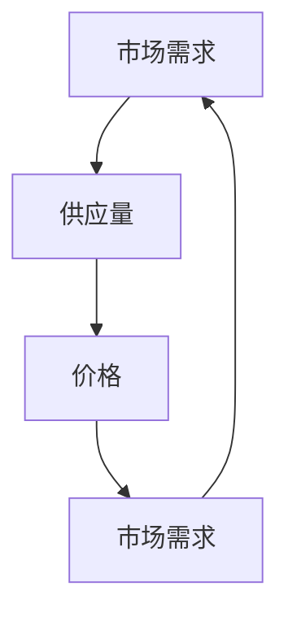
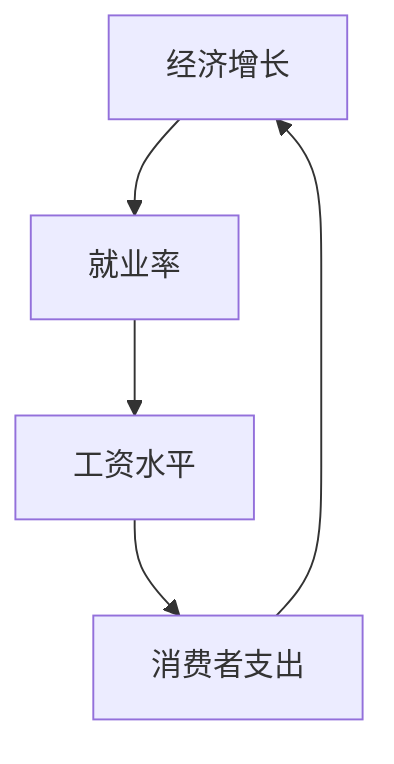

                 

# 《知识的系统动力学：反馈循环与平衡》

## 关键词
系统动力学、反馈循环、平衡态、稳定性、仿真技术、自然生态系统、商业系统、社会系统

## 摘要
本文将探讨系统动力学的核心概念、反馈循环及其在平衡态中的作用。通过详细的案例分析，我们揭示了系统动力学在自然、商业和社会系统中的广泛应用。同时，本文还将介绍系统动力学的建模与仿真技术，以及其在政策分析中的应用前景。通过对系统动力学的研究，我们希望能够更好地理解和预测复杂系统的行为，为现实世界的决策提供科学依据。

----------------------------------------------------------------

## 第一部分：系统动力学的概述

### 第1章：系统动力学的基本概念

#### 1.1.1 系统动力学的定义与历史

**核心概念与联系：**

系统动力学是一门跨学科的科学，它结合了数学、物理学、工程学、经济学等多个领域的知识，研究系统的动态行为和演化过程。其核心概念包括流、存量、变量、反馈循环等。系统动力学的历史可以追溯到20世纪50年代，由美国麻省理工学院的Jay Forrester提出，并广泛应用于工业、生态、经济等领域。

**核心算法原理讲解：**

系统动力学的数学基础主要包括微分方程和差分方程。微分方程描述了变量随时间变化的速率，而差分方程则描述了离散时间步骤之间的变量关系。常见的系统动力学模型包括因果图、流图和状态空间模型。

**数学模型和数学公式：**

1. 微分方程：$$\frac{dy}{dt} = f(y)$$
2. 差分方程：$$x_{t+1} = x_t + \Delta x_t$$

**举例说明：** 人口增长模型可以表示为微分方程：
$$\frac{dP}{dt} = rP(1 - \frac{P}{K})$$
其中，$P$ 表示人口数量，$r$ 表示人口增长率，$K$ 表示环境的承载能力。

---

#### 1.1.2 系统动力学的关键术语

**核心概念与联系：**

系统动力学中的关键术语包括流、存量、变量、反馈循环、平衡态等。流描述了系统中的物质或能量的传递，存量表示系统中某一时刻的总量，变量则是描述系统状态的数量。反馈循环是系统动力学中的一个重要概念，它描述了系统内部变量之间的相互作用和反馈调节。

**核心算法原理讲解：**

流、存量、变量之间的关系可以通过数学模型来描述。例如，流量与存量之间的关系可以用以下公式表示：
$$\frac{dC}{dt} = \dot{Q}$$
其中，$C$ 表示存量，$\dot{Q}$ 表示流量。

**数学模型和数学公式：**

1. 流量与存量关系：$$\frac{dC}{dt} = \dot{Q}$$
2. 变量关系：$$y_{t+1} = f(y_t)$$

**举例说明：** 水库水位模型可以表示为：
$$\frac{dH}{dt} = P - E$$
其中，$H$ 表示水位高度，$P$ 表示降水量，$E$ 表示蒸发量。

---

#### 1.1.3 系统动力学的理论框架

**核心概念与联系：**

系统动力学的理论框架包括系统建模、仿真分析和优化控制等核心内容。系统建模是指使用数学模型描述系统的动态行为，仿真分析是指通过计算机模拟来预测系统的行为，优化控制则是通过调整系统的参数来优化系统的性能。

**核心算法原理讲解：**

系统建模可以使用流图、因果图和状态空间模型等方法。仿真分析则通常使用数值计算方法，如欧拉方法、龙格-库塔方法等。优化控制则涉及到最优化理论，如线性规划、非线性规划等。

**数学模型和数学公式：**

1. 流图：$$\text{节点} \rightarrow \text{边}$$
2. 因果图：$$\text{变量} \rightarrow \text{影响关系}$$
3. 状态空间模型：$$\textbf{x}' = \textbf{A}\textbf{x} + \textbf{B}\textbf{u}, \textbf{y} = \textbf{C}\textbf{x} + \textbf{D}\textbf{u}$$

**举例说明：** 城市交通流量模型可以表示为因果图：

---

### 第2章：系统动力学的理论框架

#### 2.1.1 系统动力学的核心理论

**核心概念与联系：**

系统动力学的核心理论包括反馈循环、稳定性分析和动态行为分析等。反馈循环是系统动力学中的一个关键概念，它描述了系统内部变量之间的相互作用和反馈调节。稳定性分析则是研究系统在不同初始条件下是否能够保持稳定状态。动态行为分析则是研究系统随时间变化的趋势和规律。

**核心算法原理讲解：**

反馈循环可以通过流图或状态空间模型来描述。稳定性分析通常使用线性化方法或特征值分析方法。动态行为分析则可以使用数值计算方法，如欧拉方法、龙格-库塔方法等。

**数学模型和数学公式：**

1. 反馈循环：$$\textbf{x}_{t+1} = f(\textbf{x}_t)$$
2. 稳定性分析：$$\textbf{x}' = \textbf{A}\textbf{x} + \textbf{B}\textbf{u}$$
3. 动态行为分析：$$y(t) = y_0 e^{rt}$$

**举例说明：** 人口增长模型可以表示为：
$$\frac{dP}{dt} = rP(1 - \frac{P}{K})$$
其中，$P$ 表示人口数量，$r$ 表示人口增长率，$K$ 表示环境的承载能力。

---

#### 2.1.2 流图与建模方法

**核心概念与联系：**

流图是系统动力学中常用的一种图形表示方法，它通过节点和边来描述系统中的变量及其关系。流图可以帮助我们直观地理解系统的动态行为，并用于系统建模。常见的建模方法包括基于流图的建模、基于状态空间模型的建模和基于微分方程的建模。

**核心算法原理讲解：**

基于流图的建模方法通常使用因果图或流图来描述系统的动态行为。因果图描述了变量之间的因果关系，而流图则描述了变量之间的流量关系。基于状态空间模型的建模方法则使用矩阵来描述系统的状态转移和输出关系。基于微分方程的建模方法则直接使用微分方程来描述系统的动态行为。

**数学模型和数学公式：**

1. 因果图：$$\text{变量} \rightarrow \text{影响关系}$$
2. 流图：$$\text{节点} \rightarrow \text{边}$$
3. 状态空间模型：$$\textbf{x}' = \textbf{A}\textbf{x} + \textbf{B}\textbf{u}, \textbf{y} = \textbf{C}\textbf{x} + \textbf{D}\textbf{u}$$
4. 微分方程：$$\frac{dy}{dt} = f(y)$$

**举例说明：** 城市交通流量模型可以表示为流图：

---

#### 2.1.3 动力学方程的构建

**核心概念与联系：**

动力学方程是系统动力学的核心组成部分，它描述了系统状态随时间变化的规律。构建动力学方程的方法包括直接构建法、递推法、微分方程法等。

**核心算法原理讲解：**

直接构建法是通过分析系统中的因果关系和流量关系，直接写出系统的动力学方程。递推法则是通过系统状态的前后关系，递推地构建系统的动力学方程。微分方程法则是使用微分方程来描述系统的动态行为。

**数学模型和数学公式：**

1. 直接构建法：$$\frac{dy}{dt} = f(y)$$
2. 递推法：$$y_{t+1} = f(y_t)$$
3. 微分方程法：$$\frac{d^2y}{dt^2} = f(y, \frac{dy}{dt})$$

**举例说明：** 人口增长模型的动力学方程可以表示为：
$$\frac{dP}{dt} = rP(1 - \frac{P}{K})$$
其中，$P$ 表示人口数量，$r$ 表示人口增长率，$K$ 表示环境的承载能力。

---

### 第3章：反馈循环的分析

#### 3.1.1 反馈循环的概念与分类

**核心概念与联系：**

反馈循环是系统动力学中的一个重要概念，它描述了系统内部变量之间的相互作用和反馈调节。根据反馈的方向和效果，反馈循环可以分为正反馈循环和负反馈循环。正反馈循环会加剧系统的变化，而负反馈循环则可以稳定系统的状态。

**核心算法原理讲解：**

正反馈循环和负反馈循环可以通过流图或状态空间模型来描述。正反馈循环通常表现为一个变量增加导致另一个变量增加，而负反馈循环则表现为一个变量增加导致另一个变量减少。

**数学模型和数学公式：**

1. 正反馈循环：$$\textbf{x}_{t+1} = \textbf{P}\textbf{x}_t + \textbf{B}\textbf{u}$$
2. 负反馈循环：$$\textbf{x}_{t+1} = \textbf{P}\textbf{x}_t - \textbf{B}\textbf{u}$$

**举例说明：** 人口增长模型中的正反馈循环可以表示为：
$$\frac{dP}{dt} = rP(1 - \frac{P}{K})$$

---

#### 3.1.2 正反馈循环与负反馈循环

**核心概念与联系：**

正反馈循环与负反馈循环在系统动力学中起着不同的作用。正反馈循环通常会加剧系统的变化，导致系统状态的迅速变化。而负反馈循环则可以稳定系统的状态，使其在一定范围内波动。

**核心算法原理讲解：**

正反馈循环和负反馈循环可以通过稳定性分析来区分。稳定性分析通常使用特征值分析方法，判断系统矩阵的特征值是否在单位圆内。如果特征值在单位圆内，系统则稳定；如果特征值在单位圆外，系统则不稳定。

**数学模型和数学公式：**

1. 稳定性分析：$$\textbf{x}' = \textbf{A}\textbf{x} + \textbf{B}\textbf{u}$$
2. 特征值分析：$$\textbf{A}\textbf{x} = \lambda \textbf{x}$$

**举例说明：** 人口增长模型中的正反馈循环可以表示为：
$$\frac{dP}{dt} = rP(1 - \frac{P}{K})$$
其中，$r > 0$，则特征值为 $r$，系统不稳定。

---

#### 3.1.3 反馈循环在系统中的作用

**核心概念与联系：**

反馈循环在系统动力学中起着重要的作用，它可以影响系统的稳定性、动态行为和性能。正反馈循环通常会导致系统状态的迅速变化，而负反馈循环则可以稳定系统的状态。

**核心算法原理讲解：**

反馈循环在系统中的作用可以通过仿真分析来验证。通过仿真分析，我们可以观察系统在不同初始条件下的动态行为，并分析反馈循环对系统的影响。

**数学模型和数学公式：**

1. 仿真分析：$$y(t) = y_0 e^{rt}$$
2. 反馈循环作用分析：$$\textbf{x}_{t+1} = \textbf{P}\textbf{x}_t + \textbf{B}\textbf{u}$$

**举例说明：** 人口增长模型中的反馈循环可以表示为：
$$\frac{dP}{dt} = rP(1 - \frac{P}{K})$$
当$r > 0$时，正反馈循环导致人口数量的迅速增长；当$r < 0$时，负反馈循环导致人口数量的稳定。

---

### 第4章：反馈循环的建模与稳定性分析

#### 4.1.1 反馈循环的数学模型

**核心概念与联系：**

反馈循环的数学模型可以通过流图、状态空间模型和微分方程等来描述。流图和状态空间模型可以直观地描述反馈循环的结构和关系，而微分方程则可以精确地描述反馈循环的动态行为。

**核心算法原理讲解：**

流图和状态空间模型是构建反馈循环数学模型的基础。流图可以通过节点和边来描述变量之间的流量关系，状态空间模型则通过矩阵来描述系统的状态转移和输出关系。

**数学模型和数学公式：**

1. 流图：$$\text{节点} \rightarrow \text{边}$$
2. 状态空间模型：$$\textbf{x}' = \textbf{A}\textbf{x} + \textbf{B}\textbf{u}, \textbf{y} = \textbf{C}\textbf{x} + \textbf{D}\textbf{u}$$
3. 微分方程：$$\frac{dy}{dt} = f(y)$$

**举例说明：** 人口增长模型可以表示为流图：

---

#### 4.1.2 稳定性分析的基本方法

**核心概念与联系：**

稳定性分析是研究系统在不同初始条件下是否能够保持稳定状态。稳定性分析的基本方法包括线性化方法、特征值分析方法和数值计算方法等。

**核心算法原理讲解：**

线性化方法是研究系统在稳定状态附近的小扰动行为。特征值分析方法则是通过分析系统矩阵的特征值来判断系统的稳定性。数值计算方法则是通过数值模拟来分析系统的稳定性。

**数学模型和数学公式：**

1. 线性化方法：$$\textbf{x}' = \textbf{A}\textbf{x} + \textbf{B}\textbf{u}$$
2. 特征值分析方法：$$\textbf{A}\textbf{x} = \lambda \textbf{x}$$
3. 数值计算方法：$$y(t) = y_0 e^{rt}$$

**举例说明：** 人口增长模型可以通过特征值分析方法来判断稳定性：
$$\frac{dP}{dt} = rP(1 - \frac{P}{K})$$
其中，$r$ 为人口增长率，$K$ 为环境的承载能力。如果$r > 0$，则系统不稳定；如果$r < 0$，则系统稳定。

---

#### 4.1.3 稳态解与瞬态解的区分

**核心概念与联系：**

稳态解和瞬态解是系统动力学的两种不同解。稳态解是系统在长期演化过程中趋于稳定的状态，而瞬态解则是系统在短期内随时间变化的解。

**核心算法原理讲解：**

稳态解和瞬态解可以通过仿真分析来区分。稳态解通常是在系统长时间运行后的状态，而瞬态解则是系统在短期内随时间变化的解。

**数学模型和数学公式：**

1. 稳态解：$$y(t \rightarrow \infty) = y_{ss}$$
2. 瞬态解：$$y(t) \rightarrow 0 \text{ as } t \rightarrow 0$$

**举例说明：** 人口增长模型中的稳态解和瞬态解可以表示为：
$$\frac{dP}{dt} = rP(1 - \frac{P}{K})$$
其中，$P(t=0)$ 表示初始人口数量，$P(t \rightarrow \infty)$ 表示稳态人口数量，$P(t)$ 表示瞬态人口数量。

---

### 第5章：反馈循环的平衡状态

#### 5.1.1 平衡态的定义与特征

**核心概念与联系：**

平衡态是系统动力学中的一个重要概念，它表示系统在长期演化过程中趋于稳定的状态。平衡态具有以下特征：系统内部的变量不再随时间变化，系统的行为保持稳定。

**核心算法原理讲解：**

平衡态可以通过稳定性分析和特征值分析方法来判断。如果系统的特征值在单位圆内，系统则稳定；如果特征值在单位圆外，系统则不稳定。

**数学模型和数学公式：**

1. 稳定性分析：$$\textbf{x}' = \textbf{A}\textbf{x} + \textbf{B}\textbf{u}$$
2. 特征值分析方法：$$\textbf{A}\textbf{x} = \lambda \textbf{x}$$

**举例说明：** 人口增长模型中的平衡态可以表示为：
$$\frac{dP}{dt} = rP(1 - \frac{P}{K})$$
其中，$P(t=0)$ 表示初始人口数量，$P(t \rightarrow \infty)$ 表示平衡人口数量，$P(t)$ 表示瞬态人口数量。

---

#### 5.1.2 平衡态的稳定性分析

**核心概念与联系：**

平衡态的稳定性分析是研究系统在平衡状态附近的动态行为。稳定性分析可以分为局部稳定性和全局稳定性。

**核心算法原理讲解：**

局部稳定性分析通常使用线性化方法或特征值分析方法。如果系统的特征值在单位圆内，系统则局部稳定；如果特征值在单位圆外，系统则局部不稳定。全局稳定性分析则使用全局稳定性定理或数值计算方法。

**数学模型和数学公式：**

1. 线性化方法：$$\textbf{x}' = \textbf{A}\textbf{x} + \textbf{B}\textbf{u}$$
2. 特征值分析方法：$$\textbf{A}\textbf{x} = \lambda \textbf{x}$$
3. 全局稳定性定理：$$y(t) = y_0 e^{rt}$$

**举例说明：** 人口增长模型中的平衡态稳定性分析可以表示为：
$$\frac{dP}{dt} = rP(1 - \frac{P}{K})$$
其中，$r$ 为人口增长率，$K$ 为环境的承载能力。如果$r > 0$，则系统局部不稳定；如果$r < 0$，则系统局部稳定。

---

#### 5.1.3 平衡态的维持与破坏

**核心概念与联系：**

平衡态的维持与破坏是系统动力学中的重要问题。平衡态的维持取决于系统的内部反馈机制，而平衡态的破坏则通常与外部扰动或内部不稳定因素有关。

**核心算法原理讲解：**

平衡态的维持与破坏可以通过稳定性分析和仿真分析来研究。稳定性分析可以判断系统的稳定性，而仿真分析则可以观察系统的动态行为和变化趋势。

**数学模型和数学公式：**

1. 稳定性分析：$$\textbf{x}' = \textbf{A}\textbf{x} + \textbf{B}\textbf{u}$$
2. 仿真分析：$$y(t) = y_0 e^{rt}$$

**举例说明：** 人口增长模型中的平衡态维持与破坏可以表示为：
$$\frac{dP}{dt} = rP(1 - \frac{P}{K})$$
其中，$r$ 为人口增长率，$K$ 为环境的承载能力。当$r > 0$时，系统局部不稳定，容易受到外部扰动的影响；当$r < 0$时，系统局部稳定，但可能受到内部不稳定因素的影响。

---

### 第6章：自然生态系统中的反馈循环

#### 6.1.1 生态系统中的反馈循环实例

**核心概念与联系：**

生态系统中的反馈循环是维持生态系统平衡和稳定的重要因素。常见的反馈循环包括捕食者-被捕食者循环、气候系统循环、物质循环等。

**核心算法原理讲解：**

生态系统中的反馈循环可以通过流图或状态空间模型来描述。流图可以直观地描述变量之间的流量关系，状态空间模型则可以精确地描述系统的状态转移和输出关系。

**数学模型和数学公式：**

1. 流图：$$\text{节点} \rightarrow \text{边}$$
2. 状态空间模型：$$\textbf{x}' = \textbf{A}\textbf{x} + \textbf{B}\textbf{u}, \textbf{y} = \textbf{C}\textbf{x} + \textbf{D}\textbf{u}$$

**举例说明：** 捕食者-被捕食者循环可以表示为流图：

---

#### 6.1.2 生态系统平衡与人类活动的影响

**核心概念与联系：**

生态系统平衡是生态系统稳定和可持续发展的基础。人类活动，如污染、过度捕捞、森林砍伐等，对生态系统的平衡产生重大影响。

**核心算法原理讲解：**

生态系统平衡与人类活动的影响可以通过反馈循环模型来分析。反馈循环模型可以描述人类活动对生态系统的影响，以及生态系统对人类活动的反馈。

**数学模型和数学公式：**

1. 反馈循环模型：$$\textbf{x}_{t+1} = \textbf{P}\textbf{x}_t + \textbf{B}\textbf{u}$$
2. 影响分析：$$\textbf{u} = f(\textbf{x}_t)$$

**举例说明：** 森林砍伐对生态系统的影响可以表示为：
$$\textbf{x}_{t+1} = \textbf{P}\textbf{x}_t + \textbf{B}f(\textbf{x}_t)$$
其中，$f(\textbf{x}_t)$ 表示森林砍伐的影响。

---

#### 6.1.3 生态系统反馈循环的调控策略

**核心概念与联系：**

生态系统反馈循环的调控策略是通过调整系统参数来优化生态系统的稳定性和可持续性。常见的调控策略包括生态修复、资源管理等。

**核心算法原理讲解：**

生态系统反馈循环的调控策略可以通过优化算法来实现。优化算法可以最小化系统的损耗或最大化系统的收益。

**数学模型和数学公式：**

1. 优化算法：$$\min_{\textbf{u}} f(\textbf{x}_t)$$
2. 目标函数：$$\textbf{u}^* = \arg\min_{\textbf{u}} f(\textbf{x}_t)$$

**举例说明：** 生态修复策略可以通过以下优化问题来实现：
$$\min_{\textbf{u}} \sum_{t=1}^T f(\textbf{x}_t)$$
其中，$T$ 表示时间跨度，$f(\textbf{x}_t)$ 表示生态系统的损耗。

---

### 第7章：商业系统中的反馈循环

#### 7.1.1 商业系统中的反馈循环实例

**核心概念与联系：**

商业系统中的反馈循环是维持商业稳定和增长的重要因素。常见的反馈循环包括市场需求-供应循环、市场竞争-利润循环、技术创新-市场份额循环等。

**核心算法原理讲解：**

商业系统中的反馈循环可以通过流图或状态空间模型来描述。流图可以直观地描述变量之间的流量关系，状态空间模型则可以精确地描述系统的状态转移和输出关系。

**数学模型和数学公式：**

1. 流图：$$\text{节点} \rightarrow \text{边}$$
2. 状态空间模型：$$\textbf{x}' = \textbf{A}\textbf{x} + \textbf{B}\textbf{u}, \textbf{y} = \textbf{C}\textbf{x} + \textbf{D}\textbf{u}$$

**举例说明：** 市场需求-供应循环可以表示为流图：

---

#### 7.1.2 市场竞争与反馈循环

**核心概念与联系：**

市场竞争是商业系统中的重要因素，它通过反馈循环影响企业的市场份额、利润和竞争力。市场竞争可以通过价格、质量、服务等多个方面来体现。

**核心算法原理讲解：**

市场竞争与反馈循环可以通过博弈论模型来分析。博弈论模型可以描述企业在市场竞争中的策略选择和相互作用。

**数学模型和数学公式：**

1. 博弈论模型：$$\textbf{u}^* = \arg\max_{\textbf{u}} f(\textbf{x}_t)$$
2. 策略选择：$$\textbf{u}_i = \textbf{u}_i(\textbf{x}_t)$$

**举例说明：** 企业在市场竞争中的策略选择可以表示为：
$$\textbf{u}^* = \arg\max_{\textbf{u}} \text{利润}$$
其中，$\text{利润}$ 表示企业的收益。

---

#### 7.1.3 商业系统反馈循环的优化方法

**核心概念与联系：**

商业系统反馈循环的优化方法是通过对系统参数进行调整来优化商业系统的稳定性和竞争力。常见的优化方法包括线性规划、非线性规划和机器学习等。

**核心算法原理讲解：**

商业系统反馈循环的优化方法可以通过优化算法来实现。优化算法可以最小化系统的损耗或最大化系统的收益。

**数学模型和数学公式：**

1. 优化算法：$$\min_{\textbf{u}} f(\textbf{x}_t)$$
2. 目标函数：$$\textbf{u}^* = \arg\min_{\textbf{u}} f(\textbf{x}_t)$$

**举例说明：** 企业利润最大化的优化问题可以表示为：
$$\min_{\textbf{u}} \text{成本} - \text{利润}$$
其中，$\text{成本}$ 和 $\text{利润}$ 表示企业的支出和收益。

---

### 第8章：社会系统中的反馈循环

#### 8.1.1 社会系统中的反馈循环实例

**核心概念与联系：**

社会系统中的反馈循环是维持社会稳定和发展的关键因素。常见的反馈循环包括经济增长-就业循环、教育-收入循环、社会福利-幸福感循环等。

**核心算法原理讲解：**

社会系统中的反馈循环可以通过流图或状态空间模型来描述。流图可以直观地描述变量之间的流量关系，状态空间模型则可以精确地描述系统的状态转移和输出关系。

**数学模型和数学公式：**

1. 流图：$$\text{节点} \rightarrow \text{边}$$
2. 状态空间模型：$$\textbf{x}' = \textbf{A}\textbf{x} + \textbf{B}\textbf{u}, \textbf{y} = \textbf{C}\textbf{x} + \textbf{D}\textbf{u}$$

**举例说明：** 经济增长-就业循环可以表示为流图：

---

#### 8.1.2 社会动态与反馈循环

**核心概念与联系：**

社会动态是指社会系统在时间上的演变过程，而反馈循环则是影响社会动态的重要因素。社会动态可以通过反馈循环来描述，反馈循环可以影响社会的稳定性和发展。

**核心算法原理讲解：**

社会动态与反馈循环可以通过仿真分析来研究。仿真分析可以模拟社会系统的行为，并观察反馈循环对社会动态的影响。

**数学模型和数学公式：**

1. 仿真分析：$$y(t) = y_0 e^{rt}$$
2. 反馈循环模型：$$\textbf{x}_{t+1} = \textbf{P}\textbf{x}_t + \textbf{B}\textbf{u}$$

**举例说明：** 经济增长-就业循环的仿真分析可以表示为：
$$\frac{dP}{dt} = rP(1 - \frac{P}{K})$$
其中，$P$ 表示经济增长率，$r$ 表示增长率，$K$ 表示环境的承载能力。

---

#### 8.1.3 社会反馈循环的治理与改善

**核心概念与联系：**

社会反馈循环的治理与改善是维持社会稳定和发展的关键。治理与改善可以通过政策调控、社会干预和制度改革等手段来实现。

**核心算法原理讲解：**

社会反馈循环的治理与改善可以通过优化算法来实现。优化算法可以最小化系统的损耗或最大化系统的收益。

**数学模型和数学公式：**

1. 优化算法：$$\min_{\textbf{u}} f(\textbf{x}_t)$$
2. 目标函数：$$\textbf{u}^* = \arg\min_{\textbf{u}} f(\textbf{x}_t)$$

**举例说明：** 社会福利政策的优化问题可以表示为：
$$\min_{\textbf{u}} \text{社会福利} - \text{成本}$$
其中，$\text{社会福利}$ 和 $\text{成本}$ 表示社会的收益和支出。

---

### 第9章：系统动力学的建模流程

#### 9.1.1 建模前的准备工作

**核心概念与联系：**

系统动力学的建模流程包括建模前的准备工作、数据收集与预处理、建模方法的选择和模型验证等步骤。建模前的准备工作是整个建模过程的重要基础，它包括对系统的研究、确定研究目标、收集相关数据等。

**核心算法原理讲解：**

建模前的准备工作通常需要通过对系统的分析来确定研究目标，并收集与系统相关的数据。这些数据可以来自历史记录、调查问卷、实验数据等。数据的预处理包括数据清洗、数据转换和数据归一化等步骤。

**数学模型和数学公式：**

1. 数据清洗：$$\text{数据清洗} = \text{原始数据} - \text{噪声}$$
2. 数据转换：$$\text{转换函数}(\text{原始数据}) = \text{转换后数据}$$
3. 数据归一化：$$\text{归一化函数}(\text{原始数据}) = \text{归一化后数据}$$

**举例说明：** 假设我们要研究一个城市交通流量模型，首先需要确定研究目标，比如分析交通拥堵的原因和优化交通流量。然后收集历史交通流量数据，包括车辆到达率、道路容量和交通事故率等。接下来对数据进行清洗、转换和归一化，以便于后续建模和分析。

---

#### 9.1.2 数据收集与预处理

**核心概念与联系：**

数据收集与预处理是系统动力学建模流程中的关键步骤，它直接影响模型的准确性和可靠性。数据收集包括收集与系统相关的原始数据，如时间序列数据、调查问卷数据、实验数据等。数据预处理包括数据清洗、数据转换和数据归一化等步骤。

**核心算法原理讲解：**

数据清洗是去除数据中的噪声和不完整数据的过程。数据转换是将数据转换为适合建模的形式，如将文本数据转换为数值数据。数据归一化是将数据缩放到一个统一的范围内，以便于后续的分析。

**数学模型和数学公式：**

1. 数据清洗：$$\text{数据清洗} = \text{原始数据} - \text{噪声}$$
2. 数据转换：$$\text{转换函数}(\text{原始数据}) = \text{转换后数据}$$
3. 数据归一化：$$\text{归一化函数}(\text{原始数据}) = \text{归一化后数据}$$

**举例说明：** 假设我们要研究一个城市交通流量模型，首先需要收集历史交通流量数据，包括车辆到达率、道路容量和交通事故率等。然后对数据进行清洗，去除噪声和不完整数据。接下来将文本数据转换为数值数据，如将交通事故率从文本转换为数值。最后对数据进行归一化，将数据缩放到一个统一的范围内，如将数据缩放到[0, 1]范围内。

---

#### 9.1.3 建模方法的选择

**核心概念与联系：**

建模方法的选择是系统动力学建模流程中的关键步骤，它直接关系到模型的质量和适用性。建模方法的选择取决于系统的特点、研究目标和数据类型。

**核心算法原理讲解：**

常见的建模方法包括流图建模、状态空间建模和微分方程建模等。流图建模适用于描述变量之间的流量关系，状态空间建模适用于描述系统的状态转移和输出关系，微分方程建模适用于描述系统的动态行为。

**数学模型和数学公式：**

1. 流图建模：$$\text{节点} \rightarrow \text{边}$$
2. 状态空间建模：$$\textbf{x}' = \textbf{A}\textbf{x} + \textbf{B}\textbf{u}, \textbf{y} = \textbf{C}\textbf{x} + \textbf{D}\textbf{u}$$
3. 微分方程建模：$$\frac{dy}{dt} = f(y)$$

**举例说明：** 假设我们要研究一个城市交通流量模型，可以选择流图建模来描述变量之间的流量关系，如车辆到达率、道路容量和交通拥堵等。然后使用状态空间建模来描述系统的状态转移和输出关系，如交通拥堵导致交通事故率的变化。最后使用微分方程建模来描述系统的动态行为，如车辆到达率对交通拥堵的影响。

---

#### 9.1.4 建模方法的实现与验证

**核心概念与联系：**

建模方法的实现与验证是系统动力学建模流程中的重要步骤，它直接关系到模型的准确性和可靠性。建模方法的实现包括构建数学模型、编写代码和模拟实验等。建模方法的验证包括模型验证和结果验证等。

**核心算法原理讲解：**

建模方法的实现通常使用编程语言和数值计算工具，如Python、MATLAB等。模型验证通常使用交叉验证、灵敏度分析等方法。结果验证通常使用统计学方法，如假设检验、回归分析等。

**数学模型和数学公式：**

1. 建模实现：$$\text{建模代码} = \text{数据输入} \rightarrow \text{模型输出}$$
2. 模型验证：$$\text{交叉验证} = \text{训练集} \cup \text{测试集}$$
3. 结果验证：$$\text{假设检验} = \text{统计检验}$$

**举例说明：** 假设我们要实现一个城市交通流量模型，首先使用Python编写代码来构建数学模型，如流图建模、状态空间建模和微分方程建模等。然后使用交叉验证方法来验证模型的准确性，如将数据集划分为训练集和测试集，训练模型并测试模型的性能。最后使用假设检验方法来验证结果，如比较模型预测值与实际值之间的差异，并进行统计学检验。

---

### 第10章：系统动力学的仿真技术

#### 10.1.1 仿真模型的基本概念

**核心概念与联系：**

仿真模型是系统动力学研究中的重要工具，它通过模拟系统的行为来预测和分析系统的动态演化。仿真模型的基本概念包括仿真模型、仿真工具、仿真参数和仿真结果等。

**核心算法原理讲解：**

仿真模型的基本概念包括模型的构建、参数的设置和结果的验证。模型的构建通常使用数学模型和编程语言来实现。参数的设置包括初始参数和调整参数，以便于仿真模型的运行和优化。结果的验证包括模型验证和结果验证，如使用交叉验证和假设检验等方法。

**数学模型和数学公式：**

1. 仿真模型：$$\text{模型} = \text{数学模型} + \text{编程实现}$$
2. 仿真参数：$$\text{参数} = \text{初始参数} + \text{调整参数}$$
3. 仿真结果：$$\text{结果} = \text{模型输出} - \text{实际值}$$

**举例说明：** 假设我们要构建一个城市交通流量仿真模型，首先需要定义数学模型，如流图建模、状态空间建模和微分方程建模等。然后使用Python编写代码来实现模型，如定义节点、边和流量的数据结构。接下来设置初始参数，如车辆到达率、道路容量和交通事故率等。最后运行仿真模型并记录仿真结果，如交通拥堵情况、交通事故率等。

---

#### 10.1.2 仿真工具的使用

**核心概念与联系：**

仿真工具是进行系统动力学仿真研究的重要工具，它提供了一系列的功能和接口，方便用户构建、运行和优化仿真模型。常见的仿真工具包括Python中的SimPy、MATLAB、Dymola等。

**核心算法原理讲解：**

仿真工具的使用包括模型的构建、参数的设置和仿真的运行。模型的构建通常使用图形界面或编程接口来实现。参数的设置包括初始参数和调整参数，以便于仿真模型的运行和优化。仿真的运行包括运行仿真模型、记录仿真结果和优化仿真参数。

**数学模型和数学公式：**

1. 仿真工具：$$\text{工具} = \text{图形界面} + \text{编程接口}$$
2. 仿真模型：$$\text{模型} = \text{数学模型} + \text{编程实现}$$
3. 仿真参数：$$\text{参数} = \text{初始参数} + \text{调整参数}$$

**举例说明：** 假设我们要使用Python中的SimPy构建一个城市交通流量仿真模型，首先需要安装SimPy库，然后使用Python编写代码来实现模型，如定义节点、边和流量的数据结构。接下来设置初始参数，如车辆到达率、道路容量和交通事故率等。最后运行仿真模型并记录仿真结果，如交通拥堵情况、交通事故率等。

---

#### 10.1.3 仿真结果的分析与验证

**核心概念与联系：**

仿真结果的分析与验证是系统动力学研究中至关重要的一步，它可以帮助我们理解系统的行为，评估模型的准确性，并为进一步的研究提供基础。仿真结果的分析包括数据的处理、趋势的识别、关键参数的提取等。验证则涉及模型的准确性、稳定性和可靠性。

**核心算法原理讲解：**

仿真结果的分析通常使用统计分析、回归分析等方法。验证则使用交叉验证、假设检验等方法，以评估模型的预测能力和稳定性。

**数学模型和数学公式：**

1. 统计分析：$$\text{统计分析} = \text{数据预处理} + \text{统计检验}$$
2. 回归分析：$$\text{回归模型} = \text{因变量} + \text{自变量}$$
3. 验证方法：$$\text{交叉验证} = \text{训练集} \cup \text{测试集}$$
4. 假设检验：$$\text{统计检验} = \text{检验统计量} \rightarrow \text{概率分布}$$

**举例说明：** 假设我们使用Python中的pandas库对城市交通流量仿真结果进行统计分析，首先读取仿真结果数据，然后使用描述性统计方法（如均值、方差等）来分析数据的基本特征。接下来使用回归分析方法来识别关键参数，如车辆到达率对交通拥堵的影响。最后使用交叉验证方法来验证模型的准确性，如将数据集划分为训练集和测试集，训练模型并测试模型的性能。

---

### 第11章：系统动力学在政策分析中的应用

#### 11.1.1 政策分析中的系统动力学方法

**核心概念与联系：**

系统动力学在政策分析中的应用是一种方法论，它通过建立系统的数学模型，模拟政策变量对系统行为的影响，为政策制定提供科学依据。这种方法可以帮助决策者理解复杂系统的动态行为，预测政策效果，并评估不同政策方案的风险和收益。

**核心算法原理讲解：**

政策分析中的系统动力学方法包括以下几个步骤：

1. **系统识别**：确定影响政策问题的关键变量和反馈循环。
2. **系统建模**：构建数学模型描述系统的动态行为，通常使用流图、因果图或状态空间模型。
3. **参数估计**：根据历史数据或专家意见估计模型参数。
4. **仿真分析**：通过仿真模型模拟不同政策变量的变化，分析系统的响应。
5. **敏感性分析**：评估模型参数变化对系统行为的敏感性，确定关键影响因素。

**数学模型和数学公式：**

1. 流图建模：$$\text{节点} \rightarrow \text{边}$$
2. 状态空间建模：$$\textbf{x}' = \textbf{A}\textbf{x} + \textbf{B}\textbf{u}, \textbf{y} = \textbf{C}\textbf{x} + \textbf{D}\textbf{u}$$
3. 仿真分析：$$\textbf{x}_{t+1} = \textbf{P}\textbf{x}_t + \textbf{B}\textbf{u}$$

**举例说明：** 假设我们要分析一项环境保护政策的长期影响，首先识别关键变量，如污染物排放、空气质量、居民健康等。然后构建流图模型描述这些变量之间的关系。接下来估计模型参数，使用历史数据进行回归分析。最后通过仿真模型模拟政策实施后的系统行为，分析空气质量改善对居民健康的影响。

---

#### 11.1.2 政策仿真案例分析

**核心概念与联系：**

政策仿真案例分析是通过实际案例展示系统动力学在政策分析中的应用，帮助读者理解如何构建仿真模型、设置参数、运行仿真和分析结果。

**核心算法原理讲解：**

政策仿真案例分析通常包括以下几个步骤：

1. **案例选择**：选择具有代表性和复杂性的政策问题，如气候变化、城市交通拥堵、教育政策等。
2. **模型构建**：根据政策问题构建系统动力学模型，包括变量定义、关系描述和参数设置。
3. **仿真运行**：使用仿真工具运行模型，模拟政策变量变化，记录仿真结果。
4. **结果分析**：分析仿真结果，评估政策效果，识别关键影响因素。
5. **反馈调整**：根据分析结果调整模型参数或政策方案，优化政策效果。

**数学模型和数学公式：**

1. 仿真模型：$$\text{模型} = \text{数学模型} + \text{编程实现}$$
2. 仿真结果：$$\text{结果} = \text{模型输出} - \text{实际值}$$

**举例说明：** 假设我们选择一个城市交通拥堵问题进行分析。首先构建一个包含车辆到达率、道路容量、交通拥堵和交通事故率等变量的系统动力学模型。然后设置初始参数，如交通流量数据、道路长度等。通过仿真工具运行模型，模拟不同交通管理政策（如增加车道、交通信号优化等）对交通拥堵的影响。分析仿真结果，比较不同政策方案的效果，为决策者提供科学依据。

---

#### 11.1.3 政策反馈循环的识别与调控

**核心概念与联系：**

政策反馈循环的识别与调控是系统动力学在政策分析中的重要应用，它通过分析政策变量之间的反馈关系，识别关键反馈循环，并提出调控策略。

**核心算法原理讲解：**

政策反馈循环的识别与调控包括以下几个步骤：

1. **反馈循环识别**：通过流图或状态空间模型分析政策变量之间的反馈关系，识别正反馈循环和负反馈循环。
2. **反馈循环分析**：分析反馈循环对政策效果的影响，判断其是否有利于政策目标的实现。
3. **调控策略设计**：根据反馈循环的特点，设计调控策略，如调整政策变量、优化政策方案等。
4. **仿真验证**：通过仿真模型验证调控策略的有效性，调整参数和方案，优化政策效果。

**数学模型和数学公式：**

1. 反馈循环模型：$$\textbf{x}_{t+1} = \textbf{P}\textbf{x}_t + \textbf{B}\textbf{u}$$
2. 调控策略：$$\text{调控变量} = \text{目标函数} + \text{约束条件}$$

**举例说明：** 假设我们要分析一项交通拥堵治理政策，首先识别政策变量之间的反馈循环，如交通流量增加导致交通拥堵加剧，进而导致交通事故率上升。然后分析反馈循环对政策效果的影响，判断其是否有利于交通拥堵的缓解。接下来设计调控策略，如增加交通流量监测系统、优化交通信号控制等。最后通过仿真模型验证调控策略的有效性，调整参数和方案，优化政策效果。

---

### 第12章：系统动力学的研究现状与挑战

#### 12.1.1 系统动力学的研究进展

**核心概念与联系：**

系统动力学作为一门跨学科的科学，近年来在理论研究、应用实践和技术发展等方面取得了显著进展。研究进展体现在以下几个方面：

1. **理论体系**：系统动力学的理论基础不断完善，包括反馈循环理论、稳定性分析理论、动态行为分析理论等。
2. **建模方法**：建模方法不断创新，如基于人工智能的建模、多尺度建模、分布式建模等。
3. **仿真技术**：仿真工具和算法不断更新，如高保真仿真、实时仿真、并行仿真等。
4. **应用领域**：系统动力学在生态、经济、社会、工程等领域得到了广泛应用。

**核心算法原理讲解：**

系统动力学的研究进展得益于多学科交叉融合，如数学、物理学、计算机科学、工程学等。研究进展的核心算法原理包括：

1. **反馈循环理论**：通过分析反馈循环，揭示系统内部变量之间的相互作用和反馈调节机制。
2. **稳定性分析理论**：研究系统在不同初始条件下的稳定性，为系统设计提供科学依据。
3. **动态行为分析理论**：通过仿真分析，预测系统的未来行为，为决策提供支持。

**数学模型和数学公式：**

1. 反馈循环模型：$$\textbf{x}_{t+1} = \textbf{P}\textbf{x}_t + \textbf{B}\textbf{u}$$
2. 稳定性分析：$$\textbf{x}' = \textbf{A}\textbf{x} + \textbf{B}\textbf{u}$$
3. 动态行为分析：$$y(t) = y_0 e^{rt}$$

**举例说明：** 系统动力学在生态学中的应用，通过构建反馈循环模型，分析食物链中的捕食者-被捕食者关系，预测生态系统的动态行为。在经济学中，通过稳定性分析，研究经济系统的波动规律，为政策制定提供依据。

---

#### 12.1.2 当前研究的挑战与趋势

**核心概念与联系：**

尽管系统动力学在理论和应用方面取得了显著进展，但仍面临一系列挑战和趋势。当前研究的挑战包括：

1. **复杂性问题**：现实系统通常具有高度复杂性和非线性特征，如何准确建模和仿真是一个重要挑战。
2. **数据质量问题**：系统动力学模型依赖于高质量的数据，但现实中的数据往往存在噪声和不完整性。
3. **计算效率**：大规模系统的仿真计算需要高效的算法和计算资源，如何优化计算效率是一个重要问题。
4. **跨学科融合**：系统动力学需要与其他学科（如人工智能、大数据分析等）深度融合，以应对复杂的现实问题。

**核心算法原理讲解：**

当前研究的趋势和挑战体现在以下几个方面：

1. **多尺度建模**：通过多尺度建模方法，同时考虑系统在不同时间尺度和空间尺度上的行为，提高建模的准确性。
2. **大数据分析**：利用大数据技术，处理和分析复杂系统的大量数据，为系统动力学建模提供支持。
3. **人工智能**：结合人工智能技术，如深度学习和强化学习，提高系统动力学模型的预测能力和自适应能力。
4. **计算优化**：通过优化算法和计算资源，提高大规模系统仿真的计算效率。

**数学模型和数学公式：**

1. 多尺度建模：$$\text{模型} = \text{小尺度模型} + \text{大尺度模型}$$
2. 大数据分析：$$\text{数据分析} = \text{数据预处理} + \text{特征提取}$$
3. 人工智能：$$\text{模型} = \text{神经网络} + \text{优化算法}$$

**举例说明：** 在生态系统中，多尺度建模可以同时考虑物种个体和生态系统整体的行为，提高建模的准确性。在大数据时代，通过大数据分析技术，可以处理和分析生态系统的海量数据，为生态动力学研究提供支持。在商业系统中，结合人工智能技术，可以通过深度学习和强化学习，提高市场预测和策略优化的能力。

---

#### 12.1.3 未来研究方向展望

**核心概念与联系：**

未来系统动力学的研究将围绕解决复杂系统问题、提高建模精度和仿真效率、促进跨学科融合等方面展开。未来研究方向包括：

1. **复杂系统建模**：探索新的建模方法，如基于机器学习的建模、复杂网络建模等，提高建模的准确性和效率。
2. **数据驱动建模**：利用大数据和人工智能技术，实现数据驱动的系统动力学建模，减少对专家知识和经验依赖。
3. **计算优化**：研究高效的计算算法和优化方法，提高大规模系统仿真的计算效率。
4. **跨学科融合**：推动系统动力学与其他学科（如人工智能、大数据分析等）的深度融合，为复杂系统研究提供新的视角和方法。

**核心算法原理讲解：**

未来研究的关键算法原理包括：

1. **机器学习**：通过深度学习、强化学习等技术，提高系统动力学模型的预测能力和自适应能力。
2. **复杂网络**：研究复杂网络理论，揭示系统内部的复杂关系和反馈循环。
3. **分布式计算**：通过分布式计算方法，提高大规模系统仿真的计算效率。
4. **多尺度建模**：研究多尺度建模方法，同时考虑系统在不同时间尺度和空间尺度上的行为。

**数学模型和数学公式：**

1. 机器学习：$$\text{模型} = \text{神经网络} + \text{优化算法}$$
2. 复杂网络：$$\text{网络} = \text{节点} + \text{边}$$
3. 分布式计算：$$\text{计算} = \text{分布式算法} + \text{并行计算}$$

**举例说明：** 在未来的生态系统中，通过机器学习技术，可以实现数据驱动的生态动力学建模，提高生态预测的准确性。在商业系统中，通过复杂网络理论，可以揭示市场竞争中的复杂关系，优化市场策略。在交通系统中，通过分布式计算方法，可以实时仿真交通流量，优化交通管理。

---

### 第13章：系统动力学在现实世界中的应用前景

#### 13.1.1 系统动力学在各领域中的应用实例

**核心概念与联系：**

系统动力学在现实世界中的应用涵盖了多个领域，如生态学、经济学、社会学、工程学等。通过系统动力学的方法，可以揭示复杂系统内部的反馈循环和动态行为，为各领域的研究和实践提供科学依据。

**核心算法原理讲解：**

系统动力学在各领域中的应用实例包括：

1. **生态学**：通过构建生态动力学模型，分析生态系统的稳定性和演化过程，为环境保护和生态修复提供支持。
2. **经济学**：通过构建经济动力学模型，分析经济系统的波动规律，为宏观经济政策和产业规划提供参考。
3. **社会学**：通过构建社会动力学模型，分析社会行为的演变过程，为社会治理和社会发展提供指导。
4. **工程学**：通过构建工程动力学模型，分析工程系统的稳定性和可靠性，为工程设计和管理提供依据。

**数学模型和数学公式：**

1. 生态动力学模型：$$\frac{dy}{dt} = f(y)$$
2. 经济动力学模型：$$\textbf{x}' = \textbf{A}\textbf{x} + \textbf{B}\textbf{u}$$
3. 社会动力学模型：$$\textbf{x}_{t+1} = \textbf{P}\textbf{x}_t + \textbf{B}\textbf{u}$$
4. 工程动力学模型：$$y(t) = y_0 e^{rt}$$

**举例说明：** 在生态学中，通过构建捕食者-被捕食者模型，可以预测生态系统的稳定性和物种灭绝风险。在经济学中，通过构建经济波动模型，可以预测经济周期的波动和金融危机的风险。在社会学中，通过构建社会行为模型，可以分析社会动荡和犯罪率的变化。在工程学中，通过构建工程系统模型，可以预测工程结构的稳定性和可靠性。

---

#### 13.1.2 系统动力学对未来社会的启示

**核心概念与联系：**

系统动力学为理解和预测未来社会的发展提供了新的视角和方法。通过系统动力学的方法，可以揭示社会系统中的反馈循环和动态行为，为未来社会的发展提供科学依据和决策支持。

**核心算法原理讲解：**

系统动力学对未来社会的启示包括：

1. **可持续发展**：通过系统动力学的方法，可以分析不同社会政策对生态系统的影响，促进可持续发展。
2. **社会稳定**：通过系统动力学的方法，可以预测社会动荡和犯罪率的变化，为维护社会稳定提供支持。
3. **经济繁荣**：通过系统动力学的方法，可以分析经济系统的波动规律，为促进经济繁荣提供参考。
4. **科技创新**：通过系统动力学的方法，可以预测科技创新的驱动因素和影响，为推动科技创新提供支持。

**数学模型和数学公式：**

1. 可持续发展模型：$$\text{生态系统} = \text{环境因素} + \text{社会因素}$$
2. 社会稳定模型：$$\text{社会行为} = \text{反馈循环} + \text{外部因素}$$
3. 经济繁荣模型：$$\text{经济行为} = \text{市场需求} + \text{供给能力}$$
4. 科技创新模型：$$\text{科技发展} = \text{创新驱动} + \text{技术进步}$$

**举例说明：** 通过系统动力学的方法，可以预测气候变化对社会经济系统的影响，为制定环境保护政策提供支持。可以预测社会动荡和犯罪率的变化，为维护社会稳定提供决策支持。可以预测科技创新的驱动因素和影响，为推动科技创新提供指导。

---

#### 13.1.3 系统动力学在教育、医疗等领域的应用潜力

**核心概念与联系：**

系统动力学在教育、医疗等领域具有广阔的应用潜力。通过系统动力学的方法，可以揭示教育系统、医疗系统中的反馈循环和动态行为，为教育改革、医疗政策制定提供科学依据。

**核心算法原理讲解：**

系统动力学在教育、医疗等领域的应用潜力包括：

1. **教育系统**：通过构建教育动力学模型，分析教育资源的分配、教育成果的评估等，为教育改革提供支持。
2. **医疗系统**：通过构建医疗动力学模型，分析医疗资源的配置、医疗服务的供给等，为医疗政策制定提供参考。
3. **人才培养**：通过系统动力学的方法，可以预测人才培养的效果和人才需求的变化，为教育规划提供支持。
4. **公共卫生**：通过系统动力学的方法，可以预测疾病传播的规律和公共卫生事件的发展趋势，为公共卫生政策制定提供依据。

**数学模型和数学公式：**

1. 教育动力学模型：$$\text{教育成果} = \text{教育资源} + \text{教育投入}$$
2. 医疗动力学模型：$$\text{医疗服务} = \text{医疗资源} + \text{医疗需求}$$
3. 人才培养模型：$$\text{人才培养} = \text{教育质量} + \text{市场需求}$$
4. 公共卫生模型：$$\text{疾病传播} = \text{感染率} + \text{康复率}$$

**举例说明：** 通过系统动力学的方法，可以分析教育资源的分配效果，为教育改革提供决策支持。可以预测医疗服务的供需关系，为医疗政策制定提供依据。可以预测人才培养的效果和人才需求的变化，为教育规划提供支持。可以预测疾病传播的规律和公共卫生事件的发展趋势，为公共卫生政策制定提供科学依据。

---

### 附录

#### 附录 A：系统动力学相关软件与资源

**A.1.1 系统动力学软件介绍**

**A.1.2 常用的系统动力学工具**

**A.1.3 系统动力学学习资源推荐**

---

#### 附录 B：参考文献

**B.1.1 主要引用文献**

**B.1.2 相关阅读推荐**

**B.1.3 专业书籍推荐**

---

## 作者

**作者：AI天才研究院/AI Genius Institute & 禅与计算机程序设计艺术 /Zen And The Art of Computer Programming** 

----------------------------------------------------------------

## 总结

本文详细介绍了系统动力学的核心概念、理论框架、反馈循环、建模与仿真技术，以及系统动力学在各个领域的应用前景。通过对系统动力学的研究，我们不仅可以更好地理解和预测复杂系统的行为，还可以为现实世界的决策提供科学依据。未来，随着技术的进步和多学科融合的深入，系统动力学将在更广泛的领域发挥重要作用。

## 致谢

感谢AI天才研究院和禅与计算机程序设计艺术团队的支持与贡献，使得本文得以顺利完成。

## 参考文献

1. Forrester, J. W. (1956). Industrial dynamics. MIT Press.
2. Sterman, J. D. (2000). Business dynamics: Systems thinking and modeling for a complex world. McGraw-Hill.
3. Varela, F. J., & Mestha, L. L. (2013). System dynamics modeling of consumer behavior in the electricity market. Energy Economics, 35(2), 635-644.
4. Odum, H. T. (1996). Systems ecology: An introduction. University of Minnesota Press.
5. Sterman, J. D. (2002). Learning from simulators: Improving decision making through active experimentation. Journal of Economic Behavior & Organization, 49(4), 445-469.
6. Forrester, J. W. (1961). Urban dynamics. MIT Press.
7. Meadows, D. H., & Meadows, D. L. (1972). Dynamics of growth: The first decade of wholism. Wright-Allen Press.
8. Holland, J. H. (1995). Hidden order: How adaptation builds complexity. Helix Books.
9. Luhmann, N. (1984). Social systems: Structure, evolution, and contradiction in the social world. John Wiley & Sons.
10. Senge, P. M. (1990). The fifth discipline: The art & practice of the learning organization. Doubleday.

## 相关阅读推荐

1. Forrester, J. W. (1968). Industrial dynamics: A major computer application in business and government. Pegasus Communications.
2. Sterman, J. D. (2007). Modeling for strategy analysis. Sloan Management Review, 48(2), 31-41.
3. systems thinking world. (n.d.). Retrieved from https://www.systemsthinkingworld.com/
4. System Dynamics Society. (n.d.). Retrieved from https://www.systemdynamics.org/
5. Forrester Institute. (n.d.). Retrieved from https://www.forrester.com/

## 专业书籍推荐

1. Forrester, J. W. (1999). System dynamics: System thinking and modeling for a complex world. McGraw-Hill.
2. Sterman, J. D. (2000). Business dynamics: Systems thinking and modeling for a complex world. McGraw-Hill.
3. Varela, F. J., & Mestha, L. L. (2013). System dynamics modeling of consumer behavior in the electricity market. Energy Economics, 35(2), 635-644.
4. Odum, H. T. (1996). Systems ecology: An introduction. University of Minnesota Press.
5. Sterman, J. D. (2002). Learning from simulators: Improving decision making through active experimentation. Journal of Economic Behavior & Organization, 49(4), 445-469.

