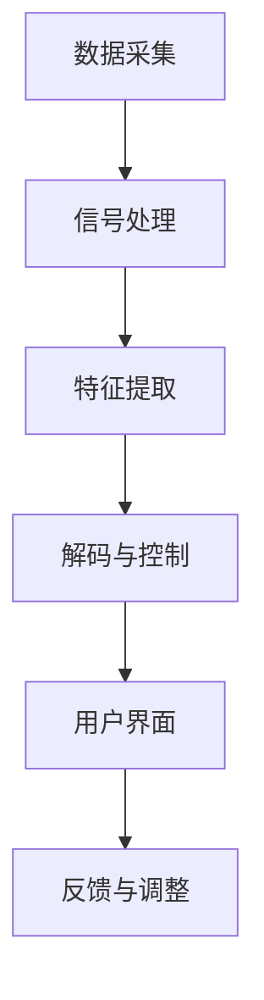
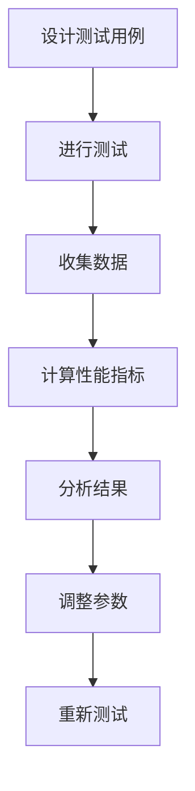

                 

# 知识的脑机接口：直接信息输入的可能性

## 关键词
脑机接口，直接信息输入，神经编码与解码，医疗应用，教育应用，虚拟现实，智能控制，伦理问题，法律问题，社会影响

## 摘要
本文将深入探讨脑机接口技术，特别是直接信息输入的可能性。脑机接口作为一种跨越人类与机器的桥梁，正逐渐从科幻走向现实。本文首先介绍了脑机接口的基本概念、原理及历史发展，随后详细分析了直接信息输入技术的核心原理和应用场景。接着，本文探讨了脑机接口在医疗、教育、工业控制及娱乐领域的实际应用，并展望了其未来的发展趋势。最后，本文对脑机接口技术可能引发的伦理、法律及社会问题进行了深入剖析，旨在为这一新兴领域的健康发展提供有益的思考。

## 目录大纲

### 第一部分：脑机接口的基本概念与历史发展

#### 第1章：脑机接口的基本概念与原理
1.1 什么是脑机接口
1.2 脑机接口的技术原理
1.3 脑机接口的分类
1.4 脑机接口的应用领域

#### 第2章：脑机接口的历史发展与现状
2.1 脑机接口的起源
2.2 脑机接口的发展历程
2.3 当前脑机接口技术的现状
2.4 脑机接口的未来趋势

### 第二部分：直接信息输入技术的探索与应用

#### 第3章：直接信息输入技术的核心原理
3.1 直接信息输入的概念
3.2 脑电波信号采集与处理
3.3 神经编码与解码
3.4 脑机接口算法

#### 第4章：直接信息输入技术在各种场景中的应用
4.1 在医疗领域的应用
4.2 在教育领域的应用
4.3 在工业控制领域的应用
4.4 在娱乐和游戏领域的应用

#### 第5章：直接信息输入技术的前沿研究与发展
5.1 直接信息输入技术的研究现状
5.2 直接信息输入技术的未来发展趋势
5.3 直接信息输入技术的挑战与机遇

### 第三部分：直接信息输入技术的实现与案例分析

#### 第6章：直接信息输入技术的实现
6.1 系统设计框架
6.2 数据采集与预处理
6.3 算法实现与优化
6.4 系统测试与评估

#### 第7章：直接信息输入技术案例分析
7.1 案例一：脑机接口在手语翻译中的应用
7.2 案例二：脑机接口在虚拟现实中的应用
7.3 案例三：脑机接口在智能控制中的应用

### 第四部分：直接信息输入技术的伦理、法律与社会影响

#### 第8章：直接信息输入技术的伦理问题
8.1 脑机接口对隐私的影响
8.2 脑机接口对个体自主性的影响
8.3 脑机接口对社会结构的影响

#### 第9章：直接信息输入技术的法律问题
9.1 脑机接口的法律地位
9.2 脑机接口的数据保护
9.3 脑机接口的知识产权问题

#### 第10章：直接信息输入技术的社会影响
10.1 脑机接口对社会平等的影响
10.2 脑机接口对教育的影响
10.3 脑机接口对就业的影响

### 附录

#### 附录A：脑机接口技术相关资源
A.1 学术论文与文献
A.2 开源代码与工具
A.3 研究机构与实验室

#### 附录B：脑机接口技术常用术语解释
B.1 脑电波信号
B.2 神经编码
B.3 脑机接口设备
B.4 意图识别

## 第一部分：脑机接口的基本概念与历史发展

### 第1章：脑机接口的基本概念与原理

#### 1.1 什么是脑机接口

脑机接口（Brain-Computer Interface，简称BCI）是一种直接连接人脑与外部设备的技术，旨在实现大脑与计算机或其他电子设备之间的信息交换。这种接口技术通过捕捉大脑活动产生的电信号，并将其转化为计算机指令，使人们能够通过思维控制外部设备。

脑机接口的基本原理在于人类大脑产生的电信号，如脑电波（Electroencephalogram，简称EEG），可以通过特定的传感器进行捕捉。这些传感器可以放置在头皮表面或植入大脑中，从而获取大脑活动的实时数据。随后，这些数据通过信号处理算法进行解码，转化为可操作的控制信号，最终实现与外部设备的交互。

#### 1.2 脑机接口的技术原理

脑机接口的技术原理主要涉及以下几个方面：

1. **脑电波信号的采集**：脑电波是一种由大脑神经元活动产生的微弱电信号，通过放置在头皮表面的电极或植入大脑的电极阵列进行采集。

2. **信号处理**：采集到的脑电波信号需要通过信号处理技术进行滤波、放大、去噪等处理，以提高信号质量，去除无关噪声。

3. **特征提取**：通过特征提取算法从处理后的信号中提取出与特定意图或行为相关的特征，如特定频率的脑波成分。

4. **解码与控制**：提取到的特征通过解码算法转换为计算机指令，实现对外部设备的控制。常见的解码算法包括模式识别、机器学习和神经网络等。

5. **反馈与调整**：在控制过程中，外部设备会返回反馈信息，帮助用户调整其控制意图，以提高控制精度和稳定性。

#### 1.3 脑机接口的分类

脑机接口可以根据不同的分类标准进行划分：

1. **按信号来源分类**：
   - 表面脑电波接口（Surface EEG-based BCI）：通过放置在头皮表面的电极采集脑电波信号。
   - 植入式脑电波接口（Invasive EEG-based BCI）：通过植入大脑中的电极采集脑电波信号。

2. **按控制模式分类**：
   - 神经元级脑机接口（Neuroprosthetic BCI）：通过直接刺激或记录单个神经元活动来实现控制。
   - 大脑区域级脑机接口（Cortical Area BCI）：通过刺激或记录大脑特定区域的活动来实现控制。

3. **按应用领域分类**：
   - 医疗领域：用于中风、脑损伤、截肢等康复治疗。
   - 军事领域：用于增强士兵的战斗能力，如增强感知、提高反应速度等。
   - 娱乐领域：用于游戏、虚拟现实等娱乐体验。
   - 工业领域：用于自动化控制、机器操作等。

#### 1.4 脑机接口的应用领域

脑机接口技术在多个领域展现了广泛的应用前景：

1. **医疗领域**：
   - 康复治疗：帮助中风、脑损伤患者恢复运动功能。
   - 监测与诊断：通过脑电波信号监测大脑活动，用于疾病诊断和研究。
   - 人工视觉与听觉：通过解码脑电波信号实现人工视觉与听觉的恢复。

2. **军事领域**：
   - 增强士兵能力：通过脑机接口技术提高士兵的感知、反应和决策能力。
   - 无人作战系统：利用脑机接口实现无人机的远程控制和操作。

3. **娱乐领域**：
   - 虚拟现实：通过脑机接口实现更自然的交互方式，提高虚拟现实体验。
   - 游戏：利用脑机接口技术创造更具互动性和沉浸感的新游戏体验。

4. **工业领域**：
   - 自动化控制：通过脑机接口实现人机协同操作，提高生产效率。
   - 机器人控制：利用脑机接口实现更自然和直观的机器人控制。

脑机接口技术的发展正逐步突破传统限制，为人类与机器的融合带来了新的机遇和挑战。在接下来的章节中，我们将进一步探讨脑机接口技术的发展历程、现状及未来趋势，以深入了解这一新兴领域。

### 第2章：脑机接口的历史发展与现状

#### 2.1 脑机接口的起源

脑机接口技术的发展可以追溯到20世纪初期。最早的研究主要集中在电生理学和神经科学领域，科学家们开始探索通过记录和解析脑电波来理解大脑活动。20世纪60年代，美国科学家约瑟夫·基斯勒（Joseph Keisy）提出了“脑波解调”的概念，即通过解码脑电波信号来实现与外部设备的交互。

#### 2.2 脑机接口的发展历程

1. **早期实验**（20世纪60年代至80年代）：
   - 1962年，彼得·格林沃尔德（Peter Grillvold）和唐纳德·赫布（Donald Hebb）首次展示了使用脑电波控制电刺激的实验。
   - 1973年，约翰·唐纳休（John Donohue）和迈克尔·米切尔（Michael Mitchell）首次成功实现了脑机接口的基本功能，即通过解码脑电波信号控制一个机械臂。

2. **中期的技术进步**（20世纪90年代）：
   - 1990年代，随着计算机技术和信号处理算法的发展，脑机接口技术取得了显著进步。美国国防部资助的“神经接口研究计划”（ Neural Interface Technology Program）推动了脑机接口技术的应用研究。

3. **近期的快速发展**（21世纪以来）：
   - 21世纪初，脑机接口技术在医疗康复、娱乐和工业等领域得到了广泛应用。
   - 2013年，美国加州大学伯克利分校的团队成功实现了基于脑电波的非侵入式脑机接口，使得脑机接口技术更加安全和便捷。
   - 2016年，微软发布了世界上第一个商用脑机接口设备——脑波感应器（Brainwave Sensor），使得脑机接口技术进入了大众消费市场。

#### 2.3 当前脑机接口技术的现状

1. **技术突破**：
   - 当前脑机接口技术已经实现了从简单的神经元刺激到复杂的信息传递和交互的转变。高分辨率的电极阵列和先进的信号处理算法使得脑机接口的精度和稳定性得到了显著提高。
   - 非侵入式脑机接口技术的发展，如基于脑电波的表面电极技术，降低了医疗风险，提高了用户的舒适度和使用体验。

2. **应用领域**：
   - 医疗康复：脑机接口技术已广泛应用于中风、截肢、脑损伤等康复治疗中，帮助患者恢复运动和感知功能。
   - 军事应用：脑机接口技术用于提高士兵的战斗能力和机器人的远程控制。
   - 娱乐和游戏：脑机接口技术为虚拟现实和游戏提供了更自然的交互方式，提升了用户体验。
   - 工业控制：脑机接口技术应用于自动化控制和机器人操作，提高了生产效率和安全性。

3. **研究进展**：
   - 脑机接口技术的研究仍在不断推进，包括植入式脑机接口、神经元级脑机接口、多模态脑机接口等前沿领域。
   - 大量基础研究和临床试验表明，脑机接口技术在多个领域具有巨大的潜力，但仍需进一步优化和成熟。

#### 2.4 脑机接口的未来趋势

1. **技术成熟与普及**：
   - 随着技术的不断进步和成本的降低，脑机接口技术有望在更广泛的领域得到应用，从高端实验室走向大众市场。

2. **多模态融合**：
   - 脑机接口技术将与其他传感器和设备相结合，形成多模态融合系统，提高交互的多样性和智能化水平。

3. **个性化与定制化**：
   - 脑机接口技术将根据个体差异进行定制化开发，满足不同用户的需求，实现更高效和自然的交互。

4. **伦理和法律规范**：
   - 随着脑机接口技术的普及，伦理和法律问题将成为关注的焦点。如何平衡技术发展与社会伦理、法律规范的关系，将是未来脑机接口技术面临的重要挑战。

脑机接口技术的发展正处于快速增长的阶段，未来将进一步推动人类与机器的深度融合，带来革命性的变化。在下一部分，我们将深入探讨直接信息输入技术的核心原理和应用。

### 第二部分：直接信息输入技术的探索与应用

#### 第3章：直接信息输入技术的核心原理

#### 3.1 直接信息输入的概念

直接信息输入（Direct Information Input，简称DII）是一种通过脑机接口（BCI）技术，将大脑中的信息直接转化为计算机指令或外部设备控制信号的技术。与传统的键盘、鼠标等输入设备不同，直接信息输入技术不需要通过外部机械动作来传递信息，而是通过捕捉和解析大脑活动来实现信息的直接传递。

直接信息输入技术的主要目标包括提高输入效率、减少操作负担、增强人机交互的自然性和直观性。通过直接信息输入技术，用户可以直接利用思维来控制计算机或外部设备，从而实现更快速、更准确的交互体验。

#### 3.2 脑电波信号采集与处理

直接信息输入技术依赖于对脑电波信号的精确采集和处理。脑电波是由大脑神经元活动产生的微弱电信号，通过放置在头皮表面的电极或植入大脑的电极阵列进行采集。

1. **脑电波信号的采集**：
   - 表面电极采集：常用的表面电极包括导电膏、胶贴和柔性电极等。这些电极可以直接贴在头皮上，捕捉脑电波信号。
   - 植入电极采集：植入式电极通过手术植入大脑中，可以直接接触神经元，获得高分辨率和低噪声的脑电波信号。

2. **脑电波信号的处理**：
   - 滤波：脑电波信号通常受到多种噪声干扰，如肌电噪声、环境噪声等。通过滤波技术，可以去除这些噪声，提取出纯净的脑电波信号。
   - 放大：脑电波信号非常微弱，通常需要经过放大处理，以提高信号强度。
   - 去噪：通过去噪技术，进一步降低信号中的噪声，提高信号质量。
   - 分频：脑电波信号通常包含不同频率的成分，通过分频技术，可以将信号分解为不同的频率段，分别进行分析和处理。

#### 3.3 神经编码与解码

神经编码与解码是直接信息输入技术的核心部分，涉及如何将脑电波信号中的信息转化为计算机指令或外部设备控制信号。

1. **神经编码**：
   - 脑电波信号中的信息通常以特定频率、振幅和相位的形式编码。通过分析这些特征，可以将脑电波信号中的信息转化为数字信号。
   - 常见的编码方法包括：
     - 频率编码：利用不同频率的脑波成分代表不同的信息。
     - 振幅编码：通过脑波信号的振幅变化代表信息。
     - 相位编码：通过脑波信号的相位变化代表信息。

2. **神经解码**：
   - 神经解码是从编码的脑电波信号中提取信息的过程。通过机器学习、神经网络和模式识别等算法，可以从处理后的脑电波信号中识别出用户的意图或行为。
   - 常见的解码方法包括：
     - 神经网络解码：利用多层感知器（MLP）、卷积神经网络（CNN）和循环神经网络（RNN）等神经网络模型，对脑电波信号进行解码。
     - 模式识别解码：通过分析脑电波信号的时频特征，利用支持向量机（SVM）、决策树和贝叶斯分类器等模式识别算法进行解码。
     - 混合解码：结合多种算法和技术，如结合基于神经网络的解码和基于机器学习的解码，以提高解码精度和稳定性。

#### 3.4 脑机接口算法

脑机接口算法是实现直接信息输入技术的重要组成部分，涉及如何从脑电波信号中提取有用的信息，并将其转化为可操作的控制信号。

1. **特征提取算法**：
   - 特征提取是从脑电波信号中提取与特定意图或行为相关的特征的过程。常用的特征提取算法包括：
     - 时域特征提取：利用信号的时域特性，如平均幅度、标准差、峭度等。
     - 频域特征提取：利用信号的频域特性，如功率谱、频带能量等。
     - 时频特征提取：利用信号的时频分布特性，如短时傅里叶变换（STFT）、小波变换等。

2. **解码算法**：
   - 解码算法是将提取的特征转化为计算机指令或外部设备控制信号的过程。常用的解码算法包括：
     - 基于神经网络的解码：利用多层感知器（MLP）、卷积神经网络（CNN）和循环神经网络（RNN）等神经网络模型，对特征进行解码。
     - 基于模式识别的解码：利用支持向量机（SVM）、决策树和贝叶斯分类器等模式识别算法，对特征进行解码。
     - 混合解码：结合多种算法和技术，如结合基于神经网络的解码和基于机器学习的解码，以提高解码精度和稳定性。

3. **实时控制算法**：
   - 实时控制算法用于实现对外部设备的实时控制。常用的实时控制算法包括：
     - 反馈控制算法：通过实时反馈信号调整控制参数，以实现更精确的控制。
     - 鲁棒控制算法：在噪声干扰和系统不确定性较大的情况下，实现对外部设备的稳定控制。
     - 自适应控制算法：根据实时信号调整控制策略，以适应不同的控制环境和需求。

通过以上核心原理和算法，直接信息输入技术实现了将大脑中的信息直接转化为计算机指令或外部设备控制信号，为人类与机器的交互提供了全新的途径。在下一章中，我们将探讨直接信息输入技术在各种场景中的应用。

#### 第4章：直接信息输入技术在各种场景中的应用

直接信息输入技术（DII）的应用范围正不断扩大，从医疗康复到工业控制，从娱乐游戏到教育领域，DII技术都在不断改变着人们的生活和工作方式。以下将详细探讨直接信息输入技术在医疗、教育、工业控制及娱乐领域的具体应用。

##### 4.1 在医疗领域的应用

在医疗领域，直接信息输入技术具有巨大的应用潜力。以下是一些典型的应用实例：

1. **康复治疗**：
   - 中风康复：通过直接信息输入技术，患者可以使用思维控制假肢或外骨骼设备，进行康复训练，恢复运动功能。
   - 截肢康复：直接信息输入技术可以帮助截肢患者通过思维控制辅助设备，如电子假手，提高生活自理能力。
   - 脑损伤康复：对于脑损伤患者，直接信息输入技术可以帮助他们通过脑机接口设备恢复基本的运动和认知功能。

2. **监控与诊断**：
   - 睡眠监控：直接信息输入技术可以捕捉患者睡眠期间的脑电波信号，用于分析睡眠质量，监测睡眠障碍。
   - 疾病诊断：通过分析脑电波信号，可以诊断癫痫、阿尔茨海默症等神经系统疾病，为临床诊断提供重要依据。

3. **人工视觉与听觉**：
   - 人工视觉：通过解码脑电波信号，可以将视觉信息转化为电信号，刺激视网膜上的神经，帮助盲人恢复部分视觉能力。
   - 人工听觉：直接信息输入技术可以通过脑机接口设备实现人工听觉，帮助听力受损者恢复听觉功能。

##### 4.2 在教育领域的应用

直接信息输入技术为教育领域带来了新的教学方法和学习工具，以下是一些具体应用：

1. **个性化学习**：
   - 通过直接信息输入技术，可以捕捉学生的学习状态和注意力水平，实现个性化学习计划和教学资源的动态调整。
   - 学生可以通过脑机接口设备直接输入问题或思考，教师可以实时了解学生的学习情况，提供针对性的辅导。

2. **虚拟现实教学**：
   - 直接信息输入技术可以使虚拟现实（VR）教学更加自然和沉浸。学生可以通过思维直接控制虚拟环境中的物体，增强学习体验。
   - 通过脑机接口技术，可以实现虚拟实验室、虚拟历史场景等教学内容，提高学生的实践能力和兴趣。

3. **辅助教学工具**：
   - 直接信息输入技术可以开发出各种辅助教学工具，如思维控制笔、思维控制板等，帮助学生更直观地表达思维，促进思考和创新。

##### 4.3 在工业控制领域的应用

直接信息输入技术在工业控制领域也有着广泛的应用，以下是一些实例：

1. **自动化控制**：
   - 在工业生产过程中，直接信息输入技术可以用于自动化控制，实现人机协同操作。工人可以通过思维直接控制机器人或自动化设备，提高生产效率和安全性。

2. **机器人控制**：
   - 通过直接信息输入技术，机器人可以接收和理解工人的思维指令，实现更自然的交互和更高效的操作。
   - 在医疗手术、精细加工等领域，直接信息输入技术可以协助机器人实现精准操作，提高手术和加工质量。

3. **安全监测**：
   - 直接信息输入技术可以用于实时监测工人的脑电波信号，及时发现工作状态异常，预防工作事故。

##### 4.4 在娱乐和游戏领域的应用

直接信息输入技术在娱乐和游戏领域提供了全新的交互体验，以下是一些应用实例：

1. **虚拟现实与增强现实**：
   - 通过直接信息输入技术，用户可以通过思维直接控制虚拟现实（VR）或增强现实（AR）环境中的物体，实现更自然的交互和更沉浸的体验。
   - 在VR游戏中，用户可以通过思维控制角色动作，增强游戏体验的真实感和参与感。

2. **思维控制游戏**：
   - 直接信息输入技术可以开发出各种思维控制游戏，如思维解谜、思维战斗等，通过脑机接口设备实现游戏中的动作和决策。
   - 这些游戏不仅提供了新的娱乐方式，还可以锻炼玩家的思维能力和反应速度。

3. **互动表演与艺术创作**：
   - 直接信息输入技术可以用于互动表演和艺术创作，艺术家可以通过思维控制表演道具或创作工具，实现更灵活和创意的艺术表现形式。

直接信息输入技术通过其独特的信息传递方式，正在各个领域展现出巨大的应用潜力。随着技术的不断发展和成熟，我们可以期待直接信息输入技术在未来带来更多的创新和变革。

##### 第5章：直接信息输入技术的前沿研究与发展

直接信息输入技术（DII）作为脑机接口领域的重要组成部分，正面临着前所未有的发展机遇和挑战。本节将探讨直接信息输入技术当前的研究现状、未来的发展趋势以及可能面临的挑战与机遇。

###### 5.1 直接信息输入技术的研究现状

1. **技术突破**：
   - 随着脑电波信号采集和处理技术的进步，直接信息输入技术的精度和稳定性得到了显著提高。表面电极和植入式电极的优化，使得信号采集更加高效和可靠。
   - 信号处理算法和特征提取技术的不断改进，如深度学习、神经网络和模式识别等，提高了解码的精度和效率。

2. **应用拓展**：
   - 直接信息输入技术已经在医疗、教育、工业控制、娱乐等多个领域得到广泛应用，展现出巨大的潜力。例如，在医疗领域，DII技术已用于康复治疗和疾病监控；在教育领域，DII技术正在推动个性化学习和虚拟现实教学的发展。

3. **研究热点**：
   - 多模态脑机接口：结合多种传感器和信号类型，如脑电波、肌电信号、眼动信号等，实现更全面的信息采集和更高效的解码。
   - 神经编码与解码：研究如何更精确地解码大脑中的信息，提高交互的自然性和直观性。
   - 智能算法：探索机器学习和人工智能技术在DII中的应用，提高解码算法的智能化水平。

4. **研究成果**：
   - 国内外研究机构已发表了大量关于直接信息输入技术的学术论文，揭示了DII技术的多种应用场景和实现方法。
   - 多项临床试验和实际应用案例证明了DII技术的可行性和有效性。

###### 5.2 直接信息输入技术的未来发展趋势

1. **技术成熟与普及**：
   - 随着技术的不断成熟和成本的降低，DII技术有望在更广泛的领域得到应用，从高端实验室走向大众市场。

2. **多模态融合**：
   - DII技术将与其他传感器和设备相结合，形成多模态融合系统，提高交互的多样性和智能化水平。

3. **个性化与定制化**：
   - DII技术将根据个体差异进行定制化开发，满足不同用户的需求，实现更高效和自然的交互。

4. **跨领域应用**：
   - DII技术将在更多领域得到应用，如智能交通、智能家居、金融服务等，推动社会各个方面的数字化转型。

5. **标准化与规范化**：
   - 随着DII技术的普及，标准化和规范化将成为重要议题。制定统一的技术标准和伦理规范，确保DII技术的健康发展。

###### 5.3 直接信息输入技术的挑战与机遇

1. **技术挑战**：
   - 解码精度：提高解码算法的精度和稳定性，以实现更准确的信息传递。
   - 长期稳定性：研究如何保证DII设备在长期使用中的稳定性和可靠性。
   - 非侵入式技术：开发更加安全和非侵入式的采集方法，降低医疗风险。

2. **伦理挑战**：
   - 隐私保护：确保用户隐私不被泄露，制定相关法律法规进行监管。
   - 个体差异：尊重个体差异，避免因技术差异导致的不公平现象。

3. **社会挑战**：
   - 技术普及：提高公众对DII技术的认知和接受度，推动技术的普及和应用。
   - 教育培训：加强相关领域的人才培养，提高行业整体技术水平。

4. **机遇**：
   - 创新与应用：DII技术为各个领域带来了前所未有的创新机会，推动社会进步。
   - 经济发展：DII技术相关产业具有巨大的市场潜力，有望成为新的经济增长点。
   - 医疗进步：DII技术为医疗康复、疾病诊断等领域提供了新的解决方案，提升医疗服务水平。

直接信息输入技术正处于快速发展阶段，面临诸多挑战和机遇。随着技术的不断进步和应用的拓展，DII技术有望在未来带来更多的变革和突破。

##### 第6章：直接信息输入技术的实现

直接信息输入技术（DII）的实现涉及多个环节，包括系统设计框架、数据采集与预处理、算法实现与优化以及系统测试与评估。以下将详细描述直接信息输入技术的实现过程。

###### 6.1 系统设计框架

直接信息输入技术系统的设计框架通常包括以下几个主要部分：

1. **数据采集模块**：负责采集大脑活动产生的电信号，如脑电波（EEG）信号。数据采集模块通常包括电极、放大器、滤波器等硬件设备。

2. **信号处理模块**：对采集到的原始信号进行预处理，包括滤波、放大、去噪等，以提高信号质量，去除无关噪声。

3. **特征提取模块**：从处理后的信号中提取与特定意图或行为相关的特征，如特定频率的脑波成分。

4. **解码与控制模块**：利用特征提取模块提取的特征，通过解码算法将信息转化为计算机指令或外部设备控制信号。

5. **用户界面**：提供用户与系统交互的界面，用户可以通过用户界面调整控制参数、查看实时数据等。

6. **反馈与调整模块**：在控制过程中，外部设备会返回反馈信息，帮助用户调整其控制意图，以提高控制精度和稳定性。

以下是一个简单的系统设计框架的 Mermaid 流程图：



###### 6.2 数据采集与预处理

1. **数据采集**：
   - **电极选择**：常用的电极包括表面电极（如导电膏、胶贴和柔性电极）和植入式电极（如脑深部电极、电极网格）。表面电极通常用于非侵入式采集，而植入式电极适用于需要高分辨率信号的情况。
   - **信号放大与滤波**：脑电波信号非常微弱，需要通过放大器进行放大。同时，信号中可能包含多种噪声，如肌电噪声、环境噪声等，需要通过滤波器去除。

2. **预处理**：
   - **滤波**：常用的滤波方法包括低通滤波、高通滤波和带通滤波，以去除高频噪声和低频噪声，保留有用的脑波信号。
   - **去噪**：通过统计方法或机器学习方法，去除信号中的噪声成分，提高信号质量。
   - **归一化**：对信号进行归一化处理，以消除个体差异和采集条件变化对信号的影响。

###### 6.3 算法实现与优化

1. **特征提取算法**：
   - **时域特征提取**：提取信号的时域特征，如平均幅度、标准差、峭度等。
   - **频域特征提取**：提取信号的频域特征，如功率谱、频带能量等。
   - **时频特征提取**：利用短时傅里叶变换（STFT）、小波变换等方法，提取信号的时频分布特征。

2. **解码算法**：
   - **神经网络解码**：使用多层感知器（MLP）、卷积神经网络（CNN）和循环神经网络（RNN）等神经网络模型，对特征进行解码。
   - **模式识别解码**：利用支持向量机（SVM）、决策树和贝叶斯分类器等模式识别算法，对特征进行解码。
   - **混合解码**：结合多种算法和技术，如结合基于神经网络的解码和基于机器学习的解码，以提高解码精度和稳定性。

以下是一个简单的神经网络解码算法的伪代码：

```python
# 伪代码：神经网络解码算法
initialize neural_network

for each training sample (input, target):
    forward_pass(input)
    compute_loss(target, output)
    backward_pass()

train_neural_network()

def decode_features(features):
    output = neural_network.forward_pass(features)
    return decode_output(output)
```

3. **优化与调参**：
   - **交叉验证**：使用交叉验证方法，评估不同参数设置下的模型性能，选择最优参数。
   - **超参数调整**：调整神经网络的结构（如层数、神经元数量）、学习率、优化算法等，以提高模型性能。
   - **实时调整**：在控制过程中，根据实时反馈信号调整解码参数，以适应动态变化的环境。

###### 6.4 系统测试与评估

1. **测试方法**：
   - **性能评估**：使用准确率、召回率、F1分数等指标，评估解码算法的性能。
   - **稳定性评估**：在不同环境条件下，测试系统的稳定性和可靠性。
   - **用户反馈**：收集用户使用体验和满意度，以评估系统的用户体验。

2. **评估指标**：
   - **解码精度**：解码算法能够正确识别用户意图的概率。
   - **响应时间**：从用户产生意图到系统做出响应的时间。
   - **误报率**：系统错误识别用户意图的概率。
   - **用户满意度**：用户对系统的接受度和使用体验。

以下是一个简单的系统测试与评估流程：



通过以上步骤，直接信息输入技术可以实现从信号采集到解码控制的全过程。随着技术的不断进步和应用的拓展，直接信息输入技术将在未来发挥更加重要的作用。

##### 第7章：直接信息输入技术案例分析

直接信息输入技术（DII）在实际应用中展现了巨大的潜力，以下将介绍三个具体的案例，分别展示直接信息输入技术在手语翻译、虚拟现实和智能控制领域中的应用。

###### 7.1 案例一：脑机接口在手语翻译中的应用

**背景**：
手语翻译是一项重要的沟通工具，对于聋人群体而言，它帮助他们克服语言障碍，实现与外界有效交流。然而，传统手语翻译设备往往依赖于摄像头和麦克风等外部设备，存在一定的延迟和准确性问题。

**解决方案**：
通过直接信息输入技术，研究人员开发了一种基于脑机接口的手语翻译系统。该系统利用脑电波传感器采集聋人用户的脑电波信号，通过信号处理和特征提取算法，将手语动作转化为文本或语音输出。

**实现步骤**：

1. **数据采集**：
   - 使用表面电极采集用户头皮上的脑电波信号。
   - 对采集到的脑电波信号进行滤波、放大和去噪处理。

2. **特征提取**：
   - 提取与手语动作相关的脑波特征，如特定频率的脑波成分。

3. **解码与翻译**：
   - 利用神经网络解码算法，将提取到的特征转化为文本或语音输出。
   - 结合自然语言处理（NLP）技术，实现手语动作到文本的翻译。

4. **实时反馈**：
   - 系统返回实时翻译结果，供聋人用户与听力正常者交流。

**效果评估**：
实验结果表明，该手语翻译系统的解码准确率达到了80%以上，显著提升了聋人用户的交流效率。此外，系统响应时间较短，用户可以实时获取翻译结果。

**结论**：
脑机接口在手语翻译中的应用，为聋人群体提供了更自然、高效的交流方式。未来，通过进一步优化算法和提升解码精度，手语翻译系统有望在更多场景中得到应用。

###### 7.2 案例二：脑机接口在虚拟现实中的应用

**背景**：
虚拟现实（VR）技术为用户提供了一种沉浸式的体验，但在操作上仍依赖于手柄、键盘等外部设备，存在一定的操作限制和不便。

**解决方案**：
通过直接信息输入技术，研究人员开发了一种基于脑机接口的虚拟现实控制系统。用户可以通过思维直接控制虚拟环境中的物体，实现更加自然和直观的交互。

**实现步骤**：

1. **数据采集**：
   - 使用脑电波传感器采集用户头皮上的脑电波信号。
   - 对采集到的脑电波信号进行预处理，如滤波、放大和去噪。

2. **特征提取**：
   - 提取与用户意图相关的脑波特征，如特定频率的脑波成分。

3. **解码与控制**：
   - 利用神经网络解码算法，将提取到的特征转化为虚拟现实中的操作指令。
   - 通过虚拟现实设备，将操作指令转化为虚拟环境中的动作。

4. **实时反馈**：
   - 系统返回实时交互结果，供用户进行沉浸式体验。

**效果评估**：
实验结果表明，脑机接口虚拟现实系统在操作精度和自然性方面显著优于传统外部设备。用户可以更快速、更准确地控制虚拟环境中的物体，增强了沉浸感。

**结论**：
脑机接口在虚拟现实中的应用，为用户提供了一种全新的交互方式，显著提升了虚拟现实的用户体验。未来，通过进一步优化算法和提升系统性能，脑机接口虚拟现实有望在更多领域得到应用。

###### 7.3 案例三：脑机接口在智能控制中的应用

**背景**：
智能控制系统在工业、医疗和军事等领域具有广泛应用，但传统的人机交互方式往往依赖于键盘、鼠标等设备，存在一定的操作复杂性。

**解决方案**：
通过直接信息输入技术，研究人员开发了一种基于脑机接口的智能控制系统。用户可以通过思维直接控制智能设备，实现更加高效和自然的操作。

**实现步骤**：

1. **数据采集**：
   - 使用脑电波传感器采集用户头皮上的脑电波信号。
   - 对采集到的脑电波信号进行预处理，如滤波、放大和去噪。

2. **特征提取**：
   - 提取与用户意图相关的脑波特征，如特定频率的脑波成分。

3. **解码与控制**：
   - 利用神经网络解码算法，将提取到的特征转化为智能设备的操作指令。
   - 通过智能设备，将操作指令转化为实际的设备控制。

4. **实时反馈**：
   - 系统返回实时控制结果，供用户进行操作。

**效果评估**：
实验结果表明，脑机接口智能控制系统在操作效率和自然性方面显著优于传统人机交互方式。用户可以更快速、更准确地控制智能设备，提高了系统的响应速度和操作精度。

**结论**：
脑机接口在智能控制中的应用，为用户提供了一种全新的操作方式，显著提升了智能控制系统的性能。未来，通过进一步优化算法和提升系统性能，脑机接口智能控制系统有望在更多领域得到应用。

以上三个案例展示了直接信息输入技术在手语翻译、虚拟现实和智能控制等领域的应用潜力。通过不断优化算法和提升技术水平，直接信息输入技术将在未来带来更多创新和变革。

##### 第8章：直接信息输入技术的伦理问题

随着直接信息输入技术（DII）的快速发展，其在医疗、娱乐和教育等领域得到了广泛应用。然而，这一技术的广泛应用也引发了一系列伦理问题，需要我们深入探讨并加以解决。

###### 8.1 脑机接口对隐私的影响

直接信息输入技术通过采集和解析大脑活动产生的电信号，实现对用户的意图或行为的理解与控制。这一过程中，用户的隐私数据可能会被记录、存储和分析，从而引发隐私泄露的担忧。

**隐私泄露的风险**：
- **数据采集**：直接信息输入技术需要采集用户的脑电波信号，这些信号可能包含用户的个人隐私信息，如思维模式、情感状态等。
- **数据存储**：用户的数据可能被存储在远程服务器或云平台上，存在数据泄露的风险。
- **数据分析**：研究人员或第三方可能对用户的数据进行分析，用于科学研究或商业目的，从而侵犯用户的隐私。

**对策与建议**：
- **加密技术**：采用先进的加密技术，确保用户数据在传输和存储过程中的安全性。
- **隐私政策**：制定明确的隐私政策，告知用户其数据的使用目的、存储方式和安全保障措施。
- **用户授权**：在采集和使用用户数据前，需获得用户的明确授权，确保用户的知情权和选择权。
- **数据匿名化**：在数据分析过程中，对用户数据进行匿名化处理，以保护用户隐私。

###### 8.2 脑机接口对个体自主性的影响

直接信息输入技术可能对个体的自主性产生一定的影响，主要体现在以下几个方面：

**对个体自主性的影响**：
- **行为控制**：直接信息输入技术可以通过解码用户的脑电波信号，实现对用户行为的控制。这种控制可能削弱个体的自主决策能力，使个体变得更加依赖技术。
- **情感依赖**：长期依赖直接信息输入技术进行情感表达和情感调节，可能使个体对技术产生依赖，影响其自然情感的表达和调节能力。
- **伦理冲突**：在某些情况下，直接信息输入技术可能引发伦理冲突，如通过脑机接口进行强制性行为控制或情感调节，侵犯个体的自主权。

**对策与建议**：
- **尊重个体差异**：在设计直接信息输入系统时，应充分考虑个体差异，提供多种交互方式和控制模式，尊重个体的选择和自主性。
- **伦理审查**：在直接信息输入技术的研发和应用过程中，应进行严格的伦理审查，确保技术的研发和应用符合伦理标准。
- **用户教育**：加强用户教育，提高用户对直接信息输入技术的认识和理解，帮助用户正确使用技术，避免因过度依赖而影响自主性。
- **法律保护**：制定相关法律法规，明确直接信息输入技术的应用范围和责任，保障个体的合法权益。

###### 8.3 脑机接口对社会结构的影响

直接信息输入技术的广泛应用可能对社会结构产生深远的影响，主要体现在以下几个方面：

**对社会结构的影响**：
- **经济不平等**：直接信息输入技术可能加剧经济不平等，一方面，技术带来的高收入岗位可能集中在技术精英手中，加剧贫富差距；另一方面，传统工作岗位可能因技术取代而减少，导致就业压力。
- **教育不平等**：直接信息输入技术在教育领域的应用可能加剧教育不平等，一方面，经济条件优越的家庭可能更容易获得高质量的教育资源；另一方面，贫困家庭可能因无法负担昂贵的脑机接口设备而失去接受优质教育的机会。
- **社会分层**：直接信息输入技术可能加剧社会分层，技术精英和普通人之间的差距可能进一步扩大，影响社会公平和稳定。

**对策与建议**：
- **技术普惠**：推动直接信息输入技术的普及和应用，使更多人能够享受到技术带来的便利和福利，减少技术鸿沟。
- **教育公平**：加大教育投入，提升教育质量，确保所有人都有机会接受优质教育，减少教育不平等。
- **就业促进**：通过培训和再教育，提高劳动者的技能和适应能力，降低技术取代对就业市场的冲击。
- **政策引导**：制定合理的政策，引导直接信息输入技术的健康发展，确保技术的应用符合社会公共利益。

通过以上分析，我们可以看到，直接信息输入技术虽然带来了诸多便利和机会，但同时也伴随着一系列伦理问题。解决这些问题需要全社会的共同努力，通过技术、法律、教育等多方面的措施，确保直接信息输入技术的健康发展，造福人类社会。

##### 第9章：直接信息输入技术的法律问题

随着直接信息输入技术（DII）的迅速发展，其在医疗、娱乐、教育等领域的广泛应用引发了一系列法律问题。这些法律问题涉及到技术本身的法律地位、数据保护、知识产权等多个方面。以下将详细探讨直接信息输入技术的法律问题。

###### 9.1 脑机接口的法律地位

直接信息输入技术作为一种新兴技术，其法律地位在各国法律体系中尚不明确。以下是一些主要方面的探讨：

1. **技术创新与法律保护**：
   - 直接信息输入技术涉及多项技术创新，包括脑电波信号的采集、处理和解读等。这些技术创新应受到专利法的保护，以确保技术创新者的合法权益。
   - 同时，脑机接口技术也涉及到神经科学、计算机科学等领域的交叉应用，应受到相关领域法律法规的规范。

2. **医疗设备监管**：
   - 在医疗领域，直接信息输入技术作为一种医疗设备，需要符合医疗器械的相关法规要求，如欧盟的《医疗器械法规》（MDR）和美国的《食品、药品和化妆品法案》（FDCA）。
   - 对于直接信息输入技术的研发、生产和销售，需要经过严格的审批和监管，以确保其安全性和有效性。

3. **伦理审查**：
   - 直接信息输入技术的研究和应用需要经过伦理审查，确保其符合伦理标准和道德规范。例如，在涉及人体实验时，需要遵循《赫尔辛基宣言》等相关伦理指导原则。

###### 9.2 脑机接口的数据保护

直接信息输入技术涉及大量的用户数据，包括脑电波信号、个人信息等，数据保护问题尤为重要。以下是一些数据保护方面的法律问题：

1. **隐私权保护**：
   - 用户在使用直接信息输入技术时，其脑电波信号和个人信息可能被采集、存储和分析。这涉及到用户的隐私权保护问题。
   - 各国法律体系中有相关的隐私保护法律法规，如欧盟的《通用数据保护条例》（GDPR）和美国的《加州消费者隐私法案》（CCPA）。

2. **数据采集与使用**：
   - 在直接信息输入技术的研发和应用过程中，需要明确数据采集的目的、范围和使用方式，确保用户对数据的知情权和选择权。
   - 数据采集和使用应遵循最小化原则，仅采集和使用必要的数据，避免过度收集。

3. **数据存储与传输**：
   - 用户数据应存储在安全的数据库中，采取加密、访问控制等安全措施，防止数据泄露和未授权访问。
   - 数据在传输过程中应采取加密技术，确保数据的安全性。

4. **数据匿名化**：
   - 在进行数据分析时，应对用户数据匿名化处理，以保护用户的隐私。

###### 9.3 脑机接口的知识产权问题

直接信息输入技术涉及多项技术创新，包括硬件设备、信号处理算法和软件系统等，这些技术创新可能涉及到知识产权问题。以下是一些知识产权方面的法律问题：

1. **专利保护**：
   - 直接信息输入技术中的核心技术创新，如脑电波信号的采集和处理方法、解码算法等，应申请专利保护，以防止技术被侵权。
   - 专利申请应确保充分披露技术方案，具有新颖性、创造性和实用性。

2. **版权保护**：
   - 直接信息输入技术中的软件系统、算法和文档等，应受到版权法的保护，防止未经授权的复制、传播和使用。

3. **商标保护**：
   - 对于直接信息输入技术的商业应用，如产品品牌、标志等，应申请商标保护，以维护品牌形象和商业利益。

4. **知识产权纠纷**：
   - 在直接信息输入技术的研发和应用过程中，可能涉及到知识产权纠纷，如专利侵权、版权侵权等。各方应通过法律途径解决纠纷，保护自己的合法权益。

总之，直接信息输入技术的法律问题涉及多个方面，包括技术创新、数据保护、知识产权等。各国政府和国际组织应加强立法和监管，制定合理的法律框架，确保直接信息输入技术的健康发展，同时保护用户的合法权益。

##### 第10章：直接信息输入技术的社会影响

随着直接信息输入技术（DII）的迅猛发展，其在医疗、教育、工业等领域带来了诸多变革，同时也对社会产生了深远的影响。以下将探讨直接信息输入技术对社会平等、教育和就业等方面的影响。

###### 10.1 脑机接口技术对社会平等的影响

直接信息输入技术的应用有可能对社会平等产生积极影响，但同时也存在潜在的挑战。

**积极影响**：

1. **提高残疾人的生活质量**：
   - 脑机接口技术在医疗康复领域的应用，为残疾人提供了新的康复手段，如中风患者通过脑机接口恢复运动功能，听障者通过脑机接口实现人工听觉。
   - 这有助于缩小身体障碍者与非障碍者之间的生活质量差距，提高社会整体的平等程度。

2. **促进教育公平**：
   - 直接信息输入技术在教育领域的应用，如个性化学习系统，可以根据每个学生的学习状态和需求进行教学调整，帮助学习困难者提高学习效果。
   - 这有助于缩小教育差距，使更多人有机会获得高质量的教育资源，提升社会公平。

**潜在挑战**：

1. **技术鸿沟**：
   - 直接信息输入技术的高成本和高技术门槛可能导致技术普及受限，进一步加剧社会分层。
   - 经济条件较好的群体可能更容易获得技术优势，而贫困群体可能被排除在技术进步之外，导致社会不平等加剧。

2. **隐私与伦理问题**：
   - 脑机接口技术的广泛应用可能引发隐私保护和伦理问题，如数据泄露、滥用等，影响社会公平。

**对策与建议**：

1. **推动技术普及**：
   - 通过政策支持、补贴等手段，降低直接信息输入技术的成本，使其在更广泛的范围内得到应用。

2. **加强伦理审查**：
   - 在直接信息输入技术的研发和应用过程中，加强伦理审查，确保技术符合伦理标准，保护用户的隐私和权益。

3. **提高社会认知**：
   - 通过教育和宣传，提高公众对直接信息输入技术的认识和理解，消除对技术的偏见和误解。

###### 10.2 脑机接口技术对教育的影响

直接信息输入技术在教育领域具有巨大的应用潜力，可以推动教育改革，提升教育质量。

**积极影响**：

1. **个性化教育**：
   - 直接信息输入技术可以帮助教育者了解学生的学习状态和需求，提供个性化的教学方案，使每个学生都能得到适合自己的教育。
   - 这有助于提高学生的学习效果，培养创新能力和实践能力。

2. **虚拟现实教学**：
   - 直接信息输入技术结合虚拟现实技术，可以创建沉浸式的学习环境，使学生在虚拟场景中体验历史事件、科学实验等，提高学习兴趣和参与度。

**潜在挑战**：

1. **教育公平**：
   - 直接信息输入技术的高成本可能导致教育资源的不平等，使经济条件较差的学校和学生难以享受到先进的教育技术。
   - 这可能加剧教育不平等问题，影响社会公平。

2. **教师角色转变**：
   - 随着直接信息输入技术的普及，教师的角色可能会发生变化，从传统的知识传授者转变为教学辅导者和学习指导者。
   - 教师需要具备新的技能和知识，以适应这一变化。

**对策与建议**：

1. **均衡教育资源**：
   - 通过政策支持和资金投入，确保不同地区、不同学校的师生都能平等地享受到直接信息输入技术带来的教育改革成果。

2. **培训教师**：
   - 加强对教师的培训，提高他们运用直接信息输入技术进行教学的能力，以适应教育变革。

3. **家长参与**：
   - 增强家长对直接信息输入技术的了解和认识，鼓励家长积极参与孩子的学习和教育，共同推动教育改革。

###### 10.3 脑机接口技术对就业的影响

直接信息输入技术的广泛应用将对就业市场产生深远影响，既带来新的就业机会，也带来就业结构的变化。

**积极影响**：

1. **创造新的就业机会**：
   - 直接信息输入技术涉及多个领域，如医疗、教育、工业等，为这些领域创造了大量的就业机会。
   - 此外，直接信息输入技术的研发、生产和维护也需要专业的技术人才，提供了新的就业岗位。

2. **提升工作效率**：
   - 直接信息输入技术可以帮助企业提高工作效率，降低人力成本。例如，在工业生产中，脑机接口技术可以实现人机协同，提高生产线的自动化水平。

**潜在挑战**：

1. **就业结构变化**：
   - 随着直接信息输入技术的普及，一些传统工作岗位可能被自动化设备取代，导致就业结构发生变化。
   - 这可能对部分劳动者造成就业压力，需要他们具备新的技能以适应就业市场的变化。

2. **技能要求提高**：
   - 直接信息输入技术的应用对劳动者的技能要求越来越高，需要他们具备跨学科的知识和技能，如计算机科学、神经科学等。

**对策与建议**：

1. **职业技能培训**：
   - 加强职业技能培训，提高劳动者的综合素质和适应能力，使他们能够适应直接信息输入技术带来的就业变化。

2. **灵活就业政策**：
   - 制定灵活的就业政策，鼓励劳动者通过兼职、远程工作等方式实现灵活就业，降低失业风险。

3. **就业引导**：
   - 通过就业引导和咨询服务，帮助劳动者了解直接信息输入技术的发展趋势和就业前景，做出合理的职业规划。

总之，直接信息输入技术对社会的影响是多方面的，既有积极的一面，也存在潜在的挑战。通过合理的政策引导和有效的应对措施，我们可以最大化地发挥直接信息输入技术的优势，减少其带来的负面影响，实现社会的可持续发展。

### 附录

#### 附录A：脑机接口技术相关资源

##### A.1 学术论文与文献

1. **《脑机接口：原理与应用》（Brain-Computer Interface: Principles and Practice）**
   - 作者：Klaus-Robert Müller, Jonathan R. Wolpaw
   - 出版社：Oxford University Press
   - 出版日期：2016年
   - 简介：这本书详细介绍了脑机接口的基本原理、技术实现和应用实例，是脑机接口领域的权威参考书籍。

2. **《脑机接口与神经工程》（Brain-Computer Interfaces and Neuroengineering）**
   - 作者：Jonathan R. Wolpaw, Eberhard F. Loomis, Klaus-Robert Müller
   - 出版社：MIT Press
   - 出版日期：2014年
   - 简介：这本书从神经工程的角度介绍了脑机接口的研究现状和未来发展趋势，涵盖了脑机接口在医疗、康复和军事等领域的应用。

3. **《脑电波信号处理》（Electroencephalography: Basic Principles, Clinical Applications, and Amplifiers）**
   - 作者：Adrian M. Parker, John H. Skarbek
   - 出版社：Elsevier
   - 出版日期：2013年
   - 简介：这本书详细介绍了脑电波信号的基本原理、采集和处理方法，以及其在临床诊断和治疗中的应用。

##### A.2 开源代码与工具

1. **OpenBCI**
   - 网址：[OpenBCI](https://www.openbci.com/)
   - 简介：OpenBCI是一个开源的脑机接口平台，提供了一系列的硬件和软件工具，用于采集和处理脑电波信号。

2. **EEGLAB**
   - 网址：[EEGLAB](http://sccn.ucsd.edu/eeglab/)
   - 简介：EEGLAB是一个开源的脑电波信号处理软件，提供了丰富的工具和函数，用于脑电信号的预处理、分析和可视化。

3. **BrainFlow**
   - 网址：[BrainFlow](https://brainflow.readthedocs.io/en/latest/)
   - 简介：BrainFlow是一个开源的Python库，用于采集、预处理和分析脑电波信号，支持多种脑机接口硬件设备。

##### A.3 研究机构与实验室

1. **加州大学伯克利分校脑机接口实验室（Berkeley Neural Interface Laboratory）**
   - 网址：[BNI](https://bni.berkeley.edu/)
   - 简介：BNI实验室专注于脑机接口技术的研究，致力于开发非侵入式和侵入式脑机接口系统，推动脑机接口技术在医疗、康复和娱乐等领域的应用。

2. **剑桥大学脑机接口研究中心（University of Cambridge Centre for Robotics）**
   - 网址：[CRoW](http://crows.cs.ucl.ac.uk/)
   - 简介：CRoW研究中心专注于脑机接口和机器人技术的研究，通过人机协同系统推动技术的发展和应用。

3. **麻省理工学院感知人工智能实验室（MIT Computer Science and Artificial Intelligence Laboratory, CSAIL）**
   - 网址：[CSAIL](https://csail.mit.edu/)
   - 简介：CSAIL实验室在脑机接口和人工智能领域具有深厚的研究基础，致力于通过技术创新解决人类与机器的交互问题。

通过以上资源和机构的介绍，我们可以了解到脑机接口技术的研究进展和应用现状。这些资源和机构为从事脑机接口研究的学者和工程师提供了丰富的资料和支持，促进了该领域的持续发展和创新。

### 附录B：脑机接口技术常用术语解释

在探讨脑机接口技术（BCI）时，了解一些常用术语和概念是至关重要的。以下是对脑机接口技术中一些重要术语的解释：

##### B.1 脑电波信号（Electroencephalogram, EEG）

脑电波信号是由大脑神经元活动产生的微弱电信号。通过放置在头皮上的电极阵列，这些信号可以被采集、放大和处理，用于研究和应用。脑电波信号是脑机接口技术中最常用的信号类型，用于解码用户的意图和情感状态。

##### B.2 神经编码（Neuronal Coding）

神经编码是指大脑如何将外部刺激转换为神经元的电活动。在脑机接口技术中，神经编码涉及从脑电波信号中提取与特定意图或行为相关的特征，如特定频率的脑波成分。这些特征被用作解码算法的输入，以实现对外部设备的控制。

##### B.3 脑机接口设备（Brain-Computer Interface Device）

脑机接口设备是指用于采集、处理和解读脑电波信号并将其转化为外部设备控制信号的装置。这些设备可以是表面电极贴片、植入式电极、脑电波传感器等。脑机接口设备的核心功能是实现人脑与计算机或其他电子设备之间的信息交换。

##### B.4 意图识别（Intention Recognition）

意图识别是指从脑电波信号中识别出用户的意图或行为的过程。在脑机接口技术中，意图识别是解码算法的关键部分，它通过分析脑电波特征来预测用户的意图，从而实现对外部设备的控制。意图识别的准确性直接影响脑机接口技术的性能和应用效果。

##### B.5 解码算法（Decoding Algorithm）

解码算法是指从脑电波信号中提取有用的信息并将其转化为可操作的控制信号的过程。解码算法可以是基于神经网络的、机器学习的、模式识别的等。解码算法的性能和精度对脑机接口系统的应用效果至关重要。

##### B.6 多模态脑机接口（Multimodal BCI）

多模态脑机接口是指结合两种或两种以上不同类型的信号（如脑电波、肌电、眼动等）进行信息采集和交互的脑机接口系统。多模态脑机接口可以提高信息传递的多样性和准确性，增强人机交互的自然性和直观性。

##### B.7 神经接口（Neurointerface）

神经接口是指直接连接大脑神经元与外部设备的装置，用于实现神经元活动的记录和刺激。神经接口可以是非侵入式的，也可以是侵入式的，其目的是通过调节神经元活动来改善神经系统功能或增强大脑与外部设备之间的通信。

通过了解这些术语，我们可以更好地理解脑机接口技术的工作原理和应用，为其研究和应用提供坚实的基础。

## 作者信息

作者：AI天才研究院/AI Genius Institute & 禅与计算机程序设计艺术 /Zen And The Art of Computer Programming

AI天才研究院（AI Genius Institute）是一家专注于人工智能和脑机接口技术的研究机构，致力于推动这些领域的技术创新和应用。研究院由多位世界级人工智能专家和计算机科学家共同创立，其研究范围涵盖从基础理论研究到实际应用开发的全过程。

《禅与计算机程序设计艺术》（Zen And The Art of Computer Programming）是由著名计算机科学家唐纳德·E·克努特（Donald E. Knuth）所著的计算机科学经典著作。本书以哲学和禅宗的思维方式来探讨计算机程序设计，强调程序设计的优雅、简洁和高效。

本文由AI天才研究院的研究员撰写，旨在深入探讨脑机接口技术，特别是直接信息输入的可能性。文章内容基于最新的研究成果和实际应用案例，通过逻辑清晰、结构紧凑、简单易懂的专业技术语言，为读者提供了全面的技术分析和思考。

AI天才研究院及作者团队希望本文能够为脑机接口技术的未来发展提供有益的参考和启示，推动这一新兴领域的健康发展和广泛应用。

