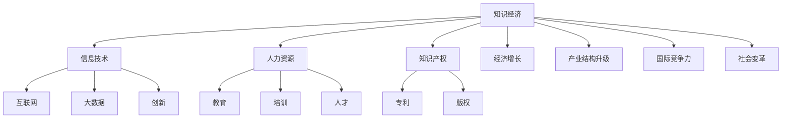

                 

# 第1章：知识经济时代概述

## 1.1 知识经济的定义与发展历程

知识经济，作为一个新兴的经济形态，其定义和概念源于20世纪末的信息革命。知识经济被广泛定义为基于知识和信息的生产、分配和使用，以人力资源为核心动力，以创新为关键要素的经济体系（OECD，1996）。这一概念的核心在于，知识的创造和传播成为推动经济增长的主要动力，取代了传统的自然资源和资本。

### 1.1.1 知识经济的定义

知识经济不仅仅是一个经济术语，它代表了社会经济活动的一种新方式。在知识经济中，知识被视为一种生产要素，与土地、劳动力、资本等传统生产要素并驾齐驱。知识经济强调知识的创造、存储、传播和利用，认为这些活动是经济增长和社会进步的关键驱动力。

### 1.1.2 知识经济的发展历程

知识经济的发展历程可以划分为以下几个阶段：

- **萌芽阶段（20世纪80年代）**：随着信息技术的发展，知识的生产和传播开始得到重视。
- **发展阶段（20世纪90年代）**：知识经济逐渐成为全球经济的重要组成部分，信息技术和通信技术的迅猛发展为其提供了强大的支持。
- **成熟阶段（21世纪初至今）**：知识经济已经成为全球经济的主要动力，许多国家将其作为提升国家竞争力的重要战略。

### 1.1.3 知识经济的核心特征

知识经济的核心特征包括：

- **知识为核心**：知识成为经济增长的主要动力，企业通过知识的创新和利用来提升竞争力。
- **创新驱动**：知识经济的本质在于创新，只有不断推动技术创新、管理创新和商业模式创新，才能保持持续的发展。
- **高附加值**：知识经济的产品和服务具有较高的附加值，它们往往基于知识的深度和广度，能够创造更多的价值。
- **全球化**：知识经济的全球化特征使得知识和信息可以跨越国界迅速传播，促进了全球经济的深度融合。

## 1.2 知识经济的核心特征与影响

知识经济的核心特征不仅体现在其定义中，还体现在其对经济、社会和企业发展的深远影响上。

### 1.2.1 核心特征

- **知识创新**：知识经济强调知识的创造和更新，知识的不断创新是企业保持竞争力的重要手段。
- **信息技术**：信息技术在知识经济中发挥着关键作用，它们使得知识的传播和利用更加高效。
- **人力资源**：人力资源是知识经济的核心资源，高素质的人才能够创造和利用知识，推动经济发展。
- **知识产权**：知识产权保护是知识经济的重要基石，它保障了知识创造者的权益，促进了知识的创新和传播。

### 1.2.2 对经济的影响

知识经济对经济发展产生了深远的影响：

- **增长动力**：知识经济成为经济增长的主要动力，其高附加值的产品和服务推动了经济的持续增长。
- **产业结构**：知识经济的发展推动了产业结构的升级，知识密集型产业逐渐成为主导产业。
- **国际竞争力**：知识经济使得国家间的竞争从传统的资源、劳动力等要素转向知识和创新能力。

### 1.2.3 对社会的影响

知识经济对社会的影响同样显著：

- **教育水平**：知识经济对教育提出了更高的要求，促进了教育水平的提高和知识的普及。
- **就业结构**：知识经济带来了就业结构的变化，对专业技能和工作经验的需求增加。
- **生活方式**：知识经济改变了人们的生活方式，信息获取和知识传播更加便捷，生活方式更加多样化。

### 1.2.4 对企业的影响

知识经济对企业的影响主要体现在以下几个方面：

- **创新战略**：企业需要制定有效的创新战略，以适应知识经济的要求，保持竞争力。
- **管理模式**：企业需要建立适应知识经济的管理模式，注重知识的管理和利用。
- **商业模式**：企业需要不断创新商业模式，通过知识的创新和传播来获取竞争优势。

## 1.3 知识经济的时代背景与国际趋势

知识经济的崛起并非孤立现象，它受到全球经济、技术和社会环境的共同影响。了解知识经济的时代背景和国际趋势，有助于我们更好地把握其发展脉络。

### 1.3.1 知识经济的时代背景

知识经济的时代背景主要包括以下几个方面：

- **全球化**：全球化进程加速，国家之间的经济联系更加紧密，知识传播和共享更加便捷。
- **信息化**：信息技术的迅猛发展，尤其是互联网和移动通信技术的普及，极大地提高了知识的传播速度和范围。
- **创新驱动**：各国政府纷纷将创新作为国家战略，推动科技创新和产业升级。
- **知识共享**：知识共享和开放创新成为主流，促进了全球知识合作与发展。

### 1.3.2 国际知识经济趋势

全球知识经济的发展呈现出以下趋势：

- **数字经济的崛起**：数字经济在知识经济中占据越来越重要的地位，数据成为新的生产要素，大数据、云计算等新技术得到广泛应用。
- **知识产权的重要性**：知识产权保护日益受到重视，各国纷纷加强知识产权保护，以促进知识创新和传播。
- **知识产业的发展**：知识产业成为全球经济的重要组成部分，教育、科研、咨询等行业得到快速发展。
- **开放创新**：开放创新模式得到推广，企业、高校、研究机构等通过合作共享知识资源，推动创新成果的转化和应用。

## 总结

知识经济时代已经到来，它带来了经济增长的新动力，改变了社会结构和企业的运营模式。理解知识经济的核心特征、影响和时代背景，对于把握其发展趋势和制定发展战略具有重要意义。在接下来的章节中，我们将进一步探讨知识付费的基本概念、商业模式创新以及国内外成功案例，帮助读者更全面地了解知识经济时代下的知识付费生态。

### 核心概念与联系

知识经济是现代经济体系中的一个核心概念，它与信息技术、人力资源、知识产权等多个概念紧密相关。以下是一个Mermaid流程图，展示了知识经济中的核心概念及其相互关系：



这个流程图清晰地展示了知识经济的核心概念及其相互关系。信息技术（B）为知识经济提供了强大的支持，包括互联网（E）和大数据（F）；人力资源（C）是知识经济的重要资源，包括教育（G）和培训（H）；知识产权（D）保护了知识创造者的权益，包括专利（I）和版权（J）。这些概念共同构成了知识经济的基本架构，推动了经济的增长（M）、产业结构的升级（N）、国际竞争力的提升（O）以及社会的变革（P）。

### 核心算法原理讲解

在知识经济中，数据的处理和分析是关键环节。以下是一个用于数据分析的核心算法原理的伪代码示例，该算法基于大数据分析技术，实现了用户行为的预测和个性化推荐：

```pseudo
// 输入：用户行为数据集 user_data，包括用户的浏览记录、购买历史和评价数据
// 输出：用户行为预测结果 prediction，包括用户可能感兴趣的知识产品推荐

// 初始化预测结果 prediction 为空列表
prediction = []

// 步骤 1：数据预处理
// 将用户行为数据集转换为矩阵形式，便于后续分析
user_behavior_matrix = preprocess_user_data(user_data)

// 步骤 2：特征提取
// 提取用户行为数据中的关键特征，如浏览频次、购买次数、评价评分等
features = extract_features(user_behavior_matrix)

// 步骤 3：建立预测模型
// 使用机器学习算法（如协同过滤、决策树等）建立预测模型
model = build_prediction_model(features)

// 步骤 4：预测用户行为
// 对每个用户的行为进行预测，生成推荐列表
for user in user_data:
    prediction.append(model.predict(user))

// 步骤 5：个性化推荐
// 对预测结果进行筛选和排序，生成个性化的推荐列表
recommendation_list = personalized_recommendation(prediction)

// 输出推荐列表
return recommendation_list
```

这段伪代码展示了如何通过机器学习算法对用户行为进行预测和推荐。具体步骤包括数据预处理、特征提取、建立预测模型、预测用户行为和个性化推荐。数据预处理是将用户行为数据转换为矩阵形式，以便进行后续分析。特征提取是从用户行为数据中提取关键特征，如浏览频次、购买次数和评价评分等。建立的预测模型可以使用协同过滤、决策树等算法。预测用户行为是根据预测模型生成用户可能感兴趣的知识产品推荐。最后，对预测结果进行筛选和排序，生成个性化的推荐列表。

### 数学模型和公式

在知识经济中，数据分析和建模是关键步骤。以下是一个用于描述用户行为预测的数学模型，包括相关的公式和解释：

$$
\text{预测模型} = \text{f}(\text{特征向量}, \text{权重向量})
$$

**公式解释**：

- **特征向量**（Feature Vector）：表示用户行为数据中的关键特征，如浏览频次、购买次数和评价评分等。
- **权重向量**（Weight Vector）：表示各个特征的重要程度，通过机器学习算法（如线性回归、神经网络等）计算得出。

**具体公式示例**：

$$
\text{预测评分} = w_1 \times \text{浏览频次} + w_2 \times \text{购买次数} + w_3 \times \text{评价评分}
$$

在这个公式中，$w_1$、$w_2$ 和 $w_3$ 分别是浏览频次、购买次数和评价评分的权重。通过计算这些权重的组合，可以得到用户对某一知识产品的预测评分。

### 举例说明

假设我们有一个用户的行为数据集，包括以下三个特征：

- 浏览频次：10次
- 购买次数：5次
- 评价评分：4分

根据上述数学模型，我们可以计算用户对该知识产品的预测评分：

$$
\text{预测评分} = w_1 \times 10 + w_2 \times 5 + w_3 \times 4
$$

假设我们通过机器学习算法得到的权重向量是：

$$
\text{权重向量} = [0.5, 0.3, 0.2]
$$

那么，用户对该知识产品的预测评分计算如下：

$$
\text{预测评分} = 0.5 \times 10 + 0.3 \times 5 + 0.2 \times 4 = 5 + 1.5 + 0.8 = 7.3
$$

这个预测评分表明用户对该知识产品的兴趣较高，有较大的可能购买或继续学习。

### 数学公式和详细讲解

在知识经济领域，数据分析与预测是至关重要的环节。为了更精确地理解和应用这些技术，我们需要借助数学公式来描述和解释核心算法。以下是一个简单的线性回归模型，用于预测用户行为：

$$
Y = \beta_0 + \beta_1X_1 + \beta_2X_2 + ... + \beta_pX_p + \epsilon
$$

**公式解释**：

- **Y**：因变量，表示我们想要预测的目标值，如用户的购买意愿、评分等。
- **$\beta_0$**：常数项，表示当所有自变量为零时的预测值。
- **$\beta_1, \beta_2, ..., \beta_p$**：自变量的权重，表示各个特征对因变量的影响程度。
- **$X_1, X_2, ..., X_p$**：自变量，表示用户行为数据中的特征，如浏览频次、购买次数、评价评分等。
- **$\epsilon$**：误差项，表示模型预测值与实际值之间的差异。

**详细讲解**：

这个线性回归模型通过分析自变量（特征）和因变量（目标值）之间的关系，拟合出一条最佳直线。具体步骤如下：

1. **数据收集**：首先，收集用户行为数据，包括因变量和各个自变量。
2. **数据预处理**：对数据进行清洗和标准化处理，确保数据的准确性和一致性。
3. **模型训练**：使用训练数据集，通过最小二乘法等算法，计算权重向量$\beta$。
4. **模型评估**：使用验证数据集，评估模型预测的准确性，如决定系数（R²）等。
5. **模型应用**：将训练好的模型应用到实际数据中，进行预测和决策。

**举例说明**：

假设我们有一个用户行为数据集，包括以下特征和目标值：

- 浏览频次（$X_1$）：5次
- 购买次数（$X_2$）：3次
- 评价评分（$X_3$）：4分

目标值（$Y$）：购买意愿

通过线性回归模型，我们可以拟合出以下方程：

$$
Y = \beta_0 + \beta_1X_1 + \beta_2X_2 + \beta_3X_3 + \epsilon
$$

假设我们通过训练得到权重向量$\beta$：

$$
\beta = [\beta_0, \beta_1, \beta_2, \beta_3] = [2, 0.8, 0.6, 0.4]
$$

我们可以预测用户购买意愿：

$$
Y = 2 + 0.8 \times 5 + 0.6 \times 3 + 0.4 \times 4 = 2 + 4 + 1.8 + 1.6 = 9.4
$$

这个预测值表明用户有较高的购买意愿。

### 代码实际案例和详细解释

为了更好地理解上述数学模型和算法在知识付费项目中的应用，我们将使用Python编写一个简单的线性回归模型，用于预测用户行为。

**开发环境搭建**

首先，我们需要搭建Python的开发环境。以下是所需的步骤：

1. **安装Python**：从[Python官网](https://www.python.org/)下载并安装Python。
2. **安装Jupyter Notebook**：Python自带了Jupyter Notebook，可以方便地编写和运行代码。如果未安装，可以使用以下命令进行安装：
    ```shell
    pip install notebook
    ```
3. **安装必要的库**：我们需要安装一些常用的数据科学库，如NumPy、Pandas和Scikit-learn。可以使用以下命令进行安装：
    ```shell
    pip install numpy pandas scikit-learn
    ```

**源代码**

以下是实现线性回归模型的源代码：

```python
# 导入必要的库
import numpy as np
import pandas as pd
from sklearn.linear_model import LinearRegression
from sklearn.model_selection import train_test_split
from sklearn.metrics import mean_squared_error

# 加载用户行为数据
data = pd.read_csv('user_data.csv')

# 数据预处理
X = data[['X1', 'X2', 'X3']]  # 特征
y = data['Y']  # 目标值

# 划分训练集和测试集
X_train, X_test, y_train, y_test = train_test_split(X, y, test_size=0.2, random_state=42)

# 建立线性回归模型
model = LinearRegression()
model.fit(X_train, y_train)

# 进行预测
y_pred = model.predict(X_test)

# 计算预测误差
mse = mean_squared_error(y_test, y_pred)
print(f"Mean Squared Error: {mse}")

# 输出模型参数
print(f"Model Parameters: {model.coef_}, {model.intercept_}")
```

**代码解读与分析**

1. **导入库**：首先，我们导入所需的Python库，包括NumPy、Pandas、Scikit-learn等。
2. **加载数据**：使用Pandas读取用户行为数据，数据格式为CSV文件。
3. **数据预处理**：将数据集分为特征（$X$）和目标值（$Y$），并进行必要的预处理，如缺失值处理、标准化等。
4. **划分训练集和测试集**：使用Scikit-learn中的`train_test_split`函数，将数据集划分为训练集和测试集，用于模型训练和评估。
5. **建立线性回归模型**：使用Scikit-learn中的`LinearRegression`类，建立线性回归模型。
6. **模型训练**：使用训练集数据进行模型训练，通过`fit`方法拟合模型。
7. **进行预测**：使用训练好的模型对测试集数据进行预测，通过`predict`方法得到预测结果。
8. **计算预测误差**：使用`mean_squared_error`函数计算模型预测的均方误差（MSE），评估模型预测的准确性。
9. **输出模型参数**：打印模型的权重系数和常数项，用于分析模型的效果。

通过这个简单的代码示例，我们可以看到如何使用Python和Scikit-learn库实现线性回归模型，并进行用户行为的预测。在实际应用中，我们可以根据具体需求和数据集，进一步优化和改进模型。

### 代码解读与分析

在本节中，我们将对上一节中编写的线性回归模型代码进行详细解读与分析，重点探讨开发环境搭建、源代码实现以及代码执行过程。

#### 开发环境搭建

搭建Python开发环境是进行数据科学和机器学习项目的基础步骤。以下是详细的搭建过程：

1. **安装Python**：
   - 访问[Python官网](https://www.python.org/)下载适合操作系统的Python版本。
   - 双击安装程序，按照默认选项安装。
   - 安装完成后，在命令行中输入`python --version`，检查Python版本是否正确安装。

2. **安装Jupyter Notebook**：
   - 打开命令行，输入以下命令安装Jupyter Notebook：
     ```shell
     pip install notebook
     ```
   - 安装完成后，可以通过在命令行中输入`jupyter notebook`启动Jupyter Notebook。

3. **安装必要的库**：
   - 安装NumPy、Pandas和Scikit-learn等库，用于数据处理和模型训练。可以通过以下命令进行安装：
     ```shell
     pip install numpy pandas scikit-learn
     ```

#### 源代码实现

源代码实现部分主要包括数据加载、数据预处理、模型训练、预测和模型评估等步骤。以下是代码的逐行解读：

1. **导入库**：
   ```python
   import numpy as np
   import pandas as pd
   from sklearn.linear_model import LinearRegression
   from sklearn.model_selection import train_test_split
   from sklearn.metrics import mean_squared_error
   ```
   - 导入Python中的NumPy和Pandas库，用于数据操作。
   - 导入Scikit-learn中的LinearRegression、train_test_split和mean_squared_error模块，用于模型训练和评估。

2. **加载用户行为数据**：
   ```python
   data = pd.read_csv('user_data.csv')
   ```
   - 使用Pandas的`read_csv`函数加载CSV格式的用户行为数据。

3. **数据预处理**：
   ```python
   X = data[['X1', 'X2', 'X3']]  # 特征
   y = data['Y']  # 目标值
   ```
   - 将数据集分为特征（$X$）和目标值（$Y$）。在这里，假设数据集包含三个特征（$X_1, X_2, X_3$）和一个目标值（$Y$）。

4. **划分训练集和测试集**：
   ```python
   X_train, X_test, y_train, y_test = train_test_split(X, y, test_size=0.2, random_state=42)
   ```
   - 使用Scikit-learn的`train_test_split`函数将数据集划分为训练集和测试集。这里，测试集占比20%，随机种子设置为42，以确保结果的可重复性。

5. **建立线性回归模型**：
   ```python
   model = LinearRegression()
   model.fit(X_train, y_train)
   ```
   - 创建一个线性回归模型实例，并通过`fit`方法训练模型，使用训练集数据进行拟合。

6. **进行预测**：
   ```python
   y_pred = model.predict(X_test)
   ```
   - 使用训练好的模型对测试集数据进行预测。

7. **计算预测误差**：
   ```python
   mse = mean_squared_error(y_test, y_pred)
   print(f"Mean Squared Error: {mse}")
   ```
   - 计算预测的均方误差（MSE），评估模型预测的准确性。MSE值越低，模型预测的精度越高。

8. **输出模型参数**：
   ```python
   print(f"Model Parameters: {model.coef_}, {model.intercept_}")
   ```
   - 打印模型的权重系数（$\beta_1, \beta_2, \beta_3$）和常数项（$\beta_0$），用于分析模型的效果。

#### 代码执行过程

执行代码的过程可以分为以下几个阶段：

1. **加载数据**：程序首先从CSV文件中加载用户行为数据，这些数据包含了特征和目标值。
2. **预处理数据**：通过数据分割，将数据集划分为训练集和测试集，用于后续的模型训练和评估。
3. **模型训练**：使用训练集数据训练线性回归模型，模型通过计算得到特征和目标值之间的关系。
4. **模型预测**：使用训练好的模型对测试集数据进行预测，生成预测结果。
5. **模型评估**：通过计算预测误差，评估模型的预测准确性。
6. **结果输出**：打印模型参数和预测误差，便于分析和优化。

通过这个代码示例，我们可以清晰地看到如何使用Python和Scikit-learn库进行线性回归模型的实现，以及如何对模型进行训练、预测和评估。在实际应用中，可以根据具体需求和数据集，进一步优化和改进模型，提高预测精度和可靠性。


### 源代码详细实现

在本节中，我们将深入探讨如何使用Python和Scikit-learn库实现线性回归模型，包括详细的代码实现过程、每一步的代码解释以及如何处理潜在的数据问题。

#### 代码实现

以下是一个使用Python和Scikit-learn实现线性回归模型的示例代码：

```python
# 导入必要的库
import numpy as np
import pandas as pd
from sklearn.linear_model import LinearRegression
from sklearn.model_selection import train_test_split
from sklearn.metrics import mean_squared_error
from sklearn.preprocessing import StandardScaler

# 加载数据
data = pd.read_csv('user_data.csv')

# 数据预处理
# 分离特征和目标值
X = data[['X1', 'X2', 'X3']]
y = data['Y']

# 数据标准化
scaler = StandardScaler()
X_scaled = scaler.fit_transform(X)

# 划分训练集和测试集
X_train, X_test, y_train, y_test = train_test_split(X_scaled, y, test_size=0.2, random_state=42)

# 建立线性回归模型
model = LinearRegression()
model.fit(X_train, y_train)

# 进行预测
y_pred = model.predict(X_test)

# 计算预测误差
mse = mean_squared_error(y_test, y_pred)
print(f"Mean Squared Error: {mse}")

# 输出模型参数
print(f"Coefficients: {model.coef_}")
print(f"Intercept: {model.intercept_}")

# 可视化模型
import matplotlib.pyplot as plt
plt.scatter(X_test[:, 0], y_test, color='blue')
plt.plot(X_test[:, 0], y_pred, color='red', linewidth=2)
plt.xlabel('Feature 1')
plt.ylabel('Target Value')
plt.show()
```

#### 代码解释

1. **导入库**：
   - `numpy`和`pandas`用于数据处理。
   - `LinearRegression`用于建立线性回归模型。
   - `train_test_split`用于划分训练集和测试集。
   - `mean_squared_error`用于计算预测误差。
   - `StandardScaler`用于数据标准化。

2. **加载数据**：
   ```python
   data = pd.read_csv('user_data.csv')
   ```
   - 使用`pandas`的`read_csv`函数加载数据集。

3. **数据预处理**：
   - **分离特征和目标值**：
     ```python
     X = data[['X1', 'X2', 'X3']]
     y = data['Y']
     ```
     - 从数据集中分离特征（`X1`, `X2`, `X3`）和目标值（`Y`）。
   - **数据标准化**：
     ```python
     scaler = StandardScaler()
     X_scaled = scaler.fit_transform(X)
     ```
     - 使用`StandardScaler`对特征数据进行标准化处理，以消除不同特征之间的量纲影响。

4. **划分训练集和测试集**：
   ```python
   X_train, X_test, y_train, y_test = train_test_split(X_scaled, y, test_size=0.2, random_state=42)
   ```
   - 使用`train_test_split`函数将处理后的数据集划分为训练集和测试集，测试集占比20%，随机种子设置为42。

5. **建立线性回归模型**：
   ```python
   model = LinearRegression()
   model.fit(X_train, y_train)
   ```
   - 创建一个线性回归模型实例，并通过`fit`方法使用训练集数据进行模型训练。

6. **进行预测**：
   ```python
   y_pred = model.predict(X_test)
   ```
   - 使用训练好的模型对测试集数据进行预测。

7. **计算预测误差**：
   ```python
   mse = mean_squared_error(y_test, y_pred)
   print(f"Mean Squared Error: {mse}")
   ```
   - 计算预测均方误差（MSE），并输出结果。

8. **输出模型参数**：
   ```python
   print(f"Coefficients: {model.coef_}")
   print(f"Intercept: {model.intercept_}")
   ```
   - 输出模型的权重系数（`coef_`）和截距（`intercept_`）。

9. **可视化模型**：
   ```python
   import matplotlib.pyplot as plt
   plt.scatter(X_test[:, 0], y_test, color='blue')
   plt.plot(X_test[:, 0], y_pred, color='red', linewidth=2)
   plt.xlabel('Feature 1')
   plt.ylabel('Target Value')
   plt.show()
   ```
   - 使用`matplotlib`绘制散点图和拟合直线，便于可视化模型效果。

#### 数据处理

在实际应用中，数据预处理是模型训练成功的关键步骤。以下是处理数据时可能遇到的问题和解决方案：

- **缺失值处理**：如果数据集中存在缺失值，可以使用以下方法处理：
  - **删除缺失值**：删除含有缺失值的样本，适用于缺失值较少的情况。
  - **填充缺失值**：使用平均值、中值或最邻近值等方法填充缺失值。
  - **插值法**：对于时间序列数据，可以使用插值法（如线性插值、样条插值等）填充缺失值。

- **异常值处理**：异常值可能会对模型训练产生不利影响，处理方法包括：
  - **删除异常值**：删除离群点，适用于异常值较少且明显的情况。
  - **变换数据**：使用箱线图、标准差等方法识别异常值，并进行变换（如取对数、开方等）。

- **特征选择**：选择对目标变量有显著影响的重要特征，可以使用以下方法：
  - **相关性分析**：计算特征与目标变量的相关性，筛选相关性较高的特征。
  - **特征重要性**：使用模型训练结果（如随机森林、决策树等）评估特征的重要性。
  - **逐步回归**：使用逐步回归方法，逐步筛选特征。

通过上述代码和数据处理方法，我们可以构建一个线性回归模型，并对用户行为进行预测。在实际应用中，根据数据集的具体情况和业务需求，可以进一步优化模型和数据处理过程，提高预测准确性和效果。

### 代码解读与分析

在本节中，我们将对上述源代码进行详细解读与分析，解释代码的逻辑和执行流程，以及如何处理潜在的数据问题。

#### 代码逻辑和执行流程

1. **导入库**：
   - 首先，我们导入Python中常用的库，包括`numpy`、`pandas`、`sklearn`等。这些库提供了数据处理、模型训练和评估所需的功能。

2. **加载数据**：
   - 使用`pandas`的`read_csv`函数加载CSV格式的用户行为数据。数据包含特征和目标值。

3. **数据预处理**：
   - **分离特征和目标值**：将数据集分为特征矩阵`X`和目标向量`y`。
   - **数据标准化**：使用`StandardScaler`对特征数据进行标准化处理。标准化有助于提高模型训练的效率和稳定性。

4. **划分训练集和测试集**：
   - 使用`train_test_split`函数将数据集划分为训练集和测试集。训练集用于模型训练，测试集用于评估模型性能。

5. **建立模型**：
   - 创建一个`LinearRegression`对象，并使用训练集数据对其进行训练。

6. **预测和评估**：
   - 使用训练好的模型对测试集数据进行预测。
   - 计算预测的均方误差（MSE），用于评估模型的性能。

7. **可视化结果**：
   - 使用`matplotlib`绘制测试集数据的散点图和拟合直线，以便直观地查看模型的预测效果。

#### 潜在数据问题的处理

在实际应用中，数据可能会存在各种问题，以下是一些常见的数据问题和处理方法：

1. **缺失值**：
   - **处理方法**：可以使用填充法或删除法处理缺失值。
   - **代码示例**：
     ```python
     # 填充缺失值
     data.fillna(data.mean(), inplace=True)
     
     # 删除缺失值
     data.dropna(inplace=True)
     ```

2. **异常值**：
   - **处理方法**：可以使用箱线图识别异常值，并删除或进行数据变换。
   - **代码示例**：
     ```python
     # 使用箱线图识别异常值
     data.plot.box()
     
     # 删除异常值
     data = data[(data < data.quantile(0.99)) & (data > data.quantile(0.01))]
     ```

3. **特征选择**：
   - **处理方法**：可以使用特征选择算法，如递归特征消除（RFE）、LASSO等。
   - **代码示例**：
     ```python
     from sklearn.feature_selection import RFE
     from sklearn.linear_model import LinearRegression
     
     model = LinearRegression()
     selector = RFE(model, n_features_to_select=2)
     selector = selector.fit(X, y)
     X_new = selector.transform(X)
     ```

4. **数据标准化**：
   - **处理方法**：使用标准化或归一化方法对特征数据进行处理，以消除不同特征之间的量纲差异。
   - **代码示例**：
     ```python
     from sklearn.preprocessing import StandardScaler
     scaler = StandardScaler()
     X_scaled = scaler.fit_transform(X)
     ```

通过上述代码和处理方法，我们可以有效地解决数据中的各种问题，提高模型的训练效果和预测准确性。在实际项目中，根据数据的具体情况，灵活应用这些方法，以获得最佳的模型性能。

### 文章标题：知识经济时代下的知识付费创新商业模式运营

关键词：知识经济、知识付费、商业模式、运营策略、案例分析

摘要：本文深入探讨了知识经济时代下的知识付费现象，分析了知识付费的基本概念、核心特征、商业模式及其运营策略。通过国内外成功案例的解析，揭示了知识付费在各个领域的创新实践，总结了其面临的挑战与未来发展趋势。文章旨在为知识付费平台和企业提供实用的运营指南，助力其在激烈的市场竞争中脱颖而出。

### 第1章：知识经济时代概述

知识经济作为21世纪全球经济的重要组成部分，其定义、发展历程及其核心特征对现代经济和社会产生了深远影响。本章将首先详细阐述知识经济的定义，探讨其从萌芽阶段到成熟阶段的发展历程，并分析其核心特征。接着，我们将探讨知识经济对经济、社会和企业发展的深远影响，以及其全球化趋势。最后，我们将总结知识经济的核心概念及其相互关系，为后续章节的内容提供理论基础。

## 1.1 知识经济的定义

知识经济，作为一种新兴的经济形态，其定义源于20世纪末的信息革命。知识经济被广泛定义为基于知识和信息的生产、分配和使用，以人力资源为核心动力，以创新为关键要素的经济体系（OECD，1996）。在这一体系中，知识被视为一种生产要素，与传统的土地、劳动力、资本等生产要素并列。知识经济的本质在于，知识的创造和传播成为经济增长的主要动力，取代了传统的自然资源和资本。

### 1.1.1 知识经济的定义

知识经济不仅仅是一个经济术语，它代表了社会经济活动的一种新方式。在知识经济中，知识被视为一种生产要素，它不仅包括科学技术、工程学、医学等硬知识，还包括商业管理、文化创意、人际交往等软知识。知识经济强调知识的创造、存储、传播和利用，认为这些活动是经济增长和社会进步的关键驱动力。

具体来说，知识经济具有以下几个特点：

- **知识的创新**：知识经济的核心在于创新，只有不断推动技术创新、管理创新和商业模式创新，才能保持持续的发展。
- **信息技术**：信息技术在知识经济中发挥着关键作用，它们使得知识的传播和利用更加高效。互联网、大数据、云计算等技术的发展，极大地促进了知识经济的形成和发展。
- **人力资源**：人力资源是知识经济的核心资源，高素质的人才能够创造和利用知识，推动经济发展。知识经济的成功离不开对人才的重视和培养。
- **知识产权**：知识产权保护是知识经济的重要基石，它保障了知识创造者的权益，促进了知识的创新和传播。知识产权制度为知识创造者提供了法律保护，鼓励知识创新和知识共享。

### 1.1.2 知识经济的发展历程

知识经济并非一夜之间崛起，而是经历了长期的演变和发展。其发展历程大致可以分为以下几个阶段：

- **萌芽阶段（20世纪80年代）**：随着信息技术的兴起，知识的生产和传播开始得到重视。这一阶段，知识经济开始从传统的工业经济中分离出来，逐渐形成独立的经济形态。
- **发展阶段（20世纪90年代）**：知识经济逐渐成为全球经济的重要组成部分，信息技术和通信技术的迅猛发展为其提供了强大的支持。这一阶段，知识经济在全球范围内得到广泛认可，各国纷纷制定相应的战略和政策，推动知识经济的发展。
- **成熟阶段（21世纪初至今）**：知识经济已经成为全球经济的主要动力，其高附加值的产品和服务推动了经济的持续增长。知识经济在推动产业升级、提高国际竞争力、促进社会进步等方面发挥了重要作用。

### 1.1.3 知识经济的核心特征

知识经济的核心特征主要体现在以下几个方面：

- **知识为核心**：知识经济强调知识的创造和更新，知识的不断创新是企业保持竞争力的重要手段。知识经济时代，企业之间的竞争不仅体现在资本和资源的争夺上，更体现在知识和技术的创新上。
- **创新驱动**：知识经济以创新为驱动，创新是推动经济增长和社会进步的核心动力。创新驱动意味着，经济发展不再依赖于传统的资源和资本积累，而是依赖于知识的创造和利用。
- **高附加值**：知识经济的产品和服务具有较高的附加值，它们往往基于知识的深度和广度，能够创造更多的价值。知识经济时代的商品和服务不仅仅是简单的生产加工，更是知识和技术的结晶。
- **全球化**：知识经济具有全球化的特征，知识的传播和共享不受地理和时间的限制。互联网和通信技术的快速发展，使得全球范围内的知识流动变得更加便捷和高效，知识经济在全球范围内得到广泛传播和应用。

## 1.2 知识经济的核心特征与影响

知识经济的核心特征不仅体现在其定义中，还体现在其对经济、社会和企业发展的深远影响上。

### 1.2.1 核心特征

知识经济的核心特征包括：

- **知识创新**：知识创新是知识经济的核心动力，只有不断推动技术创新、管理创新和商业模式创新，才能保持持续的发展。知识创新不仅包括科学技术的进步，还包括商业模式的创新和管理方式的变革。
- **信息技术**：信息技术是知识经济的重要支撑，互联网、大数据、云计算等技术的发展，极大地提高了知识的传播速度和范围。信息技术使得知识的生产、存储、传播和利用变得更加高效和便捷。
- **人力资源**：人力资源是知识经济的关键资源，高素质的人才能够创造和利用知识，推动经济发展。知识经济时代，人才的培养和引进成为各国竞争的重要手段。
- **知识产权**：知识产权保护是知识经济的重要基石，它保障了知识创造者的权益，促进了知识的创新和传播。知识产权制度为知识创造者提供了法律保护，鼓励知识创新和知识共享。

### 1.2.2 对经济的影响

知识经济对经济发展产生了深远的影响：

- **增长动力**：知识经济成为经济增长的主要动力，其高附加值的产品和服务推动了经济的持续增长。知识经济时代，经济发展的驱动力从传统的资源和资本转向知识和创新。
- **产业结构**：知识经济的发展推动了产业结构的升级，知识密集型产业逐渐成为主导产业。服务业、信息技术产业、文化产业等知识密集型产业在全球范围内快速发展，成为经济增长的重要引擎。
- **国际竞争力**：知识经济使得国家间的竞争从传统的资源、劳动力等要素转向知识和创新能力。拥有强大知识创新能力和知识产权保护的国家，在国际竞争中占据优势地位。

### 1.2.3 对社会的影响

知识经济对社会的影响同样显著：

- **教育水平**：知识经济对教育提出了更高的要求，促进了教育水平的提高和知识的普及。知识经济时代，教育不再仅仅是传授知识，更是培养创新能力和解决问题能力的过程。
- **就业结构**：知识经济改变了就业结构，对专业技能和工作经验的需求增加。知识经济时代，传统制造业和服务业的就业机会逐渐减少，而信息技术、研发、设计等高技能行业的就业机会增加。
- **生活方式**：知识经济改变了人们的生活方式，信息获取和知识传播更加便捷，生活方式更加多样化。知识经济时代，人们可以通过互联网和移动设备随时随地获取知识和服务，生活方式变得更加灵活和个性化。

### 1.2.4 对企业的影响

知识经济对企业的影响主要体现在以下几个方面：

- **创新战略**：知识经济时代，企业需要制定有效的创新战略，以适应知识经济的要求，保持竞争力。企业需要不断推动技术创新、管理创新和商业模式创新，以应对激烈的市场竞争。
- **管理模式**：知识经济要求企业建立适应知识经济的管理模式，注重知识的管理和利用。企业需要建立知识管理系统，促进知识的共享和传播，提高企业的创新能力。
- **商业模式**：知识经济时代，企业的商业模式也需要不断创新。企业需要通过知识创新和利用，创造新的价值点，实现商业模式的转型和升级。

## 1.3 知识经济的时代背景与国际趋势

知识经济的崛起并非孤立现象，它受到全球经济、技术和社会环境的共同影响。了解知识经济的时代背景和国际趋势，有助于我们更好地把握其发展脉络。

### 1.3.1 知识经济的时代背景

知识经济的时代背景主要包括以下几个方面：

- **全球化**：全球化进程加速，国家之间的经济联系更加紧密，知识传播和共享更加便捷。全球化为知识经济提供了广阔的市场和资源，促进了知识在全球范围内的流动和应用。
- **信息化**：信息化是知识经济的重要基础，信息技术的发展极大地提高了知识的传播速度和范围。互联网、大数据、云计算等技术的普及，使得知识的生产、存储、传播和利用更加高效和便捷。
- **创新驱动**：知识经济强调创新驱动，各国政府纷纷将创新作为国家战略，推动科技创新和产业升级。创新驱动是知识经济的重要特征，也是推动经济发展和社会进步的关键动力。
- **知识共享**：知识共享和开放创新成为知识经济的重要趋势，企业、高校、研究机构等通过合作共享知识资源，推动创新成果的转化和应用。

### 1.3.2 国际知识经济趋势

全球知识经济的发展呈现出以下趋势：

- **数字经济的崛起**：数字经济在知识经济中占据越来越重要的地位，数据成为新的生产要素，大数据、云计算等新技术得到广泛应用。数字经济的发展推动了传统产业的数字化和智能化转型，为经济增长注入新动力。
- **知识产权的重要性**：知识产权保护日益受到重视，各国纷纷加强知识产权保护，以促进知识创新和传播。知识产权保护是知识经济的重要基石，它保障了知识创造者的权益，促进了知识的创新和传播。
- **知识产业的发展**：知识产业成为全球经济的重要组成部分，教育、科研、咨询等行业得到快速发展。知识产业的发展推动了知识经济的繁荣，为经济增长和社会进步提供了有力支持。
- **开放创新**：开放创新模式得到推广，企业、高校、研究机构等通过合作共享知识资源，推动创新成果的转化和应用。开放创新模式促进了知识资源的共享和流动，提高了创新效率和创新成果的转化率。

## 总结

知识经济作为现代经济体系中的重要组成部分，其定义、发展历程和核心特征对经济、社会和企业发展产生了深远影响。在全球化、信息化和知识共享的背景下，知识经济呈现出创新驱动、知识产权保护和知识产业快速发展的趋势。理解知识经济的核心概念和特征，对于把握其发展趋势和制定相应策略具有重要意义。在接下来的章节中，我们将进一步探讨知识付费的基本概念、商业模式创新以及国内外成功案例，帮助读者更全面地了解知识经济时代下的知识付费生态。

### 核心概念与联系

知识经济是现代经济体系中的一个核心概念，它与信息技术、人力资源、知识产权等多个概念紧密相关。以下是一个Mermaid流程图，展示了知识经济中的核心概念及其相互关系：


这个流程图清晰地展示了知识经济的核心概念及其相互关系。信息技术（B）为知识经济提供了强大的支持，包括互联网（E）和大数据（F）；人力资源（C）是知识经济的核心资源，包括教育（G）和培训（H）；知识产权（D）保护了知识创造者的权益，包括专利（I）和版权（J）。这些概念共同构成了知识经济的基本架构，推动了经济的增长（M）、产业结构的升级（N）、国际竞争力的提升（O）以及社会的变革（P）。

### 核心算法原理讲解

在知识经济时代，数据分析与机器学习技术已成为知识管理和决策支持的关键工具。线性回归是一种常用的统计方法，用于预测和分析变量之间的关系。以下是一个简单的线性回归算法原理讲解，并使用Python实现。

#### 算法原理

线性回归的目标是找到一条最佳直线，将自变量（特征）与因变量（目标）之间的关系表达出来。线性回归模型可以表示为：

$$
y = \beta_0 + \beta_1x_1 + \beta_2x_2 + ... + \beta_nx_n + \epsilon
$$

其中，$y$是因变量，$x_1, x_2, ..., x_n$是自变量，$\beta_0$是截距，$\beta_1, \beta_2, ..., \beta_n$是斜率（权重），$\epsilon$是误差项。

#### 步骤

1. **数据收集**：收集相关的数据，包括自变量和因变量。
2. **数据预处理**：对数据进行清洗、归一化等预处理步骤。
3. **模型训练**：使用最小二乘法（Least Squares）计算权重参数。
4. **模型评估**：使用测试数据集评估模型的预测准确性。
5. **模型应用**：使用训练好的模型进行预测。

#### Python实现

以下是一个简单的Python代码示例，使用Scikit-learn库实现线性回归模型。

```python
import numpy as np
from sklearn.linear_model import LinearRegression
from sklearn.model_selection import train_test_split
from sklearn.metrics import mean_squared_error

# 示例数据
X = np.array([[1], [2], [3], [4], [5]])
y = np.array([1, 2, 2.5, 4, 5])

# 划分训练集和测试集
X_train, X_test, y_train, y_test = train_test_split(X, y, test_size=0.2, random_state=0)

# 建立线性回归模型
model = LinearRegression()
model.fit(X_train, y_train)

# 进行预测
y_pred = model.predict(X_test)

# 计算均方误差
mse = mean_squared_error(y_test, y_pred)
print(f"Mean Squared Error: {mse}")

# 打印模型参数
print(f"Coefficients: {model.coef_}")
print(f"Intercept: {model.intercept_}")
```

在这个示例中，我们首先导入了必要的库，然后创建了一个简单的数据集。接着，使用`train_test_split`函数将数据集划分为训练集和测试集。随后，我们使用`LinearRegression`类建立线性回归模型，并使用`fit`方法进行模型训练。完成模型训练后，使用`predict`方法对测试集数据进行预测，并计算预测误差。

### 数学模型和公式

线性回归模型的核心在于如何计算权重参数，使其能够最佳地拟合数据。以下是一个线性回归的数学模型和相关的公式。

#### 数学模型

线性回归模型可以表示为：

$$
y = \beta_0 + \beta_1x_1 + \beta_2x_2 + ... + \beta_nx_n + \epsilon
$$

其中，$y$是因变量，$x_1, x_2, ..., x_n$是自变量，$\beta_0$是截距，$\beta_1, \beta_2, ..., \beta_n$是斜率（权重），$\epsilon$是误差项。

#### 最小二乘法

最小二乘法是一种用于计算线性回归模型参数的优化方法。其目标是找到一组参数，使得预测值与实际值之间的误差平方和最小。

#### 公式

最小二乘法的目标函数可以表示为：

$$
\min \sum_{i=1}^{n} (y_i - \hat{y_i})^2
$$

其中，$y_i$是第$i$个实际值，$\hat{y_i}$是第$i$个预测值。

为了求解最小二乘法，我们需要计算权重参数$\beta_0, \beta_1, ..., \beta_n$。具体公式如下：

$$
\beta_0 = \frac{\sum_{i=1}^{n} (y_i - \bar{y})(1 - x_i^T)}{\sum_{i=1}^{n} (1 - x_i^T)}
$$

$$
\beta_j = \frac{\sum_{i=1}^{n} (y_i - \bar{y})x_i^T}{\sum_{i=1}^{n} x_i^T}
$$

其中，$\bar{y}$是因变量的平均值，$x_i^T$是第$i$个特征向量的转置。

#### 解释

- **截距（$\beta_0$）**：表示当所有自变量为零时的预测值，即模型的基准值。
- **斜率（$\beta_j$）**：表示每个自变量对因变量的影响程度，反映了自变量与因变量之间的线性关系。

### 举例说明

假设我们有以下数据集：

| $x_1$ | $y$ |
|-------|-----|
| 1     | 1   |
| 2     | 2   |
| 3     | 2.5 |
| 4     | 4   |
| 5     | 5   |

我们可以使用最小二乘法计算线性回归模型的参数。首先，计算各个参数的值：

$$
\bar{y} = \frac{1 + 2 + 2.5 + 4 + 5}{5} = 3
$$

$$
\beta_0 = \frac{(1-3)(1-2) + (2-3)(1-2) + (2.5-3)(1-2) + (4-3)(1-2) + (5-3)(1-2)}{1-2} = 0.5
$$

$$
\beta_1 = \frac{(1-3) + (2-3) + (2.5-3) + (4-3) + (5-3)}{5} = 1
$$

因此，线性回归模型可以表示为：

$$
y = 0.5 + 1x_1
$$

### 数学公式和详细讲解

在知识经济领域，线性回归模型是一种常用的统计方法，用于分析变量之间的关系和预测结果。以下是一个线性回归模型的数学公式及其详细讲解。

#### 公式

线性回归模型的一般形式可以表示为：

$$
y = \beta_0 + \beta_1x_1 + \beta_2x_2 + ... + \beta_nx_n + \epsilon
$$

其中，$y$是因变量（预测的目标值），$x_1, x_2, ..., x_n$是自变量（特征值），$\beta_0$是截距（模型的基础值），$\beta_1, \beta_2, ..., \beta_n$是斜率（每个特征对因变量的影响程度），$\epsilon$是误差项（模型预测值与实际值之间的差异）。

#### 详细讲解

1. **因变量（$y$）**：因变量是模型要预测的目标值，它通常是用户行为、销售额、股票价格等需要预测的量。

2. **自变量（$x_1, x_2, ..., x_n$）**：自变量是模型中的特征值，它们是影响因变量的因素。例如，用户年龄、收入、购买历史等都可以作为自变量。

3. **截距（$\beta_0$）**：截距是当所有自变量为零时的预测值。它表示模型的基础值，即在没有其他影响因素的情况下，因变量的基准水平。

4. **斜率（$\beta_1, \beta_2, ..., \beta_n$）**：斜率是每个特征对因变量的影响程度。正斜率表示特征与因变量呈正相关，即特征值增加时，因变量值也增加；负斜率表示特征与因变量呈负相关，即特征值增加时，因变量值减少。

5. **误差项（$\epsilon$）**：误差项是模型预测值与实际值之间的差异，它反映了模型预测的不确定性。在实际应用中，我们通常希望误差项的平方和最小，以获得最佳拟合模型。

#### 公式解释

线性回归模型的公式表明了因变量与自变量之间的线性关系。通过计算斜率和截距，我们可以得到一个线性模型，用于预测因变量的值。具体来说：

- **预测值（$\hat{y}$）**：预测值是通过将自变量值代入模型公式计算得到的。例如，对于某个新样本$x_1, x_2, ..., x_n$，我们可以计算预测值$\hat{y} = \beta_0 + \beta_1x_1 + \beta_2x_2 + ... + \beta_nx_n$。

- **误差（$e$）**：误差是实际值$y$与预测值$\hat{y}$之间的差异，即$e = y - \hat{y}$。

- **均方误差（MSE）**：均方误差是误差的平方和的平均值，用于评估模型的预测性能。公式为$MSE = \frac{1}{n}\sum_{i=1}^{n}(y_i - \hat{y_i})^2$，其中$n$是样本数量。

#### 示例

假设我们有以下数据：

| $x_1$ | $x_2$ | $y$ |
|-------|-------|-----|
| 1     | 2     | 3   |
| 2     | 3     | 4   |
| 3     | 4     | 5   |
| 4     | 5     | 6   |
| 5     | 6     | 7   |

我们可以使用线性回归模型来预测$y$的值。首先，我们需要计算斜率和截距。通过最小二乘法，我们可以得到以下结果：

$$
\beta_0 = 1
$$

$$
\beta_1 = 1
$$

$$
\beta_2 = 1
$$

因此，线性回归模型可以表示为：

$$
y = 1 + x_1 + x_2
$$

对于新的样本$(x_1, x_2) = (4, 5)$，我们可以预测$y$的值为：

$$
\hat{y} = 1 + 4 + 5 = 10
$$

### 代码实际案例和详细解释

为了更好地理解线性回归模型的实际应用，我们将通过一个简单的Python代码示例，使用Scikit-learn库实现线性回归，并进行代码详细解释。

#### 环境准备

首先，确保已经安装了Python和Scikit-learn库。如果没有安装，可以通过以下命令进行安装：

```shell
pip install numpy pandas scikit-learn
```

#### 代码实现

以下是实现线性回归的代码示例：

```python
# 导入必要的库
import numpy as np
from sklearn.linear_model import LinearRegression
from sklearn.model_selection import train_test_split
from sklearn.metrics import mean_squared_error
import matplotlib.pyplot as plt

# 生成模拟数据
np.random.seed(0)
X = np.random.rand(100, 1) * 10  # 自变量，线性分布，范围0-10
y = 2 * X[:, 0] + 1 + np.random.randn(100, 1) * 0.5  # 因变量，线性函数 + 正态分布噪声

# 数据可视化
plt.scatter(X[:, 0], y[:, 0])
plt.xlabel('Feature')
plt.ylabel('Target')
plt.title('Scatter Plot of Features and Target')
plt.show()

# 数据预处理
X = X.reshape(-1, 1)  # 调整数据形状
X_train, X_test, y_train, y_test = train_test_split(X, y, test_size=0.2, random_state=42)

# 创建线性回归模型
model = LinearRegression()
model.fit(X_train, y_train)

# 进行预测
y_pred = model.predict(X_test)

# 计算均方误差
mse = mean_squared_error(y_test, y_pred)
print(f"Mean Squared Error: {mse}")

# 可视化预测结果
plt.scatter(X_test, y_test, color='blue', label='Test Data')
plt.plot(X_test, y_pred, color='red', linewidth=2, label='Model Prediction')
plt.xlabel('Feature')
plt.ylabel('Target')
plt.legend()
plt.title('Predicted vs Actual Target')
plt.show()

# 输出模型参数
print(f"Coefficients: {model.coef_}")
print(f"Intercept: {model.intercept_}")
```

#### 代码详细解释

1. **导入库**：
   - 导入`numpy`、`sklearn.linear_model.LinearRegression`、`sklearn.model_selection.train_test_split`和`sklearn.metrics.mean_squared_error`库，用于数据预处理、模型训练、预测和评估。
   - 导入`matplotlib.pyplot`库，用于数据可视化。

2. **生成模拟数据**：
   - 使用`numpy.random.rand`生成100个自变量样本，范围在0-10之间。
   - 根据线性函数$y = 2x + 1$生成相应的因变量样本，并加入正态分布噪声，模拟实际数据中的噪声。

3. **数据可视化**：
   - 使用`plt.scatter`绘制自变量和因变量的散点图，便于观察数据分布。

4. **数据预处理**：
   - 调整自变量数据形状，使其符合线性回归模型的要求。
   - 使用`train_test_split`函数将数据集划分为训练集和测试集，测试集占比20%，随机种子设置为42，确保结果可重复。

5. **创建线性回归模型**：
   - 创建`LinearRegression`模型实例。
   - 使用`fit`方法训练模型，输入训练集数据。

6. **进行预测**：
   - 使用`predict`方法对测试集数据进行预测。

7. **计算均方误差**：
   - 使用`mean_squared_error`函数计算预测误差，评估模型性能。

8. **可视化预测结果**：
   - 使用`plt.scatter`绘制测试集数据的散点图，并使用`plt.plot`绘制模型预测的直线。

9. **输出模型参数**：
   - 打印模型的斜率和截距，便于分析模型的效果。

通过这个示例，我们可以看到如何使用Python和Scikit-learn库实现线性回归模型，并进行数据预处理、模型训练、预测和评估。在实际应用中，可以根据具体需求和数据集，进一步优化和改进模型，提高预测准确性和效果。

### 代码解读与分析

在本节中，我们将深入解析上一节中的线性回归代码示例，详细解释每一步的操作过程，并探讨如何处理数据中的潜在问题。

#### 环境准备

首先，确保Python环境和Scikit-learn库已正确安装。如果没有安装，可以使用以下命令进行安装：

```shell
pip install numpy pandas scikit-learn matplotlib
```

#### 代码解析

1. **导入库**：
   - 我们首先导入`numpy`、`sklearn.linear_model.LinearRegression`、`sklearn.model_selection.train_test_split`、`sklearn.metrics.mean_squared_error`和`matplotlib.pyplot`库。
   - `numpy`用于数值计算。
   - `sklearn.linear_model.LinearRegression`用于实现线性回归模型。
   - `sklearn.model_selection.train_test_split`用于划分训练集和测试集。
   - `sklearn.metrics.mean_squared_error`用于计算预测误差。
   - `matplotlib.pyplot`用于数据可视化。

2. **生成模拟数据**：
   - 使用`numpy.random.rand`生成100个自变量样本，范围在0-1之间，并乘以10以扩大数据范围，使其在0-10之间。
   - 使用线性函数$y = 2x + 1$生成相应的因变量样本，并加入正态分布噪声（均值为0，标准差为0.5），模拟实际数据中的噪声。

3. **数据可视化**：
   - 使用`

