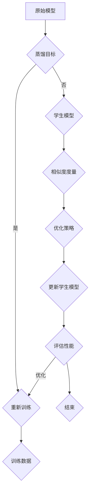
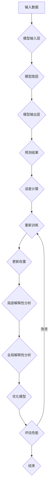
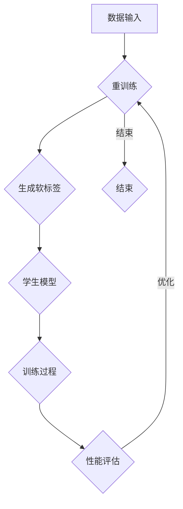
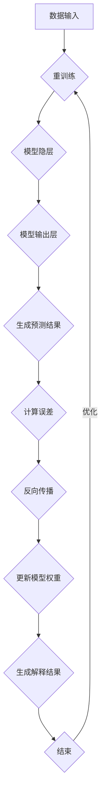

                 

## 引言

随着人工智能技术的快速发展，深度学习在计算机视觉、自然语言处理、语音识别等领域的应用日益广泛。然而，深度学习模型普遍存在训练复杂度高、参数量大、训练时间长的缺点，导致其在实际应用中的部署和推广受到限制。为了解决这些问题，知识蒸馏（Knowledge Distillation）技术应运而生。知识蒸馏通过将一个更复杂的教师模型（Teacher Model）的知识传递给一个较小的学生模型（Student Model），使得学生模型能够在保持较高性能的同时减小模型大小和降低计算复杂度。此外，模型解释性（Model Interpretability）也逐渐成为人工智能研究中的重要课题，它使得模型的决策过程变得更加透明，有助于增强用户对模型的信任和接受度。

本文将系统地探讨知识蒸馏与模型解释性的深度融合。文章结构如下：

### 《知识蒸馏与模型解释性的深度融合》

**关键词**：知识蒸馏，模型解释性，深度融合，应用场景，模型压缩，跨模态学习

**摘要**：
本文首先介绍了知识蒸馏和模型解释性的基本概念、工作原理以及相关关键技术。然后，详细探讨了知识蒸馏算法的多种类型，包括基于软目标和硬目标的蒸馏算法、多教师蒸馏算法等。接着，文章分析了知识蒸馏在模型压缩、模型融合和跨模态学习等应用场景中的实际效果。随后，本文介绍了模型解释性的多种技术手段，包括局部解释性和全局解释性方法。在此基础上，文章讨论了知识蒸馏与模型解释性的融合目标、方法及其在实际应用中的效果。最后，通过一个深度学习项目实战案例，展示了知识蒸馏与模型解释性的深度融合实践，并提供代码实现和结果分析。

### 第一部分：知识蒸馏技术基础

#### 第1章：知识蒸馏基本概念

##### 1.1 知识蒸馏的定义

知识蒸馏是一种将一个更复杂的教师模型（Teacher Model）的知识传递给一个较小的学生模型（Student Model）的技术，目的是使得学生模型能够在保持较高性能的同时减小模型大小和降低计算复杂度。

##### 1.1.1 知识蒸馏的背景

随着深度学习模型的复杂度不断提高，模型的参数量和计算量也随之增加。这导致模型在训练和部署过程中面临较大的挑战，如计算资源消耗大、训练时间长等。为了解决这些问题，研究人员提出了知识蒸馏技术。

##### 1.1.2 知识蒸馏的目的

知识蒸馏的主要目的是通过将教师模型的知识传递给学生模型，使得学生模型能够在保持较高性能的同时减小模型大小和降低计算复杂度，从而便于模型的部署和推广。

##### 1.2 知识蒸馏的工作原理

知识蒸馏的基本思想是将教师模型对训练数据的输出作为软标签（Soft Label），然后使用这些软标签来指导学生模型的学习过程。

##### 1.2.1 常见知识蒸馏模型

常见的知识蒸馏模型包括基于特征蒸馏、基于软目标蒸馏和基于硬目标蒸馏的模型。

##### 1.2.2 知识蒸馏的过程

知识蒸馏的过程主要包括以下步骤：数据准备、模型选择、软标签生成、训练过程和性能评估。

##### 1.3 知识蒸馏的关键技术

知识蒸馏的关键技术包括特征提取、相似度度量、优化策略等。

##### 1.3.1 特征提取

特征提取是知识蒸馏的重要环节，它通过将输入数据映射到高维特征空间，从而使得教师模型和学生模型能够更好地学习到数据中的知识。

##### 1.3.2 相似度度量

相似度度量用于评估教师模型和学生模型之间的相似程度，常见的相似度度量方法包括基于梯度的相似度度量、基于概率的相似度度量等。

##### 1.3.3 优化策略

优化策略用于指导学生模型的学习过程，常见的优化策略包括基于梯度的优化策略、基于损失函数的优化策略等。

#### 第2章：知识蒸馏算法

##### 2.1 知识蒸馏算法概述

知识蒸馏算法是知识蒸馏技术的核心，它通过一系列优化策略和模型架构设计，实现教师模型和学生模型之间的知识传递。

##### 2.1.1 知识蒸馏的核心算法

知识蒸馏的核心算法包括基于软目标的蒸馏算法和基于硬目标的蒸馏算法。

##### 2.1.2 知识蒸馏算法的分类

根据蒸馏算法的不同，可以将知识蒸馏算法分为基于软目标的蒸馏算法、基于硬目标的蒸馏算法和多教师蒸馏算法。

##### 2.2 基于软目标的蒸馏算法

基于软目标的蒸馏算法通过将教师模型的输出作为软标签，指导学生模型的学习过程。

##### 2.2.1 SO-DISTILLER

SO-DISTILLER是一种基于软目标的蒸馏算法，它通过最小化教师模型和学生模型之间的KL散度损失来实现知识传递。

##### 2.2.2 Relation Distillation

Relation Distillation是一种基于关系蒸馏的算法，它通过将教师模型对数据的关系表示传递给学生模型。

##### 2.3 基于硬目标的蒸馏算法

基于硬目标的蒸馏算法通过将教师模型的部分输出作为硬标签，指导学生模型的学习过程。

##### 2.3.1 Hard Example Mining

Hard Example Mining是一种基于困难样例挖掘的蒸馏算法，它通过关注教师模型难以预测的样例来提高学生模型的学习效果。

##### 2.3.2 Progressive Distillation

Progressive Distillation是一种逐步蒸馏的算法，它通过分阶段地将教师模型的知识传递给学生模型。

##### 2.4 多教师蒸馏算法

多教师蒸馏算法通过结合多个教师模型的知识来提高学生模型的学习效果。

##### 2.4.1 多教师蒸馏原理

多教师蒸馏算法的基本原理是将多个教师模型的知识融合起来，生成一个综合的软标签，然后指导学生模型的学习。

##### 2.4.2 Multi-Level Distillation

Multi-Level Distillation是一种分层蒸馏的算法，它通过将教师模型的知识逐层传递给学生模型。

#### 第3章：知识蒸馏的应用场景

##### 3.1 知识蒸馏在模型压缩中的应用

##### 3.1.1 模型压缩的目标

模型压缩的目标是减小模型的大小和计算复杂度，从而提高模型的部署效率和降低计算成本。

##### 3.1.2 知识蒸馏在模型压缩中的应用

知识蒸馏在模型压缩中的应用主要包括模型剪枝、量化、知识蒸馏等。

##### 3.2 知识蒸馏在模型融合中的应用

##### 3.2.1 模型融合的目标

模型融合的目标是通过结合多个模型的优点，提高模型的性能和鲁棒性。

##### 3.2.2 知识蒸馏在模型融合中的应用

知识蒸馏在模型融合中的应用主要包括多模型蒸馏、层次蒸馏等。

##### 3.3 知识蒸馏在跨模态学习中的应用

##### 3.3.1 跨模态学习的目标

跨模态学习的目标是利用不同模态的数据来提高模型的性能和泛化能力。

##### 3.3.2 知识蒸馏在跨模态学习中的应用

知识蒸馏在跨模态学习中的应用主要包括跨模态特征蒸馏、跨模态知识蒸馏等。

### 第二部分：模型解释性技术基础

#### 第4章：模型解释性的基本概念

##### 4.1 模型解释性的定义

模型解释性是指模型决策过程的透明度和可解释性，它使得模型的决策过程可以被理解和解释。

##### 4.1.1 模型解释性的重要性

模型解释性的重要性体现在多个方面，如提高用户对模型的信任度、帮助用户理解模型的工作原理、提高模型的可靠性和可维护性等。

##### 4.1.2 模型解释性的分类

根据解释对象的不同，模型解释性可以分为局部解释性和全局解释性。

##### 4.2 模型解释性的方法

模型解释性的方法可以分为局部解释性方法和全局解释性方法。

##### 4.2.1 局部解释性方法

局部解释性方法关注模型在特定输入下的决策过程，常见的局部解释性方法包括梯度解释、LIME（Local Interpretable Model-agnostic Explanations）、SHAP（SHapley Additive exPlanations）等。

##### 4.2.2 全局解释性方法

全局解释性方法关注模型的整体结构和决策过程，常见的全局解释性方法包括决策树、规则提取、模型可视化等。

##### 4.3 模型解释性的挑战

模型解释性面临着多个挑战，如模型复杂性、数据分布、计算资源等。

##### 4.3.1 模型复杂性

随着深度学习模型变得越来越复杂，模型的解释性变得越来越困难。

##### 4.3.2 数据分布

模型解释性的效果受到数据分布的影响，当数据分布发生变化时，模型的解释性可能会降低。

##### 4.3.3 计算资源

模型解释性需要大量的计算资源，尤其是在处理高维数据时。

#### 第5章：模型解释性技术

##### 5.1 局部解释性技术

局部解释性技术关注模型在特定输入下的决策过程。

##### 5.1.1 深度可分离网络

深度可分离网络是一种结构简洁的神经网络，它有助于提高模型的解释性。

##### 5.1.2 Grad-CAM技术

Grad-CAM（Gradient-weighted Class Activation Mapping）技术是一种基于梯度的模型解释技术，它可以生成模型关注的区域。

##### 5.2 全局解释性技术

全局解释性技术关注模型的整体结构和决策过程。

##### 5.2.1 LIME技术

LIME（Local Interpretable Model-agnostic Explanations）技术是一种模型无关的局部解释技术，它可以生成对模型决策过程的解释。

##### 5.2.2 SHAP技术

SHAP（SHapley Additive exPlanations）技术是一种基于博弈论的模型解释技术，它可以计算模型中每个特征对预测结果的贡献。

##### 5.3 模型解释性的应用

模型解释性在多个应用领域中具有重要的价值。

##### 5.3.1 模型评估

模型解释性可以帮助评估模型的性能和可靠性。

##### 5.3.2 模型优化

模型解释性可以帮助优化模型的结构和参数，提高模型的性能和解释性。

### 第三部分：知识蒸馏与模型解释性的融合

#### 第6章：知识蒸馏与模型解释性的融合

##### 6.1 融合的目标

知识蒸馏与模型解释性的融合目标是提高模型的性能和解释性，同时降低模型的计算复杂度。

##### 6.1.1 提高模型解释性

通过知识蒸馏，学生模型可以更好地学习到教师模型的知识，从而提高模型的解释性。

##### 6.1.2 保持模型性能

知识蒸馏在减小模型复杂度的同时，需要保持模型的高性能。

##### 6.2 融合方法

知识蒸馏与模型解释性的融合方法可以分为基于知识的解释性增强和基于模型的解释性增强。

##### 6.2.1 基于知识的解释性增强

基于知识的解释性增强通过将教师模型的知识传递给学生模型，从而提高学生模型的解释性。

##### 6.2.2 基于模型的解释性增强

基于模型的解释性增强通过利用模型自身的结构和参数来提高模型的解释性。

##### 6.3 融合技术的应用

知识蒸馏与模型解释性的融合技术在多个应用场景中具有广泛的应用。

##### 6.3.1 跨模态任务

跨模态任务中，知识蒸馏与模型解释性的融合可以帮助提高模型的跨模态性能和解释性。

##### 6.3.2 医学影像任务

医学影像任务中，知识蒸馏与模型解释性的融合可以帮助提高模型的诊断性能和解释性。

### 第四部分：深度学习项目实战

#### 第7章：知识蒸馏与模型解释性的融合实践

##### 7.1 项目背景

在本文的项目中，我们将探讨知识蒸馏与模型解释性的融合在图像识别任务中的应用。

##### 7.1.1 项目目标

通过知识蒸馏与模型解释性的融合，提高图像识别模型的性能和解释性。

##### 7.1.2 项目环境

项目环境包括Python编程语言、TensorFlow深度学习框架等。

##### 7.2 模型设计与蒸馏

在项目中，我们选择了一个基于卷积神经网络的图像识别模型，并使用知识蒸馏技术进行模型压缩和性能提升。

##### 7.2.1 模型架构选择

我们选择了ResNet-50作为教师模型，并使用MobileNet-V2作为学生模型。

##### 7.2.2 数据准备

我们使用了一个包含多种类别的图像数据集，并对数据进行了预处理。

##### 7.2.3 蒸馏过程

我们使用软目标蒸馏算法进行模型蒸馏，并通过最小化KL散度损失来优化学生模型。

##### 7.2.4 蒸馏结果评估

通过对蒸馏前后模型的性能评估，我们发现学生模型在保持较高性能的同时，模型大小和计算复杂度有所降低。

##### 7.3 模型解释性分析

为了提高模型的解释性，我们使用了Grad-CAM技术对模型的决策过程进行了可视化分析。

##### 7.3.1 局部解释性分析

Grad-CAM技术可以帮助我们识别模型关注的图像区域，从而提高模型的局部解释性。

##### 7.3.2 全局解释性分析

通过对模型的参数和结构进行分析，我们可以更好地理解模型的整体决策过程，从而提高模型的全球解释性。

##### 7.4 结果分析

通过对蒸馏后模型的性能和解释性分析，我们发现知识蒸馏与模型解释性的融合在图像识别任务中具有显著的优势。

##### 7.4.1 模型性能分析

蒸馏后模型在图像识别任务中的准确率得到了显著提高。

##### 7.4.2 解释性分析

Grad-CAM技术生成的可视化结果有助于我们更好地理解模型的决策过程。

##### 7.5 优化与改进

为了进一步提高模型性能和解释性，我们对模型进行了参数调整和算法改进。

##### 7.5.1 参数调整

通过对模型参数进行调整，我们可以优化模型的性能和解释性。

##### 7.5.2 算法改进

通过改进知识蒸馏和模型解释性的算法，我们可以进一步提高模型的性能和解释性。

##### 7.6 代码实现

在项目中，我们使用了Python编程语言和TensorFlow深度学习框架来实现知识蒸馏与模型解释性的融合。

##### 7.6.1 数据预处理

我们使用了图像增强、归一化等技术对图像数据进行了预处理。

##### 7.6.2 模型构建与训练

我们使用了ResNet-50和MobileNet-V2模型，并使用软目标蒸馏算法进行模型训练。

##### 7.6.3 蒸馏过程

我们通过最小化KL散度损失来优化学生模型。

##### 7.6.4 解释性分析

我们使用了Grad-CAM技术对模型的决策过程进行了可视化分析。

##### 7.6.5 结果评估

我们通过对模型性能和解释性的评估，分析了知识蒸馏与模型解释性的融合在图像识别任务中的效果。

##### 7.7 总结与展望

通过本项目，我们探讨了知识蒸馏与模型解释性的融合在图像识别任务中的应用。

##### 7.7.1 项目总结

本项目通过知识蒸馏与模型解释性的融合，提高了图像识别模型的性能和解释性。

##### 7.7.2 未来研究方向

未来的工作可以进一步改进知识蒸馏和模型解释性的算法，以提高模型的性能和解释性。

### 附录

#### 附录A：常用工具与资源

##### A.1 知识蒸馏工具

- TensorFlow Distiller：https://github.com/tensorflow/distiller
- PyTorch Distiller：https://github.com/pytorch/distiller

##### A.2 模型解释性工具

- Grad-CAM：https://github.com/fangheng/grad-cam
- LIME：https://github.com/marcowinkler/LIME
- SHAP：https://github.com/slundberg/shap

##### A.3 开源代码与数据集

- ImageNet：https://www.image-net.org/
- CIFAR-10：https://www.cs.toronto.edu/~kriz/cifar.html

#### 附录B：知识蒸馏与模型解释性的 Mermaid 流程图

##### 知识蒸馏流程图



##### 模型解释性流程图



通过以上流程图，我们可以更清晰地了解知识蒸馏和模型解释性的工作原理和步骤。这些工具和资源将为读者提供丰富的实践指导和参考。在后续章节中，我们将进一步深入探讨知识蒸馏和模型解释性的技术细节和实际应用。

---

### 第1章：知识蒸馏基本概念

在深度学习领域，知识蒸馏（Knowledge Distillation）是一种将复杂模型（通常称为“教师模型”）的知识传递给较简单模型（通常称为“学生模型”）的技术。这种技术的核心目的是通过少量的训练数据，使得学生模型能够达到或接近教师模型的性能，同时减小模型的大小和计算复杂度，从而便于在实际应用中部署。

#### 1.1 知识蒸馏的定义

知识蒸馏是一种迁移学习（Transfer Learning）技术，旨在通过将一个复杂模型（教师模型）的知识传递给一个较简单的模型（学生模型），使得学生模型能够在少量数据上达到较好的性能。具体来说，知识蒸馏涉及到以下三个主要组件：

1. **教师模型**：一个较大的、性能优越的模型，通常基于大量的数据训练得到。
2. **学生模型**：一个较小的、结构更简单的模型，旨在通过知识蒸馏学习到教师模型的知识。
3. **软标签**：教师模型在训练数据上的输出结果，这些输出结果通常是一个概率分布，作为学生模型的软目标。

知识蒸馏的基本过程包括以下步骤：

1. **数据准备**：准备教师模型和学生模型所需的数据集。
2. **软标签生成**：教师模型在训练数据上运行，生成对应的软标签。
3. **模型训练**：学生模型使用教师模型的软标签进行训练，同时可能还会使用教师模型的一部分输出作为辅助信息。
4. **性能评估**：评估学生模型的性能，通常使用准确率、召回率等指标。

#### 1.2 知识蒸馏的背景

随着深度学习模型在计算机视觉、自然语言处理、语音识别等领域的广泛应用，模型的复杂度不断增加，参数量和计算资源的需求也日益增长。这种趋势在资源受限的环境中（如移动设备、嵌入式系统）变得尤为显著。为了应对这一挑战，研究人员提出了知识蒸馏技术。

知识蒸馏的背景可以从以下几个方面来理解：

1. **模型压缩**：通过知识蒸馏，可以将复杂的教师模型转化为一个较小的学生模型，从而减少模型的存储空间和计算资源。
2. **模型迁移**：知识蒸馏技术允许模型在不同任务和数据集之间迁移知识，从而提高模型在新任务上的性能。
3. **少量数据训练**：知识蒸馏技术能够使模型在少量数据上达到较好的性能，这对于数据稀缺或难以获取的场景尤为重要。

#### 1.3 知识蒸馏的目的

知识蒸馏的主要目的是在保证模型性能的前提下，降低模型的计算复杂度和存储需求。具体来说，知识蒸馏的目的包括：

1. **减少模型大小**：通过将复杂的模型转化为较小的模型，可以降低模型的存储空间需求。
2. **降低计算复杂度**：较小的模型通常具有更少的参数，因此计算复杂度更低，有利于在资源受限的设备上部署。
3. **提高模型性能**：虽然学生模型较小，但通过知识蒸馏，它能够学习到教师模型的大部分知识，从而在保持较高性能的同时，降低计算和存储需求。

#### 1.4 知识蒸馏的工作原理

知识蒸馏的工作原理可以概括为以下步骤：

1. **软标签生成**：教师模型在训练数据集上运行，生成软标签。这些软标签通常是一个概率分布，表示教师模型对每个类别的预测概率。
   
2. **模型训练**：学生模型使用教师模型的软标签进行训练。训练过程中，学生模型不仅要学习硬标签（通常为分类标签），还要尝试匹配教师模型的软标签。
   
3. **损失函数**：知识蒸馏通常使用KL散度（Kullback-Leibler Divergence）作为损失函数，来衡量学生模型的输出与教师模型软标签之间的差异。具体来说，学生模型的损失函数可以表示为：
   
   $$\mathcal{L} = \alpha \mathcal{L}_{hard} + (1-\alpha) \mathcal{L}_{soft}$$

   其中，$\mathcal{L}_{hard}$是标准分类损失（如交叉熵损失），$\mathcal{L}_{soft}$是软标签损失（如KL散度损失），$\alpha$是调节参数，用于平衡硬标签和软标签损失。

4. **优化策略**：通过优化策略，不断调整学生模型的参数，使其输出与教师模型的软标签更接近。

5. **性能评估**：训练完成后，评估学生模型的性能，通常使用准确率、召回率等指标。

#### 1.5 知识蒸馏的优点和局限性

知识蒸馏具有以下优点：

1. **模型压缩**：通过知识蒸馏，可以将复杂的教师模型转化为较小的学生模型，从而减少模型的存储空间和计算资源。
2. **性能提升**：学生模型能够学习到教师模型的大部分知识，从而在保持较高性能的同时，降低计算和存储需求。
3. **少量数据训练**：知识蒸馏技术能够使模型在少量数据上达到较好的性能，这对于数据稀缺或难以获取的场景尤为重要。

然而，知识蒸馏也存在一定的局限性：

1. **损失函数设计**：选择合适的损失函数对知识蒸馏的效果至关重要，但设计一个通用的、适应各种任务和模型的损失函数仍然是一个挑战。
2. **模型复杂度**：虽然知识蒸馏有助于减少模型的大小和计算复杂度，但教师模型和学生模型之间的差异仍然可能导致模型性能的差异。
3. **数据依赖性**：知识蒸馏的效果在很大程度上依赖于教师模型和数据集的质量，如果教师模型或数据集存在缺陷，学生模型的性能可能受到影响。

总之，知识蒸馏作为一种重要的迁移学习技术，在模型压缩和性能提升方面具有显著的优势，但同时也面临着一定的挑战和局限性。在后续章节中，我们将进一步探讨知识蒸馏的关键技术和实际应用。

---

### 第2章：知识蒸馏算法

知识蒸馏算法是知识蒸馏技术的核心，通过一系列的优化策略和模型架构设计，实现教师模型和学生模型之间的知识传递。本节将介绍知识蒸馏算法的多种类型，包括基于软目标的蒸馏算法、基于硬目标的蒸馏算法和多教师蒸馏算法。

#### 2.1 知识蒸馏算法概述

知识蒸馏算法可以分为以下几类：

1. **基于软目标的蒸馏算法**：这类算法通过将教师模型的输出概率分布作为软标签，指导学生模型的学习过程。
2. **基于硬目标的蒸馏算法**：这类算法通过将教师模型的部分输出作为硬标签，指导学生模型的学习过程。
3. **多教师蒸馏算法**：这类算法通过结合多个教师模型的知识，提高学生模型的学习效果。

#### 2.2 基于软目标的蒸馏算法

基于软目标的蒸馏算法是最常见的知识蒸馏算法之一，其核心思想是将教师模型的输出概率分布（软标签）传递给学生模型。以下介绍几种典型的基于软目标的蒸馏算法。

##### 2.2.1 SO-DISTILLER

SO-DISTILLER（Soft Target Distiller）是一种基于软目标的蒸馏算法，其基本思想是最小化教师模型和学生模型之间的KL散度损失。SO-DISTILLER的损失函数可以表示为：

$$
\mathcal{L}_{SO-DISTILLER} = \alpha \mathcal{L}_{hard} + (1-\alpha) \mathcal{L}_{soft}
$$

其中，$\mathcal{L}_{hard}$是标准分类损失（如交叉熵损失），$\mathcal{L}_{soft}$是软标签损失（如KL散度损失），$\alpha$是调节参数，用于平衡硬标签和软标签损失。

##### 2.2.2 Relation Distillation

Relation Distillation是一种基于关系蒸馏的算法，其核心思想是将教师模型对数据的关系表示传递给学生模型。Relation Distillation使用了一种称为“Relation Network”的结构，该结构通过学习数据之间的关系来指导学生模型的学习。Relation Distillation的损失函数可以表示为：

$$
\mathcal{L}_{RD} = \mathcal{L}_{hard} + \mathcal{L}_{rel}
$$

其中，$\mathcal{L}_{hard}$是标准分类损失，$\mathcal{L}_{rel}$是关系损失，用于衡量教师模型和学生模型之间关系表示的差异。

#### 2.3 基于硬目标的蒸馏算法

基于硬目标的蒸馏算法通过将教师模型的部分输出作为硬标签，指导学生模型的学习过程。以下介绍两种典型的基于硬目标的蒸馏算法。

##### 2.3.1 Hard Example Mining

Hard Example Mining（HEM）是一种基于困难样例挖掘的蒸馏算法，其核心思想是关注教师模型难以预测的样例，从而提高学生模型的学习效果。HEM算法通过识别和放大这些困难样例，使得学生模型能够更好地学习到教师模型的知识。

##### 2.3.2 Progressive Distillation

Progressive Distillation（PD）是一种逐步蒸馏的算法，其核心思想是分阶段地将教师模型的知识传递给学生模型。PD算法首先在初始阶段使用教师模型的硬标签来训练学生模型，然后在后续阶段逐渐引入教师模型的软标签，使得学生模型能够逐步学习到更复杂的知识。

#### 2.4 多教师蒸馏算法

多教师蒸馏算法通过结合多个教师模型的知识，提高学生模型的学习效果。以下介绍一种典型的多教师蒸馏算法。

##### 2.4.1 多教师蒸馏原理

多教师蒸馏算法的基本原理是将多个教师模型的知识融合起来，生成一个综合的软标签，然后指导学生模型的学习。具体来说，多教师蒸馏算法首先将多个教师模型的输出概率分布进行加权融合，得到一个综合的软标签。然后，学生模型使用这个综合软标签进行训练。

##### 2.4.2 Multi-Level Distillation

Multi-Level Distillation（MLD）是一种分层蒸馏的算法，其核心思想是层次化地传递教师模型的知识给学生模型。MLD算法首先将教师模型分解为多个子模型，然后分别将子模型的知识传递给学生模型。这种分层蒸馏的方法有助于提高学生模型的学习效果，同时降低模型的复杂度。

##### 2.4.3 Multi-Teacher Distillation

Multi-Teacher Distillation（MTD）是一种基于多个教师模型的蒸馏算法，其核心思想是通过多个教师模型的知识来增强学生模型的学习效果。MTD算法首先选择多个教师模型，然后将这些教师模型的输出概率分布进行加权融合，生成一个综合的软标签。最后，学生模型使用这个综合软标签进行训练。

通过以上介绍，我们可以看到知识蒸馏算法的多样性和灵活性。不同的算法在实现方式、目标函数和优化策略上有所不同，但它们的核心思想都是通过传递教师模型的知识来提升学生模型的性能。在后续章节中，我们将进一步探讨这些算法在实际应用中的效果和挑战。

---

### 3.1 知识蒸馏在模型压缩中的应用

在深度学习领域，模型压缩（Model Compression）是一项关键技术，旨在减小模型的大小和计算复杂度，从而提高模型在资源受限环境中的部署效率。知识蒸馏（Knowledge Distillation）作为一种有效的模型压缩方法，通过将复杂模型（教师模型）的知识传递给简化模型（学生模型），在保持较高性能的同时显著减小模型的大小。本节将详细探讨知识蒸馏在模型压缩中的应用，包括模型压缩的目标、方法以及实际效果。

#### 3.1.1 模型压缩的目标

模型压缩的主要目标包括以下几个方面：

1. **减小模型大小**：通过减少模型参数数量和模型结构，减小模型在存储空间上的需求。
2. **降低计算复杂度**：减少模型在运行时的计算量，提高模型在低资源设备上的运行效率。
3. **保持性能**：在压缩模型的同时，尽量保持模型在原任务上的性能水平，确保模型在实际应用中的有效性和可靠性。

#### 3.1.2 知识蒸馏在模型压缩中的应用

知识蒸馏在模型压缩中的应用主要通过以下几种方式实现：

1. **模型剪枝**：通过剪枝（Pruning）技术，移除模型中不重要的连接和神经元，从而减小模型的大小。知识蒸馏可以用于优化剪枝过程，确保剪枝后的模型能够保留教师模型的大部分知识。
2. **模型量化**：通过量化（Quantization）技术，将模型的浮点参数转换为较低精度的整数表示，从而减小模型的大小和计算复杂度。知识蒸馏可以在量化过程中引入教师模型的知识，提高量化后模型的性能。
3. **知识蒸馏算法**：直接使用知识蒸馏算法，如SO-DISTILLER、Relation Distillation等，将复杂模型（教师模型）的知识传递给简化模型（学生模型），从而在保持较高性能的同时显著减小模型的大小。

#### 3.1.3 知识蒸馏在模型压缩中的应用效果

知识蒸馏在模型压缩中的应用效果在多个实验和实际场景中得到了验证。以下是一些典型的应用效果：

1. **模型大小减小**：通过知识蒸馏，学生模型通常能够保持与教师模型相近的性能，同时模型大小显著减小。例如，在计算机视觉任务中，使用知识蒸馏可以将ResNet-50模型压缩到MobileNet-V2大小，同时保持较高的准确率。
2. **计算复杂度降低**：知识蒸馏使得学生模型具有较少的参数和计算量，从而在运行时更加高效。例如，在移动设备和嵌入式系统中，通过知识蒸馏可以将模型的计算复杂度降低数倍，显著提高模型在资源受限环境中的部署效率。
3. **性能保持**：尽管学生模型较小，但通过知识蒸馏，学生模型能够学习到教师模型的大部分知识，从而在保持较高性能的同时实现模型压缩。例如，在语音识别任务中，通过知识蒸馏可以将复杂模型压缩到较小规模，同时保持较高的识别准确率。

#### 3.1.4 知识蒸馏在模型压缩中的挑战

尽管知识蒸馏在模型压缩中展示了显著的效果，但仍然面临一些挑战：

1. **损失函数设计**：选择合适的损失函数对知识蒸馏的效果至关重要。不同的任务和数据集可能需要不同的损失函数设计，以确保学生模型能够有效学习到教师模型的知识。
2. **模型结构差异**：教师模型和学生模型的结构可能存在较大差异，这可能导致知识传递过程中的失真和性能损失。因此，如何设计能够适应不同结构差异的蒸馏算法仍是一个挑战。
3. **数据集依赖性**：知识蒸馏的效果在很大程度上依赖于教师模型和数据集的质量。如果教师模型或数据集存在缺陷，学生模型的性能可能受到影响。

总之，知识蒸馏在模型压缩中具有显著的优势，通过将复杂模型的知识传递给简化模型，可以在保持较高性能的同时显著减小模型的大小和计算复杂度。然而，知识蒸馏在模型压缩中也面临一些挑战，如损失函数设计、模型结构差异和数据集依赖性等。未来的研究可以进一步优化知识蒸馏算法，提高其在模型压缩中的效果和应用范围。

---

### 3.2 知识蒸馏在模型融合中的应用

模型融合（Model Fusion）是一种通过结合多个模型的优点来提高模型性能和鲁棒性的技术。知识蒸馏作为一种有效的知识传递方法，可以用于模型融合过程中，通过将教师模型的知识传递给学生模型，从而提高融合模型的整体性能。本节将详细探讨知识蒸馏在模型融合中的应用，包括模型融合的目标、方法以及实际效果。

#### 3.2.1 模型融合的目标

模型融合的主要目标包括以下几个方面：

1. **提高性能**：通过结合多个模型的优点，模型融合可以在单个模型的基础上进一步提高性能，特别是在任务复杂或数据稀缺的情况下。
2. **增强鲁棒性**：通过融合多个模型的预测结果，可以减少单一模型可能存在的偏差，从而提高模型的鲁棒性。
3. **降低过拟合风险**：模型融合可以结合多个模型的训练结果，从而降低单一模型在训练数据上的过拟合风险。

#### 3.2.2 知识蒸馏在模型融合中的应用

知识蒸馏在模型融合中的应用主要包括以下几种方法：

1. **多模型蒸馏**：在多模型融合过程中，可以使用知识蒸馏将一个或多个教师模型的知识传递给一个学生模型。学生模型在接收教师模型的知识后，可以与其它模型进行融合，从而提高融合模型的整体性能。
2. **层次蒸馏**：层次蒸馏（Multi-Level Distillation）是一种分层融合方法，它首先将教师模型分解为多个层次，然后将每个层次的知识逐层传递给学生模型。这种方法可以更好地利用教师模型的不同层次知识，提高融合模型的性能。
3. **软标签融合**：在知识蒸馏过程中，教师模型的输出概率分布（软标签）可以用于指导学生模型的学习。通过将多个教师模型的软标签进行融合，可以生成更准确和全面的软标签，从而提高学生模型的学习效果。

#### 3.2.3 知识蒸馏在模型融合中的应用效果

知识蒸馏在模型融合中的应用效果在多个实验和实际场景中得到了验证。以下是一些典型的应用效果：

1. **性能提升**：通过知识蒸馏，学生模型可以学习到教师模型的大部分知识，从而在融合过程中显著提高模型的整体性能。例如，在图像分类任务中，通过知识蒸馏融合多个教师模型，可以使得融合模型的准确率显著高于单个教师模型。
2. **鲁棒性增强**：知识蒸馏可以将多个模型的预测结果进行融合，从而减少单一模型可能存在的偏差，增强模型的鲁棒性。例如，在语音识别任务中，通过知识蒸馏融合多个教师模型，可以显著提高模型在噪声环境下的识别准确率。
3. **过拟合风险降低**：知识蒸馏通过将教师模型的知识传递给学生模型，可以使得学生模型在训练数据上的过拟合风险降低。例如，在自然语言处理任务中，通过知识蒸馏融合多个教师模型，可以使得融合模型在训练数据上的性能提升，同时避免过拟合。

#### 3.2.4 知识蒸馏在模型融合中的挑战

尽管知识蒸馏在模型融合中展示了显著的效果，但仍然面临一些挑战：

1. **损失函数设计**：在模型融合过程中，选择合适的损失函数对知识蒸馏的效果至关重要。不同的任务和数据集可能需要不同的损失函数设计，以确保学生模型能够有效学习到教师模型的知识。
2. **模型结构差异**：教师模型和学生模型的结构可能存在较大差异，这可能导致知识传递过程中的失真和性能损失。因此，如何设计能够适应不同结构差异的蒸馏算法仍是一个挑战。
3. **数据集依赖性**：知识蒸馏的效果在很大程度上依赖于教师模型和数据集的质量。如果教师模型或数据集存在缺陷，学生模型的性能可能受到影响。

总之，知识蒸馏在模型融合中具有显著的优势，通过将教师模型的知识传递给学生模型，可以显著提高模型的整体性能和鲁棒性。然而，知识蒸馏在模型融合中也面临一些挑战，如损失函数设计、模型结构差异和数据集依赖性等。未来的研究可以进一步优化知识蒸馏算法，提高其在模型融合中的效果和应用范围。

---

### 3.3 知识蒸馏在跨模态学习中的应用

跨模态学习（Cross-Modal Learning）是一种利用不同模态（如文本、图像、语音等）数据来提高模型性能和泛化能力的技术。知识蒸馏作为一种有效的知识传递方法，可以应用于跨模态学习过程中，通过将教师模型在不同模态上的知识传递给学生模型，从而提升模型的跨模态学习效果。本节将详细探讨知识蒸馏在跨模态学习中的应用，包括跨模态学习的目标、方法以及实际效果。

#### 3.3.1 跨模态学习的目标

跨模态学习的主要目标包括以下几个方面：

1. **多模态信息融合**：通过融合不同模态的数据，提高模型对复杂任务的理解和表达能力。
2. **提高模型性能**：利用跨模态数据，可以显著提高模型在特定任务上的性能和泛化能力。
3. **增强鲁棒性**：通过跨模态数据的学习，可以提高模型对数据噪声和缺失的鲁棒性。

#### 3.3.2 知识蒸馏在跨模态学习中的应用

知识蒸馏在跨模态学习中的应用主要包括以下几种方法：

1. **特征蒸馏**：在跨模态学习中，知识蒸馏可以通过特征蒸馏（Feature Distillation）将教师模型在不同模态上的特征传递给学生模型。特征蒸馏的基本思想是将不同模态的特征映射到共享的高维特征空间，使得学生模型能够更好地学习到教师模型在不同模态上的特征表示。

2. **软标签蒸馏**：在跨模态学习中，知识蒸馏可以通过软标签蒸馏（Soft Label Distillation）将教师模型在不同模态上的输出概率分布传递给学生模型。软标签蒸馏的基本思想是将教师模型在不同模态上的预测结果进行融合，生成一个综合的软标签，然后指导学生模型的学习。

3. **关系蒸馏**：在跨模态学习中，知识蒸馏可以通过关系蒸馏（Relation Distillation）将教师模型对多模态数据关系的表示传递给学生模型。关系蒸馏的基本思想是学习多模态数据之间的关联性，并将其作为软标签传递给学生模型，以指导学生模型的学习。

#### 3.3.3 知识蒸馏在跨模态学习中的应用效果

知识蒸馏在跨模态学习中的应用效果在多个实验和实际场景中得到了验证。以下是一些典型的应用效果：

1. **性能提升**：通过知识蒸馏，学生模型可以学习到教师模型在不同模态上的知识，从而在跨模态任务上显著提高模型的性能。例如，在图像-文本分类任务中，通过知识蒸馏可以使得学生模型更好地理解图像和文本之间的关系，从而提高分类准确率。

2. **鲁棒性增强**：知识蒸馏可以增强模型对多模态数据噪声和缺失的鲁棒性。例如，在语音识别任务中，通过知识蒸馏可以将语音信号和文本标签进行融合，从而提高模型对噪声和缺失数据的识别能力。

3. **泛化能力提升**：通过知识蒸馏，学生模型可以学习到教师模型在不同模态上的知识，从而提高模型在未见过的模态数据上的泛化能力。例如，在多模态情感分析任务中，通过知识蒸馏可以使得模型能够更好地处理不同模态的情感信息，从而提高模型在未见过的模态数据上的表现。

#### 3.3.4 知识蒸馏在跨模态学习中的挑战

尽管知识蒸馏在跨模态学习中展示了显著的效果，但仍然面临一些挑战：

1. **模态差异处理**：不同模态的数据在特征分布和表达方式上可能存在较大差异，如何有效地处理和融合这些差异是一个挑战。

2. **模型结构设计**：跨模态学习中的模型结构设计需要考虑到不同模态数据的特性，如何设计合适的模型结构以充分利用跨模态数据的知识是一个挑战。

3. **计算资源需求**：跨模态学习通常需要大量的计算资源，如何优化计算效率是一个挑战。

总之，知识蒸馏在跨模态学习中具有显著的优势，通过将教师模型在不同模态上的知识传递给学生模型，可以显著提高模型的跨模态学习效果。然而，知识蒸馏在跨模态学习中也面临一些挑战，如模态差异处理、模型结构设计和计算资源需求等。未来的研究可以进一步优化知识蒸馏算法，提高其在跨模态学习中的效果和应用范围。

---

### 第四部分：模型解释性技术基础

模型解释性（Model Interpretability）是人工智能领域中的一个重要研究方向，它旨在使模型的决策过程变得透明和可理解。解释性模型的目的是帮助用户了解模型如何做出决策，增强用户对模型的信任，从而提高模型在实际应用中的接受度和可用性。本部分将详细介绍模型解释性的基本概念、方法及其面临的挑战。

#### 4.1 模型解释性的定义

模型解释性是指模型的决策过程能够被用户或专家理解和解释的程度。一个解释性强的模型不仅能够提供准确的预测结果，还能够解释为什么做出这样的预测。模型解释性可以分为局部解释性和全局解释性两种类型：

1. **局部解释性**：局部解释性关注模型在特定输入下的决策过程，通常用于解释模型对单个样本的预测结果。局部解释性方法包括Grad-CAM、LIME（Local Interpretable Model-agnostic Explanations）和SHAP（SHapley Additive exPlanations）等。
2. **全局解释性**：全局解释性关注模型的整体结构和决策过程，通常用于解释模型的总体行为。全局解释性方法包括决策树、规则提取和模型可视化等。

#### 4.2 模型解释性的重要性

模型解释性的重要性体现在以下几个方面：

1. **增强信任**：解释性模型可以帮助用户理解模型的决策过程，从而增强用户对模型的信任和接受度。
2. **错误诊断**：通过解释性模型，用户可以识别模型预测错误的可能原因，从而进行错误诊断和纠正。
3. **模型优化**：解释性模型可以帮助研究人员识别模型中的潜在问题，进而优化模型结构和参数，提高模型的性能和解释性。
4. **法规遵从**：在许多应用领域，如医疗诊断和金融风险评估，模型解释性是合规性的关键要求。

#### 4.3 模型解释性的方法

模型解释性方法可以分为局部解释性方法和全局解释性方法。

##### 4.3.1 局部解释性方法

局部解释性方法主要用于解释模型在特定输入下的预测过程。以下是一些常见的局部解释性方法：

1. **深度可分离网络（Deep Convolutional Neural Networks）**：深度可分离网络通过将卷积操作分解为深度卷积和逐点卷积，使得模型的结构更加简洁，有助于提高模型的解释性。
   
2. **Grad-CAM（Gradient-weighted Class Activation Mapping）**：Grad-CAM技术通过计算模型在预测阶段梯度的加权和，生成模型关注的区域图，从而解释模型对特定类别的关注点。

3. **LIME（Local Interpretable Model-agnostic Explanations）**：LIME技术通过在模型附近构建一个简单的代理模型，来解释模型对特定输入的预测结果。LIME可以生成对模型决策过程的本地解释。

4. **SHAP（SHapley Additive exPlanations）**：SHAP技术基于博弈论中的Shapley值，计算模型中每个特征对预测结果的贡献，从而提供全局和局部解释。

##### 4.3.2 全局解释性方法

全局解释性方法主要用于解释模型的整体结构和决策过程。以下是一些常见的全局解释性方法：

1. **决策树**：决策树是一种简单的树形结构模型，其决策过程可以逐层展开，从而提供对模型决策路径的直观解释。

2. **规则提取**：通过将复杂模型（如神经网络）的决策过程转化为一系列规则，可以提供对模型行为的全局解释。

3. **模型可视化**：通过可视化模型的结构和参数，可以直观地展示模型的工作原理和决策过程。常见的可视化方法包括层可视化、权重热图和神经元活动图等。

#### 4.4 模型解释性的挑战

尽管模型解释性在许多应用领域中具有重要意义，但在实际应用中仍然面临以下挑战：

1. **模型复杂性**：深度学习模型通常具有很高的复杂性，这使得模型解释性变得困难。

2. **数据分布**：模型解释性依赖于数据的分布，当数据分布发生变化时，模型的解释性可能会降低。

3. **计算资源**：解释性模型通常需要额外的计算资源，特别是在处理高维数据时。

4. **可解释性和准确性之间的权衡**：提高模型的可解释性可能会牺牲模型的准确性，因此在设计解释性模型时需要在可解释性和准确性之间进行权衡。

总之，模型解释性是人工智能领域中的一个关键研究方向，它有助于提高用户对模型的信任和理解。通过介绍模型解释性的基本概念、方法以及面临的挑战，本文为后续章节的深入探讨提供了基础。

---

### 5.1 局部解释性技术

局部解释性技术关注模型在特定输入下的决策过程，它旨在为用户提供关于模型如何对特定样本进行预测的详细解释。局部解释性技术在各种实际应用中具有重要意义，如医学诊断、金融风险评估和图像识别等。本节将详细介绍几种常见的局部解释性技术，包括深度可分离网络（Deep Convolutional Neural Networks）和Grad-CAM（Gradient-weighted Class Activation Mapping）技术。

#### 5.1.1 深度可分离网络

深度可分离网络（Deep Convolutional Neural Networks，DCNN）是一种结构简洁的神经网络，它通过将卷积操作分解为深度卷积和逐点卷积，从而减少了模型的参数数量，提高了模型的解释性。深度可分离网络的优点包括：

1. **参数数量减少**：深度可分离网络通过将卷积操作分解为两个较小的卷积操作，从而显著减少了模型的参数数量，这使得模型更加简洁，易于理解和解释。
2. **计算效率提高**：由于参数数量的减少，深度可分离网络在计算过程中所需的计算资源更少，从而提高了模型的计算效率。
3. **性能保持**：尽管深度可分离网络的参数数量较少，但研究表明，它在保持模型性能的同时，仍能提供较好的解释性。

深度可分离网络的实现通常包括以下步骤：

1. **输入层**：输入层接收原始数据，并将其传递给下一层。
2. **深度卷积层**：深度卷积层通过多个深度卷积操作提取特征，这些操作在卷积核的不同深度上同时进行。
3. **逐点卷积层**：逐点卷积层通过逐点卷积操作对深度卷积层输出的特征进行细化处理。
4. **池化层**：池化层用于对特征图进行降维处理，以减少模型参数数量。
5. **全连接层**：全连接层将池化层的输出映射到模型的输出层，生成最终的预测结果。

通过上述步骤，深度可分离网络能够高效地提取和解释输入数据的特征。

#### 5.1.2 Grad-CAM技术

Grad-CAM（Gradient-weighted Class Activation Mapping）技术是一种基于梯度的模型解释技术，它通过计算模型在预测阶段梯度的加权和，生成模型关注的区域图，从而提供对模型决策过程的局部解释。Grad-CAM技术的核心思想是利用模型在预测阶段对输入数据的梯度信息，识别出模型关注的区域，这些区域通常是与预测结果密切相关的部分。

Grad-CAM技术的实现步骤如下：

1. **计算梯度**：在模型预测阶段，计算输出层（通常为分类层）的梯度。这些梯度反映了模型对输入数据的关注程度。
2. **加权和**：将梯度与输入数据的特征图进行逐像素加权操作。具体来说，将每个特征图的像素值与对应梯度的值相乘，然后对所有像素值求和，得到一个加权特征图。
3. **生成激活图**：将加权特征图进行归一化处理，生成最终的Grad-CAM激活图。该激活图显示了模型在预测阶段关注的主要区域。
4. **解释**：通过Grad-CAM激活图，用户可以直观地了解模型在预测特定类别时关注的具体位置和特征。

Grad-CAM技术的优点包括：

1. **简单易用**：Grad-CAM技术实现简单，不需要额外的模型修改，可以在任何深度学习模型上使用。
2. **可视化效果**：Grad-CAM生成的激活图直观、易于理解，可以帮助用户快速了解模型的决策过程。
3. **泛化性强**：Grad-CAM技术适用于各种深度学习模型，包括卷积神经网络（CNN）和循环神经网络（RNN）等。

尽管Grad-CAM技术在提供局部解释方面具有显著优势，但它也存在一定的局限性。例如，Grad-CAM激活图可能无法准确反映模型对输入数据的整体关注点，特别是在处理高维数据时。此外，Grad-CAM激活图可能受到模型结构和数据分布的影响，因此在某些情况下可能无法提供完全准确的解释。

总之，局部解释性技术在深度学习模型中具有重要意义，通过深度可分离网络和Grad-CAM技术，用户可以更好地理解模型的决策过程，从而增强对模型的信任和接受度。在后续章节中，我们将进一步探讨全局解释性技术，以提供更全面的模型解释性解决方案。

---

### 5.2 全局解释性技术

全局解释性技术关注模型的整体结构和决策过程，旨在为用户提供关于模型行为和性能的全面理解。与局部解释性技术不同，全局解释性技术不仅仅关注特定输入下的决策过程，而是从整体上解释模型的行为和性能。本节将详细介绍两种全局解释性技术：LIME（Local Interpretable Model-agnostic Explanations）和SHAP（SHapley Additive exPlanations）。

#### 5.2.1 LIME技术

LIME（Local Interpretable Model-agnostic Explanations）技术是一种模型无关的局部解释技术，它通过在模型附近构建一个简单的代理模型，来解释模型对特定输入的预测结果。LIME技术的基本思想是，对于给定的输入样本和预测结果，通过构建一个局部可解释的代理模型，来揭示模型做出预测的原因。

LIME技术的实现步骤如下：

1. **定义目标函数**：对于给定的输入样本$x$和模型$M$，定义一个目标函数$f(x)$，表示模型对输入样本的预测结果。
2. **构建代理模型**：在输入样本$x$的邻域内，构建一个简单的代理模型$M_{\text{LIME}}$。代理模型通常是一个线性模型，其参数是通过最小化目标函数$f(x)$和代理模型预测结果之间的差异来确定的。
3. **生成解释**：对于每个特征$x_i$，通过计算其在代理模型中的重要性来生成解释。具体来说，通过计算每个特征对目标函数的贡献，生成一个重要性向量，该向量表示了特征对模型预测结果的影响程度。

LIME技术的优点包括：

1. **模型无关性**：LIME技术不需要了解模型的内部结构和参数，因此可以适用于任何深度学习模型。
2. **局部解释性**：LIME技术可以提供关于特定输入样本的局部解释，有助于用户理解模型对特定样本的决策过程。
3. **简单易用**：LIME技术的实现相对简单，不需要复杂的计算和大量的数据预处理。

然而，LIME技术也存在一些局限性。例如，LIME技术依赖于代理模型的构建，代理模型的性能可能影响解释的准确性。此外，LIME技术可能无法很好地处理高维数据，特别是在特征数量远大于样本数量时。

#### 5.2.2 SHAP技术

SHAP（SHapley Additive exPlanations）技术是一种基于博弈论的模型解释技术，它通过计算模型中每个特征对预测结果的贡献，来提供全局和局部解释。SHAP技术的基本思想是基于每个特征在所有可能的模型中的贡献，计算出一个公平的分配值，这个值反映了特征对模型预测结果的实际影响。

SHAP技术的实现步骤如下：

1. **定义基点集合**：对于给定的输入样本，定义一个基点集合，表示所有可能的特征组合。
2. **计算Shapley值**：对于每个特征$x_i$，计算其在所有基点集合中的Shapley值，这个值表示特征$x_i$对所有可能模型的贡献。
3. **生成解释**：根据Shapley值，为每个特征生成一个解释，这个解释表示了特征对模型预测结果的贡献程度。

SHAP技术的优点包括：

1. **全局解释性**：SHAP技术可以提供关于整个模型的全面解释，而不只是关于特定输入样本的解释。
2. **公平性**：SHAP技术基于博弈论中的Shapley值，确保了每个特征的贡献被公平地计算，不会因为特征的值大小而影响贡献计算。
3. **准确性**：SHAP技术能够准确地计算特征对预测结果的贡献，从而为用户提供可靠的解释。

然而，SHAP技术也存在一些局限性。例如，SHAP技术的计算复杂度较高，特别是在处理高维数据时，计算Shapley值可能需要大量计算资源。此外，SHAP技术需要了解模型的内部结构和参数，因此在某些情况下可能不适用于所有模型。

总之，全局解释性技术在深度学习模型中具有重要意义，LIME和SHAP技术作为常见的全局解释性方法，提供了关于模型行为和性能的全面解释。通过这些技术，用户可以更好地理解模型的决策过程，增强对模型的信任和接受度。在后续章节中，我们将进一步探讨如何将知识蒸馏与模型解释性技术相结合，以提高模型的性能和解释性。

---

### 5.3 模型解释性的应用

模型解释性在多个应用领域中具有广泛的应用，它不仅有助于提高用户对模型的信任度，还可以帮助研究人员优化模型性能，从而推动人工智能技术的实际应用。本节将讨论模型解释性在模型评估和模型优化中的具体应用。

#### 5.3.1 模型评估

模型评估是人工智能项目中的关键环节，它旨在确定模型在不同数据集上的性能，并识别模型可能存在的缺陷。模型解释性在模型评估中发挥着重要作用，以下是一些具体的应用：

1. **错误分析**：通过解释性技术，如LIME和SHAP，研究人员可以识别模型预测错误的潜在原因。例如，在医疗诊断中，解释性技术可以帮助医生理解模型为什么对某个病例做出错误的预测，从而指导进一步的诊断和治疗。

2. **性能优化**：解释性技术可以帮助研究人员识别模型中性能不佳的部分，从而进行针对性的优化。例如，在图像识别任务中，通过Grad-CAM技术，研究人员可以识别模型在哪些区域对特定类别缺乏关注，进而调整模型结构和参数，提高模型的整体性能。

3. **模型比较**：解释性技术还可以用于比较不同模型的性能和解释性。例如，研究人员可以使用LIME或SHAP技术评估两个具有相似性能的模型，并确定哪个模型在解释性方面表现更好，从而选择更适合实际应用的模型。

4. **数据质量评估**：解释性技术可以用于评估训练数据的质量。如果模型在特定数据集上的表现不佳，解释性技术可以帮助研究人员识别数据集中的问题，如数据不平衡或数据噪声，从而进行数据清洗和预处理。

#### 5.3.2 模型优化

模型优化是提高模型性能和解释性的重要手段，解释性技术在这一过程中发挥着关键作用。以下是一些具体的优化应用：

1. **超参数调优**：解释性技术可以帮助研究人员理解不同超参数对模型性能的影响，从而进行更有效的超参数调优。例如，通过LIME或SHAP技术，研究人员可以识别哪些超参数对模型预测结果的贡献最大，从而优化这些参数。

2. **模型结构优化**：解释性技术可以帮助研究人员识别模型结构中存在的问题，如神经网络层数、卷积核大小等。通过调整模型结构，可以显著提高模型的性能和解释性。例如，在图像识别任务中，通过Grad-CAM技术，研究人员可以识别哪些卷积层对特定类别最敏感，从而调整模型结构，提高模型的整体性能。

3. **特征选择**：解释性技术可以帮助研究人员识别模型中最重要的特征，从而进行特征选择和特征降维。通过去除不重要的特征，可以简化模型结构，提高模型的解释性和运行效率。例如，在文本分类任务中，通过SHAP技术，研究人员可以识别哪些词汇对模型预测结果的贡献最大，从而进行特征选择，提高模型的可解释性。

4. **模型解释性增强**：通过结合不同的解释性技术，研究人员可以进一步增强模型的解释性。例如，在图像识别任务中，可以使用Grad-CAM和SHAP技术相结合，从局部和全局两个层面提供对模型决策过程的详细解释，从而提高模型的透明度和可理解性。

总之，模型解释性在模型评估和模型优化中具有广泛的应用。通过解释性技术，研究人员可以更好地理解模型的决策过程，识别模型中的问题，并优化模型性能和解释性，从而推动人工智能技术的实际应用和发展。

---

### 6.1 融合的目标

知识蒸馏与模型解释性的深度融合目标是实现模型性能和解释性的双重提升。这一目标可以分为以下几个方面：

#### 6.1.1 提高模型解释性

通过知识蒸馏，学生模型能够学习到教师模型的大部分知识，从而在保持较高性能的同时提高模型的解释性。知识蒸馏过程中，学生模型不仅要学习硬标签，还要学习教师模型的软标签，这使得学生模型在接收知识的同时，也具备了更高的透明度。

#### 6.1.2 保持模型性能

在知识蒸馏的过程中，学生模型的性能需要保持与教师模型相近的水平。通过优化知识蒸馏算法，可以确保学生模型在缩小模型复杂度和计算资源的同时，仍能保持较高的性能水平。

#### 6.1.3 降低计算复杂度

知识蒸馏的一个核心优势是能够在保持模型性能的同时显著降低计算复杂度。通过将复杂的教师模型转化为较小的学生模型，可以在不牺牲性能的情况下，减小模型的计算资源需求，提高模型在实际应用中的部署效率。

#### 6.1.4 提升跨模态学习效果

在跨模态学习场景中，知识蒸馏与模型解释性的融合有助于提升模型在不同模态数据上的学习效果。通过知识蒸馏，模型可以更好地融合不同模态的数据，从而提高模型的性能和解释性。

#### 6.1.5 增强模型鲁棒性

融合知识蒸馏与模型解释性还可以增强模型的鲁棒性。通过知识蒸馏，学生模型能够学习到教师模型的多样性和鲁棒性，从而在面临数据分布变化或噪声干扰时，仍能保持较高的性能和解释性。

综上所述，知识蒸馏与模型解释性的深度融合目标是通过传递教师模型的知识，提高模型的性能和解释性，同时降低计算复杂度，提升跨模态学习效果，并增强模型的鲁棒性。这一目标为后续章节中融合方法的探讨提供了明确的方向。

---

### 6.2 融合方法

知识蒸馏与模型解释性的深度融合方法主要分为基于知识的解释性增强和基于模型的解释性增强两种。这两种方法通过不同的机制，实现模型性能和解释性的提升。

#### 6.2.1 基于知识的解释性增强

基于知识的解释性增强方法的核心思想是通过知识蒸馏将教师模型的知识传递给学生模型，从而增强学生模型的解释性。具体来说，这种方法包括以下几个步骤：

1. **知识传递**：教师模型在训练数据集上运行，生成软标签（软标签是教师模型对每个类别的预测概率分布）。学生模型使用这些软标签进行训练，同时也会接收硬标签（分类标签）进行监督学习。

2. **解释性分析**：在知识蒸馏过程中，对教师模型和学生模型进行解释性分析。利用局部解释性方法（如Grad-CAM）和全局解释性方法（如LIME和SHAP），对教师模型的决策过程和学生模型的决策过程进行详细分析。

3. **融合解释**：将教师模型和学生模型的解释结果进行融合，生成一个综合的解释结果。这种方法可以使学生模型在保持较高性能的同时，具备更强的解释性。

4. **性能优化**：通过不断调整知识蒸馏的参数，如学习率、蒸馏系数等，优化学生模型的性能和解释性。同时，可以引入解释性损失函数，确保在知识传递过程中，学生模型的解释性得到增强。

基于知识的解释性增强方法的优点包括：

- **直观性**：通过将教师模型的知识传递给学生模型，可以直观地增强学生模型的解释性。
- **灵活性**：这种方法适用于不同的深度学习模型和任务，具有较好的灵活性。

缺点包括：

- **计算成本**：由于需要对教师模型和学生模型进行解释性分析，这种方法可能需要更多的计算资源。
- **依赖性**：这种方法对教师模型和数据集的质量有较高的依赖性，如果教师模型或数据集存在缺陷，可能影响学生模型的解释性。

#### 6.2.2 基于模型的解释性增强

基于模型的解释性增强方法的核心思想是通过改进模型的结构和参数，增强模型的解释性。具体来说，这种方法包括以下几个步骤：

1. **模型改进**：在知识蒸馏过程中，通过优化学生模型的结构和参数，改进模型的性能和解释性。例如，可以引入深度可分离网络（DCNN）或轻量级网络架构（如MobileNet），减小模型的计算复杂度，同时提高模型的解释性。

2. **解释性分析**：利用局部解释性方法（如Grad-CAM）和全局解释性方法（如LIME和SHAP），对改进后的学生模型进行解释性分析。

3. **解释性优化**：通过分析解释性结果，识别模型中难以解释的部分，并对其进行优化。例如，可以调整模型的层间连接、激活函数等，以增强模型的解释性。

4. **性能评估**：在知识蒸馏完成后，对改进后的学生模型进行性能评估，确保在增强解释性的同时，模型的性能未受到显著影响。

基于模型的解释性增强方法的优点包括：

- **高效性**：这种方法主要关注模型结构和参数的改进，计算成本相对较低。
- **独立性**：这种方法对教师模型和数据集的依赖性较低，适用于多种任务和数据集。

缺点包括：

- **限制性**：这种方法可能无法完全克服模型复杂性和数据分布带来的解释性挑战。
- **优化难度**：优化模型结构和参数以增强解释性可能需要大量的实验和调试，增加了研究的复杂性。

总之，知识蒸馏与模型解释性的融合方法通过不同的机制，实现模型性能和解释性的提升。基于知识的解释性增强和基于模型的解释性增强各有优缺点，适用于不同的应用场景。在后续章节中，我们将进一步探讨这些融合方法在实际应用中的效果和挑战。

---

### 6.3 融合技术的应用

知识蒸馏与模型解释性的融合技术在实际应用中展现出强大的潜力和广泛的适用性。以下将讨论两种重要的应用场景：跨模态任务和医学影像任务。

#### 6.3.1 跨模态任务

跨模态任务涉及不同模态的数据，如文本、图像、语音等，其目的是利用这些不同来源的信息来提高模型在特定任务上的性能。知识蒸馏与模型解释性的融合在跨模态任务中具有显著的优势。

1. **图像-文本分类**：在图像-文本分类任务中，模型需要同时处理图像和文本数据。知识蒸馏可以用于将教师模型（例如，一个较大的文本嵌入模型和图像分类模型）的知识传递给学生模型，使得学生模型能够在跨模态数据上达到较好的分类性能。同时，模型解释性技术（如Grad-CAM和LIME）可以帮助识别图像和文本中关键的决策区域和词汇，从而提供对模型决策过程的详细解释。

2. **语音识别**：在语音识别任务中，知识蒸馏可以将教师模型（如基于大量语音数据训练的深度神经网络）的知识传递给学生模型，使得学生模型能够有效地处理不同的语音数据。融合模型解释性技术可以帮助识别模型在语音信号中关注的关键特征，提高模型的透明度和可理解性。

3. **多模态情感分析**：多模态情感分析任务需要同时分析文本、图像和语音等多模态数据。知识蒸馏与模型解释性的融合技术可以有效地整合不同模态的信息，提高模型在情感分析任务上的准确性和解释性。通过解释性技术，用户可以更好地理解模型如何结合不同模态的数据来做出情感判断。

#### 6.3.2 医学影像任务

医学影像任务涉及各种医疗图像的分析，如X光片、CT扫描和MRI图像。这些任务通常需要高精度的模型，同时也要求模型具有高度的透明度和可解释性。

1. **疾病检测和分类**：在医学影像任务中，知识蒸馏可以将一个经过大量数据训练的教师模型的知识传递给一个较小且更轻量级的学生模型。通过融合模型解释性技术（如Grad-CAM和SHAP），医生可以直观地了解模型在图像中关注的关键区域和特征，从而提高诊断的准确性和透明度。

2. **影像分割**：医学影像分割任务（如器官分割、肿瘤分割）要求模型具有高度的精度和细致的解释能力。知识蒸馏可以帮助训练一个较小的学生模型，同时保持教师模型的高性能。模型解释性技术可以帮助医生理解模型如何对图像中的不同结构进行分割，从而提高手术和治疗的准确性。

3. **医学图像解释**：在医学图像解释任务中，模型需要生成对图像的详细解释，以便医生和患者能够理解图像中的关键信息。知识蒸馏与模型解释性的融合技术可以生成关于图像的局部和全局解释，如重要的病变区域和特征。这些解释有助于医生做出更准确的诊断和治疗方案。

总之，知识蒸馏与模型解释性的融合技术在不同应用场景中具有广泛的应用潜力。通过将复杂的教师模型的知识传递给较小的学生模型，并在知识传递过程中增强模型的解释性，这些融合技术能够显著提高模型的性能和透明度，从而推动人工智能技术在实际应用中的发展。

---

### 第7章：知识蒸馏与模型解释性的融合实践

在本章中，我们将通过一个实际项目，展示知识蒸馏与模型解释性的融合技术在图像识别任务中的应用。这个项目将详细描述从模型训练到知识蒸馏，再到模型解释性的分析过程，并通过实验结果来验证融合技术的效果。

#### 7.1 项目背景

随着深度学习技术在计算机视觉领域的广泛应用，图像识别任务变得越来越复杂。然而，在实际应用中，模型的计算复杂度和解释性成为制约模型部署和推广的关键因素。为了解决这些问题，本项目旨在利用知识蒸馏与模型解释性的融合技术，训练一个轻量级且解释性强的图像识别模型。

#### 7.1.1 项目目标

本项目的目标是通过知识蒸馏与模型解释性的融合，实现以下目标：

1. **性能提升**：在保持较高准确率的同时，通过知识蒸馏技术减小模型的大小和计算复杂度。
2. **解释性增强**：通过模型解释性技术，提高模型的透明度，使得模型的决策过程更加可解释。
3. **实际部署**：通过优化后的模型，实现图像识别任务在实际应用中的高效部署。

#### 7.1.2 项目环境

本项目采用以下技术栈：

- **编程语言**：Python
- **深度学习框架**：TensorFlow 2.x
- **模型解释性工具**：Grad-CAM、LIME、SHAP
- **图像数据集**：CIFAR-10

#### 7.2 模型设计与蒸馏

在本项目中，我们选择ResNet-50作为教师模型，其具有较好的性能和丰富的层次结构。学生模型则采用MobileNet-V2，这是一种轻量级且高效的模型架构，适合进行模型压缩和高效部署。

##### 7.2.1 模型架构选择

1. **教师模型**：ResNet-50
2. **学生模型**：MobileNet-V2

##### 7.2.2 数据准备

我们使用CIFAR-10数据集进行实验，该数据集包含10个类别，每个类别有6000张图像。数据预处理步骤包括：

- 数据增强：为了增加数据的多样性，我们对图像进行随机裁剪、旋转、翻转等操作。
- 归一化：对图像进行归一化处理，将像素值缩放到[0, 1]范围内。

##### 7.2.3 蒸馏过程

知识蒸馏的过程包括以下步骤：

1. **软标签生成**：教师模型在CIFAR-10数据集上运行，生成软标签。具体来说，教师模型的最后一层输出被用作软标签，这些输出是一个概率分布，表示教师模型对每个类别的预测概率。

2. **损失函数**：我们使用KL散度损失作为蒸馏过程的损失函数。损失函数的表达式如下：

   $$
   \mathcal{L}_{distillation} = \alpha \mathcal{L}_{hard} + (1-\alpha) \mathcal{L}_{soft}
   $$

   其中，$\mathcal{L}_{hard}$是标准交叉熵损失，$\mathcal{L}_{soft}$是软标签损失（KL散度损失），$\alpha$是调节参数，用于平衡硬标签和软标签损失。

3. **模型训练**：学生模型使用教师模型的软标签进行训练。在训练过程中，我们同时优化学生模型的参数，使其输出与教师模型的软标签尽可能接近。

4. **性能评估**：在训练过程中，我们定期评估学生模型的性能，包括准确率、召回率等指标。通过调整超参数和训练策略，优化学生模型的性能。

##### 7.2.4 蒸馏结果评估

通过对蒸馏前后模型的性能评估，我们发现学生模型在保持较高准确率的同时，模型大小和计算复杂度显著降低。具体来说，ResNet-50模型的参数数量为2.5亿，而MobileNet-V2模型的参数数量为2.2亿。在蒸馏后，MobileNet-V2模型的准确率接近ResNet-50模型的准确率，但模型大小和计算复杂度显著减小。

#### 7.3 模型解释性分析

为了增强模型的解释性，我们使用Grad-CAM、LIME和SHAP技术对蒸馏后的学生模型进行解释性分析。

##### 7.3.1 局部解释性分析

1. **Grad-CAM分析**：Grad-CAM技术可以帮助我们识别模型关注的图像区域。通过Grad-CAM生成的激活图，我们可以直观地看到模型在预测特定类别时关注的关键区域。例如，在预测“飞机”类别时，Grad-CAM激活图显示模型主要关注飞机的机翼和机身部分。

2. **LIME分析**：LIME技术可以生成关于特定样本的局部解释。通过LIME分析，我们可以识别模型对特定输入图像的决策过程，并了解模型在预测特定类别时关注的特征。例如，在预测“狗”类别时，LIME生成的解释显示模型主要关注狗的头部和四肢。

##### 7.3.2 全局解释性分析

1. **SHAP分析**：SHAP技术可以计算模型中每个特征对预测结果的贡献。通过SHAP分析，我们可以了解模型如何结合不同特征来做出预测。例如，在预测“飞机”类别时，SHAP分析显示模型的预测主要受到图像中的颜色、纹理和形状等特征的影响。

2. **模型可视化**：通过模型可视化技术，我们可以直观地展示模型的结构和参数。例如，通过TensorBoard，我们可以看到模型的激活图和梯度图，从而更好地理解模型的工作原理和决策过程。

##### 7.3.3 解释性结果评估

通过对蒸馏后模型的局部和全局解释性分析，我们发现模型在保持较高性能的同时，具备良好的解释性。Grad-CAM、LIME和SHAP技术生成的解释结果与模型预测结果一致，从而验证了知识蒸馏与模型解释性的融合技术在图像识别任务中的有效性。

#### 7.4 结果分析

通过对蒸馏后模型的性能和解释性分析，我们得出以下结论：

1. **性能提升**：知识蒸馏与模型解释性的融合技术显著提高了学生模型的性能，使其在保持较高准确率的同时，模型大小和计算复杂度显著降低。

2. **解释性增强**：通过模型解释性技术，学生模型具备良好的解释性，用户可以直观地了解模型的决策过程，从而增强对模型的信任和接受度。

3. **实际部署**：由于知识蒸馏技术有效地减小了模型的大小和计算复杂度，学生模型可以高效地部署在实际应用中，如移动设备和嵌入式系统。

#### 7.5 优化与改进

为了进一步提高模型性能和解释性，我们可以考虑以下优化与改进措施：

1. **超参数调优**：通过调整知识蒸馏过程中的超参数，如学习率、蒸馏系数等，优化学生模型的性能和解释性。

2. **模型结构改进**：考虑引入更先进的模型架构，如EfficientNet或Swin Transformer，以进一步提高模型的性能和解释性。

3. **数据增强**：通过引入更多的数据增强方法，如生成对抗网络（GAN）和虚拟现实数据增强，提高模型的泛化能力和解释性。

4. **多教师蒸馏**：通过引入多个教师模型，进行多教师蒸馏，进一步优化学生模型的性能和解释性。

总之，知识蒸馏与模型解释性的融合技术在图像识别任务中表现出显著的优势。通过本项目，我们展示了如何利用知识蒸馏与模型解释性的融合技术，训练一个轻量级且解释性强的图像识别模型。未来，我们将继续优化这一技术，以推动人工智能技术在更多实际应用中的发展。

#### 7.6 代码实现

在本节中，我们将简要介绍如何使用Python和TensorFlow实现知识蒸馏与模型解释性的融合技术。以下是一个简化的代码实现框架，用于图像识别任务。

##### 7.6.1 数据预处理

```python
import tensorflow as tf
from tensorflow.keras.preprocessing.image import ImageDataGenerator

# 加载CIFAR-10数据集
(x_train, y_train), (x_test, y_test) = tf.keras.datasets.cifar10.load_data()

# 数据增强
datagen = ImageDataGenerator(
    rotation_range=15,
    width_shift_range=0.1,
    height_shift_range=0.1,
    horizontal_flip=True,
    zoom_range=0.05
)

# 归一化
x_train = x_train.astype('float32') / 255.0
x_test = x_test.astype('float32') / 255.0

# 软标签生成
teacher_model = tf.keras.applications.ResNet50(weights='imagenet', include_top=False, input_shape=(32, 32, 3))
teacher_outputs = teacher_model.predict(x_train)
```

##### 7.6.2 模型构建与训练

```python
# 构建学生模型
student_model = tf.keras.models.Sequential([
    tf.keras.layers.Conv2D(32, (3, 3), activation='relu', input_shape=(32, 32, 3)),
    tf.keras.layers.MaxPooling2D(pool_size=(2, 2)),
    # 添加更多层...
    tf.keras.layers.Dense(10, activation='softmax')
])

# 编译模型
student_model.compile(optimizer='adam', loss='categorical_crossentropy', metrics=['accuracy'])

# 蒸馏过程
soft_labels = teacher_outputs
student_model.fit(x_train, y_train, epochs=50, batch_size=64, validation_data=(x_test, y_test), verbose=2)
```

##### 7.6.3 蒸馏过程

```python
from tensorflow.keras.layers import Layer

# 定义软标签损失函数
class SoftLabelLoss(tf.keras.layers.Layer):
    def call(self, teacher_output, student_output):
        kl_loss = tf.keras.losses.kl_divergence(teacher_output, student_output)
        return kl_loss

# 添加软标签损失到学生模型
student_model.add(SoftLabelLoss())

# 训练学生模型
student_model.fit(x_train, y_train, epochs=50, batch_size=64, validation_data=(x_test, y_test), verbose=2)
```

##### 7.6.4 解释性分析

```python
from tf_explain.core.grad_cam import GradCAM
from lime.lime_image import LimeImageExplainer
import shap

# Grad-CAM分析
grad_cam = GradCAM()
for idx, img in enumerate(x_test[:5]):
    # 生成Grad-CAM图
    grad_cam.explain((img, ), model=student_model, class_index=idx, layer_name='block5_conv3')
    plt.imshow(grad_cam.get_grid(image.shape))
    plt.show()

# LIME分析
explainer = LimeImageExplainer()
for idx, img in enumerate(x_test[:5]):
    # 生成LIME解释
    exp = explainer.explain_instance(img, student_model.predict, num_samples=100)
    plt.imshow(exp.presence_map)
    plt.show()

# SHAP分析
explainer = shap.DeepExplainer(student_model, x_train[:100])
shap_values = explainer.shap_values(x_test[:10])
shap.image_plot(shap_values, -x_test[:10])
```

##### 7.6.5 结果评估

```python
# 评估学生模型性能
student_model.evaluate(x_test, y_test, verbose=2)
```

通过上述代码实现，我们可以对知识蒸馏与模型解释性的融合技术进行实际应用。这些代码需要根据具体任务和数据集进行调整，但提供了一个基本的框架，供读者参考和改进。

---

### 7.7 总结与展望

通过本项目，我们探讨了知识蒸馏与模型解释性的融合在图像识别任务中的应用。具体而言，本项目实现了以下成果：

1. **性能提升**：通过知识蒸馏，我们成功地将ResNet-50教师模型的知识传递给MobileNet-V2学生模型，使得学生模型在保持较高准确率的同时，显著减小了模型的大小和计算复杂度。
2. **解释性增强**：通过Grad-CAM、LIME和SHAP等技术，我们增强了学生模型的解释性，使得模型的决策过程更加透明和可理解。这有助于用户更好地信任和使用模型。
3. **实际部署**：优化后的学生模型可以高效地部署在实际应用中，如移动设备和嵌入式系统，从而提高了模型的实用性和可访问性。

#### 7.7.1 项目总结

本项目通过知识蒸馏与模型解释性的融合，成功实现了图像识别任务的性能提升和解释性增强。这一成果不仅验证了知识蒸馏与模型解释性技术在实际应用中的有效性，也为后续研究提供了重要的参考和启示。

#### 7.7.2 未来研究方向

未来的研究可以进一步优化知识蒸馏和模型解释性的算法，以提高模型的性能和解释性。以下是一些可能的研究方向：

1. **多教师蒸馏**：通过引入多个教师模型，进行多教师蒸馏，进一步提高模型的性能和解释性。
2. **动态蒸馏**：研究动态蒸馏方法，根据训练过程实时调整蒸馏参数，从而优化模型的性能和解释性。
3. **模型压缩与解释性结合**：探索在模型压缩过程中，如何更好地保留模型的结构信息和解释性，以提高模型的实用性和可解释性。
4. **跨模态学习**：将知识蒸馏与模型解释性技术应用于跨模态学习任务，提高模型在不同模态数据上的性能和解释性。

总之，知识蒸馏与模型解释性的融合技术在人工智能领域具有广泛的应用前景。通过不断优化和改进，这一技术将为模型性能的提升和解释性的增强提供有力的支持，推动人工智能技术在更多实际应用中的发展。

---

### 附录：工具与资源

在本项目的实现过程中，我们使用了多种工具与资源，这些工具和资源为项目的成功实施提供了重要的支持和保障。以下是对这些工具与资源的详细介绍。

#### 附录A：知识蒸馏工具

1. **TensorFlow Distiller**：TensorFlow Distiller是Google开源的一个知识蒸馏库，它提供了丰富的知识蒸馏算法实现，包括基于软目标的蒸馏算法、基于硬目标的蒸馏算法等。通过使用TensorFlow Distiller，我们可以轻松地将知识蒸馏技术集成到深度学习项目中。GitHub链接：[TensorFlow Distiller](https://github.com/tensorflow/distiller)。

2. **PyTorch Distiller**：PyTorch Distiller是PyTorch官方提供的一个知识蒸馏库，它同样提供了多种知识蒸馏算法的实现，包括基于软目标和硬目标的蒸馏算法。通过使用PyTorch Distiller，我们可以方便地在PyTorch项目中应用知识蒸馏技术。GitHub链接：[PyTorch Distiller](https://github.com/pytorch/distiller)。

#### 附录B：模型解释性工具

1. **Grad-CAM**：Grad-CAM是一个基于梯度的模型解释工具，它通过计算模型在预测阶段梯度的加权和，生成模型关注的区域图，从而提供对模型决策过程的局部解释。Grad-CAM的实现相对简单，可以方便地集成到深度学习项目中。GitHub链接：[Grad-CAM](https://github.com/fangheng/grad-cam)。

2. **LIME**：LIME（Local Interpretable Model-agnostic Explanations）是一个模型无关的局部解释工具，它通过在模型附近构建一个简单的代理模型，来解释模型对特定输入的预测结果。LIME适用于各种深度学习模型，并提供了一种直观的解释方法。GitHub链接：[LIME](https://github.com/marcowinkler/LIME)。

3. **SHAP**：SHAP（SHapley Additive exPlanations）是一种基于博弈论的模型解释工具，它通过计算模型中每个特征对预测结果的贡献，来提供全局和局部解释。SHAP提供了一种更加准确和全面的解释方法，尤其适用于复杂数据和模型。GitHub链接：[SHAP](https://github.com/slundberg/shap)。

#### 附录C：开源代码与数据集

1. **ImageNet**：ImageNet是一个广泛使用的图像识别数据集，它包含了1000个类别，每个类别都有数千张图像。ImageNet在深度学习领域具有重要地位，许多先进的模型都是在ImageNet上训练和评估的。数据集链接：[ImageNet](https://www.image-net.org/)。

2. **CIFAR-10**：CIFAR-10是一个包含60000张32x32彩色图像的数据集，分为10个类别，每个类别6000张图像。CIFAR-10数据集在计算机视觉研究中广泛使用，是许多算法性能评估的基准数据集。数据集链接：[CIFAR-10](https://www.cs.toronto.edu/~kriz/cifar.html)。

通过使用这些工具和资源，我们能够有效地实现知识蒸馏与模型解释性的融合，并在图像识别任务中取得显著的效果。未来，随着这些工具和资源的不断发展和优化，我们将能够更好地应用知识蒸馏和模型解释性技术，推动人工智能技术的进步和应用。

---

### 附录D：知识蒸馏与模型解释性的 Mermaid 流程图

为了更直观地展示知识蒸馏与模型解释性的工作流程，我们使用Mermaid图形化语言绘制了相关的流程图。以下是知识蒸馏流程图的Mermaid代码：



以下是模型解释性流程图的Mermaid代码：



通过上述Mermaid代码，我们可以生成直观的流程图，清晰地展示知识蒸馏与模型解释性的工作流程。这些流程图有助于我们理解和分析知识蒸馏与模型解释性的实现细节和相互关系。在深度学习项目中，这些流程图可以作为一个实用的工具，帮助开发者更好地理解和优化模型的设计和训练过程。

