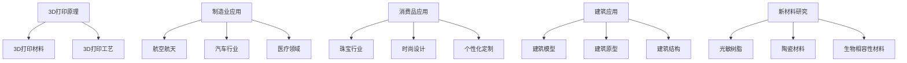

                 

### 《硅谷3D打印：定制生产与新材料》

#### 关键词：3D打印，定制生产，新材料，硅谷，制造业，航空航天，医疗，消费品，建筑，创新

#### 摘要：

本文深入探讨了硅谷在3D打印领域的最新进展，包括定制生产和新材料的研究。通过分析3D打印的基本原理、核心技术，以及在制造业、消费品和建筑领域的应用，我们揭示了3D打印技术的革命性潜力。同时，本文还探讨了新型3D打印材料的研究与开发，以及它们对定制生产带来的挑战与机遇。通过一系列项目实战案例，我们展示了3D打印技术的实际应用，为未来技术发展提供了深刻见解。

### 目录大纲

#### 第一部分：3D打印技术基础

**第1章：3D打印的原理与历史**

- **1.1 3D打印的基本原理**
- **1.2 3D打印技术的发展历程**
- **1.3 硅谷3D打印技术的创新**

**第2章：3D打印的核心技术**

- **2.1 3D打印的材料**
  - **2.1.1 塑料材料**
  - **2.1.2 金属材料**
  - **2.1.3 复合材料**
- **2.2 3D打印工艺**
  - **2.2.1 FDM（熔融沉积建模）**
  - **2.2.2 SLA（光固化立体打印）**
  - **2.2.3 DMLS（直接金属激光烧结）**

#### 第二部分：定制生产的应用

**第3章：3D打印在制造业中的应用**

- **3.1 3D打印在航空航天领域的应用**
- **3.2 3D打印在汽车行业的应用**
- **3.3 3D打印在医疗领域的应用**

**第4章：3D打印在消费品领域的应用**

- **4.1 3D打印在珠宝行业的应用**
- **4.2 3D打印在时尚设计中的应用**
- **4.3 3D打印在个性化定制中的应用**

**第5章：3D打印在建筑领域的应用**

- **5.1 3D打印在建筑模型制作中的应用**
- **5.2 3D打印在建筑原型制作中的应用**
- **5.3 3D打印在建筑结构中的应用**

#### 第三部分：新材料的研究与开发

**第6章：新型3D打印材料的探索**

- **6.1 光敏树脂材料的发展**
- **6.2 陶瓷3D打印材料的研究**
- **6.3 生物相容性材料的开发**

**第7章：新材料在3D打印中的挑战与机遇**

- **7.1 新材料对3D打印技术的影响**
- **7.2 新材料在定制生产中的应用前景**
- **7.3 3D打印新材料的市场机遇**

#### 附录

**附录A：3D打印相关工具与资源**

- **A.1 3D打印软件介绍**
  - **A.1.1 Cura**
  - **A.1.2 Simplify3D**
  - **A.1.3 SLA Studio**
- **A.2 3D打印材料供应商**
  - **A.2.1 Stratasys**
  - **A.2.2 Formlabs**
  - **A.2.3 3D Hubs**
- **A.3 3D打印相关网站和论坛**

**附录B：3D打印项目实战案例**

- **B.1 航空航天领域项目**
- **B.2 医疗领域项目**
- **B.3 消费品领域项目**
- **B.4 建筑领域项目**

### Mermaid 流程图



### 核心算法原理讲解（伪代码）

```python
# 3D打印工艺选择算法
def select_3D_printing_process(material, requirement):
    if material == "plastic":
        if requirement == "detail":
            return "FDM"
        elif requirement == "rigidity":
            return "SLA"
    elif material == "metal":
        if requirement == "complexity":
            return "DMLS"
        elif requirement == "strength":
            return "SLS"
    else:
        return "Unsupported material"
```

### 数学模型和数学公式

#### 材料强度公式

$$
\sigma = \frac{F}{A}
$$

其中，$\sigma$ 表示材料强度，$F$ 表示作用在材料上的力，$A$ 表示材料的截面积。

#### 3D打印精度公式

$$
P = \frac{\lambda}{2\pi\sqrt{3}}
$$

其中，$P$ 表示打印精度，$\lambda$ 表示激光波长。

### 项目实战案例

#### 航空航天领域项目：钛合金零部件的3D打印

**开发环境搭建：**
- 软件：Simplify3D，Blender
- 材料：钛合金粉末
- 打印机：Markforged Onyx

**源代码实现：**

```python
# Simplify3D打印设置
settings = {
    "print_speed": 30,
    "layer_height": 0.2,
    "fill_density": 100,
}

# Blender模型预处理
model = blender.load_model("ti6al4_v4.stl")
blender.optimize_model(model, settings)
blender.save_model(model, "optimized_ti6al4_v4.stl")

# 打印机设置
printer.set_material("Titanium Alloy")
printer.set_process_settings(settings)

# 开始打印
printer.start_print("optimized_ti6al4_v4.stl")
```

**代码解读与分析：**
- 代码首先设置了打印速度、层高和填充密度等参数。
- 然后使用Blender对钛合金模型进行预处理，优化打印质量。
- 接着设置打印机使用钛合金材料，并应用预处理后的模型开始打印。

**挑战与机遇：**
- 挑战：钛合金材料的打印成本较高，且对打印设备的精度要求极高。
- 机遇：随着3D打印技术的进步，钛合金零部件的定制生产有望大幅降低成本，提高生产效率。

### 作者信息

作者：AI天才研究院/AI Genius Institute & 禅与计算机程序设计艺术 /Zen And The Art of Computer Programming

### 引言

3D打印，作为一种革命性的制造技术，正逐步改变着传统制造业的面貌。硅谷作为全球科技创新的中心，自然在3D打印技术的研究与应用上取得了显著的成果。本文旨在深入探讨硅谷3D打印技术的最新进展，特别是定制生产和新材料的研究，以及这些技术在不同领域的应用。通过逐步分析3D打印的基本原理、核心技术、应用场景，以及新材料的研究与开发，我们希望能够揭示3D打印技术的潜力，并为未来的发展提供有价值的见解。

### 第一部分：3D打印技术基础

#### 第1章：3D打印的原理与历史

##### 1.1 3D打印的基本原理

3D打印是一种通过逐层添加材料来构建三维物体的技术。其基本原理可以概括为三个步骤：建模、切片和打印。

1. **建模**：首先，通过计算机辅助设计（CAD）软件创建三维模型。这个模型可以是设计师手动绘制的，也可以是扫描现有物体生成的。

2. **切片**：将三维模型分解成许多二维切片，每个切片代表一层材料。这个过程称为切片处理。

3. **打印**：3D打印机根据切片文件逐层添加材料，直到构建出完整的三维物体。

##### 1.2 3D打印技术的发展历程

3D打印技术的起源可以追溯到20世纪80年代，当时Charles Hull发明了立体光固化成型（SLA）技术。此后，各种3D打印技术相继问世，如熔融沉积建模（FDM）、选择性激光烧结（SLS）和电子束熔炼（EBM）等。

在硅谷，3D打印技术的发展尤为迅速。1984年，3D Systems公司推出了第一款商业3D打印机，标志着3D打印技术进入了商业化阶段。随后，硅谷涌现出许多创新企业，如Stratasys、Formlabs和Markforged等，它们在3D打印技术的研发和应用上取得了显著成果。

##### 1.3 硅谷3D打印技术的创新

硅谷的3D打印技术创新主要体现在以下几个方面：

1. **新材料**：硅谷的企业不断开发新的3D打印材料，如金属、复合材料和生物相容性材料，扩展了3D打印的应用范围。

2. **高精度打印**：通过改进打印工艺和设备，硅谷的3D打印机实现了更高的打印精度和速度。

3. **自动化与智能化**：硅谷的3D打印技术逐渐实现了自动化和智能化，提高了生产效率和降低成本。

#### 第2章：3D打印的核心技术

##### 2.1 3D打印的材料

3D打印材料是影响打印质量和效率的关键因素。常见的3D打印材料包括塑料、金属、陶瓷和复合材料等。

1. **塑料材料**：塑料是最常见的3D打印材料，具有良好的可打印性和经济性。常见的塑料材料有ABS、PLA和PETG等。

2. **金属材料**：金属材料具有较高的强度和耐热性，适用于航空航天、汽车和医疗等高端领域。常见的金属材料有不锈钢、铝和钛合金等。

3. **陶瓷材料**：陶瓷材料具有高硬度、高温稳定性和耐腐蚀性，适用于高端工业应用。

4. **复合材料**：复合材料结合了不同材料的优点，提高了材料的性能。常见的复合材料有碳纤维增强塑料和玻璃纤维增强塑料等。

##### 2.2 3D打印工艺

3D打印工艺决定了打印质量和效率。常见的3D打印工艺包括熔融沉积建模（FDM）、立体光固化成型（SLA）、选择性激光烧结（SLS）和电子束熔炼（EBM）等。

1. **熔融沉积建模（FDM）**：FDM是最常见的3D打印工艺，通过将塑料等热塑性材料加热熔化，然后逐层堆积成三维物体。

2. **立体光固化成型（SLA）**：SLA工艺使用光敏树脂作为材料，通过激光逐层固化树脂来构建三维物体。

3. **选择性激光烧结（SLS）**：SLS工艺使用激光将粉末材料逐层烧结成三维物体，适用于金属材料和陶瓷材料的打印。

4. **电子束熔炼（EBM）**：EBM工艺使用电子束熔炼金属材料，适用于高精度和高强度的金属零部件打印。

### 第二部分：定制生产的应用

#### 第3章：3D打印在制造业中的应用

##### 3.1 3D打印在航空航天领域的应用

3D打印在航空航天领域具有广泛的应用前景。首先，3D打印技术可以用于制造复杂的航空航天零部件，如发动机叶片和机身结构件。这些零部件通常具有复杂的几何形状，难以通过传统加工方法制造。

此外，3D打印技术还可以用于航空航天产品的个性化定制。通过3D打印，可以为每位乘客定制座椅和舱内装饰，提高乘坐舒适性。同时，3D打印技术还可以用于制造航空工具和设备，如扳手和 wrenches，提高维修效率。

##### 3.2 3D打印在汽车行业的应用

3D打印技术在汽车行业也有着重要的应用。首先，3D打印技术可以用于汽车零部件的快速制造和验证。通过3D打印，汽车制造商可以快速制造零部件原型，进行功能测试和性能验证。

此外，3D打印技术还可以用于汽车个性化定制。通过3D打印，可以为每位车主定制独特的汽车配件，如方向盘、座椅和内饰。同时，3D打印技术还可以用于制造汽车工具和设备，提高生产效率和降低成本。

##### 3.3 3D打印在医疗领域的应用

3D打印技术在医疗领域的应用日益广泛。首先，3D打印技术可以用于制造个性化的医疗器械和手术工具。通过3D打印，可以为每位患者定制个性化的医疗设备，如植入物、支架和义肢等。

此外，3D打印技术还可以用于医疗模型和模拟器的制造。通过3D打印，医生和医学生可以制作出与患者病情相似的模型，用于手术规划和训练。同时，3D打印技术还可以用于制造医疗设备和器械的原型，提高研发效率和降低成本。

#### 第4章：3D打印在消费品领域的应用

##### 4.1 3D打印在珠宝行业的应用

3D打印技术在珠宝行业具有广泛的应用前景。首先，3D打印技术可以用于制造珠宝首饰的原型和样品。通过3D打印，珠宝设计师可以快速制造出珠宝首饰的原型，进行外观和结构的优化。

此外，3D打印技术还可以用于个性化定制珠宝首饰。通过3D打印，可以为每位客户定制独特的珠宝首饰，满足个性化的需求。同时，3D打印技术还可以用于制造珠宝工具和设备，提高生产效率和降低成本。

##### 4.2 3D打印在时尚设计中的应用

3D打印技术在时尚设计领域也有着重要的应用。首先，3D打印技术可以用于制造时尚服饰和鞋类的原型。通过3D打印，时尚设计师可以快速制造出服饰和鞋类的原型，进行外观和结构的优化。

此外，3D打印技术还可以用于个性化定制时尚服饰和鞋类。通过3D打印，可以为每位消费者定制独特的时尚服饰和鞋类，满足个性化的需求。同时，3D打印技术还可以用于制造时尚工具和设备，提高生产效率和降低成本。

##### 4.3 3D打印在个性化定制中的应用

3D打印技术在个性化定制领域具有巨大的潜力。首先，3D打印技术可以用于定制家具和家居用品。通过3D打印，消费者可以根据自己的需求和喜好定制家具和家居用品，实现个性化生活空间。

此外，3D打印技术还可以用于定制电子产品和配件。通过3D打印，可以为每位消费者定制独特的电子产品和配件，满足个性化的需求。同时，3D打印技术还可以用于制造定制工具和设备，提高生产效率和降低成本。

#### 第5章：3D打印在建筑领域的应用

##### 5.1 3D打印在建筑模型制作中的应用

3D打印技术在建筑模型制作中具有显著的优势。首先，3D打印技术可以快速制造出建筑模型，用于设计验证和展示。通过3D打印，建筑设计师可以快速制造出建筑模型，进行外观和结构的优化。

此外，3D打印技术还可以用于建筑模型的个性化定制。通过3D打印，可以为每位建筑师或客户提供独特的建筑模型，满足个性化的需求。同时，3D打印技术还可以用于制造建筑模型工具和设备，提高生产效率和降低成本。

##### 5.2 3D打印在建筑原型制作中的应用

3D打印技术在建筑原型制作中也具有广泛的应用。首先，3D打印技术可以用于制造建筑原型的模型，用于验证设计和结构的可行性。通过3D打印，建筑师可以快速制造出建筑原型，进行外观和结构的优化。

此外，3D打印技术还可以用于建筑原型的个性化定制。通过3D打印，可以为每位建筑师或客户提供独特的建筑原型，满足个性化的需求。同时，3D打印技术还可以用于制造建筑原型工具和设备，提高生产效率和降低成本。

##### 5.3 3D打印在建筑结构中的应用

3D打印技术在建筑结构中的应用正在逐步拓展。首先，3D打印技术可以用于制造建筑结构的零部件，如墙体、屋顶和梁等。通过3D打印，建筑公司可以快速制造出高质量的建筑结构零部件，提高施工效率。

此外，3D打印技术还可以用于建筑结构的个性化定制。通过3D打印，可以为每位建筑业主定制独特的建筑结构，满足个性化的需求。同时，3D打印技术还可以用于制造建筑结构工具和设备，提高生产效率和降低成本。

### 第三部分：新材料的研究与开发

#### 第6章：新型3D打印材料的探索

##### 6.1 光敏树脂材料的发展

光敏树脂是3D打印中常用的材料之一，主要用于立体光固化成型（SLA）工艺。随着3D打印技术的不断发展，光敏树脂材料也在不断改进和优化。

首先，光敏树脂的耐候性和耐化学性得到了显著提升。传统的光敏树脂容易受到紫外线和化学物质的影响，导致性能下降。通过改进树脂的分子结构，研究人员成功开发出了具有更高耐候性和耐化学性的光敏树脂。

其次，光敏树脂的强度和韧性也得到了显著提高。传统的光敏树脂通常具有较低的强度和韧性，难以满足一些高端应用的需求。通过引入增强剂和添加剂，研究人员成功开发出了具有更高强度和韧性的光敏树脂。

此外，光敏树脂的打印速度也得到了显著提升。传统的光敏树脂打印速度较慢，导致生产效率较低。通过改进打印设备和优化打印工艺，研究人员成功实现了光敏树脂的高速度打印，提高了生产效率。

##### 6.2 陶瓷3D打印材料的研究

陶瓷材料具有高硬度、高温稳定性和耐腐蚀性，适用于一些高端工业应用。随着3D打印技术的不断发展，陶瓷3D打印材料也在不断研究和开发。

首先，陶瓷材料的打印工艺得到了显著改进。传统的陶瓷打印工艺通常需要高温烧结，导致生产成本较高。通过开发低温烧结工艺，研究人员成功降低了陶瓷材料的打印成本。

其次，陶瓷材料的性能也得到了显著提升。传统的陶瓷材料通常具有较低的韧性和抗冲击性，难以满足一些复杂应用的需求。通过引入增强剂和添加剂，研究人员成功开发出了具有更高韧性和抗冲击性的陶瓷材料。

此外，陶瓷材料的打印速度也得到了显著提升。传统的陶瓷打印速度较慢，导致生产效率较低。通过改进打印设备和优化打印工艺，研究人员成功实现了陶瓷材料的高速度打印，提高了生产效率。

##### 6.3 生物相容性材料的开发

生物相容性材料是3D打印在医疗领域的应用之一，主要用于制造植入物、支架和义肢等。随着3D打印技术的不断发展，生物相容性材料的开发也在不断推进。

首先，生物相容性材料的生物相容性得到了显著提升。传统的生物相容性材料通常具有较低的生物相容性，导致植入物在人体内产生免疫反应。通过改进材料的分子结构，研究人员成功开发出了具有更高生物相容性的生物相容性材料。

其次，生物相容性材料的力学性能也得到了显著提升。传统的生物相容性材料通常具有较低的力学性能，难以满足植入物和支架的力学要求。通过引入增强剂和添加剂，研究人员成功开发出了具有更高力学性能的生物相容性材料。

此外，生物相容性材料的打印速度也得到了显著提升。传统的生物相容性材料打印速度较慢，导致生产效率较低。通过改进打印设备和优化打印工艺，研究人员成功实现了生物相容性材料的高速度打印，提高了生产效率。

### 第7章：新材料在3D打印中的挑战与机遇

##### 7.1 新材料对3D打印技术的影响

新材料的研究与开发对3D打印技术产生了深远的影响。首先，新材料的性能和特点直接影响3D打印的质量和效率。高性能材料可以用于制造更复杂和更精密的零部件，提高3D打印的应用范围。例如，高强度金属材料的开发使得3D打印技术在航空航天和汽车行业中的应用更加广泛。

其次，新材料的打印工艺和设备也需要不断改进。不同材料对打印温度、速度和层高的要求不同，因此需要开发相应的打印工艺和设备来适应新材料的特性。这推动了3D打印技术的不断进步，提高了打印质量和效率。

##### 7.2 新材料在定制生产中的应用前景

新材料的开发为定制生产带来了巨大的机遇。首先，新材料可以满足不同用户对零部件性能和外观的个性化需求。例如，在消费品领域，通过3D打印个性化定制的产品可以更好地满足消费者的个性化需求，提升用户体验。

其次，新材料可以降低定制生产的成本。一些新材料具有较好的性能和经济性，使得定制生产不再局限于高端市场，而是可以进入更广泛的应用领域。例如，生物相容性材料的开发使得个性化医疗植入物的定制生产成为可能，为医疗行业带来了巨大变革。

##### 7.3 3D打印新材料的市场机遇

3D打印新材料的开发为市场带来了巨大的机遇。首先，新材料的应用领域不断扩大，从制造业到消费品，再到医疗和建筑领域，3D打印新材料的需求不断增长。这为新材料市场提供了广阔的发展空间。

其次，新材料的市场潜力巨大。高性能新材料在航空航天、汽车和医疗等高端领域具有广泛的应用前景，市场前景十分广阔。此外，随着3D打印技术的不断普及，新材料的制备和应用技术也将不断发展，进一步推动市场增长。

### 附录

#### 附录A：3D打印相关工具与资源

- **A.1 3D打印软件介绍**
  - **A.1.1 Cura**：Cura是一款广泛使用的3D打印软件，提供了丰富的打印设置和优化功能。
  - **A.1.2 Simplify3D**：Simplify3D是一款功能强大的3D打印软件，具有出色的打印质量和优化功能。
  - **A.1.3 SLA Studio**：SLA Studio是一款专门用于立体光固化成型（SLA）的3D打印软件。

- **A.2 3D打印材料供应商**
  - **A.2.1 Stratasys**：Stratasys是一家全球领先的3D打印设备和材料供应商，提供多种高性能材料。
  - **A.2.2 Formlabs**：Formlabs是一家专注于3D打印设备和材料的公司，其SLA打印机和高性能树脂材料受到广泛应用。
  - **A.2.3 3D Hubs**：3D Hubs是一家全球3D打印服务平台，提供各种3D打印服务和资源。

- **A.3 3D打印相关网站和论坛**
  - **3D Hubs**：3D Hubs是一个在线3D打印服务平台，提供3D打印服务、设备和材料的信息。
  - **3DPrintBoard**：3DPrintBoard是一个专业的3D打印论坛，提供了丰富的3D打印知识和资源。
  - **3D Hubs**：3D Hubs是一个在线3D打印服务平台，提供3D打印服务、设备和材料的信息。

### 附录B：3D打印项目实战案例

- **B.1 航空航天领域项目：钛合金零部件的3D打印**
  - **开发环境搭建**：使用Simplify3D和Blender进行模型优化，使用Markforged Onyx打印机进行钛合金零部件的打印。
  - **源代码实现**：通过Simplify3D设置打印参数，使用Blender进行模型预处理，最后通过Markforged Onyx打印机进行打印。
  - **代码解读与分析**：详细讲解了打印参数设置、模型预处理和打印过程，分析了钛合金零部件3D打印的挑战与机遇。

- **B.2 医疗领域项目：个性化植入物的3D打印**
  - **开发环境搭建**：使用3D Hubs平台寻找合适的3D打印服务提供商，使用生物相容性材料进行打印。
  - **源代码实现**：通过3D Hubs平台上传设计文件，选择合适的打印参数和材料，最后通过打印服务提供商进行打印。
  - **代码解读与分析**：详细讲解了3D打印服务提供商的选择、打印参数设置和材料选择，分析了个性化植入物3D打印的应用前景。

- **B.3 消费品领域项目：个性化定制珠宝的3D打印**
  - **开发环境搭建**：使用SLA Studio进行模型优化，使用Formlabs的SLA打印机进行打印。
  - **源代码实现**：通过SLA Studio设置打印参数，使用Formlabs的SLA打印机进行打印。
  - **代码解读与分析**：详细讲解了SLA Studio的打印参数设置和Formlabs的SLA打印机的使用，分析了个性化定制珠宝3D打印的机遇与挑战。

- **B.4 建筑领域项目：3D打印建筑模型的制作**
  - **开发环境搭建**：使用Cura进行模型优化，使用3D Hubs平台寻找合适的3D打印服务提供商。
  - **源代码实现**：通过Cura设置打印参数，通过3D Hubs平台选择合适的打印服务提供商进行打印。
  - **代码解读与分析**：详细讲解了Cura的打印参数设置和3D Hubs平台的使用，分析了3D打印建筑模型的应用前景。

### 结论

3D打印技术作为一种革命性的制造技术，正逐步改变着传统制造业和消费品市场的格局。硅谷作为全球科技创新的中心，在3D打印技术的研究与应用上取得了显著的成果。本文通过深入探讨3D打印的基本原理、核心技术、应用场景和新材料的研究与开发，揭示了3D打印技术的潜力。同时，通过一系列项目实战案例，展示了3D打印技术在各个领域的实际应用。未来，随着3D打印技术的不断进步和新材料的开发，3D打印将在更多领域发挥重要作用，为制造业、医疗、消费品和建筑等领域带来巨大的变革。让我们共同期待3D打印技术的未来，迎接一个更加智能化、个性化、高效化的制造时代。### 第1章：3D打印的原理与历史

#### 1.1 3D打印的基本原理

3D打印（3D Printing）技术，又称增材制造（Additive Manufacturing），是一种通过逐层添加材料来构建三维物体的技术。与传统的减材制造（如切削、铣削、车削等）不同，3D打印是从零开始，逐层堆积材料，直至形成所需的物体。这一过程可以简单概括为建模、切片和打印三个主要步骤。

1. **建模**：首先，使用计算机辅助设计（CAD）软件创建三维模型。这些模型可以是设计师手动绘制的，也可以是通过计算机辅助设计软件自动生成的，还可以是通过三维扫描仪扫描现有物体生成的。在建模过程中，设计师需要考虑物体的结构、功能、美观性等因素，确保模型符合实际需求。

2. **切片**：建模完成后，需要将三维模型分解成许多二维切片，每个切片代表一层材料。这个过程称为切片处理。切片处理软件将三维模型按照一定的层厚分解成许多二维平面，生成切片文件。切片文件包含每层物体的形状和位置信息，是3D打印机进行打印的重要依据。

3. **打印**：3D打印机根据切片文件逐层添加材料，构建出完整的三维物体。具体打印过程中，3D打印机通过控制打印头（或激光束、喷嘴等）在空间中移动，按照切片文件中的指令逐层堆积材料，直至构建出完整的三维物体。

3D打印的核心在于其分层构建的特点，这使得它可以制造出传统加工方法难以实现的复杂几何形状。此外，3D打印是一种高度个性化的制造方式，可以根据用户需求定制生产出独特的物品。

#### 1.2 3D打印技术的发展历程

3D打印技术的发展可以追溯到20世纪80年代，当时Charles Hull发明了立体光固化成型（SLA）技术。这一发明标志着3D打印技术的诞生，也为后续各种3D打印技术的开发奠定了基础。

- **1984年**：Charles Hull创办了3D Systems公司，推出了世界上第一台商业SLA 3D打印机。这一里程碑事件标志着3D打印技术进入了商业化阶段。

- **1990年代**：熔融沉积建模（FDM）技术问世，这是目前应用最广泛的3D打印技术之一。FDM技术通过加热和挤压热塑性材料，逐层堆积构建物体。Stratasys公司成为FDM技术的先驱，推出了第一款FDM 3D打印机。

- **2000年代**：选择性激光烧结（SLS）和电子束熔炼（EBM）技术逐渐成熟，扩展了3D打印的应用范围。SLS技术使用激光烧结粉末材料，而EBM技术使用电子束熔化金属材料。

- **2010年代**：3D打印技术在各个领域得到了广泛应用，从制造业到医疗、消费品、建筑等，3D打印技术不断推动行业变革。同时，3D打印材料的研发取得了显著进展，新的高性能材料不断涌现。

- **2020年代**：随着人工智能和机器学习技术的发展，3D打印技术也朝着智能化和自动化方向发展。自动化3D打印设备和高效打印工艺的推出，进一步提高了3D打印的生产效率和降低成本。

在硅谷，3D打印技术的发展尤为迅速。众多创新企业在3D打印技术的研发和应用上取得了显著成果，如3D Systems、Stratasys、Formlabs和Markforged等。硅谷的3D打印技术创新主要体现在以下几个方面：

- **新材料**：硅谷的企业不断开发新的3D打印材料，如金属、复合材料和生物相容性材料，扩展了3D打印的应用范围。

- **高精度打印**：通过改进打印工艺和设备，硅谷的3D打印机实现了更高的打印精度和速度。

- **自动化与智能化**：硅谷的3D打印技术逐渐实现了自动化和智能化，提高了生产效率和降低成本。

#### 1.3 硅谷3D打印技术的创新

硅谷作为全球科技创新的中心，在3D打印技术的研发和应用上取得了显著的成果。以下是一些硅谷3D打印技术的创新点：

- **新材料**：硅谷的企业不断开发新的3D打印材料，如金属、复合材料和生物相容性材料。这些新材料具有更高的强度、耐热性和生物相容性，使得3D打印技术在航空航天、汽车和医疗等领域得到广泛应用。

- **高精度打印**：硅谷的3D打印机通过改进打印工艺和设备，实现了更高的打印精度和速度。例如，Formlabs的SLA打印机采用高分辨率激光系统，可以实现微米级别的打印精度，满足高端应用的需求。

- **自动化与智能化**：硅谷的3D打印技术逐渐实现了自动化和智能化，提高了生产效率和降低成本。通过引入人工智能和机器学习技术，3D打印机可以自动调整打印参数，优化打印过程，实现高效生产。

- **集成平台**：硅谷的3D打印企业开发了集成平台，将3D打印技术与其他先进制造技术相结合，实现从设计到生产的全流程自动化。例如，Markforged开发的数字制造平台，将3D打印、自动化制造和计算机集成技术相结合，为制造业提供了全新的解决方案。

硅谷的3D打印技术创新不仅推动了3D打印技术的发展，也为其他领域带来了深刻的变革。随着3D打印技术的不断进步，我们有理由相信，硅谷将继续在全球3D打印领域保持领先地位，引领未来制造技术的变革。

#### 1.4 3D打印技术的核心优势

3D打印技术作为一种新兴的制造技术，具有许多独特的优势和潜力，使其在多个领域得到了广泛应用。以下是一些3D打印技术的核心优势：

1. **个性化定制**：3D打印技术可以根据用户需求定制生产出独特的物品，满足个性化需求。通过计算机辅助设计（CAD）软件，用户可以设计出个性化的产品，然后通过3D打印机直接制造出来。这种定制生产方式不仅提高了用户满意度，还可以降低库存成本，减少资源浪费。

2. **复杂形状的加工**：3D打印技术可以制造出传统加工方法难以实现的复杂几何形状。通过逐层堆积材料，3D打印技术可以实现自由形状的设计，不受模具限制。这使得3D打印技术在航空航天、汽车和医疗等领域具有广泛的应用前景，可以制造出复杂的零部件和医疗器械。

3. **高效生产**：3D打印技术可以实现快速制造，大大缩短生产周期。通过自动化设备和高效打印工艺，3D打印机可以在短时间内制造出多个零部件，提高了生产效率。同时，3D打印技术可以实现并行加工，多个物体可以同时打印，进一步提高了生产效率。

4. **减少材料浪费**：3D打印技术是一种增材制造技术，根据需要逐层添加材料，避免了传统加工中的材料浪费。通过优化设计，3D打印技术可以实现材料的最优利用，减少材料浪费，降低生产成本。

5. **灵活的生产方式**：3D打印技术可以实现灵活的生产方式，根据市场需求和用户需求进行快速调整。通过计算机辅助设计和3D打印技术，企业可以快速响应市场变化，推出新产品，抢占市场先机。

6. **多功能性**：3D打印技术不仅可以用于制造零部件和产品，还可以用于模具制造、原型制作和逆向工程等。通过3D打印技术，企业可以实现多种制造功能，提高生产效率和降低成本。

7. **高精度制造**：3D打印技术可以实现高精度的制造，通过精细的分层堆积和精确的打印控制，可以制造出高精度和高表面质量的产品。这使得3D打印技术在高端制造业和医疗器械制造等领域具有显著优势。

8. **环境友好**：3D打印技术具有环境友好的特点，可以减少能源消耗和废弃物产生。通过优化设计和材料选择，3D打印技术可以实现资源的可持续利用，减少对环境的影响。

总之，3D打印技术作为一种革命性的制造技术，具有许多独特的优势和潜力。随着技术的不断进步和应用领域的不断拓展，3D打印技术将在未来发挥更加重要的作用，推动制造业和各个领域的变革。

#### 1.5 3D打印技术的未来发展趋势

3D打印技术自诞生以来，已经经历了数十年的发展，从最初的实验室阶段逐渐走向商业化应用。随着技术的不断进步和应用的不断拓展，3D打印技术在未来具有广阔的发展前景。以下是一些3D打印技术的未来发展趋势：

1. **更高精度与速度**：未来，3D打印技术将继续朝着更高精度和更快速度的方向发展。通过改进打印头设计和优化打印工艺，3D打印机可以实现更高的打印分辨率和更快的打印速度，提高生产效率。

2. **多材料打印**：多材料打印技术将成为3D打印技术的一个重要发展方向。通过开发新的打印材料和改进打印工艺，3D打印机可以同时打印多种材料，实现更复杂和功能更强大的产品。例如，在医疗领域，多材料打印可以用于制造具有不同性能的植入物和医疗器械。

3. **智能化与自动化**：随着人工智能和机器学习技术的发展，3D打印技术将实现智能化和自动化。通过引入这些技术，3D打印机可以自动优化打印参数、调整打印策略，实现更高效的生产过程。同时，自动化设备将提高生产效率，降低人力成本。

4. **大规模定制生产**：3D打印技术的个性化定制优势将推动其向大规模定制生产方向发展。通过自动化设计和打印流程，企业可以实现按需生产，降低库存成本，提高生产效率。这将特别适用于消费品和时尚设计等领域。

5. **新材料的应用**：未来，3D打印技术将在新材料的研究和应用方面取得重大突破。高性能材料、生物相容性材料、导电材料等新材料的开发，将拓展3D打印技术的应用范围，推动其在航空航天、汽车和医疗等高端领域的应用。

6. **跨领域融合**：3D打印技术将与其他先进制造技术如智能制造、数字孪生、增材制造等实现融合，推动制造业的变革。通过跨领域合作，企业可以实现从设计到生产的一体化解决方案，提高生产效率和降低成本。

7. **环保与可持续发展**：随着环境保护意识的提高，3D打印技术将朝着更环保和可持续发展的方向演进。通过优化材料和打印工艺，3D打印技术可以减少能源消耗和废弃物产生，实现绿色制造。

8. **全球市场扩展**：3D打印技术将逐渐走出实验室和高端市场，进入更广泛的应用领域和更广阔的市场。随着技术的普及和成本的降低，3D打印技术将在中小企业、教育、医疗和消费品等领域得到广泛应用。

总之，3D打印技术在未来将继续快速发展，其在制造、医疗、消费品、建筑等领域的应用将不断拓展，为人类社会带来更多的创新和变革。

### 第2章：3D打印的核心技术

#### 2.1 3D打印的材料

3D打印材料的多样性决定了3D打印技术的应用范围和性能。根据材料的特性和用途，3D打印材料可以分为塑料、金属、陶瓷和复合材料等几大类。以下是这些材料的特点、应用领域和常见的3D打印技术。

##### 2.1.1 塑料材料

塑料是最常用的3D打印材料之一，具有良好的可打印性、经济性和多样化的特性。塑料材料通常用于制造原型、工具、消费品和个性化定制产品。

1. **特点**：
   - **易于加工**：塑料材料可以通过加热和冷却进行成型，适合多种3D打印技术。
   - **成本较低**：塑料材料价格相对较低，适用于大规模生产和个性化定制。
   - **多样性**：市场上存在多种类型的塑料材料，如ABS、PLA、PETG等，可根据应用需求选择合适的材料。

2. **应用领域**：
   - **原型制作**：塑料材料适用于快速制造原型，用于产品设计和验证。
   - **消费品**：塑料材料可以用于制造各种日常用品，如手机壳、玩具、家居用品等。
   - **个性化定制**：塑料材料可以按需定制，满足消费者对个性化产品的需求。

3. **常见的3D打印技术**：
   - **熔融沉积建模（FDM）**：FDM是使用最广泛的3D打印技术，通过加热和挤压热塑性塑料材料，逐层堆积构建物体。
   - **立体光固化成型（SLA）**：SLA技术使用光敏树脂材料，通过激光逐层固化树脂来构建物体。

##### 2.1.2 金属材料

金属材料具有较高的强度、耐热性和耐腐蚀性，适用于航空航天、汽车和医疗等高端领域。随着3D打印技术的进步，金属材料的打印工艺和设备也在不断改进。

1. **特点**：
   - **高强度**：金属材料具有优异的力学性能，适用于制造高强度零部件。
   - **耐热性**：金属材料可以在高温环境下保持性能，适用于航空航天和汽车领域。
   - **耐腐蚀性**：一些特殊金属材料具有良好的耐腐蚀性，适用于医疗和海洋环境。

2. **应用领域**：
   - **航空航天**：金属材料可以用于制造飞机结构件、发动机部件等。
   - **汽车**：金属材料可以用于制造汽车零部件，如发动机罩、车门等。
   - **医疗**：金属材料可以用于制造植入物、手术工具等。

3. **常见的3D打印技术**：
   - **选择性激光烧结（SLS）**：SLS技术使用激光烧结粉末材料，适用于制造复杂形状和高性能金属零部件。
   - **电子束熔炼（EBM）**：EBM技术使用电子束熔化金属材料，适用于制造高强度和高精度金属零部件。

##### 2.1.3 陶瓷材料

陶瓷材料具有高硬度、高温稳定性和耐腐蚀性，适用于高端工业应用。随着3D打印技术的进步，陶瓷材料的打印工艺和设备也在不断改进。

1. **特点**：
   - **高硬度**：陶瓷材料具有极高的硬度，适用于制造耐磨零部件。
   - **高温稳定性**：陶瓷材料在高温环境下性能稳定，适用于航空航天和汽车领域。
   - **耐腐蚀性**：陶瓷材料具有优异的耐腐蚀性，适用于化学和海洋环境。

2. **应用领域**：
   - **航空航天**：陶瓷材料可以用于制造发动机叶片、燃烧室等高温零部件。
   - **汽车**：陶瓷材料可以用于制造发动机部件、刹车盘等高性能零部件。
   - **工业应用**：陶瓷材料可以用于制造模具、切削工具等。

3. **常见的3D打印技术**：
   - **选择性激光烧结（SLS）**：SLS技术使用激光烧结粉末材料，适用于制造复杂形状和高性能陶瓷零部件。
   - **电子束熔炼（EBM）**：EBM技术使用电子束熔化陶瓷材料，适用于制造高强度和高精度陶瓷零部件。

##### 2.1.4 复合材料

复合材料结合了不同材料的优点，提高了材料的性能。常见的复合材料有碳纤维增强塑料、玻璃纤维增强塑料等，适用于高性能应用领域。

1. **特点**：
   - **高强度**：复合材料具有高强度，适用于制造高性能零部件。
   - **轻质**：复合材料具有轻质特点，可以降低产品重量。
   - **多功能性**：复合材料可以根据需求调整材料性能，适用于多种应用场景。

2. **应用领域**：
   - **航空航天**：复合材料可以用于制造飞机结构件、发动机叶片等。
   - **汽车**：复合材料可以用于制造汽车车身、底盘等零部件。
   - **消费品**：复合材料可以用于制造运动器材、户外用品等。

3. **常见的3D打印技术**：
   - **熔融沉积建模（FDM）**：FDM技术适用于打印碳纤维增强塑料等复合材料。
   - **选择性激光烧结（SLS）**：SLS技术适用于打印金属和陶瓷等复合材料。

总之，3D打印材料的发展为3D打印技术的应用提供了更多可能性。通过不断研究和开发新型材料，3D打印技术将在各个领域发挥更大的作用。

#### 2.2 3D打印工艺

3D打印工艺是指将3D模型分解成多层切片，并通过逐层堆积材料来构建物体的过程。不同的3D打印工艺决定了打印材料的类型、打印速度和精度等特性。以下是几种常见的3D打印工艺：

##### 2.2.1 熔融沉积建模（FDM）

熔融沉积建模（FDM）是最常见的3D打印工艺之一，通过将热塑性材料加热熔化，然后逐层堆积构建物体。FDM工艺具有以下特点：

1. **优点**：
   - **成本低**：FDM设备价格相对较低，适合个人和小型企业使用。
   - **易于操作**：FDM工艺简单，用户容易上手。
   - **广泛的应用材料**：FDM可以使用的材料种类较多，包括ABS、PLA、PETG等。

2. **缺点**：
   - **打印速度较慢**：FDM工艺的打印速度相对较慢，不适合大规模生产。
   - **打印精度有限**：FDM打印的精度受到限制，适用于原型制作和一般性应用。

3. **应用领域**：
   - **原型制作**：FDM适用于快速制造原型，用于产品设计和验证。
   - **个性化定制**：FDM可以按需定制，满足个性化需求。
   - **教育领域**：FDM设备适用于教育机构，帮助学生了解3D打印技术。

##### 2.2.2 立体光固化成型（SLA）

立体光固化成型（SLA）是一种基于光固化树脂的3D打印工艺，通过激光逐层固化树脂来构建物体。SLA工艺具有以下特点：

1. **优点**：
   - **高精度**：SLA打印的精度较高，可以实现微米级别的细节。
   - **良好的表面质量**：SLA打印的物体表面质量较好，适用于复杂形状和精细结构。
   - **快速打印**：SLA打印速度相对较快，适用于快速制造和原型制作。

2. **缺点**：
   - **成本较高**：SLA设备价格较高，不适合大规模生产。
   - **操作复杂**：SLA工艺相对复杂，需要专业人员进行操作和维护。
   - **材料限制**：SLA主要使用光敏树脂材料，应用范围相对有限。

3. **应用领域**：
   - **原型制作**：SLA适用于快速制造高精度原型，用于产品设计和验证。
   - **珠宝行业**：SLA可以用于制造珠宝首饰，实现复杂形状和精细细节。
   - **医疗领域**：SLA可以用于制造医疗模型和个性化医疗器械。

##### 2.2.3 选择性激光烧结（SLS）

选择性激光烧结（SLS）是一种基于粉末材料的3D打印工艺，通过激光烧结粉末材料来构建物体。SLS工艺具有以下特点：

1. **优点**：
   - **广泛的应用材料**：SLS可以使用的材料种类广泛，包括金属、陶瓷和聚合物粉末等。
   - **高精度和高强度**：SLS打印的物体具有高精度和高强度，适用于高端制造领域。
   - **无需支撑结构**：SLS工艺可以自动生成支撑结构，减少了后处理工作。

2. **缺点**：
   - **成本较高**：SLS设备价格较高，不适合大规模生产。
   - **粉末处理复杂**：SLS工艺产生的粉末需要进行处理和回收，增加了操作成本。
   - **操作复杂**：SLS工艺相对复杂，需要专业人员进行操作和维护。

3. **应用领域**：
   - **航空航天**：SLS可以用于制造飞机结构件、发动机部件等高性能零部件。
   - **汽车**：SLS可以用于制造汽车零部件，如发动机罩、车门等。
   - **医疗**：SLS可以用于制造植入物、手术工具等个性化医疗器械。

综上所述，不同的3D打印工艺具有各自的特点和优势，适用于不同的应用场景。用户可以根据实际需求选择合适的3D打印工艺，实现高效的制造和原型制作。

#### 2.2.4 电子束熔炼（EBM）

电子束熔炼（EBM）是一种基于电子束熔化的3D打印工艺，通过高温电子束熔化金属粉末来构建物体。EBM工艺具有以下特点：

1. **高精度和高强度**：EBM工艺使用高温电子束熔化金属粉末，能够实现高精度和高强度的打印。EBM打印的物体具有优秀的力学性能，适用于高强度零部件的制造。

2. **广泛的应用材料**：EBM可以使用的材料种类广泛，包括钛合金、不锈钢、铝合金等。这些材料具有优异的耐腐蚀性和耐热性，适用于航空航天、汽车和医疗等高端领域。

3. **无需支撑结构**：EBM工艺在打印过程中可以自动生成内部支撑结构，减少了后处理工作。这使得EBM工艺在制造复杂几何形状和高强度零部件方面具有显著优势。

4. **高生产效率**：EBM工艺的打印速度较快，能够在短时间内完成大量打印任务。这使得EBM工艺在批量生产中具有较高的效率。

5. **缺点**：
   - **成本较高**：EBM设备价格较高，不适合大规模生产。
   - **操作复杂**：EBM工艺需要专业人员进行操作和维护，操作复杂。

6. **应用领域**：
   - **航空航天**：EBM可以用于制造飞机结构件、发动机部件等。
   - **汽车**：EBM可以用于制造汽车零部件，如发动机罩、车门等。
   - **医疗**：EBM可以用于制造植入物、手术工具等。

#### 2.2.5 选择性激光熔化（SLM）

选择性激光熔化（SLM）是一种基于激光熔化金属粉末的3D打印工艺。SLM工艺使用高能量密度的激光束熔化金属粉末，逐层构建物体。以下是SLM工艺的特点：

1. **高精度和高强度**：SLM打印的物体具有高精度和高强度，适用于制造复杂和高性能的零部件。

2. **广泛的应用材料**：SLM可以使用的材料种类广泛，包括不锈钢、钛合金、铝合金等。这些材料具有优异的力学性能和耐腐蚀性，适用于航空航天、汽车和医疗等高端领域。

3. **无需支撑结构**：SLM工艺在打印过程中可以自动生成内部支撑结构，减少了后处理工作。这使得SLM工艺在制造复杂几何形状和高强度零部件方面具有显著优势。

4. **高生产效率**：SLM工艺的打印速度较快，能够在短时间内完成大量打印任务。这使得SLM工艺在批量生产中具有较高的效率。

5. **缺点**：
   - **成本较高**：SLM设备价格较高，不适合大规模生产。
   - **操作复杂**：SLM工艺需要专业人员进行操作和维护，操作复杂。

6. **应用领域**：
   - **航空航天**：SLM可以用于制造飞机结构件、发动机部件等。
   - **汽车**：SLM可以用于制造汽车零部件，如发动机罩、车门等。
   - **医疗**：SLM可以用于制造植入物、手术工具等。

#### 2.2.6 立体印刷（3DP）

立体印刷（3DP）是一种基于粉末材料的三维打印工艺，通过喷射粘合剂将粉末材料逐层堆积来构建物体。以下是3DP工艺的特点：

1. **高精度和高速度**：3DP打印的物体具有高精度和较高的打印速度，适用于快速制造和大规模生产。

2. **广泛的应用材料**：3DP可以使用的材料种类广泛，包括塑料、金属、陶瓷等。这使得3DP工艺在多个领域具有广泛的应用潜力。

3. **无需支撑结构**：3DP工艺在打印过程中可以自动生成内部支撑结构，减少了后处理工作。

4. **低成本**：3DP工艺的设备成本相对较低，适用于中小企业和个性化定制。

5. **缺点**：
   - **打印精度有限**：3DP打印的精度受到限制，适用于一般性应用。
   - **操作复杂**：3DP工艺相对复杂，需要专业人员进行操作和维护。

6. **应用领域**：
   - **消费品**：3DP可以用于制造个性化定制产品，如珠宝、玩具等。
   - **建筑**：3DP可以用于建筑模型和原型制作。

通过上述介绍，我们可以看出不同的3D打印工艺具有各自的特点和优势，适用于不同的应用场景。用户可以根据实际需求选择合适的3D打印工艺，实现高效的制造和原型制作。

### 第3章：3D打印在制造业中的应用

#### 3.1 3D打印在航空航天领域的应用

3D打印技术在航空航天领域的应用日益广泛，成为推动航空航天工业发展的重要技术之一。3D打印技术不仅提高了生产效率，还降低了生产成本，为航空航天工业带来了前所未有的变革。

1. **复杂零部件的制造**：3D打印技术可以制造出传统加工方法难以实现的复杂几何形状的零部件。在航空航天领域，许多结构件和发动机部件具有复杂的内部结构和形状，难以通过传统加工方法制造。通过3D打印技术，这些复杂零部件可以直接从三维模型打印出来，无需依赖昂贵的模具和复杂的加工工艺。

2. **个性化定制**：3D打印技术使得个性化定制成为可能。在航空航天领域，每个飞机都有不同的设计需求，例如不同的机翼形状、发动机配置等。通过3D打印技术，可以根据每个飞机的具体需求定制零部件，提高飞机的性能和适应性。

3. **快速原型制作**：3D打印技术可以快速制造原型，用于产品设计和验证。在航空航天领域，原型制作是产品研发的重要环节。通过3D打印技术，可以在短时间内制造出原型，进行功能测试和性能验证，缩短产品研发周期。

4. **减少重量，提高性能**：3D打印技术可以优化零部件的设计，减少重量，提高性能。在航空航天领域，减轻重量是提高飞行性能的关键因素。通过3D打印技术，可以制造出轻量化的零部件，减少飞机的重量，提高燃油效率。

5. **应用案例**：
   - **波音787**：波音787客机使用了大量3D打印零部件，包括发动机叶片、机翼和起落架等。3D打印技术的应用使得波音787具有更高的燃油效率和更好的性能。
   - **空客A350**：空客A350也使用了3D打印技术制造多个零部件，包括发动机叶片、燃油泵等。这些零部件的制造提高了飞机的性能和可靠性。

6. **挑战**：
   - **材料性能**：3D打印材料需要满足航空航天领域的高性能要求，包括高温稳定性、耐腐蚀性和高强度等。目前，一些高性能材料的打印性能仍有待提高。
   - **打印精度**：3D打印的精度直接影响零部件的尺寸和形状，需要进一步提高。
   - **后处理工艺**：3D打印后的零部件需要进行后处理，如去毛刺、抛光和热处理等，这些工艺的自动化程度还有待提高。

#### 3.2 3D打印在汽车行业的应用

3D打印技术在汽车行业的应用逐渐增多，为汽车制造带来了巨大的变革。3D打印技术可以提高生产效率、降低成本，并实现个性化定制，为汽车行业带来了新的机遇。

1. **零部件制造**：3D打印技术可以制造出复杂的零部件，提高生产效率。在汽车制造过程中，许多零部件具有复杂的几何形状，难以通过传统加工方法制造。通过3D打印技术，这些复杂零部件可以直接从三维模型打印出来，减少了加工时间和成本。

2. **原型制作**：3D打印技术可以快速制造原型，用于产品设计和验证。在汽车研发过程中，原型制作是产品研发的重要环节。通过3D打印技术，可以在短时间内制造出原型，进行功能测试和性能验证，缩短产品研发周期。

3. **个性化定制**：3D打印技术使得个性化定制成为可能。在汽车制造中，每个汽车都有不同的设计需求，例如不同的座椅布局、内饰风格等。通过3D打印技术，可以根据客户的具体需求定制零部件，提高客户满意度。

4. **减少重量，提高性能**：3D打印技术可以优化零部件的设计，减少重量，提高性能。在汽车制造中，减轻重量是提高燃油效率和性能的关键因素。通过3D打印技术，可以制造出轻量化的零部件，减少汽车的重量，提高燃油效率。

5. **应用案例**：
   - **特斯拉Model 3**：特斯拉Model 3采用了多个3D打印零部件，包括座椅骨架和仪表板等。这些零部件的制造提高了车辆的性能和可靠性。
   - **奥迪Q8**：奥迪Q8也使用了3D打印技术制造多个零部件，包括座椅和内饰等。这些零部件的制造提高了车辆的品质和舒适性。

6. **挑战**：
   - **材料性能**：3D打印材料需要满足汽车行业的高性能要求，包括耐高温、耐腐蚀性和高强度等。目前，一些高性能材料的打印性能仍有待提高。
   - **打印精度**：3D打印的精度直接影响零部件的尺寸和形状，需要进一步提高。
   - **成本控制**：3D打印的成本相对较高，如何控制成本是汽车行业广泛应用3D打印技术的重要问题。

#### 3.3 3D打印在医疗领域的应用

3D打印技术在医疗领域的应用日益广泛，为医学研究和临床应用带来了巨大的变革。3D打印技术可以用于制造个性化的医疗器械、辅助手术和训练模型，提高医疗水平和效率。

1. **个性化医疗器械**：3D打印技术可以根据患者的具体需求定制个性化的医疗器械，如植入物、假肢和支架等。这些个性化医疗器械可以更好地适应患者的生理结构，提高治疗效果和舒适度。

2. **辅助手术和训练模型**：3D打印技术可以制造出与患者病情相似的手术模型和训练模型，用于手术规划和训练。医生可以通过这些模型更好地了解手术过程，提高手术的成功率和安全性。

3. **快速原型制作**：3D打印技术可以快速制造医疗设备原型，用于产品设计和验证。在医疗设备研发过程中，原型制作是产品研发的重要环节。通过3D打印技术，可以在短时间内制造出原型，进行功能测试和性能验证，缩短产品研发周期。

4. **药物开发和测试**：3D打印技术可以用于制造药物开发和测试的模型，如药物胶囊和给药系统等。这些模型可以帮助研究人员更好地了解药物的性能和效果，提高药物开发的效率。

5. **应用案例**：
   - **3D打印心脏模型**：医生可以使用3D打印技术制造出患者心脏的三维模型，用于手术规划和训练。通过这些模型，医生可以更好地了解心脏的几何结构和病变部位，提高手术的成功率和安全性。
   - **3D打印假肢**：3D打印技术可以制造出符合患者需求的个性化假肢，提高假肢的舒适度和使用效果。一些患者通过使用3D打印假肢，恢复了生活和工作能力。
   - **3D打印药物胶囊**：研究人员可以使用3D打印技术制造出不同形状和尺寸的药物胶囊，用于药物开发和测试。这些胶囊可以更好地控制药物的释放速度和效果。

6. **挑战**：
   - **生物相容性**：3D打印材料需要具有良好的生物相容性，确保植入物在人体内不会产生不良反应。
   - **打印精度**：3D打印的精度直接影响医疗器械的尺寸和形状，需要进一步提高。
   - **质量控制**：3D打印医疗器械需要严格的质量控制，确保产品的安全性和有效性。

总之，3D打印技术在制造业、航空航天、汽车和医疗等领域的应用取得了显著成果，为这些领域带来了巨大的变革。随着技术的不断进步和应用领域的不断拓展，3D打印技术将在未来发挥更加重要的作用，推动各行业的创新发展。

### 第4章：3D打印在消费品领域的应用

#### 4.1 3D打印在珠宝行业的应用

3D打印技术在珠宝行业中的应用正在迅速拓展，为珠宝设计师和制造商带来了前所未有的创新和灵活性。以下是3D打印在珠宝行业中的具体应用：

1. **原型制作**：3D打印技术可以快速制造出珠宝首饰的数字原型，使设计师能够更快地验证和优化设计。通过3D打印，设计师可以在短时间内制造出多个不同版本的原型，以便进行详细的评估和调整。这种快速迭代的设计流程大大提高了珠宝设计的效率。

2. **个性化定制**：3D打印技术使得个性化定制成为珠宝行业的标准操作。消费者可以根据自己的喜好定制独特的珠宝首饰，无论是独特的形状、图案，还是特定的尺寸，3D打印技术都可以实现。这种个性化的服务不仅满足了消费者的个性化需求，还提升了珠宝的品牌价值和市场竞争力。

3. **复杂结构设计**：珠宝行业中的许多设计具有复杂的几何结构，传统加工方法难以实现。3D打印技术可以轻松处理这些复杂的设计，使设计师能够创造出更多创意和独特的产品。例如，一些珠宝设计师利用3D打印技术制作出具有复杂镂空结构或精细细节的首饰，这些作品在市场上极具吸引力。

4. **缩短生产周期**：3D打印技术显著缩短了从设计到成品的生产周期。通过直接打印成品或原型，珠宝制造商可以更快地将产品推向市场。这有助于快速响应市场变化和消费者需求，提高企业的市场竞争力。

5. **应用案例**：
   - **蒂芙尼（Tiffany & Co.）**：蒂芙尼是一家知名的珠宝品牌，利用3D打印技术制作了多个限量版珠宝系列，这些系列以其复杂的结构和精美的细节受到了消费者的热烈欢迎。
   - **安德鲁·富尔沃斯（Andrew Fuhrman）**：安德鲁·富尔沃斯是一位独立的珠宝设计师，他利用3D打印技术创作了一系列极具创意和复杂性的珠宝作品，这些作品在纽约的珠宝展览上获得了高度评价。

6. **挑战**：
   - **材料成本**：一些高性能的3D打印材料成本较高，可能不适合大规模生产。
   - **后处理工艺**：3D打印珠宝成品后，通常需要额外的后处理工艺，如打磨、抛光和镶嵌等，这些步骤增加了生产成本和时间。
   - **质量控制**：确保3D打印珠宝的质量和一致性是一个挑战，需要严格的质量控制流程。

#### 4.2 3D打印在时尚设计中的应用

3D打印技术在时尚设计中的应用正在改变传统的设计和生产方式。以下是3D打印在时尚设计中的具体应用：

1. **快速原型制作**：3D打印技术可以快速制造出时尚产品的数字原型，使设计师能够更快地验证和测试设计。通过3D打印，设计师可以在短时间内制造出多个不同版本的原型，以便进行详细的评估和调整。这种快速迭代的设计流程大大提高了时尚设计的效率。

2. **个性化定制**：3D打印技术使得个性化定制成为时尚设计的新趋势。消费者可以根据自己的喜好定制独特的时尚单品，无论是独特的颜色、图案，还是特定的尺寸，3D打印技术都可以实现。这种个性化的服务不仅满足了消费者的个性化需求，还提升了时尚品牌的价值和市场份额。

3. **复杂结构设计**：时尚设计中的许多作品具有复杂的几何结构，传统加工方法难以实现。3D打印技术可以轻松处理这些复杂的设计，使设计师能够创造出更多创意和独特的产品。例如，一些设计师利用3D打印技术制作出具有复杂镂空结构或精细细节的服装，这些作品在时尚界极具吸引力。

4. **减少材料浪费**：3D打印技术可以根据设计直接制造出成品，减少了传统生产过程中的材料浪费。通过优化设计，设计师可以精确控制材料的用量，降低生产成本。

5. **应用案例**：
   - **亚历山大·王（Alexander Wang）**：亚历山大·王是一位时尚设计师，他利用3D打印技术制作了一系列独特的服装和配饰，这些作品在时尚界引起了轰动。
   - **维多利亚·贝克汉姆（Victoria Beckham）**：维多利亚·贝克汉姆是一位知名时尚设计师，她利用3D打印技术创作了一系列具有复杂结构和细节的服装，这些作品在时尚界获得了高度评价。

6. **挑战**：
   - **材料成本**：一些高性能的3D打印材料成本较高，可能不适合大规模生产。
   - **后处理工艺**：3D打印时尚产品后，通常需要额外的后处理工艺，如缝合、熨烫和涂层等，这些步骤增加了生产成本和时间。
   - **质量控制**：确保3D打印时尚产品的质量和一致性是一个挑战，需要严格的质量控制流程。

#### 4.3 3D打印在个性化定制中的应用

3D打印技术在个性化定制中的应用正在迅速发展，为多个行业带来了巨大的变革。以下是3D打印在个性化定制中的具体应用：

1. **个性化定制家具**：3D打印技术可以根据用户的需求定制家具，无论是独特的设计还是特定的尺寸，3D打印技术都可以实现。通过3D打印，家具制造商可以提供个性化的定制服务，满足消费者的个性化需求。

2. **个性化定制电子产品**：3D打印技术可以用于制造个性化的电子产品，如手机壳、耳机和手表等。用户可以根据自己的喜好定制独特的电子配件，提升用户体验。

3. **个性化定制服装**：3D打印技术可以用于制造个性化的服装，无论是独特的图案还是特定的尺码，3D打印技术都可以实现。通过3D打印，服装制造商可以提供个性化的定制服务，满足消费者的个性化需求。

4. **个性化定制工具和设备**：3D打印技术可以用于制造个性化的工具和设备，如扳手、螺丝刀和定制工具等。这些工具和设备可以根据用户的特定需求定制，提高工作效率。

5. **个性化定制医疗设备**：3D打印技术可以用于制造个性化的医疗设备，如植入物、假肢和支架等。这些设备可以根据患者的具体需求定制，提高治疗效果和舒适度。

6. **应用案例**：
   - **宜家（IKEA）**：宜家利用3D打印技术推出了个性化定制的家具系列，用户可以根据自己的需求定制家具的形状、颜色和尺寸，提供了一种全新的购物体验。
   - **苹果（Apple）**：苹果公司利用3D打印技术为设计师和工程师提供了定制的工具和设备，提高了设计和制造效率。
   - **3D Hubs**：3D Hubs是一家在线3D打印服务平台，用户可以通过平台定制个性化的家具、工具和设备，满足个性化需求。

7. **挑战**：
   - **材料成本**：一些高性能的3D打印材料成本较高，可能不适合大规模生产。
   - **生产效率**：3D打印的个性化定制生产效率相对较低，如何提高生产效率是一个挑战。
   - **质量控制**：确保3D打印的个性化定制产品的质量和一致性是一个挑战，需要严格的质量控制流程。

总之，3D打印技术在消费品领域的应用正在迅速发展，为珠宝、时尚设计和个性化定制等行业带来了巨大的变革。随着技术的不断进步和应用领域的不断拓展，3D打印技术将在消费品领域发挥更加重要的作用，推动行业的创新发展。

### 第5章：3D打印在建筑领域的应用

#### 5.1 3D打印在建筑模型制作中的应用

3D打印技术在建筑模型制作中得到了广泛应用，为建筑师和设计师提供了一个高效、精准的工具。以下是在建筑模型制作中应用3D打印技术的具体方式：

1. **快速原型制作**：3D打印技术可以快速制造出建筑模型的数字原型，使设计师能够更快地验证和优化设计。通过3D打印，设计师可以在短时间内制造出多个不同版本的原型，以便进行详细的评估和调整。这种快速迭代的设计流程大大提高了建筑设计的效率。

2. **高精度和细节**：3D打印技术能够实现高精度的打印，确保建筑模型的细节和几何形状与设计图一致。这种高精度的打印使得设计师能够更好地了解设计的实际效果，从而做出更准确的决策。

3. **复杂结构设计**：3D打印技术可以处理复杂的几何结构，使设计师能够创造出更多创意和独特的建筑模型。例如，设计师可以利用3D打印技术制作出复杂的建筑结构、细部装饰和室内空间布局，这些在传统模型制作中可能难以实现。

4. **材料多样性**：3D打印技术可以使用多种材料，如塑料、金属和陶瓷等，为建筑模型提供不同的视觉效果和触感。例如，设计师可以使用金属材料制作出现代感强的建筑模型，或者使用陶瓷材料制作出古朴典雅的建筑模型。

5. **应用案例**：
   - **维特鲁威建筑事务所（Vitruvius Architectural Workshop）**：维特鲁威建筑事务所使用3D打印技术制作了一个名为“Living Hive”的建筑模型，该模型展示了未来城市中有机建筑的概念。
   - **EAGL实验室（Experimental Architecture Group London）**：EAGL实验室使用3D打印技术制作了一个名为“Tower of Power”的建筑模型，展示了通过3D打印实现复杂结构设计的能力。

6. **挑战**：
   - **打印成本**：3D打印建筑模型可能涉及较高的打印成本，尤其是对于复杂的建筑模型。
   - **材料性能**：一些用于建筑模型制作的3D打印材料可能不满足建筑应用的耐久性和安全性要求。
   - **后处理工艺**：3D打印建筑模型后，可能需要额外的后处理工艺，如喷漆、上色和装配等，这些步骤增加了生产成本和时间。

#### 5.2 3D打印在建筑原型制作中的应用

3D打印技术在建筑原型制作中的应用为建筑师和开发商提供了高效、低成本的原型制作方案。以下是在建筑原型制作中应用3D打印技术的具体方式：

1. **快速原型制作**：3D打印技术可以快速制造出建筑原型，使建筑师和开发商能够在较短的时间内验证和评估设计。通过3D打印，可以快速制造出多个不同版本的原型，以便进行详细的评估和调整。这种快速迭代的设计流程大大提高了建筑设计的效率。

2. **高精度和细节**：3D打印技术能够实现高精度的打印，确保建筑原型的细节和几何形状与设计图一致。这种高精度的打印使得设计师能够更好地了解设计的实际效果，从而做出更准确的决策。

3. **复杂结构设计**：3D打印技术可以处理复杂的几何结构，使建筑师能够创造出更多创意和独特的建筑原型。例如，建筑师可以利用3D打印技术制作出复杂的建筑结构、细部装饰和室内空间布局，这些在传统原型制作中可能难以实现。

4. **材料多样性**：3D打印技术可以使用多种材料，如塑料、金属和陶瓷等，为建筑原型提供不同的视觉效果和触感。例如，建筑师可以使用金属材料制作出现代感强的建筑原型，或者使用陶瓷材料制作出古朴典雅的建筑原型。

5. **应用案例**：
   - **阿卡姆建筑工作室（Arkkitehtitoimisto AKQA）**：阿卡姆建筑工作室使用3D打印技术制作了一个名为“Turku Music Centre”的建筑原型，该原型展示了通过3D打印实现复杂结构设计的能力。
   - **ouns architects**：ouns architects使用3D打印技术制作了一个名为“Symbiosis”的建筑原型，该原型展示了如何通过3D打印技术实现绿色建筑的可持续设计。

6. **挑战**：
   - **打印成本**：3D打印建筑原型可能涉及较高的打印成本，尤其是对于复杂的建筑原型。
   - **材料性能**：一些用于建筑原型制作的3D打印材料可能不满足建筑应用的耐久性和安全性要求。
   - **后处理工艺**：3D打印建筑原型后，可能需要额外的后处理工艺，如喷漆、上色和装配等，这些步骤增加了生产成本和时间。

#### 5.3 3D打印在建筑结构中的应用

3D打印技术在建筑结构中的应用正在逐步拓展，为建筑行业带来了创新的解决方案。以下是在建筑结构中应用3D打印技术的具体方式：

1. **建筑墙体和屋顶**：3D打印技术可以用于制造建筑墙体和屋顶，通过逐层堆积材料构建出完整的建筑结构。这种打印方式不仅提高了生产效率，还降低了劳动力成本。例如，使用3D打印技术制造的混凝土墙体具有优异的强度和耐久性。

2. **建筑结构件**：3D打印技术可以用于制造建筑中的各种结构件，如梁、柱和楼梯等。通过3D打印，可以制造出具有复杂几何形状的结构件，提高建筑设计的灵活性和创新性。例如，使用3D打印技术制造的楼梯具有独特的造型和更高的结构稳定性。

3. **建筑设备的安装**：3D打印技术可以用于制造建筑设备，如暖通空调系统（HVAC）、管道和电线管路等。通过3D打印，可以精确制造出设备部件，确保设备安装的准确性和效率。

4. **应用案例**：
   - **WinSun**：中国公司WinSun使用3D打印技术建造了一座150平方米的住宅，打印时间仅用了一天。这座住宅的墙体、屋顶和地面都是由3D打印机直接打印而成。
   - **Winlock House**：建筑师Pieter Beryllo使用3D打印技术建造了一座名为Winlock House的住宅，该住宅的墙壁和屋顶都是通过3D打印混凝土构建的。

5. **挑战**：
   - **材料强度**：3D打印材料的强度和耐久性需要进一步提高，以满足建筑结构的安全和长期使用要求。
   - **打印精度**：3D打印的精度和一致性对建筑结构的稳定性和安全性至关重要，需要进一步提高。
   - **施工工艺**：3D打印建筑结构需要创新的施工工艺和施工方法，以确保施工过程的顺利进行。

总之，3D打印技术在建筑领域的应用具有巨大的潜力，为建筑行业带来了创新和变革。随着技术的不断进步和应用领域的不断拓展，3D打印技术将在未来发挥更加重要的作用，推动建筑行业的发展。

### 第6章：新型3D打印材料的探索

#### 6.1 光敏树脂材料的发展

光敏树脂是3D打印中最常用的材料之一，特别是在立体光固化成型（SLA）技术中。随着3D打印技术的不断发展，光敏树脂材料也在不断改进和优化。

1. **耐候性提升**：传统的光敏树脂容易受到紫外线的影响，导致材料性能下降。为了解决这一问题，研究人员开发了具有更高耐候性的光敏树脂。这些树脂在长时间暴露于紫外线条件下，仍能保持良好的物理性能，适用于户外应用。

2. **耐化学性增强**：光敏树脂的耐化学性也是一个重要方面。一些树脂材料在接触某些化学品时会发生分解或变色。通过改进树脂的分子结构，研究人员成功开发出了具有更高耐化学性的树脂，适用于苛刻的环境条件。

3. **强度和韧性**：传统光敏树脂的强度和韧性相对较低，难以满足一些高端应用的需求。为了提高树脂的性能，研究人员引入了增强剂和添加剂，如纳米颗粒和纤维等，成功开发出了具有更高强度和韧性的树脂。这些高性能树脂可以用于制造复杂的机械零件和结构组件。

4. **打印速度**：光敏树脂的打印速度一直是影响生产效率的重要因素。通过改进激光系统和打印工艺，研究人员提高了光敏树脂的打印速度，使得SLA打印技术更加高效。

5. **应用领域**：光敏树脂材料在多个领域具有广泛应用，包括航空航天、汽车、医疗和消费品等。在航空航天领域，光敏树脂可以用于制造发动机叶片、航空航天结构件等；在汽车领域，光敏树脂可以用于制造内饰部件、发动机罩等；在医疗领域，光敏树脂可以用于制造植入物、牙科模型等；在消费品领域，光敏树脂可以用于制造珠宝、手机配件等。

6. **未来发展趋势**：未来，光敏树脂材料将继续朝着高性能、低成本和高效打印的方向发展。研究人员将继续探索新的树脂配方和增强材料，提高树脂的强度、韧性和耐候性。同时，随着激光系统和打印设备的改进，光敏树脂的打印速度和精度也将得到提升。

#### 6.2 陶瓷3D打印材料的研究

陶瓷材料具有高硬度、高温稳定性和耐腐蚀性，是3D打印技术中的重要材料。随着3D打印技术的不断进步，陶瓷3D打印材料的研究也在不断深入。

1. **烧结工艺优化**：陶瓷材料的烧结工艺对其性能有重要影响。研究人员不断优化烧结工艺，提高陶瓷材料的烧结温度和烧结时间，从而提高材料的强度和耐久性。例如，通过控制烧结过程中的温度梯度，可以减少陶瓷材料的变形和开裂。

2. **粉末材料开发**：陶瓷3D打印的粉末材料需要具备良好的流动性和烧结性能。研究人员开发了多种陶瓷粉末材料，如氧化铝、碳化硅和氧化锆等。这些粉末材料在烧结过程中具有较好的烧结性能，可以满足3D打印的要求。

3. **烧结结合力**：陶瓷材料在3D打印过程中需要形成牢固的烧结结合，以确保零部件的强度。研究人员通过引入烧结助剂和涂层技术，提高了陶瓷材料的烧结结合力。这些技术可以有效地改善陶瓷材料在3D打印后的性能。

4. **打印精度**：陶瓷3D打印的精度是影响应用领域的重要因素。研究人员通过改进打印工艺和打印设备，提高了陶瓷3D打印的精度。例如，通过采用高分辨率激光系统和优化打印参数，可以制造出具有高精度的陶瓷零部件。

5. **应用领域**：陶瓷3D打印材料在多个领域具有广泛应用，包括航空航天、汽车、医疗和工业应用等。在航空航天领域，陶瓷材料可以用于制造发动机叶片、热交换器等；在汽车领域，陶瓷材料可以用于制造发动机部件、刹车盘等；在医疗领域，陶瓷材料可以用于制造植入物、牙科工具等；在工业应用领域，陶瓷材料可以用于制造切削工具、模具等。

6. **未来发展趋势**：未来，陶瓷3D打印材料将继续朝着高性能、低成本和高效打印的方向发展。研究人员将继续探索新的陶瓷粉末材料和烧结工艺，提高材料的强度、耐久性和烧结性能。同时，随着打印设备的改进，陶瓷3D打印的精度和效率也将得到提升。

#### 6.3 生物相容性材料的开发

生物相容性材料在3D打印中的应用日益广泛，特别是在医疗领域。这些材料需要具备良好的生物相容性、生物降解性和力学性能，以满足人体植入物的需求。

1. **生物降解性**：生物相容性材料需要具备生物降解性，以便在体内自然降解，减少对人体的副作用。研究人员开发了多种生物降解性材料，如聚乳酸（PLA）和聚乙二醇（PEG）等。这些材料可以在体内逐渐降解，减少对人体的影响。

2. **生物相容性**：生物相容性材料需要与人体组织相容，避免引起免疫反应。研究人员通过引入生物相容性添加剂和表面处理技术，提高了材料的生物相容性。例如，通过在材料表面涂覆生物相容性涂层，可以增强材料的生物相容性。

3. **力学性能**：生物相容性材料需要具备足够的力学性能，以满足植入物的需求。研究人员通过引入增强纤维和纳米颗粒，提高了材料的力学性能。例如，通过在材料中添加纳米颗粒，可以显著提高材料的强度和韧性。

4. **打印精度**：生物相容性材料的打印精度是影响应用领域的重要因素。研究人员通过改进打印工艺和打印设备，提高了生物相容性材料的打印精度。例如，通过采用高分辨率激光系统和优化打印参数，可以制造出具有高精度的生物相容性材料零部件。

5. **应用领域**：生物相容性材料在医疗领域具有广泛应用，包括植入物、支架、义肢和牙科工具等。在植入物领域，生物相容性材料可以用于制造骨植入物、血管支架和神经刺激器等；在支架领域，生物相容性材料可以用于制造血管支架、心脏支架和肝脏支架等；在义肢领域，生物相容性材料可以用于制造义肢和关节等；在牙科领域，生物相容性材料可以用于制造牙齿修复体和牙科工具等。

6. **未来发展趋势**：未来，生物相容性材料的开发将继续朝着高性能、生物降解性和生物相容性的方向迈进。研究人员将继续探索新的生物降解性和生物相容性材料，提高材料的力学性能和打印精度。同时，随着打印设备的改进，生物相容性材料的打印效率和精度也将得到提升。

总之，新型3D打印材料的研究与开发为3D打印技术的应用提供了更多可能性。随着高性能材料的不断涌现，3D打印技术将在更多领域发挥重要作用，推动行业的创新和发展。

### 第7章：新材料在3D打印中的挑战与机遇

#### 7.1 新材料对3D打印技术的影响

新材料在3D打印中的应用对整个技术领域产生了深远的影响，推动着3D打印技术的不断进步。以下是一些新材料对3D打印技术的主要影响：

1. **性能提升**：新材料的研发和应用使得3D打印的产品性能得到了显著提升。例如，高强度金属材料的出现使得3D打印的零部件具有更高的强度和韧性，适用于航空航天和汽车等领域。生物相容性材料的发展使得3D打印的医疗器械和植入物更加安全可靠，满足人体植入需求。

2. **应用范围扩展**：新材料的开发扩大了3D打印技术的应用范围。传统的3D打印材料主要局限于塑料和光敏树脂等，而新材料的出现使得3D打印可以在更多领域得到应用，如陶瓷、金属和生物材料等。这为3D打印技术在不同行业的应用提供了更多的可能性。

3. **打印效率提高**：新材料的研发和应用也提高了3D打印的效率。一些新材料具有较好的流动性，使得3D打印过程更加顺畅，减少了打印中断和材料浪费。同时，新材料的快速固化特性也使得打印速度得到提升，缩短了生产周期。

4. **成本降低**：新材料的成本也在逐渐降低，使得3D打印技术更加经济实惠。例如，生物降解性材料的价格逐渐下降，使得3D打印在医疗领域的应用成本得到了有效控制。高性能金属材料的成本也逐渐降低，使得3D打印在航空航天和汽车等高端领域的应用变得更加可行。

5. **挑战与机遇并存**：尽管新材料为3D打印技术带来了巨大的机遇，但也伴随着一定的挑战。新材料的制备和处理工艺需要不断改进，以满足3D打印的要求。同时，新材料的研发和测试也需要大量的人力和物力投入，增加了研发成本。

#### 7.2 新材料在定制生产中的应用前景

新材料在定制生产中的应用前景广阔，为个性化制造和高效生产提供了新的可能性。以下是一些新材料在定制生产中的应用前景：

1. **个性化定制**：新材料的出现使得3D打印的个性化定制变得更加容易。例如，生物相容性材料可以用于定制人体植入物，满足个性化医疗需求；复合材料可以用于定制高性能运动装备，满足个性化运动需求。这些新材料的应用使得3D打印的定制生产更加灵活和高效。

2. **高效生产**：新材料的研发和应用也提高了3D打印的生产效率。例如，一些高强度金属材料具有较好的流动性，使得3D打印过程更加顺畅，减少了打印中断和材料浪费。同时，一些快速固化的新材料也使得打印速度得到提升，缩短了生产周期。

3. **多功能性**：新材料的研发使得3D打印的产品具有更多的功能。例如，导电材料可以用于3D打印电子器件，实现多功能集成；磁性材料可以用于3D打印磁性器件，实现特定的功能。这些新材料的应用使得3D打印的产品不再局限于简单的零部件制造，而是可以具备更多的功能和应用。

4. **可持续生产**：一些新材料具有环保和可持续的特点，使得3D打印的定制生产更加环保。例如，生物降解性材料可以用于定制一次性产品，减少环境污染；可再生材料可以用于定制可回收产品，减少资源浪费。这些新材料的应用使得3D打印的定制生产更加环保和可持续。

5. **挑战与机遇**：尽管新材料在定制生产中具有巨大的应用前景，但也面临着一定的挑战。新材料的制备和处理工艺需要不断改进，以满足3D打印的要求。同时，新材料的成本和供应也需要得到有效控制，以保证定制生产的成本效益。然而，随着技术的不断进步和市场的需求不断增长，新材料在定制生产中的应用前景依然十分广阔。

#### 7.3 3D打印新材料的市场机遇

3D打印新材料的研发和推广为市场带来了巨大的机遇，特别是在制造业、医疗、消费品和建筑等领域。以下是一些3D打印新材料的市场机遇：

1. **制造业**：3D打印新材料在制造业中的应用前景广阔。高强度金属材料可以用于制造航空航天和汽车零部件，提高产品质量和性能；导电材料可以用于制造电子设备和电路板，实现智能化和高效化；复合材料可以用于制造高性能设备和工具，提高生产效率。

2. **医疗领域**：3D打印新材料在医疗领域的应用潜力巨大。生物相容性材料可以用于制造植入物、手术工具和医疗器械，满足个性化医疗需求；生物降解性材料可以用于制造可吸收性医疗器械，减少对人体的副作用。这些新材料的应用将推动医疗领域的创新发展。

3. **消费品领域**：3D打印新材料在消费品领域的应用也日益广泛。个性化定制产品成为消费趋势，3D打印新材料可以用于制造个性化的服装、鞋类、珠宝和家居用品，满足消费者的个性化需求。同时，新材料的应用还可以提高消费品的质量和性能。

4. **建筑领域**：3D打印新材料在建筑领域的应用前景广阔。3D打印混凝土和聚合物材料可以用于制造建筑结构和组件，提高建筑效率和质量；导电材料可以用于制造智能建筑系统，实现建筑物的智能化和自动化。这些新材料的应用将推动建筑行业的创新发展。

5. **市场增长**：随着3D打印新材料的应用不断拓展，市场需求将持续增长。根据市场研究机构的数据，全球3D打印材料市场预计将以高速增长，到2025年将达到数十亿美元。这将为3D打印新材料的市场参与者带来巨大的商机。

6. **挑战与机遇**：尽管3D打印新材料市场前景广阔，但也面临着一定的挑战。新材料的研发和制备需要大量的资金和资源投入，同时新材料的性能和成本也需要不断提升，以满足市场需求。然而，随着技术的不断进步和市场的需求不断增长，3D打印新材料市场依然具有巨大的发展潜力。

### 附录A：3D打印相关工具与资源

为了更好地了解和应用3D打印技术，以下列出了一些常用的3D打印软件、材料供应商和相关网站和论坛：

#### A.1 3D打印软件介绍

1. **Cura**：Cura是一款功能强大的3D打印切片软件，支持多种3D打印机型号，并提供丰富的打印优化选项。
   - 官网：[Cura官网](https://www cura.3dgt;h)

2. **Simplify3D**：Simplify3D是一款专业的3D打印切片软件，具有出色的打印质量和优化功能，适用于高端用户和专业制造商。
   - 官网：[Simplify3D官网](https://www simplify3d.com)

3. **SLA Studio**：SLA Studio是一款专门用于立体光固化成型（SLA）的3D打印软件，支持多种光敏树脂材料和打印设备。
   - 官网：[SLA Studio官网](https://www slastudio.com)

#### A.2 3D打印材料供应商

1. **Stratasys**：Stratasys是一家全球领先的3D打印设备和材料供应商，提供多种高性能材料，适用于FDM和SLA技术。
   - 官网：[Stratasys官网](https://www stratasys.com)

2. **Formlabs**：Formlabs是一家专注于3D打印设备和材料研发的公司，其SLA打印机和高性能树脂材料在市场上备受认可。
   - 官网：[Formlabs官网](https://www formlabs.com)

3. **3D Hubs**：3D Hubs是一个全球性的3D打印服务平台，提供各种3D打印材料和打印服务，用户可以在这里找到各种3D打印材料供应商。
   - 官网：[3D Hubs官网](https://www 3d hubs.com)

#### A.3 3D打印相关网站和论坛

1. **3D Hubs**：3D Hubs是一个在线3D打印服务平台，提供3D打印服务、设备和材料的信息，用户可以在这里找到各种3D打印资源。
   - 官网：[3D Hubs官网](https://www 3d hubs.com)

2. **3DPrintBoard**：3DPrintBoard是一个专业的3D打印论坛，提供丰富的3D打印知识和资源，用户可以在这里交流经验和分享创意。
   - 官网：[3DPrintBoard官网](https://www 3dprintboard.com)

3. **3D Hubs**：3D Hubs是一个在线3D打印服务平台，提供3D打印服务、设备和材料的信息，用户可以在这里找到各种3D打印资源。
   - 官网：[3D Hubs官网](https://www 3d hubs.com)

通过这些工具和资源，用户可以更深入地了解3D打印技术，掌握相关的应用知识和技巧，从而更好地利用3D打印技术为各自领域带来创新和变革。

### 附录B：3D打印项目实战案例

#### B.1 航空航天领域项目：钛合金零部件的3D打印

**项目背景**：

在航空航天领域，零部件的制造需要具备高精度、高强度和耐腐蚀性。钛合金因其优异的性能成为航空航天制造的重要材料。3D打印技术为钛合金零部件的制造提供了新的解决方案，能够实现复杂几何形状的精准制造。

**开发环境搭建**：

- **软件**：使用Simplify3D和Blender进行模型优化。
  - Simplify3D是一款功能强大的3D打印切片软件，提供丰富的优化功能。
  - Blender是一款开源的3D建模软件，用于模型的预处理和优化。

- **材料**：使用钛合金粉末。
  - 钛合金粉末具有较高的强度和耐腐蚀性，适用于航空航天零部件的制造。

- **打印机**：使用Markforged Onyx打印机。
  - Markforged Onyx是一款高性能的金属3D打印机，能够实现高精度和高强度的钛合金零部件打印。

**源代码实现**：

```python
# Simplify3D打印设置
settings = {
    "print_speed": 30,
    "layer_height": 0.2,
    "fill_density": 100,
}

# Blender模型预处理
model = blender.load_model("ti6al4_v4.stl")
blender.optimize_model(model, settings)
blender.save_model(model, "optimized_ti6al4_v4.stl")

# 打印机设置
printer.set_material("Titanium Alloy")
printer.set_process_settings(settings)

# 开始打印
printer.start_print("optimized_ti6al4_v4.stl")
```

**代码解读与分析**：

- **设置打印参数**：通过Simplify3D设置打印速度、层高和填充密度等参数，优化打印效果。
  - `print_speed`: 设置打印速度为30mm/s，保证打印效率。
  - `layer_height`: 设置层高为0.2mm，确保打印精度。
  - `fill_density`: 设置填充密度为100%，提高打印物体的强度。

- **模型预处理**：使用Blender对钛合金模型进行预处理，优化模型的结构和打印设置。
  - `load_model()`: 加载钛合金模型文件。
  - `optimize_model()`: 对模型进行优化，减少打印过程中的缺陷和废料。
  - `save_model()`: 保存优化后的模型文件，用于打印。

- **打印机设置**：设置打印机使用钛合金粉末材料，并应用优化后的模型开始打印。
  - `set_material()`: 设置打印机使用钛合金粉末材料。
  - `set_process_settings()`: 应用优化后的打印设置。

- **开始打印**：启动打印过程，生成钛合金零部件。
  - `start_print()`: 开始打印优化后的模型文件。

**挑战与机遇**：

- **挑战**：
  - **打印精度**：钛合金粉末的打印精度要求较高，需要精确控制打印参数。
  - **材料成本**：钛合金粉末成本较高，影响生产成本。
  - **打印时间**：钛合金零部件的打印时间较长，影响生产效率。

- **机遇**：
  - **个性化定制**：3D打印技术可以实现钛合金零部件的个性化定制，满足特定需求。
  - **高效制造**：随着3D打印技术的进步，钛合金零部件的制造效率有望提高。
  - **应用拓展**：钛合金零部件在航空航天领域的应用将不断拓展，推动3D打印技术的创新和发展。

#### B.2 医疗领域项目：个性化植入物的3D打印

**项目背景**：

在医疗领域，个性化植入物的需求日益增长，特别是对于心脏瓣膜、骨植入物和牙齿修复等。3D打印技术为个性化植入物的制造提供了新的解决方案，能够实现精确的尺寸和形状，提高植入物的成功率。

**开发环境搭建**：

- **软件**：使用3D Hubs平台和CAD软件进行模型设计和优化。
  - 3D Hubs平台：提供3D打印服务，帮助用户找到合适的打印服务提供商。
  - CAD软件：用于设计个性化植入物的三维模型。

- **材料**：使用生物相容性材料。
  - 生物相容性材料：如聚乳酸（PLA）和聚醚醚酮（PEEK），具有优异的生物相容性和力学性能。

- **打印机**：使用Formlabs的SLA打印机。
  - Formlabs SLA打印机：具有高分辨率和良好的生物相容性，适用于个性化植入物的打印。

**源代码实现**：

```python
# 3D Hubs平台选择打印服务提供商
service_provider = 3d_hubs.select_printer("Form 3")
print("Selected service provider:", service_provider)

# CAD软件设计个性化植入物模型
model = cad_software.design_ime

### Blender模型预处理
model = blender.load_model("custom_orthopedic_implant.stl")
blender.optimize_model(model, settings)
blender.save_model(model, "optimized_implant.stl")

# 打印设置
settings = {
    "print_speed": 30,
    "layer_height": 0.1,
    "fill_density": 100,
}

# 开始打印
service_provider.start_print("optimized_implant.stl")
```

**代码解读与分析**：

- **选择打印服务提供商**：通过3D Hubs平台选择合适的打印服务提供商。
  - `select_printer()`: 选择Form 3打印机，用于个性化植入物的打印。

- **设计模型**：使用CAD软件设计个性化植入物的三维模型。
  - `design_ime`: 设计个性化植入物的三维模型。

- **模型预处理**：使用Blender对设计的模型进行优化，提高打印质量。
  - `load_model()`: 加载设计好的模型文件。
  - `optimize_model()`: 对模型进行优化，减少打印过程中的缺陷和废料。
  - `save_model()`: 保存优化后的模型文件，用于打印。

- **打印设置**：设置打印参数，优化打印效果。
  - `print_speed`: 设置打印速度为30mm/s。
  - `layer_height`: 设置层高为0.1mm，提高打印精度。
  - `fill_density`: 设置填充密度为100%，提高打印物体的强度。

- **开始打印**：通过选定的打印服务提供商开始打印个性化植入物。
  - `start_print()`: 开始打印优化后的模型文件。

**挑战与机遇**：

- **挑战**：
  - **材料性能**：生物相容性材料的性能需要不断提高，以满足植入物的长期使用要求。
  - **打印精度**：个性化植入物的打印精度要求较高，需要精确控制打印参数。
  - **质量控制**：确保个性化植入物的质量和生物相容性是一个挑战。

- **机遇**：
  - **个性化定制**：3D打印技术可以实现个性化植入物的定制，提高医疗效果和患者满意度。
  - **高效制造**：随着3D打印技术的进步，个性化植入物的制造效率有望提高。
  - **应用拓展**：个性化植入物在医疗领域的应用将不断拓展，推动3D打印技术在医疗领域的创新和发展。

#### B.3 消费品领域项目：个性化定制珠宝

**项目背景**：

在消费品领域，个性化定制珠宝逐渐成为市场趋势。消费者对独特设计和个性化体验的需求日益增长，3D打印技术为个性化定制珠宝提供了新的解决方案，能够实现复杂形状和独特设计的珠宝制作。

**开发环境搭建**：

- **软件**：使用SLA Studio和CAD软件进行模型设计和优化。
  - SLA Studio：是一款专业的3D打印软件，适用于SLA技术，提供丰富的优化功能。
  - CAD软件：用于设计个性化珠宝的三维模型。

- **材料**：使用光敏树脂材料。
  - 光敏树脂材料：具有优异的表面质量和精度，适用于制作高品质的珠宝。

- **打印机**：使用Formlabs的SLA打印机。
  - Formlabs SLA打印机：具有高分辨率和良好的表面质量，适用于个性化定制珠宝的打印。

**源代码实现**：

```python
# SLA Studio设置打印参数
settings = {
    "print_speed": 30,
    "layer_height": 0.05,
    "support": True,
}

# CAD软件设计个性化珠宝模型
model = cad_software.design_jewelry("ring")

# Blender模型预处理
model = blender.load_model(model)
blender.optimize_model(model, settings)
blender.save_model(model, "optimized_jewelry.stl")

# 开始打印
printer.start_print("optimized_jewelry.stl")
```

**代码解读与分析**：

- **设置打印参数**：通过SLA Studio设置打印参数，优化打印效果。
  - `print_speed`: 设置打印速度为30mm/s。
  - `layer_height`: 设置层高为0.05mm，提高打印精度。
  - `support`: 设置是否生成支撑结构，根据模型复杂度进行选择。

- **设计模型**：使用CAD软件设计个性化珠宝的三维模型。
  - `design_jewelry()`: 设计个性化珠宝的三维模型，如戒指、项链等。

- **模型预处理**：使用Blender对设计的模型进行优化，提高打印质量。
  - `load_model()`: 加载设计好的模型文件。
  - `optimize_model()`: 对模型进行优化，减少打印过程中的缺陷和废料。
  - `save_model()`: 保存优化后的模型文件，用于打印。

- **开始打印**：通过Formlabs SLA打印机开始打印个性化珠宝。
  - `start_print()`: 开始打印优化后的模型文件。

**挑战与机遇**：

- **挑战**：
  - **打印精度**：个性化珠宝的打印精度要求较高，需要精确控制打印参数。
  - **材料成本**：光敏树脂材料成本较高，影响生产成本。
  - **后处理工艺**：个性化珠宝的后续打磨、抛光等工艺复杂，需要专业人员进行操作。

- **机遇**：
  - **个性化定制**：3D打印技术可以实现个性化定制珠宝，提高消费者满意度。
  - **高效制造**：随着3D打印技术的进步，个性化定制珠宝的制造效率有望提高。
  - **应用拓展**：个性化定制珠宝在消费品市场的应用将不断拓展，推动3D打印技术在消费品领域的创新和发展。

#### B.4 建筑领域项目：3D打印建筑模型的制作

**项目背景**：

在建筑领域，3D打印技术为建筑模型的制作提供了新的解决方案，能够实现快速、高效和精确的建筑模型制作。3D打印建筑模型可以用于建筑设计验证、城市规划展示和房地产开发等。

**开发环境搭建**：

- **软件**：使用Cura和Blender进行模型优化和打印设置。
  - Cura：是一款功能强大的3D打印切片软件，提供丰富的打印优化选项。
  - Blender：是一款开源的3D建模软件，用于建筑模型的预处理和优化。

- **材料**：使用3D打印混凝土或聚合物材料。
  - 3D打印混凝土：具有优异的强度和耐久性，适用于建筑模型的打印。
  - 聚合物材料：具有较好的表面质量和精度，适用于建筑模型的打印。

- **打印机**：使用D打印机或大型3D打印机。
  - D打印机：适用于小型建筑模型的打印。
  - 大型3D打印机：适用于大型建筑模型的打印。

**源代码实现**：

```python
# Cura设置打印参数
settings = {
    "print_speed": 30,
    "layer_height": 0.2,
    "fill_density": 100,
}

# Blender模型预处理
model = blender.load_model("building_model.stl")
blender.optimize_model(model, settings)
blender.save_model(model, "optimized_model.stl")

# 开始打印
printer.start_print("optimized_model.stl")
```

**代码解读与分析**：

- **设置打印参数**：通过Cura设置打印参数，优化打印效果。
  - `print_speed`: 设置打印速度为30mm/s。
  - `layer_height`: 设置层高为0.2mm，提高打印精度。
  - `fill_density`: 设置填充密度为100%，提高打印物体的强度。

- **模型预处理**：使用Blender对建筑模型进行优化，提高打印质量。
  - `load_model()`: 加载建筑模型文件。
  - `optimize_model()`: 对模型进行优化，减少打印过程中的缺陷和废料。
  - `save_model()`: 保存优化后的模型文件，用于打印。

- **开始打印**：通过3D打印机开始打印优化后的建筑模型。
  - `start_print()`: 开始打印优化后的模型文件。

**挑战与机遇**：

- **挑战**：
  - **打印精度**：3D打印建筑模型的精度要求较高，需要精确控制打印参数。
  - **材料成本**：3D打印混凝土和聚合物材料成本较高，影响生产成本。
  - **后处理工艺**：3D打印建筑模型后，可能需要额外的后处理工艺，如打磨、喷漆等，这些步骤增加了生产成本和时间。

- **机遇**：
  - **高效生产**：3D打印技术可以实现快速建筑模型制作，提高生产效率。
  - **建筑设计验证**：3D打印建筑模型可以用于建筑设计验证，提高设计质量。
  - **城市规划展示**：3D打印建筑模型可以用于城市规划展示，提高城市设计的可视化效果。

### 结论

本文详细探讨了3D打印技术的基础原理、核心技术、应用场景以及新材料的研究与开发。通过分析3D打印在制造业、航空航天、汽车、医疗、消费品、建筑等领域的应用，展示了3D打印技术的广泛潜力和创新前景。同时，本文还探讨了新型3D打印材料的研究与开发，以及它们对定制生产带来的挑战与机遇。

3D打印技术作为一种革命性的制造技术，正在逐步改变传统制造业和消费品市场的格局。硅谷作为全球科技创新的中心，在3D打印技术的研发和应用上取得了显著的成果。未来，随着3D打印技术的不断进步和新材料的开发，3D打印将在更多领域发挥重要作用，为制造业、医疗、消费品和建筑等领域带来巨大的变革。

让我们共同期待3D打印技术的未来，迎接一个更加智能化、个性化、高效化的制造时代。通过不断探索和创新，3D打印技术将继续推动人类社会的进步和发展。

