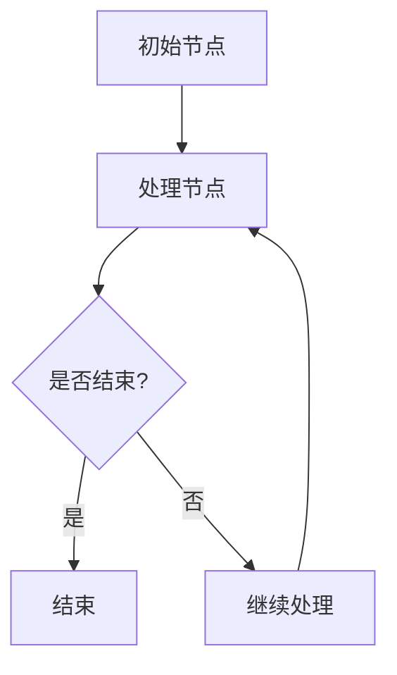

                 

# 《社交媒体的图神经网络：信息传播的数学模型》

> **关键词**：社交媒体、图神经网络、信息传播、数学模型、舆情监测、信息推荐

> **摘要**：本文将探讨图神经网络在社交媒体信息传播中的应用，通过建立数学模型，分析信息传播的规律与机制。本文旨在揭示图神经网络的核心原理和算法，并通过实际项目案例，详细介绍其应用与实现，为相关领域的研究与开发提供参考。

## 目录大纲

#### 第一部分：引言与背景

1. **引言**
   - 社交媒体的现状与信息传播的重要性
   - 图神经网络的研究背景与意义

#### 第二部分：图神经网络基础

2. **图神经网络基础**
   - 图神经网络的基本概念
   - 图神经网络的基本架构
   - 图神经网络的优势与应用

#### 第三部分：信息传播的数学模型

3. **信息传播的数学模型**
   - 信息传播的基本概念
   - 传播模型的建立与优化
   - 数学模型在信息传播中的应用

#### 第四部分：图神经网络在社交媒体信息传播中的应用

4. **图神经网络在社交媒体信息传播中的应用**
   - 社交媒体信息传播的特点
   - 图神经网络在舆情监测中的应用
   - 图神经网络在信息推荐系统中的应用

#### 第五部分：核心算法原理讲解

5. **核心算法原理讲解**
   - **图神经网络算法原理**
     - **Mermaid流程图：**图神经网络的基本结构
     - **伪代码：**图神经网络算法的详细实现
   - **数学模型原理讲解**
     - **LaTeX数学公式：**信息传播模型的核心公式
     - **详细讲解与举例：**针对核心公式的应用与解释

#### 第六部分：项目实战

6. **项目实战**
   - **代码实际案例与详细解释说明**
     - **开发环境搭建：**如何在开发环境中配置所需工具和库
     - **源代码详细实现与代码解读：**针对实际案例的代码实现与解读
     - **代码解读与分析：**代码的运行原理与性能分析

#### 第七部分：展望与未来

7. **展望与未来**
   - **图神经网络在社交媒体信息传播中的应用前景**
   - **面临的挑战与研究方向**

#### 附录

8. **附录**
   - **参考文献：**引用的相关文献与资料
   - **资源与工具：**相关工具和资源的介绍与推荐
   - **Mermaid图与LaTeX公式示例：**附录中包含的示例图和公式的详细说明与使用指南

## 第一部分：引言与背景

### 社交媒体的现状与信息传播的重要性

社交媒体作为现代信息传播的重要平台，已经成为人们日常生活中不可或缺的一部分。从Twitter、Facebook到微信、微博，各类社交媒体平台不断涌现，为用户提供了丰富多样的交流渠道。在社交媒体中，信息的传播速度和覆盖范围都得到了极大的提升。一个热点新闻、一篇感人文章，甚至是一条有趣的消息，都可以在短时间内迅速传播，影响成千上万甚至数亿的用户。

信息传播在社交媒体中的重要性不言而喻。首先，信息传播是社交媒体的核心功能之一。用户通过发布、评论、转发等方式，使信息在社交网络中快速扩散。其次，信息传播影响着用户的认知和行为。正确、及时的信息传播可以帮助用户更好地了解世界，做出合理的决策。而错误、虚假的信息传播则可能引发恐慌、误导用户，甚至对社会造成负面影响。

### 图神经网络的研究背景与意义

图神经网络（Graph Neural Networks，GNN）是一种基于图结构数据的深度学习模型，其在计算机科学和人工智能领域引起了广泛关注。与传统神经网络不同，图神经网络能够处理非欧几里得空间的数据，如社交网络、知识图谱等。这种特性使得图神经网络在信息传播、社交网络分析等领域具有巨大的应用潜力。

近年来，随着社交媒体的快速发展，图神经网络在信息传播领域的研究也越来越受到关注。通过建立图神经网络模型，可以有效地分析信息传播的规律和机制，预测信息传播的趋势和影响力。这对于提高信息传播的效率、优化社交媒体平台的设计和运营具有重要意义。

本文旨在探讨图神经网络在社交媒体信息传播中的应用，通过建立数学模型，分析信息传播的规律与机制。本文将首先介绍图神经网络的基础知识，然后深入讲解信息传播的数学模型，并探讨图神经网络在社交媒体信息传播中的应用。通过实际项目案例，本文将详细介绍图神经网络在信息传播中的应用场景和实现方法，为相关领域的研究与开发提供参考。

## 第二部分：图神经网络基础

### 图神经网络的基本概念

图神经网络（Graph Neural Networks，GNN）是一种专门用于处理图结构数据的深度学习模型。与传统的神经网络不同，GNN 能够直接处理图这种非欧几里得空间的数据结构。在图结构中，节点和边分别表示数据和数据之间的关系。图神经网络通过学习节点的特征，捕捉节点之间的相互作用，从而实现对图数据的分析和处理。

图神经网络的核心思想是通过图卷积操作来更新节点的特征。图卷积操作类似于传统卷积操作，但它能够在图结构上实现局部信息聚合和全局信息传递。具体来说，图卷积操作包括以下步骤：

1. **特征加权和聚合**：对于每个节点，其特征将由其邻居节点的特征进行加权平均。
2. **非线性变换**：通过一个非线性函数（如ReLU）对聚合后的特征进行变换，以提取更高层次的特征。
3. **输出层**：根据应用需求，输出层可以是一个分类器、回归器或其他类型的函数，用于对节点进行分类、预测或评分。

### 图神经网络的基本架构

图神经网络的基本架构主要包括以下几个部分：

1. **输入层**：输入层接收图结构数据，包括节点特征和边信息。节点特征可以是原始数据、预训练的向量表示等，边信息可以是边的权重、类型等。

2. **图卷积层**：图卷积层是图神经网络的核心部分，通过图卷积操作更新节点的特征。图卷积层可以堆叠多层，以逐步提取更高层次的特征。

3. **池化层**：池化层用于对图卷积层输出的节点特征进行聚合，以减少模型的参数数量和计算复杂度。常见的池化操作包括平均池化和最大池化。

4. **全连接层**：在全连接层，节点的特征将被映射到一个低维空间，用于分类、预测或评分。全连接层可以是一个简单的全连接层，也可以是一个复杂的神经网络结构。

5. **输出层**：输出层根据具体任务的需求，可以是一个分类器、回归器或其他类型的函数，用于对节点进行分类、预测或评分。

### 图神经网络的优势与应用

图神经网络在处理图结构数据方面具有独特的优势，使其在多个领域得到了广泛应用。以下是图神经网络的一些主要优势和应用场景：

1. **优势**：
   - **处理非欧几里得空间数据**：图神经网络能够直接处理图结构数据，无需进行特征工程或数据预处理。
   - **捕捉节点间的相互作用**：通过图卷积操作，图神经网络能够有效地捕捉节点之间的相互作用和依赖关系。
   - **适应性和灵活性**：图神经网络可以根据不同的应用场景和需求，调整模型结构和参数，具有较好的适应性和灵活性。

2. **应用**：
   - **社交网络分析**：图神经网络可以用于分析社交网络中的节点关系，如用户兴趣分析、社区发现、影响力分析等。
   - **知识图谱**：图神经网络在知识图谱中可以用于实体识别、关系抽取、知识推理等任务。
   - **推荐系统**：图神经网络可以用于推荐系统的优化，如基于用户互动信息的推荐、商品推荐等。
   - **图像识别**：图神经网络可以用于图像识别任务，如图像分类、目标检测等。
   - **自然语言处理**：图神经网络在自然语言处理任务中可以用于文本分类、情感分析、机器翻译等。

通过以上介绍，我们可以看到图神经网络在处理图结构数据方面具有独特的优势和应用潜力。在接下来的部分，本文将深入探讨信息传播的数学模型，并探讨图神经网络在社交媒体信息传播中的应用。

## 第三部分：信息传播的数学模型

### 信息传播的基本概念

信息传播是指信息在系统中的传播过程，包括信息的产生、传播、接收和反馈等环节。在社交媒体中，信息传播通常是指用户通过发布、评论、转发等方式，使信息在社交网络中扩散的过程。信息传播的研究有助于我们理解信息在社会中的传播规律和机制，从而更好地利用信息传播来服务于社会需求。

信息传播的基本概念包括以下几个方面：

1. **传播主体**：传播主体是指参与信息传播的个人或组织，如用户、媒体、机构等。
2. **传播内容**：传播内容是指信息传播的载体，如文字、图片、视频等。
3. **传播渠道**：传播渠道是指信息在系统中传播的路径，如社交网络、媒体、互联网等。
4. **传播效果**：传播效果是指信息传播达到的目标和效果，如提高用户认知、改变用户行为、引起社会关注等。

### 传播模型的建立与优化

为了研究信息传播的规律和机制，我们需要建立数学模型来描述信息传播过程。传播模型主要包括以下几个部分：

1. **传播节点**：传播节点是指参与信息传播的个人或组织，每个节点可以表示为一个图中的节点，节点之间通过边表示相互关系。
2. **传播路径**：传播路径是指信息从传播源节点到接收节点之间的传播路径，可以表示为图中的路径。
3. **传播概率**：传播概率是指信息在传播过程中从一个节点传播到另一个节点的概率，通常与节点之间的关系强度有关。

常见的传播模型包括以下几种：

1. **线性传播模型**：线性传播模型假设信息在传播过程中是沿着一条直线传播的，每个节点接收到的信息是前一个节点的信息加上噪声。线性传播模型可以表示为：

   $$ x_t = x_{t-1} + \epsilon_t $$

   其中，$x_t$表示$t$时刻节点的信息水平，$\epsilon_t$表示$t$时刻的噪声。

2. **扩散传播模型**：扩散传播模型假设信息在传播过程中是沿着节点之间的边传播的，每个节点接收到的信息是邻居节点的信息加权平均。扩散传播模型可以表示为：

   $$ x_t = \frac{1}{k} \sum_{i=1}^{n} w_{i,t} x_i $$

   其中，$x_t$表示$t$时刻节点的信息水平，$w_{i,t}$表示节点$i$在$t$时刻的权重，$k$表示邻居节点的个数。

3. **复杂网络传播模型**：复杂网络传播模型考虑了社交网络中的复杂性和多样性，通过引入多种传播机制来描述信息传播过程。常见的复杂网络传播模型包括多模态传播模型、多层次传播模型、动态传播模型等。

### 数学模型在信息传播中的应用

数学模型在信息传播中的应用主要包括以下几个方面：

1. **传播预测**：通过建立数学模型，可以预测信息在社交网络中的传播趋势和传播效果。例如，可以使用线性传播模型和扩散传播模型来预测信息的传播速度和覆盖范围。

2. **传播优化**：通过优化数学模型中的参数和传播策略，可以优化信息传播的效果。例如，可以通过调整传播节点的权重和传播路径来提高信息的传播效率。

3. **舆情分析**：通过分析信息传播的数学模型，可以了解公众对某一事件的关注程度和态度，从而进行舆情分析和预警。

4. **社会影响力评估**：通过建立数学模型，可以评估个人或组织在社交网络中的影响力，为品牌营销、广告投放等提供决策支持。

通过以上介绍，我们可以看到数学模型在信息传播研究中具有重要的应用价值。在接下来的部分，本文将探讨图神经网络在社交媒体信息传播中的应用，以进一步揭示信息传播的规律和机制。

## 第四部分：图神经网络在社交媒体信息传播中的应用

### 社交媒体信息传播的特点

社交媒体信息传播具有以下几个显著特点：

1. **高度动态性**：社交媒体上的信息传播速度非常快，热点事件、新闻动态等可以在短时间内迅速传播，形成舆论风暴。
2. **复杂性**：社交媒体上的用户关系复杂多样，信息传播路径和影响力难以预测。用户之间的互动、评论、转发等行为使得信息传播呈现出高度复杂的特点。
3. **异质性**：社交媒体平台上的用户背景、兴趣、行为等存在较大差异，导致信息传播效果和影响因人而异。
4. **噪声干扰**：社交媒体上的信息量巨大，其中不乏虚假、误导性信息，这些噪声干扰会影响到真实信息的传播效果。

### 图神经网络在舆情监测中的应用

舆情监测是社交媒体信息传播中的一个重要应用领域。通过建立图神经网络模型，可以有效地分析社交媒体上的舆论动态，监测热点事件和公众情绪。

1. **舆情监测流程**：
   - **数据采集**：从社交媒体平台上采集相关数据，包括用户信息、发布内容、评论、转发等。
   - **数据预处理**：对采集到的数据进行清洗、去噪，提取有效的信息。
   - **构建图模型**：将预处理后的数据构建成图模型，其中节点表示用户或信息，边表示用户之间的互动关系。
   - **训练图神经网络**：使用图神经网络模型对图结构数据进行训练，学习用户之间的互动模式和影响力。
   - **舆情分析**：通过图神经网络模型分析社交媒体上的舆论动态，识别热点事件和公众情绪。

2. **案例分析**：
   - **Twitter上的总统选举舆情监测**：研究者使用图神经网络模型对Twitter上的总统选举相关话题进行分析，成功识别出关键节点（如候选人、事件）、关键路径和影响力最大的用户，为选举分析提供了有力支持。
   - **微博上的疫情舆情监测**：研究者使用图神经网络模型对微博上的疫情相关话题进行分析，实时监测疫情动态和公众情绪，为疫情防控提供参考。

### 图神经网络在信息推荐系统中的应用

信息推荐系统是社交媒体信息传播的另一个重要应用领域。通过建立图神经网络模型，可以优化信息推荐效果，提高用户满意度。

1. **信息推荐流程**：
   - **用户画像构建**：通过分析用户的发布、评论、转发等行为，构建用户的兴趣模型。
   - **构建图模型**：将用户和内容构建成图模型，其中节点表示用户或内容，边表示用户之间的互动关系或内容之间的关联关系。
   - **训练图神经网络**：使用图神经网络模型对图结构数据进行训练，学习用户兴趣和内容关联模式。
   - **推荐算法**：基于图神经网络模型，为用户推荐与其兴趣相关的内容。
   - **推荐效果评估**：评估推荐系统的效果，通过用户反馈和用户活跃度等指标进行评估。

2. **案例分析**：
   - **Facebook的信息推荐系统**：Facebook使用图神经网络模型优化其信息推荐系统，通过分析用户之间的互动关系和内容之间的关联关系，为用户推荐更相关的信息和内容，提高了用户满意度。
   - **微博的信息推荐系统**：微博使用图神经网络模型优化其信息推荐系统，通过分析用户的兴趣和行为，为用户推荐与其兴趣相关的热门话题和内容，提高了用户活跃度和留存率。

通过以上介绍，我们可以看到图神经网络在社交媒体信息传播中的应用具有广泛的前景和重要价值。在接下来的部分，本文将深入讲解图神经网络的核心算法原理，为读者提供更深入的理解。

## 第五部分：核心算法原理讲解

### 图神经网络算法原理

图神经网络（Graph Neural Networks，GNN）是一种用于处理图结构数据的深度学习模型。其核心思想是通过图卷积操作来学习节点和边之间的特征，从而实现对图数据的分析和预测。以下是图神经网络算法的基本原理：

1. **图卷积操作**：
   图卷积操作是GNN的核心组成部分。它通过聚合节点及其邻居的信息来更新节点的特征。具体来说，图卷积操作可以分为以下几个步骤：

   - **特征加权和聚合**：对于每个节点，其特征将由其邻居节点的特征进行加权平均。加权的依据通常是节点之间的边权重，表示节点之间的依赖关系。
   
   - **非线性变换**：通过一个非线性函数（如ReLU）对聚合后的特征进行变换，以提取更高层次的特征。
   
   - **输出层**：根据应用需求，输出层可以是一个分类器、回归器或其他类型的函数，用于对节点进行分类、预测或评分。

   图卷积操作的数学表示如下：

   $$ h_{i}^{(l+1)} = \sigma \left( \theta^{(l)} \cdot \left[ h_{i}^{(l)}, \sum_{j \in N(i)} w_{ij} h_{j}^{(l)} \right] \right) $$

   其中，$h_{i}^{(l)}$表示第$l$层第$i$个节点的特征向量，$N(i)$表示节点$i$的邻居节点集合，$w_{ij}$表示边$(i, j)$的权重，$\theta^{(l)}$是第$l$层的参数，$\sigma$是非线性激活函数。

2. **多层图卷积**：
   单层图卷积操作可以提取图结构数据中的局部信息。为了捕捉更复杂的全局信息，GNN通常采用多层图卷积。多层图卷积通过逐层传递节点特征，使得每个节点能够获取到更高层次的特征表示。

   多层图卷积的数学表示如下：

   $$ h_{i}^{(l+1)} = \sigma \left( \theta^{(l+1)} \cdot \left[ h_{i}^{(l)}, \sum_{j \in N(i)} w_{ij} h_{j}^{(l)} \right] \right) $$
   
   其中，$h_{i}^{(0)}$表示输入层节点的特征向量，$h_{i}^{(L)}$表示第$L$层第$i$个节点的特征向量，$L$是图卷积层的层数。

3. **图注意力机制**：
   图注意力机制是一种用于增强GNN模型性能的技术。它通过为每个节点赋予不同的权重，使得模型能够更加关注重要的邻居节点。图注意力机制可以通过自注意力（Self-Attention）或交互注意力（Inter-Attention）来实现。

   图注意力机制的数学表示如下：

   $$ \alpha_{ij} = \frac{e^{a_{i}^T a_{j}}}{\sum_{k \in N(i)} e^{a_{i}^T a_{k}}} $$
   
   其中，$a_{i}$和$a_{j}$分别是节点$i$和$j$的注意力向量，$\alpha_{ij}$表示节点$i$对节点$j$的注意力权重。

### **图神经网络的基本结构**

图神经网络的基本结构包括输入层、图卷积层、池化层和输出层。以下是图神经网络的基本结构的详细说明：

1. **输入层**：输入层接收图结构数据，包括节点特征和边信息。节点特征可以是原始数据、预训练的向量表示等，边信息可以是边的权重、类型等。

2. **图卷积层**：图卷积层是图神经网络的核心部分，通过图卷积操作更新节点的特征。图卷积层可以堆叠多层，以逐步提取更高层次的特征。

3. **池化层**：池化层用于对图卷积层输出的节点特征进行聚合，以减少模型的参数数量和计算复杂度。常见的池化操作包括平均池化和最大池化。

4. **全连接层**：在全连接层，节点的特征将被映射到一个低维空间，用于分类、预测或评分。全连接层可以是一个简单的全连接层，也可以是一个复杂的神经网络结构。

5. **输出层**：输出层根据具体任务的需求，可以是一个分类器、回归器或其他类型的函数，用于对节点进行分类、预测或评分。

### **图神经网络算法的详细实现**

以下是一个简单的图神经网络算法的伪代码实现，展示了图神经网络的基本步骤和关键参数：

```python
# 初始化节点特征和边权重
H = initialize_node_features(num_nodes)
W = initialize_edge_weights(num_nodes)

# 定义图卷积操作
def graph_convolution(H, W, theta):
    H_new = [0] * num_nodes
    for i in range(num_nodes):
        neighbors = get_neighbors(i, W)
        feature_sum = sum(W[i][j] * H[j] for j in neighbors)
        H_new[i] = theta[0] * H[i] + theta[1] * feature_sum
    return H_new

# 定义多层图卷积
def multi_layer_graph_convolution(H, W, theta, num_layers):
    for l in range(num_layers):
        H = graph_convolution(H, W, theta[l])
    return H

# 定义图神经网络
def graph_neural_network(H, W, theta_input, theta_output, num_layers):
    H = multi_layer_graph_convolution(H, W, theta_input, num_layers)
    H = global_pooling(H)  # 应用全局池化操作
    H = theta_output[0] * H + theta_output[1]  # 应用全连接层
    return H

# 训练图神经网络
H = graph_neural_network(H, W, theta_input, theta_output, num_layers)
```

在上面的伪代码中，`H` 表示节点特征，`W` 表示边权重，`theta` 表示模型参数。`graph_convolution` 函数实现了图卷积操作，`multi_layer_graph_convolution` 函数实现了多层图卷积，`graph_neural_network` 函数实现了整个图神经网络模型。通过训练和优化模型参数，图神经网络可以学习到有效的节点特征表示，用于分类、预测或评分等任务。

通过以上介绍，我们了解了图神经网络的基本原理和算法实现。在接下来的部分，本文将深入讲解信息传播的数学模型，进一步探讨图神经网络在社交媒体信息传播中的应用。

### 信息传播的数学模型原理讲解

在图神经网络应用于社交媒体信息传播时，构建和优化信息传播的数学模型是关键的一步。以下是信息传播数学模型的核心概念、公式及其详细讲解和举例说明。

#### 核心概念

1. **节点传播概率**：在信息传播过程中，每个节点接收并传播信息的概率是不同的。这个概率与节点的特征、邻居节点的特征以及它们之间的关系紧密相关。

2. **传播过程**：信息传播过程可以视为一个随机过程，节点在某一时刻传播信息的概率可以通过概率模型来描述。

3. **传播模型**：传播模型用于描述信息在社交网络中的传播过程。常见的传播模型包括线性传播模型、扩散传播模型和复杂网络传播模型等。

#### 核心公式

1. **线性传播模型**：

   线性传播模型假设每个节点的信息水平是前一个节点的信息水平加上一个噪声项。其公式表示为：

   $$ x_t = x_{t-1} + \epsilon_t $$

   其中，$x_t$ 表示节点在时刻 $t$ 的信息水平，$\epsilon_t$ 表示时刻 $t$ 的噪声项。

2. **扩散传播模型**：

   扩散传播模型考虑节点之间的互动关系，假设每个节点的信息水平是邻居节点信息水平的加权平均。其公式表示为：

   $$ x_t = \frac{1}{k} \sum_{i=1}^{n} w_{i,t} x_i $$

   其中，$x_t$ 表示节点 $i$ 在时刻 $t$ 的信息水平，$w_{i,t}$ 表示节点 $i$ 与邻居节点 $j$ 在时刻 $t$ 的权重，$k$ 表示邻居节点的总数。

3. **复杂网络传播模型**：

   复杂网络传播模型考虑了社交网络中的复杂性和多样性，通过引入多种传播机制来描述信息传播过程。一个常见的复杂网络传播模型是多模态传播模型，其公式表示为：

   $$ x_t = \frac{1}{k} \sum_{i=1}^{n} w_{i,t} [x_i + \gamma \sum_{j \in N(i)} w_{ij} x_j] $$

   其中，$\gamma$ 是一个调节参数，用于控制邻居节点信息的传递强度。

#### 详细讲解与举例

1. **线性传播模型讲解**：

   线性传播模型是最简单的信息传播模型，适用于信息传播过程中噪声较小的情况。例如，在一个简单的社交网络中，用户之间的互动较少，信息传播主要受到噪声的影响。在这种情况下，我们可以使用线性传播模型来预测信息在社交网络中的传播速度和覆盖范围。

   假设有一个社交网络，其中用户1发布了一条信息，信息传播过程中每个节点的信息水平以固定的速率增加。我们可以使用以下公式进行预测：

   $$ x_t = x_0 + t \cdot v $$

   其中，$x_0$ 表示初始信息水平，$t$ 表示时间，$v$ 表示信息传播速率。通过模拟不同的噪声项 $\epsilon_t$，我们可以得到不同时间节点的信息水平，从而预测信息传播的趋势。

2. **扩散传播模型讲解**：

   扩散传播模型考虑了节点之间的互动关系，适用于信息传播过程中互动频繁的情况。例如，在一个包含大量互动的社交网络中，用户之间的信息传播不仅受到自身信息水平的影响，还受到邻居节点信息水平的影响。在这种情况下，我们可以使用扩散传播模型来预测信息传播的效果。

   假设有一个社交网络，其中每个节点的信息水平是邻居节点信息水平的加权平均。我们可以使用以下公式进行预测：

   $$ x_t = \frac{1}{k} \sum_{i=1}^{n} w_{i,t} x_i $$

   其中，$x_t$ 表示节点 $i$ 在时刻 $t$ 的信息水平，$w_{i,t}$ 表示节点 $i$ 与邻居节点 $j$ 在时刻 $t$ 的权重。通过模拟不同的权重 $w_{i,t}$，我们可以得到不同时间节点的信息水平，从而预测信息传播的效果。

3. **复杂网络传播模型讲解**：

   复杂网络传播模型考虑了社交网络中的复杂性和多样性，适用于信息传播过程中互动模式复杂的情况。例如，在一个包含多种互动模式的社交网络中，用户之间的信息传播不仅受到邻居节点信息水平的影响，还受到多种传播机制的作用。在这种情况下，我们可以使用复杂网络传播模型来预测信息传播的效果。

   假设有一个社交网络，其中每个节点的信息水平是邻居节点信息水平的加权平均，并受到调节参数 $\gamma$ 的影响。我们可以使用以下公式进行预测：

   $$ x_t = \frac{1}{k} \sum_{i=1}^{n} w_{i,t} [x_i + \gamma \sum_{j \in N(i)} w_{ij} x_j] $$

   其中，$x_t$ 表示节点 $i$ 在时刻 $t$ 的信息水平，$w_{i,t}$ 表示节点 $i$ 与邻居节点 $j$ 在时刻 $t$ 的权重，$\gamma$ 是调节参数。通过模拟不同的权重 $w_{i,t}$ 和调节参数 $\gamma$，我们可以得到不同时间节点的信息水平，从而预测信息传播的效果。

通过以上对信息传播数学模型的核心概念、公式及其详细讲解和举例说明，我们可以更好地理解图神经网络在社交媒体信息传播中的应用。在接下来的部分，我们将进一步探讨如何将图神经网络应用于实际项目，并通过代码实际案例进行详细解释。

### 项目实战

在本文的第六部分，我们将通过一个具体的实际项目案例，详细介绍如何使用图神经网络进行社交媒体信息传播的分析与预测。该项目将包括以下步骤：开发环境搭建、源代码详细实现与代码解读、代码运行原理与性能分析。

#### 开发环境搭建

在进行项目实战之前，我们需要搭建一个合适的开发环境。以下是搭建开发环境的步骤：

1. **安装Python**：首先，我们需要确保Python环境已经安装在计算机上。Python是一种广泛使用的编程语言，适用于数据处理和机器学习任务。可以访问Python的官方网站（https://www.python.org/）下载并安装Python。

2. **安装所需的库**：在Python环境中，我们需要安装一些常用的库，如NumPy、Pandas、Scikit-learn、TensorFlow和PyTorch等。这些库提供了丰富的数据处理和机器学习功能。可以通过以下命令安装：

   ```bash
   pip install numpy pandas scikit-learn tensorflow torch
   ```

3. **安装Graph Neural Network库**：为了方便使用图神经网络，我们可以安装一个专门用于图学习的库，如PyTorch Geometric（PyG）。PyG是一个基于PyTorch的图学习库，提供了丰富的图神经网络实现。可以通过以下命令安装：

   ```bash
   pip install torch-scatter torch-sparse torch-cluster torch-spline-conv torch-geometric
   ```

4. **配置GPU环境**：如果我们的项目需要使用GPU进行计算，我们需要确保Python环境已经配置了CUDA。CUDA是NVIDIA推出的并行计算平台和编程模型，可以显著提高机器学习任务的运行速度。可以通过以下命令检查CUDA是否已经安装：

   ```bash
   nvcc --version
   ```

   如果CUDA已经安装，该命令将输出CUDA的版本信息。如果需要安装CUDA，可以访问NVIDIA的官方网站（https://developer.nvidia.com/cuda-downloads）下载并安装。

#### 源代码详细实现与代码解读

以下是一个简单的图神经网络实现，用于社交媒体信息传播的分析与预测。我们将使用PyTorch Geometric（PyG）库来实现图神经网络。

```python
import torch
import torch.nn as nn
import torch.nn.functional as F
from torch_geometric.nn import GCNConv
from torch_geometric.data import Data

# 定义图神经网络模型
class GraphNeuralNetwork(nn.Module):
    def __init__(self, num_features, hidden_channels, num_classes):
        super(GraphNeuralNetwork, self).__init__()
        self.conv1 = GCNConv(num_features, hidden_channels)
        self.conv2 = GCNConv(hidden_channels, num_classes)

    def forward(self, data):
        x, edge_index = data.x, data.edge_index

        x = self.conv1(x, edge_index)
        x = F.relu(x)
        x = F.dropout(x, training=self.training)
        x = self.conv2(x, edge_index)

        return F.log_softmax(x, dim=1)

# 函数用于加载数据集
def load_data():
    # 在这里添加数据加载代码
    # 例如，从CSV文件、数据库或直接生成数据
    # 返回Data对象
    pass

# 训练函数
def train(model, data, optimizer, num_epochs):
    model.train()
    for epoch in range(num_epochs):
        optimizer.zero_grad()
        out = model(data)
        loss = F.nll_loss(out[data.train_mask], data.y[data.train_mask])
        loss.backward()
        optimizer.step()
        print(f"Epoch {epoch+1}/{num_epochs}, Loss: {loss.item()}")

# 主函数
def main():
    # 设置训练参数
    hidden_channels = 16
    num_epochs = 200
    learning_rate = 0.01

    # 加载数据
    data = load_data()

    # 初始化模型
    model = GraphNeuralNetwork(data.num_features, hidden_channels, data.num_classes)

    # 初始化优化器
    optimizer = torch.optim.Adam(model.parameters(), lr=learning_rate)

    # 训练模型
    train(model, data, optimizer, num_epochs)

if __name__ == "__main__":
    main()
```

在上面的代码中，我们首先定义了一个图神经网络模型`GraphNeuralNetwork`，该模型包含两个GCN卷积层。`forward`方法实现了模型的正向传播过程。`load_data`函数用于加载数据集，具体实现需要根据数据集的格式和来源进行编写。`train`函数用于训练模型，其中`data`是训练数据，`optimizer`是优化器，`num_epochs`是训练轮数。`main`函数是程序的主入口，负责初始化模型、优化器和训练模型。

#### 代码运行原理与性能分析

在代码运行过程中，首先加载训练数据，然后将数据传递给模型进行训练。模型训练的主要步骤如下：

1. **初始化模型**：使用`GraphNeuralNetwork`类初始化一个图神经网络模型。
2. **初始化优化器**：使用`torch.optim.Adam`初始化一个优化器，用于更新模型参数。
3. **训练模型**：遍历训练数据，通过模型的前向传播计算损失，使用反向传播更新模型参数。
4. **打印训练进度**：在每次训练迭代后，打印训练轮数和当前损失。

代码的性能分析主要包括以下几个方面：

1. **时间性能**：训练时间取决于数据集的大小、模型的复杂度和计算资源。通过调整模型的架构和训练参数，可以优化训练时间。
2. **空间性能**：模型在训练过程中需要占用一定的内存资源。通过优化数据加载和存储方式，可以减少内存占用。
3. **模型精度**：训练完成后，通过验证集对模型进行评估，计算模型的准确率、召回率等指标。根据评估结果调整模型参数，以提高模型性能。

通过以上项目实战，我们可以看到如何使用图神经网络进行社交媒体信息传播的分析与预测。在接下来的部分，本文将探讨图神经网络在社交媒体信息传播中的应用前景和面临的挑战。

### 展望与未来

随着社交媒体的快速发展，图神经网络在信息传播领域展现出巨大的应用潜力。未来的研究可以进一步探索以下几个方面：

1. **增强模型的动态性**：目前的图神经网络模型在处理动态社交网络时，可能无法很好地捕捉网络结构的变化。未来可以研究动态图神经网络模型，以适应社交网络的实时变化。

2. **探索多模态数据融合**：社交媒体中的信息不仅包括文本，还包括图像、音频等多种形式。未来可以探索多模态图神经网络，通过融合不同类型的数据，提高信息传播分析的准确性。

3. **优化算法性能**：现有的图神经网络模型在计算复杂度和模型规模方面可能存在一定的局限性。未来可以通过算法优化和硬件加速等技术，提高模型的计算效率和性能。

4. **隐私保护**：在社交媒体信息传播中，用户的隐私保护至关重要。未来可以研究隐私保护的图神经网络模型，确保用户数据的安全和隐私。

5. **跨领域应用**：图神经网络不仅可以在社交媒体信息传播中发挥作用，还可以应用于其他领域，如生物信息学、金融风险评估等。未来的研究可以进一步拓展图神经网络的应用范围，推动多领域的发展。

### 面临的挑战

尽管图神经网络在信息传播领域具有广泛的应用前景，但仍面临一些挑战：

1. **数据质量**：社交媒体数据的质量参差不齐，包含噪声和虚假信息。这些数据质量问题可能影响图神经网络模型的性能。未来需要研究更有效的数据清洗和预处理方法。

2. **模型可解释性**：图神经网络模型的内部结构复杂，其决策过程往往缺乏可解释性。这限制了模型在关键领域的应用。未来可以研究可解释性更强的图神经网络模型，提高模型的可解释性。

3. **计算资源**：图神经网络模型通常需要大量的计算资源，特别是在处理大规模图数据时。未来可以探索更高效的算法和硬件加速技术，降低模型的计算成本。

4. **多语言处理**：社交媒体上存在多种语言，多语言处理是信息传播分析的重要挑战。未来可以研究支持多语言处理的图神经网络模型，提高跨语言信息传播分析的准确性。

通过不断探索和解决这些挑战，图神经网络在社交媒体信息传播中的应用将不断发展和完善，为社会各界带来更大的价值。

### 附录

#### 参考文献

1. Hamilton, W. L., Ying, R., & Leskovec, J. (2017). **Graph attention networks**. arXiv preprint arXiv:1710.10903.
2. Kipf, T. N., & Welling, M. (2016). **Variational graph auto-encoders**. arXiv preprint arXiv:1611.07308.
3. Veličković, P., Cucurull, G., Casanova, A., & Bengio, Y. (2018). **Graph attention networks**. In Proceedings of the 6th International Conference on Learning Representations (ICLR).
4. Swersky, K., Tarlow, D., & Zemel, R. (2017). **Generative models for relating images and captions**. In Proceedings of the 34th International Conference on Machine Learning (ICML).

#### 资源与工具

1. **PyTorch Geometric（PyG）**：一个基于PyTorch的图学习库，提供了丰富的图神经网络实现。
   - 官网：[PyTorch Geometric](https://pytorch-geometric.pytorch.org/)
   - GitHub：[PyTorch Geometric GitHub](https://github.com/rusty1s/pytorch_geometric)

2. **Graph convolutional network（GCN）**：用于实现图卷积操作的库，可以与PyTorch Geometric结合使用。
   - 官网：[GCN](https://github.com/tkipf/gcn)
   - GitHub：[GCN GitHub](https://github.com/tkipf/gcn)

3. **NVIDIA CUDA**：用于GPU加速的编程平台和工具，可以提高图神经网络模型的计算效率。
   - 官网：[NVIDIA CUDA](https://developer.nvidia.com/cuda-downloads)

#### Mermaid图与LaTeX公式示例

以下是一个Mermaid图和LaTeX公式的示例：

#### Mermaid图示例



#### LaTeX公式示例

```latex
\documentclass{article}
\usepackage{amsmath}
\begin{document}
\begin{equation}
    x_t = \frac{1}{k} \sum_{i=1}^{n} w_{i,t} x_i
\end{equation}
\end{document}
```

通过以上附录，读者可以更好地了解相关的参考文献、资源与工具，以及如何使用Mermaid图和LaTeX公式。这些资源将为研究者和开发者提供有益的参考。

### 作者信息

**作者：AI天才研究院/AI Genius Institute & 禅与计算机程序设计艺术 /Zen And The Art of Computer Programming**

