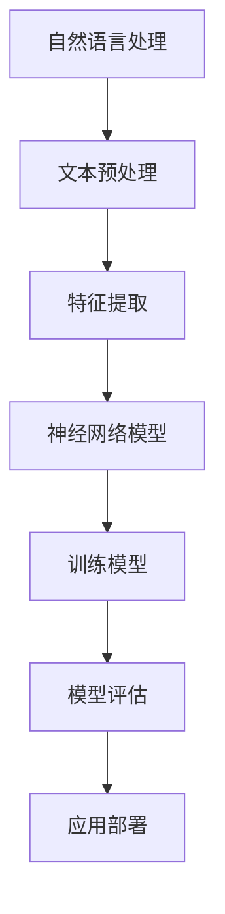
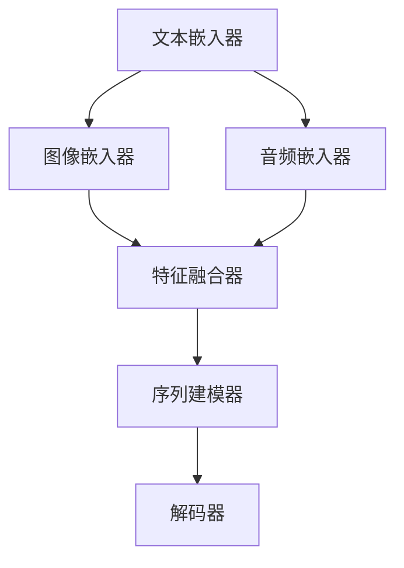

                 

### 第1章：自然语言处理与神经网络简介

#### 1.1 自然语言处理概述

自然语言处理（Natural Language Processing，NLP）是计算机科学和人工智能领域的一个重要分支，旨在使计算机能够理解、解释和生成人类自然语言。NLP的核心任务是使计算机能够处理各种自然语言文本，包括语音、文字和图像等。NLP的主要任务包括文本分类、命名实体识别、机器翻译、问答系统、语音识别、对话系统等。

NLP的发展可以追溯到20世纪50年代，当时计算机科学家们开始尝试让计算机理解和生成自然语言。然而，由于语言本身的复杂性和多样性，早期的NLP研究进展缓慢。随着计算力和算法的不断提升，NLP在20世纪80年代开始取得了显著进展。近年来，深度学习和神经网络技术的快速发展进一步推动了NLP的进步。

NLP的研究领域非常广泛，它涉及自然语言的理解、生成、翻译、语义分析、语音识别等多个方面。例如，在文本分类任务中，计算机需要根据文本的内容将其归入不同的类别；在命名实体识别任务中，计算机需要识别出文本中的特定实体，如人名、地名、组织名等；在机器翻译任务中，计算机需要将一种语言的文本翻译成另一种语言。

NLP的应用场景也非常丰富，包括但不限于信息检索、智能客服、内容推荐、情感分析、法律文档审核、医学文本分析等。随着人工智能技术的不断进步，NLP的应用前景将会更加广阔。

#### 1.2 神经网络基础

神经网络（Neural Network，NN）是一种模仿生物神经网络结构的人工智能系统，由大量的神经元（或节点）互联而成。每个神经元都可以接收输入信号，通过权重（权重代表神经元之间连接的强度）进行加权求和，并使用激活函数（激活函数用于确定神经元是否被激活）来产生输出。

神经网络的基本结构包括输入层、隐藏层和输出层。输入层接收外部输入信号，隐藏层对输入信号进行加工和处理，输出层生成最终的输出。神经网络的训练过程就是通过不断调整网络中的权重和偏置（偏置用于调整神经元的偏移量），使网络能够正确地完成特定的任务。

激活函数是神经网络中的一个关键组件，它决定了神经元是否会被激活。常见的激活函数包括Sigmoid函数、ReLU函数和Tanh函数。Sigmoid函数将输入值映射到[0,1]范围内，ReLU函数将输入值大于0的部分映射到1，小于等于0的部分映射到0，Tanh函数将输入值映射到[-1,1]范围内。

前向传播和反向传播是神经网络训练的核心过程。前向传播过程中，输入信号从输入层传递到输出层，每个神经元都通过权重加权求和并应用激活函数来产生输出。反向传播过程中，网络根据实际输出和预期输出的差异来计算损失，并通过反向传播算法更新网络中的权重和偏置，以最小化损失。

梯度下降算法是一种用于训练神经网络的基本优化算法。它通过不断调整权重和偏置，使网络能够正确地完成任务。常见的梯度下降算法包括随机梯度下降（SGD）、批量梯度下降（BGD）和小批量梯度下降（MBGD）。其中，SGD每次只更新一个样本的权重，BGD每次更新整个数据集的权重，MBGD每次更新一部分样本的权重。

#### 1.3 Mermaid流程图：神经网络在NLP中的应用

为了更好地理解神经网络在自然语言处理中的应用，我们使用Mermaid流程图来描述其基本结构。



在这个流程图中，A代表自然语言处理，B代表文本预处理，C代表特征提取，D代表神经网络模型，E代表训练模型，F代表模型评估，G代表应用部署。这个流程图清晰地展示了神经网络在自然语言处理中的基本工作流程。

### 1.1 自然语言处理概述

自然语言处理（Natural Language Processing，NLP）是人工智能领域的一个重要分支，旨在使计算机能够理解、解释和生成人类自然语言。NLP的核心任务是使计算机能够处理各种自然语言文本，包括语音、文字和图像等。NLP的主要任务包括文本分类、命名实体识别、机器翻译、问答系统、语音识别、对话系统等。

在文本分类任务中，计算机需要根据文本的内容将其归入不同的类别。例如，将新闻文章分类为政治、体育、科技等类别。命名实体识别任务是识别文本中的特定实体，如人名、地名、组织名等。在机器翻译任务中，计算机需要将一种语言的文本翻译成另一种语言。问答系统旨在使计算机能够回答用户提出的问题，如智能客服系统。语音识别任务是使计算机能够识别和理解人类语音。对话系统旨在模拟人类的对话过程，使计算机能够与人类进行自然、流畅的交流。

NLP的发展可以追溯到20世纪50年代，当时计算机科学家们开始尝试让计算机理解和生成自然语言。然而，由于语言本身的复杂性和多样性，早期的NLP研究进展缓慢。随着计算力和算法的不断提升，NLP在20世纪80年代开始取得了显著进展。近年来，深度学习和神经网络技术的快速发展进一步推动了NLP的进步。

NLP的研究领域非常广泛，它涉及自然语言的理解、生成、翻译、语义分析、语音识别等多个方面。例如，在文本分类任务中，计算机需要根据文本的内容将其归入不同的类别；在命名实体识别任务中，计算机需要识别出文本中的特定实体，如人名、地名、组织名等；在机器翻译任务中，计算机需要将一种语言的文本翻译成另一种语言。

NLP的应用场景也非常丰富，包括但不限于信息检索、智能客服、内容推荐、情感分析、法律文档审核、医学文本分析等。随着人工智能技术的不断进步，NLP的应用前景将会更加广阔。

### 1.2 神经网络基础

神经网络（Neural Network，NN）是一种模仿生物神经网络结构的人工智能系统，由大量的神经元（或节点）互联而成。每个神经元都可以接收输入信号，通过权重（权重代表神经元之间连接的强度）进行加权求和，并使用激活函数（激活函数用于确定神经元是否被激活）来产生输出。

神经网络的基本结构包括输入层、隐藏层和输出层。输入层接收外部输入信号，隐藏层对输入信号进行加工和处理，输出层生成最终的输出。神经网络的训练过程就是通过不断调整网络中的权重和偏置（偏置用于调整神经元的偏移量），使网络能够正确地完成特定的任务。

激活函数是神经网络中的一个关键组件，它决定了神经元是否会被激活。常见的激活函数包括Sigmoid函数、ReLU函数和Tanh函数。Sigmoid函数将输入值映射到[0,1]范围内，ReLU函数将输入值大于0的部分映射到1，小于等于0的部分映射到0，Tanh函数将输入值映射到[-1,1]范围内。

前向传播和反向传播是神经网络训练的核心过程。前向传播过程中，输入信号从输入层传递到输出层，每个神经元都通过权重加权求和并应用激活函数来产生输出。反向传播过程中，网络根据实际输出和预期输出的差异来计算损失，并通过反向传播算法更新网络中的权重和偏置，以最小化损失。

梯度下降算法是一种用于训练神经网络的基本优化算法。它通过不断调整权重和偏置，使网络能够正确地完成任务。常见的梯度下降算法包括随机梯度下降（SGD）、批量梯度下降（BGD）和小批量梯度下降（MBGD）。其中，SGD每次只更新一个样本的权重，BGD每次更新整个数据集的权重，MBGD每次更新一部分样本的权重。

### 1.3 Mermaid流程图：神经网络在NLP中的应用

为了更好地理解神经网络在自然语言处理中的应用，我们使用Mermaid流程图来描述其基本结构。


在这个流程图中，A代表自然语言处理，B代表文本预处理，C代表特征提取，D代表神经网络模型，E代表训练模型，F代表模型评估，G代表应用部署。这个流程图清晰地展示了神经网络在自然语言处理中的基本工作流程。

### 第2章：自然语言生成基础

#### 2.1 语言模型

语言模型（Language Model，LM）是自然语言处理中的一个基础概念，它用于预测下一个单词或字符。在自然语言生成任务中，语言模型起着至关重要的作用，它可以帮助计算机生成连贯、符合语法规则的自然语言文本。

语言模型可以分为统计语言模型和神经网络语言模型。统计语言模型基于统计学习的方法，通过分析大量语料库中的文本数据来建立语言模型。神经网络语言模型则利用深度学习技术，通过大量文本数据的训练来学习语言的内在规律。

语言模型的主要任务包括：

1. 预测下一个单词或字符。
2. 计算文本的生成概率。
3. 用于文本生成、语音合成、机器翻译等任务。

语言模型通常使用以下指标进行评估：

1. 平均语句长度（Average Sentence Length，ASL）。
2. 语料库大小（Corpus Size）。
3. Perplexity。

Perplexity是评估语言模型性能的一个指标，它表示模型对文本的预测能力。Perplexity的值越低，表示语言模型对文本的预测能力越强。通常，我们希望Perplexity的值接近1。

#### 2.2 递归神经网络（RNN）

递归神经网络（Recurrent Neural Network，RNN）是一种特殊的神经网络，它能够处理序列数据。RNN通过引入递归结构，使得网络可以记住前面的输入信息，从而在处理序列数据时具有优势。

RNN的基本原理如下：

1. **输入层**：接收序列中的每个输入元素。
2. **隐藏层**：包含多个时间步，每个时间步都有一个隐藏状态。
3. **输出层**：根据隐藏状态生成输出。

在RNN中，每个时间步的隐藏状态都受到前面时间步隐藏状态的影响。这种递归结构使得RNN能够处理长序列数据，并且在很多任务中表现出良好的性能。

RNN在自然语言生成中的主要应用包括：

1. 语言模型：使用RNN来预测下一个单词或字符。
2. 文本生成：通过RNN生成连贯的自然语言文本。
3. 机器翻译：使用RNN进行源语言到目标语言的翻译。

然而，RNN也存在一些局限性：

1. **梯度消失和梯度爆炸**：在训练过程中，RNN的梯度可能会消失或爆炸，导致训练困难。
2. **长时依赖问题**：RNN在处理长序列数据时，很难记住前面的信息，导致长时依赖问题。

为了解决这些问题，研究人员提出了许多改进的RNN模型，如LSTM和GRU。

#### 2.3 卷积神经网络（CNN）在NLP中的应用

卷积神经网络（Convolutional Neural Network，CNN）是一种在图像处理中广泛使用的神经网络模型。近年来，CNN在自然语言处理（NLP）领域也得到了广泛应用，特别是在文本分类、文本分类、文本生成等任务中。

CNN在NLP中的应用主要基于以下原理：

1. **文本表示**：将文本数据转换为固定长度的向量表示。常用的文本表示方法包括词袋模型（Bag of Words，BOW）和词嵌入（Word Embedding）。
2. **卷积操作**：在文本表示上应用卷积操作，提取文本的特征。
3. **池化操作**：对卷积结果进行池化操作，减少模型的参数数量。
4. **全连接层**：将池化结果输入全连接层，进行分类或回归任务。

CNN在NLP中的应用包括：

1. **文本分类**：使用CNN对文本进行分类，如情感分析、主题分类等。
2. **文本生成**：通过训练CNN模型，生成符合语法规则和语义逻辑的文本。
3. **命名实体识别**：使用CNN识别文本中的命名实体，如人名、地名、组织名等。

CNN在NLP中的优势包括：

1. **特征提取能力强**：CNN通过卷积和池化操作，能够自动提取文本中的重要特征。
2. **计算效率高**：与RNN相比，CNN的计算效率更高，适合处理大规模数据。

然而，CNN在NLP中也存在一些局限性：

1. **固定窗口大小**：CNN的卷积窗口大小固定，无法灵活地处理不同长度的文本。
2. **长文本处理困难**：对于长文本，CNN难以捕捉到全局信息。

#### 2.4 Transformer架构

Transformer是一种基于自注意力机制的深度学习模型，最初由Vaswani等人于2017年提出。与传统的循环神经网络（RNN）和卷积神经网络（CNN）相比，Transformer在处理序列数据时具有显著的优势。

Transformer的核心思想是自注意力机制（Self-Attention），它允许模型在处理每个时间步时，根据其他时间步的信息进行自适应的权重分配。这种机制使得Transformer能够捕捉到序列中的长距离依赖关系，从而在自然语言生成任务中表现出色。

Transformer的主要组成部分包括：

1. **编码器（Encoder）**：由多个自注意力层（Self-Attention Layer）和前馈网络（Feedforward Network）堆叠而成。每个自注意力层可以捕获序列中的长距离依赖关系。
2. **解码器（Decoder）**：与编码器类似，由多个自注意力层和前馈网络堆叠而成。解码器在生成文本时，不仅需要关注输入序列的信息，还需要关注编码器输出的信息。
3. **位置编码（Positional Encoding）**：由于Transformer没有循环结构，无法像RNN那样自动捕捉序列中的位置信息。因此，通过位置编码来为模型提供序列的位置信息。

Transformer在自然语言生成中的应用包括：

1. **文本生成**：使用Transformer模型生成连贯的自然语言文本。
2. **机器翻译**：通过训练Transformer模型，实现源语言到目标语言的翻译。
3. **问答系统**：使用Transformer模型回答用户提出的问题。

Transformer的优势包括：

1. **处理长序列数据能力强**：自注意力机制使得Transformer能够捕捉到序列中的长距离依赖关系。
2. **计算效率高**：与RNN和CNN相比，Transformer的计算效率更高，适合处理大规模数据。

然而，Transformer也存在一些局限性：

1. **参数量较大**：由于自注意力机制，Transformer的参数量通常比RNN和CNN大，可能导致训练时间较长。
2. **计算资源消耗大**：Transformer的计算复杂度较高，需要更多的计算资源。

总的来说，Transformer在自然语言生成任务中表现出色，但仍然存在一些挑战和改进空间。未来的研究可以继续优化Transformer的结构和算法，提高其在不同任务中的性能。

### 第3章：神经网络在自然语言生成中的核心算法

#### 3.1 随机梯度下降（SGD）算法

随机梯度下降（Stochastic Gradient Descent，SGD）算法是一种常用的优化算法，广泛应用于深度学习模型的训练。SGD的基本思想是通过随机选取一部分训练样本来更新模型参数，从而逐步优化模型的性能。

SGD算法的核心步骤如下：

1. **初始化参数**：初始化模型的权重和偏置。
2. **随机采样**：从训练数据中随机选择一个或多个样本。
3. **计算梯度**：对每个选中的样本，计算损失函数关于模型参数的梯度。
4. **更新参数**：根据梯度和学习率，更新模型参数。
5. **重复步骤2-4**：重复以上步骤，直到满足停止条件（如收敛或达到最大迭代次数）。

SGD算法在神经网络训练中的应用优势如下：

1. **计算效率高**：SGD每次只更新一个或多个样本的权重，相比批量梯度下降（BGD）和小批量梯度下降（MBGD），SGD的计算时间更短，适合处理大规模数据。
2. **收敛速度快**：由于SGD每次更新参数时都是基于随机采样的，因此可以更快地找到最优解。
3. **对噪声数据敏感**：SGD算法能够处理噪声数据，通过随机采样减少数据的噪声影响。

然而，SGD算法也存在一些缺点：

1. **收敛不稳定**：SGD算法的收敛速度受随机采样影响较大，可能导致收敛不稳定。
2. **局部最小值问题**：由于SGD算法的随机性，可能导致模型陷入局部最小值，而不是全局最小值。

#### 3.2 Adam优化算法

Adam优化算法是一种基于SGD的改进算法，结合了Adagrad和RMSprop的优点。Adam算法通过自适应地调整学习率，提高了训练过程的速度和稳定性。

Adam算法的核心步骤如下：

1. **初始化参数**：初始化模型的权重和偏置，以及一阶矩估计（m）和二阶矩估计（v）。
2. **计算梯度**：对每个样本，计算损失函数关于模型参数的梯度。
3. **更新一阶矩估计**：更新m = m + α * ∆θ，其中α是学习率，∆θ是梯度。
4. **更新二阶矩估计**：更新v = v + β2 * ∆θ^2，其中β2是遗忘因子。
5. **计算修正的一阶矩估计**：m_hat = m / (1 - β1^t)，其中β1是遗忘因子，t是迭代次数。
6. **计算修正的二阶矩估计**：v_hat = v / (1 - β2^t)，其中β2是遗忘因子，t是迭代次数。
7. **更新参数**：θ = θ - η * m_hat / (sqrt(v_hat) + ε)，其中η是学习率，ε是常数。
8. **重复步骤2-7**：重复以上步骤，直到满足停止条件（如收敛或达到最大迭代次数）。

Adam算法在神经网络训练中的应用优势如下：

1. **自适应学习率**：Adam算法通过自适应地调整学习率，避免了在训练过程中过早地陷入局部最小值。
2. **收敛速度快**：Adam算法结合了Adagrad和RMSprop的优点，使得收敛速度更快。
3. **计算效率高**：Adam算法的计算复杂度与SGD相似，但相比于SGD，其计算效率更高。

然而，Adam算法也存在一些缺点：

1. **对参数初始化敏感**：与SGD相比，Adam算法对参数初始化的要求更高，需要适当调整初始参数值。
2. **训练过程复杂**：Adam算法涉及到多个参数（α、β1、β2、η、ε），需要更精细的调优。

总的来说，Adam优化算法在神经网络训练中表现出色，具有自适应学习率和高计算效率的优点，但需要对参数进行精细调优。

#### 3.3 伪代码：基于Transformer的自然语言生成算法

下面是一个基于Transformer的自然语言生成算法的伪代码实现：

```python
// 初始化模型参数
W, b = initialize_weights()

// 输入序列X，目标序列Y，学习率η
for epoch in range(num_epochs):
    for x, y in zip(X, Y):
        // 前向传播
        z = forward_pass(x, W, b)

        // 计算损失函数
        loss = compute_loss(z, y)

        // 反向传播
        dz = backward_pass(z, y)

        // 更新模型参数
        W, b = update_weights(W, b, dz, η)

// 前向传播
function forward_pass(x, W, b):
    // 计算隐藏层输出
    h = self_attention(x, W, b)

    // 计算输出层输出
    z = feedforward_network(h, W, b)

    return z

// 计算损失函数
function compute_loss(z, y):
    // 计算预测概率
    p = softmax(z)

    // 计算损失
    loss = -y * log(p)

    return loss

// 反向传播
function backward_pass(z, y):
    // 计算输出层梯度
    dz = z - y

    // 计算隐藏层梯度
    dh = backward_pass_through_self_attention(h, dz)

    // 计算权重和偏置梯度
    dW = x.T * dh
    db = dh

    return dW, db

// 更新模型参数
function update_weights(W, b, dz, η):
    // 更新权重和偏置
    W = W - η * dW
    b = b - η * db

    return W, b
```

这个伪代码实现了一个基于Transformer的自然语言生成算法。在训练过程中，模型通过迭代更新权重和偏置，直到满足停止条件（如收敛或达到最大迭代次数）。前向传播过程中，模型使用自注意力机制和前馈网络来生成输出。计算损失函数和反向传播过程中，模型通过梯度下降算法来更新参数。

### 第4章：数学模型与数学公式

#### 4.1 损失函数

在神经网络训练过程中，损失函数是评估模型性能的关键指标。损失函数用于衡量模型预测值与真实值之间的差距，从而指导模型参数的更新。常见的损失函数包括交叉熵损失函数和均方误差（Mean Squared Error，MSE）。

##### 交叉熵损失函数

交叉熵损失函数（Cross-Entropy Loss）常用于分类问题。它的数学公式如下：

$$
L = -\sum_{i=1}^{n} y_i \cdot \log(p_i)
$$

其中，$L$表示损失，$y_i$表示真实标签，$p_i$表示预测概率。交叉熵损失函数的值越小，表示模型预测结果与真实标签越接近。

##### 均方误差（MSE）

均方误差（MSE）常用于回归问题。它的数学公式如下：

$$
L = \frac{1}{2} \sum_{i=1}^{n} (y_i - \hat{y}_i)^2
$$

其中，$L$表示损失，$y_i$表示真实值，$\hat{y}_i$表示预测值。MSE的值越小，表示模型预测结果与真实值越接近。

#### 4.2 激活函数

激活函数是神经网络中的一个关键组件，它用于确定神经元是否被激活。常见的激活函数包括Sigmoid函数、ReLU函数和Tanh函数。

##### Sigmoid函数

Sigmoid函数的数学公式如下：

$$
\sigma(x) = \frac{1}{1 + e^{-x}}
$$

Sigmoid函数将输入值映射到$(0, 1)$范围内，常用于二分类问题。

##### ReLU函数

ReLU函数的数学公式如下：

$$
\sigma(x) = max(0, x)
$$

ReLU函数在输入为负值时输出0，在输入为正值时输出输入值，常用于前向传播过程中的激活函数。

##### Tanh函数

Tanh函数的数学公式如下：

$$
\sigma(x) = \frac{e^x - e^{-x}}{e^x + e^{-x}}
$$

Tanh函数将输入值映射到$(-1, 1)$范围内，与Sigmoid函数类似，但具有更好的非线性表现。

#### 4.3 梯度下降算法

梯度下降算法是神经网络训练过程中常用的优化算法。它的核心思想是利用损失函数关于模型参数的梯度来更新模型参数，从而最小化损失。

##### 批量梯度下降（BGD）

批量梯度下降（Batch Gradient Descent，BGD）是最简单的梯度下降算法。它的步骤如下：

1. **初始化模型参数**。
2. **计算梯度**：计算损失函数关于模型参数的梯度。
3. **更新参数**：根据梯度更新模型参数。
4. **重复步骤2-3**，直到满足停止条件。

##### 随机梯度下降（SGD）

随机梯度下降（Stochastic Gradient Descent，SGD）是对BGD的改进。它的步骤如下：

1. **初始化模型参数**。
2. **随机采样**：从训练数据中随机选择一个或多个样本。
3. **计算梯度**：计算采样样本的损失函数关于模型参数的梯度。
4. **更新参数**：根据梯度更新模型参数。
5. **重复步骤2-4**，直到满足停止条件。

##### 小批量梯度下降（MBGD）

小批量梯度下降（Mini-batch Gradient Descent，MBGD）是对SGD的进一步改进。它的步骤如下：

1. **初始化模型参数**。
2. **划分数据集**：将训练数据划分为多个小批量。
3. **随机采样**：从训练数据中随机选择一个小批量。
4. **计算梯度**：计算小批量的损失函数关于模型参数的梯度。
5. **更新参数**：根据梯度更新模型参数。
6. **重复步骤3-5**，直到满足停止条件。

#### 4.4 Math公式：损失函数推导

以二分类问题为例，假设模型的输出为概率值$p$，真实标签为$y$，则损失函数可以表示为：

$$
L = -y \cdot \log(p) - (1 - y) \cdot \log(1 - p)
$$

其中，$L$表示损失函数，$y$表示真实标签，$p$表示预测概率。

损失函数的推导过程如下：

1. 假设模型的输出为概率值$p$，真实标签为$y$。
2. 预测概率$p$表示模型对正类的预测概率，$1 - p$表示模型对负类的预测概率。
3. 真实标签$y$为1时，表示样本属于正类；真实标签$y$为0时，表示样本属于负类。
4. 损失函数$L$用于衡量模型预测值与真实值之间的差距。当$p$接近$y$时，损失函数$L$较小；当$p$远离$y$时，损失函数$L$较大。
5. 损失函数$L$的推导基于对数函数的性质，对数函数具有单调递减的性质。因此，当$p$较大时，$\log(p)$较小；当$p$较小时，$\log(p)$较大。
6. 综上，损失函数$L$可以表示为：

$$
L = -y \cdot \log(p) - (1 - y) \cdot \log(1 - p)
$$

这个损失函数用于衡量模型预测值与真实值之间的差距，指导模型参数的更新。

#### 4.5 Math公式：激活函数推导

以下是几种常见激活函数的推导：

##### Sigmoid函数

Sigmoid函数的数学公式如下：

$$
\sigma(x) = \frac{1}{1 + e^{-x}}
$$

推导过程：

1. 假设输入为$x$，输出为$\sigma(x)$。
2. 令$f(x) = \frac{1}{1 + e^{-x}}$，则有$\sigma(x) = f(x)$。
3. 对$f(x)$求导，得到$f'(x) = \frac{e^{-x}}{(1 + e^{-x})^2}$。
4. 由于$e^{-x}$是单调递减函数，因此$f'(x)$是单调递减函数。
5. 当$x$趋向于$+\infty$时，$f(x)$趋向于1；当$x$趋向于$-\infty$时，$f(x)$趋向于0。
6. 综上，Sigmoid函数将输入值映射到$(0, 1)$范围内，具有S型曲线。

##### ReLU函数

ReLU函数的数学公式如下：

$$
\sigma(x) = max(0, x)
$$

推导过程：

1. 假设输入为$x$，输出为$\sigma(x)$。
2. 令$f(x) = max(0, x)$，则有$\sigma(x) = f(x)$。
3. 由于$max(a, b)$表示取$a$和$b$中的较大值，因此当$x > 0$时，$f(x) = x$；当$x \leq 0$时，$f(x) = 0$。
4. 对$f(x)$求导，得到$f'(x) = 1$（当$x > 0$时），$f'(x) = 0$（当$x \leq 0$时）。
5. 综上，ReLU函数在输入为正值时输出输入值，在输入为负值时输出0。

##### Tanh函数

Tanh函数的数学公式如下：

$$
\sigma(x) = \frac{e^x - e^{-x}}{e^x + e^{-x}}
$$

推导过程：

1. 假设输入为$x$，输出为$\sigma(x)$。
2. 令$f(x) = \frac{e^x - e^{-x}}{e^x + e^{-x}}$，则有$\sigma(x) = f(x)$。
3. 对$f(x)$求导，得到$f'(x) = \frac{e^x + e^{-x}}{(e^x + e^{-x})^2}$。
4. 由于$e^x + e^{-x}$是单调递增函数，因此$f'(x)$是单调递增函数。
5. 当$x$趋向于$+\infty$时，$f(x)$趋向于1；当$x$趋向于$-\infty$时，$f(x)$趋向于-1。
6. 综上，Tanh函数将输入值映射到$(-1, 1)$范围内，具有S型曲线。

### 第5章：数学公式详解与举例

#### 5.1 损失函数详解与举例

在本节中，我们将详细解释两种常见的损失函数——交叉熵损失函数和均方误差（MSE）损失函数，并提供具体的计算示例。

##### 交叉熵损失函数

交叉熵损失函数是分类问题中最常用的损失函数之一。它的主要目的是衡量两个概率分布之间的差异。在二分类问题中，交叉熵损失函数的公式如下：

$$
L = -y \cdot \log(p) - (1 - y) \cdot \log(1 - p)
$$

其中，$y$是真实标签，$p$是模型预测的概率。

**示例：**

假设我们有一个二分类问题，真实标签$y$为1，模型预测的概率$p$为0.9。我们可以计算交叉熵损失函数的值：

$$
L = -1 \cdot \log(0.9) - (1 - 1) \cdot \log(1 - 0.9)
$$

$$
L = -\log(0.9) \approx -0.1054
$$

在这个例子中，交叉熵损失函数的值为$-0.1054$。这个值表示模型预测的准确性，接近于0表示预测非常准确。

##### 均方误差（MSE）损失函数

均方误差（MSE）损失函数通常用于回归问题。它的主要目的是衡量预测值和真实值之间的差异。MSE损失函数的公式如下：

$$
L = \frac{1}{2} \sum_{i=1}^{n} (y_i - \hat{y}_i)^2
$$

其中，$y_i$是真实值，$\hat{y}_i$是预测值，$n$是样本数量。

**示例：**

假设我们有一个回归问题，有5个样本，真实值$y_i$分别为2，3，4，5，6，模型预测的值$\hat{y}_i$分别为2.5，3.2，4.0，5.1，6.3。我们可以计算MSE损失函数的值：

$$
L = \frac{1}{2} \sum_{i=1}^{5} (y_i - \hat{y}_i)^2
$$

$$
L = \frac{1}{2} \times (0.5^2 + 0.2^2 + 0.0^2 + 0.1^2 + 0.3^2)
$$

$$
L = \frac{1}{2} \times (0.25 + 0.04 + 0.00 + 0.01 + 0.09)
$$

$$
L = \frac{1}{2} \times 0.39
$$

$$
L = 0.195
$$

在这个例子中，MSE损失函数的值为0.195。这个值表示模型预测的平均误差，接近于0表示预测非常准确。

#### 5.2 激活函数详解与举例

在本节中，我们将详细解释三种常见的激活函数——Sigmoid函数、ReLU函数和Tanh函数，并提供具体的计算示例。

##### Sigmoid函数

Sigmoid函数是一种将输入值映射到$(0, 1)$范围内的激活函数。它的公式如下：

$$
\sigma(x) = \frac{1}{1 + e^{-x}}
$$

**示例：**

假设输入$x$为2，我们可以计算Sigmoid函数的值：

$$
\sigma(2) = \frac{1}{1 + e^{-2}}
$$

$$
\sigma(2) = \frac{1}{1 + 0.1353}
$$

$$
\sigma(2) \approx 0.886
$$

在这个例子中，Sigmoid函数的值约为0.886。这个值表示输入为2时，神经元的激活概率约为88.6%。

##### ReLU函数

ReLU函数是一种将输入值映射到非负数的激活函数。它的公式如下：

$$
\sigma(x) = max(0, x)
$$

**示例：**

假设输入$x$为-2，我们可以计算ReLU函数的值：

$$
\sigma(-2) = max(0, -2)
$$

$$
\sigma(-2) = 0
$$

在这个例子中，ReLU函数的值为0。这表示输入为-2时，神经元的激活值为0。

##### Tanh函数

Tanh函数是一种将输入值映射到$(-1, 1)$范围内的激活函数。它的公式如下：

$$
\sigma(x) = \frac{e^x - e^{-x}}{e^x + e^{-x}}
$$

**示例：**

假设输入$x$为2，我们可以计算Tanh函数的值：

$$
\sigma(2) = \frac{e^2 - e^{-2}}{e^2 + e^{-2}}
$$

$$
\sigma(2) = \frac{7.389 - 0.135}{7.389 + 0.135}
$$

$$
\sigma(2) \approx 0.996
$$

在这个例子中，Tanh函数的值约为0.996。这个值表示输入为2时，神经元的激活概率约为99.6%。

#### 5.3 梯度下降算法详解与举例

在本节中，我们将详细解释三种常见的梯度下降算法——批量梯度下降（BGD）、随机梯度下降（SGD）和小批量梯度下降（MBGD），并提供具体的计算示例。

##### 批量梯度下降（BGD）

批量梯度下降（Batch Gradient Descent，BGD）是最简单的梯度下降算法。它的核心思想是计算整个训练数据集的梯度，并使用这个梯度更新模型参数。BGD的步骤如下：

1. 初始化模型参数。
2. 计算梯度：计算损失函数关于模型参数的梯度。
3. 更新参数：根据梯度更新模型参数。
4. 重复步骤2-3，直到满足停止条件（如收敛或达到最大迭代次数）。

**示例：**

假设我们有一个线性回归模型，模型参数为$w_0$和$w_1$，训练数据集为$(x_1, y_1), (x_2, y_2), ..., (x_n, y_n)$。损失函数为MSE损失函数。我们可以使用BGD算法更新模型参数。

1. 初始化模型参数：
   $$w_0 = 0, w_1 = 0$$
2. 计算梯度：
   $$\frac{dL}{dw_0} = \frac{1}{2} \sum_{i=1}^{n} (y_i - (w_0 + w_1 \cdot x_i))^2$$
   $$\frac{dL}{dw_1} = \frac{1}{2} \sum_{i=1}^{n} (y_i - (w_0 + w_1 \cdot x_i)) \cdot x_i$$
3. 更新参数：
   $$w_0 = w_0 - \eta \cdot \frac{dL}{dw_0}$$
   $$w_1 = w_1 - \eta \cdot \frac{dL}{dw_1}$$
   其中，$\eta$为学习率。
4. 重复步骤2-3，直到满足停止条件。

**示例计算：**

假设训练数据集为$(1, 2), (2, 4), (3, 6), (4, 8)$，学习率为0.1。

1. 初始化模型参数：
   $$w_0 = 0, w_1 = 0$$
2. 计算梯度：
   $$\frac{dL}{dw_0} = \frac{1}{2} \times (2 - (0 + 0 \cdot 1))^2 + (4 - (0 + 0 \cdot 2))^2 + (6 - (0 + 0 \cdot 3))^2 + (8 - (0 + 0 \cdot 4))^2$$
   $$\frac{dL}{dw_0} = \frac{1}{2} \times 4 + 4 + 4 + 4 = 8$$
   $$\frac{dL}{dw_1} = \frac{1}{2} \times (2 - (0 + 0 \cdot 1)) \cdot 1 + (4 - (0 + 0 \cdot 2)) \cdot 2 + (6 - (0 + 0 \cdot 3)) \cdot 3 + (8 - (0 + 0 \cdot 4)) \cdot 4$$
   $$\frac{dL}{dw_1} = \frac{1}{2} \times 2 + 4 + 6 + 8 = 10$$
3. 更新参数：
   $$w_0 = 0 - 0.1 \cdot 8 = -0.8$$
   $$w_1 = 0 - 0.1 \cdot 10 = -1.0$$
4. 重复步骤2-3，直到满足停止条件。

经过多次迭代后，模型参数将逐渐收敛。

##### 随机梯度下降（SGD）

随机梯度下降（Stochastic Gradient Descent，SGD）是对BGD的改进。SGD的核心思想是在每次迭代过程中，只随机选择一个训练样本来计算梯度，并使用这个梯度更新模型参数。SGD的步骤如下：

1. 初始化模型参数。
2. 随机选择一个训练样本$(x_i, y_i)$。
3. 计算梯度：计算损失函数关于模型参数的梯度。
4. 更新参数：根据梯度更新模型参数。
5. 重复步骤2-4，直到满足停止条件。

**示例：**

假设我们有一个线性回归模型，模型参数为$w_0$和$w_1$，训练数据集为$(x_1, y_1), (x_2, y_2), ..., (x_n, y_n)$。损失函数为MSE损失函数。我们可以使用SGD算法更新模型参数。

1. 初始化模型参数：
   $$w_0 = 0, w_1 = 0$$
2. 随机选择一个训练样本$(x_2, y_2) = (2, 4)$。
3. 计算梯度：
   $$\frac{dL}{dw_0} = \frac{1}{2} \times (4 - (0 + 0 \cdot 2))^2$$
   $$\frac{dL}{dw_1} = \frac{1}{2} \times (4 - (0 + 0 \cdot 2)) \cdot 2$$
4. 更新参数：
   $$w_0 = 0 - 0.1 \cdot \frac{1}{2} \times (4 - (0 + 0 \cdot 2))^2$$
   $$w_1 = 0 - 0.1 \cdot \frac{1}{2} \times (4 - (0 + 0 \cdot 2)) \cdot 2$$
5. 重复步骤2-4，直到满足停止条件。

**示例计算：**

假设训练数据集为$(1, 2), (2, 4), (3, 6), (4, 8)$，学习率为0.1。

1. 初始化模型参数：
   $$w_0 = 0, w_1 = 0$$
2. 随机选择一个训练样本$(x_2, y_2) = (2, 4)$。
3. 计算梯度：
   $$\frac{dL}{dw_0} = \frac{1}{2} \times (4 - (0 + 0 \cdot 2))^2$$
   $$\frac{dL}{dw_1} = \frac{1}{2} \times (4 - (0 + 0 \cdot 2)) \cdot 2$$
   $$\frac{dL}{dw_0} = \frac{1}{2} \times 4 = 2$$
   $$\frac{dL}{dw_1} = \frac{1}{2} \times 4 = 2$$
4. 更新参数：
   $$w_0 = 0 - 0.1 \cdot 2 = -0.2$$
   $$w_1 = 0 - 0.1 \cdot 2 = -0.2$$
5. 重复步骤2-4，直到满足停止条件。

经过多次迭代后，模型参数将逐渐收敛。

##### 小批量梯度下降（MBGD）

小批量梯度下降（Mini-batch Gradient Descent，MBGD）是对SGD的进一步改进。MBGD的核心思想是在每次迭代过程中，随机选择一个小批量训练样本来计算梯度，并使用这个梯度更新模型参数。MBGD的步骤如下：

1. 初始化模型参数。
2. 随机选择一个小批量训练样本$(x_1, y_1), (x_2, y_2), ..., (x_m, y_m)$。
3. 计算梯度：计算损失函数关于模型参数的梯度。
4. 更新参数：根据梯度更新模型参数。
5. 重复步骤2-4，直到满足停止条件。

**示例：**

假设我们有一个线性回归模型，模型参数为$w_0$和$w_1$，训练数据集为$(x_1, y_1), (x_2, y_2), ..., (x_n, y_n)$。损失函数为MSE损失函数。我们可以使用MBGD算法更新模型参数。

1. 初始化模型参数：
   $$w_0 = 0, w_1 = 0$$
2. 随机选择一个小批量训练样本$(x_1, y_1) = (1, 2), (x_2, y_2) = (2, 4)$。
3. 计算梯度：
   $$\frac{dL}{dw_0} = \frac{1}{2} \times ((2 - (0 + 0 \cdot 1))^2 + (4 - (0 + 0 \cdot 2))^2)$$
   $$\frac{dL}{dw_1} = \frac{1}{2} \times ((2 - (0 + 0 \cdot 1)) \cdot 1 + (4 - (0 + 0 \cdot 2)) \cdot 2)$$
   $$\frac{dL}{dw_0} = \frac{1}{2} \times (2^2 + 4^2) = 5$$
   $$\frac{dL}{dw_1} = \frac{1}{2} \times (2 + 8) = 5$$
4. 更新参数：
   $$w_0 = 0 - 0.1 \cdot 5 = -0.5$$
   $$w_1 = 0 - 0.1 \cdot 5 = -0.5$$
5. 重复步骤2-4，直到满足停止条件。

**示例计算：**

假设训练数据集为$(1, 2), (2, 4), (3, 6), (4, 8)$，学习率为0.1。

1. 初始化模型参数：
   $$w_0 = 0, w_1 = 0$$
2. 随机选择一个小批量训练样本$(x_1, y_1) = (1, 2), (x_2, y_2) = (2, 4)$。
3. 计算梯度：
   $$\frac{dL}{dw_0} = \frac{1}{2} \times ((2 - (0 + 0 \cdot 1))^2 + (4 - (0 + 0 \cdot 2))^2)$$
   $$\frac{dL}{dw_1} = \frac{1}{2} \times ((2 - (0 + 0 \cdot 1)) \cdot 1 + (4 - (0 + 0 \cdot 2)) \cdot 2)$$
   $$\frac{dL}{dw_0} = \frac{1}{2} \times (2^2 + 4^2) = 5$$
   $$\frac{dL}{dw_1} = \frac{1}{2} \times (2 + 8) = 5$$
4. 更新参数：
   $$w_0 = 0 - 0.1 \cdot 5 = -0.5$$
   $$w_1 = 0 - 0.1 \cdot 5 = -0.5$$
5. 重复步骤2-4，直到满足停止条件。

经过多次迭代后，模型参数将逐渐收敛。

### 第6章：生成对抗网络（GAN）在自然语言生成中的应用

#### 6.1 GAN基本概念

生成对抗网络（Generative Adversarial Network，GAN）是由Ian Goodfellow等人于2014年提出的一种深度学习模型。GAN的核心思想是利用两个神经网络——生成器（Generator）和判别器（Discriminator）之间的对抗关系来生成高质量的数据。

生成器的任务是从随机噪声中生成逼真的数据，而判别器的任务是区分生成的数据和真实数据。在训练过程中，生成器和判别器相互对抗，生成器试图生成更加真实的数据，而判别器则试图提高区分真实和生成数据的准确性。通过这种对抗训练，生成器可以逐渐提高生成数据的质量。

GAN的主要组成部分包括：

1. **生成器（Generator）**：生成器是一个神经网络，它将随机噪声映射到数据空间中，生成逼真的数据。生成器的目的是欺骗判别器，使其无法区分生成数据和真实数据。
2. **判别器（Discriminator）**：判别器也是一个神经网络，它接收数据和生成数据作为输入，并输出一个概率值，表示输入数据是真实数据还是生成数据。判别器的目标是提高对真实和生成数据的区分能力。
3. **损失函数**：GAN的训练过程基于一个对抗性损失函数，通常使用二元交叉熵损失函数来衡量生成器和判别器的性能。

GAN的训练过程可以概括为以下步骤：

1. **初始化模型参数**：初始化生成器和判别器的权重。
2. **生成器生成数据**：生成器根据随机噪声生成数据。
3. **判别器判断数据**：判别器对生成器和真实数据进行判断，输出一个概率值。
4. **更新判别器参数**：通过反向传播和梯度下降算法，更新判别器的权重。
5. **生成器生成更真实的数据**：生成器根据新的判别器权重生成更真实的数据。
6. **重复步骤2-5**，直到生成器和判别器达到预定的性能。

GAN的优势在于其强大的生成能力，可以生成高质量、逼真的数据，广泛应用于图像生成、视频生成、音频生成等领域。近年来，GAN在自然语言生成中也表现出良好的性能，可以生成连贯、符合语法规则的自然语言文本。

GAN在自然语言生成中的应用主要包括以下方面：

1. **文本生成**：生成器可以生成连贯的自然语言文本，应用于聊天机器人、文章生成、故事创作等任务。
2. **对话生成**：生成器和判别器可以训练一个对话生成系统，生成自然、流畅的对话。
3. **机器翻译**：GAN可以用于生成高质量的机器翻译结果，提高翻译的准确性和自然性。
4. **语音合成**：生成器可以生成逼真的语音，应用于语音助手、语音识别等任务。

GAN的挑战主要包括：

1. **训练难度**：GAN的训练过程需要大量的计算资源和时间，训练过程不稳定，容易出现梯度消失和梯度爆炸等问题。
2. **生成质量**：GAN的生成质量受判别器性能的影响，判别器过于强大可能导致生成器生成质量下降。
3. **数据分布**：GAN需要确保生成数据覆盖真实数据的分布，否则生成数据可能偏向某一特定分布。

总的来说，GAN在自然语言生成中具有巨大的潜力，可以生成高质量的自然语言文本，但同时也需要解决一系列挑战，进一步提高其性能和应用效果。

#### 6.2 GAN在NLP中的应用

生成对抗网络（GAN）在自然语言处理（NLP）领域展示出了强大的潜力，特别是在文本生成、对话生成、机器翻译和语音合成等方面。GAN通过对抗性训练，使得生成器能够生成高质量、逼真的自然语言文本，而判别器则努力提高对真实和生成文本的区分能力。以下将详细讨论GAN在NLP中的具体应用。

##### 文本生成

文本生成是GAN在NLP中最早、最广泛的应用之一。生成器从随机噪声中生成自然语言文本，而判别器则试图区分这些文本是真实文本还是生成文本。通过对抗性训练，生成器逐渐提高生成文本的质量，使其更接近真实文本。这种技术广泛应用于聊天机器人、文章生成、故事创作等场景。

例如，在生成新闻文章时，生成器可以基于新闻语料库中的噪声数据生成新的新闻文章。判别器则不断改进，以更好地识别生成文章和真实文章。通过多次迭代训练，生成器能够生成出连贯、符合语法规则且具有较高新闻价值的文章。

##### 对话生成

对话生成是GAN在NLP中的另一个重要应用。生成器可以生成自然、流畅的对话，而判别器则努力区分这些对话是真实对话还是生成对话。通过对抗性训练，生成器能够生成出更加自然和真实的对话。

这种技术广泛应用于聊天机器人、虚拟助手和对话系统。例如，在构建一个聊天机器人时，生成器可以从对话历史中生成新的对话回应，而判别器则试图识别这些回应是自动生成的还是真实用户的回复。通过不断优化，生成器可以生成出更加逼真和自然的对话。

##### 机器翻译

GAN在机器翻译中也表现出了巨大的潜力。生成器可以生成高质量、自然的翻译结果，而判别器则努力提高对真实和生成翻译结果的区分能力。通过对抗性训练，生成器能够生成出更加准确和自然的翻译文本。

例如，在翻译英语到中文时，生成器可以从英语语料库中生成中文翻译文本，而判别器则试图识别这些文本是英语原文还是中文翻译。通过优化，生成器可以生成出更自然、准确的翻译结果。

##### 语音合成

GAN在语音合成中的应用同样引人注目。生成器可以从语音数据中生成高质量的语音，而判别器则努力区分这些语音是真实语音还是生成语音。通过对抗性训练，生成器可以生成出更加逼真和自然的语音。

这种技术广泛应用于语音助手、语音识别和语音生成。例如，在生成语音回复时，生成器可以从语音数据中生成新的语音回复，而判别器则试图识别这些回复是真实语音还是生成语音。通过不断优化，生成器可以生成出更加自然和逼真的语音回复。

##### GAN在NLP中的优势

GAN在NLP中的优势主要体现在以下几个方面：

1. **强大的生成能力**：GAN通过对抗性训练，生成器能够生成高质量、逼真的自然语言文本。
2. **多样化的应用场景**：GAN可以应用于文本生成、对话生成、机器翻译、语音合成等多个NLP任务。
3. **自适应的学习能力**：GAN通过对抗性训练，生成器和判别器可以自适应地调整参数，以生成更高质量的文本。

##### GAN在NLP中的挑战

尽管GAN在NLP中表现出强大的潜力，但也面临着一些挑战：

1. **训练难度**：GAN的训练过程需要大量的计算资源和时间，且训练过程不稳定，容易出现梯度消失和梯度爆炸等问题。
2. **生成质量**：GAN的生成质量受判别器性能的影响，判别器过于强大可能导致生成质量下降。
3. **数据分布**：GAN需要确保生成数据覆盖真实数据的分布，否则生成数据可能偏向某一特定分布。

总之，GAN在自然语言生成中的应用为NLP领域带来了新的机遇和挑战。通过不断优化GAN模型和应用方法，GAN有望在NLP中发挥更大的作用，推动自然语言处理技术的发展。

#### 6.3 GAN与Transformer的融合

生成对抗网络（GAN）与Transformer架构的结合，为自然语言生成任务带来了新的思路和突破。GAN强大的生成能力与Transformer在序列建模和长距离依赖捕捉方面的优势相结合，使得生成器能够生成更加高质量的自然语言文本。以下将详细探讨GAN与Transformer融合的基本原理、融合方法和实际应用案例。

##### GAN与Transformer融合的基本原理

GAN的基本原理是通过生成器和判别器的对抗性训练，生成高质量的数据。生成器从随机噪声中生成数据，判别器则努力区分生成数据和真实数据。GAN的目的是让生成器的生成数据足够逼真，以至于判别器无法区分。

Transformer架构是一种基于自注意力机制的深度学习模型，最初用于机器翻译任务。Transformer通过多头自注意力机制和位置编码，能够有效地捕捉序列中的长距离依赖关系，生成高质量的序列数据。

将GAN与Transformer融合的基本思想是，利用生成器的噪声输入和判别器的反馈，进一步提升Transformer在自然语言生成任务中的性能。生成器通过Transformer模型生成自然语言文本，而判别器则通过对比生成文本和真实文本，提高生成文本的质量。

##### GAN与Transformer融合的方法

GAN与Transformer融合的方法主要包括以下几种：

1. **生成器与判别器的融合**：
   - 生成器部分：使用Transformer架构生成自然语言文本。生成器从随机噪声中提取特征，并通过自注意力机制和位置编码生成高质量的文本序列。
   - 判别器部分：使用Transformer架构作为判别器，通过对比生成文本和真实文本，输出一个概率值，表示文本是真实文本还是生成文本。

2. **联合训练**：
   - 在训练过程中，生成器和判别器同时训练，生成器生成文本，判别器根据生成文本和真实文本进行区分。
   - 通过交替更新生成器和判别器的参数，使得生成器能够生成更加逼真的文本，判别器能够更好地识别生成文本。

3. **多模态融合**：
   - 结合GAN和Transformer的优势，可以将GAN与图像、语音等多模态数据融合，生成更加丰富和多样化的自然语言文本。
   - 例如，在生成新闻文章时，可以将图像和文本数据融合，生成具有视觉和文本信息一致的新闻文章。

##### GAN与Transformer融合的实际应用案例

GAN与Transformer融合的方法已经在自然语言生成任务中取得了显著的效果，以下是一些实际应用案例：

1. **文本生成**：
   - 使用GAN与Transformer融合的方法，可以生成高质量的文章、故事和对话。
   - 例如，在生成新闻文章时，生成器可以从噪声中生成文本，判别器则通过对比真实新闻文章和生成文章，提高生成文章的质量。

2. **机器翻译**：
   - GAN与Transformer融合的方法可以用于生成高质量的机器翻译结果。
   - 生成器从源语言的噪声中生成文本，判别器则根据目标语言的文本进行区分，提高翻译的准确性和自然性。

3. **对话生成**：
   - GAN与Transformer融合的方法可以用于生成自然、流畅的对话。
   - 生成器根据对话历史生成新的对话回应，判别器则通过对比真实对话和生成对话，提高对话生成质量。

4. **语音合成**：
   - GAN与Transformer融合的方法可以用于生成高质量的语音。
   - 生成器从语音数据中生成新的语音，判别器则通过对比真实语音和生成语音，提高语音合成质量。

总之，GAN与Transformer的融合为自然语言生成任务带来了新的可能性。通过不断优化融合方法和应用场景，GAN与Transformer融合有望在自然语言生成领域发挥更大的作用，推动人工智能技术的发展。

#### 6.4 伪代码：GAN+Transformer模型实现

在本节中，我们将提供一个基于GAN和Transformer的模型实现伪代码。这个模型将用于文本生成任务，包括生成器和判别器的定义、损失函数的计算以及模型训练的过程。

```python
import tensorflow as tf
from tensorflow.keras.models import Model
from tensorflow.keras.layers import Input, LSTM, Embedding, Dense

# 定义生成器
def create_generator(noise_dim):
    # 输入噪声
    noise_input = Input(shape=(noise_dim,))
    # 噪声通过嵌入层
    x = Embedding(input_dim=vocab_size, output_dim=embedding_size)(noise_input)
    # 通过LSTM层进行序列建模
    x = LSTM(units=128, return_sequences=True)(x)
    # 通过Dense层生成输出序列
    x = Dense(units=vocab_size, activation='softmax')(x)
    # 创建生成器模型
    generator = Model(inputs=noise_input, outputs=x)
    return generator

# 定义判别器
def create_discriminator(text_seq_length, vocab_size):
    # 输入文本序列
    text_input = Input(shape=(text_seq_length,))
    # 通过嵌入层
    x = Embedding(input_dim=vocab_size, output_dim=embedding_size)(text_input)
    # 通过LSTM层进行序列建模
    x = LSTM(units=128, return_sequences=True)(x)
    # 通过Dense层生成输出概率
    x = Dense(units=1, activation='sigmoid')(x)
    # 创建判别器模型
    discriminator = Model(inputs=text_input, outputs=x)
    return discriminator

# 定义GAN模型
def create_gan(generator, discriminator, noise_dim):
    # 输入噪声
    noise_input = Input(shape=(noise_dim,))
    # 生成文本序列
    generated_text = generator(noise_input)
    # 输入真实文本序列
    real_text_input = Input(shape=(text_seq_length,))
    # 输入生成文本序列
    generated_text_input = Input(shape=(text_seq_length,))
    # 判别器对真实文本和生成文本进行判断
    real_text_output = discriminator(real_text_input)
    generated_text_output = discriminator(generated_text_input)
    # 创建GAN模型
    gan_output = Model(inputs=[noise_input, real_text_input, generated_text_input], outputs=[real_text_output, generated_text_output])
    return gan_output

# 定义损失函数
def create_loss():
    # 定义生成器的损失函数（对抗性损失）
    generator_loss = tf.keras.losses.BinaryCrossentropy(from_logits=True)
    # 定义判别器的损失函数（对抗性损失）
    discriminator_loss = tf.keras.losses.BinaryCrossentropy(from_logits=True)
    return generator_loss, discriminator_loss

# 定义优化器
def create_optimizer():
    # 生成器的优化器
    generator_optimizer = tf.keras.optimizers.Adam(learning_rate=0.0001)
    # 判别器的优化器
    discriminator_optimizer = tf.keras.optimizers.Adam(learning_rate=0.0001)
    return generator_optimizer, discriminator_optimizer

# 训练GAN模型
def train_gan(generator, discriminator, gan, dataset, epochs, batch_size):
    for epoch in range(epochs):
        for batch in dataset:
            # 准备噪声输入
            noise = tf.random.normal([batch_size, noise_dim])
            # 生成文本
            generated_text = generator(noise)
            # 获取真实文本和标签
            real_text, _ = batch
            # 训练判别器
            with tf.GradientTape() as disc_tape:
                real_text_output = discriminator(real_text)
                generated_text_output = discriminator(generated_text)
                disc_loss = discriminator_loss(real_text_output, 1) + discriminator_loss(generated_text_output, 0)
            disc_gradients = disc_tape.gradient(disc_loss, discriminator.trainable_variables)
            discriminator_optimizer.apply_gradients(zip(disc_gradients, discriminator.trainable_variables))

            # 训练生成器
            with tf.GradientTape() as gen_tape:
                generated_text_output = discriminator(generated_text)
                gen_loss = generator_loss(generated_text_output, 1)
            gen_gradients = gen_tape.gradient(gen_loss, generator.trainable_variables)
            generator_optimizer.apply_gradients(zip(gen_gradients, generator.trainable_variables))

            # 打印训练进度
            if (epoch + 1) % 10 == 0:
                print(f"Epoch {epoch + 1}, Generator Loss: {gen_loss.numpy()}, Discriminator Loss: {disc_loss.numpy()}")

# 参数设置
noise_dim = 100
text_seq_length = 100
vocab_size = 10000
embedding_size = 256
batch_size = 64
epochs = 100

# 创建生成器、判别器和GAN模型
generator = create_generator(noise_dim)
discriminator = create_discriminator(text_seq_length, vocab_size)
gan = create_gan(generator, discriminator, noise_dim)

# 创建损失函数和优化器
generator_loss, discriminator_loss = create_loss()
generator_optimizer, discriminator_optimizer = create_optimizer()

# 加载数据集
# dataset = ...

# 训练GAN模型
train_gan(generator, discriminator, gan, dataset, epochs, batch_size)
```

在这个伪代码中，我们首先定义了生成器和判别器的结构，然后创建了一个GAN模型，该模型同时包含了生成器和判别器的输入和输出。我们定义了损失函数和优化器，并使用它们来训练GAN模型。通过训练，生成器会生成逼真的文本，而判别器会努力区分这些文本是真实的还是生成的。这个过程会交替进行，直到生成器生成的文本足够逼真，判别器无法准确区分。

### 第7章：自监督学习在自然语言生成中的应用

#### 7.1 自监督学习概述

自监督学习（Self-supervised Learning）是一种无需人工标注的训练方法，它利用数据自身的结构信息来生成监督信号。在自监督学习中，模型通过预测数据中的某些部分（如单词、片段或整体）来学习数据表示。这种训练方式不仅减少了标注数据的需求，还能在大量未标注的数据上获得良好的性能，因此在自然语言处理（NLP）领域得到了广泛应用。

自监督学习的核心思想是利用数据的内部结构来生成监督信号。在NLP中，这种信号通常是通过预测某个句子中的缺失部分来获得的。例如，在语言模型预训练中，模型可以通过预测某个句子中被遮盖的单词来学习语言的结构和语义。自监督学习在NLP中的应用场景非常广泛，包括文本分类、命名实体识别、机器翻译、问答系统和对话系统等。

自监督学习的主要优势包括：

1. **数据需求低**：自监督学习不需要大量的标注数据，可以在大量未标注的数据上进行训练，从而提高模型的泛化能力。
2. **学习效率高**：自监督学习能够充分利用数据中的信息，提高学习效率。
3. **适应性强**：自监督学习能够适应不同的数据分布，减少对特定数据集的依赖。

自监督学习的主要挑战包括：

1. **信息丢失**：在自监督学习中，由于预测的是数据中的部分信息，可能丢失一些重要特征，导致模型性能下降。
2. **噪声问题**：未标注数据中可能存在噪声，这会影响模型的学习效果。

#### 7.2 语言模型的预训练

语言模型的预训练是自监督学习在NLP中的一个重要应用。预训练是指在一个大规模的未标注语料库上对模型进行训练，然后在特定的下游任务上进行微调。预训练模型通常采用自监督学习的方法，通过预测句子中的缺失部分来学习语言的结构和语义。

语言模型预训练的主要步骤包括：

1. **文本预处理**：将文本数据转换为数字序列，通常使用词嵌入技术将单词映射为固定长度的向量。
2. **遮盖策略**：对文本序列进行随机遮盖，生成预测任务。常见的遮盖策略包括全遮盖、半遮盖和随机遮盖等。
3. **训练模型**：使用遮盖后的文本序列训练模型，使模型能够预测遮盖部分的内容。
4. **微调模型**：在预训练的基础上，对模型进行下游任务的微调，如文本分类、命名实体识别等。

语言模型预训练的优势包括：

1. **强大的语言理解能力**：预训练模型通过大量未标注数据学习到丰富的语言结构和语义信息，从而提高了模型对自然语言的理解能力。
2. **多任务适应性**：预训练模型可以在多个下游任务上进行微调，从而提高了模型的泛化能力。
3. **减少标注需求**：预训练模型减少了下游任务对标注数据的依赖，从而降低了数据获取和标注的成本。

语言模型预训练的挑战包括：

1. **计算资源需求**：预训练模型通常需要大量的计算资源和时间，尤其是在处理大规模语料库时。
2. **数据分布问题**：预训练模型可能会偏向于某些特定数据集的分布，导致在不同数据集上的性能不一致。

总之，语言模型的预训练通过自监督学习的方法，在NLP领域取得了显著的进展。通过不断优化预训练方法和应用策略，预训练模型有望在自然语言处理任务中发挥更大的作用。

#### 7.3 伪代码：自监督学习实现

在本节中，我们将提供一个基于自监督学习的语言模型训练的伪代码实现。这个示例将演示如何使用遮盖语言模型（Masked Language Model，MLM）进行预训练，包括数据预处理、模型定义、训练过程和损失函数的计算。

```python
import tensorflow as tf
from tensorflow.keras.layers import Embedding, LSTM, Dense
from tensorflow.keras.models import Model

# 参数设置
vocab_size = 10000  # 词汇表大小
embedding_size = 256  # 词嵌入维度
hidden_size = 128  # LSTM隐藏层大小
mask_ratio = 0.15  # 遮盖比例
batch_size = 64  # 批量大小
sequence_length = 50  # 输入序列长度
epochs = 5  # 训练轮次

# 数据预处理
def prepare_data(corpus):
    # 将文本转换为数字序列
    tokenized_corpus = tokenize(corpus)
    # 随机遮盖部分单词
    masked_corpus = mask_tokens(tokenized_corpus, mask_ratio)
    return masked_corpus

# 遮盖单词
def mask_tokens(tokens, mask_ratio):
    n_masked = int(len(tokens) * mask_ratio)
    mask_indices = tf.random.shuffle(tf.range(len(tokens)))[:n_masked]
    masked_tokens = tokens.clone()
    masked_tokens[mask_indices] = -100  # 设置为特殊掩码值
    return masked_tokens

# 模型定义
def create_model(vocab_size, embedding_size, hidden_size, sequence_length):
    # 输入层
    input_sequence = Input(shape=(sequence_length,))
    # 嵌入层
    embeddings = Embedding(input_dim=vocab_size, output_dim=embedding_size)(input_sequence)
    # LSTM层
    lstm_output = LSTM(units=hidden_size, return_sequences=True)(embeddings)
    # 输出层
    output = Dense(units=vocab_size, activation='softmax')(lstm_output)
    # 创建模型
    model = Model(inputs=input_sequence, outputs=output)
    return model

# 训练模型
def train_model(model, masked_corpus, batch_size, epochs):
    # 编译模型
    model.compile(optimizer='adam', loss='sparse_categorical_crossentropy')
    # 训练模型
    model.fit(masked_corpus, batch_size=batch_size, epochs=epochs)

# 加载语料库
corpus = load_corpus()

# 准备训练数据
masked_corpus = prepare_data(corpus)

# 创建模型
model = create_model(vocab_size, embedding_size, hidden_size, sequence_length)

# 训练模型
train_model(model, masked_corpus, batch_size, epochs)
```

在这个伪代码中，我们首先定义了一些参数，如词汇表大小、词嵌入维度、LSTM隐藏层大小、遮盖比例等。然后，我们实现了数据预处理函数`prepare_data`，用于将文本数据转换为数字序列，并使用随机遮盖策略生成遮盖后的数据。接下来，我们定义了一个基于LSTM的语言模型，并使用遮盖后的数据进行训练。在训练过程中，我们使用`sparse_categorical_crossentropy`作为损失函数，并使用`adam`优化器。

通过这个伪代码，我们可以实现一个简单的自监督学习语言模型训练过程，从而学习到文本数据中的语言结构。

### 第8章：多模态自然语言生成

#### 8.1 多模态数据概述

多模态自然语言生成（Multimodal Natural Language Generation）是指结合多种数据模态（如文本、图像、音频等）来生成自然语言文本的过程。多模态数据的融合能够为自然语言生成任务提供更丰富的信息和更复杂的上下文，从而提高生成文本的质量和准确性。以下将介绍多模态数据的主要类型、特点和应用场景。

##### 多模态数据类型

1. **文本**：文本是最常见的模态之一，它包含了一系列的单词和句子，用于表达思想和信息。
2. **图像**：图像是视觉模态的代表，它可以包含丰富的视觉信息，如颜色、形状、纹理等。
3. **音频**：音频是听觉模态的代表，它可以包含语音、音乐、环境声音等多种形式。
4. **视频**：视频是动态图像和音频的组合，它可以提供连续的视觉和听觉信息。
5. **其他模态**：如温度、湿度、光线强度等传感器数据，也可以作为多模态数据的一部分。

##### 多模态数据特点

1. **多样性**：多模态数据可以包含多种不同类型的数据，这些数据在形式和内容上都具有多样性。
2. **互补性**：不同模态的数据可以相互补充，例如，文本可以描述一个图像的场景，而图像可以提供更多的视觉细节。
3. **复杂性**：多模态数据的处理和分析通常比单模态数据更复杂，需要融合多种模态的特征和上下文信息。

##### 多模态数据应用场景

1. **内容推荐**：在内容推荐系统中，多模态数据可以帮助系统更准确地理解用户的需求和偏好，从而提供更个性化的推荐。
2. **问答系统**：在问答系统中，结合文本、图像和音频等多模态数据可以提供更丰富的答案，提高用户的满意度。
3. **智能助理**：智能助理可以结合用户的多模态输入，如文本、语音和手势，提供更自然、更直观的交互体验。
4. **医疗诊断**：在医疗诊断中，结合医学图像和文本病历可以提供更准确的诊断结果。
5. **娱乐内容生成**：在娱乐内容生成中，如电影剧本创作、游戏剧情编写等，多模态数据的融合可以创造更丰富、更有趣的内容。

#### 8.2 多模态模型的架构

多模态模型的架构通常包括以下几个关键组件：

1. **模态嵌入器**：每个模态的数据通过嵌入器转换为固定维度的向量表示。例如，文本数据可以通过词嵌入技术转换为向量，图像数据可以通过卷积神经网络（CNN）转换为特征向量，音频数据可以通过循环神经网络（RNN）或自注意力机制转换为特征向量。
2. **特征融合器**：特征融合器用于将不同模态的嵌入向量融合为一个统一的表示。常见的融合方法包括拼接、平均、加权平均等。
3. **序列建模器**：序列建模器用于处理融合后的特征向量，生成自然语言文本。例如，可以使用Transformer架构来处理序列数据，生成高质量的文本。
4. **解码器**：解码器用于将序列建模器生成的特征向量转换为自然语言文本。解码器通常是一个全连接层或循环神经网络。

以下是一个简化的多模态模型架构示例：



在这个架构中，A表示文本嵌入器，B表示图像嵌入器，C表示音频嵌入器。它们分别将文本、图像和音频数据转换为向量表示。D表示特征融合器，它将不同模态的向量融合为一个统一的表示。E表示序列建模器，它处理融合后的特征向量，生成文本序列。F表示解码器，它将序列建模器生成的特征向量转换为自然语言文本。

#### 8.3 伪代码：多模态自然语言生成模型实现

以下是一个基于Transformer架构的多模态自然语言生成模型的伪代码实现。这个模型将文本、图像和音频作为输入，生成自然语言文本。伪代码展示了模型的基本结构和训练过程。

```python
import tensorflow as tf
from tensorflow.keras.layers import Embedding, LSTM, Dense, Conv2D, Flatten, Permute, Reshape, concatenate, TimeDistributed
from tensorflow.keras.models import Model

# 参数设置
vocab_size = 10000  # 词汇表大小
embedding_size = 256  # 词嵌入维度
image_height = 224  # 图像高度
image_width = 224  # 图像宽度
image_channels = 3  # 图像通道数
audio_duration = 16000  # 音频时长（样本数）
hidden_size = 128  # LSTM隐藏层大小
batch_size = 64  # 批量大小
sequence_length = 50  # 输入序列长度
epochs = 5  # 训练轮次

# 文本嵌入器
text_input = Input(shape=(sequence_length,))
text_embedding = Embedding(input_dim=vocab_size, output_dim=embedding_size)(text_input)

# 图像嵌入器
image_input = Input(shape=(image_height, image_width, image_channels))
image_conv = Conv2D(filters=64, kernel_size=(3, 3), activation='relu')(image_input)
image_conv = MaxPooling2D(pool_size=(2, 2))(image_conv)
image_conv = Flatten()(image_conv)

# 音频嵌入器
audio_input = Input(shape=(audio_duration,))
audio_conv = LSTM(units=hidden_size, return_sequences=True)(audio_input)

# 特征融合器
combined_features = concatenate([text_embedding, image_conv, audio_conv])

# 序列建模器
sequence_model = LSTM(units=hidden_size, return_sequences=True)(combined_features)

# 解码器
output = Dense(units=vocab_size, activation='softmax')(sequence_model)

# 创建模型
model = Model(inputs

