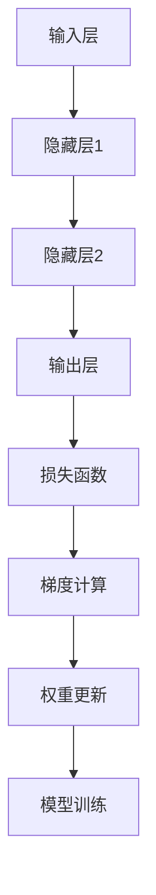
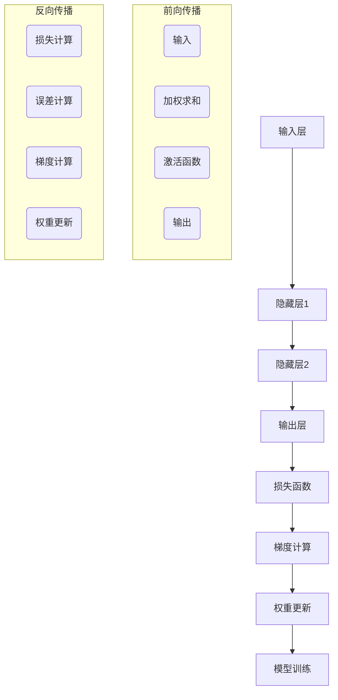

                 

# 《神经网络：人工智能的基石》

> 关键词：神经网络、机器学习、深度学习、激活函数、反向传播、深度强化学习

> 摘要：本文将深入探讨神经网络作为人工智能基石的理论基础、发展历程及其在现代AI中的应用。我们将从神经网络的起源和发展，数学基础，前馈神经网络、卷积神经网络、循环神经网络和深度强化学习的构建与应用，以及神经网络的训练与优化等方面，全面剖析这一强大的技术。通过本文的学习，读者将对神经网络有更加清晰和深刻的认识，掌握神经网络在AI领域的重要应用。

## 第1章：神经网络的起源与发展

### 1.1 神经网络的起源

#### 1.1.1 生物神经网络的启示

神经网络的起源可以追溯到生物神经系统的启发。人类的大脑由大约100亿个神经元组成，它们通过复杂的连接和相互作用来处理信息。每个神经元都可以接收来自其他神经元的输入，并通过激活函数产生输出。这种信息处理方式激发了科学家们的灵感，他们试图将生物神经系统的工作原理应用到计算系统中，从而诞生了神经网络的概念。

#### 1.1.2 神经网络的理论基础

神经网络的理论基础源于人工神经网络（Artificial Neural Networks,ANNs）的概念。人工神经网络是一种由大量简单神经元组成的计算模型，通过学习和训练来模拟生物神经系统的工作方式。神经网络的核心思想是通过调整神经元之间的权重，使系统能够从输入数据中学习到有用的信息。

#### 1.1.3 神经网络的发展历程

神经网络的发展历程可以追溯到20世纪40年代。1943年，McCulloch和Pitts提出了第一个人工神经网络模型，称为McCulloch-Pitts神经元。随后，1949年，Hebb提出了Hebb学习规则，这是神经网络学习算法的基础。20世纪80年代，Rumelhart、Hinton和Williams等人提出了反向传播算法（Backpropagation Algorithm），使得神经网络的学习速度和性能得到了显著提升。近年来，随着深度学习技术的发展，神经网络的应用领域不断拓展，其在计算机视觉、自然语言处理等领域的表现也越来越出色。

### 1.2 神经网络在现代AI中的应用

#### 1.2.1 机器学习与神经网络

神经网络是机器学习（Machine Learning,ML）的重要分支。机器学习的核心思想是通过从数据中学习规律，从而实现预测和决策。神经网络作为一种强大的学习模型，可以通过学习输入和输出之间的映射关系，实现复杂的数据处理任务。

#### 1.2.2 神经网络在计算机视觉中的应用

计算机视觉是人工智能的一个重要领域，旨在让计算机理解和解释视觉信息。神经网络在计算机视觉中得到了广泛的应用，例如图像分类、目标检测、人脸识别等。其中，卷积神经网络（Convolutional Neural Networks,CNNs）是计算机视觉领域的主要技术之一，通过模拟生物视觉系统的工作原理，实现了高效的图像特征提取和分类。

#### 1.2.3 神经网络在自然语言处理中的应用

自然语言处理（Natural Language Processing,NLP）是人工智能的另一个重要领域，旨在使计算机能够理解、生成和解释人类语言。神经网络在NLP中的应用非常广泛，例如语言模型、机器翻译、情感分析等。循环神经网络（Recurrent Neural Networks,RNNs）和长短期记忆网络（Long Short-Term Memory,LSTM）是NLP领域的主要技术之一，通过处理序列数据，实现了对语言的深入理解和建模。

### 1.3 神经网络在深度学习中的地位

深度学习（Deep Learning,DL）是人工智能领域的一个重要分支，旨在通过多层的神经网络模型，实现对复杂数据的高效表示和建模。神经网络作为深度学习的基础，其地位日益重要。深度学习通过构建多层次的神经网络，可以从大量数据中自动学习到有效的特征表示，从而实现出色的性能和效果。

## 第2章：神经网络的数学基础

### 2.1 神经元的数学模型

神经网络是由大量简单的神经元组成的计算模型，每个神经元都可以看作是一个简单的计算单元。神经元的数学模型主要包括输入层、权重、激活函数和输出层。

#### 2.1.1 神经元的激活函数

激活函数是神经网络中最关键的组成部分之一，它决定了神经元输出与输入之间的关系。常用的激活函数包括线性函数、sigmoid函数、ReLU函数和Tanh函数等。

- **线性函数**：线性函数是最简单的激活函数，形式为\( f(x) = x \)。线性函数在神经网络中通常用于隐藏层之间的连接，以保证网络的非线性能力。
  
- **sigmoid函数**：sigmoid函数的形式为\( f(x) = \frac{1}{1 + e^{-x}} \)。sigmoid函数可以将输入值映射到\( (0,1) \)区间内，常用于二分类问题。
  
- **ReLU函数**：ReLU函数的形式为\( f(x) = \max(0, x) \)。ReLU函数在神经网络中具有很好的非线性特性，可以有效缓解梯度消失问题。
  
- **Tanh函数**：Tanh函数的形式为\( f(x) = \frac{e^x - e^{-x}}{e^x + e^{-x}} \)。Tanh函数与ReLU函数类似，具有较好的非线性特性，但其输出范围在\( (-1,1) \)之间。

#### 2.1.2 神经元的学习过程

神经元的学习过程主要包括权重调整和激活函数的选择。在训练过程中，神经网络通过不断调整权重，使得输出与期望输出之间的误差最小。具体而言，神经网络采用一种称为反向传播算法的优化方法，通过计算梯度，更新网络权重。

### 2.2 神经网络的参数优化

神经网络的参数优化是神经网络训练过程中的关键步骤，主要包括损失函数、优化算法和正则化方法。

#### 2.2.1 梯度下降算法

梯度下降算法是一种常用的优化方法，其基本思想是通过计算损失函数的梯度，逐步调整网络权重，以最小化损失函数。梯度下降算法可以分为批处理梯度下降、随机梯度下降和小批量梯度下降等不同形式。

- **批处理梯度下降**：批处理梯度下降（Batch Gradient Descent,BGD）是在整个训练集上计算梯度，然后更新权重。BGD的优点是梯度计算准确，但计算成本高，训练时间较长。
  
- **随机梯度下降**：随机梯度下降（Stochastic Gradient Descent,SGD）是在单个样本上计算梯度，然后更新权重。SGD的优点是计算速度快，但梯度计算误差较大。
  
- **小批量梯度下降**：小批量梯度下降（Mini-batch Gradient Descent,MGD）是批处理和随机梯度下降的折中方案，在训练过程中随机选择一部分样本，计算这部分样本的梯度，然后更新权重。

#### 2.2.2 随机梯度下降

随机梯度下降（Stochastic Gradient Descent,SGD）是一种常用的优化算法，其基本思想是每次迭代时随机选择一个样本，计算该样本的梯度，并使用该梯度更新权重。

- **梯度计算**：对于每个样本\( x_i \)和标签\( y_i \)，计算损失函数关于权重的梯度\( \nabla_w L(x_i, y_i) \)。
  
- **权重更新**：使用梯度计算结果更新权重\( w \)：
  \[ w_{new} = w_{old} - \alpha \nabla_w L(x_i, y_i) \]
  其中，\( \alpha \)是学习率。

#### 2.2.3 动量法与Adam优化器

动量法（Momentum）是一种改进的优化算法，其基本思想是利用历史梯度信息来加速收敛。动量法通过计算梯度的一阶矩和二阶矩，更新权重。

- **一阶矩**：计算梯度的一阶矩，即梯度的平均值：
  \[ v_t = \beta_1 g_t + (1 - \beta_1) g_{t-1} \]
  其中，\( g_t \)是第\( t \)次迭代的梯度，\( \beta_1 \)是动量因子。

- **二阶矩**：计算梯度的二阶矩，即梯度的平方的平均值：
  \[ s_t = \beta_2 g_t^2 + (1 - \beta_2) s_{t-1} \]
  其中，\( \beta_2 \)是动量因子。

- **权重更新**：使用一阶矩和二阶矩更新权重：
  \[ w_{new} = w_{old} - \alpha \frac{v_t}{\sqrt{s_t} + \epsilon} \]
  其中，\( \alpha \)是学习率，\( \epsilon \)是正则项。

Adam优化器（Adaptive Moment Estimation）是另一种常用的优化算法，它结合了动量法和RMSprop优化器的优点，能够自适应地调整学习率。

- **一阶矩估计**：计算梯度的一阶矩估计：
  \[ m_t = \beta_1 g_t + (1 - \beta_1) m_{t-1} \]

- **二阶矩估计**：计算梯度的二阶矩估计：
  \[ v_t = \beta_2 g_t^2 + (1 - \beta_2) v_{t-1} \]

- **权重更新**：使用一阶矩估计和二阶矩估计更新权重：
  \[ w_{new} = w_{old} - \alpha \frac{m_t}{\sqrt{v_t} + \epsilon} \]

## 第3章：前馈神经网络的构建

前馈神经网络（Feedforward Neural Networks,FFNNs）是一种简单的神经网络结构，其特点是输入层、隐藏层和输出层之间不存在循环连接。前馈神经网络通常用于分类和回归任务。

### 3.1 前馈神经网络的基本结构

前馈神经网络的基本结构包括输入层、隐藏层和输出层。输入层接收外部输入数据，隐藏层通过激活函数对输入数据进行处理，输出层产生最终的预测结果。

#### 3.1.1 神经网络层的定义

神经网络层是指神经网络中的一个计算层，包括输入层、隐藏层和输出层。输入层接收外部输入数据，隐藏层通过非线性变换对输入数据进行处理，输出层产生最终的预测结果。

#### 3.1.2 神经网络的前向传播过程

前向传播过程是指神经网络从输入层到输出层的正向计算过程。在计算过程中，每个层的输出作为下一层的输入。前向传播过程可以分为以下几个步骤：

1. **输入层到隐藏层的计算**：对于每个隐藏层，计算每个神经元的输入值和输出值。
2. **隐藏层到输出层的计算**：对于输出层，计算每个神经元的输入值和输出值。
3. **预测结果生成**：根据输出层的输出值生成最终的预测结果。

#### 3.1.3 神经网络的反向传播过程

反向传播过程是指神经网络从输出层到输入层的反向计算过程，用于更新网络权重。反向传播过程可以分为以下几个步骤：

1. **计算输出误差**：计算输出层的误差，即预测结果与真实结果之间的差异。
2. **计算隐藏层的误差**：根据输出误差和隐藏层的输入输出关系，计算隐藏层的误差。
3. **更新网络权重**：根据误差计算结果，使用反向传播算法更新网络权重。

### 3.2 深度前馈神经网络的优化

深度前馈神经网络（Deep Feedforward Neural Networks）是指具有多个隐藏层的神经网络。深度前馈神经网络在训练过程中可能会面临一些挑战，如梯度消失和梯度爆炸等。以下是一些深度前馈神经网络的优化方法：

#### 3.2.1 梯度消失和梯度爆炸

梯度消失和梯度爆炸是深度前馈神经网络训练过程中常见的问题。梯度消失是指梯度值过小，导致网络无法更新权重；梯度爆炸是指梯度值过大，导致网络无法稳定收敛。

- **梯度消失**：梯度消失通常发生在深层神经网络中，由于梯度在反向传播过程中逐层传递，每层的梯度都会被前一层梯度缩小。为了解决梯度消失问题，可以采用以下方法：

  1. **激活函数选择**：选择具有较好梯度的激活函数，如ReLU函数。
  2. **梯度裁剪**：在反向传播过程中，对梯度进行裁剪，以限制其大小。
  3. **批量归一化**：在隐藏层中使用批量归一化（Batch Normalization），以提高网络的稳定性和训练速度。

- **梯度爆炸**：梯度爆炸通常发生在深度前馈神经网络的初始化阶段，由于网络权重较大，导致梯度值迅速增大。为了解决梯度爆炸问题，可以采用以下方法：

  1. **权重初始化**：使用合适的权重初始化方法，如高斯初始化和Xavier初始化。
  2. **梯度裁剪**：在反向传播过程中，对梯度进行裁剪，以限制其大小。

#### 3.2.2 残差网络

残差网络（Residual Network）是一种具有残差连接的神经网络结构，可以有效缓解梯度消失和梯度爆炸问题。残差网络的基本思想是引入恒等映射（Identity Mapping），使网络在反向传播过程中能够直接从输出层获取梯度。

- **残差块**：残差块是残差网络的基本构建单元，包括两个或多个卷积层和一个恒等映射层。在残差块中，输出直接从输入层传递到下一层，从而缓解了梯度消失问题。
- **多层残差网络**：多层残差网络通过堆叠多个残差块，实现了更深的神经网络结构。多层残差网络在训练过程中具有更好的收敛性和准确性。

#### 3.2.3 批处理归一化

批处理归一化（Batch Normalization）是一种在隐藏层中使用的技术，可以提高神经网络的稳定性和训练速度。批处理归一化的基本思想是将每个神经元的输入值缩放到\( (-1,1) \)区间内，从而减少内部协变量转移。

- **计算均值和方差**：在训练过程中，对每个隐藏层的神经元进行批量归一化，计算该层的输入数据的均值和方差。
- **归一化变换**：对每个神经元的输入值进行归一化变换，使其满足\( Z = \frac{X - \mu}{\sigma} \)的形式，其中\( X \)是输入值，\( \mu \)是均值，\( \sigma \)是方差。
- **反向传播**：在反向传播过程中，对归一化变换进行反向传播，更新网络权重。

## 第4章：卷积神经网络

卷积神经网络（Convolutional Neural Networks,CNNs）是一种具有特殊结构的神经网络，主要用于处理图像数据。CNNs通过卷积操作和池化操作，实现对图像特征的提取和分类。

### 4.1 卷积神经网络的基本原理

#### 4.1.1 卷积操作的数学解释

卷积操作是一种数学运算，用于计算两个函数的乘积积分。在CNNs中，卷积操作用于计算输入图像和卷积核（Filter）之间的内积，从而提取图像特征。

- **卷积核**：卷积核是一个小的矩阵，通常称为Filter或Kernel。卷积核的大小和形状决定了图像特征提取的方向和强度。
- **卷积操作**：卷积操作将卷积核与输入图像进行卷积运算，得到一个特征图（Feature Map）。特征图包含了输入图像的局部特征信息。

#### 4.1.2 卷积神经网络的层次结构

卷积神经网络通常包括多个卷积层、池化层和全连接层。每个卷积层通过卷积操作提取图像特征，每个池化层通过池化操作减少特征图的维度，全连接层用于分类。

- **卷积层**：卷积层是CNNs的核心部分，通过卷积操作提取图像特征。卷积层通常包括多个卷积核，每个卷积核提取不同类型的特征。
- **池化层**：池化层通过池化操作减少特征图的维度，从而减少计算量和过拟合的风险。常用的池化操作包括最大池化和平均池化。
- **全连接层**：全连接层将卷积层和池化层提取的特征进行整合，并通过激活函数生成最终的分类结果。

#### 4.1.3 卷积神经网络在图像分类中的应用

卷积神经网络在图像分类中得到了广泛的应用，通过训练模型来识别和分类图像。以下是卷积神经网络在图像分类中的应用步骤：

1. **数据预处理**：对图像数据进行分析和预处理，包括图像大小调整、归一化、数据增强等。
2. **构建卷积神经网络**：使用深度学习框架（如TensorFlow或PyTorch）构建卷积神经网络模型，包括卷积层、池化层和全连接层。
3. **模型训练**：使用训练数据集对卷积神经网络进行训练，通过反向传播算法更新网络权重。
4. **模型评估**：使用验证数据集对训练好的模型进行评估，计算模型的准确率、召回率等指标。
5. **模型部署**：将训练好的模型部署到实际应用场景中，如图像分类应用、目标检测等。

### 4.2 卷积神经网络的变种

卷积神经网络在图像分类中取得了很好的效果，但其在其他领域中的应用仍然存在一定的局限性。为了拓展卷积神经网络的应用范围，研究人员提出了多种卷积神经网络的变种。

#### 4.2.1 残差卷积神经网络

残差卷积神经网络（Residual Convolutional Neural Networks）是卷积神经网络的改进版本，通过引入残差连接来缓解梯度消失和梯度爆炸问题。

- **残差块**：残差卷积神经网络的基本构建单元是残差块，包括两个或多个卷积层和一个恒等映射层。残差块通过直接将输入数据传递到下一层，从而缓解了梯度消失问题。
- **多层残差卷积神经网络**：多层残差卷积神经网络通过堆叠多个残差块，实现了更深的网络结构。多层残差卷积神经网络在图像分类、目标检测等领域取得了很好的效果。

#### 4.2.2 生成对抗网络

生成对抗网络（Generative Adversarial Networks,GANs）是一种由两个神经网络组成的对抗性模型，分别称为生成器（Generator）和判别器（Discriminator）。生成器通过学习输入数据的分布，生成与真实数据相似的样本；判别器通过区分真实数据和生成数据，从而提高生成器的性能。

- **生成器**：生成器是一个卷积神经网络，用于生成与真实数据相似的图像。
- **判别器**：判别器是一个卷积神经网络，用于区分真实数据和生成数据。
- **对抗性训练**：生成器和判别器通过对抗性训练相互竞争，生成器试图生成更真实的图像，而判别器试图准确区分真实数据和生成数据。通过不断训练，生成器逐渐提高生成图像的质量。

#### 4.2.3 反向传播卷积神经网络

反向传播卷积神经网络（Backpropagation Convolutional Neural Networks）是一种基于反向传播算法的卷积神经网络。反向传播卷积神经网络通过反向传播算法更新网络权重，从而实现图像特征的学习和分类。

- **前向传播**：反向传播卷积神经网络通过前向传播计算输出值和预测结果。
- **反向传播**：反向传播卷积神经网络通过反向传播计算梯度，并更新网络权重。
- **优化算法**：反向传播卷积神经网络可以使用多种优化算法，如梯度下降、动量法、Adam优化器等，以最小化损失函数。

## 第5章：循环神经网络

循环神经网络（Recurrent Neural Networks,RNNs）是一种具有递归结构的神经网络，主要用于处理序列数据。RNNs通过循环连接，实现了对序列数据的记忆和建模能力。

### 5.1 循环神经网络的基本原理

#### 5.1.1 循环神经网络的时序建模能力

循环神经网络具有递归结构，其输出不仅取决于当前输入，还取决于之前的状态。这种递归特性使得循环神经网络能够捕捉序列数据中的时序依赖关系。

- **递归结构**：循环神经网络中的每个神经元都包含一个递归单元，用于存储上一时刻的状态信息。
- **时间步**：循环神经网络在处理序列数据时，将序列划分为多个时间步，每个时间步对应一个输入数据。

#### 5.1.2 LSTM单元的数学模型

长短期记忆网络（Long Short-Term Memory,LSTM）是一种特殊的循环神经网络，通过引入门控机制，实现了对长期依赖关系的建模。

- **输入门**：输入门用于控制当前输入数据对状态的影响。输入门通过计算一个sigmoid函数，将输入数据映射到\( (0,1) \)区间内，表示输入数据的可信度。
- **遗忘门**：遗忘门用于控制当前状态对下一个状态的影响。遗忘门通过计算一个sigmoid函数，将当前状态映射到\( (0,1) \)区间内，表示当前状态的可信度。
- **输出门**：输出门用于控制当前状态对输出的影响。输出门通过计算一个sigmoid函数，将当前状态映射到\( (0,1) \)区间内，表示当前状态的可信度。

#### 5.1.3 GRU单元的数学模型

门控循环单元（Gated Recurrent Unit,GRU）是一种简化版的循环神经网络，通过合并输入门和遗忘门，实现了对状态的控制。

- **重置门**：重置门通过计算一个sigmoid函数，将当前输入和上一状态进行融合，从而决定当前状态的更新。
- **更新门**：更新门通过计算一个sigmoid函数，将当前输入和上一状态进行融合，从而决定当前状态的更新。

### 5.2 循环神经网络在序列建模中的应用

循环神经网络在序列建模中具有广泛的应用，例如语言模型、语音识别和时间序列预测等。

#### 5.2.1 语言模型

语言模型是一种用于预测下一个单词或字符的概率分布的模型。循环神经网络通过递归结构，能够捕捉序列数据中的时序依赖关系，从而实现高效的单词或字符预测。

- **输入表示**：循环神经网络将输入序列表示为词向量或字符向量。
- **状态更新**：循环神经网络在处理每个时间步时，更新状态表示当前序列的特征信息。
- **输出预测**：循环神经网络通过计算输出层的概率分布，预测下一个单词或字符。

#### 5.2.2 语音识别

语音识别是一种将语音信号转换为文本的计算机应用。循环神经网络通过递归结构，能够捕捉语音信号中的时序依赖关系，从而实现高效的语音识别。

- **声学模型**：循环神经网络用于建模语音信号的特征，通过计算语音信号的特征向量。
- **语言模型**：循环神经网络用于建模文本的统计特征，通过计算文本的特征向量。
- **解码器**：循环神经网络通过解码器，将声学模型和语言模型结合，生成最终的文本输出。

#### 5.2.3 时间序列预测

时间序列预测是一种根据历史时间序列数据预测未来值的任务。循环神经网络通过递归结构，能够捕捉时间序列中的时序依赖关系，从而实现高效的时间序列预测。

- **输入表示**：循环神经网络将输入时间序列表示为特征向量。
- **状态更新**：循环神经网络在处理每个时间步时，更新状态表示当前时间序列的特征信息。
- **输出预测**：循环神经网络通过计算输出层的预测值，预测未来的时间序列值。

## 第6章：深度强化学习

深度强化学习（Deep Reinforcement Learning,Deep RL）是强化学习（Reinforcement Learning,RL）的一个分支，它结合了深度学习和强化学习的技术，通过学习策略来优化决策过程。

### 6.1 深度强化学习的基本概念

#### 6.1.1 强化学习的理论基础

强化学习是一种基于奖励反馈的机器学习方法，其核心思想是学习如何在环境中采取行动，以最大化累积奖励。强化学习由四个主要部分组成：代理（Agent）、环境（Environment）、状态（State）和动作（Action）。

- **代理**：强化学习的主体，负责执行动作并学习策略。
- **环境**：代理所在的动态系统，负责对代理的动作做出响应。
- **状态**：描述代理在环境中所处的状态。
- **动作**：代理在某个状态下可以执行的动作。
- **奖励**：代理在每个状态下执行动作后，环境给予的即时反馈。

#### 6.1.2 深度Q网络（DQN）

深度Q网络（Deep Q-Network,DQN）是深度强化学习的一个经典模型，它使用深度神经网络来近似Q函数，Q函数是强化学习中的核心函数，用于评估代理在每个状态下的最优动作。

- **Q值**：Q值表示代理在某个状态下执行某个动作的预期累积奖励。
- **深度神经网络**：DQN使用一个深度神经网络来近似Q值函数，该神经网络通常包含多个隐藏层，每个隐藏层都对输入进行变换和抽象。
- **经验回放**：为了减少样本偏差，DQN使用经验回放（Experience Replay）机制，将代理在训练过程中遇到的状态、动作和奖励存储在一个记忆库中，然后从记忆库中随机抽取样本进行训练。

#### 6.1.3 带有策略的深度学习（PG）

带有策略的深度学习（Policy Gradient,PG）是一种基于策略的强化学习方法，它直接学习一个策略函数，该函数直接映射状态到动作。

- **策略函数**：策略函数是一个概率分布，它描述了代理在每个状态下采取不同动作的概率。
- **梯度上升**：PG方法使用梯度上升法来优化策略函数，通过最大化预期回报来更新策略参数。
- **优势函数**：优势函数是评估策略的一种指标，它表示在某个策略下，执行某个动作的回报与执行最优动作的回报之间的差异。

### 6.2 深度强化学习在应用中的挑战与解决方案

#### 6.2.1 多智能体深度强化学习

多智能体深度强化学习（Multi-Agent Deep Reinforcement Learning）是深度强化学习的一个扩展，它研究多个智能体在共享或冲突的环境中如何通过学习策略来优化各自的决策。

- **合作与竞争**：在多智能体环境中，智能体之间可能存在合作或竞争关系，这要求智能体必须同时考虑自身利益和整体利益。
- **分布式学习**：多智能体深度强化学习需要解决分布式学习问题，即如何在不同智能体之间共享学习经验和策略。
- **安全性和稳定性**：多智能体深度强化学习还必须考虑系统的安全性和稳定性，避免出现不稳定或失控的情况。

#### 6.2.2 无模型深度强化学习

无模型深度强化学习（Model-Free Deep Reinforcement Learning）是一种不依赖于环境模型的学习方法，它完全依赖于经验数据来学习策略。

- **数据效率**：无模型深度强化学习不需要预先了解环境模型，因此可以在数据较少的情况下进行学习，提高数据效率。
- **灵活性**：无模型深度强化学习能够适应快速变化的环境，因为它能够根据最新的经验数据进行实时调整。
- **挑战**：无模型深度强化学习面临的主要挑战是如何在复杂的决策空间中找到最优策略，尤其是在连续动作空间中。

#### 6.2.3 深度强化学习在游戏中的应用

深度强化学习在游戏领域取得了显著的应用成果，通过学习复杂的策略，智能体能够在各种游戏中达到超人类的表现。

- **棋类游戏**：深度强化学习在棋类游戏中表现出色，如国际象棋、围棋等，智能体能够通过自我对抗学习达到高水平的棋艺。
- **电子游戏**：深度强化学习在电子游戏中也得到了广泛应用，如Atari游戏、机器人足球等，智能体能够在虚拟环境中实现高效的决策和动作。
- **挑战**：游戏环境通常具有高度的不确定性和复杂的状态空间，这对深度强化学习提出了更高的要求。

## 第7章：神经网络的训练与优化

神经网络的训练与优化是深度学习领域的一个重要环节，直接影响到模型的性能和应用效果。在这一章中，我们将讨论神经网络训练的技巧、优化策略以及模型压缩与加速的方法。

### 7.1 神经网络训练的技巧

#### 7.1.1 数据增强

数据增强（Data Augmentation）是一种通过增加训练数据多样性来提高模型性能的技术。常用的数据增强方法包括旋转、缩放、裁剪、颜色变换等。

- **旋转**：对图像进行旋转，增加图像的角度多样性。
- **缩放**：对图像进行缩放，增加图像的大小多样性。
- **裁剪**：对图像进行随机裁剪，增加图像的局部多样性。
- **颜色变换**：对图像进行颜色变换，如调整亮度、对比度和饱和度，增加图像的颜色多样性。

#### 7.1.2 过拟合与欠拟合

过拟合（Overfitting）和欠拟合（Underfitting）是神经网络训练过程中常见的两种问题。

- **过拟合**：模型在训练数据上表现良好，但在验证或测试数据上表现较差，即模型对训练数据过于敏感，无法泛化到新的数据。
- **欠拟合**：模型在训练和验证数据上表现都较差，即模型对数据的拟合能力不足。

为了解决过拟合和欠拟合问题，可以采用以下方法：

- **正则化**：通过增加正则化项，如L1正则化或L2正则化，来惩罚模型参数，减少过拟合现象。
- **增加训练数据**：增加训练数据的数量，可以提高模型的泛化能力，减少过拟合现象。
- **调整模型复杂度**：通过调整模型的结构和参数，找到合适的模型复杂度，避免欠拟合。

#### 7.1.3 正则化方法

正则化方法是一种在损失函数中添加惩罚项，以防止模型过拟合的技术。常用的正则化方法包括L1正则化、L2正则化和Dropout。

- **L1正则化**：在损失函数中添加\( \lambda \cdot ||\theta||_1 \)的惩罚项，其中\( \theta \)是模型参数，\( \lambda \)是正则化参数。
- **L2正则化**：在损失函数中添加\( \lambda \cdot ||\theta||_2 \)的惩罚项，其中\( \theta \)是模型参数，\( \lambda \)是正则化参数。
- **Dropout**：在训练过程中，随机将部分神经元设置为0，以减少神经元之间的依赖性，防止过拟合。

### 7.2 神经网络优化的策略

#### 7.2.1 梯度裁剪

梯度裁剪（Gradient Clipping）是一种在训练过程中限制梯度大小的技术，以防止梯度爆炸和梯度消失。

- **梯度裁剪策略**：将梯度的大小限制在一个阈值范围内，如果梯度大小超过阈值，则将其裁剪到阈值。
- **梯度裁剪的优点**：防止模型训练过程中梯度爆炸和梯度消失，提高训练稳定性。

#### 7.2.2 权重初始化

权重初始化（Weight Initialization）是神经网络训练中的一个重要步骤，合适的权重初始化可以加速模型的收敛。

- **常用的权重初始化方法**：高斯初始化（Gaussian Initialization）和Xavier初始化（Xavier Initialization）。
- **高斯初始化**：从均值为0、标准差为\( \frac{1}{\sqrt{n}} \)的正态分布中采样权重。
- **Xavier初始化**：从均值为0、标准差为\( \frac{1}{\sqrt{k}} \)的正态分布中采样权重，其中\( k \)是前一层的神经元数量。

#### 7.2.3 模型压缩与加速

模型压缩与加速（Model Compression and Acceleration）是一种通过减少模型参数数量和计算量，提高模型训练和推理速度的技术。

- **模型压缩方法**：量化（Quantization）、剪枝（Pruning）和蒸馏（Distillation）。
- **量化**：将模型中的浮点数参数转换为低比特位的整数参数，以减少模型大小和计算量。
- **剪枝**：通过删除模型中的冗余参数，减少模型大小和计算量。
- **蒸馏**：将大型模型的知识迁移到小型模型中，以提高小型模型的性能。

## 第8章：神经网络的工程实践

### 8.1 神经网络开发环境搭建

神经网络开发环境搭建是进行神经网络研究和应用的第一步。以下是一个典型的神经网络开发环境搭建流程：

#### 8.1.1 Python环境配置

首先，需要安装Python解释器和相关依赖库。Python是一种广泛使用的编程语言，其在机器学习和深度学习领域具有很高的适用性。

- **安装Python解释器**：可以从Python官方网站（https://www.python.org/）下载Python解释器，并按照提示进行安装。
- **安装依赖库**：安装常见的Python依赖库，如NumPy、Pandas、SciPy等。可以使用pip命令进行安装：

  ```python
  pip install numpy pandas scipy
  ```

#### 8.1.2 深度学习框架选择

深度学习框架是一种用于构建和训练深度学习模型的工具集。目前，主流的深度学习框架包括TensorFlow、PyTorch和Keras等。

- **TensorFlow**：TensorFlow是一个由Google开源的深度学习框架，具有强大的功能和高灵活性。它提供了丰富的API，支持多种深度学习模型和算法。
- **PyTorch**：PyTorch是一个由Facebook开源的深度学习框架，以其动态计算图和灵活的API而受到广泛关注。PyTorch在图像识别、自然语言处理等领域具有出色的性能。
- **Keras**：Keras是一个高级深度学习框架，建立在TensorFlow和Theano之上。Keras提供了简洁的API，使得构建和训练深度学习模型变得更加容易。

根据实际需求和项目要求，可以选择合适的深度学习框架进行开发。

#### 8.1.3 数据预处理与加载

在构建神经网络模型之前，需要对数据进行预处理和加载。数据预处理是神经网络训练过程中至关重要的一步，它包括数据清洗、归一化、标准化等操作。

- **数据清洗**：去除数据中的噪声和错误，确保数据的准确性和一致性。
- **归一化**：将数据缩放到相同的范围，如\( [0, 1] \)或\( [-1, 1] \)，以消除不同特征之间的量纲差异。
- **标准化**：将数据转换为标准正态分布，以消除不同特征之间的量纲差异。

在完成数据预处理后，可以使用深度学习框架提供的API进行数据加载和迭代。

### 8.2 神经网络项目的实现

神经网络项目的实现是神经网络工程实践的核心环节。以下是一个典型的神经网络项目实现流程：

#### 8.2.1 神经网络模型设计

首先，需要根据项目需求设计神经网络模型。模型设计包括确定网络结构、选择激活函数、定义损失函数和优化算法等。

- **网络结构**：根据项目需求，确定神经网络模型的层数、神经元数量和层间连接方式。
- **激活函数**：选择合适的激活函数，如ReLU、Sigmoid或Tanh等，以实现网络的非线性能力。
- **损失函数**：根据项目需求，选择合适的损失函数，如均方误差（MSE）、交叉熵损失等，以衡量模型预测值与真实值之间的差异。
- **优化算法**：选择合适的优化算法，如随机梯度下降（SGD）、Adam等，以更新网络权重。

#### 8.2.2 训练与验证

在模型设计完成后，需要对模型进行训练和验证。训练过程中，模型通过不断调整权重，学习到输入数据和输出数据之间的映射关系。验证过程中，通过使用验证数据集，评估模型的性能。

- **数据集划分**：将数据集划分为训练集、验证集和测试集，以确保模型的泛化能力。
- **模型训练**：使用训练集对模型进行训练，通过反向传播算法更新网络权重。
- **模型验证**：使用验证集对模型进行验证，计算模型的准确率、召回率等指标，以评估模型性能。
- **超参数调优**：根据验证结果，调整模型超参数，如学习率、批量大小等，以提高模型性能。

#### 8.2.3 模型部署与优化

在模型验证完成后，需要将模型部署到实际应用场景中，并进行优化。

- **模型部署**：将训练好的模型部署到服务器或设备中，以便在实际应用中使用。
- **模型优化**：通过调整模型结构和超参数，进一步提高模型性能。常见的优化方法包括模型压缩、量化、剪枝等。

### 附录A：神经网络相关的工具与资源

#### A.1 主流深度学习框架对比

在深度学习领域，存在多种主流的深度学习框架，如TensorFlow、PyTorch和Keras等。以下是对这些框架的简要对比：

- **TensorFlow**：TensorFlow是一个由Google开源的深度学习框架，具有强大的功能和丰富的API。它支持多种神经网络模型和算法，适用于大规模数据处理和分布式训练。
- **PyTorch**：PyTorch是一个由Facebook开源的深度学习框架，以其动态计算图和灵活的API而受到广泛关注。它提供了简洁的API，使得构建和训练深度学习模型变得更加容易。
- **Keras**：Keras是一个高级深度学习框架，建立在TensorFlow和Theano之上。它提供了简洁的API，使得构建和训练深度学习模型变得更加容易。

#### A.2 神经网络学习资源推荐

以下是一些建议的神经网络学习资源，包括在线课程、技术书籍和论文资源，以帮助读者深入了解神经网络。

- **在线课程**：许多在线教育平台提供了丰富的神经网络相关课程，如Coursera、edX、Udacity等。推荐的课程包括《深度学习》（Deep Learning）和《神经网络与深度学习》（Neural Networks and Deep Learning）等。
- **技术书籍**：一些经典的技术书籍，如《深度学习》（Deep Learning）、《神经网络与机器学习》（Neural Networks and Machine Learning）和《深度学习入门》（Deep Learning Book）等，为读者提供了系统性的学习内容。
- **论文资源**：阅读相关领域的学术论文是深入了解神经网络技术的有效途径。一些权威的学术期刊，如《神经计算》（Neural Computation）和《人工智能》（Artificial Intelligence）等，提供了丰富的论文资源。

### 附录B：神经网络相关的数学公式与流程图

#### B.1 神经网络的数学公式

以下是神经网络中常用的数学公式，包括激活函数的导数、前向传播公式和反向传播公式。

1. **激活函数的导数**

   - 线性函数的导数：\( f(x) = x \)，\( f'(x) = 1 \)
   - Sigmoid函数的导数：\( f(x) = \frac{1}{1 + e^{-x}} \)，\( f'(x) = \frac{e^{-x}}{(1 + e^{-x})^2} \)
   - ReLU函数的导数：\( f(x) = \max(0, x) \)，\( f'(x) = 1 \)（\( x > 0 \)），\( f'(x) = 0 \)（\( x \leq 0 \)）
   - Tanh函数的导数：\( f(x) = \frac{e^x - e^{-x}}{e^x + e^{-x}} \)，\( f'(x) = 1 - \frac{2}{e^{2x} + 1} \)

2. **前向传播公式**

   前向传播过程是将输入数据通过神经网络层，计算每个神经元的输入值和输出值。

   - \( Z_i = \sum_{j=1}^{n} w_{ij} X_j + b_i \)
   - \( A_i = f(Z_i) \)

   其中，\( Z_i \)是神经元的输入值，\( X_j \)是输入数据，\( w_{ij} \)是权重，\( b_i \)是偏置，\( f \)是激活函数，\( A_i \)是神经元的输出值。

3. **反向传播公式**

   反向传播过程是计算每个神经元的误差，并使用误差来更新网络权重。

   - \( \delta_j = (A_j - Y_j) \cdot f'(Z_j) \)
   - \( \delta_i = \sum_{j=1}^{n} w_{ji} \delta_j \cdot f'(Z_i) \)
   - \( \Delta w_{ij} = \alpha \cdot \delta_i A_j \)
   - \( \Delta b_i = \alpha \cdot \delta_i \)

   其中，\( \delta_j \)是输出层的误差，\( Y_j \)是真实值，\( f' \)是激活函数的导数，\( \Delta w_{ij} \)是权重更新值，\( \Delta b_i \)是偏置更新值，\( \alpha \)是学习率。

#### B.2 神经网络相关的Mermaid流程图

以下是神经网络相关的Mermaid流程图，用于展示前向传播和反向传播的过程。



在前向传播过程中，输入层通过权重和偏置连接到隐藏层，隐藏层通过激活函数计算输出值，最终传递到输出层。在反向传播过程中，从输出层开始计算梯度，并使用梯度更新网络权重和偏置，以优化模型性能。通过迭代这个过程，模型逐渐学习到输入和输出之间的映射关系。

## 作者信息

作者：AI天才研究院/AI Genius Institute & 禅与计算机程序设计艺术 /Zen And The Art of Computer Programming

感谢您的阅读，希望本文能对您在神经网络领域的探索和研究有所帮助。在未来的研究中，我们将继续深入探讨神经网络的理论基础和应用实践，为人工智能的发展贡献力量。如果您有任何问题或建议，欢迎随时与我们联系。让我们共同探索神经网络的无穷魅力！## 引言

神经网络（Neural Networks）作为人工智能（Artificial Intelligence, AI）领域的基础技术，已经成为现代计算机科学和工程不可或缺的一部分。它们不仅在理论上提供了对生物神经系统的模拟，而且在实际应用中展现了巨大的潜力。从简单的感知器（Perceptron）到复杂的深度学习模型，神经网络的发展历程充满了创新和突破。

神经网络之所以成为人工智能的基石，主要归功于其强大的表示和学习能力。通过模拟生物神经系统的结构和功能，神经网络可以自动从大量数据中学习到有用的特征，并将其用于复杂的任务，如图像识别、语音识别、自然语言处理和游戏控制等。这种能力使得神经网络在解决传统算法难以处理的复杂数据问题上表现出色。

本篇文章将带领读者深入探讨神经网络的方方面面。首先，我们将回顾神经网络的起源和发展历程，了解这一技术的理论基础及其在机器学习领域的地位。接着，我们将详细讨论神经网络的数学基础，包括神经元的数学模型和参数优化方法。随后，我们将深入介绍前馈神经网络、卷积神经网络（CNN）、循环神经网络（RNN）以及深度强化学习等核心内容。文章的最后，我们将探讨神经网络的训练与优化技巧，以及神经网络在工程实践中的应用。

通过本文的阅读，读者将能够：

1. 了解神经网络的基本概念和起源发展。
2. 掌握神经网络的数学基础，包括神经元的数学模型和参数优化方法。
3. 理解前馈神经网络、卷积神经网络和循环神经网络的结构和工作原理。
4. 了解深度强化学习的基本概念和应用。
5. 学习神经网络训练和优化的策略。
6. 掌握神经网络在工程实践中的实现和应用。

让我们开始这段探索神经网络世界的旅程，一起揭示这一强大技术背后的奥秘。

### 第1章：神经网络的起源与发展

神经网络的起源可以追溯到20世纪40年代。当时，心理学家McCulloch和数学家Pitts在1943年发表了名为“逻辑神经网”的论文，首次提出了人工神经网络（Artificial Neural Networks,ANNs）的概念。这篇论文描述了一种简单的计算模型，称为McCulloch-Pitts神经元，该神经元通过输入和输出之间的加权连接模拟生物神经系统的功能。

#### 1.1.1 生物神经网络的启示

生物神经网络提供了对人工神经网络设计的深刻启示。人类大脑由大约100亿个神经元组成，这些神经元通过复杂的连接和相互作用处理信息。每个神经元都可以接收来自其他神经元的输入，并通过激活函数产生输出。这些神经元通过层次化的结构和多样化的连接方式，实现了对信息的处理、存储和传递。生物神经网络的这些特性激发了科学家们对人工神经网络设计的灵感，促使他们尝试将生物神经网络的工作原理应用到计算机系统中。

#### 1.1.2 神经网络的理论基础

人工神经网络的理论基础源于对生物神经系统的模拟和理解。人工神经网络由大量简单的计算单元（神经元）组成，每个神经元通过权重连接与其他神经元相连。神经元的激活函数决定了神经元是否被激活，从而决定了神经网络的输出。人工神经网络的训练过程是通过调整神经元之间的权重，使网络能够从输入数据中学习到有用的信息。

人工神经网络的核心组成部分包括：

- **神经元**：人工神经网络的基本计算单元，接收输入，通过权重和激活函数产生输出。
- **权重**：神经元之间的连接权重，用于传递输入信息。
- **激活函数**：用于确定神经元是否被激活，常见的激活函数包括线性函数、Sigmoid函数、ReLU函数和Tanh函数等。
- **网络结构**：神经网络的层次结构，包括输入层、隐藏层和输出层。

神经网络的学习过程通常包括以下几个步骤：

1. **前向传播**：输入数据通过神经网络的前向传播过程，从输入层传递到隐藏层，最后传递到输出层。每个神经元根据其输入值和权重计算输出。
2. **计算误差**：输出层的输出与实际目标值之间的差异称为误差，误差用于评估网络性能。
3. **反向传播**：误差通过网络的反向传播过程传递回输入层，用于更新神经元之间的权重。
4. **权重更新**：通过计算误差的梯度，使用梯度下降算法或其他优化算法更新网络权重。

#### 1.1.3 神经网络的发展历程

自人工神经网络概念提出以来，神经网络经历了多个发展阶段。以下是一些重要的里程碑：

- **1949年**：心理学家Hebb提出了Hebb学习规则，这是一种基于神经元之间相互作用的学习机制，为神经网络学习算法奠定了基础。
- **1958年**：Frank Rosenblatt提出了感知器（Perceptron）模型，这是一种二分类神经网络，能够通过学习将输入数据分为不同的类别。
- **1974年**：马文·明斯基（Marvin Minsky）和西摩·帕普特（Seymour Papert）在他们的著作《感知器》（Perceptrons）中提出，单层感知器无法解决某些分类问题，这引起了神经网络领域的一段时间的停滞。
- **1986年**：Rumelhart、Hinton和Williams等人提出了反向传播算法（Backpropagation Algorithm），这是一种有效的神经网络训练算法，使得多层神经网络的学习速度和性能得到了显著提升。
- **1990年代**：随着计算机性能的提升和海量数据的积累，神经网络在语音识别、图像识别和自然语言处理等领域取得了重要进展。
- **2000年代**：深度学习（Deep Learning）的兴起，使得神经网络的结构和算法得到了进一步发展，特别是卷积神经网络（CNN）和循环神经网络（RNN）的应用取得了显著成果。
- **2010年代至今**：神经网络在人工智能领域取得了突破性进展，特别是在计算机视觉、自然语言处理和游戏控制等任务中，深度学习模型表现出了超人类的性能。

#### 1.2 神经网络在现代AI中的应用

神经网络在现代人工智能（AI）中的应用已经涵盖了多个领域，下面将简要介绍一些重要的应用：

##### 1.2.1 机器学习与神经网络

神经网络是机器学习（Machine Learning,ML）的重要分支。机器学习的核心思想是通过从数据中学习规律，从而实现预测和决策。神经网络作为一种强大的学习模型，可以通过学习输入和输出之间的映射关系，实现复杂的数据处理任务。神经网络在监督学习、无监督学习和强化学习等多种机器学习任务中都得到了广泛应用。

- **监督学习**：神经网络通过学习输入和输出之间的映射关系，实现分类和回归任务。常见的神经网络模型包括多层感知器（MLP）、卷积神经网络（CNN）和循环神经网络（RNN）等。
- **无监督学习**：神经网络在无监督学习任务中，如聚类和降维中发挥了重要作用。自编码器（Autoencoder）是一种常用的无监督学习神经网络模型。
- **强化学习**：神经网络在强化学习（Reinforcement Learning,RL）中用于学习策略，实现智能体的决策。深度Q网络（DQN）、策略梯度（PG）和深度强化学习（Deep RL）都是基于神经网络的强化学习算法。

##### 1.2.2 神经网络在计算机视觉中的应用

计算机视觉是人工智能的一个重要领域，旨在使计算机能够理解和解释视觉信息。神经网络在计算机视觉中得到了广泛的应用，例如图像分类、目标检测、人脸识别等。卷积神经网络（Convolutional Neural Networks,CNNs）是计算机视觉领域的主要技术之一，通过模拟生物视觉系统的工作原理，实现了高效的图像特征提取和分类。

- **图像分类**：卷积神经网络通过学习图像特征，能够对图像进行分类。例如，在ImageNet图像分类挑战中，卷积神经网络取得了超过人类水平的分类准确率。
- **目标检测**：目标检测是一种在图像中检测和定位特定目标的技术。卷积神经网络结合了区域提议网络（Region Proposal Networks,RPNs）和卷积神经网络（CNNs），实现了高效的目标检测。
- **人脸识别**：人脸识别是一种在图像中识别和验证人脸的技术。神经网络通过学习人脸特征，能够准确地识别人脸，并在安全性、人脸识别门禁系统和社交媒体等领域得到了广泛应用。

##### 1.2.3 神经网络在自然语言处理中的应用

自然语言处理（Natural Language Processing,NLP）是人工智能的另一个重要领域，旨在使计算机能够理解和生成人类语言。神经网络在NLP中得到了广泛的应用，例如语言模型、机器翻译、情感分析等。循环神经网络（Recurrent Neural Networks,RNNs）和长短期记忆网络（Long Short-Term Memory,LSTM）是NLP领域的主要技术之一，通过处理序列数据，实现了对语言的深入理解和建模。

- **语言模型**：语言模型是一种用于预测下一个单词或字符的概率分布的模型。循环神经网络通过递归结构，能够捕捉序列数据中的时序依赖关系，实现高效的单词或字符预测。
- **机器翻译**：机器翻译是一种将一种语言的文本翻译成另一种语言的技术。神经网络在机器翻译中通过学习源语言和目标语言之间的映射关系，实现了高质量的翻译。
- **情感分析**：情感分析是一种分析文本情感倾向的技术。神经网络通过学习情感特征，能够识别文本中的正面、负面情感，并在社交媒体分析、市场调研等领域得到了广泛应用。

##### 1.2.4 神经网络在语音识别中的应用

语音识别是一种将语音信号转换为文本的技术，是人工智能在语音处理领域的应用。神经网络在语音识别中通过学习语音特征和文本特征，实现了高效的语音识别。循环神经网络（RNNs）和长短期记忆网络（LSTM）在语音识别中发挥了重要作用，能够有效地建模语音信号的时序特性。

- **声学模型**：声学模型是一种用于建模语音信号特征的网络结构，通过学习声学特征，将语音信号转换为文本。
- **语言模型**：语言模型是一种用于预测下一个单词或字符的概率分布的模型，通过学习文本特征，提高语音识别的准确性。
- **解码器**：解码器是一种将声学模型和语言模型结合的网络结构，通过解码过程，将语音信号转换为文本输出。

##### 1.2.5 神经网络在其他领域的应用

除了上述领域，神经网络还在其他许多领域得到了广泛应用，如机器人控制、推荐系统、金融预测等。

- **机器人控制**：神经网络通过学习机器人控制的策略，实现自主决策和动作，提高机器人的智能化水平。
- **推荐系统**：神经网络通过学习用户的行为和偏好，实现个性化推荐，提高推荐系统的准确性。
- **金融预测**：神经网络通过学习金融市场数据，实现金融预测，为投资决策提供支持。

神经网络在人工智能领域的应用已经取得了显著成果，并继续在各个领域推动技术创新和发展。通过深入研究和应用神经网络，我们有望实现更加智能化的计算机系统，为人类社会带来更多的便利和进步。

### 第2章：神经网络的数学基础

在深入探讨神经网络之前，理解其数学基础是至关重要的。神经网络的核心在于其复杂的数学模型，这些模型不仅定义了神经元的计算方式，还涉及了学习过程中的参数优化。在这一章中，我们将详细讨论神经网络的数学基础，包括神经元的数学模型、激活函数、学习过程以及参数优化方法。

#### 2.1 神经元的数学模型

神经元是神经网络的基本计算单元，其工作原理基于生物神经元的模型。一个简单的神经元可以看作是一个线性变换加上一个非线性激活函数。以下是一个神经元的数学模型：

\[ Z_j = \sum_{i=1}^{n} w_{ij} X_i + b_j \]
\[ A_j = f(Z_j) \]

其中，\( Z_j \)是神经元\( j \)的输入值，\( w_{ij} \)是神经元\( i \)到神经元\( j \)的权重，\( X_i \)是输入值，\( b_j \)是神经元的偏置（ bias），\( f \)是激活函数。

1. **输入层**：输入层接收外部输入数据，每个输入值通过权重连接到隐藏层的神经元。
2. **隐藏层**：隐藏层对输入数据进行处理，每个隐藏层的神经元通过权重和激活函数将信息传递到下一层。
3. **输出层**：输出层的神经元产生最终输出，用于分类或回归任务。

#### 2.1.1 神经元的激活函数

激活函数是神经网络中的关键组成部分，它将线性组合的输入映射到非线性的输出，使得神经网络具有处理复杂问题的能力。以下是几种常用的激活函数：

1. **线性函数**：线性函数是最简单的激活函数，形式为 \( f(x) = x \)。它在神经网络中通常用于隐藏层之间的连接，以保证网络的非线性能力。

2. **Sigmoid函数**：Sigmoid函数的形式为 \( f(x) = \frac{1}{1 + e^{-x}} \)。sigmoid函数可以将输入值映射到 \( (0,1) \) 区间内，常用于二分类问题。

3. **ReLU函数**：ReLU函数的形式为 \( f(x) = \max(0, x) \)。ReLU函数在神经网络中具有很好的非线性特性，可以有效缓解梯度消失问题。

4. **Tanh函数**：Tanh函数的形式为 \( f(x) = \frac{e^x - e^{-x}}{e^x + e^{-x}} \)。Tanh函数与ReLU函数类似，具有较好的非线性特性，但其输出范围在 \( (-1,1) \) 之间。

#### 2.1.2 神经元的学习过程

神经元的学习过程主要通过反向传播算法实现。反向传播算法是一种用于优化神经网络参数的迭代过程，其基本思想是通过计算损失函数的梯度，逐步调整网络权重和偏置，以最小化损失函数。以下是一个简化的神经元学习过程：

1. **前向传播**：输入数据通过神经网络的前向传播过程，从输入层传递到隐藏层，最后传递到输出层。每个神经元根据其输入值和权重计算输出。

2. **计算误差**：输出层的输出与实际目标值之间的差异称为误差，误差用于评估网络性能。

3. **反向传播**：误差通过网络的反向传播过程传递回输入层，用于更新神经元之间的权重。

4. **权重更新**：通过计算误差的梯度，使用梯度下降算法或其他优化算法更新网络权重和偏置。

反向传播算法的具体步骤如下：

\[ \delta_j = (A_j - Y_j) \cdot f'(Z_j) \]
\[ \Delta w_{ij} = \alpha \cdot \delta_j A_i \]
\[ \Delta b_j = \alpha \cdot \delta_j \]

其中，\( \delta_j \)是输出层的误差，\( Y_j \)是真实值，\( f' \)是激活函数的导数，\( \Delta w_{ij} \)是权重更新值，\( \Delta b_j \)是偏置更新值，\( \alpha \)是学习率。

#### 2.2 神经网络的参数优化

神经网络的参数优化是神经网络训练过程中的关键步骤，主要包括损失函数、优化算法和正则化方法。

##### 2.2.1 梯度下降算法

梯度下降算法是一种常用的优化算法，其基本思想是通过计算损失函数的梯度，逐步调整网络权重，以最小化损失函数。梯度下降算法可以分为批处理梯度下降、随机梯度下降和小批量梯度下降等不同形式。

1. **批处理梯度下降（Batch Gradient Descent, BGD）**：批处理梯度下降是在整个训练集上计算梯度，然后更新权重。BGD的优点是梯度计算准确，但计算成本高，训练时间较长。

   \[ w_{new} = w_{old} - \alpha \cdot \nabla_w L \]

   其中，\( \nabla_w L \)是损失函数关于权重的梯度。

2. **随机梯度下降（Stochastic Gradient Descent, SGD）**：随机梯度下降是在单个样本上计算梯度，然后更新权重。SGD的优点是计算速度快，但梯度计算误差较大。

   \[ w_{new} = w_{old} - \alpha \cdot \nabla_w L(x_i, y_i) \]

   其中，\( x_i, y_i \)是第\( i \)个样本及其标签。

3. **小批量梯度下降（Mini-batch Gradient Descent, MGD）**：小批量梯度下降是批处理和随机梯度下降的折中方案，在训练过程中随机选择一部分样本，计算这部分样本的梯度，然后更新权重。

   \[ w_{new} = w_{old} - \alpha \cdot \frac{1}{m} \sum_{i=1}^{m} \nabla_w L(x_i, y_i) \]

   其中，\( m \)是批量大小。

##### 2.2.2 动量法

动量法（Momentum）是一种改进的优化算法，其基本思想是利用历史梯度信息来加速收敛。动量法通过计算梯度的一阶矩和二阶矩，更新权重。

1. **一阶矩**：计算梯度的一阶矩，即梯度的平均值：

   \[ v_t = \beta_1 g_t + (1 - \beta_1) g_{t-1} \]

   其中，\( g_t \)是第\( t \)次迭代的梯度，\( \beta_1 \)是动量因子。

2. **二阶矩**：计算梯度的二阶矩，即梯度的平方的平均值：

   \[ s_t = \beta_2 g_t^2 + (1 - \beta_2) s_{t-1} \]

   其中，\( \beta_2 \)是动量因子。

3. **权重更新**：使用一阶矩和二阶矩更新权重：

   \[ w_{new} = w_{old} - \alpha \cdot \frac{v_t}{\sqrt{s_t} + \epsilon} \]

   其中，\( \alpha \)是学习率，\( \epsilon \)是正则项。

##### 2.2.3 Adam优化器

Adam优化器（Adaptive Moment Estimation）是另一种常用的优化算法，它结合了动量法和RMSprop优化器的优点，能够自适应地调整学习率。

1. **一阶矩估计**：计算梯度的一阶矩估计：

   \[ m_t = \beta_1 g_t + (1 - \beta_1) m_{t-1} \]

2. **二阶矩估计**：计算梯度的二阶矩估计：

   \[ v_t = \beta_2 g_t^2 + (1 - \beta_2) v_{t-1} \]

3. **权重更新**：使用一阶矩估计和二阶矩估计更新权重：

   \[ w_{new} = w_{old} - \alpha \cdot \frac{m_t}{\sqrt{v_t} + \epsilon} \]

   其中，\( \alpha \)是学习率，\( \beta_1 \)和\( \beta_2 \)是动量因子，\( \epsilon \)是正则项。

通过上述数学模型和优化算法，神经网络可以自动调整其参数，以适应不同的学习任务。这些数学基础和优化策略为神经网络的训练和应用提供了坚实的理论基础。

### 第3章：前馈神经网络的构建

前馈神经网络（Feedforward Neural Networks, FFNNs）是一种基本的神经网络结构，它在整个深度学习领域中占据着重要的地位。这种网络结构的前向传播和反向传播过程是其核心，通过这些过程，神经网络可以自动学习输入和输出之间的映射关系。在本章中，我们将深入探讨前馈神经网络的基本结构、前向传播和反向传播的过程，以及深度前馈神经网络（Deep Feedforward Neural Networks）的优化方法。

#### 3.1 前馈神经网络的基本结构

前馈神经网络由三个主要部分组成：输入层、隐藏层和输出层。输入层接收外部输入数据，隐藏层对输入数据进行处理，输出层产生最终输出。以下是前馈神经网络的基本结构：

1. **输入层**：输入层包含若干个神经元，每个神经元对应输入数据的一个维度。输入层的神经元仅负责接收输入数据，并将其传递到隐藏层。

2. **隐藏层**：隐藏层包含一个或多个神经元层。每个隐藏层的神经元接收来自前一层神经元的输入，通过加权求和后加上偏置，再通过激活函数产生输出。隐藏层可以有多层，每层都可以对输入数据进行更复杂的非线性变换。

3. **输出层**：输出层包含一个或多个神经元，每个神经元对应输出数据的一个维度。输出层的神经元通过激活函数产生最终的输出，这些输出可以是分类结果、预测值或其他目标变量。

#### 3.1.1 神经网络层的定义

在构建前馈神经网络时，定义每一层的神经元数量和结构是至关重要的。以下是对每一层神经元的一些定义：

- **输入层**：输入层的神经元数量应与输入数据的维度相同，每个神经元接收一个输入值。
- **隐藏层**：隐藏层的神经元数量没有固定的规则，但通常根据问题复杂度和数据规模进行调整。过多的神经元可能导致过拟合，而过少的神经元可能导致欠拟合。经验法则通常建议从较小的隐藏层开始，并根据模型性能逐步增加神经元数量。
- **输出层**：输出层的神经元数量应与输出数据的维度相同。对于多分类问题，输出层通常使用softmax激活函数，以生成每个类别的概率分布。

#### 3.1.2 神经网络的前向传播过程

前向传播过程是指神经网络从输入层到输出层的正向计算过程。在这个过程中，每个层的输出作为下一层的输入。前向传播过程可以分为以下几个步骤：

1. **输入层到隐藏层的计算**：对于每个隐藏层，计算每个神经元的输入值和输出值。输入值由输入层的神经元传递，每个神经元通过加权求和加上偏置后，通过激活函数产生输出值。

   \[ Z_j = \sum_{i=1}^{n} w_{ij} X_i + b_j \]
   \[ A_j = f(Z_j) \]

   其中，\( Z_j \)是神经元的输入值，\( w_{ij} \)是权重，\( X_i \)是输入值，\( b_j \)是偏置，\( f \)是激活函数。

2. **隐藏层到输出层的计算**：对于输出层，计算每个神经元的输入值和输出值。输入值由隐藏层传递，每个神经元通过加权求和加上偏置后，通过激活函数产生输出值。

   \[ Z_k = \sum_{j=1}^{m} w_{kj} A_j + b_k \]
   \[ A_k = f(Z_k) \]

   其中，\( Z_k \)是神经元的输入值，\( w_{kj} \)是权重，\( A_j \)是隐藏层的输出值，\( b_k \)是偏置，\( f \)是激活函数。

3. **预测结果生成**：根据输出层的输出值生成最终的预测结果。对于分类问题，输出层通常使用softmax函数，将输出值转换为每个类别的概率分布。

   \[ \hat{y}_i = \frac{e^{A_i}}{\sum_{j=1}^{k} e^{A_j}} \]

   其中，\( \hat{y}_i \)是第\( i \)个类别的概率。

#### 3.1.3 神经网络的反向传播过程

反向传播过程是指神经网络从输出层到输入层的反向计算过程，用于更新网络权重。在这个过程中，误差信号从输出层反向传播到输入层，通过计算梯度更新网络权重。反向传播过程可以分为以下几个步骤：

1. **计算输出误差**：计算输出层的误差，即预测结果与真实结果之间的差异。

   \[ \delta_k = (A_k - y_k) \cdot f'(Z_k) \]

   其中，\( \delta_k \)是输出层的误差，\( A_k \)是输出层的输出值，\( y_k \)是真实结果，\( f' \)是激活函数的导数。

2. **计算隐藏层的误差**：根据输出误差和隐藏层的输入输出关系，计算隐藏层的误差。

   \[ \delta_j = \sum_{k=1}^{l} w_{kj} \delta_k \cdot f'(Z_j) \]

   其中，\( \delta_j \)是隐藏层的误差，\( w_{kj} \)是权重，\( \delta_k \)是输出层的误差，\( f' \)是激活函数的导数。

3. **更新网络权重**：根据误差计算结果，使用反向传播算法更新网络权重。

   \[ \Delta w_{ij} = \alpha \cdot \delta_j A_i \]
   \[ \Delta b_j = \alpha \cdot \delta_j \]

   其中，\( \Delta w_{ij} \)是权重更新值，\( \alpha \)是学习率，\( \delta_j \)是隐藏层的误差，\( A_i \)是输入层的输出值。

#### 3.2 深度前馈神经网络的优化

深度前馈神经网络具有多个隐藏层，这使得模型能够学习到更复杂的特征。然而，深度神经网络在训练过程中可能会面临一些挑战，如梯度消失和梯度爆炸等。以下是一些优化方法，可以帮助缓解这些挑战。

##### 3.2.1 梯度消失和梯度爆炸

**梯度消失**：在深度神经网络中，由于反向传播过程中误差信号逐层传递，每层的梯度都会被前一层梯度缩小。这可能导致一些层的梯度非常小，使得网络无法有效更新权重。

**梯度爆炸**：在某些情况下，由于网络权重的初始化问题，误差信号在反向传播过程中可能会迅速增大，导致梯度爆炸。

为了缓解这些问题，可以采用以下方法：

1. **激活函数选择**：选择具有较好梯度的激活函数，如ReLU函数，可以有效缓解梯度消失问题。

2. **权重初始化**：使用合适的权重初始化方法，如高斯初始化或Xavier初始化，可以缓解梯度爆炸问题。

3. **梯度裁剪**：在反向传播过程中，对梯度进行裁剪，以限制其大小，可以防止梯度爆炸。

4. **批量归一化**：在隐藏层中使用批量归一化（Batch Normalization），可以加速训练过程，并提高模型的稳定性。

##### 3.2.2 残差网络

残差网络（Residual Network）是一种通过引入残差连接来解决梯度消失和梯度爆炸问题的深度神经网络结构。残差网络的基本构建单元是残差块，它包含两个或多个卷积层和一个恒等映射层。

- **残差块**：在残差块中，输入直接通过一个恒等映射层传递到下一层，这保证了梯度可以直接从输出层传递到输入层，从而缓解了梯度消失问题。

- **多层残差网络**：通过堆叠多个残差块，可以构建更深的网络结构，实现更强的特征表示能力。

##### 3.2.3 批量归一化

批量归一化（Batch Normalization）是一种在隐藏层中使用的技术，它可以提高神经网络的稳定性和训练速度。批量归一化的基本思想是将每个神经元的输入值缩放到 \( (-1,1) \) 区间内，从而减少内部协变量转移。

- **计算均值和方差**：在训练过程中，对每个隐藏层的神经元进行批量归一化，计算该层的输入数据的均值和方差。

- **归一化变换**：对每个神经元的输入值进行归一化变换，使其满足 \( Z = \frac{X - \mu}{\sigma} \) 的形式，其中 \( X \) 是输入值，\( \mu \) 是均值，\( \sigma \) 是方差。

- **反向传播**：在反向传播过程中，对归一化变换进行反向传播，更新网络权重。

通过上述优化方法，深度前馈神经网络可以更加稳定和高效地进行训练。这些优化策略不仅提高了模型的性能，也降低了训练难度，使得深度神经网络在复杂数据处理任务中取得了显著的成果。

### 第4章：卷积神经网络

卷积神经网络（Convolutional Neural Networks, CNNs）是深度学习领域中的一种强大模型，专门用于处理图像和其他二维数据。CNNs通过其独特的结构设计，能够有效地从数据中提取局部特征，并在图像分类、目标检测、图像分割等领域取得了巨大的成功。在本章中，我们将深入探讨卷积神经网络的基本原理、层次结构及其在图像分类中的应用。

#### 4.1 卷积神经网络的基本原理

卷积神经网络的设计灵感来源于人类视觉系统，特别是视网膜和视觉皮层的结构。CNNs通过卷积操作、池化操作和全连接层来实现图像特征的学习和分类。

##### 4.1.1 卷积操作的数学解释

卷积操作是CNNs中最核心的部分，它通过滤波器（也称为卷积核）在图像上滑动，计算局部特征。卷积操作的数学表达式如下：

\[ \text{Feature Map}_{ij} = \sum_{k} \text{Filter}_{ik,j} \times \text{Input}_{ik,j} + \text{Bias}_{j} \]

其中，\( \text{Feature Map}_{ij} \)是第\( i \)个卷积层中第\( j \)个特征图的值，\( \text{Filter}_{ik,j} \)是卷积核的值，\( \text{Input}_{ik,j} \)是输入图像的值，\( \text{Bias}_{j} \)是偏置。

卷积操作可以看作是图像和卷积核的矩阵乘积，每个卷积核都用于提取不同类型的特征，例如边缘、纹理等。通过堆叠多个卷积层，CNNs能够逐步提取图像的更高层次特征。

##### 4.1.2 卷积神经网络的层次结构

卷积神经网络通常由多个卷积层、池化层和全连接层组成。以下是这些层的具体结构：

1. **输入层**：输入层接收原始图像数据，通常是一个四维张量，其维度为 \( (批量大小, 长度, 宽度, 通道数) \)。

2. **卷积层**：卷积层通过卷积操作提取图像特征。每个卷积层包括多个卷积核，每个卷积核可以提取图像中的不同特征。卷积层的输出是一个特征图集合。

3. **激活函数**：卷积层之后通常跟随一个激活函数，如ReLU函数，以引入非线性变换，增强网络的表示能力。

4. **池化层**：池化层用于减小特征图的尺寸，从而减少模型的参数数量，防止过拟合。常用的池化操作包括最大池化和平均池化。

5. **全连接层**：在全连接层，特征图被展平成一维向量，并通过全连接层进行分类或回归。全连接层通常位于卷积神经网络的最后，用于将提取的特征映射到输出结果。

##### 4.1.3 卷积神经网络在图像分类中的应用

卷积神经网络在图像分类中表现出色，特别是在大型数据集上的性能显著优于传统的机器学习算法。以下是一个典型的卷积神经网络图像分类流程：

1. **数据预处理**：对图像进行标准化、归一化和数据增强等预处理操作，以提高模型的泛化能力。

2. **卷积层**：通过卷积层提取图像的低级特征，如边缘、纹理等。每个卷积层使用不同的卷积核，逐步提取更复杂的特征。

3. **池化层**：通过池化层减小特征图的尺寸，减少模型的参数数量。

4. **全连接层**：将卷积层输出的特征图展平成一维向量，通过全连接层进行分类。全连接层通常使用softmax激活函数，输出每个类别的概率分布。

5. **损失函数**：使用交叉熵损失函数计算模型预测结果与实际标签之间的差异，并通过反向传播算法更新模型参数。

6. **模型评估**：通过验证集和测试集评估模型的性能，计算准确率、召回率等指标。

卷积神经网络在图像分类中的成功案例包括：

- **ImageNet竞赛**：在2012年的ImageNet竞赛中，由AlexNet提出的卷积神经网络在图像分类任务中取得了显著成绩，将错误率从26%降低到15%。
- **CIFAR-10和CIFAR-100**：CIFAR-10和CIFAR-100是常用的图像分类数据集，卷积神经网络在这些数据集上的表现也取得了突破性进展。
- **Image Classification任务**：在许多实际应用中，如医疗图像分析、车辆识别和交通标志识别等，卷积神经网络都展示了强大的分类能力。

通过卷积神经网络的结构设计和优化，图像分类任务取得了显著的进展。卷积神经网络不仅能够自动提取图像特征，还能够通过端到端的学习方式实现高效的图像分类。这使得卷积神经网络在计算机视觉领域成为了不可或缺的工具。

### 4.2 卷积神经网络的变种

随着深度学习技术的发展，卷积神经网络（CNNs）逐渐演化出多种变种，以应对不同类型的数据和任务。以下是一些重要的卷积神经网络变种，包括残差卷积神经网络、生成对抗网络（GANs）和反向传播卷积神经网络（Backpropagation Convolutional Neural Networks, BP-CNNs）。

#### 4.2.1 残差卷积神经网络

残差卷积神经网络（Residual Convolutional Neural Networks, ResNet）是由He等人于2015年提出的一种深度神经网络结构。它通过引入残差连接（Residual Connection）来解决深度神经网络训练过程中的梯度消失和梯度爆炸问题。

**残差块**：残差块是ResNet的基本构建单元，它由两个或多个卷积层和一个恒等映射层组成。在恒等映射层中，输入数据直接通过一个卷积核尺寸为1x1的卷积层传递到下一层，从而使得梯度可以直接从输出层传递到输入层，缓解了梯度消失问题。

**多层残差网络**：通过堆叠多个残差块，可以构建更深的网络结构，如ResNet-50、ResNet-101和ResNet-152。这些深层网络在图像分类任务中表现出了优异的性能，大幅度降低了训练难度，提高了模型的准确性。

**应用场景**：残差卷积神经网络在图像分类、目标检测和图像分割等领域得到了广泛应用。特别是在图像分类任务中，ResNet的引入使得模型能够处理上千层的网络结构，从而提升了模型的性能。

#### 4.2.2 生成对抗网络

生成对抗网络（Generative Adversarial Networks, GANs）是由Ian Goodfellow等人于2014年提出的一种由两个神经网络（生成器和判别器）组成的对抗性模型。生成器的目标是生成逼真的数据，而判别器的目标是区分真实数据和生成数据。通过对抗性训练，生成器逐渐提高生成数据的逼真度。

**生成器**：生成器的目的是生成与真实数据相似的数据。它通常由一个卷积神经网络组成，通过逐步增加特征图的尺寸和分辨率，生成高维数据。

**判别器**：判别器的目的是区分真实数据和生成数据。它也是一个卷积神经网络，通过逐步减小特征图的尺寸和分辨率，判断输入数据的真实性。

**对抗性训练**：生成器和判别器通过对抗性训练相互竞争。生成器尝试生成更真实的生成数据，以欺骗判别器；而判别器则努力区分真实数据和生成数据。通过不断迭代，生成器的生成数据质量逐渐提高。

**应用场景**：生成对抗网络在图像生成、图像修复、图像风格迁移和图像超分辨率等任务中得到了广泛应用。通过GANs，可以生成高质量的图像、视频和音频，为计算机视觉和计算机生成领域带来了新的研究方向。

#### 4.2.3 反向传播卷积神经网络

反向传播卷积神经网络（Backpropagation Convolutional Neural Networks, BP-CNNs）是一种基于反向传播算法的卷积神经网络结构。它通过前向传播计算输出值和预测结果，通过反向传播计算梯度并更新网络权重。

**前向传播**：BP-CNNs的前向传播过程与标准CNNs类似，通过卷积层、激活函数和池化层提取图像特征，并将特征传递到全连接层进行分类。

**反向传播**：BP-CNNs的反向传播过程用于计算网络权重和偏置的梯度，并使用梯度下降算法更新网络参数。通过反向传播，网络可以逐步调整权重，以减少预测误差。

**优化算法**：BP-CNNs可以使用多种优化算法，如梯度下降、动量法和Adam优化器等。这些优化算法能够加快收敛速度，提高模型性能。

**应用场景**：BP-CNNs在图像分类、目标检测和图像识别等领域得到了广泛应用。通过反向传播算法，BP-CNNs能够有效地学习图像特征，并在实际应用中取得了显著的成果。

综上所述，卷积神经网络的变种在图像分类、生成和识别等领域发挥了重要作用。通过引入残差连接、生成对抗网络和反向传播算法，这些变种网络在性能和适用性方面得到了显著提升，为深度学习技术的发展做出了重要贡献。

### 第5章：循环神经网络

循环神经网络（Recurrent Neural Networks, RNNs）是一种能够处理序列数据的神经网络结构。与传统的神经网络不同，RNNs具有递归结构，能够将前一时间步的信息存储在隐藏状态中，从而捕捉时间序列中的时序依赖关系。RNNs在自然语言处理、语音识别和时间序列预测等领域表现出色。本章将详细介绍循环神经网络的基本原理、常见结构以及其在实际应用中的案例。

#### 5.1 循环神经网络的基本原理

循环神经网络（RNNs）的基本原理是通过递归结构，将当前输入与之前的时间步的状态进行整合，从而生成当前时间步的输出。这种递归结构使得RNNs能够处理任意长度的序列数据。

##### 5.1.1 递归结构

RNNs的递归结构可以理解为每个时间步上的神经网络都共享相同的权重和偏置。在处理序列数据时，每个时间步的输入都会与之前的时间步的状态进行结合，并通过一个递归函数进行更新。

\[ h_t = \sigma(W_h \cdot [h_{t-1}, x_t] + b_h) \]

其中，\( h_t \)表示第\( t \)个时间步的隐藏状态，\( \sigma \)是激活函数（如ReLU、Tanh等），\( W_h \)是权重矩阵，\( b_h \)是偏置，\[ [h_{t-1}, x_t] \)是当前时间步的输入（上一个时间步的状态和当前时间步的输入）。

##### 5.1.2 时序建模能力

RNNs的时序建模能力源于其递归结构，它能够将之前的信息存储在隐藏状态中，并用于生成当前时间步的输出。这种能力使得RNNs能够处理任意长度的序列数据，并捕捉序列中的长期依赖关系。

##### 5.1.3 LSTM单元的数学模型

长短期记忆网络（Long Short-Term Memory, LSTM）是RNNs的一种变体，它通过引入门控机制，能够更好地处理长序列数据。LSTM单元的数学模型如下：

\[ i_t = \sigma(W_i \cdot [h_{t-1}, x_t] + b_i) \]
\[ f_t = \sigma(W_f \cdot [h_{t-1}, x_t] + b_f) \]
\[ o_t = \sigma(W_o \cdot [h_{t-1}, x_t] + b_o) \]
\[ g_t = \tanh(W_g \cdot [h_{t-1}, x_t] + b_g) \]
\[ C_t = f_t \odot C_{t-1} + i_t \odot g_t \]
\[ h_t = o_t \odot \tanh(C_t) \]

其中，\( i_t \)、\( f_t \)、\( o_t \)分别是输入门、遗忘门和输出门的状态，\( C_t \)是细胞状态，\( h_t \)是隐藏状态。

- **输入门**（\( i_t \)）：控制当前输入信息应该被保留在细胞状态中的比例。
- **遗忘门**（\( f_t \)）：控制从细胞状态中应该被遗忘的信息比例。
- **输出门**（\( o_t \)）：控制当前隐藏状态应该输出的信息比例。
- **细胞状态**（\( C_t \)）：存储时间序列中的重要信息，能够捕获长序列依赖关系。
- **隐藏状态**（\( h_t \)）：是最终的输出，用于后续的计算或决策。

##### 5.1.4 GRU单元的数学模型

门控循环单元（Gated Recurrent Unit, GRU）是另一种改进的RNN结构，它通过合并输入门和遗忘门，简化了LSTM的模型。GRU单元的数学模型如下：

\[ z_t = \sigma(W_z \cdot [h_{t-1}, x_t] + b_z) \]
\[ r_t = \sigma(W_r \cdot [h_{t-1}, x_t] + b_r) \]
\[ \tilde{h}_t = \tanh(W_{\tilde{h}} \cdot [r_t \odot h_{t-1}, x_t] + b_{\tilde{h}}) \]
\[ h_t = z_t \odot h_{t-1} + (1 - z_t) \odot \tilde{h}_t \]

其中，\( z_t \)是更新门的状态，\( r_t \)是重置门的状态，\( \tilde{h}_t \)是候选隐藏状态，\( h_t \)是最终的隐藏状态。

- **更新门**（\( z_t \)）：控制当前输入信息应该被保留在隐藏状态中的比例。
- **重置门**（\( r_t \)）：控制之前隐藏状态应该被保留的比例。
- **候选隐藏状态**（\( \tilde{h}_t \)）：通过重置门和输入门更新。

#### 5.2 循环神经网络在序列建模中的应用

循环神经网络（RNNs）在序列建模中具有广泛的应用，包括语言模型、语音识别和时间序列预测等。

##### 5.2.1 语言模型

语言模型是一种用于预测下一个单词或字符的概率分布的模型。RNNs通过其递归结构，能够捕捉文本中的时序依赖关系，从而实现高效的单词或字符预测。

- **输入表示**：将输入文本表示为词向量或字符向量。
- **状态更新**：在处理每个时间步时，RNNs更新隐藏状态，以表示当前文本的特征信息。
- **输出预测**：RNNs通过计算隐藏状态的输出，生成下一个单词或字符的概率分布。

##### 5.2.2 语音识别

语音识别是一种将语音信号转换为文本的技术。RNNs通过处理语音信号的时序特征，能够实现高效的语音识别。

- **声学模型**：RNNs用于建模语音信号的时序特征，通过计算语音信号的声学特征向量。
- **语言模型**：RNNs用于建模文本的统计特征，通过计算文本的特征向量。
- **解码器**：RNNs通过解码器，将声学模型和语言模型结合，生成最终的文本输出。

##### 5.2.3 时间序列预测

时间序列预测是一种根据历史时间序列数据预测未来值的任务。RNNs通过其递归结构，能够捕捉时间序列中的时序依赖关系，从而实现高效的时间序列预测。

- **输入表示**：将输入时间序列表示为特征向量。
- **状态更新**：在处理每个时间步时，RNNs更新隐藏状态，以表示当前时间序列的特征信息。
- **输出预测**：RNNs通过计算隐藏状态的输出，预测未来的时间序列值。

通过上述应用，循环神经网络（RNNs）在序列建模中展示了强大的能力。LSTM和GRU等变体通过引入门控机制，进一步提高了RNNs的处理能力和适应性。这些模型在自然语言处理、语音识别和时间序列预测等领域取得了显著成果，为人工智能的发展做出了重要贡献。

### 第6章：深度强化学习

深度强化学习（Deep Reinforcement Learning, Deep RL）是强化学习（Reinforcement Learning, RL）的一个分支，它结合了深度学习和强化学习的技术，通过学习策略来优化决策过程。深度强化学习在游戏、机器人控制、推荐系统等领域取得了显著成果。本章将详细介绍深度强化学习的基本概念、常见算法以及其在应用中的挑战和解决方案。

#### 6.1 深度强化学习的基本概念

##### 6.1.1 强化学习的理论基础

强化学习是一种通过环境（Environment）和代理（Agent）之间的交互来学习决策策略的机器学习方法。在强化学习中，代理的目标是通过执行动作（Action）来获取最大化的累积奖励（Reward）。

- **环境**：代理所在的动态系统，负责对代理的动作做出响应。
- **状态**：代理在环境中所处的状态，通常表示为一个向量。
- **动作**：代理在某个状态下可以执行的动作，通常表示为一个向量。
- **奖励**：代理在每个状态下执行动作后，环境给予的即时反馈。

强化学习的基本目标是学习一个最优策略（Policy），该策略能够指导代理在给定状态下选择最优动作，以最大化累积奖励。

##### 6.1.2 深度Q网络（DQN）

深度Q网络（Deep Q-Network, DQN）是深度强化学习的一个经典模型，它使用深度神经网络来近似Q函数，Q函数是强化学习中的核心函数，用于评估代理在每个状态下的最优动作。

- **Q值**：Q值表示代理在某个状态下执行某个动作的预期累积奖励。
- **深度神经网络**：DQN使用一个深度神经网络来近似Q值函数，该神经网络通常包含多个隐藏层，每个隐藏层都对输入进行变换和抽象。

DQN的工作流程如下：

1. **初始化**：初始化Q网络和目标Q网络，并设置学习率、折扣因子等超参数。
2. **经验回放**：使用经验回放（Experience Replay）机制，将代理在训练过程中遇到的状态、动作和奖励存储在一个记忆库中，然后从记忆库中随机抽取样本进行训练。
3. **Q网络训练**：使用经验回放中的样本，通过反向传播算法更新Q网络权重，以最小化损失函数。
4. **目标Q网络更新**：定期更新目标Q网络，以防止Q网络过拟合。

##### 6.1.3 带有策略的深度学习（PG）

带有策略的深度学习（Policy Gradient, PG）是一种基于策略的强化学习方法，它直接学习一个策略函数，该函数直接映射状态到动作。

- **策略函数**：策略函数是一个概率分布，它描述了代理在每个状态下采取不同动作的概率。
- **梯度上升**：PG方法使用梯度上升法来优化策略函数，通过最大化预期回报来更新策略参数。

PG的工作流程如下：

1. **初始化**：初始化策略网络和值网络，并设置学习率、折扣因子等超参数。
2. **状态到动作的概率分布**：使用策略网络计算每个状态下的动作概率分布。
3. **动作选择**：根据策略函数选择动作。
4. **环境交互**：执行选择出的动作，获取奖励和下一个状态。
5. **策略网络更新**：使用梯度上升法，通过计算策略梯度和回报，更新策略网络权重。

#### 6.2 深度强化学习在应用中的挑战与解决方案

##### 6.2.1 多智能体深度强化学习

多智能体深度强化学习（Multi-Agent Deep Reinforcement Learning）是深度强化学习的一个扩展，它研究多个智能体在共享或冲突的环境中如何通过学习策略来优化各自的决策。

- **合作与竞争**：在多智能体环境中，智能体之间可能存在合作或竞争关系，这要求智能体必须同时考虑自身利益和整体利益。
- **分布式学习**：多智能体深度强化学习需要解决分布式学习问题，即如何在不同智能体之间共享学习经验和策略。
- **安全性和稳定性**：多智能体深度强化学习还必须考虑系统的安全性和稳定性，避免出现不稳定或失控的情况。

解决多智能体深度强化学习的挑战可以通过以下方法：

1. **中央化训练，分布式执行**：在训练阶段，多个智能体将经验集中到一个中央学习器中进行训练，而在执行阶段，每个智能体独立执行策略。
2. **分布式策略学习**：使用分布式算法，如Gossip算法或分布式梯度下降，使智能体之间能够高效地共享策略更新。
3. **安全约束**：引入安全约束，确保智能体的行为不会导致系统的不稳定。

##### 6.2.2 无模型深度强化学习

无模型深度强化学习（Model-Free Deep Reinforcement Learning）是一种不依赖于环境模型的学习方法，它完全依赖于经验数据来学习策略。

- **数据效率**：无模型深度强化学习不需要预先了解环境模型，因此可以在数据较少的情况下进行学习，提高数据效率。
- **灵活性**：无模型深度强化学习能够适应快速变化的环境，因为它能够根据最新的经验数据进行实时调整。

无模型深度强化学习的挑战包括：

1. **样本效率**：如何通过较少的样本学习到有效的策略。
2. **探索与利用**：如何在探索新策略和利用已有策略之间取得平衡。

解决无模型深度强化学习挑战的方法：

1. **探索策略**：使用ε-贪心策略，在探索和利用之间取得平衡。
2. **经验回放**：使用经验回放机制，通过随机采样经验样本，减少样本偏差。
3. **策略网络更新**：使用合适的更新策略，如重要性采样或截断路径采样，以提高策略效果。

##### 6.2.3 深度强化学习在游戏中的应用

深度强化学习在游戏领域取得了显著的应用成果，通过学习复杂的策略，智能体能够在各种游戏中达到超人类的表现。

- **棋类游戏**：深度强化学习在棋类游戏中表现出色，如国际象棋、围棋等，智能体能够通过自我对抗学习达到高水平的棋艺。
- **电子游戏**：深度强化学习在电子游戏中也得到了广泛应用，如Atari游戏、机器人足球等，智能体能够在虚拟环境中实现高效的决策和动作。
- **挑战**：游戏环境通常具有高度的不确定性和复杂的状态空间，这对深度强化学习提出了更高的要求。

解决深度强化学习在游戏应用中的挑战可以通过以下方法：

1. **数据增强**：通过数据增强技术，如图像预处理、状态空间扩展等，提高智能体的适应性。
2. **逐步训练**：在训练过程中，逐步增加环境的复杂性和智能体的能力，以避免训练过程中的过早崩溃。
3. **多任务学习**：通过多任务学习，使智能体能够处理多种类型的游戏，提高其泛化能力。

通过上述方法，深度强化学习在解决复杂决策问题方面展示了强大的能力。在未来的研究中，随着算法和技术的不断进步，深度强化学习将在更多领域得到应用，为人工智能的发展做出更大贡献。

### 第7章：神经网络的训练与优化

神经网络的训练与优化是深度学习研究中至关重要的环节。一个训练良好的神经网络能够从大量数据中学习到有用的特征，从而在不同任务中实现高性能。在这一章中，我们将探讨神经网络训练中的一些关键技巧、优化策略以及模型压缩和加速的方法。

#### 7.1 神经网络训练的技巧

##### 7.1.1 数据增强

数据增强是一种通过生成新的训练样本来提高神经网络泛化能力的技术。数据增强可以通过以下几种方式实现：

- **旋转**：将图像旋转一定角度，以增加数据的多样性。
- **缩放**：将图像进行等比例缩放，改变图像的大小。
- **裁剪**：从图像中随机裁剪出一个区域作为训练样本，增加图像的不同部分作为输入。
- **颜色变换**：改变图像的亮度、对比度和饱和度，以模拟不同的光照条件。

数据增强有助于防止神经网络在训练过程中过拟合，提高模型的泛化能力。

##### 7.1.2 避免过拟合与欠拟合

过拟合和欠拟合是神经网络训练过程中常见的问题。

- **过拟合**：神经网络在训练数据上表现良好，但在未见过的新数据上表现较差，即模型对训练数据过于敏感。
- **欠拟合**：神经网络在训练和验证数据上表现都较差，即模型对数据的拟合能力不足。

为了防止过拟合和欠拟合，可以采取以下策略：

- **增加训练数据**：增加训练数据的数量，使模型有更多的数据来学习。
- **调整模型复杂度**：通过调整神经网络的层数和神经元数量，找到合适的模型复杂度。
- **使用正则化**：在损失函数中添加正则化项（如L1或L2正则化），防止模型参数过大。

##### 7.1.3 正则化方法

正则化是一种通过在损失函数中添加惩罚项来防止模型过拟合的技术。以下是一些常用的正则化方法：

- **L1正则化**：在损失函数中添加\( \lambda \cdot ||\theta||_1 \)的惩罚项，其中\( \theta \)是模型参数，\( \lambda \)是正则化参数。
- **L2正则化**：在损失函数中添加\( \lambda \cdot ||\theta||_2 \)的惩罚项，其中\( \theta \)是模型参数，\( \lambda \)是正则化参数。
- **Dropout**：在训练过程中，随机将部分神经元设置为0，以减少神经元之间的依赖性。

正则化有助于防止模型参数过大，提高模型的泛化能力。

#### 7.2 神经网络优化的策略

##### 7.2.1 梯度裁剪

梯度裁剪是一种通过限制梯度大小来防止梯度爆炸和梯度消失的方法。梯度裁剪的过程如下：

- **计算梯度**：在反向传播过程中计算每个参数的梯度。
- **裁剪梯度**：如果梯度的绝对值大于某个阈值，则将其裁剪到阈值。

梯度裁剪有助于提高训练的稳定性，加快收敛速度。

##### 7.2.2 权重初始化

合适的权重初始化是神经网络训练中一个重要的步骤。以下是一些常用的权重初始化方法：

- **高斯初始化**：从均值为0、标准差为\( \frac{1}{\sqrt{n}} \)的正态分布中初始化权重。
- **Xavier初始化**：从均值为0、标准差为\( \frac{1}{\sqrt{k}} \)的正态分布中初始化权重，其中\( k \)是前一层的神经元数量。

合适的权重初始化有助于减少训练过程中的梯度消失和梯度爆炸现象。

##### 7.2.3 优化算法

优化算法用于更新神经网络的参数，以最小化损失函数。以下是一些常用的优化算法：

- **随机梯度下降（SGD）**：在每次迭代中使用单个样本的梯度更新参数。
- **小批量梯度下降（MBGD）**：在每次迭代中使用一部分样本的梯度更新参数。
- **动量法**：利用历史梯度信息，加速收敛过程。
- **Adam优化器**：结合了动量法和自适应学习率，适用于大规模训练。

优化算法的选择对训练过程的速度和效果有着重要影响。

#### 7.3 模型压缩与加速

##### 7.3.1 模型压缩

模型压缩是一种通过减少模型参数数量和计算量来提高模型部署效率和速度的技术。以下是一些常用的模型压缩方法：

- **量化**：将模型中的浮点数参数转换为低比特位的整数参数，减少模型大小和存储空间。
- **剪枝**：通过删除模型中的冗余参数来减少模型大小和计算量。
- **蒸馏**：将大型模型的知识迁移到小型模型中，以提高小型模型的性能。

模型压缩有助于降低模型在部署时的资源消耗，提高模型的实时处理能力。

##### 7.3.2 模型加速

模型加速是通过优化模型结构和算法来提高模型推理速度的方法。以下是一些常用的模型加速方法：

- **并行计算**：通过分布式计算，将模型推理任务分配到多个计算节点上，提高推理速度。
- **模型融合**：将多个模型融合在一起，利用多个模型的优点，提高推理速度和准确率。
- **硬件加速**：利用GPU、TPU等硬件加速模型推理，提高处理速度。

模型加速有助于提高模型的实时处理能力，满足实时应用的需求。

通过本章的讨论，我们可以看到神经网络的训练和优化是一个复杂而关键的过程。有效的训练技巧和优化策略不仅能够提高模型的性能，还能够加快模型的训练速度。随着模型压缩和加速技术的发展，神经网络的应用范围将进一步扩大，为人工智能领域带来更多的创新和突破。

### 第8章：神经网络的工程实践

神经网络的工程实践是将理论研究转化为实际应用的关键环节。在实际项目中，从环境搭建、数据预处理到模型设计和优化，每一个步骤都至关重要。本章将详细讨论神经网络项目开发的过程，包括开发环境搭建、模型设计、训练与验证以及模型的部署和优化。

#### 8.1 神经网络开发环境搭建

在开始神经网络项目之前，需要搭建一个合适的开发环境。以下是一个典型的开发环境搭建流程：

##### 8.1.1 Python环境配置

首先，需要安装Python解释器和相关的依赖库。Python是一种广泛使用的编程语言，其简洁性和灵活性使其成为深度学习领域的主要工具。可以通过以下命令安装Python：

```bash
# 使用Python官方安装包
curl -O https://www.python.org/ftp/python/3.8.10/Python-3.8.10.tgz
tar xzf Python-3.8.10.tgz
cd Python-3.8.10
./configure
make
sudo make altinstall

# 验证安装
python --version
```

##### 8.1.2 安装深度学习框架

深度学习框架是构建和训练神经网络的核心工具。目前主流的深度学习框架包括TensorFlow、PyTorch和Keras。以下是如何安装这些框架：

- **TensorFlow**：

```bash
pip install tensorflow
```

- **PyTorch**：

```bash
pip install torch torchvision
```

- **Keras**：

```bash
pip install keras
```

##### 8.1.3 数据预处理与加载

在搭建开发环境之后，需要处理和加载数据。数据处理是深度学习项目中非常重要的步骤，它包括数据清洗、归一化、标准化等操作。以下是如何使用Python和深度学习框架进行数据预处理：

```python
import numpy as np
import pandas as pd
from sklearn.model_selection import train_test_split
from sklearn.preprocessing import StandardScaler

# 读取数据
data = pd.read_csv('data.csv')

# 分割特征和标签
X = data.drop('target', axis=1)
y = data['target']

# 划分训练集和测试集
X_train, X_test, y_train, y_test = train_test_split(X, y, test_size=0.2, random_state=42)

# 数据归一化
scaler = StandardScaler()
X_train = scaler.fit_transform(X_train)
X_test = scaler.transform(X_test)
```

#### 8.2 神经网络模型设计

在完成环境搭建和数据预处理后，下一步是设计神经网络模型。模型设计包括确定网络结构、选择激活函数、定义损失函数和优化算法等。

##### 8.2.1 确定网络结构

神经网络的结构取决于任务的复杂性和数据规模。以下是一个简单的神经网络结构示例：

```python
import tensorflow as tf
from tensorflow.keras.models import Sequential
from tensorflow.keras.layers import Dense, Activation

model = Sequential([
    Dense(units=64, input_shape=(num_features,), activation='relu'),
    Dense(units=32, activation='relu'),
    Dense(units=num_classes, activation='softmax')
])
```

在这里，我们创建了一个包含两个隐藏层的前馈神经网络，每个隐藏层使用ReLU作为激活函数，输出层使用softmax激活函数，用于多分类任务。

##### 8.2.2 模型编译

在定义网络结构后，需要编译模型，指定损失函数和优化算法：

```python
model.compile(optimizer='adam', loss='categorical_crossentropy', metrics=['accuracy'])
```

在这里，我们使用Adam优化器和交叉熵损失函数，并监控模型的准确率。

##### 8.2.3 训练模型

使用训练数据训练模型：

```python
history = model.fit(X_train, y_train, epochs=50, batch_size=32, validation_data=(X_test, y_test))
```

在这里，我们设置训练的轮次（epochs）和批量大小（batch_size），并使用验证数据集进行验证。

#### 8.3 训练与验证

模型训练完成后，需要对模型进行验证，以评估其性能。以下是如何使用验证数据集进行评估：

```python
evaluation = model.evaluate(X_test, y_test)
print(f"Test Loss: {evaluation[0]}, Test Accuracy: {evaluation[1]}")
```

这个步骤将输出测试集上的损失和准确率。

#### 8.4 模型部署与优化

模型验证完成后，可以将模型部署到实际应用中。以下是一个简单的部署示例：

```python
# 导出模型
model.save('model.h5')

# 加载模型
loaded_model = tf.keras.models.load_model('model.h5')

# 进行预测
predictions = loaded_model.predict(X_test)
```

在部署过程中，可能需要进行以下优化：

- **模型压缩**：通过剪枝、量化等技术减小模型大小，提高部署效率。
- **模型加速**：使用GPU、TPU等硬件加速模型推理。
- **模型调整**：根据实际应用需求调整模型结构，优化性能。

#### 8.5 项目实战：手写数字识别

以下是一个简单的手写数字识别项目，用于演示神经网络工程实践的全过程：

1. **数据集准备**：使用MNIST数据集，这是一个包含70,000个手写数字图像的数据集。

2. **环境搭建**：安装Python和深度学习框架（如TensorFlow）。

3. **数据预处理**：读取数据集，将图像数据归一化，并划分为训练集和测试集。

4. **模型设计**：设计一个简单的卷积神经网络，包括卷积层、池化层和全连接层。

5. **训练模型**：使用训练集训练模型，并使用验证集进行性能监控。

6. **模型评估**：使用测试集评估模型性能。

7. **模型部署**：将训练好的模型保存为文件，并加载到实际应用中。

通过上述步骤，我们可以在实际项目中实现手写数字识别功能，这只是一个简单的例子，但展示了神经网络工程实践的全貌。

神经网络工程实践不仅要求对深度学习理论有深入理解，还需要具备实际项目开发和优化的能力。通过不断实践和优化，我们可以构建出更加高效和可靠的深度学习模型，为人工智能的发展贡献力量。

### 附录A：神经网络相关的工具与资源

在神经网络的研究和应用过程中，使用合适的工具和资源可以大大提高开发效率和项目成功率。以下是一些主流的深度学习框架、在线课程、技术书籍和论文资源的对比和推荐。

#### A.1 主流深度学习框架对比

深度学习框架是构建和训练神经网络的核心工具，目前主要有以下几种主流框架：

- **TensorFlow**：TensorFlow是由Google开发的开源深度学习框架，具有强大的功能和高灵活性。它支持多种神经网络模型和算法，适用于大规模数据处理和分布式训练。

  - **优点**：功能丰富、社区支持强大、生态系统完善。
  - **缺点**：使用门槛较高，代码编写复杂。

- **PyTorch**：PyTorch是由Facebook开发的开源深度学习框架，以其动态计算图和灵活的API而受到广泛关注。PyTorch提供了简洁的API，使得构建和训练深度学习模型变得更加容易。

  - **优点**：动态计算图、代码简洁、灵活性高。
  - **缺点**：在处理大规模数据时性能可能不如TensorFlow。

- **Keras**：Keras是一个高级深度学习框架，建立在TensorFlow和Theano之上。Keras提供了简洁的API，使得构建和训练深度学习模型变得更加容易。

  - **优点**：简洁易用、高层抽象、快速原型开发。
  - **缺点**：底层依赖TensorFlow或Theano，性能可能受限。

#### A.2 神经网络学习资源推荐

学习神经网络需要系统性的知识体系和实践技能，以下是一些推荐的在线课程、技术书籍和论文资源：

- **在线课程**：

  - 《深度学习》（Deep Learning）—— 吴恩达（Andrew Ng）的在线课程，提供了全面的深度学习理论知识和技术实践。
  - 《神经网络与深度学习》（Neural Networks and Deep Learning）—— 深度学习领域专家的讲座课程，详细讲解了神经网络的基础理论和应用。
  - 《强化学习》（Reinforcement Learning）—— 吴恩达（Andrew Ng）的在线课程，介绍了强化学习的基本概念和算法。

- **技术书籍**：

  - 《深度学习》（Deep Learning）—— Goodfellow、Bengio和Courville合著，是深度学习领域的经典教材，涵盖了深度学习的基本概念、模型和算法。
  - 《神经网络与机器学习》（Neural Networks and Machine Learning）—— Bengio等合著，详细介绍了神经网络的理论基础和应用。
  - 《深度学习入门》（Deep Learning Book）—— Goodfellow、Bengio和Courville合著，适合初学者系统学习深度学习。

- **论文资源**：

  - 《A Content-Based Image Retrieval System for Multimedia Databases》—— 这篇论文提出了基于内容的图像检索系统，对图像特征提取和分类有重要影响。
  - 《Learning Representations for Visual Recognition》—— 这篇论文介绍了卷积神经网络在图像识别中的应用，是深度学习在计算机视觉领域的重要里程碑。
  - 《Recurrent Neural Networks for Language Modeling》—— 这篇论文探讨了循环神经网络在语言模型中的应用，对自然语言处理领域产生了深远影响。

通过这些工具和资源的支持，研究者可以更加高效地开展神经网络的研究和应用工作。无论是初学者还是资深研究人员，都可以从中受益，不断提升自己的技术水平和创新能力。

### 附录B：神经网络相关的数学公式与流程图

在神经网络的学习和应用过程中，理解相关的数学公式和流程图是至关重要的。以下是一些关键的数学公式和Mermaid流程图的示例，用于展示神经网络中的关键步骤和计算过程。

#### B.1 神经网络的数学公式

1. **前向传播公式**：

   前向传播过程中，每个神经元的输入值和输出值可以通过以下公式计算：

   \[ Z_j = \sum_{i=1}^{n} w_{ij} X_i + b_j \]
   \[ A_j = f(Z_j) \]

   其中，\( Z_j \)是神经元的输入值，\( w_{ij} \)是权重，\( X_i \)是输入值，\( b_j \)是偏置，\( f \)是激活函数。

2. **反向传播公式**：

   反向传播过程中，误差的传播和权重的更新可以通过以下公式计算：

   \[ \delta_j = (A_j - Y_j) \cdot f'(Z_j) \]
   \[ \Delta w_{ij} = \alpha \cdot \delta_j A_i \]
   \[ \Delta b_j = \alpha \cdot \delta_j \]

   其中，\( \delta_j \)是输出层的误差，\( Y_j \)是真实值，\( f' \)是激活函数的导数，\( \alpha \)是学习率。

3. **激活函数的导数**：

   不同激活函数的导数如下：

   - \( \text{ReLU函数} \)：\( f'(x) = \begin{cases} 1 & \text{if } x > 0 \\ 0 & \text{otherwise} \end{cases} \)
   - \( \text{Tanh函数} \)：\( f'(x) = 1 - \frac{2}{\cosh^2(x)} \)
   - \( \text{Sigmoid函数} \)：\( f'(x) = \frac{e^{-x}}{(1 + e^{-x})^2} \)

#### B.2 神经网络相关的Mermaid流程图

以下是一个简单的Mermaid流程图示例，用于展示神经网络的前向传播和反向传播过程：



通过这些数学公式和流程图，可以更直观地理解神经网络中的关键步骤和计算过程，从而更好地应用和优化神经网络模型。

### 结语

神经网络作为人工智能的基石，已经深刻地改变了我们的生活方式和工作方式。从图像识别到自然语言处理，从语音识别到自动驾驶，神经网络在各个领域的应用都取得了令人瞩目的成果。本文通过系统地介绍神经网络的起源、发展、数学基础、构建方法以及实际应用，希望能够为读者提供一个全面而深入的认识。

在未来的研究和应用中，神经网络将继续发挥重要作用。随着计算能力的提升和数据规模的扩大，神经网络模型将变得更加复杂和强大，能够处理更加复杂的任务和领域。同时，深度学习和神经网络相关的算法和技术也将不断创新和突破，为人工智能的发展注入新的活力。

最后，感谢您的阅读。希望本文能够激发您对神经网络和人工智能的深入兴趣，并在您的学习和工作中取得丰硕的成果。让我们继续探索神经网络的奇妙世界，共同推动人工智能的未来发展。

