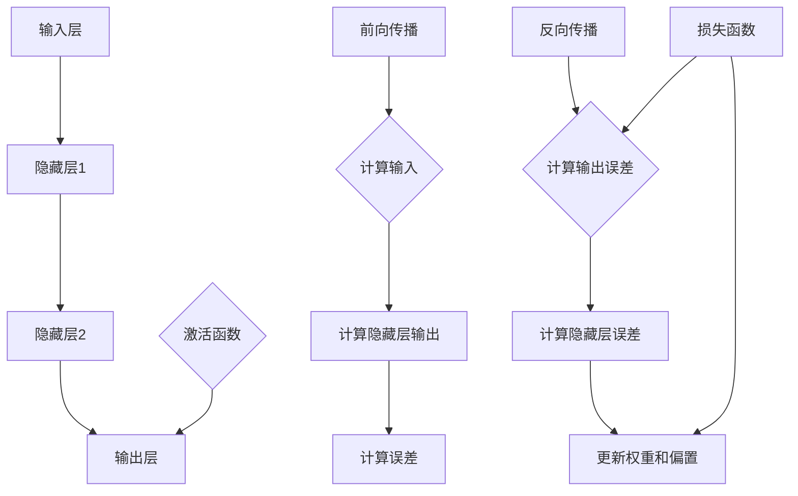

                 

### 文章标题

《神经网络：机器学习的新范式》

关键词：神经网络、机器学习、人工智能、深度学习、激活函数、优化算法、多层感知机、卷积神经网络、循环神经网络、自然语言处理、计算机视觉

摘要：
本文旨在深入探讨神经网络这一机器学习领域的重要技术范式。我们将从神经网络的起源与发展开始，逐步介绍其基础理论、核心算法、以及在计算机视觉和自然语言处理中的应用。通过详细的分析和实例讲解，本文希望帮助读者全面理解神经网络的原理和应用，为从事相关领域的研究和实践提供参考。

## 《神经网络：机器学习的新范式》目录大纲

### 第一部分：神经网络概述

#### 第1章：神经网络的起源与发展

##### 1.1 神经网络的概念与历史

- **神经网络的定义**  
  神经网络是一种模仿生物神经系统的计算模型，通过多层节点之间的连接和相互作用，实现对复杂数据的处理和学习。

- **神经网络的起源与发展**  
  神经网络起源于20世纪40年代，历经数次的兴起和衰落，终于在21世纪迎来了深度学习的时代，成为了机器学习领域的重要技术。

##### 1.2 神经网络的应用领域

- **机器学习与人工智能**  
  神经网络是机器学习的关键技术之一，广泛应用于人工智能的各种场景，如语音识别、图像识别、自然语言处理等。

- **自然语言处理**  
  神经网络在自然语言处理领域取得了显著成果，特别是在语言模型、机器翻译、问答系统等方面。

- **计算机视觉**  
  卷积神经网络（CNN）是计算机视觉领域的重要技术，广泛应用于图像分类、目标检测、图像分割等任务。

##### 1.3 神经网络的核心组成部分

- **输入层**、**隐藏层**和**输出层**  
  神经网络通常由输入层、隐藏层和输出层组成，各层节点之间通过权重和偏置进行连接。

### 第二部分：机器学习基础

#### 第2章：机器学习基础

##### 2.1 机器学习的概念与分类

- **机器学习的定义**  
  机器学习是一种使计算机系统能够从数据中自动学习和改进的技术。

- **机器学习的分类**  
  机器学习主要分为监督学习、无监督学习和强化学习三类。

##### 2.2 数据预处理

- **数据清洗**  
  数据清洗包括处理缺失值、异常值、噪声等，以确保数据质量。

- **特征工程**  
  特征工程包括特征提取、特征选择和特征转换等，以构建有助于模型训练的特征向量。

##### 2.3 模型评估与优化

- **交叉验证**  
  交叉验证是一种评估模型性能的方法，通过将数据集划分为训练集和验证集，多次训练和验证模型。

- **模型选择与调参**  
  模型选择和调参是提高模型性能的重要手段，包括选择合适的模型结构和调整模型参数。

### 第三部分：神经网络基础

#### 第3章：前向传播与反向传播

##### 3.1 前向传播

- **激活函数**  
  激活函数是神经网络中的关键组成部分，用于对输入信号进行非线性变换。

- **前向计算**  
  前向传播是神经网络的一种计算方式，通过将输入信号逐层传递到输出层，最终得到输出结果。

##### 3.2 反向传播

- **反向计算**  
  反向传播是神经网络的一种训练方式，通过计算输出结果与实际结果之间的误差，逆向传播误差到输入层，更新模型参数。

- **梯度计算**  
  梯度计算是反向传播的核心步骤，通过计算损失函数关于模型参数的梯度，指导模型参数的更新。

#### 第4章：激活函数与神经网络优化算法

##### 4.1 激活函数

- **Sigmoid函数**  
  Sigmoid函数是一种常用的激活函数，可以将输入映射到(0,1)区间。

- **ReLU函数**  
  ReLU函数是一种简单而有效的激活函数，可以加速神经网络的训练。

- **Tanh函数**  
  Tanh函数是一种双曲正切函数，可以将输入映射到(-1,1)区间。

##### 4.2 优化算法

- **随机梯度下降（SGD）**  
  随机梯度下降是一种常用的优化算法，通过随机选择样本更新模型参数。

- **Adam优化器**  
  Adam优化器是一种基于SGD的优化算法，结合了 Momentum和RMSprop的优点，具有较好的收敛性。

#### 第5章：多层感知机（MLP）

##### 5.1 MLP的结构与原理

- **输入层、隐藏层和输出层的组织**  
  MLP由输入层、一个或多个隐藏层和输出层组成，各层节点之间通过权重和偏置进行连接。

- **学习算法**  
  MLP通过前向传播和反向传播，不断调整模型参数，以实现从输入到输出的映射。

##### 5.2 MLP的优缺点与应用

- **优缺点分析**  
  MLP作为一种简单的神经网络模型，具有较好的可解释性和适应性。

- **应用场景**  
  MLP广泛应用于回归、分类等任务，尤其在处理线性可分数据时效果显著。

### 第四部分：神经网络在计算机视觉中的应用

#### 第6章：卷积神经网络（CNN）

##### 6.1 卷积神经网络的基本概念

- **卷积操作**  
  卷积操作是CNN的核心组件，通过对输入数据进行卷积操作，提取特征。

- **池化操作**  
  池化操作用于降低数据维度，增强模型泛化能力。

##### 6.2 CNN的典型结构

- **LeNet**  
  LeNet是最早的CNN模型之一，主要用于手写数字识别。

- **AlexNet**  
  AlexNet是深度学习时代的标志性模型，在ImageNet竞赛中取得了显著成绩。

- **VGGNet**  
  VGGNet通过堆叠卷积层和池化层，实现了较高的图像识别精度。

- **ResNet**  
  ResNet通过引入残差连接，解决了深度神经网络中的梯度消失问题。

#### 第7章：CNN在图像分类中的应用

##### 7.1 图像分类的概念与方法

- **一分类问题**  
  一分类问题是指将图像划分为两类。

- **多分类问题**  
  多分类问题是指将图像划分为多个类别。

##### 7.2 CNN在图像分类中的应用案例

- **CIFAR-10分类任务**  
  CIFAR-10是一个常用的图像分类数据集，包含10个类别。

- **ImageNet分类任务**  
  ImageNet是一个大规模的图像分类数据集，包含数百万个图像和1000个类别。

#### 第8章：卷积神经网络在目标检测中的应用

##### 8.1 目标检测的基本概念

- **两种类型的目标检测算法**  
  目标检测算法可分为基于区域提议的方法和基于特征提取的方法。

##### 8.2 常见的目标检测算法

- **R-CNN系列**  
  R-CNN是一种基于区域提议的目标检测算法。

- **YOLO系列**  
  YOLO是一种基于特征提取的目标检测算法。

- **SSD系列**  
  SSD是一种在YOLO基础上改进的目标检测算法。

#### 第9章：神经网络在计算机视觉中的其他应用

##### 9.1 图像分割

- **语义分割**  
  语义分割是指将图像划分为不同类别的区域。

- **实例分割**  
  实例分割是指将图像中的每个实例（如每个物体）进行精确分割。

##### 9.2 人脸识别

- **特征提取**  
  通过特征提取方法，提取人脸图像中的关键特征。

- **相似度计算**  
  通过计算人脸特征之间的相似度，实现人脸识别。

##### 9.3 视频分析

- **行为识别**  
  通过分析视频数据，识别出特定行为。

- **人流量分析**  
  通过分析视频数据，对人流量进行统计和分析。

### 第五部分：神经网络在自然语言处理中的应用

#### 第10章：循环神经网络（RNN）

##### 10.1 RNN的基本概念与原理

- **RNN的机制**  
  RNN通过循环结构，将当前输入与历史输入进行关联，实现序列数据的处理。

- **RNN的局限性**  
  RNN在处理长序列数据时，容易出现梯度消失和梯度爆炸问题。

##### 10.2 LSTM与GRU

- **LSTM**  
  LSTM是一种改进的RNN结构，通过引入门控机制，解决了梯度消失问题。

- **GRU**  
  GRU是一种简化版的LSTM，具有更简单的结构，同时保持了较好的性能。

#### 第11章：神经网络在自然语言处理中的应用

##### 11.1 语言模型

- **N-gram模型**  
  N-gram模型是一种基于统计的语言模型，通过统计相邻词出现的频率来预测下一个词。

- **神经网络语言模型**  
  神经网络语言模型通过神经网络结构，对语言进行建模，实现更准确的预测。

##### 11.2 机器翻译

- **序列到序列学习**  
  序列到序列学习是一种用于机器翻译的技术，通过编码器和解码器结构，将源语言序列映射到目标语言序列。

- **神经机器翻译**  
  神经机器翻译通过神经网络结构，实现更准确、更自然的机器翻译。

##### 11.3 问答系统

- **基于事实的问答**  
  基于事实的问答通过检索事实库，回答用户的问题。

- **基于知识图谱的问答**  
  基于知识图谱的问答通过知识图谱结构，回答用户的问题。

### 第六部分：神经网络的应用实战

#### 第12章：神经网络开发环境搭建

##### 12.1 Python环境配置

- **Anaconda**  
  Anaconda是一种流行的Python环境管理工具，方便安装和管理Python包。

- **PyTorch安装**  
  PyTorch是一种流行的深度学习框架，支持GPU加速。

##### 12.2 GPU加速配置

- **CUDA与cuDNN安装**  
  CUDA和cuDNN是NVIDIA推出的GPU加速库，用于加速深度学习训练。

- **GPU调试技巧**  
  GPU调试技巧包括GPU内存管理、并行计算优化等。

#### 第13章：神经网络项目实战

##### 13.1 数据预处理与特征提取

- **数据收集与清洗**  
  数据收集与清洗是项目实战的重要环节，包括数据获取、数据清洗和预处理。

- **特征工程**  
  特征工程包括特征提取、特征选择和特征转换等，以构建有助于模型训练的特征向量。

##### 13.2 模型设计与训练

- **模型架构选择**  
  模型架构选择包括选择合适的神经网络结构，以适应特定任务的需求。

- **训练策略与调参**  
  训练策略与调参包括选择合适的训练策略和调整模型参数，以优化模型性能。

##### 13.3 模型评估与优化

- **评估指标**  
  评估指标包括准确率、召回率、F1值等，用于衡量模型性能。

- **调优技巧**  
  调优技巧包括超参数调整、数据增强等，以提高模型性能。

### 第七部分：神经网络在工业界的应用案例

#### 第14章：计算机视觉在医疗领域的应用

##### 14.1 疾病诊断

- **图像分析**  
  通过计算机视觉技术，对医学图像进行分析，辅助医生进行疾病诊断。

- **疾病预测**  
  通过分析历史数据和实时数据，预测疾病的发生和发展趋势。

##### 14.2 自然语言处理在金融领域的应用

- **信贷评估**  
  通过自然语言处理技术，对客户信贷资料进行分析，评估其信用风险。

- **投资预测**  
  通过分析金融市场数据，预测投资收益和风险。

##### 14.3 其他应用领域

- **声音识别**  
  通过对声音信号的识别，实现人机交互和智能语音助手。

- **无人驾驶**  
  通过计算机视觉和自然语言处理技术，实现无人驾驶汽车的安全行驶。

### 附录

#### 附录A：神经网络相关资源与工具

- **OpenCV**  
  OpenCV是一种流行的计算机视觉库，提供丰富的图像处理和机器学习算法。

- **TensorFlow**  
  TensorFlow是一种流行的深度学习框架，支持多种神经网络结构和优化算法。

- **PyTorch**  
  PyTorch是一种流行的深度学习框架，具有简洁的接口和高效的性能。

- **Keras**  
  Keras是一种基于TensorFlow和PyTorch的深度学习框架，提供更易于使用的API。

#### 附录B：数学公式与伪代码

- **激活函数公式**  
  激活函数是对输入信号进行非线性变换的函数，常见的激活函数包括Sigmoid、ReLU、Tanh等。

- **梯度计算伪代码**  
  梯度计算是神经网络训练的核心步骤，用于更新模型参数。

#### 附录C：项目代码示例

- **数据预处理代码**  
  数据预处理是项目实战的重要环节，包括数据收集、数据清洗和预处理。

- **训练与评估代码**  
  训练与评估代码包括模型训练、验证和评估等步骤，用于验证模型性能。

以上是《神经网络：机器学习的新范式》这本书的目录大纲。这个大纲包含了神经网络的基础知识、神经网络在计算机视觉和自然语言处理中的应用、神经网络的应用实战以及相关的数学公式和代码示例。通过这个大纲，读者可以系统地学习神经网络的原理和应用。

### 第一部分：神经网络概述

#### 第1章：神经网络的起源与发展

##### 1.1 神经网络的概念与历史

神经网络（Neural Networks）是一种模仿生物神经系统的计算模型，由大量简单的计算单元（神经元）相互连接而成。这些神经元通过加权连接和激活函数来处理输入信息，实现复杂的数据处理和模式识别任务。

**神经网络的定义：**

神经网络是一种通过模拟人脑神经网络结构和功能，实现自动学习和处理信息的计算模型。它由多个层次组成，包括输入层、隐藏层和输出层。每个层次包含多个神经元，神经元之间通过权重进行连接，并通过激活函数进行非线性变换。

**神经网络的起源与发展：**

1. **1940年代：初期探索**

   神经网络的起源可以追溯到1940年代，由美国心理学家沃伦·麦卡洛克（Warren McCulloch）和数学家沃尔特·皮茨（Walter Pitts）提出了一种名为“麦卡洛克-皮茨神经元”的计算模型。这一模型首次将生物神经元的处理机制转化为数学模型。

2. **1950年代：人工神经网络研究兴起**

   在1950年代，神经网络研究得到了广泛关注。1960年，弗兰克·罗森布拉特（Frank Rosenblatt）提出了感知机（Perceptron）模型，这是第一个真正意义上的神经网络模型。感知机通过阈值逻辑函数实现二分类任务，为神经网络的发展奠定了基础。

3. **1960-1980年代：神经网络研究受挫**

   由于感知机模型的局限性，神经网络研究在1960-1980年代遭遇了低谷。尽管感知机模型可以解决简单的线性可分问题，但无法处理非线性问题。此外，随着计算机技术的限制，神经网络的研究进展缓慢。

4. **1980年代：反向传播算法的提出**

   1986年，鲁瑟尔·赫布（Rumelhart, Hinton和Williams）等人提出了反向传播算法（Backpropagation Algorithm），这是一种用于多层神经网络训练的算法。反向传播算法通过反向传播误差，逐层更新模型参数，大大提高了神经网络的训练效率。

5. **1990年代：神经网络的复兴**

   随着计算机性能的不断提高，神经网络研究在1990年代迎来了复兴。多层感知机（MLP）和其他神经网络模型在图像识别、语音识别和自然语言处理等领域取得了显著成果。

6. **21世纪初至今：深度学习的兴起**

   在21世纪初，随着计算能力的提升和大数据的涌现，深度学习（Deep Learning）逐渐成为神经网络研究的主流方向。深度学习通过构建深层的神经网络结构，实现了在图像识别、语音识别、自然语言处理等领域的突破性进展。

**神经网络的应用领域：**

神经网络在众多领域取得了显著成果，以下是其中一些主要应用领域：

1. **机器学习与人工智能**

   神经网络是机器学习的关键技术之一，广泛应用于分类、回归、聚类等任务。在人工智能领域，神经网络被用于实现语音识别、图像识别、自然语言处理等应用。

2. **自然语言处理**

   神经网络在自然语言处理领域取得了巨大成功，特别是在语言模型、机器翻译、问答系统等方面。循环神经网络（RNN）和其变种LSTM、GRU等模型在处理序列数据方面表现出色。

3. **计算机视觉**

   卷积神经网络（CNN）是计算机视觉领域的重要技术，广泛应用于图像分类、目标检测、图像分割等任务。CNN通过卷积操作和池化操作，能够自动提取图像中的特征。

4. **医疗领域**

   神经网络在医疗领域也有广泛的应用，如疾病诊断、医学图像分析、药物研发等。通过训练神经网络模型，可以对医学数据进行分析，辅助医生进行诊断和治疗。

5. **金融领域**

   神经网络在金融领域被用于风险评估、市场预测、投资决策等。通过分析金融数据，神经网络可以预测市场的走势，为投资者提供参考。

**神经网络的核心组成部分：**

神经网络的核心组成部分包括输入层、隐藏层和输出层。每个层次由多个神经元组成，神经元之间通过加权连接和激活函数进行信息传递。

1. **输入层（Input Layer）**

   输入层接收外部输入数据，并将其传递给隐藏层。输入层中的每个神经元代表一个特征或属性。

2. **隐藏层（Hidden Layers）**

   隐藏层位于输入层和输出层之间，负责对输入数据进行加工和处理。隐藏层中的神经元通过加权连接和激活函数，提取输入数据的特征和模式。

3. **输出层（Output Layer）**

   输出层接收隐藏层的输出，并将其转换为最终输出结果。输出层中的神经元代表模型的预测结果或分类结果。

通过这些核心组成部分，神经网络能够对输入数据进行处理和学习，从而实现各种复杂的任务。

总之，神经网络作为一种强大的计算模型，具有广泛的应用领域和强大的学习能力。从其起源到现在的深度学习时代，神经网络不断发展和进步，为人工智能领域带来了许多突破性的成果。

#### 第2章：机器学习基础

##### 2.1 机器学习的概念与分类

机器学习（Machine Learning）是一种使计算机系统能够从数据中自动学习和改进的技术。它通过构建数学模型，从历史数据中提取规律和模式，用于预测和决策。机器学习在许多领域取得了显著成果，包括图像识别、自然语言处理、金融风险评估等。

**机器学习的定义：**

机器学习是一种通过使用算法从数据中学习规律，并将其应用于新的数据上的方法。它涉及数据的收集、处理、建模和评估等步骤，以实现预测、分类、聚类等任务。

**机器学习的分类：**

机器学习主要分为以下三类：

1. **监督学习（Supervised Learning）**

   监督学习是一种在已知输入和输出关系的情况下，通过学习数据中的规律，对新的输入进行预测的方法。监督学习可分为以下两种：

   - **回归（Regression）**：回归任务旨在预测连续值输出。常见的回归算法包括线性回归、决策树回归、随机森林回归等。

   - **分类（Classification）**：分类任务旨在将输入数据划分为不同的类别。常见的分类算法包括逻辑回归、支持向量机、决策树分类、随机森林分类等。

2. **无监督学习（Unsupervised Learning）**

   无监督学习是一种在没有明确输出标签的情况下，通过发现数据中的内在结构和模式的方法。无监督学习可分为以下几种：

   - **聚类（Clustering）**：聚类任务旨在将相似的数据点划分为不同的组。常见的聚类算法包括K-均值聚类、层次聚类、DBSCAN等。

   - **降维（Dimensionality Reduction）**：降维任务旨在减少数据维度，同时保持数据的重要信息。常见的降维算法包括主成分分析（PCA）、t-SNE、自编码器等。

   - **关联规则学习（Association Rule Learning）**：关联规则学习旨在发现数据之间的关联关系。常见的关联规则算法包括Apriori算法、FP-growth算法等。

3. **强化学习（Reinforcement Learning）**

   强化学习是一种通过与环境的交互来学习最优策略的方法。在强化学习中，智能体（Agent）通过观察环境状态、采取行动、获得奖励，不断调整策略以最大化累积奖励。常见的强化学习算法包括Q-学习、SARSA、DQN等。

**数据预处理：**

数据预处理是机器学习过程中至关重要的一步，它包括数据清洗、数据变换、特征选择等。

- **数据清洗**：数据清洗是指处理数据中的缺失值、异常值和噪声等。常见的清洗方法包括填充缺失值、去除异常值、数据标准化等。

- **特征工程**：特征工程是指通过选择和构建有助于模型训练的特征，以提高模型性能。特征工程包括特征提取、特征选择、特征转换等。

**模型评估与优化：**

模型评估与优化是机器学习过程中关键的一步，它包括模型选择、参数调优、交叉验证等。

- **模型选择**：模型选择是指根据数据特点和任务需求，选择合适的模型算法。常见的模型算法包括线性模型、决策树、支持向量机、神经网络等。

- **参数调优**：参数调优是指通过调整模型参数，以提高模型性能。常见的参数调优方法包括网格搜索、贝叶斯优化等。

- **交叉验证**：交叉验证是一种评估模型性能的方法，通过将数据集划分为训练集和验证集，多次训练和验证模型，以避免过拟合和欠拟合。

总之，机器学习是一种通过从数据中学习规律和模式，实现自动预测和决策的技术。通过理解机器学习的概念、分类、数据预处理、模型评估与优化等方面的知识，我们可以更好地应用机器学习技术解决实际问题。

##### 2.2 数据预处理

数据预处理是机器学习过程中至关重要的一步，它直接影响到模型的训练效果和预测性能。数据预处理主要包括数据清洗、数据变换和特征选择等步骤，这些步骤的目的是提高数据质量，减少噪声，提取有用的特征，以便更好地训练模型。

**数据清洗：**

数据清洗是指处理数据中的缺失值、异常值和噪声等。以下是一些常见的数据清洗方法：

1. **缺失值处理：**
   - **填充缺失值**：可以使用平均值、中位数、众数等方法来填充缺失值，例如：
     ```python
     data['age'].fillna(data['age'].mean(), inplace=True)
     ```
   - **删除缺失值**：如果缺失值较多，可以考虑删除包含缺失值的样本，例如：
     ```python
     data.dropna(inplace=True)
     ```

2. **异常值处理：**
   - **去除异常值**：可以通过统计学方法，如Z-Score、IQR（四分位距）等方法，检测并删除异常值，例如：
     ```python
     from scipy import stats
     z_scores = stats.zscore(data['income'])
     abs_z_scores = np.abs(z_scores)
     filtered_entries = (abs_z_scores < 3)
     data = data[filtered_entries]
     ```
   - **变换异常值**：可以通过变换方法，如log变换、立方根变换等，将异常值转换为正常值，例如：
     ```python
     data['income'] = np.log1p(data['income'])
     ```

3. **重复值处理：**
   - **去除重复值**：可以通过删除重复数据行来消除重复值，例如：
     ```python
     data.drop_duplicates(inplace=True)
     ```

**数据变换：**

数据变换是指通过将原始数据转换为适合模型训练的形式。以下是一些常见的数据变换方法：

1. **标准化/归一化：**
   - **标准化**：将数据缩放至相同的范围，如[0,1]，以消除不同特征之间的尺度差异，例如：
     ```python
     from sklearn.preprocessing import StandardScaler
     scaler = StandardScaler()
     data_scaled = scaler.fit_transform(data)
     ```
   - **归一化**：将数据缩放至均值为0，标准差为1的形式，例如：
     ```python
     from sklearn.preprocessing import MinMaxScaler
     scaler = MinMaxScaler()
     data_normalized = scaler.fit_transform(data)
     ```

2. **编码：**
   - **独热编码（One-Hot Encoding）**：将分类特征转换为二进制向量，例如：
     ```python
     data_encoded = pd.get_dummies(data['category_column'])
     ```
   - **标签编码（Label Encoding）**：将分类特征映射为整数，例如：
     ```python
     data['label_encoded'] = data['category_column'].map({0: 0, 1: 1, 2: 2})
     ```

3. **特征缩放：**
   - **主成分分析（PCA）**：通过降维减少数据维度，同时保留主要信息，例如：
     ```python
     from sklearn.decomposition import PCA
     pca = PCA(n_components=2)
     data_pca = pca.fit_transform(data)
     ```

4. **日志变换：**
   - **对数变换**：将数值特征转换为对数形式，以减少异常值的影响，例如：
     ```python
     data['log_income'] = np.log1p(data['income'])
     ```

**特征选择：**

特征选择是指从原始特征中筛选出对模型训练有显著贡献的特征，以提高模型性能和减少过拟合风险。以下是一些常见的特征选择方法：

1. **相关性分析：**
   - **剔除冗余特征**：通过计算特征之间的相关性，剔除高度相关的特征，例如：
     ```python
     corr_matrix = data.corr().abs()
     high_corr_features = corr_matrix[corr_matrix > 0.7].index
     data = data.drop(high_corr_features[high_corr_features != 'target_column'], axis=1)
     ```

2. **特征重要性：**
   - **随机森林特征重要性**：通过随机森林算法计算特征重要性，剔除重要性较低的特征，例如：
     ```python
     from sklearn.ensemble import RandomForestClassifier
     rf = RandomForestClassifier()
     rf.fit(data, target)
     importances = rf.feature_importances_
     data = data.iloc[:, np.argsort(importances)[::-1]]
     ```

3. **递归特征消除（RFE）**：
   - **递归特征消除**：通过逐步剔除重要性较低的特征，构建最佳特征子集，例如：
     ```python
     from sklearn.linear_model import LinearRegression
     from sklearn.feature_selection import RFE
     model = LinearRegression()
     selector = RFE(model, n_features_to_select=5)
     selector = selector.fit(data, target)
     data = data.iloc[:, selector.support_]
     ```

通过以上数据预处理步骤，我们可以显著提高模型训练效果和预测性能。然而，需要注意的是，不同的任务和数据集可能需要不同的预处理方法，因此需要根据具体情况进行调整。

##### 2.3 模型评估与优化

在机器学习过程中，模型评估与优化是至关重要的一环。评估模型性能可以帮助我们判断模型是否过拟合或欠拟合，优化模型则是为了提高模型的预测准确率和泛化能力。以下是模型评估与优化的一些常用方法。

**模型评估方法：**

1. **准确率（Accuracy）**：
   - **定义**：准确率是分类问题中最常用的评估指标，它表示正确分类的样本数占总样本数的比例。
   - **计算公式**：
     $$ \text{Accuracy} = \frac{\text{正确分类的样本数}}{\text{总样本数}} $$
   - **优点**：直观地反映了模型的分类能力。
   - **缺点**：在类别不平衡的数据集上，准确率可能无法准确反映模型的性能。

2. **精确率（Precision）**：
   - **定义**：精确率是针对正类别的评估指标，表示实际为正类别的样本中被正确预测为正类别的比例。
   - **计算公式**：
     $$ \text{Precision} = \frac{\text{真正例数}}{\text{真正例数 + 假正例数}} $$
   - **优点**：关注正类别的预测准确性。
   - **缺点**：对负类别的预测准确性不关心。

3. **召回率（Recall）**：
   - **定义**：召回率是针对正类别的评估指标，表示实际为正类别的样本中被正确预测为正类别的比例。
   - **计算公式**：
     $$ \text{Recall} = \frac{\text{真正例数}}{\text{真正例数 + 假反例数}} $$
   - **优点**：关注正类别的预测完整性。
   - **缺点**：对负类别的预测准确性不关心。

4. **F1值（F1 Score）**：
   - **定义**：F1值是精确率和召回率的调和平均，用于综合考虑分类问题的两种误差。
   - **计算公式**：
     $$ \text{F1 Score} = 2 \times \frac{\text{Precision} \times \text{Recall}}{\text{Precision} + \text{Recall}} $$
   - **优点**：综合考虑了精确率和召回率。
   - **缺点**：在类别极度不平衡的数据集上，F1值可能无法准确反映模型的性能。

5. **ROC曲线与AUC值**：
   - **ROC曲线**：ROC（Receiver Operating Characteristic）曲线用于评估分类器的性能，它反映了不同阈值下精确率和召回率的关系。
   - **AUC值**：AUC（Area Under Curve）值是ROC曲线下方的面积，用于衡量分类器的性能。AUC值越接近1，表示分类器性能越好。

**模型优化方法：**

1. **交叉验证（Cross Validation）**：
   - **定义**：交叉验证是一种评估模型性能的方法，通过将数据集划分为多个子集，轮流将每个子集作为验证集，其余子集作为训练集，训练和验证模型。
   - **优点**：可以避免过拟合和欠拟合，提高模型评估的可靠性。
   - **缺点**：计算成本较高。

2. **网格搜索（Grid Search）**：
   - **定义**：网格搜索是一种参数调优方法，通过遍历给定的参数组合，选择最优的参数组合。
   - **优点**：可以自动搜索最优参数，提高模型性能。
   - **缺点**：计算成本较高，特别是在参数组合较多的情况下。

3. **贝叶斯优化（Bayesian Optimization）**：
   - **定义**：贝叶斯优化是一种基于贝叶斯统计学的参数调优方法，通过构建概率模型，选择最有希望的参数组合进行迭代优化。
   - **优点**：可以自动搜索最优参数，收敛速度快。
   - **缺点**：对计算资源要求较高。

4. **集成学习（Ensemble Learning）**：
   - **定义**：集成学习是一种通过组合多个模型来提高预测准确率和泛化能力的方法。
   - **优点**：可以提高模型性能，降低过拟合风险。
   - **缺点**：需要更多的计算资源。

通过上述模型评估和优化方法，我们可以更好地理解模型性能，并采取相应措施提高模型性能。在实际应用中，需要根据具体任务和数据集的特点选择合适的评估方法和优化策略。

### 第三部分：神经网络基础

#### 第3章：前向传播与反向传播

##### 3.1 前向传播

前向传播（Forward Propagation）是神经网络中用于计算输出值的过程。它从输入层开始，通过逐层传递输入信号，最终得到输出层的输出值。以下是前向传播的详细步骤：

1. **初始化参数：**

   在前向传播之前，需要初始化模型的参数，包括权重（weights）和偏置（biases）。权重和偏置是随机初始化的，并在训练过程中通过反向传播更新。

2. **输入层到隐藏层：**

   将输入数据输入到输入层，并通过权重和偏置计算每个隐藏层节点的输出值。具体步骤如下：
   
   - **计算隐藏层节点的输入值**：
     $$ z^{[l]}_j = \sum_{i} w^{[l]}_{ji} a^{[l-1]}_i + b^{[l]}_j $$
     其中，$z^{[l]}_j$ 表示第 $l$ 层第 $j$ 个节点的输入值，$w^{[l]}_{ji}$ 表示第 $l$ 层第 $j$ 个节点与第 $l-1$ 层第 $i$ 个节点的权重，$a^{[l-1]}_i$ 表示第 $l-1$ 层第 $i$ 个节点的输出值，$b^{[l]}_j$ 表示第 $l$ 层第 $j$ 个节点的偏置。
   
   - **应用激活函数**：
     $$ a^{[l]}_j = \sigma(z^{[l]}_j) $$
     其中，$a^{[l]}_j$ 表示第 $l$ 层第 $j$ 个节点的输出值，$\sigma$ 是激活函数，常用的激活函数有Sigmoid、ReLU和Tanh等。

3. **隐藏层到输出层：**

   将隐藏层的输出值传递到输出层，通过权重和偏置计算输出层的输出值。具体步骤如下：
   
   - **计算输出层节点的输入值**：
     $$ z^{[L]}_j = \sum_{i} w^{[L]}_{ji} a^{[L-1]}_i + b^{[L]}_j $$
     其中，$z^{[L]}_j$ 表示输出层第 $j$ 个节点的输入值，$w^{[L]}_{ji}$ 表示输出层第 $j$ 个节点与隐藏层第 $i$ 个节点的权重，$a^{[L-1]}_i$ 表示隐藏层第 $i$ 个节点的输出值，$b^{[L]}_j$ 表示输出层第 $j$ 个节点的偏置。
   
   - **应用激活函数**：
     $$ a^{[L]}_j = \sigma(z^{[L]}_j) $$
     其中，$a^{[L]}_j$ 表示输出层第 $j$ 个节点的输出值。

4. **计算损失函数：**

   输出层的输出值与真实标签进行比较，计算损失函数的值。常用的损失函数有均方误差（MSE）、交叉熵（Cross Entropy）等。损失函数反映了模型预测值与真实值之间的差异。

##### 3.2 反向传播

反向传播（Backpropagation）是神经网络中用于训练模型的过程。它通过计算损失函数关于模型参数的梯度，并使用梯度下降法更新模型参数，以减少损失函数的值。以下是反向传播的详细步骤：

1. **计算输出层梯度：**

   首先，计算输出层节点的误差梯度。误差梯度表示损失函数关于输出层节点的输出值的导数。具体步骤如下：
   
   - **计算输出层节点关于输入值的梯度**：
     $$ \delta^{[L]}_j = (a^{[L]}_j - y_j) \cdot \sigma'(z^{[L]}_j) $$
     其中，$\delta^{[L]}_j$ 表示输出层第 $j$ 个节点的误差梯度，$a^{[L]}_j$ 表示输出层第 $j$ 个节点的输出值，$y_j$ 表示第 $j$ 个真实标签，$\sigma'(z^{[L]}_j)$ 表示激活函数 $\sigma$ 的导数。

2. **计算隐藏层梯度：**

   接下来，计算隐藏层节点的误差梯度。误差梯度是通过输出层误差梯度逆向传播到隐藏层的。具体步骤如下：
   
   - **计算隐藏层节点关于输入值的梯度**：
     $$ \delta^{[l]}_j = \sum_{i} w^{[l+1]}_{ji} \cdot \delta^{[l+1]}_i \cdot \sigma'(z^{[l]}_j) $$
     其中，$\delta^{[l]}_j$ 表示第 $l$ 层第 $j$ 个节点的误差梯度，$w^{[l+1]}_{ji}$ 表示第 $l+1$ 层第 $j$ 个节点与第 $l$ 层第 $i$ 个节点的权重，$\delta^{[l+1]}_i$ 表示第 $l+1$ 层第 $i$ 个节点的误差梯度，$\sigma'(z^{[l]}_j)$ 表示激活函数 $\sigma$ 的导数。

3. **更新模型参数：**

   使用计算得到的梯度，通过梯度下降法更新模型参数。具体步骤如下：
   
   - **更新权重**：
     $$ w^{[l]}_{ji} = w^{[l]}_{ji} - \alpha \cdot \delta^{[l]}_j \cdot a^{[l-1]}_i $$
     其中，$w^{[l]}_{ji}$ 表示第 $l$ 层第 $j$ 个节点与第 $l-1$ 层第 $i$ 个节点的权重，$\alpha$ 表示学习率，$\delta^{[l]}_j$ 表示第 $l$ 层第 $j$ 个节点的误差梯度，$a^{[l-1]}_i$ 表示第 $l-1$ 层第 $i$ 个节点的输出值。
   
   - **更新偏置**：
     $$ b^{[l]}_j = b^{[l]}_j - \alpha \cdot \delta^{[l]}_j $$
     其中，$b^{[l]}_j$ 表示第 $l$ 层第 $j$ 个节点的偏置，$\alpha$ 表示学习率，$\delta^{[l]}_j$ 表示第 $l$ 层第 $j$ 个节点的误差梯度。

通过以上步骤，神经网络通过反向传播计算误差梯度，并更新模型参数，以实现模型的训练。反向传播算法是神经网络训练的核心步骤，它使得神经网络能够不断优化模型，提高预测准确性。

#### 第4章：激活函数与神经网络优化算法

##### 4.1 激活函数

激活函数（Activation Function）是神经网络中的关键组成部分，它对神经元的输出进行非线性变换。激活函数的作用是引入非线性特性，使得神经网络能够拟合复杂的函数关系。以下是一些常用的激活函数：

1. **Sigmoid函数**

   Sigmoid函数是一种常用的激活函数，它将输入映射到(0,1)区间，具有S形曲线。其公式如下：

   $$ \sigma(x) = \frac{1}{1 + e^{-x}} $$

   Sigmoid函数的导数公式为：

   $$ \sigma'(x) = \sigma(x) \cdot (1 - \sigma(x)) $$

   Sigmoid函数的优点是输出范围在(0,1)之间，适合用于二分类问题。缺点是梯度在接近0和1时较平缓，可能导致梯度消失问题。

2. **ReLU函数**

  ReLU函数（Rectified Linear Unit）是一种简单而有效的激活函数，它将输入大于0的值映射为自身，小于等于0的值映射为0。其公式如下：

   $$ \sigma(x) = \max(0, x) $$

   ReLU函数的导数公式为：

   $$ \sigma'(x) = \begin{cases} 
   1, & \text{if } x > 0 \\
   0, & \text{if } x \leq 0 
   \end{cases} $$

   ReLU函数的优点是计算简单，梯度恒为1或0，避免了梯度消失问题。缺点是可能存在梯度消失问题，即输入值接近0时，梯度为0，导致训练不稳定。

3. **Tanh函数**

   Tanh函数（Hyperbolic Tangent）是一种双曲正切函数，它将输入映射到(-1,1)区间。其公式如下：

   $$ \sigma(x) = \frac{e^x - e^{-x}}{e^x + e^{-x}} $$

   Tanh函数的导数公式为：

   $$ \sigma'(x) = 1 - \sigma^2(x) $$

   Tanh函数的优点是输出范围在(-1,1)之间，有利于梯度传播。缺点是计算复杂度较高，梯度在接近-1和1时较平缓。

##### 4.2 优化算法

优化算法（Optimization Algorithm）用于调整神经网络的参数，以减少损失函数的值。以下是一些常用的优化算法：

1. **随机梯度下降（SGD）**

   随机梯度下降（Stochastic Gradient Descent，SGD）是最常用的优化算法之一。它通过随机选择一部分样本（通常是单样本）计算梯度，并更新模型参数。其更新公式如下：

   $$ \theta_j := \theta_j - \alpha \cdot \nabla_{\theta_j} J(\theta) $$

   其中，$\theta_j$ 表示模型参数，$\alpha$ 表示学习率，$J(\theta)$ 表示损失函数。

   SGD的优点是计算简单，能够快速找到局部最小值。缺点是可能陷入局部最小值，且训练过程较不稳定。

2. **Adam优化器**

   Adam优化器（Adaptive Moment Estimation）是一种基于SGD的优化算法，它通过自适应调整学习率来优化模型。Adam优化器利用一阶矩估计（均值）和二阶矩估计（方差）来更新模型参数。其更新公式如下：

   $$ m_t = \beta_1 m_{t-1} + (1 - \beta_1) \nabla_{\theta_t} J(\theta_t) $$
   $$ v_t = \beta_2 v_{t-1} + (1 - \beta_2) \nabla^2_{\theta_t} J(\theta_t) $$
   $$ \theta_t = \theta_{t-1} - \alpha \cdot \frac{m_t}{\sqrt{v_t} + \epsilon} $$

   其中，$m_t$ 和 $v_t$ 分别表示一阶矩估计和二阶矩估计，$\beta_1$ 和 $\beta_2$ 分别表示一阶矩和二阶矩的指数衰减率，$\alpha$ 表示学习率，$\epsilon$ 是一个很小的常数。

   Adam优化器的优点是计算简单，适用于不同类型的数据集，且收敛速度较快。缺点是对于稀疏数据，可能需要较长的训练时间。

通过选择合适的激活函数和优化算法，我们可以提高神经网络的性能和训练效率。在实际应用中，需要根据具体任务和数据集的特点进行选择。

#### 第5章：多层感知机（MLP）

##### 5.1 MLP的结构与原理

多层感知机（Multilayer Perceptron，MLP）是一种前馈神经网络，由输入层、一个或多个隐藏层和输出层组成。MLP的基本原理是通过输入层接收外部输入数据，通过隐藏层进行加工处理，最终在输出层产生输出结果。以下是MLP的结构和原理：

1. **输入层（Input Layer）**

   输入层接收外部输入数据，并将其传递给隐藏层。每个输入层节点代表一个特征或属性。输入层的节点数取决于数据的维度。

2. **隐藏层（Hidden Layers）**

   隐藏层位于输入层和输出层之间，负责对输入数据进行加工和处理。隐藏层中的每个节点通过加权连接和激活函数进行处理，提取输入数据中的特征和模式。MLP可以有一个或多个隐藏层，隐藏层的节点数和层数可以根据具体任务进行调整。

3. **输出层（Output Layer）**

   输出层接收隐藏层的输出，并产生最终的输出结果。输出层的节点数取决于任务的需求，如二分类问题有两个节点，多分类问题有多个节点。

**MLP的工作原理：**

1. **前向传播（Forward Propagation）**

   在MLP中，输入数据从输入层进入，通过加权连接传递到隐藏层，再从隐藏层传递到输出层。在每个层次上，输入值通过加权求和得到中间值，然后通过激活函数进行非线性变换，得到输出值。前向传播过程可以表示为：

   $$ z^{[l]}_j = \sum_{i} w^{[l]}_{ji} a^{[l-1]}_i + b^{[l]}_j $$
   $$ a^{[l]}_j = \sigma(z^{[l]}_j) $$

   其中，$z^{[l]}_j$ 表示第 $l$ 层第 $j$ 个节点的输入值，$w^{[l]}_{ji}$ 表示第 $l$ 层第 $j$ 个节点与第 $l-1$ 层第 $i$ 个节点的权重，$a^{[l-1]}_i$ 表示第 $l-1$ 层第 $i$ 个节点的输出值，$b^{[l]}_j$ 表示第 $l$ 层第 $j$ 个节点的偏置，$\sigma$ 是激活函数。

2. **反向传播（Back Propagation）**

   在MLP中，反向传播用于计算损失函数关于模型参数的梯度，并更新模型参数以减少损失函数的值。反向传播分为以下几个步骤：

   - **计算输出层梯度**：计算输出层节点的误差梯度，误差梯度表示损失函数关于输出层节点的输出值的导数。
   - **计算隐藏层梯度**：通过输出层误差梯度逆向传播到隐藏层，计算隐藏层节点的误差梯度。
   - **更新模型参数**：使用计算得到的梯度，通过梯度下降法更新模型参数，包括权重和偏置。

**MLP的优缺点：**

- **优点：**
  - MLP具有较好的可解释性和适应性。通过调整隐藏层的节点数和层数，MLP可以处理不同类型和复杂度的任务。
  - MLP在回归和分类问题中表现出色，能够准确拟合复杂的函数关系。
  - MLP的训练过程相对简单，易于实现。

- **缺点：**
  - MLP容易出现过拟合问题，尤其在数据量较小或特征较多的情况下。
  - MLP的训练时间较长，特别是在大量数据和深层次网络结构时。

**MLP的应用场景：**

MLP广泛应用于各种机器学习和人工智能任务，以下是一些常见的应用场景：

- **回归问题**：MLP可以用于回归问题，如预测股票价格、房屋价格等。
- **分类问题**：MLP可以用于分类问题，如手写数字识别、图像分类等。
- **特征提取**：MLP可以作为特征提取器，用于提取数据中的特征和模式。
- **时间序列预测**：MLP可以用于时间序列预测，如天气预测、股票价格预测等。

通过以上对MLP结构的介绍，我们可以了解到MLP的基本原理和应用。在实际应用中，根据具体任务和数据集的特点，我们可以调整MLP的结构和参数，以实现更好的性能和预测效果。

##### 5.2 MLP的优缺点与应用

多层感知机（MLP）作为一种简单的神经网络模型，在机器学习领域具有广泛的应用。以下将详细探讨MLP的优缺点及其在不同任务中的应用场景。

**优点：**

1. **强大的拟合能力**：MLP通过多层节点和激活函数的组合，可以学习到复杂的非线性关系，从而提高模型的拟合能力。这使得MLP在处理复杂任务时表现出色。

2. **灵活性**：MLP的结构可以灵活调整，包括隐藏层的数量、每层的节点数等。这使得MLP能够适应不同的数据集和任务需求。

3. **可解释性**：与深度学习模型相比，MLP的结构相对简单，更容易理解和解释。这对于需要模型解释性的应用场景非常有用。

4. **易于实现**：MLP的实现相对简单，不需要复杂的框架或库。这使得MLP在资源有限的环境中也能够有效训练和应用。

**缺点：**

1. **过拟合问题**：MLP在训练过程中容易过拟合，特别是在数据量较小或特征较多的情况下。这会导致模型在训练集上表现良好，但在测试集上表现不佳。

2. **计算成本高**：MLP的训练时间较长，特别是在大量数据和深层次网络结构时。这增加了训练成本，限制了应用场景。

3. **对参数敏感**：MLP的参数选择对模型的性能有较大影响，如学习率、隐藏层节点数等。如果参数设置不当，可能导致模型性能不佳。

**应用场景：**

1. **回归问题**：MLP可以用于回归问题，如预测股票价格、房屋价格等。通过调整网络结构和参数，MLP可以拟合复杂的非线性关系。

2. **分类问题**：MLP可以用于分类问题，如手写数字识别、图像分类等。MLP能够处理多分类问题，并具有较高的准确率。

3. **特征提取**：MLP可以作为特征提取器，用于提取数据中的特征和模式。在数据量较大或特征复杂时，MLP能够提取有用的信息，为其他模型提供输入。

4. **时间序列预测**：MLP可以用于时间序列预测，如天气预测、股票价格预测等。通过将时间序列数据输入MLP，可以学习到时间序列的内在规律，从而进行预测。

**案例分析：**

以下是一个简单的MLP应用案例，用于手写数字识别。

1. **数据准备**：首先，我们需要准备手写数字数据集，如MNIST数据集。数据集包含60,000个训练样本和10,000个测试样本。

2. **构建MLP模型**：创建一个MLP模型，包括输入层、一个隐藏层和一个输出层。输入层包含784个节点，对应于图像的784个像素值。隐藏层可以包含100个节点，输出层包含10个节点，对应于数字0-9。

3. **训练模型**：使用训练数据训练MLP模型，通过前向传播和反向传播计算损失函数的梯度，并更新模型参数。可以使用随机梯度下降（SGD）或其他优化算法进行训练。

4. **评估模型**：使用测试数据评估模型性能，计算准确率、召回率等指标。通过调整模型参数和隐藏层节点数，可以优化模型性能。

5. **应用模型**：将训练好的模型应用于新的手写数字图像，进行数字识别。

通过以上案例分析，我们可以看到MLP在图像识别任务中的简单实现和应用。在实际应用中，根据任务和数据集的特点，我们可以调整MLP的结构和参数，以实现更好的性能和预测效果。

总之，MLP作为一种简单的神经网络模型，具有强大的拟合能力和灵活性。在实际应用中，我们可以根据任务需求和数据集特点，选择合适的MLP结构和参数，以提高模型性能和预测准确性。

### 第四部分：神经网络在计算机视觉中的应用

#### 第6章：卷积神经网络（CNN）

##### 6.1 卷积神经网络的基本概念

卷积神经网络（Convolutional Neural Networks，CNN）是一种在计算机视觉领域广泛应用的神经网络模型。它通过卷积操作和池化操作，能够自动提取图像中的特征，实现图像分类、目标检测、图像分割等任务。以下是CNN的基本概念：

**卷积操作：**

卷积操作是CNN的核心组件，它通过对输入图像和卷积核进行卷积运算，提取图像中的特征。卷积操作的数学表达式如下：

$$
o_{ij} = \sum_{k} w_{ik} \cdot i_{kj} + b_j
$$

其中，$o_{ij}$ 表示输出特征图上第 $i$ 行第 $j$ 列的元素，$w_{ik}$ 表示卷积核上第 $k$ 行第 $i$ 列的元素，$i_{kj}$ 表示输入图像上第 $k$ 行第 $j$ 列的元素，$b_j$ 表示卷积核上第 $j$ 列的偏置。

卷积操作具有局部连接性和平移不变性，这意味着卷积操作只关注局部区域，并且对图像的平移具有一定的鲁棒性。

**池化操作：**

池化操作是一种降维操作，通过在局部区域内选取最大值或平均值，降低特征图的维度。常见的池化操作有最大池化和平均池化。

最大池化（Max Pooling）的数学表达式如下：

$$
p_{ij} = \max_{k,l} i_{kl}
$$

其中，$p_{ij}$ 表示输出特征图上第 $i$ 行第 $j$ 列的元素，$i_{kl}$ 表示输入特征图上第 $k$ 行第 $l$ 列的元素。

平均池化（Average Pooling）的数学表达式如下：

$$
p_{ij} = \frac{1}{C} \sum_{k,l} i_{kl}
$$

其中，$p_{ij}$ 表示输出特征图上第 $i$ 行第 $j$ 列的元素，$i_{kl}$ 表示输入特征图上第 $k$ 行第 $l$ 列的元素，$C$ 表示输入特征图的通道数。

池化操作有助于减少特征图的维度，提高模型的计算效率，并且增强模型的泛化能力。

**CNN的结构与原理：**

CNN的结构通常包括输入层、卷积层、池化层和全连接层。

1. **输入层（Input Layer）：**

输入层接收外部输入图像，将其传递给卷积层。输入图像通常是一个三维数组，表示为 $[height, width, channels]$。

2. **卷积层（Convolutional Layer）：**

卷积层通过卷积操作提取图像中的特征。每个卷积层包含多个卷积核，每个卷积核可以提取不同类型的特征。卷积层通过逐层叠加，可以提取到更高层次的特征。

3. **池化层（Pooling Layer）：**

池化层对卷积层输出的特征图进行降维处理。常见的池化层有最大池化和平均池化。池化层可以降低模型的计算复杂度，并增强模型的泛化能力。

4. **全连接层（Fully Connected Layer）：**

全连接层将卷积层和池化层输出的特征图进行拼接，并将其转换为向量形式。全连接层通过前向传播和反向传播，对特征向量进行分类或回归操作。

**CNN的典型结构：**

以下是一些典型的CNN结构，用于图像分类、目标检测和图像分割等任务：

1. **LeNet：**

LeNet是最早的CNN模型之一，由LeCun等人于1990年提出。它由两个卷积层、两个池化层和一个全连接层组成。LeNet主要应用于手写数字识别。

2. **AlexNet：**

AlexNet是深度学习时代的标志性模型，由Hinton等人于2012年提出。它由五个卷积层、三个池化层和三个全连接层组成。AlexNet在ImageNet竞赛中取得了显著成绩，推动了深度学习的发展。

3. **VGGNet：**

VGGNet是由Visual Geometry Group提出的一系列CNN模型，以其简洁和高效的卷积层堆叠结构而闻名。VGGNet包括多个卷积层和池化层，通过重复使用相同尺寸的卷积核，提高了模型的稳健性。

4. **ResNet：**

ResNet是由He等人于2015年提出的CNN模型，它通过引入残差连接解决了深度神经网络中的梯度消失问题。ResNet包括多个卷积层和池化层，通过堆叠残差块，实现了深层次的特征提取。

5. **Inception：**

Inception是由Google提出的一种高效的CNN结构，它通过使用不同尺寸的卷积核和池化层，提取多种特征，然后进行拼接和全连接层。Inception模型在图像分类和目标检测任务中取得了很好的效果。

通过以上对CNN基本概念和结构的介绍，我们可以了解到CNN在计算机视觉领域的强大应用。在实际应用中，根据具体任务和数据集的特点，可以选择合适的CNN结构，以实现更高的性能和预测效果。

##### 6.2 CNN在图像分类中的应用

卷积神经网络（CNN）在图像分类任务中具有广泛的应用。通过自动提取图像特征，CNN能够实现对大量图像的准确分类。以下将介绍CNN在图像分类中的应用，包括基本概念、典型结构和实际应用案例。

**基本概念：**

1. **卷积层（Convolutional Layer）：**

卷积层是CNN的核心组件，用于提取图像特征。卷积层通过卷积操作，将输入图像与卷积核进行卷积，生成特征图。卷积核的权重和偏置在训练过程中通过反向传播进行更新。

2. **激活函数（Activation Function）：**

激活函数用于引入非线性特性，使神经网络能够拟合复杂的非线性关系。常见的激活函数有Sigmoid、ReLU和Tanh等。

3. **池化层（Pooling Layer）：**

池化层用于降低特征图的维度，减少参数数量，提高模型的计算效率。常见的池化层有最大池化和平均池化。

4. **全连接层（Fully Connected Layer）：**

全连接层将卷积层和池化层输出的特征图进行拼接，并转换为向量形式。全连接层通过前向传播和反向传播，对特征向量进行分类或回归操作。

**典型结构：**

1. **LeNet：**

LeNet是最早的CNN模型之一，由LeCun等人于1990年提出。它由两个卷积层、两个池化层和一个全连接层组成，主要用于手写数字识别。

2. **AlexNet：**

AlexNet是深度学习时代的标志性模型，由Hinton等人于2012年提出。它由五个卷积层、三个池化层和三个全连接层组成。AlexNet在ImageNet竞赛中取得了显著成绩，推动了深度学习的发展。

3. **VGGNet：**

VGGNet是由Visual Geometry Group提出的一系列CNN模型，以其简洁和高效的卷积层堆叠结构而闻名。VGGNet包括多个卷积层和池化层，通过重复使用相同尺寸的卷积核，提高了模型的稳健性。

4. **ResNet：**

ResNet是由He等人于2015年提出的CNN模型，它通过引入残差连接解决了深度神经网络中的梯度消失问题。ResNet包括多个卷积层和池化层，通过堆叠残差块，实现了深层次的特征提取。

5. **Inception：**

Inception是由Google提出的一种高效的CNN结构，它通过使用不同尺寸的卷积核和池化层，提取多种特征，然后进行拼接和全连接层。Inception模型在图像分类和目标检测任务中取得了很好的效果。

**实际应用案例：**

1. **CIFAR-10分类任务：**

CIFAR-10是一个常用的图像分类数据集，包含10个类别，每个类别有6000张图像。通过训练一个CNN模型，可以实现对CIFAR-10数据集的图像分类。以下是一个简单的CIFAR-10分类任务的实现步骤：

   - **数据预处理：**将图像进行归一化处理，将像素值缩放到[0,1]区间。
   - **模型构建：**构建一个简单的CNN模型，包括两个卷积层、两个池化层和一个全连接层。
   - **模型训练：**使用训练数据训练模型，通过反向传播更新模型参数。
   - **模型评估：**使用测试数据评估模型性能，计算准确率。

2. **ImageNet分类任务：**

ImageNet是一个大规模的图像分类数据集，包含1000个类别，每个类别有数千张图像。通过训练一个强大的CNN模型，可以实现对ImageNet数据集的图像分类。以下是一个简单的ImageNet分类任务的实现步骤：

   - **数据预处理：**将图像进行缩放和裁剪，使其具有统一的大小。
   - **模型构建：**构建一个强大的CNN模型，如ResNet或Inception模型。
   - **模型训练：**使用训练数据训练模型，通过反向传播更新模型参数。
   - **模型评估：**使用测试数据评估模型性能，计算准确率。

通过以上实际应用案例，我们可以看到CNN在图像分类任务中的应用和效果。在实际应用中，根据具体任务和数据集的特点，可以选择合适的CNN结构和参数，以实现更高的分类准确率。

### 第7章：卷积神经网络在目标检测中的应用

##### 8.1 目标检测的基本概念

目标检测（Object Detection）是一种计算机视觉任务，旨在确定图像中存在的多个目标的位置和类别。目标检测广泛应用于自动驾驶、智能监控、医疗影像分析等领域。以下为目标检测的基本概念：

**目标检测的两种类型：**

1. **基于区域提议的方法（Region Proposal）：**

   基于区域提议的方法首先生成多个可能的区域，然后对每个区域进行分类和定位。常见的区域提议算法包括选择性搜索（Selective Search）、滑动窗口（Sliding Window）等。

2. **基于特征提取的方法（Feature Extraction）：**

   基于特征提取的方法直接从图像中提取特征，然后使用分类器对特征进行分类和定位。常见的特征提取方法包括卷积神经网络（CNN）。

**目标检测算法：**

1. **R-CNN系列（Region-based CNN）：**

   R-CNN是一种基于区域提议的目标检测算法，包括以下步骤：

   - **区域提议：**使用选择性搜索算法生成多个区域。
   - **特征提取：**使用CNN提取每个区域的特征向量。
   - **分类：**使用分类器（如SVM）对特征向量进行分类。
   - **定位：**根据分类结果对目标进行定位。

2. **Fast R-CNN（Fast Region-based CNN）：**

   Fast R-CNN是对R-CNN的改进，通过引入Region of Interest（ROI） Pooling，提高了检测速度。Fast R-CNN包括以下步骤：

   - **区域提议：**使用选择性搜索算法生成多个区域。
   - **特征提取：**使用CNN提取每个区域的特征向量。
   - **ROI Pooling：**将特征向量映射到固定大小。
   - **分类：**使用全连接层对特征向量进行分类。

3. **Faster R-CNN（Faster Region-based CNN）：**

   Faster R-CNN引入了区域提议网络（Region Proposal Network，RPN），进一步提高了检测速度。Faster R-CNN包括以下步骤：

   - **特征提取：**使用CNN提取图像的特征图。
   - **RPN：**在特征图上生成区域提议。
   - **分类与定位：**对RPN生成的区域进行分类和定位。

4. **YOLO（You Only Look Once）：**

   YOLO是一种基于特征提取的实时目标检测算法，通过将检测任务转化为单次前向传播，实现了高效的检测速度。YOLO包括以下步骤：

   - **特征提取：**使用CNN提取图像的特征图。
   - **预测框生成：**在特征图上生成多个预测框。
   - **分类与置信度计算：**对预测框进行分类和置信度计算。

5. **SSD（Single Shot MultiBox Detector）：**

   SSD是一种基于特征提取的实时目标检测算法，通过在不同的特征层上预测目标框和类别，实现了多尺度检测。SSD包括以下步骤：

   - **特征提取：**使用CNN提取图像的特征图。
   - **预测框生成：**在特征图上生成多个预测框。
   - **分类与置信度计算：**对预测框进行分类和置信度计算。

**目标检测算法的性能评估：**

目标检测算法的性能通常通过以下几个指标进行评估：

1. **准确率（Accuracy）：**
   - **定义**：准确率是正确检测到的目标数与总目标数之比。
   - **计算公式**：
     $$ \text{Accuracy} = \frac{\text{正确检测到的目标数}}{\text{总目标数}} $$

2. **召回率（Recall）：**
   - **定义**：召回率是正确检测到的目标数与实际目标数之比。
   - **计算公式**：
     $$ \text{Recall} = \frac{\text{正确检测到的目标数}}{\text{实际目标数}} $$

3. **F1值（F1 Score）：**
   - **定义**：F1值是精确率和召回率的调和平均。
   - **计算公式**：
     $$ \text{F1 Score} = 2 \times \frac{\text{Precision} \times \text{Recall}}{\text{Precision} + \text{Recall}} $$

4. **平均精度（Average Precision，AP）：**
   - **定义**：平均精度是所有类别上的精确率和召回率曲线下面积的平均值。
   - **计算公式**：
     $$ \text{AP} = \frac{1}{K} \sum_{i=1}^{K} \text{Precision}_{i} \times \text{Recall}_{i} $$

通过以上指标，可以综合评估目标检测算法的性能。在实际应用中，根据任务需求和场景特点，可以选择合适的算法和指标。

##### 8.2 常见的目标检测算法

目标检测是计算机视觉领域的一个重要研究方向，近年来随着深度学习技术的快速发展，涌现了许多优秀的目标检测算法。以下将介绍几种常见的目标检测算法，包括R-CNN系列、YOLO系列和SSD系列。

1. **R-CNN系列**

R-CNN系列是早期流行的目标检测算法，包括R-CNN、Fast R-CNN和Faster R-CNN。以下分别介绍这些算法：

- **R-CNN（Regions with CNN features）：**

  R-CNN是最早提出的基于深度学习的目标检测算法，包括以下步骤：

  - **区域提议：**使用选择性搜索算法生成多个区域提议。
  - **特征提取：**使用卷积神经网络提取每个区域提议的特征向量。
  - **分类：**使用支持向量机（SVM）对特征向量进行分类。
  - **定位：**根据分类结果对目标进行定位。

  R-CNN的准确率较高，但计算复杂度较高，检测速度较慢。

- **Fast R-CNN（Fast Regions with CNN features）：**

  Fast R-CNN是R-CNN的改进版本，通过引入Region of Interest（ROI） Pooling提高了检测速度。Fast R-CNN包括以下步骤：

  - **区域提议：**使用选择性搜索算法生成多个区域提议。
  - **特征提取：**使用卷积神经网络提取每个区域提议的特征向量。
  - **ROI Pooling：**将特征向量映射到固定大小。
  - **分类：**使用全连接层对特征向量进行分类。

  Fast R-CNN在保持高准确率的同时，显著提高了检测速度。

- **Faster R-CNN（Faster Regions with CNN features）：**

  Faster R-CNN是R-CNN系列的进一步改进，通过引入区域提议网络（Region Proposal Network，RPN）实现了更高效的检测速度。Faster R-CNN包括以下步骤：

  - **特征提取：**使用卷积神经网络提取图像的特征图。
  - **RPN：**在特征图上生成区域提议。
  - **分类与定位：**对RPN生成的区域进行分类和定位。

  Faster R-CNN在准确率和速度方面取得了很好的平衡，成为当时主流的目标检测算法。

2. **YOLO系列**

YOLO（You Only Look Once）系列是实时目标检测算法，具有高效的检测速度。以下分别介绍YOLO的不同版本：

- **YOLOv1（You Only Look Once version 1）：**

  YOLOv1将目标检测任务转化为单次前向传播，通过预测边界框和类别概率，实现了高效的检测速度。YOLOv1包括以下步骤：

  - **特征提取：**使用卷积神经网络提取图像的特征图。
  - **预测框生成：**在特征图上生成多个预测框。
  - **分类与置信度计算：**对预测框进行分类和置信度计算。

  YOLOv1在实时目标检测方面表现出色，但准确率相对较低。

- **YOLOv2（You Only Look Once version 2）：**

  YOLOv2通过引入多个特征层和锚框（Anchor Box）机制，提高了检测准确率。YOLOv2包括以下步骤：

  - **特征提取：**使用卷积神经网络提取多个特征层。
  - **预测框生成：**在特征层上生成多个预测框。
  - **分类与置信度计算：**对预测框进行分类和置信度计算。

  YOLOv2在准确率和速度方面取得了较好的平衡，成为当时最受欢迎的实时目标检测算法。

- **YOLOv3（You Only Look Once version 3）：**

  YOLOv3通过引入Darknet-53特征提取网络和路径聚合网络（Path Aggregation Network，PANet），进一步提高了检测准确率。YOLOv3包括以下步骤：

  - **特征提取：**使用Darknet-53特征提取网络。
  - **预测框生成：**在特征图上生成多个预测框。
  - **分类与置信度计算：**对预测框进行分类和置信度计算。

  YOLOv3在实时目标检测方面取得了很高的准确率和速度，成为当前主流的目标检测算法之一。

3. **SSD系列**

SSD（Single Shot MultiBox Detector）系列是另一种高效的实时目标检测算法，通过在不同的特征层上预测目标框和类别，实现了多尺度检测。以下分别介绍SSD的不同版本：

- **SSD（Single Shot MultiBox Detector）：**

  SSD通过使用不同的特征层，同时预测目标框和类别，实现了多尺度检测。SSD包括以下步骤：

  - **特征提取：**使用卷积神经网络提取多个特征层。
  - **预测框生成：**在特征层上生成多个预测框。
  - **分类与置信度计算：**对预测框进行分类和置信度计算。

  SSD在保持高准确率的同时，实现了高效的检测速度。

- **SSD v2：**

  SSD v2通过引入多尺度的特征层，进一步提高了检测准确率。SSD v2包括以下步骤：

  - **特征提取：**使用卷积神经网络提取多个特征层。
  - **预测框生成：**在特征层上生成多个预测框。
  - **分类与置信度计算：**对预测框进行分类和置信度计算。

  SSD v2在准确率和速度方面取得了较好的平衡。

- **SSD v3：**

  SSD v3通过引入Darknet-53特征提取网络和路径聚合网络（PANet），进一步提高了检测准确率。SSD v3包括以下步骤：

  - **特征提取：**使用Darknet-53特征提取网络。
  - **预测框生成：**在特征图上生成多个预测框。
  - **分类与置信度计算：**对预测框进行分类和置信度计算。

  SSD v3在保持高效检测速度的同时，取得了很高的准确率。

通过以上介绍，我们可以了解到几种常见的目标检测算法的特点和应用场景。在实际应用中，根据任务需求和场景特点，可以选择合适的算法和模型，以实现高效的检测效果。

#### 第8章：卷积神经网络在图像分割中的应用

##### 8.1 图像分割的基本概念

图像分割（Image Segmentation）是计算机视觉领域的一个重要任务，旨在将图像划分为多个区域或对象。图像分割广泛应用于目标检测、图像识别、医疗影像分析等领域。以下将介绍图像分割的基本概念：

**语义分割（Semantic Segmentation）：**

语义分割是一种图像分割任务，旨在为图像中的每个像素分配一个标签，表示该像素属于哪个对象或区域。语义分割的目标是获取图像的完整语义信息，例如将一个图像分割成不同的对象、车辆、行人等。

**实例分割（Instance Segmentation）：**

实例分割是一种更精细的图像分割任务，不仅将图像划分为不同的对象，还为每个对象分配唯一的标识。实例分割的目标是识别图像中的每个对象实例，例如区分不同的人或车辆。

**图像分割算法：**

1. **基于边缘检测的分割算法：**

   基于边缘检测的分割算法通过检测图像中的边缘，将图像分割为不同的区域。常见的边缘检测算法包括Canny边缘检测、Sobel边缘检测等。

2. **基于区域生长的分割算法：**

   基于区域生长的分割算法从种子点开始，逐步扩展到相邻像素，直到满足特定条件。常见的区域生长算法包括区域标记、距离变换等。

3. **基于模型的方法：**

   基于模型的方法使用机器学习或深度学习模型，通过训练模型从图像中学习分割规则。常见的基于模型的方法包括决策树、支持向量机、卷积神经网络等。

4. **深度学习方法：**

   深度学习方法通过卷积神经网络等深度学习模型，直接从图像中学习分割规则。常见的深度学习方法包括全卷积网络（FCN）、U-Net、Mask R-CNN等。

**图像分割的性能评估：**

图像分割的性能通常通过以下几个指标进行评估：

1. ** Intersection over Union（IoU）：**

   IoU（交并比）是评估图像分割准确性的常用指标，表示预测区域与真实区域的交集与并集的比值。

   $$ \text{IoU} = \frac{\text{预测区域与真实区域的交集}}{\text{预测区域与真实区域的并集}} $$

2. **平均精度（mAP）：**

   mAP（平均精度）是评估多类别图像分割性能的指标，表示在所有类别上，精确率和召回率的调和平均。

   $$ \text{mAP} = \frac{1}{K} \sum_{i=1}^{K} \text{Precision}_{i} \times \text{Recall}_{i} $$

3. **F1值：**

   F1值是评估图像分割性能的另一个指标，表示精确率和召回率的调和平均。

   $$ \text{F1 Score} = 2 \times \frac{\text{Precision} \times \text{Recall}}{\text{Precision} + \text{Recall}} $$

通过以上指标，可以综合评估图像分割算法的性能。在实际应用中，根据任务需求和场景特点，可以选择合适的图像分割算法和评估指标。

##### 8.2 图像分割的应用案例

图像分割技术在多个领域具有广泛的应用，以下介绍几个典型的应用案例。

**医疗影像分割：**

医疗影像分割在医学诊断和辅助治疗中具有重要意义。通过分割医疗影像中的病变区域，医生可以更准确地诊断疾病并制定治疗方案。以下是一个医疗影像分割的应用案例：

- **数据集：**使用一个包含CT图像和标注数据的公开数据集，如Brats 2018数据集。
- **模型：**使用U-Net模型，一个专门用于图像分割的卷积神经网络结构。
- **训练：**使用训练集对U-Net模型进行训练，通过反向传播更新模型参数。
- **评估：**使用测试集评估模型性能，计算IoU、mAP和F1值等指标。

通过以上步骤，可以实现医疗影像分割，辅助医生进行疾病诊断。

**自动驾驶目标分割：**

自动驾驶系统需要准确识别道路上的各种对象，如车辆、行人、交通标志等。以下是一个自动驾驶目标分割的应用案例：

- **数据集：**使用一个包含自动驾驶车辆行驶过程中拍摄的图像和标注数据的公开数据集，如COCO数据集。
- **模型：**使用Mask R-CNN模型，一个结合目标检测和分割的卷积神经网络结构。
- **训练：**使用训练集对Mask R-CNN模型进行训练，通过反向传播更新模型参数。
- **评估：**使用测试集评估模型性能，计算IoU、mAP和F1值等指标。

通过以上步骤，可以实现自动驾驶目标分割，为自动驾驶系统提供准确的物体识别。

**遥感图像分割：**

遥感图像分割在资源监测、环境监测和城市规划等领域具有重要意义。以下是一个遥感图像分割的应用案例：

- **数据集：**使用一个包含卫星图像和标注数据的公开数据集，如PASCAL VOC数据集。
- **模型：**使用DeepLab V3+模型，一个结合语义分割和特征提取的卷积神经网络结构。
- **训练：**使用训练集对DeepLab V3+模型进行训练，通过反向传播更新模型参数。
- **评估：**使用测试集评估模型性能，计算IoU、mAP和F1值等指标。

通过以上步骤，可以实现遥感图像分割，为资源监测和环境监测提供准确的图像分析。

通过以上应用案例，我们可以看到图像分割技术在各个领域的重要性和实际应用价值。在实际应用中，根据具体任务和数据集的特点，可以选择合适的图像分割算法和模型，以提高分割性能和准确性。

#### 第9章：神经网络在自然语言处理中的应用

##### 9.1 循环神经网络（RNN）

循环神经网络（Recurrent Neural Networks，RNN）是一种专门设计用于处理序列数据的神经网络。RNN具有循环结构，能够将当前输入与历史输入关联起来，从而更好地处理序列数据。以下将介绍RNN的基本概念和原理。

**RNN的基本概念：**

1. **循环结构：**RNN通过循环结构将当前输入与历史输入关联起来。在每一时间步，RNN都会更新隐藏状态，并将当前输入与隐藏状态结合，用于计算下一时间步的隐藏状态。

2. **隐藏状态：**RNN的隐藏状态表示当前时间步的输入信息，它通过前一时间步的隐藏状态和当前输入进行更新。

3. **梯度消失和梯度爆炸：**由于RNN的循环结构，梯度在反向传播过程中可能会出现消失或爆炸现象，导致训练困难。

**RNN的原理：**

RNN的工作原理可以简单概括为以下几个步骤：

1. **初始化隐藏状态：**在训练开始前，初始化隐藏状态。

2. **输入和隐藏状态更新：**在每一时间步，RNN会接收输入序列中的当前输入，并将当前输入与隐藏状态进行加权求和，得到新的隐藏状态。

3. **输出计算：**RNN通过隐藏状态和输出层计算输出序列。输出序列可以用于预测下一个输入或进行分类。

4. **反向传播：**在训练过程中，RNN通过反向传播计算损失函数的梯度，并更新模型参数。

**RNN的局限性：**

尽管RNN在处理序列数据方面表现出色，但它仍存在一些局限性：

1. **梯度消失和梯度爆炸：**RNN的循环结构可能导致梯度消失或爆炸，影响训练过程。

2. **长距离依赖问题：**RNN在处理长序列数据时，难以捕捉长距离依赖关系，容易出现长距离依赖问题。

3. **计算复杂度：**RNN在处理长序列数据时，需要重复计算相同的参数，导致计算复杂度较高。

**LSTM和GRU：**

为了解决RNN的局限性，研究者提出了长短时记忆网络（Long Short-Term Memory，LSTM）和门控循环单元（Gated Recurrent Unit，GRU）。LSTM和GRU通过引入门控机制，能够更好地处理长序列数据和长距离依赖关系。

1. **LSTM（长短时记忆网络）：**

   LSTM通过引入输入门、遗忘门和输出门，能够控制信息在序列中的流动，从而更好地处理长序列数据。LSTM的隐藏状态和输入通过这些门进行加权求和，以控制信息的传递。

   - **输入门（Input Gate）：**决定当前输入信息对隐藏状态的贡献程度。
   - **遗忘门（Forget Gate）：**决定当前隐藏状态中哪些信息需要被遗忘。
   - **输出门（Output Gate）：**决定当前隐藏状态中哪些信息需要传递到输出。

2. **GRU（门控循环单元）：**

   GRU是对LSTM的简化版本，它通过引入重置门和更新门，实现了与LSTM相似的功能。GRU通过这两个门控制信息的传递和更新。

   - **重置门（Reset Gate）：**决定当前输入和隐藏状态对新的隐藏状态的贡献程度。
   - **更新门（Update Gate）：**决定当前隐藏状态中哪些信息需要被更新。

LSTM和GRU在处理长序列数据和长距离依赖关系方面表现出色，被广泛应用于自然语言处理和语音识别等领域。

##### 9.2 神经网络在自然语言处理中的应用

神经网络在自然语言处理（Natural Language Processing，NLP）领域具有广泛的应用。以下将介绍神经网络在NLP中的几个重要应用，包括语言模型、机器翻译和问答系统。

**语言模型（Language Model）：**

语言模型是一种用于预测下一个单词或字符的概率的模型。它可以帮助计算机理解和生成自然语言。神经网络语言模型通过学习大量文本数据，预测下一个单词或字符。

1. **N-gram模型：**

   N-gram模型是一种基于统计的语言模型，它通过计算相邻单词或字符的联合概率来预测下一个单词或字符。N-gram模型简单有效，但只能捕获短距离依赖关系。

2. **神经网络语言模型：**

   神经网络语言模型通过神经网络结构，学习文本数据中的长距离依赖关系。常见的神经网络语言模型包括基于循环神经网络（RNN）的语言模型和基于变换器（Transformer）的语言模型。

   - **基于RNN的语言模型：**如LSTM和GRU语言模型，通过循环结构捕捉长距离依赖关系。
   - **基于Transformer的语言模型：**如BERT和GPT，通过自注意力机制（Self-Attention）捕捉长距离依赖关系。

**机器翻译（Machine Translation）：**

机器翻译是一种将一种自然语言翻译成另一种自然语言的技术。神经网络在机器翻译中发挥着重要作用。以下介绍几种常见的神经网络机器翻译方法：

1. **基于规则的方法：**

   基于规则的方法通过编写复杂的语法规则和翻译策略，实现自然语言之间的翻译。这种方法受限于规则编写复杂度和可扩展性。

2. **基于统计的方法：**

   基于统计的方法通过统计源语言和目标语言之间的翻译频率，实现自然语言之间的翻译。这种方法受限于数据质量和可扩展性。

3. **基于神经网络的机器翻译（Neural Machine Translation，NMT）：**

   基于神经网络的机器翻译通过训练源语言和目标语言之间的映射模型，实现自然语言之间的翻译。NMT主要分为以下几种：

   - **序列到序列学习（Seq2Seq）：**使用编码器-解码器模型，将源语言序列编码为固定长度的向量，再将向量解码为目标语言序列。
   - **注意力机制（Attention）：**通过引入注意力机制，编码器和解码器能够关注源语言序列中不同的部分，提高翻译质量。
   - **变换器（Transformer）：**基于自注意力机制，Transformer模型在机器翻译任务中取得了显著效果。

**问答系统（Question Answering，QA）：**

问答系统是一种能够回答用户问题的系统。神经网络在问答系统中发挥着重要作用，以下介绍几种常见的神经网络问答系统：

1. **基于事实的问答（Fact-based Question Answering）：**

   基于事实的问答通过检索知识库或数据库，回答用户的问题。这种方法受限于知识库的规模和质量。

2. **基于知识的问答（Knowledge-based Question Answering）：**

   基于知识的问答通过训练模型从海量文本中提取知识，回答用户的问题。这种方法受限于文本理解和知识提取的准确性。

3. **基于神经网络的方法（Neural Question Answering）：**

   基于神经网络的方法通过训练模型从海量文本中学习语义关系和知识，回答用户的问题。常见的神经网络问答系统包括以下几种：

   - **基于神经网络的语义匹配（Neural Semantic Matching）：**通过训练模型，将问题和文档进行语义匹配，找到最相关的答案。
   - **基于双向编码表示（Bidirectional Encoder Representations from Transformers，BERT）：**通过训练BERT模型，提取问题和文档的语义表示，进行语义匹配和答案生成。

通过以上对神经网络在自然语言处理中的应用的介绍，我们可以看到神经网络在NLP领域的强大应用。在实际应用中，根据具体任务和数据集的特点，可以选择合适的神经网络模型和算法，以提高自然语言处理任务的性能。

### 第五部分：神经网络的应用实战

#### 第12章：神经网络开发环境搭建

在开展神经网络项目之前，搭建一个合适且高效的开发环境至关重要。本章将详细介绍如何配置Python环境，安装深度学习框架PyTorch，以及配置GPU加速环境。

##### 12.1 Python环境配置

Python是深度学习和神经网络开发的主要编程语言之一，因此首先需要确保Python环境已正确安装。以下是配置Python环境的步骤：

1. **安装Python：**
   - 如果未安装Python，可以从Python官方网站下载最新版本的Python，并按照安装向导进行安装。
   - 选择合适的安装选项，例如添加到系统路径以便在终端中直接运行Python。

2. **安装Python依赖库：**
   - Python依赖库是深度学习框架和相关工具正常运行的基础。可以使用包管理器pip来安装所需的依赖库，如NumPy、Pandas、Matplotlib等。
   - 打开终端，运行以下命令来安装常用依赖库：
     ```bash
     pip install numpy pandas matplotlib scikit-learn
     ```

3. **安装Python虚拟环境（可选）：**
   - 虚拟环境有助于隔离不同项目的依赖库，避免版本冲突。可以使用virtualenv或Anaconda创建虚拟环境。
   - 使用以下命令创建并激活虚拟环境：
     ```bash
     # 使用virtualenv创建虚拟环境
     virtualenv myenv
     source myenv/bin/activate

     # 使用Anaconda创建虚拟环境
     conda create -n myenv python=3.8
     conda activate myenv
     ```

##### 12.2 PyTorch安装

PyTorch是一个流行的深度学习框架，支持灵活的神经网络构建和高效的GPU加速。以下是安装PyTorch的步骤：

1. **选择合适版本的PyTorch：**
   - PyTorch支持多种Python版本和CUDA版本。根据您的Python版本和GPU型号，选择合适的PyTorch版本。
   - 您可以访问PyTorch官方网站的安装指南，根据提示选择适合您的配置的版本。

2. **安装PyTorch：**
   - 在终端中，使用以下命令安装PyTorch：
     ```bash
     pip install torch torchvision torchaudio
     ```
   - 如果您使用的是CUDA兼容的GPU，还可以安装CUDA支持：
     ```bash
     pip install torch torchvision torchaudio -f https://download.pytorch.org/whl/torch_stable.html
     ```

3. **验证安装：**
   - 安装完成后，可以通过以下代码验证PyTorch是否安装成功：
     ```python
     import torch
     print(torch.__version__)
     print(torch.cuda.is_available())
     ```

##### 12.3 GPU加速配置

为了充分利用GPU进行深度学习训练，需要配置GPU加速环境。以下是配置GPU加速的步骤：

1. **安装CUDA和cuDNN：**
   - CUDA是NVIDIA推出的GPU编程平台，用于加速深度学习训练。可以从NVIDIA官方网站下载并安装CUDA。
   - cuDNN是NVIDIA推出的深度神经网络库，用于加速深度学习推理。可以从NVIDIA官方网站下载并安装cuDNN。

2. **配置CUDA环境变量：**
   - 在终端中，设置CUDA相关的环境变量，以便PyTorch能够找到CUDA库和工具。
   - 运行以下命令设置CUDA环境变量：
     ```bash
     export CUDA_HOME=/usr/local/cuda
     export PATH=$CUDA_HOME/bin:$PATH
     export LD_LIBRARY_PATH=$CUDA_HOME/lib64:$LD_LIBRARY_PATH
     ```

3. **验证GPU加速：**
   - 通过以下Python代码验证GPU加速是否成功：
     ```python
     import torch
     print(torch.cuda.get_device_name(0))
     print(torch.cuda.is_available())
     ```

通过以上步骤，您可以成功搭建神经网络开发的完整环境，为后续的深度学习项目做好准备。在实际开发过程中，根据项目需求，还可以安装其他相关的库和工具，如TensorFlow、Keras等。

##### 12.4 GPU调试技巧

在进行深度学习模型训练时，利用GPU加速可以显著提高计算速度。以下是一些GPU调试技巧，帮助您更好地利用GPU资源，提高模型训练效率：

1. **合理设置CUDA设备：**
   - 在多GPU环境中，可以使用CUDA设备选择策略，选择最适合当前任务的GPU设备。例如，可以使用以下代码选择第0个GPU：
     ```python
     torch.cuda.set_device(0)
     ```

2. **调整批量大小（Batch Size）：**
   - 批量大小对模型训练速度和性能有显著影响。在GPU环境中，可以使用较大的批量大小来提高训练速度，但同时需要注意内存限制。可以尝试调整批量大小，找到最适合的值。

3. **使用内存映射（Memory Mapping）：**
   - 内存映射可以将GPU内存映射到主机内存，从而减少数据传输时间。可以使用以下代码启用内存映射：
     ```python
     torch.cuda.set_memory_pools(True)
     ```

4. **优化GPU内存使用：**
   - GPU内存有限，合理分配内存可以提高训练效率。可以通过以下代码检查和优化GPU内存使用：
     ```python
     print(torch.cuda.memory_allocated())
     print(torch.cuda.max_memory_allocated())
     ```

5. **使用流（Streams）并行训练：**
   - CUDA支持多个流（Streams）并行操作，可以在不同流上同时执行多个任务，提高GPU利用率。可以使用以下代码创建和操作流：
     ```python
     stream = torch.cuda.Stream()
     with torch.cuda.stream(stream):
         # 执行操作
     stream.synchronize()
     ```

6. **利用TensorCore加速：**
   - 如果您的GPU支持TensorCore，可以启用TensorCore加速来提高深度学习操作的效率。可以使用以下代码启用TensorCore：
     ```python
     torch.cuda.set Український TensorCoreMode(True)
     ```

通过以上GPU调试技巧，您可以更好地利用GPU资源，提高深度学习模型训练效率。在实际应用中，根据具体任务和环境配置，可以尝试不同的调试技巧，找到最佳配置方案。

#### 第13章：神经网络项目实战

##### 13.1 数据预处理与特征提取

在深度学习项目中，数据预处理与特征提取是至关重要的步骤，它直接影响模型的训练效果和预测性能。以下将介绍如何进行数据预处理和特征提取，以及相关技术细节。

**数据预处理：**

数据预处理主要包括以下步骤：

1. **数据收集与清洗：**

   收集所需的数据集，并进行数据清洗。数据清洗包括处理缺失值、异常值和噪声等，以确保数据质量。常见的处理方法包括：

   - **处理缺失值：**
     - 填充缺失值：使用平均值、中位数、众数等方法填充缺失值。
     - 删除缺失值：如果缺失值较多，可以考虑删除包含缺失值的样本。

   - **处理异常值：**
     - 去除异常值：使用统计学方法（如Z-Score、IQR）检测并删除异常值。
     - 变换异常值：使用变换方法（如对数变换、立方根变换）将异常值转换为正常值。

   - **处理重复值：**
     - 删除重复值：使用去重方法删除重复数据行。

2. **数据标准化与归一化：**

   数据标准化与归一化是将数据缩放至相同的范围，以消除不同特征之间的尺度差异。常见的标准化方法包括：

   - **标准化（Standardization）：**
     - 将数据缩放至均值为0，标准差为1的形式。
     - 公式为：\( x_{\text{标准化}} = \frac{x - \mu}{\sigma} \)

   - **归一化（Normalization）：**
     - 将数据缩放至最小值为0，最大值为1的形式。
     - 公式为：\( x_{\text{归一化}} = \frac{x - \min(x)}{\max(x) - \min(x)} \)

3. **数据划分：**

   将数据集划分为训练集、验证集和测试集，以便进行模型训练和评估。常见的数据划分方法包括：

   - **随机划分：**
     - 使用随机抽样方法将数据集划分为训练集和测试集。
     - 公式为：\( \text{训练集} = \frac{0.8}{1} \times \text{数据集} \)，\( \text{测试集} = \frac{0.2}{1} \times \text{数据集} \)

   - **分层划分：**
     - 根据数据集中的类别比例，将数据集划分为训练集和测试集，保持类别比例不变。

**特征提取：**

特征提取是指从原始数据中提取对模型训练有显著贡献的特征，以提高模型性能和减少过拟合风险。以下是一些常见的特征提取方法：

1. **相关性分析：**

   使用相关性分析筛选特征，剔除冗余特征。常用的相关性分析方法包括：

   - **皮尔逊相关性（Pearson Correlation）：**
     - 用于度量两个特征之间的线性相关性。
     - 公式为：\( r_{ij} = \frac{\sum_{i=1}^{n}(x_i - \bar{x})(y_i - \bar{y})}{\sqrt{\sum_{i=1}^{n}(x_i - \bar{x})^2 \sum_{i=1}^{n}(y_i - \bar{y})^2}} \)

   - **斯皮尔曼相关性（Spearman Correlation）：**
     - 用于度量两个特征之间的非线性相关性。
     - 公式为：\( \rho_{ij} = \frac{\sum_{i=1}^{n}(x_i - \bar{x})(y_i - \bar{y})}{n - 1} \)

2. **特征重要性分析：**

   使用特征重要性分析筛选特征，剔除重要性较低的特征。常用的特征重要性分析方法包括：

   - **随机森林（Random Forest）：**
     - 通过随机森林算法计算特征重要性，剔除重要性较低的特征。
     - 公式为：\( \text{特征重要性} = \frac{\sum_{i=1}^{n} \hat{f}_i}{n} \)

   - **递归特征消除（Recursive Feature Elimination，RFE）：**
     - 通过递归特征消除方法，逐步剔除重要性较低的特征，构建最佳特征子集。
     - 公式为：\( \text{特征子集} = \{ \hat{f}_{\text{重要}} | \hat{f}_{\text{重要}} > \text{阈值} \} \)

通过以上数据预处理和特征提取步骤，我们可以提高模型的训练效果和预测性能。在实际应用中，根据具体任务和数据集的特点，可以灵活调整预处理和特征提取方法，以获得最佳结果。

##### 13.2 模型设计与训练

在深度学习项目中，模型设计是关键的一步，它决定了模型的结构和参数。以下是设计深度学习模型的基本步骤和常见技巧。

**模型设计的基本步骤：**

1. **定义问题：**

   明确项目任务，例如图像分类、目标检测、序列预测等。根据任务需求，确定模型的目标和输出。

2. **选择模型结构：**

   根据问题类型和数据集特点，选择合适的模型结构。常见的模型结构包括：

   - **卷积神经网络（CNN）**：适用于图像和视频处理任务。
   - **循环神经网络（RNN）**：适用于序列数据处理任务。
   - **变换器（Transformer）**：适用于自然语言处理和序列建模任务。
   - **混合模型**：结合多种模型结构，如CNN与RNN、CNN与Transformer等。

3. **确定网络层数和节点数：**

   根据问题复杂度和数据集大小，确定网络层数和节点数。通常，深层网络可以更好地捕捉数据中的复杂模式，但也可能导致过拟合和计算成本增加。

4. **选择激活函数和损失函数：**

   选择合适的激活函数和损失函数，以优化模型训练。常见的激活函数包括ReLU、Sigmoid和Tanh等；常见的损失函数包括均方误差（MSE）、交叉熵（Cross Entropy）等。

**常见模型设计技巧：**

1. **数据增强（Data Augmentation）：**

   通过数据增强，可以增加训练数据的多样性，提高模型的泛化能力。常见的数据增强方法包括旋转、缩放、剪裁、颜色调整等。

2. **正则化（Regularization）：**

   正则化是一种防止模型过拟合的技术。常见的方法包括L1正则化、L2正则化和Dropout等。

3. **批量归一化（Batch Normalization）：**

   批量归一化可以加速模型训练，并提高模型性能。通过将每个批量中的特征缩放至相同范围，可以减少梯度消失和梯度爆炸问题。

4. **多GPU训练（Multi-GPU Training）：**

   如果有多个GPU可用，可以使用多GPU训练来提高模型训练速度。通过模型并行和数据并行，可以充分利用多GPU资源。

**训练策略与调参：**

在模型训练过程中，以下策略和技巧可以帮助优化模型性能：

1. **学习率调整（Learning Rate Adjustment）：**

   学习率是影响模型训练速度和收敛性的重要参数。可以使用学习率调度策略，如学习率衰减、余弦退火等，以调整学习率。

2. **验证集评估（Validation Set Evaluation）：**

   使用验证集评估模型性能，选择最佳模型。通过验证集，可以调整模型参数、优化训练策略等。

3. **模型集成（Model Ensemble）：**

   通过模型集成，可以提高模型的预测性能和稳定性。常见的模型集成方法包括Bagging、Boosting和Stacking等。

4. **超参数优化（Hyperparameter Optimization）：**

   超参数优化是寻找最佳超参数组合的过程，可以使用网格搜索、随机搜索、贝叶斯优化等方法进行超参数优化。

通过以上模型设计与训练的基本步骤和技巧，我们可以设计并训练一个高效、可靠的深度学习模型。在实际项目中，根据具体任务和数据集的特点，可以灵活调整模型结构和训练策略，以提高模型性能。

##### 13.3 模型评估与优化

在深度学习项目中，模型评估与优化是确保模型性能和实际应用价值的关键步骤。以下将介绍如何评估模型的性能，并讨论几种常用的模型优化技巧。

**模型评估方法：**

1. **准确率（Accuracy）：**

   准确率是分类问题中最常用的评估指标，表示正确分类的样本数占总样本数的比例。公式为：

   $$ \text{Accuracy} = \frac{\text{正确分类的样本数}}{\text{总样本数}} $$

   准确率简单直观，但在类别不平衡的数据集上可能无法准确反映模型的性能。

2. **精确率（Precision）和召回率（Recall）：**

   精确率和召回率是针对分类问题的评估指标，分别表示正确预测为正类别的样本数与实际为正类别的样本数之比。公式为：

   $$ \text{Precision} = \frac{\text{真正例数}}{\text{真正例数 + 假正例数}} $$
   $$ \text{Recall} = \frac{\text{真正例数}}{\text{真正例数 + 假反例数}} $$

   精确率关注正确预测为正类别的比例，召回率关注实际为正类别的样本被正确预测的比例。

3. **F1值（F1 Score）：**

   F1值是精确率和召回率的调和平均，用于综合考虑分类问题的两种误差。公式为：

   $$ \text{F1 Score} = 2 \times \frac{\text{Precision} \times \text{Recall}}{\text{Precision} + \text{Recall}} $$

   F1值在类别不平衡的数据集上更能反映模型的性能。

4. **ROC曲线和AUC值（Area Under Curve）：**

   ROC曲线是反映分类器性能的重要工具，展示了不同阈值下的精确率和召回率。AUC值是ROC曲线下方的面积，用于衡量分类器的性能。AUC值越接近1，表示分类器性能越好。

**模型优化技巧：**

1. **数据增强（Data Augmentation）：**

   数据增强通过增加训练数据的多样性，提高模型的泛化能力。常见的数据增强方法包括旋转、缩放、剪裁、颜色调整等。

2. **正则化（Regularization）：**

   正则化是一种防止模型过拟合的技术，通过在损失函数中添加正则项来惩罚模型参数。常见的方法包括L1正则化、L2正则化和Dropout等。

3. **批量归一化（Batch Normalization）：**

   批量归一化可以加速模型训练，提高模型性能。通过将每个批量中的特征缩放至相同范围，减少梯度消失和梯度爆炸问题。

4. **学习率调度（Learning Rate Scheduling）：**

   学习率调度是调整学习率的过程，以优化模型训练。常见的方法包括学习率衰减、余弦退火等。

5. **模型集成（Model Ensemble）：**

   模型集成通过组合多个模型，提高预测性能和稳定性。常见的方法包括Bagging、Boosting和Stacking等。

6. **超参数优化（Hyperparameter Optimization）：**

   超参数优化是寻找最佳超参数组合的过程，可以使用网格搜索、随机搜索、贝叶斯优化等方法进行超参数优化。

通过以上模型评估和优化技巧，我们可以提高深度学习模型的性能和泛化能力，确保模型在实际应用中取得良好的效果。

#### 第14章：神经网络在工业界的应用案例

##### 14.1 计算机视觉在医疗领域的应用

计算机视觉技术在医疗领域的应用日益广泛，尤其在疾病诊断、影像分析和辅助治疗等方面发挥了重要作用。以下将介绍计算机视觉在医疗领域的一些应用案例。

**疾病诊断：**

计算机视觉技术在疾病诊断中具有巨大的潜力。通过深度学习模型，可以自动分析医学影像，辅助医生进行疾病诊断。以下是一些具体应用：

- **癌症诊断：**通过分析医学影像，如X光、CT和MRI图像，计算机视觉技术可以识别和检测肺癌、乳腺癌等癌症。例如，深度学习模型可以识别肺癌的结节和肿块，辅助医生进行诊断。
- **眼底病变检测：**眼底病变如糖尿病视网膜病变可以通过眼底图像进行诊断。计算机视觉技术可以自动分析眼底图像，检测出血斑、硬性渗出物等病变，提高糖尿病视网膜病变的早期诊断率。
- **皮肤癌检测：**皮肤癌如黑色素瘤的早期诊断对于患者的生存率至关重要。计算机视觉技术可以通过分析皮肤病变图像，识别可疑的皮肤癌病变，为医生提供诊断依据。

**影像分析：**

计算机视觉技术在医学影像分析中也发挥着重要作用。以下是一些具体应用：

- **影像分割：**医学影像分割是指将医学影像中的目标区域分离出来。通过深度学习模型，可以对医学影像进行精确分割，例如将肺部结节从肺实质中分离出来，帮助医生进行疾病诊断。
- **影像增强：**计算机视觉技术可以增强医学影像的对比度和清晰度，提高医生对病变的观察和识别能力。例如，通过图像增强技术，可以突出显示肺癌结节，提高检测的准确性。
- **病变检测：**计算机视觉技术可以自动检测医学影像中的病变区域，例如在乳腺X光片中检测乳腺癌，或在前列腺MRI图像中检测前列腺癌。

**辅助治疗：**

计算机视觉技术在辅助治疗中也具有潜在的应用。以下是一些具体应用：

- **手术导航：**在手术过程中，计算机视觉技术可以帮助医生准确定位和切除病变组织。通过将医学影像与手术视野进行实时对比，计算机视觉系统可以为医生提供准确的导航信息，减少手术风险和创伤。
- **康复辅助：**计算机视觉技术可以辅助康复治疗，例如通过跟踪患者的动作，监测康复训练的进展和效果。例如，对于中风患者，计算机视觉系统可以分析患者的手臂和腿部运动，提供个性化的康复训练计划。

总之，计算机视觉技术在医疗领域的应用为疾病诊断、影像分析和辅助治疗提供了新的工具和方法，提高了医疗效率和诊断准确性。随着技术的不断发展，计算机视觉在医疗领域的应用前景将更加广阔。

##### 14.2 自然语言处理在金融领域的应用

自然语言处理（Natural Language Processing，NLP）技术在金融领域的应用越来越广泛，为金融行业带来了许多创新和改进。以下将介绍自然语言处理在金融领域的一些应用案例。

**信贷评估：**

信贷评估是金融领域的重要任务，通过评估借款人的信用风险，金融机构可以做出是否批准贷款的决策。自然语言处理技术在信贷评估中发挥了关键作用，以下是一些具体应用：

- **文本分析：**自然语言处理技术可以分析借款人的文本信息，如个人简历、社交媒体发言、贷款申请表等。通过提取关键信息、情感分析和文本分类，可以评估借款人的信用风险。
- **信用评分：**自然语言处理模型可以基于借款人的文本信息，生成信用评分。例如，通过分析借款人的贷款申请表，模型可以判断借款人的信用评分，从而决定是否批准贷款。

**投资预测：**

投资预测是金融领域的一项重要任务，通过分析市场数据和文本信息，投资者可以做出更好的投资决策。自然语言处理技术在投资预测中提供了有效的工具，以下是一些具体应用：

- **新闻分析：**自然语言处理技术可以分析金融新闻和报告，提取关键信息，如公司业绩、市场动态等。通过情感分析和文本分类，可以预测市场趋势和公司业绩。
- **股票预测：**自然语言处理模型可以基于文本信息，如公司财报、分析师报告等，预测股票价格走势。例如，通过分析分析师的推荐意见和公司财报，模型可以预测股票的价格变化。

**风险管理：**

自然语言处理技术在金融风险管理中也具有广泛应用，以下是一些具体应用：

- **欺诈检测：**金融欺诈是一个严重的风险，自然语言处理技术可以通过分析交易记录和客户行为，检测潜在的欺诈行为。例如，通过分析交易金额、交易频率等特征，模型可以识别异常交易，从而防止金融欺诈。
- **客户服务：**自然语言处理技术可以用于金融客服系统，通过自然语言处理技术，系统可以自动理解和回答客户的咨询，提供个性化的服务。

**合规审查：**

合规审查是金融行业的重要环节，确保金融机构遵守相关法律法规。自然语言处理技术在合规审查中提供了有效的工具，以下是一些具体应用：

- **文本审核：**自然语言处理技术可以审核金融文件和报告，检查是否存在违规行为。例如，通过分析金融合同和文件，模型可以识别潜在的违规条款。
- **合规监控：**自然语言处理技术可以监控金融市场的动态，及时发现潜在的风险。例如，通过分析新闻、报告和市场数据，模型可以识别潜在的违规行为，从而采取相应的合规措施。

总之，自然语言处理技术在金融领域的应用为信贷评估、投资预测、风险管理和合规审查提供了有效的工具和方法，提高了金融行业的效率和准确性。随着技术的不断进步，自然语言处理在金融领域的应用前景将更加广阔。

##### 14.3 其他应用领域

除了医疗和金融领域，神经网络技术在许多其他应用领域也取得了显著成果。以下将介绍神经网络在声音识别、无人驾驶和其他领域中的应用案例。

**声音识别：**

声音识别是一种通过分析声音信号来识别和分类声音的技术。神经网络，尤其是深度学习模型，在声音识别任务中表现出色。以下是一些具体应用：

- **语音识别：**神经网络可以用于将语音信号转换为文本。例如，在智能手机和智能音箱中，语音识别技术使得用户可以通过语音与设备进行交互。深度学习模型，如卷积神经网络（CNN）和循环神经网络（RNN），被广泛应用于语音识别任务。
- **语音合成：**神经网络还可以用于生成自然流畅的语音。语音合成技术，如WaveNet和Tacotron，通过深度学习模型将文本转换为自然语音。这些技术广泛应用于语音助手、音频书籍和智能客服等领域。
- **音频分类：**神经网络可以用于分类音频信号，例如将声音信号分类为音乐、说话声、环境声音等。这种技术可以应用于音频编辑、音乐推荐和音频监控等领域。

**无人驾驶：**

无人驾驶是近年来发展迅速的一个领域，神经网络技术在无人驾驶系统中扮演着关键角色。以下是一些具体应用：

- **感知系统：**无人驾驶车辆需要具备高度的环境感知能力。神经网络，尤其是卷积神经网络（CNN）和变换器（Transformer），可以用于处理车辆周围的视频和激光雷达数据，识别道路标志、行人、车辆和其他障碍物。
- **路径规划：**神经网络可以用于路径规划，帮助无人驾驶车辆确定行驶路径。深度学习模型可以学习交通规则和道路特点，优化行驶路径，确保安全高效地行驶。
- **决策系统：**神经网络还可以用于无人驾驶车辆的决策系统，处理复杂的情况，如交通拥堵、行人横穿等。通过训练大量的数据集，神经网络可以学习如何在不同的环境中做出正确的决策。

**其他应用领域：**

除了声音识别和无人驾驶，神经网络技术在许多其他领域也取得了显著成果。以下是一些具体应用：

- **图像识别：**神经网络可以用于分类和识别图像中的对象。例如，在人脸识别、物体检测和图像分割任务中，深度学习模型表现出色。这些技术广泛应用于安全监控、身份验证和智能安防等领域。
- **推荐系统：**神经网络可以用于构建推荐系统，根据用户的兴趣和行为，推荐相关的商品、新闻或内容。例如，在电子商务平台和社交媒体中，神经网络模型可以分析用户的购买历史和浏览记录，提供个性化的推荐。
- **自然语言处理：**神经网络在自然语言处理领域也有广泛应用，如机器翻译、问答系统和情感分析。通过深度学习模型，可以处理和理解自然语言，实现人机交互。

总之，神经网络技术在许多应用领域都取得了显著成果，为人工智能的发展带来了巨大的推动力。随着技术的不断进步，神经网络的应用范围将更加广泛，为社会带来更多的便利和创新。

### 附录

#### 附录A：神经网络相关资源与工具

在深度学习和神经网络领域，有许多开源资源、工具和库可以帮助研究人员和开发者进行高效的研究和开发。以下是一些常用的资源与工具：

1. **OpenCV：**
   - **简介**：OpenCV是一个开源的计算机视觉库，提供了丰富的图像处理和机器学习算法。
   - **用途**：图像识别、目标检测、图像分割、面部识别等。

2. **TensorFlow：**
   - **简介**：TensorFlow是一个由Google开发的深度学习框架，支持多种神经网络结构和优化算法。
   - **用途**：图像识别、语音识别、自然语言处理等。

3. **PyTorch：**
   - **简介**：PyTorch是一个由Facebook开发的深度学习框架，具有简洁的接口和高效的性能。
   - **用途**：图像识别、目标检测、自然语言处理等。

4. **Keras：**
   - **简介**：Keras是一个基于TensorFlow和PyTorch的高层神经网络API，提供更易于使用的API。
   - **用途**：快速构建和实验神经网络模型。

5. **MXNet：**
   - **简介**：MXNet是由Apache Software Foundation开发的深度学习框架，支持多种编程语言和平台。
   - **用途**：图像识别、语音识别、自然语言处理等。

6. **Theano：**
   - **简介**：Theano是一个Python库，用于定义、优化和评估数学表达式，主要用于深度学习。
   - **用途**：图像识别、语音识别、自然语言处理等。

7. **Caffe：**
   - **简介**：Caffe是一个开源的深度学习框架，主要用于图像识别和计算机视觉任务。
   - **用途**：图像识别、目标检测、图像分割等。

#### 附录B：数学公式与伪代码

在神经网络的研究和开发中，数学公式和伪代码是必不可少的工具。以下是一些常用的数学公式和伪代码示例：

1. **激活函数的导数计算公式：**
   $$ f'(x) = \frac{df(x)}{dx} $$
   - **示例**：对于ReLU激活函数，其导数公式为：
     $$ \text{ReLU}'(x) = \begin{cases} 
     1, & \text{if } x > 0 \\
     0, & \text{if } x \leq 0 
     \end{cases} $$

2. **梯度下降算法的迭代公式：**
   $$ \theta_j := \theta_j - \alpha \frac{\partial J(\theta)}{\partial \theta_j} $$
   - **示例**：对于多层感知机（MLP）的前向传播和反向传播，其伪代码如下：
     ```python
     # 前向传播
     def forward_pass(inputs, weights, biases, activation_function):
         hidden_layer_values = [0] * num_hidden_layers
         output_layer_values = [0] * num_output_neurons
         
         for i in range(num_hidden_layers):
             hidden_layer_values[i] = activation_function(np.dot(inputs, weights[i]) + biases[i])
         
         output_layer_values = activation_function(np.dot(hidden_layer_values[-1], weights[-1]) + biases[-1])
         
         return output_layer_values

     # 反向传播
     def backward_pass(outputs, expected_outputs, weights, biases, activation_function):
         dweights = [0] * num_layers
         dbiases = [0] * num_layers
        
         for i in range(num_output_neurons):
             error = expected_outputs[i] - outputs[i]
             doutputs[i] = error * activation_function_derivative(outputs[i])
        
         for i in range(num_hidden_layers, 0, -1):
             error = np.dot(doutputs[:i], weights[i].T)
             doutputs[:i] = error * activation_function_derivative(hidden_layer_values[i-1])
        
         for i in range(num_layers):
             dweights[i] = np.dot(hidden_layer_values[i].T, doutputs[i])
             dbiases[i] = np.sum(doutputs[i], axis=0)
        
         return dweights, dbiases
     ```

#### 附录C：项目代码示例

在神经网络项目开发中，编写高质量的代码和详细解释是至关重要的。以下是一个简单的神经网络项目代码示例，包括数据预处理、模型训练和评估：

```python
import numpy as np
import pandas as pd
from sklearn.model_selection import train_test_split
from sklearn.preprocessing import StandardScaler
from keras.models import Sequential
from keras.layers import Dense, Dropout
from keras.optimizers import Adam

# 数据预处理
# 加载数据
data = pd.read_csv('data.csv')
X = data.drop('target', axis=1)
y = data['target']

# 数据分割
X_train, X_test, y_train, y_test = train_test_split(X, y, test_size=0.2, random_state=42)

# 数据标准化
scaler = StandardScaler()
X_train = scaler.fit_transform(X_train)
X_test = scaler.transform(X_test)

# 模型训练
model = Sequential()
model.add(Dense(128, activation='relu', input_shape=(X_train.shape[1],)))
model.add(Dropout(0.5))
model.add(Dense(64, activation='relu'))
model.add(Dropout(0.5))
model.add(Dense(1, activation='sigmoid'))

model.compile(optimizer=Adam(learning_rate=0.001), loss='binary_crossentropy', metrics=['accuracy'])

history = model.fit(X_train, y_train, epochs=100, batch_size=32, validation_data=(X_test, y_test))

# 模型评估
loss, accuracy = model.evaluate(X_test, y_test)
print(f"Test loss: {loss}, Test accuracy: {accuracy}")
```

**代码解读：**

- **数据预处理：**首先加载数据集，然后使用`train_test_split`函数将数据集划分为训练集和测试集。接着，使用`StandardScaler`对数据进行标准化处理，以消除特征间的尺度差异。
- **模型训练：**构建一个简单的序列模型，包括两个隐藏层和 dropout 层。使用`Dense`层实现全连接层，并使用`ReLU`作为激活函数。使用`compile`函数配置模型，选择`Adam`优化器和`binary_crossentropy`损失函数。
- **模型评估：**使用`evaluate`函数评估模型在测试集上的性能，计算损失和准确率。

通过以上代码示例，我们可以看到神经网络项目的常见步骤，包括数据预处理、模型训练和评估。在实际项目中，根据具体任务和数据集的特点，可以调整模型结构、优化算法和超参数，以提高模型性能。

### 代码解读与分析

在本节中，我们将详细解读并分析一个简单的神经网络项目代码示例，包括数据预处理、模型训练和评估。通过深入理解代码的实现过程，读者可以更好地掌握神经网络项目开发的核心步骤。

```python
import numpy as np
import pandas as pd
from sklearn.model_selection import train_test_split
from sklearn.preprocessing import StandardScaler
from keras.models import Sequential
from keras.layers import Dense, Dropout
from keras.optimizers import Adam

# 数据预处理
# 加载数据
data = pd.read_csv('data.csv')
X = data.drop('target', axis=1)
y = data['target']

# 数据分割
X_train, X_test, y_train, y_test = train_test_split(X, y, test_size=0.2, random_state=42)

# 数据标准化
scaler = StandardScaler()
X_train = scaler.fit_transform(X_train)
X_test = scaler.transform(X_test)

# 模型训练
model = Sequential()
model.add(Dense(128, activation='relu', input_shape=(X_train.shape[1],)))
model.add(Dropout(0.5))
model.add(Dense(64, activation='relu'))
model.add(Dropout(0.5))
model.add(Dense(1, activation='sigmoid'))

model.compile(optimizer=Adam(learning_rate=0.001), loss='binary_crossentropy', metrics=['accuracy'])

history = model.fit(X_train, y_train, epochs=100, batch_size=32, validation_data=(X_test, y_test))

# 模型评估
loss, accuracy = model.evaluate(X_test, y_test)
print(f"Test loss: {loss}, Test accuracy: {accuracy}")
```

#### 数据预处理

**代码解读：**

- **加载数据：**
  ```python
  data = pd.read_csv('data.csv')
  X = data.drop('target', axis=1)
  y = data['target']
  ```
  使用`pandas`库加载数据集，`data.csv`是一个包含特征和标签的CSV文件。通过`drop`函数删除包含标签的列，将特征和标签分离。

- **数据分割：**
  ```python
  X_train, X_test, y_train, y_test = train_test_split(X, y, test_size=0.2, random_state=42)
  ```
  使用`sklearn`库中的`train_test_split`函数将数据集随机划分为训练集和测试集。`test_size=0.2`表示测试集占总数据的20%，`random_state=42`用于确保结果的可重复性。

- **数据标准化：**
  ```python
  scaler = StandardScaler()
  X_train = scaler.fit_transform(X_train)
  X_test = scaler.transform(X_test)
  ```
  使用`StandardScaler`对特征进行标准化处理。`fit_transform`方法首先计算特征的平均值和标准差，然后对每个特征进行缩放，使其均值为0，标准差为1。

#### 模型训练

**代码解读：**

- **模型构建：**
  ```python
  model = Sequential()
  model.add(Dense(128, activation='relu', input_shape=(X_train.shape[1],)))
  model.add(Dropout(0.5))
  model.add(Dense(64, activation='relu'))
  model.add(Dropout(0.5))
  model.add(Dense(1, activation='sigmoid'))
  ```
  使用`Sequential`模型堆叠多层神经网络。第一个`Dense`层有128个神经元，使用ReLU作为激活函数。`Dropout`层用于防止过拟合，概率为0.5。接着是另一个ReLU激活函数的`Dense`层，然后是另一个`Dropout`层。最后，输出层有1个神经元，使用Sigmoid激活函数，用于二分类问题。

- **模型编译：**
  ```python
  model.compile(optimizer=Adam(learning_rate=0.001), loss='binary_crossentropy', metrics=['accuracy'])
  ```
  使用`compile`函数配置模型。选择`Adam`优化器，学习率为0.001。使用`binary_crossentropy`作为损失函数，用于二分类问题。`accuracy`作为评估指标。

- **模型训练：**
  ```python
  history = model.fit(X_train, y_train, epochs=100, batch_size=32, validation_data=(X_test, y_test))
  ```
  使用`fit`函数训练模型。`epochs=100`表示训练100个周期（即迭代100次整个训练集）。`batch_size=32`表示每次更新参数时使用32个样本。`validation_data=(X_test, y_test)`用于在每次迭代后评估模型在验证集上的性能。

#### 模型评估

**代码解读：**

- **模型评估：**
  ```python
  loss, accuracy = model.evaluate(X_test, y_test)
  print(f"Test loss: {loss}, Test accuracy: {accuracy}")
  ```
  使用`evaluate`函数评估模型在测试集上的性能。返回值包括测试损失和准确率。打印输出以展示结果。

#### 详细解释

- **数据预处理：** 数据预处理是模型训练前的关键步骤，旨在提高模型的训练效果。通过数据分割和标准化，模型可以更好地学习和泛化。

- **模型构建：** 模型构建包括定义网络结构、选择激活函数和优化器。在本例中，我们使用了一个简单的多层感知机（MLP）模型，其中包括全连接层和dropout层，用于防止过拟合。

- **模型训练：** 模型训练过程包括前向传播和反向传播。通过迭代训练数据集，模型不断更新权重和偏置，以最小化损失函数。

- **模型评估：** 模型评估用于验证模型在未见过的数据上的性能。测试损失和准确率是常用的评估指标。

通过以上代码解读和分析，我们可以看到神经网络项目的基本流程和关键步骤。在实际开发中，根据具体任务和数据集的特点，可以调整模型结构、优化算法和超参数，以提高模型性能。

### Mermaid 流程图

以下是一个用于说明神经网络前向传播和反向传播过程的Mermaid流程图：



**流程图说明：**

1. **输入层（A）**：接收外部输入数据。
2. **隐藏层1（B）**：通过加权连接和激活函数处理输入数据，生成隐藏层输出。
3. **隐藏层2（C）**：类似地，隐藏层1的输出作为输入，通过加权连接和激活函数生成隐藏层2的输出。
4. **输出层（D）**：隐藏层2的输出经过加权连接和激活函数，生成最终输出结果。
5. **激活函数（E）**：用于引入非线性特性。
6. **前向传播（B1）**：
   - **计算输入（B2）**：输入数据传递到隐藏层。
   - **计算隐藏层输出（B3）**：通过卷积和激活函数计算隐藏层输出。
7. **损失函数（D5）**：计算输出结果与真实结果的误差。
8. **反向传播（D1）**：
   - **计算输出误差（D2）**：通过损失函数计算输出误差。
   - **计算隐藏层误差（D3）**：通过误差传播计算隐藏层误差。
   - **更新权重和偏置（D4）**：使用计算得到的误差更新隐藏层的权重和偏置。

通过这个流程图，我们可以直观地理解神经网络的前向传播和反向传播过程。

### 伪代码

以下是一段用于实现神经网络前向传播和反向传播的伪代码：

```python
# 前向传播伪代码
def forward_pass(inputs, weights, biases, activation_function):
    hidden_layer_values = []
    output_layer_values = []

    # 输入层到隐藏层
    for l in range(1, num_hidden_layers + 1):
        z = np.dot(inputs, weights[l-1]) + biases[l-1]
        a = activation_function(z)
        hidden_layer_values.append(a)
        inputs = a

    # 隐藏层到输出层
    z = np.dot(inputs, weights[-1]) + biases[-1]
    a = activation_function(z)
    output_layer_values.append(a)

    return output_layer_values, hidden_layer_values

# 反向传播伪代码
def backward_pass(outputs, expected_outputs, weights, biases, activation_function):
    dweights = [np.zeros_like(w) for w in weights]
    dbiases = [np.zeros_like(b) for b in biases]
    doutputs = [outputs - expected_outputs]

    # 输出层到隐藏层
    for l in range(num_hidden_layers, 0, -1):
        dinputs = doutputs * activation_function_derivative(hidden_layer_values[l-1])
        dweights[l-1] = np.dot(dinputs.T, hidden_layer_values[l-2])
        dbiases[l-1] = np.sum(dinputs, axis=0)
        doutputs = np.dot(dweights[l-1].T, dinputs)

    # 隐藏层到输入层
    for l in range(1, num_input_layers + 1):
        dinputs = dweights[0] * activation_function_derivative(inputs)
        dweights[0] = np.dot(dinputs.T, X)
        dbiases[0] = np.sum(dinputs, axis=0)
        inputs = np.dot(weights[0], inputs) + biases[0]

    return dweights, dbiases
```

**详细解释：**

1. **前向传播：**
   - **初始化隐藏层值和输出层值列表**。
   - **输入层到隐藏层：**对于每个隐藏层，计算输入值`z`，通过激活函数计算输出值`a`，并将输出值作为下一个隐藏层的输入。
   - **隐藏层到输出层：**计算输出层的输入值`z`，通过激活函数计算输出值`a`。

2. **反向传播：**
   - **初始化权重和偏置的梯度值列表**。
   - **输出层到隐藏层：**计算输出层误差的梯度，通过误差传播计算隐藏层误差的梯度。
   - **隐藏层到输入层：**计算输入层误差的梯度，更新权重和偏置。

通过以上伪代码，我们可以实现神经网络的前向传播和反向传播过程，从而训练模型。

### 数学模型与数学公式

在本节

