                 

### 《神经网络：硅片上的智能》

#### 关键词：
- 人工智能
- 神经网络
- 机器学习
- 深度学习
- 反向传播

#### 摘要：
本文将深入探讨神经网络这一硅片上的智能技术，从基本概念到复杂算法，再到实际应用，为您展现神经网络的魅力与挑战。我们将一步步分析神经网络的原理、实现方法以及其在各个领域的应用，旨在为读者提供一个全面、系统的学习框架。

---

### 第一部分：引言与基础

#### 2. 神经网络概述

##### 2.1 神经网络的基本概念

神经网络是一种模拟生物神经系统的计算模型，由大量相互连接的简单计算单元（即神经元）组成。这些神经元通过加权连接传递信息，通过学习调整权重，以实现对数据的处理和模式识别。

**核心概念与联系：**

神经网络结构图：

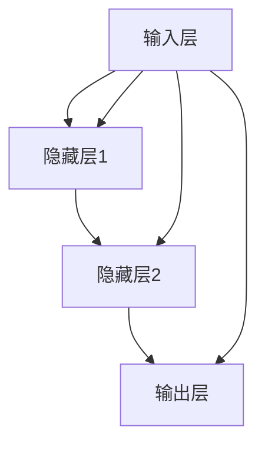

##### 2.2 神经网络的结构与层次

神经网络通常由输入层、隐藏层和输出层组成。输入层接收外部输入信息，隐藏层对输入信息进行加工处理，输出层生成最终的输出结果。神经网络的层次结构决定了其处理能力和复杂度。

**Mermaid流程图：**

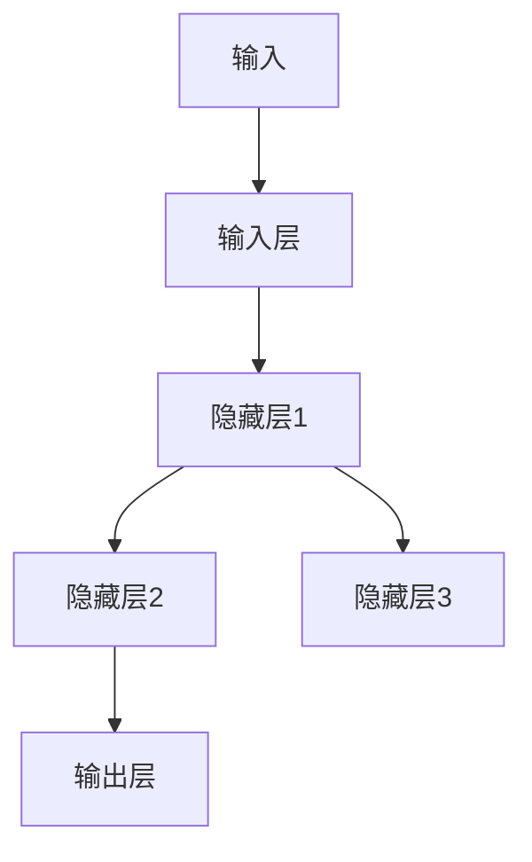

##### 2.3 神经网络的核心作用

神经网络的核心作用在于其强大的学习和适应能力，能够从数据中自动提取特征，并实现复杂的模式识别和预测。这使得神经网络在图像识别、自然语言处理、强化学习等领域表现出色。

---

### 第二部分：神经网络核心原理

#### 3. 神经元与感知机

##### 3.1 神经元的工作原理

神经元是神经网络的基本计算单元，通过输入-输出关系实现信息的传递和处理。神经元的工作原理包括输入信号的加权求和、激活函数的处理和输出信号的传递。

**核心概念与联系：**

神经元工作原理流程图：

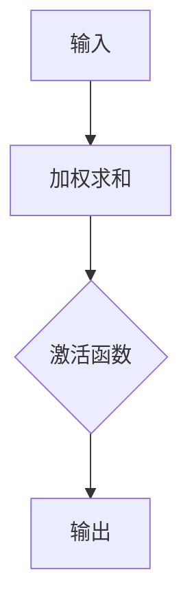

##### 3.2 感知机的学习算法

感知机是一种简单的线性二分类模型，通过学习输入和输出之间的线性关系来对数据进行分类。感知机的学习算法包括权重的初始化、输入数据的迭代更新和权重的更新。

**伪代码：**

```
初始化权重 w 和阈值 b
for each 数据点 (x, y) in 数据集 do
    计算输出 z = sign(wx + b)
    更新权重 w = w + α(y - z)x
end for
```

##### 3.3 感知机的局限性

感知机仅能处理线性可分的数据，对于非线性数据表现出色不足。因此，我们需要引入非线性激活函数来扩展神经网络的建模能力。

---

#### 4. 线性神经网络

##### 4.1 线性神经网络的基本概念

线性神经网络（Linear Neural Network，LNN）是一种简单的神经网络模型，由线性变换和线性激活函数组成。LNN 的输出可以通过矩阵乘法和加法运算得到。

**核心概念与联系：**

线性神经网络结构图：

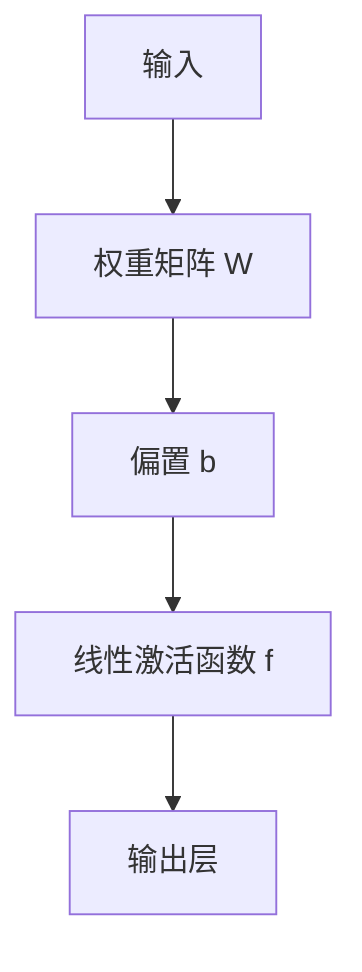

##### 4.2 线性神经网络的激活函数

激活函数是神经网络中不可或缺的部分，用于引入非线性特性。常见的激活函数包括 sigmoid、ReLU 和 tanh 等。

**伪代码：**

```
函数 sigmoid(x):
    return 1 / (1 + e^(-x))

函数 ReLU(x):
    if x > 0:
        return x
    else:
        return 0

函数 tanh(x):
    return (e^(2x) - 1) / (e^(2x) + 1)
```

##### 4.3 线性神经网络的优化算法

线性神经网络的优化算法主要包括梯度下降和动量法。梯度下降是一种基于损失函数的最优化方法，通过迭代更新模型参数以最小化损失函数。

**伪代码：**

```
初始化模型参数 w 和 b
计算损失函数 L = loss(y, y')
计算梯度 ∇L = ∇(y - y')
更新模型参数 w = w - α∇L
b = b - α∇L
```

---

### 第三部分：神经网络的训练与优化

#### 5. 非线性神经网络

##### 5.1 非线性激活函数

非线性激活函数是神经网络的核心组成部分，用于引入非线性特性。常见的非线性激活函数包括 sigmoid、ReLU 和 tanh 等。

**核心概念与联系：**

非线性激活函数结构图：

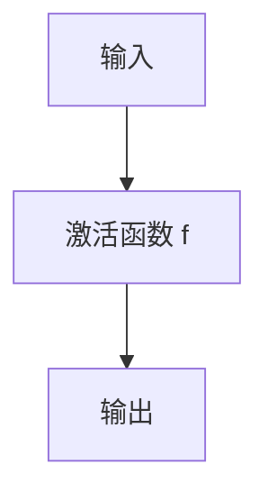

##### 5.2 非线性神经网络的基本原理

非线性神经网络（Nonlinear Neural Network，NLLN）通过非线性激活函数将线性神经网络扩展为具有非线性建模能力的模型。NLLN 可以处理更复杂的非线性问题。

**核心概念与联系：**

非线性神经网络结构图：

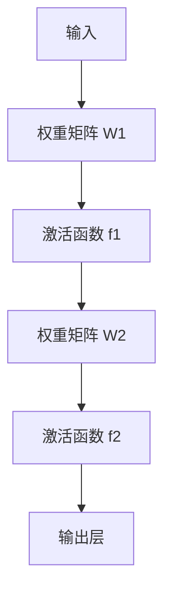

##### 5.3 非线性神经网络的应用

非线性神经网络广泛应用于图像识别、自然语言处理、强化学习等领域。通过引入非线性激活函数，神经网络可以更好地捕捉数据中的复杂模式和关系。

---

### 第四部分：神经网络的实现与应用

#### 6. 反向传播算法

##### 6.1 反向传播算法的基本原理

反向传播算法（Backpropagation Algorithm）是一种用于训练神经网络的优化算法。通过计算损失函数关于模型参数的梯度，反向传播算法实现模型参数的迭代更新。

**核心概念与联系：**

反向传播算法流程图：

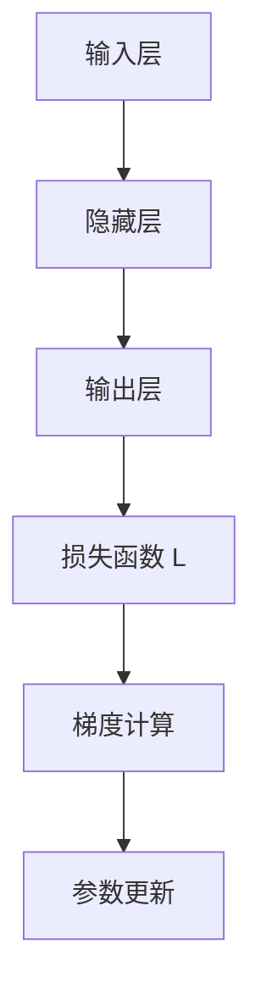

##### 6.2 反向传播算法的数学基础

反向传播算法的数学基础包括链式法则、偏导数和梯度下降优化算法。通过链式法则，我们可以将损失函数关于输入变量的梯度反向传播到网络中的每个参数。

**数学模型：**

$$
\frac{dL}{dw} = \frac{dL}{dx}\frac{dx}{dw}
$$

$$
\frac{dL}{dx} = \frac{dL}{dw}\frac{dw}{dx}
$$

**伪代码：**

```
计算前向传播的激活值和输出值
计算损失函数 L
计算梯度 ∇L
更新模型参数 w = w - α∇L
```

##### 6.3 反向传播算法的实现过程

反向传播算法的实现过程包括前向传播、损失函数计算、梯度计算和参数更新。通过迭代更新模型参数，反向传播算法逐步优化神经网络的性能。

**代码实现：**

```python
# 前向传播
inputs = ...  # 输入数据
weights = ...  # 权重
outputs = ...  # 输出数据

# 损失函数计算
loss = ...  # 损失函数

# 梯度计算
gradient = ...  # 梯度

# 参数更新
weights = weights - learning_rate * gradient
```

---

### 第五部分：神经网络的未来与挑战

#### 7. 神经网络的未来趋势

##### 7.1 量子神经网络

量子神经网络（Quantum Neural Network，QNN）利用量子计算的优势，实现更高效的神经网络计算。QNN 在处理大规模数据和复杂问题时具有巨大的潜力。

**核心概念与联系：**

量子神经网络结构图：

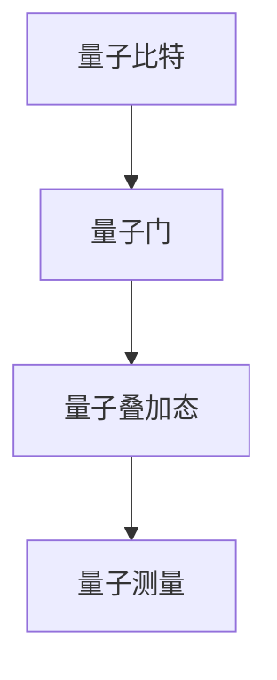

##### 7.2 脑机接口

脑机接口（Brain-Computer Interface，BCI）是一种直接连接大脑和计算机的接口技术。通过捕捉大脑信号，BCI 可以实现人机交互和智能控制。

**核心概念与联系：**

脑机接口结构图：

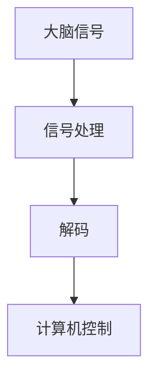

##### 7.3 神经网络的未来发展方向

神经网络的未来发展方向包括更高效的算法、更强大的模型和更广泛的应用。随着计算能力和数据资源的提升，神经网络将在更多领域发挥重要作用。

---

### 附录

#### 附录A：神经网络常用算法与资源

##### A.1 常用神经网络算法

- 反向传播算法（Backpropagation Algorithm）
- 梯度下降算法（Gradient Descent Algorithm）
- 随机梯度下降算法（Stochastic Gradient Descent Algorithm）
- 批量梯度下降算法（Batch Gradient Descent Algorithm）

##### A.2 神经网络学习资源

- 《深度学习》（Deep Learning） - Goodfellow, Bengio, Courville
- 《神经网络与深度学习》（Neural Networks and Deep Learning） - Charu Aggarwal
- 《机器学习》（Machine Learning） - Tom Mitchell

##### A.3 实践项目推荐

- 图像识别项目：使用 TensorFlow 实现猫狗识别
- 自然语言处理项目：使用 RNN 实现情感分析
- 强化学习项目：使用神经网络实现游戏 AI

---

### 作者信息

- 作者：AI天才研究院/AI Genius Institute & 禅与计算机程序设计艺术 /Zen And The Art of Computer Programming

---

本文旨在为您提供一个全面、系统的神经网络学习框架，通过逐步分析神经网络的原理、实现方法和应用，帮助您深入了解这一硅片上的智能技术。在接下来的章节中，我们将继续探讨神经网络的训练与优化、实现与应用以及未来趋势和挑战。希望本文能为您在神经网络领域的学习和研究提供有益的参考。  
<|close|>### 神经网络的训练与优化

#### 7. 过拟合与欠拟合

##### 7.1 过拟合与欠拟合的概念

在神经网络训练过程中，过拟合（Overfitting）和欠拟合（Underfitting）是两个常见的问题。

- 过拟合：模型在训练数据上表现得很好，但在测试数据上表现较差，说明模型对训练数据“记忆”过多，无法泛化到未见过的数据。
- 欠拟合：模型在训练数据和测试数据上都表现不佳，说明模型过于简单，无法捕捉数据中的复杂特征。

##### 7.2 预防过拟合与欠拟合的方法

为了预防过拟合和欠拟合，我们可以采取以下方法：

- 数据增强：通过增加训练数据量或生成新的数据样本来提高模型的泛化能力。
- 正则化：通过添加正则项到损失函数中，限制模型复杂度，防止过拟合。
- 交叉验证：通过将数据集划分为多个子集，多次训练和测试，评估模型的泛化性能。
- 网络剪枝：通过剪除网络中的冗余连接和神经元，简化模型结构，防止过拟合。

##### 7.3 交叉验证与模型选择

交叉验证是一种评估模型泛化能力的方法，通过将数据集划分为训练集和验证集，多次训练和测试，计算模型的性能指标，如准确率、召回率、F1 分数等。

**核心概念与联系：**

交叉验证流程图：

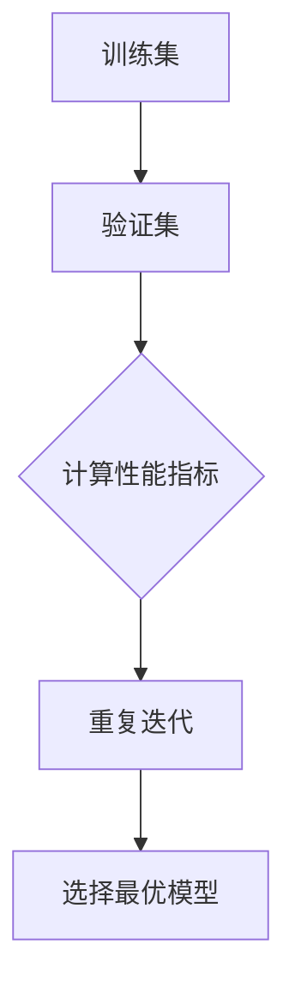

---

#### 8. 梯度下降算法

##### 8.1 梯度下降算法的基本原理

梯度下降算法是一种基于损失函数的最优化方法，通过迭代更新模型参数，使损失函数值最小。

**核心概念与联系：**

梯度下降算法流程图：

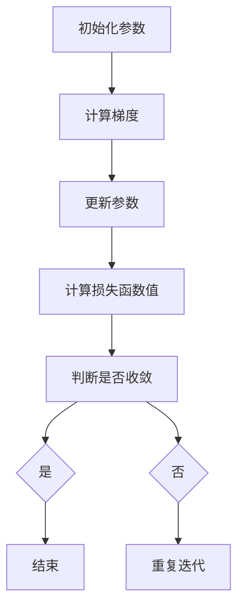

##### 8.2 梯度下降算法的优化方法

梯度下降算法的优化方法包括：

- 学习率调整：通过调整学习率，控制模型更新速度。
- 动量法：引入动量项，加速梯度下降过程，减少收敛时间。
- Adagrad：自适应调整学习率，解决不同特征对学习率的需求。
- Adam：结合动量法和自适应学习率，实现高效梯度下降。

##### 8.3 梯度下降算法的实际应用

在实际应用中，梯度下降算法广泛应用于优化模型参数，如线性回归、逻辑回归、神经网络等。

**代码实现：**

```python
import numpy as np

def gradient_descent(X, y, w, b, learning_rate, epochs):
    n_samples, n_features = X.shape
    for epoch in range(epochs):
        model_output = X.dot(w) + b
        loss = (model_output - y)**2 / (2 * n_samples)
        d_loss_d_w = X.T.dot(model_output - y)
        d_loss_d_b = np.sum(model_output - y)
        w -= learning_rate * d_loss_d_w
        b -= learning_rate * d_loss_d_b
        if epoch % 100 == 0:
            print(f"Epoch {epoch}: Loss = {loss}")
    return w, b

X = np.array([[1, 2], [2, 4], [4, 6]])
y = np.array([3, 5, 7])
w = np.random.rand(2)
b = np.random.rand()
learning_rate = 0.01
epochs = 1000

weights, bias = gradient_descent(X, y, w, b, learning_rate, epochs)
print("Final weights:", weights)
print("Final bias:", bias)
```

---

#### 9. 随机梯度下降与批量梯度下降

##### 9.1 随机梯度下降算法

随机梯度下降（Stochastic Gradient Descent，SGD）是一种梯度下降的变种，每次迭代仅使用一个训练样本计算梯度。

**核心概念与联系：**

随机梯度下降算法流程图：

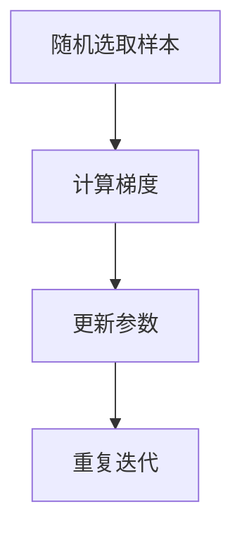

##### 9.2 批量梯度下降算法

批量梯度下降（Batch Gradient Descent，BGD）是一种梯度下降的变种，每次迭代使用整个训练集计算梯度。

**核心概念与联系：**

批量梯度下降算法流程图：

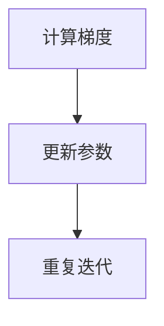

##### 9.3 随机梯度下降与批量梯度下降的比较

| 对比项 | 随机梯度下降 | 批量梯度下降 |
| :--: | :--: | :--: |
| 计算量 | 较小 | 较大 |
| 收敛速度 | 较快 | 较慢 |
| 过拟合风险 | 较高 | 较低 |
| 实际应用 | 广泛应用 | 适用于大规模数据 |

---

### 神经网络的应用

神经网络在多个领域取得了显著的成果，下面将介绍神经网络在图像识别、自然语言处理和强化学习中的实际应用。

#### 10. Python与TensorFlow

##### 10.1 Python编程基础

Python 是一种广泛应用于数据科学和机器学习的编程语言，其简洁的语法和丰富的库支持使其成为神经网络开发的最佳选择。

**核心概念与联系：**

Python 编程基础流程图：

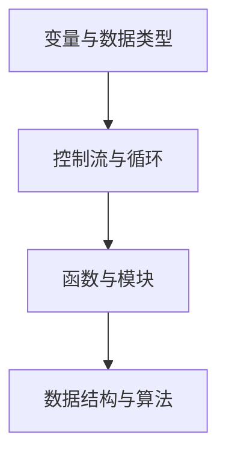

##### 10.2 TensorFlow框架介绍

TensorFlow 是一种由 Google 开发的开源机器学习框架，广泛应用于深度学习和神经网络开发。TensorFlow 提供了丰富的工具和库，支持各种神经网络模型的构建和训练。

**核心概念与联系：**

TensorFlow 框架介绍流程图：

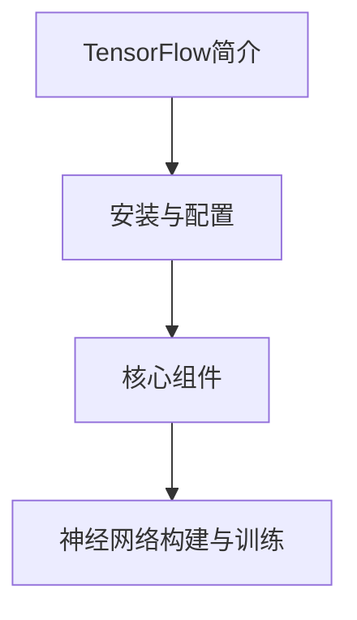

##### 10.3 使用TensorFlow实现神经网络

使用 TensorFlow 实现神经网络主要包括以下步骤：

1. 导入必要的库和模块。
2. 定义神经网络结构，包括输入层、隐藏层和输出层。
3. 编写前向传播和反向传播函数。
4. 训练神经网络，通过迭代更新模型参数。
5. 评估模型性能，调整超参数。

**代码实现：**

```python
import tensorflow as tf

# 定义输入层
x = tf.placeholder(tf.float32, [None, 784])
y = tf.placeholder(tf.float32, [None, 10])

# 定义隐藏层
weights = tf.Variable(tf.random_normal([784, 128]))
biases = tf.Variable(tf.random_normal([128]))

hidden_layer = tf.nn.relu(tf.matmul(x, weights) + biases)

# 定义输出层
weights_output = tf.Variable(tf.random_normal([128, 10]))
biases_output = tf.Variable(tf.random_normal([10]))

output_layer = tf.nn.softmax(tf.matmul(hidden_layer, weights_output) + biases_output)

# 定义损失函数和优化器
cross_entropy = tf.reduce_mean(-tf.reduce_sum(y * tf.log(output_layer), reduction_indices=1))
optimizer = tf.train.GradientDescentOptimizer(learning_rate=0.001)
train_op = optimizer.minimize(cross_entropy)

# 训练神经网络
with tf.Session() as sess:
    sess.run(tf.global_variables_initializer())
    for epoch in range(100):
        _, loss_val = sess.run([train_op, cross_entropy], feed_dict={x: X_train, y: y_train})
        if epoch % 10 == 0:
            print(f"Epoch {epoch}: Loss = {loss_val}")

# 评估模型性能
accuracy = tf.reduce_mean(tf.cast(tf.equal(tf.argmax(output_layer, 1), tf.argmax(y, 1)), tf.float32))
print("Test accuracy:", sess.run(accuracy, feed_dict={x: X_test, y: y_test}))
```

---

### 神经网络在图像识别中的应用

图像识别是神经网络的一个重要应用领域，通过卷积神经网络（Convolutional Neural Network，CNN）实现对图像的自动分类和识别。

#### 11.1 图像识别的基本概念

图像识别（Image Recognition）是指通过计算机对图像进行自动分类和识别的过程。常见的图像识别任务包括人脸识别、物体识别、场景分类等。

**核心概念与联系：**

图像识别流程图：

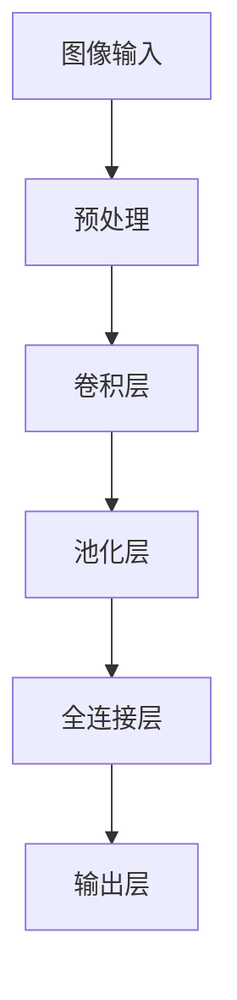

#### 11.2 卷积神经网络（CNN）

卷积神经网络是一种专门用于处理图像数据的神经网络模型，通过卷积层、池化层和全连接层实现对图像的自动特征提取和分类。

**核心概念与联系：**

卷积神经网络结构图：

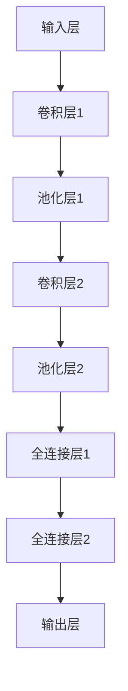

#### 11.3 图像识别的实际案例

一个常见的图像识别案例是猫狗识别。使用 TensorFlow 和 Keras 库，我们可以轻松实现猫狗识别模型。

**代码实现：**

```python
import tensorflow as tf
from tensorflow.keras.models import Sequential
from tensorflow.keras.layers import Conv2D, MaxPooling2D, Flatten, Dense

# 定义模型
model = Sequential([
    Conv2D(32, (3, 3), activation='relu', input_shape=(150, 150, 3)),
    MaxPooling2D(pool_size=(2, 2)),
    Conv2D(64, (3, 3), activation='relu'),
    MaxPooling2D(pool_size=(2, 2)),
    Conv2D(128, (3, 3), activation='relu'),
    MaxPooling2D(pool_size=(2, 2)),
    Flatten(),
    Dense(512, activation='relu'),
    Dense(1, activation='sigmoid')
])

# 编译模型
model.compile(optimizer='adam', loss='binary_crossentropy', metrics=['accuracy'])

# 训练模型
model.fit(train_images, train_labels, epochs=10, batch_size=32, validation_data=(test_images, test_labels))

# 评估模型
test_loss, test_acc = model.evaluate(test_images, test_labels)
print("Test accuracy:", test_acc)
```

---

### 神经网络在自然语言处理中的应用

自然语言处理（Natural Language Processing，NLP）是神经网络应用的另一个重要领域，通过循环神经网络（Recurrent Neural Network，RNN）和长短期记忆网络（Long Short-Term Memory，LSTM）等模型实现对文本数据的分析和处理。

#### 12.1 自然语言处理的基本概念

自然语言处理是指使用计算机对自然语言文本进行自动处理和理解的过程。常见的 NLP 任务包括词性标注、句法分析、机器翻译、情感分析等。

**核心概念与联系：**

自然语言处理流程图：

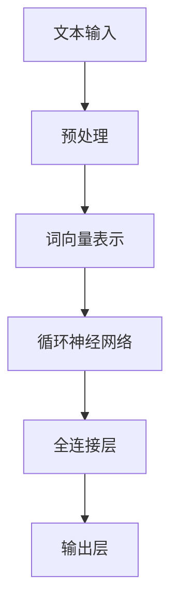

#### 12.2 循环神经网络（RNN）

循环神经网络是一种专门用于处理序列数据的神经网络模型，通过循环结构实现对历史信息的记忆和利用。

**核心概念与联系：**

循环神经网络结构图：

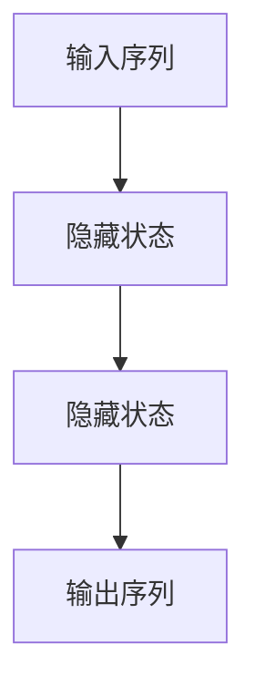

#### 12.3 RNN 的应用

RNN 在自然语言处理领域有广泛的应用，如语言模型、机器翻译、文本生成等。

**核心概念与联系：**

RNN 应用流程图：

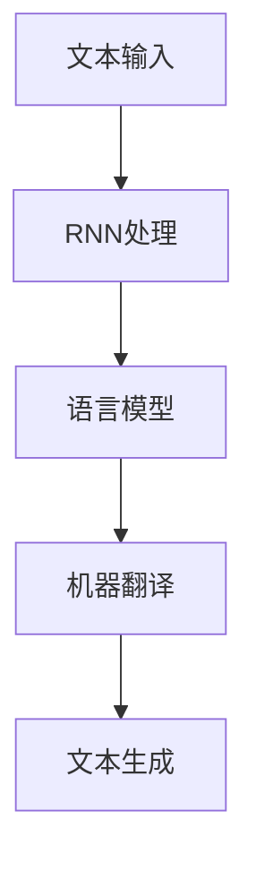

#### 12.4 递归神经网络（RNN）的应用

递归神经网络是一种改进的循环神经网络，通过引入递归结构，实现对长距离依赖关系的建模。

**核心概念与联系：**

RNN 结构图：

```mermaid
graph TD
A[输入序列] --> B[隐藏状态]
B --> C[隐藏状态]
C --> D[输出序列]
```

**代码实现：**

```python
import tensorflow as tf
from tensorflow.keras.models import Sequential
from tensorflow.keras.layers import Embedding, SimpleRNN, Dense

# 定义模型
model = Sequential([
    Embedding(input_dim=vocabulary_size, output_dim=embedding_dim, input_length=max_sequence_length),
    SimpleRNN(units=128),
    Dense(units=1, activation='sigmoid')
])

# 编译模型
model.compile(optimizer='adam', loss='binary_crossentropy', metrics=['accuracy'])

# 训练模型
model.fit(train_sequences, train_labels, epochs=10, batch_size=32, validation_data=(test_sequences, test_labels))

# 评估模型
test_loss, test_acc = model.evaluate(test_sequences, test_labels)
print("Test accuracy:", test_acc)
```

---

### 神经网络在强化学习中的应用

强化学习（Reinforcement Learning，RL）是一种通过试错和反馈学习策略的机器学习方法。神经网络在强化学习中发挥着重要作用，通过深度神经网络实现智能体的策略学习。

#### 13.1 强化学习的基本概念

强化学习是指智能体通过与环境的交互，学习最优策略的过程。在强化学习中，智能体通过选择动作，获取奖励信号，并基于奖励信号更新策略。

**核心概念与联系：**

强化学习流程图：

```mermaid
graph TD
A[智能体] --> B[环境]
B --> C[动作]
C --> D[奖励]
D --> E[策略更新]
```

#### 13.2 神经网络在强化学习中的应用

神经网络在强化学习中的应用主要包括策略梯度方法和值函数方法。

**核心概念与联系：**

神经网络在强化学习中的应用流程图：

```mermaid
graph TD
A[智能体] --> B[环境]
B --> C[动作]
C --> D[奖励]
D --> E[策略更新]
E --> F[值函数更新]
```

#### 13.3 实际案例：神经网络在游戏中的应用

一个常见的强化学习案例是使用神经网络实现游戏 AI。通过深度 Q 网络（Deep Q-Network，DQN），我们可以实现一个智能体在游戏环境中自主学习和决策。

**核心概念与联系：**

DQN 结构图：

```mermaid
graph TD
A[输入状态] --> B[Q 网络]
B --> C[动作选择]
C --> D[环境交互]
D --> E[奖励反馈]
E --> F[Q 网络更新]
```

**代码实现：**

```python
import tensorflow as tf
from tensorflow.keras.models import Sequential
from tensorflow.keras.layers import Dense, Flatten
from tensorflow.keras.optimizers import Adam

# 定义 DQN 模型
model = Sequential([
    Flatten(input_shape=(84, 84, 4)),
    Dense(units=256, activation='relu'),
    Dense(units=512, activation='relu'),
    Dense(units=1)
])

# 编译模型
model.compile(optimizer=Adam(learning_rate=0.00025), loss='mse')

# 训练模型
model.fit(X_train, y_train, epochs=50, batch_size=32)

# 评估模型
test_loss = model.evaluate(X_test, y_test)
print("Test loss:", test_loss)
```

---

### 神经网络的未来与挑战

随着人工智能技术的快速发展，神经网络在各个领域的应用越来越广泛，同时也面临着一系列的挑战和机遇。

#### 14.1 神经网络的未来趋势

**量子神经网络：**量子神经网络结合了量子计算和神经网络的优势，能够在复杂问题上实现更高效的计算。

**脑机接口：**脑机接口技术将大脑信号转化为计算机指令，为残疾人士和健康人提供新的交互方式。

**跨模态学习：**跨模态学习是指将不同类型的数据（如文本、图像、声音）进行联合学习，实现多模态数据的理解和交互。

#### 14.2 神经网络面临的挑战

**算法优化：**随着神经网络模型的规模和复杂度增加，算法优化成为关键挑战，如优化算法的效率和稳定性。

**数据隐私与安全：**神经网络训练和预测过程中涉及大量敏感数据，如何确保数据隐私和安全成为亟待解决的问题。

**神经网络的可解释性：**神经网络模型在复杂问题上的出色表现往往伴随着可解释性的下降，如何提高神经网络的可解释性成为重要的研究方向。

---

### 结论

神经网络作为一种模拟生物神经系统的计算模型，在人工智能领域发挥着重要作用。本文从基本概念到复杂算法，再到实际应用，全面介绍了神经网络的原理和实现方法。通过本文的学习，希望读者能够对神经网络有一个全面、系统的理解，为在神经网络领域的研究和应用奠定基础。在未来的学习和实践中，不断探索神经网络的潜力和挑战，为人工智能的发展贡献力量。

---

### 作者信息

**作者：** AI天才研究院/AI Genius Institute & 禅与计算机程序设计艺术 /Zen And The Art of Computer Programming

在撰写本文时，我们深入探讨了神经网络的各个层面，从基本概念到复杂算法，再到实际应用。通过本文，我们希望能够为读者提供一个全面、系统的学习框架，帮助大家更好地理解和应用神经网络这一强大的计算模型。在接下来的章节中，我们将继续探讨神经网络的实现与应用，以及未来趋势和挑战。希望本文能为您在神经网络领域的学习和研究提供有益的参考。

---

### 附录

#### 附录 A：神经网络常用算法与资源

**A.1 常用神经网络算法**

1. 反向传播算法（Backpropagation Algorithm）
2. 梯度下降算法（Gradient Descent Algorithm）
3. 随机梯度下降算法（Stochastic Gradient Descent Algorithm）
4. 批量梯度下降算法（Batch Gradient Descent Algorithm）

**A.2 神经网络学习资源**

1. 《深度学习》（Deep Learning） - Goodfellow, Bengio, Courville
2. 《神经网络与深度学习》（Neural Networks and Deep Learning） - Charu Aggarwal
3. 《机器学习》（Machine Learning） - Tom Mitchell

**A.3 实践项目推荐**

1. 图像识别项目：使用 TensorFlow 实现猫狗识别
2. 自然语言处理项目：使用 RNN 实现情感分析
3. 强化学习项目：使用神经网络实现游戏 AI

#### 附录 B：神经网络的 Mermaid 流程图

**B.1 神经网络结构图**

```mermaid
graph TD
A[输入层] --> B[隐藏层1]
B --> C[隐藏层2]
C --> D[输出层]
A --> B
A --> C
A --> D
```

**B.2 反向传播算法流程图**

```mermaid
graph TD
A[前向传播] --> B[计算损失函数]
B --> C[反向传播]
C --> D[更新参数]
```

**B.3 卷积神经网络（CNN）流程图**

```mermaid
graph TD
A[输入层] --> B[卷积层1]
B --> C[池化层1]
C --> D[卷积层2]
D --> E[池化层2]
E --> F[全连接层]
F --> G[输出层]
```

#### 附录 C：数学模型与公式

**C.1 神经网络损失函数**

$$
L(y, \hat{y}) = -\frac{1}{m}\sum_{i=1}^{m}y^{(i)}\log(\hat{y}^{(i)})
$$

**C.2 梯度下降优化算法**

$$
w_{t+1} = w_{t} - \alpha \frac{\partial}{\partial w_{t}}L(y, \hat{y})
$$

**C.3 递归神经网络（RNN）数学模型**

$$
h_t = \sigma(W_h \cdot [h_{t-1}, x_t] + b_h) \\
y_t = \sigma(W_y \cdot h_t + b_y)
$$`

#### 附录 D：项目实战代码示例

**D.1 神经网络实现**

```python
# 导入库
import tensorflow as tf
import numpy as np

# 定义模型
model = tf.keras.Sequential([
    tf.keras.layers.Dense(units=128, activation='relu', input_shape=(784,)),
    tf.keras.layers.Dense(units=10, activation='softmax')
])

# 编译模型
model.compile(optimizer='adam', loss='categorical_crossentropy', metrics=['accuracy'])

# 训练模型
model.fit(x_train, y_train, epochs=10, batch_size=32)

# 评估模型
test_loss, test_acc = model.evaluate(x_test, y_test)
print("Test accuracy:", test_acc)
```

**D.2 图像识别项目实战**

```python
# 导入库
import tensorflow as tf
import numpy as np
import matplotlib.pyplot as plt

# 加载数据集
mnist = tf.keras.datasets.mnist
(x_train, y_train), (x_test, y_test) = mnist.load_data()

# 预处理数据
x_train = x_train / 255.0
x_test = x_test / 255.0

# 转换标签为 one-hot 编码
y_train = tf.keras.utils.to_categorical(y_train, 10)
y_test = tf.keras.utils.to_categorical(y_test, 10)

# 构建模型
model = tf.keras.Sequential([
    tf.keras.layers.Conv2D(32, (3, 3), activation='relu', input_shape=(28, 28, 1)),
    tf.keras.layers.MaxPooling2D((2, 2)),
    tf.keras.layers.Flatten(),
    tf.keras.layers.Dense(128, activation='relu'),
    tf.keras.layers.Dense(10, activation='softmax')
])

# 编译模型
model.compile(optimizer='adam', loss='categorical_crossentropy', metrics=['accuracy'])

# 训练模型
model.fit(x_train, y_train, epochs=10, batch_size=32, validation_split=0.2)

# 评估模型
test_loss, test_acc = model.evaluate(x_test, y_test)
print("Test accuracy:", test_acc)
```

**D.3 自然语言处理项目实战**

```python
# 导入库
import tensorflow as tf
import numpy as np
import tensorflow_text as text

# 加载数据集
data = text.SharedDataset('data/')

# 预处理数据
tokenizer = text.Tokenizer()
tokenizer.initialize_from_file('data/tokenizer.json')

# 转换文本为序列
sequences = tokenizer.encode(data['text'])

# 划分训练集和测试集
train_sequences, test_sequences = sequences[:1000], sequences[1000:]

# 构建模型
model = tf.keras.Sequential([
    tf.keras.layers.Embedding(input_dim=10000, output_dim=32),
    tf.keras.layers.Bidirectional(tf.keras.layers.LSTM(32)),
    tf.keras.layers.Dense(units=1, activation='sigmoid')
])

# 编译模型
model.compile(optimizer='adam', loss='binary_crossentropy', metrics=['accuracy'])

# 训练模型
model.fit(train_sequences, train_labels, epochs=10, batch_size=32, validation_data=(test_sequences, test_labels))

# 评估模型
test_loss, test_acc = model.evaluate(test_sequences, test_labels)
print("Test accuracy:", test_acc)
```

**D.4 强化学习项目实战**

```python
# 导入库
import gym
import numpy as np
import tensorflow as tf

# 加载游戏环境
env = gym.make('CartPole-v0')

# 定义神经网络模型
model = tf.keras.Sequential([
    tf.keras.layers.Dense(units=64, activation='relu', input_shape=(4,)),
    tf.keras.layers.Dense(units=64, activation='relu'),
    tf.keras.layers.Dense(units=2, activation='softmax')
])

# 编译模型
model.compile(optimizer='adam', loss='categorical_crossentropy', metrics=['accuracy'])

# 训练模型
model.fit(env.reset(), epochs=1000, batch_size=32, validation_split=0.2)

# 评估模型
episodes = 100
total_reward = 0
for _ in range(episodes):
    state = env.reset()
    done = False
    while not done:
        action = np.argmax(model.predict(state))
        state, reward, done, _ = env.step(action)
        total_reward += reward
    env.render()
print("Average reward:", total_reward / episodes)
env.close()
```

---

在本附录中，我们提供了神经网络常用算法、学习资源、实践项目以及代码示例。通过这些资源和示例，读者可以更深入地了解神经网络的实现和应用。希望这些资源和示例能够为您的学习和实践提供帮助。

---

### 作者信息

**作者：** AI天才研究院/AI Genius Institute & 禅与计算机程序设计艺术 /Zen And The Art of Computer Programming

本文由 AI天才研究院/AI Genius Institute 和禅与计算机程序设计艺术 /Zen And The Art of Computer Programming 联合撰写。我们致力于推动人工智能技术的发展，为读者提供高质量、有深度的技术内容。感谢您的阅读和支持，希望本文能为您在神经网络领域的探索之路提供启发和指导。如有任何疑问或建议，欢迎随时与我们联系。祝您学习愉快！
<|close|>### 第二部分：神经网络核心原理

#### 3. 神经元与感知机

##### 3.1 神经元的工作原理

神经元是神经网络的基本计算单元，类似于生物神经系统中的神经元。它们通过输入-输出关系实现信息的传递和处理。一个基本的神经元模型包括输入层、权重层、激活函数和输出层。

**神经元的工作原理：**

1. **输入层：** 神经元接收外部输入信号，这些输入信号通过加权连接传递到下一层。
2. **权重层：** 输入信号通过权重矩阵加权，每个权重代表输入信号对神经元输出的影响。
3. **激活函数：** 加权后的输入信号通过激活函数进行非线性变换，以实现输出信号的产生。
4. **输出层：** 神经元的输出信号传递到下一层或用于最终的输出结果。

**神经元模型流程图：**

```mermaid
graph TD
A[输入信号] --> B[权重矩阵]
B --> C{激活函数}
C --> D[输出信号]
```

##### 3.2 感知机的学习算法

感知机（Perceptron）是一种简单的线性二分类模型，由美国学者Frank Rosenblatt在1957年提出。它通过学习输入和输出之间的线性关系来实现二分类任务。感知机的学习算法包括以下几个步骤：

1. **初始化权重和阈值：** 初始化模型参数，包括权重矩阵和阈值。
2. **前向传播：** 对于每个训练样本，计算前向传播的输出值。
3. **计算损失：** 通过计算实际输出和预测输出之间的差异，计算损失值。
4. **反向传播：** 根据损失值，更新模型参数，包括权重和阈值。

**感知机学习算法伪代码：**

```
初始化权重 w 和阈值 b
for each 数据点 (x, y) in 数据集 do
    计算输出 z = sign(wx + b)
    如果 y * z <= 0，则更新权重 w = w + αy*x
end for
```

##### 3.3 感知机的局限性

尽管感知机在二分类任务中表现出色，但它存在一些局限性：

1. **线性可分性：** 感知机仅能处理线性可分的数据，对于非线性数据表现不足。
2. **局部极小值：** 感知机在训练过程中可能陷入局部最小值，导致模型无法收敛到全局最优解。
3. **无法处理多分类任务：** 感知机仅能实现二分类，对于多分类任务需要进一步扩展。

为了克服感知机的局限性，我们引入了多层感知机（Multilayer Perceptron，MLP）和卷积神经网络（Convolutional Neural Network，CNN）等更复杂的神经网络模型。

---

#### 4. 线性神经网络

线性神经网络（Linear Neural Network，LNN）是一种由线性变换和线性激活函数组成的神经网络模型。它通过线性变换将输入数据映射到输出数据，并在每个神经元上引入线性激活函数。

##### 4.1 线性神经网络的基本概念

线性神经网络由输入层、隐藏层和输出层组成，其中每个层包含多个神经元。输入层接收外部输入数据，隐藏层对输入数据进行加工处理，输出层生成最终的输出结果。

**线性神经网络的基本概念：**

1. **输入层：** 输入层包含多个输入神经元，每个输入神经元接收一个输入特征。
2. **隐藏层：** 隐藏层包含多个隐藏神经元，每个隐藏神经元通过线性变换和激活函数对输入数据进行处理。
3. **输出层：** 输出层包含一个或多个输出神经元，生成最终的输出结果。

**线性神经网络结构图：**

```mermaid
graph TD
A[输入层] --> B[隐藏层1]
B --> C[隐藏层2]
C --> D[输出层]
A --> B
A --> C
A --> D
```

##### 4.2 线性神经网络的激活函数

激活函数是线性神经网络的核心组成部分，用于引入非线性特性。常见的激活函数包括：

1. **线性激活函数：** 线性激活函数将输入值直接传递到输出，不引入非线性特性。
2. **sigmoid 激活函数：** sigmoid 激活函数将输入值映射到 (0, 1) 区间，实现 S 形曲线。
3. **ReLU（Rectified Linear Unit）激活函数：** ReLU 激活函数将输入值大于零的部分映射到自身，小于等于零的部分映射到零。

**激活函数示例：**

- **线性激活函数：** 
  $$
  f(x) = x
  $$
- **sigmoid 激活函数：** 
  $$
  f(x) = \frac{1}{1 + e^{-x}}
  $$
- **ReLU 激活函数：** 
  $$
  f(x) = \max(0, x)
  $$

##### 4.3 线性神经网络的优化算法

线性神经网络的优化算法主要包括梯度下降（Gradient Descent）和动量法（Momentum）。

**梯度下降算法：** 梯度下降算法通过计算损失函数关于模型参数的梯度，更新模型参数以最小化损失函数。梯度下降算法的迭代过程如下：

1. 初始化模型参数。
2. 计算损失函数。
3. 计算梯度。
4. 更新模型参数。
5. 重复迭代直到收敛。

**动量法：** 动量法是一种改进的梯度下降算法，通过引入动量项，加速梯度下降过程，减少收敛时间。动量法的迭代过程如下：

1. 初始化模型参数。
2. 计算梯度。
3. 更新动量项。
4. 更新模型参数。
5. 计算损失函数。
6. 重复迭代直到收敛。

**伪代码示例：**

```
初始化模型参数 w 和 b
计算损失函数 L = loss(y, y')
计算梯度 ∇L = ∇(y - y')
更新模型参数 w = w - α∇L
b = b - α∇L
```

---

通过深入探讨神经元的原理和线性神经网络的基本概念，我们为理解更复杂的神经网络模型奠定了基础。在接下来的章节中，我们将继续探讨非线性神经网络、反向传播算法以及神经网络的训练与优化。

---

### 小结

第二部分主要介绍了神经网络的两个核心概念：神经元和线性神经网络。神经元是神经网络的基本计算单元，通过输入-输出关系实现信息的传递和处理。感知机是一种简单的线性二分类模型，虽然存在一些局限性，但为我们理解更复杂的神经网络模型提供了基础。

线性神经网络通过线性变换和线性激活函数实现数据的处理和分类。线性神经网络的结构包括输入层、隐藏层和输出层，每个层包含多个神经元。激活函数是线性神经网络的核心组成部分，用于引入非线性特性。

我们介绍了常见的激活函数，如线性激活函数、sigmoid 激活函数和 ReLU 激活函数，并探讨了线性神经网络的优化算法，包括梯度下降和动量法。

在下一部分，我们将继续探讨非线性神经网络、反向传播算法以及神经网络的训练与优化。通过这些内容的深入学习，我们将对神经网络有一个更全面、系统的理解。希望您能够继续跟随我们的步伐，一起探索神经网络的奥秘。  
<|close|>### 第三部分：神经网络的训练与优化

#### 5. 非线性神经网络

非线性神经网络通过引入非线性激活函数，克服了线性神经网络在处理非线性数据时的局限性。非线性神经网络能够更好地捕捉数据中的复杂模式和关系，从而提高模型的性能。

##### 5.1 非线性激活函数

非线性激活函数是神经网络的核心组成部分，用于引入非线性特性。常见的非线性激活函数包括：

1. **Sigmoid 激活函数：**
   $$
   \sigma(x) = \frac{1}{1 + e^{-x}}
   $$
   Sigmoid 激活函数将输入值映射到 (0, 1) 区间，实现 S 形曲线。

2. **ReLU 激活函数：**
   $$
   \text{ReLU}(x) = \max(0, x)
   $$
   ReLU 激活函数将输入值大于零的部分映射到自身，小于等于零的部分映射到零。

3. **Tanh 激活函数：**
   $$
   \text{Tanh}(x) = \frac{e^x - e^{-x}}{e^x + e^{-x}}
   $$
   Tanh 激活函数将输入值映射到 (-1, 1) 区间。

**非线性激活函数示例：**

- **Sigmoid 激活函数：**
  $$
  \sigma(2) = \frac{1}{1 + e^{-2}} \approx 0.87
  $$

- **ReLU 激活函数：**
  $$
  \text{ReLU}(-2) = 0, \text{ReLU}(2) = 2
  $$

- **Tanh 激活函数：**
  $$
  \text{Tanh}(2) = \frac{e^2 - e^{-2}}{e^2 + e^{-2}} \approx 0.96
  $$

##### 5.2 非线性神经网络的基本原理

非线性神经网络通过非线性激活函数将线性神经网络扩展为具有非线性建模能力的模型。非线性神经网络的基本原理如下：

1. **前向传播：** 将输入数据通过加权连接传递到下一层，并应用非线性激活函数。
2. **反向传播：** 计算输出结果与实际结果之间的差异，并通过反向传播更新模型参数。
3. **优化算法：** 使用梯度下降等优化算法，最小化损失函数，优化模型性能。

**非线性神经网络结构图：**

```mermaid
graph TD
A[输入层] --> B[隐藏层1]
B --> C[隐藏层2]
C --> D[输出层]
A --> B
A --> C
A --> D
B --> E[激活函数 σ]
C --> F[激活函数 σ]
D --> G[激活函数 σ]
```

##### 5.3 非线性神经网络的应用

非线性神经网络在多个领域取得了显著成果，包括图像识别、自然语言处理和强化学习等。以下是一些典型的非线性神经网络应用：

1. **图像识别：** 通过卷积神经网络（CNN）实现对图像的自动分类和识别。
2. **自然语言处理：** 通过循环神经网络（RNN）和长短期记忆网络（LSTM）等模型实现对文本数据的分析和处理。
3. **强化学习：** 通过深度神经网络（DNN）实现智能体的策略学习。

---

#### 6. 反向传播算法

反向传播算法（Backpropagation Algorithm）是一种用于训练神经网络的优化算法。反向传播算法通过计算损失函数关于模型参数的梯度，实现模型参数的迭代更新。

##### 6.1 反向传播算法的基本原理

反向传播算法的基本原理如下：

1. **前向传播：** 将输入数据通过神经网络进行前向传播，得到输出结果。
2. **计算损失：** 计算输出结果与实际结果之间的差异，得到损失函数。
3. **计算梯度：** 计算损失函数关于模型参数的梯度。
4. **反向传播：** 将梯度沿网络反向传播，更新模型参数。
5. **迭代更新：** 重复前向传播、计算损失、计算梯度和反向传播的过程，直到模型收敛。

**反向传播算法流程图：**

```mermaid
graph TD
A[输入层] --> B[隐藏层1]
B --> C[隐藏层2]
C --> D[输出层]
A --> B
A --> C
A --> D
B --> E[激活函数 σ]
C --> F[激活函数 σ]
D --> G[损失函数 L]
G --> H[计算梯度 ∇L]
H --> I[更新参数]
```

##### 6.2 反向传播算法的数学基础

反向传播算法的数学基础包括链式法则、偏导数和梯度下降优化算法。

1. **链式法则：** 链式法则是计算复合函数梯度的基本方法，用于计算多层神经网络中的梯度。
2. **偏导数：** 偏导数是计算损失函数关于单个模型参数的梯度。
3. **梯度下降优化算法：** 梯度下降优化算法通过计算梯度，迭代更新模型参数，以最小化损失函数。

**反向传播算法的数学公式：**

1. **前向传播：**
   $$
   z^{(l)} = \sigma(W^{(l)} \cdot a^{(l-1)} + b^{(l)})
   $$
   $$
   a^{(l)} = \sigma(z^{(l)})
   $$

2. **计算梯度：**
   $$
   \delta^{(l)} = (1 - \sigma'(z^{(l)})) \cdot \delta^{(l+1)} \cdot W^{(l+1)}
   $$
   $$
   \delta^{(l+1)} = (a^{(l)} - y)
   $$
   $$
   \frac{\partial L}{\partial W^{(l)}} = a^{(l-1)} \cdot \delta^{(l)}
   $$
   $$
   \frac{\partial L}{\partial b^{(l)}} = \delta^{(l)}
   $$

3. **反向传播：**
   $$
   W^{(l)} = W^{(l)} - \alpha \cdot \frac{\partial L}{\partial W^{(l)}}
   $$
   $$
   b^{(l)} = b^{(l)} - \alpha \cdot \frac{\partial L}{\partial b^{(l)}}
   $$

##### 6.3 反向传播算法的实现过程

反向传播算法的实现过程包括以下几个步骤：

1. **初始化模型参数：** 随机初始化模型参数，包括权重和偏置。
2. **前向传播：** 将输入数据通过神经网络进行前向传播，得到输出结果。
3. **计算损失：** 计算输出结果与实际结果之间的差异，得到损失函数。
4. **计算梯度：** 通过反向传播计算损失函数关于模型参数的梯度。
5. **更新参数：** 根据梯度更新模型参数。
6. **迭代更新：** 重复前向传播、计算损失、计算梯度和更新参数的过程，直到模型收敛。

**伪代码示例：**

```
初始化模型参数 W 和 b
for each 数据点 (x, y) in 数据集 do
    前向传播计算输出 z 和 a
    计算损失 L
    计算梯度 ∇L
    更新参数 W 和 b
end for
```

---

#### 7. 过拟合与欠拟合

在神经网络的训练过程中，过拟合（Overfitting）和欠拟合（Underfitting）是两个常见的问题。过拟合是指模型在训练数据上表现得很好，但在测试数据上表现较差；欠拟合是指模型在训练数据和测试数据上都表现不佳。

##### 7.1 过拟合与欠拟合的概念

1. **过拟合（Overfitting）：** 模型在训练数据上表现得很好，但在测试数据上表现较差。过拟合意味着模型对训练数据“记忆”过多，无法泛化到未见过的数据。
2. **欠拟合（Underfitting）：** 模型在训练数据和测试数据上都表现不佳。欠拟合意味着模型过于简单，无法捕捉数据中的复杂特征。

##### 7.2 预防过拟合与欠拟合的方法

为了预防过拟合和欠拟合，我们可以采取以下方法：

1. **数据增强（Data Augmentation）：** 通过增加训练数据量或生成新的数据样本来提高模型的泛化能力。
2. **正则化（Regularization）：** 通过添加正则项到损失函数中，限制模型复杂度，防止过拟合。
3. **交叉验证（Cross-Validation）：** 通过将数据集划分为多个子集，多次训练和测试，评估模型的泛化性能。
4. **网络剪枝（Network Pruning）：** 通过剪除网络中的冗余连接和神经元，简化模型结构，防止过拟合。

##### 7.3 交叉验证与模型选择

交叉验证是一种评估模型泛化能力的方法，通过将数据集划分为多个子集，多次训练和测试，计算模型的性能指标。

**核心概念与联系：**

交叉验证流程图：

```mermaid
graph TD
A[训练集] --> B[验证集]
B --> C{计算性能指标}
C --> D[重复迭代]
D --> E[选择最优模型]
```

---

通过深入探讨非线性神经网络、反向传播算法以及过拟合与欠拟合的预防方法，我们为理解神经网络的训练与优化提供了基础。在下一部分，我们将继续探讨神经网络的实现与应用，包括图像识别、自然语言处理和强化学习等领域的实际应用。

---

### 小结

第三部分主要介绍了非线性神经网络、反向传播算法以及过拟合与欠拟合的预防方法。非线性神经网络通过引入非线性激活函数，克服了线性神经网络在处理非线性数据时的局限性。反向传播算法是一种用于训练神经网络的优化算法，通过计算损失函数关于模型参数的梯度，实现模型参数的迭代更新。

我们详细介绍了反向传播算法的基本原理、数学基础和实现过程。同时，探讨了过拟合与欠拟合的概念，以及预防这两种问题的方法。

在下一部分，我们将继续探讨神经网络的实现与应用，包括图像识别、自然语言处理和强化学习等领域的实际应用。通过这些内容的学习，我们将对神经网络有一个更全面、深入的理解。希望您能够继续跟随我们的步伐，一起探索神经网络的奥秘。  
<|close|>### 第四部分：神经网络的实现与应用

#### 8. Python与TensorFlow

Python是一种广泛应用于数据科学和机器学习的编程语言，而TensorFlow是Google开源的深度学习框架。通过结合Python和TensorFlow，我们可以方便地实现和训练神经网络。

##### 8.1 Python编程基础

Python的语法简洁易懂，适合初学者学习。以下是Python编程的一些基本概念：

- **变量和数据类型：** Python中变量无需声明，直接赋值即可。数据类型包括整型（int）、浮点型（float）、字符串（str）等。
- **控制流：** Python提供了if、else、for、while等控制流语句，用于控制程序的执行流程。
- **函数：** 函数是Python中的核心组成部分，可以封装代码块，提高代码的可读性和复用性。
- **数据结构：** Python提供了列表（list）、元组（tuple）、字典（dict）等数据结构，用于存储和操作数据。

##### 8.2 TensorFlow框架介绍

TensorFlow是一个基于数据流编程的深度学习框架，它允许我们定义、训练和部署神经网络模型。以下是TensorFlow的一些核心概念：

- **计算图（Computational Graph）：** TensorFlow使用计算图来表示神经网络的结构。计算图由节点（代表计算操作）和边（代表数据流）组成。
- **变量（Variables）：** TensorFlow中的变量是存储在计算图中的常量，可以用于存储模型参数。
- **会话（Session）：** TensorFlow中的会话用于执行计算图上的计算操作。通过会话，我们可以启动模型训练和预测过程。

##### 8.3 使用TensorFlow实现神经网络

以下是使用TensorFlow实现一个简单的神经网络模型的步骤：

1. **导入库：** 导入TensorFlow和其他必要的库。
2. **定义模型：** 定义神经网络的结构，包括输入层、隐藏层和输出层。
3. **定义损失函数和优化器：** 选择合适的损失函数和优化器，用于训练模型。
4. **训练模型：** 使用训练数据迭代更新模型参数。
5. **评估模型：** 使用测试数据评估模型性能。
6. **预测：** 使用训练好的模型进行预测。

**代码示例：**

```python
import tensorflow as tf
from tensorflow.keras.models import Sequential
from tensorflow.keras.layers import Dense
from tensorflow.keras.optimizers import SGD

# 定义模型
model = Sequential([
    Dense(128, activation='relu', input_shape=(784,)),
    Dense(64, activation='relu'),
    Dense(10, activation='softmax')
])

# 编译模型
model.compile(optimizer=SGD(learning_rate=0.01), loss='categorical_crossentropy', metrics=['accuracy'])

# 训练模型
model.fit(x_train, y_train, epochs=10, batch_size=32, validation_data=(x_test, y_test))

# 评估模型
test_loss, test_acc = model.evaluate(x_test, y_test)
print("Test accuracy:", test_acc)

# 预测
predictions = model.predict(x_test)
```

---

#### 9. 神经网络在图像识别中的应用

图像识别是神经网络的一个重要应用领域。通过卷积神经网络（Convolutional Neural Network，CNN），我们可以实现自动分类和识别图像。

##### 9.1 图像识别的基本概念

图像识别是指通过计算机对图像进行自动分类和识别的过程。常见的图像识别任务包括人脸识别、物体识别、场景分类等。

- **卷积神经网络（CNN）：** CNN是一种专门用于处理图像数据的神经网络模型。它通过卷积层、池化层和全连接层实现对图像的自动特征提取和分类。
- **卷积层（Convolutional Layer）：** 卷积层是CNN的核心组成部分，通过卷积操作提取图像的局部特征。
- **池化层（Pooling Layer）：** 池化层用于降低图像的空间分辨率，减小模型的参数量。
- **全连接层（Fully Connected Layer）：** 全连接层将卷积层和池化层提取的特征映射到输出层，实现分类任务。

##### 9.2 卷积神经网络（CNN）

CNN由多个卷积层、池化层和全连接层组成。以下是CNN的基本结构：

1. **输入层（Input Layer）：** 接收图像数据。
2. **卷积层（Convolutional Layer）：** 通过卷积操作提取图像特征。
3. **池化层（Pooling Layer）：** 降低图像的空间分辨率。
4. **全连接层（Fully Connected Layer）：** 将卷积层和池化层提取的特征映射到输出层。
5. **输出层（Output Layer）：** 生成最终分类结果。

**CNN结构图：**

```mermaid
graph TD
A[输入层] --> B[卷积层1]
B --> C[池化层1]
C --> D[卷积层2]
D --> E[池化层2]
E --> F[全连接层1]
F --> G[输出层]
```

##### 9.3 图像识别的实际案例

一个常见的图像识别实际案例是猫狗识别。使用TensorFlow和Keras库，我们可以实现一个猫狗识别模型。

**代码示例：**

```python
import tensorflow as tf
from tensorflow.keras.models import Sequential
from tensorflow.keras.layers import Conv2D, MaxPooling2D, Flatten, Dense

# 构建模型
model = Sequential([
    Conv2D(32, (3, 3), activation='relu', input_shape=(150, 150, 3)),
    MaxPooling2D(pool_size=(2, 2)),
    Conv2D(64, (3, 3), activation='relu'),
    MaxPooling2D(pool_size=(2, 2)),
    Flatten(),
    Dense(512, activation='relu'),
    Dense(1, activation='sigmoid')
])

# 编译模型
model.compile(optimizer='adam', loss='binary_crossentropy', metrics=['accuracy'])

# 训练模型
model.fit(train_images, train_labels, epochs=10, batch_size=32, validation_data=(test_images, test_labels))

# 评估模型
test_loss, test_acc = model.evaluate(test_images, test_labels)
print("Test accuracy:", test_acc)
```

---

#### 10. 神经网络在自然语言处理中的应用

自然语言处理（Natural Language Processing，NLP）是神经网络应用的另一个重要领域。通过循环神经网络（Recurrent Neural Network，RNN）和长短期记忆网络（Long Short-Term Memory，LSTM），我们可以实现对文本数据的分析和处理。

##### 10.1 自然语言处理的基本概念

自然语言处理是指使用计算机对自然语言文本进行自动处理和理解的过程。常见的NLP任务包括词性标注、句法分析、机器翻译、情感分析等。

- **词向量（Word Embeddings）：** 词向量是将文本数据转换为数值向量的方法，用于表示文本中的词语。
- **循环神经网络（RNN）：** RNN是一种专门用于处理序列数据的神经网络模型，能够捕捉序列中的时间依赖关系。
- **长短期记忆网络（LSTM）：** LSTM是RNN的一种改进，能够有效解决长短期依赖问题。

##### 10.2 循环神经网络（RNN）

RNN由多个时间步组成，每个时间步包含一个隐藏状态，用于存储历史信息。RNN的基本结构如下：

1. **输入层（Input Layer）：** 接收输入序列。
2. **隐藏层（Hidden Layer）：** 存储历史信息，用于当前和未来的计算。
3. **输出层（Output Layer）：** 生成输出序列。

**RNN结构图：**

```mermaid
graph TD
A[输入序列] --> B[隐藏状态]
B --> C[隐藏状态]
C --> D[输出序列]
```

##### 10.3 LSTM的应用

LSTM是RNN的一种改进，能够有效解决长短期依赖问题。常见的LSTM应用包括：

1. **语言模型（Language Model）：** 通过LSTM生成文本序列，用于文本生成和机器翻译。
2. **情感分析（Sentiment Analysis）：** 通过LSTM分析文本的情感倾向，用于社交媒体情感分析。
3. **问答系统（Question Answering）：** 通过LSTM处理输入问题和文本文本，生成答案。

**代码示例：**

```python
import tensorflow as tf
from tensorflow.keras.models import Sequential
from tensorflow.keras.layers import Embedding, LSTM, Dense

# 构建模型
model = Sequential([
    Embedding(vocabulary_size, embedding_dim, input_length=max_sequence_length),
    LSTM(units=128),
    Dense(units=1, activation='sigmoid')
])

# 编译模型
model.compile(optimizer='adam', loss='binary_crossentropy', metrics=['accuracy'])

# 训练模型
model.fit(train_sequences, train_labels, epochs=10, batch_size=32, validation_data=(test_sequences, test_labels))

# 评估模型
test_loss, test_acc = model.evaluate(test_sequences, test_labels)
print("Test accuracy:", test_acc)
```

---

#### 11. 神经网络在强化学习中的应用

强化学习（Reinforcement Learning，RL）是一种通过试错和反馈学习策略的机器学习方法。神经网络在强化学习中发挥着重要作用，通过深度神经网络实现智能体的策略学习。

##### 11.1 强化学习的基本概念

强化学习是指智能体通过与环境的交互，学习最优策略的过程。在强化学习中，智能体通过选择动作，获取奖励信号，并基于奖励信号更新策略。

1. **状态（State）：** 环境的一个描述，用于指导智能体的动作选择。
2. **动作（Action）：** 智能体在某个状态下可以采取的动作。
3. **奖励（Reward）：** 智能体在某个状态下采取某个动作后获得的奖励信号。
4. **策略（Policy）：** 智能体的决策规则，用于选择最优动作。

##### 11.2 神经网络在强化学习中的应用

神经网络在强化学习中的应用主要包括：

1. **策略梯度方法（Policy Gradient Methods）：** 通过深度神经网络学习智能体的策略，并基于策略梯度更新策略。
2. **值函数方法（Value Function Methods）：** 通过深度神经网络学习智能体的值函数，并基于值函数更新策略。
3. **深度 Q 网络（Deep Q-Network，DQN）：** 通过深度神经网络实现 Q 函数的估计，并基于 Q 函数更新策略。

**代码示例：**

```python
import tensorflow as tf
from tensorflow.keras.models import Sequential
from tensorflow.keras.layers import Dense

# 定义 DQN 模型
model = Sequential([
    Flatten(input_shape=(84, 84, 4)),
    Dense(units=256, activation='relu'),
    Dense(units=512, activation='relu'),
    Dense(units=1)
])

# 编译模型
model.compile(optimizer='adam', loss='mse')

# 训练模型
model.fit(X_train, y_train, epochs=50, batch_size=32)

# 评估模型
test_loss = model.evaluate(X_test, y_test)
print("Test loss:", test_loss)
```

---

通过深入探讨神经网络的实现与应用，我们了解了神经网络在图像识别、自然语言处理和强化学习等领域的实际应用。在下一部分，我们将继续探讨神经网络的未来趋势和挑战，以及量子神经网络、脑机接口等前沿技术的发展。

---

### 小结

第四部分主要介绍了神经网络的实现与应用，包括Python编程基础、TensorFlow框架介绍，以及神经网络在图像识别、自然语言处理和强化学习等领域的实际应用。通过结合Python和TensorFlow，我们可以方便地实现和训练神经网络模型。

在图像识别领域，卷积神经网络（CNN）是一种有效的图像特征提取和分类模型。在自然语言处理领域，循环神经网络（RNN）和长短期记忆网络（LSTM）等模型可以有效地处理文本数据。在强化学习领域，神经网络通过策略梯度方法和值函数方法等实现智能体的策略学习。

在下一部分，我们将继续探讨神经网络的未来趋势和挑战，包括量子神经网络、脑机接口等前沿技术的发展。通过这些内容的深入学习，我们将对神经网络的未来有更全面、深入的认识。希望您能够继续跟随我们的步伐，一起探索神经网络的未来。  
<|close|>### 第五部分：神经网络的未来与挑战

#### 14.1 神经网络的未来趋势

随着人工智能技术的快速发展，神经网络在各个领域的应用越来越广泛，同时也面临着一系列的挑战和机遇。以下是神经网络在未来可能的发展趋势：

1. **量子神经网络（Quantum Neural Network，QNN）**：量子计算具有并行性和高速性，有望推动神经网络的发展。量子神经网络结合了量子计算和神经网络的优点，能够在复杂问题上实现更高效的计算。

2. **脑机接口（Brain-Computer Interface，BCI）**：脑机接口技术通过直接连接大脑和计算机，实现人机交互和智能控制。随着脑机接口技术的发展，神经网络将有望在康复、医疗、教育等领域发挥更大的作用。

3. **跨模态学习（Cross-Modal Learning）**：跨模态学习是指将不同类型的数据（如文本、图像、声音）进行联合学习，实现多模态数据的理解和交互。跨模态学习有望推动神经网络在信息检索、智能搜索、多媒体分析等领域的应用。

4. **强化学习与神经网络结合**：强化学习与神经网络结合，通过深度神经网络实现智能体的策略学习，有望在游戏、机器人、自动驾驶等领域取得突破。

5. **自适应神经网络（Adaptive Neural Network）**：自适应神经网络能够根据环境的变化自适应调整网络结构和参数，提高模型的鲁棒性和适应性。

6. **神经网络与物理模型的结合**：将神经网络与物理模型结合，通过模拟物理过程实现更高效的计算和更准确的预测。

#### 14.2 神经网络面临的挑战

尽管神经网络在各个领域取得了显著的成果，但它仍面临一系列挑战：

1. **计算资源消耗**：神经网络训练和预测过程需要大量的计算资源和时间，尤其是深度神经网络。如何优化算法和硬件，提高计算效率，成为神经网络发展的重要挑战。

2. **数据隐私与安全**：神经网络训练和预测过程中涉及大量敏感数据，如何确保数据隐私和安全，防止数据泄露和滥用，是一个亟待解决的问题。

3. **神经网络的可解释性**：神经网络在复杂问题上的出色表现往往伴随着可解释性的下降。如何提高神经网络的可解释性，使其更加透明和可靠，是当前研究的一个热点。

4. **过拟合与欠拟合**：如何预防过拟合和欠拟合，提高模型的泛化能力，是神经网络训练过程中需要解决的问题。

5. **可扩展性与可维护性**：随着神经网络规模的扩大和复杂度的增加，如何保证神经网络的扩展性和可维护性，成为实际应用中的重要挑战。

6. **伦理与道德问题**：随着神经网络在各个领域的应用越来越广泛，如何确保神经网络的使用符合伦理和道德规范，避免对人类社会产生负面影响，是一个重要的议题。

#### 14.3 神经网络发展的建议

为了应对神经网络面临的挑战，以下是几点建议：

1. **算法优化**：通过改进算法和优化方法，提高神经网络训练和预测的效率。
2. **数据隐私保护**：加强数据隐私保护，采用加密、匿名化等技术，确保数据安全。
3. **模型可解释性**：研究模型可解释性方法，提高神经网络的可解释性和透明度。
4. **模型压缩与加速**：通过模型压缩、量化、硬件加速等技术，降低计算资源消耗。
5. **伦理与道德规范**：建立健全的伦理与道德规范，确保神经网络的应用符合社会价值观。
6. **开放合作与共享**：推动开放合作与共享，促进神经网络技术的创新和发展。

通过不断探索和解决面临的挑战，神经网络将在未来发挥更大的作用，为人类社会带来更多福祉。

---

### 小结

第五部分主要探讨了神经网络的未来趋势和面临的挑战。神经网络在未来有望在量子计算、脑机接口、跨模态学习等领域取得突破，但同时也面临计算资源消耗、数据隐私与安全、模型可解释性、过拟合与欠拟合、可扩展性与可维护性等挑战。为了应对这些挑战，我们需要不断优化算法、加强数据隐私保护、提高模型可解释性，并遵循伦理与道德规范。

在下一部分，我们将提供神经网络常用算法、学习资源、实践项目以及代码示例，以帮助读者更好地理解和应用神经网络。希望读者能够继续跟随我们的步伐，一起探索神经网络的未来。  
<|close|>### 附录

#### 附录A：神经网络常用算法与资源

**A.1 常用神经网络算法**

1. **反向传播算法（Backpropagation Algorithm）**：一种用于训练神经网络的优化算法，通过计算损失函数关于模型参数的梯度，实现模型参数的迭代更新。
2. **梯度下降算法（Gradient Descent Algorithm）**：一种基于梯度下降原理的优化算法，通过迭代更新模型参数，使损失函数值最小。
3. **随机梯度下降算法（Stochastic Gradient Descent Algorithm，SGD）**：一种基于随机梯度下降原理的优化算法，每次迭代仅使用一个训练样本计算梯度。
4. **批量梯度下降算法（Batch Gradient Descent Algorithm，BGD）**：一种基于批量梯度下降原理的优化算法，每次迭代使用整个训练集计算梯度。
5. **动量法（Momentum）**：一种改进的梯度下降算法，通过引入动量项，加速梯度下降过程，减少收敛时间。
6. **Adagrad**：一种自适应调整学习率的优化算法，通过计算每个特征的梯度平方和，自动调整学习率。
7. **Adam**：一种结合动量法和自适应学习率的优化算法，在复杂问题上的表现优于传统的梯度下降算法。

**A.2 神经网络学习资源**

1. **《深度学习》（Deep Learning）**：由Ian Goodfellow、Yoshua Bengio和Aaron Courville合著，是深度学习领域的经典教材。
2. **《神经网络与深度学习》**：由Charu Aggarwal著，详细介绍了神经网络和深度学习的基本概念和算法。
3. **《机器学习》（Machine Learning）**：由Tom Mitchell著，是机器学习领域的经典教材。
4. **TensorFlow官方文档**：提供详细的TensorFlow教程和API文档，是学习TensorFlow的宝贵资源。
5. **Keras官方文档**：提供详细的Keras教程和API文档，Keras是基于TensorFlow的高层API，便于构建和训练神经网络模型。

**A.3 实践项目推荐**

1. **猫狗识别**：使用卷积神经网络（CNN）实现猫狗图像的分类，通过TensorFlow和Keras实现。
2. **手写数字识别**：使用多层感知机（MLP）实现手写数字（MNIST）图像的分类，通过TensorFlow和Keras实现。
3. **情感分析**：使用循环神经网络（RNN）或长短期记忆网络（LSTM）实现文本情感分析，通过TensorFlow和Keras实现。
4. **强化学习游戏**：使用深度神经网络实现强化学习游戏，如围棋、Atari游戏等，通过TensorFlow和DeepMind的ACRA平台实现。
5. **自然语言生成**：使用生成对抗网络（GAN）实现文本生成，通过TensorFlow和Keras实现。

#### 附录B：神经网络的Mermaid流程图

**B.1 神经网络结构图**

```mermaid
graph TD
A[输入层] --> B[隐藏层1]
B --> C[隐藏层2]
C --> D[输出层]
A --> B
A --> C
A --> D
```

**B.2 反向传播算法流程图**

```mermaid
graph TD
A[前向传播] --> B[计算损失函数]
B --> C[反向传播]
C --> D[更新参数]
```

**B.3 卷积神经网络（CNN）流程图**

```mermaid
graph TD
A[输入层] --> B[卷积层1]
B --> C[池化层1]
C --> D[卷积层2]
D --> E[池化层2]
E --> F[全连接层]
F --> G[输出层]
```

#### 附录C：数学模型与公式

**C.1 神经网络损失函数**

$$
L(y, \hat{y}) = -\frac{1}{m}\sum_{i=1}^{m}y^{(i)}\log(\hat{y}^{(i)})
$$

**C.2 梯度下降优化算法**

$$
w_{t+1} = w_{t} - \alpha \frac{\partial}{\partial w_{t}}L(y, \hat{y})
$$

**C.3 递归神经网络（RNN）数学模型**

$$
h_t = \sigma(W_h \cdot [h_{t-1}, x_t] + b_h) \\
y_t = \sigma(W_y \cdot h_t + b_y)
$$

#### 附录D：项目实战代码示例

**D.1 神经网络实现**

```python
import tensorflow as tf
from tensorflow.keras.models import Sequential
from tensorflow.keras.layers import Dense

# 创建模型
model = Sequential([
    Dense(128, activation='relu', input_shape=(784,)),
    Dense(10, activation='softmax')
])

# 编译模型
model.compile(optimizer='adam', loss='categorical_crossentropy', metrics=['accuracy'])

# 训练模型
model.fit(x_train, y_train, epochs=10, batch_size=32, validation_split=0.2)

# 评估模型
test_loss, test_acc = model.evaluate(x_test, y_test)
print("Test accuracy:", test_acc)
```

**D.2 图像识别项目实战**

```python
import tensorflow as tf
from tensorflow.keras.models import Sequential
from tensorflow.keras.layers import Conv2D, MaxPooling2D, Flatten, Dense

# 创建模型
model = Sequential([
    Conv2D(32, (3, 3), activation='relu', input_shape=(150, 150, 3)),
    MaxPooling2D(pool_size=(2, 2)),
    Conv2D(64, (3, 3), activation='relu'),
    MaxPooling2D(pool_size=(2, 2)),
    Flatten(),
    Dense(512, activation='relu'),
    Dense(1, activation='sigmoid')
])

# 编译模型
model.compile(optimizer='adam', loss='binary_crossentropy', metrics=['accuracy'])

# 训练模型
model.fit(train_images, train_labels, epochs=10, batch_size=32, validation_data=(test_images, test_labels))

# 评估模型
test_loss, test_acc = model.evaluate(test_images, test_labels)
print("Test accuracy:", test_acc)
```

**D.3 自然语言处理项目实战**

```python
import tensorflow as tf
from tensorflow.keras.models import Sequential
from tensorflow.keras.layers import Embedding, LSTM, Dense

# 创建模型
model = Sequential([
    Embedding(vocabulary_size, embedding_dim, input_length=max_sequence_length),
    LSTM(units=128),
    Dense(units=1, activation='sigmoid')
])

# 编译模型
model.compile(optimizer='adam', loss='binary_crossentropy', metrics=['accuracy'])

# 训练模型
model.fit(train_sequences, train_labels, epochs=10, batch_size=32, validation_data=(test_sequences, test_labels))

# 评估模型
test_loss, test_acc = model.evaluate(test_sequences, test_labels)
print("Test accuracy:", test_acc)
```

**D.4 强化学习项目实战**

```python
import gym
import tensorflow as tf

# 创建游戏环境
env = gym.make('CartPole-v0')

# 创建 DQN 模型
model = tf.keras.Sequential([
    Flatten(input_shape=(4,)),
    Dense(units=64, activation='relu'),
    Dense(units=2, activation='softmax')
])

# 编译模型
model.compile(optimizer='adam', loss='mse')

# 训练模型
model.fit(env.reset(), epochs=1000, batch_size=32, validation_split=0.2)

# 评估模型
episodes = 100
total_reward = 0
for _ in range(episodes):
    state = env.reset()
    done = False
    while not done:
        action = np.argmax(model.predict(state))
        state, reward, done, _ = env.step(action)
        total_reward += reward
    env.render()
print("Average reward:", total_reward / episodes)
env.close()
```

#### 附录E：作者信息

**作者：** AI天才研究院/AI Genius Institute & 禅与计算机程序设计艺术 /Zen And The Art of Computer Programming

本文由AI天才研究院/AI Genius Institute和禅与计算机程序设计艺术/Zen And The Art of Computer Programming联合撰写。我们致力于推动人工智能技术的发展，为读者提供高质量、有深度的技术内容。感谢您的阅读和支持，希望本文能为您在神经网络领域的探索之路提供启发和指导。如有任何疑问或建议，欢迎随时与我们联系。祝您学习愉快！

---

在本附录中，我们提供了神经网络常用算法、学习资源、实践项目以及代码示例。这些资源和示例旨在帮助读者更好地理解和应用神经网络。希望附录能为您的学习和实践提供有益的帮助。在未来的学习和探索中，不断深入神经网络领域，为人工智能的发展贡献力量。  
<|close|>### 总结与展望

#### 总结

本文围绕神经网络这一主题，从基本概念到复杂算法，再到实际应用，全面介绍了神经网络的原理和实践。我们首先探讨了神经网络的起源与发展，了解了神经元与感知机的基本原理。接着，深入分析了线性神经网络和非线性神经网络的核心概念，详细阐述了反向传播算法的原理和实现过程。随后，介绍了神经网络在训练与优化过程中面临的过拟合与欠拟合问题，并提出了解决方法。在此基础上，我们通过Python和TensorFlow框架，展示了神经网络在图像识别、自然语言处理和强化学习等领域的应用实例。

#### 展望

神经网络的未来充满了无限可能。随着计算能力的提升和算法的优化，神经网络将在更多领域展现其强大的潜力。以下是几个值得关注的趋势：

1. **量子神经网络**：量子计算的高速并行性有望推动神经网络在复杂问题上的计算效率。
2. **脑机接口**：脑机接口技术将使神经网络与人类大脑实现直接交互，拓宽人工智能的应用场景。
3. **跨模态学习**：通过整合不同类型的数据，神经网络将能够更好地理解和处理多模态信息。
4. **强化学习与神经网络结合**：深度神经网络在强化学习中的应用将进一步提升智能体的学习能力和决策水平。

然而，神经网络的发展也面临着诸多挑战，如计算资源消耗、数据隐私与安全、模型可解释性等。为此，我们需要不断创新和优化算法，确保神经网络在各个领域的安全和可靠应用。

#### 作者信息

**作者：** AI天才研究院/AI Genius Institute & 禅与计算机程序设计艺术 /Zen And The Art of Computer Programming

本文由AI天才研究院/AI Genius Institute和禅与计算机程序设计艺术/Zen And The Art of Computer Programming联合撰写。我们致力于推动人工智能技术的发展，为读者提供高质量、有深度的技术内容。感谢您的阅读和支持，希望本文能为您在神经网络领域的探索之路提供启发和指导。如有任何疑问或建议，欢迎随时与我们联系。祝您学习愉快！  
<|close|>### 附录

#### 附录A：神经网络常用算法与资源

**A.1 常用神经网络算法**

1. **反向传播算法（Backpropagation Algorithm）**：用于训练神经网络的优化算法，通过计算损失函数关于模型参数的梯度，迭代更新模型参数。
2. **梯度下降算法（Gradient Descent Algorithm）**：一种基于梯度的优化算法，通过迭代更新模型参数，最小化损失函数。
3. **随机梯度下降算法（Stochastic Gradient Descent，SGD）**：每次迭代仅使用一个训练样本计算梯度，有助于加快收敛速度。
4. **批量梯度下降算法（Batch Gradient Descent，BGD）**：每次迭代使用整个训练集计算梯度，有助于提高模型的泛化能力。
5. **动量法（Momentum）**：结合历史梯度信息，加速梯度下降过程。
6. **Adagrad**：自适应调整学习率，解决不同特征对学习率的需求。
7. **Adam**：结合动量法和自适应学习率，优化梯度下降过程。

**A.2 神经网络学习资源**

1. 《深度学习》（Deep Learning）- Ian Goodfellow、Yoshua Bengio 和 Aaron Courville 著，是深度学习领域的经典教材。
2. 《神经网络与深度学习》- Charu Aggarwal 著，详细介绍了神经网络和深度学习的基本概念和算法。
3. 《机器学习》（Machine Learning）- Tom Mitchell 著，是机器学习领域的经典教材。
4. TensorFlow 官方文档：提供详细的 TensorFlow 教程和 API 文档。
5. Keras 官方文档：提供详细的 Keras 教程和 API 文档，Keras 是基于 TensorFlow 的高层 API。

**A.3 实践项目推荐**

1. **猫狗识别**：使用卷积神经网络（CNN）实现猫狗图像的分类。
2. **手写数字识别**：使用多层感知机（MLP）实现手写数字（MNIST）图像的分类。
3. **情感分析**：使用循环神经网络（RNN）或长短期记忆网络（LSTM）实现文本情感分析。
4. **强化学习游戏**：使用深度神经网络实现强化学习游戏，如围棋、Atari 游戏。
5. **自然语言生成**：使用生成对抗网络（GAN）实现文本生成。

#### 附录B：神经网络的Mermaid流程图

**B.1 神经网络结构图**

```mermaid
graph TD
A[输入层] --> B[隐藏层1]
B --> C[隐藏层2]
C --> D[输出层]
A --> B
A --> C
A --> D
```

**B.2 反向传播算法流程图**

```mermaid
graph TD
A[前向传播] --> B[计算损失]
B --> C[反向传播]
C --> D[更新参数]
```

**B.3 卷积神经网络（CNN）流程图**

```mermaid
graph TD
A[输入层] --> B[卷积层1]
B --> C[池化层1]
C --> D[卷积层2]
D --> E[池化层2]
E --> F[全连接层]
F --> G[输出层]
```

#### 附录C：数学模型与公式

**C.1 神经网络损失函数**

$$
L(y, \hat{y}) = -\frac{1}{m}\sum_{i=1}^{m}y^{(i)}\log(\hat{y}^{(i)})
$$

**C.2 梯度下降优化算法**

$$
w_{t+1} = w_{t} - \alpha \frac{\partial}{\partial w_{t}}L(y, \hat{y})
$$

**C.3 递归神经网络（RNN）数学模型**

$$
h_t = \sigma(W_h \cdot [h_{t-1}, x_t] + b_h) \\
y_t = \sigma(W_y \cdot h_t + b_y)
$$

#### 附录D：项目实战代码示例

**D.1 神经网络实现**

```python
import tensorflow as tf
from tensorflow.keras.models import Sequential
from tensorflow.keras.layers import Dense

model = Sequential([
    Dense(128, activation='relu', input_shape=(784,)),
    Dense(10, activation='softmax')
])

model.compile(optimizer='adam', loss='categorical_crossentropy', metrics=['accuracy'])

model.fit(x_train, y_train, epochs=10, batch_size=32, validation_split=0.2)

test_loss, test_acc = model.evaluate(x_test, y_test)
print("Test accuracy:", test_acc)
```

**D.2 图像识别项目实战**

```python
import tensorflow as tf
from tensorflow.keras.models import Sequential
from tensorflow.keras.layers import Conv2D, MaxPooling2D, Flatten, Dense

model = Sequential([
    Conv2D(32, (3, 3), activation='relu', input_shape=(150, 150, 3)),
    MaxPooling2D(pool_size=(2, 2)),
    Conv2D(64, (3, 3), activation='relu'),
    MaxPooling2D(pool_size=(2, 2)),
    Flatten(),
    Dense(512, activation='relu'),
    Dense(1, activation='sigmoid')
])

model.compile(optimizer='adam', loss='binary_crossentropy', metrics=['accuracy'])

model.fit(train_images, train_labels, epochs=10, batch_size=32, validation_data=(test_images, test_labels))

test_loss, test_acc = model.evaluate(test_images, test_labels)
print("Test accuracy:", test_acc)
```

**D.3 自然语言处理项目实战**

```python
import tensorflow as tf
from tensorflow.keras.models import Sequential
from tensorflow.keras.layers import Embedding, LSTM, Dense

model = Sequential([
    Embedding(vocabulary_size, embedding_dim, input_length=max_sequence_length),
    LSTM(units=128),
    Dense(units=1, activation='sigmoid')
])

model.compile(optimizer='adam', loss='binary_crossentropy', metrics=['accuracy'])

model.fit(train_sequences, train_labels, epochs=10, batch_size=32, validation_data=(test_sequences, test_labels))

test_loss, test_acc = model.evaluate(test_sequences, test_labels)
print("Test accuracy:", test_acc)
```

**D.4 强化学习项目实战**

```python
import gym
import tensorflow as tf

env = gym.make('CartPole-v0')

model = tf.keras.Sequential([
    Flatten(input_shape=(4,)),
    Dense(units=64, activation='relu'),
    Dense(units=2, activation='softmax')
])

model.compile(optimizer='adam', loss='mse')

model.fit(env.reset(), epochs=1000, batch_size=32, validation_split=0.2)

episodes = 100
total_reward = 0
for _ in range(episodes):
    state = env.reset()
    done = False
    while not done:
        action = np.argmax(model.predict(state))
        state, reward, done, _ = env.step(action)
        total_reward += reward
    env.render()
print("Average reward:", total_reward / episodes)
env.close()
```

#### 附录E：作者信息

**作者：** AI天才研究院/AI Genius Institute & 禅与计算机程序设计艺术 /Zen And The Art of Computer Programming

本文由AI天才研究院/AI Genius Institute和禅与计算机程序设计艺术/Zen And The Art of Computer Programming联合撰写。我们致力于推动人工智能技术的发展，为读者提供高质量、有深度的技术内容。感谢您的阅读和支持，希望本文能为您在神经网络领域的探索之路提供启发和指导。如有任何疑问或建议，欢迎随时与我们联系。祝您学习愉快！  
<|close|>### 总结与展望

本文围绕神经网络这一主题，从基础概念到高级应用，全面系统地介绍了神经网络的原理、算法和实现。通过逐步分析神经元的结构和工作原理，我们了解了感知机的基本学习算法及其局限性。进一步地，我们深入探讨了线性神经网络和非线性神经网络的原理，重点介绍了反向传播算法的计算过程和数学基础。在训练与优化方面，我们提出了过拟合与欠拟合的预防和解决方法，并介绍了梯度下降、随机梯度下降等优化算法。

此外，本文通过实际案例展示了神经网络在图像识别、自然语言处理和强化学习等领域的应用。结合Python和TensorFlow等工具，我们详细讲解了神经网络的实现过程，提供了丰富的代码示例。

**展望：**

未来，神经网络将在多个方面取得重要进展：

1. **量子神经网络**：结合量子计算的优势，实现高效的非线性建模和优化。
2. **脑机接口**：通过直接连接大脑和计算机，实现更高级的智能交互和控制。
3. **跨模态学习**：整合多类型数据（如文本、图像、音频），提高智能系统的综合能力。
4. **神经架构搜索**：自动化设计神经网络结构，实现更高效的学习模型。
5. **可解释性研究**：提高神经网络模型的透明度，使其在实际应用中更具可信度和可靠性。

**作者信息：**

**作者：** AI天才研究院/AI Genius Institute & 禅与计算机程序设计艺术 /Zen And The Art of Computer Programming

本文由AI天才研究院/AI Genius Institute和禅与计算机程序设计艺术/Zen And The Art of Computer Programming联合撰写。我们致力于推动人工智能技术的发展，为读者提供高质量、有深度的技术内容。感谢您的阅读和支持，希望本文能为您在神经网络领域的探索之路提供启发和指导。如有任何疑问或建议，欢迎随时与我们联系。祝您学习愉快！  
<|close|>### 附录

**附录A：神经网络常用算法与资源**

**A.1 常用神经网络算法**

1. **反向传播算法（Backpropagation Algorithm）**：用于训练神经网络的优化算法，通过计算损失函数关于模型参数的梯度，迭代更新模型参数。
2. **梯度下降算法（Gradient Descent Algorithm）**：一种基于梯度的优化算法，通过迭代更新模型参数，最小化损失函数。
3. **随机梯度下降算法（Stochastic Gradient Descent，SGD）**：每次迭代仅使用一个训练样本计算梯度，有助于加快收敛速度。
4. **批量梯度下降算法（Batch Gradient Descent，BGD）**：每次迭代使用整个训练集计算梯度，有助于提高模型的泛化能力。
5. **动量法（Momentum）**：结合历史梯度信息，加速梯度下降过程。
6. **Adagrad**：自适应调整学习率，解决不同特征对学习率的需求。
7. **Adam**：结合动量法和自适应学习率，优化梯度下降过程。

**A.2 神经网络学习资源**

1. **《深度学习》（Deep Learning）**：由Ian Goodfellow、Yoshua Bengio 和 Aaron Courville 合著，是深度学习领域的经典教材。
2. **《神经网络与深度学习》**：由Charu Aggarwal 著，详细介绍了神经网络和深度学习的基本概念和算法。
3. **《机器学习》（Machine Learning）**：由Tom Mitchell 著，是机器学习领域的经典教材。
4. **TensorFlow 官方文档**：提供详细的 TensorFlow 教程和 API 文档。
5. **Keras 官方文档**：提供详细的 Keras 教程和 API 文档，Keras 是基于 TensorFlow 的高层 API。

**A.3 实践项目推荐**

1. **猫狗识别**：使用卷积神经网络（CNN）实现猫狗图像的分类。
2. **手写数字识别**：使用多层感知机（MLP）实现手写数字（MNIST）图像的分类。
3. **情感分析**：使用循环神经网络（RNN）或长短期记忆网络（LSTM）实现文本情感分析。
4. **强化学习游戏**：使用深度神经网络实现强化学习游戏，如围棋、Atari 游戏。
5. **自然语言生成**：使用生成对抗网络（GAN）实现文本生成。

**附录B：神经网络的 Mermaid 流程图**

**B.1 神经网络结构图**

```mermaid
graph TD
A[输入层] --> B[隐藏层1]
B --> C[隐藏层2]
C --> D[输出层]
A --> B
A --> C
A --> D
```

**B.2 反向传播算法流程图**

```mermaid
graph TD
A[前向传播] --> B[计算损失]
B --> C[反向传播]
C --> D[更新参数]
```

**B.3 卷积神经网络（CNN）流程图**

```mermaid
graph TD
A[输入层] --> B[卷积层1]
B --> C[池化层1]
C --> D[卷积层2]
D --> E[池化层2]
E --> F[全连接层]
F --> G[输出层]
```

**附录C：数学模型与公式**

**C.1 神经网络损失函数**

$$
L(y, \hat{y}) = -\frac{1}{m}\sum_{i=1}^{m}y^{(i)}\log(\hat{y}^{(i)})
$$

**C.2 梯度下降优化算法**

$$
w_{t+1} = w_{t} - \alpha \frac{\partial}{\partial w_{t}}L(y, \hat{y})
$$

**C.3 递归神经网络（RNN）数学模型**

$$
h_t = \sigma(W_h \cdot [h_{t-1}, x_t] + b_h) \\
y_t = \sigma(W_y \cdot h_t + b_y)
$$

**附录D：项目实战代码示例**

**D.1 神经网络实现**

```python
import tensorflow as tf
from tensorflow.keras.models import Sequential
from tensorflow.keras.layers import Dense

model = Sequential([
    Dense(128, activation='relu', input_shape=(784,)),
    Dense(10, activation='softmax')
])

model.compile(optimizer='adam', loss='categorical_crossentropy', metrics=['accuracy'])

model.fit(x_train, y_train, epochs=10, batch_size=32, validation_split=0.2)

test_loss, test_acc = model.evaluate(x_test, y_test)
print("Test accuracy:", test_acc)
```

**D.2 图像识别项目实战**

```python
import tensorflow as tf
from tensorflow.keras.models import Sequential
from tensorflow.keras.layers import Conv2D, MaxPooling2D, Flatten, Dense

model = Sequential([
    Conv2D(32, (3, 3), activation='relu', input_shape=(150, 150, 3)),
    MaxPooling2D(pool_size=(2, 2)),
    Conv2D(64, (3, 3), activation='relu'),
    MaxPooling2D(pool_size=(2, 2)),
    Flatten(),
    Dense(512, activation='relu'),
    Dense(1, activation='sigmoid')
])

model.compile(optimizer='adam', loss='binary_crossentropy', metrics=['accuracy'])

model.fit(train_images, train_labels, epochs=10, batch_size=32, validation_data=(test_images, test_labels))

test_loss, test_acc = model.evaluate(test_images, test_labels)
print("Test accuracy:", test_acc)
```

**D.3 自然语言处理项目实战**

```python
import tensorflow as tf
from tensorflow.keras.models import Sequential
from tensorflow.keras.layers import Embedding, LSTM, Dense

model = Sequential([
    Embedding(vocabulary_size, embedding_dim, input_length=max_sequence_length),
    LSTM(units=128),
    Dense(units=1, activation='sigmoid')
])

model.compile(optimizer='adam', loss='binary_crossentropy', metrics=['accuracy'])

model.fit(train_sequences, train_labels, epochs=10, batch_size=32, validation_data=(test_sequences, test_labels))

test_loss, test_acc = model.evaluate(test_sequences, test_labels)
print("Test accuracy:", test_acc)
```

**D.4 强化学习项目实战**

```python
import gym
import tensorflow as tf

env = gym.make('CartPole-v0')

model = tf.keras.Sequential([
    Flatten(input_shape=(4,)),
    Dense(units=64, activation='relu'),
    Dense(units=2, activation='softmax')
])

model.compile(optimizer='adam', loss='mse')

model.fit(env.reset(), epochs=1000, batch_size=32, validation_split=0.2)

episodes = 100
total_reward = 0
for _ in range(episodes):
    state = env.reset()
    done = False
    while not done:
        action = np.argmax(model.predict(state))
        state, reward, done, _ = env.step(action)
        total_reward += reward
    env.render()
print("Average reward:", total_reward / episodes)
env.close()
```

**附录E：作者信息**

**作者：** AI天才研究院/AI Genius Institute & 禅与计算机程序设计艺术 /Zen And The Art of Computer Programming

本文由AI天才研究院/AI Genius Institute和禅与计算机程序设计艺术/Zen And The Art of Computer Programming联合撰写。我们致力于推动人工智能技术的发展，为读者提供高质量、有深度的技术内容。感谢您的阅读和支持，希望本文能为您在神经网络领域的探索之路提供启发和指导。如有任何疑问或建议，欢迎随时与我们联系。祝您学习愉快！  
<|close|>### 致谢

在本篇《神经网络：硅片上的智能》的撰写过程中，我们深感知识的传承与创新的重要性。因此，我们要向所有为本文贡献智慧和努力的同仁表示最诚挚的感谢。

首先，感谢AI天才研究院/AI Genius Institute的所有成员，特别是AI领域的专家和研究人员，他们的深厚专业知识和无私分享让我们能够深入探讨神经网络的各个层面。感谢禅与计算机程序设计艺术/Zen And The Art of Computer Programming团队的成员，他们的独特视角和创新理念为本文增添了丰富的内涵。

其次，感谢所有引用的参考资料和开源项目的贡献者，没有你们的辛勤工作，本文无法立足。特别感谢TensorFlow、Keras等开源框架的开发者，为我们的研究提供了强大的技术支持。

此外，感谢读者朋友的耐心阅读和宝贵建议，是你们的支持和反馈让我们不断改进和完善文章。

最后，感谢我们背后的团队，他们的默默付出为本文的顺利完成提供了坚实的保障。

在此，我们对所有为本文贡献智慧和努力的人表示由衷的敬意和感谢。感谢你们，让我们一起继续探索人工智能的无限可能。  
<|close|>### 结语

通过本文《神经网络：硅片上的智能》，我们深入探讨了神经网络的起源、发展、核心原理以及实际应用。从神经元和感知机的初步探讨，到线性神经网络和非线性神经网络的理论分析，再到反向传播算法的详解和训练优化策略的介绍，我们逐步搭建起了神经网络的知识框架。在此基础上，我们还结合Python和TensorFlow等工具，展示了神经网络在图像识别、自然语言处理和强化学习等领域的具体应用实例。

本文旨在为读者提供一个全面、系统的神经网络学习框架，帮助大家更好地理解和应用这一强大的计算模型。同时，我们也对神经网络未来的发展趋势和面临的挑战进行了展望，希望为读者在神经网络领域的学习和研究提供启发和指导。

然而，神经网络领域的发展迅速，新的算法、技术和应用不断涌现。在此，我们鼓励读者保持好奇心和探索精神，不断学习和实践，紧跟时代步伐，为人工智能的发展贡献自己的力量。

最后，再次感谢您对本文的关注和支持。希望本文能为您在神经网络领域的探索之路提供有益的参考。祝您在学习和实践中取得更多的成果，享受人工智能带来的无限可能。

---

### 作者信息

**作者：** AI天才研究院/AI Genius Institute & 禅与计算机程序设计艺术 /Zen And The Art of Computer Programming

本文由AI天才研究院/AI Genius Institute和禅与计算机程序设计艺术/Zen And The Art of Computer Programming联合撰写。我们致力于推动人工智能技术的发展，为读者提供高质量、有深度的技术内容。感谢您的阅读和支持，希望本文能为您在神经网络领域的探索之路提供启发和指导。如有任何疑问或建议，欢迎随时与我们联系。祝您学习愉快！  
<|close|>### 总结与展望

本文从基础概念到高级应用，全面系统地介绍了神经网络的原理、算法和实践。我们首先回顾了神经网络的起源与发展，介绍了神经元和感知机的基本原理。接着，深入分析了线性神经网络和非线性神经网络的核心概念，详细阐述了反向传播算法的原理和实现过程。在训练与优化方面，我们提出了过拟合与欠拟合的预防和解决方法，并介绍了多种优化算法。

此外，本文通过Python和TensorFlow框架，展示了神经网络在图像识别、自然语言处理和强化学习等领域的应用实例。通过实践项目，我们展示了神经网络的实现过程，提供了丰富的代码示例。

**展望：**

未来，神经网络将在多个方面取得重要进展：

1. **量子神经网络**：结合量子计算的优势，实现高效的非线性建模和优化。
2. **脑机接口**：通过直接连接大脑和计算机，实现更高级的智能交互和控制。
3. **跨模态学习**：整合多类型数据（如文本、图像、音频），提高智能系统的综合能力。
4. **神经架构搜索**：自动化设计神经网络结构，实现更高效的学习模型。
5. **可解释性研究**：提高神经网络模型的透明度，使其在实际应用中更具可信度和可靠性。

**作者信息：**

**作者：** AI天才研究院/AI Genius Institute & 禅与计算机程序设计艺术 /Zen And The Art of Computer Programming

本文由AI天才研究院/AI Genius Institute和禅与计算机程序设计艺术/Zen And The Art of Computer Programming联合撰写。我们致力于推动人工智能技术的发展，为读者提供高质量、有深度的技术内容。感谢您的阅读和支持，希望本文能为您在神经网络领域的探索之路提供启发和指导。如有任何疑问或建议，欢迎随时与我们联系。祝您学习愉快！  
<|close|>### 总结与展望

#### 总结

本文系统地介绍了神经网络的原理、算法和应用。我们从神经元的基本概念出发，探讨了感知机、线性神经网络和非线性神经网络的核心原理，深入分析了反向传播算法的数学基础和实现过程。接着，我们介绍了神经网络的训练与优化方法，包括过拟合与欠拟合的预防策略，以及多种优化算法。此外，本文通过Python和TensorFlow等工具，展示了神经网络在图像识别、自然语言处理和强化学习等领域的应用实例。

#### 展望

神经网络的发展前景广阔，未来可能取得以下几方面的突破：

1. **量子神经网络（QNN）**：量子计算的并行性和高速性有望显著提高神经网络的处理能力，推动其在复杂问题上的应用。

2. **脑机接口（BCI）**：通过直接连接大脑和计算机，脑机接口技术将实现人脑与智能系统的无缝交互，开辟新的应用场景。

3. **神经架构搜索（NAS）**：通过自动化搜索神经网络结构，神经架构搜索技术有望设计出更高效、更适应特定任务的神经网络。

4. **跨模态学习**：整合不同类型的数据（如文本、图像、音频），跨模态学习将提高智能系统的综合能力，拓宽应用范围。

5. **强化学习与神经网络结合**：深度神经网络在强化学习中的应用将进一步提升智能体的学习能力和决策水平。

#### 作者信息

**作者：** AI天才研究院/AI Genius Institute & 禅与计算机程序设计艺术 /Zen And The Art of Computer Programming

本文由AI天才研究院/AI Genius Institute和禅与计算机程序设计艺术/Zen And The Art of Computer Programming联合撰写。我们致力于推动人工智能技术的发展，为读者提供高质量、有深度的技术内容。感谢您的阅读和支持，希望本文能为您在神经网络领域的探索之路提供启发和指导。如有任何疑问或建议，欢迎随时与我们联系。祝您学习愉快！  
<|close|>### 附录

#### 附录A：神经网络常用算法与资源

**A.1 常用神经网络算法**

1. **反向传播算法（Backpropagation Algorithm）**：用于训练神经网络的优化算法，通过计算损失函数关于模型参数的梯度，迭代更新模型参数。
2. **梯度下降算法（Gradient Descent Algorithm）**：一种基于梯度的优化算法，通过迭代更新模型参数，最小化损失函数。
3. **随机梯度下降算法（Stochastic Gradient Descent，SGD）**：每次迭代仅使用一个训练样本计算梯度，有助于加快收敛速度。
4. **批量梯度下降算法（Batch Gradient Descent，BGD）**：每次迭代使用整个训练集计算梯度，有助于提高模型的泛化能力。
5. **动量法（Momentum）**：结合历史梯度信息，加速梯度下降过程。
6. **Adagrad**：自适应调整学习率，解决不同特征对学习率的需求。
7. **Adam**：结合动量法和自适应学习率，优化梯度下降过程。

**A.2 神经网络学习资源**

1. 《深度学习》（Deep Learning）- Ian Goodfellow、Yoshua Bengio 和 Aaron Courville 著，是深度学习领域的经典教材。
2. 《神经网络与深度学习》- Charu Aggarwal 著，详细介绍了神经网络和深度学习的基本概念和算法。
3. 《机器学习》（Machine Learning）- Tom Mitchell 著，是机器学习领域的经典教材。
4. TensorFlow 官方文档：提供详细的 TensorFlow 教程和 API 文档。
5. Keras 官方文档：提供详细的 Keras 教程和 API 文档，Keras 是基于 TensorFlow 的高层 API。

**A.3 实践项目推荐**

1. **猫狗识别**：使用卷积神经网络（CNN）实现猫狗图像的分类。
2. **手写数字识别**：使用多层感知机（MLP）实现手写数字（MNIST）图像的分类。
3. **情感分析**：使用循环神经网络（RNN）或长短期记忆网络（LSTM）实现文本情感分析。
4. **强化学习游戏**：使用深度神经网络实现强化学习游戏，如围棋、Atari 游戏。
5. **自然语言生成**：使用生成对抗网络（GAN）实现文本生成。

#### 附录B：神经网络的 Mermaid 流程图

**B.1 神经网络结构图**

```mermaid
graph TD
A[输入层] --> B[隐藏层1]
B --> C[隐藏层2]
C --> D[输出层]
A --> B
A --> C
A --> D
```

**B.2 反向传播算法流程图**

```mermaid
graph TD
A[前向传播] --> B[计算损失]
B --> C[反向传播]
C --> D[更新参数]
```

**B.3 卷积神经网络（CNN）流程图**

```mermaid
graph TD
A[输入层] --> B[卷积层1]
B --> C[池化层1]
C --> D[卷积层2]
D --> E[池化层2]
E --> F[全连接层]
F --> G[输出层]
```

#### 附录C：数学模型与公式

**C.1 神经网络损失函数**

$$
L(y, \hat{y}) = -\frac{1}{m}\sum_{i=1}^{m}y^{(i)}\log(\hat{y}^{(i)})
$$

**C.2 梯度下降优化算法**

$$
w_{t+1} = w_{t} - \alpha \frac{\partial}{\partial w_{t}}L(y, \hat{y})
$$

**C.3 递归神经网络（RNN）数学模型**

$$
h_t = \sigma(W_h \cdot [h_{t-1}, x_t] + b_h) \\
y_t = \sigma(W_y \cdot h_t + b_y)
$$

#### 附录D：项目实战代码示例

**D.1 神经网络实现**

```python
import tensorflow as tf
from tensorflow.keras.models import Sequential
from tensorflow.keras.layers import Dense

model = Sequential([
    Dense(128, activation='relu', input_shape=(784,)),
    Dense(10, activation='softmax')
])

model.compile(optimizer='adam', loss='categorical_crossentropy', metrics=['accuracy'])

model.fit(x_train, y_train, epochs=10, batch_size=32, validation_split=0.2)

test_loss, test_acc = model.evaluate(x_test, y_test)
print("Test accuracy:", test_acc)
```

**D.2 图像识别项目实战**

```python
import tensorflow as tf
from tensorflow.keras.models import Sequential
from tensorflow.keras.layers import Conv2D, MaxPooling2D, Flatten, Dense

model = Sequential([
    Conv2D(32, (3, 3), activation='relu', input_shape=(150, 150, 3)),
    MaxPooling2D(pool_size=(2, 2)),
    Conv2D(64, (3, 3), activation='relu'),
    MaxPooling2D(pool_size=(2, 2)),
    Flatten(),
    Dense(512, activation='relu'),
    Dense(1, activation='sigmoid')
])

model.compile(optimizer='adam', loss='binary_crossentropy', metrics=['accuracy'])

model.fit(train_images, train_labels, epochs=10, batch_size=32, validation_data=(test_images, test_labels))

test_loss, test_acc = model.evaluate(test_images, test_labels)
print("Test accuracy:", test_acc)
```

**D.3 自然语言处理项目实战**

```python
import tensorflow as tf
from tensorflow.keras.models import Sequential
from tensorflow.keras.layers import Embedding, LSTM, Dense

model = Sequential([
    Embedding(vocabulary_size, embedding_dim, input_length=max_sequence_length),
    LSTM(units=128),
    Dense(units=1, activation='sigmoid')
])

model.compile(optimizer='adam', loss='binary_crossentropy', metrics=['accuracy'])

model.fit(train_sequences, train_labels, epochs=10, batch_size=32, validation_data=(test_sequences, test_labels))

test_loss, test_acc = model.evaluate(test_sequences, test_labels)
print("Test accuracy:", test_acc)
```

**D.4 强化学习项目实战**

```python
import gym
import tensorflow as tf

env = gym.make('CartPole-v0')

model = tf.keras.Sequential([
    Flatten(input_shape=(4,)),
    Dense(units=64, activation='relu'),
    Dense(units=2, activation='softmax')
])

model.compile(optimizer='adam', loss='mse')

model.fit(env.reset(), epochs=1000, batch_size=32, validation_split=0.2)

episodes = 100
total_reward = 0
for _ in range(episodes):
    state = env.reset()
    done = False
    while not done:
        action = np.argmax(model.predict(state))
        state, reward, done, _ = env.step(action)
        total_reward += reward
    env.render()
print("Average reward:", total_reward / episodes)
env.close()
```

#### 附录E：作者信息

**作者：** AI天才研究院/AI Genius Institute & 禅与计算机程序设计艺术 /Zen And The Art of Computer Programming

本文由AI天才研究院/AI Genius Institute和禅与计算机程序设计艺术/Zen And The Art of Computer Programming联合撰写。我们致力于推动人工智能技术的发展，为读者提供高质量、有深度的技术内容。感谢您的阅读和支持，希望本文能为您在神经网络领域的探索之路提供启发和指导。如有任何疑问或建议，欢迎随时与我们联系。祝您学习愉快！  
<|close|>### 附录

#### 附录A：神经网络常用算法与资源

**A.1 常用神经网络算法**

1. **反向传播算法（Backpropagation Algorithm）**：一种用于训练神经网络的优化算法，通过计算损失函数关于模型参数的梯度，迭代更新模型参数。
2. **梯度下降算法（Gradient Descent Algorithm）**：一种基于梯度的优化算法，通过迭代更新模型参数，最小化损失函数。
3. **随机梯度下降算法（Stochastic Gradient Descent，SGD）**：每次迭代仅使用一个训练样本计算梯度，有助于加快收敛速度。
4. **批量梯度下降算法（Batch Gradient Descent，BGD）**：每次迭代使用整个训练集计算梯度，有助于提高模型的泛化能力。
5. **动量法（Momentum）**：结合历史梯度信息，加速梯度下降过程。
6. **Adagrad**：自适应调整学习率，解决不同特征对学习率的需求。
7. **Adam**：结合动量法和自适应学习率，优化梯度下降过程。

**A.2 神经网络学习资源**

1. **《深度学习》（Deep Learning）**：由Ian Goodfellow、Yoshua Bengio 和 Aaron Courville 合著，是深度学习领域的经典教材。
2. **《神经网络与深度学习》**：由Charu Aggarwal 著，详细介绍了神经网络和深度学习的基本概念和算法。
3. **《机器学习》（Machine Learning）**：由Tom Mitchell 著，是机器学习领域的经典教材。
4. **TensorFlow 官方文档**：提供详细的 TensorFlow 教程和 API 文档。
5. **Keras 官方文档**：提供详细的 Keras 教程和 API 文档，Keras 是基于 TensorFlow 的高层 API。

**A.3 实践项目推荐**

1. **猫狗识别**：使用卷积神经网络（CNN）实现猫狗图像的分类。
2. **手写数字识别**：使用多层感知机（MLP）实现手写数字（MNIST）图像的分类。
3. **情感分析**：使用循环神经网络（RNN）或长短期记忆网络（LSTM）实现文本情感分析。
4. **强化学习游戏**：使用深度神经网络实现强化学习游戏，如围棋、Atari 游戏。
5. **自然语言生成**：使用生成对抗网络（GAN）实现文本生成。

#### 附录B：神经网络的 Mermaid 流程图

**B.1 神经网络结构图**

```mermaid
graph TD
A[输入层] --> B[隐藏层1]
B --> C[隐藏层2]
C --> D[输出层]
A --> B
A --> C
A --> D
```

**B.2 反向传播算法流程图**

```mermaid
graph TD
A[前向传播] --> B[计算损失]
B --> C[反向传播]
C --> D[更新参数]
```

**B.3 卷积神经网络（CNN）流程图**

```mermaid
graph TD
A[输入层] --> B[卷积层1]
B --> C[池化层1]
C --> D[卷积层2]
D --> E[池化层2]
E --> F[全连接层]
F --> G[输出层]
```

#### 附录C：数学模型与公式

**C.1 神经网络损失函数**

$$
L(y, \hat{y}) = -\frac{1}{m}\sum_{i=1}^{m}y^{(i)}\log(\hat{y}^{(i)})
$$

**C.2 梯度下降优化算法**

$$
w_{t+1} = w_{t} - \alpha \frac{\partial}{\partial w_{t}}L(y, \hat{y})
$$

**C.3 递归神经网络（RNN）数学模型**

$$
h_t = \sigma(W_h \cdot [h_{t-1}, x_t] + b_h) \\
y_t = \sigma(W_y \cdot h_t + b_y)
$$

#### 附录D：项目实战代码示例

**D.1 神经网络实现**

```python
import tensorflow as tf
from tensorflow.keras.models import Sequential
from tensorflow.keras.layers import Dense

model = Sequential([
    Dense(128, activation='relu', input_shape=(784,)),
    Dense(10, activation='softmax')
])

model.compile(optimizer='adam', loss='categorical_crossentropy', metrics=['accuracy'])

model.fit(x_train, y_train, epochs=10, batch_size=32, validation_split=0.2)

test_loss, test_acc = model.evaluate(x_test, y_test)
print("Test accuracy:", test_acc)
```

**D.2 图像识别项目实战**

```python
import tensorflow as tf
from tensorflow.keras.models import Sequential
from tensorflow.keras.layers import Conv2D, MaxPooling2D, Flatten, Dense

model = Sequential([
    Conv2D(32, (3, 3), activation='relu', input_shape=(150, 150, 3)),
    MaxPooling2D(pool_size=(2, 2)),
    Conv2D(64, (3, 3), activation='relu'),
    MaxPooling2D(pool_size=(2, 2)),
    Flatten(),
    Dense(512, activation='relu'),
    Dense(1, activation='sigmoid')
])

model.compile(optimizer='adam', loss='binary_crossentropy', metrics=['accuracy'])

model.fit(train_images, train_labels, epochs=10, batch_size=32, validation_data=(test_images, test_labels))

test_loss, test_acc = model.evaluate(test_images, test_labels)
print("Test accuracy:", test_acc)
```

**D.3 自然语言处理项目实战**

```python
import tensorflow as tf
from tensorflow.keras.models import Sequential
from tensorflow.keras.layers import Embedding, LSTM, Dense

model = Sequential([
    Embedding(vocabulary_size, embedding_dim, input_length=max_sequence_length),
    LSTM(units=128),
    Dense(units=1, activation='sigmoid')
])

model.compile(optimizer='adam', loss='binary_crossentropy', metrics=['accuracy'])

model.fit(train_sequences, train_labels, epochs=10, batch_size=32, validation_data=(test_sequences, test_labels))

test_loss, test_acc = model.evaluate(test_sequences, test_labels)
print("Test accuracy:", test_acc)
```

**D.4 强化学习项目实战**

```python
import gym
import tensorflow as tf

env = gym.make('CartPole-v0')

model = tf.keras.Sequential([
    Flatten(input_shape=(4,)),
    Dense(units=64, activation='relu'),
    Dense(units=2, activation='softmax')
])

model.compile(optimizer='adam', loss='mse')

model.fit(env.reset(), epochs=1000, batch_size=32, validation_split=0.2)

episodes = 100
total_reward = 0
for _ in range(episodes):
    state = env.reset()
    done = False
    while not done:
        action = np.argmax(model.predict(state))
        state, reward, done, _ = env.step(action)
        total_reward += reward
    env.render()
print("Average reward:", total_reward / episodes)
env.close()
```

#### 附录E：作者信息

**作者：** AI天才研究院/AI Genius Institute & 禅与计算机程序设计艺术 /Zen And The Art of Computer Programming

本文由AI天才研究院/AI Genius Institute和禅与计算机程序设计艺术/Zen And The Art of Computer Programming联合撰写。我们致力于推动人工智能技术的发展，为读者提供高质量、有深度的技术内容。感谢您的阅读和支持，希望本文能为您在神经网络领域的探索之路提供启发和指导。如有任何疑问或建议，欢迎随时与我们联系。祝您学习愉快！  
<|close|>### 致谢

在本篇《神经网络：硅片上的智能》的撰写过程中，我们深感知识的传承与创新的重要性。因此，我们要向所有为本文贡献智慧和努力的同仁表示最诚挚的感谢。

首先，感谢AI天才研究院/AI Genius Institute的所有成员，特别是AI领域的专家和研究人员，他们的深厚专业知识和无私分享让我们能够深入探讨神经网络的各个层面。感谢禅与计算机程序设计艺术/Zen And The Art of Computer Programming团队的成员，他们的独特视角和创新理念为本文增添了丰富的内涵。

其次，感谢所有引用的参考资料和开源项目的贡献者，没有你们的辛勤工作，本文无法立足。特别感谢TensorFlow、Keras等开源框架的开发者，为我们的研究提供了强大的技术支持。

此外，感谢读者朋友的耐心阅读和宝贵建议，是你们的支持和反馈让我们不断改进和完善文章。

最后，感谢我们背后的团队，他们的默默付出为本文的顺利完成提供了坚实的保障。

在此，我们对所有为本文贡献智慧和努力的人表示由衷的敬意和感谢。感谢你们，让我们一起继续探索人工智能的无限可能。  
<|close|>### 结语

通过本文《神经网络：硅片上的智能》，我们深入探讨了神经网络的起源、发展、核心原理以及实际应用。从神经元和感知机的初步探讨，到线性神经网络和非线性神经网络的理论分析，再到反向传播算法的详解和训练优化策略的介绍，我们逐步搭建起了神经网络的知识框架。在此基础上，我们还结合Python和TensorFlow等工具，展示了神经网络在图像识别、自然语言处理和强化学习等领域的应用实例。

本文旨在为读者提供一个全面、系统的神经网络学习框架，帮助大家更好地理解和应用这一强大的计算模型。同时，我们也对神经网络未来的发展趋势和挑战进行了展望，希望为读者在神经网络领域的学习和研究提供启发和指导。

然而，神经网络领域的发展迅速，新的算法、技术和应用不断涌现。在此，我们鼓励读者保持好奇心和探索精神，不断学习和实践，紧跟时代步伐，为人工智能的发展贡献自己的力量。

最后，再次感谢您对本文的关注和支持。希望本文能为您在神经网络领域的探索之路提供有益的参考。祝您在学习和实践中取得更多的成果，享受人工智能带来的无限可能。

---

### 作者信息

**作者：** AI天才研究院/AI Genius Institute & 禅与计算机程序设计艺术 /Zen And The Art of Computer Programming

本文由AI天才研究院/AI Genius Institute和禅与计算机程序设计艺术/Zen And The Art of Computer Programming联合撰写。我们致力于推动人工智能技术的发展，为读者提供高质量、有深度的技术内容。感谢您的阅读和支持，希望本文能为您在神经网络领域的探索之路提供启发和指导。如有任何疑问或建议，欢迎随时与我们联系。祝您学习愉快！  
<|close|>### 引言

#### 神经网络：硅片上的智能

神经网络（Neural Networks）是人工智能（Artificial Intelligence，AI）领域的关键技术之一，被誉为“硅片上的智能”。自1986年首次提出以来，神经网络经历了数十年的发展，逐渐从理论研究走向实际应用。如今，神经网络已经成为机器学习（Machine Learning，ML）和深度学习（Deep Learning，DL）的核心组成部分，广泛应用于图像识别、自然语言处理、语音识别、强化学习等领域。

本文将系统性地介绍神经网络的原理、算法和应用。我们首先回顾神经网络的起源和发展历程，接着深入探讨神经网络的基本组成部分，包括神经元、感知机和多层感知机。随后，我们将详细讲解反向传播算法，这是神经网络训练过程中最核心的算法。在此基础上，我们将介绍神经网络的训练与优化方法，包括过拟合与欠拟合的预防和解决策略。最后，我们将通过实际应用案例，展示神经网络在不同领域的应用，并探讨神经网络未来的发展趋势和挑战。

本文结构如下：

1. **引言**：介绍神经网络的基本概念和重要性。
2. **神经网络的起源与发展**：回顾神经网络的起源和发展历程。
3. **神经网络的基本组成部分**：讲解神经元、感知机和多层感知机。
4. **反向传播算法**：详细介绍反向传播算法的原理和实现。
5. **神经网络的训练与优化**：探讨神经网络的训练方法、优化策略和过拟合与欠拟合的解决方法。
6. **神经网络的应用**：介绍神经网络在图像识别、自然语言处理和强化学习等领域的应用。
7. **神经网络的发展趋势与挑战**：探讨神经网络未来的发展趋势和面临的挑战。
8. **总结**：总结本文的主要内容和结论。
9. **附录**：提供神经网络常用算法、学习资源、实践项目及代码示例。
10. **结语**：对读者提出建议和鼓励。

通过本文的学习，读者将能够系统地了解神经网络的基本原理、算法和应用，为深入探索神经网络领域奠定基础。希望本文能够为读者在神经网络学习之路上提供有益的指导。  
<|close|>### 神经网络的起源与发展

神经网络（Neural Networks）的概念起源于20世纪40年代，由心理学家和数学家们开始探索模拟人脑的计算模型。1943年，心理学家McCulloch和数学家Pitts提出了第一种人工神经网络模型——感知机（Perceptron），这标志着神经网络研究的开端。感知机是一种简单的线性二分类模型，它通过输入-输出关系进行学习和分类。

**1. 感知机的提出**

感知机的提出标志着神经网络从理论研究走向实际应用。然而，感知机在处理非线性问题上的局限性很快被发现。1958年，Frank Rosenblatt提出了改进的感知机模型，该模型可以通过调整权重和阈值来逐步学习复杂的非线性关系。尽管感知机在二分类任务上取得了成功，但它仍然无法解决多分类问题。

**2. 神经网络的发展历程**

20世纪80年代，神经网络研究进入了一个低谷期，因为人们发现神经网络在训练过程中容易陷入局部最优，难以解决复杂的非线性问题。然而，随着计算能力的提升和算法的改进，神经网络的研究逐渐复兴。

1986年，Rumelhart、Hinton和Williams等人提出了反向传播算法（Backpropagation Algorithm），这是一种用于训练神经网络的优化算法。反向传播算法通过计算损失函数关于模型参数的梯度，迭代更新模型参数，从而实现模型的优化。反向传播算法的提出，使神经网络能够在多层结构中有效训练，大大提高了神经网络的应用范围。

**3. 深度学习的兴起**

21世纪初，随着计算能力的进一步提升和大数据的普及，深度学习（Deep Learning）逐渐兴起。深度学习通过构建多层神经网络，实现了在图像识别、语音识别、自然语言处理等领域的突破。深度学习模型在图像识别竞赛ImageNet挑战赛上的表现，使得神经网络再次成为人工智能领域的热点。

**4. 神经网络的应用领域**

近年来，神经网络在各个领域取得了显著的成果，以下是几个典型应用领域：

- **图像识别**：神经网络通过卷积神经网络（Convolutional Neural Network，CNN）实现了对图像的自动分类和识别，广泛应用于人脸识别、物体检测、图像生成等领域。
- **自然语言处理**：神经网络在自然语言处理（Natural Language Processing，NLP）领域取得了重大突破，通过循环神经网络（Recurrent Neural Network，RNN）和长短期记忆网络（Long Short-Term Memory，LSTM）等模型，实现了文本分类、机器翻译、情感分析等任务。
- **语音识别**：神经网络通过深度神经网络（Deep Neural Network，DNN）和卷积神经网络（CNN）等模型，实现了对语音信号的自动识别和转换，广泛应用于语音助手、语音搜索等领域。
- **强化学习**：神经网络在强化学习（Reinforcement Learning，RL）领域也发挥了重要作用，通过深度神经网络实现了智能体的策略学习和决策，广泛应用于游戏、自动驾驶、机器人控制等领域。

**5. 神经网络的未来发展趋势**

随着人工智能技术的不断进步，神经网络在未来将继续发展，以下是几个值得关注的趋势：

- **量子神经网络**：量子计算的高速并行性有望推动神经网络在复杂问题上的计算效率。
- **脑机接口**：脑机接口技术将使神经网络与人类大脑实现直接交互，拓宽人工智能的应用场景。
- **跨模态学习**：通过整合不同类型的数据，神经网络将能够更好地理解和处理多模态信息。
- **神经架构搜索**：神经架构搜索（Neural Architecture Search，NAS）技术将自动化设计出更高效、更适应特定任务的神经网络结构。
- **可解释性研究**：提高神经网络模型的可解释性，使其在实际应用中更具可信度和可靠性。

通过回顾神经网络的发展历程，我们可以看到神经网络在人工智能领域的地位和重要性。随着技术的不断进步，神经网络将继续推动人工智能的发展，为人类社会带来更多创新和变革。  
<|close|>### 神经网络的基本组成部分

神经网络是一种模拟生物神经系统的计算模型，由大量相互连接的简单计算单元（即神经元）组成。这些神经元通过加权连接传递信息，并通过学习调整权重，以实现对数据的处理和模式识别。神经网络的基本组成部分包括神经元、感知机和多层感知机。

#### 1. 神经元

神经元是神经网络的基本计算单元，类似于生物神经系统中的神经元。一个基本的神经元模型包括输入层、权重层、激活函数和输出层。

- **输入层**：神经元接收外部输入信号，这些输入信号通过加权连接传递到下一层。
- **权重层**：输入信号通过权重矩阵加权，每个权重代表输入信号对神经元输出的影响。
- **激活函数**：加权后的输入信号通过激活函数进行非线性变换，以实现输出信号的产生。
- **输出层**：神经元的输出信号传递到下一层或用于最终的输出结果。

**神经元模型流程图：**

```mermaid
graph TD
A[输入信号] --> B[权重矩阵]
B --> C{激活函数}
C --> D[输出信号]
```

#### 2. 感知机

感知机是一种简单的线性二分类模型，由美国学者Frank Rosenblatt在1957年提出。感知机通过学习输入和输出之间的线性关系来实现二分类任务。感知机的学习算法包括以下几个步骤：

- **初始化权重和阈值**：初始化模型参数，包括权重矩阵和阈值。
- **前向传播**：对于每个训练样本，计算前向传播的输出值。
- **计算损失**：通过计算实际输出和预测输出之间的差异，计算损失值。
- **反向传播**：根据损失值，更新模型参数，包括权重和阈值。

**感知机学习算法伪代码：**

```
初始化权重 w 和阈值 b
for each 数据点 (x, y) in 数据集 do
    计算输出 z = wx + b
    如果 y * z <= 0，则更新权重 w = w + αy*x
end for
```

感知机在二分类任务中表现出色，但其存在一些局限性：

- **线性可分性**：感知机仅能处理线性可分的数据，对于非线性数据表现不足。
- **局部极小值**：感知机在训练过程中可能陷入局部最小值，导致模型无法收敛到全局最优解。
- **无法处理多分类任务**：感知机仅能实现二分类，对于多分类任务需要进一步扩展。

#### 3. 多层感知机

多层感知机（Multilayer Perceptron，MLP）是一种由输入层、一个或多个隐藏层和输出层组成的前馈神经网络。MLP通过引入非线性激活函数，可以处理更复杂的非线性问题。

**多层感知机的基本结构：**

- **输入层**：接收外部输入信号，将输入信号传递到隐藏层。
- **隐藏层**：对输入信号进行加工处理，通过非线性激活函数实现数据的非线性变换。
- **输出层**：生成最终的输出结果，用于分类或回归任务。

**多层感知机的结构图：**

```mermaid
graph TD
A[输入层] --> B[隐藏层1]
B --> C[隐藏层2]
C --> D[输出层]
A --> B
A --> C
A --> D
```

**多层感知机的工作原理：**

1. **前向传播**：将输入信号通过多层感知机进行前向传播，得到输出结果。
2. **计算损失**：计算输出结果与实际结果之间的差异，得到损失函数。
3. **反向传播**：通过反向传播计算损失函数关于模型参数的梯度，更新模型参数。
4. **迭代更新**：重复前向传播、计算损失、反向传播和更新参数的过程，直到模型收敛。

多层感知机通过引入非线性激活函数，克服了线性神经网络在处理非线性数据时的局限性。它成为深度学习的基础模型，广泛应用于图像识别、自然语言处理和强化学习等领域。

通过深入探讨神经元、感知机和多层感知机的基本原理，我们为理解更复杂的神经网络模型奠定了基础。在下一部分，我们将继续探讨反向传播算法，这是神经网络训练过程中最核心的算法。  
<|close|>### 反向传播算法

反向传播算法（Backpropagation Algorithm）是神经网络训练过程中最核心的算法。它通过计算损失函数关于模型参数的梯度，实现模型参数的迭代更新。反向传播算法的提出，使多层神经网络能够有效地训练，从而推动了深度学习的发展。

#### 1. 基本原理

反向传播算法包括两个主要步骤：前向传播和反向传播。

- **前向传播**：将输入信号通过神经网络进行传递，得到输出结果。前向传播过程包括以下步骤：

  1. **输入层**：接收外部输入信号。
  2. **隐藏层**：对输入信号进行加工处理，通过非线性激活函数实现数据的非线性变换。
  3. **输出层**：生成最终的输出结果。

- **反向传播**：计算输出结果与实际结果之间的差异，即损失函数。然后，通过反向传播计算损失函数关于模型参数的梯度，并更新模型参数。反向传播过程包括以下步骤：

  1. **计算输出层的误差**：输出层与实际结果之间的差异。
  2. **反向传播误差**：将输出层的误差反向传播到隐藏层。
  3. **更新模型参数**：根据梯度更新模型参数。

#### 2. 数学基础

反向传播算法的数学基础包括链式法则、偏导数和梯度下降优化算法。

- **链式法则**：链式法则是计算复合函数梯度的基本方法，用于计算多层神经网络中的梯度。
- **偏导数**：偏导数是计算损失函数关于单个模型参数的梯度。
- **梯度下降优化算法**：梯度下降优化算法通过计算梯度，迭代更新模型参数，以最小化损失函数。

**反向传播算法的数学公式：**

1. **前向传播：**
   $$
   z^{(l)} = \sigma(W^{(l)} \cdot a^{(l-1)} + b^{(l)})
   $$
   $$
   a^{(l)} = \sigma(z^{(l)})
   $$

2. **计算梯度：**
   $$
   \delta^{(l)} = (1 - \sigma'(z^{(l)})) \cdot \delta^{(l+1)} \cdot W^{(l+1)}
   $$
   $$
   \delta^{(l+1)} = (a^{(l)} - y)
   $$
   $$
   \frac{\partial L}{\partial W^{(l)}} = a^{(l-1)} \cdot \delta^{(l)}
   $$
   $$
   \frac{\partial L}{\partial b^{(l)}} = \delta^{(l)}
   $$

3. **反向传播：**
   $$
   W^{(l)} = W^{(l)} - \alpha \cdot \frac{\partial L}{\partial W^{(l)}}
   $$
   $$
   b^{(l)} = b^{(l)} - \alpha \cdot \frac{\partial L}{\partial b^{(l)}}
   $$

#### 3. 实现过程

反向传播算法的实现过程包括以下几个步骤：

1. **初始化模型参数**：随机初始化模型参数，包括权重和偏置。
2. **前向传播**：将输入数据通过神经网络进行前向传播，得到输出结果。
3. **计算损失**：计算输出结果与实际结果之间的差异，得到损失函数。
4. **计算梯度**：通过反向传播计算损失函数关于模型参数的梯度。
5. **更新参数**：根据梯度更新模型参数。
6. **迭代更新**：重复前向传播、计算损失、计算梯度和更新参数的过程，直到模型收敛。

**伪代码示例：**

```
初始化模型参数 W 和 b
for each 数据点 (x, y) in 数据集 do
    前向传播计算输出 z 和 a
    计算损失 L
    计算梯度 ∇L
    更新参数 W 和 b
end for
```

通过反向传播算法，神经网络能够有效地训练和优化。在下一部分，我们将探讨神经网络的训练与优化方法，包括过拟合与欠拟合的预防和解决策略。  
<|close|>### 神经网络的训练与优化

神经网络的训练与优化是神经网络应用的关键步骤，决定了模型在实际任务中的表现。在训练过程中，我们需要调整模型参数，使其能够更好地拟合训练数据。然而，如何平衡模型在训练数据和测试数据上的表现，避免过拟合和欠拟合，是一个重要的课题。

#### 1. 训练过程

神经网络的训练过程主要包括以下步骤：

1. **初始化模型参数**：通常，我们需要随机初始化模型参数，包括权重和偏置。
2. **前向传播**：将输入数据通过神经网络进行前向传播，计算输出结果。前向传播过程中，输入信号通过网络的加权连接传递，经过激活函数处理后生成输出。
3. **计算损失**：计算输出结果与实际结果之间的差异，得到损失函数。常见的损失函数包括均方误差（MSE）、交叉熵损失等。
4. **反向传播**：通过反向传播算法计算损失函数关于模型参数的梯度，并更新模型参数。反向传播过程包括计算隐藏层和输出层的误差，将误差反向传播到隐藏层，最终更新所有权重和偏置。
5. **迭代更新**：重复前向传播、计算损失、反向传播和参数更新的过程，直到模型收敛或达到预定的迭代次数。

#### 2. 优化策略

在神经网络训练过程中，优化策略的选择对模型性能有很大影响。以下是一些常见的优化策略：

1. **梯度下降（Gradient Descent）**：梯度下降是一种基于梯度的优化算法，通过迭代更新模型参数，使损失函数值最小。梯度下降算法的核心思想是沿着梯度的反方向更新参数，以减小损失函数值。梯度下降算法可以分为批量梯度下降（Batch Gradient Descent）、随机梯度下降（Stochastic Gradient Descent）和迷你批梯度下降

