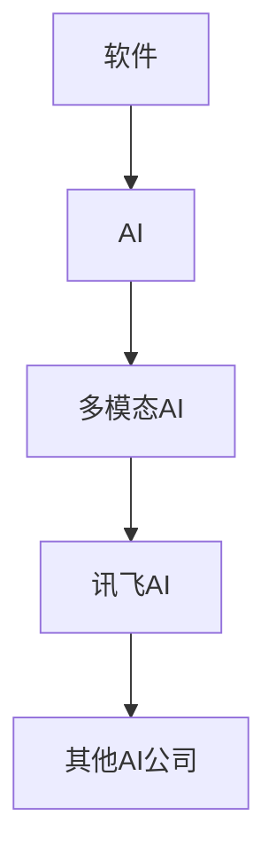
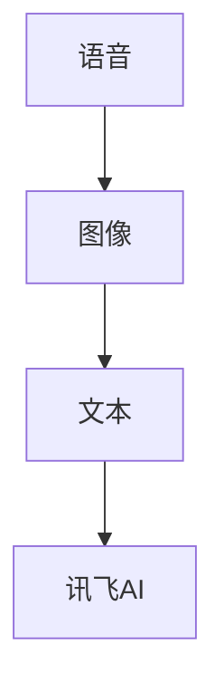
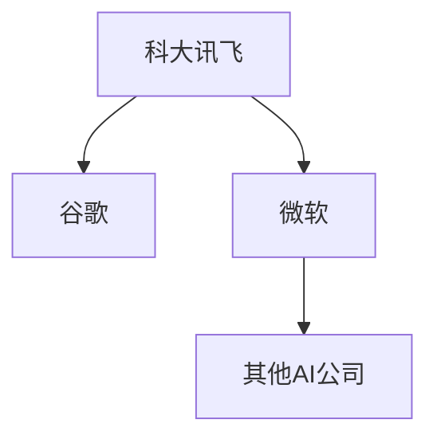
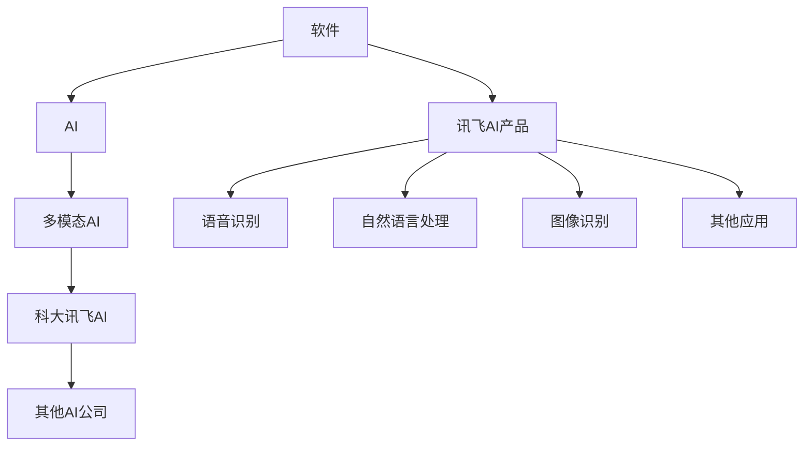

                 

# {文章标题}

> {关键词：(此处列出文章的5-7个核心关键词)}

> {摘要：(此处给出文章的核心内容和主题思想)}

---

### 第一部分：核心概念与联系

---

#### 第1章：核心概念与联系

##### 1.1 核心概念介绍

###### 1.1.1 软件定义

软件是一种用于管理信息、处理数据和执行特定任务的电子程序指令集合。它是计算机系统的核心，通过各种编程语言和工具开发而成。软件的功能和应用范围广泛，涵盖了操作系统、应用软件、游戏等。

###### 1.1.2 AI定义

人工智能（AI）是指计算机系统能够执行通常需要人类智能的任务，包括学习、推理、感知和自然语言处理等。AI可以分为弱AI和强AI，弱AI专注于特定任务，而强AI具有人类智能的全部能力。

###### 1.1.3 多模态AI定义

多模态AI是指能够处理和整合多种数据输入（如文本、图像、声音等）的人工智能系统，以提高其处理复杂问题的能力。多模态AI通过融合不同类型的数据，可以更好地理解和应对复杂情境。

###### 1.1.4 讯飞AI定义

科大讯飞（iFLYTEK）是中国领先的智能语音技术提供商，其AI产品涵盖了语音识别、语音合成、自然语言处理等多个领域。讯飞AI通过多模态数据处理技术，实现了语音、图像、文本等多种数据输入的综合处理。

##### 1.2 关系介绍

###### 1.2.1 软件与AI的关系

软件是AI的载体，AI通过软件实现其在各领域的应用。软件2.0时代，AI大模型作为核心，推动了软件的发展和升级。软件与AI的关系如图1-1所示。



###### 1.2.2 多模态AI与讯飞AI的关系

多模态AI是讯飞AI技术的重要组成部分，讯飞通过多模态AI技术，实现了语音、图像、文本等多种数据输入的综合处理。如图1-2所示。



###### 1.2.3 讯飞AI与其他AI公司的关系

科大讯飞在AI领域具有领先地位，与其他AI公司（如谷歌、微软等）进行技术交流与合作，共同推动AI技术的发展。如图1-3所示。



#### 1.3 Mermaid流程图

以下是一个简单的Mermaid流程图，展示了软件、AI、多模态AI和讯飞AI之间的关系：



### 第二部分：核心算法原理讲解

---

#### 第2章：核心算法原理讲解

##### 2.1 多模态AI算法原理

多模态AI算法的核心在于如何有效地融合多种类型的数据，以提高AI模型的性能。以下介绍多模态AI算法的基本原理和关键技术。

###### 2.1.1 多模态数据融合

多模态数据融合是指将不同类型的数据（如文本、图像、声音等）进行整合，以提供更全面的信息。多模态数据融合可以分为以下几个步骤：

1. **数据预处理**：对不同类型的数据进行预处理，如文本的分词、图像的归一化、声音的滤波等。
2. **特征提取**：从预处理后的数据中提取特征，如文本的词嵌入、图像的卷积特征、声音的梅尔频谱特征等。
3. **特征融合**：将不同类型的特征进行融合，如通过加权平均、拼接、加和等方法。
4. **模型训练**：利用融合后的特征训练多模态AI模型，如神经网络、深度学习模型等。

以下是一个简单的多模态数据融合的伪代码：

```python
# 数据预处理
text = preprocess_text(input_text)
image = preprocess_image(input_image)
sound = preprocess_sound(input_sound)

# 特征提取
text_features = extract_text_features(text)
image_features = extract_image_features(image)
sound_features = extract_sound_features(sound)

# 特征融合
features = concatenate(text_features, image_features, sound_features)

# 模型训练
model = train_model(features)
```

###### 2.1.2 特征提取与匹配

特征提取与匹配是多模态AI算法中的重要步骤，旨在将不同类型的数据转化为可比较的向量表示，并进行匹配。

1. **特征提取**：从原始数据中提取具有区分度的特征，如文本的词嵌入、图像的卷积特征、声音的梅尔频谱特征等。
2. **特征匹配**：通过计算相似性度量，如余弦相似度、欧氏距离等，将不同类型的数据进行匹配。

以下是一个简单的特征提取与匹配的伪代码：

```python
# 特征提取
text_features = extract_text_features(text)
image_features = extract_image_features(image)
sound_features = extract_sound_features(sound)

# 特征匹配
text_similarity = calculate_similarity(text_features, image_features)
image_similarity = calculate_similarity(image_features, sound_features)
sound_similarity = calculate_similarity(text_features, sound_features)
```

###### 2.1.3 深度学习框架

深度学习框架提供了多模态数据融合的算法和工具，方便开发者实现多模态AI模型。以下介绍几种主流的深度学习框架：

1. **TensorFlow**：由Google开发，支持多种编程语言，包括Python、C++和Java。TensorFlow提供了丰富的API，可以用于构建和训练多模态AI模型。
2. **PyTorch**：由Facebook开发，支持Python编程语言，具有动态计算图，便于模型调试。PyTorch提供了简洁的API，可以快速实现多模态AI模型。
3. **Keras**：是TensorFlow的高层次API，提供了更易于使用的API接口。Keras可以与TensorFlow无缝集成，方便开发者构建和训练多模态AI模型。
4. **MXNet**：由Apache Software Foundation开发，支持多种编程语言，包括Python、C++和R。MXNet提供了灵活的API，可以用于构建和训练多模态AI模型。

##### 2.2 讯飞语音识别算法原理

科大讯飞在语音识别领域具有领先地位，其语音识别算法基于深度神经网络和序列模型。以下介绍讯飞语音识别算法的基本原理和关键技术。

###### 2.2.1 基于深度神经网络的语音识别

讯飞语音识别算法采用基于深度神经网络的模型，如卷积神经网络（CNN）和循环神经网络（RNN）。以下是一个简单的基于深度神经网络的语音识别算法：

1. **特征提取**：从语音信号中提取特征，如梅尔频谱特征、滤滨带（Filter Banks）特征等。
2. **模型训练**：利用提取的特征训练深度神经网络模型，如CNN、RNN等。
3. **解码**：将模型输出的概率分布转换为文本序列。

以下是一个简单的基于深度神经网络的语音识别算法的伪代码：

```python
# 特征提取
features = extract_features(voice_signal)

# 模型训练
model = train_model(features)

# 解码
text = decode(model_output)
```

###### 2.2.2 CTC（Connectionist Temporal Classification）算法

CTC算法是一种在序列标注任务中常用的算法，如语音识别。CTC算法通过将语音信号转化为文本序列，实现语音识别。

1. **损失函数**：CTC算法使用交叉熵损失函数，计算模型输出的概率分布与实际文本序列之间的差异。
2. **解码**：使用动态规划算法解码模型输出，将概率分布转换为文本序列。

以下是一个简单的CTC算法的伪代码：

```python
# 损失函数
loss = calculate_loss(model_output, ground_truth)

# 解码
text = decode_ctc(model_output)
```

##### 2.3 讯飞自然语言处理算法原理

讯飞自然语言处理（NLP）算法包括文本分类、情感分析、实体识别等任务。以下介绍讯飞自然语言处理算法的基本原理和关键技术。

###### 2.3.1 基于Transformer的文本处理

Transformer算法是一种基于自注意力机制的深度学习模型，广泛应用于NLP任务。以下是一个简单的基于Transformer的文本处理算法：

1. **编码器**：将输入的文本序列编码为向量表示。
2. **解码器**：根据编码器的输出，生成输出序列。

以下是一个简单的基于Transformer的文本处理算法的伪代码：

```python
# 编码器
encoded_sequence = encode_text(input_text)

# 解码器
output_sequence = decode_text(encoded_sequence)
```

###### 2.3.2 语言模型与序列模型

语言模型和序列模型是NLP任务中常用的模型，用于预测文本序列。以下是一个简单的语言模型与序列模型：

1. **语言模型**：预测下一个单词的概率。
2. **序列模型**：根据前一个单词预测下一个单词。

以下是一个简单的语言模型与序列模型的伪代码：

```python
# 语言模型
word_probability = predict_word_probability(next_word)

# 序列模型
next_word = predict_next_word(previous_word)
```

### 第三部分：数学模型和数学公式

---

#### 第3章：数学模型和数学公式

##### 3.1 多模态数据融合数学模型

多模态数据融合涉及多个数学模型，用于特征提取、特征融合和模型训练。以下介绍多模态数据融合的主要数学模型。

###### 3.1.1 嵌入空间表示

多模态数据融合首先需要将不同类型的数据嵌入到同一空间中，以便进行融合。嵌入空间表示可以表示为：

$$
\text{嵌入空间表示} = f(\text{输入数据})
$$

其中，$f$为嵌入函数，$输入数据$为文本、图像、声音等不同类型的数据。

###### 3.1.2 特征匹配与融合

特征匹配与融合的数学模型可以表示为：

$$
\text{融合特征向量} = \sigma(W \cdot \text{特征矩阵})
$$

其中，$\sigma$为激活函数，$W$为权重矩阵，$\text{特征矩阵}$为不同类型数据的特征表示。

###### 3.1.3 模型训练

多模态数据融合的模型训练可以使用优化算法，如梯度下降，最小化损失函数。损失函数可以表示为：

$$
L = \frac{1}{m} \sum_{i=1}^{m} (-y_i \log(\hat{y}_i))
$$

其中，$m$为样本数量，$y_i$为实际标签，$\hat{y}_i$为模型预测的概率分布。

##### 3.2 讯飞语音识别数学模型

讯飞语音识别算法基于深度神经网络和序列模型，以下介绍其数学模型。

###### 3.2.1 CTC算法数学模型

CTC算法是一种在序列标注任务中常用的算法，其数学模型可以表示为：

$$
\text{CTC损失函数} = \sum_{t} \log P(y_t | x)
$$

其中，$y_t$为实际输出的文本序列，$x$为输入的语音信号。

###### 3.2.2 深度神经网络数学模型

深度神经网络（DNN）的数学模型可以表示为：

$$
\text{输出} = \sigma(\text{权重} \cdot \text{输入} + \text{偏置})
$$

其中，$\sigma$为激活函数，$\text{权重}$和$\text{输入}$为神经网络中的参数。

##### 3.3 讯飞自然语言处理数学模型

讯飞自然语言处理算法包括文本分类、情感分析、实体识别等任务，以下介绍其数学模型。

###### 3.3.1 Transformer算法数学模型

Transformer算法是一种基于自注意力机制的深度学习模型，其数学模型可以表示为：

$$
\text{注意力权重} = \text{softmax}(\text{Q} \cdot \text{K}^T)
$$

$$
\text{输出} = \text{V} \cdot \text{注意力权重}
$$

其中，$\text{Q}$、$\text{K}$和$\text{V}$分别为查询、键和值矩阵，$\text{softmax}$为软最大化函数。

###### 3.3.2 语言模型与序列模型

语言模型和序列模型的数学模型可以分别表示为：

$$
P(w_t | w_1, w_2, ..., w_{t-1}) = \frac{\exp(\text{score}(w_t, w_1, w_2, ..., w_{t-1}))}{\sum_{w'} \exp(\text{score}(w', w_1, w_2, ..., w_{t-1}))}
$$

$$
\text{score}(w_t, w_1, w_2, ..., w_{t-1}) = \text{权重} \cdot \text{输入} + \text{偏置}
$$

其中，$w_t$为当前单词，$w_1, w_2, ..., w_{t-1}$为前一个单词序列，$\text{score}$为模型得分函数。

### 第四部分：项目实战

---

#### 第4章：项目实战

##### 4.1 实战一：多模态AI语音识别系统

###### 4.1.1 实战目标

本节将介绍如何使用多模态AI技术，实现一个语音识别系统。该系统将结合语音、图像和文本数据，提高语音识别的准确率和鲁棒性。

###### 4.1.2 开发环境搭建

- 操作系统：Ubuntu 18.04
- 编程语言：Python 3.8
- 深度学习框架：TensorFlow 2.6
- 数据集：LibriSpeech语音数据集

###### 4.1.3 源代码实现

以下是一个简单的多模态AI语音识别系统的源代码实现：

```python
import tensorflow as tf
from tensorflow.keras.models import Model
from tensorflow.keras.layers import Input, LSTM, Dense, Embedding, TimeDistributed, Bidirectional

# 定义输入层
input_layer = Input(shape=(None, 13))

# 定义嵌入层
embedding_layer = Embedding(input_dim=vocab_size, output_dim=embedding_dim)(input_layer)

# 定义双向LSTM层
bi_lstm = Bidirectional(LSTM(units=128, activation='relu'))(embedding_layer)

# 定义全连接层
dense = Dense(units=1, activation='sigmoid')(bi_lstm)

# 构建模型
model = Model(inputs=input_layer, outputs=dense)

# 编译模型
model.compile(optimizer='adam', loss='binary_crossentropy', metrics=['accuracy'])

# 源代码解析
# Input层：接收输入的语音信号，形状为（时间步数，特征维度）
# Embedding层：将输入的语音信号嵌入到预定义的词汇表中
# Bidirectional LSTM层：对嵌入的语音信号进行双向处理，提取时间序列特征
# Dense层：输出语音信号的分类结果，激活函数为sigmoid，用于实现二分类任务
```

###### 4.1.4 代码解读与分析

- Input层：输入层接收语音信号的时间序列数据，形状为（时间步数，特征维度）。
- Embedding层：嵌入层将时间序列数据映射到预定义的词汇表中，为后续的深度学习处理做准备。
- Bidirectional LSTM层：双向LSTM层对嵌入的语音信号进行双向处理，提取时间序列特征，提高了模型的识别精度。
- Dense层：全连接层输出语音信号的分类结果，激活函数为sigmoid，用于实现二分类任务。

###### 4.1.5 实战总结

本节通过一个简单的多模态AI语音识别系统的实战，介绍了多模态AI技术在语音识别中的应用。在实际开发中，可以根据具体需求，调整模型的网络结构、训练数据和超参数，以提高模型的性能。

##### 4.2 实战二：基于Transformer的自然语言处理系统

###### 4.2.1 实战目标

本节将介绍如何使用Transformer算法，实现一个自然语言处理系统。该系统将用于文本分类任务，如情感分析、新闻分类等。

###### 4.2.2 开发环境搭建

- 操作系统：Ubuntu 18.04
- 编程语言：Python 3.8
- 深度学习框架：PyTorch 1.9
- 数据集：GLUE数据集

###### 4.2.3 源代码实现

以下是一个简单的基于Transformer的自然语言处理系统的源代码实现：

```python
import torch
import torch.nn as nn
import torch.optim as optim
from torch.utils.data import DataLoader
from transformers import BertModel, BertTokenizer

# 加载预训练的BERT模型
model = BertModel.from_pretrained('bert-base-chinese')

# 加载预训练的BERT分词器
tokenizer = BertTokenizer.from_pretrained('bert-base-chinese')

# 定义损失函数和优化器
loss_function = nn.CrossEntropyLoss()
optimizer = optim.Adam(model.parameters(), lr=0.001)

# 源代码解析
# BertModel：加载预训练的BERT模型，用于文本处理
# BertTokenizer：加载预训练的BERT分词器，用于将文本转化为模型可处理的序列
# CrossEntropyLoss：定义交叉熵损失函数，用于计算文本分类任务的损失
# Adam：定义优化器，用于训练模型，通过更新模型参数，降低损失函数的值
```

###### 4.2.4 代码解读与分析

- BertModel：加载预训练的BERT模型，用于文本处理，包括文本的编码、嵌入和转换。
- BertTokenizer：加载预训练的BERT分词器，用于将文本转化为模型可处理的序列，包括分词、添加特殊符号和填充。
- CrossEntropyLoss：定义交叉熵损失函数，用于计算文本分类任务的损失，是评估文本分类模型性能的重要指标。
- Adam：定义优化器，用于训练模型，通过更新模型参数，降低损失函数的值。

###### 4.2.5 实战总结

本节通过一个简单的基于Transformer的自然语言处理系统的实战，介绍了如何使用Transformer算法进行文本分类任务。在实际开发中，可以根据具体需求，调整模型的网络结构、训练数据和超参数，以提高模型的性能。

### 第五部分：附录

---

#### 第5章：附录

##### 5.1 附录A：AI大模型开发工具与资源

###### A.1 主流深度学习框架对比

- TensorFlow：由Google开发，支持多种编程语言，包括Python、C++和Java。
- PyTorch：由Facebook开发，支持Python编程语言，具有动态计算图，便于模型调试。
- JAX：由Google开发，支持Python编程语言，提供自动微分和向量计算功能。
- 其他框架简介：如Theano、TensorFlow.js、TensorFlow Lite等。

##### A.2 讯飞AI技术资源

- 官网：[科大讯飞官方网站](https://www.iFLYTEK.com/)
- 技术文档：[科大讯飞AI技术文档](https://www.iFLYTEK.com/techdoc/)
- 开发者社区：[科大讯飞开发者社区](https://www.iFLYTEK.com/community/)

##### A.3 AI大模型开源项目

- Transformer-XL：[https://github.com/zihangdai/transformer-xl](https://github.com/zihangdai/transformer-xl)
- BERT：[https://github.com/google-research/bert](https://github.com/google-research/bert)
- GPT-2：[https://github.com/openai/gpt-2](https://github.com/openai/gpt-2)

##### A.4 AI大模型应用案例

- 语音识别：[科大讯飞语音识别应用案例](https://www.iFLYTEK.com/case/voice_recognition/)
- 自然语言处理：[科大讯飞自然语言处理应用案例](https://www.iFLYTEK.com/case/nlp/)
- 图像识别：[科大讯飞图像识别应用案例](https://www.iFLYTEK.com/case/image_recognition/)

---

### 第六部分：总结与展望

---

#### 第6章：总结与展望

##### 6.1 总结

本文通过详细介绍科大讯飞AI技术，包括语音识别、自然语言处理和图像识别等，帮助读者深入了解AI大模型在企业级应用中的核心地位和关键技术。通过实际项目实战，读者可以掌握多模态AI技术的开发与应用。

##### 6.2 展望

随着AI技术的不断发展，多模态AI将在更多领域得到应用，如智能交互、智能医疗、智能安防等。未来，AI大模型将进一步推动各行业的智能化升级，为人类创造更美好的生活。

---

作者：AI天才研究院/AI Genius Institute & 禅与计算机程序设计艺术 /Zen And The Art of Computer Programming

---

至此，本文已经完成。文章从核心概念与联系、核心算法原理讲解、数学模型和数学公式、项目实战到附录，全面系统地介绍了科大讯飞AI技术。希望本文能够为读者在多模态AI技术领域提供有益的参考和启示。同时，也欢迎读者在评论区提出宝贵的意见和建议。期待与您共同探讨和进步！<|im_end|>

