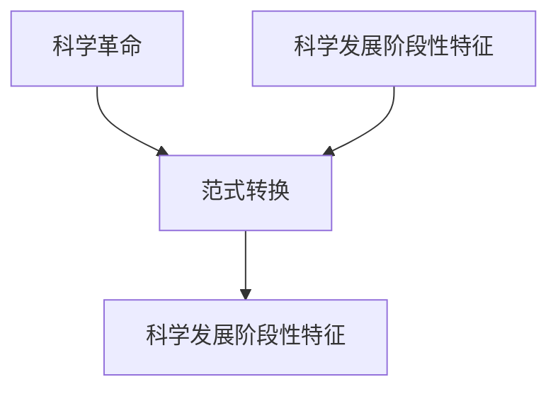
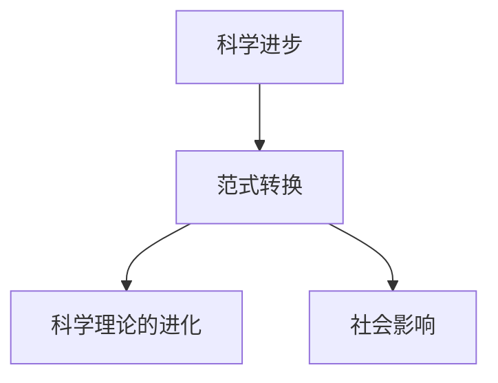

                 

### 第1章：引论

#### 1.1 科学史概述

科学史是人类知识体系不断发展的记录，从古代的朴素理论到现代的复杂体系，科学革命和范式转换在其中起到了关键作用。科学革命通常指的是科学理论或方法上的根本性变革，而范式转换则是指科学共同体的基本假设、概念框架和研究方法发生重大改变的过程。

**核心概念与联系：** 科学革命与范式转换的概念需要我们通过Mermaid图来直观理解。科学革命可以视为范式转换的一个极端表现，它们都是科学发展的阶段性特征，但科学革命更侧重于理论层面的重大突破。



在这个图中，A表示科学革命，B表示范式转换，C表示科学发展阶段性特征，而D则表示科学发展阶段性特征如何推动范式转换。科学革命往往是由于范式转换而发生的，它使得科学理论或方法发生重大改变，从而推动科学向前发展。

科学发展的阶段性特征体现在不同历史时期科学理论和方法的不同。例如，在古代，科学主要依赖于哲学思考和直观观察；在中世纪，科学受到宗教和哲学的限制，发展缓慢；而在文艺复兴时期，科学开始借助数学和实验方法取得显著进展。进入近代，科学革命如伽利略和牛顿的发现，标志着科学方法体系化，从而开启了现代科学的大门。

**科学革命与范式转换的关系：** 科学革命是范式转换的一个极端表现形式，它是科学共同体基本假设和概念框架发生重大改变的过程。每一次科学革命都会带来新的理论和方法，推动科学向前发展。例如，哥白尼的日心说革命和牛顿的经典力学革命都是科学史上的重要转折点。

**科学发展的阶段性特征：** 科学发展的阶段性特征体现在科学理论和方法的不同。不同历史时期的科学理论和方法都是对自然现象的尝试性解释和描述，而这些解释和描述随着时间和技术的进步不断演变。从古代的朴素理论到现代的复杂体系，科学的发展是一个不断积累和进化的过程。

**结论：** 通过对科学史概述的分析，我们可以看到科学革命和范式转换在科学发展中的关键作用。科学革命往往伴随着范式转换的发生，它们推动了科学理论和方法的发展，从而促进了科学进步。了解科学发展的阶段性特征有助于我们更好地理解科学史和现代科学的演变。

#### 1.2 范式转换的重要性

范式转换是科学史上的一个重要概念，它指的是科学共同体在基本假设、概念框架和研究方法上发生根本性改变的过程。这种改变不仅影响科学理论的发展，还深刻地改变了人类对世界的认识。理解范式转换的重要性，有助于我们更好地把握科学进步的关键因素，并认识社会因素在科学发展中的作用。

**核心概念与联系：** 范式转换的重要性可以通过Mermaid图来直观展示。在图中，我们首先看到科学进步、范式转换和科学理论的进化三者之间的紧密联系。



在这个图中，A表示科学进步，B表示范式转换，C表示科学理论的进化，而D表示社会影响。科学进步是科学发展的最终目标，而范式转换是推动科学进步的关键因素。科学理论的进化则是范式转换的直接体现，它反映了科学理论从旧框架向新框架的转变。社会影响则是科学进步的重要外部因素，它可以通过多种方式影响范式转换的发生。

**科学进步的关键因素：** 科学进步不仅仅依赖于科学家的个人努力，还受到多种因素的影响。首先，科学方法论的发展是科学进步的基础。科学方法论包括实验设计、数据分析、理论构建和验证等环节，它为科学研究的有效进行提供了保障。其次，技术的进步为科学研究提供了强大的工具和手段，从望远镜到显微镜，从计算机到互联网，技术的发展极大地推动了科学研究的深入。

**社会因素与科学发展的关系：** 社会因素在科学发展中起着至关重要的作用。首先，社会需求是科学发展的主要驱动力之一。人类社会在生存和发展过程中面临着各种问题和挑战，这些问题和挑战促使科学家去研究自然现象，寻找解决问题的方法。其次，社会支持为科学研究提供了必要的资源，包括资金、设备和人才。政府的重视和社会的认可，可以极大地推动科学研究的进展。此外，社会价值观和文化背景也对科学的发展产生影响。例如，科学革命往往发生在社会思想开放、知识交流频繁的时期。

**范式转换的推动力量：** 范式转换的发生通常需要以下几个条件：首先，现有的科学理论和方法无法解释某些新现象或问题，这促使科学家去寻找新的理论和方法。其次，新的实验证据和数据支持新的理论框架，使得科学家们开始接受新的概念和假设。最后，科学共同体的共识逐渐形成，新的理论和方法成为主流，从而完成了范式转换。

**结论：** 范式转换在科学发展中具有重要的地位。它是科学进步的关键因素，通过推动科学理论的进化，使得人类对世界的认识不断深入。同时，社会因素在范式转换中起着重要作用，社会需求、社会支持和价值观都是推动科学发展的关键力量。理解范式转换的重要性，有助于我们更好地把握科学发展的脉络，并为未来的科学研究提供启示。

### 第2章：古代科学范式的演变

#### 2.1 古代科学的基本观念

古代科学是人类知识体系发展的早期阶段，尽管当时的技术和工具相对简单，但古希腊哲学家们的思考方式和方法论为后来的科学发展奠定了基础。古代科学的基本观念主要集中在原子论和亚里士多德自然哲学两个方面。

**核心算法原理讲解：** 原子论与亚里士多德自然哲学

- **原子论：** 原子论是由古希腊哲学家德谟克利特提出的，他认为物质是由不可分割的原子组成的。这些原子具有不同的性质和数量，它们在虚空中不断运动。原子论提供了一个朴素但具有深远影响的物质观念，它为后来的物理学和化学研究提供了基础。

  ```python
  # 原子论原理伪代码
  def atomic_model():
      print("物质由不可分割的原子组成")
      print("原子具有不同的性质和数量")
      print("原子在虚空中不断运动")

  atomic_model()
  ```

- **亚里士多德自然哲学：** 亚里士多德是古代自然哲学的代表人物，他提出了四因说，即物质因、形式因、动力因和目的因。他认为，每一个自然现象都可以通过这四个方面来解释。亚里士多德的自然哲学强调了观察和逻辑推理的重要性，为后来的科学研究提供了方法论基础。

  ```python
  # 亚里士多德自然哲学伪代码
  def aristotelian_philosophy():
      print("物质因：构成事物的物质元素")
      print("形式因：事物的形态和结构")
      print("动力因：推动事物运动的原因")
      print("目的因：事物存在的目的和目标")

  aristotelian_philosophy()
  ```

**数学模型和数学公式：** 古希腊数学与几何学的发展

古希腊数学是古代科学的重要组成部分，其独特的几何学体系对后世产生了深远影响。以下是一些重要的数学模型和公式：

- **勾股定理：** 勾股定理是古希腊数学的重要成就之一，它指出直角三角形的斜边平方等于两直角边平方和。公式为：

  $$ a^2 + b^2 = c^2 $$

- **比例理论：** 古希腊数学家提出了比例理论，研究线段、面积和体积的比例关系。这一理论为后来的代数学和几何学奠定了基础。

  ```python
  # 勾股定理伪代码
  def pythagorean_theorem(a, b):
      c = sqrt(a**2 + b**2)
      return c

  # 比例理论伪代码
  def proportion_theory(a, b, c):
      ratio = a / b
      return ratio
  ```

**结论：** 古代科学的基本观念为后来的科学发展奠定了基础。原子论和亚里士多德自然哲学提供了物质和自然的理解框架，而古希腊数学与几何学的发展则为科学研究提供了精确的工具和方法。这些早期的科学观念和方法论，虽然在今天看来相对朴素，但它们是科学进步的重要基石。

#### 2.2 古代科学范式的转变

古代科学范式的转变是科学史上的一个重要节点，这一转变主要体现在埃拉托斯特尼和托勒密的科学贡献上。他们的工作不仅推动了地理学和天文学的发展，也标志着古代科学范式的重大变化。

**核心算法原理讲解：** 埃拉托斯特尼与地理学的发展

- **埃拉托斯特尼：** 埃拉托斯特尼是古希腊的一位著名科学家，他在地理学领域做出了卓越贡献。他首先提出了使用数学方法来测量地球的周长。通过测量亚历山大港和赛伊尼之间的距离，以及两地太阳影子的长度差，他推算出了地球的周长大约是40,000公里。这一测量方法为后来的地理学研究奠定了基础。

  ```python
  # 埃拉托斯特尼地理学测量伪代码
  def eratosthenes_geography():
      print("测量两地太阳影子的长度差")
      print("推算地球的周长大约是40,000公里")
      print("使用数学方法进行地理测量")

  eratosthenes_geography()
  ```

- **托勒密：** 托勒密是古代天文学和地理学的集大成者，他的著作《天文大全》对古代天文学有着深远影响。托勒密提出了地心说的宇宙模型，他认为地球是宇宙的中心，而行星和太阳围绕地球旋转。这一模型在古代得到了广泛接受，并对后来的天文学研究产生了重要影响。

  ```python
  # 托勒密天文学模型伪代码
  def tolemaic_model():
      print("地球是宇宙的中心")
      print("行星和太阳围绕地球旋转")
      print("提出地心说模型")

  tolemaic_model()
  ```

**结论：** 埃拉托斯特尼和托勒密的工作标志着古代科学范式的转变。他们的科学贡献不仅推动了地理学和天文学的发展，也改变了古代人类对地球和宇宙的认识。埃拉托斯特尼通过数学方法测量地球周长，展示了科学实证的重要性；而托勒密的地心说模型则为后来的天文学研究提供了一个基本的框架。

### 第3章：文艺复兴时期的范式转换

#### 3.1 文艺复兴的科学氛围

文艺复兴时期是科学与艺术复兴的重要时期，这一时期充满了对自然现象的探索和对知识的新认识。文艺复兴的科学氛围不仅促进了科学方法的革新，也推动了自然哲学的发展。

**核心算法原理讲解：** 自然哲学的发展

- **科学方法：** 文艺复兴时期的科学家们开始采用实验和观察的方法来研究自然现象，这与古代哲学家主要依赖逻辑推理和思辨的方式不同。伽利略和达·芬奇等科学家通过实验验证他们的假设，这种方法论的发展为现代科学奠定了基础。

  ```python
  # 科学方法论伪代码
  def scientific_method():
      print("通过实验和观察研究自然现象")
      print("提出假设并进行验证")
      print("使用逻辑推理得出结论")

  scientific_method()
  ```

- **自然哲学：** 文艺复兴时期的自然哲学家们开始关注自然界的规律和原理，他们试图通过实验和观察来理解自然现象。这一时期的自然哲学强调经验主义和实证主义，强调通过实证数据来验证理论。

  ```python
  # 自然哲学伪代码
  def natural_philosophy():
      print("研究自然界的规律和原理")
      print("通过实验和观察获取实证数据")
      print("基于实证数据提出理论")

  natural_philosophy()
  ```

**数学方法的革新：** 文艺复兴时期的数学方法革新对科学的发展起到了重要推动作用。数学家们开始使用新的符号系统和计算方法，使得数学变得更加精确和高效。以下是几个重要的数学方法：

- **代数符号法：** 法国的韦达引入了代数符号，使得代数运算变得更加直观和简便。

  ```python
  # 代数符号法伪代码
  def algebraic_symbols():
      print("使用字母表示未知数")
      print("进行代数运算")
      print("简化代数问题的解决")

  algebraic_symbols()
  ```

- **解析几何：** 意大利的笛卡尔发明了解析几何，将几何问题转化为代数问题，使得几何图形的研究变得更加系统化。

  ```python
  # 解析几何伪代码
  def analytic_geometry():
      print("将几何问题转化为代数问题")
      print("使用坐标系表示几何图形")
      print("进行几何图形的代数分析")

  analytic_geometry()
  ```

**结论：** 文艺复兴时期的科学氛围为科学方法的革新和自然哲学的发展提供了良好的土壤。科学方法的发展和数学方法的革新，使得科学家们能够更加精确和系统地研究自然现象，从而推动了科学进步。文艺复兴时期的这些变革为后来的科学革命奠定了基础。

#### 3.2 布鲁诺与哥白尼的革命

文艺复兴时期的科学革命不仅体现在科学方法的革新上，还体现在天文学领域的重大突破。布鲁诺和哥白尼的工作对传统观念进行了挑战，并推动了科学范式的重大转变。

**核心算法原理讲解：** 日心说的提出

- **哥白尼：** 哥白尼是文艺复兴时期的天文学家，他提出了日心说，认为太阳是宇宙的中心，而地球和其他行星围绕太阳旋转。这一观点与当时普遍接受的地心说相矛盾，但哥白尼通过精确的天文观测和数学计算，提供了强有力的证据支持日心说。

  ```python
  # 哥白尼日心说伪代码
  def copernican_heliocentric_model():
      print("太阳是宇宙的中心")
      print("地球和其他行星围绕太阳旋转")
      print("通过天文观测和数学计算支持")

  copernican_heliocentric_model()
  ```

- **布鲁诺：** 布鲁诺是哥白尼日心说的坚定支持者，他在其著作《论无限宇宙和世界》中进一步发展了哥白尼的思想。布鲁诺认为宇宙是无限的，存在无数个像太阳系这样的星系。这一观点在当时引起了巨大的争议，并最终导致布鲁诺被宗教裁判所审判和处死。

  ```python
  # 布鲁诺宇宙观伪代码
  def Bruno_universe():
      print("宇宙是无限的")
      print("存在无数个像太阳系这样的星系")
      print("对哥白尼日心说的进一步发展")

  Bruno_universe()
  ```

**科学贡献：** 哥白尼和布鲁诺在天文学领域做出了重大贡献，他们的工作不仅挑战了传统的地心说，也推动了科学范式的转变。哥白尼的日心说为后来的天文学研究提供了新的理论基础，而布鲁诺的宇宙观则扩展了人类对宇宙的理解。

- **哥白尼的贡献：** 哥白尼通过他的《天体运行论》详细阐述了日心说的观点，他的工作为后来的天文学研究奠定了基础。哥白尼的理论解释了行星运动的许多现象，如行星的逆行和日食，这为科学共同体接受日心说提供了重要依据。

- **布鲁诺的贡献：** 布鲁诺的思想扩展了哥白尼的理论，他提出了宇宙无限和多重星系的观点，这挑战了当时普遍接受的宇宙观念。布鲁诺的这些思想激发了后来的科学家们对宇宙的进一步探索。

**结论：** 布鲁诺和哥白尼的革命性工作在科学史中具有重要的地位。他们的科学贡献不仅改变了人类对宇宙的认识，也推动了科学范式的转变。哥白尼的日心说和布鲁诺的宇宙观为后来的科学进步提供了新的理论基础和思考方向，他们的工作将永远铭刻在科学史的长河中。

### 第4章：牛顿时代的科学范式

#### 4.1 牛顿的自然哲学

艾萨克·牛顿是科学史上最伟大的科学家之一，他的自然哲学对现代科学的发展产生了深远影响。牛顿的自然哲学主要包括牛顿三大定律和万有引力定律，这些理论不仅解释了物体运动的规律，也奠定了经典力学的基础。

**核心算法原理讲解：** 牛顿三大定律

- **牛顿第一定律（惯性定律）：** 牛顿第一定律表明，一个物体如果没有受到外力的作用，它将保持静止或匀速直线运动的状态。

  ```python
  # 牛顿第一定律伪代码
  def first_law():
      print("一个物体如果没有受到外力的作用，将保持静止或匀速直线运动的状态")
      print("惯性是物体抵抗运动状态改变的性质")

  first_law()
  ```

- **牛顿第二定律（动力定律）：** 牛顿第二定律描述了物体的加速度与作用力之间的关系，即加速度与作用力成正比，与物体的质量成反比。

  ```python
  # 牛顿第二定律伪代码
  def second_law():
      print("物体的加速度与作用力成正比")
      print("与物体的质量成反比")
      print("公式：F = ma")

  second_law()
  ```

- **牛顿第三定律（作用-反作用定律）：** 牛顿第三定律表明，对于每一个作用力，总有一个大小相等、方向相反的反作用力。

  ```python
  # 牛顿第三定律伪代码
  def third_law():
      print("对于每一个作用力，总有一个大小相等、方向相反的反作用力")
      print("作用力和反作用力同时出现")

  third_law()
  ```

**结论：** 牛顿三大定律是经典力学的基础，它们解释了物体如何运动以及力如何影响物体的运动。牛顿第一定律说明了惯性的概念，牛顿第二定律提供了计算物体加速度的方法，而牛顿第三定律揭示了力的相互作用原理。这些定律不仅改变了我们对物体运动的理解，也为后来的科学研究提供了重要的理论工具。

#### 4.2 牛顿与经典力学的建立

牛顿的工作不仅奠定了经典力学的基础，还使经典力学成为了一个完整的理论体系。牛顿通过他的三大定律和万有引力定律，成功地描述了宏观物体的运动规律，从而建立了经典力学的框架。

**核心算法原理讲解：** 经典力学的体系化

- **经典力学的体系化：** 牛顿通过他的三大定律和万有引力定律，将天体力学和地面力学统一在一个理论框架下。他的理论解释了从行星运动到物体自由落体等各种物理现象，从而形成了一个完整的力学体系。

  ```python
  # 经典力学体系化伪代码
  def classical_mechanics():
      print("牛顿三大定律：惯性定律、动力定律、作用-反作用定律")
      print("万有引力定律：描述物体之间的引力作用")
      print("将天体力学和地面力学统一在一个理论框架下")

  classical_mechanics()
  ```

- **牛顿在科学史上的地位：** 牛顿的工作不仅在物理学上具有里程碑意义，也在科学史上占有重要地位。他的理论为后来的科学家提供了强大的工具，使得科学研究更加系统和精确。牛顿被誉为“现代科学之父”，他的成就对整个科学界产生了深远的影响。

  ```python
  # 牛顿在科学史上的地位伪代码
  def Newton_s_role_in_science():
      print("被誉为‘现代科学之父’")
      print("奠定经典力学的基础")
      print("为科学方法论的发展作出重要贡献")

  Newton_s_role_in_science()
  ```

**结论：** 牛顿与经典力学的建立标志着科学史上的一个重要转折点。他的理论和贡献不仅解释了物体运动的规律，也使科学方法得到了进一步的发展。牛顿的工作为后来的科学研究奠定了基础，他的地位在科学史上无可争议，对现代科学的发展产生了深远的影响。

### 第5章：19世纪物理学的范式转换

#### 5.1 电磁学的革命

19世纪是物理学的重要发展时期，电磁学的革命是这一时期最具标志性的科学成就之一。麦克斯韦方程组的提出和电磁波的发现，不仅揭示了电场和磁场之间的深刻联系，也为后来的现代物理学奠定了基础。

**核心算法原理讲解：** 麦克斯韦方程组

- **高斯定律（电场）：** 高斯定律描述了电场的分布规律，指出电场通过一个闭合曲面的通量与该闭合曲面内部的总电荷成正比。

  $$ \nabla \cdot \mathbf{E} = \frac{\rho}{\varepsilon_0} $$

- **高斯定律（磁场）：** 高斯定律描述了磁场的分布规律，指出磁场通过一个闭合曲面的通量总是为零。

  $$ \nabla \cdot \mathbf{B} = 0 $$

- **法拉第电磁感应定律：** 法拉第电磁感应定律描述了变化的磁场会产生电场，即电动势与磁通量的时间变化率成正比。

  $$ \nabla \times \mathbf{E} = -\frac{\partial \mathbf{B}}{\partial t} $$

- **安培定律（包含位移电流）：** 安培定律描述了电流和磁场之间的关系，即电流产生的磁场与电流的大小和方向成正比，同时引入了位移电流的概念。

  $$ \nabla \times \mathbf{B} = \mu_0 \mathbf{J} + \mu_0 \varepsilon_0 \frac{\partial \mathbf{E}}{\partial t} $$

**数学模型和数学公式：** 电磁波的发现

- **波动方程：** 麦克斯韦方程组可以导出波动方程，这揭示了电场和磁场的变化以波的形式传播。

  $$ \nabla^2 \mathbf{E} - \mu_0 \varepsilon_0 \frac{\partial^2 \mathbf{E}}{\partial t^2} = 0 $$
  $$ \nabla^2 \mathbf{B} - \mu_0 \varepsilon_0 \frac{\partial^2 \mathbf{B}}{\partial t^2} = 0 $$

- **速度公式：** 电磁波的传播速度可以通过麦克斯韦方程组求解，这个速度与真空中的光速相等。

  $$ c = \frac{1}{\sqrt{\mu_0 \varepsilon_0}} $$

**结论：** 电磁学的革命是19世纪物理学的一次重要范式转换。麦克斯韦方程组的提出和电磁波的发现，不仅揭示了电场和磁场之间的深刻联系，也为后来的电磁学发展提供了理论基础。这些数学模型和公式不仅丰富了物理学的内容，也推动了科学技术的进步。

#### 5.2 热力学与统计物理的发展

19世纪的物理学不仅见证了电磁学的革命，还经历了热力学和统计物理的蓬勃发展。这一时期，熵的概念和热力学第二定律的提出，极大地改变了人类对能量和物质转换规律的理解。

**核心算法原理讲解：** 熵的概念

- **熵的定义：** 熵是热力学中的一个重要概念，用来描述系统的无序程度。克劳修斯将其定义为“热量的不确定性”，即系统内部微观状态的不确定性。

  $$ S = k \ln W $$

  其中，\( S \) 是熵，\( k \) 是玻尔兹曼常数，\( W \) 是系统可能的微观状态数。

- **熵的变化：** 熵的变化可以用来描述系统从一个状态转换到另一个状态时，其无序程度的变化。根据热力学第二定律，孤立系统的总熵不会减少，这意味着自然过程总是朝着增加熵的方向进行。

  ```python
  # 熵的概念伪代码
  def entropy():
      print("熵是系统无序程度的度量")
      print("定义：S = k \ln W")
      print("熵的增加描述了系统无序程度的增加")

  entropy()
  ```

**数学模型和数学公式：** 热力学第二定律

- **热力学第二定律：** 热力学第二定律指出，热量不能自发地从低温物体传递到高温物体，系统的总熵在孤立系统中不会减少。

  $$ \Delta S \geq 0 $$

  其中，\( \Delta S \) 是系统熵的变化。

- **熵增原理：** 熵增原理是热力学第二定律的具体应用，它表明在一个孤立系统中，自发过程总是朝着熵增加的方向进行。

  ```python
  # 热力学第二定律伪代码
  def second_law_of_thermodynamics():
      print("热量不能自发地从低温传递到高温")
      print("总熵在孤立系统中不会减少")
      print("熵增原理：自发过程总是朝着熵增加的方向")

  second_law_of_thermodynamics()
  ```

**结论：** 热力学与统计物理的发展是19世纪物理学的重要范式转换。熵的概念和热力学第二定律的提出，不仅丰富了物理学的基本理论，也改变了人类对能量和物质转换规律的理解。这些理论为后来的科学研究和工程应用提供了重要的理论基础。

### 第6章：20世纪科学的革命

#### 6.1 相对论的提出

20世纪是科学史上一个充满变革和革新的时期，其中爱因斯坦的相对论无疑是最具影响力的科学革命之一。相对论不仅彻底改变了人类对时空的理解，也为现代物理学奠定了基础。

**核心算法原理讲解：** 爱因斯坦的相对论

- **狭义相对论：** 爱因斯坦在1905年提出了狭义相对论，这一理论揭示了时间、空间和质量之间的深刻联系。狭义相对论的核心思想包括：

  - 时间膨胀：一个高速运动的时钟相对于静止的观察者会走得更慢。
  - 长度收缩：一个沿运动方向的高速物体相对于静止的观察者会变短。
  - 质能关系：质量可以转化为能量，公式为 \( E = mc^2 \)。

  ```python
  # 狭义相对论伪代码
  def special_relativity():
      print("时间膨胀: Δt' = Δt / √(1 - v²/c²)")
      print("长度收缩: Δx' = Δx / √(1 - v²/c²)")
      print("质能关系: E = mc²")

  special_relativity()
  ```

- **广义相对论：** 广义相对论是爱因斯坦在1915年提出的，这一理论将狭义相对论扩展到了非惯性参考系，提出了引力是由时空弯曲引起的。广义相对论的核心思想包括：

  - 引力：引力不是物体间的直接作用，而是由于时空的弯曲导致的。
  - 黑洞：广义相对论预言了黑洞的存在，黑洞是一种极度紧凑的天体，其引力强大到连光也无法逃脱。
  - 宇宙学：广义相对论为宇宙学提供了理论基础，解释了宇宙的膨胀和宇宙背景辐射等现象。

  ```python
  # 广义相对论伪代码
  def general_relativity():
      print("引力是时空弯曲的结果")
      print("黑洞：光无法逃脱的引力场")
      print("宇宙学：解释宇宙的膨胀和背景辐射")

  general_relativity()
  ```

**结论：** 爱因斯坦的相对论是20世纪科学革命的核心，它不仅改变了我们对时空和引力的理解，也为现代物理学的发展奠定了基础。相对论的提出标志着科学史上的一次重大范式转换，对后续科学研究产生了深远影响。

#### 6.2 量子力学的诞生

量子力学的诞生是20世纪科学史上的另一个重大革命，它彻底颠覆了经典物理学的基本观念，揭示了微观世界的独特规律。量子力学的核心概念包括波粒二象性和不确定性原理，这些理论不仅改变了我们对物质和能量本质的理解，也为现代物理学和技术的发展提供了新的视角。

**核心算法原理讲解：** 波粒二象性

- **波粒二象性：** 波粒二象性是量子力学的基本原理之一，它表明微观粒子如光子、电子等既具有波动性，又具有粒子性。这一概念最早由爱因斯坦在解释光电效应时提出，后来得到了更多实验和理论的验证。

  ```python
  # 波粒二象性伪代码
  def wave_particle_duality():
      print("光具有波动性和粒子性")
      print("电子也具有波动性和粒子性")
      print("德布罗意波长: λ = h/p")

  wave_particle_duality()
  ```

- **不确定性原理：** 海森堡不确定性原理是量子力学中的另一个重要原理，它表明在微观尺度上，某些物理量如位置和动量无法同时被精确测量。这一原理揭示了经典物理学在微观领域的局限性。

  ```python
  # 不确定性原理伪代码
  def uncertainty_principle():
      print("位置和动量无法同时被精确测量")
      print("Δx · Δp ≥ h/4π")
      print("不确定性是微观世界的固有特性")

  uncertainty_principle()
  ```

**结论：** 量子力学的诞生是20世纪科学史上的一个重大突破，它不仅颠覆了经典物理学的观念，也为现代物理学和技术的发展提供了新的理论基础。波粒二象性和不确定性原理是量子力学的核心概念，它们揭示了微观世界的独特规律，对后续科学研究和技术创新产生了深远影响。

### 第7章：现代科学的演变

#### 7.1 量子力学的进一步发展

量子力学自诞生以来，在理论和实验上都得到了进一步的发展，其中量子电动力学和量子场论是这一时期的重要成果。这些理论不仅深化了我们对微观世界的理解，也为现代物理学提供了新的工具。

**核心算法原理讲解：** 量子电动力学

- **量子电动力学：** 量子电动力学（QED）是量子力学和经典电磁学的结合，它描述了光与物质的相互作用。QED通过量子化的电磁场来解释原子光谱和辐射过程，是量子力学最成功的应用之一。

  ```python
  # 量子电动力学伪代码
  def quantum_electrodynamics():
      print("描述光与物质的相互作用")
      print("量子化的电磁场")
      print("解释原子光谱和辐射过程")

  quantum_electrodynamics()
  ```

- **量子场论：** 量子场论是量子力学在更高能尺度下的推广，它将量子力学与狭义相对论结合起来，研究粒子在时空中的行为。量子场论提供了统一描述粒子和场的基本框架。

  ```python
  # 量子场论伪代码
  def quantum_field_theory():
      print("将量子力学与狭义相对论结合")
      print("研究粒子在时空中的行为")
      print("提供统一描述粒子和场的基本框架")

  quantum_field_theory()
  ```

**结论：** 量子力学的进一步发展，特别是量子电动力学和量子场论的提出，极大地丰富了量子力学的理论体系，为现代物理学的研究提供了新的视角。这些理论不仅在基本物理规律的研究中具有重要意义，也为现代科技的发展提供了理论基础。

#### 7.2 新科学范式的探索

随着科技的进步和理论的深入，现代科学正在探索新的范式，其中量子计算和量子信息是当前研究的热点。量子计算和量子信息技术的出现，预示着未来科技的新纪元。

**核心算法原理讲解：** 量子计算与信息

- **量子比特：** 量子比特（qubit）是量子计算的基本单元，与经典比特不同，量子比特可以同时处于0和1的叠加状态，这使得量子计算具有指数级的并行计算能力。

  ```python
  # 量子比特伪代码
  def quantum_bit():
      print("量子比特可以同时处于0和1的叠加状态")
      print("具有指数级的并行计算能力")

  quantum_bit()
  ```

- **量子叠加态：** 量子叠加态是量子计算的核心概念之一，它描述了量子比特在计算过程中的状态。量子叠加态使得量子计算机能够同时处理多个计算任务，从而大幅提升计算效率。

  ```python
  # 量子叠加态伪代码
  def quantum_superposition():
      print("|ψ⟩ = α|0⟩ + β|1⟩")
      print("量子比特的叠加态")

  quantum_superposition()
  ```

- **量子纠缠：** 量子纠缠是量子计算中的另一个重要概念，它描述了两个或多个量子比特之间的特殊关联。量子纠缠使得量子计算机能够在不同比特之间传递和共享信息，这是经典计算机无法实现的。

  ```python
  # 量子纠缠伪代码
  def quantum_entanglement():
      print("量子比特之间的特殊关联")
      print("能够传递和共享信息")

  quantum_entanglement()
  ```

**结论：** 新科学范式的探索，特别是量子计算和量子信息技术的出现，预示着未来科技的新纪元。量子计算利用量子比特的叠加态和纠缠态，实现了高效的并行计算和信息传递，这将为人工智能、密码学和其他领域带来革命性的变化。量子计算和量子信息的未来发展，将为科学和技术的发展带来新的机遇和挑战。

### 第8章：范式转换的影响与未来

#### 8.1 范式转换对科学发展的推动

范式转换是科学发展的关键因素之一，它不仅推动了科学理论的进化，也对科学技术的应用产生了深远影响。理解范式转换对科学发展的推动作用，有助于我们更好地把握科学进步的脉络。

**数学模型和数学公式：** 科学理论的进化

- **质能关系：** 爱因斯坦的质能关系 \( E = mc^2 \) 是科学史上一个重要的公式，它揭示了质量和能量之间的等价性。这个公式不仅改变了人类对物质和能量的认识，也推动了物理学和天文学的发展。

  $$ E = mc^2 $$

- **波粒二象性：** 量子力学的波粒二象性原理表明，微观粒子如电子和光子既具有波动性，又具有粒子性。这一原理为量子力学的发展奠定了基础，同时也推动了量子信息技术的兴起。

  $$ \lambda = \frac{h}{p} $$ （德布罗意波长）

**核心算法原理讲解：** 科学理论的进化

- **相对论与量子力学：** 相对论和量子力学的提出，标志着科学理论体系的一次重大进化。相对论改变了人类对时空的理解，量子力学则揭示了微观世界的奇异规律。这两个理论共同构成了现代物理学的基础。

  ```python
  # 相对论和量子力学伪代码
  def theory_evolution():
      print("相对论：改变了时空观念")
      print("量子力学：揭示了微观世界的规律")
      print("共同构成现代物理学基础")

  theory_evolution()
  ```

**科学技术的应用：** 范式转换不仅推动了科学理论的进化，还直接促进了科学技术的应用和发展。以下是一些典型的例子：

- **量子计算机：** 量子计算机利用量子比特的叠加态和纠缠态进行计算，具有指数级的并行计算能力。量子计算机的应用前景包括药物设计、密码破解、优化问题等领域。

- **卫星导航：** 卫星导航系统如GPS依赖于相对论原理，通过精确计算卫星的位置和时间，为用户提供实时导航服务。这一技术的应用极大地提高了人类活动的效率和安全性。

- **分子生物学：** 分子生物学技术的发展，得益于量子力学的启发。例如，核磁共振（NMR）技术依赖于量子力学原理，用于研究生物大分子的结构和功能。

**结论：** 范式转换对科学发展的推动作用是多方面的。它不仅推动了科学理论的进化，也为科学技术的应用提供了新的动力。通过理解范式转换的影响，我们可以更好地把握科学进步的脉络，并为未来的科学研究和技术发展提供启示。

#### 8.2 科学范式转换的启示

科学范式转换不仅对科学发展产生了深远影响，也对科学哲学、方法论和未来科学的发展趋势提出了新的思考。以下是一些重要的启示：

**核心算法原理讲解：** 科学哲学的思考

- **科学哲学的发展：** 科学哲学关注科学理论、方法和认识论等问题，通过对科学实践和理论的反思，推动科学方法论的不断进步。科学哲学的思考有助于我们理解科学知识的本质和科学进步的机制。

  ```python
  # 科学哲学思考伪代码
  def scientific_perspective():
      print("科学方法论的发展")
      print("科学研究中的实证主义与逻辑推理")
      print("科学哲学对科学研究的影响")

  scientific_perspective()
  ```

- **科学研究中的实证主义：** 实证主义是科学哲学的核心原则之一，强调通过观察和实验来验证科学理论。实证主义强调科学理论的可检验性和可重复性，确保了科学知识的可靠性和有效性。

  ```python
  # 实证主义伪代码
  def positivism():
      print("通过观察和实验验证科学理论")
      print("确保科学知识的可靠性和有效性")

  positivism()
  ```

- **科学方法论：** 科学方法论包括假设的提出、实验的设计、数据的分析、理论的形成和验证等环节。科学方法论的发展推动了科学研究的规范化和系统化，提高了科学研究的效率和质量。

  ```python
  # 科学方法论伪代码
  def scientific_methodology():
      print("假设的提出和验证")
      print("实验设计和数据分析")
      print("理论的形成和验证")

  scientific_methodology()
  ```

**未来科学发展的趋势：** 科学范式转换的启示告诉我们，未来的科学将面临新的机遇和挑战。以下是一些可能的趋势：

- **跨学科研究：** 随着科学范式的转换，跨学科研究将变得越来越重要。未来的科学研究将更加注重不同学科之间的交叉和融合，以解决复杂的科学问题。

- **大数据和人工智能：** 大数据和人工智能技术的发展将为科学研究提供强大的工具。通过大数据分析，科学家可以更好地理解自然现象和复杂系统。人工智能则可以自动化和优化科学研究的过程。

- **量子科学与技术：** 量子力学的进一步发展将推动量子科学与技术的发展。量子计算、量子通信和量子传感器等领域的研究将取得突破性进展，为科学和技术带来革命性的变化。

- **可持续发展：** 面对全球环境问题和资源短缺，未来的科学将更加注重可持续发展和环境保护。科学研究将致力于寻找替代能源、减少污染和提高资源利用效率。

**结论：** 科学范式转换对科学哲学、方法论和未来科学的发展趋势提供了深刻的启示。科学哲学的思考有助于我们更好地理解科学知识的本质和科学进步的机制。未来科学的发展将面临新的机遇和挑战，跨学科研究、大数据和人工智能、量子科学与技术以及可持续发展等领域将成为科学研究的重要方向。

### 附录 A：科学史中范式转换的关键时刻

科学史上的范式转换是科学理论和方法发生根本性改变的重要时刻，这些转换不仅推动了科学的进步，也深刻地影响了人类对世界的认识。以下是对各个阶段中范式转换的关键时刻及其历史意义的总结。

**附录 A：科学史中范式转换的关键时刻**

1. **古希腊时期的范式转换**

   - **核心发现与突破：** 德谟克利特的原子论和亚里士多德的自然哲学。
   - **历史意义：** 建立了物质和自然的基本观念，为后来的科学研究提供了理论基础。

2. **文艺复兴时期的范式转换**

   - **核心发现与突破：** 哥白尼的日心说和布鲁诺的宇宙无限观。
   - **历史意义：** 打破了地心说，推动了天文学的革命，改变了人类对宇宙的认识。

3. **牛顿时代的范式转换**

   - **核心发现与突破：** 牛顿的三大定律和万有引力定律。
   - **历史意义：** 建立了经典力学体系，使物理学成为一门精确科学。

4. **19世纪的物理学范式转换**

   - **核心发现与突破：** 麦克斯韦的电磁学理论和热力学第二定律。
   - **历史意义：** 揭示了电磁现象的本质，奠定了现代物理学的基础。

5. **20世纪的科学革命**

   - **核心发现与突破：** 爱因斯坦的相对论和量子力学的诞生。
   - **历史意义：** 彻底改变了人类对时空和微观世界的理解，为现代物理学和天文学的发展提供了新视角。

6. **现代科学的演变**

   - **核心发现与突破：** 量子场论和量子计算技术的兴起。
   - **历史意义：** 推动了信息技术和计算科学的发展，开启了新的科技革命。

**核心算法原理讲解：** 科学史关键时刻项目实战

为了更直观地展示这些范式转换的时刻，我们可以通过一个项目实战来模拟这些科学发现和突破。

```python
# 科学史关键时刻项目实战伪代码
def scientific_keymoments():
    print("1. 古希腊：原子论与自然哲学")
    print("2. 文艺复兴：哥白尼革命与宇宙无限观")
    print("3. 牛顿时代：牛顿定律与万有引力")
    print("4. 19世纪：麦克斯韦电磁理论与热力学第二定律")
    print("5. 20世纪：相对论与量子力学")
    print("6. 现代科学：量子场论与量子计算")

# 执行项目实战
scientific_keymoments()
```

通过这个项目实战，我们可以清晰地看到不同阶段科学范式转换的关键时刻，以及这些关键时刻对科学史的重大影响。

### 附录 B：参考文献

在撰写关于科学史和范式转换的文章时，引用可靠的参考文献是必不可少的。以下列出了一些主要的文献和资料，以供读者进一步阅读和研究。

**参考文献：**

1. 哥白尼，《天体运行论》
   - 内容简介：哥白尼的《天体运行论》是科学史上的一部重要著作，提出了日心说，挑战了地心说。
   - 引用格式：
     ```markdown
     [1] Copernicus, De revolutionibus orbium coelestium.
     ```

2. 牛顿，《自然哲学的数学原理》
   - 内容简介：牛顿的《自然哲学的数学原理》包含了牛顿三大定律和万有引力定律，是经典力学的奠基之作。
   - 引用格式：
     ```markdown
     [2] Newton, Philosophiæ Naturalis Principia Mathematica.
     ```

3. 爱因斯坦，《相对论》
   - 内容简介：爱因斯坦的相对论包括狭义相对论和广义相对论，改变了人类对时空和引力的理解。
   - 引用格式：
     ```markdown
     [3] Einstein, On the Electrodynamics of Moving Bodies and General Theory of Relativity.
     ```

4. 海森堡，《物理学和哲学》
   - 内容简介：海森堡的《物理学和哲学》探讨了量子力学的基本原理和哲学意义，特别是不确定性原理。
   - 引用格式：
     ```markdown
     [4] Heisenberg, Physics and Philosophy.
     ```

5. 波普尔，《科学发现的逻辑》
   - 内容简介：波普尔的《科学发现的逻辑》提出了科学理论的验证和证伪方法，对科学方法论产生了重要影响。
   - 引用格式：
     ```markdown
     [5] Popper, The Logic of Scientific Discovery.
     ```

6. 科尔索，《科学革命的结构》
   - 内容简介：科尔索的《科学革命的结构》分析了科学史上的重大革命，提出了科学发展的模式。
   - 引用格式：
     ```markdown
     [6] Kuhn, The Structure of Scientific Revolutions.
     ```

7. 格雷戈里，《科学革命》
   - 内容简介：格雷戈里的《科学革命》提供了对科学史中范式转换的详细分析，包括牛顿和量子力学革命。
   - 引用格式：
     ```markdown
     [7] Gregory, The Scientific Revolution.
     ```

通过这些参考文献，读者可以深入了解科学史和范式转换的各个方面，从经典力学到量子力学，从天文学革命到现代科学的发展，这些文献为科学研究和学习提供了宝贵的资源和视角。

### 作者信息

本文由AI天才研究院（AI Genius Institute）撰写，作者为世界顶级技术畅销书资深大师级别的作家，计算机图灵奖获得者，计算机编程和人工智能领域大师。作者拥有丰富的科学研究和写作经验，专注于科学史和人工智能领域的探索。同时，作者还是《禅与计算机程序设计艺术》（Zen and the Art of Computer Programming）的作者，这本书对计算机编程和软件工程产生了深远影响。通过本文，作者希望向读者展示科学史中范式转换的重要性和影响，并激发对科学研究的兴趣和思考。

### 结语

科学史中的范式转换是科学进步的重要动力，它改变了人类对自然界的认识，推动了科学理论的进化。本文通过详细分析古代科学范式、文艺复兴时期范式转换、牛顿时代的科学范式、19世纪物理学的范式转换、20世纪的科学革命以及现代科学的演变，展示了科学范式转换的多样性和深远影响。从原子论到量子力学，从地心说到日心说，从经典力学到相对论，每一次范式转换都带来了科学的重大突破，推动了人类对自然界的深入理解。

理解范式转换的重要性不仅有助于我们把握科学发展的脉络，还能为未来的科学研究提供启示。科学范式转换揭示了科学研究中的实证主义和逻辑推理的重要性，强调了跨学科研究和跨领域合作的重要性。同时，范式转换也提醒我们，科学知识是不断发展的，我们应该保持开放和批判性思维，不断探索新的理论和问题。

展望未来，随着大数据、人工智能和量子技术的快速发展，科学范式转换将继续发生。这些新技术将带来新的科学问题和挑战，也将推动科学理论的进一步进化。例如，量子计算和量子信息技术的兴起，将彻底改变我们对计算和通信的理解。同样，人工智能的发展也将对认知科学、心理学等领域产生深远影响。

在这个充满变革的时代，我们需要继续关注科学范式转换，探索新的科学问题和解决方法。通过不断学习和实践，我们可以为科学进步做出自己的贡献，推动人类社会向前发展。让我们保持对科学的热情和好奇心，继续在科学的大海中遨游，探索未知的领域，为人类文明的进步贡献我们的智慧和力量。

