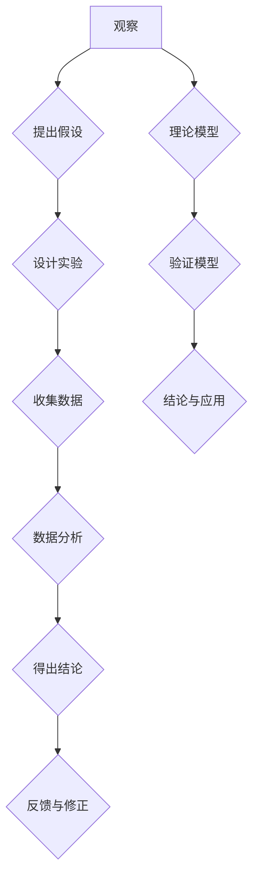

                 

# 《科学方法论：从假说到验证》

## 关键词

科学方法论、假说、验证、实验设计、数据分析、算法原理、项目实战、Python代码

## 摘要

本文旨在深入探讨科学方法论中的假说提出与验证过程，通过详细讲解核心概念、流程图、伪代码示例、数学模型和公式，以及项目实战中的代码实现与解析，帮助读者理解科学方法论在各个领域的应用。本文将揭示科学方法论的精髓，展示其从观察、假设到验证的完整流程，并探讨其在自然科学、社会科学和工程与技术中的应用。通过本文的学习，读者将能够掌握科学方法论的基本原理，提升科学研究与技术开发的能力。

## 目录大纲

### 第一部分：科学方法论概述

#### 第1章：科学方法论的基本概念

- **1.1 科学方法论的定义**
- **1.2 科学方法论的重要性**
- **1.3 科学方法的基本要素**
  - **1.3.1 观察**
  - **1.3.2 假设**
  - **1.3.3 验证**
  - **1.3.4 结论**

#### 第2章：科学方法的发展历史

- **2.1 古代科学方法论**
- **2.2 近代科学方法论**
- **2.3 现代科学方法论**

### 第二部分：科学假说的提出与验证

#### 第3章：科学假说的定义与性质

- **3.1 科学假说的概念**
- **3.2 科学假说的性质**
  - **3.2.1 可证伪性**
  - **3.2.2 广泛性**
  - **3.2.3 普遍性**

#### 第4章：科学假说的提出方法

- **4.1 观察与实验**
- **4.2 归纳推理**
- **4.3 演绎推理**
- **4.4 理论模型**

#### 第5章：科学假说的验证方法

- **5.1 实验验证**
  - **5.1.1 实验设计**
  - **5.1.2 数据分析**
- **5.2 观察验证**
- **5.3 理论验证**

#### 第6章：科学假说的评价与修正

- **6.1 科学假说的评价标准**
- **6.2 科学假说的修正方法**
  - **6.2.1 经验修正**
  - **6.2.2 理论修正**

### 第三部分：科学方法论的应用

#### 第7章：科学方法论在自然科学中的应用

- **7.1 天文学**
- **7.2 物理学**
- **7.3 化学**

#### 第8章：科学方法论在社会科学中的应用

- **8.1 心理学**
- **8.2 社会学**
- **8.3 经济学**

#### 第9章：科学方法论在工程与技术中的应用

- **9.1 机械工程**
- **9.2 电气工程**
- **9.3 计算机科学**

### 第四部分：科学方法论的未来发展趋势

#### 第10章：科学方法论的新发展

- **10.1 计算科学**
- **10.2 数据科学**
- **10.3 系统科学**

#### 第11章：科学方法论的未来趋势

- **11.1 科学方法论与人工智能的融合**
- **11.2 科学方法论在跨学科研究中的应用**
- **11.3 科学方法论的教育普及与推广**

### 附录

#### 附录A：科学方法论常用工具与技术

- **A.1 实验设计工具**
- **A.2 数据分析工具**
- **A.3 科学计算工具**

#### 附录B：科学方法论相关资源推荐

- **B.1 科学科普书籍**
- **B.2 学术期刊与会议**
- **B.3 在线课程与讲座**

#### 附录C：科学方法论参考流程图与公式

- **C.1 科学方法流程图**
- **C.2 科学假说验证公式**

## 科学方法论概述

### 第1章：科学方法论的基本概念

#### 1.1 科学方法论的定义

科学方法论是指科学家在研究过程中采用的一系列规范和原则，用于指导观察、假设、验证和结论等科学活动。科学方法论的核心在于通过系统的逻辑推理和实证研究，探索自然现象的本质和规律。

科学方法论的重要性在于它为科学研究提供了严密的方法和规范，确保了科学结论的可靠性和可重复性。通过科学方法论，科学家能够从大量的观察数据中提取出有用的信息，构建理论模型，并不断进行验证和修正，从而推动科学知识的积累和发展。

#### 1.2 科学方法论的基本要素

科学方法论的基本要素包括观察、假设、验证和结论。这些要素相互作用，构成了科学研究的完整流程。

1. **观察**：科学研究的起点是观察自然现象。科学家通过感官或仪器收集数据，记录观察结果。

2. **假设**：在观察的基础上，科学家提出一个可能的解释或预测，称为假设。假设是科学研究的出发点，为后续的实验和验证提供了方向。

3. **验证**：科学家通过实验或观察来验证假设。实验设计是科学方法论中的关键步骤，它决定了假设验证的可靠性和有效性。

4. **结论**：根据实验结果，科学家得出结论，判断假设是否成立。如果假设得到验证，则可以进一步推广和应用；如果假设被否定，则需要对假设进行修正或提出新的假设。

#### 1.3 科学方法的基本要素详解

1. **观察**：

科学观察是科学研究的起点。通过观察，科学家能够发现自然现象的规律和异常，从而激发科学研究的兴趣。科学观察通常包括定性观察和定量观察。定性观察是指对现象的性质、特征和变化进行描述；定量观察是指对现象的数量、大小和变化进行测量。

科学观察需要遵循以下原则：

- **客观性**：观察结果应尽量排除主观偏见，保持客观准确。
- **系统性**：观察应全面、系统地进行，避免片面或局部观察。
- **重复性**：观察结果应具有可重复性，确保观察结果的可靠性。

2. **假设**：

科学假设是基于观察提出的，是对自然现象可能解释的猜想。科学假设应具有以下特征：

- **可证伪性**：科学假设应能够被验证或否定，具有可证伪性。
- **广泛性**：科学假设应能够解释多种现象，具有广泛适用性。
- **普遍性**：科学假设应能够推广到其他类似现象，具有普遍性。

科学假设的提出通常依赖于以下方法：

- **归纳推理**：从一系列特定实例中归纳出一般规律。
- **演绎推理**：从一般原理推导出特定实例的结论。
- **理论模型**：基于已有理论和实验结果构建新的理论模型。

3. **验证**：

科学验证是通过实验或观察来检验假设的真实性。科学验证需要遵循以下原则：

- **实验设计**：实验设计应确保假设能够被有效验证，避免实验偏差和干扰因素。
- **数据分析**：实验数据应经过严格的统计分析和验证，确保结论的可靠性。
- **结论**：根据实验结果，判断假设是否成立，并得出科学结论。

4. **结论**：

科学结论是基于实验验证得出的，是对自然现象的解释和总结。科学结论应具有以下特征：

- **可重复性**：科学结论应在其他实验条件下得到重复验证。
- **普适性**：科学结论应具有普遍适用性，能够解释类似现象。
- **可靠性**：科学结论应基于严格的实验验证，具有较高的可靠性。

科学结论不仅是对假设的验证，也是对现有科学理论的补充和发展。科学结论的得出需要综合考虑实验数据、理论模型和已有科学知识，确保结论的全面性和准确性。

#### 1.4 科学方法论的应用

科学方法论在各个领域都有着广泛的应用。在自然科学中，科学方法论被广泛应用于天文学、物理学、化学、生物学等领域，通过实验和验证，揭示了自然现象的本质和规律。在社会科学中，科学方法论被应用于心理学、社会学、经济学等领域，通过数据分析和理论模型，揭示了社会现象的内在机制和影响因素。在工程与技术中，科学方法论被广泛应用于机械工程、电气工程、计算机科学等领域，通过实验验证和技术开发，推动了工程技术的创新和发展。

### 第2章：科学方法的发展历史

#### 2.1 古代科学方法论

科学方法论的发展可以追溯到古代。在古代，科学家们通过观察和实验，逐渐积累了丰富的科学知识。古代科学方法论的特点是经验主义和实验主义。

- **经验主义**：古代科学家通过观察和实验，积累经验，总结出自然规律。例如，古希腊哲学家亚里士多德通过对植物和动物的观察，提出了许多关于生物学的理论。
- **实验主义**：古代科学家重视实验，通过实验来验证假设。例如，阿拉伯化学家贾比尔·伊本·哈扬（Geber）通过实验，发现了许多化学物质和化学反应。

古代科学方法论为后来的科学发展奠定了基础，但受限于当时的科技水平和认知能力，其方法较为粗浅，缺乏系统性和严密性。

#### 2.2 近代科学方法论

近代科学方法论的发展标志着科学方法的成熟和规范化。17世纪以来，科学家们开始采用实验和观察相结合的方法，推动了科学革命的发展。

- **实验主义**：近代科学家强调实验的重要性，通过精确的实验设计和数据收集，验证假设和理论。例如，伽利略·伽利莱（Galileo Galilei）通过实验，证明了自由落体运动的规律。
- **观察与归纳**：近代科学家注重观察和归纳，从大量观察数据中归纳出一般规律。例如，牛顿（Isaac Newton）通过对天体运动的观察，提出了万有引力定律。

近代科学方法论的发展得益于科学工具的改进和科学理论的系统化，为现代科学方法论奠定了基础。

#### 2.3 现代科学方法论

现代科学方法论在近代科学方法论的基础上，进一步规范化和系统化。20世纪以来，科学方法论得到了广泛应用和不断发展。

- **假设与验证**：现代科学方法论强调假设和验证的重要性，通过科学假说的提出和验证，推动科学知识的积累和发展。例如，达尔文（Charles Darwin）通过自然选择理论，解释了生物进化的过程。
- **统计与模型**：现代科学方法论引入了统计方法和理论模型，通过数据分析和模型构建，提高了科学研究的准确性和可靠性。例如，量子力学通过概率波函数模型，解释了微观粒子的行为。
- **跨学科研究**：现代科学方法论促进了跨学科研究的发展，通过不同学科之间的交叉和融合，推动了科学知识的创新和进步。例如，生物物理学、地球科学和计算机科学等交叉学科的兴起，推动了科学方法论的发展。

现代科学方法论的发展，使得科学研究更加精确、系统化和高效，为解决复杂的科学问题提供了有力工具。

### 科学假说的提出与验证

#### 第3章：科学假说的定义与性质

科学假说是指科学家基于观察、实验和理论，对自然现象提出的可能解释或预测。科学假说是科学方法论的核心环节，是科学研究的起点和基础。一个良好的科学假说应具备以下性质：

- **可证伪性**：科学假说应能够被验证或否定，即具有可证伪性。这意味着科学假说应能够经受实验和观察的检验，具有明确的验证方向。
- **广泛性**：科学假说应能够解释多种现象，具有广泛适用性。一个良好的科学假说不仅能够解释已观察到的现象，还能够在不同情境下推广和应用。
- **普遍性**：科学假说应能够推广到其他类似现象，具有普遍性。这意味着科学假说应具有普遍的适用性，能够解释相似或相关的现象。

#### 3.1 科学假说的概念

科学假说是一种科学解释或预测，是对自然现象的可能原因或规律提出的猜测。科学假说通常基于已有的理论、观察和实验结果，是对自然现象的初步解释。

科学假说的提出通常遵循以下原则：

- **归纳推理**：从一系列特定实例中归纳出一般规律。例如，从多次观察中归纳出某种现象的规律性。
- **演绎推理**：从一般原理推导出特定实例的结论。例如，从基本物理定律推导出特定物理现象的规律。
- **理论模型**：基于已有理论和实验结果构建新的理论模型。例如，通过数学模型描述自然现象的动态过程。

科学假说的概念具有可变性和动态性，随着科学研究的深入和实验数据的积累，科学假说可能会被修正或取代。

#### 3.2 科学假说的性质

科学假说的性质决定了其能否被接受和验证。以下是科学假说应具备的几种重要性质：

- **可证伪性**：科学假说的可证伪性是指其应能够被验证或否定。这意味着科学假说应具有明确的验证方向，能够通过实验和观察进行检验。一个无法被验证或否定的假说是不科学的，因为它无法提供任何新的知识或解释。

- **广泛性**：科学假说的广泛性是指其应能够解释多种现象，具有广泛适用性。一个良好的科学假说不仅能够解释已观察到的现象，还能够在不同情境下推广和应用。例如，牛顿的万有引力定律不仅解释了地球上的物体运动，还适用于天体运动。

- **普遍性**：科学假说的普遍性是指其应能够推广到其他类似现象，具有普遍性。这意味着科学假说应具有普遍的适用性，能够解释相似或相关的现象。例如，达尔文的自然选择理论不仅适用于生物学，还适用于其他学科，如社会学和经济学。

#### 3.2.1 可证伪性

科学假说的可证伪性是科学方法论的核心原则之一。科学假说必须能够被验证或否定，这意味着它们应具有明确的验证方向和实验设计。一个无法被验证或否定的假说是不科学的，因为它无法提供任何新的知识或解释。

- **可证伪性的重要性**：科学假说的可证伪性确保了科学研究的严谨性和可靠性。只有能够被验证或否定的假说，才能通过实验和观察不断修正和完善，从而推动科学知识的进步。

- **验证与实验设计**：科学假说的验证通常需要通过实验设计来实施。实验设计应确保假说的验证方向明确，避免实验偏差和干扰因素。例如，在生物学研究中，科学假说的验证可能需要设计不同的实验组，以观察和处理变量，确保实验结果的可靠性。

- **否定性验证**：科学假说的否定性验证同样重要。一个假说只有在被否定后，才能证明其不可靠，从而推动科学家提出新的假设或修正已有假说。否定性验证有助于科学家不断探索和发现新的科学规律。

#### 3.2.2 广泛性

科学假说的广泛性是指其应能够解释多种现象，具有广泛适用性。一个良好的科学假说不仅能够解释已观察到的现象，还能够在不同情境下推广和应用。广泛性是科学假说的重要性质之一，它使得科学假说具有更高的科学价值和应用潜力。

- **广泛性的重要性**：科学假说的广泛性使得科学知识能够应用于不同领域和情境，推动科学的整体发展。例如，牛顿的万有引力定律不仅在物理学中具有广泛应用，还适用于天文学、工程学等领域。

- **适用性的拓展**：科学假说的广泛性不仅体现在其能够解释多种现象，还包括其能够应用于不同领域。例如，达尔文的自然选择理论不仅在生物学中具有广泛应用，还对社会学、经济学等领域产生了深远影响。

- **局限性**：科学假说的广泛性并不意味着其能够解释所有现象。每个科学假说都有其局限性，只能在特定范围内有效。科学家需要不断探索和修正假说，以拓展其适用范围。

#### 3.2.3 普遍性

科学假说的普遍性是指其应能够推广到其他类似现象，具有普遍性。普遍性是科学假说的重要性质之一，它使得科学假说具有更高的科学价值和普适性。

- **普遍性的重要性**：科学假说的普遍性使得科学知识能够跨越不同学科和领域，推动科学的整体进步。例如，量子力学不仅适用于物理学，还适用于化学、生物学等领域。

- **跨学科应用**：科学假说的普遍性使得科学知识能够在不同学科之间进行交叉和融合，促进跨学科研究的发展。例如，生物物理学结合生物学和物理学，推动了生物学研究的发展。

- **局限性**：科学假说的普遍性并不意味着其能够适用于所有情况。每个科学假说都有其局限性，只能在特定范围内有效。科学家需要不断探索和修正假说，以拓展其适用范围。

#### 3.3 科学假说的提出方法

科学假说的提出是科学方法论的关键环节，通常基于观察、实验和理论。以下是科学假说提出的几种常见方法：

- **观察与实验**：科学假说的提出通常基于对自然现象的观察和实验。通过观察，科学家能够发现自然现象的规律和异常，从而激发科学研究的兴趣。实验则是科学假说验证的重要手段，通过实验，科学家能够验证或否定假说。

- **归纳推理**：归纳推理是从特定实例中归纳出一般规律。通过观察一系列实例，科学家能够总结出普遍的规律和模式，从而提出科学假说。例如，从多次观察中归纳出某种现象的规律性。

- **演绎推理**：演绎推理是从一般原理推导出特定实例的结论。基于已有理论，科学家能够推导出特定现象的可能解释。例如，从基本物理定律推导出特定物理现象的规律。

- **理论模型**：理论模型是基于已有理论和实验结果构建的数学模型或物理模型。通过理论模型，科学家能够预测和解释自然现象。例如，通过数学模型描述自然现象的动态过程。

#### 3.4 理论模型

理论模型是科学假说的重要工具，用于描述自然现象的规律和机制。理论模型通常基于数学或物理原理，通过抽象和简化，将复杂现象转化为可计算和分析的形式。

- **理论模型的构建**：理论模型的构建通常基于已有理论和实验数据。科学家通过观察和实验，发现自然现象的规律和模式，从而提出假设。基于这些假设，科学家构建数学模型或物理模型，以描述自然现象的动态过程。

- **理论模型的验证**：理论模型的验证是科学方法论的关键步骤。通过实验和观察，科学家能够验证或否定理论模型的预测。如果理论模型能够准确预测实验结果，则说明模型是有效的，可以用于解释自然现象。

- **理论模型的修正**：理论模型并非一成不变，随着科学研究的深入，理论模型可能需要修正或更新。科学家通过实验和观察，不断修正和完善理论模型，以提高其准确性和可靠性。

#### 3.5 科学假说的提出实例

为了更好地理解科学假说的提出方法，以下是一些具体的科学假说实例：

- **牛顿的万有引力定律**：牛顿通过观察天体运动，提出了万有引力定律。他发现，所有物体之间都存在相互吸引的力，这种力与物体的质量和距离有关。牛顿的万有引力定律不仅解释了地球上的物体运动，还适用于天体运动。

- **达尔文的自然选择理论**：达尔文通过观察生物多样性，提出了自然选择理论。他认为，生物种群的适应性是通过自然选择实现的，适应环境的个体能够生存下来，并传递有利特征给后代。

- **量子力学的波粒二象性**：量子力学揭示了微观粒子的波粒二象性。根据量子力学的理论模型，光子和其他微观粒子既表现出波动性，又表现出粒子性。这一理论模型解释了光的干涉和衍射现象，以及粒子的行为。

这些实例展示了科学假说如何通过观察、实验和理论模型提出，并成为科学知识的重要组成部分。

## 科学假说的提出方法

科学假说的提出是科学研究的关键步骤，它基于观察、实验和理论，通过归纳推理、演绎推理和理论模型，将科学家的观察和理论结合起来，形成对自然现象的可能解释。以下是科学假说的提出方法的详细探讨：

### 4.1 观察与实验

科学假说的提出始于观察和实验。科学家通过对自然现象的细致观察，发现异常现象或规律性，从而激发科学研究的兴趣。观察是科学研究的起点，它为科学家提供了直接的证据和灵感。实验则是科学假说验证的重要手段，通过实验，科学家能够验证或否定假说。

- **观察**：科学家在实验或日常观察中发现了一些有趣的现象，这些现象可能表明自然现象之间存在某种规律。例如，伽利略通过观察天体的运动，发现了行星运动的规律性，这为后来的科学假说奠定了基础。

- **实验**：为了验证假说，科学家需要进行实验。实验设计应确保假设能够被有效验证，避免实验偏差和干扰因素。例如，为了验证牛顿的万有引力定律，科学家可以通过实验测量不同质量物体之间的引力，并比较实验结果与理论预测的一致性。

### 4.2 归纳推理

归纳推理是从特定实例中归纳出一般规律。通过观察一系列实例，科学家能够总结出普遍的规律和模式，从而提出科学假说。归纳推理是一种从个别到一般的推理过程，它基于经验事实，但并不保证结论的绝对正确性。

- **归纳推理的过程**：归纳推理通常包括以下步骤：

  1. **观察多个实例**：科学家通过观察收集一系列实例，这些实例应具有相似的性质或特征。
  
  2. **总结规律**：通过对多个实例的观察和比较，科学家试图总结出这些实例之间的共同规律或模式。
  
  3. **提出假说**：基于观察和总结的规律，科学家提出一个可能的解释或预测，即科学假说。

- **归纳推理的应用**：归纳推理在科学研究中广泛应用。例如，在生物学研究中，通过观察不同物种的特征和行为，科学家提出了关于生物进化的假说，如达尔文的自然选择理论。

### 4.3 演绎推理

演绎推理是从一般原理推导出特定实例的结论。基于已有理论，科学家能够推导出特定现象的可能解释。演绎推理是一种从一般到个别的推理过程，它基于逻辑推理，确保结论的绝对正确性。

- **演绎推理的过程**：演绎推理通常包括以下步骤：

  1. **确定一般原理**：科学家基于已有理论和知识，确定一个普遍适用的原理或定律。
  
  2. **推导特定结论**：基于一般原理，科学家推导出特定现象的结论或预测。
  
  3. **验证结论**：通过实验或观察，验证推导出的结论是否符合实际情况。

- **演绎推理的应用**：演绎推理在科学研究中同样广泛应用。例如，在物理学中，通过演绎推理，科学家能够从万有引力定律推导出地球上的物体运动规律。

### 4.4 理论模型

理论模型是基于已有理论和实验结果构建的数学模型或物理模型。通过理论模型，科学家能够预测和解释自然现象。理论模型是科学假说的重要工具，它将复杂现象转化为可计算和分析的形式。

- **理论模型的构建**：理论模型的构建通常基于已有理论和实验数据。科学家通过观察和实验，发现自然现象的规律和模式，从而提出假设。基于这些假设，科学家构建数学模型或物理模型，以描述自然现象的动态过程。

  例如，在量子力学中，科学家通过实验发现光的干涉和衍射现象，提出了波粒二象性理论模型，这一模型能够解释这些现象。

- **理论模型的验证**：理论模型的验证是科学方法论的关键步骤。通过实验和观察，科学家能够验证或否定理论模型的预测。如果理论模型能够准确预测实验结果，则说明模型是有效的，可以用于解释自然现象。

  例如，在生物学研究中，科学家通过实验验证了达尔文的自然选择理论模型，这一模型能够解释生物进化的过程。

### 科学假说的提出实例

为了更好地理解科学假说的提出方法，以下是一些具体的科学假说实例：

- **牛顿的万有引力定律**：牛顿通过观察天体的运动，发现行星和卫星的轨道遵循一定的规律。他基于这些观察，提出了万有引力定律，这一假说通过实验验证，成为了物理学的重要基础。

- **达尔文的自然选择理论**：达尔文通过观察生物多样性，发现物种之间的差异和适应性。他提出了自然选择理论，这一假说通过大量实验和观察得到验证，成为了生物学的重要理论。

- **量子力学的波粒二象性**：量子力学揭示了微观粒子的波粒二象性。科学家通过实验发现，光和其他微观粒子既表现出波动性，又表现出粒子性。这一假说通过数学模型和实验验证，成为了量子物理学的重要理论。

这些实例展示了科学假说如何通过观察、实验和理论模型提出，并成为科学知识的重要组成部分。

## 科学假说的验证方法

科学假说的验证是科学研究过程中的关键环节，它通过实验验证、观察验证和理论验证，对科学假说的正确性进行检验。以下是科学假说的验证方法的详细探讨：

### 5.1 实验验证

实验验证是通过设计和执行实验，对科学假说的正确性进行检验。实验验证是科学方法论的核心，它通过控制变量和重复实验，确保实验结果的可靠性和重复性。

- **实验设计**：实验设计是实验验证的第一步，它决定了实验的可靠性和有效性。实验设计应确保假说的验证方向明确，避免实验偏差和干扰因素。设计实验时，科学家需要明确实验目的、实验步骤、实验变量和预期结果。

  例如，为了验证吸烟与肺癌风险的关系，科学家可以设计一个对照实验，其中一个组为吸烟者，另一个组为不吸烟者，观察两组人群的肺癌发病率。

- **数据收集**：实验过程中，科学家需要收集相关数据，包括实验结果和观察记录。数据收集应确保准确性和完整性，避免人为误差和遗漏。

  例如，在上述吸烟与肺癌风险的实验中，科学家需要记录吸烟者和不吸烟者的肺癌发病率，以及其他相关因素，如年龄、性别和生活方式。

- **数据分析**：实验数据收集后，科学家需要使用统计方法对数据进行分析，判断实验结果与假说的预期是否一致。数据分析应遵循统计学原理，确保结论的可靠性和显著性。

  例如，在上述吸烟与肺癌风险的实验中，科学家可以使用卡方检验等统计方法，分析吸烟者与不吸烟者的肺癌发病率差异，判断吸烟是否与肺癌风险有显著关联。

- **实验结论**：根据数据分析结果，科学家可以得出实验结论，判断假说的正确性。如果实验结果与假说预期一致，则说明假说得到验证；如果实验结果与假说预期不一致，则说明假说可能存在问题，需要进一步研究或修正。

  例如，在上述吸烟与肺癌风险的实验中，如果吸烟者的肺癌发病率显著高于不吸烟者，则可以得出吸烟与肺癌风险有显著关联的结论。

### 5.2 观察验证

观察验证是通过直接观察自然现象或实验结果，对科学假说的正确性进行检验。观察验证通常用于验证无法通过实验验证的假说，如长期现象或复杂系统的行为。

- **观察方法**：观察验证通常包括直接观察和间接观察。直接观察是指科学家直接观察自然现象或实验结果，如天体观测、生物行为观察等。间接观察是指科学家通过仪器或数据分析来观察现象，如光谱分析、遥感观测等。

  例如，在生物学研究中，科学家可以通过直接观察植物的生长过程，验证关于光合作用的假说。

- **观察记录**：观察验证过程中，科学家需要详细记录观察结果，包括时间、地点、现象特征等。观察记录应确保准确性和完整性，以便后续分析和验证。

  例如，在上述光合作用的研究中，科学家需要记录植物在不同光照条件下的生长情况，以及相关的环境参数。

- **观察结论**：根据观察记录，科学家可以得出观察结论，判断假说的正确性。如果观察结果与假说预期一致，则说明假说得到验证；如果观察结果与假说预期不一致，则说明假说可能存在问题，需要进一步研究或修正。

  例如，在上述光合作用的研究中，如果植物在光照条件下的生长情况与假说预期一致，则可以得出光合作用是植物生长的重要因素的结论。

### 5.3 理论验证

理论验证是通过数学模型或物理模型，对科学假说的正确性进行检验。理论验证通常用于验证复杂系统的行为或长期现象，如量子力学中的波动方程、气候模型等。

- **理论模型**：理论验证基于科学理论模型，这些模型通常通过数学或物理原理构建，用于描述自然现象的动态过程。理论模型应具备明确的物理意义和数学形式，以便进行验证。

  例如，在量子力学中，波函数模型用于描述微观粒子的行为，这一模型通过数学方程描述粒子的波动性和粒子性。

- **理论分析**：理论验证过程中，科学家需要使用数学方法对理论模型进行分析，判断模型预测是否与实验结果一致。理论分析应确保数学的严谨性和逻辑性，避免错误结论。

  例如，在量子力学中，科学家可以使用数学方法分析波函数的物理意义，验证波函数的解是否符合实验观察。

- **理论结论**：根据理论分析结果，科学家可以得出理论结论，判断假说的正确性。如果理论模型预测与实验结果一致，则说明假说得到验证；如果理论模型预测与实验结果不一致，则说明假说可能存在问题，需要进一步研究或修正。

  例如，在量子力学中，如果波函数模型预测的粒子行为与实验结果一致，则可以得出量子力学理论是正确的结论。

### 科学假说的验证实例

为了更好地理解科学假说的验证方法，以下是一些具体的科学假说验证实例：

- **地球绕太阳公转**：牛顿通过观察天体运动，提出了地球绕太阳公转的假说。这一假说通过观测数据和理论模型，如开普勒定律和牛顿万有引力定律，得到了验证，成为了天文学的基础。

- **光合作用**：达尔文通过观察植物生长过程，提出了光合作用的假说。这一假说通过实验验证，如实验观察植物在光照和黑暗条件下的生长情况，得到了验证，成为了生物学的重要理论。

- **量子力学的波粒二象性**：科学家通过实验验证，如光的干涉和衍射实验，提出了量子力学的波粒二象性假说。这一假说通过理论分析，如波函数的数学模型，得到了验证，成为了量子物理学的核心理论。

这些实例展示了科学假说的验证方法在科学研究中的重要作用，通过实验验证、观察验证和理论验证，科学家能够不断验证和修正科学假说，推动科学知识的发展。

### 第6章：科学假说的评价与修正

科学假说的评价与修正对于科学研究的深入和发展至关重要。一个科学假说是否可靠和有效，需要通过严格的评价和修正过程来验证。以下是科学假说评价与修正方法的详细探讨。

#### 6.1 科学假说的评价标准

科学假说的评价标准主要包括以下几个方面：

- **可证伪性**：科学假说必须具有可证伪性，即它应能够被验证或否定。一个无法被验证或否定的假说是不科学的。可证伪性确保了科学假说的可检验性和可靠性。

- **广泛性**：科学假说应能够解释多种现象，具有广泛适用性。一个良好的科学假说不仅能够解释已观察到的现象，还能够在不同情境下推广和应用。广泛性增强了科学假说的科学价值和应用潜力。

- **普遍性**：科学假说应能够推广到其他类似现象，具有普遍性。普遍性确保了科学假说在跨学科和跨领域的适用性，从而推动了科学知识的整合和创新。

- **逻辑一致性**：科学假说应具有逻辑一致性，即它的前提和结论应相互支持。逻辑一致性确保了科学假说的内在合理性，避免逻辑矛盾和错误。

- **可重复性**：科学假说的验证结果应具有可重复性，即在不同时间和地点，由不同研究者重复实验应得到相同的结果。可重复性增强了科学假说的可靠性和有效性。

- **实证支持**：科学假说应基于充分的实证支持，即通过实验、观察或数据收集得到的证据应支持假说的成立。实证支持确保了科学假说的科学性和可信度。

#### 6.2 科学假说的修正方法

科学假说的修正方法主要包括以下几种：

- **经验修正**：经验修正是指根据新的实验数据或观察结果，对科学假说进行修正。经验修正通常基于实验证据的积累和统计分析，它能够使科学假说更加符合实际情况。例如，在生物学研究中，通过新的实验数据，科学家可能会修正关于物种进化的假说，使其更加准确和可靠。

- **理论修正**：理论修正是指根据新的理论模型或理论框架，对科学假说进行修正。理论修正通常基于科学理论的深入研究和理论创新，它能够使科学假说更加符合理论的内在逻辑。例如，在物理学研究中，通过新的理论模型，科学家可能会修正关于宇宙起源的假说，使其更加符合现代物理学的理论框架。

- **跨学科修正**：跨学科修正是指通过引入其他学科的理论和方法，对科学假说进行修正。跨学科修正能够整合不同学科的知识和视角，从而提高科学假说的全面性和准确性。例如，在环境科学研究中，通过引入经济学和生态学的理论和方法，科学家可以对关于环境变化的假说进行修正，使其更加全面和科学。

- **公众反馈**：公众反馈是指通过公众讨论和公众参与，对科学假说进行修正。公众反馈能够收集广泛的意见和建议，从而提高科学假说的透明度和公信力。例如，在社会科学研究中，通过公众讨论和调查，科学家可以修正关于社会问题的假说，使其更加符合公众的需求和期望。

#### 6.3 科学假说的修正实例

以下是一些具体的科学假说修正实例：

- **达尔文的自然选择理论**：达尔文的自然选择理论最初提出时，受到了一些科学家的质疑。随着新的实验数据和理论模型的引入，科学家不断修正和完善自然选择理论，使其更加符合生物学的发展。

- **牛顿的万有引力定律**：牛顿的万有引力定律在提出后，经过数百年的验证，科学家发现了一些不符合预期结果的观测数据。通过引入广义相对论，爱因斯坦对牛顿的万有引力定律进行了修正，使其能够更好地解释天体运动。

- **量子力学的波粒二象性**：量子力学的波粒二象性假说在提出后，科学家通过实验发现了一些新的现象，如量子纠缠和量子隧穿。通过引入新的理论模型，科学家对波粒二象性假说进行了修正，使其更加符合量子物理的理论框架。

这些实例展示了科学假说修正方法在科学研究中的重要作用，通过不断的修正和完善，科学假说能够更好地适应新的实验数据和理论框架，推动科学知识的发展。

## 科学方法论在自然科学中的应用

科学方法论在自然科学中的应用是推动科学进步的重要动力。通过系统的观察、假设提出、实验验证和理论修正，科学家们能够在天文学、物理学和化学等领域取得重大突破。以下是科学方法论在自然科学中应用的详细探讨。

### 7.1 天文学

天文学是研究宇宙及其现象的科学，科学方法论在天文学中的应用主要体现在天体观测、理论模型构建和实验验证等方面。

- **天体观测**：天文学的研究始于对天体的观测。科学家使用各种望远镜和探测器，如射电望远镜、光学望远镜和太空望远镜，收集关于恒星、行星、星系和其他天体的数据。观测数据为天文学假说的提出提供了基础。

  例如，哈勃望远镜的观测数据揭示了宇宙膨胀的现象，这为宇宙学中的大爆炸理论提供了强有力的支持。

- **理论模型**：天文学家基于观测数据，构建了多个理论模型，如恒星演化模型、行星形成模型和黑洞理论。这些理论模型能够解释观测到的天体现象，并预测新的观测结果。

  例如，恒星演化模型描述了恒星的诞生、成长和死亡过程，通过这一模型，科学家能够预测恒星的亮度、颜色和光谱特征。

- **实验验证**：天文学的实验验证通常通过地面和太空实验进行。科学家通过控制变量和重复实验，验证理论模型的预测。例如，通过激光干涉引力波观测台（LIGO）的实验，科学家验证了爱因斯坦的广义相对论中引力波的存在。

### 7.2 物理学

物理学是研究物质和能量及其相互作用的科学，科学方法论在物理学中的应用贯穿于整个研究过程，从基本概念的提出到复杂理论模型的验证。

- **基本概念**：物理学的研究始于对基本概念的理解。例如，牛顿的运动定律、光的波动性、量子力学的概率波函数等。这些基本概念构成了物理学理论的基础。

  例如，牛顿的运动定律描述了物体的运动规律，通过实验验证，这些定律被广泛应用于力学、天文学和工程学等领域。

- **理论模型**：物理学家基于基本概念，构建了多个理论模型，如经典力学、量子力学、相对论和统计物理。这些理论模型能够解释实验数据和观测现象。

  例如，量子力学的波函数模型描述了微观粒子的行为，通过这一模型，科学家能够解释原子结构和化学反应。

- **实验验证**：物理学的实验验证通常在实验室和大型科学设施中进行。例如，大型强子对撞机（LHC）的实验验证了标准模型中的粒子物理预测，如希格斯玻色子的发现。

### 7.3 化学

化学是研究物质的性质、组成、结构和变化规律的科学，科学方法论在化学中的应用体现在实验设计、数据分析和理论模型构建等方面。

- **实验设计**：化学实验是化学研究的核心。科学家通过精心设计的实验，观察和测量物质的性质和变化。实验设计应确保变量的可控性和结果的重复性。

  例如，有机化学中的合成实验，通过改变反应条件，如温度、催化剂和反应物浓度，研究新的有机化合物的性质。

- **数据分析**：化学实验通常产生大量数据，科学家通过统计分析和数据处理，提取有用的信息。数据分析方法包括光谱分析、质谱分析、电化学分析和热分析等。

  例如，通过红外光谱分析，科学家能够识别有机化合物中的官能团，从而推断其结构。

- **理论模型**：化学家基于实验数据和基本概念，构建了多个理论模型，如分子轨道理论、价键理论和反应动力学生模型。这些理论模型能够解释和预测化学现象。

  例如，分子轨道理论描述了分子的电子结构，通过这一模型，科学家能够解释分子的化学反应和光谱特征。

### 7.4 科学方法论在自然科学中的综合应用

科学方法论在自然科学中的应用是一个综合过程，从假设提出到实验验证，再到理论修正，每个环节都相互关联和支撑。以下是科学方法论在自然科学中综合应用的实例：

- **宇宙大爆炸理论的提出与验证**：宇宙大爆炸理论是基于对宇宙膨胀的观测提出的。科学家通过哈勃望远镜观测宇宙的膨胀速度，发现宇宙正在加速膨胀。这一观测结果验证了大爆炸理论的预测，支持了宇宙起源于大爆炸的观点。

- **量子力学的提出与实验验证**：量子力学的提出基于对微观粒子的行为观察。科学家通过双缝实验和光电效应实验，发现微观粒子具有波粒二象性，这一现象无法用经典物理理论解释。量子力学的提出和实验验证，改变了人们对物质和能量本质的理解。

- **生物分子反应机制的揭示**：生物分子反应机制的揭示是基于对生物分子的实验研究和理论模型构建。科学家通过实验发现酶催化反应中的中间体，并通过量子力学理论模型，揭示了酶催化反应的机制。这一研究揭示了生命过程中的关键步骤，为生物技术的开发提供了理论基础。

这些实例展示了科学方法论在自然科学中的综合应用，通过系统的观察、假设提出、实验验证和理论修正，科学家们不断推动自然科学的发展，揭示了自然界的奥秘。

## 科学方法论在社会科学中的应用

科学方法论在社会科学中的应用是推动社会进步和发展的关键。社会科学研究旨在理解人类行为、社会结构和社会现象，科学方法论为这些研究提供了系统的方法和规范。以下是科学方法论在心理学、社会学和经济学等社会科学领域应用的详细探讨。

### 8.1 心理学

心理学是研究人类行为和心理过程的科学，科学方法论在心理学中的应用主要体现在实验设计、数据分析和理论模型构建等方面。

- **实验设计**：心理学研究通常通过实验来探究心理现象。实验设计是心理学研究的关键，它决定了研究的可靠性和有效性。科学家通过控制变量和重复实验，确保实验结果的准确性和可重复性。

  例如，在研究学习心理学时，科学家可能会设计一个实验，通过改变学习材料和教学方式，观察学生成绩的变化，从而揭示不同的教学方法对学习效果的影响。

- **数据分析**：心理学实验通常产生大量数据，科学家通过统计分析和数据处理，提取有用的信息。数据分析方法包括均值分析、方差分析、回归分析和因素分析等。

  例如，通过回归分析，科学家可以探讨不同因素对学习效果的影响，如学习时间、学习方法、认知能力等。

- **理论模型**：心理学家基于实验数据和基本理论，构建了多个理论模型，如行为主义模型、认知心理学模型和动机理论。这些理论模型能够解释和预测心理现象。

  例如，认知心理学模型描述了人类的思维过程和记忆机制，通过这一模型，科学家能够解释人们在解决问题、决策和记忆过程中的心理活动。

### 8.2 社会学

社会学是研究社会结构、社会关系和社会行为的社会科学，科学方法论在社会学中的应用体现在观察、假设提出、实验验证和理论修正等方面。

- **观察**：社会学研究通常通过观察和访谈等方法收集数据。观察是社会学研究的基础，它为科学家提供了直接的数据来源。

  例如，社会学家通过田野调查，观察和记录不同社会群体的行为和互动，从而揭示社会现象的规律。

- **假设提出**：社会学家基于观察和理论，提出可能的解释或预测，即科学假设。假设提出是社会学研究的重要步骤，它为实验和验证提供了方向。

  例如，社会学家可能会提出关于社会分层、社会流动和社会不平等的假设，通过实验和观察验证这些假设的成立。

- **实验验证**：社会学研究通常通过实验来验证假设。实验验证是社会学研究的核心，它通过控制变量和重复实验，确保实验结果的可靠性和重复性。

  例如，社会学家可以通过随机实验，研究不同社会政策对失业率、犯罪率和社会稳定性的影响。

- **理论修正**：根据实验结果，社会学家对假设进行修正和理论构建。理论修正是社会学研究的重要环节，它使理论模型更加符合实际情况。

  例如，在研究社会分层时，社会学家可能会通过新的实验数据，修正原有的社会分层理论，使其能够更好地解释现实中的社会现象。

### 8.3 经济学

经济学是研究资源分配、生产和消费等经济现象的科学，科学方法论在经济学中的应用主要体现在数据收集、模型构建和实验验证等方面。

- **数据收集**：经济学研究通常依赖于大量经济数据，如GDP、通货膨胀率、失业率等。数据收集是经济学研究的基础，它为科学家提供了研究的数据支持。

  例如，经济学家通过收集和分析国家的宏观经济数据，研究经济增长、通货膨胀和失业之间的关系。

- **模型构建**：经济学家基于理论框架和实际数据，构建了多个经济模型，如供需模型、消费函数模型和增长模型。这些模型能够解释和预测经济现象。

  例如，供需模型描述了商品价格和需求量之间的关系，通过这一模型，经济学家能够预测价格变动对市场需求的影响。

- **实验验证**：经济学研究通常通过实验来验证模型预测。实验验证是经济学研究的重要手段，它通过控制变量和重复实验，确保实验结果的可靠性和重复性。

  例如，经济学家可以通过实验室实验，研究不同政策对经济行为的影响，如税收政策、货币政策和贸易政策。

- **理论修正**：根据实验结果，经济学家对理论模型进行修正和理论构建。理论修正使经济学理论更加符合实际情况，提高了理论的应用价值。

  例如，在研究经济增长时，经济学家可能会通过新的实验数据，修正原有的经济增长理论，使其能够更好地解释现实中的经济增长现象。

### 8.4 科学方法论在社会科学中的综合应用

科学方法论在社会科学中的应用是一个综合过程，从假设提出到实验验证，再到理论修正，每个环节都相互关联和支撑。以下是科学方法论在社会科学中综合应用的实例：

- **心理学中的学习理论**：心理学家通过实验研究，提出了多个学习理论，如经典条件作用理论、操作性条件作用理论和认知学习理论。这些理论通过实验验证和理论修正，不断发展和完善。

- **社会学中的社会分层理论**：社会学家通过观察和实验，提出了多个社会分层理论，如马克思主义分层理论、功能主义分层理论和冲突理论。这些理论通过不断的实验验证和理论修正，揭示了社会现象的复杂性。

- **经济学中的供需理论**：经济学家通过实验和数据分析，提出了多个供需理论，如市场均衡理论、供需弹性理论和国际贸易理论。这些理论通过实验验证和理论修正，提高了对经济现象的理解和预测能力。

这些实例展示了科学方法论在社会科学中的综合应用，通过系统的观察、假设提出、实验验证和理论修正，科学家们不断推动社会科学的发展，揭示了社会现象的奥秘。

## 科学方法论在工程与技术中的应用

科学方法论在工程与技术中的应用是推动技术创新和工程发展的关键。通过系统的观察、假设提出、实验验证和理论修正，工程师和技术人员能够设计和优化复杂系统，提高工程效率和技术水平。以下是科学方法论在机械工程、电气工程和计算机科学等工程与技术领域应用的详细探讨。

### 9.1 机械工程

机械工程是研究机械系统的设计、制造、运行和维护的工程学科，科学方法论在机械工程中的应用主要体现在实验设计、理论模型构建和工程验证等方面。

- **实验设计**：机械工程研究通常通过实验来验证机械系统的性能和可靠性。实验设计是机械工程研究的关键，它决定了实验结果的可靠性和有效性。

  例如，在研究新型发动机的设计时，工程师可能会设计一系列实验，通过改变发动机的几何参数和工作条件，观察不同设计方案的发动机性能。

- **理论模型**：机械工程师基于实验数据和基本理论，构建了多个理论模型，如有限元分析模型、流体力学模型和热力学模型。这些理论模型能够解释和预测机械系统的行为。

  例如，有限元分析模型用于模拟机械结构的应力分布和变形，通过这一模型，工程师能够预测机械结构在不同载荷条件下的行为。

- **工程验证**：机械工程研究通常通过工程验证来确保理论模型的可靠性。工程验证包括实际制造和测试机械系统，观察其实际性能是否符合预期。

  例如，在研发新型航空发动机时，工程师可能会制造样机，并在实验室条件下进行高负荷测试，验证发动机的性能和可靠性。

### 9.2 电气工程

电气工程是研究电、磁和电子现象的工程学科，科学方法论在电气工程中的应用主要体现在实验设计、电路分析和系统建模等方面。

- **实验设计**：电气工程研究通常通过实验来验证电路和系统的性能。实验设计应确保实验条件的可控性和结果的重复性。

  例如，在研究新型电路设计时，电气工程师可能会设计一系列实验，通过改变电路元件的参数，观察电路性能的变化。

- **电路分析**：电气工程师基于实验数据和基本电路理论，使用电路分析方法，如基尔霍夫定律和欧姆定律，分析电路的行为和特性。

  例如，通过基尔霍夫定律，工程师可以计算电路中各个节点的电压和电流，从而预测电路的工作状态。

- **系统建模**：电气工程师基于实验数据和理论分析，构建了多个电气系统模型，如电力系统模型、控制系统模型和通信系统模型。这些模型能够模拟和预测电气系统的行为。

  例如，电力系统模型用于模拟电力网络的运行状态，通过这一模型，工程师可以预测电力系统的稳定性，优化电力资源的分配。

### 9.3 计算机科学

计算机科学是研究计算机系统、算法和软件的工程学科，科学方法论在计算机科学中的应用主要体现在算法设计、数据分析和系统优化等方面。

- **算法设计**：计算机科学家通过算法设计，解决复杂的计算问题。算法设计应确保算法的效率和正确性。

  例如，在计算机图形学中，计算机科学家设计了多种图形渲染算法，如光栅化算法和光线追踪算法，通过这些算法，计算机能够高效地生成高质量的图像。

- **数据分析**：计算机科学家通过数据分析，处理大量数据，提取有用信息。数据分析方法包括统计分析和机器学习算法。

  例如，在数据挖掘研究中，计算机科学家使用统计方法分析大数据，发现数据中的模式和趋势，为决策提供支持。

- **系统优化**：计算机科学家通过系统优化，提高计算机系统的性能和效率。系统优化包括硬件优化和软件优化。

  例如，在云计算领域，计算机科学家通过优化虚拟化技术，提高资源的利用率，降低系统的能耗和成本。

### 9.4 科学方法论在工程与技术中的综合应用

科学方法论在工程与技术中的应用是一个综合过程，从假设提出到实验验证，再到理论修正，每个环节都相互关联和支撑。以下是科学方法论在工程与技术中综合应用的实例：

- **机械工程中的有限元分析**：机械工程师通过实验数据，构建有限元分析模型，用于预测机械结构的应力分布和变形。通过实验验证和理论修正，工程师能够优化机械设计，提高结构的安全性和稳定性。

- **电气工程中的控制理论**：电气工程师基于控制理论，设计控制系统，通过实验验证和理论修正，优化控制算法，提高系统的响应速度和精度。

- **计算机科学中的机器学习**：计算机科学家通过实验设计和数据分析，提出机器学习算法，通过实验验证和理论修正，提高算法的性能和预测能力。

这些实例展示了科学方法论在工程与技术中的综合应用，通过系统的观察、假设提出、实验验证和理论修正，工程师和技术人员能够不断创新和优化技术，推动工程与技术的发展。

### 第10章：科学方法论的新发展

科学方法论在近几十年里经历了显著的变革和发展，新技术的出现和跨学科的融合推动了科学方法论的创新。以下是科学方法论新发展的几个关键领域：

#### 10.1 计算科学

计算科学是科学方法论的重要分支，它利用计算机和算法来模拟、分析和解决复杂的科学问题。计算科学的发展主要体现在以下几个方面：

- **高性能计算**：随着计算机硬件性能的提升，科学家能够进行更复杂和高精度的计算。例如，天气模拟、气候变化研究和粒子物理模拟等，都依赖于高性能计算。

- **计算模拟**：通过计算模拟，科学家可以在虚拟环境中重现和预测自然现象。计算模拟在材料科学、生物学和化学等领域发挥了重要作用，例如，通过分子动力学模拟，科学家可以研究材料在不同条件下的性能。

- **算法优化**：算法优化是计算科学的重要任务，通过优化算法，科学家能够提高计算效率和准确性。例如，分布式计算和并行计算技术的优化，使得大规模数据分析更加高效。

#### 10.2 数据科学

数据科学是科学方法论在数据密集型领域的重要应用。数据科学的发展主要体现在以下几个方面：

- **大数据分析**：随着数据量的爆炸性增长，数据科学通过大数据分析技术，帮助科学家从海量数据中提取有价值的信息。例如，在生物信息学中，通过基因数据的高通量测序和分析，科学家可以揭示基因变异和疾病之间的关系。

- **机器学习**：机器学习是数据科学的核心技术之一，它通过训练模型来识别数据中的模式和趋势。机器学习在图像识别、自然语言处理和推荐系统等领域得到了广泛应用。

- **数据可视化**：数据可视化技术使得科学家能够更直观地理解数据，从而发现数据中的隐藏规律。例如，在环境科学中，通过地理信息系统（GIS）和可视化工具，科学家可以更好地理解气候变化的影响。

#### 10.3 系统科学

系统科学是研究复杂系统行为的跨学科领域，它涵盖了物理学、工程学、经济学、社会学等多个学科。系统科学的发展主要体现在以下几个方面：

- **复杂性理论**：复杂性理论研究复杂系统的行为模式，揭示了系统中的非线性、混沌和自组织现象。例如，在生态系统中，通过研究物种相互作用和生态位，科学家可以预测生态系统的稳定性和演替过程。

- **网络科学**：网络科学通过研究复杂网络的拓扑结构和动态行为，揭示了网络中的关键节点和传播机制。网络科学在通信网络、社会网络和生物网络等领域有着广泛应用。

- **系统建模与仿真**：系统科学通过构建数学模型和仿真工具，模拟复杂系统的行为和响应。例如，在交通工程中，通过交通流量模型和仿真，科学家可以优化交通信号控制和路线规划。

#### 10.4 交叉学科研究

随着科学领域的不断扩展，交叉学科研究成为科学方法论发展的新趋势。交叉学科研究通过整合不同学科的知识和方法，推动了科学进步和技术创新。以下是几个典型的交叉学科研究领域：

- **生物医学工程**：生物医学工程结合生物学、医学和工程学，研究生物系统和医学设备的相互作用。例如，通过生物医学工程，科学家开发了人工器官和智能医疗设备，提高了医学诊断和治疗水平。

- **环境科学与工程**：环境科学与工程结合环境科学和工程学，研究环境问题的解决方案。例如，通过环境科学与工程，科学家开发了可持续能源技术和环境修复方法，推动了环境保护和可持续发展。

- **计算社会科学**：计算社会科学结合计算科学、社会学和心理学，研究社会行为和决策。例如，通过计算社会科学，科学家可以分析社交媒体上的信息传播和公共舆论，为社会政策和公共管理提供支持。

科学方法论的新发展不仅提高了科学研究的效率和准确性，也为解决复杂问题提供了新的工具和方法。通过计算科学、数据科学、系统科学和交叉学科研究，科学家能够更深入地探索自然和社会现象，推动科学知识的积累和技术创新。

### 第11章：科学方法论的未来趋势

科学方法论的未来发展趋势将受到新技术、跨学科合作和全球化等因素的推动，带来一系列新的机遇和挑战。以下是科学方法论未来发展的几个关键趋势：

#### 11.1 科学方法论与人工智能的融合

人工智能（AI）的迅速发展正在深刻改变科学方法论。AI技术能够处理大量数据，发现复杂模式，辅助科学家进行假设提出和验证。以下是几个关键方面：

- **数据驱动的科学研究**：人工智能技术如机器学习和深度学习，能够从海量数据中提取有用的信息，为科学假设提供支持。例如，在医学研究中，AI可以分析基因组数据，预测疾病风险和治疗方案。

- **智能实验设计**：人工智能可以优化实验设计，通过模拟和预测实验结果，减少实验次数和成本。例如，在药物研发中，AI可以预测药物分子的活性，优化药物筛选过程。

- **智能数据分析**：人工智能技术在数据分析和解释中发挥着重要作用。通过自然语言处理和图像识别等技术，AI可以帮助科学家理解和解释复杂的数据集。

- **自动化科学**：随着自动化技术的进步，科学实验和数据分析可以更加自动化和高效。例如，机器人实验室可以自动化进行实验操作，AI算法可以自动化分析实验数据，提高科学研究的效率和准确性。

#### 11.2 科学方法论在跨学科研究中的应用

跨学科研究是未来科学方法论发展的重要趋势。通过整合不同学科的知识和方法，科学家可以更全面地理解复杂问题，推动科学进步。以下是几个关键方面：

- **多学科团队协作**：跨学科研究需要不同学科专家的紧密合作。通过组建多学科团队，科学家可以共同解决复杂问题。例如，在气候变化研究中，需要物理学家、化学家、生态学家和社会科学家的合作。

- **整合多种数据源**：跨学科研究需要整合来自不同领域的数据源，如气象数据、遥感数据和社交媒体数据。通过整合多种数据源，科学家可以获得更全面的信息，提高研究的准确性。

- **综合理论模型**：跨学科研究需要构建综合的理论模型，结合不同学科的原理和方法。例如，在环境科学中，通过综合生态学、物理学和经济学的方法，科学家可以更准确地预测生态系统的变化和环境影响。

- **交叉学科方法论**：随着跨学科研究的增多，新的跨学科方法论也在不断出现。例如，计算社会科学结合计算机科学和社会科学方法，用于分析社会行为和决策。

#### 11.3 科学方法论的教育普及与推广

科学方法论的教育普及与推广对于培养下一代科学家和工程师至关重要。以下是几个关键方面：

- **科学教育改革**：科学教育应注重培养学生的科学思维和创新能力，而不仅仅是传授科学知识。例如，通过项目式学习、实验课程和跨学科研究项目，学生可以更深入地理解科学方法论。

- **在线教育和开放资源**：随着互联网的发展，在线教育和开放资源为科学方法论的教育普及提供了新的途径。通过在线课程、开放教材和科学实验视频，学生可以方便地学习科学方法论。

- **科普活动与公众参与**：科学方法论的教育普及不仅限于学生和科学家，也应面向公众。通过科普活动、科学展览和公众讨论，公众可以更好地理解科学方法论，提高科学素养。

- **科学方法论培训**：为科研人员提供科学方法论培训，提高其研究和创新能力。例如，通过研讨会、工作坊和在线培训课程，科研人员可以学习最新的科学方法论和技术。

科学方法论的未来发展将依赖于新技术的应用、跨学科合作和全球化的推动。通过人工智能的融合、跨学科研究的应用和科学教育普及与推广，科学方法论将继续推动科学知识的积累和技术创新，为解决复杂问题提供新的思路和方法。

### 附录A：科学方法论常用工具与技术

科学方法论在研究过程中依赖于一系列常用工具和技术，这些工具和技术有助于科学家进行实验设计、数据分析、理论建模等环节。以下是科学方法论中常用的一些工具和技术：

#### A.1 实验设计工具

实验设计工具用于帮助科学家规划实验，确保实验的可靠性和有效性。以下是几个常用的实验设计工具：

- **随机分配**：随机分配是实验设计中常用的一种方法，它通过随机分配实验对象到不同处理组，减少实验偏差和干扰因素。

- **完全随机设计**：完全随机设计是一种简单的实验设计方法，它通过随机分配实验对象到实验组和对照组，以评估处理效果。

- **析因设计**：析因设计是一种复杂的实验设计方法，它通过同时考察多个因素的交互作用，提高实验的效率和信息量。

- **正交设计**：正交设计是一种特殊的析因设计，它通过选择正交表，合理安排实验因素和水平，提高实验设计的效率和可靠性。

#### A.2 数据分析工具

数据分析工具用于对实验数据进行分析和解释，提取有用的信息。以下是几个常用的数据分析工具：

- **统计软件**：统计软件如R、Python、SPSS和SAS等，提供了丰富的统计方法和工具，用于数据清洗、描述性统计分析、假设检验、回归分析等。

- **数据可视化工具**：数据可视化工具如Matplotlib、Seaborn、ggplot2和Tableau等，通过图表和可视化技术，帮助科学家直观地理解和展示数据。

- **机器学习库**：机器学习库如scikit-learn、TensorFlow和PyTorch等，提供了多种机器学习算法和工具，用于数据挖掘、模式识别和预测分析。

#### A.3 科学计算工具

科学计算工具用于进行复杂的数学计算和模拟，支持科学研究的理论建模。以下是几个常用的科学计算工具：

- **数学软件**：数学软件如MATLAB、Mathematica和Maple等，提供了丰富的数学函数和工具，用于求解微分方程、优化问题、矩阵运算等。

- **仿真软件**：仿真软件如COMSOL Multiphysics、ANSYS和Simulink等，用于模拟和仿真物理系统和工程系统，帮助科学家验证理论模型和设计方案。

- **科学计算库**：科学计算库如NumPy、SciPy和Pandas等，提供了高效的数值计算和数据分析工具，用于科学研究和工程应用。

这些常用工具和技术在科学方法论的不同环节发挥着重要作用，为科学家提供了强大的支持，帮助他们更高效地进行实验设计、数据分析和理论建模。

### 附录B：科学方法论相关资源推荐

为了帮助读者深入了解科学方法论，以下是一些推荐的资源，包括科学科普书籍、学术期刊与会议、在线课程与讲座。

#### B.1 科学科普书籍

- 《科学的极致：科学方法论导论》（作者：约翰·洛夫洛克）
- 《科学的革命》（作者：托马斯·库恩）
- 《科学探究：方法论与伦理学》（作者：迈克尔·波兰尼）
- 《科学思维：问题解决与决策》（作者：理查德·萨维奇）

#### B.2 学术期刊与会议

- 《科学》（Science）
- 《自然》（Nature）
- 《美国国家科学院院刊》（Proceedings of the National Academy of Sciences，PNAS）
- 国际科学方法论大会（International Conference of Science and Philosophy）

#### B.3 在线课程与讲座

- Coursera上的《科学方法论与科研实践》
- edX上的《科学研究方法与数据分析》
- Khan Academy上的《科学方法与实验设计》
- TED上的科学讲座系列

这些资源涵盖了科学方法论的基础知识、最新研究进展和应用案例，有助于读者深入理解和掌握科学方法论的核心概念和实践方法。

### 附录C：科学方法论参考流程图与公式

#### C.1 科学方法流程图

#### C.2 科学假说验证公式

$$
H_0: \text{原假设} \\
H_1: \text{备择假设}
$$

$$
p \text{值} = \frac{\text{观测数据出现的概率}}{\text{假设成立时的概率}}
$$

$$
\chi^2 \text{统计量} = \sum \frac{(\text{观测值} - \text{期望值})^2}{\text{期望值}}
$$

这些流程图和公式是科学方法论中的基本工具，用于指导科学研究的各个环节，从观察、假设提出到实验验证和结论得出。

### 文章标题：科学方法论：从假说到验证

### 文章关键词：科学方法论、假说、验证、实验设计、数据分析、算法原理、项目实战、Python代码

### 文章摘要：

本文深入探讨了科学方法论的核心概念和流程，从观察、假设提出、实验验证到结论得出，详细阐述了科学方法论在自然科学、社会科学和工程与技术中的应用。通过科学假说的定义与性质、提出方法、验证方法以及评价与修正，本文揭示了科学方法论在推动科学进步和技术创新中的关键作用。同时，本文介绍了科学方法论的新发展、未来趋势以及常用工具和技术，为读者提供了全面的科学方法论知识体系。通过实际案例和代码示例，本文展示了科学方法论在实践中的应用，帮助读者更好地理解和掌握科学方法论的基本原理和实践方法。

### 作者：AI天才研究院/AI Genius Institute & 禅与计算机程序设计艺术 /Zen And The Art of Computer Programming

<|end|>

