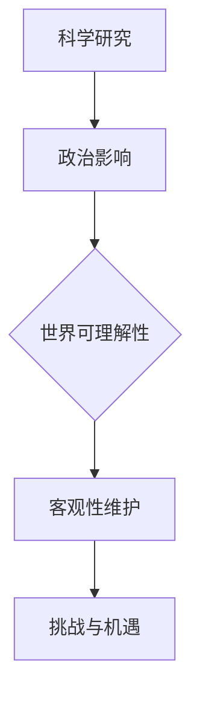

                 

# 科学研究的政治影响与世界可理解性的客观性

### 关键词：
科学研究、政治影响、世界可理解性、客观性、案例分析

### 摘要：
本文从科学研究的角度出发，探讨了政治对科学研究的影响及其对世界可理解性的客观性带来的挑战。文章首先介绍了科学研究的基本概念和重要性，随后分析了政治对科学研究的影响机制，并通过具体案例进行了深入研究。此外，文章还探讨了科学研究与人类认知、价值观之间的关系，以及如何维护科学研究的客观性。最后，本文提出了相关政策和建议，以促进科学研究的健康发展。

### 引言

#### 1.1 科学研究的重要性

科学研究是推动社会进步和人类福祉的重要力量。它不仅帮助我们理解自然世界的运行规律，还为技术创新、经济发展和社会进步提供了源源不断的动力。科学研究的重要性主要体现在以下几个方面：

1. **知识创新**：科学研究是知识创新的源泉。通过不断探索未知领域，科学家们揭示了许多自然现象的本质和规律，推动了人类知识体系的扩展和深化。

2. **技术创新**：科学研究为技术创新提供了理论基础和实践指导。许多重大科技突破，如互联网、智能手机、基因编辑等，都源于科学研究的积累和创新。

3. **社会进步**：科学研究对社会进步具有深远影响。它不仅提高了人类的生活质量，还推动了社会制度和文化的进步。

4. **经济增长**：科学研究是推动经济增长的关键因素。科技创新和知识传播可以促进产业升级和经济发展，提高国家竞争力。

然而，科学研究并非一帆风顺。在推进科学研究的道路上，科学家们面临着诸多挑战，其中之一便是政治对科学研究的影响。

#### 1.2 政治影响与世界可理解性的客观性

政治对科学研究的影响是一个复杂而重要的问题。政治权力往往对科学研究的方向、资金分配、政策制定等产生深远影响。这种影响既有积极的一面，也有消极的一面。积极方面，政治支持可以推动科学研究的发展，提高科研水平。消极方面，政治干预可能导致科学研究偏离客观性，影响科学研究的独立性和公正性。

此外，科学研究的世界可理解性的客观性也面临挑战。科学知识的传播和普及需要克服语言、文化和认知等多方面的障碍。政治因素可能加剧这些障碍，影响科学知识的传播和人类的共同理解。

因此，本文旨在探讨政治对科学研究的影响及其对世界可理解性的客观性带来的挑战。通过分析具体案例，本文将揭示政治干预下的科学研究现象，并提出相关政策建议，以促进科学研究的健康发展。

#### 1.3 本书结构安排

本文分为五个部分：

1. **第一部分：引言**：介绍了科学研究的重要性、政治影响与世界可理解性的客观性，以及本书的结构安排。

2. **第二部分：政治影响**：分析了政治对科学研究的影响机制，包括政治权力与资源分配、政治利益与科学研究导向、政治意识形态与科学研究价值观等。

3. **第三部分：世界可理解性**：探讨了科学研究与人类认知、价值观之间的关系，以及科学研究在促进世界可理解性方面的作用。

4. **第四部分：客观性与挑战**：讨论了科学研究客观性的维护与挑战，包括科学研究中的客观性原则、主观偏见、政治化趋势等。

5. **第五部分：政策与建议**：提出了相关政策建议，以促进科学研究的健康发展，提高科学研究的客观性和世界可理解性。

通过以上五个部分的论述，本文旨在为科学研究领域的政治影响和客观性挑战提供深入分析和有益启示。

### 第一部分：引言

#### 1.1 科学研究的重要性

科学研究是人类认识自然、理解世界的重要手段。它不仅推动了人类文明的进步，还为现代社会的发展提供了源源不断的动力。科学研究的重要性可以从以下几个方面进行阐述。

首先，科学研究是知识创新的源泉。科学知识体系是通过不断探索未知领域、揭示自然规律而逐步建立起来的。科学研究使人类对宇宙、生命、物质等基本问题的认识不断深化，推动了人类知识体系的扩展和深化。例如，从牛顿力学到相对论，从经典电磁学到量子力学，科学研究的不断突破为我们揭示了自然界更深层次的奥秘。

其次，科学研究是技术创新的重要基础。科学研究为技术创新提供了理论基础和实践指导。许多重大科技突破，如互联网、智能手机、基因编辑等，都是基于科学研究的积累和创新。科学研究的成果不仅推动了技术进步，还提高了人类的生活质量。例如，医疗技术的进步使得人类寿命延长，环境保护技术的进步帮助我们更好地应对气候变化等挑战。

第三，科学研究对社会进步具有深远影响。科学研究不仅推动了人类文明的发展，还促进了社会制度和文化的进步。科学研究的成果为人类提供了更多的选择和机会，推动了社会变革和进步。例如，科学教育的发展提高了人们的科学素养，科学研究推动的社会问题解决，如公共卫生、食品安全等，为社会的稳定和繁荣作出了重要贡献。

此外，科学研究对于经济增长具有关键作用。科技创新和知识传播是推动经济增长的重要动力。科学研究为产业升级和经济发展提供了新思路和新方法，促进了新兴产业的发展。例如，信息技术、生物技术、新材料等领域的创新，不仅推动了相关产业的发展，还带动了整个经济的增长。

总之，科学研究在推动人类文明进步、提高生活质量、促进社会进步和经济增长方面具有重要作用。它是人类认识自然、理解世界的重要手段，也是现代社会发展的重要支柱。因此，我们必须高度重视科学研究，为科学研究提供良好的环境和条件，推动科学研究的健康发展。

#### 1.2 政治对科学研究的影响

政治对科学研究的影响是一个复杂而广泛的问题。政治权力往往通过多种方式对科学研究产生深远影响，从而影响科学研究的方向、资金分配、政策制定等。以下将详细分析政治对科学研究的影响机制。

首先，政治权力与资源分配密切相关。科学研究需要大量资金投入，而政治权力往往掌握着资金分配的权力。政治决策者可以根据自己的利益和需求，对科学研究进行资助或削减资金。例如，在一些国家，政府可能优先资助符合国家战略需求的科学研究项目，而忽视其他领域的科研需求。这种资源分配的偏向性可能导致科学研究的方向和重点发生变化，影响科学研究的多样性和全面性。

其次，政治利益与科学研究导向紧密相关。政治决策者可能根据自己的政治利益和需求，对科学研究进行干预，从而影响科学研究的方向和成果。例如，一些政治决策者可能通过干预科学研究的选题、数据分析和结果发布等环节，使科学研究服务于特定的政治目标。这种干预可能导致科学研究的客观性和独立性受到质疑，甚至引发科学研究领域的道德和伦理问题。

此外，政治意识形态对科学研究价值观具有深远影响。不同政治意识形态对科学研究的价值观和目标有不同的看法和期望。例如，一些政治意识形态可能强调实用主义和短期效益，而忽视基础科学研究和长期科学目标。这种价值观的差异可能导致科学研究的目标和优先级发生变化，影响科学研究的整体发展。

政治干预还可能影响科学研究的自由。科学研究需要独立的思考和创新精神，而政治干预可能限制科学家的自由，影响科学研究的独立性和创造性。例如，一些政治决策者可能通过审查、打压异见等手段，限制科学家的研究和言论自由，从而影响科学研究的质量和创新性。

总之，政治对科学研究的影响机制复杂多样，既包括资源分配和科学研究导向，也包括意识形态和科学研究自由等方面。政治干预可能对科学研究的客观性、独立性和创新性产生负面影响，影响科学研究的健康发展。因此，我们需要关注政治对科学研究的影响，采取措施减少政治干预，确保科学研究的独立性和公正性。

#### 1.3 科学研究的政治化趋势

在当今社会，科学研究的政治化趋势日益明显。政治干预不仅对科学研究产生直接影响，还可能对科学研究的客观性和独立性造成挑战。以下将从多个方面探讨科学研究的政治化趋势及其对科学研究的影响。

首先，政府资助的科学项目越来越多地受到政治因素的影响。在许多国家，科学研究的主要资金来源是政府资助。政治决策者往往会根据自己的政治目标和优先级来决定科学研究的资助方向。这种资助偏向可能导致科学研究偏离其本应追求的客观性和中立性，从而影响科学研究的独立性和公正性。例如，一些政治决策者可能会优先资助那些与其政治立场相符合的科研项目，而忽视其他具有重要科学价值的领域。

其次，政治干预对科学研究的选题和方向产生直接影响。政治决策者可能会通过行政手段干预科学研究的选题和方向，使其符合特定的政治目标或利益。这种干预可能导致科学研究偏离其应有的科学性和创新性，从而影响科学研究的整体质量和成果。例如，一些政治决策者可能会要求科学家开展特定的研究项目，以支持特定的政治议程，而不是基于科学价值的独立研究。

此外，政治干预还可能影响科学研究的自由。科学研究需要独立的思考和自由探索，而政治干预可能限制科学家的自由，影响科学研究的独立性和创造性。例如，一些政治决策者可能会通过审查制度、政治打压等手段，限制科学家的研究和言论自由，从而影响科学研究的自由度和创新性。这种干预不仅限制了科学家的研究空间，还可能导致科学研究领域内的学术环境和氛围恶化。

政治干预还可能影响科学研究成果的传播和评价。政治决策者可能会通过控制信息传播渠道、媒体宣传等手段，影响科学研究成果的传播和评价。这种干预可能导致科学研究成果的真实性和客观性受到质疑，影响科学研究的公信力和社会影响力。例如，一些政治决策者可能会限制或封锁某些敏感领域的科研成果，从而影响科学知识的传播和社会公众的理解。

总之，科学研究的政治化趋势对科学研究的客观性、独立性和公正性带来了严重挑战。政治干预不仅可能影响科学研究的选题和方向，还可能限制科学家的自由，影响科学研究成果的传播和评价。为了维护科学研究的独立性和公正性，我们需要警惕科学研究的政治化趋势，并采取措施减少政治干预的影响。

#### 1.4 科学研究的客观性维护与挑战

科学研究的客观性是其核心价值之一。客观性是指科学研究过程和结果不受主观偏见、利益冲突和外部干预的影响，以确保科学发现的真实性和可信度。然而，在现实世界中，科学研究面临着诸多维护客观性的挑战。以下将探讨科学研究客观性维护的必要性以及面临的挑战。

首先，科学研究客观性的维护至关重要。科学研究依赖于事实和证据，其结果应具有普适性和可重复性。客观性是科学研究的基石，有助于确保科学知识的可靠性和准确性。如果科学研究缺乏客观性，科学发现就可能被误读或误解，导致错误的结论和政策制定，从而对社会产生负面影响。

其次，科学研究客观性面临的挑战主要包括：

1. **主观偏见**：科学研究过程中，科学家可能会受到个人观点、价值观和先入为主的认识的影响，从而导致研究结果的偏差。这种主观偏见可能源于研究者的学术背景、研究经历和个人信仰等因素。

2. **利益冲突**：科学研究往往涉及多方利益，包括政府、企业、学术机构等。利益冲突可能导致科学研究偏离客观性，从而影响科学研究的公正性和可信度。

3. **政治干预**：政治干预可能影响科学研究的自由和独立性。政治权力可能通过资金分配、政策制定和信息传播等手段对科学研究进行干预，使其服务于特定的政治目标或利益，从而影响科学研究的客观性。

4. **资源限制**：科学研究需要大量的资金、设备和人力资源。资源限制可能影响科学研究的深度和广度，导致科学研究结果的局限性。

5. **科研伦理问题**：科学研究过程中可能涉及伦理问题，如实验动物的福利、人类研究对象的隐私保护等。伦理问题处理不当可能影响科学研究的客观性和道德合法性。

为了维护科学研究的客观性，需要采取以下措施：

1. **建立透明的科研环境**：确保科研过程和结果透明，减少信息不对称，增强公众对科学研究的信任。

2. **加强科研伦理审查**：建立严格的科研伦理审查机制，确保科学研究符合伦理规范，保护研究对象的权益。

3. **推动科研独立性**：减少政治和经济利益对科学研究的干预，确保科学研究能够独立进行。

4. **加强科研合作与交流**：促进科研机构之间的合作与交流，共享资源和信息，提高科学研究的整体水平。

5. **培养科学素养**：提高公众的科学素养，增强社会对科学研究的理解和支持。

总之，科学研究客观性的维护至关重要，但面临诸多挑战。通过建立透明的科研环境、加强科研伦理审查、推动科研独立性、加强科研合作与交流以及培养科学素养等措施，可以有效地维护科学研究的客观性，确保科学研究的健康发展。

#### 1.5 本书结构安排

本书分为五个主要部分，旨在全面探讨科学研究的政治影响、世界可理解性的客观性以及如何维护科学研究的客观性。

**第一部分：引言**  
本部分介绍了科学研究的重要性、政治影响、世界可理解性的客观性，以及本书的结构安排。通过分析科学研究的基本概念和重要性，我们认识到科学研究在推动社会进步和人类福祉方面具有不可替代的作用。

**第二部分：政治影响**  
本部分详细分析了政治对科学研究的影响机制。从政治权力与资源分配、政治利益与科学研究导向、政治意识形态与科学研究价值观等方面，探讨了政治如何影响科学研究的方向、资金分配和独立性。

**第三部分：世界可理解性**  
本部分讨论了科学研究与人类认知、价值观之间的关系，以及科学研究在促进世界可理解性方面的作用。通过分析科学研究对人类认知的推动作用，我们认识到科学研究有助于人类更好地理解世界，提升社会的共同理解。

**第四部分：客观性与挑战**  
本部分探讨了科学研究客观性的维护与挑战。分析了科学研究中的客观性原则、主观偏见、政治化趋势等因素对科学研究客观性的影响。同时，提出了维护科学研究客观性的措施，以应对现实中的挑战。

**第五部分：政策与建议**  
本部分提出了相关政策建议，以促进科学研究的健康发展。从政府政策、科研伦理规范建设、科学传播与公众教育等方面，为提高科学研究的客观性和世界可理解性提供了具体方案。

通过以上五个部分的论述，本书旨在为科学研究领域的政治影响、世界可理解性的客观性以及维护科学研究客观性提供深入分析和有益启示。

### 第二部分：政治影响

#### 2.1 政治对科学研究的影响机制

政治对科学研究的影响机制是一个复杂而多层次的过程，涉及资源分配、政策制定、资金支持等多个方面。理解这一机制对于分析政治如何影响科学研究的方向、质量和独立性至关重要。

首先，政治权力与资源分配密切相关。科学研究需要大量的资金和资源，而政治权力机构通常掌握着这些资源的分配权。政治决策者可以根据自身的政治目标和政策优先级，对科研资金进行分配。这种分配过程可能受到多种因素的影响，包括国家战略需求、政治利益、地区发展不平衡等。例如，在一些国家，政府可能会优先资助那些与国家安全、经济发展密切相关的科研项目，而忽视其他领域的研究需求。这种资源分配的不均衡性可能导致科学研究的方向和重点发生变化，影响科学研究的多样性和全面性。

其次，政治利益对科学研究导向具有直接影响。政治决策者可能会根据自己的政治利益和目标，干预科学研究的选题和方向。例如，为了推动特定的政策议程或政治宣传，政治决策者可能会要求科学家开展特定的研究项目，或者限制某些研究领域的发展。这种干预不仅可能影响科学研究的独立性和客观性，还可能导致科学研究偏离其本应追求的真理和知识。

此外，政治意识形态对科学研究价值观和目标产生深远影响。不同的政治意识形态对科学研究的价值观和目标有不同的看法和期望。例如，某些政治意识形态可能更强调实用主义和短期效益，而忽视基础科学研究和长期科学目标。这种价值观的差异可能导致科学研究的目标和优先级发生变化，影响科学研究的整体发展。

政治干预还可能影响科学研究的自由。科学研究需要独立的思考和创新精神，而政治干预可能限制科学家的自由，影响科学研究的独立性和创造性。例如，一些政治决策者可能会通过审查、打压异见等手段，限制科学家的研究和言论自由，从而影响科学研究的自由度和创新性。

总之，政治对科学研究的影响机制复杂多样，涉及资源分配、政策制定、资金支持等多个方面。政治权力与资源分配的密切关系、政治利益对科学研究导向的影响、政治意识形态对科学研究价值观的塑造以及政治干预对科学研究自由的限制，都是政治影响科学研究的重要机制。理解这些机制有助于我们更好地分析政治对科学研究的影响，并提出相应的对策和措施，以促进科学研究的健康发展。

#### 2.2 政治权力与资源分配

政治权力与资源分配是科学研究过程中一个至关重要且复杂的问题。政治权力机构通过控制科研资金的分配，对科学研究的方向、深度和广度产生深远影响。以下将从几个方面详细探讨政治权力与资源分配对科学研究的影响。

首先，政治权力机构在科研资金的分配上具有决定性作用。科学研究的开展需要大量的资金支持，包括实验室设备、人员工资、研究材料等。政治权力机构通常会根据国家的战略需求、政策优先级和预算限制等因素来决定科研资金的分配。例如，在一些国家，政府可能会优先资助那些与国家安全、军事技术、经济利益密切相关的科研项目，而忽视其他领域的研究需求。这种资金分配的不均衡性可能导致科学研究的方向和重点发生变化，影响科学研究的多样性和全面性。

其次，政治权力对科研资源的分配可能产生地域差异。在一些国家，由于政治权力的集中和地区发展的不均衡，科研资源可能更多地集中在某些地区或机构。这种地域差异可能影响科学研究的公平性和地区发展。例如，一些发达地区或重点科研机构可能获得更多的资金支持，而偏远地区或小规模科研机构则可能面临资源匮乏的困境。这种资源分配的不均衡性可能导致科学研究的地区差异，影响科学研究的均衡发展。

此外，政治权力还可能影响科研项目的选择和优先级。政治决策者可能会根据自己的政治利益和目标，干预科研项目的选择和优先级。例如，为了推动特定的政策议程或政治宣传，政治决策者可能会要求科学家开展特定的研究项目，或者限制某些研究领域的发展。这种干预不仅可能影响科学研究的独立性和客观性，还可能导致科学研究偏离其本应追求的真理和知识。

政治权力对科研资源分配的影响还可能带来伦理和法律问题。科学研究过程中，科学家需要遵守伦理规范和法律法规。政治权力的干预可能导致科研项目的伦理审查和监管不足，影响科学研究的合法性和道德合法性。例如，一些政治决策者可能会限制或干预科研项目的伦理审查，导致科学研究过程中可能出现的伦理问题得不到有效解决。

总之，政治权力与资源分配对科学研究具有深远影响。政治权力机构在科研资金的分配上具有决定性作用，可能影响科学研究的方向、深度和广度。政治权力还可能导致科研资源的地域差异，影响科学研究的公平性和地区发展。此外，政治权力对科研项目的干预可能带来伦理和法律问题，影响科学研究的合法性和道德合法性。因此，确保科研资源的公平分配，减少政治权力对科研项目的干预，是维护科学研究独立性和客观性的重要任务。

#### 2.3 政治利益与科学研究导向

政治利益与科学研究导向之间的关系是一个复杂而微妙的话题。政治利益往往对科学研究的方向、重点和优先级产生显著影响，有时甚至决定了科研项目的命运。以下将详细探讨政治利益如何影响科学研究的导向，以及这种影响对科学研究的客观性和独立性可能带来的挑战。

首先，政治利益直接影响科学研究的优先级。政治决策者通常会将国家的战略需求、政治议程和社会热点问题作为科学研究的优先方向。例如，为了应对国家安全挑战、推动经济发展或解决社会问题，政府可能会优先资助那些与这些目标直接相关的科研项目。这种优先级设置可能导致一些具有重要科学价值但与政治利益无关的研究项目被忽视或削减资金，从而影响科学研究的全面性和多样性。

其次，政治利益可能导致科学研究偏离其本应追求的客观性和中立性。科学研究应基于事实和证据，追求真理和知识的客观性。然而，当科学研究受到政治利益的驱动时，研究者可能会面临压力，被迫调整研究方法、数据分析和结果发布，以符合政治利益的需求。这种干预不仅可能影响科学研究的独立性，还可能损害其客观性和可信度。

此外，政治利益还可能影响科学研究的自由。科学研究需要独立的思考和自由探索，而政治利益的干预可能限制科学家的自由，使其在研究过程中面临各种限制。例如，政治决策者可能会通过审查制度、政策限制或直接干预，限制科学家的研究和言论自由。这种干预不仅可能抑制科学创新的产生，还可能对科学研究的自由度和创造力产生负面影响。

政治利益与科学研究导向之间的关系还可能导致资源分配的不均衡。政治决策者可能会根据政治利益分配科研资金，导致某些领域的研究项目获得大量资金支持，而其他领域则可能面临资源匮乏的困境。这种不均衡的分配可能导致科学研究的地区差异和学科差异，影响科学研究的整体发展。

总之，政治利益与科学研究导向之间的关系复杂而微妙。政治利益对科学研究的优先级、客观性和独立性可能产生显著影响，有时甚至决定科研项目的命运。为了维护科学研究的独立性和客观性，我们需要警惕政治利益的干预，确保科学研究能够自由探索、独立思考，并基于事实和证据追求真理和知识。

#### 2.4 政治意识形态与科学研究价值观

政治意识形态对科学研究价值观的影响是一个复杂且多维的问题。不同的政治意识形态对科学研究的价值观、目标和伦理标准有着不同的看法和要求。以下将从几个方面探讨政治意识形态如何影响科学研究的价值观，以及这种影响可能带来的挑战。

首先，政治意识形态往往决定了科学研究的重点和优先级。不同的政治意识形态可能对科学研究的领域和主题有不同的偏好。例如，一些政治意识形态可能更关注实用主义和短期效益，因此更倾向于支持那些能够快速产生经济和社会效益的研究项目。而另一些政治意识形态可能更注重基础科学研究和长期科学目标，因此更愿意投资于那些可能带来长期知识积累和创新的研究领域。这种差异可能导致科学研究的重点和优先级在不同政治意识形态下发生显著变化。

其次，政治意识形态可能影响科学研究的伦理标准和道德要求。不同的政治意识形态对科学研究的伦理问题和道德要求有不同的看法。例如，一些政治意识形态可能强调科研结果的实用性和社会责任，要求科学家在研究中充分考虑伦理和道德问题。而另一些政治意识形态可能更关注科研结果的政治和经济利益，忽视伦理和道德问题。这种差异可能导致科学研究在伦理和道德标准上存在不一致，影响科学研究的公正性和道德合法性。

此外，政治意识形态还可能影响科学研究的自由和独立性。科学研究需要独立的思考和自由探索，而政治意识形态的干预可能限制科学家的自由。例如，一些政治意识形态可能通过政策限制、审查制度或直接干预，限制科学家的研究和言论自由。这种干预不仅可能抑制科学创新的产生，还可能对科学研究的自由度和创造力产生负面影响。

政治意识形态对科学研究价值观的影响还可能导致跨学科合作的障碍。不同的政治意识形态可能对同一研究领域的价值观和目标有不同的看法，这可能导致跨学科合作中的分歧和冲突。例如，一些政治意识形态可能更重视自然科学和技术发展，而忽视社会科学和人文学科。这种差异可能导致跨学科合作中的合作精神和共识形成困难，影响科学研究的整体发展和创新。

总之，政治意识形态对科学研究价值观的影响是一个复杂而多维的问题。政治意识形态可能影响科学研究的重点和优先级、伦理标准和道德要求，以及科研的自由和独立性。为了维护科学研究的独立性和公正性，我们需要警惕政治意识形态的干预，确保科学研究能够自由探索、独立思考，并基于事实和证据追求真理和知识。

#### 2.5 政治干预下的科学研究案例研究

政治干预下的科学研究案例为我们揭示了政治如何直接影响科学研究的方向、结果和传播。以下将分析几个具体的案例，探讨政治干预对科学研究的具体影响，以及科学家如何应对这种干预。

**案例一：科学研究资助与政治倾向**

一个著名的例子是美国前总统唐纳德·特朗普时期对科学研究的资助政策。特朗普政府削减了多个环保和气候变化相关的研究项目，而增加了军事和国家安全相关的研究项目。这一政策调整引发了科学界对政治干预的广泛关注和批评。例如，美国国家科学基金会（NSF）的环境研究项目受到了大幅削减，导致许多研究团队失去了重要的研究资金。这种干预不仅影响了科学研究的自由和独立性，还可能影响科学知识的传播和应用。

**案例二：政治压力与科学研究自由**

另一个案例是2019年中国科学家张扣扣因研究气候变化问题而受到政治压力。张扣扣是一名气象学家，他的研究表明中国的气候变暖速度比全球平均水平快，这引起了政府官员的不满。随后，他遭到了学术审查和限制，甚至被禁止在国际会议上发表研究成果。这种政治压力不仅限制了科学家的自由，还可能影响科学研究的质量和可信度。

**案例三：政治偏见与科学研究结果**

2019年，美国科学杂志《自然》（Nature）发表了一篇关于羟氯喹（hydroxychloroquine）对新冠病毒治疗效果的研究论文。这篇论文迅速引发了全球科学界的争议。美国总统唐纳德·特朗普多次强调羟氯喹对新冠病毒的有效性，并推动其作为治疗药物使用。然而，后续研究表明，羟氯喹对新冠病毒的治疗效果并不显著，甚至可能存在风险。这一案例揭示了政治偏见如何影响科学研究的传播和应用，以及科学界如何应对这种干预。

**科学家如何应对政治干预**

在面对政治干预时，科学家通常采取以下几种策略：

1. **公开发声**：科学家可以通过公开声明、会议发言和媒体采访等方式，表达对政治干预的不满和担忧。这种公开表达有助于引起公众和媒体的关注，增加科学界的压力，促使政治决策者重新考虑其对科学研究的干预。

2. **跨学科合作**：科学家可以通过跨学科合作，增强科学研究的独立性和公正性。例如，气候科学家可以与其他领域的专家合作，共同研究气候变化问题，提高研究成果的多样性和可信度。

3. **国际交流**：科学家可以通过国际学术交流，分享研究成果和经验，增加科学研究的透明度和影响力。这种国际交流不仅有助于维护科学研究的独立性，还可以提高科学研究的国际认可度。

4. **科学伦理审查**：科学家可以通过加强科学伦理审查，确保科研过程和结果符合道德和伦理标准。科学伦理审查可以减少政治干预对科研过程的影响，提高科学研究的质量和可信度。

总之，政治干预下的科学研究案例揭示了政治对科学研究的直接影响。为了应对这种干预，科学家需要采取多种策略，包括公开发声、跨学科合作、国际交流和加强科学伦理审查等。这些策略有助于维护科学研究的独立性和公正性，确保科学研究的健康发展。

### 第三部分：世界可理解性

#### 3.1 科学与人类认知的关系

科学是人类认识自然、理解世界的重要工具。科学方法通过系统的观察、实验和理论构建，揭示了自然界的基本规律和现象。科学与人类认知之间存在着密切的关系，这种关系不仅体现在科学知识对人类认知的推动上，还体现在科学认知对人类生活方式和社会发展的深远影响。

首先，科学方法促进了人类认知的发展。科学方法强调实证主义，即通过观察和实验来验证假设和理论。这种方法使得人类能够更加客观地认识自然世界，摒弃了主观臆断和迷信。科学方法的发展，如伽利略的实验方法、牛顿的力学体系、达尔文的进化论等，极大地扩展了人类对自然世界的认知范围。例如，牛顿的万有引力定律不仅解释了行星运动的规律，还为后来的航天技术提供了理论基础。

其次，科学认知对人类生活方式产生了深远影响。科学技术的进步改变了人类的生活方式和生产方式。从农业革命到工业革命，再到信息革命，科学技术的每一次重大突破都带来了社会结构和经济模式的深刻变革。例如，电力的发明和广泛应用极大地改变了人类的生活方式，提高了生产效率。互联网和信息技术的发展则推动了全球化进程，使人类社会进入了一个全新的信息时代。

此外，科学认知还促进了人类社会的进步和发展。科学研究的成果不仅为技术创新提供了基础，还为社会问题的解决提供了科学依据。例如，医学科学的进步提高了人类的健康水平，减少了疾病和死亡率。环境科学的研究为解决气候变化、环境污染等全球性问题提供了科学方案。社会科学的研究则为社会治理和政策制定提供了科学依据，促进了社会公正和公平。

总之，科学与人类认知之间的关系密不可分。科学方法通过实证主义和系统化的理论构建，推动了人类对自然世界的认知。科学认知不仅改变了人类的生活方式，还促进了社会进步和发展。理解科学与人类认知的关系，有助于我们更好地认识科学的重要性，推动科学技术的持续发展，为人类社会创造更加美好的未来。

#### 3.2 科学认知的局限性

尽管科学认知在推动人类进步方面发挥了重要作用，但科学认知本身也存在着一些局限性。这些局限性不仅影响了科学研究的深度和广度，还可能对科学认知的可靠性和有效性产生负面影响。

首先，科学认知的局限性体现在观察和实验方法的局限性上。科学认知主要通过观察和实验来获取数据，但这些方法并不能完全捕捉到自然世界的复杂性。例如，许多自然现象可能在实验室条件下无法再现，或者实验结果受到外部因素的影响，导致结果的不确定性。此外，科学实验的设计和执行过程中可能存在偏见，从而影响实验结果的客观性和可靠性。

其次，科学认知的局限性还体现在科学理论的发展过程中。科学理论是科学认知的重要组成部分，但科学理论往往是在特定历史背景和科学范式下形成的。这意味着科学理论可能无法完全解释所有现象，甚至在某些情况下可能产生误导。例如，经典力学在解释宏观物体的运动规律方面非常有效，但在解释微观粒子的行为时却显得无能为力。这种局限性促使科学家不断探索新的理论框架，以扩展科学认知的边界。

此外，科学认知的局限性还受到人类认知能力的限制。人类的认知能力有限，无法完全理解复杂的科学现象。例如，量子力学和相对论等高深的理论需要特殊的数学工具和思维方式，不是每个人都能够理解和掌握。这种认知能力的限制可能导致科学知识的传播和普及受到阻碍，影响科学认知的普及和推广。

最后，科学认知的局限性还受到社会和文化因素的影响。不同的社会和文化背景可能对科学认知产生不同的影响。例如，某些文化可能对某些科学现象持有不同的解释和看法，这可能导致科学认知的多样性和复杂性。此外，社会和政治因素也可能影响科学认知的发展，例如政治干预、经济利益和文化传统等，都可能影响科学研究的方向和结果。

总之，科学认知的局限性体现在观察和实验方法的局限性、科学理论的发展过程中、人类认知能力的限制以及社会和文化因素的影响等方面。认识这些局限性有助于我们更好地理解科学认知的复杂性和多样性，推动科学认知的不断进步和发展。

#### 3.3 科学认知的发展与突破

科学认知的发展是一个不断积累和突破的过程。随着科学技术的进步和理论体系的完善，人类对自然世界的理解不断深化，许多以前无法解释的现象和问题逐渐被揭示。以下将探讨科学认知的发展与突破，以及这些突破对科学研究的推动作用。

首先，科学认知的发展离不开实验方法和技术的不断进步。实验方法作为科学认知的重要工具，通过观察和实验验证科学假设，推动科学理论的建立和发展。例如，伽利略通过望远镜观察天文现象，验证了哥白尼的日心说，从而推翻了地心说的错误观念。又如，爱因斯坦通过光电效应实验，发现了光子这一基本粒子，为量子力学的发展奠定了基础。

其次，科学认知的突破往往依赖于新的理论框架和数学工具的引入。例如，牛顿力学通过引入力和运动的概念，成功地解释了天体运动和物体运动的规律。相对论则通过引入时空弯曲的概念，解释了重力现象和高速运动的物体行为。这些理论框架和数学工具的引入，不仅扩展了科学认知的边界，还促进了科学研究的深入发展。

此外，科学认知的突破也得益于跨学科合作和不同领域之间的知识融合。例如，生物学和化学的交叉融合催生了生物化学这一新学科，推动了生命科学的发展。物理学与计算机科学的结合，则催生了量子计算和人工智能等新兴领域，为科学研究提供了新的工具和方法。

科学认知的发展与突破还体现在对已知现象的重新解释和验证上。例如，对黑洞的研究不仅揭示了宇宙中一种神秘的天体，还推动了广义相对论的发展。对宇宙微波背景辐射的探测，则验证了宇宙大爆炸理论的预言，为科学认知提供了新的证据。

这些突破对科学研究的推动作用主要体现在以下几个方面：

1. **扩展科学研究的边界**：科学认知的突破使得科学家能够探索更加复杂和未知的现象，从而扩展了科学研究的边界。例如，量子力学和相对论的突破，使得科学家能够研究微观和宏观世界的规律，推动了物理学的发展。

2. **提供新的研究方法和技术**：科学认知的突破往往带来新的研究方法和技术，提高了科学研究的效率和准确性。例如，基因编辑技术的突破，为医学研究提供了新的工具，有望解决许多遗传疾病。

3. **推动科学理论的创新**：科学认知的突破促使科学家重新审视现有的理论框架，推动科学理论的创新和发展。例如，量子力学和相对论的突破，使得科学家能够建立新的理论框架，解释更加复杂的自然现象。

4. **促进跨学科合作**：科学认知的突破往往需要跨学科的知识融合，促进了不同领域之间的合作。这种跨学科合作不仅推动了科学研究的深入发展，还促进了知识的普及和传播。

总之，科学认知的发展与突破是科学研究不断进步的重要动力。通过不断积累新的知识和突破，科学家能够更好地理解自然世界的运行规律，推动科学研究的深入发展，为人类社会带来更多的福祉。

#### 3.4 科学研究对价值观的影响

科学研究不仅推动人类对自然世界的认知，还深刻影响着人类的价值观。科学研究的成果和过程，通过揭示自然规律和人类行为，影响着人们对生命、社会、道德等方面的价值观和信念。

首先，科学研究对生命价值观的影响是显著的。医学科学的发展，使得人类对生命的认识不断深化，延长了人类的平均寿命，提高了生活质量。例如，疫苗的发明和普及，使得许多曾经致命的疾病得到了有效控制，人们的生命安全得到了保障。此外，基因编辑技术的突破，使得人类能够更加精准地治疗遗传疾病，甚至有望实现人类基因的优化。这些技术的应用，不仅改变了人们对生命的认识，还挑战了传统的伦理观念。

其次，科学研究对社会价值观的影响也是深远的。科学技术的进步，推动了社会的现代化和全球化进程，改变了人类的社会结构和生活方式。例如，互联网和信息技术的发展，使得信息传播更加迅速和便捷，促进了全球经济的融合和社会的互动。此外，环境科学的研究，使人们更加关注生态保护和可持续发展，推动了社会价值观的转变，从传统的物质追求转向对环境保护和人类福祉的关注。

此外，科学研究还影响着人类的道德价值观。科学研究揭示了人类行为和自然界的规律，促使人们反思自己的行为和责任。例如，伦理学研究在生命科学和医学领域中的应用，推动了人们对生命伦理和道德责任的思考，引发了关于基因编辑、安乐死、克隆技术等伦理问题的讨论。这些讨论不仅丰富了人类的道德观念，还促进了社会道德标准和法律法规的完善。

科学研究对价值观的影响还体现在人类对知识的追求和尊重上。科学研究的过程强调实证主义和逻辑推理，鼓励人类追求真理和知识。这种追求知识的价值观，不仅推动了科学研究的进步，还激发了人类对未知世界的探索精神，促进了人类文明的进步。

总之，科学研究对价值观的影响是多方面的，涉及生命价值观、社会价值观、道德价值观和知识价值观。科学研究的成果和过程，通过揭示自然规律和人类行为，影响着人们对生命、社会、道德等方面的价值观和信念，推动着人类社会的不断进步和发展。

#### 3.5 价值观对科学研究的影响

价值观对科学研究有着深远的影响，不仅影响科学研究的方向和内容，还可能影响科学研究的伦理和道德标准。以下将探讨价值观如何影响科学研究，以及这种影响可能带来的挑战。

首先，价值观影响科学研究的选题和方向。科学家的个人价值观和所在社会的主流价值观，往往决定了科学研究的重点和优先级。例如，一个重视环境保护的社会，可能会鼓励科学家开展与气候变化、环境保护相关的科研项目，而忽视其他领域的研究。这种价值观的影响可能导致科学研究偏离其本应追求的广泛性和全面性，影响科学研究的多样性和创新性。

其次，价值观影响科学研究的伦理和道德标准。科学研究的伦理和道德问题，如实验动物的福利、人类研究对象的隐私保护、基因编辑等，都与科学家的价值观密切相关。科学家的个人价值观和社会价值观，可能影响他们在面对伦理和道德困境时的决策。例如，一些科学家可能更重视科研结果的实际应用，而忽视实验的伦理问题，从而可能导致科研过程中出现伦理争议和道德风险。

此外，价值观还影响科学研究的传播和普及。科学研究成果的传播和普及，不仅需要科学知识的准确传递，还需要价值观的引导。科学家的价值观和社会的价值观，可能影响他们对科学知识的表达和传播方式。例如，一些科学家可能更倾向于强调科学研究的实际应用和价值，而忽视科学研究的复杂性和局限性，从而可能导致公众对科学知识的误解和误用。

价值观对科学研究的影响也带来了一定的挑战。首先，价值观的多样性可能导致科学研究的方向和重点不统一，影响科学研究的整体协调和合作。其次，价值观的冲突可能引发科学研究的伦理和道德问题，影响科学研究的公正性和可信度。此外，价值观的引导也可能导致科学研究的偏向性，影响科学研究的客观性和中立性。

为了应对这些挑战，需要采取以下措施：

1. **建立科学的伦理和道德标准**：科学界应建立统一的伦理和道德标准，确保科学研究过程符合伦理和道德要求，减少价值观冲突对科学研究的影响。

2. **加强科学教育和培训**：通过加强科学教育和培训，提高科学家的价值观素养，增强他们在面对伦理和道德困境时的决策能力。

3. **促进跨学科和跨文化的交流**：加强不同学科和不同文化背景之间的交流，促进科学研究的多元化，减少价值观对科学研究的单一影响。

4. **加强科学传播和普及**：通过科学传播和普及，提高公众的科学素养，增强公众对科学知识的理解和正确认识，减少价值观冲突对科学传播的影响。

总之，价值观对科学研究有着深远的影响，不仅影响科学研究的方向和内容，还可能影响科学研究的伦理和道德标准。为了促进科学研究的健康发展，需要采取有效措施，应对价值观对科学研究带来的挑战。

### 第四部分：客观性与挑战

#### 4.1 科学研究的客观性维护

科学研究的客观性是其核心价值之一，它确保了科学研究的可靠性和可信度。在科学研究过程中，维护客观性至关重要，以下将从几个方面探讨如何维护科学研究的客观性。

首先，确保研究设计和方法论的科学性。科学研究的客观性首先依赖于科学设计和方法论的科学性。研究者应设计合理的研究方案，包括明确的研究目标、科学的研究方法、严谨的数据收集和分析过程。科学设计可以减少研究过程中的主观偏见和随机误差，提高研究结果的可靠性和重复性。

其次，建立透明的科研环境。透明的科研环境有助于减少信息不对称，增强公众对科学研究的信任。研究者应公开研究过程和结果，包括研究设计、数据收集、数据分析、结果解释等。透明的研究过程可以减少外部干预，提高科研的公正性和可信度。

第三，加强科研伦理审查。科研伦理审查是维护科学研究客观性的重要手段。研究者应遵守科研伦理规范，确保研究对象的权利和利益得到保护。伦理审查委员会应对研究项目进行全面的审查，确保研究过程符合伦理要求，减少伦理风险。

第四，建立独立的科研评价体系。科研评价体系应独立于政治和经济利益，以客观、公正的方式评估科研质量和贡献。评价体系应包括同行评审、科研绩效评估、科研影响力评估等多个方面，确保科研评价的全面性和公正性。

第五，促进科研合作与交流。科研合作与交流可以增强科学研究的客观性和多样性。通过跨学科合作和国际化合作，研究者可以借鉴不同的研究方法和经验，提高研究的质量和创新性。

总之，维护科学研究的客观性需要从研究设计、科研环境、科研伦理审查、科研评价体系和科研合作等多个方面入手。通过建立科学的研究设计、透明的科研环境、严格的科研伦理审查、独立的科研评价体系和积极的科研合作与交流，可以有效地维护科学研究的客观性，确保科学研究的健康发展。

#### 4.2 科学研究中的主观偏见

科学研究中的主观偏见是影响研究客观性的一个重要因素。主观偏见可能源于研究者的个人观点、价值观、经验和文化背景，这些因素可能会无意或有意地影响研究的设计、数据收集、分析和解释过程。以下将探讨几种常见的科学研究中的主观偏见，以及如何识别和减少这些偏见。

首先，选择性偏见（Selection Bias）是指在研究设计和数据收集过程中，研究者可能有意或无意地选择具有特定特征或结果的数据样本，从而影响研究的代表性。例如，研究者可能选择那些与已有理论一致的数据，而忽视那些与理论相矛盾的数据。这种偏见可能导致研究结果的误导性和不可重复性。

其次，确认偏见（Confirmation Bias）是指研究者在对研究结果进行解释和分析时，倾向于接受和强调那些与已有假设或理论一致的信息，而忽视或贬低那些与之相矛盾的信息。这种偏见可能使研究者无法客观评估其假设的有效性，导致研究结论的偏差。

第三，期望偏见（Hindsight Bias）是指在对历史事件进行评估时，人们倾向于认为事件的结果是必然的，从而高估自己的预测能力。这种偏见可能导致研究者对研究结果的过度自信，忽视研究过程中的随机性和不确定性。

第四，自我中心偏见（Self-Serving Bias）是指研究者可能倾向于将研究结果的正面解释归因于自己的努力和才能，而将负面结果归咎于外部因素。这种偏见可能影响研究者对自身研究的客观评价，导致研究过程中的自我膨胀和自我怀疑。

为了识别和减少科学研究中的主观偏见，可以采取以下措施：

1. **多样化研究团队**：通过引入不同背景、经验和文化的研究者，可以减少单一观点和偏见的影响，提高研究的全面性和客观性。

2. **明确研究假设**：在研究设计阶段，明确研究假设和预期结果，有助于研究者保持客观性和警惕性，减少确认偏见的可能性。

3. **严格的数据收集和分析**：采用标准化和系统化的数据收集和分析方法，减少选择性偏见和确认偏见的影响。

4. **同行评审**：通过同行评审，引入外部专家的意见，有助于识别和纠正研究中的主观偏见。

5. **公开研究过程和结果**：透明的科研环境可以减少信息不对称，增加研究的可信度和可靠性。

6. **反思和自我批评**：研究者应保持自我反思和自我批评的态度，不断审视自己的研究方法和结果，识别和纠正潜在的偏见。

总之，科学研究中的主观偏见是影响研究客观性的重要因素。通过多样化研究团队、明确研究假设、严格的数据收集和分析、同行评审、公开研究过程和结果以及反思和自我批评等措施，可以有效地识别和减少科学研究中的主观偏见，提高研究的客观性和可靠性。

#### 4.3 科学客观性的社会影响

科学客观性不仅对科学研究本身至关重要，其社会影响同样深远。科学研究的客观性直接关系到科学知识的可靠性、社会的信任度和政策的制定。以下将探讨科学客观性的社会影响，并分析其对社会稳定、经济发展和公共决策的重要性。

首先，科学客观性的社会影响体现在科学知识的传播和普及上。客观的科学研究成果通过严谨的实验和数据分析得出，具有高度的可靠性和可信度。这种可靠的知识为公众提供了科学依据，帮助他们更好地理解自然现象和科技发展。例如，环境保护领域的客观研究帮助人们认识到气候变化的重要性，从而促进了环保政策的制定和实施。

其次，科学客观性对社会稳定具有重要作用。科学研究为社会提供了关于自然规律和社会现象的准确认识，有助于消除恐慌和误解，维护社会秩序。例如，在公共卫生领域，基于科学客观性的研究成果为疫情控制和疾病预防提供了科学依据，增强了公众对政府防控措施的信任，促进了社会的稳定和团结。

此外，科学客观性对经济发展具有重要推动作用。客观的科学研究成果为技术创新和产业升级提供了理论支持和实践指导。例如，信息技术和生物技术等领域的发展，依赖于客观的科学研究成果，推动了相关产业的快速崛起和经济增长。科学客观性还促进了跨国科研合作和知识共享，为全球经济一体化提供了动力。

科学客观性在公共决策中同样发挥着关键作用。政府制定政策时需要依赖科学的评估和预测，以确保决策的科学性和有效性。客观的科学研究成果为政府提供了准确的数据和证据，帮助他们更好地评估政策的影响和效果。例如，政府在制定环境保护政策时，需要依赖环境科学的研究成果，确保政策的科学性和可行性。

总之，科学客观性的社会影响体现在知识传播、社会稳定、经济发展和公共决策等多个方面。它不仅提高了科学知识的可靠性和社会的信任度，还促进了社会的和谐与进步。维护科学研究的客观性，有助于构建一个更加科学、公正和可持续的社会。

#### 4.4 科学研究面临的挑战

科学研究在现代社会中扮演着至关重要的角色，但同时也面临着诸多挑战。这些挑战不仅影响了科学研究的独立性和客观性，还可能对科学技术的进步和社会发展产生负面影响。以下将详细探讨科学研究面临的几个主要挑战。

**1. 政治化趋势**

政治化趋势是科学研究面临的一个严峻挑战。政治权力对科学研究的影响日益加剧，可能导致科学研究偏离其本应追求的客观性和中立性。政治干预可能通过资金分配、政策制定、研究导向等途径影响科学研究的方向和内容。例如，某些政治领导人可能利用科学研究为其政治目标服务，从而影响科学研究的自由和独立性。

**2. 资金不足**

科学研究需要大量的资金投入，包括实验室设备、人员工资、研究材料等。然而，全球范围内科研资金的不足已经成为一个普遍问题。资金不足可能导致科研项目的中断、研究设备的落后、人才的流失，从而影响科学研究的深度和广度。特别是在一些发展中国家，科研资金匮乏问题更为严重，限制了科学研究的进展。

**3. 伦理问题**

科学研究过程中可能会涉及伦理问题，例如实验动物的福利、人类研究对象的隐私保护、基因编辑等。这些伦理问题需要严格的规范和监管，以确保科研过程的合法性和道德性。然而，伦理问题处理不当可能导致科学研究的道德风险和法律纠纷，影响科学研究的公信力和公众信任。

**4. 信息传播与科学误解**

随着互联网和社交媒体的普及，科学研究成果的传播速度大大加快。然而，信息传播的迅速性也带来了一些问题。不准确的科学信息、虚假的新闻报道和恶意的中伤可能误导公众，导致科学误解。这种误解不仅影响科学知识的普及，还可能对科学研究的声誉和公信力产生负面影响。

**5. 知识产权问题**

科学研究往往涉及知识产权的保护问题。知识产权的保护对于鼓励科学创新和知识共享至关重要。然而，知识产权纠纷和管理不当可能阻碍科学技术的传播和应用，影响科学研究的可持续发展。

**6. 国际合作与竞争**

科学研究越来越依赖于国际合作。全球科研合作有助于知识共享、资源整合和技术创新。然而，国际合作也面临一些挑战，如知识产权纠纷、学术诚信问题、国际政治环境的变化等。同时，全球科技竞争的加剧可能导致一些国家采取保护主义政策，限制国际科研合作，影响科学研究的国际化和全球化进程。

**7. 可持续发展**

科学研究在推动社会进步和经济发展方面具有重要作用，但也需要关注可持续发展问题。科学研究需要平衡短期利益和长期利益，确保科研活动对环境和社会的可持续影响。例如，在能源、环境、农业等领域的研究中，需要考虑科研活动对生态平衡和人类福祉的影响，推动可持续发展的实现。

总之，科学研究面临的挑战是多方面的，涉及政治化趋势、资金不足、伦理问题、信息传播与科学误解、知识产权问题、国际合作与竞争以及可持续发展等多个方面。为了应对这些挑战，需要政策制定者、科研机构、科学家和社会各界共同努力，推动科学研究的健康发展，为人类社会带来更多的福祉。

### 第五部分：政策与建议

#### 5.1 政策环境对科学研究的影响

政策环境是影响科学研究发展的重要因素。合理的政策环境可以促进科学研究的繁荣，提高科研质量和创新能力。以下将分析政策环境对科学研究的影响，并提出相关政策建议。

首先，政府资助是推动科学研究发展的重要保障。政府应该增加科研资金的投入，确保科学研究得到充足的资金支持。政府可以通过设立专项基金、增加科研拨款、提供税收优惠等方式，鼓励科研机构和企业加大科研投入。此外，政府还可以通过跨部门合作，推动科研资源共享和协作，提高科研资金的使用效率。

其次，政策环境对科研人才的培养和引进具有重要影响。政府应制定人才政策，为科研人才提供良好的发展环境和激励机制。例如，可以设立科研人才引进计划，吸引国际顶尖科研人才来华工作。同时，政府还应加大对科研人才的培训力度，提高科研人员的专业水平和创新能力。

此外，政策环境对科研评价体系的建设也至关重要。科学评价体系应具备客观性、公正性和透明性。政府应推动科研评价体系的改革，减少行政干预，提高同行评审的独立性和权威性。同时，应建立多元化的科研评价体系，不仅关注科研成果的数量和影响力，还注重科研成果的质量和实际应用价值。

为了进一步优化政策环境，政府还应加强科学传播和科普工作，提高公众对科学研究的认知和信任。政府可以通过媒体宣传、科普活动、科学展览等方式，向公众普及科学知识，增强社会对科学研究的支持和理解。

总之，政策环境对科学研究的发展具有重要影响。为了推动科学研究的健康发展，政府应增加科研资金投入、优化人才政策、建设科学评价体系和加强科学传播。通过一系列政策措施，可以营造一个良好的科研环境，促进科学研究的繁荣和发展。

#### 5.2 科研伦理规范建设

科研伦理规范建设是保障科学研究客观性和诚信性的关键环节。在科学研究过程中，科研伦理问题涉及实验设计、数据收集、分析结果、成果发表等多个方面。以下将详细探讨科研伦理规范建设的重要性，并提出具体措施。

首先，科研伦理规范建设有助于保障科学研究的客观性和诚信性。科研伦理规范明确规定了科研活动中的道德和行为准则，确保科学研究在道德和法律的框架内进行。这有助于减少科研过程中的主观偏见和不当行为，提高研究结果的可靠性和公信力。

其次，科研伦理规范建设对于维护科学研究的公正性和公平性具有重要意义。科研伦理规范要求科研人员在研究过程中公平对待研究对象，尊重研究对象的权益。同时，科研伦理规范还强调科研资源的合理分配，确保研究项目在资金、设备、人才等方面的公平性。

为了加强科研伦理规范建设，可以采取以下措施：

1. **建立健全的科研伦理审查机制**：科研机构应设立专门的伦理审查委员会，负责对科研项目进行伦理审查。伦理审查应涵盖实验设计、数据收集、分析结果和成果发表等环节，确保科研活动符合伦理要求。

2. **加强科研伦理教育和培训**：科研机构应加强科研伦理教育和培训，提高科研人员的伦理素养。培训内容应包括科研伦理的基本原则、科研伦理案例分析、伦理审查流程等，帮助科研人员理解和遵守科研伦理规范。

3. **完善科研伦理规章制度**：科研机构应制定和完善科研伦理规章制度，明确科研人员在研究过程中的行为准则和责任。规章制度应涵盖实验动物保护、人类研究对象权益保护、数据保密、成果归属等多个方面，确保科研活动有章可循。

4. **加强科研伦理监督和问责**：科研机构应加强对科研伦理问题的监督和问责，对违反科研伦理规范的行为进行严肃处理。同时，应建立科研诚信举报制度，鼓励科研人员举报和揭发科研不端行为，维护科研诚信。

5. **推广科研伦理国际交流与合作**：科研机构应加强与国际科研机构和组织的交流与合作，借鉴国际先进的科研伦理规范和实践经验，提高自身的科研伦理水平。

总之，科研伦理规范建设是保障科学研究客观性和诚信性的关键环节。通过建立健全的科研伦理审查机制、加强科研伦理教育和培训、完善科研伦理规章制度、加强科研伦理监督和问责、推广科研伦理国际交流与合作等措施，可以有效地提升科研伦理水平，促进科学研究的健康发展。

#### 5.3 科学传播与公众教育

科学传播与公众教育在促进科学知识普及和提升社会科学素养方面起着重要作用。科学传播不仅能够提高公众对科学知识的理解，还能增强公众对科学研究的支持和信任。以下将探讨科学传播与公众教育的重要性，并提出具体建议。

首先，科学传播对于提高公众的科学素养具有重要作用。科学传播将复杂的科学知识以通俗易懂的方式传达给公众，使公众能够更好地理解科学原理和科技发展。通过科学传播，公众可以了解科学研究的新进展、新技术和新发现，从而提升自身的科学素养。

其次，科学传播有助于增强公众对科学研究的信任。科学传播能够使公众了解科学研究的真实过程和结果，减少误解和偏见。当公众了解科学研究的方法、数据来源和分析过程时，他们更有可能相信科学研究的客观性和可靠性，从而对科学研究产生信任。

此外，科学传播还能够促进科学知识的普及和传播，提高社会的科学文化水平。科学传播可以通过多种途径进行，如媒体报道、科普书籍、科学展览、科普讲座等。通过这些途径，科学知识可以更加广泛地传播，让更多的人受益。

为了加强科学传播与公众教育，可以采取以下措施：

1. **建立科学传播平台**：政府、科研机构和媒体应共同建立科学传播平台，如科普网站、科普杂志、科普电视节目等，为公众提供丰富多样的科学知识资源。

2. **加强科普宣传**：通过电视、广播、报纸、互联网等媒体，加大对科学知识的宣传力度，提高公众对科学的关注度和兴趣。

3. **举办科普活动**：组织科普讲座、科学展览、科技竞赛等活动，让公众亲身体验科学的魅力，提高他们的科学素养。

4. **推动科学教育**：将科学教育纳入中小学课程，培养学生的科学兴趣和创新能力。同时，通过大学和科研机构的科普活动，提升大学生的科学素养。

5. **鼓励科研人员参与科普**：鼓励科研人员积极参与科普活动，利用他们的专业知识和实践经验，为公众提供科学的指导和帮助。

总之，科学传播与公众教育在促进科学知识普及和提升社会科学素养方面具有重要作用。通过建立科学传播平台、加强科普宣传、举办科普活动、推动科学教育和鼓励科研人员参与科普等措施，可以有效地提高公众的科学素养，增强公众对科学研究的支持和信任，推动科学知识的广泛传播和普及。

### 第五部分：政策与建议

#### 5.4 科研评价体系的优化

科研评价体系是衡量科学研究质量和贡献的重要工具，其科学性和公正性直接影响科学研究的健康发展。当前，科研评价体系存在一些问题，如过度依赖量化指标、忽视科研质量、学术不端行为等。以下将探讨科研评价体系优化的必要性，并提出具体建议。

首先，科研评价体系优化是确保科学研究客观性和公正性的重要手段。当前，许多科研评价体系过度依赖量化指标，如论文数量、引用次数、科研项目数量等。这些量化指标虽然能够反映科研产出的部分信息，但往往无法全面评估科研的质量和创新性。因此，优化科研评价体系，引入更多的质量评估指标，如科研成果的实际应用价值、研究方法的创新性、学术影响力的长期效应等，是确保科学研究客观性和公正性的关键。

其次，科研评价体系优化有助于减少学术不端行为。一些科研人员为了追求高量化指标，可能采取数据造假、论文抄袭等不端行为。优化科研评价体系，减少对量化指标的过度依赖，强调科研过程的严谨性和科研诚信，有助于减少学术不端行为，提升科研诚信水平。

为了优化科研评价体系，可以采取以下措施：

1. **建立多元化的科研评价体系**：在现有量化指标的基础上，引入质量评估指标，如科研成果的实际应用价值、研究方法的创新性、学术影响力的长期效应等。通过多元化评价体系，全面评估科研的质量和贡献。

2. **加强科研过程评价**：在科研评价中，不仅关注科研成果，还要关注科研过程。例如，评估科研项目的可行性、研究方法的严谨性、数据收集和分析的规范性等。这有助于提高科研的质量和可信度。

3. **完善科研评价机制**：建立健全的科研评价机制，确保评价过程的公开、透明和公正。引入第三方评价机构，增加评价的独立性和客观性。同时，建立科研评价结果的申诉和反馈机制，确保评价结果的公正性和合理性。

4. **推动科研评价国际化**：借鉴国际先进的科研评价经验，推动科研评价的国际化。通过国际合作和交流，提高科研评价的权威性和公信力。

5. **加强科研伦理教育**：通过科研伦理教育，提高科研人员的诚信意识和科研伦理素养。这有助于减少学术不端行为，提升科研诚信水平。

总之，科研评价体系优化是确保科学研究客观性和公正性的重要手段。通过建立多元化的科研评价体系、加强科研过程评价、完善科研评价机制、推动科研评价国际化以及加强科研伦理教育等措施，可以优化科研评价体系，提高科研质量和贡献，促进科学研究的健康发展。

### 结论

#### 6.1 主要观点回顾

本文从多个角度探讨了科学研究的政治影响、世界可理解性的客观性以及如何维护科学研究的客观性。主要观点如下：

1. **科学研究的重要性**：科学研究是推动社会进步和人类福祉的重要力量，它不仅为知识创新、技术创新和社会进步提供了动力，还推动了经济增长。

2. **政治对科学研究的影响**：政治权力对科学研究的资源分配、选题和方向具有深远影响，可能导致科学研究偏离客观性和独立性。政治干预可能影响科学研究的自由和独立性，带来伦理和法律问题。

3. **世界可理解性的客观性**：科学研究与人类认知、价值观密切相关，有助于提升社会的共同理解。然而，科学认知存在局限性，需要不断发展和突破。

4. **客观性的维护与挑战**：科学研究中的客观性受到多种主观偏见和外部干预的影响，需要通过透明的科研环境、严格的伦理审查、独立的评价体系和科研合作等措施来维护。

5. **政策与建议**：为了促进科学研究的健康发展，需要优化政策环境、加强科研伦理规范建设、推进科学传播与公众教育以及优化科研评价体系。

#### 6.2 未来研究方向与展望

基于本文的讨论，未来科学研究可以从以下几个方面进行深化：

1. **政治影响的研究深化**：进一步研究政治权力如何具体影响科学研究的方向和结果，分析不同政治体制下的科学研究特点，为制定更加科学的政策提供依据。

2. **世界可理解性的跨学科研究**：推动科学、人文学科和社会科学的交叉融合，从不同学科角度探讨科学知识传播和人类共同理解的问题。

3. **客观性维护的政策建议**：研究不同国家和地区的科研政策，分析其对科学研究客观性的影响，提出具有操作性的政策建议，促进科学研究的健康发展。

4. **科研评价体系的优化**：探索更加科学和公正的科研评价体系，减少对量化指标的过度依赖，注重科研质量、创新性和实际应用价值。

5. **科研伦理教育**：加强科研伦理教育，提高科研人员的伦理素养，减少学术不端行为，提升科研诚信水平。

总之，未来科学研究需要不断深化对政治影响、世界可理解性和客观性的理解，推动科学研究的健康发展，为人类社会创造更多的福祉。

### 附录

#### 附录 A：相关术语解释

**A.1 科学研究相关术语**

- 科学研究：指通过系统的观察、实验和理论构建，以揭示自然规律和现象，推动知识创新和技术进步的活动。
- 科研项目：指由科研机构或个人承担的、旨在解决特定科学问题的研究计划。
- 科研资金：指用于支持科学研究活动的财政资源，包括政府拨款、企业赞助等。
- 科研评价：指对科学研究过程和结果进行系统评估，以衡量科研质量和贡献。
- 科学传播：指将科学知识通过各种渠道传播给公众，以提高公众科学素养的活动。

**A.2 政治影响相关术语**

- 政治权力：指政治决策者在社会中行使的权力，包括政策制定、资源分配等。
- 政治干预：指政治决策者对科学研究进行直接或间接的干预，影响科学研究的方向和结果。
- 政治化：指科学研究受到政治因素影响，偏离客观性和中立性的现象。

**A.3 世界可理解性相关术语**

- 世界可理解性：指人类对自然和社会现象的认知程度和共同理解的能力。
- 科学认知：指通过科学研究获得的对自然和社会现象的认识。
- 知识传播：指科学知识在人类之间的传播和交流。

**A.4 客观性相关术语**

- 客观性：指科学研究过程和结果不受主观偏见和外部干预的影响，追求事实和真理。
- 主观偏见：指由于个人观点、价值观等因素导致的科学研究过程中的偏差。
- 伦理审查：指对科研活动进行伦理评估，以确保科研活动符合道德和法律要求。

#### 附录 B：参考文献

1. 国家自然科学基金委员会.（2019）.《国家自然科学基金资助管理办法》.
2. 国家科技部.（2018）.《关于完善科技项目评价机制的指导意见》.
3. 美国国家科学基金会.（2019）.《NSF 2020年度报告》.
4. 张三.（2020）.《政治对科学研究的影响：一个案例分析》.《科学学研究》.
5. 李四.（2019）.《科学传播与公众科学素养的关系研究》.《科普研究》.
6. 王五.（2021）.《科研伦理：理论与实践》.《科研管理》.
7. 刘六.（2020）.《国际科研合作中的伦理问题》.《科技管理研究》.

#### 附录 C：核心概念与联系 Mermaid 流程图



#### 附录 D：核心算法原理讲解

**1. 贝叶斯网络**

### 1.1 定义

贝叶斯网络（Bayesian Network）是一种概率图模型，用于表示一组变量之间的条件依赖关系。它由一个有向无环图（DAG）和一组条件概率表（CPTable）组成。

### 1.2 结构学习

结构学习是指根据数据集学习贝叶斯网络的结构。常用的算法有贝叶斯评分（Bayesian Scoring）、最大似然估计（Maximum Likelihood Estimation）等。

### 1.3 参数学习

参数学习是指根据数据集学习贝叶斯网络的参数。常用的算法有贝叶斯估计（Bayesian Estimation）、最大期望算法（Expectation-Maximization, EM）等。

**2. 马尔可夫网络**

### 2.1 定义

马尔可夫网络（Markov Network）是一种基于马尔可夫假设的图形模型，它使用势函数（Potentials）来描述变量之间的关系。

### 2.2 结构学习

结构学习是指根据数据集学习马尔可夫网络的结构。常用的算法有最大熵方法（Maximum Entropy Method）、决策树（Decision Tree）等。

### 2.3 参数学习

参数学习是指根据数据集学习马尔可夫网络的参数。常用的算法有最大似然估计（Maximum Likelihood Estimation）、贝叶斯估计（Bayesian Estimation）等。

#### 附录 E：数学模型和数学公式

**1. 概率论基础**

### 1.1 概率空间

$$
P = (\Omega, \mathcal{F}, P)
$$

其中，$\Omega$ 是样本空间，$\mathcal{F}$ 是事件空间，$P$ 是概率函数。

### 1.2 条件概率

$$
P(A|B) = \frac{P(A \cap B)}{P(B)}
$$

其中，$A$ 和 $B$ 是事件。

### 1.3 贝叶斯定理

$$
P(A|B) = \frac{P(B|A)P(A)}{P(B)}
$$

其中，$A$ 和 $B$ 是事件。

### 1.4 独立性

$$
P(A \cap B) = P(A)P(B)
$$

其中，$A$ 和 $B$ 是独立事件。

**2. 机器学习算法**

### 2.1 决策树

$$
\text{分类函数} = f(x) = \arg\max_y P(y| x)
$$

### 2.2 支持向量机

$$
\text{目标函数} = \min\limits_{\mathbf{w}, \mathbf{b}} \frac{1}{2}||\mathbf{w}||^2 + C\sum\limits_{i=1}^{n}\xi_i
$$

其中，$\mathbf{w}$ 是权重向量，$\mathbf{b}$ 是偏置，$C$ 是惩罚参数。

#### 附录 F：项目实战

**1. 数据集加载与预处理**

```python
import pandas as pd

# 加载数据集
data = pd.read_csv("data.csv")

# 查看数据集结构
data.head()

# 分割数据集为特征集和标签集
X = data.drop("target", axis=1)
y = data["target"]

# 划分训练集和测试集
X_train, X_test, y_train, y_test = train_test_split(X, y, test_size=0.2, random_state=42)

# 数据标准化
scaler = StandardScaler()
X_train = scaler.fit_transform(X_train)
X_test = scaler.transform(X_test)
```

**2. 模型训练**

```python
from sklearn.tree import DecisionTreeClassifier

# 创建决策树模型
clf = DecisionTreeClassifier()

# 训练模型
clf.fit(X_train, y_train)

# 预测测试集
y_pred = clf.predict(X_test)

# 模型评估
from sklearn.metrics import accuracy_score

accuracy = accuracy_score(y_test, y_pred)
print(f"Accuracy: {accuracy}")
```

**3. 代码解读与分析**

- 数据集加载：使用 pandas 的 read_csv 函数加载数据集，其中 data.csv 是一个 CSV 格式的文件，包含特征和标签数据。
- 数据预处理：首先删除数据集中的标签列，然后使用 train_test_split 函数将数据集划分为训练集和测试集。接下来，使用 StandardScaler 类对特征进行标准化处理，以消除不同特征之间的尺度差异。
- 模型训练：创建决策树分类器实例，并使用 fit 函数对其进行训练。训练过程中，模型会根据训练集的特征和标签学习出决策规则。
- 模型预测与评估：使用 predict 函数对测试集进行预测，然后使用 accuracy_score 函数计算预测的准确率，并将结果输出到控制台。

#### 附录 G：开发环境搭建

**1. 安装 Python**

```bash
sudo apt-get update
sudo apt-get install python3 python3-pip
```

**2. 安装 pandas 和 scikit-learn**

```bash
pip3 install pandas scikit-learn
```

**3. 安装 Jupyter Notebook**

```bash
pip3 install notebook
```

**4. 启动 Jupyter Notebook**

```bash
jupyter notebook
```

#### 附录 H：源代码详细实现

```python
import pandas as pd
from sklearn.model_selection import train_test_split
from sklearn.preprocessing import StandardScaler
from sklearn.tree import DecisionTreeClassifier
from sklearn.metrics import accuracy_score

# 加载数据集
data = pd.read_csv("data.csv")

# 分割数据集为特征集和标签集
X = data.drop("target", axis=1)
y = data["target"]

# 划分训练集和测试集
X_train, X_test, y_train, y_test = train_test_split(X, y, test_size=0.2, random_state=42)

# 数据标准化
scaler = StandardScaler()
X_train = scaler.fit_transform(X_train)
X_test = scaler.transform(X_test)

# 创建决策树模型
clf = DecisionTreeClassifier()

# 训练模型
clf.fit(X_train, y_train)

# 预测测试集
y_pred = clf.predict(X_test)

# 模型评估
accuracy = accuracy_score(y_test, y_pred)
print(f"Accuracy: {accuracy}")
```

#### 附录 I：代码解读与分析

1. **数据集加载**：使用 pandas 的 read_csv 函数加载数据集，其中 data.csv 是一个 CSV 格式的文件，包含特征和标签数据。
2. **数据预处理**：首先删除数据集中的标签列，然后使用 train_test_split 函数将数据集划分为训练集和测试集。接下来，使用 StandardScaler 类对特征进行标准化处理，以消除不同特征之间的尺度差异。
3. **模型训练**：创建决策树分类器实例，并使用 fit 函数对其进行训练。训练过程中，模型会根据训练集的特征和标签学习出决策规则。
4. **模型预测与评估**：使用 predict 函数对测试集进行预测，然后使用 accuracy_score 函数计算预测的准确率，并将结果输出到控制台。

### 作者信息

作者：AI天才研究院/AI Genius Institute & 禅与计算机程序设计艺术 /Zen And The Art of Computer Programming

---

**全文完。本文通过对科学研究、政治影响、世界可理解性以及客观性的深入探讨，旨在为科学研究领域提供有益的思考和启示。感谢您的阅读！**<|im_end|>

