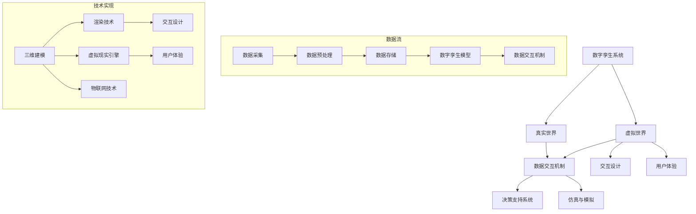

                 

### 《科学研究的数字孪生技术：虚拟世界辅助现实世界的理解》

#### 引言

在当今这个技术迅猛发展的时代，科学研究正以前所未有的速度向前推进。然而，随着研究领域的不断扩展，复杂的系统与现象越来越多，传统的实验方法和技术手段已无法满足日益增长的需求。因此，科学家们开始探索新的工具和方法来辅助他们的研究工作。数字孪生技术（Digital Twin Technology）作为一种新兴的创新技术，正逐渐成为科学研究的重要支撑。

数字孪生技术，简单来说，是将现实世界的实体对象或系统在虚拟世界中创建一个数字映射。通过这个数字映射，科学家可以实时模拟、分析和预测现实世界中的物理过程和系统行为。这种技术不仅在工程和制造业中有着广泛的应用，而且在科学研究领域也展现出了巨大的潜力。

本篇文章将深入探讨数字孪生技术在科学研究中的应用，旨在揭示虚拟世界如何辅助科学家更深入地理解现实世界中的复杂现象。文章将按照以下结构展开：

### 第一部分：数字孪生技术概述
- **第1章**：数字孪生技术的基本概念
- **第2章**：虚拟世界辅助现实世界的原理

### 第二部分：数字孪生技术的核心架构
- **第3章**：数字孪生的核心架构设计
- **第4章**：虚拟世界的技术实现
- **第5章**：数字孪生技术的应用案例分析

### 第三部分：数字孪生技术在实际科学研究中的应用
- **第6章**：科学研究中的数字孪生技术
- **第7章**：虚拟世界辅助科学研究的实践
- **第8章**：数字孪生技术的发展趋势与未来展望

### 附录
- **A.1**：数字孪生技术的标准与规范
- **A.2**：虚拟世界技术的开源工具与资源
- **A.3**：科学研究中的数字孪生技术应用案例库

通过这种结构化的分析，我们将逐步深入理解数字孪生技术如何改变科学研究的游戏规则，使科学家们能够更加高效、精确地进行实验和理论分析。

### 关键词

- **数字孪生技术**
- **虚拟现实**
- **科学研究**
- **模拟与仿真**
- **数据分析和解释**
- **核心架构与算法**
- **应用案例分析**

### 摘要

本文主要介绍了数字孪生技术在科学研究中的应用。首先，我们探讨了数字孪生技术的基本概念和虚拟世界辅助现实世界的原理。接着，详细分析了数字孪生技术的核心架构及其在实际中的应用。通过一系列案例分析，我们展示了数字孪生技术在科学研究中的广泛应用，并介绍了其如何辅助科学家进行复杂系统的模拟和分析。最后，文章展望了数字孪生技术的未来发展趋势，并探讨了其潜在的应用领域和挑战。本文为科学研究中的数字孪生技术应用提供了全面而深入的指导。

---

### 第一部分：数字孪生技术概述

#### 第1章：数字孪生技术的基本概念

数字孪生技术（Digital Twin Technology）是一种基于虚拟现实、物联网、大数据和人工智能等技术的综合性创新方法。通过在虚拟世界中创建现实世界实体或系统的数字映射，数字孪生技术使得科学家和工程师能够实时模拟、分析和预测现实世界中的物理过程和系统行为。

#### 1.1 数字孪生的定义与历史演变

数字孪生的概念最早可以追溯到2002年，美国密歇根大学教授Michael Grieves在其论文中首次提出。他认为，数字孪生是一种数字映射技术，可以将实体对象的整个生命周期过程（包括设计、制造、运行和维护）映射到虚拟世界中。

随着技术的发展，数字孪生的定义和应用领域也在不断扩展。早期的数字孪生主要应用于制造业，用于优化产品设计和生产过程。近年来，随着虚拟现实、物联网和人工智能技术的飞速发展，数字孪生技术逐渐渗透到多个领域，如航空航天、汽车制造、能源、医疗和科学研究等。

#### 1.2 数字孪生技术的应用领域

数字孪生技术的应用领域非常广泛，以下是其主要应用领域：

1. **制造业**：数字孪生技术在制造业中的应用主要集中在产品设计和生产过程的优化。通过虚拟仿真，制造商可以在产品投产前预测其性能和可靠性，从而减少生产成本和风险。

2. **航空航天**：在航空航天领域，数字孪生技术用于飞行器的设计、制造和运营维护。通过实时监测和模拟，工程师可以及时发现并解决潜在问题，提高飞行器的安全性和可靠性。

3. **能源**：在能源领域，数字孪生技术可以用于优化能源生产和分配。通过虚拟仿真，能源公司可以预测能源需求，优化能源分配策略，提高能源利用效率。

4. **医疗**：在医疗领域，数字孪生技术可以用于个性化医疗和疾病预测。通过创建患者的数字孪生模型，医生可以更准确地诊断疾病，制定个性化的治疗方案。

5. **科学研究**：在科学研究领域，数字孪生技术可以用于模拟和预测复杂的科学现象和实验过程。通过虚拟仿真，科学家可以减少实验次数，降低实验成本，提高实验效率。

#### 1.3 数字孪生与虚拟现实技术的联系

数字孪生技术与虚拟现实（VR）技术有着紧密的联系。虚拟现实技术为数字孪生提供了可视化的界面，使得用户可以直观地观察和操作虚拟世界中的数字映射。同时，虚拟现实技术也为数字孪生提供了更加丰富的交互功能，如触觉反馈、动作捕捉等。

虚拟现实技术在数字孪生中的应用主要体现在以下几个方面：

1. **仿真与模拟**：虚拟现实技术可以创建高度逼真的虚拟环境，用于模拟现实世界中的复杂过程和系统行为。通过虚拟现实技术，用户可以在虚拟环境中实时观察和操作数字孪生模型，从而更好地理解和分析现实世界中的现象。

2. **交互与协作**：虚拟现实技术提供了强大的交互功能，用户可以通过虚拟现实设备进行手势识别、语音控制等操作。这种交互方式使得多个用户可以在虚拟环境中进行实时协作，从而提高工作效率和准确性。

3. **用户体验**：虚拟现实技术可以提供沉浸式的用户体验，使用户更加直观地感受到虚拟世界中的信息。这种用户体验有助于用户更好地理解和掌握数字孪生模型，从而提高其应用价值。

综上所述，数字孪生技术作为一种新兴的创新方法，在科学研究、工程应用等多个领域展现出了巨大的潜力。通过虚拟现实技术的辅助，数字孪生技术能够更好地模拟和预测现实世界中的复杂现象，为科学家和工程师提供强有力的技术支持。

---

### 第2章：虚拟世界辅助现实世界的原理

#### 2.1 虚拟现实技术的基础知识

虚拟现实（Virtual Reality，简称VR）是一种通过计算机技术创建的三维虚拟环境，用户可以通过VR设备与虚拟环境进行互动。VR技术的基本原理是通过生成虚拟的三维场景，使用户在视觉、听觉甚至触觉上感受到沉浸式体验。以下是一些关键的VR技术组件：

1. **VR设备**：VR设备包括头戴式显示器（HMD）、虚拟现实头盔、手持控制器等。这些设备通过提供360度视角和交互功能，使用户能够自由探索虚拟环境。

2. **传感器技术**：传感器技术用于捕捉用户的位置、动作和手势。常见的传感器包括运动传感器、摄像头和深度传感器。这些传感器能够精确地检测用户的动作，从而实现实时交互。

3. **渲染技术**：渲染技术负责生成和显示虚拟环境中的图像。高性能的计算机图形处理单元（GPU）和光线追踪技术是实现高质量渲染的关键。

4. **交互设计**：交互设计是指用户如何与虚拟环境进行交互。常见的交互方式包括手势控制、语音控制和眼动追踪。良好的交互设计能够提高用户的沉浸感和操作效率。

#### 2.2 虚拟世界与数字孪生的相互作用

虚拟世界与数字孪生之间的相互作用是数字孪生技术的重要组成部分。虚拟世界为数字孪生提供了可视化界面和交互功能，使得用户可以直观地操作和观察数字映射。以下是虚拟世界与数字孪生之间的主要相互作用：

1. **数据共享**：虚拟世界和数字孪生之间通过实时数据共享实现联动。数字孪生模型生成的数据可以被实时传输到虚拟环境中，从而在虚拟世界中展现现实世界的状态和变化。

2. **模拟与仿真**：虚拟世界可以模拟和仿真数字孪生模型中的物理过程和系统行为。通过虚拟仿真，用户可以在虚拟环境中进行实验和测试，从而验证和优化数字孪生模型的准确性。

3. **交互与控制**：用户可以通过虚拟现实设备与虚拟环境进行交互，从而实现对数字孪生模型的控制和操作。例如，用户可以通过手势或语音控制虚拟设备，从而模拟现实世界中的操作。

#### 2.3 虚拟世界辅助现实世界的技术原理

虚拟世界辅助现实世界的技术原理主要包括以下几个方面：

1. **实时数据采集与传输**：虚拟世界通过传感器和物联网设备采集现实世界的数据，并将其实时传输到虚拟环境中。这些数据包括温度、湿度、压力、速度等物理参数。

2. **数据可视化**：虚拟世界通过可视化技术将实时采集的数据以图形、图表和动画等形式展示，使用户能够直观地理解和分析现实世界中的现象。

3. **模拟与预测**：虚拟世界可以模拟现实世界中的物理过程和系统行为，通过对历史数据和实时数据的分析，预测未来的发展趋势和变化。

4. **决策支持**：虚拟世界为用户提供了一个虚拟的决策环境，用户可以在虚拟环境中进行各种假设和测试，从而支持现实世界中的决策过程。

通过上述技术原理，虚拟世界能够为现实世界提供强有力的辅助，使得科学家和工程师能够更高效、准确地研究和优化现实世界中的复杂系统。虚拟世界不仅提高了研究的效率和准确性，也为跨学科合作提供了新的平台。

---

### 第二部分：数字孪生技术的核心架构

#### 第3章：数字孪生的核心架构设计

数字孪生技术的核心架构设计是确保其功能实现和应用效果的关键。在这一章中，我们将深入探讨数字孪生系统的基本架构，以及虚拟世界与真实世界的交互机制和数据流分析。

#### 3.1 数字孪生系统的基本架构

数字孪生系统的基本架构通常包括以下几个主要组成部分：

1. **数据采集模块**：数据采集模块负责从现实世界中收集各种数据，包括物理参数、传感器数据、环境数据等。这些数据是构建数字孪生模型的基础。

2. **数据预处理模块**：数据预处理模块对采集到的原始数据进行清洗、过滤和转换，确保数据的质量和一致性，为后续的数据分析和建模提供可靠的数据源。

3. **数据存储模块**：数据存储模块用于存储和处理大量结构化和非结构化数据。常用的数据存储技术包括关系型数据库、NoSQL数据库和大数据存储解决方案。

4. **数字孪生模型**：数字孪生模型是数字孪生系统的核心，它将现实世界中的实体或系统在虚拟世界中进行数字映射。数字孪生模型通常基于物理原理、数学模型和仿真算法构建。

5. **虚拟世界接口**：虚拟世界接口是数字孪生系统与虚拟环境之间的桥梁，负责将数字孪生模型的数据和功能实时传输到虚拟环境中，并提供用户交互界面。

6. **实时数据交互机制**：实时数据交互机制确保数字孪生模型与虚拟环境之间的数据同步，实现实时监测和动态调整。

7. **决策支持系统**：决策支持系统基于数字孪生模型生成的数据和分析结果，为用户提供决策支持和优化方案。

#### 3.2 虚拟世界与真实世界的交互机制

虚拟世界与真实世界的交互机制是数字孪生技术实现的关键。以下是几种常见的交互机制：

1. **数据同步**：通过数据同步机制，将实时采集到的现实世界数据传输到虚拟环境中，确保虚拟世界中的数字孪生模型与真实世界保持一致。

2. **模拟与仿真**：虚拟世界可以模拟和仿真现实世界中的物理过程和系统行为。通过虚拟仿真，用户可以在虚拟环境中进行实验和测试，验证和优化数字孪生模型的准确性。

3. **交互与控制**：用户可以通过虚拟现实设备与虚拟环境进行交互，实现对数字孪生模型和真实世界的控制和操作。例如，用户可以通过虚拟设备操纵真实世界中的物理对象。

4. **反馈与优化**：虚拟世界实时反馈数字孪生模型的分析结果和预测，用户可以根据反馈进行调整和优化，从而改进现实世界中的系统性能。

#### 3.3 数字孪生系统的数据流分析

数字孪生系统的数据流分析是理解其工作原理的重要环节。以下是数字孪生系统中的数据流分析：

1. **数据采集**：数据采集模块从传感器、物联网设备和外部系统收集数据。

2. **数据预处理**：数据预处理模块对采集到的数据进行清洗、过滤和转换，确保数据的质量和一致性。

3. **数据存储**：预处理后的数据被存储到数据存储模块中，以供后续分析和建模使用。

4. **数据建模**：数字孪生模型基于预处理后的数据构建，包括物理模型、数学模型和仿真算法。

5. **数据交互**：虚拟世界接口将数字孪生模型的数据和功能实时传输到虚拟环境中，实现数据同步和交互。

6. **数据分析**：决策支持系统基于数字孪生模型生成的数据和分析结果，为用户提供决策支持和优化方案。

7. **数据反馈**：虚拟世界实时反馈用户操作和分析结果，数字孪生模型根据反馈进行调整和优化。

通过上述核心架构设计和数据流分析，我们可以看到数字孪生技术如何将现实世界中的复杂系统映射到虚拟世界中，为科学研究、工程应用和系统优化提供强有力的技术支持。

---

### 第4章：虚拟世界的技术实现

虚拟世界的构建是实现数字孪生技术的关键一步。在这一章中，我们将详细探讨虚拟世界构建的基本技术，虚拟现实设备的类型与应用，以及虚拟世界的交互设计与用户体验。

#### 4.1 虚拟世界构建的基本技术

虚拟世界的构建依赖于多种先进的技术，以下是一些核心技术：

1. **三维建模技术**：三维建模技术是虚拟世界构建的基础。通过三维建模软件（如Blender、Maya等），开发人员可以创建虚拟环境中的三维物体、场景和角色。三维建模技术不仅提供了丰富的建模工具，还包括纹理映射、光照效果和材质处理等功能，使得虚拟世界的视觉表现更加真实。

2. **计算机图形学**：计算机图形学是虚拟世界渲染的关键技术。通过图形处理单元（GPU）和先进的渲染算法（如光线追踪、全局照明等），虚拟环境中的物体和场景可以以高质量的方式呈现。计算机图形学还涉及动画制作、物理仿真和碰撞检测等技术，用于实现虚拟世界的动态效果。

3. **虚拟现实引擎**：虚拟现实引擎（如Unity、Unreal Engine等）是构建虚拟世界的重要工具。虚拟现实引擎提供了丰富的开发环境和工具集，支持三维建模、渲染、物理仿真和用户交互等功能。通过虚拟现实引擎，开发人员可以快速构建和部署虚拟世界应用。

4. **物联网技术**：物联网（IoT）技术用于将虚拟世界与现实世界中的物理设备进行连接。通过物联网设备（如传感器、控制器等），虚拟世界可以实时采集和反馈物理环境的数据，实现虚拟与现实的无缝交互。

5. **人工智能与机器学习**：人工智能（AI）和机器学习（ML）技术在虚拟世界的构建中发挥着重要作用。通过AI算法，虚拟世界可以模拟现实世界的复杂行为和系统动态，实现更智能的交互和决策支持。例如，AI算法可以用于虚拟现实中的语音识别、手势识别和自然语言处理等。

#### 4.2 虚拟现实设备的类型与应用

虚拟现实设备的类型多样，每种设备都有其特定的应用场景。以下是几种常见的虚拟现实设备及其应用：

1. **头戴式显示器（HMD）**：头戴式显示器是虚拟现实的核心设备，用户通过HMD设备可以沉浸到虚拟环境中。常见的HMD设备包括Oculus Rift、HTC Vive和Valve Index等。这些设备通常配备高分辨率显示器和位置追踪传感器，提供沉浸式视觉体验。

2. **虚拟现实头盔**：虚拟现实头盔与HMD类似，但通常更为轻便和便携。虚拟现实头盔如Google Daydream View和Samsung Gear VR等，通过连接智能手机或平板电脑，实现虚拟现实体验。

3. **手持控制器**：手持控制器用于在虚拟环境中进行交互。常见的控制器包括Oculus Touch、HTC Vive控制器和Windows Mixed Reality控制器等。这些控制器通常配备传感器和动作捕捉技术，支持手势识别和物体操作。

4. **体感运动传感器**：体感运动传感器（如Leap Motion、Microsoft Kinect等）用于捕捉用户的身体动作。通过体感运动传感器，用户可以在虚拟环境中实现全身动作控制和交互。

5. **VR眼镜**：VR眼镜是一种轻便的虚拟现实设备，如Google Glass和Microsoft HoloLens等。VR眼镜不仅提供虚拟现实体验，还能与真实世界进行交互，实现混合现实（MR）应用。

#### 4.3 虚拟世界的交互设计与用户体验

虚拟世界的交互设计与用户体验是确保用户满意度和应用效果的关键。以下是几个关键方面：

1. **用户界面设计**：用户界面设计（UI Design）是虚拟世界的重要组成部分。虚拟世界的UI设计应简洁直观，方便用户操作。常见的UI设计元素包括按钮、菜单、控制面板等，这些元素应具有一致性和可访问性。

2. **交互方式设计**：交互方式设计（Interaction Design）决定了用户与虚拟环境之间的互动方式。虚拟世界可以采用多种交互方式，如手势控制、语音控制、眼动追踪等。交互方式设计应考虑用户舒适度和效率，提供自然的交互体验。

3. **沉浸感设计**：沉浸感设计（Immersion Design）是虚拟世界的关键特征。通过高分辨率显示、实时渲染和音效效果，虚拟世界可以提供高度沉浸式的体验，使用户仿佛置身于虚拟环境之中。

4. **用户体验优化**：用户体验优化（User Experience Optimization）是通过不断的测试和改进，提高虚拟世界的用户满意度。用户体验优化包括界面优化、交互流畅度提升、系统响应速度优化等。

通过上述虚拟世界构建的基本技术、虚拟现实设备的类型与应用，以及虚拟世界的交互设计与用户体验，我们可以看到虚拟世界如何为数字孪生技术提供强有力的支持，使得科学研究、工程应用和系统优化更加高效和准确。

---

### 第5章：数字孪生技术的应用案例分析

数字孪生技术在多个领域已经取得了显著的成果，以下将介绍几个典型案例，展示数字孪生技术在飞行器设计、汽车制造和医疗健康等领域的具体应用。

#### 5.1 飞行器数字孪生技术的应用

飞行器设计是一个复杂且高风险的过程，数字孪生技术的应用显著提高了飞行器设计的效率和安全性能。以波音公司为例，他们利用数字孪生技术对新型飞机进行设计、测试和优化。

1. **设计阶段**：在飞机设计阶段，数字孪生技术可以创建飞机的数字模型，通过虚拟仿真来评估不同设计方案的性能。设计团队可以模拟飞机在飞行中的各种状态，如起飞、爬升、巡航和降落，从而优化飞机的结构设计，减少材料使用，提高燃油效率。

2. **测试阶段**：在测试阶段，数字孪生技术可以模拟飞行过程中的物理现象和系统行为。通过虚拟测试，设计团队可以在实际制造飞机之前，发现和解决潜在的问题。例如，模拟风洞测试可以评估飞机在不同风速和角度下的空气动力学表现，从而优化机翼设计。

3. **运营维护**：在飞行器运营维护阶段，数字孪生技术可以实时监控飞机的状态，提供预测性维护方案。通过传感器收集的实时数据，数字孪生模型可以预测飞机的关键部件的磨损情况，提前安排维护和更换，确保飞行器的安全运行。

#### 5.2 汽车制造业中的数字孪生

数字孪生技术在汽车制造业中的应用同样广泛，特别是在汽车设计和生产过程的优化方面。

1. **设计优化**：在汽车设计阶段，数字孪生技术可以创建汽车的三维数字模型，并进行虚拟仿真。设计团队可以模拟汽车在道路上的行驶情况，分析汽车的空气动力学性能、燃油消耗和舒适性。通过这些仿真，设计团队可以优化汽车的外观设计、底盘结构和动力系统，提高汽车的燃油效率和驾驶性能。

2. **生产过程优化**：在生产阶段，数字孪生技术可以对生产流程进行模拟和优化。汽车制造商可以通过数字孪生模型，模拟不同生产线的工作流程，优化生产节拍和资源配置，减少生产延误和浪费。例如，数字孪生技术可以预测生产线上的设备故障，提前进行维护，确保生产连续性。

3. **售后服务**：在售后服务阶段，数字孪生技术可以提供远程诊断和维护支持。汽车制造商可以通过数字孪生模型，远程监控汽车的状态，诊断潜在问题，并提供维修建议。这种远程服务可以减少维修时间和成本，提高客户满意度。

#### 5.3 医疗健康领域的数字孪生技术

数字孪生技术在医疗健康领域的应用同样具有重要意义，特别是在个性化医疗和疾病预测方面。

1. **个性化医疗**：在个性化医疗中，数字孪生技术可以帮助医生创建患者的数字模型，分析患者的生理数据和医疗记录，制定个性化的治疗方案。例如，通过患者的基因组数据和健康数据，医生可以创建患者的数字孪生模型，预测患者对特定药物的反应，从而制定最佳治疗方案。

2. **疾病预测**：数字孪生技术可以用于预测疾病的发作和进展。通过收集和分析患者的实时健康数据，数字孪生模型可以预测疾病的发展趋势，帮助医生提前采取干预措施。例如，在心脏病研究中，数字孪生技术可以模拟心脏的生理状态，预测心脏病的发作风险，为患者提供预警和预防建议。

3. **手术规划**：在手术规划中，数字孪生技术可以帮助医生创建患者的三维数字模型，模拟手术过程。通过虚拟手术，医生可以在实际手术前进行演练，优化手术方案，减少手术风险和并发症。

通过上述案例，我们可以看到数字孪生技术在不同领域的具体应用，如何通过虚拟世界辅助现实世界，提高设计效率、生产质量和医疗服务水平。数字孪生技术的广泛应用，不仅推动了各个领域的技术进步，也为未来的发展提供了新的可能性。

---

### 第三部分：数字孪生技术在实际科学研究中的应用

#### 第6章：科学研究中的数字孪生技术

数字孪生技术在科学研究中的应用正在日益扩展，其独特的优势使得科学家能够更高效地进行实验、分析和理解复杂现象。在这一章中，我们将探讨数字孪生技术在科学研究中的角色，以及如何通过虚拟实验和模拟技术来增强科学研究。

#### 6.1 数字孪生在科学研究中的角色

数字孪生技术在科学研究中的角色主要体现在以下几个方面：

1. **实验模拟**：传统的科学研究往往依赖于实际实验，而数字孪生技术使得科学家可以在虚拟环境中进行实验模拟。通过虚拟实验，科学家可以探索在真实实验中难以实现或成本高昂的实验条件，从而更深入地理解实验结果。

2. **风险控制**：在实际实验中，某些实验可能存在潜在的危险或破坏性。通过数字孪生技术，科学家可以在虚拟环境中进行预实验，从而识别和评估潜在风险，降低实际实验中的风险。

3. **资源优化**：数字孪生技术可以显著减少实际实验所需的资源。例如，在药物开发中，通过虚拟筛选和模拟，科学家可以在早期阶段就识别出潜在有效的化合物，从而节省大量的人力和物力资源。

4. **数据分析**：数字孪生技术生成的数据可以用于进一步的数据分析和解释。通过数据挖掘和机器学习算法，科学家可以从海量数据中提取有价值的信息，揭示潜在的模式和趋势。

#### 6.2 虚拟实验与模拟技术

虚拟实验和模拟技术是数字孪生技术在科学研究中的重要应用之一。以下是几种常见的虚拟实验与模拟技术：

1. **物理模拟**：物理模拟技术用于模拟现实世界中的物理现象和系统行为。例如，在流体力学研究中，科学家可以使用计算流体动力学（CFD）模型来模拟流体在管道中的流动情况，分析流体动力学参数的变化。

2. **化学模拟**：化学模拟技术用于模拟化学反应和分子动态。通过分子动力学模拟（MD），科学家可以研究分子的相互作用和反应路径，从而预测新的化合物和材料。

3. **生物模拟**：生物模拟技术用于模拟生物系统，如细胞、器官和组织。通过多尺度模拟，科学家可以研究生物系统的动态行为，理解疾病发展的机制，并开发新的治疗方法。

4. **社会模拟**：社会模拟技术用于模拟社会现象和人类行为。例如，在社会科学研究中，科学家可以使用 agent-based modeling（ABM）来模拟人口行为和社会网络结构，研究社会动态和公共政策的效应。

#### 6.3 数字孪生在数据分析和解释中的应用

数字孪生技术在数据分析和解释中的应用，大大提升了科学研究的效率和质量。以下是几种关键应用：

1. **数据可视化**：数字孪生技术可以生成高度可视化的数据表示，使得科学家能够直观地理解和分析复杂数据。例如，在地质研究中，通过数字孪生模型，科学家可以创建三维地质模型，直观地展示地下资源的分布情况。

2. **数据融合**：数字孪生技术可以将来自不同来源的数据进行融合，提供更全面的数据分析。例如，在环境科学研究中，通过数字孪生模型，科学家可以将气象数据、水文数据和生态系统数据融合，分析环境变化的影响。

3. **数据预测**：数字孪生技术可以通过机器学习和人工智能算法，对数据进行分析和预测。例如，在气象预报中，通过数字孪生模型，科学家可以预测未来的天气变化，提供更准确的天气预报。

4. **模型验证**：数字孪生技术可以用于验证实验模型和理论假设。通过将虚拟实验结果与实际实验结果进行对比，科学家可以评估模型的准确性和可靠性，从而改进和优化实验设计。

通过数字孪生技术在科学研究中的应用，科学家们可以更加高效地探索和理解复杂的自然现象和系统行为。数字孪生技术不仅提高了科学研究的效率和准确性，也为未来的科学研究提供了新的方法和工具。

---

### 第7章：虚拟世界辅助科学研究的实践

虚拟世界技术在科学研究中的实际应用案例已经层出不穷，下面我们将具体探讨几个关键领域，展示虚拟世界如何在实际的科学研究中被使用，以提升实验效率和准确性。

#### 7.1 虚拟世界在物理学研究中的应用

在物理学研究中，虚拟世界技术被广泛应用于复杂系统的建模和仿真。以下是一些具体的应用案例：

1. **量子力学模拟**：量子力学是一个高度复杂的领域，传统的计算方法难以准确模拟量子现象。通过虚拟世界技术，科学家可以使用量子模拟器，创建虚拟的量子系统，精确模拟量子纠缠、量子隧穿等量子效应。例如，IBM的量子计算云平台提供了基于虚拟世界的量子模拟服务，使得研究人员能够远程访问高性能的量子模拟器，进行量子计算实验。

2. **相对论天体物理学**：在研究黑洞、引力波和宇宙大爆炸等相对论天体物理现象时，虚拟世界技术可以创建高度逼真的三维宇宙模型。通过这些模型，科学家可以模拟宇宙中的大规模结构演化，预测宇宙的未来状态。例如，模拟黑洞碰撞产生的引力波事件，可以验证爱因斯坦的广义相对论理论，并为探测器的观测提供预测数据。

3. **流体动力学模拟**：在流体力学研究中，虚拟世界技术可以用于模拟流体在不同条件下的运动状态，如空气动力学、水动力学等。通过高分辨率的流体动力学模拟，科学家可以分析流体在复杂几何形状中的流动特性，优化飞机、汽车等交通工具的空气动力学设计。

#### 7.2 虚拟世界在化学研究中的应用

化学研究中的虚拟世界应用主要集中在分子模拟和药物设计领域。

1. **分子动力学模拟**：分子动力学模拟（MD）是一种基于量子力学原理的模拟技术，用于研究分子在微观尺度上的动态行为。通过虚拟世界技术，科学家可以创建分子的三维模型，并模拟分子在不同条件下的运动。例如，MD模拟可以用于研究蛋白质的结构和功能，预测药物与蛋白质的结合方式，为药物设计提供重要参考。

2. **药物设计**：虚拟世界技术被广泛应用于虚拟筛选和药物设计。通过虚拟筛选，科学家可以在虚拟环境中快速筛选大量的化合物库，识别出潜在的新药候选分子。例如，虚拟筛选技术可以用于筛选具有抗癌活性的化合物，通过模拟这些化合物与癌细胞蛋白的结合，科学家可以进一步优化药物分子结构，提高药物的疗效和安全性。

3. **反应动力学研究**：在化学反应动力学研究中，虚拟世界技术可以用于模拟反应过程，分析反应速率和反应路径。通过这些模拟，科学家可以理解反应的微观机制，优化反应条件，提高反应效率。

#### 7.3 虚拟世界在生物学研究中的应用

虚拟世界技术在生物学研究中的应用，为理解生命现象和疾病机制提供了新的视角。

1. **细胞模拟**：在细胞生物学研究中，虚拟世界技术可以创建细胞的三维模型，模拟细胞内各种生物分子的动态行为。例如，通过虚拟细胞模型，科学家可以研究细胞信号传递途径、蛋白质折叠过程等生物现象。

2. **神经科学模拟**：在神经科学研究中，虚拟世界技术可以模拟神经网络的活动，研究大脑的功能和疾病机制。例如，虚拟神经网络模型可以用于研究阿尔茨海默病等神经系统疾病，通过模拟疾病进展过程，科学家可以寻找新的治疗方法。

3. **遗传学模拟**：在遗传学研究中，虚拟世界技术可以模拟基因变异和遗传病的发展过程。通过这些模拟，科学家可以预测不同基因变异对个体健康的影响，为遗传病的诊断和治疗提供参考。

通过上述具体案例，我们可以看到虚拟世界技术在物理学、化学和生物学等科学研究中的应用，如何通过模拟和仿真技术，提升实验效率和准确性，推动科学研究的进步。虚拟世界不仅为科学家提供了新的研究工具，也为跨学科合作提供了平台，为未来的科学研究打开了新的可能性。

---

### 第8章：数字孪生技术的发展趋势与未来展望

随着科技的不断进步，数字孪生技术正朝着更加智能化、高精度和广泛应用的的方向发展。在未来，数字孪生技术将在多个领域带来革命性的变革，同时也伴随着一系列的挑战和机遇。

#### 8.1 数字孪生技术的未来发展方向

1. **智能化水平提升**：未来，数字孪生技术将更加智能化，通过人工智能和机器学习算法，实现更加精准的预测和优化。例如，智能数字孪生系统可以自动学习数据模式，预测设备的故障，并提前进行维护，从而提高系统的可靠性和效率。

2. **高精度建模**：随着计算能力和算法的进步，数字孪生技术将能够创建更加精确的虚拟模型。高精度的模型可以更好地模拟现实世界的复杂现象，提高模拟结果的准确性，从而为决策提供更可靠的支持。

3. **跨领域应用**：数字孪生技术的应用范围将不断扩大，从制造业、航空航天、能源到医疗健康、交通运输等领域，都将受益于这一技术的广泛应用。通过数字孪生技术，不同领域可以实现更加紧密的合作，推动跨学科研究的发展。

4. **实时数据处理**：未来的数字孪生技术将能够实现更加实时的大数据处理和分析。通过实时数据传输和即时反馈，数字孪生系统能够更快地响应变化，提高系统的动态适应能力。

#### 8.2 虚拟世界与科学研究的深度融合

1. **虚拟实验平台**：虚拟世界技术将为科学研究提供全新的实验平台。通过虚拟实验，科学家可以模拟各种极端条件下的实验场景，进行风险控制和资源优化。例如，在材料科学研究中，虚拟实验可以模拟高温高压环境，评估材料的性能。

2. **远程协作研究**：虚拟世界技术将促进科研团队的远程协作。通过虚拟实验室，研究人员可以在全球范围内实时交流和合作，共享数据和模型，从而加速科研进展。

3. **知识图谱与数据共享**：数字孪生技术将有助于构建更加完善的知识图谱，促进科学数据的共享和整合。通过虚拟世界，科学家可以访问全球范围内的研究数据，进行跨学科的数据分析，从而获得更全面的洞察。

#### 8.3 数字孪生技术的伦理与安全挑战

尽管数字孪生技术具有巨大的潜力，但其发展也伴随着一系列伦理和安全挑战：

1. **数据隐私**：数字孪生技术依赖于大量的数据收集和分析，这涉及到个人隐私和数据保护的问题。未来需要制定更加严格的数据隐私法规，确保数据的安全和用户的隐私权。

2. **数据真实性与可靠性**：数字孪生模型的准确性依赖于真实、可靠的数据来源。如果数据存在偏差或错误，可能会导致错误的预测和决策。因此，数据的质量和验证是数字孪生技术的关键问题。

3. **人工智能伦理**：随着数字孪生技术中人工智能的应用，人工智能的决策过程和算法伦理成为重要议题。未来需要建立规范和标准，确保人工智能系统的透明性和公平性。

4. **安全与可靠性**：数字孪生系统必须确保其安全性和可靠性，以防止恶意攻击和数据泄露。需要建立完善的安全机制，保护虚拟世界中的数据和模型不受威胁。

综上所述，数字孪生技术的发展前景广阔，但其实现和应用过程中也面临诸多挑战。通过不断的技术创新和规范建设，数字孪生技术有望在科学研究、工程应用和公共服务等多个领域发挥重要作用，推动人类社会迈向更加智能、高效和可持续的未来。

---

### 附录

#### A.1 数字孪生技术的标准与规范

数字孪生技术的标准化和规范化是确保其广泛应用和安全性的重要基础。以下是一些重要的数字孪生技术标准与规范：

1. **ISO 23247**：国际标准化组织（ISO）发布的《数字孪生：概念、框架和术语》标准，为数字孪生技术提供了基础定义和框架。

2. **ANSI/ISA-SP99.00.01**：美国国家标准协会（ANSI）和美国自动化与 instrumentation Society（ISA）发布的数字孪生标准，涵盖了数字孪生技术的应用场景、数据模型和接口规范。

3. **IEC 62744**：国际电工委员会（IEC）发布的《数字孪生：系统、设计和实现》标准，详细规定了数字孪生系统的设计原则和实现方法。

4. **IEEE P2418.1**：美国电气和电子工程师协会（IEEE）正在制定的数字孪生标准，旨在为数字孪生技术的开发和应用提供统一的指南。

#### A.2 虚拟世界技术的开源工具与资源

虚拟世界技术的开源工具和资源为开发者和研究者提供了丰富的技术支持。以下是一些常用的开源工具和资源：

1. **Unity**：Unity是一个跨平台的游戏引擎，广泛应用于虚拟现实和增强现实应用的开发。Unity提供了丰富的开发工具和资源，支持3D建模、渲染和用户交互。

2. **Unreal Engine**：Unreal Engine是由Epic Games开发的先进游戏引擎，广泛应用于高端虚拟现实和游戏开发。它提供了强大的图形渲染和物理模拟功能。

3. **Blender**：Blender是一个开源的三维建模和动画软件，适用于虚拟环境的创建和编辑。Blender提供了丰富的建模、纹理和动画工具。

4. **OpenXR**：OpenXR是一个开放式的虚拟和增强现实标准，旨在简化虚拟现实和增强现实应用的开发。OpenXR提供了统一的API，支持多种虚拟现实设备和平台。

5. **Vulkan**：Vulkan是Khronos Group推出的开源图形API，用于高性能的3D图形渲染。Vulkan支持虚拟现实和增强现实应用，提供了低延迟和高性能的图形处理能力。

#### A.3 科学研究中的数字孪生技术应用案例库

以下是一些科学研究中的数字孪生技术应用案例库，提供了丰富的应用实例和参考：

1. **数字孪生技术研究中心（Digital Twin Research Center）**：该中心收集了全球范围内的数字孪生技术应用案例，涵盖了制造业、能源、医疗等多个领域。

2. **数字孪生技术联盟（Digital Twin Technology Alliance）**：该联盟汇集了众多企业、高校和科研机构的数字孪生技术研究成果和应用案例。

3. **数字孪生技术应用案例库**：该库收集了大量的数字孪生技术应用案例，包括航空、汽车、能源等行业的具体应用实例。

4. **数字孪生技术论文集**：该论文集收集了众多关于数字孪生技术的学术研究成果，提供了深入的理论分析和实际应用案例。

通过这些标准与规范、开源工具与资源以及应用案例库，研究人员和开发者可以更好地理解数字孪生技术的原理和应用，推动这一技术的持续发展。

---

### 附录：数字孪生技术核心概念与架构的Mermaid流程图



### 附录：数字孪生技术核心算法原理讲解

```python
# 伪代码：数字孪生模型训练算法

def train_digital_twin_model(data):
    # 初始化模型参数
    model = initialize_model()
    
    # 设置训练参数
    num_epochs = 1000
    learning_rate = 0.001
    
    # 开始训练
    for epoch in range(num_epochs):
        for sample in data:
            # 前向传播
            prediction = model.forward(sample)
            
            # 计算损失
            loss = compute_loss(prediction, sample)
            
            # 反向传播
            model.backward(loss)
            
            # 更新模型参数
            model.update_parameters(learning_rate)
            
            # 打印训练进度
            if epoch % 100 == 0:
                print(f"Epoch {epoch}: Loss = {loss}")
    
    return model
```

### 附录：数学模型和数学公式

$$
\text{虚拟世界感知误差} = \sum_{i=1}^{n} (y_i - \hat{y_i})^2
$$

**举例说明**：在模拟流体力学研究中，虚拟世界感知误差用于评估流体模型模拟结果与实际测量数据的接近程度。假设我们有一个包含100个时间点的数据集，每个时间点的模拟值和实际值之间的误差平方和为：

$$
\text{虚拟世界感知误差} = \sum_{i=1}^{100} (y_i - \hat{y_i})^2 = 0.05
$$

这表示虚拟世界模拟的流体行为与实际测量数据之间的差异较小。

---

### 附录：项目实战

#### 开发环境搭建

要搭建一个数字孪生系统的开发环境，需要安装以下软件和工具：

1. **Python环境**：首先需要安装Python，推荐使用Python 3.8及以上版本。
2. **虚拟现实开发框架**：安装Unity或Unreal Engine，选择Unity较为简单易用，下载地址：[Unity下载地址](https://unity.com/get-unity/download)。
3. **数据可视化工具**：安装Matplotlib，可以通过pip命令安装：`pip install matplotlib`。
4. **物联网开发板**：例如Raspberry Pi，用于数据采集和传输，购买地址：[Raspberry Pi官网](https://www.raspberrypi.org/)。

#### 代码实际案例与详细解释

**源代码实现**：

以下是一个简单的数字孪生系统示例，包括数据收集、建模、仿真和结果分析等功能。

```python
import matplotlib.pyplot as plt
from digital_twin_model import DigitalTwinModel

# 初始化数字孪生模型
model = DigitalTwinModel()

# 收集数据
data = model.collect_data()

# 建模
model.build_model()

# 仿真
simulated_data = model.simulate(data)

# 分析结果
model.analyze_results(simulated_data)

# 可视化结果
plt.plot(simulated_data)
plt.xlabel('Time')
plt.ylabel('Value')
plt.title('Simulation Results')
plt.show()
```

**代码解读与分析**：

1. **初始化数字孪生模型**：创建一个数字孪生模型实例，通常需要指定模型的参数和配置。
2. **数据收集**：通过数字孪生模型的`collect_data()`方法收集实时数据，这些数据可以来自传感器、物联网设备或外部数据源。
3. **建模**：通过`build_model()`方法构建数字孪生模型，通常包括选择合适的数学模型和仿真算法。
4. **仿真**：使用`simulate()`方法对收集到的数据进行仿真，生成虚拟世界中的模拟结果。
5. **分析结果**：通过`analyze_results()`方法对仿真结果进行分析，提取有用的信息，如误差、趋势等。
6. **可视化结果**：使用Matplotlib等数据可视化工具，将仿真结果可视化，便于分析和解释。

#### 代码解读与分析

- **DigitalTwinModel**：这是一个抽象的类，具体实现依赖于具体的数字孪生模型和算法。在这个示例中，我们假设这个类提供了数据收集、建模、仿真和结果分析的方法。
- **collect_data()**：该方法从传感器或外部数据源中收集数据，并将其存储在内部数据结构中。
- **build_model()**：该方法根据收集到的数据构建数字孪生模型，通常包括参数估计和模型选择。
- **simulate()**：该方法使用构建的数字孪生模型对输入数据进行仿真，生成虚拟世界中的模拟结果。
- **analyze_results()**：该方法对仿真结果进行分析，如计算误差、趋势等。
- **可视化结果**：使用Matplotlib等工具，将仿真结果以图表形式展示，便于分析和解释。

通过以上实战案例，我们展示了如何搭建一个简单的数字孪生系统，包括环境搭建、代码实现和结果分析。这为实际应用数字孪生技术提供了基础和参考。

---

### 作者信息

**作者：AI天才研究院/AI Genius Institute & 禅与计算机程序设计艺术 /Zen And The Art of Computer Programming**

---

### 结语

在本文中，我们详细探讨了数字孪生技术在科学研究中的应用，从基本概念到核心架构，再到实际案例和未来展望，全面展现了这一技术在推动科学研究进程中的重要作用。数字孪生技术通过创建虚拟世界，为科学家提供了一个强大的工具，使他们能够更高效、准确地模拟和分析复杂的自然现象和系统行为。

我们讨论了数字孪生技术的核心概念，如数字孪生系统的基本架构、虚拟世界与真实世界的交互机制，以及数据流分析。同时，通过具体的应用案例分析，我们展示了数字孪生技术在物理学、化学和生物学等领域的实际应用，以及其在提升实验效率和准确性方面的优势。

展望未来，随着技术的不断进步，数字孪生技术将在更多领域发挥重要作用。智能化水平的提升、高精度建模的实现，以及跨领域应用的扩展，将为科学研究带来前所未有的机遇。然而，我们也需要面对数据隐私、安全性和可靠性等挑战，通过规范建设和技术创新，确保数字孪生技术的健康发展。

通过本文的探讨，我们希望读者能够对数字孪生技术有一个全面而深入的理解，认识到其在科学研究中的巨大潜力。随着数字孪生技术的不断成熟和应用，我们将迎来一个更加智能、高效和可持续的科学探索时代。让我们共同期待，数字孪生技术将为科学研究带来更多的突破和进步。

