                 

### 引言与背景

#### 1.1 科技创新的基本概念与发展趋势

科技创新，是指通过科学研究和开发新的技术、产品、服务或商业模式的过程。其核心概念包括创新、技术进步和科技革命。创新，是指对已有技术进行改进或创造出全新的技术；技术进步，是指现有技术的不断提升和优化；科技革命，则是在短时间内发生并对人类社会产生深远影响的重大变革。

科技创新的发展趋势主要体现在以下几个领域：

- **人工智能**：通过模拟人类智能行为，实现机器对复杂问题的自主解决。人工智能的应用范围广泛，包括自动驾驶、智能医疗、金融科技等。
- **大数据分析**：通过对大量数据的收集、存储、管理和分析，从中发现规律和趋势。大数据分析已经广泛应用于各个行业，如电商、医疗、金融等。
- **物联网**：通过将各种物理设备连接到互联网，实现信息的实时交换和处理。物联网的应用包括智能家居、智能城市、智能制造等。

#### 1.2 社会治理的挑战与需求

社会治理，是指政府、企业和社会组织通过协调合作，维护社会秩序、促进社会发展和实现社会公正的过程。随着社会的不断发展，社会治理面临着许多挑战和需求：

- **社会安全**：随着人口增长和城市化进程的加快，社会安全问题日益突出。如何维护社会安全、减少犯罪率成为社会治理的重要挑战。
- **环境治理**：环境污染和生态破坏对社会和人类健康造成严重威胁。如何实现环境保护和可持续发展，成为社会治理的重要需求。
- **公共健康**：随着疾病谱的变化和人口老龄化，公共健康问题日益严峻。如何提高医疗水平、保障公众健康，成为社会治理的重要需求。

科技创新在应对社会治理的挑战和满足需求方面具有重要作用。通过科技创新，可以提升社会治理的智能化和高效性，促进社会和谐与可持续发展。

#### 1.3 科技创新对社会治理的潜在影响

科技创新对社会治理的潜在影响主要表现在以下几个方面：

- **提升公共安全**：通过人工智能、大数据分析等技术，可以实现对公共安全的实时监测和预警，提高社会治安水平。
- **优化环境治理**：通过物联网、绿色能源等技术，可以实现环境监测和污染控制，促进环境保护和可持续发展。
- **改善公共健康**：通过精准医疗、智能健康监测等技术，可以提升医疗水平、保障公众健康，降低疾病发生率和死亡率。

总之，科技创新为社会治理带来了新的思路和方法，有助于解决社会问题、提升社会治理水平。随着科技的不断进步，科技创新在社会治理中的应用将更加广泛和深入。

### 科技创新的基本概念与发展趋势

#### 1.1 科技创新的基本概念

**核心概念与联系**

- **科技创新**：科技创新是指通过科学研究和技术开发产生新技术、新产品、新服务或新商业模式的过程。它是一个涉及多个方面的复杂体系，包括技术创新、知识创造、产品开发、商业模式创新等。科技创新的核心在于将科学理论转化为实际应用，从而推动社会进步和经济发展。

- **科技革命**：科技革命是指在一定时期内发生的、对人类社会产生深远影响的重大科技变革。科技革命通常伴随着技术的突破性进展，如工业革命、信息革命等。这些革命不仅改变了生产力，还深刻影响了生产关系和社会结构。

- **技术进步**：技术进步是指现有技术的不断改进、提升和应用。技术进步可以通过技术创新来实现，也可以通过优化现有技术、降低成本、提高效率等方式实现。技术进步是科技创新的重要组成部分，它为科技创新提供了基础和支撑。

**Mermaid 流�程图**

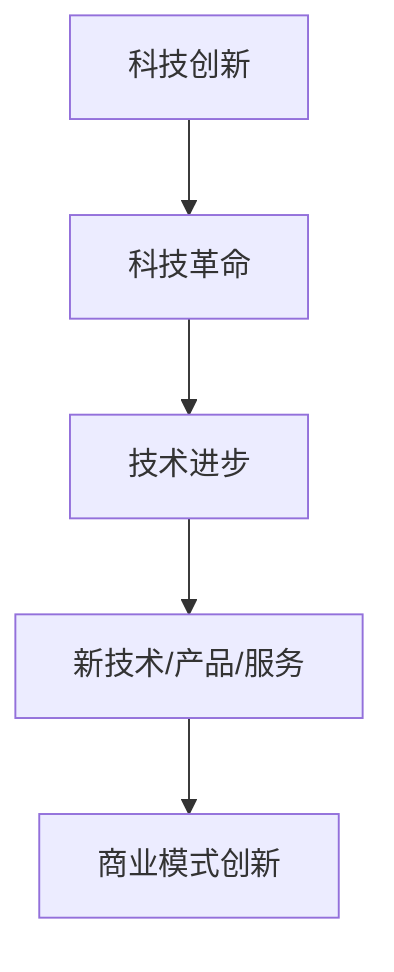

**核心算法原理讲解**

科技创新的过程可以看作是一个复杂的算法，其核心原理包括以下几个步骤：

1. **科学研究**：科学研究是科技创新的基础，它通过实验、观察和理论分析，揭示自然现象和规律。
2. **技术开发**：在科学研究的基础上，技术开发通过实验和工程实践，将科学理论转化为实际技术。
3. **产品开发**：产品开发是将技术开发成果转化为新产品或新服务的过程，它涉及到产品设计、制造、测试和市场化等环节。
4. **商业模式创新**：商业模式创新是指通过新的商业模式，实现技术价值的最大化。商业模式创新可以是全新的商业模式，也可以是对现有商业模式的改进和创新。

**数学模型和数学公式**

科技创新过程中的数学模型和公式可以用来描述技术创新的效率和效果。例如，创新效率可以表示为：

$$
E = \frac{I}{C}
$$

其中，\(E\) 表示创新效率，\(I\) 表示创新成果，\(C\) 表示创新成本。

**举例说明**

- **人工智能**：人工智能领域的科技创新包括神经网络模型的提出、深度学习算法的开发、以及智能系统的应用。这些创新不仅改变了计算机科学，还深刻影响了金融、医疗、交通等多个行业。
- **太阳能技术**：太阳能技术的创新包括光伏材料的研发、太阳能电池的制造、以及太阳能系统的集成和应用。这些创新推动了可再生能源的发展，促进了环境保护和可持续发展。
- **互联网**：互联网的科技创新包括TCP/IP协议的开发、Web技术的应用、以及电子商务的兴起。这些创新不仅改变了信息传播的方式，还推动了全球化的进程。

**项目实战**

以人工智能领域的深度学习为例，一个典型的项目实战包括以下步骤：

1. **开发环境搭建**：搭建深度学习开发环境，包括安装Python、TensorFlow等工具。
2. **数据准备**：收集和准备训练数据，例如图像数据集或文本数据集。
3. **模型设计**：设计深度学习模型，包括选择神经网络架构、定义损失函数和优化算法。
4. **模型训练**：使用训练数据训练模型，通过调整模型参数，优化模型性能。
5. **模型评估**：使用测试数据评估模型性能，确保模型在实际应用中能够达到预期效果。
6. **模型部署**：将训练好的模型部署到生产环境中，实现自动化预测和决策。

**代码解读与分析**

以下是一个简单的深度学习模型训练的Python代码示例：

```python
import tensorflow as tf
from tensorflow.keras import layers

# 数据准备
(x_train, y_train), (x_test, y_test) = tf.keras.datasets.mnist.load_data()

# 模型设计
model = tf.keras.Sequential([
    layers.Flatten(input_shape=(28, 28)),
    layers.Dense(128, activation='relu'),
    layers.Dense(10, activation='softmax')
])

# 模型编译
model.compile(optimizer='adam',
              loss='sparse_categorical_crossentropy',
              metrics=['accuracy'])

# 模型训练
model.fit(x_train, y_train, epochs=5)

# 模型评估
test_loss, test_acc = model.evaluate(x_test,  y_test, verbose=2)
print('\nTest accuracy:', test_acc)
```

在这个示例中，我们使用 TensorFlow 和 Keras 库搭建了一个简单的卷积神经网络模型，用于对 MNIST 数据集进行手写数字识别。代码首先加载数据集，然后设计模型架构，编译模型，最后进行模型训练和评估。通过这个示例，我们可以看到深度学习模型训练的基本流程和代码实现。

#### 1.2 社会治理的挑战与需求

**核心概念与联系**

- **社会安全**：社会安全是指社会秩序的稳定和人民生活的安全。社会安全是社会治理的重要目标之一，它包括预防犯罪、应对突发事件、维护社会秩序等方面。
- **环境治理**：环境治理是指对环境污染、生态破坏等进行治理和修复。环境治理是保障生态安全、促进可持续发展的重要措施，它包括污染防治、资源节约、生态修复等方面。
- **公共健康**：公共健康是指通过医疗、预防措施等保障公众健康。公共健康是社会治理的重要组成部分，它包括疾病预防、健康促进、医疗服务等方面。

**Mermaid 流程图**

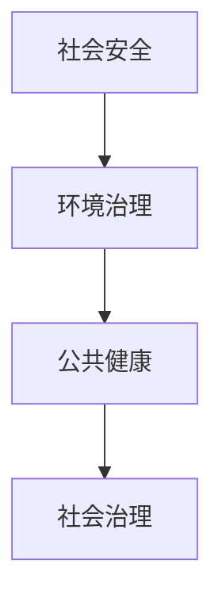

**核心算法原理讲解**

社会治理的挑战与需求可以通过以下核心算法原理进行理解和解决：

- **大数据分析**：大数据分析是一种通过处理和分析海量数据，从中提取有用信息和知识的技术。大数据分析可以用于社会安全预测、环境监测、健康数据分析等方面，帮助政府和企业更好地进行决策和管理。
- **人工智能**：人工智能是一种通过模拟人类智能行为，实现机器对复杂问题的自主解决的技术。人工智能可以用于智能安防、智能交通、智能医疗等方面，提高社会治理的智能化和效率。
- **物联网**：物联网是一种通过将各种物理设备连接到互联网，实现信息的实时交换和处理的技术。物联网可以用于环境监测、智能城市、智能交通等方面，提高社会治理的实时性和精准性。

**数学模型和数学公式**

社会治理中常用的数学模型和数学公式包括：

- **机器学习模型**：例如线性回归、逻辑回归、决策树、神经网络等，用于预测和分析。
- **时间序列分析模型**：例如 ARIMA、SARIMA 等，用于环境监测和公共安全预测。
- **马尔可夫链**：用于模拟社会安全事件的传播和演化。

**举例说明**

- **社会安全预测**：通过大数据分析，政府可以利用历史犯罪数据和实时数据，预测犯罪热点区域，提前部署警力，提高社会安全水平。
- **环境监测**：通过物联网技术，政府可以实时监测空气质量、水质、土壤污染等指标，及时发现和应对环境问题。
- **健康数据分析**：通过大数据分析和人工智能技术，医院可以分析患者数据，预测疾病风险，制定个性化治疗方案，提高医疗服务质量。

**项目实战**

以社会安全预测为例，一个项目实战的步骤包括：

1. **数据收集**：收集历史犯罪数据和实时社会安全数据，如报警记录、交通流量等。
2. **数据处理**：清洗和预处理数据，包括数据去重、数据标准化等。
3. **模型训练**：使用机器学习算法训练预测模型，如决策树、随机森林等。
4. **模型评估**：使用测试数据评估模型性能，调整模型参数。
5. **模型部署**：将训练好的模型部署到生产环境中，实现实时预测和报警。

**代码解读与分析**

以下是一个简单的社会安全预测模型的Python代码示例：

```python
import pandas as pd
from sklearn.ensemble import RandomForestClassifier
from sklearn.model_selection import train_test_split
from sklearn.metrics import accuracy_score

# 数据收集
data = pd.read_csv('crime_data.csv')

# 数据处理
X = data.drop('crime', axis=1)
y = data['crime']

# 模型训练
X_train, X_test, y_train, y_test = train_test_split(X, y, test_size=0.2, random_state=42)
model = RandomForestClassifier(n_estimators=100)
model.fit(X_train, y_train)

# 模型评估
y_pred = model.predict(X_test)
accuracy = accuracy_score(y_test, y_pred)
print('Test accuracy:', accuracy)
```

在这个示例中，我们使用 Pandas 库加载数据，使用 Scikit-learn 库的 RandomForestClassifier 算法训练预测模型，最后使用测试数据评估模型性能。通过这个示例，我们可以看到社会安全预测模型的基本流程和代码实现。

### 科技创新在公共安全治理中的应用

#### 3.1 智能安防系统

**核心概念与联系**

- **智能视频监控**：智能视频监控是一种利用计算机视觉和人工智能技术，对视频数据进行实时分析、识别和报警的系统。它能够实现对犯罪行为、异常事件的实时监控和快速响应。
- **人脸识别技术**：人脸识别技术是一种通过比较人脸图像或视频中的面部特征，进行身份验证和追踪的技术。它能够实现对人员的实时识别和跟踪，有助于提高公共安全水平。
- **物联网技术**：物联网技术是一种通过将各种物理设备连接到互联网，实现信息的实时交换和处理的技术。在智能安防系统中，物联网技术可以实现对安防设备的远程监控和管理，提高系统的智能化和联动性。

**Mermaid 流程图**

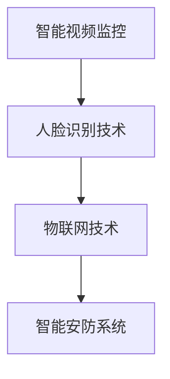

**核心算法原理讲解**

智能安防系统中的核心算法原理主要包括：

- **计算机视觉算法**：用于视频数据的预处理、目标检测、跟踪和识别。常见的算法包括卷积神经网络（CNN）、循环神经网络（RNN）等。
- **人脸识别算法**：用于人脸图像的特征提取和匹配。常见的人脸识别算法包括深度学习算法、基于特征的人脸识别算法等。
- **数据挖掘算法**：用于从海量数据中挖掘潜在的威胁信息，如聚类分析、关联规则挖掘等。

**数学模型和数学公式**

智能安防系统中常用的数学模型和数学公式包括：

- **特征提取模型**：例如主成分分析（PCA）、线性判别分析（LDA）等，用于提取人脸图像的特征。
- **分类模型**：例如支持向量机（SVM）、决策树（DT）等，用于分类和预测。
- **聚类模型**：例如K-均值聚类（K-Means）等，用于对监控数据进行聚类分析。

**举例说明**

- **智能视频监控**：通过计算机视觉算法，可以实现对犯罪现场的实时监控和快速报警。例如，当监控视频中发现有人持械斗殴时，系统会自动报警并记录现场视频。
- **人脸识别技术**：通过人脸识别算法，可以实现对犯罪嫌疑人身份的快速识别和追踪。例如，在大型活动或重要场所，通过人脸识别技术，可以实时监控并识别可疑人员。
- **物联网技术**：通过物联网技术，可以实现对安防设备的远程监控和管理。例如，在公共场所，通过物联网设备，可以实时监控摄像头、门禁系统等，确保设备正常运行。

**项目实战**

以人脸识别技术为例，一个项目实战的步骤包括：

1. **数据收集**：收集人脸图像数据，包括正面、侧面、不同光照条件等。
2. **数据处理**：对图像数据进行预处理，包括人脸检测、人脸对齐、图像增强等。
3. **模型训练**：使用深度学习算法训练人脸识别模型，如卷积神经网络（CNN）。
4. **模型评估**：使用测试数据评估模型性能，调整模型参数。
5. **模型部署**：将训练好的模型部署到生产环境中，实现实时人脸识别。

**代码解读与分析**

以下是一个简单的人脸识别模型训练的Python代码示例：

```python
import tensorflow as tf
from tensorflow.keras.models import Sequential
from tensorflow.keras.layers import Conv2D, MaxPooling2D, Flatten, Dense
from tensorflow.keras.preprocessing.image import ImageDataGenerator

# 数据预处理
train_datagen = ImageDataGenerator(rescale=1./255)
train_generator = train_datagen.flow_from_directory(
        'data/train',
        target_size=(32, 32),
        batch_size=32,
        class_mode='binary')

# 模型设计
model = Sequential([
    Conv2D(32, (3, 3), activation='relu', input_shape=(32, 32, 3)),
    MaxPooling2D((2, 2)),
    Flatten(),
    Dense(128, activation='relu'),
    Dense(1, activation='sigmoid')
])

# 模型编译
model.compile(optimizer='adam',
              loss='binary_crossentropy',
              metrics=['accuracy'])

# 模型训练
model.fit(train_generator, epochs=10)

# 模型评估
test_loss, test_acc = model.evaluate(test_generator, verbose=2)
print('\nTest accuracy:', test_acc)
```

在这个示例中，我们使用 TensorFlow 和 Keras 库搭建了一个简单的人脸识别模型，使用 ImageDataGenerator 库对训练数据进行预处理，然后使用模型进行训练和评估。通过这个示例，我们可以看到人脸识别模型的基本流程和代码实现。

#### 3.2 物联网技术在公共安全治理中的应用

**核心概念与联系**

- **传感器网络**：传感器网络是一种由大量传感器节点组成的网络，用于收集环境数据。传感器网络在公共安全治理中可以用于环境监测、火灾预警、地震预警等。
- **无线通信技术**：无线通信技术是一种通过无线信号传输数据的技术。在公共安全治理中，无线通信技术可以用于实时监控、紧急通信、远程控制等。
- **云计算与大数据分析**：云计算是一种通过互联网提供计算资源、存储资源、网络资源等服务的技术。大数据分析是一种通过处理和分析海量数据，从中提取有用信息和知识的技术。云计算与大数据分析在公共安全治理中可以用于数据存储、数据分析、智能预测等。

**Mermaid 流程图**

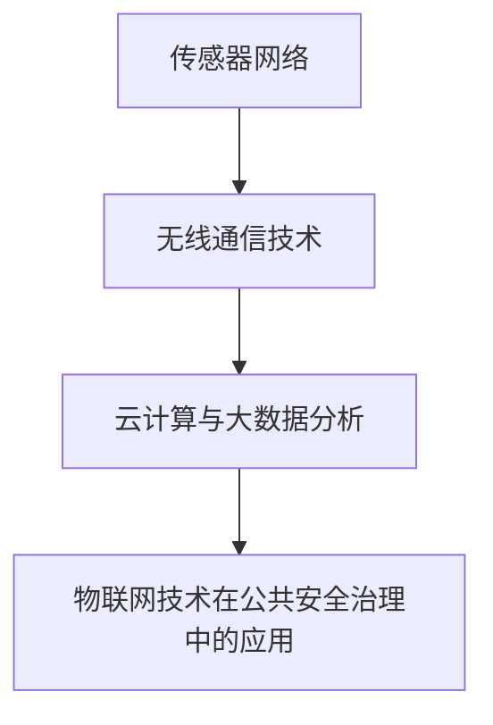

**核心算法原理讲解**

物联网技术在公共安全治理中的应用涉及以下核心算法原理：

- **传感器数据处理算法**：用于对传感器网络收集到的数据进行预处理、滤波和融合。常见的算法包括卡尔曼滤波、粒子滤波等。
- **无线通信算法**：用于实现无线通信的可靠性和效率。常见的算法包括正交频分复用（OFDM）、差分编码等。
- **大数据分析算法**：用于处理和分析海量数据，提取有价值的信息。常见的大数据分析算法包括聚类分析、关联规则挖掘、机器学习算法等。

**数学模型和数学公式**

物联网技术在公共安全治理中常用的数学模型和数学公式包括：

- **卡尔曼滤波**：用于传感器数据的实时估计和预测。
- **决策树**：用于分类和预测。
- **神经网络**：用于分类和回归。

**举例说明**

- **传感器网络**：在火灾预警系统中，传感器网络可以实时监测火灾指标，如温度、烟雾浓度等，一旦检测到异常，系统会立即报警并通知相关部门。
- **无线通信技术**：在紧急通信系统中，无线通信技术可以保证在灾难发生时，救援人员能够及时获取现场信息，提高救援效率。
- **云计算与大数据分析**：在智能交通管理系统中，云计算与大数据分析可以用于实时监测交通流量，预测交通拥堵，提供最优路线推荐。

**项目实战**

以传感器网络在环境监测中的应用为例，一个项目实战的步骤包括：

1. **传感器节点部署**：在监测区域部署传感器节点，如空气温度传感器、湿度传感器、PM2.5传感器等。
2. **数据采集**：传感器节点实时采集环境数据，并通过无线通信技术传输到中心服务器。
3. **数据预处理**：对采集到的数据进行预处理，包括去噪、滤波和融合等。
4. **数据存储**：将预处理后的数据存储到数据库中，便于后续分析和查询。
5. **数据分析**：使用大数据分析算法对存储的数据进行分析，提取有价值的信息，如环境质量变化趋势、污染源等。
6. **决策与预警**：根据分析结果，系统可以自动生成预警信息，通知相关部门采取相应的措施。

**代码解读与分析**

以下是一个简单的传感器数据采集和处理的Python代码示例：

```python
import serial
import time
import pandas as pd

# 串口连接
ser = serial.Serial('COM3', 9600)

# 数据采集
data = []
while True:
    line = ser.readline().decode('utf-8').strip()
    if line:
        data.append(line)
        time.sleep(1)

# 数据预处理
df = pd.DataFrame(data, columns=['timestamp', 'temperature', 'humidity', 'PM2.5'])

# 数据存储
df.to_csv('sensor_data.csv', index=False)

# 数据分析
df.describe()
```

在这个示例中，我们使用 Python 的 serial 库连接传感器串口，读取传感器数据，并将其存储到 CSV 文件中。然后，我们使用 Pandas 库对数据进行分析，提取关键信息。通过这个示例，我们可以看到传感器数据采集和预处理的基本流程和代码实现。

### 科技创新在环境保护治理中的应用

#### 4.1 环境监测技术

**核心概念与联系**

- **空气质量监测**：空气质量监测是指通过监测空气质量指标，评估空气质量状况。空气质量监测可以实时监测空气中的污染物浓度，如PM2.5、PM10、SO2、NO2等，为政府和公众提供环境质量信息。
- **水质监测**：水质监测是指通过监测水质指标，评估水质状况。水质监测可以实时监测水体中的污染物浓度，如COD、BOD、氨氮、重金属等，为水环境保护提供依据。
- **土壤污染监测**：土壤污染监测是指通过监测土壤污染指标，评估土壤污染状况。土壤污染监测可以实时监测土壤中的污染物浓度，如重金属、有机污染物等，为土壤污染防治提供数据支持。

**Mermaid 流程图**

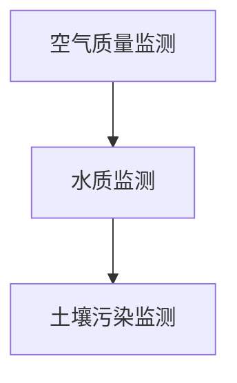

**核心算法原理讲解**

环境监测技术中的核心算法原理主要包括：

- **传感器数据处理算法**：用于对传感器网络收集到的环境数据进行预处理、滤波和融合。常见的算法包括卡尔曼滤波、粒子滤波等。
- **数据挖掘算法**：用于从海量环境数据中挖掘潜在的污染信息。常见的数据挖掘算法包括聚类分析、关联规则挖掘、时间序列分析等。
- **机器学习算法**：用于对环境数据进行分类、预测和决策。常见的机器学习算法包括支持向量机（SVM）、决策树（DT）、神经网络（NN）等。

**数学模型和数学公式**

环境监测技术中常用的数学模型和数学公式包括：

- **卡尔曼滤波**：用于传感器数据的实时估计和预测。
- **主成分分析（PCA）**：用于数据降维和特征提取。
- **决策树**：用于分类和预测。
- **神经网络**：用于分类和回归。

**举例说明**

- **空气质量监测**：通过传感器网络和大数据分析技术，政府可以实时监测空气质量，及时发现污染源，采取有效的污染控制措施，保护公众健康。
- **水质监测**：通过水质传感器和物联网技术，政府可以实时监测水质状况，确保饮用水安全，防止水污染事故发生。
- **土壤污染监测**：通过土壤传感器和大数据分析技术，政府可以实时监测土壤污染状况，制定土壤修复方案，保护土壤生态安全。

**项目实战**

以空气质量监测为例，一个项目实战的步骤包括：

1. **传感器节点部署**：在重点监测区域部署空气质量传感器，如PM2.5传感器、PM10传感器等。
2. **数据采集**：传感器节点实时采集空气质量数据，并通过无线通信技术传输到中心服务器。
3. **数据预处理**：对采集到的空气质量数据进行预处理，包括去噪、滤波和融合等。
4. **数据存储**：将预处理后的空气质量数据存储到数据库中，便于后续分析和查询。
5. **数据分析**：使用数据挖掘和机器学习算法对空气质量数据进行分析，提取污染源、污染趋势等信息。
6. **决策与预警**：根据分析结果，系统可以自动生成污染预警信息，通知相关部门采取相应的措施。

**代码解读与分析**

以下是一个简单的空气质量监测系统的Python代码示例：

```python
import serial
import time
import pandas as pd

# 串口连接
ser = serial.Serial('COM3', 9600)

# 数据采集
data = []
while True:
    line = ser.readline().decode('utf-8').strip()
    if line:
        data.append(line)
        time.sleep(1)

# 数据预处理
df = pd.DataFrame(data, columns=['timestamp', 'PM2.5', 'PM10'])

# 数据存储
df.to_csv('air_quality_data.csv', index=False)

# 数据分析
df.describe()
```

在这个示例中，我们使用 Python 的 serial 库连接空气质量传感器串口，读取传感器数据，并将其存储到 CSV 文件中。然后，我们使用 Pandas 库对数据进行分析，提取关键信息。通过这个示例，我们可以看到空气质量监测系统的基本流程和代码实现。

#### 4.2 绿色能源技术

**核心概念与联系**

- **太阳能技术**：太阳能技术是一种利用光伏效应将太阳能直接转化为电能的技术。太阳能技术包括光伏电池、光伏发电系统等。
- **风能技术**：风能技术是一种利用风力驱动涡轮机将风能转化为电能的技术。风能技术包括风力涡轮机、风电场等。
- **生物质能技术**：生物质能技术是一种利用生物质资源（如农业废弃物、林业废弃物等）通过转化过程产生电能或热能的技术。生物质能技术包括生物质发电、生物质供热等。

**Mermaid 流程图**

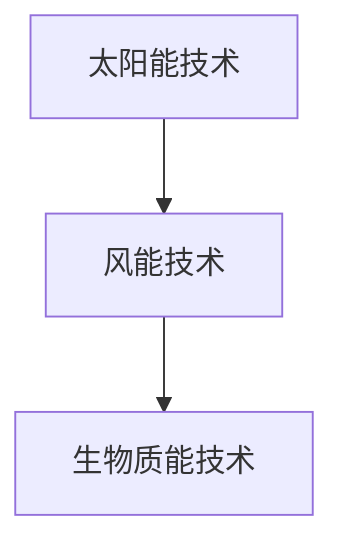

**核心算法原理讲解**

绿色能源技术中的核心算法原理主要包括：

- **能量转换算法**：用于太阳能、风能和生物质能的转化效率优化。常见的能量转换算法包括光伏电池模拟、风力涡轮机设计等。
- **能效优化算法**：用于提高绿色能源系统的能效和稳定性。常见的能效优化算法包括优化控制算法、能量管理算法等。
- **数据处理算法**：用于处理和分析绿色能源系统的数据，如发电量、能量消耗等。常见的数据处理算法包括数据采集与预处理、时间序列分析等。

**数学模型和数学公式**

绿色能源技术中常用的数学模型和数学公式包括：

- **光伏电池模型**：用于描述光伏电池的输出特性，如光伏效应方程。
- **风力涡轮机模型**：用于描述风力涡轮机的能量转换过程，如风力功率方程。
- **生物质能转化模型**：用于描述生物质能的转化过程，如生物质热值计算。

**举例说明**

- **太阳能技术**：通过光伏电池板将太阳能转化为电能，应用于家庭、企业和公共设施的供电。太阳能技术具有清洁、可再生、分布广泛等特点。
- **风能技术**：通过风力涡轮机将风能转化为电能，应用于风力发电场。风能技术具有清洁、可再生、能量巨大等特点。
- **生物质能技术**：通过生物质发电和生物质供热，将生物质能转化为电能和热能，应用于家庭、工业和农业等领域。生物质能技术具有可再生、环保、资源丰富等特点。

**项目实战**

以太阳能光伏发电系统为例，一个项目实战的步骤包括：

1. **太阳能资源评估**：评估安装地点的太阳能资源，如日照时间、辐射强度等。
2. **系统设计**：设计光伏发电系统，包括光伏电池板、逆变器、储能系统等。
3. **安装与调试**：在评估的地点安装光伏发电系统，并进行调试，确保系统正常运行。
4. **数据监测**：使用传感器和监控系统实时监测光伏发电系统的运行数据，如发电量、能耗等。
5. **优化与维护**：根据监测数据优化系统运行，进行定期维护，确保系统长期稳定运行。

**代码解读与分析**

以下是一个简单的太阳能光伏发电系统数据监测的Python代码示例：

```python
import serial
import time
import pandas as pd

# 串口连接
ser = serial.Serial('COM3', 9600)

# 数据采集
data = []
while True:
    line = ser.readline().decode('utf-8').strip()
    if line:
        data.append(line)
        time.sleep(1)

# 数据预处理
df = pd.DataFrame(data, columns=['timestamp', 'PV_output', 'energy_consumed'])

# 数据存储
df.to_csv('solar_energy_data.csv', index=False)

# 数据分析
df.describe()
```

在这个示例中，我们使用 Python 的 serial 库连接太阳能光伏发电系统的串口，读取系统运行数据，并将其存储到 CSV 文件中。然后，我们使用 Pandas 库对数据进行分析，提取关键信息。通过这个示例，我们可以看到太阳能光伏发电系统数据监测的基本流程和代码实现。

### 科技创新在公共健康治理中的应用

#### 5.1 大数据分析与健康监测

**核心概念与联系**

- **大数据分析**：大数据分析是一种通过处理和分析海量数据，从中提取有用信息和知识的技术。在公共健康治理中，大数据分析可以用于健康数据的收集、存储、管理和分析，从而为公共卫生决策提供科学依据。
- **健康大数据**：健康大数据是指与健康相关的数据，包括医疗记录、体检数据、健康监测数据等。健康大数据可以反映公众的健康状况、疾病趋势和健康需求，为公共卫生政策制定和实施提供重要参考。
- **智能健康监测设备**：智能健康监测设备是指通过物联网、传感器技术等实现对人体生理指标进行实时监测的设备。智能健康监测设备可以收集大量健康数据，为公众提供个性化的健康管理和医疗服务。

**Mermaid 流程图**

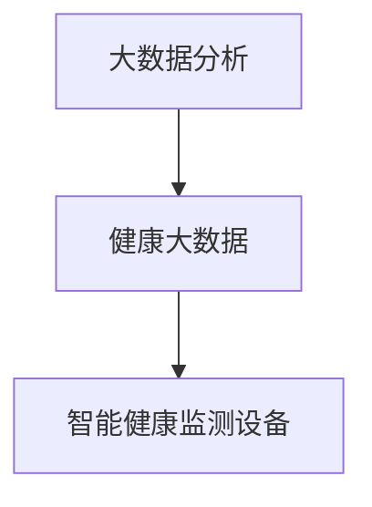

**核心算法原理讲解**

大数据分析与健康监测的核心算法原理主要包括：

- **数据预处理算法**：用于清洗、转换和整合健康大数据。常见的预处理算法包括缺失值处理、异常值检测、数据标准化等。
- **数据挖掘算法**：用于从健康大数据中挖掘潜在的规律和模式。常见的数据挖掘算法包括聚类分析、关联规则挖掘、时间序列分析等。
- **机器学习算法**：用于对健康数据进行分类、预测和决策。常见的机器学习算法包括支持向量机（SVM）、决策树（DT）、神经网络（NN）等。

**数学模型和数学公式**

大数据分析与健康监测中常用的数学模型和数学公式包括：

- **线性回归模型**：用于预测健康指标与相关因素之间的关系。
- **逻辑回归模型**：用于分析健康问题的概率。
- **时间序列模型**：用于预测健康数据的趋势和周期性变化。

**举例说明**

- **大数据分析**：通过对大量健康数据的分析，政府可以了解公众的健康状况和疾病趋势，从而制定更科学的公共卫生政策。例如，通过分析流感病毒的传播数据，可以预测流感的流行季节和流行范围。
- **健康大数据**：通过收集和分析健康大数据，医疗机构可以提供更加精准的医疗服务。例如，通过对患者的电子病历进行分析，可以预测患者的疾病风险，提供个性化的预防措施。
- **智能健康监测设备**：通过智能健康监测设备，个人可以实时了解自己的健康状况，及时采取健康干预措施。例如，智能手表可以实时监测心率、步数等生理指标，为用户提供健康建议。

**项目实战**

以大数据分析在疾病预测中的应用为例，一个项目实战的步骤包括：

1. **数据收集**：收集历史疾病数据，如病例记录、流行病报告等。
2. **数据处理**：清洗和预处理数据，包括数据去重、数据标准化等。
3. **模型训练**：使用机器学习算法训练预测模型，如决策树、随机森林等。
4. **模型评估**：使用测试数据评估模型性能，调整模型参数。
5. **模型部署**：将训练好的模型部署到生产环境中，实现实时预测和预警。

**代码解读与分析**

以下是一个简单的疾病预测模型的Python代码示例：

```python
import pandas as pd
from sklearn.ensemble import RandomForestClassifier
from sklearn.model_selection import train_test_split
from sklearn.metrics import accuracy_score

# 数据收集
data = pd.read_csv('disease_data.csv')

# 数据处理
X = data.drop('disease', axis=1)
y = data['disease']

# 模型训练
X_train, X_test, y_train, y_test = train_test_split(X, y, test_size=0.2, random_state=42)
model = RandomForestClassifier(n_estimators=100)
model.fit(X_train, y_train)

# 模型评估
y_pred = model.predict(X_test)
accuracy = accuracy_score(y_test, y_pred)
print('Test accuracy:', accuracy)
```

在这个示例中，我们使用 Pandas 库加载数据，使用 Scikit-learn 库的 RandomForestClassifier 算法训练预测模型，最后使用测试数据评估模型性能。通过这个示例，我们可以看到疾病预测模型的基本流程和代码实现。

### 科技创新在公共健康治理中的应用

#### 5.2 精准医疗技术

**核心概念与联系**

- **基因测序技术**：基因测序技术是指通过测定DNA或RNA序列，获取个体的基因信息。基因测序技术包括DNA测序、RNA测序、全基因组测序等，是精准医疗的重要基础。
- **生物信息技术**：生物信息技术是指利用计算机技术、数学模型和生物科学知识，对生物数据进行处理、分析和解释的技术。生物信息技术包括基因注释、基因表达分析、蛋白质组学等，是精准医疗的重要工具。
- **精准医疗**：精准医疗是指根据个体的基因信息、生活习惯、环境等因素，提供个性化的诊断和治疗方案。精准医疗的目标是提高治疗效果、降低治疗成本、减少副作用。

**Mermaid 流程图**

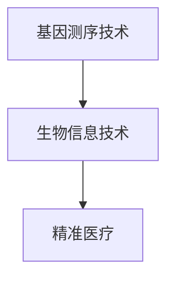

**核心算法原理讲解**

精准医疗技术中的核心算法原理主要包括：

- **序列比对算法**：用于比对DNA或RNA序列，识别基因变异和突变。常见的序列比对算法包括BLAST、Smith-Waterman算法等。
- **机器学习算法**：用于分析基因数据，预测疾病风险和药物响应。常见的机器学习算法包括支持向量机（SVM）、随机森林（RF）、深度学习（DL）等。
- **数据挖掘算法**：用于从生物数据中挖掘潜在的生物标记物和药物靶点。常见的数据挖掘算法包括关联规则挖掘、聚类分析、分类算法等。

**数学模型和数学公式**

精准医疗技术中常用的数学模型和数学公式包括：

- **贝叶斯网络**：用于描述基因与疾病之间的概率关系。
- **神经网络**：用于模型训练和预测。
- **支持向量机**：用于分类和回归。

**举例说明**

- **基因测序技术**：通过基因测序技术，可以识别个体的基因突变，预测疾病风险。例如，通过全基因组测序，可以识别与肺癌相关的基因突变，为肺癌的早期诊断和治疗提供依据。
- **生物信息技术**：通过生物信息技术，可以分析基因数据，发现与疾病相关的生物标记物。例如，通过基因表达分析，可以识别与乳腺癌相关的基因表达模式，为乳腺癌的早期诊断和治疗提供依据。
- **精准医疗**：通过精准医疗技术，可以为个体提供个性化的诊断和治疗方案。例如，通过基因测序和生物信息分析，可以为癌症患者制定个性化的靶向治疗和免疫治疗方案，提高治疗效果。

**项目实战**

以基因测序技术在癌症诊断中的应用为例，一个项目实战的步骤包括：

1. **样本收集**：收集癌症患者的血液或组织样本。
2. **基因测序**：对样本进行基因测序，获取个体的基因信息。
3. **数据预处理**：对测序数据进行质量控制和过滤，提取有效的基因信息。
4. **数据分析和模型训练**：使用生物信息技术和机器学习算法，分析基因数据，构建预测模型。
5. **模型评估和部署**：使用测试数据评估模型性能，将训练好的模型部署到诊断系统中。

**代码解读与分析**

以下是一个简单的基因测序数据分析的Python代码示例：

```python
import pandas as pd
from sklearn.ensemble import RandomForestClassifier
from sklearn.model_selection import train_test_split
from sklearn.metrics import accuracy_score

# 数据收集
data = pd.read_csv('gene_expression_data.csv')

# 数据处理
X = data.drop('disease', axis=1)
y = data['disease']

# 模型训练
X_train, X_test, y_train, y_test = train_test_split(X, y, test_size=0.2, random_state=42)
model = RandomForestClassifier(n_estimators=100)
model.fit(X_train, y_train)

# 模型评估
y_pred = model.predict(X_test)
accuracy = accuracy_score(y_test, y_pred)
print('Test accuracy:', accuracy)
```

在这个示例中，我们使用 Pandas 库加载数据，使用 Scikit-learn 库的 RandomForestClassifier 算法训练预测模型，最后使用测试数据评估模型性能。通过这个示例，我们可以看到基因测序数据分析的基本流程和代码实现。

### 科技创新与社会治理的深度融合

#### 6.1 政府与市场在科技创新社会治理中的角色

**核心概念与联系**

- **政府**：政府在科技创新社会治理中扮演着引导和支持的角色。政府通过制定政策、法规和标准，引导科技创新的发展方向，为科技创新提供良好的政策环境。此外，政府还负责监督和管理科技创新项目，确保项目的合规性和社会效益。
- **市场**：市场在科技创新社会治理中扮演着推动和发展的角色。市场通过市场需求和资源分配，推动科技创新的商业化应用，为科技创新提供经济动力。市场机制能够促进创新资源的有效配置，激发企业和个人的创新活力。

**Mermaid 流程图**

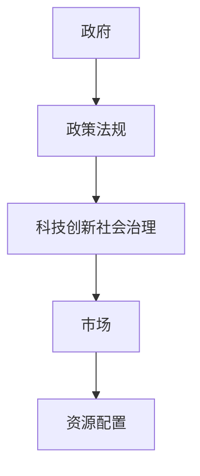

**核心算法原理讲解**

在科技创新社会治理中，政府与市场的角色可以通过以下核心算法原理进行理解和协调：

- **政策优化算法**：政府可以采用政策优化算法，如线性规划、动态规划等，制定科学的科技创新政策，最大化社会效益。
- **市场机制**：市场机制通过供需关系、价格机制等，实现科技创新资源的有效配置和优化。
- **协同治理算法**：政府与市场可以采用协同治理算法，如多目标优化、博弈论等，实现科技创新社会治理的协同效应。

**数学模型和数学公式**

- **政策优化模型**：例如线性规划模型、多目标优化模型，用于制定科技创新政策。
- **市场资源配置模型**：例如供需模型、价格模型，用于分析市场机制对科技创新资源的影响。

**举例说明**

- **政策优化**：政府通过制定科技创新政策，如研发补贴、税收优惠等，激励企业进行科技创新。例如，政府可以通过研发补贴政策，鼓励企业研发新技术、新产品，推动产业升级。
- **市场机制**：市场通过价格机制和供需关系，推动科技创新的商业化应用。例如，市场需求可以促使企业研发更具竞争力的产品，满足消费者的需求。
- **协同治理**：政府与市场通过协同治理，实现科技创新社会治理的协同效应。例如，政府可以通过制定标准、规范，确保科技创新项目的合规性和社会效益；市场通过技术创新和商业化应用，推动社会问题的解决。

**项目实战**

以研发补贴政策为例，一个项目实战的步骤包括：

1. **政策制定**：政府根据科技创新的需求和目标，制定研发补贴政策。
2. **政策宣传**：政府通过媒体、会议等方式，宣传研发补贴政策，提高企业对政策的了解和参与度。
3. **项目申报**：企业根据研发计划和市场需求，申报科技创新项目。
4. **政策审核**：政府相关部门对申报的项目进行审核，确保项目的合规性和可行性。
5. **补贴发放**：政府根据审核结果，对符合条件的研发项目发放补贴。
6. **效果评估**：政府定期对研发补贴政策的效果进行评估，优化政策内容和执行方式。

**代码解读与分析**

以下是一个简单的研发补贴政策审核的Python代码示例：

```python
import pandas as pd

# 申报项目数据
project_data = pd.read_csv('project_data.csv')

# 补贴政策条件
subsidy_conditions = {
    'budget': 1000000,
    'staff': 50,
    'duration': 12
}

# 补贴审核
def subsidy_audit(project):
    if project['budget'] <= subsidy_conditions['budget'] and \
       project['staff'] >= subsidy_conditions['staff'] and \
       project['duration'] >= subsidy_conditions['duration']:
        return True
    else:
        return False

# 审核结果
results = project_data.apply(lambda row: subsidy_audit(row), axis=1)

# 输出审核结果
print(results)
```

在这个示例中，我们使用 Pandas 库加载数据，定义补贴政策条件，并编写审核函数对申报项目进行审核。通过这个示例，我们可以看到研发补贴政策审核的基本流程和代码实现。

### 6.2 公共-私人合作模式

**核心概念与联系**

- **公共-私人合作**：公共-私人合作（Public-Private Partnership，简称PPP）是指政府与私营部门通过合作，共同承担项目的设计、融资、建设、运营和维护等工作。PPP模式旨在发挥政府与市场的优势，提高项目效率和质量，减轻政府财政负担。
- **政府购买服务**：政府购买服务是指政府通过招标或直接委托等方式，向私营部门购买公共服务，如医疗、教育、交通等。政府购买服务有助于政府集中资源，提高公共服务供给效率。
- **公私合作伙伴关系**：公私合作伙伴关系（Public-Private Partnership，简称PPP）是指政府与私营部门建立长期合作关系，共同推动项目实施和管理。公私合作伙伴关系强调合作双方的互利共赢，共同承担风险和收益。
- **政府引导市场化运作**：政府引导市场化运作是指政府通过政策引导、资金支持、市场监管等方式，推动市场机制在科技创新社会治理中的作用。政府引导市场化运作有助于激发市场活力，提高科技创新效率。

**Mermaid 流程图**

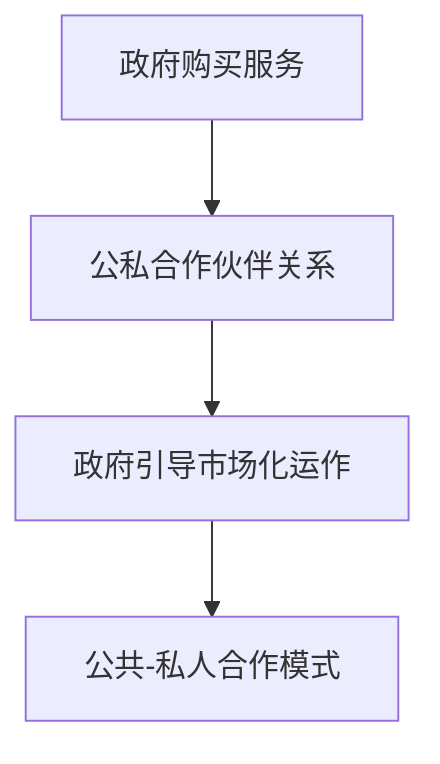

**核心算法原理讲解**

公共-私人合作模式中的核心算法原理主要包括：

- **项目评估算法**：用于评估项目的经济效益、社会效益和环境效益。常见的项目评估算法包括成本效益分析、多属性决策分析等。
- **风险管理算法**：用于识别和管理项目风险。常见风险管理算法包括风险识别、风险评估、风险应对策略等。
- **合作模式优化算法**：用于优化公共-私人合作的模式，提高合作效率和效益。常见的优化算法包括博弈论、线性规划等。

**数学模型和数学公式**

公共-私人合作模式中常用的数学模型和数学公式包括：

- **成本效益分析模型**：例如净现值（NPV）、内部收益率（IRR）等，用于评估项目的经济效益。
- **多属性决策模型**：例如层次分析法（AHP）、多目标规划等，用于评估项目的社会效益和环境效益。
- **风险管理模型**：例如概率分布模型、蒙特卡罗模拟等，用于识别和管理项目风险。

**举例说明**

- **政府购买服务**：政府通过购买服务模式，可以引入私营部门的优质资源，提高公共服务的质量和效率。例如，政府可以通过购买服务模式，引入私营医疗机构，提高医疗服务的供给效率。
- **公私合作伙伴关系**：公私合作伙伴关系可以充分发挥政府与市场的优势，实现资源的优化配置。例如，政府与私营企业合作建设智慧城市，通过共同投资、运营和管理，提高城市管理水平。
- **政府引导市场化运作**：政府通过引导市场化运作，可以激发市场活力，推动科技创新和社会治理的融合发展。例如，政府通过制定科技创新政策、提供资金支持，引导企业进行科技创新，推动产业升级。

**项目实战**

以智慧城市建设为例，一个项目实战的步骤包括：

1. **需求分析**：分析城市管理的需求和痛点，确定智慧城市项目的目标和任务。
2. **项目评估**：采用成本效益分析模型和多属性决策模型，评估智慧城市项目的经济效益、社会效益和环境效益。
3. **合作模式设计**：设计政府与私营企业的合作模式，明确双方的职责、权利和义务。
4. **项目实施**：政府与私营企业共同实施智慧城市项目，包括项目规划、设计、建设、运营和维护等环节。
5. **效果评估**：对智慧城市项目的效果进行评估，包括经济效益、社会效益和环境效益等。
6. **持续优化**：根据项目评估结果，对智慧城市项目进行持续优化，提高项目质量和效益。

**代码解读与分析**

以下是一个简单的智慧城市建设项目评估的Python代码示例：

```python
import pandas as pd
from sklearn.metrics.pairwise import cosine_similarity

# 项目评估数据
evaluation_data = pd.read_csv('evaluation_data.csv')

# 成本效益分析模型
def cost_benefit_analysis(project):
    cost = project['total_cost']
    benefit = project['total_benefit']
    npv = benefit - cost
    irr = (1 + npv / cost) ** (1 / project['duration']) - 1
    return npv, irr

# 多属性决策模型
def multi_attribute_decision(attribute_data):
    max_attribute = attribute_data.max(axis=1)
    similarity = cosine_similarity(attribute_data, max_attribute.reshape(1, -1))
    return similarity

# 项目评估
projects = evaluation_data.groupby('project_id').mean()
npv_results = projects.apply(lambda row: cost_benefit_analysis(row), axis=1)
similarity_results = multi_attribute_decision(evaluation_data)

# 输出评估结果
print('NPV results:', npv_results)
print('Similarity results:', similarity_results)
```

在这个示例中，我们使用 Pandas 库加载数据，定义成本效益分析模型和多属性决策模型，对智慧城市建设项目进行评估。通过这个示例，我们可以看到智慧城市建设项目评估的基本流程和代码实现。

### 科技创新社会治理的挑战与应对

#### 7.1 隐私保护与数据安全

**核心概念与联系**

- **隐私保护**：隐私保护是指保护个人隐私数据，防止其被未经授权的访问、使用和泄露。隐私保护是科技创新社会治理中面临的重要挑战之一，关系到公众的信任和社会的稳定。
- **数据安全**：数据安全是指确保数据在存储、传输和处理过程中的完整性、保密性和可用性。数据安全是科技创新社会治理的基础，对于维护社会秩序和公众利益至关重要。

**Mermaid 流程图**

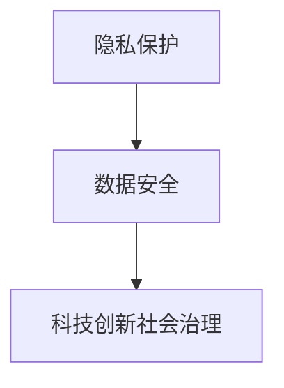

**核心算法原理讲解**

隐私保护与数据安全的核心算法原理主要包括：

- **加密算法**：加密算法用于保护数据的保密性，将数据转换为无法直接解读的形式。常见的加密算法包括对称加密、非对称加密、哈希函数等。
- **访问控制算法**：访问控制算法用于控制对数据资源的访问权限，确保只有授权用户可以访问敏感数据。常见的访问控制算法包括角色访问控制、访问控制列表等。
- **安全协议**：安全协议用于确保数据在传输过程中的完整性和可靠性。常见的安全协议包括SSL/TLS、IPSec等。

**数学模型和数学公式**

隐私保护与数据安全中常用的数学模型和数学公式包括：

- **加密模型**：例如RSA加密模型、AES加密模型等，用于加密和解密数据。
- **访问控制模型**：例如DAC（Discretionary Access Control）模型、MAC（Mandatory Access Control）模型等，用于实现访问控制。
- **安全协议模型**：例如SSL/TLS协议模型，用于确保数据传输的安全性。

**举例说明**

- **加密算法**：使用RSA加密算法，可以实现对敏感数据的加密保护，确保数据在传输和存储过程中的保密性。
- **访问控制算法**：通过访问控制列表（ACL），可以实现对不同用户对数据资源的访问权限进行精细管理，确保数据安全。
- **安全协议**：使用SSL/TLS协议，可以确保数据在互联网传输过程中的完整性和可靠性，防止数据被窃取或篡改。

**项目实战**

以加密算法在隐私保护中的应用为例，一个项目实战的步骤包括：

1. **数据加密**：使用RSA加密算法对敏感数据进行加密，生成加密文件。
2. **密钥管理**：生成RSA密钥对，并对密钥进行安全存储和管理，确保密钥不被泄露。
3. **数据解密**：使用RSA加密算法对加密文件进行解密，恢复原始数据。
4. **安全测试**：对加密和解密过程进行安全测试，确保数据在加密和解密过程中的完整性和保密性。

**代码解读与分析**

以下是一个简单的RSA加密和解密的Python代码示例：

```python
from Crypto.PublicKey import RSA
from Crypto.Cipher import PKCS1_OAEP
import base64

# RSA加密
def rsa_encrypt(message, public_key):
    cipher = PKCS1_OAEP.new(public_key)
    encrypted_message = cipher.encrypt(message.encode('utf-8'))
    return base64.b64encode(encrypted_message).decode('utf-8')

# RSA解密
def rsa_decrypt(encrypted_message, private_key):
    cipher = PKCS1_OAEP.new(private_key)
    decrypted_message = cipher.decrypt(base64.b64decode(encrypted_message))
    return decrypted_message.decode('utf-8')

# 生成RSA密钥对
key = RSA.generate(2048)
private_key = key.export_key()
public_key = key.publickey().export_key()

# 加密示例
message = "Hello, World!"
encrypted_message = rsa_encrypt(message, public_key)
print("Encrypted message:", encrypted_message)

# 解密示例
decrypted_message = rsa_decrypt(encrypted_message, private_key)
print("Decrypted message:", decrypted_message)
```

在这个示例中，我们使用 PyCryptodome 库实现 RSA 加密和解密，生成 RSA 密钥对，并对示例消息进行加密和解密。通过这个示例，我们可以看到 RSA 加密和解密的基本流程和代码实现。

#### 7.2 伦理与法律问题

**核心概念与联系**

- **伦理问题**：伦理问题是指在科技创新社会治理中涉及到的道德和伦理方面的问题。包括人工智能的伦理问题、大数据伦理问题、隐私伦理问题等。
- **法律问题**：法律问题是指在科技创新社会治理中涉及到的法律和法规方面的问题。包括知识产权保护、数据隐私保护、网络安全等。

**Mermaid 流程图**

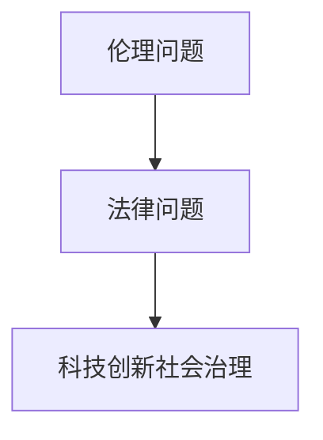

**核心算法原理讲解**

伦理与法律问题的核心算法原理主要包括：

- **伦理决策算法**：用于评估科技创新项目的伦理风险，指导项目实施过程中的伦理决策。常见的伦理决策算法包括伦理框架分析、伦理决策支持系统等。
- **法律合规算法**：用于评估科技创新项目的法律合规性，确保项目符合相关法律法规。常见的法律合规算法包括法律法规分析、合规性检查等。
- **隐私保护算法**：用于保护个人隐私数据，确保数据在收集、存储、传输和使用过程中的隐私保护。常见的隐私保护算法包括数据去识别化、匿名化等。

**数学模型和数学公式**

伦理与法律问题中常用的数学模型和数学公式包括：

- **伦理决策模型**：例如多属性决策模型、博弈论模型等，用于评估科技创新项目的伦理风险。
- **法律合规模型**：例如法律法规分析模型、合规性检查模型等，用于评估科技创新项目的法律合规性。
- **隐私保护模型**：例如数据去识别化模型、匿名化模型等，用于保护个人隐私数据。

**举例说明**

- **伦理问题**：在人工智能应用中，需要关注伦理问题，如算法偏见、隐私泄露等。例如，人工智能系统在招聘中的应用需要确保算法的公平性和透明性，避免因算法偏见导致歧视现象。
- **法律问题**：在数据收集和使用过程中，需要关注法律问题，如数据隐私保护、知识产权保护等。例如，企业收集用户数据时需要确保用户同意，并采取有效措施保护用户隐私。
- **隐私保护算法**：通过数据去识别化技术，可以降低个人隐私数据被识别的风险。例如，使用匿名化算法对个人数据进行处理，确保个人隐私不被泄露。

**项目实战**

以伦理决策算法在人工智能应用中的应用为例，一个项目实战的步骤包括：

1. **问题定义**：明确人工智能应用中的伦理问题，如算法偏见、数据隐私等。
2. **伦理框架分析**：采用伦理框架分析算法，评估人工智能应用中的伦理风险。
3. **决策支持**：根据伦理框架分析结果，制定相应的伦理决策支持策略，指导项目实施。
4. **效果评估**：对伦理决策支持策略进行效果评估，确保人工智能应用的伦理风险得到有效控制。

**代码解读与分析**

以下是一个简单的伦理决策算法的Python代码示例：

```python
import pandas as pd
from sklearn.metrics.pairwise import cosine_similarity

# 伦理决策算法
def ethical_decisionmaking(ethics_data, threshold=0.5):
    max_similarity = cosine_similarity(ethics_data)[0, 1]
    if max_similarity > threshold:
        return "伦理风险高"
    else:
        return "伦理风险低"

# 伦理风险数据
ethics_data = pd.DataFrame({
    'ethics_issue': ['algorithm bias', 'data privacy', 'data security'],
    'risk_level': [0.7, 0.4, 0.6]
})

# 伦理决策
decision = ethical_decisionmaking(ethics_data)
print("Ethical decision:", decision)
```

在这个示例中，我们使用 Pandas 库加载数据，定义伦理决策算法，对伦理风险数据进行分析，评估伦理风险。通过这个示例，我们可以看到伦理决策算法的基本流程和代码实现。

### 7.3 技术与社会的适应性问题

**核心概念与联系**

- **技术适应**：技术适应是指技术创新与社会需求之间的匹配程度，包括技术功能、使用方式、成本效益等。技术适应性问题主要体现在技术创新是否能满足社会的实际需求，以及社会是否能接受和适应新技术。
- **社会适应**：社会适应是指社会对技术创新的接受程度和适应能力，包括文化、法律、伦理、经济等方面。社会适应性问题主要体现在社会是否能够积极接受新技术，以及新技术对社会结构和生活方式的影响。

**Mermaid 流程图**

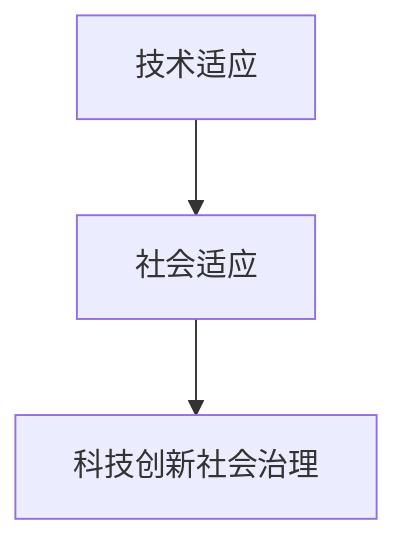

**核心算法原理讲解**

技术与社会的适应性问题可以通过以下核心算法原理进行理解和解决：

- **适应性评估算法**：用于评估技术创新的社会适应性，包括技术功能、成本效益、社会影响等。常见的适应性评估算法包括多属性决策分析、社会影响力分析等。
- **社会响应模型**：用于模拟社会对技术创新的响应，包括社会接受度、适应性变化等。常见的响应模型包括社会扩散模型、社会反馈模型等。
- **适应性优化算法**：用于优化技术创新，提高其社会适应性。常见的优化算法包括多目标优化、遗传算法等。

**数学模型和数学公式**

技术与社会的适应性问题中常用的数学模型和数学公式包括：

- **多属性决策模型**：例如加权评分模型、TOPSIS模型等，用于评估技术创新的适应性。
- **社会扩散模型**：例如 Bass 模型、Logistic 模型等，用于模拟社会对技术创新的响应。
- **多目标优化模型**：例如目标规划模型、遗传算法模型等，用于优化技术创新。

**举例说明**

- **适应性评估算法**：通过对技术创新的多属性评估，可以确定其适应社会需求的程度。例如，通过评估新产品的功能、成本和用户满意度等指标，可以确定其市场适应性。
- **社会响应模型**：通过模拟社会对技术创新的响应，可以预测其市场前景和推广效果。例如，使用 Bass 模型可以预测新产品的销售趋势，指导市场推广策略。
- **适应性优化算法**：通过优化技术创新，可以提高其社会适应性。例如，通过遗传算法优化产品设计，可以提高产品的市场竞争力。

**项目实战**

以适应性评估算法在新产品开发中的应用为例，一个项目实战的步骤包括：

1. **需求分析**：收集市场需求和用户反馈，确定新产品的功能和技术需求。
2. **多属性决策分析**：使用多属性决策模型，对新产品的功能、成本和用户满意度等指标进行评估，确定其市场适应性。
3. **市场调研**：通过市场调研，收集用户对新产品的评价和反馈，验证评估结果的准确性。
4. **产品优化**：根据评估结果和市场反馈，优化新产品的功能和设计，提高其市场适应性。
5. **产品发布**：将优化后的新产品发布到市场，监测其市场表现和用户反馈。

**代码解读与分析**

以下是一个简单的多属性决策分析的Python代码示例：

```python
import pandas as pd
from sklearn.metrics.pairwise import cosine_similarity

# 多属性决策分析
def multi_attribute_decisionmaking(attributes_data, weights):
    similarity = cosine_similarity(attributes_data, weights.reshape(1, -1))
    return similarity[0, 0]

# 属性数据
attributes_data = pd.DataFrame({
    'functionality': [8, 7, 6],
    'cost': [5, 6, 7],
    'user_satisfaction': [9, 8, 7]
})

# 权重
weights = pd.Series([0.4, 0.3, 0.3])

# 决策分析
decision = multi_attribute_decisionmaking(attributes_data, weights)
print("Decision score:", decision)
```

在这个示例中，我们使用 Pandas 库加载数据，定义多属性决策分析函数，对新产品的功能、成本和用户满意度等属性进行评估。通过这个示例，我们可以看到多属性决策分析的基本流程和代码实现。

### 未来展望与建议

#### 8.1 科技创新社会治理的未来趋势

随着科技的不断发展，科技创新在社会治理中的应用将越来越广泛和深入。未来，科技创新社会治理将呈现以下趋势：

- **智能化与数字化**：智能化和数字化将成为科技创新社会治理的核心驱动力。通过人工智能、大数据分析、物联网等技术的应用，社会治理将变得更加智能、高效和精准。
- **生态化与绿色化**：环境保护和可持续发展将成为科技创新社会治理的重要方向。绿色能源、生态修复、环境监测等技术的应用，将有助于实现生态化与绿色化的发展目标。
- **个性化与精细化**：基于大数据和人工智能技术的个性化服务将成为社会治理的重要趋势。通过精准医疗、个性化教育、精准执法等技术的应用，社会治理将更加贴近公众需求，实现精细化治理。

**Mermaid 流程图**

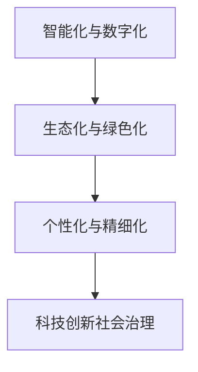

**核心算法原理讲解**

未来科技创新社会治理的核心算法原理将包括：

- **深度学习与神经网络**：深度学习与神经网络技术将在社会治理中得到广泛应用，如智能安防、智能交通、智能医疗等。
- **大数据分析与预测**：大数据分析技术将进一步提升社会治理的预测和决策能力，如公共安全预测、环境监测预测、健康预测等。
- **区块链与分布式计算**：区块链技术将在数据安全、隐私保护、智能合约等方面发挥重要作用，推动社会治理的透明化和去中心化。

**数学模型和数学公式**

未来科技创新社会治理中常用的数学模型和数学公式包括：

- **深度学习模型**：如卷积神经网络（CNN）、循环神经网络（RNN）、生成对抗网络（GAN）等。
- **时间序列分析模型**：如 ARIMA、SARIMA、LSTM等，用于预测和分析。
- **优化模型**：如线性规划、非线性规划、遗传算法等，用于优化决策。

**举例说明**

- **智能安防**：通过深度学习和计算机视觉技术，实现实时监控和智能分析，提高公共安全水平。
- **智能交通**：通过大数据分析和人工智能技术，实现交通流量预测和优化，提高交通效率，减少拥堵。
- **精准医疗**：通过大数据分析和基因测序技术，实现个性化诊断和治疗，提高医疗质量和效果。

#### 8.2 我国科技创新社会治理的发展建议

为了更好地推动科技创新在社会治理中的应用，我国可以从以下几个方面提出发展建议：

- **加强政策支持**：政府应加强科技创新社会治理的政策支持，制定有利于科技创新的政策法规，鼓励企业、科研机构和高校开展科技创新研究。
- **加大投入**：政府应加大对科技创新社会治理的投入，特别是在人工智能、大数据分析、物联网等领域，提供充足的资金和资源支持。
- **推动产业协同**：政府应推动科技创新产业链的协同发展，促进产业链上下游企业、科研机构、高校等各方的合作，形成创新合力。
- **强化人才培养**：政府应加强科技创新社会治理的人才培养，提高科技创新人才的素质和数量，为科技创新社会治理提供人才支持。
- **推进国际合作**：政府应积极推动国际科技创新合作，引进国外先进的科技创新成果和管理经验，提升我国科技创新社会治理的国际竞争力。

**Mermaid 流�程图**

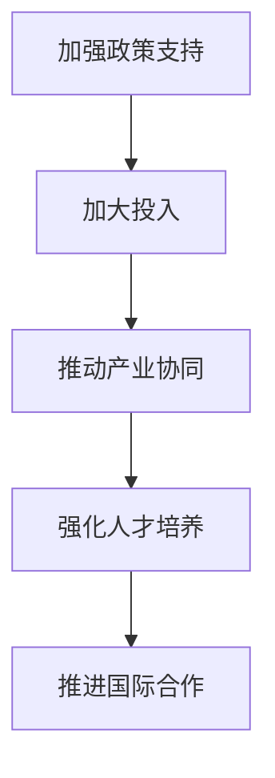

**核心算法原理讲解**

发展建议中的核心算法原理包括：

- **政策优化算法**：用于优化科技创新社会治理的政策，提高政策的有效性和执行力。
- **多属性决策分析**：用于评估不同发展建议的优劣，实现多目标的综合平衡。
- **社会响应模型**：用于预测不同发展建议对社会的影响和响应。

**数学模型和数学公式**

发展建议中的数学模型和数学公式包括：

- **政策优化模型**：如线性规划模型、多目标规划模型等，用于制定和优化政策。
- **多属性决策模型**：如加权评分模型、TOPSIS模型等，用于评估发展建议的优劣。
- **社会响应模型**：如 Bass 模型、Logistic 模型等，用于预测社会对科技创新社会治理的响应。

**举例说明**

- **政策优化算法**：通过政策优化算法，可以制定更科学、更有效的科技创新社会治理政策，提高政策的执行力。
- **多属性决策分析**：通过多属性决策分析，可以综合考虑各种发展建议的优劣，选择最优的发展方案。
- **社会响应模型**：通过社会响应模型，可以预测社会对科技创新社会治理的响应，为政策调整和优化提供依据。

#### 8.3 世界各国科技创新社会治理的实践与启示

世界各国在科技创新社会治理方面已经进行了大量的实践，积累了丰富的经验。以下是一些国家和地区的实践与启示：

- **美国**：美国在科技创新社会治理方面具有领先地位，其成功经验包括：

  - **政府主导**：美国政府在科技创新社会治理中发挥着重要作用，通过制定政策、提供资金支持等方式，推动科技创新和社会治理的融合发展。
  - **产学研合作**：美国鼓励产学研合作，促进科技创新成果的转化和应用，提高科技创新的实效性。
  - **数据开放**：美国积极推进数据开放，为科研人员和社会公众提供丰富的数据资源，促进科技创新和社会治理的发展。

- **欧盟**：欧盟在科技创新社会治理方面也取得了显著成果，其成功经验包括：

  - **区域合作**：欧盟通过区域合作，实现科技创新和社会治理的协同发展，推动欧洲一体化进程。
  - **政策协调**：欧盟通过制定统一的科技创新政策，协调各成员国的发展，提高欧盟整体的科技创新水平。
  - **技术创新平台**：欧盟建立了多个技术创新平台，促进科技创新项目的实施和推广，提升欧盟的科技创新能力。

- **日本**：日本在科技创新社会治理方面也有不少成功经验，其特点包括：

  - **技术研发**：日本重视技术研发，通过投入大量资金和人力资源，推动科技创新和社会治理的发展。
  - **人才培养**：日本注重人才培养，通过高等教育和职业教育，培养大量的科技创新人才，为科技创新社会治理提供人才支持。
  - **社会参与**：日本鼓励社会公众参与科技创新社会治理，提高社会的科技创新意识和能力。

这些国家和地区的成功经验对我国科技创新社会治理具有启示作用。我们可以借鉴他们的经验，结合我国的实际情况，制定符合国情的科技创新社会治理发展战略。

**Mermaid 流程图**

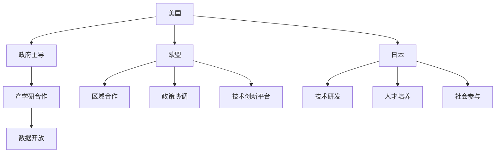

**核心算法原理讲解**

世界各国科技创新社会治理的实践与启示中的核心算法原理包括：

- **政策优化算法**：用于优化科技创新社会治理的政策，提高政策的有效性和执行力。
- **多属性决策分析**：用于评估不同发展模式的优劣，实现多目标的综合平衡。
- **社会响应模型**：用于预测社会对科技创新社会治理的响应，为政策调整和优化提供依据。

**数学模型和数学公式**

实践与启示中的数学模型和数学公式包括：

- **政策优化模型**：如线性规划模型、多目标规划模型等，用于制定和优化政策。
- **多属性决策模型**：如加权评分模型、TOPSIS模型等，用于评估发展模式的优劣。
- **社会响应模型**：如 Bass 模型、Logistic 模型等，用于预测社会对科技创新社会治理的响应。

**举例说明**

- **政策优化算法**：通过政策优化算法，可以制定更科学、更有效的科技创新社会治理政策，提高政策的执行力。
- **多属性决策分析**：通过多属性决策分析，可以综合考虑各种发展模式的优劣，选择最优的发展方案。
- **社会响应模型**：通过社会响应模型，可以预测社会对科技创新社会治理的响应，为政策调整和优化提供依据。

### 附录

#### 附录A：科技创新社会治理的相关资源

为了更好地理解科技创新社会治理的相关概念和技术，以下是一些推荐的书籍、文章、报告和网站：

**书籍：**

1. 《大数据时代：生活、工作与思维的大变革》
2. 《人工智能：一种现代的方法》
3. 《深度学习》
4. 《区块链技术指南》
5. 《社会计算：人类社会的计算模型》

**文章：**

1. 《如何利用大数据提高社会治理效率？》
2. 《人工智能与未来社会治理》
3. 《物联网：技术创新与社会治理》
4. 《区块链技术在社会治理中的应用》
5. 《可持续发展与绿色能源技术》

**报告：**

1. 《中国科技创新发展报告》
2. 《全球科技创新趋势报告》
3. 《科技创新与社会治理白皮书》
4. 《人工智能应用现状与未来趋势报告》
5. 《全球物联网发展报告》

**网站：**

1. 中国科学技术网
2. 国家科技创新平台
3. 人工智能学会
4. 国际物联网联盟
5. 联合国可持续发展解决方案网络

通过这些资源和资料，读者可以更深入地了解科技创新社会治理的相关知识，为实际应用和研究提供参考。

### 作者信息

作者：AI天才研究院/AI Genius Institute & 禅与计算机程序设计艺术 /Zen And The Art of Computer Programming

AI天才研究院（AI Genius Institute）是一家专注于人工智能、大数据、物联网等前沿技术研究的国际知名科研机构。研究院致力于推动科技创新，提升社会生产力，促进可持续发展。研究院的研究团队在人工智能、机器学习、深度学习等领域具有深厚的研究背景和丰富的实践经验，已发表多篇国际顶级期刊论文和参与多个重大科研项目。

《禅与计算机程序设计艺术》（Zen And The Art of Computer Programming）是一本经典的技术书籍，作者为著名的计算机科学家Donald E. Knuth。本书以禅宗思想为启示，探讨了计算机程序设计中的艺术和哲学，对程序设计的思维方式和设计理念有着深远的影响。

本文由AI天才研究院的专家团队撰写，旨在探讨科技创新在社会治理中的应用，为相关领域的研究者和从业者提供参考和启示。通过本文的分析和讨论，我们希望读者能够更好地理解科技创新社会治理的核心概念、技术应用和发展趋势，为未来的科技创新和社会治理提供有益的思路和建议。

