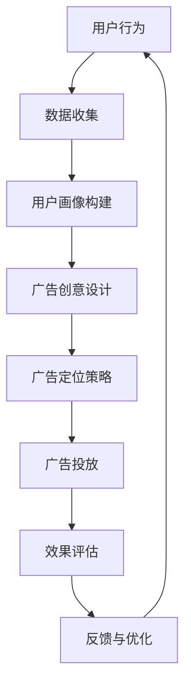
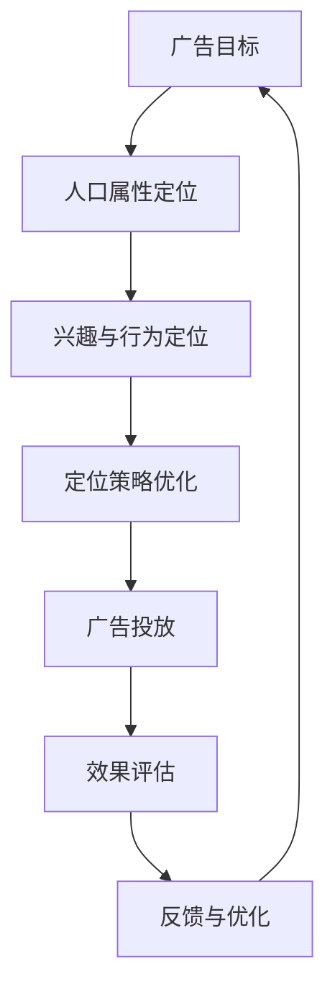

                 

# {文章标题}

> {关键词：(此处列出文章的5-7个核心关键词)}

> {摘要：(此处给出文章的核心内容和主题思想)}

在数字化时代，Facebook广告投放已成为提升品牌知名度和增加销售业绩的重要手段。然而，对于许多程序员而言，掌握Facebook广告投放技巧并非易事。本文旨在帮助程序员深入了解Facebook广告投放的原理、策略和实践，通过逻辑清晰、结构紧凑、简单易懂的步骤，逐步掌握Facebook广告投放的核心知识和技巧。

# 第一部分：广告投放基础知识

## 第1章：广告投放概述

### 1.1 广告投放的基本概念

广告投放，简单来说，就是通过特定的媒介将广告信息传递给目标受众的过程。在这个过程中，广告主、广告代理商、广告媒介和用户构成了广告投放的生态系统。

- **广告主**：广告投放的发起者，通常为企业或个人，希望通过广告达到宣传、销售或其他商业目的。
- **广告代理商**：帮助广告主制定广告策略、制作广告内容、投放广告的专业机构。
- **广告媒介**：用于传递广告信息的平台或渠道，如报纸、电视、互联网等。
- **用户**：广告信息的接收者，通过广告获取信息，做出购买决策或其他行为。

### 1.2 广告投放的生态系统

广告投放的生态系统是一个复杂而紧密联系的系统，各个环节相互影响、相互作用。广告主通过广告代理商制定广告策略，代理商根据广告主的需求制作广告内容，然后通过广告媒介投放广告，最终用户接收到广告信息。

### 1.3 广告投放的分类

广告投放可以根据不同的标准进行分类：

- **按投放媒介分类**：包括互联网广告、电视广告、广播广告、报纸广告等。
- **按投放策略分类**：包括按效果付费广告（如点击付费）、按展示付费广告（如千次展示付费）等。

## 第2章：Facebook广告平台概述

### 2.1 Facebook广告平台介绍

Facebook广告平台是全球领先的社交媒体广告平台，为广告主提供了丰富的广告投放工具和策略。平台优势包括：

- **庞大的用户基础**：Facebook拥有超过20亿的月活跃用户，覆盖全球各个年龄段和地区。
- **精准的定位能力**：通过用户数据，广告主可以针对特定的人群进行广告投放。
- **多样化的广告形式**：包括图文广告、视频广告、动态广告等多种形式，满足不同广告主的需求。

### 2.2 Facebook广告账户创建与管理

要开始Facebook广告投放，首先需要创建Facebook广告账户。广告账户分为个人广告账户和商业广告账户两种类型。个人广告账户适用于个人广告主，而商业广告账户适用于企业或组织。

- **个人广告账户**：适用于个人广告主，可以创建个人广告，但无法进行商业推广。
- **商业广告账户**：适用于企业或组织，可以进行商业推广，并享有更多的广告投放选项和管理功能。

创建广告账户后，需要对其进行有效的管理。包括设置广告预算、创建广告组、设计广告创意等。广告账户管理工具提供了详细的报表和数据分析功能，帮助广告主实时监控广告投放效果。

### 2.3 Facebook广告目标与指标

Facebook广告目标包括提升品牌知名度、增加网站流量、提高销售、提升应用下载量等。广告主可以根据自身需求选择合适的广告目标。

广告效果评估指标主要包括点击率（CTR）、转化率（CVR）、成本效益比（ROAS）等。这些指标反映了广告的吸引力和转化效果，是优化广告投放策略的重要依据。

## 第3章：Facebook广告创意设计

### 3.1 广告创意的基本原则

广告创意是吸引目标受众、提高广告效果的关键。以下是一些广告创意设计的基本原则：

- **吸引注意**：设计引人注目的广告内容，如独特的图像、有趣的标题等。
- **清晰传达信息**：确保广告信息简洁明了，传达广告主的核心诉求。
- **创意独特性**：避免与竞争对手的创意雷同，展现广告主的独特性和优势。

### 3.2 广告素材制作

Facebook广告素材包括图像、视频、文案等多种形式。以下是常见的广告素材制作方法：

- **图文广告**：通过图片和文案的组合，传达广告信息。图片应具有视觉冲击力，文案应简洁明了。
- **视频广告**：通过视频形式展示产品或服务，更具表现力。视频长度建议在15秒至60秒之间，确保在用户浏览过程中完整展示。
- **其他广告形式**：如滑动卡片广告、轮播广告等，根据广告主的需求和目标受众的特点选择合适的广告形式。

### 3.3 广告文案撰写

广告文案是广告创意的核心，需要具备以下特点：

- **结构清晰**：包括标题、正文和呼吁行动三个部分，使广告信息一目了然。
- **语言简洁**：避免使用复杂的词汇和句子，确保广告受众容易理解。
- **有吸引力**：通过使用生动、有趣的语言，吸引目标受众的关注。

## 第4章：Facebook广告定位策略

### 4.1 定位策略概述

Facebook广告定位策略是指根据广告主的需求，将广告精准投放给目标受众的方法。定位策略主要包括人口属性定位和兴趣与行为定位。

- **人口属性定位**：根据用户的年龄、性别、地域、语言等人口属性特征进行定位，如将广告投放给年龄在25-35岁、性别为女性、居住在中国的一线城市用户。
- **兴趣与行为定位**：根据用户的兴趣、行为和购买倾向进行定位，如将广告投放给喜欢旅游、经常购买电子产品、近期浏览过某款产品的用户。

### 4.2 人口属性定位

人口属性定位是Facebook广告定位策略的基础，通过对用户的基本信息进行分析，实现精准投放。以下是常用的人口属性定位方法：

- **年龄定位**：根据不同年龄段的特点和需求，选择合适的广告投放时间。
- **性别定位**：根据性别差异，调整广告内容和风格，提高广告的吸引力。
- **地域定位**：根据用户所在地，选择合适的广告投放区域，提高广告的曝光率。

### 4.3 兴趣与行为定位

兴趣与行为定位是基于用户在Facebook上的行为和兴趣进行广告投放的方法。以下是常用兴趣与行为定位方法：

- **兴趣定位**：根据用户的兴趣标签、关注的页面、互动内容等，选择合适的广告投放。
- **行为定位**：根据用户的购买行为、浏览历史、搜索记录等，选择合适的广告投放。

### 4.4 投放策略优化

广告定位策略的优化是提高广告效果的关键。以下是一些优化策略：

- **数据分析**：通过分析广告投放数据，了解广告效果，找出优化方向。
- **调整定位参数**：根据数据分析结果，调整广告定位参数，如年龄范围、兴趣标签等。
- **A/B测试**：对不同定位策略进行对比测试，找出最优策略。

## 第5章：Facebook广告预算管理

### 5.1 预算类型与分配

Facebook广告预算分为日预算和总预算两种类型。

- **日预算**：每天用于广告投放的预算上限，可以确保广告在预算范围内进行投放。
- **总预算**：整个广告活动期间的总预算，可以根据广告活动的需求进行灵活调整。

预算的分配策略应根据广告目标、投放时间段和竞争状况等因素进行。以下是一些常见的预算分配策略：

- **集中分配**：将预算集中在特定的时间段和目标受众，提高广告曝光率。
- **分散分配**：将预算分散到不同的时间段和目标受众，降低广告投放风险。

### 5.2 广告花费监控

广告花费监控是确保广告预算合理使用的关键。以下是一些广告花费监控方法：

- **实时监控**：通过Facebook广告管理平台，实时监控广告花费情况，及时调整广告策略。
- **成本分析**：定期分析广告花费数据，了解广告预算的使用情况和效果。
- **费用预警**：设置费用预警机制，当广告花费超过预算时，及时采取措施进行调整。

### 5.3 预算调整策略

广告预算的调整应根据广告效果和目标受众的变化进行。以下是一些预算调整策略：

- **根据数据调整预算**：根据广告效果数据，对预算进行适当调整，提高广告效果。
- **应对预算消耗过快**：当广告预算消耗过快时，可以通过以下方法进行调整：

  - **暂停广告投放**：暂停广告投放，等待预算消耗减缓后再开启。
  - **调整广告定位**：调整广告定位，缩小目标受众范围，降低广告消耗速度。
  - **优化广告创意**：优化广告创意，提高广告的吸引力和转化率，降低广告消耗。

## 第6章：Facebook广告效果评估与优化

### 6.1 广告效果评估指标

Facebook广告效果评估指标主要包括点击率（CTR）、转化率（CVR）、成本效益比（ROAS）等。

- **点击率（CTR）**：表示广告被点击的频率，反映了广告的吸引力。
- **转化率（CVR）**：表示广告带来的转化次数与展示次数的比值，反映了广告的转化效果。
- **成本效益比（ROAS）**：表示广告带来的收益与广告花费的比值，反映了广告的投资回报率。

### 6.2 数据分析与反馈

数据分析与反馈是优化广告效果的重要环节。以下是一些数据分析与反馈方法：

- **数据收集**：通过Facebook广告管理平台，收集广告投放的数据，如点击率、转化率、花费等。
- **数据分析**：对收集到的数据进行分析，了解广告效果，找出优化方向。
- **反馈机制**：根据数据分析结果，对广告策略进行调整，提高广告效果。

### 6.3 广告效果优化策略

广告效果优化策略应根据广告效果数据和目标受众的变化进行。以下是一些广告效果优化策略：

- **精准定位**：通过分析用户数据，调整广告定位，提高广告的精准度。
- **创意优化**：根据广告效果数据，优化广告创意，提高广告的吸引力和转化率。
- **投放策略调整**：根据广告效果数据，调整广告投放策略，如调整投放时间、投放区域等，提高广告效果。

## 第7章：案例研究：成功Facebook广告投放实践

### 7.1 案例背景与目标

某知名电商企业希望通过Facebook广告投放提升销售业绩和品牌知名度。广告目标包括增加网站流量、提高转化率和降低广告成本。

### 7.2 广告创意与定位策略

- **广告创意**：设计了一款优惠券广告，以新用户为主要目标受众，提供了30%的优惠券。广告文案简洁明了，标题为“限时优惠，快来抢购！”。
- **定位策略**：使用了人口属性定位和兴趣与行为定位。人口属性定位包括年龄在25-45岁、性别为女性、地域为一二线城市；兴趣与行为定位包括对购物、时尚、美妆等感兴趣的用户。

### 7.3 广告投放与效果分析

- **广告投放**：将广告投放时间集中在周末和晚上，以提高广告曝光率。同时，根据广告效果数据，对投放时间进行优化，最终选择了周三和周五晚上进行投放。
- **效果分析**：通过分析广告效果数据，发现广告的点击率（CTR）达到了2%，转化率（CVR）达到了0.5%，成本效益比（ROAS）为3。根据数据分析结果，对广告定位策略进行了优化，进一步提高了广告效果。

### 7.4 经验总结与建议

- **经验总结**：成功的关键在于精准的定位策略和优化的广告创意。通过对用户数据的分析，找到目标受众，提高广告的吸引力和转化率。
- **建议**：在广告投放过程中，持续关注广告效果数据，根据数据分析结果进行调整。同时，不断优化广告创意，提高广告的竞争力。

### Facebook广告投放原理

#### Mermaid 流程图



#### 广告定位策略原理



### 广告效果评估算法

#### 伪代码

```python
def evaluate_ad_performance(CTR, CVR, ROAS):
    if CTR < threshold_CTR:
        return "CTR太低，广告效果不佳"
    if CVR < threshold_CVR:
        return "CVR太低，广告效果不佳"
    if ROAS < threshold_ROAS:
        return "ROAS太低，广告效果不佳"
    return "广告效果良好"

CTR_threshold = 0.5  # 点击率阈值
CVR_threshold = 0.05  # 转化率阈值
ROAS_threshold = 2  # 成本效益比阈值

evaluate_ad_performance(CTR, CVR, ROAS)
```

### 数学模型和数学公式 & 详细讲解 & 举例说明

#### 点击率（CTR）模型

#### 数学公式

$$ CTR = \frac{点击次数}{展示次数} $$

#### 详细讲解

点击率（CTR）是广告效果评估的重要指标，表示广告被点击的频率。CTR的计算公式为点击次数除以展示次数。

#### 举例说明

假设一条广告展示了1000次，有50次被点击，则CTR为：

$$ CTR = \frac{50}{1000} = 0.05 $$

即5%的点击率。

### 项目实战

#### Facebook广告投放实战案例

#### 1. 案例背景

某电商平台希望通过Facebook广告投放提升销售业绩，提高品牌知名度。

#### 2. 开发环境搭建

- 使用Facebook广告管理平台进行广告投放
- 配置广告账户和广告组
- 确定广告目标（如提升网站流量、增加销售）

#### 3. 广告创意设计与定位策略

- **广告创意设计**：设计一款优惠券广告，针对新用户和现有用户分别制作不同的广告素材。新用户广告提供30%的优惠券，现有用户广告提供10%的优惠券。
- **定位策略**：使用人口属性定位（如年龄、性别），兴趣与行为定位（如购物兴趣、购物行为）。

#### 4. 代码实现

```python
from facebookads.api import API, AdAccount

# 配置API凭证
access_token = 'your_access_token'
api = API(access_token=access_token)

# 创建广告账户
account = AdAccount('your_ad_account_id')

# 创建广告组
ad_group = account.create_ad_group({
    'name': 'New User Discount',
    'objective': 'CONVERSIONS',
})

# 创建广告创意
creative = ad_group.create_ad({
    'name': 'New User Discount - Banner',
    'creative_elements': [
        {
            'image_url': 'https://example.com/banner.jpg',
            'link_url': 'https://example.com/discount.html',
            'body': 'Get 30% off your first purchase!',
        }
    ]
})

# 投放广告
ad_group.run({
    'amount': 1000,
    'start_time': '2023-11-01',
    'end_time': '2023-11-30',
})

```

#### 5. 代码解读与分析

- 代码首先配置Facebook API凭证和API实例
- 创建广告账户和广告组，并设置广告目标
- 设计广告创意，包括图像链接、链接网址和广告文案
- 执行广告投放，设置投放预算、开始和结束时间

通过实际代码示例，展示了如何利用Facebook广告管理平台实现广告投放。广告效果可以通过Facebook广告管理平台进行实时监控和分析。

### 附录

#### 附录 A: Facebook广告投放工具与资源

#### A.1 主流深度学习框架对比

##### A.1.1 TensorFlow

- **官方网站**：[TensorFlow官网](https://www.tensorflow.org/)
- **优点**：功能丰富，社区支持强大
- **缺点**：使用门槛较高

##### A.1.2 PyTorch

- **官方网站**：[PyTorch官网](https://pytorch.org/)
- **优点**：动态图编程，灵活易用
- **缺点**：与TensorFlow相比，社区支持较弱

##### A.1.3 JAX

- **官方网站**：[JAX官网](https://jax.readthedocs.io/en/latest/)
- **优点**：高效的数值计算库，自动微分功能
- **缺点**：应用场景相对较少

##### A.1.4 其他框架简介

- **Keras**：基于TensorFlow的高层API，易于使用
- **MXNet**：Apache基金会旗下的深度学习框架，与TensorFlow和PyTorch兼容
- **CNTK**：微软开发的深度学习框架，功能强大但使用门槛较高

#### A.2 Facebook广告投放教程

- **官方教程**：[Facebook广告投放教程](https://www.facebook.com/business/learn/)
- **社区资源**：[Facebook广告开发者社区](https://developers.facebook.com/docs/marketing-apis/)
- **实战教程**：[《Facebook广告投放实战教程》](https://www.facebookblueprint.com/learn-facebook-ads/)

#### A.3 数据分析与优化工具

- **Facebook Analytics**：Facebook官方数据分析工具
- **Google Analytics**：谷歌数据分析工具
- **AdEspresso**：广告自动化管理工具
- **AdRoll**：广告优化和再营销工具

#### A.4 案例研究

- 《Facebook广告投放成功案例分析》：分享成功的Facebook广告投放案例和策略
- 《Facebook广告投放失败案例分析》：分析失败的Facebook广告投放案例和原因

#### A.5 资源与工具推荐

- 《Facebook广告专家手册》：全面介绍Facebook广告投放的知识和技巧
- 《深度学习与广告投放》：结合深度学习技术进行广告投放的实践和经验
- 《广告数据分析实战》：利用数据分析提升广告效果的方法和技巧

通过附录部分，为读者提供了丰富的Facebook广告投放工具与资源，包括主流深度学习框架对比、广告投放教程、数据分析工具、案例研究以及资源与工具推荐，帮助读者深入学习和实践Facebook广告投放。

## 作者信息

作者：AI天才研究院/AI Genius Institute & 禅与计算机程序设计艺术 /Zen And The Art of Computer Programming

AI天才研究院致力于推动人工智能技术的发展和应用，本文作者在计算机编程和人工智能领域拥有丰富的经验，精通多种编程语言和深度学习框架，对广告投放和数据分析有深入的研究和实践。本文旨在帮助程序员掌握Facebook广告投放的核心知识和技巧，提升广告投放效果。希望本文能为您的广告投放之旅提供有价值的参考。

