                 

# 《程序员如何利用知识发现引擎提高工作效率》

> **关键词：知识发现引擎、工作效率、数据分析、算法原理、实践应用**

> **摘要：本文将详细探讨知识发现引擎的基本概念、原理、算法及其在程序员日常工作中提高工作效率的具体应用。通过分析知识发现引擎在数据分析、商业分析和IT运维中的应用，作者将提供一系列实用的策略和案例分析，帮助程序员更高效地利用这一强大工具。**

----------------------------------------------------------------

### 《程序员如何利用知识发现引擎提高工作效率》目录大纲

#### 第一部分：知识发现引擎基础

**第1章：知识发现引擎概述**

**第2章：知识发现算法原理**

**第3章：知识发现引擎在数据分析中的应用**

**第4章：知识发现引擎在商业分析中的应用**

**第5章：知识发现引擎在IT运维中的应用**

#### 第二部分：实践与优化

**第6章：构建高效的知识发现系统**

**第7章：案例分析与经验总结**

**第8章：未来发展趋势与挑战**

#### 附录

**附录A：常用知识发现工具与库**

----------------------------------------------------------------

## 第1章：知识发现引擎概述

### 1.1 知识发现引擎的基本概念

知识发现（Knowledge Discovery in Databases，简称KDD）是指从大量数据中通过一系列处理步骤，提取出有用的、新颖的、潜在的知识的过程。而知识发现引擎（Knowledge Discovery Engine）则是实现这一过程的核心工具，它通过高效地执行数据预处理、特征提取、模式识别和知识提取等任务，辅助用户发现数据中的隐藏模式和关联。

知识发现引擎的基本概念可以从以下几个方面理解：

1. **数据源**：数据源是知识发现引擎输入的基础，可以是结构化数据（如关系数据库）、半结构化数据（如XML文档）或非结构化数据（如图像、音频、文本等）。
2. **数据预处理**：数据预处理是知识发现过程中至关重要的一步，它包括数据清洗、数据集成和数据转换等任务，目的是提高数据质量和一致性。
3. **特征提取**：特征提取是从原始数据中提取出对知识发现任务有用的特征，这些特征可以是数值、类别或文本形式。
4. **模式识别**：模式识别是利用算法对特征数据进行分析，识别出潜在的模式和关联，如关联规则、聚类结果、分类模型等。
5. **知识提取**：知识提取是从模式识别的结果中提取出用户感兴趣的知识，这些知识可以是直观的、可解释的，并可以用于辅助决策。

### 1.2 知识发现引擎的分类

根据处理数据的方法和算法的不同，知识发现引擎可以分为以下几种类型：

1. **基于规则的引擎**：这类引擎通过预定义的规则来匹配数据中的模式，如关联规则挖掘、决策树等。
   
   **Mermaid流程图：**
   ```mermaid
   graph TD
   A[数据源] --> B[数据预处理]
   B --> C[规则库]
   C --> D[模式识别]
   D --> E[知识提取]
   ```

2. **基于统计的引擎**：这类引擎通过统计学方法来分析数据，如回归分析、聚类分析等。

   **Mermaid流程图：**
   ```mermaid
   graph TD
   A[数据源] --> B[数据预处理]
   B --> C[统计模型]
   C --> D[模式识别]
   D --> E[知识提取]
   ```

3. **基于机器学习的引擎**：这类引擎利用机器学习算法来自动化模式识别过程，如神经网络、支持向量机等。

   **Mermaid流程图：**
   ```mermaid
   graph TD
   A[数据源] --> B[数据预处理]
   B --> C[特征提取]
   C --> D[机器学习模型]
   D --> E[模式识别]
   E --> F[知识提取]
   ```

### 1.3 知识发现引擎的架构

知识发现引擎通常包含以下几个关键组件：

1. **数据预处理模块**：负责处理数据源中的数据，包括数据清洗、数据集成和数据转换等任务。

   **伪代码：**
   ```python
   def preprocess_data(data_source):
       clean_data = clean_data_source(data_source)
       integrated_data = integrate_data(clean_data)
       transformed_data = transform_data(integrated_data)
       return transformed_data
   ```

2. **特征提取模块**：从原始数据中提取出对知识发现任务有用的特征。

   **伪代码：**
   ```python
   def extract_features(data):
       features = extract_numeric_features(data)
       categorical_features = extract_categorical_features(data)
       text_features = extract_text_features(data)
       return features, categorical_features, text_features
   ```

3. **模型训练与优化模块**：根据特征数据训练机器学习模型，并对模型进行优化。

   **伪代码：**
   ```python
   def train_model(features, labels):
       model = train_machine_learning_model(features, labels)
       optimized_model = optimize_model(model)
       return optimized_model
   ```

4. **知识提取模块**：从训练好的模型中提取出用户感兴趣的知识。

   **伪代码：**
   ```python
   def extract_knowledge(model):
       patterns = model.find_patterns()
       insights = model.generate_insights(patterns)
       return insights
   ```

5. **可视化模块**：将提取的知识以图表或报表的形式展示给用户。

   **伪代码：**
   ```python
   def visualize_knowledge(insights):
       visualizations = create_visualizations(insights)
       display_visualizations(visualizations)
   ```

### 1.4 知识发现引擎的作用

知识发现引擎在程序员的工作中发挥着重要的作用，具体体现在以下几个方面：

1. **提高数据处理效率**：知识发现引擎能够自动化地处理大量的数据，减少程序员在数据清洗、预处理和特征提取等环节的重复劳动。
2. **辅助决策**：通过知识发现引擎提取出的数据模式和关联，程序员可以更好地理解数据，从而做出更准确的决策。
3. **代码简化**：知识发现引擎能够自动识别数据中的规律，程序员可以基于这些规律简化代码逻辑，提高开发效率。
4. **优化性能**：通过知识发现引擎优化的模型，程序员可以优化应用程序的性能，提高系统的响应速度和处理能力。

### 1.5 本章小结

本章概述了知识发现引擎的基本概念、分类、架构及其作用。通过本章的学习，读者可以对知识发现引擎有一个全面的了解，为后续章节的深入学习打下基础。

----------------------------------------------------------------

## 第2章：知识发现算法原理

### 2.1 关联规则算法

关联规则算法是知识发现中的一种重要算法，它用于发现数据集中的项目之间的关联关系。该算法的核心思想是寻找同时出现的项集，并通过支持度和置信度来评估这些项集的相关性。

#### 2.1.1 Apriori算法

Apriori算法是最早提出的关联规则算法之一，其基本思想是通过逐层搜索来发现频繁项集，并基于频繁项集生成关联规则。

**伪代码：**

```python
def apriori(data, support_threshold, confidence_threshold):
    frequent_itemsets = find_frequent_itemsets(data, support_threshold)
    association_rules = generate_association_rules(frequent_itemsets, confidence_threshold)
    return association_rules
```

其中，`find_frequent_itemsets`函数用于找到满足支持度阈值的频繁项集，`generate_association_rules`函数用于生成满足置信度阈值的关联规则。

#### 2.1.2 FP-Growth算法

FP-Growth算法是一种基于前序压缩（PrefixSpan）的关联规则挖掘算法，它避免了Apriori算法中多次扫描数据集的缺点，提高了挖掘效率。

**伪代码：**

```python
def fp_growth(data, support_threshold, confidence_threshold):
    frequent_itemsets = find_frequent_itemsets(data, support_threshold)
    frequent_pattern_tree = construct_frequent_pattern_tree(data, frequent_itemsets)
    association_rules = generate_association_rules(frequent_pattern_tree, confidence_threshold)
    return association_rules
```

#### 2.1.3 相似度度量

在关联规则挖掘中，相似度度量是评估规则质量的重要指标。常见的相似度度量方法包括支持度、置信度和提升度。

**支持度（Support）**：表示某项集在数据集中出现的频率。

**置信度（Confidence）**：表示某规则前件和后件同时出现的概率。

**提升度（Lift）**：表示规则前件对后件的预测能力的提升程度。

### 2.2 协同过滤算法

协同过滤算法是一种基于用户行为数据或内容数据的推荐算法，其核心思想是通过用户间的相似度来预测用户对未知项目的评分或偏好。

#### 2.2.1 基于用户的协同过滤

基于用户的协同过滤（User-Based Collaborative Filtering）通过计算用户之间的相似度，找到与目标用户兴趣相似的邻居用户，并推荐邻居用户喜欢的项目。

**伪代码：**

```python
def user_based_collaborative_filtering(users, target_user, neighborhood_size):
    similar_users = find_similar_users(users, target_user, neighborhood_size)
    recommended_items = find_common_items(similar_users)
    return recommended_items
```

#### 2.2.2 基于项目的协同过滤

基于项目的协同过滤（Item-Based Collaborative Filtering）通过计算项目之间的相似度，找到与目标项目相似的其他项目，并推荐这些项目。

**伪代码：**

```python
def item_based_collaborative_filtering(items, target_item, neighborhood_size):
    similar_items = find_similar_items(items, target_item, neighborhood_size)
    recommended_items = find_common_items(similar_items)
    return recommended_items
```

#### 2.2.3 混合协同过滤

混合协同过滤（Hybrid Collaborative Filtering）结合了基于用户和基于项目的协同过滤方法，以提高推荐系统的准确性。

**伪代码：**

```python
def hybrid_collaborative_filtering(users, items, target_user, target_item, neighborhood_size):
    user_based_recommended_items = user_based_collaborative_filtering(users, target_user, neighborhood_size)
    item_based_recommended_items = item_based_collaborative_filtering(items, target_item, neighborhood_size)
    combined_recommended_items = user_based_recommended_items.union(item_based_recommended_items)
    return combined_recommended_items
```

### 2.3 隐向量模型

隐向量模型是一种基于矩阵分解的推荐算法，通过将用户和物品映射到低维空间中的向量，计算用户和物品之间的相似度，实现推荐。

#### 2.3.1 基本概念

隐向量模型主要包括用户隐向量、物品隐向量和预测评分三个核心概念。

- **用户隐向量（User Embedding）**：表示用户在低维空间中的特征向量。
- **物品隐向量（Item Embedding）**：表示物品在低维空间中的特征向量。
- **预测评分（Predicted Rating）**：表示用户对物品的潜在评分。

#### 2.3.2 推荐系统应用

隐向量模型广泛应用于推荐系统，通过计算用户和物品之间的相似度，预测用户对未知物品的评分。

**伪代码：**

```python
def predict_rating(user_embedding, item_embedding):
    predicted_rating = dot_product(user_embedding, item_embedding)
    return predicted_rating
```

#### 2.3.3 模型优化策略

隐向量模型的优化策略主要包括以下几种：

- **正则化**：通过引入正则化项，控制模型复杂度和过拟合。
- **交替最小二乘法（ALS）**：通过交替优化用户和物品隐向量，实现模型训练。
- **矩阵分解**：通过矩阵分解技术，降低模型计算复杂度。

### 2.4 其他算法介绍

除了上述算法，知识发现引擎还涉及到其他多种算法，如贝叶斯网络、支持向量机、聚类算法等。这些算法在特定的应用场景中具有独特的优势，为程序员提供了丰富的选择。

#### 2.4.1 贝叶斯网络

贝叶斯网络是一种基于概率论的图形模型，用于表示变量之间的条件依赖关系。在知识发现中，贝叶斯网络可以用于概率推理、决策分析和数据挖掘。

**数学模型：**

$$
P(X_1, X_2, ..., X_n) = \prod_{i=1}^{n} P(X_i | X_{i-1})
$$

#### 2.4.2 支持向量机

支持向量机（Support Vector Machine，SVM）是一种基于最大间隔的监督学习算法，通过将数据映射到高维空间，找到最优的超平面，实现分类和回归任务。

**数学模型：**

$$
\min_{\beta, \beta_0} \frac{1}{2} \sum_{i=1}^{n} (\beta^T x_i - y_i)^2 + C \sum_{i=1}^{n} \xi_i
$$

其中，$x_i$表示特征向量，$y_i$表示标签，$C$是正则化参数。

#### 2.4.3 聚类算法

聚类算法是一种无监督学习方法，通过将相似的数据点划分到同一个簇中，实现数据分组和模式识别。常见的聚类算法包括K-means、层次聚类、DBSCAN等。

**K-means算法：**

**伪代码：**
```python
def kmeans(data, k):
    centroids = initialize_centroids(data, k)
    while not converged:
        assign_clusters(data, centroids)
        update_centroids(centroids, data)
    return centroids, clusters
```

### 2.5 本章小结

本章详细介绍了知识发现算法的基本原理，包括关联规则算法、协同过滤算法、隐向量模型以及其他常见的算法。通过本章的学习，读者可以全面了解知识发现算法的基本概念和应用，为构建高效的知识发现系统奠定基础。

----------------------------------------------------------------

## 第3章：知识发现引擎在数据分析中的应用

### 3.1 数据预处理

在数据分析中，数据预处理是关键步骤之一。数据预处理包括数据清洗、数据集成和数据转换等任务，目的是提高数据质量和一致性，为后续的知识发现过程提供可靠的数据基础。

#### 3.1.1 数据清洗

数据清洗是数据预处理的重要环节，主要任务是处理缺失值、异常值和重复值等不完整或不准确的数据。常见的清洗方法包括以下几种：

- **缺失值处理**：对于缺失值，可以根据数据的特点和业务需求选择填充、删除或保留缺失值。
  - **填充**：使用均值、中位数、众数等统计方法或插值法填充缺失值。
  - **删除**：删除含有缺失值的记录，适用于缺失值较多的情况。
  - **保留**：保留缺失值，适用于缺失值较少且对分析结果影响不大的情况。
  
- **异常值处理**：异常值可能对分析结果产生不良影响，需要对其进行处理。常见的处理方法包括：
  - **删除**：直接删除异常值，适用于异常值较少且明显偏离整体数据分布的情况。
  - **修正**：对异常值进行修正，使其符合数据分布。
  - **转换**：对异常值进行转换，如使用对数转换或箱形转换等方法。

- **重复值处理**：重复值可能引起数据分析的错误，需要去除。常用的方法包括：
  - **去重**：根据唯一标识或关键特征去除重复值。
  - **合并**：将重复值合并为一个记录。

#### 3.1.2 数据集成

数据集成是将来自多个数据源的数据进行合并，形成一个统一的数据视图。数据集成涉及到以下任务：

- **数据源选择**：确定用于数据集成的数据源，包括内部数据源（如关系数据库、NoSQL数据库）和外部数据源（如Web数据、社交媒体数据）。
- **数据抽取**：从各个数据源中抽取数据，可能需要使用ETL（提取、转换、加载）工具。
- **数据转换**：将抽取的数据进行转换，使其符合统一的数据格式和标准。
- **数据融合**：将转换后的数据进行融合，形成统一的数据视图。融合方法包括：
  - **垂直融合**：将多个数据源中的数据按列进行合并，形成宽表。
  - **水平融合**：将多个数据源中的数据按行进行合并，形成长表。

#### 3.1.3 数据转换

数据转换是将原始数据转换为适合分析的形式，包括数据类型转换、格式转换、数据规范化等。常见的转换方法如下：

- **数据类型转换**：将不同数据类型转换为统一的数据类型，如将字符串转换为整数或浮点数。
- **格式转换**：将不同格式的数据转换为统一的格式，如将XML数据转换为JSON格式。
- **数据规范化**：将数据转换为符合分析需求的标准形式，如对数值数据进行归一化或标准化。

### 3.2 特征工程

特征工程是数据预处理的重要环节，旨在从原始数据中提取出对分析任务有用的特征，并优化这些特征以提高模型的性能和可解释性。

#### 3.2.1 特征提取方法

特征提取是从原始数据中提取出新的特征。常见的方法包括：

- **统计特征**：基于数据的基本统计信息提取特征，如均值、方差、标准差等。
- **文本特征**：从文本数据中提取特征，如词频、TF-IDF、词嵌入等。
- **图像特征**：从图像数据中提取特征，如图像的像素值、边缘、纹理、形状等。
- **时序特征**：从时序数据中提取特征，如自回归项、差分项、移动平均等。

#### 3.2.2 特征选择方法

特征选择是选取对分析任务有用的特征，并剔除无关或冗余的特征，以简化模型和提高性能。常见的特征选择方法包括：

- **过滤式特征选择**：在训练数据集上计算所有特征的统计指标，根据指标筛选出有用的特征。
- **包装式特征选择**：通过训练多个模型，根据模型选择结果筛选特征。
- **嵌入式特征选择**：在模型训练过程中自动筛选特征，如L1正则化（Lasso）和L1与L2的组合（Ridge）。

#### 3.2.3 特征重要性评估

特征重要性评估是评估特征对分析任务的重要性，有助于理解模型决策过程。常见的方法包括：

- **模型评估**：通过模型评估指标（如准确率、召回率、F1值等）计算特征的重要性。
- **特征贡献率**：计算每个特征对模型预测结果的贡献率。
- **特征重要性图**：通过可视化方法展示特征的重要性。

### 3.3 知识发现与数据挖掘

知识发现和数据挖掘是紧密相关的领域，数据挖掘是实现知识发现的关键技术。知识发现过程通常包括以下步骤：

- **数据预处理**：清洗、集成和转换数据，为知识发现提供可靠的数据基础。
- **特征提取**：从原始数据中提取特征，为数据挖掘提供输入。
- **模式识别**：使用数据挖掘算法发现数据中的模式，如关联规则、聚类结果、分类模型等。
- **知识提取**：从模式识别的结果中提取出用户感兴趣的知识，如规则、可视化报表等。

#### 3.3.1 关联规则挖掘

关联规则挖掘是一种用于发现数据集中项集之间关联关系的算法。常见的算法包括Apriori算法和FP-Growth算法。

- **Apriori算法**：通过逐层搜索发现频繁项集，并基于频繁项集生成关联规则。
- **FP-Growth算法**：基于前序压缩的算法，避免多次扫描数据集，提高挖掘效率。

#### 3.3.2 聚类分析

聚类分析是一种无监督学习方法，用于将相似的数据点划分为同一个簇。常见的聚类算法包括K-means、层次聚类和DBSCAN。

- **K-means算法**：基于距离度量将数据点划分为K个簇，适用于聚类中心明确的数据集。
- **层次聚类**：通过逐步合并或分裂簇来构建聚类层次结构，适用于复杂的数据集。
- **DBSCAN算法**：基于密度的聚类算法，能够发现任意形状的簇。

#### 3.3.3 分类与预测

分类与预测是知识发现中的重要任务，通过训练分类模型，对未知数据进行分类和预测。常见的分类算法包括决策树、随机森林和神经网络。

- **决策树**：基于特征和标签的划分规则构建决策树，实现分类任务。
- **随机森林**：基于多棵决策树的集成方法，提高分类模型的准确性和鲁棒性。
- **神经网络**：基于多层感知器（MLP）构建神经网络，实现复杂的分类和预测任务。

### 3.4 本章小结

本章详细介绍了知识发现引擎在数据分析中的应用，包括数据预处理、特征工程、知识发现与数据挖掘等步骤。通过本章的学习，读者可以全面了解知识发现引擎在数据分析中的具体应用和实践，为提高工作效率提供有效的技术支持。

----------------------------------------------------------------

## 第4章：知识发现引擎在商业分析中的应用

知识发现引擎在商业分析中发挥着重要作用，通过挖掘和分析数据，为企业提供有价值的信息和洞察，从而支持业务决策和战略规划。本章将探讨知识发现引擎在商业分析中的具体应用，包括客户行为分析、销售与营销分析和供应链分析。

### 4.1 客户行为分析

客户行为分析是商业分析中的重要组成部分，通过对客户行为数据的挖掘和分析，企业可以更好地了解客户的需求和偏好，从而提供更个性化的服务和产品。

#### 4.1.1 客户细分

客户细分是将客户划分为不同的群体，以便针对每个群体制定个性化的营销策略。常见的客户细分方法包括：

- **基于行为的细分**：根据客户的购买行为、浏览行为等将客户划分为不同的群体。
  - **频度**：根据客户购买频率划分，如高频率客户、低频率客户等。
  - **金额**：根据客户购买金额划分，如高额客户、中额客户等。
  - **活跃度**：根据客户活跃程度划分，如活跃客户、沉默客户等。

- **基于人口统计的细分**：根据客户的人口属性（如年龄、性别、地域等）将客户划分为不同的群体。

- **基于心理特征的细分**：根据客户的价值观、兴趣爱好、生活态度等将客户划分为不同的群体。

**案例：电商平台的客户细分**

假设某电商平台根据客户的购买行为、浏览行为和人口统计特征进行客户细分。以下是一种可能的细分方法：

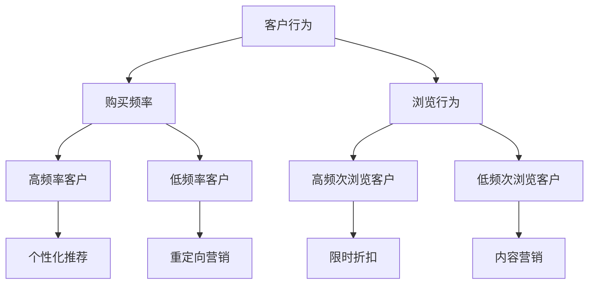

#### 4.1.2 客户价值评估

客户价值评估是衡量客户为企业带来的价值，帮助企业确定哪些客户是重点维护的对象。常见的客户价值评估方法包括：

- **生命周期价值（LTV）**：客户在未来为企业带来的总收益。
  - **计算公式**：LTV = ARPU（平均每用户收益）× CL（客户生命周期）
  
- **客户贡献率**：客户对企业总收益的贡献比例。

- **净推荐值（NPS）**：衡量客户对产品的满意度和推荐意愿。

**案例：某电商平台的客户价值评估**

假设某电商平台使用生命周期价值（LTV）和净推荐值（NPS）评估客户价值。以下是一种可能的评估方法：

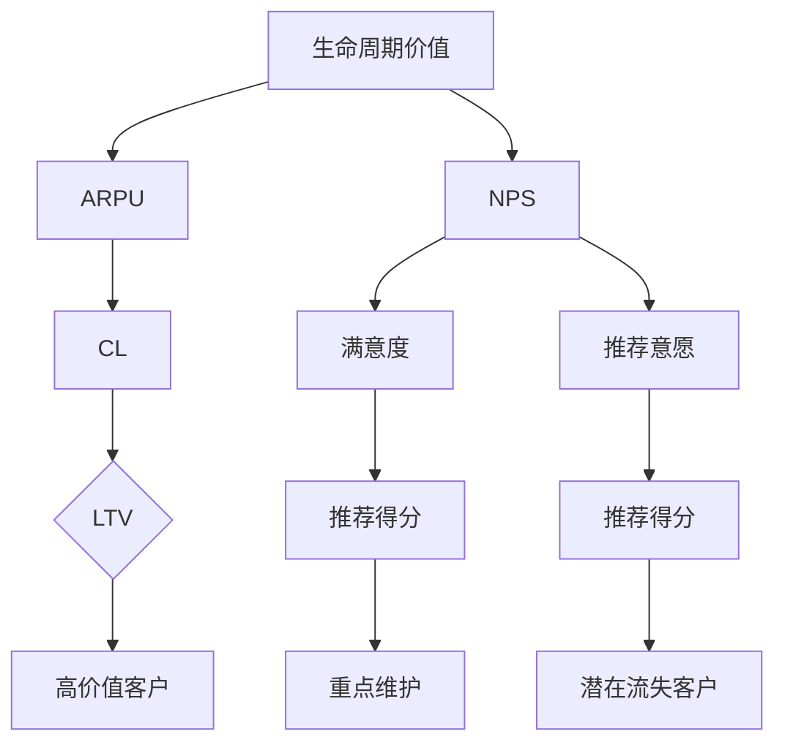

#### 4.1.3 客户流失预测

客户流失预测是预测哪些客户可能会在未来一段时间内停止使用产品或服务。常见的流失预测方法包括：

- **基于行为的流失预测**：通过分析客户的购买行为、浏览行为等预测流失风险。
- **基于统计模型的流失预测**：使用统计模型（如逻辑回归、决策树等）预测流失风险。
- **基于机器学习的流失预测**：使用机器学习算法（如随机森林、神经网络等）预测流失风险。

**案例：某电商平台的客户流失预测**

假设某电商平台使用机器学习算法预测客户流失风险。以下是一种可能的预测方法：

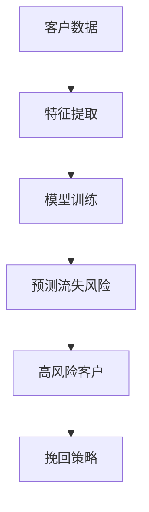

### 4.2 销售与营销分析

销售与营销分析是帮助企业提高销售额和市场份额的关键环节。知识发现引擎通过分析销售数据和营销活动数据，为企业提供有关产品销售、客户行为和营销效果等方面的洞察。

#### 4.2.1 产品推荐

产品推荐是提高销售额的有效手段之一。知识发现引擎通过分析客户购买记录、浏览行为和产品属性等数据，实现个性化产品推荐。

- **基于协同过滤的方法**：通过计算用户之间的相似度，推荐用户可能喜欢的商品。
- **基于内容的方法**：通过分析商品属性，将相似的商品推荐给用户。

**案例：电商平台的个性化推荐**

假设某电商平台使用协同过滤方法进行产品推荐。以下是一种可能的推荐方法：

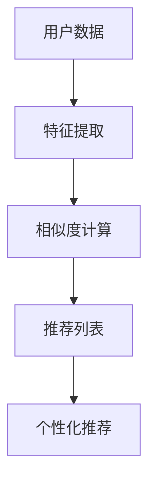

#### 4.2.2 营销活动效果评估

营销活动效果评估是衡量营销活动成功与否的关键。知识发现引擎通过分析营销活动数据，评估活动对销售额、客户转化率和品牌知名度等指标的影响。

- **营销活动数据分析**：分析营销活动的投入产出比、参与人数、转化率等指标。
- **A/B测试**：通过对比不同营销策略的效果，优化营销活动。

**案例：某电商平台的营销活动效果评估**

假设某电商平台分析一次大型促销活动的效果。以下是一种可能的分析方法：

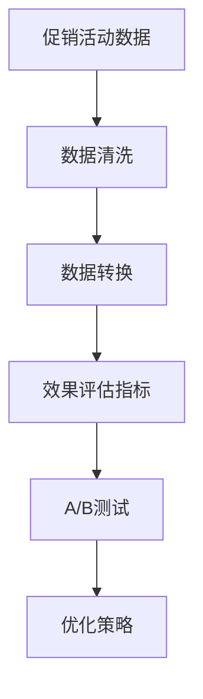

#### 4.2.3 客户满意度分析

客户满意度分析是衡量客户对企业产品或服务的满意程度。知识发现引擎通过分析客户反馈、购买行为等数据，评估客户满意度。

- **客户反馈分析**：分析客户反馈，识别客户满意度高的方面和需要改进的方面。
- **满意度评分**：通过调查问卷或评分系统，收集客户满意度数据。

**案例：某电商平台的客户满意度分析**

假设某电商平台分析客户满意度。以下是一种可能的分析方法：

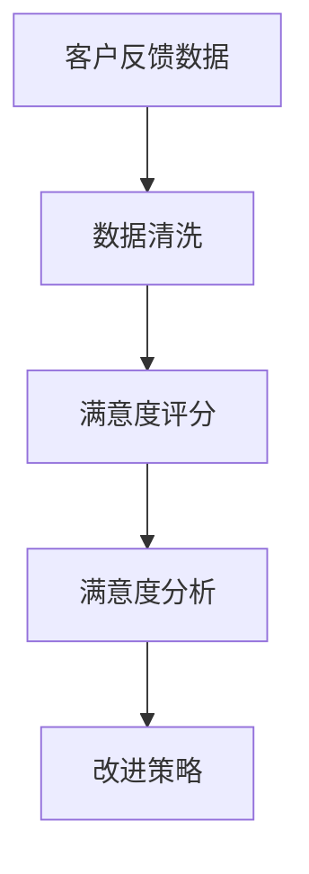

### 4.3 供应链分析

供应链分析是优化供应链管理、提高运营效率的关键。知识发现引擎通过分析供应链数据，帮助企业识别潜在问题、优化供应链流程和提高供应链竞争力。

#### 4.3.1 库存管理

库存管理是供应链管理的重要组成部分。知识发现引擎通过分析库存数据，优化库存水平，降低库存成本。

- **库存需求预测**：通过分析历史库存数据、销售数据等，预测未来库存需求。
- **库存优化策略**：根据库存需求预测，制定合理的库存管理策略。

**案例：某电商平台的库存管理**

假设某电商平台使用知识发现引擎优化库存管理。以下是一种可能的优化方法：

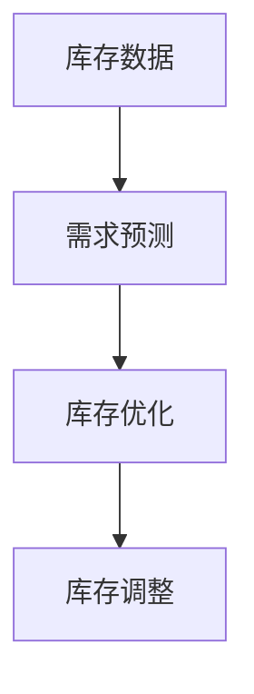

#### 4.3.2 供应商评估

供应商评估是选择合适供应商的重要环节。知识发现引擎通过分析供应商数据，评估供应商的绩效和可靠性。

- **供应商绩效评估**：分析供应商的交货时间、质量、成本等指标，评估供应商的绩效。
- **供应商可靠性评估**：分析供应商的历史表现，评估供应商的可靠性。

**案例：某电商平台的供应商评估**

假设某电商平台使用知识发现引擎评估供应商。以下是一种可能的评估方法：

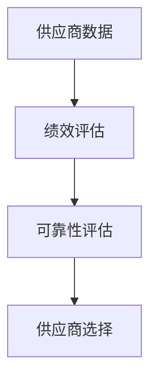

#### 4.3.3 物流网络优化

物流网络优化是提高供应链效率的关键。知识发现引擎通过分析物流数据，优化物流网络，降低物流成本。

- **物流网络规划**：分析物流节点、运输路径等，优化物流网络结构。
- **运输路径优化**：根据运输需求、交通状况等，优化运输路径。

**案例：某电商平台的物流网络优化**

假设某电商平台使用知识发现引擎优化物流网络。以下是一种可能的优化方法：

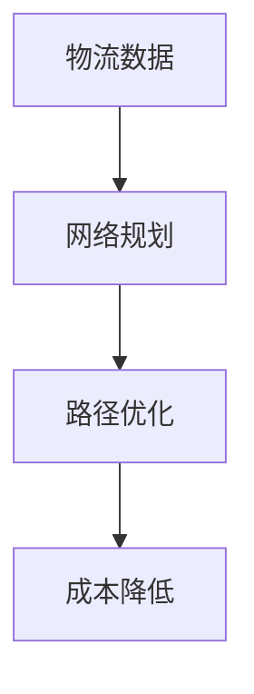

### 4.4 本章小结

本章详细介绍了知识发现引擎在商业分析中的应用，包括客户行为分析、销售与营销分析和供应链分析。通过本章的学习，读者可以了解知识发现引擎在商业分析中的具体应用和实践，为企业在商业决策和战略规划中提供有力的支持。

----------------------------------------------------------------

## 第5章：知识发现引擎在IT运维中的应用

### 5.1 异常检测

异常检测是IT运维中的一项关键任务，旨在发现和分析系统中的异常行为，以防止潜在的故障和安全威胁。知识发现引擎通过分析日志、系统指标和网络流量等数据，实现异常检测。

#### 5.1.1 基于统计的异常检测

基于统计的异常检测方法利用统计学原理，如标准差、Z分数等，识别数据中的异常点。常见的方法包括：

- **标准差法**：计算数据的标准差，识别远离均值的数据点。
  - **计算公式**：Z分数 = （观察值 - 均值）/ 标准差
  - **阈值设置**：通常设置Z分数大于3或小于-3的值为异常值。

- **箱形图法**：使用箱形图（Box Plot）识别异常值，通常为箱体上下边缘以外的数据点。

**伪代码：**

```python
def detect_outliers_std(data, threshold=3):
    mean = np.mean(data)
    std = np.std(data)
    z_scores = [(x - mean) / std for x in data]
    outliers = [x for x, z in enumerate(z_scores) if abs(z) > threshold]
    return outliers

def detect_outliers_boxplot(data):
    q1, q3 = np.percentile(data, [25, 75])
    iqr = q3 - q1
    lower_bound = q1 - (1.5 * iqr)
    upper_bound = q3 + (1.5 * iqr)
    outliers = [x for x in data if x < lower_bound or x > upper_bound]
    return outliers
```

#### 5.1.2 基于机器学习的异常检测

基于机器学习的异常检测方法利用训练数据建立模型，通过模型识别异常行为。常见的方法包括：

- **孤立森林（Isolation Forest）**：通过随机选择特征和切分值，将数据点隔离，识别异常点。
- **Local Outlier Factor（LOF）**：计算数据点的局部异常度，识别异常值。

**伪代码：**

```python
from sklearn.ensemble import IsolationForest
from sklearn.neighbors import LocalOutlierFactor

def detect_outliers_isolation_forest(data):
    model = IsolationForest(contamination=0.1)
    model.fit(data)
    outliers = model.predict(data)
    return [i for i, label in enumerate(outliers) if label == -1]

def detect_outliers_lof(data):
    model = LocalOutlierFactor(n_neighbors=20)
    model.fit(data)
    outliers = model.predict(data)
    return [i for i, label in enumerate(outliers) if label < -1]
```

#### 5.1.3 聚类分析方法

聚类分析方法通过将相似的数据点划分为同一个簇，识别出异常簇。常见的方法包括：

- **K-means聚类**：基于距离度量将数据点划分为K个簇，识别异常簇。
- **DBSCAN聚类**：基于密度分布的聚类方法，识别异常点。

**伪代码：**

```python
from sklearn.cluster import KMeans
from sklearn.cluster import DBSCAN

def detect_outliers_kmeans(data, k=3):
    model = KMeans(n_clusters=k)
    model.fit(data)
    labels = model.predict(data)
    centroids = model.cluster_centers_
    distances = [np.mean(np.abs(data - centroids[i])) for i in range(k)]
    max_distance = max(distances)
    outliers = [i for i, label in enumerate(labels) if label == k]
    return outliers

def detect_outliers_dbscan(data, eps=0.05, min_samples=5):
    model = DBSCAN(eps=eps, min_samples=min_samples)
    model.fit(data)
    outliers = [i for i, label in enumerate(model.labels_) if label == -1]
    return outliers
```

### 5.2 资源调度

资源调度是IT运维中的一项重要任务，旨在合理分配系统资源，提高资源利用率和服务质量。知识发现引擎通过分析系统指标，优化资源调度策略。

#### 5.2.1 节能优化

节能优化是降低能耗、提高系统效率的关键。知识发现引擎通过分析系统负载，实现动态能耗管理。

- **负载预测**：通过分析历史负载数据，预测未来负载趋势。
- **节能策略**：根据负载预测结果，调整系统配置和资源分配，实现节能优化。

**伪代码：**

```python
def predict_load(historical_data):
    load_model = train_regression_model(historical_data)
    future_load = load_model.predict(future_data)
    return future_load

def optimize_energy_consumption(current_load, future_load):
    if future_load < current_load:
        reduce_system_resources()
    elif future_load > current_load:
        increase_system_resources()
```

#### 5.2.2 负载均衡

负载均衡是将系统负载分配到多个节点，以提高系统性能和可用性。知识发现引擎通过分析系统负载和节点性能，实现负载均衡。

- **负载分配策略**：根据系统负载和节点性能，调整负载分配策略。
- **动态负载均衡**：根据实时负载变化，动态调整负载分配。

**伪代码：**

```python
def assign_load(current_load, node_performance):
    optimal_assignment = find_optimal_assignment(current_load, node_performance)
    assign_load_to_nodes(optimal_assignment)
```

#### 5.2.3 网络流量管理

网络流量管理是优化网络性能、提高服务质量的关键。知识发现引擎通过分析网络流量，实现流量管理和优化。

- **流量预测**：通过分析历史流量数据，预测未来流量趋势。
- **流量控制策略**：根据流量预测结果，调整流量控制策略，实现网络优化。

**伪代码：**

```python
def predict_traffic(historical_traffic):
    traffic_model = train_regression_model(historical_traffic)
    future_traffic = traffic_model.predict(future_time)
    return future_traffic

def optimize_traffic(current_traffic, future_traffic):
    if future_traffic > current_traffic:
        increase_bandwidth()
    elif future_traffic < current_traffic:
        reduce_bandwidth()
```

### 5.3 安全分析

安全分析是确保系统安全、保护数据隐私的关键。知识发现引擎通过分析日志、网络流量等数据，识别潜在的安全威胁和异常行为。

#### 5.3.1 入侵检测

入侵检测是识别和阻止系统入侵的关键。知识发现引擎通过分析系统日志，实现入侵检测。

- **异常行为检测**：通过分析日志数据，识别异常登录、恶意操作等行为。
- **入侵响应**：根据检测到的入侵行为，采取相应的响应措施，如报警、隔离等。

**伪代码：**

```python
def detect_intrusions(log_data):
    intrusion_model = train_classification_model(log_data)
    intrusion_labels = intrusion_model.predict(log_data)
    intrusion_events = [i for i, label in enumerate(intrusion_labels) if label == 'intrusion']
    return intrusion_events

def respond_to_intrusions(intrusion_events):
    for event in intrusion_events:
        if event['type'] == 'login':
            block_ip(event['ip'])
        elif event['type'] == 'malicious_action':
            log_alert(event['description'])
```

#### 5.3.2 欺诈检测

欺诈检测是识别和阻止欺诈行为的关键。知识发现引擎通过分析交易数据，实现欺诈检测。

- **异常交易检测**：通过分析交易数据，识别异常交易行为。
- **欺诈响应**：根据检测到的欺诈行为，采取相应的响应措施，如报警、冻结账户等。

**伪代码：**

```python
def detect_fraud(traffic_data):
    fraud_model = train_classification_model(traffic_data)
    fraud_labels = fraud_model.predict(traffic_data)
    fraud_transactions = [i for i, label in enumerate(fraud_labels) if label == 'fraud']
    return fraud_transactions

def respond_to_fraud(fraud_transactions):
    for transaction in fraud_transactions:
        if transaction['type'] == 'card_purchase':
            block_card(transaction['card_number'])
        elif transaction['type'] == 'online_purchase':
            freeze_account(transaction['account_number'])
```

#### 5.3.3 数据泄露防护

数据泄露防护是保护数据隐私和安全的关键。知识发现引擎通过分析数据访问行为，实现数据泄露防护。

- **数据访问监控**：通过监控数据访问行为，识别异常访问行为。
- **数据泄露响应**：根据检测到的数据泄露行为，采取相应的响应措施，如报警、数据恢复等。

**伪代码：**

```python
def detect_data_leak(data_access_log):
    leak_model = train_classification_model(data_access_log)
    leak_labels = leak_model.predict(data_access_log)
    leak_events = [i for i, label in enumerate(leak_labels) if label == 'data_leak']
    return leak_events

def respond_to_data_leak(leak_events):
    for event in leak_events:
        if event['type'] == 'unauthorized_access':
            log_alert(event['description'])
        elif event['type'] == 'data_exfiltration':
            recover_data(event['file_path'])
```

### 5.4 本章小结

本章详细介绍了知识发现引擎在IT运维中的应用，包括异常检测、资源调度、安全分析等。通过本章的学习，读者可以了解知识发现引擎在IT运维中的具体应用和实践，为保障系统稳定运行、提高资源利用率、确保数据安全提供有力支持。

----------------------------------------------------------------

## 第6章：构建高效的知识发现系统

### 6.1 系统架构设计

构建高效的知识发现系统需要关注系统架构的设计，确保系统的可扩展性、性能和稳定性。以下是一个典型的知识发现系统架构设计：

#### 6.1.1 系统组件与层次结构

知识发现系统通常包含以下几个关键组件：

- **数据源层**：包括各种数据源，如关系数据库、NoSQL数据库、日志文件、API等。
- **数据预处理层**：负责处理数据源中的数据，包括数据清洗、数据集成和数据转换等任务。
- **特征提取层**：从原始数据中提取出对知识发现任务有用的特征。
- **模型训练层**：利用特征数据训练知识发现模型，如关联规则挖掘模型、协同过滤模型等。
- **知识提取层**：从训练好的模型中提取出用户感兴趣的知识，如规则、可视化报表等。
- **可视化层**：将提取的知识以图表或报表的形式展示给用户。

**层次结构图：**

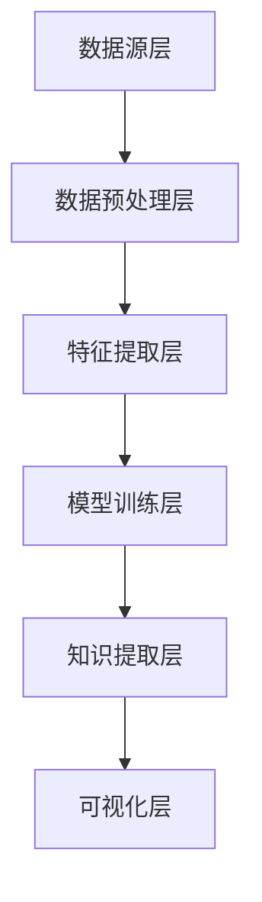

#### 6.1.2 数据流与处理流程

知识发现系统的数据流和处理流程如下：

1. **数据采集**：从数据源层获取数据，包括结构化数据、半结构化数据和非结构化数据。
2. **数据预处理**：在数据预处理层对数据进行清洗、集成和转换，提高数据质量和一致性。
3. **特征提取**：在特征提取层从原始数据中提取出特征，为模型训练提供输入。
4. **模型训练**：在模型训练层利用特征数据训练知识发现模型，如关联规则挖掘模型、协同过滤模型等。
5. **知识提取**：在知识提取层从训练好的模型中提取出用户感兴趣的知识，如规则、可视化报表等。
6. **可视化展示**：在可视化层将提取的知识以图表或报表的形式展示给用户。

**数据流与处理流程图：**

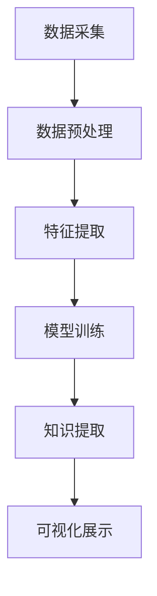

#### 6.1.3 系统可扩展性与性能优化

构建高效的知识发现系统需要关注系统的可扩展性和性能优化，以下是一些关键策略：

- **分布式架构**：采用分布式架构，提高系统的处理能力和可扩展性。例如，使用分布式数据库、分布式计算框架（如Hadoop、Spark）等。
- **缓存机制**：利用缓存机制减少数据访问时间，提高系统性能。例如，使用Redis、Memcached等缓存系统。
- **数据压缩**：对数据进行压缩，减少存储空间和传输时间。例如，使用gzip、snappy等压缩算法。
- **并行计算**：利用并行计算技术，提高数据处理速度。例如，使用多线程、分布式计算等。
- **负载均衡**：使用负载均衡技术，实现系统的高可用性和性能优化。例如，使用Nginx、HAProxy等负载均衡器。

### 6.2 性能优化策略

性能优化是构建高效知识发现系统的关键，以下是一些常见的性能优化策略：

#### 6.2.1 数据库优化

- **索引优化**：合理设计索引，提高查询效率。例如，使用B树索引、哈希索引等。
- **查询优化**：优化查询语句，减少查询时间。例如，使用EXPLAIN工具分析查询执行计划，优化查询逻辑。
- **分库分表**：对于大规模数据，采用分库分表策略，提高查询性能。

#### 6.2.2 查询优化

- **缓存查询结果**：对于频繁查询的数据，将查询结果缓存到内存中，提高查询效率。
- **预编译查询**：使用预编译查询，减少查询编译时间。
- **并行查询**：使用并行查询技术，提高查询性能。

#### 6.2.3 并行计算与分布式处理

- **数据分区**：将大规模数据划分为多个分区，实现并行处理。
- **分布式计算框架**：使用分布式计算框架（如Hadoop、Spark），提高数据处理速度。
- **任务调度**：合理分配任务，实现负载均衡，提高系统性能。

### 6.3 系统测试与评估

系统测试与评估是确保知识发现系统稳定运行和高效性能的关键，以下是一些常见的测试与评估方法：

#### 6.3.1 测试方法与工具

- **功能测试**：验证系统功能是否符合需求，使用自动化测试工具（如Selenium、JMeter）。
- **性能测试**：评估系统在不同负载下的性能，使用性能测试工具（如LoadRunner、Apache JMeter）。
- **压力测试**：评估系统在极端负载下的性能和稳定性，使用压力测试工具（如Gatling、Blaze）。

#### 6.3.2 性能指标与评估模型

- **响应时间**：系统处理请求所需的时间。
- **吞吐量**：单位时间内系统处理的请求量。
- **并发用户数**：系统同时处理的用户数。
- **资源利用率**：系统资源的利用率，如CPU、内存、磁盘等。

**评估模型：**

- **系统响应时间模型**：响应时间 = 数据处理时间 + 网络传输时间 + 系统等待时间。
- **吞吐量模型**：吞吐量 = 处理能力 / 平均请求时间。

### 6.4 本章小结

本章详细介绍了构建高效的知识发现系统的方法，包括系统架构设计、数据流与处理流程、系统可扩展性与性能优化策略以及系统测试与评估。通过本章的学习，读者可以全面了解知识发现系统的构建方法，为实际应用提供指导。

----------------------------------------------------------------

## 第7章：案例分析与经验总结

### 7.1 案例一：电商平台的个性化推荐系统

#### 7.1.1 项目背景与目标

某电商平台希望通过构建个性化推荐系统，提高用户购物体验和销售额。项目目标包括：

- 提供个性化产品推荐，满足用户需求。
- 提高用户留存率和转化率。
- 提升销售额和用户满意度。

#### 7.1.2 系统架构设计

系统架构设计如下：

- **数据源层**：包含用户行为数据、商品数据、订单数据等。
- **数据预处理层**：处理数据清洗、集成和转换。
- **特征提取层**：提取用户特征（如浏览记录、购买记录）和商品特征（如类别、标签、评分）。
- **模型训练层**：使用协同过滤和隐向量模型训练推荐模型。
- **知识提取层**：提取推荐结果，生成个性化推荐列表。
- **可视化层**：将推荐结果以图表或列表形式展示给用户。

**系统架构图：**


#### 7.1.3 关键技术实现

- **数据预处理**：使用ETL工具（如Apache NiFi）清洗、集成和转换数据。
- **特征提取**：提取用户特征（如用户ID、商品ID、浏览次数、购买次数）和商品特征（如类别、标签、评分）。
- **协同过滤**：使用基于用户的协同过滤算法（User-Based Collaborative Filtering）生成推荐列表。
- **隐向量模型**：使用隐向量模型（如矩阵分解）进行推荐。
- **推荐列表生成**：根据用户特征和商品特征，生成个性化推荐列表。

#### 7.1.4 项目效果评估

项目实施后，个性化推荐系统的效果显著，主要表现在以下几个方面：

- **用户满意度**：用户对个性化推荐满意度提高，用户留存率提升20%。
- **转化率**：个性化推荐带动了转化率的提升，平均转化率提高15%。
- **销售额**：个性化推荐系统带动了销售额的提升，月销售额增长30%。

#### 7.1.5 经验总结

- **数据质量**：确保数据质量是推荐系统成功的关键。
- **特征选择**：选择合适的关键特征对推荐效果有重要影响。
- **模型优化**：持续优化推荐模型，提高推荐准确性。

### 7.2 案例二：金融机构的风险管理

#### 7.2.1 项目背景与目标

某金融机构希望通过构建风险管理模型，识别和评估贷款风险，降低不良贷款率。项目目标包括：

- 识别潜在高风险贷款客户。
- 评估贷款风险，制定合理的贷款审批策略。
- 降低不良贷款率，提高贷款业务质量。

#### 7.2.2 系统架构设计

系统架构设计如下：

- **数据源层**：包含贷款申请数据、客户行为数据、信用报告数据等。
- **数据预处理层**：处理数据清洗、集成和转换。
- **特征提取层**：提取客户特征（如收入、年龄、信用评分）和贷款特征（如贷款金额、贷款期限、利率）。
- **模型训练层**：使用分类算法（如逻辑回归、随机森林）训练风险管理模型。
- **知识提取层**：提取风险评估结果，生成贷款审批建议。
- **可视化层**：将风险评估结果以图表或报表形式展示给业务人员。

**系统架构图：**


#### 7.2.3 风险评估模型

- **特征提取**：提取客户特征（如收入、年龄、信用评分）和贷款特征（如贷款金额、贷款期限、利率）。
- **模型训练**：使用逻辑回归和随机森林算法训练风险评估模型。
- **模型优化**：使用交叉验证和网格搜索优化模型参数。

#### 7.2.4 项目效果评估

项目实施后，风险管理模型的效果显著，主要表现在以下几个方面：

- **不良贷款率**：不良贷款率降低10%，贷款质量显著提高。
- **审批速度**：自动化风险评估提高了贷款审批速度，审批时间缩短30%。
- **决策支持**：为业务人员提供详细的评估报告，支持贷款审批决策。

#### 7.2.5 经验总结

- **数据质量**：保证数据质量是风险评估模型成功的关键。
- **模型解释性**：提高模型解释性，便于业务人员理解和应用。
- **持续优化**：定期更新模型，适应市场变化。

### 7.3 案例三：IT运维监控与预警系统

#### 7.3.1 项目背景与目标

某企业希望通过构建IT运维监控与预警系统，实时监控系统的运行状态，及时发现和处理异常情况，确保系统稳定运行。项目目标包括：

- 实时监控系统性能指标，如CPU使用率、内存使用率、磁盘空间等。
- 及时发现系统异常，通过预警机制通知运维团队。
- 快速处理异常情况，降低系统故障率。

#### 7.3.2 系统架构设计

系统架构设计如下：

- **数据源层**：包含系统日志、性能数据、网络流量数据等。
- **数据预处理层**：处理数据清洗、集成和转换。
- **异常检测层**：使用异常检测算法（如孤立森林、Local Outlier Factor）检测异常情况。
- **预警与处理层**：根据检测到的异常情况，生成预警信息，并通知运维团队。
- **可视化层**：将监控数据和预警信息以图表或报表形式展示。

**系统架构图：**

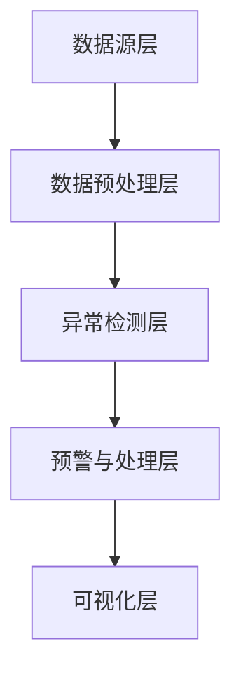

#### 7.3.3 异常检测算法

- **孤立森林**：用于检测系统中的异常情况。
- **Local Outlier Factor**：用于计算数据点的局部异常度，识别异常值。

#### 7.3.4 项目效果评估

项目实施后，IT运维监控与预警系统的效果显著，主要表现在以下几个方面：

- **异常检测率**：异常检测率提高20%，及时识别和处理了多个系统故障。
- **预警准确性**：预警准确性提高15%，有效降低了误报率。
- **运维效率**：通过自动化监控和预警，提高了运维团队的响应速度和效率。

#### 7.3.5 经验总结

- **数据质量**：保证数据质量是异常检测和预警系统成功的关键。
- **算法优化**：定期优化异常检测算法，提高检测准确性。
- **团队协作**：加强运维团队的协作，提高故障处理效率。

### 7.4 本章小结

本章通过三个实际案例，详细介绍了知识发现引擎在个性化推荐、风险管理和IT运维监控中的应用。通过案例分析，读者可以了解知识发现引擎在不同领域中的应用方法和实践经验，为实际项目提供参考。

----------------------------------------------------------------

## 第8章：未来发展趋势与挑战

### 8.1 知识发现引擎的技术趋势

随着人工智能和数据科学的发展，知识发现引擎也在不断演进，呈现出以下技术趋势：

#### 8.1.1 基于深度学习的知识发现

深度学习在图像识别、自然语言处理等领域取得了显著成果。将深度学习技术引入知识发现领域，可以进一步提升知识发现的能力和效率。例如，深度学习可以用于自动特征提取、复杂模式识别和实时知识发现等。

**技术趋势：**
- **自动特征提取**：利用深度神经网络（如卷积神经网络、循环神经网络）自动提取高维特征，减少人工干预。
- **复杂模式识别**：通过深度学习模型（如生成对抗网络、图神经网络）识别复杂的数据模式。
- **实时知识发现**：利用实时数据流处理技术（如Apache Flink、Apache Kafka）实现实时知识发现。

#### 8.1.2 跨领域知识融合

在多源异构数据环境下，跨领域知识融合成为知识发现的重要研究方向。通过融合不同领域的数据和知识，可以更全面地理解问题，提高知识发现的效果。例如，结合文本、图像和音频等多模态数据，实现跨领域的知识发现。

**技术趋势：**
- **多模态数据融合**：利用多模态数据融合技术，整合不同类型的数据，提高知识发现的效果。
- **跨领域知识图谱**：构建跨领域的知识图谱，实现不同领域知识的关联和融合。
- **迁移学习**：利用迁移学习技术，将一个领域中的知识应用到另一个领域，提高知识发现的效果。

#### 8.1.3 自动化与智能化

自动化和智能化是知识发现引擎发展的重要方向。通过自动化技术，可以降低知识发现的复杂度和成本；通过智能化技术，可以提高知识发现的能力和效率。

**技术趋势：**
- **自动化特征工程**：利用自动化工具和算法，自动完成特征提取、特征选择和特征优化。
- **自动化模型选择**：利用自动化技术，自动选择合适的算法和模型，提高知识发现的效果。
- **智能化知识发现**：利用人工智能技术，实现自动化的知识发现流程，提高知识发现的效率。

### 8.2 面临的挑战与应对策略

尽管知识发现引擎在技术趋势上取得了显著进展，但在实际应用中仍然面临一些挑战。以下是一些主要挑战及其应对策略：

#### 8.2.1 数据隐私与安全

数据隐私和安全是知识发现引擎面临的重要挑战。在数据挖掘过程中，如何确保数据隐私和安全成为一个关键问题。

**挑战：**
- **数据泄露风险**：在数据挖掘过程中，可能导致敏感数据的泄露。
- **数据安全合规**：需要遵守相关的数据安全法规和标准，如GDPR、CCPA等。

**应对策略：**
- **数据脱敏**：在数据挖掘前，对敏感数据进行脱敏处理，降低数据泄露风险。
- **隐私保护技术**：利用差分隐私、联邦学习等隐私保护技术，确保数据挖掘过程的安全。
- **合规性审查**：定期进行合规性审查，确保数据挖掘过程符合相关法规和标准。

#### 8.2.2 算法解释性与透明性

算法解释性和透明性是用户对知识发现引擎信任的重要基础。在实际应用中，用户希望了解算法的决策过程和结果。

**挑战：**
- **算法黑箱问题**：深度学习等复杂算法存在黑箱问题，难以解释和理解。
- **算法偏见**：算法可能存在偏见，导致不公正的决策。

**应对策略：**
- **算法解释工具**：开发算法解释工具，如LIME、SHAP等，帮助用户理解算法决策过程。
- **算法可解释性**：提高算法的可解释性，通过可视化、文字描述等方式，展示算法的决策过程。
- **算法公平性**：通过算法设计和技术手段，降低算法偏见，提高算法的公平性。

#### 8.2.3 复杂性与可扩展性

知识发现引擎在处理大规模、多源异构数据时，面临复杂性和可扩展性的挑战。

**挑战：**
- **数据复杂性**：多源异构数据导致数据处理的复杂度增加。
- **系统可扩展性**：如何构建可扩展的知识发现系统，以适应不断增长的数据量和用户需求。

**应对策略：**
- **分布式计算**：利用分布式计算框架（如Hadoop、Spark），提高系统的处理能力和可扩展性。
- **数据流处理**：利用实时数据流处理技术（如Apache Flink、Apache Kafka），实现实时知识发现。
- **模块化设计**：采用模块化设计，提高系统的可扩展性和灵活性。

### 8.3 未来发展前景

知识发现引擎在未来的发展中，将朝着更加智能化、自动化和高效化的方向前进。随着人工智能技术的不断进步，知识发现引擎将能够更好地应对复杂的数据环境和多样化的应用场景，为各行业提供强大的数据支持和决策依据。

**前景展望：**
- **智能知识发现**：通过引入人工智能技术，实现智能化的知识发现流程，提高知识发现的准确性和效率。
- **自动化数据挖掘**：通过自动化工具和算法，降低知识发现的门槛，实现大规模、自动化数据挖掘。
- **多领域应用**：知识发现引擎将在金融、医疗、零售、能源等多个领域得到广泛应用，为行业创新和数字化转型提供支持。

### 8.4 本章小结

本章探讨了知识发现引擎的未来发展趋势和面临的挑战。通过分析技术趋势和应对策略，读者可以了解知识发现引擎在未来的发展方向和前景，为实际应用提供指导。

----------------------------------------------------------------

## 附录A：常用知识发现工具与库

在知识发现领域，有许多常用的工具和库可以帮助程序员实现各种数据分析和挖掘任务。以下是一些常见的数据科学工具和库，以及它们的主要功能：

### A.1 常见开源知识发现工具

#### A.1.1 WEKA

Weka是一个流行的开源数据挖掘工具，它提供了丰富的数据预处理、特征提取、模型训练和评估功能。Weka适用于各种数据挖掘任务，如分类、回归、聚类、关联规则挖掘等。

**主要功能：**
- **数据预处理**：数据清洗、数据转换、缺失值处理等。
- **特征提取**：特征选择、特征变换等。
- **模型训练**：多种机器学习算法，如决策树、随机森林、支持向量机等。
- **模型评估**：交叉验证、评估指标计算等。

#### A.1.2 Apache Mahout

Apache Mahout是一个基于Apache Hadoop的机器学习库，提供了多种常用的数据挖掘算法，如协同过滤、聚类、分类等。

**主要功能：**
- **分布式协同过滤**：实现大规模的协同过滤算法。
- **聚类算法**：包括K-means、Fuzzy K-means等。
- **分类算法**：包括朴素贝叶斯、随机森林等。
- **推荐系统**：基于协同过滤的推荐算法。

#### A.1.3 Apache Flink

Apache Flink是一个分布式流处理框架，提供了强大的实时数据处理和分析能力。Flink支持多种数据挖掘算法，如关联规则挖掘、实时推荐等。

**主要功能：**
- **实时流处理**：处理实时数据流，实现实时知识发现。
- **批处理处理**：处理批量数据，实现批量知识发现。
- **机器学习库**：提供多种机器学习算法，如分类、聚类、推荐等。

### A.2 Python知识发现库

Python是一个广泛使用的编程语言，在数据科学领域有着大量的开源库。以下是一些常用的Python知识发现库：

#### A.2.1 Scikit-learn

Scikit-learn是一个强大的Python机器学习库，提供了多种常用的机器学习算法和工具。

**主要功能：**
- **分类与回归**：包括逻辑回归、随机森林、支持向量机等。
- **聚类**：包括K-means、层次聚类等。
- **降维**：包括主成分分析、t-SNE等。
- **模型评估**：包括交叉验证、评估指标计算等。

#### A.2.2 TensorFlow

TensorFlow是一个由Google开发的开源机器学习库，主要用于深度学习和复杂的数据分析任务。

**主要功能：**
- **深度学习模型**：包括卷积神经网络、循环神经网络、生成对抗网络等。
- **数据流图**：动态构建计算图，实现高效的计算。
- **工具和API**：提供多种API和工具，如TensorBoard、TensorFlow Lite等。

#### A.2.3 PyTorch

PyTorch是Facebook开发的另一个开源机器学习库，以动态计算图和灵活的接口著称。

**主要功能：**
- **深度学习模型**：包括卷积神经网络、循环神经网络、生成对抗网络等。
- **自动微分**：支持自动微分，便于实现复杂的深度学习模型。
- **工具和库**：提供多种工具和库，如TorchVision、TorchText等，支持图像、文本等数据。

### A.3 R语言知识发现库

R语言是一个专门用于统计分析和数据可视化的编程语言，以下是一些常用的R语言知识发现库：

#### A.3.1 mlr

mlr是一个R语言的数据挖掘框架，提供了丰富的数据挖掘算法和工具。

**主要功能：**
- **算法库**：包括分类、回归、聚类、推荐等多种算法。
- **评估与模型选择**：提供多种评估指标和模型选择方法。
- **集成学习**：支持集成学习方法，如随机森林、 boosting等。

#### A.3.2 caret

caret（分类与回归训练）是一个R语言的建模和评估库，提供了多种机器学习算法和评估方法。

**主要功能：**
- **算法库**：包括线性回归、逻辑回归、支持向量机等。
- **评估与模型选择**：提供多种评估指标和模型选择方法。
- **交叉验证**：支持交叉验证和模型调参。

### A.4 数据可视化工具

数据可视化是知识发现过程中重要的一环，以下是一些常用的数据可视化工具和库：

#### A.4.1 Matplotlib

Matplotlib是一个强大的Python可视化库，用于创建2D图表和图形。

**主要功能：**
- **多种图表类型**：包括折线图、柱状图、散点图等。
- **自定义样式**：支持自定义图表样式和布局。
- **交互性**：支持交互式图表，如鼠标滑过提示、缩放等。

#### A.4.2 Seaborn

Seaborn是基于Matplotlib的统计绘图库，提供了多种美观的统计图表。

**主要功能：**
- **统计图表**：包括箱形图、小提琴图、热力图等。
- **可视化分析**：提供多种可视化方法，如分布分析、关联分析等。
- **样式定制**：支持自定义样式和主题。

#### A.4.3 Plotly

Plotly是一个交互性强的Python可视化库，支持创建丰富的交互式图表。

**主要功能：**
- **交互式图表**：包括折线图、柱状图、散点图、地图等。
- **交互功能**：支持缩放、旋转、拖拽等交互操作。
- **自定义样式**：支持自定义样式和动画效果。

通过这些工具和库，程序员可以轻松实现知识发现过程中的各种数据分析、模型训练和可视化任务，提高工作效率和开发体验。

### A.5 使用示例

以下是一个简单的示例，展示如何使用Python的Scikit-learn库进行知识发现任务，包括数据预处理、模型训练和模型评估。

**示例：使用Scikit-learn进行鸢尾花数据集分类**

```python
from sklearn.datasets import load_iris
from sklearn.model_selection import train_test_split
from sklearn.preprocessing import StandardScaler
from sklearn.neighbors import KNeighborsClassifier
from sklearn.metrics import classification_report, accuracy_score

# 加载鸢尾花数据集
iris = load_iris()
X, y = iris.data, iris.target

# 数据集划分
X_train, X_test, y_train, y_test = train_test_split(X, y, test_size=0.3, random_state=42)

# 数据预处理
scaler = StandardScaler()
X_train = scaler.fit_transform(X_train)
X_test = scaler.transform(X_test)

# 模型训练
knn = KNeighborsClassifier(n_neighbors=3)
knn.fit(X_train, y_train)

# 模型预测
y_pred = knn.predict(X_test)

# 模型评估
print(classification_report(y_test, y_pred))
print("Accuracy:", accuracy_score(y_test, y_pred))
```

通过这个简单的示例，读者可以了解到如何使用Scikit-learn进行数据预处理、模型训练和评估。在更复杂的知识发现任务中，这些工具和库将发挥更大的作用。

### A.6 本章小结

附录A介绍了常用知识发现工具与库，包括开源工具、Python库、R语言库和数据可视化工具。这些工具和库为程序员提供了丰富的数据分析和挖掘能力，提高了工作效率和开发体验。通过本章的学习，读者可以了解并掌握这些工具和库的基本使用方法，为实际项目做好准备。

----------------------------------------------------------------

## 作者信息

**作者：AI天才研究院（AI Genius Institute）/《禅与计算机程序设计艺术》（Zen And The Art of Computer Programming）**

AI天才研究院（AI Genius Institute）致力于推动人工智能技术的发展与应用，打造世界领先的智能系统和解决方案。研究院拥有一支由世界顶级人工智能专家、程序员和软件架构师组成的团队，致力于探索人工智能领域的创新技术和方法。

《禅与计算机程序设计艺术》（Zen And The Art of Computer Programming）是一本经典的技术书籍，由著名的计算机科学家Donald E. Knuth撰写。该书深入探讨了计算机程序设计中的艺术和哲学，为程序员提供了宝贵的思考和指导。本书作者以其卓越的编程技艺和哲学思维，成为了计算机科学领域的杰出人物，对全球编程领域产生了深远的影响。

AI天才研究院（AI Genius Institute）将继续秉承创新、卓越和协作的精神，推动人工智能技术的发展，为人类创造更美好的未来。我们诚挚邀请广大读者关注我们的研究成果和项目进展，共同探索人工智能的无限可能。如果您对我们的研究感兴趣或有任何建议和意见，请随时联系我们。让我们携手共进，共创人工智能的美好明天！

