                 

### 《程序员如何将兼职项目逐步转型为全职创业》

> **关键词：** 程序员，兼职项目，全职创业，转型，技术能力提升，团队管理，市场拓展，法律财务准备。

> **摘要：** 本文章将深入探讨程序员如何通过评估和规划兼职项目，逐步将其转型为全职创业。文章将详细分析项目评估标准、技术掌握与提升、团队组建与管理、市场拓展与品牌建设、法律与财务准备以及全职创业实践等关键环节，为程序员提供一套系统的转型策略，助力成功全职创业。

---

### 《程序员如何将兼职项目逐步转型为全职创业》目录大纲

#### 第一部分：准备阶段

- **第1章：兼职项目评估与规划**
  - 1.1 兼职项目的评估标准
  - 1.2 全职创业的可行性分析
  - 1.3 制定转型计划

#### 第二部分：转型实践

- **第2章：项目核心技术的掌握与提升**
  - 2.1 核心技术掌握
  - 2.2 技术能力提升策略

- **第3章：团队组建与管理**
  - 3.1 团队成员选拔
  - 3.2 团队管理策略

- **第4章：市场拓展与品牌建设**
  - 4.1 市场定位
  - 4.2 市场拓展策略
  - 4.3 品牌建设

#### 第三部分：全职创业准备

- **第5章：全职创业法律与财务准备**
  - 5.1 创业法律知识
  - 5.2 财务规划

- **第6章：全职创业与兼职项目的转换**
  - 6.1 转换策略
  - 6.2 风险防范与应对

#### 第四部分：全职创业实践

- **第7章：全职创业初期管理**
  - 7.1 团队管理与文化建设
  - 7.2 产品研发与迭代
  - 7.3 项目风险管理

- **第8章：全职创业成功案例与经验分享**
  - 8.1 成功案例分析
  - 8.2 创业经验分享

#### 附录

- **附录A：创业资源汇总**
  - A.1 政策支持
  - A.2 创业平台
  - A.3 投资人资源
  - A.4 创业者社群

---

**核心概念与联系**

在本文中，我们将探讨几个核心概念及其相互之间的联系，包括兼职项目、全职创业、技术能力提升、团队管理、市场拓展和法律财务准备。通过Mermaid流程图，我们可以直观地展示这些概念之间的逻辑关系。

#### Mermaid流程图

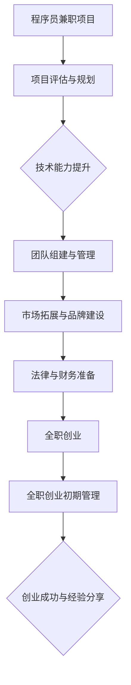

##### 核心概念与联系

1. **兼职项目**：程序员在业余时间开发的项目，是技术积累和商业实践的基础。
2. **全职创业**：将兼职项目转变为全职经营的事业，需要全面的技术、管理和市场能力。
3. **技术能力提升**：通过不断学习和实践，提升编程技能和项目开发能力。
4. **团队组建与管理**：找到合适的团队成员，建立有效的团队管理机制。
5. **市场拓展与品牌建设**：明确市场定位，制定推广策略，建立品牌形象。
6. **法律与财务准备**：了解创业法律知识，进行财务规划，确保合法合规经营。
7. **全职创业初期管理**：在全职创业的初期，注重团队管理、产品研发与迭代、项目风险管理。

通过上述流程图和概念阐述，我们可以清晰地看到兼职项目逐步转型为全职创业的各个关键环节，以及这些环节之间的相互关系。接下来，我们将逐一深入探讨每个章节的内容。

### 第一部分：准备阶段

#### 第1章：兼职项目评估与规划

在决定将兼职项目转型为全职创业之前，程序员需要对项目进行全面的评估与规划。这一过程至关重要，因为它将直接影响项目的未来发展。以下是评估与规划的主要步骤：

##### 1.1 兼职项目的评估标准

对兼职项目进行评估时，需要考虑以下几个方面：

1. **项目收益评估**：计算项目的当前收入和潜在收入，包括客户订单、合作伙伴关系和未来市场扩张的可能性。
2. **项目风险分析**：分析项目面临的各种风险，如技术风险、市场风险、法律风险等，并制定相应的风险控制措施。
3. **项目成长潜力评估**：评估项目的市场前景、技术趋势以及项目的可持续发展能力。

**Mermaid流程图：**

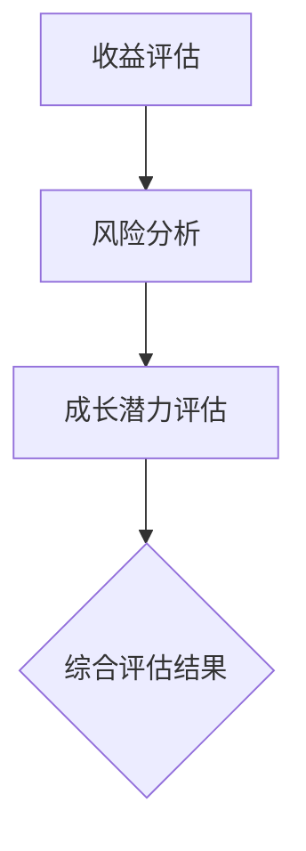

**项目收益评估示例：**

```python
# 假设项目当前月收入为10000元，预计未来增长率为10%
current_month_income = 10000
monthly_growth_rate = 0.1

future_month_income = current_month_income * (1 + monthly_growth_rate)
print(f"未来一个月预计收入: {future_month_income}元")
```

**风险分析示例：**

```python
# 假设项目面临的市场风险为20%，技术风险为15%，法律风险为10%
market_risk = 0.2
technical_risk = 0.15
legal_risk = 0.1

total_risk = market_risk + technical_risk + legal_risk
print(f"项目总风险: {total_risk * 100}%")
```

##### 1.2 全职创业的可行性分析

在评估项目收益和风险之后，程序员需要分析全职创业的可行性。以下是一些关键因素：

1. **个人能力评估**：程序员需要评估自己在技术、管理、市场和财务方面的能力，以确保能够胜任全职创业的要求。
2. **市场需求分析**：分析项目的市场需求，确定目标客户群体，评估市场竞争状况。
3. **资源整合能力评估**：评估程序员是否具备整合资源（如资金、人才、合作伙伴等）的能力。

**Mermaid流程图：**

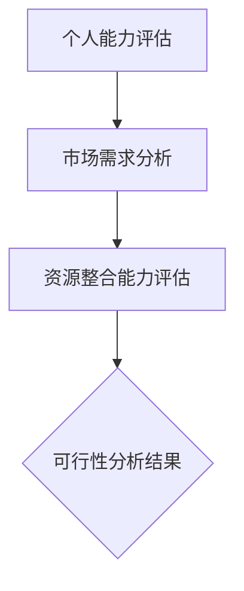

**个人能力评估示例：**

```python
# 假设程序员的技能评分、管理评分和市场需求评分分别为90、80、85
skill_score = 90
management_score = 80
market_demand_score = 85

total_score = (skill_score + management_score + market_demand_score) / 3
print(f"个人能力评分: {total_score}")
```

##### 1.3 制定转型计划

在完成评估和可行性分析之后，程序员需要制定详细的转型计划，包括以下内容：

1. **转型目标设定**：明确转型的具体目标，如时间线、收入目标、市场份额目标等。
2. **时间线与阶段性目标**：制定项目转型的具体时间表，将整个转型过程分为几个阶段，并为每个阶段设定可衡量的目标。
3. **资金与资源准备**：评估转型过程中所需的资金和资源，并制定相应的筹集和分配计划。

**Mermaid流程图：**

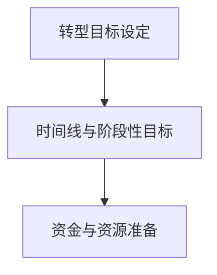

**转型计划示例：**

```python
# 转型目标设定
transition_goals = {
    "income_target": 20000,
    "market_share_target": 20,
    "time_line": "6 months"
}

# 时间线与阶段性目标
transition_steps = [
    {"step": "assessment", "time": "1 month"},
    {"step": "planning", "time": "1 month"},
    {"step": "implementation", "time": "4 months"},
]

# 资金与资源准备
financial_resources = 50000
human_resources = ["developer", " marketer", "project manager"]
```

通过以上评估与规划，程序员可以更清晰地了解项目的现状和未来发展方向，为转型为全职创业奠定坚实基础。接下来，我们将探讨如何逐步提升项目的技术能力，为全职创业打下坚实基础。

#### 第2章：项目核心技术的掌握与提升

在转型过程中，技术能力是程序员能否成功全职创业的关键因素之一。掌握和提升项目核心技术不仅能够增强项目竞争力，还能提高开发效率和团队凝聚力。以下是一些具体策略：

##### 2.1 核心技术掌握

首先，程序员需要明确项目的核心技术需求，这通常包括以下几个方面：

1. **技术栈分析**：了解项目目前使用的技术栈，包括前端、后端、数据库、框架等。
2. **技术难点攻克**：识别项目中存在的技术难点，如性能优化、安全性问题、高并发处理等。
3. **技术更新与跟进**：技术不断进步，程序员需要持续跟进最新的技术动态，以确保项目始终保持竞争力。

**Mermaid流程图：**

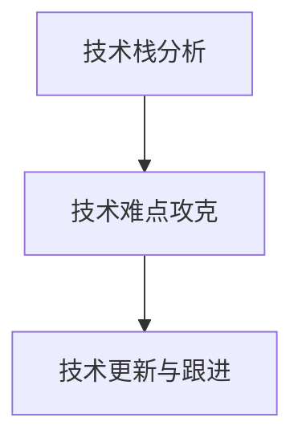

**技术栈分析示例：**

```python
# 假设项目使用以下技术栈
tech_stack = {
    "frontend": ["React", "Vue"],
    "backend": ["Node.js", "Django"],
    "database": ["MySQL", "MongoDB"],
    "framework": ["Spring", "Angular"],
}

print(f"项目技术栈：{tech_stack}")
```

**技术难点攻克示例：**

```python
# 假设项目中存在性能优化问题
performance_issues = ["slow database queries", "high memory usage"]

# 解决方案
solutions = {
    "slow_database_queries": "add indexes and optimize queries",
    "high_memory_usage": "reduce memory footprint and use caching",
}

print(f"技术难点解决方案：{solutions}")
```

**技术更新与跟进示例：**

```python
# 获取最新的技术动态
latest_technologies = ["Kubernetes", "Serverless Architecture", "Blockchain"]

print(f"最新技术动态：{latest_technologies}")
```

##### 2.2 技术能力提升策略

为了提升技术能力，程序员可以采取以下策略：

1. **技术研习路径规划**：制定详细的学习计划，包括基础知识和前沿技术的学习。
2. **技术社群参与**：加入技术社群，参与技术讨论，分享经验，学习他人的最佳实践。
3. **技术竞赛与交流**：参加技术竞赛，与行业内的专家进行交流，提升自己的技术视野。

**Mermaid流程图：**

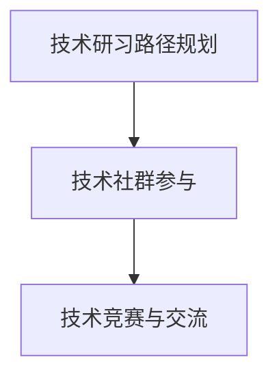

**技术研习路径规划示例：**

```python
# 技术研习路径规划
learning_path = [
    {"level": "基础", "topics": ["数据结构", "算法", "计算机网络"]},
    {"level": "进阶", "topics": ["微服务架构", "容器化技术", "区块链"]},
    {"level": "前沿", "topics": ["人工智能", "物联网", "5G"]},
]

print(f"技术研习路径规划：{learning_path}")
```

**技术社群参与示例：**

```python
# 加入技术社群
tech_communities = ["GitHub", "Stack Overflow", "Reddit"]

print(f"技术社群：{tech_communities}")
```

**技术竞赛与交流示例：**

```python
# 技术竞赛与交流
tech_competitions = ["Google Code Jam", "Facebook Hacker Cup", "ACM Programming Contest"]

print(f"技术竞赛与交流：{tech_competitions}")
```

通过上述策略，程序员可以不断提升自己的技术能力，为全职创业做好准备。接下来，我们将探讨团队组建与管理的重要性，以及如何有效组建和管理团队。

#### 第3章：团队组建与管理

在转型为全职创业的过程中，团队是程序员能否成功的关键因素之一。一个高效的团队能够共同应对挑战，提高项目开发效率，并推动公司发展。以下是团队组建与管理的一些关键策略：

##### 3.1 团队成员选拔

组建一个高效的团队首先需要选拔合适的成员。以下是选拔团队成员时需要考虑的几个方面：

1. **成员背景与技能要求**：确保团队成员具有项目所需的各种技能，如前端开发、后端开发、数据库管理、UI设计等。
2. **成员职责划分**：明确每个成员的职责和角色，确保团队成员之间的职责互补，避免重复劳动。
3. **成员激励与成长计划**：为团队成员提供职业发展的机会和激励机制，激发团队成员的积极性和创造力。

**Mermaid流程图：**

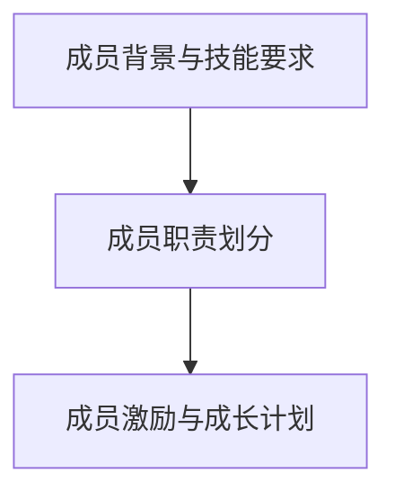

**成员背景与技能要求示例：**

```python
# 团队成员背景与技能要求
team_members = [
    {"name": "Alice", "role": "Frontend Developer", "skills": ["React", "Vue"]},
    {"name": "Bob", "role": "Backend Developer", "skills": ["Node.js", "Django"]},
    {"name": "Charlie", "role": "Database Administrator", "skills": ["MySQL", "MongoDB"]},
]

print(f"团队成员背景与技能要求：{team_members}")
```

**成员职责划分示例：**

```python
# 成员职责划分
member_roles = {
    "Alice": ["Frontend Development", "UI/UX Design"],
    "Bob": ["Backend Development", "API Design"],
    "Charlie": ["Database Management", "Data Migration"],
}

print(f"成员职责划分：{member_roles}")
```

**成员激励与成长计划示例：**

```python
# 成员激励与成长计划
growth_plans = {
    "Alice": {"target": "Frontend Lead", "training": "Advanced React Training"},
    "Bob": {"target": "Backend Architect", "training": "Docker and Kubernetes"},
    "Charlie": {"target": "Database Team Lead", "training": "MongoDB Advanced Topics"},
}

print(f"成员激励与成长计划：{growth_plans}")
```

##### 3.2 团队管理策略

在组建团队后，有效的管理策略是确保团队高效运作的关键。以下是几种常见的团队管理策略：

1. **团队沟通机制**：建立有效的沟通机制，确保团队成员之间的信息畅通，及时解决问题。
2. **项目进度管理**：制定详细的项目进度计划，监控项目进度，确保项目按时交付。
3. **团队文化建设**：建立积极向上的团队文化，增强团队成员的归属感和凝聚力。

**Mermaid流程图：**

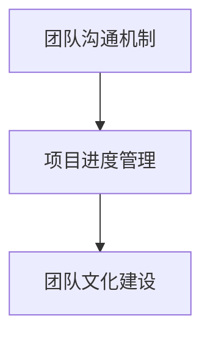

**团队沟通机制示例：**

```python
# 团队沟通机制
communication_channels = {
    "daily_meeting": "9:00 AM",
    "weekly_status": "Thursday 2:00 PM",
    "project_tools": ["Slack", "Trello"],
}

print(f"团队沟通机制：{communication_channels}")
```

**项目进度管理示例：**

```python
# 项目进度管理
project_progress = {
    "phase1": {"status": "Completed", "deadline": "2023-04-15"},
    "phase2": {"status": "In Progress", "deadline": "2023-05-15"},
    "phase3": {"status": "Planned", "deadline": "2023-06-15"},
}

print(f"项目进度管理：{project_progress}")
```

**团队文化建设示例：**

```python
# 团队文化建设
team_culture = {
    "values": ["透明度", "合作", "创新", "客户至上"],
    "events": ["团队建设活动", "技术分享会", "年度庆典"],
}

print(f"团队文化建设：{team_culture}")
```

通过有效的团队组建和管理策略，程序员可以确保团队的高效运作，为全职创业提供强有力的支持。接下来，我们将探讨市场拓展与品牌建设的重要性，以及如何制定有效的市场拓展策略。

#### 第4章：市场拓展与品牌建设

在将兼职项目转型为全职创业的过程中，市场拓展和品牌建设是至关重要的环节。有效的市场策略和强大的品牌形象将有助于吸引客户、增加市场份额，并为公司的长期发展奠定基础。

##### 4.1 市场定位

市场定位是品牌建设的第一步，它涉及到确定公司的目标市场、产品定位以及独特的价值主张。以下是市场定位的关键步骤：

1. **产品市场定位**：明确产品的主要功能、特点和目标客户群体，确保产品能够满足客户的需求。
2. **目标客户群体**：识别最具潜力的客户群体，并了解他们的需求和购买行为。
3. **竞争对手分析**：分析竞争对手的产品、市场策略和市场份额，找出自身的竞争优势。

**Mermaid流程图：**

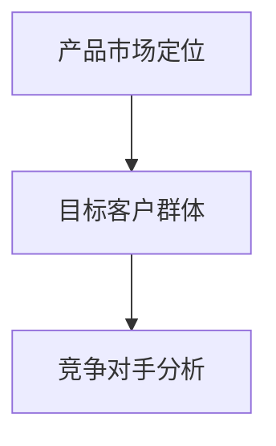

**产品市场定位示例：**

```python
# 假设产品是一款基于云计算的协作工具
product定位 = {
    "name": "CloudCollab",
    "features": ["实时协作", "云端存储", "多设备同步"],
    "target_users": ["初创公司", "小型团队", "远程工作者"],
}

print(f"产品市场定位：{product定位}")
```

**目标客户群体示例：**

```python
# 目标客户群体分析
target_customers = [
    {"name": "Small Businesses", "needs": ["flexibility", "cost-effective solutions"]},
    {"name": "Remote Workers", "needs": ["productivity", "real-time collaboration"]},
]

print(f"目标客户群体：{target_customers}")
```

**竞争对手分析示例：**

```python
# 竞争对手分析
competitors = [
    {"name": "Office 365", "strengths": ["established brand", "wide range of features"]},
    {"name": "Slack", "strengths": ["communication", "integrations"]},
]

print(f"竞争对手分析：{competitors}")
```

##### 4.2 市场拓展策略

市场拓展策略是品牌建设的重要组成部分，它包括线上和线下推广、合作伙伴拓展以及市场活动等。以下是几种有效的市场拓展策略：

1. **线上推广**：利用社交媒体、搜索引擎优化（SEO）、内容营销等方式吸引潜在客户。
2. **线下推广**：参加行业展会、举办研讨会、与客户面对面交流，增强品牌影响力。
3. **合作伙伴拓展**：与行业内的其他公司建立合作关系，共同拓展市场。

**Mermaid流程图：**

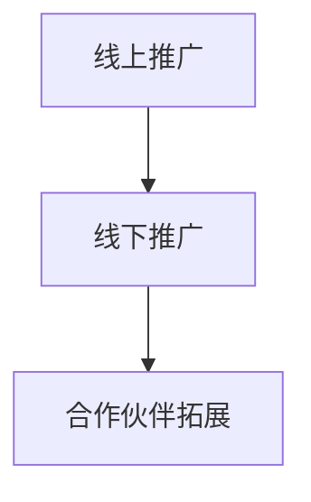

**线上推广示例：**

```python
# 线上推广策略
online_marketing = [
    {"channel": "Social Media", "platforms": ["LinkedIn", "Facebook"]},
    {"channel": "SEO", "keywords": ["cloud collaboration", "remote work tools"]},
    {"channel": "Content Marketing", "topics": ["productivity tips", "team collaboration"]},
]

print(f"线上推广策略：{online_marketing}")
```

**线下推广示例：**

```python
# 线下推广策略
offline_marketing = [
    {"event": "Industry Expo", "location": "San Francisco"},
    {"event": "Tech Conference", "location": "New York"},
    {"event": "Workshops", "location": "Local Businesses"},
]

print(f"线下推广策略：{offline_marketing}")
```

**合作伙伴拓展示例：**

```python
# 合作伙伴拓展
partnerships = [
    {"name": "Tech Company", "benefits": ["co-branded marketing", "shared customer base"]},
    {"name": "Consulting Firm", "benefits": ["joint ventures", "mutual referrals"]},
]

print(f"合作伙伴拓展：{partnerships}")
```

##### 4.3 品牌建设

品牌建设是一个长期的过程，它涉及到品牌定位、核心价值、品牌传播策略等多个方面。以下是品牌建设的几个关键步骤：

1. **品牌定位与核心价值**：明确品牌的核心价值和定位，确保品牌形象在目标客户心中占据一席之地。
2. **品牌传播策略**：制定有效的品牌传播策略，通过多种渠道传递品牌信息，建立品牌认知。
3. **品牌形象塑造**：通过视觉设计、品牌语言和用户体验等方面，塑造一致且吸引人的品牌形象。

**Mermaid流程图：**

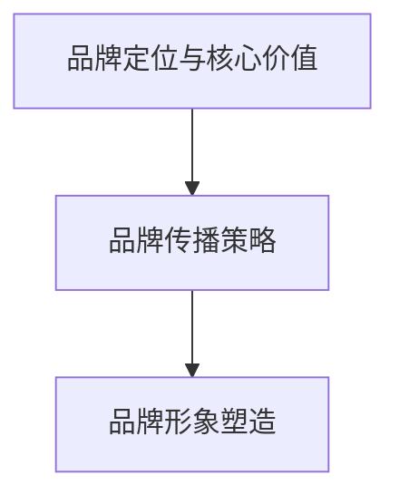

**品牌定位与核心价值示例：**

```python
# 品牌定位与核心价值
brand_positioning = {
    "name": "CloudCollab",
    "value_proposition": "Empowering remote teams with seamless collaboration and cloud-based productivity tools.",
}

print(f"品牌定位与核心价值：{brand_positioning}")
```

**品牌传播策略示例：**

```python
# 品牌传播策略
brand_promotion = [
    {"channel": "Public Relations", "actions": ["press releases", "media interviews"]},
    {"channel": "Influencer Marketing", "actions": ["bloggers", "social media influencers"]},
    {"channel": "Content Marketing", "actions": ["whitepapers", "case studies"]},
]

print(f"品牌传播策略：{brand_promotion}")
```

**品牌形象塑造示例：**

```python
# 品牌形象塑造
brand_image = {
    "visual_identity": {"colors": ["blue", "white"], "logo": "modern and clean"},
    "brand_language": {"tone": "friendly", "voice": "informative and helpful"},
    "user_experience": {"interface": "intuitive and user-friendly"},
}

print(f"品牌形象塑造：{brand_image}")
```

通过明确的市场定位、有效的市场拓展策略和强大的品牌建设，程序员可以为自己的全职创业奠定坚实的基础。接下来，我们将探讨全职创业所需的法律法规和财务准备。

#### 第5章：全职创业法律与财务准备

在将兼职项目转型为全职创业之前，程序员需要做好法律和财务方面的准备。这不仅有助于确保企业的合法合规经营，还能为企业的长期发展提供保障。以下是全职创业所需的法律和财务知识概述。

##### 5.1 创业法律知识

**5.1.1 公司注册流程**

在开始创业之前，程序员需要了解公司注册的基本流程。通常包括以下步骤：

1. **核名**：选择公司名称并进行核名查询，确保名称的唯一性和合法性。
2. **编写公司章程**：制定公司章程，明确公司的组织架构、股权分配、经营管理等事项。
3. **提交注册资料**：准备相关注册资料，如公司章程、股东身份证明、注册资本证明等，并提交给工商部门进行审批。
4. **领取营业执照**：经过工商部门审批后，领取营业执照，标志着公司正式成立。

**Mermaid流程图：**

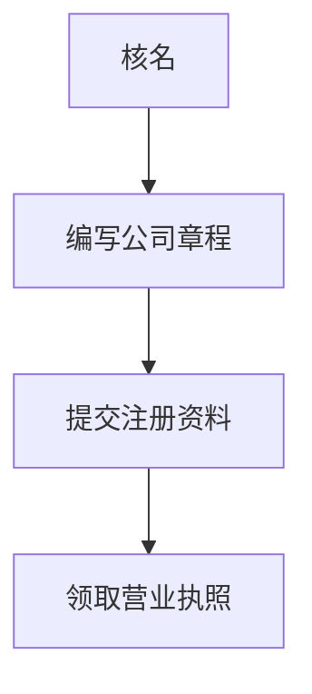

**公司注册示例：**

```python
# 公司注册示例
company_registration = {
    "name": "Tech Genius Inc.",
    "chapters": ["Tech Development", "Customer Service", "Finance Management"],
    "documents": ["company章程", "股东身份证明", "注册资本证明"],
    "status": "Registered",
}

print(f"公司注册流程：{company_registration}")
```

**5.1.2 合同签订与风险管理**

合同签订是企业日常运营中的重要环节，它涉及到与客户、供应商、员工等各方的合作。以下是合同签订和风险管理的几个要点：

1. **明确合同条款**：确保合同条款清晰明确，包括服务内容、价格、交付期限、违约责任等。
2. **风险评估**：在签订合同前，对合同条款进行风险评估，识别可能的风险点，并制定相应的风险管理措施。
3. **法律咨询**：在签订重要合同时，咨询专业律师，确保合同符合法律法规的要求。

**Mermaid流程图：**

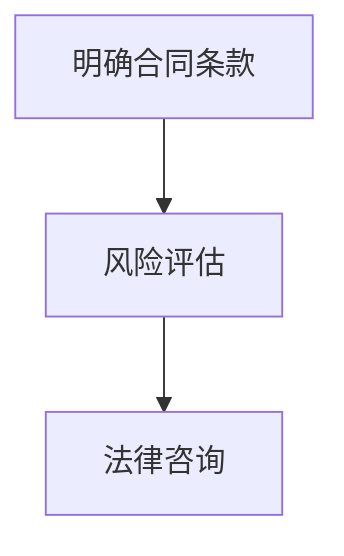

**合同签订示例：**

```python
# 合同签订示例
contract_details = {
    "client": "ABC Company",
    "services": ["Software Development", "IT Support"],
    "price": 50000,
    "delivery_date": "2023-12-31",
    "risk_management": ["payment terms", "performance guarantee"],
}

print(f"合同签订详情：{contract_details}")
```

**5.1.3 知识产权保护

知识产权保护是企业创新和发展的重要保障。程序员需要了解知识产权的基本知识，并采取相应的保护措施：

1. **专利申请**：对具有创新性的技术或产品进行专利申请，以保护专利权。
2. **商标注册**：注册公司商标，防止他人恶意抢注或侵权。
3. **版权保护**：对原创的软件代码、设计作品等进行版权登记，确保著作权。

**Mermaid流程图：**

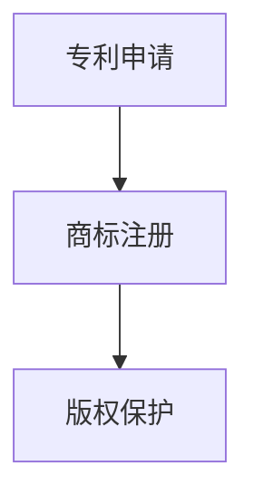

**知识产权保护示例：**

```python
# 知识产权保护示例
intellectual_property = {
    "patents": ["Innovative Software Architecture"],
    "trademarks": ["Tech Genius Logo"],
    "copyrights": ["Custom Software Solutions"],
}

print(f"知识产权保护：{intellectual_property}")
```

##### 5.2 财务规划

**5.2.1 初始资金预算**

创业初期的资金预算是保证企业正常运营的基础。程序员需要根据项目需求、人员配置、运营成本等因素制定详细的资金预算：

1. **人员成本**：包括员工工资、福利、培训等费用。
2. **运营成本**：包括办公场地、设备购置、市场推广、日常运营等费用。
3. **流动资金**：确保企业有足够的流动资金以应对突发状况。

**Mermaid流程图：**

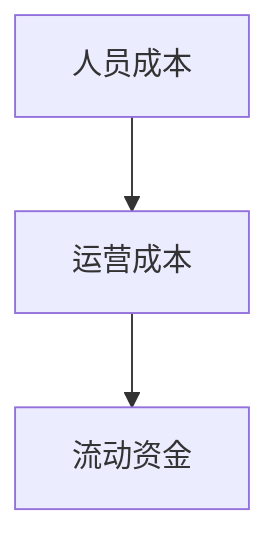

**初始资金预算示例：**

```python
# 初始资金预算
initial_budget = {
    "personnel_cost": 20000,
    "operating_cost": 30000,
    "working_capital": 50000,
    "total": 100000,
}

print(f"初始资金预算：{initial_budget}")
```

**5.2.2 资金筹集途径**

为了确保企业的持续发展，程序员需要了解多种资金筹集途径：

1. **自筹资金**：通过个人储蓄或家庭支持筹集资金。
2. **天使投资**：寻找有经验的天使投资者，获得资金和指导。
3. **风险投资**：向风险投资机构申请资金，以换取股权。
4. **银行贷款**：从银行申请创业贷款，需要提供详细的商业计划书和担保。

**Mermaid流程图：**

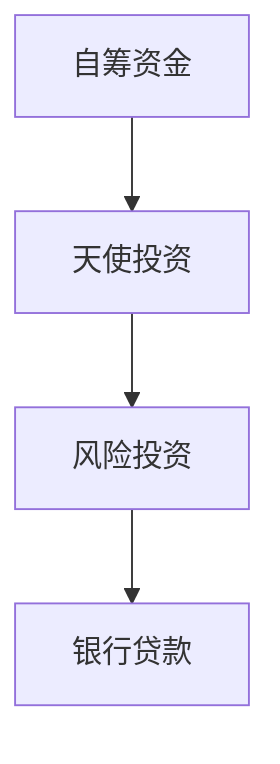

**资金筹集途径示例：**

```python
# 资金筹集途径
funding_sources = [
    {"source": "Personal Savings", "amount": 30000},
    {"source": "Angel Investor", "amount": 20000},
    {"source": "Venture Capital", "amount": 50000},
]

print(f"资金筹集途径：{funding_sources}")
```

**5.2.3 成本控制与盈利预测**

在创业过程中，成本控制和盈利预测是确保企业可持续发展的重要环节。程序员需要制定详细的成本控制措施，并建立盈利预测模型：

1. **成本控制**：通过精细化管理和优化流程，降低运营成本。
2. **盈利预测**：根据市场需求、产品定价、销售预测等因素，预测未来的收入和利润。

**Mermaid流程图：**

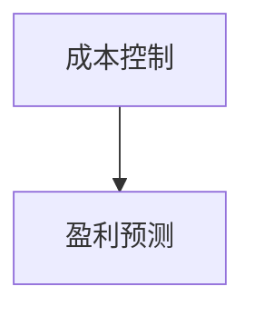

**成本控制与盈利预测示例：**

```python
# 成本控制与盈利预测
cost_control = {
    "operating_expenses": 25000,
    "sales_forecast": {
        "Q1": 40000,
        "Q2": 50000,
        "Q3": 60000,
        "Q4": 70000,
    },
    "profit_prediction": 20000,
}

print(f"成本控制与盈利预测：{cost_control}")
```

通过以上法律和财务知识的准备，程序员可以更好地应对创业过程中的法律和财务挑战，为全职创业奠定坚实的基础。接下来，我们将探讨如何顺利地将兼职项目转型为全职创业。

#### 第6章：全职创业与兼职项目的转换

将兼职项目顺利转型为全职创业是一个复杂而关键的过程，涉及到资源优化配置、管理调整以及团队角色的转换。此外，在这个过程中，风险防范和应对策略也是不可或缺的。以下是具体的转换策略和风险防范措施。

##### 6.1 转换策略

**6.1.1 项目资源优化配置**

在转型过程中，程序员需要重新评估和优化项目资源，以确保资源的高效利用。以下是几个关键步骤：

1. **资金优化**：根据初始资金预算，合理分配资金，确保项目的各项开支都在预算范围内。
2. **人力资源优化**：根据项目需求，调整团队成员的职责和角色，确保每位成员都能发挥最大的价值。
3. **技术资源优化**：评估现有技术资源，淘汰落后的技术，引入新的技术，提升项目的技术水平。

**Mermaid流程图：**

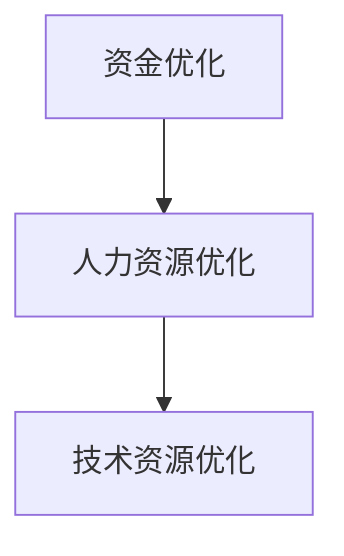

**资金优化示例：**

```python
# 资金优化
budget_allocation = {
    "personnel_cost": 30000,
    "operating_cost": 20000,
    "marketing_cost": 10000,
    "technical_development": 20000,
}

print(f"资金优化：{budget_allocation}")
```

**人力资源优化示例：**

```python
# 人力资源优化
team_roles = {
    "Alice": "Frontend Developer",
    "Bob": "Backend Developer",
    "Charlie": "Project Manager",
    "David": "Marketing Specialist",
}

print(f"人力资源优化：{team_roles}")
```

**技术资源优化示例：**

```python
# 技术资源优化
tech_stack = {
    "frontend": ["React", "Vue"],
    "backend": ["Node.js", "Django"],
    "database": ["MySQL", "MongoDB"],
    "framework": ["Spring", "Angular"],
    "new_tech": ["Kubernetes", "Serverless Architecture"],
}

print(f"技术资源优化：{tech_stack}")
```

**6.1.2 项目管理调整**

项目管理是确保项目顺利进行的关键。在转型过程中，程序员需要对项目管理进行以下调整：

1. **项目管理工具**：引入项目管理工具，如Jira、Trello等，以更好地跟踪项目进度和任务分配。
2. **项目进度监控**：建立定期项目进度汇报机制，确保项目按计划进行，及时发现和解决问题。
3. **风险管理**：建立风险管理机制，识别潜在风险，并制定相应的应对策略。

**Mermaid流程图：**

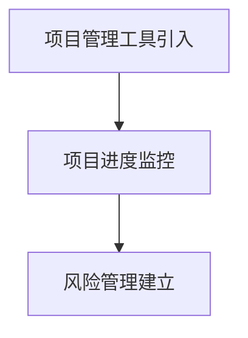

**项目管理工具引入示例：**

```python
# 项目管理工具引入
project_tools = {
    "tool": "Jira",
    "features": ["task management", "bug tracking", "sprint planning"],
}

print(f"项目管理工具引入：{project_tools}")
```

**项目进度监控示例：**

```python
# 项目进度监控
project_progress = {
    "phase1": {"status": "Completed", "deadline": "2023-04-15"},
    "phase2": {"status": "In Progress", "deadline": "2023-05-15"},
    "phase3": {"status": "Planned", "deadline": "2023-06-15"},
}

print(f"项目进度监控：{project_progress}")
```

**风险管理示例：**

```python
# 风险管理
risks = {
    "technical_risk": ["system failure", "dependency issues"],
    "market_risk": ["competitor actions", "market changes"],
    "management_risk": ["team conflict", "resource shortages"],
}

print(f"风险管理：{risks}")
```

**6.1.3 团队角色转换**

在兼职项目转型为全职创业的过程中，团队成员的角色也会发生相应变化。以下是团队角色转换的关键步骤：

1. **团队成员职责调整**：根据项目需求和管理调整，重新分配团队成员的职责，确保职责的明确和合理。
2. **团队成员晋升**：对表现出色的团队成员给予晋升机会，激励团队成员不断提升自身能力。
3. **团队文化建设**：建立积极向上的团队文化，增强团队成员的凝聚力和归属感。

**Mermaid流程图：**

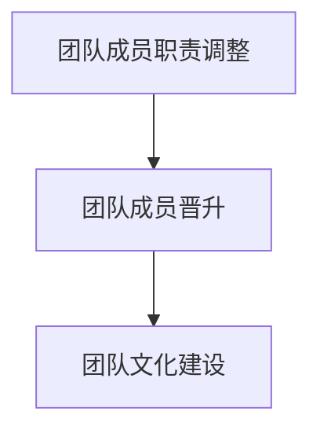

**团队成员职责调整示例：**

```python
# 团队成员职责调整
team_members = {
    "Alice": ["Frontend Developer", "UI/UX Design"],
    "Bob": ["Backend Developer", "API Design"],
    "Charlie": ["Project Manager", "Team Leadership"],
    "David": ["Marketing Specialist", "Customer Support"],
}

print(f"团队成员职责调整：{team_members}")
```

**团队成员晋升示例：**

```python
# 团队成员晋升
promotions = {
    "Alice": "Senior Frontend Developer",
    "Bob": "Senior Backend Developer",
    "Charlie": "Project Manager",
    "David": "Marketing Manager",
}

print(f"团队成员晋升：{promotions}")
```

**团队文化建设示例：**

```python
# 团队文化建设
team_culture = {
    "values": ["透明度", "合作", "创新", "客户至上"],
    "events": ["团队建设活动", "技术分享会", "年度庆典"],
}

print(f"团队文化建设：{team_culture}")
```

##### 6.2 风险防范与应对

在转型过程中，风险是不可避免的。有效的风险防范和应对策略能够帮助程序员降低风险，确保项目的顺利进行。以下是几种常见的风险防范和应对措施：

**6.2.1 转型过程中的风险识别**

在转型过程中，程序员需要识别潜在的风险，包括以下几个方面：

1. **技术风险**：如技术难题、技术更新等。
2. **市场风险**：如市场需求变化、竞争对手行动等。
3. **财务风险**：如资金短缺、成本超支等。
4. **管理风险**：如团队冲突、管理不善等。

**Mermaid流程图：**

```mermaid
graph TD
    A[技术风险识别] --> B[市场风险识别]
    B --> C[财务风险识别]
    C --> D[管理风险识别]
```

**技术风险识别示例：**

```python
# 技术风险识别
technical_risks = ["system scalability", "database performance", "dependency management"]

print(f"技术风险识别：{technical_risks}")
```

**市场风险识别示例：**

```python
# 市场风险识别
market_risks = ["competition", "market demand fluctuations", "regulatory changes"]

print(f"市场风险识别：{market_risks}")
```

**财务风险识别示例：**

```python
# 财务风险识别
financial_risks = ["cash flow issues", "overhead costs", "investment returns"]

print(f"财务风险识别：{financial_risks}")
```

**管理风险识别示例：**

```python
# 管理风险识别
management_risks = ["team conflicts", "lack of leadership", "resource allocation"]

print(f"管理风险识别：{management_risks}")
```

**6.2.2 风险评估与防范措施**

在识别风险后，程序员需要对风险进行评估，并制定相应的防范措施：

1. **风险评估**：对每个风险的可能性和影响进行评估，确定优先级。
2. **防范措施**：制定具体的防范措施，如技术优化、市场调研、成本控制等。

**Mermaid流程图：**

```mermaid
graph TD
    A[风险评估] --> B[防范措施]
```

**风险评估示例：**

```python
# 风险评估
risk_evaluation = {
    "technical_risk": {"probability": 0.3, "impact": 0.5},
    "market_risk": {"probability": 0.2, "impact": 0.6},
    "financial_risk": {"probability": 0.1, "impact": 0.7},
    "management_risk": {"probability": 0.4, "impact": 0.8},
}

print(f"风险评估：{risk_evaluation}")
```

**防范措施示例：**

```python
# 防范措施
risk.mitigation_measures = {
    "technical_risk": ["code optimization", "technology stack upgrade"],
    "market_risk": ["market research", "customer feedback"],
    "financial_risk": ["budget control", "multiple funding sources"],
    "management_risk": ["leadership training", "conflict resolution"],
}

print(f"防范措施：{risk.mitigation_measures}")
```

**6.2.3 应对策略与调整机制**

在风险发生时，程序员需要迅速采取应对策略，并进行必要的调整：

1. **应对策略**：根据风险类型和程度，制定相应的应对策略，如技术调整、市场调整、财务调整等。
2. **调整机制**：建立调整机制，确保在风险发生时能够迅速响应，并调整策略以减少损失。

**Mermaid流程图：**

```mermaid
graph TD
    A[应对策略] --> B[调整机制]
```

**应对策略示例：**

```python
# 应对策略
response_strategies = {
    "technical_risk": ["temporary system shutdown", "priority technical support"],
    "market_risk": ["promotional campaigns", "sales incentives"],
    "financial_risk": ["cost reduction", "funding applications"],
    "management_risk": ["staff restructuring", "management training"],
}

print(f"应对策略：{response_strategies}")
```

**调整机制示例：**

```python
# 调整机制
adjustment_mechanisms = {
    "response_time": 24,
    "evaluation_interval": 1,
    "adjustment_actions": ["strategic review", "resource reallocation"],
}

print(f"调整机制：{adjustment_mechanisms}")
```

通过以上转换策略和风险防范措施，程序员可以更好地将兼职项目转型为全职创业，确保项目的顺利进行和可持续发展。

#### 第7章：全职创业初期管理

在全职创业的初期阶段，管理团队、产品研发与迭代以及项目风险管理是三个关键方面。有效的团队管理能够提高工作效率，而持续的产品迭代则能保持市场竞争力。同时，项目风险管理能够帮助创业者应对不确定因素，确保企业稳定发展。以下是这些方面的详细探讨。

##### 7.1 团队管理与文化建设

**7.1.1 团队管理挑战**

在全职创业初期，团队管理面临诸多挑战，包括：

1. **人员流动**：初创企业往往面临人员不稳定的问题，特别是核心成员可能因各种原因离职。
2. **沟通障碍**：团队成员之间的沟通不畅可能导致误解和冲突，影响项目进展。
3. **资源限制**：初期资金和资源的限制可能影响团队的运作效率和项目的完成质量。

**Mermaid流程图：**

```mermaid
graph TD
    A[人员流动] --> B[沟通障碍]
    B --> C[资源限制]
```

**应对策略：**

1. **明确职责和目标**：为每个团队成员明确职责和目标，确保每个人都知道自己的任务和期望。
2. **建立沟通机制**：定期举行团队会议，使用项目管理工具如Slack、Trello等，确保信息流通。
3. **优化资源分配**：合理分配资源，确保项目在有限资源下能够顺利进行。

**7.1.2 文化建设的重要性**

企业文化是团队凝聚力的重要源泉，对员工的工作态度和行为具有深远影响。以下是文化建设的重要性和策略：

1. **核心价值观**：明确企业的核心价值观，如创新、诚信、团队合作等，并在日常工作中贯彻这些价值观。
2. **激励机制**：建立激励机制，如绩效奖金、股权激励等，激发员工的积极性和创造力。
3. **团队活动**：定期组织团队活动，如团建、技术分享会等，增强团队成员的归属感和团队凝聚力。

**Mermaid流程图：**

```mermaid
graph TD
    A[核心价值观] --> B[激励机制]
    B --> C[团队活动]
```

**文化建设策略示例：**

```python
# 文化建设策略
company_culture = {
    "core_values": ["Innovation", "Integrity", "Teamwork"],
    "incentive_programs": ["Performance Bonuses", "Stock Options"],
    "team_activities": ["Team Building Events", "Tech Share Sessions"],
}

print(f"文化建设策略：{company_culture}")
```

##### 7.2 产品研发与迭代

**7.2.1 产品研发策略**

在产品研发过程中，制定有效的策略能够确保产品的质量和市场竞争力。以下是几个关键策略：

1. **用户需求分析**：深入了解用户需求，确保产品功能设计能够满足用户需求。
2. **技术可行性分析**：评估技术的可行性和可持续性，选择最适合的技术方案。
3. **迭代开发**：采用敏捷开发方法，快速迭代，不断优化产品。

**Mermaid流程图：**

```mermaid
graph TD
    A[用户需求分析] --> B[技术可行性分析]
    B --> C[迭代开发]
```

**产品研发策略示例：**

```python
# 产品研发策略
product_development_strategy = {
    "user_research": ["surveys", "interviews", "user testing"],
    "technical_feasibility": ["technology assessment", "R&D investments"],
    "iterative_development": ["Agile Methodology", "Continuous Feedback"],
}

print(f"产品研发策略：{product_development_strategy}")
```

**7.2.2 产品迭代流程**

产品迭代是保持产品竞争力的关键。以下是产品迭代的几个关键步骤：

1. **需求收集**：收集用户反馈和市场动态，识别产品的改进点和创新点。
2. **需求分析**：对收集的需求进行优先级排序，明确迭代的目标和范围。
3. **设计实现**：设计并实现迭代版本，确保功能完善和用户体验。
4. **测试与发布**：进行严格的测试，确保产品质量和稳定性，然后进行发布。

**Mermaid流程图：**

```mermaid
graph TD
    A[需求收集] --> B[需求分析]
    B --> C[设计实现]
    C --> D[测试与发布]
```

**产品迭代流程示例：**

```python
# 产品迭代流程
iteration_process = {
    "feedback_collection": ["user feedback", "market analysis"],
    "requirement_analysis": ["prioritization", "goal definition"],
    "design_and_implementation": ["UX/UI design", "backend development"],
    "testing_and_release": ["QA testing", "stable release"],
}

print(f"产品迭代流程：{iteration_process}")
```

##### 7.3 项目风险管理

**7.3.1 风险识别与分类**

在项目进行过程中，识别和分类潜在风险是风险管理的重要一步。以下是常见风险的识别和分类：

1. **技术风险**：如系统漏洞、技术瓶颈等。
2. **市场风险**：如市场需求变化、竞争对手策略等。
3. **财务风险**：如资金不足、成本超支等。
4. **管理风险**：如团队冲突、项目管理不善等。

**Mermaid流程图：**

```mermaid
graph TD
    A[技术风险] --> B[市场风险]
    B --> C[财务风险]
    C --> D[管理风险]
```

**风险识别与分类示例：**

```python
# 风险识别与分类
risks = {
    "technical_risk": ["system vulnerabilities", "technical debt"],
    "market_risk": ["market demand changes", "competitive actions"],
    "financial_risk": ["funding shortage", "cost overruns"],
    "management_risk": ["team conflicts", "project delays"],
}

print(f"风险识别与分类：{risks}")
```

**7.3.2 风险评估与应对**

在识别风险后，进行风险评估并制定应对策略是关键。以下是几个关键步骤：

1. **风险评估**：对每个风险的可能性和影响进行评估，确定优先级。
2. **应对策略**：根据风险评估结果，制定具体的应对策略和措施。
3. **监控与调整**：定期监控风险，并根据实际情况进行调整。

**Mermaid流程图：**

```mermaid
graph TD
    A[风险评估] --> B[应对策略]
    B --> C[监控与调整]
```

**风险评估与应对策略示例：**

```python
# 风险评估与应对策略
risk_evaluation = {
    "technical_risk": {"probability": 0.3, "impact": 0.5, "mitigation": ["code reviews", "technical training"]},
    "market_risk": {"probability": 0.2, "impact": 0.6, "mitigation": ["market research", "product diversification"]},
    "financial_risk": {"probability": 0.1, "impact": 0.7, "mitigation": ["budget control", "funding diversification"]},
    "management_risk": {"probability": 0.4, "impact": 0.8, "mitigation": ["leadership training", "conflict resolution"]},
}

print(f"风险评估与应对策略：{risk_evaluation}")
```

**7.3.3 风险监控与调整机制**

建立有效的风险监控与调整机制是确保项目顺利进行的最后一步。以下是几个关键步骤：

1. **建立监控体系**：定期收集项目数据，识别潜在风险。
2. **实时反馈**：确保团队成员能够实时获取项目进展和风险信息，及时采取应对措施。
3. **动态调整**：根据实际情况，动态调整项目计划和策略，确保项目目标的实现。

**Mermaid流程图：**

```mermaid
graph TD
    A[建立监控体系] --> B[实时反馈]
    B --> C[动态调整]
```

**风险监控与调整机制示例：**

```python
# 风险监控与调整机制
risk_monitoring = {
    "monitoring_period": 30,
    "real_time_feedback": ["daily status reports", "team meetings"],
    "dynamic_adjustment": ["strategic reviews", "resource allocation"],
}

print(f"风险监控与调整机制：{risk_monitoring}")
```

通过以上团队管理、产品研发与迭代以及项目风险管理的策略和机制，程序员可以更好地应对全职创业初期的挑战，确保企业的稳定发展。

#### 第8章：全职创业成功案例与经验分享

在全职创业的道路上，许多程序员通过不懈努力和正确策略取得了成功。本章节将介绍几个成功的全职创业案例，并分享创业者们的经验与教训，为其他程序员提供宝贵的启示。

##### 8.1 成功案例分析

**案例1：某云计算服务公司**

**背景**：创始人是一位拥有丰富软件开发经验的程序员，他在业余时间开发了多个云计算工具，受到了市场的欢迎。

**成功因素**：

1. **技术优势**：创始人对云计算技术有深入的理解，开发出了一系列高性能、易用的云计算工具。
2. **市场定位**：公司定位于中小型企业，提供定制化的云计算解决方案，满足客户的特定需求。
3. **客户关系**：公司注重与客户的沟通，及时收集用户反馈，不断优化产品。

**案例启示**：

- **技术优势**：在创业初期，拥有独特的技术优势能够帮助公司在市场中脱颖而出。
- **市场定位**：准确的市场定位能够帮助公司找到目标客户群体，提高市场竞争力。
- **客户关系**：与客户建立良好的关系，能够提高客户满意度和忠诚度，为公司的长期发展奠定基础。

**案例2：某在线教育平台**

**背景**：创始人在教育领域有深厚的背景，他发现线上教育市场具有巨大潜力。

**成功因素**：

1. **教育内容**：创始人精心设计课程内容，结合实际案例，提高课程实用性。
2. **用户界面**：平台采用简洁、直观的用户界面，提高用户体验。
3. **营销策略**：公司通过社交媒体和内容营销，快速扩大用户基础。

**案例启示**：

- **教育内容**：优质的教育内容是吸引和留住用户的关键。
- **用户体验**：良好的用户体验能够提高用户满意度和粘性。
- **营销策略**：有效的营销策略能够迅速提高品牌知名度和用户数量。

##### 8.2 创业经验分享

**经验1：持续学习**

**分享人**：某软件开发公司创始人

**经历**：在创业过程中，创始人不断学习新技术，保持技术领先优势。

**心得**：

- **持续学习**：技术发展迅速，创业者需要不断学习新技术，保持竞争力。
- **实践应用**：学习新技术的目的在于将其应用到实际项目中，提高项目质量。

**经验2：团队建设**

**分享人**：某在线游戏公司创始人

**经历**：公司在初创阶段，创始人重视团队建设，通过良好的团队氛围提高工作效率。

**心得**：

- **团队氛围**：建立一个积极向上的团队氛围，能够提高团队成员的积极性和创造力。
- **分工协作**：明确团队分工，确保每位成员都能发挥自己的优势。

**经验3：客户至上**

**分享人**：某电子商务平台创始人

**经历**：创始人始终将客户需求放在首位，通过持续优化产品和服务，赢得客户的信任。

**心得**：

- **客户需求**：深入了解客户需求，提供个性化的解决方案。
- **客户服务**：提供优质的客户服务，解决客户问题，提升客户满意度。

通过以上成功案例和创业经验分享，我们可以看到，成功的全职创业并非偶然，而是基于对市场的深刻理解、持续的学习和努力。这些经验对于其他程序员具有重要的启示作用。

#### 附录A：创业资源汇总

在全职创业的过程中，程序员需要借助多种资源来支持企业的成长和发展。以下是一些关键的创业资源汇总，包括政策支持、创业平台、投资人资源和创业者社群。

**A.1 政策支持**

政府为了鼓励创新创业，提供了多种政策支持，包括：

- **创业补贴**：许多地方政府为初创企业提供了创业补贴，用于减轻创业初期的资金压力。
- **税收优惠**：创业者可以根据相关规定享受税收减免，降低运营成本。
- **人才政策**：政府提供了各种人才引进政策，吸引优秀人才加入创业团队。

**A.2 创业平台**

创业平台是创业者获取资源和信息的重要渠道，以下是一些常用的创业平台：

- **创业园区**：政府或私人企业设立的创业园区，提供办公空间、技术支持和创业培训等服务。
- **孵化器**：专门为初创企业提供孵化服务的机构，帮助创业者完成产品开发、市场推广等环节。
- **创业大赛**：各类创业大赛为创业者提供了展示项目和获得投资的机会。

**A.3 投资人资源**

投资人资源是创业者获取资金的重要途径，以下是一些常用的投资人资源：

- **风险投资机构**：专注于为初创企业提供资金的机构，通常在技术、市场等方面提供专业的建议。
- **天使投资人**：对初创企业进行早期投资的个人投资者，通常具有较强的行业背景。
- **众筹平台**：通过众筹平台，创业者可以直接向公众融资，获取启动资金。

**A.4 创业者社群**

创业者社群是创业者交流和学习的平台，以下是一些常用的创业者社群：

- **线上社群**：如LinkedIn、微信等社交媒体平台上的创业者群组，提供交流和学习的机会。
- **线下活动**：各类创业沙龙、研讨会、创业大赛等，为创业者提供了面对面的交流和合作机会。
- **创业协会**：各类创业者协会，为创业者提供政策咨询、资源对接等服务。

通过利用这些创业资源，程序员可以更好地应对全职创业过程中的各种挑战，提高企业的成功率。附录A的创业资源汇总为程序员提供了丰富的信息和支持，助力他们在创业道路上取得成功。

---

**作者：AI天才研究院/AI Genius Institute & 禅与计算机程序设计艺术 /Zen And The Art of Computer Programming**

感谢您的阅读，希望本文能为您的全职创业之路提供有益的启示和指导。在创业的道路上，不断学习、积累经验、勇于面对挑战，相信您一定能够实现自己的创业梦想。祝您创业成功！<|im_end|>

