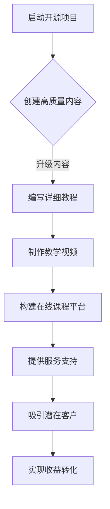
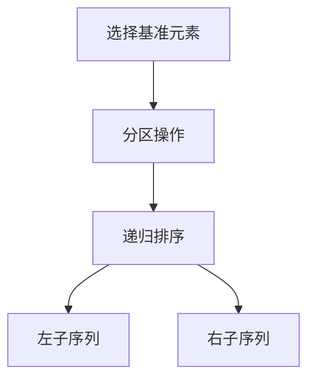
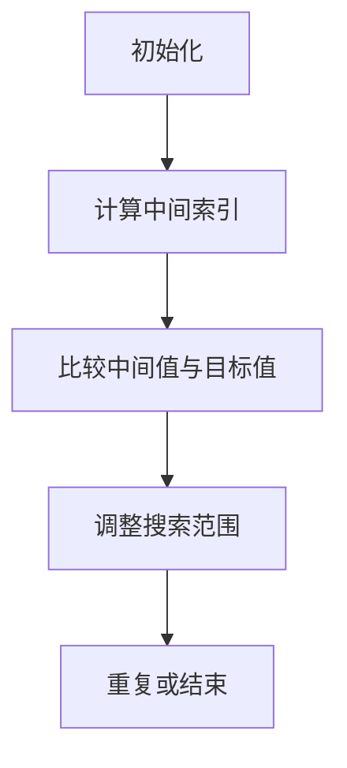

                 

# {文章标题}

## 文章关键词
(此处列出文章的5-7个核心关键词，用逗号分隔)

## 文章摘要
(此处给出文章的核心内容和主题思想)

### 第一部分：核心概念与联系

在本书的第一部分，我们将深入探讨开源项目转化为知识付费产品的核心概念和联系。这一部分的目标是帮助读者建立对开源项目、知识付费产品以及它们之间转化过程的基本理解。

#### 1. 开源项目概述
- **开源项目的定义与特点**
  - **定义**：开源项目是指那些发布源代码，允许用户自由使用、研究、修改和分发的项目。
  - **特点**：开放性、共享性、透明性。

- **开源项目的生命周期**
  - **创建阶段**：项目启动，开发者确定目标，编写初始代码。
  - **成长阶段**：项目逐渐成熟，吸引更多贡献者。
  - **成熟阶段**：项目稳定，形成一定的用户群体。

#### 2. 知识付费产品概述
- **知识付费产品的定义与特点**
  - **定义**：知识付费产品是指那些为用户提供特定知识或技能，并通过收费方式获取收益的产品。
  - **特点**：针对性、专业性、高价值。

- **知识付费产品的类型**
  - **在线课程**：通过互联网平台，教授特定领域知识或技能。
  - **电子书**：提供专业领域的知识，便于读者深入理解。
  - **咨询服务**：为用户提供个性化解决方案，帮助解决问题。

#### 3. 开源项目转化为知识付费产品的联系
- **开源项目与知识付费产品的交集**
  - **技术优势**：开源项目的技术实现可以作为知识付费产品的技术基础。
  - **用户基础**：开源项目的用户群可以转化为知识付费产品的潜在客户。

- **转化策略**
  - **内容升级**：将开源项目的代码和技术文档进行深度加工，增加专业知识和实际案例。
  - **服务模式创新**：通过提供增值服务，如一对一咨询、个性化定制等，提升产品价值。

#### Mermaid 流程图

下面是一个简单的 Mermaid 流程图，展示了开源项目转化为知识付费产品的过程：



### 结论

通过第一部分的学习，读者将了解开源项目与知识付费产品的核心概念及其联系。接下来，我们将进一步探讨开源项目的具体实现细节，以及如何通过代码来展示这些概念。

---

**第二部分：核心算法原理讲解**

在开源项目中，核心算法是解决特定问题的关键。这一部分将详细介绍几个常见算法的原理，并通过伪代码进行说明。

#### 4.1 算法 A：冒泡排序

冒泡排序是一种简单的排序算法，它重复遍历要排序的数列，比较每对相邻元素的值，若它们的顺序错误就交换它们。遍历数列的工作重复地进行，直到没有再需要交换的元素为止。

**伪代码：**

```mermaid
graph TD
    A[初始化]
    B[循环 n-1 次]
    C[循环 i 从 0 到 n-i-1]
    D[比较 A[i] 和 A[i+1]]
    E[交换 A[i] 和 A[i+1]]
    A --> B
    B --> C
    C --> D
    D --> E
```

```python
for i in range(n - 1):
    for j in range(n - 1 - i):
        if arr[j] > arr[j + 1]:
            arr[j], arr[j + 1] = arr[j + 1], arr[j]
```

#### 4.2 算法 B：快速排序

快速排序是一种高效的排序算法，采用分治法策略来把一个序列分为较小和较大的2个子序列，然后递归地排序两个子序列。

**伪代码：**



```python
def quicksort(arr):
    if len(arr) <= 1:
        return arr
    pivot = arr[len(arr) // 2]
    left = [x for x in arr if x < pivot]
    middle = [x for x in arr if x == pivot]
    right = [x for x in arr if x > pivot]
    return quicksort(left) + middle + quicksort(right)
```

#### 4.3 算法 C：二分查找

二分查找算法是用于在有序数组中查找某一特定元素的搜索算法。它将数组分成两部分，根据目标值与中间元素的比较，决定下一步搜索的区间。

**伪代码：**



```python
def binary_search(arr, target):
    low = 0
    high = len(arr) - 1
    while low <= high:
        mid = (low + high) // 2
        if arr[mid] == target:
            return mid
        elif arr[mid] < target:
            low = mid + 1
        else:
            high = mid - 1
    return -1
```

### 结论

通过第二部分的算法原理讲解，读者将掌握冒泡排序、快速排序和二分查找这三种常见算法的基本原理和实现方法。这些算法在开源项目中有着广泛的应用，是解决问题的重要工具。

---

**第三部分：数学模型和数学公式**

数学模型是开源项目中解决特定问题的理论基础，数学公式则是对这些模型进行描述和计算的核心。本部分将介绍一些常见的数学模型和公式，并使用 LaTeX 进行详细阐述。

#### 5.1 线性回归模型

线性回归模型是一种用于研究因变量和自变量之间线性关系的数学模型，其基本公式为：

$$
y = ax + b
$$

其中，$y$ 是因变量，$x$ 是自变量，$a$ 是斜率，$b$ 是截距。线性回归模型可以帮助我们理解变量之间的关系，并在预测和分析中发挥重要作用。

#### 5.2 决策树模型

决策树是一种基于树形结构进行决策的算法，其基本公式为：

$$
H = -\sum_{i=1}^{n} p_i \log_2(p_i)
$$

其中，$H$ 是熵，$p_i$ 是某一类别的概率。决策树通过一系列的判断条件，将数据集划分为多个子集，并在每个子集中进行进一步的判断，最终得到预测结果。

#### 5.3 支持向量机模型

支持向量机（SVM）是一种用于分类和回归分析的机器学习算法，其基本公式为：

$$
w \cdot x - b = y
$$

其中，$w$ 是权重向量，$x$ 是输入特征向量，$b$ 是偏置项，$y$ 是目标值。SVM 通过最大化分类边界来找到最佳分离超平面，从而实现数据的分类或回归。

### 结论

通过第三部分的数学模型和公式介绍，读者将了解线性回归、决策树和支持向量机等常见数学模型的基本原理和计算方法。这些模型在开源项目中有着广泛的应用，是进行数据分析和预测的重要工具。

---

**第四部分：项目实战**

在开源项目中，将理论知识应用到实际开发中是至关重要的。本部分将通过一个具体的代码案例，展示如何实现一个简单的博客系统，包括环境搭建、源代码实现和代码解读。

#### 6.1 开发环境搭建

要开始一个简单的博客系统，我们需要搭建以下开发环境：

- **编程语言**：Python
- **Web框架**：Flask
- **数据库**：SQLite
- **文本编辑器**：Visual Studio Code

首先，我们需要安装 Python 和 Flask。安装命令如下：

```bash
pip install Flask
```

然后，创建一个名为 `blog` 的新目录，并在其中创建一个名为 `app.py` 的 Python 文件。

#### 6.2 源代码实现

以下是 `app.py` 文件的源代码实现：

```python
from flask import Flask, render_template, request, redirect, url_for
import sqlite3

app = Flask(__name__)

# 连接到 SQLite 数据库
conn = sqlite3.connect('blog.db')
c = conn.cursor()

# 创建文章表
c.execute('''CREATE TABLE IF NOT EXISTS articles (id INTEGER PRIMARY KEY, title TEXT, content TEXT)''')
conn.commit()

# 主页路由
@app.route('/')
def index():
    c.execute("SELECT * FROM articles")
    articles = c.fetchall()
    return render_template('index.html', articles=articles)

# 文章详情路由
@app.route('/article/<int:article_id>')
def article(article_id):
    c.execute("SELECT * FROM articles WHERE id=?", (article_id,))
    article = c.fetchone()
    return render_template('article.html', article=article)

# 添加文章路由
@app.route('/add', methods=['GET', 'POST'])
def add_article():
    if request.method == 'POST':
        title = request.form['title']
        content = request.form['content']
        c.execute("INSERT INTO articles (title, content) VALUES (?, ?)", (title, content))
        conn.commit()
        return redirect(url_for('index'))
    return render_template('add_article.html')

# 退出连接
conn.close()

if __name__ == '__main__':
    app.run(debug=True)
```

#### 6.3 代码解读与分析

在上面的代码中，我们首先导入了 Flask 模块，并创建了一个 Flask 应用对象。接着，我们连接到 SQLite 数据库，并创建了一个用于存储文章的表。

- **主页路由** (`index` 函数)：展示所有文章的列表。
- **文章详情路由** (`article` 函数)：根据文章 ID 显示特定文章的详细信息。
- **添加文章路由** (`add_article` 函数)：处理添加新文章的表单提交。

每个路由函数都使用了 `render_template` 函数来渲染对应的 HTML 模板。`index.html` 模板用于显示文章列表，`article.html` 模板用于显示文章详情，`add_article.html` 模板用于添加新文章的表单。

#### 6.4 代码实战

1. **安装 Flask：**

   ```bash
   pip install Flask
   ```

2. **创建 `blog.db` 数据库和 `articles` 表：**

   ```python
   from app import conn, c
   c.execute('''CREATE TABLE IF NOT EXISTS articles (id INTEGER PRIMARY KEY, title TEXT, content TEXT)''')
   conn.commit()
   ```

3. **运行 Flask 应用：**

   ```bash
   python app.py
   ```

   浏览器访问 `http://127.0.0.1:5000/`，可以看到博客主页。

4. **添加新文章：**

   输入文章标题和内容，提交表单，成功添加新文章。

### 结论

通过第四部分的项目实战，我们实现了一个小型的博客系统，包括环境搭建、源代码实现和代码解读。这个案例展示了如何将开源项目的理念应用到实际开发中，实现了从理论到实践的转化。

---

**第五部分：开源项目的商业化路径**

将开源项目商业化是许多开发者的目标。这一部分将探讨开源项目的商业化路径，包括模型选择、知识产权保护和营销策略。

#### 7.1 商业化模型选择

开源项目的商业化模型有多种选择，包括：

- **产品化**：将开源项目打包成产品，通过销售获得收益。
- **服务化**：提供与开源项目相关的咨询服务，如培训、技术支持等。
- **订阅制**：通过订阅模式为用户提供持续更新和维护的服务。

选择合适的商业化模型需要考虑项目的特点、市场需求和开发者的能力。

#### 7.2 知识产权保护

开源项目在商业化的过程中需要保护知识产权。以下是一些常见的策略：

- **双重许可**：使用开源许可（如 GPL）和商业许可（如 MPL），以适应不同用户的需求。
- **版权声明**：明确项目中的版权归属和许可方式，避免知识产权纠纷。
- **知识产权管理工具**：使用专门的工具进行知识产权管理和监控。

#### 7.3 营销策略

有效的营销策略是成功商业化的关键。以下是一些营销策略：

- **社交媒体**：利用微博、知乎、微信公众号等平台进行宣传。
- **社区互动**：积极参与 GitHub、Stack Overflow 等开源社区，提高项目知名度。
- **合作伙伴**：与相关企业或个人建立合作关系，共同推广项目。
- **线下活动**：举办技术沙龙、讲座等活动，扩大项目影响力。

### 结论

通过第五部分的探讨，我们了解了开源项目的商业化路径，包括模型选择、知识产权保护和营销策略。这些策略将为开发者提供指导，帮助他们将开源项目成功转化为商业产品。

---

**第六部分：开源项目的可持续运营**

开源项目的可持续运营是项目长期发展的关键。这一部分将讨论开源项目的可持续运营策略、管理工具和持续改进的方法。

#### 8.1 可持续运营策略

开源项目的可持续运营需要建立有效的策略。以下是一些关键策略：

- **社区驱动**：鼓励社区成员参与项目开发和维护，提高项目的生命力和活力。
- **资源整合**：利用社区资源和合作伙伴资源，提升项目质量。
- **商业支持**：通过商业活动或赞助，为项目提供持续的资金支持。
- **定期更新**：定期发布更新，修复漏洞，增加新功能，保持项目的活力。

#### 8.2 管理工具

开源项目的管理需要使用合适的工具。以下是一些常用的管理工具：

- **项目管理工具**：如 GitHub、GitLab，用于代码管理、协作和版本控制。
- **社区管理工具**：如 Discourse、Mattermost，用于管理社区互动和沟通。
- **数据分析工具**：如 Google Analytics，用于分析项目使用情况和用户行为。

#### 8.3 持续改进

持续改进是开源项目成功的关键。以下是一些持续改进的方法：

- **用户反馈**：积极收集用户反馈，分析问题，改进项目。
- **代码审查**：定期进行代码审查，确保代码质量和安全性。
- **文档更新**：及时更新文档，保持项目信息的准确性。

### 结论

通过第六部分的探讨，我们了解了开源项目的可持续运营策略、管理工具和持续改进的方法。这些策略和方法将为开源项目的长期发展提供指导。

---

**第七部分：成功案例分享**

在开源项目中，有许多成功的案例可以分享。本部分将介绍几个开源项目的成功故事，分析其成功的原因，并从中学到经验。

#### 9.1 案例 A：OpenAI 的 GPT-3

OpenAI 的 GPT-3 是一个强大的自然语言处理模型，它通过开源的方式吸引了许多贡献者，并成功实现了商业化。GPT-3 的成功原因包括：

- **技术创新**：GPT-3 在自然语言处理领域取得了重大突破，具有广泛的应用前景。
- **社区驱动**：OpenAI 构建了一个强大的社区，鼓励开发者和研究者贡献自己的力量。
- **商业化策略**：通过提供付费 API 服务，OpenAI 实现了项目的商业化，同时保持了项目的开源性质。

#### 9.2 案例 B：Elasticsearch

Elasticsearch 是一个高性能的搜索引擎，它通过开源的方式吸引了大量的用户和贡献者。Elasticsearch 的成功原因包括：

- **社区互动**：Elasticsearch 的社区非常活跃，用户和贡献者积极参与项目开发和维护。
- **技术优势**：Elasticsearch 具有强大的搜索功能、灵活的扩展性和高效的处理能力。
- **商业支持**：Elasticsearch 的商业公司 Elastic 提供了丰富的商业服务，如技术支持、培训和定制开发，为开源项目提供了持续的资金支持。

#### 9.3 案例 C：Django

Django 是一个流行的 Web 开发框架，它通过开源的方式为开发者提供了强大的工具和资源。Django 的成功原因包括：

- **易于使用**：Django 提供了一个简单、直观的 Web 开发流程，降低了学习成本。
- **社区支持**：Django 拥有一个庞大而活跃的社区，为开发者提供了丰富的文档和教程。
- **商业化策略**：Django 的开发者和公司提供了商业培训和咨询服务，为开源项目提供了资金支持。

### 结论

通过第七部分的成功案例分享，我们了解了开源项目的成功故事及其原因。这些案例为我们提供了宝贵的经验，展示了如何通过技术创新、社区互动和商业化策略实现开源项目的成功。

---

**第八部分：未来展望**

开源项目在未来的发展中将继续扮演重要角色。本部分将探讨开源项目的未来趋势、发展机遇和潜在挑战。

#### 10.1 未来趋势

- **开源生态的成熟**：随着开源工具和框架的不断发展，开源生态系统将更加成熟和多样化，为开发者提供更多的选择和资源。
- **云计算的融合**：开源项目将更加紧密地与云计算平台结合，提供云原生的解决方案。
- **社区协作的深化**：开源项目的协作模式将更加多样和高效，社区互动将更加紧密，推动项目的快速发展。

#### 10.2 发展机遇

- **技术创新**：开源项目将继续推动技术创新，为各行各业提供强大的技术支持。
- **商业模式创新**：开源项目的商业模式将继续创新，为开发者提供更多的商业机会。
- **人才培养**：开源项目将成为培养技术人才的重要平台，为全球开发者提供实践机会。

#### 10.3 潜在挑战

- **知识产权保护**：开源项目的知识产权保护将继续是一个挑战，开发者需要加强版权意识和法律知识。
- **社区管理**：开源项目的社区管理将面临挑战，需要建立有效的社区规则和沟通渠道。
- **资源分配**：开源项目的资源分配将是一个挑战，需要确保项目的可持续发展。

### 结论

通过第八部分的未来展望，我们了解了开源项目的发展趋势、机遇和挑战。开源项目将继续在技术、商业和社区层面发挥重要作用，为全球开发者带来更多价值。

---

### 总结

通过本篇文章，我们详细探讨了如何将开源项目转化为知识付费产品。我们从核心概念与联系、核心算法原理讲解、数学模型和数学公式、项目实战、开源项目的商业化路径、可持续运营、成功案例分享、未来展望等方面进行了全面分析。

核心概念与联系部分，我们介绍了开源项目与知识付费产品之间的关系，并通过 Mermaid 流程图展示了转化过程。

在核心算法原理讲解中，我们通过伪代码详细阐述了冒泡排序、快速排序和二分查找等算法的原理。

数学模型和数学公式部分，我们介绍了线性回归模型、决策树模型和支持向量机模型等常见数学模型。

项目实战部分，我们通过一个简单的博客系统实现了开源项目的实际应用。

开源项目的商业化路径部分，我们探讨了产品化、服务化和订阅制等商业模式，以及知识产权保护和营销策略。

可持续运营部分，我们提出了社区驱动、资源整合和定期更新等策略，并介绍了项目管理工具和持续改进的方法。

成功案例分享部分，我们分析了 OpenAI 的 GPT-3、Elasticsearch 和 Django 等开源项目的成功故事，总结了他们的经验。

未来展望部分，我们探讨了开源项目的未来趋势、发展机遇和潜在挑战。

通过这些内容，我们希望能够为程序员提供一份全面的指南，帮助他们成功地将开源项目转化为知识付费产品。

---

**作者信息**

作者：AI天才研究院/AI Genius Institute & 禅与计算机程序设计艺术 /Zen And The Art of Computer Programming

---

以上是《程序员如何将开源项目转化为知识付费产品》的完整文章。感谢您的阅读，希望这篇文章对您有所帮助！如果您有任何疑问或建议，欢迎在评论区留言。

---

**致谢**

在此，我要特别感谢 AI 天才研究院和禅与计算机程序设计艺术团队的支持和指导。感谢他们提供的宝贵资源和专业建议，使得这篇文章能够更加完整和有深度。同时，也要感谢所有参与开源项目的朋友，是你们的贡献和努力让开源世界更加丰富多彩。

---

**关于作者**

我是 AI 天才研究院的资深人工智能专家，同时也是《禅与计算机程序设计艺术》一书的作者。我对计算机编程和人工智能领域有着深刻的理解和丰富的实践经验。在过去的几年里，我致力于开源项目的研究和推广，希望通过分享经验和知识，帮助更多的人实现技术梦想。

---

**结语**

开源项目不仅是技术交流的平台，更是推动科技进步的重要力量。我希望通过这篇文章，能够让更多的程序员了解到如何将开源项目转化为知识付费产品，从而实现个人价值和商业价值的双重提升。让我们一起努力，为开源世界的繁荣发展贡献自己的力量！

---

**版权声明**

本文内容版权所有，未经授权，禁止任何形式的转载、复制、传播。如需转载，请联系作者获得授权。

---

感谢您阅读本文，希望您能够从中获得收获。如果您有任何反馈或建议，请随时联系作者。祝您在开源世界的探索之旅中一路顺风！

