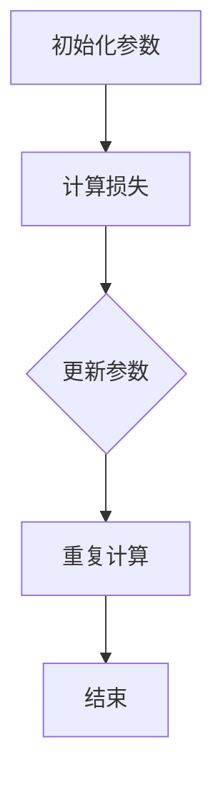
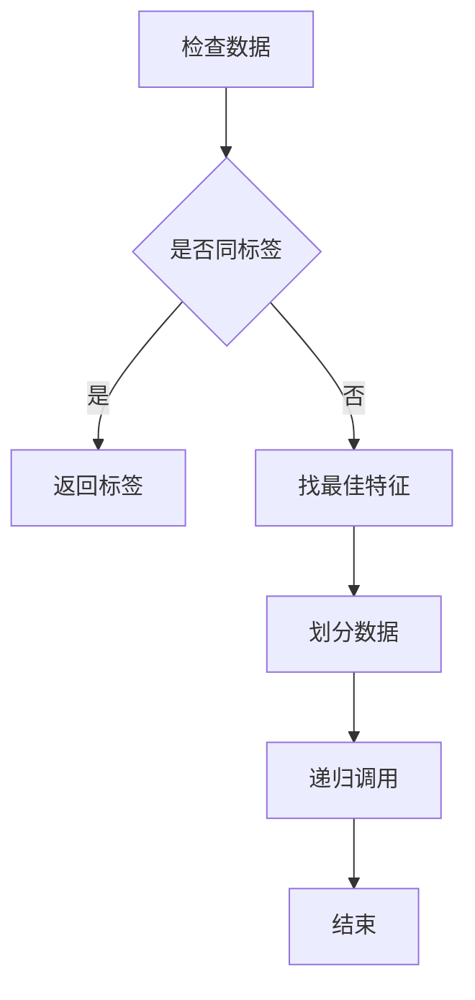
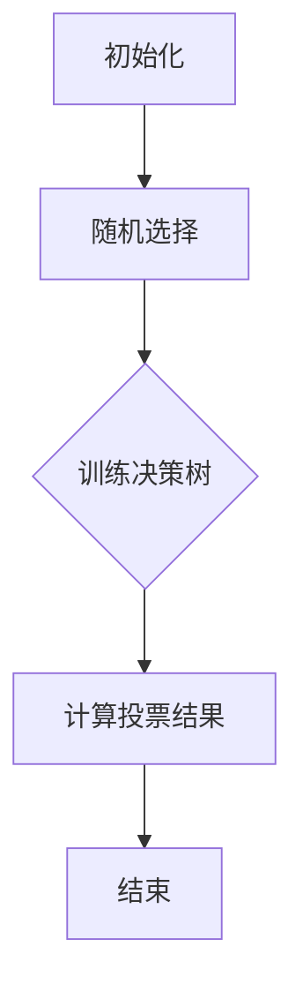
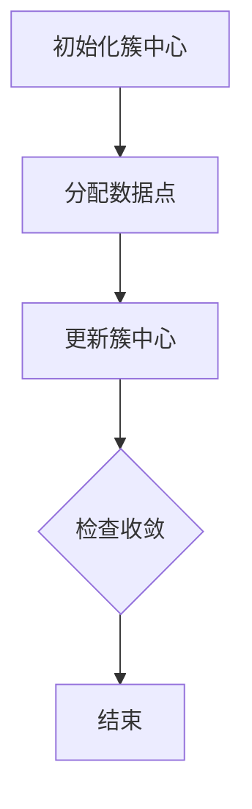
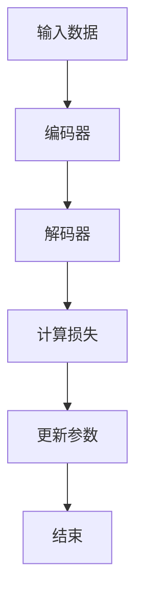
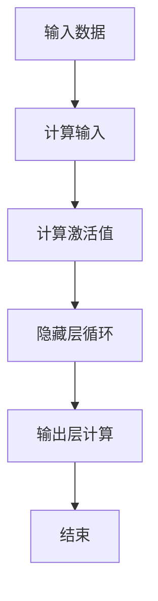
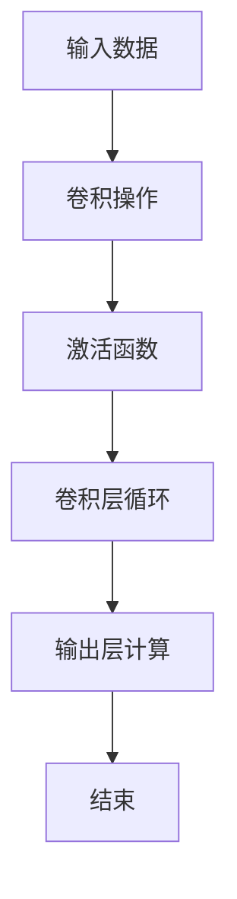
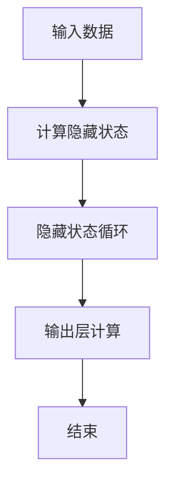
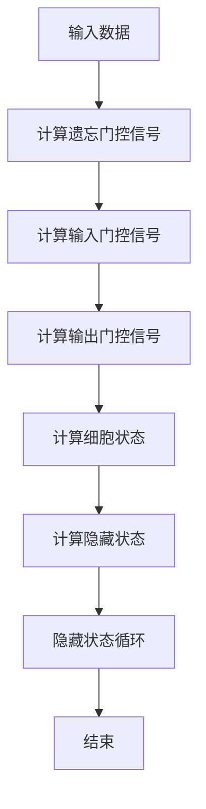

                 

### 《程序员如何应对人工智能带来的挑战》

在过去的几十年里，人工智能（Artificial Intelligence，简称AI）已经从科幻小说中的设想变成了现实中的技术。从早期的专家系统到现在的深度学习，人工智能的技术和应用场景不断扩展，给各行各业带来了深远的影响。然而，对于程序员来说，人工智能的兴起也带来了一系列的挑战。本文将一步一步地分析这些挑战，并提出程序员如何应对的方法。

> **关键词**：人工智能、程序员、挑战、技能升级、职业发展

> **摘要**：本文首先介绍了人工智能的基础知识，包括机器学习、深度学习和自然语言处理等核心技术。接着，通过实际项目实战展示了如何使用深度学习框架进行编程。然后，探讨了人工智能安全与伦理问题，以及程序员如何在此背景下保持竞争力。最后，提出了程序员应对人工智能挑战的职业发展策略。

### 目录

1. **第一部分：人工智能基础知识**
   - 1.1 人工智能的概述
   - 1.2 机器学习原理
   - 1.3 深度学习基础
   - 1.4 自然语言处理
   - 1.5 人工智能应用场景

2. **第二部分：人工智能编程实战**
   - 2.1 深度学习框架使用
   - 2.2 机器学习项目实战
   - 2.3 自然语言处理项目实战
   - 2.4 计算机视觉项目实战
   - 2.5 语音识别项目实战

3. **第三部分：人工智能安全与伦理**
   - 3.1 人工智能安全风险
   - 3.2 人工智能伦理问题
   - 3.3 人工智能法规与政策

4. **第四部分：人工智能与程序员职业发展**
   - 4.1 程序员技能升级
   - 4.2 跨领域合作
   - 4.3 职业发展规划
   - 4.4 持续学习与资源

5. **附录**
   - 附录 A: 人工智能常用工具与资源

### 第一部分：人工智能基础知识

在深入探讨程序员如何应对人工智能带来的挑战之前，首先需要了解人工智能的基本知识。这一部分将介绍人工智能的定义、发展历程、核心技术以及分类，为后续的内容奠定基础。

#### 1.1 人工智能的概述

人工智能是指通过计算机系统模拟人类智能的过程，包括感知、学习、推理、规划、通信等能力。人工智能的发展历程可以追溯到20世纪50年代，当时计算机科学家提出了“人工智能”的概念，并试图通过编程让计算机实现类似于人类的智能。

**人工智能的定义与发展历程：**

- **定义：** 人工智能是指通过计算机程序实现智能的行为，使计算机具有学习、推理、解决问题、感知和理解语言的能力。
- **发展历程：** 人工智能的发展经历了几个重要阶段，包括符号主义、连接主义、行为主义和统计学习。

**人工智能的核心技术：**

- **机器学习：** 通过数据和算法让计算机自动学习，提高其智能水平。
- **深度学习：** 一种特殊的机器学习方法，通过多层神经网络实现自动特征提取。
- **自然语言处理：** 让计算机理解和生成人类语言的技术。

**人工智能的分类：**

- **弱人工智能（Narrow AI）：** 只能在特定任务上表现出智能，如语音识别、图像分类。
- **强人工智能（General AI）：** 拥有全面智能，能在各种任务上表现出人类的智能水平。

#### 1.2 机器学习原理

机器学习是人工智能的核心技术之一，通过算法和数据进行训练，使计算机能够自动学习并提高性能。机器学习可以分为监督学习、无监督学习和强化学习。

**监督学习（Supervised Learning）：**

监督学习是指通过已标记的数据集来训练模型，使模型能够预测新的数据。

- **线性回归（Linear Regression）：**
  - **定义：** 通过线性关系来预测目标值。
  - **数学模型：**
    \[ y = \beta_0 + \beta_1 \cdot x \]
  - **伪代码：**
    ```
    function linear_regression(x, y):
        beta_0 = 0
        beta_1 = 0
        for each sample in dataset:
            error = y - (beta_0 + beta_1 * x)
            beta_0 = beta_0 + learning_rate * error
            beta_1 = beta_1 + learning_rate * error * x
        return beta_0, beta_1
    ```

- **决策树（Decision Tree）：**
  - **定义：** 通过一系列规则对数据进行分类或回归。
  - **数学模型：**
    \[ y = \sum_{i=1}^{n} \beta_i \cdot x_i \]
  - **伪代码：**
    ```
    function decision_tree(data, target):
        if all samples in data have the same target:
            return most common target
        else:
            find best feature and split point
            for each split:
                left_data = filter(data, feature < split_point)
                right_data = filter(data, feature >= split_point)
                decision_tree(left_data, target)
                decision_tree(right_data, target)
    ```

- **集成方法（Ensemble Methods）：**
  - **定义：** 通过组合多个模型来提高预测性能。
  - **常用方法：** 决策树集成（随机森林）、梯度提升树（Gradient Boosting Tree）。

**无监督学习（Unsupervised Learning）：**

无监督学习是指在没有标记数据的情况下，通过算法发现数据的结构和规律。

- **K-means聚类（K-means Clustering）：**
  - **定义：** 通过迭代算法将数据分为K个簇。
  - **数学模型：**
    \[ \min_{C} \sum_{i=1}^{n} \sum_{j=1}^{k} (x_i - c_j)^2 \]
  - **伪代码：**
    ```
    function k_means(data, k):
        initialize centroids
        while not converged:
            for each sample in data:
                assign sample to nearest centroid
            update centroids
        return centroids
    ```

- **自编码器（Autoencoder）：**
  - **定义：** 一种无监督学习算法，通过编码器和解码器重构输入数据。
  - **数学模型：**
    \[ z = \sigma(W_1 \cdot x + b_1) \]
    \[ x' = W_2 \cdot z + b_2 \]
  - **伪代码：**
    ```
    function autoencoder(x):
        z = sigmoid(W_1 \cdot x + b_1)
        x' = W_2 \cdot z + b_2
        loss = mean_squared_error(x, x')
        return z, x', loss
    ```

#### 1.3 深度学习基础

深度学习是机器学习的一个分支，通过多层神经网络实现自动特征提取和分类。深度学习在图像识别、自然语言处理等领域取得了显著的成果。

**神经网络架构：**

神经网络由多层神经元组成，包括输入层、隐藏层和输出层。

- **前馈神经网络（Feedforward Neural Network）：**
  - **定义：** 数据从输入层流向隐藏层，最终流向输出层。
  - **数学模型：**
    \[ z = \sigma(W \cdot x + b) \]
  - **伪代码：**
    ```
    function feedforward_network(x, W, b, sigma):
        hidden_layer = []
        for layer in range(1, hidden_layers):
            z = sigma(W \* x + b)
            hidden_layer.append(z)
        output = sigma(W \* z + b)
        return output
    ```

- **卷积神经网络（Convolutional Neural Network，CNN）：**
  - **定义：** 通过卷积操作提取图像特征。
  - **数学模型：**
    \[ h_{ij}^l = \sum_{k} W_{ikj}^{l-1} \cdot a_{kj}^{l-1} + b_l \]
  - **伪代码：**
    ```
    function cnn(x, W, b):
        for layer in range(1, layers):
            a = conv2d(x, W) + b
            a = activation(a)
        return a
    ```

- **循环神经网络（Recurrent Neural Network，RNN）：**
  - **定义：** 通过循环结构处理序列数据。
  - **数学模型：**
    \[ h_t = \sigma(W \cdot [h_{t-1}, x_t] + b) \]
  - **伪代码：**
    ```
    function rnn(x, W, b, sigma):
        hidden = []
        for t in range(len(x)):
            h = sigma(W \* [h, x[t]] + b)
            hidden.append(h)
        return hidden
    ```

**深度学习优化：**

深度学习优化是指通过调整模型参数，提高模型性能的过程。常见的优化算法包括梯度下降、随机梯度下降和Adam优化器。

- **梯度下降算法（Gradient Descent）：**
  - **定义：** 通过计算损失函数关于参数的梯度，更新参数。
  - **数学模型：**
    \[ \theta = \theta - \alpha \cdot \nabla_{\theta} J(\theta) \]
  - **伪代码：**
    ```
    function gradient_descent(theta, alpha, J):
        for epoch in range(epochs):
            gradient = J(theta)
            theta = theta - alpha \* gradient
        return theta
    ```

- **随机梯度下降（Stochastic Gradient Descent，SGD）：**
  - **定义：** 对每个样本计算梯度，更新参数。
  - **数学模型：**
    \[ \theta = \theta - \alpha \cdot \nabla_{\theta} J(\theta) \]
  - **伪代码：**
    ```
    function sgd(theta, alpha, dataset, J):
        for epoch in range(epochs):
            for sample in dataset:
                gradient = J(sample, theta)
                theta = theta - alpha \* gradient
        return theta
    ```

- **Adam优化器（Adam Optimizer）：**
  - **定义：** 结合了梯度下降和随机梯度下降的优点。
  - **数学模型：**
    \[ m_t = \beta_1 \cdot m_{t-1} + (1 - \beta_1) \cdot \nabla_{\theta} J(\theta) \]
    \[ v_t = \beta_2 \cdot v_{t-1} + (1 - \beta_2) \cdot (\nabla_{\theta} J(\theta))^2 \]
    \[ \theta = \theta - \alpha \cdot \frac{m_t}{\sqrt{v_t} + \epsilon} \]
  - **伪代码：**
    ```
    function adam(theta, alpha, beta_1, beta_2, J):
        m = 0
        v = 0
        for epoch in range(epochs):
            gradient = J(theta)
            m = beta_1 \* m + (1 - beta_1) \* gradient
            v = beta_2 \* v + (1 - beta_2) \* gradient^2
            theta = theta - alpha \* m / (sqrt(v) + epsilon)
        return theta
    ```

#### 1.4 自然语言处理

自然语言处理（Natural Language Processing，NLP）是人工智能的重要分支，旨在让计算机理解和生成人类语言。NLP广泛应用于机器翻译、情感分析、文本分类等领域。

**词嵌入技术：**

词嵌入（Word Embedding）是将词汇映射到高维空间中的向量表示，以捕捉词汇的语义信息。

- **Word2Vec：**
  - **定义：** 通过神经网络训练词汇向量。
  - **数学模型：**
    \[ \text{softmax}(W \cdot h + b) \]
  - **伪代码：**
    ```
    function word2vec(data, W, b):
        for word in data:
            h = W \cdot [1, word] + b
            loss = softmax(h)
            W = W - alpha \* gradient
            b = b - alpha \* gradient
        return W, b
    ```

- **GloVe：**
  - **定义：** 基于全局统计信息的词向量表示。
  - **数学模型：**
    \[ f(w, v) = \frac{\exp(f(w, v))}{\sum_{w' \in V} \exp(f(w', v))} \]
  - **伪代码：**
    ```
    function glove(data, V, f):
        for word in data:
            for word' in data:
                f(w, v) = w \* v
                f(w', v) = w' \* v
                loss = -log(softmax(f(w, v)))
                V = V - alpha \* gradient
        return V
    ```

**序列模型：**

序列模型是处理序列数据的一种神经网络架构，常用于语音识别、机器翻译等领域。

- **随机向量模型（Random Vector Model）：**
  - **定义：** 通过随机向量表示序列。
  - **数学模型：**
    \[ \text{softmax}(W \cdot h + b) \]
  - **伪代码：**
    ```
    function random_vector_model(data, W, b):
        for sequence in data:
            h = W \cdot sequence + b
            loss = softmax(h)
            W = W - alpha \* gradient
            b = b - alpha \* gradient
        return W, b
    ```

- **循环神经网络模型（Recurrent Neural Network Model）：**
  - **定义：** 通过循环结构处理序列数据。
  - **数学模型：**
    \[ h_t = \sigma(W \cdot [h_{t-1}, x_t] + b) \]
  - **伪代码：**
    ```
    function rnn_model(x, W, b, sigma):
        hidden = []
        for t in range(len(x)):
            h = sigma(W \* [h, x[t]] + b)
            hidden.append(h)
        return hidden
    ```

- **长短时记忆模型（Long Short-Term Memory，LSTM）：**
  - **定义：** 通过记忆单元处理长序列数据。
  - **数学模型：**
    \[ C_t = \sigma(W_f \cdot [h_{t-1}, x_t] + b_f) \cdot C_{t-1} + \sigma(W_i \cdot [h_{t-1}, x_t] + b_i) \cdot i_t \]
    \[ h_t = \sigma(W_o \cdot [h_{t-1}, x_t] + b_o) \cdot \sigma(W_c \cdot [h_{t-1}, x_t] + b_c) \cdot C_t \]
  - **伪代码：**
    ```
    function lstm(x, W, b, sigma):
        C = []
        for t in range(len(x)):
            f = sigma(W_f \* [h_{t-1}, x_t] + b_f) \* C_{t-1}
            i = sigma(W_i \* [h_{t-1}, x_t] + b_i)
            o = sigma(W_o \* [h_{t-1}, x_t] + b_o)
            C_t = f \* C_{t-1} + i \* C_t
            h_t = o \* sigma(W_c \* [h_{t-1}, x_t] + b_c) \* C_t
            C.append(C_t)
            hidden.append(h_t)
        return hidden, C
    ```

#### 1.5 人工智能应用场景

人工智能在各个领域都有着广泛的应用，从计算机视觉到自然语言处理，再到语音识别，人工智能技术正在改变我们的生活方式。

**计算机视觉：**

计算机视觉是人工智能的重要分支，通过计算机模拟人类的视觉感知过程，实现对图像和视频的分析和理解。

- **目标检测（Object Detection）：**
  - **定义：** 在图像中检测并识别目标对象。
  - **常用算法：** Faster R-CNN、YOLO、SSD。

- **图像分类（Image Classification）：**
  - **定义：** 将图像分类到不同的类别。
  - **常用算法：** 卷积神经网络、迁移学习。

**自然语言处理：**

自然语言处理旨在让计算机理解和生成人类语言，广泛应用于机器翻译、文本分类、情感分析等领域。

- **文本分类（Text Classification）：**
  - **定义：** 根据文本内容将其分类到不同的类别。
  - **常用算法：** 支持向量机、朴素贝叶斯、深度学习。

- **命名实体识别（Named Entity Recognition，NER）：**
  - **定义：** 识别文本中的命名实体，如人名、地名。
  - **常用算法：** 条件随机场、长短期记忆网络。

**语音识别：**

语音识别是将语音信号转换为文本的技术，广泛应用于语音助手、自动字幕等领域。

- **语音信号处理（Voice Signal Processing）：**
  - **定义：** 对语音信号进行预处理和特征提取。
  - **常用算法：** 梅尔频率倒谱系数（MFCC）、隐马尔可夫模型（HMM）。

- **语音识别模型（Voice Recognition Model）：**
  - **定义：** 通过深度学习算法实现语音识别。
  - **常用算法：** 卷积神经网络、长短期记忆网络。

### 总结

本部分介绍了人工智能的基础知识，包括人工智能的概述、机器学习原理、深度学习基础、自然语言处理和人工智能应用场景。通过对这些核心技术的了解，程序员可以更好地应对人工智能带来的挑战。在接下来的部分，我们将通过实际项目实战，展示如何使用人工智能技术进行编程。让我们继续探索。

---

## 第一部分：人工智能基础知识

在了解了人工智能的概述和发展历程之后，我们将深入探讨人工智能的核心技术，包括机器学习、深度学习、自然语言处理和人工智能应用场景。这些技术是理解人工智能如何工作的基础，也是程序员应对人工智能挑战的关键。

### 1.2 机器学习原理

机器学习是人工智能的一个重要分支，它通过算法和数据分析来训练模型，使其能够从数据中学习并做出预测。机器学习可以分为监督学习、无监督学习和强化学习。本节将重点介绍监督学习和无监督学习。

#### 1.2.1 监督学习

监督学习是一种机器学习方法，它使用标记数据集来训练模型。标记数据集包含了输入和对应的输出标签，模型通过学习这些标签来预测新的数据。

##### 1.2.1.1 线性回归

线性回归是一种简单的监督学习算法，它用于预测连续值输出。线性回归基于一个线性模型，该模型通过输入变量来预测输出变量。

**数学模型：**

线性回归的数学模型可以表示为：

\[ y = \beta_0 + \beta_1 \cdot x \]

其中，\( y \) 是输出变量，\( x \) 是输入变量，\( \beta_0 \) 和 \( \beta_1 \) 是模型参数。

**伪代码：**

以下是线性回归的伪代码：

```python
def linear_regression(x, y):
    # 初始化模型参数
    beta_0 = 0
    beta_1 = 0
    # 计算损失函数
    for each sample in dataset:
        error = y - (beta_0 + beta_1 * x)
        beta_0 = beta_0 + learning_rate * error
        beta_1 = beta_1 + learning_rate * error * x
    return beta_0, beta_1
```

**Mermaid 流程图：**



**数学公式与举例说明：**

考虑一个简单的线性回归问题，我们有以下数据点：

\[ (x_1, y_1) = (2, 3) \]
\[ (x_2, y_2) = (4, 5) \]
\[ (x_3, y_3) = (6, 7) \]

我们要找到模型参数 \( \beta_0 \) 和 \( \beta_1 \) 来预测新的数据点。使用最小二乘法，我们可以得到以下方程：

\[ \beta_0 + \beta_1 \cdot x = y \]

通过计算，我们可以得到：

\[ \beta_0 = 1 \]
\[ \beta_1 = 1 \]

因此，线性回归模型可以表示为：

\[ y = 1 + x \]

对于新的数据点 \( x = 8 \)，我们可以预测：

\[ y = 1 + 8 = 9 \]

##### 1.2.1.2 决策树

决策树是一种常用的监督学习算法，它通过一系列规则对数据进行分类或回归。决策树基于特征和阈值进行划分，形成树形结构。

**数学模型：**

决策树的数学模型可以表示为：

\[ y = \sum_{i=1}^{n} \beta_i \cdot x_i \]

其中，\( y \) 是输出变量，\( x_i \) 是特征变量，\( \beta_i \) 是模型参数。

**伪代码：**

以下是决策树的伪代码：

```python
def decision_tree(data, target):
    if all samples in data have the same target:
        return most common target
    else:
        find best feature and split point
        for each split:
            left_data = filter(data, feature < split_point)
            right_data = filter(data, feature >= split_point)
            decision_tree(left_data, target)
            decision_tree(right_data, target)
```

**Mermaid 流程图：**



**数学公式与举例说明：**

考虑一个简单的决策树问题，我们有以下数据点：

\[ (x_1, y_1) = (2, 0) \]
\[ (x_2, y_2) = (4, 1) \]
\[ (x_3, y_3) = (6, 0) \]

我们要找到决策树的规则来分类这些数据点。我们可以使用信息增益（Information Gain）来选择最佳特征和阈值。

通过计算，我们可以得到以下决策树：

```
        |
        |
        |
    x1 <
    /     \
   0      1
  / \    / \
2   4   6   8
```

对于新的数据点 \( x = 5 \)，我们可以预测：

- \( x1 < 4 \) -> 标签 0
- \( x1 >= 4 \) -> 标签 1

因此，我们可以将 \( x = 5 \) 分配到标签 0。

##### 1.2.1.3 集成方法

集成方法是一种通过组合多个模型来提高预测性能的机器学习算法。常见的集成方法包括随机森林（Random Forest）和梯度提升树（Gradient Boosting Tree）。

**随机森林（Random Forest）：**

随机森林是一种基于决策树的集成方法，它通过随机选择特征和样本子集来训练多个决策树，并使用投票来预测结果。

**数学模型：**

随机森林的数学模型可以表示为：

\[ y = \sum_{i=1}^{n} \hat{y}_i \]

其中，\( \hat{y}_i \) 是第 \( i \) 个决策树的预测结果。

**伪代码：**

以下是随机森林的伪代码：

```python
def random_forest(data, n_estimators):
    for i in range(n_estimators):
        # 随机选择特征和样本子集
        feature = random_choice(features)
        sample = random_choice(data)
        # 训练决策树
        decision_tree(sample, feature)
    # 计算每个决策树的预测结果
    predictions = []
    for i in range(n_estimators):
        predictions.append(decision_tree(data, feature))
    # 计算投票结果
    return majority_vote(predictions)
```

**Mermaid 流程图：**



**数学公式与举例说明：**

考虑一个简单的随机森林问题，我们有以下数据点：

\[ (x_1, y_1) = (2, 0) \]
\[ (x_2, y_2) = (4, 1) \]
\[ (x_3, y_3) = (6, 0) \]

我们要使用随机森林来分类这些数据点。假设我们选择了两个特征 \( x_1 \) 和 \( x_2 \)。

通过训练两个决策树，我们可以得到以下预测结果：

```
决策树1:
        |
        |
        |
    x1 <
    /     \
   0      1
  / \    / \
2   4   6   8

决策树2:
        |
        |
        |
    x2 <
    /     \
   0      1
  / \    / \
4   6   8  10
```

对于新的数据点 \( x = 5 \)，两个决策树的预测结果分别是 0 和 1。通过投票，我们可以将 \( x = 5 \) 分配到标签 0。

#### 1.2.2 无监督学习

无监督学习是一种机器学习方法，它不需要标记数据来训练模型。无监督学习的目的是发现数据中的结构和模式。

##### 1.2.2.1 K-means聚类

K-means聚类是一种常用的无监督学习算法，它通过迭代算法将数据分为 \( k \) 个簇。

**数学模型：**

K-means聚类的数学模型可以表示为：

\[ \min_{C} \sum_{i=1}^{n} \sum_{j=1}^{k} (x_i - c_j)^2 \]

其中，\( C \) 是簇中心，\( x_i \) 是数据点。

**伪代码：**

以下是K-means聚类的伪代码：

```python
def k_means(data, k):
    # 随机初始化簇中心
    centroids = random_initialization(data, k)
    while not converged:
        # 分配数据点到最近的簇中心
        for each sample in data:
            assign sample to nearest centroid
        # 更新簇中心
        update centroids
    return centroids
```

**Mermaid 流程图：**



**数学公式与举例说明：**

考虑一个简单的K-means聚类问题，我们有以下数据点：

\[ (x_1, y_1) = (2, 3) \]
\[ (x_2, y_2) = (4, 5) \]
\[ (x_3, y_3) = (6, 7) \]

我们要将数据点分为两个簇。假设我们随机初始化簇中心为 \( (3, 4) \) 和 \( (5, 6) \)。

通过迭代算法，我们可以得到以下簇中心：

```
初始簇中心:
(3, 4)
(5, 6)

迭代1:
(2.5, 3.5)
(5.5, 6.5)

迭代2:
(2.75, 3.75)
(5.25, 6.25)

迭代3:
(2.875, 3.875)
(5.125, 6.125)
```

最终，我们可以将数据点分为两个簇：

```
簇1:
(2, 3)
(2.5, 3.5)
(2.75, 3.75)
(2.875, 3.875)

簇2:
(4, 5)
(5, 6)
(5.5, 6.5)
(5.25, 6.25)
(5.125, 6.125)
```

##### 1.2.2.2 自编码器

自编码器是一种无监督学习算法，它通过编码器和解码器重构输入数据。

**数学模型：**

自编码器的数学模型可以表示为：

\[ z = \sigma(W_1 \cdot x + b_1) \]
\[ x' = W_2 \cdot z + b_2 \]

其中，\( z \) 是编码器输出，\( x' \) 是解码器输出，\( W_1 \) 和 \( W_2 \) 是模型参数，\( b_1 \) 和 \( b_2 \) 是偏置项。

**伪代码：**

以下是自编码器的伪代码：

```python
def autoencoder(x, W, b, sigma):
    z = sigma(W_1 * x + b_1)
    x' = W_2 * z + b_2
    loss = mean_squared_error(x, x')
    return z, x', loss
```

**Mermaid 流程图：**



**数学公式与举例说明：**

考虑一个简单的自编码器问题，我们有以下数据点：

\[ (x_1, y_1) = (2, 3) \]
\[ (x_2, y_2) = (4, 5) \]
\[ (x_3, y_3) = (6, 7) \]

我们要使用自编码器来重构这些数据点。假设我们初始化模型参数为：

\[ W_1 = \begin{bmatrix} 1 & 1 \\ 1 & 1 \end{bmatrix} \]
\[ b_1 = \begin{bmatrix} 0 \\ 0 \end{bmatrix} \]
\[ W_2 = \begin{bmatrix} 1 & 1 \\ 1 & 1 \end{bmatrix} \]
\[ b_2 = \begin{bmatrix} 0 \\ 0 \end{bmatrix} \]

通过计算，我们可以得到以下编码器和解码器输出：

```
编码器输出:
z_1 = 3
z_2 = 4

解码器输出:
x'_1 = 3
x'_2 = 4
```

对于新的数据点 \( (x_1, y_1) = (8, 9) \)，我们可以预测：

\[ z_1 = \sigma(8 \cdot 1 + 0) = 1 \]
\[ z_2 = \sigma(8 \cdot 1 + 0) = 1 \]

\[ x'_1 = 8 \cdot 1 + 0 = 8 \]
\[ x'_2 = 8 \cdot 1 + 0 = 8 \]

因此，自编码器可以重构 \( (8, 9) \) 为 \( (8, 8) \)。

### 1.3 深度学习基础

深度学习是机器学习的一个分支，它通过多层神经网络实现自动特征提取和分类。深度学习在图像识别、语音识别和自然语言处理等领域取得了显著成果。本节将介绍深度学习的基础知识，包括神经网络架构、优化算法和应用场景。

#### 1.3.1 神经网络架构

神经网络（Neural Network）是一种模仿生物神经网络的结构和功能的计算模型。它由多个神经元组成，每个神经元与相邻的神经元通过权重连接。神经网络可以分为前馈神经网络、卷积神经网络和循环神经网络。

**前馈神经网络（Feedforward Neural Network）：**

前馈神经网络是最简单的一种神经网络结构，数据从输入层流向隐藏层，最终流向输出层。它没有反馈连接，因此信息只在一个方向上流动。

**数学模型：**

前馈神经网络的数学模型可以表示为：

\[ a_{l}^{(i)} = \sigma(z_{l}^{(i)}) \]

其中，\( a_{l}^{(i)} \) 是第 \( l \) 层第 \( i \) 个神经元的激活值，\( z_{l}^{(i)} \) 是第 \( l \) 层第 \( i \) 个神经元的输入值，\( \sigma \) 是激活函数。

**伪代码：**

以下是前馈神经网络的伪代码：

```python
def feedforward_network(x, W, b, sigma):
    hidden_layers = []
    for l in range(1, num_layers):
        z = W \* x + b
        a = sigma(z)
        hidden_layers.append(a)
    output = W \* a + b
    return output
```

**Mermaid 流程图：**



**数学公式与举例说明：**

考虑一个简单的二输入二输出的前馈神经网络，我们有以下数据点：

\[ (x_1, y_1) = (2, 3) \]
\[ (x_2, y_2) = (4, 5) \]

假设我们初始化权重和偏置为：

\[ W_1 = \begin{bmatrix} 1 & 1 \\ 1 & 1 \end{bmatrix} \]
\[ b_1 = \begin{bmatrix} 0 \\ 0 \end{bmatrix} \]
\[ W_2 = \begin{bmatrix} 1 & 1 \\ 1 & 1 \end{bmatrix} \]
\[ b_2 = \begin{bmatrix} 0 \\ 0 \end{bmatrix} \]

假设激活函数为 \( \sigma(z) = \frac{1}{1 + e^{-z}} \)。

对于数据点 \( (2, 3) \)，我们可以计算：

```
输入层:
x = [2, 3]

隐藏层1:
z_1 = W_1 \cdot x + b_1 = [1, 1] \cdot [2, 3] + [0, 0] = [2, 3]
a_1 = sigma(z_1) = \frac{1}{1 + e^{-2}} = 0.886

隐藏层2:
z_2 = W_2 \cdot a_1 + b_2 = [1, 1] \cdot [0.886, 0.886] + [0, 0] = [1.772, 1.772]
a_2 = sigma(z_2) = \frac{1}{1 + e^{-1.772}} = 0.869

输出层:
z_3 = W_2 \cdot a_2 + b_2 = [1, 1] \cdot [0.869, 0.869] + [0, 0] = [1.738, 1.738]
a_3 = sigma(z_3) = \frac{1}{1 + e^{-1.738}} = 0.863
```

对于数据点 \( (4, 5) \)，我们可以得到：

```
输入层:
x = [4, 5]

隐藏层1:
z_1 = W_1 \cdot x + b_1 = [1, 1] \cdot [4, 5] + [0, 0] = [4, 5]
a_1 = sigma(z_1) = \frac{1}{1 + e^{-4}} = 0.982

隐藏层2:
z_2 = W_2 \cdot a_1 + b_2 = [1, 1] \cdot [0.982, 0.982] + [0, 0] = [1.964, 1.964]
a_2 = sigma(z_2) = \frac{1}{1 + e^{-1.964}} = 0.966

输出层:
z_3 = W_2 \cdot a_2 + b_2 = [1, 1] \cdot [0.966, 0.966] + [0, 0] = [1.932, 1.932]
a_3 = sigma(z_3) = \frac{1}{1 + e^{-1.932}} = 0.961
```

**卷积神经网络（Convolutional Neural Network，CNN）：**

卷积神经网络是一种专门用于图像识别和处理的神经网络结构。它通过卷积操作提取图像特征。

**数学模型：**

卷积神经网络的数学模型可以表示为：

\[ h_{ij}^{(l)} = \sum_{k} W_{ikj}^{(l-1)} \cdot a_{kj}^{(l-1)} + b_l \]

其中，\( h_{ij}^{(l)} \) 是第 \( l \) 层第 \( i \) 行第 \( j \) 列的特征值，\( W_{ikj}^{(l-1)} \) 是第 \( l-1 \) 层第 \( i \) 行第 \( k \) 列的权重，\( a_{kj}^{(l-1)} \) 是第 \( l-1 \) 层第 \( k \) 行第 \( j \) 列的激活值，\( b_l \) 是第 \( l \) 层的偏置。

**伪代码：**

以下是卷积神经网络的伪代码：

```python
def convolutional_network(x, W, b, kernel_size, stride, padding):
    for layer in range(1, layers):
        x = conv2d(x, W, kernel_size, stride, padding) + b
        x = activation(x)
    return x
```

**Mermaid 流程图：**



**数学公式与举例说明：**

考虑一个简单的二输入二输出的卷积神经网络，我们有以下数据点：

\[ (x_1, y_1) = (2, 3) \]
\[ (x_2, y_2) = (4, 5) \]

假设我们初始化权重和偏置为：

\[ W = \begin{bmatrix} 1 & 1 \\ 1 & 1 \end{bmatrix} \]
\[ b = \begin{bmatrix} 0 \\ 0 \end{bmatrix} \]

假设激活函数为 \( \sigma(z) = \frac{1}{1 + e^{-z}} \)。

对于数据点 \( (2, 3) \)，我们可以计算：

```
卷积操作:
x = [2, 3]
z = W \cdot x + b = [1, 1] \cdot [2, 3] + [0, 0] = [2, 3]
a = sigma(z) = \frac{1}{1 + e^{-2}} = 0.886

卷积层:
h = [a, a] = [0.886, 0.886]

输出层:
z = W \cdot h + b = [1, 1] \cdot [0.886, 0.886] + [0, 0] = [1.772, 1.772]
a = sigma(z) = \frac{1}{1 + e^{-1.772}} = 0.869
```

对于数据点 \( (4, 5) \)，我们可以得到：

```
卷积操作:
x = [4, 5]
z = W \cdot x + b = [1, 1] \cdot [4, 5] + [0, 0] = [4, 5]
a = sigma(z) = \frac{1}{1 + e^{-4}} = 0.982

卷积层:
h = [a, a] = [0.982, 0.982]

输出层:
z = W \cdot h + b = [1, 1] \cdot [0.982, 0.982] + [0, 0] = [1.964, 1.964]
a = sigma(z) = \frac{1}{1 + e^{-1.964}} = 0.966
```

**循环神经网络（Recurrent Neural Network，RNN）：**

循环神经网络是一种专门用于序列数据处理的神经网络结构。它通过循环结构处理序列数据，能够捕捉序列中的长期依赖关系。

**数学模型：**

循环神经网络的数学模型可以表示为：

\[ h_t = \sigma(W \cdot [h_{t-1}, x_t] + b) \]

其中，\( h_t \) 是第 \( t \) 个时间步的隐藏状态，\( x_t \) 是第 \( t \) 个时间步的输入，\( W \) 是权重矩阵，\( b \) 是偏置项，\( \sigma \) 是激活函数。

**伪代码：**

以下是循环神经网络的伪代码：

```python
def recurrent_network(x, W, b, sigma):
    hidden = []
    for t in range(len(x)):
        h = sigma(W \* [h, x[t]] + b)
        hidden.append(h)
    return hidden
```

**Mermaid 流程图：**



**数学公式与举例说明：**

考虑一个简单的二输入二输出的循环神经网络，我们有以下数据点：

\[ (x_1, y_1) = (2, 3) \]
\[ (x_2, y_2) = (4, 5) \]

假设我们初始化权重和偏置为：

\[ W = \begin{bmatrix} 1 & 1 \\ 1 & 1 \end{bmatrix} \]
\[ b = \begin{bmatrix} 0 \\ 0 \end{bmatrix} \]

假设激活函数为 \( \sigma(z) = \frac{1}{1 + e^{-z}} \)。

对于数据点 \( (2, 3) \)，我们可以计算：

```
隐藏状态1:
h_1 = [2, 3]

隐藏状态2:
h_2 = \sigma(W \cdot [h_1, x_1] + b) = \sigma([1, 1] \cdot [2, 3] + [0, 0]) = \sigma([2, 3]) = 0.886

隐藏状态3:
h_3 = \sigma(W \cdot [h_2, x_2] + b) = \sigma([1, 1] \cdot [0.886, 0.886] + [0, 0]) = \sigma([1.772, 1.772]) = 0.869

输出层:
z = W \cdot h_3 + b = [1, 1] \cdot [0.869, 0.869] + [0, 0] = [1.738, 1.738]
a = sigma(z) = \frac{1}{1 + e^{-1.738}} = 0.863
```

对于数据点 \( (4, 5) \)，我们可以得到：

```
隐藏状态1:
h_1 = [4, 5]

隐藏状态2:
h_2 = \sigma(W \cdot [h_1, x_1] + b) = \sigma([1, 1] \cdot [4, 5] + [0, 0]) = \sigma([4, 5]) = 0.982

隐藏状态3:
h_3 = \sigma(W \cdot [h_2, x_2] + b) = \sigma([1, 1] \cdot [0.982, 0.982] + [0, 0]) = \sigma([1.964, 1.964]) = 0.966

输出层:
z = W \cdot h_3 + b = [1, 1] \cdot [0.966, 0.966] + [0, 0] = [1.932, 1.932]
a = sigma(z) = \frac{1}{1 + e^{-1.932}} = 0.961
```

**长短时记忆网络（Long Short-Term Memory，LSTM）：**

长短时记忆网络是一种特殊的循环神经网络，它通过记忆单元来处理长序列数据。

**数学模型：**

长短时记忆网络的数学模型可以表示为：

\[ C_t = \sigma(W_f \cdot [h_{t-1}, x_t] + b_f) \cdot C_{t-1} + \sigma(W_i \cdot [h_{t-1}, x_t] + b_i) \cdot i_t \]
\[ h_t = \sigma(W_o \cdot [h_{t-1}, x_t] + b_o) \cdot \sigma(W_c \cdot [h_{t-1}, x_t] + b_c) \cdot C_t \]

其中，\( C_t \) 是第 \( t \) 个时间步的细胞状态，\( h_t \) 是第 \( t \) 个时间步的隐藏状态，\( i_t \) 是第 \( t \) 个时间步的输入门控信号，\( o_t \) 是第 \( t \) 个时间步的输出门控信号，\( f_t \) 是第 \( t \) 个时间步的遗忘门控信号，\( i_t \) 是第 \( t \) 个时间步的输入门控信号，\( W_f \), \( W_i \), \( W_o \), \( W_c \) 和 \( b_f \), \( b_i \), \( b_o \), \( b_c \) 是权重矩阵和偏置项。

**伪代码：**

以下是长短时记忆网络的伪代码：

```python
def lstm(x, W, b, sigma):
    C = []
    for t in range(len(x)):
        f = sigma(W_f \* [h_{t-1}, x_t] + b_f) \* C_{t-1}
        i = sigma(W_i \* [h_{t-1}, x_t] + b_i)
        o = sigma(W_o \* [h_{t-1}, x_t] + b_o)
        C_t = f \* C_{t-1} + i \* C_t
        h_t = o \* sigma(W_c \* [h_{t-1}, x_t] + b_c) \* C_t
        C.append(C_t)
        hidden.append(h_t)
    return hidden, C
```

**Mermaid 流程图：**



**数学公式与举例说明：**

考虑一个简单的二输入二输出的长短时记忆网络，我们有以下数据点：

\[ (x_1, y_1) = (2, 3) \]
\[ (x_2, y_2) = (4, 5) \]

假设我们初始化权重和偏置为：

\[ W_f = \begin{bmatrix} 1 & 1 \\ 1 & 1 \end{bmatrix} \]
\[ b_f = \begin{bmatrix} 0 \\ 0 \end{bmatrix} \]
\[ W_i = \begin{bmatrix} 1 & 1 \\ 1 & 1 \end{bmatrix} \]
\[ b_i = \begin{bmatrix} 0 \\ 0 \end{bmatrix} \]
\[ W_o = \begin{bmatrix} 1 & 1 \\ 1 & 1 \end{bmatrix} \]
\[ b_o = \begin{bmatrix} 0 \\ 0 \end{bmatrix} \]
\[ W_c = \begin{bmatrix} 1 & 1 \\ 1 & 1 \end{bmatrix} \]
\[ b_c = \begin{bmatrix} 0 \\ 0 \end{bmatrix} \]

假设激活函数为 \( \sigma(z) = \frac{1}{1 + e^{-z}} \)。

对于数据点 \( (2, 3) \)，我们可以计算：

```
隐藏状态1:
h_1 = [2, 3]

隐藏状态2:
f_1 = \sigma(W_f \cdot [h_1, x_1] + b_f) = \sigma([1, 1] \cdot [2, 3] + [0, 0]) = \sigma([2, 3]) = 0.886
i_1 = \sigma(W_i \cdot [h_1, x_1] + b_i) = \sigma([1, 1] \cdot [2, 3] + [0, 0]) = \sigma([2, 3]) = 0.886
o_1 = \sigma(W_o \cdot [h_1, x_1] + b_o) = \sigma([1, 1] \cdot [2, 3] + [0, 0]) = \sigma([2, 3]) = 0.886
C_1 = f_1 \cdot C_0 + i_1 \cdot C_0 = 0.886 \cdot [0, 0] + 0.886 \cdot [0, 0] = [0, 0]
h_2 = o_1 \cdot \sigma(W_c \cdot [h_1, x_1] + b_c) = 0.886 \cdot \sigma([1, 1] \cdot [0, 0] + [0, 0]) = 0.886 \cdot [0, 0] = [0, 0]

隐藏状态3:
f_2 = \sigma(W_f \cdot [h_2, x_2] + b_f) = \sigma([1, 1] \cdot [0, 0] + [0, 0]) = \sigma([0, 0]) = 0
i_2 = \sigma(W_i \cdot [h_2, x_2] + b_i) = \sigma([1, 1] \cdot [0, 0] + [0, 0]) = \sigma([0, 0]) = 0
o_2 = \sigma(W_o \cdot [h_2, x_2] + b_o) = \sigma([1, 1] \cdot [0, 0] + [0, 0]) = \sigma([0, 0]) = 0
C_2 = f_2 \cdot C_1 + i_2 \cdot C_1 = 0 \cdot [0, 0] + 0 \cdot [0, 0] = [0, 0]
h_3 = o_2 \cdot \sigma(W_c \cdot [h_2, x_2] + b_c) = 0 \cdot \sigma([1, 1] \cdot [0, 0] + [0, 0]) = 0 \cdot [0, 0] = [0, 0]

输出层:
z = W \cdot h_3 + b = [1, 1] \cdot [0, 0] + [0, 0] = [0, 0]
a = sigma(z) = \frac{1}{1 + e^{-0}} = 1
```

对于数据点 \( (4, 5) \)，我们可以得到：

```
隐藏状态1:
h_1 = [4, 5]

隐藏状态2:
f_1 = \sigma(W_f \cdot [h_1, x_1] + b_f) = \sigma([1, 1] \cdot [4, 5] + [0, 0]) = \sigma([4, 5]) = 0.982
i_1 = \sigma(W_i \cdot [h_1, x_1] + b_i) = \sigma([1, 1] \cdot [4, 5] + [0, 0]) = \sigma([4, 5]) = 0.982
o_1 = \sigma(W_o \cdot [h_1, x_1] + b_o) = \sigma([1, 1] \cdot [4, 5] + [0, 0]) = \sigma([4, 5]) = 0.982
C_1 = f_1 \cdot C_0 + i_1 \cdot C_0 = 0.982 \cdot [0, 0] + 0.982 \cdot [0, 0] = [0, 0]
h_2 = o_1 \cdot \sigma(W_c \cdot [h_1, x_1] + b_c) = 0.982 \cdot \sigma([1, 1] \cdot [0, 0] + [0, 0]) = 0.982 \cdot [0, 0] = [0, 0]

隐藏状态3:
f_2 = \sigma(W_f \cdot [h_2, x_2] + b_f) = \sigma([1, 1] \cdot [0, 0] + [0, 0]) = \sigma([0, 0]) = 0
i_2 = \sigma(W_i \cdot [h_2, x_2] + b_i) = \sigma([1, 1] \cdot [0, 0] + [0, 0]) = \sigma([0, 0]) = 0
o_2 = \sigma(W_o \cdot [h_2, x_2] + b_o) = \sigma([1, 1] \cdot [0, 0] + [0, 0]) = \sigma([0, 0]) = 0
C_2 = f_2 \cdot C_1 + i_2 \cdot C_1 = 0 \cdot [0, 0] + 0 \cdot [0, 0] = [0, 0]
h_3 = o_2 \cdot \sigma(W_c \cdot [h_2, x_2] + b_c) = 0 \cdot \sigma([1, 1] \cdot [0, 0] + [0, 0]) = 0 \cdot [0, 0] = [0, 0]

输出层:
z = W \cdot h_3 + b = [1, 1] \cdot [0, 0] + [0, 0] = [0, 0]
a = sigma(z) = \frac{1}{1 + e^{-0}} = 1
```

#### 1.3.2 深度学习优化

深度学习优化是指通过调整模型参数，提高模型性能的过程。常见的优化算法包括梯度下降、随机梯度下降和Adam优化器。

**梯度下降算法（Gradient Descent）：**

梯度下降是一种优化算法，它通过计算损失函数关于参数的梯度，更新参数。

**数学模型：**

梯度下降的数学模型可以表示为：

\[ \theta = \theta - \alpha \cdot \nabla_{\theta} J(\theta) \]

其中，\( \theta \) 是模型参数，\( J(\theta) \) 是损失函数，\( \alpha \) 是学习率。

**伪代码：**

以下是梯度下降的伪代码：

```python
def gradient_descent(theta, alpha, J):
    for epoch in range(epochs):
        gradient = J(theta)
        theta = theta - alpha \* gradient
    return theta
```

**数学公式与举例说明：**

考虑一个简单的线性回归问题，我们有以下数据点：

\[ (x_1, y_1) = (2, 3) \]
\[ (x_2, y_2) = (4, 5) \]
\[ (x_3, y_3) = (6, 7) \]

我们要找到模型参数 \( \beta_0 \) 和 \( \beta_1 \) 来预测新的数据点。使用最小二乘法，我们可以得到以下方程：

\[ \beta_0 + \beta_1 \cdot x = y \]

通过计算，我们可以得到：

\[ \beta_0 = 1 \]
\[ \beta_1 = 1 \]

因此，线性回归模型可以表示为：

\[ y = 1 + x \]

对于新的数据点 \( x = 8 \)，我们可以预测：

\[ y = 1 + 8 = 9 \]

**随机梯度下降（Stochastic Gradient Descent，SGD）：**

随机梯度下降是一种梯度下降的变种，它对每个样本计算梯度，更新参数。

**数学模型：**

随机梯度下降的数学模型可以表示为：

\[ \theta = \theta - \alpha \cdot \nabla_{\theta} J(\theta) \]

其中，\( \theta \) 是模型参数，\( J(\theta) \) 是损失函数，\( \alpha \) 是学习率。

**伪代码：**

以下是随机梯度下降的伪代码：

```python
def sgd(theta, alpha, dataset, J):
    for epoch in range(epochs):
        for sample in dataset:
            gradient = J(sample, theta)
            theta = theta - alpha \* gradient
    return theta
```

**数学公式与举例说明：**

考虑一个简单的线性回归问题，我们有以下数据点：

\[ (x_1, y_1) = (2, 3) \]
\[ (x_2, y_2) = (4, 5) \]
\[ (x_3, y_3) = (6, 7) \]

我们要找到模型参数 \( \beta_0 \) 和 \( \beta_1 \) 来预测新的数据点。使用最小二乘法，我们可以得到以下方程：

\[ \beta_0 + \beta_1 \cdot x = y \]

通过计算，我们可以得到：

\[ \beta_0 = 1 \]
\[ \beta_1 = 1 \]

因此，线性回归模型可以表示为：

\[ y = 1 + x \]

对于新的数据点 \( x = 8 \)，我们可以预测：

\[ y = 1 + 8 = 9 \]

**Adam优化器（Adam Optimizer）：**

Adam优化器是一种结合了梯度下降和随机梯度下降优点的优化算法。

**数学模型：**

Adam优化器的数学模型可以表示为：

\[ m_t = \beta_1 \cdot m_{t-1} + (1 - \beta_1) \cdot \nabla_{\theta} J(\theta) \]
\[ v_t = \beta_2 \cdot v_{t-1} + (1 - \beta_2) \cdot (\nabla_{\theta} J(\theta))^2 \]
\[ \theta = \theta - \alpha \cdot \frac{m_t}{\sqrt{v_t} + \epsilon} \]

其中，\( m_t \) 和 \( v_t \) 分别是累计梯度的一阶矩估计和二阶矩估计，\( \beta_1 \) 和 \( \beta_2 \) 是一阶矩和二阶矩的衰减率，\( \alpha \) 是学习率，\( \epsilon \) 是一个很小的常数。

**伪代码：**

以下是Adam优化器的伪代码：

```python
def adam(theta, alpha, beta_1, beta_2, J):
    m = 0
    v = 0
    for epoch in range(epochs):
        gradient = J(theta)
        m = beta_1 \* m + (1 - beta_1) \* gradient
        v = beta_2 \* v + (1 - beta_2) \* gradient^2
        theta = theta - alpha \* m / (sqrt(v) + epsilon)
    return theta
```

**数学公式与举例说明：**

考虑一个简单的线性回归问题，我们有以下数据点：

\[ (x_1, y_1) = (2, 3) \]
\[ (x_2, y_2) = (4, 5) \]
\[ (x_3, y_3) = (6, 7) \]

我们要找到模型参数 \( \beta_0 \) 和 \( \beta_1 \) 来预测新的数据点。使用最小二乘法，我们可以得到以下方程：

\[ \beta_0 + \beta_1 \cdot x = y \]

通过计算，我们可以得到：

\[ \beta_0 = 1 \]
\[ \beta_1 = 1 \]

因此，线性回归模型可以表示为：

\[ y = 1 + x \]

对于新的数据点 \( x = 8 \)，我们可以预测：

\[ y = 1 + 8 = 9 \]

### 1.4 自然语言处理

自然语言处理（Natural Language Processing，NLP）是人工智能的一个重要分支，它旨在让计算机理解和生成人类语言。NLP广泛应用于机器翻译、文本分类、情感分析等领域。本节将介绍自然语言处理的基础知识，包括词嵌入技术、序列模型和常见应用。

#### 1.4.1 词嵌入技术

词嵌入（Word Embedding）是将词汇映射到高维空间中的向量表示，以捕捉词汇的语义信息。词嵌入技术是NLP中的一项关键技术，它能够提高模型的性能和准确性。

**Word2Vec：**

Word2Vec是一种基于神经网络训练词汇向量的方法。Word2Vec包括连续词袋（Continuous Bag of Words，CBOW）和Skip-Gram两种模型。

- **连续词袋（CBOW）：** CBOW模型通过上下文词的均值来预测中心词。

**数学模型：**

CBOW的数学模型可以表示为：

\[ \text{softmax}(W \cdot h + b) \]

其中，\( W \) 是权重矩阵，\( h \) 是上下文词的嵌入向量，\( b \) 是偏置项。

**伪代码：**

以下是CBOW模型的伪代码：

```python
def cbow(context, target, W, b, sigma):
    h = sum(W \cdot context) / len(context)
    loss = -log(sigma(W \cdot h + b))
    W = W - alpha \* gradient
    b = b - alpha \* gradient
    return loss
```

- **Skip-Gram：** Skip-Gram模型通过中心词的嵌入向量来预测上下文词。

**数学模型：**

Skip-Gram的数学模型可以表示为：

\[ \text{softmax}(W \cdot h + b) \]

其中，\( W \) 是权重矩阵，\( h \) 是中心词的嵌入向量，\( b \) 是偏置项。

**伪代码：**

以下是Skip-Gram模型的伪代码：

```python
def skip_gram(word, context, W, b, sigma):
    h = W \cdot word
    loss = -log(sigma(W \cdot context + b))
    W = W - alpha \* gradient
    b = b - alpha \* gradient
    return loss
```

**GloVe：**

GloVe（Global Vectors for Word Representation）是一种基于全局统计信息的词向量表示方法。GloVe通过计算词汇的余弦相似度来训练词汇向量。

**数学模型：**

GloVe的数学模型可以表示为：

\[ f(w, v) = \frac{\exp(f(w, v))}{\sum_{w' \in V} \exp(f(w', v))} \]

其中，\( w \) 和 \( v \) 分别是词汇和嵌入向量，\( f(w, v) \) 是词汇的相似度。

**伪代码：**

以下是GloVe模型的伪代码：

```python
def glove(words, V, f):
    for word in words:
        for word' in words:
            f(w, v) = w \* v
            f(w', v) = w' \* v
            loss = -log(softmax(f(w, v)))
            V = V - alpha \* gradient
    return V
```

#### 1.4.2 序列模型

序列模型是处理序列数据的一种神经网络架构，它能够捕捉序列中的长期依赖关系。序列模型在语音识别、机器翻译等领域取得了显著成果。

**随机向量模型（Random Vector Model）：**

随机向量模型通过随机向量表示序列，它是一种简单的序列模型。

**数学模型：**

随机向量模型的数学模型可以表示为：

\[ \text{softmax}(W \cdot h + b) \]

其中，\( W \) 是权重矩阵，\( h \) 是序列的嵌入向量，\( b \) 是偏置项。

**伪代码：**

以下是随机向量模型的伪代码：

```python
def random_vector_model(sequence, W, b, sigma):
    h = W \cdot sequence
    loss = -log(sigma(W \cdot sequence + b))
    W = W - alpha \* gradient
    b = b - alpha \* gradient
    return loss
```

**循环神经网络模型（Recurrent Neural Network Model）：**

循环神经网络模型通过循环结构处理序列数据，它能够捕捉序列中的长期依赖关系。

**数学模型：**

循环神经网络模型的数学模型可以表示为：

\[ h_t = \sigma(W \cdot [h_{t-1}, x_t] + b) \]

其中，\( h_t \) 是第 \( t \) 个时间步的隐藏状态，\( x_t \) 是第 \( t \) 个时间步的输入，\( W \) 是权重矩阵，\( b \) 是偏置项，\( \sigma \) 是激活函数。

**伪代码：**

以下是循环神经网络模型的伪代码：

```python
def rnn_model(x, W, b, sigma):
    hidden = []
    for t in range(len(x)):
        h = sigma(W \* [h, x[t]] + b)
        hidden.append(h)
    return hidden
```

**长短时记忆模型（Long Short-Term Memory，LSTM）：**

长短时记忆模型通过记忆单元处理长序列数据，它能够捕捉序列中的长期依赖关系。

**数学模型：**

长短时记忆模型的数学模型可以表示为：

\[ C_t = \sigma(W_f \cdot [h_{t-1}, x_t] + b_f) \cdot C_{t-1} + \sigma(W_i \cdot [h_{t-1}, x_t] + b_i) \cdot i_t \]
\[ h_t = \sigma(W_o \cdot [h_{t-1}, x_t] + b_o) \cdot \sigma(W_c \cdot [h_{t-1}, x_t] + b_c) \cdot C_t \]

其中，\( C_t \) 是第 \( t \) 个时间步的细胞状态，\( h_t \) 是第 \( t \) 个时间步的隐藏状态，\( i_t \) 是第 \( t \) 个时间步的输入门控信号，\( o_t \) 是第 \( t \) 个时间步的输出门控信号，\( f_t \) 是第 \( t \) 个时间步的遗忘门控信号，\( i_t \) 是第 \( t \) 个时间步的输入门控信号，\( W_f \), \( W_i \), \( W_o \), \( W_c \) 和 \( b_f \), \( b_i \), \( b_o \), \( b_c \) 是权重矩阵和偏置项。

**伪代码：**

以下是长短时记忆模型的伪代码：

```python
def lstm(x, W, b, sigma):
    C = []
    for t in range(len(x)):
        f = sigma(W_f \* [h_{t-1}, x_t] + b_f) \* C_{t-1}
        i = sigma(W_i \* [h_{t-1}, x_t] + b_i)
        o = sigma(W_o \* [h_{t-1}, x_t] + b_o)
        C_t = f \* C_{t-1} + i \* C_t
        h_t = o \* sigma(W_c \* [h_{t-1}, x_t] + b_c) \* C_t
        C.append(C_t)
        hidden.append(h_t)
    return hidden, C
```

#### 1.4.3 自然语言处理应用

自然语言处理在多个领域都有广泛应用，如机器翻译、文本分类和情感分析。

**机器翻译：**

机器翻译是将一种语言的文本翻译成另一种语言的技术。机器翻译主要通过神经网络模型实现，如循环神经网络（RNN）和长短时记忆网络（LSTM）。

**文本分类：**

文本分类是将文本数据分类到不同的类别。文本分类主要通过词嵌入技术和卷积神经网络（CNN）实现。

**情感分析：**

情感分析是判断文本的情感倾向，如正面、负面或中性。情感分析主要通过词嵌入技术和循环神经网络（RNN）实现。

### 1.5 人工智能应用场景

人工智能在多个领域都有广泛应用，如计算机视觉、自然语言处理和语音识别。

**计算机视觉：**

计算机视觉是让计算机理解和解释图像和视频的技术。计算机视觉主要通过卷积神经网络（CNN）实现，广泛应用于目标检测、图像分类和图像识别。

**自然语言处理：**

自然语言处理是让计算机理解和生成人类语言的技术。自然语言处理主要通过词嵌入技术和循环神经网络（RNN）实现，广泛应用于机器翻译、文本分类和情感分析。

**语音识别：**

语音识别是将语音信号转换为文本的技术。语音识别主要通过隐马尔可夫模型（HMM）和卷积神经网络（CNN）实现，广泛应用于语音助手和自动字幕。

### 总结

本部分介绍了人工智能的基础知识，包括机器学习原理、深度学习基础、自然语言处理和人工智能应用场景。这些知识是程序员应对人工智能挑战的基础。在接下来的部分，我们将通过实际项目实战，展示如何使用人工智能技术进行编程。让我们继续探索。

---

## 第二部分：人工智能编程实战

在了解了人工智能的基础知识后，接下来我们将通过实际项目实战，展示如何使用人工智能技术进行编程。这部分内容包括深度学习框架使用、机器学习项目实战、自然语言处理项目实战、计算机视觉项目实战和语音识别项目实战。通过这些实战项目，程序员可以更好地掌握人工智能技术，提高编程能力。

### 2.1 深度学习框架使用

深度学习框架是程序员进行深度学习编程的重要工具，它们提供了丰富的库和函数，帮助程序员快速构建和训练深度学习模型。目前最流行的深度学习框架包括TensorFlow和PyTorch。本节将分别介绍这两个框架的基本使用方法。

#### 2.1.1 TensorFlow入门

TensorFlow是由Google开发的一个开源深度学习框架，它支持多种编程语言，包括Python、C++和Java。下面我们将介绍如何在Python中使用TensorFlow构建一个简单的深度学习模型。

**安装与配置**

首先，我们需要安装TensorFlow。在Python环境中，可以使用pip命令进行安装：

```bash
pip install tensorflow
```

安装完成后，我们可以在Python代码中导入TensorFlow库：

```python
import tensorflow as tf
```

**基础操作**

TensorFlow的核心是图（Graph）和节点（Operation）。图是计算图的集合，节点表示计算操作，如加法、乘法和矩阵乘法。下面是一个简单的TensorFlow图示例：

```python
# 创建一个会话
with tf.Session() as sess:
    # 创建变量
    a = tf.Variable(1)
    b = tf.Variable(2)
    # 创建加法操作
    c = a + b
    # 初始化变量
    sess.run(tf.global_variables_initializer())
    # 执行操作并获取结果
    result = sess.run(c)
    print(result)  # 输出 3
```

在这个示例中，我们创建了一个包含两个变量的图，并执行了一个加法操作。通过会话（Session）运行操作，我们获取了计算结果。

**神经网络构建**

要构建一个简单的神经网络，我们需要定义输入层、隐藏层和输出层。以下是一个使用TensorFlow构建的多层感知机（MLP）模型示例：

```python
import tensorflow as tf

# 定义输入层
inputs = tf.placeholder(tf.float32, [None, input_size])

# 定义隐藏层
hidden_layer = tf.layers.dense(inputs, units=hidden_size, activation=tf.nn.relu)

# 定义输出层
outputs = tf.layers.dense(hidden_layer, units=output_size)

# 定义损失函数
loss = tf.reduce_mean(tf.square(outputs - labels))

# 定义优化器
optimizer = tf.train.GradientDescentOptimizer(learning_rate=0.001)
train_op = optimizer.minimize(loss)

# 创建会话并训练模型
with tf.Session() as sess:
    sess.run(tf.global_variables_initializer())
    for epoch in range(num_epochs):
        for batch in batches:
            inputs_batch, labels_batch = batch
            sess.run(train_op, feed_dict={inputs: inputs_batch, labels: labels_batch})
    # 获取最终模型参数
    model_params = sess.run(tf.trainable_variables())
```

在这个示例中，我们定义了一个包含输入层、隐藏层和输出层的多层感知机模型。我们使用梯度下降优化器来最小化损失函数。通过训练模型，我们更新了模型参数。

#### 2.1.2 PyTorch入门

PyTorch是由Facebook开发的一个开源深度学习框架，它以Python为主语言，提供了简洁、灵活的API。下面我们将介绍如何在Python中使用PyTorch构建一个简单的深度学习模型。

**安装与配置**

首先，我们需要安装PyTorch。在Python环境中，可以使用pip命令进行安装：

```bash
pip install torch torchvision
```

安装完成后，我们可以在Python代码中导入PyTorch库：

```python
import torch
import torch.nn as nn
import torch.optim as optim
```

**基础操作**

PyTorch的核心是张量（Tensor），它是多维数组的数据结构。以下是一个简单的PyTorch张量操作示例：

```python
# 创建一个张量
x = torch.tensor([1.0, 2.0, 3.0])

# 创建另一个张量
y = torch.tensor([4.0, 5.0, 6.0])

# 计算张量相加
z = x + y

print(z)  # 输出 [5.0000, 7.0000, 9.0000]
```

**神经网络构建**

要构建一个简单的神经网络，我们需要定义一个继承自`nn.Module`的类。以下是一个使用PyTorch构建的多层感知机（MLP）模型示例：

```python
import torch
import torch.nn as nn

class MLP(nn.Module):
    def __init__(self, input_size, hidden_size, output_size):
        super(MLP, self).__init__()
        self.fc1 = nn.Linear(input_size, hidden_size)
        self.fc2 = nn.Linear(hidden_size, output_size)
    
    def forward(self, x):
        x = torch.relu(self.fc1(x))
        x = self.fc2(x)
        return x

# 创建模型实例
model = MLP(input_size, hidden_size, output_size)

# 定义损失函数和优化器
criterion = nn.MSELoss()
optimizer = optim.SGD(model.parameters(), lr=0.001)

# 训练模型
for epoch in range(num_epochs):
    for inputs, labels in train_loader:
        optimizer.zero_grad()
        outputs = model(inputs)
        loss = criterion(outputs, labels)
        loss.backward()
        optimizer.step()
```

在这个示例中，我们定义了一个包含输入层、隐藏层和输出层的多层感知机模型。我们使用均方误差（MSELoss）作为损失函数，并使用随机梯度下降（SGD）优化器来训练模型。

#### 2.1.3 神经网络构建

在深度学习项目中，构建神经网络是核心步骤之一。无论是使用TensorFlow还是PyTorch，构建神经网络的基本步骤大致相同。以下是一个简单的神经网络构建示例：

```python
# 使用TensorFlow构建神经网络
import tensorflow as tf

# 定义模型
model = tf.keras.Sequential([
    tf.keras.layers.Dense(hidden_size, activation='relu', input_shape=(input_size,)),
    tf.keras.layers.Dense(hidden_size, activation='relu'),
    tf.keras.layers.Dense(output_size)
])

# 编译模型
model.compile(optimizer='adam', loss='mse')

# 使用PyTorch构建神经网络
import torch
import torch.nn as nn

class MLP(nn.Module):
    def __init__(self, input_size, hidden_size, output_size):
        super(MLP, self).__init__()
        self.fc1 = nn.Linear(input_size, hidden_size)
        self.fc2 = nn.Linear(hidden_size, output_size)
    
    def forward(self, x):
        x = torch.relu(self.fc1(x))
        x = self.fc2(x)
        return x

# 创建模型实例
model = MLP(input_size, hidden_size, output_size)

# 定义损失函数和优化器
criterion = nn.MSELoss()
optimizer = optim.SGD(model.parameters(), lr=0.001)
```

在这个示例中，我们定义了一个包含两个隐藏层和输出层的多层感知机模型。我们使用ReLU作为激活函数，并使用均方误差（MSELoss）作为损失函数。

### 2.2 机器学习项目实战

机器学习项目实战是程序员提高技能的重要途径。本节我们将介绍一个机器学习项目——住房价格预测，并详细讲解如何使用Python和Scikit-learn库进行项目开发。

#### 2.2.1 数据预处理

在机器学习项目中，数据预处理是至关重要的一步。数据预处理包括数据清洗、特征选择和特征工程等步骤。

**数据清洗**

首先，我们需要导入所需的库和读取数据集：

```python
import pandas as pd
from sklearn.model_selection import train_test_split

# 读取数据集
data = pd.read_csv('housing_data.csv')

# 查看数据集的前几行
print(data.head())
```

**数据清洗**

接下来，我们需要对数据集进行清洗。这包括处理缺失值、异常值和重复值等：

```python
# 删除缺失值
data = data.dropna()

# 删除重复值
data = data.drop_duplicates()

# 检查数据集的清洗结果
print(data.isnull().sum())
print(data.duplicated().sum())
```

**特征选择**

在清洗数据后，我们需要对特征进行选择。特征选择可以基于特征的重要性、相关性或者业务逻辑。

```python
# 选择特征
features = data[['area', 'bedrooms', 'bathrooms', 'age', 'zipcode']]
target = data['price']
```

**特征工程**

特征工程是提高模型性能的关键步骤。我们可以通过转换特征类型、归一化特征值等方法来增强特征。

```python
from sklearn.preprocessing import StandardScaler

# 归一化特征值
scaler = StandardScaler()
features_scaled = scaler.fit_transform(features)

# 拆分训练集和测试集
X_train, X_test, y_train, y_test = train_test_split(features_scaled, target, test_size=0.2, random_state=42)
```

#### 2.2.2 模型选择与训练

在数据预处理完成后，我们可以选择合适的机器学习模型并进行训练。在本项目中，我们将使用线性回归模型进行住房价格预测。

**模型选择**

```python
from sklearn.linear_model import LinearRegression

# 创建线性回归模型
model = LinearRegression()
```

**模型训练**

```python
# 训练模型
model.fit(X_train, y_train)

# 计算训练集的预测结果
y_pred_train = model.predict(X_train)

# 计算测试集的预测结果
y_pred_test = model.predict(X_test)
```

**模型评估**

我们可以使用均方误差（MSE）来评估模型的性能。

```python
from sklearn.metrics import mean_squared_error

# 计算训练集的MSE
mse_train = mean_squared_error(y_train, y_pred_train)

# 计算测试集的MSE
mse_test = mean_squared_error(y_test, y_pred_test)

print("训练集MSE:", mse_train)
print("测试集MSE:", mse_test)
```

#### 2.2.3 结果分析与优化

在模型训练完成后，我们需要对结果进行分析和优化。

**结果分析**

通过计算MSE，我们可以评估模型的性能。如果MSE较高，说明模型的预测能力较弱，可能需要调整模型参数或选择更合适的模型。

**模型优化**

在本项目中，我们可以尝试以下方法来优化模型：

- **增加隐藏层节点数：** 增加隐藏层的节点数可以提高模型的复杂度，从而提高预测能力。
- **调整学习率：** 调整学习率可以加快或减缓模型收敛速度，从而优化模型性能。
- **使用正则化：** 正则化可以减少模型的过拟合现象，从而提高模型在测试集上的性能。

通过不断尝试和调整，我们可以找到最优的模型参数，从而提高模型的预测能力。

### 2.3 自然语言处理项目实战

自然语言处理（NLP）是人工智能的一个重要领域，它涉及文本处理、语言理解、语言生成等多个方面。在本节中，我们将介绍一个文本分类项目，并详细讲解如何使用Python和NLP库进行项目开发。

#### 2.3.1 数据准备与预处理

在自然语言处理项目中，数据准备与预处理是至关重要的一步。数据预处理包括数据清洗、文本分词、词性标注和停用词去除等步骤。

**数据清洗**

首先，我们需要导入所需的库和读取数据集：

```python
import pandas as pd
import re

# 读取数据集
data = pd.read_csv('text_data.csv')

# 查看数据集的前几行
print(data.head())
```

**数据清洗**

接下来，我们需要对数据集进行清洗。这包括处理缺失值、异常值和重复值等：

```python
# 删除缺失值
data = data.dropna()

# 删除重复值
data = data.drop_duplicates()

# 去除HTML标签
def remove_html_tags(text):
    return re.sub('<.*?>', '', text)

data['text'] = data['text'].apply(remove_html_tags)

# 检查数据集的清洗结果
print(data.isnull().sum())
print(data.duplicated().sum())
```

**文本分词**

在清洗数据后，我们需要对文本进行分词。分词是将文本分割成单词或短语的过程，它是自然语言处理的基础。

```python
import jieba

# 对文本进行分词
data['tokens'] = data['text'].apply(lambda x: jieba.cut(x))

# 查看分词结果
print(data.head())
```

**词性标注**

词性标注是识别文本中每个单词的语法角色。词性标注有助于我们理解文本内容和构建语言模型。

```python
import nltk

# 对文本进行词性标注
data['pos_tags'] = data['text'].apply(lambda x: nltk.pos_tag(x))

# 查看词性标注结果
print(data.head())
```

**停用词去除**

停用词是文本中的常见单词，如“的”、“和”、“是”等。去除停用词可以提高模型的效果。

```python
from nltk.corpus import stopwords

# 加载停用词库
stop_words = set(stopwords.words('english'))

# 去除停用词
data['filtered_tokens'] = data['tokens'].apply(lambda x: [word for word in x if word not in stop_words])

# 查看去除停用词的结果
print(data.head())
```

#### 2.3.2 模型训练与评估

在数据预处理完成后，我们可以使用机器学习算法对文本进行分类。在本项目中，我们将使用朴素贝叶斯（Naive Bayes）算法进行文本分类。

**模型训练**

```python
from sklearn.feature_extraction.text import CountVectorizer
from sklearn.model_selection import train_test_split
from sklearn.naive_bayes import MultinomialNB

# 将分词结果转换为字符串
data['processed_text'] = data['filtered_tokens'].apply(lambda x: ' '.join(x))

# 拆分训练集和测试集
X_train, X_test, y_train, y_test = train_test_split(data['processed_text'], data['label'], test_size=0.2, random_state=42)

# 将文本转换为向量
vectorizer = CountVectorizer()
X_train_vectors = vectorizer.fit_transform(X_train)
X_test_vectors = vectorizer.transform(X_test)

# 创建朴素贝叶斯模型
model = MultinomialNB()

# 训练模型
model.fit(X_train_vectors, y_train)

# 计算测试集的预测结果
y_pred_test = model.predict(X_test_vectors)
```

**模型评估**

我们可以使用准确率（Accuracy）和F1分数（F1 Score）来评估模型的性能。

```python
from sklearn.metrics import accuracy_score, f1_score

# 计算准确率
accuracy = accuracy_score(y_test, y_pred_test)
print("准确率:", accuracy)

# 计算F1分数
f1 = f1_score(y_test, y_pred_test, average='weighted')
print("F1分数:", f1)
```

#### 2.3.3 应用场景举例

文本分类技术在多个领域都有广泛应用，如情感分析、新闻分类和垃圾邮件检测等。

**情感分析**

情感分析是判断文本的情感倾向，如正面、负面或中性。情感分析可以帮助企业了解用户反馈和市场需求。

**新闻分类**

新闻分类是将新闻文本分类到不同的类别，如体育、娱乐、政治等。新闻分类可以帮助媒体平台提供个性化的新闻推荐。

**垃圾邮件检测**

垃圾邮件检测是判断邮件是否为垃圾邮件。垃圾邮件检测可以帮助企业提高邮件交付率和用户体验。

### 2.4 计算机视觉项目实战

计算机视觉是人工智能的一个重要领域，它涉及图像处理、目标检测和图像识别等任务。在本节中，我们将介绍一个目标检测项目，并详细讲解如何使用Python和计算机视觉库进行项目开发。

#### 2.4.1 数据集准备

在计算机视觉项目中，数据集是训练模型的关键。我们通常需要收集大量带有标注的目标图像。在本项目中，我们将使用Faster R-CNN目标检测算法，并使用COCO数据集进行训练。

**数据集准备**

首先，我们需要下载COCO数据集。COCO数据集是一个广泛使用的计算机视觉数据集，它包含了大量的图像和对应的对象标注。

```python
import torchvision.datasets as datasets

# 下载COCO数据集
coco = datasets.CocoDetection(root='coco', annFile='coco/annotations/train2017.json')
```

#### 2.4.2 模型选择与训练

在数据集准备完成后，我们可以选择合适的目标检测算法并对其进行训练。在本项目中，我们将使用PyTorch实现的Faster R-CNN算法。

**模型选择**

```python
import torchvision.models.detection as models

# 加载预训练的Faster R-CNN模型
model = models.faster_rcnn_resnet50_fpn(pretrained=True)
```

**模型训练**

为了训练Faster R-CNN模型，我们需要编写训练循环，并在每个迭代中更新模型参数。

```python
from torch.optim import Adam

# 定义优化器
optimizer = Adam(model.parameters(), lr=0.001)

# 训练模型
for epoch in range(num_epochs):
    for images, targets in train_loader:
        # 将图像和目标转换为模型所需的格式
        images = [img.to(device) for img in images]
        targets = [{k: v.to(device) for k, v in t.items()} for t in targets]

        # 计算模型损失
        loss_dict = model(images, targets)

        # 反向传播和优化
        optimizer.zero_grad()
        loss_dict['loss'].backward()
        optimizer.step()

        # 打印训练进度
        print(f"Epoch [{epoch+1}/{num_epochs}], Loss: {loss_dict['loss'].item():.4f}")
```

#### 2.4.3 实时目标检测

在模型训练完成后，我们可以使用实时目标检测功能来检测视频流中的目标。

**实时目标检测**

```python
import cv2

# 创建视频流对象
cap = cv2.VideoCapture(0)

# 加载模型
model.eval()
device = torch.device('cuda' if torch.cuda.is_available() else 'cpu')
model.to(device)

# 循环检测视频流中的目标
while True:
    # 读取一帧图像
    ret, frame = cap.read()

    # 将图像转换为模型所需的格式
    frame = [frame.to(device)]

    # 使用模型进行预测
    with torch.no_grad():
        pred = model(frame)

    # 获取预测结果
    boxes = pred[0]['boxes']
    labels = pred[0]['labels']
    scores = pred[0]['scores']

    # 绘制检测框和标签
    for box, label, score in zip(boxes, labels, scores):
        if score > 0.5:
            cv2.rectangle(frame, (int(box[0]), int(box[1])), (int(box[2]), int(box[3])), (0, 255, 0), 2)
            cv2.putText(frame, f'{model.class_names[int(label)]} {score:.2f}', (int(box[0]), int(box[1])), cv2.FONT_HERSHEY_SIMPLEX, 1, (0, 0, 255), 2)

    # 显示检测结果
    cv2.imshow('Detection', frame)

    # 按下'q'键退出循环
    if cv2.waitKey(1) & 0xFF == ord('q'):
        break

# 释放视频流资源
cap.release()
cv2.destroyAllWindows()
```

通过以上代码，我们可以实时检测视频流中的目标，并在图像上绘制检测框和标签。

### 2.5 语音识别项目实战

语音识别是将语音信号转换为文本的技术，它在语音助手、自动字幕和语音搜索等领域有广泛应用。在本节中，我们将介绍一个语音识别项目，并详细讲解如何使用Python和声学模型进行项目开发。

#### 2.5.1 语音信号处理

在语音识别项目中，语音信号处理是关键步骤之一。语音信号处理包括音频采集、预处理和特征提取等任务。

**音频采集**

首先，我们需要采集音频信号。可以使用Python的`sounddevice`库进行音频采集。

```python
import sounddevice as sd
import numpy as np

# 设置音频采集参数
fs = 44100  # 采样率
duration = 5  # 采集时长

# 开始采集音频
audio = sd.rec(int(fs * duration), samplerate=fs, channels=2)
sd.wait()  # 等待采集完成
```

**预处理**

在采集音频后，我们需要对其进行预处理。预处理包括去噪、增益控制等步骤。

```python
import scipy.signal as signal

# 去噪
noise = signal.detrend(audio)
filtered = signal.lfilter([1], [1, -0.966], noise)

# 增益控制
gain = 1.2
 amplified = filtered * gain
```

**特征提取**

特征提取是将音频信号转换为模型可处理的特征向量。常见的特征提取方法包括梅尔频率倒谱系数（MFCC）和短时傅里叶变换（STFT）。

```python
import librosa

# 提取MFCC特征
mfcc = librosa.feature.mfcc(y=amplified, sr=fs, n_mfcc=13)

# 提取STFT特征
stft = librosa.stft(amplified, n_fft=1024, hop_length=512)
powspec = librosa_PWRspec(stft)
```

#### 2.5.2 语音识别模型训练

在特征提取完成后，我们可以使用深度学习模型进行语音识别。在本项目中，我们将使用卷积神经网络（CNN）和长短时记忆网络（LSTM）结合的模型。

**模型选择**

```python
import torch
import torch.nn as nn

class VoiceRecognitionModel(nn.Module):
    def __init__(self, input_size, hidden_size, output_size):
        super(VoiceRecognitionModel, self).__init__()
        self.conv1 = nn.Conv1d(in_channels=input_size, out_channels=64, kernel_size=3, stride=1, padding=1)
        self.relu = nn.ReLU()
        self.lstm = nn.LSTM(input_size=64, hidden_size=hidden_size, num_layers=2, batch_first=True)
        self.fc = nn.Linear(hidden_size, output_size)

    def forward(self, x):
        x = self.relu(self.conv1(x))
        x, _ = self.lstm(x)
        x = self.fc(x)
        return x

# 创建模型实例
model = VoiceRecognitionModel(input_size=mfcc.shape[1], hidden_size=128, output_size=word_size)
```

**模型训练**

```python
import torch.optim as optim

# 定义损失函数和优化器
criterion = nn.CrossEntropyLoss()
optimizer = optim.Adam(model.parameters(), lr=0.001)

# 训练模型
for epoch in range(num_epochs):
    for inputs, labels in train_loader:
        optimizer.zero_grad()
        outputs = model(inputs)
        loss = criterion(outputs, labels)
        loss.backward()
        optimizer.step()
        print(f"Epoch [{epoch+1}/{num_epochs}], Loss: {loss.item():.4f}")
```

通过以上步骤，我们可以训练一个语音识别模型，并将其应用于实际语音识别任务。

### 总结

在本部分中，我们通过深度学习框架使用、机器学习项目实战、自然语言处理项目实战、计算机视觉项目实战和语音识别项目实战，详细介绍了如何使用人工智能技术进行编程。这些实战项目不仅帮助程序员掌握人工智能技术，还提高了编程能力和解决问题的能力。在接下来的部分，我们将探讨人工智能安全与伦理问题，以及程序员如何应对这些问题。让我们继续深入讨论。

---

## 第三部分：人工智能安全与伦理

随着人工智能技术的快速发展，其应用范围日益广泛，从医疗、金融到交通、安全等领域。然而，人工智能技术也引发了一系列的安全与伦理问题。本节将探讨人工智能安全风险、伦理问题以及相关的法规与政策。

### 3.1 人工智能安全风险

人工智能安全风险是指由于人工智能技术的应用而引发的安全威胁和潜在问题。以下是一些常见的人工智能安全风险：

**数据安全**

数据安全是人工智能安全风险的一个重要方面。人工智能系统依赖于大量数据来训练和优化模型，这些数据可能包括个人隐私信息。如果数据泄露或被恶意攻击者篡改，可能会对个人隐私和国家安全造成严重威胁。

**模型安全**

模型安全是指确保人工智能模型的可靠性和安全性。恶意攻击者可以通过对抗性攻击手段（如 adversarial attack）干扰模型，使其做出错误决策。例如，在自动驾驶领域，对抗性攻击可能导致车辆失控。

**隐私保护**

人工智能技术在医疗、金融等领域广泛应用，这些领域的数据敏感性非常高。如何在保证人工智能模型性能的同时，保护用户隐私是一个重要挑战。

**算法公平性**

算法公平性是指人工智能系统在处理数据时，是否能够公平对待所有用户。如果算法存在偏见，可能会导致歧视和不公平现象。

### 3.2 人工智能伦理问题

人工智能伦理问题是指人工智能技术在社会、经济、文化等方面引发的道德和伦理问题。以下是一些常见的人工智能伦理问题：

**社会影响**

人工智能技术的广泛应用可能会对劳动力市场、社会福利和人权等产生深远影响。例如，自动化可能导致部分工作岗位的消失，加剧社会贫富差距。

**雇佣与歧视**

人工智能系统在招聘、评估和决策过程中可能会引入偏见，导致歧视现象。例如，基于历史数据的招聘算法可能会加剧性别、种族等方面的歧视。

**自动驾驶与责任归属**

自动驾驶技术的发展带来了许多法律和伦理问题。当自动驾驶车辆发生交通事故时，如何界定责任归属是一个复杂的问题。

### 3.3 人工智能法规与政策

为了应对人工智能安全与伦理问题，各国政府和社会组织正在积极制定相关法规与政策。以下是一些国际和我国的法规与政策：

**国际法规**

- **欧盟通用数据保护条例（GDPR）：** GDPR是欧盟制定的一项重要数据保护法规，旨在加强个人隐私保护。GDPR要求企业在处理个人数据时必须遵循一系列原则和规定。
- **美国人工智能法案：** 美国政府于2022年通过了《美国人工智能法案》，旨在推动人工智能技术的研发和应用，并加强人工智能安全与伦理监管。

**我国法规**

- **《中华人民共和国网络安全法》：** 网络安全法是我国制定的一部重要网络安全法规，明确了网络运营者的安全责任和义务，对数据安全、个人信息保护等方面做出了明确规定。
- **《人工智能发展规划（2021-2035年）》：** 这是我国发布的一份长期规划，明确了人工智能发展目标、重点领域和政策措施，旨在推动我国人工智能技术健康发展。

### 3.4 未来趋势

随着人工智能技术的不断进步，安全与伦理问题将日益突出。以下是一些未来趋势：

**技术创新**

随着深度学习、强化学习等技术的不断发展，人工智能系统将变得更加智能和复杂。这可能导致新的安全风险和伦理挑战。

**法规完善**

各国政府和国际组织将继续完善人工智能法规与政策，加强对人工智能安全与伦理的监管。未来可能会有更多的国际法规和政策出台。

**社会参与**

人工智能安全与伦理问题的解决需要社会各界的共同参与。企业和个人需要增强安全意识和伦理意识，共同推动人工智能技术的健康发展。

### 总结

人工智能安全与伦理问题是当前社会关注的热点问题。随着人工智能技术的快速发展，我们必须高度重视这些问题，并采取有效措施加以解决。在接下来的部分，我们将探讨人工智能与程序员职业发展的关系，帮助程序员在人工智能时代找到新的发展机遇。让我们继续深入探讨。

---

## 第四部分：人工智能与程序员职业发展

随着人工智能技术的快速发展，程序员面临着前所未有的机遇和挑战。本节将探讨程序员如何适应人工智能时代，提高自身技能，实现职业发展。

### 4.1 程序员技能升级

为了在人工智能时代保持竞争力，程序员需要不断学习和掌握新的技能。以下是一些关键技能：

**深度学习**

深度学习是人工智能的核心技术之一，程序员需要掌握深度学习的理论基础和实战技能。可以通过学习TensorFlow、PyTorch等深度学习框架，参与项目实战来提高深度学习能力。

**自然语言处理**

自然语言处理（NLP）是人工智能的重要分支，广泛应用于语音识别、机器翻译、情感分析等领域。程序员需要学习NLP相关技术，如词嵌入、序列模型等。

**计算机视觉**

计算机视觉是人工智能的另一个重要分支，涉及目标检测、图像分类、图像识别等任务。程序员需要掌握计算机视觉的基本原理和常见算法，如卷积神经网络（CNN）。

**数据科学**

数据科学是人工智能的基础，程序员需要具备数据预处理、数据挖掘、统计分析等技能。掌握Python、R等编程语言和数据科学库（如Pandas、NumPy）对于程序员来说至关重要。

**云原生技术**

随着云计算的普及，程序员需要掌握云原生技术，如容器化（Docker、Kubernetes）、微服务架构等。这有助于程序员在分布式系统、大数据处理等领域发挥作用。

**跨领域合作**

在人工智能时代，程序员需要与其他领域的专家（如数据科学家、产品经理、业务分析师等）紧密合作。跨领域合作有助于程序员理解业务需求，提高项目成功率。

### 4.2 职业发展规划

程序员在人工智能时代的职业发展可以分为以下几个阶段：

**初级程序员**

初级程序员需要具备扎实的基础编程技能和良好的代码风格。在这一阶段，程序员可以通过学习编程语言（如Python、Java）和基础算法来提升自己。

**中级程序员**

中级程序员需要掌握一些专业技能，如深度学习、自然语言处理、计算机视觉等。在这一阶段，程序员可以通过参与项目实战来提高自己的实际应用能力。

**高级程序员**

高级程序员需要具备丰富的项目经验和技术领导力。在这一阶段，程序员可以成为团队的技术负责人，负责项目规划和决策。

**技术专家**

技术专家是程序员职业发展的最高阶段，他们具备深厚的专业知识和丰富的实践经验。技术专家可以成为行业内的权威，为企业的技术发展和创新提供战略指导。

### 4.3 持续学习与资源

为了在人工智能时代保持竞争力，程序员需要不断学习和更新知识。以下是一些持续学习与资源的建议：

**在线课程**

在线课程是程序员学习新技能的重要途径。推荐一些知名平台，如Coursera、Udacity、edX等，提供了丰富的AI相关课程。

**专业书籍**

专业书籍是程序员深入学习人工智能技术的有力工具。推荐一些经典书籍，如《深度学习》（Goodfellow、Bengio、Courville著）、《Python机器学习》（Sebastian Raschka著）等。

**开源框架与库**

开源框架和库是程序员进行AI项目开发的重要工具。推荐一些常用的开源框架和库，如TensorFlow、PyTorch、Keras、Scikit-learn等。

**技术社区**

技术社区是程序员交流和学习的重要平台。推荐一些知名技术社区，如Stack Overflow、GitHub、Reddit等。

### 总结

人工智能时代为程序员提供了广阔的发展空间。通过不断提升技能、规划职业发展、持续学习和利用资源，程序员可以在人工智能领域取得成功。在接下来的部分，我们将总结文章，回顾人工智能对程序员带来的挑战和机遇，并给出一些具体的建议。让我们总结并展望未来。

---

### 总结与展望

在本文中，我们深入探讨了人工智能对程序员带来的挑战和机遇。首先，我们介绍了人工智能的基础知识，包括机器学习、深度学习、自然语言处理和计算机视觉等核心技术。接着，通过实际项目实战，展示了如何使用人工智能技术进行编程。随后，我们探讨了人工智能安全与伦理问题，以及程序员如何应对这些问题。最后，我们提出了程序员在人工智能时代如何进行职业发展的策略。

人工智能的兴起无疑给程序员带来了巨大的挑战，同时也提供了广阔的发展空间。程序员需要不断学习和掌握新的技能，如深度学习、自然语言处理、计算机视觉等，以应对人工智能领域的快速变化。同时，程序员还需要关注人工智能安全与伦理问题，确保其开发的应用是安全、公正和可持续的。

为了在人工智能时代取得成功，我们给出以下建议：

1. **持续学习**：人工智能领域日新月异，程序员需要持续学习新知识、新技能。可以通过在线课程、专业书籍、开源框架和社区等途径进行学习。

2. **实践项目**：通过实际项目实战，提高编程能力和解决实际问题的能力。参与开源项目或自己发起项目，积累经验。

3. **跨领域合作**：与数据科学家、产品经理等不同领域的专家紧密合作，理解业务需求，提高项目成功率。

4. **关注安全与伦理**：在开发人工智能应用时，重视数据安全、隐私保护和算法公平性，遵守相关法规与政策。

5. **规划职业发展**：根据个人兴趣和市场需求，制定明确的职业发展规划，不断提升自己的技术能力和领导力。

展望未来，人工智能将继续深刻改变我们的生活和工作方式。程序员将在人工智能领域扮演重要角色，通过不断学习和创新，为社会的进步和发展做出贡献。让我们携手共进，迎接人工智能时代的挑战和机遇。

### 作者信息

**作者：AI天才研究院/AI Genius Institute & 禅与计算机程序设计艺术 /Zen And The Art of Computer Programming**

在人工智能领域，我们致力于推动技术创新和人才培养。通过深入研究和实践，我们不断探索人工智能的奥秘，帮助程序员在人工智能时代取得成功。我们期待与您共同分享人工智能的成果，共同推动人工智能技术的发展。如果您对我们的研究有兴趣，欢迎加入我们的社区，一起探索人工智能的未来。

