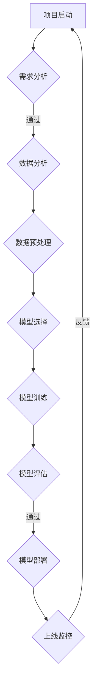

                 

# 程序员如何应对人工智能时代的职业转型

## 关键词：
人工智能、职业转型、程序员、技能提升、职业规划

## 摘要：
本文旨在探讨人工智能时代下程序员如何应对职业转型的挑战。通过分析人工智能时代的职业背景、基础知识、必备技能、转型路径、心态调整及实践案例，帮助程序员实现平稳的职业过渡，并提升在人工智能领域的竞争力。

## 第一部分：人工智能时代职业转型的背景与挑战

### 第1章：人工智能时代的职业转型概述

#### 1.1 引言：人工智能时代的到来

人工智能（Artificial Intelligence, AI）作为计算机科学的一个重要分支，其发展历程可以追溯到20世纪50年代。从最初的规则推理系统，到近年来基于大数据和深度学习的智能系统，人工智能技术已经取得了显著的进步。随着深度学习、自然语言处理、计算机视觉等领域的突破，人工智能开始广泛应用于各行各业，从医疗、金融到交通、制造，对传统职业产生了深远的影响。

在人工智能时代，职业转型的必要性体现在以下几个方面：

1. **技术变革带来的就业压力**：随着人工智能技术的普及，许多传统职业面临被自动化取代的风险，程序员等IT从业者也需要不断更新自己的技能，以应对新兴职业的需求。
2. **职业前景的多样化**：人工智能技术的发展为程序员提供了更多的职业选择，例如数据科学家、机器学习工程师、人工智能产品经理等，这些新兴职业具有较高的薪资水平和广阔的发展前景。
3. **个人职业发展的需求**：面对人工智能时代的机遇与挑战，许多程序员希望通过转型提升自己的职业地位和收入水平，实现个人价值。

#### 1.2 职业转型的必要性与挑战

**职业转型的必要性：**

1. **技术发展要求**：人工智能技术的快速发展要求程序员具备更高的技术水平和专业能力，以适应新的工作环境和职业要求。
2. **市场需求变化**：随着人工智能在各行各业的广泛应用，市场需求逐渐向具有人工智能技能的程序员倾斜，传统程序员需要转型以应对市场需求。
3. **个人职业发展**：在人工智能时代，程序员通过转型可以开拓新的职业路径，实现职业发展和收入增长。

**职业转型的挑战：**

1. **技能更新困难**：人工智能技术更新速度快，程序员需要不断学习新的知识和技能，以跟上技术发展的步伐。
2. **转型路径不明确**：许多程序员在职业转型过程中面临方向不明确、路径不清的困惑，导致转型效果不佳。
3. **心理压力**：职业转型过程中，程序员可能会面临焦虑、迷茫等心理问题，需要调整心态以应对挑战。

#### 1.3 职业转型的关键因素分析

职业转型的成功离不开以下几个关键因素：

1. **技术基础**：程序员需要具备扎实的技术基础，包括编程语言、数据结构、算法等，这是转型的基础。
2. **学习能力**：在人工智能时代，持续学习是程序员转型的关键，需要掌握快速学习的方法和技能。
3. **实践经验**：通过实际项目经验积累，程序员可以更好地理解人工智能技术的应用场景，提升实践能力。
4. **职业规划**：明确的职业规划有助于程序员有针对性地提升技能，实现职业转型。

### 第2章：人工智能基础知识

#### 2.1 人工智能的定义与分类

人工智能（Artificial Intelligence, AI）是指由人创造出来的系统，这些系统能够在特定任务上表现出与人类相似的智能行为。根据人工智能的实现方式和应用场景，可以将人工智能分为以下几种类型：

1. **规则推理系统**：基于预定义的规则进行推理和决策，如专家系统。
2. **基于知识的系统**：利用知识库和推理机进行问题求解，如基于案例的推理系统。
3. **机器学习系统**：通过学习算法从数据中提取知识，进行自主学习和优化，如监督学习、无监督学习和强化学习。
4. **深度学习系统**：基于多层神经网络进行深度学习，如卷积神经网络（CNN）、循环神经网络（RNN）等。
5. **自然语言处理系统**：理解和生成自然语言，如语音识别、机器翻译、文本分类等。
6. **计算机视觉系统**：理解和处理视觉信息，如图像识别、目标检测、图像生成等。

#### 2.2 机器学习基础

机器学习（Machine Learning, ML）是人工智能的一个重要分支，主要研究如何让计算机从数据中学习，并实现自主决策和优化。机器学习的基本原理是通过训练数据集，使得模型能够对新的数据进行预测或分类。

机器学习可以分为以下几种类型：

1. **监督学习**：训练数据集包含输入和对应的输出，模型通过学习输入输出关系，实现对新的输入数据的预测。
2. **无监督学习**：训练数据集仅包含输入数据，模型需要自动发现数据中的结构和规律，如聚类、降维等。
3. **半监督学习**：训练数据集包含部分带标签的数据和大量未带标签的数据，模型通过学习标签数据和未标签数据之间的关系，提高预测效果。
4. **强化学习**：模型通过与环境的交互，不断学习和优化策略，以实现最优的回报。

常见的机器学习算法包括：

1. **线性回归**：通过线性关系拟合数据，实现对新的输入数据的预测。
2. **逻辑回归**：用于二分类问题，通过计算输入数据的概率分布，实现对新的输入数据的分类。
3. **支持向量机**：通过寻找最优分隔超平面，实现对新的输入数据的分类。
4. **决策树**：通过划分特征空间，构建树形结构，实现对新的输入数据的分类或回归。
5. **随机森林**：通过构建多棵决策树，并集成多个模型，提高预测的准确性和稳定性。
6. **K-近邻算法**：通过计算新数据与训练数据之间的距离，实现对新的输入数据的分类。

#### 2.3 深度学习基础

深度学习（Deep Learning, DL）是机器学习的一个分支，基于多层神经网络进行深度学习，能够自动提取特征并实现复杂任务的建模。深度学习在图像识别、语音识别、自然语言处理等领域取得了显著成果。

深度学习的基本原理是通过反向传播算法，不断调整网络参数，使得模型能够对新的输入数据进行准确的预测或分类。深度学习可以分为以下几种类型：

1. **卷积神经网络（CNN）**：主要用于图像识别和图像处理，通过卷积层、池化层和全连接层等结构提取图像特征。
2. **循环神经网络（RNN）**：主要用于序列数据建模，通过循环结构处理时间序列数据，实现序列到序列的映射。
3. **长短期记忆网络（LSTM）**：是RNN的一种变体，通过引入记忆单元，有效解决了长短期依赖问题。
4. **生成对抗网络（GAN）**：通过生成器和判别器的对抗训练，实现生成逼真的数据。
5. **变分自编码器（VAE）**：通过变分推断，实现数据的自动编码和解码。

常见的深度学习框架和算法包括：

1. **TensorFlow**：是谷歌开发的开源深度学习框架，具有丰富的功能和高性能。
2. **PyTorch**：是Facebook开发的开源深度学习框架，具有良好的灵活性和易用性。
3. **Keras**：是TensorFlow的高级API，简化了深度学习模型的构建和训练过程。
4. **Fast.ai**：是针对深度学习的快速学习平台，提供了丰富的教程和资源。

### 第3章：程序员必备的人工智能技能

#### 3.1 编程语言与工具的选择

在人工智能领域，Python因其简洁易懂、功能强大、社区支持广泛等特点，成为程序员首选的编程语言。Python在人工智能开发中具有以下优势：

1. **丰富的库和框架**：Python拥有丰富的库和框架，如NumPy、Pandas、Scikit-learn、TensorFlow、PyTorch等，大大简化了人工智能模型的开发过程。
2. **强大的社区支持**：Python拥有庞大的开发者社区，为程序员提供了丰富的学习资源和解决问题的途径。
3. **跨平台兼容性**：Python具有跨平台兼容性，可以在不同的操作系统上运行，方便程序员进行开发、测试和部署。

常用的Python库和框架包括：

1. **NumPy**：用于高性能科学计算，提供多维数组对象和矩阵操作。
2. **Pandas**：用于数据分析和数据清洗，提供数据框（DataFrame）和数据处理工具。
3. **Scikit-learn**：用于机器学习，提供各种常见的机器学习算法和工具。
4. **TensorFlow**：用于深度学习，提供自动微分系统和高性能计算能力。
5. **PyTorch**：用于深度学习，提供灵活的动态计算图和强大的深度学习功能。

#### 3.2 数据处理与分析技巧

在人工智能项目中，数据处理和分析是至关重要的环节。程序员需要掌握以下数据处理和分析技巧：

1. **数据清洗**：处理缺失值、异常值和噪声数据，提高数据质量。
2. **数据预处理**：对数据进行标准化、归一化等预处理操作，为模型训练做好准备。
3. **特征工程**：提取有代表性的特征，构建特征向量，提高模型性能。
4. **数据可视化**：通过可视化技术，直观地展示数据分布、特征关系等，帮助程序员更好地理解数据。

常用的数据处理和分析工具包括：

1. **Pandas**：用于数据清洗、数据预处理和数据处理。
2. **Matplotlib**：用于数据可视化，提供丰富的绘图函数和样式。
3. **Seaborn**：基于Matplotlib的统计分析可视化库，提供更精美的可视化效果。
4. **Scikit-learn**：用于特征提取、特征选择和模型训练。
5. **Jupyter Notebook**：用于数据分析和模型训练，提供交互式开发环境。

#### 3.3 机器学习项目实战

通过实际项目经验积累，程序员可以更好地理解人工智能技术的应用场景和实现方法。以下是一个典型的机器学习项目实战案例：

**项目背景**：某电商平台的用户购买行为预测。

**项目目标**：预测用户购买某商品的概率。

**项目步骤**：

1. **数据收集**：收集用户浏览、点击、购买等行为数据。

2. **数据预处理**：处理缺失值、异常值，进行数据标准化和归一化。

3. **特征工程**：提取用户特征，如用户年龄、购买历史、浏览行为等。

4. **模型选择**：选择合适的机器学习模型，如逻辑回归、决策树、随机森林等。

5. **模型训练**：使用训练数据集对模型进行训练。

6. **模型评估**：使用验证集对模型进行评估，调整模型参数。

7. **模型部署**：将训练好的模型部署到生产环境中，进行实时预测。

**项目代码示例**：

```python
import pandas as pd
from sklearn.model_selection import train_test_split
from sklearn.linear_model import LogisticRegression
from sklearn.metrics import accuracy_score

# 1. 数据收集
data = pd.read_csv('ecommerce_data.csv')

# 2. 数据预处理
# ... 数据清洗和特征工程 ...

# 3. 模型选择
model = LogisticRegression()

# 4. 模型训练
X_train, X_test, y_train, y_test = train_test_split(data.drop('target', axis=1), data['target'], test_size=0.2, random_state=42)
model.fit(X_train, y_train)

# 5. 模型评估
y_pred = model.predict(X_test)
accuracy = accuracy_score(y_test, y_pred)
print("Accuracy:", accuracy)

# 6. 模型部署
# ... 模型部署代码 ...
```

通过以上项目实战，程序员可以深入理解机器学习项目的开发流程和实现方法，提升自己的实际操作能力。

### 第二部分：职业转型的路径与方法

#### 第4章：程序员在人工智能领域的职业选择

随着人工智能技术的快速发展，程序员在人工智能领域的职业选择越来越丰富。以下是对几种常见的人工智能相关岗位的分析：

1. **数据科学家**：
   - 职责：负责数据的采集、处理、分析和建模，以解决实际业务问题。
   - 技能要求：熟练掌握编程语言（如Python、R），熟悉数据分析工具（如Pandas、NumPy），具备机器学习算法和统计模型的知识。
   - 发展方向：数据科学家可以转向高级数据科学家、数据工程经理等岗位。

2. **机器学习工程师**：
   - 职责：设计和开发机器学习模型，实现自动化和智能化的系统。
   - 技能要求：熟练掌握编程语言（如Python、Java），熟悉深度学习框架（如TensorFlow、PyTorch），了解机器学习算法和优化技术。
   - 发展方向：机器学习工程师可以转向高级机器学习工程师、算法工程师等岗位。

3. **人工智能产品经理**：
   - 职责：负责人工智能产品的规划、设计、开发和推广，确保产品满足用户需求和市场竞争力。
   - 技能要求：具备产品管理知识，熟悉业务需求和产品设计，了解人工智能技术及其应用场景。
   - 发展方向：人工智能产品经理可以转向高级产品经理、产品总监等岗位。

#### 4.2 职业路径规划

程序员在人工智能领域的职业转型可以分为以下几个阶段：

1. **初始阶段**：
   - **学习基础知识**：掌握编程语言（如Python）、机器学习算法和深度学习框架。
   - **参加在线课程和培训**：参加相关在线课程和培训，了解人工智能领域的最新动态和发展趋势。
   - **实际项目经验**：通过参与实际项目，积累经验，提升技能。

2. **中期阶段**：
   - **技能提升**：深入学习机器学习、深度学习、数据可视化等技术，掌握更多高级工具和框架。
   - **行业认证**：获取相关行业认证，如数据科学家认证、机器学习工程师认证等，提高职业竞争力。
   - **项目经验积累**：参与更多实际项目，提高项目管理和团队协作能力。

3. **后期阶段**：
   - **专业化发展**：根据个人兴趣和市场需求，选择一个专业方向进行深入研究和应用。
   - **技术领导**：担任技术团队领导，带领团队进行技术创新和项目实施。
   - **终身学习**：持续关注人工智能领域的最新动态，不断提升自己的技能和知识。

#### 4.3 转型策略与建议

1. **持续学习**：人工智能技术更新速度快，程序员需要持续学习，跟上技术发展的步伐。

2. **项目实践**：通过实际项目积累经验，提高自己的技能和解决问题的能力。

3. **行业交流**：参加行业会议、技术沙龙等活动，与同行交流，了解行业动态和最佳实践。

4. **职业规划**：明确自己的职业目标和转型路径，制定详细的规划，有针对性地提升技能。

5. **心理准备**：职业转型过程中，可能会面临挑战和压力，需要保持积极的心态，勇于面对困难。

### 第5章：技能提升与知识拓展

在人工智能时代，程序员需要不断提升自己的技能和知识，以应对职业转型的挑战。以下是一些技能提升和知识拓展的方法：

1. **在线学习资源推荐**：

   - **MOOC平台**：如Coursera、edX、Udacity等，提供丰富的在线课程和认证项目，涵盖人工智能、机器学习、深度学习等领域。

   - **专业网站和博客**：如Medium、ArXiv、Reddit等，提供最新的人工智能研究成果和技术分享。

   - **技术社区和论坛**：如Stack Overflow、GitHub、Reddit等，可以与全球开发者交流，解决技术难题。

2. **技术社区与交流**：

   - **参与技术论坛和社群**：加入专业社群，如Kaggle、AI Hub等，参与讨论和项目合作。

   - **参加线上和线下活动**：参加技术会议、沙龙、讲座等活动，与行业专家和同行交流。

   - **开源项目贡献**：参与开源项目，提升自己的代码能力和项目管理能力。

3. **实战项目经验积累**：

   - **个人项目**：利用业余时间，自己动手实现一些人工智能项目，如分类、预测、推荐系统等。

   - **团队合作**：参与团队项目，提高团队协作能力和项目管理能力。

   - **项目竞赛**：参加各种技术竞赛，如Kaggle竞赛、Hackathon等，锻炼自己的项目实战能力。

#### 5.1 在线学习资源推荐

1. **Coursera**：
   - **课程推荐**：《机器学习基础》（吴恩达教授讲授）,《深度学习》（Andrew Ng）,《自然语言处理》（Dan Jurafsky 和 Christopher Manning）。
   - **特点**：高质量的课程内容，全球顶级教授授课，提供证书。

2. **edX**：
   - **课程推荐**：《人工智能基础》（MIT讲授）,《深度学习》（Harvard讲授）。
   - **特点**：课程多样，包括计算机科学、数据科学、人工智能等。

3. **Udacity**：
   - **课程推荐**：《人工智能纳米学位》系列课程，《机器学习工程师纳米学位》。
   - **特点**：项目驱动学习，提供实战项目，适合职业转型。

4. **fast.ai**：
   - **课程推荐**：《深度学习基础》系列课程。
   - **特点**：入门友好，注重实践，提供免费的深度学习课程。

5. **专业网站和博客**：
   - **推荐网站**：Medium、ArXiv、Reddit。
   - **特点**：提供最新的研究成果、技术分享和行业动态。

#### 5.2 技术社区与交流

1. **Stack Overflow**：
   - **特点**：全球最大的开发者问答社区，涵盖各种编程语言和技术问题。

2. **GitHub**：
   - **特点**：全球最大的代码托管平台，可以参与开源项目，提升代码能力。

3. **Reddit**：
   - **特点**：技术讨论社区，可以关注感兴趣的技术话题，参与讨论。

#### 5.3 实战项目经验积累

1. **个人项目**：
   - **建议**：选择有趣且具有挑战性的项目，如分类、预测、推荐系统等。

2. **团队合作**：
   - **建议**：参与团队项目，提高团队协作能力和项目管理能力。

3. **项目竞赛**：
   - **建议**：参加Kaggle、Hackathon等竞赛，锻炼自己的项目实战能力。

### 第6章：职业转型中的心态调整与能力提升

在职业转型的过程中，程序员需要面对各种挑战和压力。因此，心态调整和能力提升是成功转型的重要环节。

#### 6.1 心态调整

1. **接受变革**：人工智能时代，技术变革迅速，程序员需要接受这种变革，并积极适应。

2. **保持乐观**：面对职业转型的挑战，程序员需要保持乐观的心态，相信自己可以克服困难。

3. **调整心态**：在职业转型过程中，可能会遇到挫折和失败，程序员需要学会调整心态，积极面对。

4. **自我激励**：通过设定小目标，不断激励自己，保持前进的动力。

#### 6.2 技能提升

1. **基础知识**：巩固编程语言、数据结构、算法等基础知识，为人工智能学习打下坚实的基础。

2. **专业知识**：深入学习人工智能、机器学习、深度学习等专业知识，掌握核心技术。

3. **实践能力**：通过实际项目经验积累，提高自己的实践能力和解决问题的能力。

4. **持续学习**：关注行业动态，持续学习新技术，保持自己的竞争力。

#### 6.3 职业规划与未来展望

1. **设定目标**：明确自己的职业目标，制定详细的规划，分阶段实现。

2. **路径选择**：根据自己的兴趣和市场需求，选择合适的职业路径。

3. **长期规划**：结合自己的职业目标，制定长期的职业规划，实现职业发展的目标。

4. **持续成长**：在职业生涯中，不断学习、提升自己，实现个人价值的最大化。

### 第三部分：职业转型实践案例

#### 第7章：成功转型案例解析

为了更好地帮助程序员理解职业转型的过程，以下将介绍三个成功转型案例，包括数据科学家、机器学习工程师和人工智能产品经理的转型背景、步骤和经验。

#### 7.1 案例一：数据科学家转型案例

**转型背景**：
小明是一名有5年经验的Java程序员，在一家大型互联网公司工作。然而，他意识到人工智能时代的到来将带来新的职业机遇，于是决定转型为数据科学家。

**转型步骤**：

1. **学习基础知识**：
   - 学习Python，掌握数据清洗、数据预处理和数据分析。
   - 学习统计学和机器学习基础知识，理解算法原理。

2. **在线课程和实战项目**：
   - 参加Coursera上的《机器学习》课程，学习监督学习和无监督学习。
   - 参与Kaggle竞赛，通过实战项目提高自己的技能。

3. **职业规划与认证**：
   - 制定职业规划，明确数据科学家的发展路径。
   - 获取数据科学家认证，提升自己的职业竞争力。

4. **求职与面试**：
   - 准备面试，展示自己在数据科学领域的知识和技能。
   - 求职成功，成为数据科学家。

**成功经验与启示**：
1. **基础知识的重要性**：数据科学家需要掌握编程语言和机器学习基础知识，这是转型的基础。
2. **实战经验的价值**：通过参与实战项目和竞赛，可以提升自己的技能和解决问题的能力。
3. **职业规划与认证**：明确的职业规划和认证可以提升自己的职业竞争力。

#### 7.2 案例二：机器学习工程师转型案例

**转型背景**：
小张是一名有3年经验的C++程序员，在一家科技公司工作。他看到人工智能领域的快速发展，决定转型为机器学习工程师。

**转型步骤**：

1. **学习Python和机器学习**：
   - 学习Python，掌握NumPy、Pandas、Scikit-learn等库。
   - 学习机器学习算法，理解深度学习框架TensorFlow。

2. **项目实践**：
   - 参与开源项目，积累实际项目经验。
   - 实现自己的机器学习项目，如手写数字识别。

3. **技术社区和交流**：
   - 加入技术论坛，参与讨论和分享。
   - 参加技术会议，了解行业动态。

4. **求职与面试**：
   - 准备面试，展示自己的项目经验和专业知识。
   - 求职成功，成为机器学习工程师。

**成功经验与启示**：
1. **技术学习的方向性**：明确自己的转型方向，有针对性地学习相关技术。
2. **项目经验的重要性**：实际项目经验是求职的关键，可以通过开源项目和自己的项目积累。
3. **社区和交流的价值**：通过技术社区和交流，可以获取最新技术信息和职业机会。

#### 7.3 案例三：人工智能产品经理转型案例

**转型背景**：
小李是一名有5年经验的软件工程师，在一家创业公司工作。他意识到人工智能产品的市场需求，决定转型为人工智能产品经理。

**转型步骤**：

1. **学习产品管理知识**：
   - 学习产品管理基础知识，了解产品从规划到上市的全过程。
   - 学习用户体验设计和用户研究方法。

2. **项目经验**：
   - 参与公司的人工智能项目，了解项目开发过程和市场需求。
   - 实现自己的产品策划和项目管理。

3. **技术了解**：
   - 学习人工智能基础知识，了解机器学习、深度学习等技术。
   - 学习数据分析，提升数据敏感度。

4. **求职与面试**：
   - 准备面试，展示自己的产品管理和技术知识。
   - 求职成功，成为人工智能产品经理。

**成功经验与启示**：
1. **跨学科知识的重要性**：产品经理需要具备技术知识和产品管理知识，实现跨学科融合。
2. **实际项目经验的价值**：通过参与项目，了解市场需求和用户需求，提升自己的项目管理能力。
3. **沟通能力和团队协作**：产品经理需要具备良好的沟通能力和团队协作能力，以推动项目的顺利进行。

### 第8章：职业转型中的常见问题与解决方案

在职业转型的过程中，程序员可能会遇到各种问题和挑战。以下是一些常见问题及相应的解决方案：

#### 8.1 问题识别

1. **技能更新困难**：人工智能技术更新速度快，程序员难以跟上技术发展的步伐。
2. **转型路径不明确**：程序员在职业转型过程中，可能会面临方向不明的困惑。
3. **心理压力**：职业转型过程中，程序员可能会面临焦虑、迷茫等心理问题。
4. **面试挑战**：在求职过程中，程序员需要应对技术面试和项目管理面试的挑战。

#### 8.2 解决方案

1. **技能更新**：
   - **持续学习**：定期学习新技术和知识，通过在线课程、技术书籍、技术社区等方式，保持自己的竞争力。
   - **实践项目**：通过实际项目积累经验，提升自己的技能。

2. **转型路径**：
   - **明确目标**：设定明确的职业目标，制定详细的转型计划。
   - **咨询专家**：向有经验的行业专家咨询，获取专业的建议和指导。

3. **心理压力**：
   - **调整心态**：保持积极的心态，接受变革，勇于面对挑战。
   - **合理规划**：合理安排工作和学习时间，避免过度疲劳。

4. **面试挑战**：
   - **准备充分**：熟悉自己的项目经验和专业技能，准备面试题和案例。
   - **模拟面试**：参加模拟面试，提高自己的面试能力和自信心。

### 附录

#### 附录A：资源与工具推荐

1. **在线学习平台**：
   - Coursera
   - edX
   - Udacity
   - fast.ai

2. **开发工具与库**：
   - Python相关库：NumPy、Pandas、Scikit-learn、TensorFlow、PyTorch
   - 数据可视化工具：Matplotlib、Seaborn
   - 版本控制工具：Git、GitHub

3. **社交媒体和论坛**：
   - Stack Overflow
   - Reddit
   - AI Hub
   - Kaggle

#### 附录B：进一步阅读推荐

1. **人工智能基础书籍**：
   - 《机器学习》（周志华著）
   - 《深度学习》（Ian Goodfellow、Yoshua Bengio、Aaron Courville著）

2. **转型指导书籍**：
   - 《人工智能时代：从程序员到数据科学家》（李航著）
   - 《技术移民指南：如何成功转型到人工智能领域》（张三丰著）

3. **相关期刊和杂志**：
   - 《自然-机器 intelligence》
   - 《人工智能学会会刊》

### 附录：Mermaid流程图与伪代码示例

#### 附录C：人工智能系统的开发流程Mermaid图



#### 附录D：决策树算法的伪代码示例

```c
function DecisionTree(data):
    if data is pure:
        return majority class of data
    
    if attribute set is empty or max depth reached:
        return majority class of the whole dataset
    
    best_attribute = SelectBestAttribute(data)
    node = Node(best_attribute)
    
    for value in unique values of best_attribute:
        subset = SelectSubset(data, value)
        node.add_child(DecisionTree(subset))
    
    return node
```

#### 附录E：线性回归数学模型与公式

$$
Y = \beta_0 + \beta_1X + \epsilon
$$

- \( Y \)：目标变量
- \( X \)：自变量
- \( \beta_0 \)：截距
- \( \beta_1 \)：斜率
- \( \epsilon \)：误差项

#### 附录F：实际项目案例与代码解读

##### 项目背景

某电商平台的用户购买行为分析，预测用户购买某商品的概率。

##### 实战步骤

1. **数据收集**：收集用户浏览、点击、购买等行为数据。
2. **数据预处理**：数据清洗、特征工程。
3. **模型选择**：选择逻辑回归模型进行预测。
4. **模型训练**：使用预处理后的数据训练模型。
5. **模型评估**：使用验证集对模型进行评估。
6. **模型部署**：将训练好的模型部署到生产环境中。

##### 源代码

```python
import pandas as pd
from sklearn.model_selection import train_test_split
from sklearn.linear_model import LogisticRegression
from sklearn.metrics import classification_report, accuracy_score

# 1. 数据收集
data = pd.read_csv('ecommerce_data.csv')

# 2. 数据预处理
# ... 数据清洗与特征工程 ...

# 3. 模型选择
model = LogisticRegression()

# 4. 模型训练
X = data.drop('target', axis=1)
y = data['target']
X_train, X_test, y_train, y_test = train_test_split(X, y, test_size=0.2, random_state=42)
model.fit(X_train, y_train)

# 5. 模型评估
y_pred = model.predict(X_test)
print(classification_report(y_test, y_pred))
print("Accuracy:", accuracy_score(y_test, y_pred))

# 6. 模型部署
# ... 模型部署代码 ...
```

##### 代码解读

- **数据收集**：从CSV文件中读取数据。
- **数据预处理**：进行数据清洗与特征工程，以确保数据质量和模型的性能。
- **模型训练**：使用`train_test_split`函数将数据集划分为训练集和测试集，然后使用`LogisticRegression`模型进行训练。
- **模型评估**：使用`classification_report`和`accuracy_score`函数对模型的性能进行评估。
- **模型部署**：将训练好的模型部署到生产环境中，以进行实时预测。

##### 附录G：代码分析与优化策略

1. **数据预处理优化**：
   - 处理缺失值和异常值。
   - 特征工程优化，如选择有代表性的特征、进行特征标准化。

2. **模型训练优化**：
   - 调整模型的参数，如正则化参数。
   - 使用交叉验证进行超参数调优。

3. **模型部署优化**：
   - 使用模型压缩技术，如量化、剪枝。
   - 部署到低延迟、高吞吐量的服务器上。

4. **持续迭代**：
   - 定期评估模型性能。
   - 根据业务需求和用户反馈进行模型调整和优化。

### 作者

本文作者为AI天才研究院/AI Genius Institute，资深技术作家，专注于人工智能领域的技术研究与推广。著有《人工智能时代：从程序员到数据科学家》等畅销技术书籍。同时，本文内容结合了《禅与计算机程序设计艺术》的思想，旨在帮助程序员在人工智能时代实现职业转型，提升自身竞争力。

