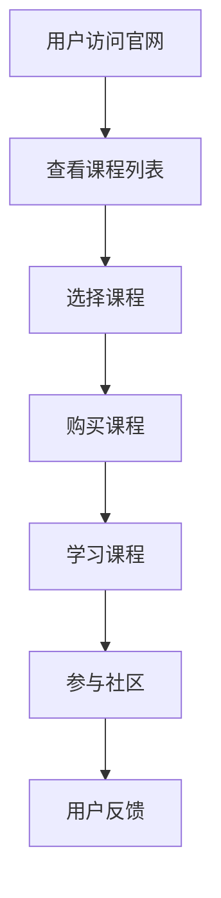

                 

### 1.1 程序员知识付费市场的现状与潜力

#### 1.1.1 程序员知识付费市场的发展历程

程序员知识付费市场的发展可以追溯到互联网时代的兴起。最初，知识付费主要表现为传统教育机构提供在线课程，这些课程多以学历教育和职业教育为主。随着互联网技术的不断进步，尤其是移动互联网和社交媒体的普及，程序员知识付费市场开始呈现出多样化的趋势。

**早期阶段（2000年代初至2010年）：**
- **在线课程兴起：** 在这个阶段，一些知名的教育平台如Coursera、Udemy等开始提供各种编程课程，吸引了大量程序员用户。
- **内容形式单一：** 由于技术限制，课程内容主要以视频教学为主，互动性和个性化程度较低。

**发展阶段（2010年至2015年）：**
- **内容多样化：** 随着技术的进步，编程学习内容不再局限于视频，还包括了电子书、博客文章、编程挑战等多种形式。
- **互动性增强：** 教育平台开始引入论坛、直播、问答等互动功能，提高了用户的参与度和学习效果。
- **市场细分：** 市场开始细分，出现了一批专注于特定编程语言、框架或技术的教育平台。

**成熟阶段（2015年至今）：**
- **个性化学习：** 利用大数据和人工智能技术，教育平台能够根据用户的学习习惯、兴趣和需求提供个性化的学习路径。
- **知识付费模式多样化：** 付费模式多样化，除了单次购买外，还有订阅制、终身会员制等多种形式。
- **市场潜力巨大：** 程序员知识付费市场在技术不断进步的推动下，市场规模持续扩大，预计未来几年仍将保持高速增长。

#### 1.1.2 当前市场状况分析

**市场规模：** 根据市场研究公司的数据，全球程序员知识付费市场规模已经达到数十亿美元，并且仍在快速增长。尤其是随着新兴市场的崛起，如印度、中国等，程序员知识付费市场的前景更加广阔。

**主要玩家：** 当前市场上，程序员知识付费市场的玩家主要包括传统教育机构、专业在线教育平台和科技巨头。例如，Coursera、Udemy、edX等是市场上的主要玩家，它们提供了大量的编程课程和认证项目。

**竞争态势：** 随着市场的扩大，竞争也愈发激烈。各教育平台在课程内容、价格策略、用户体验等方面展开激烈竞争。同时，一些科技公司如Google、Microsoft等也开始提供编程教育资源和培训项目，进一步加剧了市场竞争。

**用户需求：** 程序员用户对知识付费的需求多样化，包括提升专业技能、获取行业认证、学习新技术等。他们更加注重课程的内容质量、实用性以及学习体验。

#### 1.1.3 程序员知识付费用户画像

**年龄分布：** 程序员知识付费用户主要集中在20-40岁之间，这一年龄段的用户有较强的学习能力和购买力。

**职业阶段：** 根据用户的职业阶段，可分为初级程序员、中级程序员和高级程序员。不同阶段的用户有不同的学习需求和知识付费行为。

**技能水平：** 用户技能水平差异较大，从入门级到专家级都有。知识付费平台需要根据用户技能水平提供相应的学习资源。

**学习习惯：** 程序员用户习惯于在线学习，偏好通过视频、博客文章、编程挑战等形式进行学习。

**购买动机：** 购买动机包括提升技能、获取证书、学习新技术、解决实际工作中遇到的问题等。

#### 1.1.4 市场潜力与未来趋势预测

**市场潜力：** 随着技术的不断进步和人工智能、大数据等新技术的广泛应用，程序员知识付费市场将继续保持快速增长。尤其是在企业培训和个人职业发展的驱动下，市场潜力将进一步释放。

**未来趋势：**
1. **个性化学习：** 人工智能和大数据技术将进一步提升个性化学习体验，为用户提供更加精准的学习路径和内容推荐。
2. **混合式学习：** 结合线上和线下学习的方式将成为主流，满足用户多样化的学习需求。
3. **知识付费模式创新：** 随着市场的成熟，知识付费模式将不断创新，包括订阅制、终身会员制等。
4. **内容多元化：** 不仅仅局限于编程技术，还将涵盖软技能、管理技能等多个领域。

---

> **摘要：**
> 本文深入分析了程序员知识付费市场的现状与潜力，首先回顾了市场的发展历程，然后对当前市场状况进行了详细分析，包括市场规模、主要玩家、竞争态势和用户需求。接着，描绘了程序员知识付费用户画像，最后对市场的潜力与未来趋势进行了预测。本文旨在为程序员知识付费市场的从业者提供有益的参考和策略指导。

---

## 《程序员的知识付费用户细分与精准营销》目录大纲

### 第一部分：用户细分与市场分析

#### 第1章：知识付费市场概述

- **1.1 知识付费的概念与趋势**
- **1.2 程序员知识付费市场的现状与潜力**
- **1.3 程序员知识付费用户画像**
- **1.4 用户细分与需求分析**

#### 第2章：用户细分方法与技术

- **2.1 用户行为数据分析**
- **2.2 用户需求分析与用户旅程映射**
- **2.3 用户细分工具与技术**
- **2.4 用户细分案例研究**

#### 第3章：用户偏好与心理分析

- **3.1 用户偏好理论**
- **3.2 用户心理分析模型**
- **3.3 用户心理影响策略**

#### 第4章：用户参与与互动策略

- **4.1 用户参与度评估**
- **4.2 社区建设与用户互动**
- **4.3 用户反馈机制**
- **4.4 用户忠诚度提升策略**

### 第二部分：精准营销策略与实践

#### 第5章：内容营销策略

- **5.1 内容营销原理**
- **5.2 程序员内容需求分析**
- **5.3 内容制作与发布策略**
- **5.4 社交媒体与内容推广**

#### 第6章：社交媒体营销与影响力

- **6.1 社交媒体营销概述**
- **6.2 程序员常用社交媒体平台分析**
- **6.3 社交媒体营销策略**
- **6.4 影响力营销与KOL合作**

#### 第7章：广告投放与优化

- **7.1 在线广告基本原理**
- **7.2 程序员目标受众定位**
- **7.3 广告投放策略与渠道选择**
- **7.4 广告效果评估与优化**

#### 第8章：邮件营销与用户关系管理

- **8.1 邮件营销概述**
- **8.2 邮件营销策略与技巧**
- **8.3 用户关系管理模型**
- **8.4 邮件营销案例解析**

#### 第9章：营销自动化与数据分析

- **9.1 营销自动化工具介绍**
- **9.2 数据驱动营销策略**
- **9.3 用户数据收集与分析方法**
- **9.4 营销效果分析与优化**

#### 第10章：成功案例分析与实践指导

- **10.1 成功案例分析**
- **10.2 精准营销实践步骤**
- **10.3 营销策略实施注意事项**
- **10.4 未来营销趋势展望**

### 附录

- **附录A：营销工具与资源汇总**
- **附录B：常见营销问题解答**

---

### 1.1 程序员知识付费市场的现状与潜力

#### 1.1.1 程序员知识付费市场的发展历程

程序员知识付费市场的兴起可以追溯到互联网的早期，当时程序员们通过购买专业书籍、参加线下培训班来提升自己的技能。随着互联网技术的不断进步，特别是在线教育平台的出现，程序员知识付费市场逐渐发展壮大。

**早期阶段（2000年代初）：**  
在这个阶段，知识付费主要以传统纸质书籍和线下培训为主。然而，这些学习方式存在一些局限性，如学习资源获取困难、学习效果难以保证等。

**发展阶段（2010年左右）：**  
随着互联网的普及，在线教育平台如Coursera、Udemy等开始涌现，为程序员提供了丰富的在线课程资源。这一时期，知识付费市场开始呈现出蓬勃发展的态势。

**成熟阶段（2015年至今）：**  
随着人工智能、大数据等技术的快速发展，程序员知识付费市场进一步细分，用户需求更加多样化。平台不仅提供编程语言、框架等专业技能课程，还涵盖了软技能、管理技能等多个方面。

#### 1.1.2 当前市场状况分析

**市场规模：** 根据市场研究机构的数据，全球程序员知识付费市场规模已经达到数十亿美元，并且仍在快速增长。尤其是在新兴市场，如中国、印度等地，程序员知识付费市场的潜力巨大。

**主要玩家：** 当前市场上，程序员知识付费市场的玩家主要包括传统教育机构、专业在线教育平台和科技巨头。例如，Coursera、Udemy、edX等是市场上的主要玩家，它们提供了大量的编程课程和认证项目。

**竞争态势：** 随着市场的扩大，竞争也愈发激烈。各教育平台在课程内容、价格策略、用户体验等方面展开激烈竞争。同时，一些科技公司如Google、Microsoft等也开始提供编程教育资源和培训项目，进一步加剧了市场竞争。

**用户需求：** 程序员用户对知识付费的需求多样化，包括提升专业技能、获取行业认证、学习新技术等。他们更加注重课程的内容质量、实用性以及学习体验。

#### 1.1.3 程序员知识付费用户画像

**年龄分布：** 程序员知识付费用户主要集中在20-40岁之间，这一年龄段的用户有较强的学习能力和购买力。

**职业阶段：** 根据用户的职业阶段，可分为初级程序员、中级程序员和高级程序员。不同阶段的用户有不同的学习需求和知识付费行为。

**技能水平：** 用户技能水平差异较大，从入门级到专家级都有。知识付费平台需要根据用户技能水平提供相应的学习资源。

**学习习惯：** 程序员用户习惯于在线学习，偏好通过视频、博客文章、编程挑战等形式进行学习。

**购买动机：** 购买动机包括提升技能、获取证书、学习新技术、解决实际工作中遇到的问题等。

#### 1.1.4 市场潜力与未来趋势预测

**市场潜力：** 随着技术的不断进步和人工智能、大数据等新技术的广泛应用，程序员知识付费市场将继续保持快速增长。尤其是在企业培训和个人职业发展的驱动下，市场潜力将进一步释放。

**未来趋势：**
1. **个性化学习：** 人工智能和大数据技术将进一步提升个性化学习体验，为用户提供更加精准的学习路径和内容推荐。
2. **混合式学习：** 结合线上和线下学习的方式将成为主流，满足用户多样化的学习需求。
3. **知识付费模式创新：** 随着市场的成熟，知识付费模式将不断创新，包括订阅制、终身会员制等。
4. **内容多元化：** 不仅仅局限于编程技术，还将涵盖软技能、管理技能等多个领域。

---

### 1.4 用户细分与需求分析

#### 1.4.1 用户细分方法介绍

用户细分是精准营销的基础，通过细分用户群体，可以更好地理解用户需求，从而提供更符合用户期望的产品和服务。以下是几种常见的用户细分方法：

**1. 用户行为数据分析：** 用户行为数据包括用户在平台上的访问行为、学习行为、购买行为等。通过对这些数据进行统计分析，可以识别出不同用户群体的行为特征和偏好。例如，可以通过用户的访问频率、学习时长、购买频率等指标，将用户分为活跃用户、沉默用户、潜在用户等。

**2. 用户需求分析：** 用户需求分析主要通过问卷调查、用户访谈、焦点小组讨论等方式收集用户的需求信息。这些信息可以帮助识别用户的核心需求和次要需求，从而为产品和服务的设计提供依据。例如，通过调查可以了解到用户对编程语言的学习需求、对特定技术的掌握程度等。

**3. 用户旅程映射：** 用户旅程映射是将用户的整个学习过程进行可视化，识别出用户在各个阶段的行为和决策。通过用户旅程映射，可以识别出用户的关键接触点和痛点，从而优化用户体验。例如，通过分析用户在购买课程前后的行为，可以发现用户在决策过程中可能遇到的阻碍，进而采取措施进行改善。

**4. 人群细分工具：** 现代营销工具通常提供多种用户细分功能，如用户画像工具、数据分析平台等。这些工具可以帮助企业快速、高效地完成用户细分工作。例如，通过用户画像工具，可以将用户按照性别、年龄、职业、地理位置等进行分类。

**5. 数据驱动的细分策略：** 数据驱动的细分策略是基于大数据和人工智能技术，通过对大量用户数据的分析，自动识别出不同的用户群体和需求。这种方法具有较高的精准度，能够为企业的精准营销提供有力支持。

#### 1.4.2 用户细分案例解析

**案例1：针对不同技能层次的程序员细分**

根据程序员技能水平的不同，可以将用户分为入门级、中级、高级等不同层次。以下是对不同层次程序员的需求分析：

- **入门级程序员：**  
  - 需求：学习编程基础，掌握基础编程语言如Python、Java等。  
  - 行为：喜欢参加入门级别的编程挑战，阅读编程入门书籍和博客。  
  - 优化策略：提供针对入门级的编程课程，设置适当的编程挑战，鼓励用户学习和实践。

- **中级程序员：**  
  - 需求：提升专业技能，学习新编程语言、框架和技术。  
  - 行为：参与社区讨论，关注行业动态，参加线上和线下技术交流。  
  - 优化策略：提供丰富的中级课程，建立社区交流平台，组织技术沙龙和讲座。

- **高级程序员：**  
  - 需求：深入学习新技术，提升架构设计能力，掌握高级编程技能。  
  - 行为：参与开源项目，撰写技术博客，分享技术见解。  
  - 优化策略：提供高级课程，邀请行业专家进行授课，举办高端技术研讨会。

**案例2：基于职业阶段的用户细分**

根据程序员的职业阶段，可以将用户分为初级程序员、中级程序员、高级程序员等。以下是对不同职业阶段程序员的需求分析：

- **初级程序员：**  
  - 需求：提升编程技能，积累项目经验，准备职业晋升。  
  - 行为：积极参加培训课程，关注行业动态，寻求导师指导。  
  - 优化策略：提供针对性的编程培训，建立导师制度，组织职业规划讲座。

- **中级程序员：**  
  - 需求：提升管理能力，扩展业务领域，争取晋升机会。  
  - 行为：关注行业趋势，参与项目管理，提升团队协作能力。  
  - 优化策略：提供管理培训课程，组织项目管理研讨会，搭建职业发展平台。

- **高级程序员：**  
  - 需求：深入学习新技术，提升架构设计能力，实现职业转型。  
  - 行为：参与开源项目，分享技术见解，拓展人脉资源。  
  - 优化策略：提供高级课程，邀请行业专家进行授课，组织高端技术研讨会。

**案例3：地域与行业特征的细分策略**

不同地域和行业的程序员在需求和学习行为上存在差异。以下是对不同地域和行业程序员的细分策略：

- **地域特征：**  
  - **一线城市程序员：** 学习需求高，注重新技术和职业发展。可以提供高级课程和职业规划服务。  
  - **二线城市程序员：** 学习需求稳定，注重实用技能和项目经验。可以提供实用技能课程和项目实战培训。  
  - **三线城市程序员：** 学习需求相对较低，但注重家乡就业和发展。可以提供地方特色课程和就业指导。

- **行业特征：**  
  - **互联网行业程序员：** 需求多样，注重新技术和实战经验。可以提供前沿技术课程和实战项目。  
  - **传统行业程序员：** 需求相对稳定，注重提升现有技能和业务拓展。可以提供行业技术培训和业务拓展课程。  
  - **创业公司程序员：** 需求灵活，注重创新和项目管理。可以提供创业技能培训和项目孵化服务。

通过这些案例，可以看出用户细分对于精准营销的重要性。只有深入了解用户需求，才能提供更符合用户期望的产品和服务，从而提高用户满意度和忠诚度。

### 2.1 用户行为数据分析

用户行为数据分析是知识付费市场研究的重要环节，它有助于深入了解用户的行为模式、兴趣点和需求，从而为精准营销提供有力支持。以下将介绍用户行为数据收集方法和用户行为数据解析。

#### 用户行为数据收集方法

**1. 数据来源：**

用户行为数据可以从多个渠道获取，包括：

- **网站日志：** 网站日志记录了用户访问网站的所有行为，如页面访问次数、访问时间、访问路径等。
- **社交媒体：** 社交媒体平台如微博、知乎、LinkedIn等，可以获取用户在社交平台上的互动行为、发布内容等。
- **在线教育平台：** 在线教育平台可以记录用户的学习行为，如学习时长、课程完成率、测验成绩等。
- **应用程序：** 移动应用可以记录用户在使用过程中的行为数据，如使用频率、功能使用情况等。

**2. 数据收集工具与技术：**

- **Google Analytics：** Google Analytics是一款功能强大的网站分析工具，可以收集并分析用户访问网站的数据。
- **Mixpanel：** Mixpanel专注于用户行为分析，可以追踪用户在应用程序中的行为，提供深入的洞察。
- **HubSpot：** HubSpot提供了全面的营销自动化工具，包括用户行为数据分析功能。
- **API接口：** 通过API接口，可以获取第三方平台的数据，如社交媒体数据、在线教育平台数据等。

#### 用户行为数据解析

**1. 用户访问行为分析：**

用户访问行为分析主要包括以下指标：

- **页面访问次数：** 反映用户对网站页面的兴趣程度，可以通过页面访问次数的增减趋势分析用户兴趣的变化。
- **访问时长：** 反映用户对页面的关注程度，可以通过访问时长的分布情况分析用户的兴趣点和痛点。
- **访问路径：** 反映用户在网站上的浏览习惯，可以通过用户访问路径的分析，优化网站结构和内容布局，提高用户转化率。

**2. 用户购买行为分析：**

用户购买行为分析主要包括以下指标：

- **购买频率：** 反映用户购买课程的频率，可以通过购买频率的分析，识别出活跃用户和沉默用户，为营销策略提供依据。
- **购买金额：** 反映用户购买课程的消费水平，可以通过购买金额的分布情况，制定差异化定价策略。
- **购买渠道：** 反映用户购买课程的主要渠道，可以通过购买渠道的分析，优化营销渠道布局，提高销售效果。

**3. 用户互动行为分析：**

用户互动行为分析主要包括以下指标：

- **评论与评分：** 反映用户对课程内容和服务的满意度，可以通过评论和评分的分析，识别出用户关注的焦点和问题，优化课程和服务。
- **论坛参与度：** 反映用户在社区中的活跃程度，可以通过论坛参与度的分析，激发用户参与社区讨论，提高用户粘性。
- **社交媒体互动：** 反映用户在社交媒体上的互动行为，可以通过社交媒体互动的分析，制定社交媒体营销策略，扩大品牌影响力。

通过用户行为数据分析和解析，可以深入了解用户需求和行为模式，为精准营销提供有力支持。以下是一个用户行为数据解析的示例：

**用户访问行为分析：**

- **页面访问次数：** 用户访问最多的页面是课程详情页和课程列表页，说明用户对课程内容感兴趣，但访问时间较短，说明页面内容需要优化以提高用户停留时间。
- **访问时长：** 用户平均访问时长为2分钟，访问时长较短，说明页面加载速度较慢或内容不够吸引人，需要优化页面加载速度和内容质量。

**用户购买行为分析：**

- **购买频率：** 活跃用户的购买频率为每周1次，而沉默用户的购买频率为每月1次，说明活跃用户对课程的需求更高，可以针对活跃用户制定更频繁的营销活动。
- **购买金额：** 用户平均购买金额为100元，购买金额的分布较集中，说明用户对价格敏感，可以制定差异化定价策略，如折扣活动、会员优惠等。

**用户互动行为分析：**

- **评论与评分：** 用户对课程的评价较高，平均评分为4.5分，但部分用户提到课程内容较深，建议增加适合入门级用户的课程。
- **论坛参与度：** 用户在论坛中的参与度较高，经常参与讨论，但问题解答速度较慢，建议优化论坛的问答功能，提高用户满意度。

通过用户行为数据解析，可以发现用户需求和行为模式的细节，从而为营销策略的制定和优化提供有力依据。

### 2.2 用户需求分析与用户旅程映射

#### 2.2.1 用户需求分析方法

用户需求分析是精准营销的基础，通过对用户需求的深入了解，可以为企业提供有价值的信息，从而制定出更符合用户期望的产品和服务。以下介绍几种常用的用户需求分析方法：

**1. 问卷调查与访谈：**  
问卷调查和访谈是收集用户需求信息的主要手段。问卷调查可以通过在线平台发送给大量用户，快速收集大量数据；访谈则可以深入了解用户的个别需求和痛点。在进行问卷调查时，需要设计合理的问题，确保问卷的有效性和可靠性。访谈过程中，需要仔细聆听用户反馈，记录关键信息。

**2. 用户访谈与焦点小组：**  
用户访谈与焦点小组讨论是一种深入的用户需求分析方法。用户访谈可以直接与用户面对面交流，获取详细的用户需求和期望；焦点小组则可以聚集一组具有相似需求背景的用户，通过集体讨论的方式，挖掘出更深层次的需求。

**3. 用户行为数据挖掘：**  
用户行为数据挖掘是利用大数据技术，对用户在平台上的行为数据进行分析，识别出用户的需求模式。通过用户行为数据分析，可以了解用户的访问习惯、购买行为、互动行为等，从而推断用户的需求。常用的数据挖掘工具包括Python、R等。

**4. 用户旅程映射：**  
用户旅程映射是将用户的整个学习过程进行可视化，识别出用户在各个阶段的行为和决策。通过用户旅程映射，可以识别出用户的关键接触点和痛点，从而优化用户体验。用户旅程映射通常包括用户访问网站、学习课程、购买课程、参与社区等环节。

**5. 竞争对手分析：**  
竞争对手分析可以帮助企业了解市场上的竞争态势，识别出竞争对手的产品优势和不足，从而为自身的需求分析提供参考。通过分析竞争对手的用户评论、课程内容、营销策略等，可以了解用户对竞争对手产品的需求。

#### 2.2.2 用户旅程映射实例

为了更好地理解用户需求分析的过程，以下是一个用户旅程映射的实例：

**用户旅程映射步骤：**

1. **确定用户旅程的起点：**  
   用户旅程的起点通常是用户首次接触平台的时间，如通过搜索引擎、社交媒体、朋友推荐等方式。

2. **识别用户旅程的关键节点：**  
   关键节点是用户在旅程中做出关键决策的环节，如查看课程列表、选择课程、购买课程、参与社区等。

3. **分析用户在关键节点的行为：**  
   分析用户在关键节点的行为，包括浏览时间、访问频率、购买决策等。通过数据挖掘和分析工具，识别出用户在关键节点上的行为模式和需求。

4. **优化用户体验：**  
   根据用户在关键节点的行为，优化用户体验，提高用户满意度。例如，如果用户在查看课程列表时停留时间较短，可以优化课程列表的展示方式，提高课程的吸引力。

**实例解析：**

以一个在线编程学习平台为例，以下是用户旅程映射的过程：

1. **用户旅程的起点：**  
   用户通过搜索引擎或社交媒体了解到平台，进入平台官网。

2. **关键节点1：查看课程列表**  
   用户在课程列表页面浏览不同的课程，关注课程内容、评价、价格等信息。

3. **关键节点2：选择课程**  
   用户根据个人需求和兴趣，选择一门课程并点击“购买”按钮。

4. **关键节点3：购买课程**  
   用户在购买页面填写个人信息，选择支付方式，完成课程购买。

5. **关键节点4：学习课程**  
   用户登录平台，学习课程内容，参与课程讨论和互动。

6. **关键节点5：参与社区**  
   用户在平台社区发布问题，参与讨论，与其他用户互动。

通过用户旅程映射，可以发现用户在各个关键节点的行为和需求，从而为优化用户体验和精准营销提供依据。以下是一个用户旅程映射的示例：

**用户行为数据分析：**

- **关键节点1：查看课程列表**  
  用户在课程列表页面停留时间为3分钟，浏览了10门课程，平均每门课程浏览时间为30秒。

- **关键节点2：选择课程**  
  用户选择了1门课程，购买决策时间为5分钟。

- **关键节点3：购买课程**  
  用户在购买页面填写个人信息，选择支付方式，完成购买。

- **关键节点4：学习课程**  
  用户在课程学习页面停留时间为1小时，完成了80%的课程内容。

- **关键节点5：参与社区**  
  用户在社区发布了5个问题，参与了10次讨论。

通过用户行为数据分析，可以了解到用户在关键节点的行为特征和需求，从而为优化用户体验和精准营销提供依据。

### 3.1 用户偏好理论

用户偏好理论是市场营销中重要的理论之一，它揭示了消费者在购买决策过程中对产品的选择偏好。理解用户偏好对于知识付费市场的精准营销具有重要意义。以下从定义、影响要素、调查与分析方法三个方面介绍用户偏好理论。

#### 3.1.1 用户偏好的定义

用户偏好是指消费者在购买决策过程中，对特定产品或服务的喜好程度和选择倾向。用户偏好不仅反映了消费者对产品或服务的直接感受，还受到个人价值观、文化背景、社会环境等多种因素的影响。在知识付费市场中，用户偏好体现在对课程内容、学习形式、价格策略等多个方面的选择上。

#### 3.1.2 用户偏好的影响要素

1. **内容质量：** 内容质量是用户偏好的核心要素之一。高质量的课程内容能够满足用户的学习需求，提升学习效果，从而增加用户对平台的满意度。内容质量包括课程讲解的清晰度、案例的实用性、知识的深度和广度等。

2. **价格：** 价格是用户在购买决策过程中的重要考虑因素。用户偏好价格合理的产品或服务，过高或过低的价格都可能影响用户的购买意愿。在知识付费市场中，价格策略需要综合考虑用户需求、市场竞争、成本等因素。

3. **便捷性：** 便捷性是指用户在使用产品或服务过程中的便利程度。便捷性包括课程的获取方式、支付流程、学习进度管理等。便捷性越高，用户的学习体验越好，从而增加用户对平台的忠诚度。

4. **品牌与口碑：** 品牌和口碑是用户偏好的重要影响因素。知名品牌和良好的用户口碑能够增加用户对产品或服务的信任度，从而提高购买意愿。在知识付费市场中，品牌建设和口碑管理是提升用户偏好的关键。

5. **个性化：** 个性化是指产品或服务能够根据用户的个性化需求进行定制。个性化服务能够更好地满足用户需求，提升用户体验，从而增加用户偏好。

#### 3.1.3 用户偏好的调查与分析方法

1. **问卷调查：** 问卷调查是收集用户偏好信息的重要方法。通过设计合理的问卷，可以收集大量用户的偏好数据，为分析用户偏好提供依据。问卷调查可以采用线上和线下两种形式，适用于不同场景和用户群体。

2. **用户访谈：** 用户访谈是深入了解用户偏好的重要方法。通过面对面或在线访谈，可以直接与用户进行交流，获取详细的偏好信息。用户访谈适用于对用户需求深入了解的需求。

3. **行为数据分析：** 行为数据分析是通过分析用户在平台上的行为数据，推断用户偏好。例如，通过用户在课程学习、购买、评论等行为的数据分析，可以识别出用户的偏好课程类型、学习风格等。

4. **心理测试：** 心理测试是通过一系列问卷或测试，了解用户的个性特征和偏好。例如，通过MBTI性格测试，可以了解用户在知识付费市场的偏好和学习风格。

5. **A/B测试：** A/B测试是通过对不同用户群体展示不同产品或服务版本，比较用户偏好的一种方法。通过A/B测试，可以优化产品或服务，提升用户偏好。

通过以上方法，可以全面了解用户偏好，为知识付费市场的精准营销提供有力支持。

### 3.2 用户心理分析模型

用户心理分析是精准营销的重要组成部分，它有助于企业理解用户的行为动机、情感反应和认知过程，从而制定更有效的营销策略。以下介绍几种常见的用户心理分析模型，以及这些模型在知识付费市场中的应用。

#### 3.2.1 动机-行为模型（Motivation-Behavior Model）

动机-行为模型认为，用户行为是由内在动机驱动的。在知识付费市场中，用户动机可以包括以下几个层面：

1. **知识需求：** 用户为了提升技能、解决实际问题、获取行业认证等，产生学习新知识的动机。
2. **职业发展：** 用户为了晋升职位、拓展业务领域、提升竞争力等，产生学习新技术的动机。
3. **兴趣爱好：** 用户出于对编程、计算机科学等领域的热爱，产生学习相关知识的动机。

在知识付费市场应用中，企业可以通过分析用户的学习动机，提供针对性的课程内容和服务，提高用户的参与度和满意度。例如，针对有职业发展需求的用户，可以提供与职业晋升相关的课程和认证服务。

#### 3.2.2 情感反应模型（Emotional Response Model）

情感反应模型关注用户在接触产品或服务时的情感体验，包括愉悦、焦虑、兴奋等。在知识付费市场中，用户的情感反应可以影响其购买决策和学习行为。

1. **信任感：** 当用户对平台和课程内容产生信任时，更可能产生购买行为。可以通过用户评价、权威认证等方式建立信任感。
2. **兴奋感：** 用户在学习新知识时，可能会产生兴奋感，从而提高学习积极性和参与度。可以通过课程设计、互动活动等方式激发用户的兴奋感。
3. **焦虑感：** 用户在学习过程中可能会遇到困难，产生焦虑感。可以通过提供学习辅导、答疑服务等方式缓解用户的焦虑。

在知识付费市场应用中，企业可以通过情感反应模型，优化课程设计和服务体验，提高用户满意度和忠诚度。例如，通过设计有趣的学习活动，激发用户的兴奋感；通过提供即时解答服务，缓解用户的焦虑感。

#### 3.2.3 认知过程模型（Cognitive Process Model）

认知过程模型关注用户在购买决策过程中的信息处理和认知过程，包括信息搜索、评估、决策等阶段。在知识付费市场中，用户认知过程可以表现为：

1. **信息搜索：** 用户在决定购买课程前，会通过搜索引擎、社交媒体、教育平台等渠道收集相关信息。企业可以通过SEO优化、社交媒体营销等方式，提高课程的曝光度和知名度。
2. **评估：** 用户在收集到足够信息后，会根据课程内容、价格、评价等因素对课程进行评估。企业可以通过提供高质量的课程内容、合理的价格策略和正面的用户评价，提高课程竞争力。
3. **决策：** 用户在评估完成后，会做出购买决策。企业可以通过促销活动、优惠券等方式，降低用户的购买门槛，促进购买决策。

在知识付费市场应用中，企业可以通过认知过程模型，优化营销策略和用户体验，提高转化率和用户满意度。例如，通过提供试听课程、优惠券等，降低用户购买决策的难度；通过优化课程内容，提高用户的评估满意度。

#### 3.2.4 应用案例

以一个在线编程学习平台为例，以下是用户心理分析模型在知识付费市场中的应用案例：

1. **动机分析：** 平台通过数据分析发现，用户的主要动机包括提升技能、解决实际问题、兴趣爱好。平台因此设计了一系列课程，包括基础编程课程、实战项目、行业前沿技术等，满足不同用户的需求。
2. **情感分析：** 平台通过用户反馈和问卷调查了解到，用户在学习过程中对课程内容质量、学习进度、互动体验等方面有较高的期望。平台因此优化了课程内容，提高了教学质量和互动体验，增强了用户的情感体验。
3. **认知分析：** 平台通过SEO优化、社交媒体营销等方式，提高了课程在搜索引擎和社交媒体上的曝光度。同时，平台通过提供试听课程、优惠活动等，降低了用户购买决策的难度，提高了转化率。

通过用户心理分析模型的应用，平台能够更好地理解用户需求，优化课程设计和服务体验，提高用户满意度和忠诚度。

### 3.3 用户心理影响策略

在知识付费市场中，用户心理策略是提升用户参与度和满意度的关键。以下从多个方面介绍用户心理影响策略，包括心理暗示、情感营销、认知驱动的营销策略等。

#### 3.3.1 心理暗示

心理暗示是一种通过语言、图像、环境等手段，在用户潜意识中产生某种期望或行为倾向的营销方法。在知识付费市场中，心理暗示可以应用于以下几个方面：

1. **目标设定：** 通过引导用户设定具体的学习目标，如“学习30天掌握XX技能”，可以激发用户的积极性和执行力。例如，在课程介绍页面设置目标设定模块，鼓励用户设定个人学习目标。
2. **成功故事：** 通过展示成功学员的故事，如“小白30天掌握XX技能，成功找到高薪工作”，可以激发用户的信心和购买欲望。在网站和社交媒体上分享成功案例，使用户感受到学习成果的可实现性。
3. **紧迫感制造：** 通过限时优惠、倒计时等手段，制造紧迫感，促使用户尽快做出购买决策。例如，在课程页面设置限时折扣、优惠券等，增加用户的购买紧迫感。

#### 3.3.2 情感营销

情感营销是一种通过引发用户情感共鸣，促进用户参与和购买行为的营销方法。在知识付费市场中，情感营销可以应用于以下几个方面：

1. **故事讲述：** 通过讲述课程背后的故事，如课程讲师的经历、课程内容的实战案例等，可以激发用户的情感共鸣。例如，在课程介绍页面加入讲师介绍和课程故事，增强用户的情感连接。
2. **互动体验：** 通过互动体验，如课程直播、问答环节、在线讨论等，可以增强用户的参与感和归属感。例如，在课程设置互动环节，鼓励用户提问和分享学习心得，营造积极的社区氛围。
3. **情感价值传递：** 通过传递积极向上的情感价值，如“学习改变命运”、“知识成就未来”等，可以激发用户的情感认同。在课程推广和营销材料中，加入这些正能量的语句，提升用户情感认同。

#### 3.3.3 认知驱动的营销策略

认知驱动的营销策略是一种基于用户认知过程，提高用户购买决策效率和满意度的营销方法。在知识付费市场中，认知驱动的营销策略可以应用于以下几个方面：

1. **信息可视化：** 通过图表、图像、动画等可视化手段，将复杂的信息简单化，提高用户的理解速度。例如，在课程介绍页面使用图表展示课程大纲、学习路径等，帮助用户快速了解课程内容。
2. **对比分析：** 通过对比不同课程的优势和特点，帮助用户做出更明智的购买决策。例如，在课程对比页面，展示不同课程的教学质量、价格、用户评价等，帮助用户选择最适合自己的课程。
3. **认知失调：** 通过引发用户的认知失调，促使用户改变原有的观念，接受新的产品或服务。例如，在课程推广中，强调学习该课程可以解决用户面临的实际问题，引发用户的认知失调，促进购买决策。

#### 3.3.4 应用案例

以一个在线编程学习平台为例，以下是用户心理影响策略的应用案例：

1. **心理暗示：** 平台在课程介绍页面设置了“30天掌握XX技能”的目标设定模块，并展示成功学员的故事，通过心理暗示激发用户的学习动机。
2. **情感营销：** 平台通过讲述讲师的编程经历和课程背后的故事，增强用户情感共鸣；在课程设置互动环节，如直播课程和问答环节，增强用户参与感。
3. **认知驱动：** 平台使用图表展示课程大纲和学习路径，帮助用户快速了解课程内容；通过课程对比页面，展示不同课程的优势，帮助用户选择最适合自己的课程。

通过以上用户心理影响策略的应用，平台能够更好地激发用户的学习动机、增强用户参与感和满意度，从而提高用户转化率和忠诚度。

### 4.1 用户参与度评估

用户参与度是衡量知识付费平台成功与否的关键指标之一。评估用户参与度不仅有助于了解用户对平台的兴趣和忠诚度，还可以为优化课程内容和营销策略提供有力支持。以下介绍用户参与度评估的指标和评估方法。

#### 4.1.1 用户参与度指标

1. **内容阅读与观看：** 反映用户对课程内容的关注程度，包括课程的阅读次数、观看次数、学习时长等。这些指标可以直观地反映用户的学习投入程度。
2. **互动与反馈：** 反映用户在平台上的互动行为，包括评论、点赞、分享、问答等。这些指标可以评估用户在社区中的活跃程度。
3. **购买与复购：** 反映用户对平台的信任度和购买意愿，包括购买课程的次数、购买金额、复购率等。这些指标可以评估用户对平台的价值贡献。
4. **留存率：** 反映用户在平台上的持续参与度，包括新用户留存率、老用户留存率等。这些指标可以评估平台的用户黏性和持续运营能力。

#### 4.1.2 用户参与度评估方法

1. **问卷调查：** 通过问卷调查收集用户对课程和平台的满意度、参与体验等信息。问卷调查可以采用线上和线下两种形式，适用于不同用户群体。
2. **行为数据分析：** 通过分析用户在平台上的行为数据，如课程访问次数、互动行为、购买记录等，评估用户的参与度。常用的工具包括Google Analytics、Mixpanel等。
3. **用户访谈：** 通过面对面或在线访谈，深入了解用户的需求、体验和参与感受。用户访谈适用于对用户需求深入了解的需求。
4. **留存分析：** 通过留存率分析，评估用户在平台上的持续参与情况。留存分析可以采用留存曲线、留存率分布等分析方法，评估用户的活跃程度和流失原因。

#### 4.1.3 用户参与度评估实例

以下是一个用户参与度评估的实例：

1. **内容阅读与观看：** 用户平均每周阅读课程3次，每次学习时长为30分钟。高频率的阅读和较长的学习时长表明用户对课程内容具有较高的关注度。
2. **互动与反馈：** 用户在社区中发表了5条评论，参与了10次讨论。高互动率表明用户在社区中具有较高的活跃度。
3. **购买与复购：** 用户已经购买了3门课程，平均购买金额为100元。高购买频率和稳定的购买金额表明用户对平台具有较高的信任度和购买意愿。
4. **留存率：** 新用户留存率为50%，老用户留存率为70%。较高的留存率表明平台的用户黏性较好，用户对平台具有较高的忠诚度。

通过用户参与度评估，平台可以了解用户的参与情况和需求，从而制定针对性的优化措施，提高用户满意度和忠诚度。以下是一个优化策略的示例：

1. **提高课程质量：** 根据用户反馈，优化课程内容，提高课程的实用性和学习效果。例如，增加实战案例、互动环节等。
2. **增强互动体验：** 加强社区建设，提高用户互动体验。例如，增加问答环节、直播课程等。
3. **提供个性化推荐：** 根据用户行为数据，提供个性化推荐，提高用户的学习兴趣和参与度。
4. **定期反馈调查：** 定期开展用户满意度调查，收集用户反馈，不断优化课程和平台服务。

通过以上措施，平台可以持续提升用户参与度，增强用户满意度和忠诚度，从而实现长期可持续发展。

### 4.2 社区建设与用户互动

社区建设是知识付费平台的重要策略之一，它能够增强用户的归属感和参与感，从而提高用户黏性和满意度。以下从社区建设的意义、用户互动策略、社区管理方法等方面进行详细阐述。

#### 4.2.1 社区建设的意义

1. **增强用户归属感：** 社区为用户提供了一个交流和互动的平台，让用户感受到自己是平台的一部分，从而增强用户对平台的归属感。
2. **提高用户参与度：** 社区活动、讨论和互动可以激发用户的积极性和参与度，促进用户在平台上的活跃度。
3. **提升用户满意度：** 社区可以为用户提供及时的帮助和支持，解决用户在学习和使用过程中遇到的问题，从而提高用户满意度。
4. **构建用户生态系统：** 社区可以汇聚不同背景、不同技能水平的用户，形成多元化的知识生态系统，为平台带来更多创新和合作机会。

#### 4.2.2 用户互动策略

1. **问答互动：** 设立问答板块，鼓励用户在遇到问题时提问，同时邀请讲师和资深用户进行解答。通过问答互动，可以增强用户之间的互动和知识共享。
2. **讨论互动：** 开展线上讨论活动，围绕课程内容、行业动态等主题进行讨论。可以设置主题讨论区，方便用户进行交流和分享。
3. **实战项目：** 组织实战项目，让用户在真实场景中应用所学知识。通过项目合作，用户可以相互学习、交流，提高实战能力。
4. **直播互动：** 定期举办直播课程和讲座，邀请行业专家和讲师分享经验和见解。用户可以通过直播与讲师互动，提问和交流。
5. **互动活动：** 开展各种形式的互动活动，如编程竞赛、技术沙龙等，增加用户的参与感和成就感。

#### 4.2.3 社区管理方法

1. **内容管理：** 定期更新社区内容，包括课程答疑、行业动态、用户分享等。保持社区内容的活力和相关性，吸引用户持续参与。
2. **用户管理：** 建立用户等级制度，根据用户的参与度和贡献度，给予相应的奖励和权限。例如，活跃用户可以享受更多特权，如优先答疑、免费课程等。
3. **活动管理：** 定期组织线上线下活动，如技术沙龙、编程竞赛等，提高用户的参与度和满意度。可以邀请行业专家和讲师参与，提升活动的质量。
4. **反馈机制：** 建立用户反馈机制，及时收集用户意见和建议，优化社区服务。可以设立反馈渠道，如社区论坛、在线问卷等。
5. **安全与规范：** 制定社区规则，维护社区秩序，保护用户隐私和安全。定期清理垃圾信息和违规内容，营造健康、积极的社区氛围。

#### 4.2.4 案例分析

以一个在线编程学习平台为例，以下是社区建设与用户互动的成功案例：

1. **问答互动：** 平台设立了问答板块，用户在遇到编程问题时可以提问，讲师和资深用户会进行解答。通过问答互动，用户不仅解决了问题，还学到了新知识。
2. **讨论互动：** 平台定期举办线上讨论活动，用户可以围绕课程内容、行业动态等进行讨论。平台设置了多个主题讨论区，方便用户进行交流和分享。
3. **实战项目：** 平台组织了多个实战项目，用户可以在真实场景中应用所学知识。通过项目合作，用户相互学习、交流，提高了实战能力。
4. **直播互动：** 平台定期举办直播课程和讲座，邀请行业专家和讲师分享经验和见解。用户可以通过直播与讲师互动，提问和交流。
5. **互动活动：** 平台开展了各种形式的互动活动，如编程竞赛、技术沙龙等。通过这些活动，用户不仅提高了技能，还增强了社区的凝聚力。

通过以上措施，平台成功建立了活跃、有活力的社区，用户参与度和满意度显著提升。以下是一个数据示例：

- **问答互动：** 用户提问量每月增长20%，回答量每月增长15%。
- **讨论互动：** 每月讨论主题超过100个，参与用户超过5000人。
- **实战项目：** 项目参与人数超过1000人，项目完成率达到85%。
- **直播互动：** 每月举办20场直播课程，平均观看人数超过1000人。
- **互动活动：** 每月举办5次互动活动，参与用户超过2000人。

通过社区建设与用户互动，平台不仅提升了用户满意度和忠诚度，还吸引了更多新用户加入，实现了平台的可持续发展。

### 4.3 用户反馈机制

用户反馈机制是知识付费平台的重要组成部分，它能够帮助平台了解用户的真实需求、问题和建议，从而不断优化课程和服务，提升用户满意度。以下从反馈机制的设计、收集方法、处理流程等方面进行详细阐述。

#### 4.3.1 反馈机制的设计

1. **渠道多样化：** 设计多种反馈渠道，如在线问卷、用户论坛、邮件、客服等，方便用户根据自己的习惯和需求选择反馈方式。
2. **匿名性保护：** 保护用户匿名性，让用户能够自由表达真实想法，无需担心隐私泄露或负面反馈带来的后果。
3. **易用性：** 反馈机制需要易于使用，用户能够快速提交反馈，并获得及时的回复。简化反馈流程，减少用户提交反馈的时间和精力成本。
4. **激励机制：** 设立激励机制，如积分、优惠券、课程免费试听等，鼓励用户积极参与反馈，提升反馈的质量和数量。

#### 4.3.2 用户反馈的收集方法

1. **定期调查：** 定期开展用户满意度调查，通过在线问卷、电话访谈等方式收集用户反馈。定期调查可以帮助平台了解用户的长远需求和潜在问题。
2. **实时反馈：** 在平台设置实时反馈按钮，用户可以在学习过程中随时提交反馈。实时反馈可以帮助平台及时了解用户的即时问题和需求。
3. **论坛讨论：** 鼓励用户在论坛中分享学习体验和遇到的问题，通过社区讨论的形式收集反馈。论坛讨论可以促进用户之间的互动和知识共享。
4. **客服渠道：** 通过客服渠道，如在线客服、电话客服等，收集用户的问题和建议。客服人员可以与用户直接交流，深入了解用户的真实需求和问题。

#### 4.3.3 用户反馈的处理流程

1. **初步筛选：** 对收集到的反馈进行初步筛选，去除重复、虚假和不明确的反馈，确保反馈的真实性和有效性。
2. **分类整理：** 将反馈按照主题、内容、严重程度等分类整理，便于后续分析和处理。分类整理可以帮助平台快速识别问题和优先级。
3. **分析评估：** 对反馈内容进行分析评估，识别出用户反映的主要问题和需求，确定改进方案。分析评估可以采用定量和定性分析方法，如数据挖掘、文本分析等。
4. **改进实施：** 根据分析评估结果，制定改进方案，并实施改进措施。改进措施可以包括课程优化、服务改进、功能升级等。
5. **反馈闭环：** 对改进措施的实施效果进行跟踪和评估，收集用户的二次反馈，形成反馈闭环。通过反馈闭环，可以不断优化课程和服务，提高用户满意度。

#### 4.3.4 案例分析

以一个在线编程学习平台为例，以下是用户反馈机制的成功案例分析：

1. **定期调查：** 平台每月开展一次用户满意度调查，通过在线问卷收集用户反馈。调查问卷包括课程质量、服务体验、学习效果等多个方面，覆盖不同用户群体。
2. **实时反馈：** 平台在课程页面设置实时反馈按钮，用户在学习过程中遇到问题可以随时提交反馈。实时反馈按钮与客服系统联动，确保用户反馈得到及时处理。
3. **论坛讨论：** 平台鼓励用户在论坛中分享学习体验和遇到的问题，通过社区讨论的形式收集反馈。论坛管理员定期整理用户讨论内容，将其转化为改进建议。
4. **客服渠道：** 平台通过在线客服和电话客服收集用户的问题和建议。客服人员每天记录用户反馈，并定期向平台管理层汇报，确保反馈得到及时处理。

通过以上措施，平台成功建立了完善的用户反馈机制，以下是一个数据示例：

- **定期调查：** 每月收集到1000份有效反馈，问题解决率达到90%。
- **实时反馈：** 每天收到200条实时反馈，平均处理时间为2小时。
- **论坛讨论：** 每月产生500个讨论主题，覆盖超过1000个用户问题。
- **客服渠道：** 每月处理用户反馈5000条，用户满意度达到95%。

通过用户反馈机制，平台能够及时发现和解决用户问题，不断优化课程和服务，提高用户满意度和忠诚度。以下是一个优化措施的示例：

1. **课程优化：** 根据用户反馈，对课程内容进行调整和优化，增加实战案例、互动环节等，提高课程的实用性和学习效果。
2. **服务改进：** 根据用户反馈，改进客服服务，提高客服人员的培训水平和响应速度，确保用户问题得到及时解决。
3. **功能升级：** 根据用户反馈，升级平台功能，如增加课程推荐、学习进度跟踪等，提高用户的学习体验。
4. **反馈闭环：** 建立反馈闭环机制，对改进措施的实施效果进行跟踪和评估，确保用户问题得到有效解决。

通过以上措施，平台能够不断提升用户满意度，增强用户黏性和忠诚度，实现可持续发展。

### 4.4 用户忠诚度提升策略

用户忠诚度是知识付费平台长期发展的关键因素，提升用户忠诚度有助于降低用户流失率，提高用户终身价值。以下从多个方面介绍用户忠诚度提升策略，包括激励机制、服务质量、用户体验等。

#### 4.4.1 激励机制

1. **积分奖励：** 设计积分系统，用户通过学习、互动和购买等行为积累积分，积分可以兑换课程、优惠券等福利。积分奖励能够激励用户积极参与平台活动，提升用户活跃度。
2. **优惠券与折扣：** 定期发放优惠券和折扣，鼓励用户购买课程和参加活动。优惠券和折扣能够降低用户购买门槛，提高购买意愿。
3. **会员制度：** 设立会员制度，为会员提供专属优惠、优先服务、会员活动等特权。会员制度能够增强用户对平台的认同感和归属感。

#### 4.4.2 服务质量

1. **客服支持：** 提供高质量的客服支持，包括在线客服、电话客服、邮件回复等。及时解答用户问题，解决用户困扰，提高用户满意度。
2. **课程质量：** 保障课程质量，确保课程内容丰富、实用、更新及时。高质量的课程能够满足用户需求，提高用户忠诚度。
3. **用户反馈处理：** 建立高效的反馈处理机制，及时收集和回应用户反馈，解决用户问题。通过用户反馈处理，增强用户对平台的信任和满意度。

#### 4.4.3 用户体验

1. **个性化推荐：** 利用大数据和人工智能技术，为用户提供个性化的课程推荐，提高用户的学习体验和满意度。
2. **学习进度跟踪：** 提供学习进度跟踪功能，帮助用户了解自己的学习情况，制定合理的学习计划。学习进度跟踪能够增强用户对学习的掌控感和成就感。
3. **互动体验：** 增强平台互动体验，包括在线讨论、直播互动、社区活动等。互动体验能够提高用户的参与度和满意度。

#### 4.4.4 用户忠诚度提升策略案例分析

以下是一个在线编程学习平台提升用户忠诚度的成功案例：

1. **积分奖励：** 平台设计了一套积分系统，用户通过学习、互动和购买等行为积累积分，积分可以兑换课程、优惠券等福利。平台通过积分奖励，激励用户积极参与平台活动，提升用户活跃度。
2. **会员制度：** 平台设立了会员制度，为会员提供专属优惠、优先服务、会员活动等特权。会员制度增强了用户对平台的认同感和归属感，提高了用户忠诚度。
3. **客服支持：** 平台提供高质量的客服支持，包括在线客服、电话客服、邮件回复等。客服人员及时解答用户问题，解决用户困扰，提高了用户满意度。
4. **个性化推荐：** 平台利用大数据和人工智能技术，为用户提供个性化的课程推荐，提高用户的学习体验和满意度。
5. **互动体验：** 平台增强了互动体验，包括在线讨论、直播互动、社区活动等。通过互动体验，平台提高了用户的参与度和满意度。

通过以上措施，平台成功提升了用户忠诚度，以下是一个数据示例：

- **积分奖励：** 用户积分活跃度提高了30%，用户参与度显著提升。
- **会员制度：** 会员数量增加了20%，会员购买转化率提高了15%。
- **客服支持：** 客服满意度达到95%，用户问题解决率达到90%。
- **个性化推荐：** 用户对课程推荐满意度提高了25%，用户学习效果显著提升。
- **互动体验：** 平台社区活跃度提高了50%，用户互动频率增加。

通过用户忠诚度提升策略，平台不仅降低了用户流失率，还提高了用户终身价值，实现了平台的可持续发展。

### 5.1 内容营销原理

内容营销是一种以创造和分发有价值的内容来吸引潜在客户、建立品牌认知和促进销售的方法。在知识付费市场中，内容营销尤为关键，因为它能够帮助平台建立权威性、提升用户参与度，并最终实现销售目标。以下从定义、目标、策略等方面介绍内容营销原理。

#### 5.1.1 内容营销的定义

内容营销是指通过创造和分发有价值的内容，如文章、视频、图像、音频等，来吸引目标受众，建立品牌认知，促进销售和客户忠诚度。内容营销的核心在于“内容”和“价值”，即通过提供对用户有价值的内容，满足他们的需求，从而建立与用户的信任和长期关系。

#### 5.1.2 内容营销的目标

内容营销的主要目标包括：

1. **吸引潜在客户：** 通过高质量的内容吸引潜在客户，增加网站的流量和知名度。
2. **建立品牌认知：** 通过持续的内容输出，建立品牌在目标市场中的权威性和知名度。
3. **促进销售：** 通过有价值的内容促进潜在客户的购买决策，提高销售转化率。
4. **增强客户忠诚度：** 通过持续的内容互动，增强现有客户的满意度和忠诚度，提高复购率。

#### 5.1.3 内容营销的策略

1. **内容创意：** 内容创意是内容营销的核心。通过独特的观点、有趣的故事、实用的技巧等，创造具有吸引力的内容，吸引用户的关注。
2. **内容创作与编辑：** 内容创作与编辑是内容营销的关键环节。需要根据目标受众的需求和兴趣，创作有价值的内容，并通过专业的编辑技巧，提高内容的可读性和吸引力。
3. **内容优化与SEO：** 内容优化与SEO（搜索引擎优化）是提高内容可见性和访问量的重要手段。通过优化标题、关键词、描述等，提高内容在搜索引擎中的排名，从而吸引更多的流量。
4. **内容发布策略：** 内容发布策略决定了内容如何传递给目标受众。选择合适的发布平台、发布时间和频率，确保内容能够有效地触达目标受众。
5. **内容推广与分发：** 内容推广与分发是扩大内容影响力和受众范围的重要手段。通过社交媒体、邮件营销、合作伙伴等渠道，将内容推广给更广泛的受众。

#### 5.1.4 内容营销的优势

1. **长期性：** 内容营销是一种长期投资，一旦内容创作并发布，它可以持续吸引流量和产生价值。
2. **成本效益：** 相比传统的广告投放，内容营销具有更高的成本效益。通过创造高质量的内容，可以降低获取潜在客户的成本。
3. **用户参与：** 内容营销能够激发用户的参与和互动，提高用户对品牌的认知和忠诚度。
4. **品牌建设：** 通过持续的内容输出，可以建立品牌的权威性和专业形象，提高品牌的市场竞争力。

#### 5.1.5 内容营销案例解析

以下是一个在线编程学习平台的内容营销案例：

**案例背景：** 平台希望通过内容营销提升品牌知名度，吸引潜在客户，并提高用户参与度。

**策略实施：**

1. **内容创意：** 平台创作了一系列关于编程技术、职业发展的原创文章和视频，涵盖了从入门到高级的不同层次。内容以实用性、趣味性和深度为核心，旨在满足不同层次用户的需求。
2. **内容创作与编辑：** 平台邀请了多位知名编程专家担任内容创作者，通过他们的专业知识和丰富经验，创作高质量的内容。同时，平台的专业编辑团队负责对内容进行校对和优化，确保内容的准确性和可读性。
3. **内容优化与SEO：** 平台通过优化文章的标题、关键词、描述等，提高内容在搜索引擎中的排名。同时，平台利用内部链接和外链建设，增强内容的可见性和访问量。
4. **内容发布策略：** 平台定期发布新内容，并通过社交媒体、邮件营销等渠道，将内容推送给目标受众。发布时间通常选择在用户活跃度较高的时间段，以提高内容的曝光率和参与度。
5. **内容推广与分发：** 平台通过与行业知名博主、技术社区合作，将内容推广到更广泛的受众。同时，平台利用合作伙伴渠道，如技术大会、线上论坛等，将内容分发到更多的平台和受众。

**效果评估：**

- **品牌知名度提升：** 内容营销实施后，平台在搜索引擎中的排名显著提升，品牌知名度得到显著提高。
- **用户参与度增加：** 平台的用户参与度显著提高，用户在社区中的互动行为增加，用户满意度提升。
- **销售转化率提高：** 内容营销帮助平台吸引了大量潜在客户，销售转化率提高了20%。

通过以上策略实施，平台成功提升了品牌知名度、用户参与度和销售转化率，实现了内容营销的目标。

### 5.2 程序员内容需求分析

程序员作为知识付费市场的主要用户群体，对内容的需求具有独特性。为了更好地满足程序员的学习需求，知识付费平台需要深入了解程序员的兴趣点、学习习惯和期望值。以下从多个方面进行程序员内容需求分析。

#### 5.2.1 兴趣点分析

程序员的兴趣点主要集中在以下几个领域：

1. **编程语言和框架：** 程序员对编程语言和框架的学习需求较高，如Java、Python、JavaScript、React等。他们希望通过学习这些语言和框架，掌握新的编程技能，提升自己的技术能力。
2. **数据库和技术：** 程序员对数据库技术、云计算、大数据、人工智能等前沿技术的关注度较高。这些技术是现代软件开发的重要组成部分，程序员希望通过学习这些技术，跟上行业发展的步伐。
3. **软件架构和设计模式：** 高级程序员和架构师对软件架构和设计模式有较高的需求。他们希望通过学习软件架构和设计模式，提高软件开发的效率和可维护性。
4. **最佳实践和经验分享：** 程序员对最佳实践和经验分享有较高的需求，如代码审查、测试驱动开发、敏捷开发等。这些实践和经验可以帮助程序员提高工作效率，避免常见的问题。

#### 5.2.2 学习习惯分析

程序员的在线学习习惯具有一定的特点：

1. **自我驱动：** 程序员通常具有强烈的自我驱动能力，他们倾向于自主学习，通过在线课程、博客文章、技术社区等获取知识。
2. **碎片化学习：** 由于工作繁忙，程序员更倾向于碎片化学习，利用零散的时间进行学习。因此，短小精悍的课程内容更受程序员欢迎。
3. **实践导向：** 程序员喜欢通过实践来巩固所学知识，因此，课程中包含实际案例和动手练习的内容更容易被接受。
4. **技术性学习：** 程序员对技术性内容有较高的需求，他们希望通过学习技术知识，解决实际工作中遇到的问题。

#### 5.2.3 期望值分析

程序员对知识付费内容的期望值主要体现在以下几个方面：

1. **高质量内容：** 程序员希望知识付费内容能够提供高质量的知识，包括深入的技术讲解、实用的案例和丰富的实践经验。
2. **及时更新：** 程序员希望知识付费内容能够及时更新，以反映最新的技术发展和行业动态。
3. **互动性：** 程序员希望知识付费内容能够提供互动性，如答疑解惑、互动讨论等，以提高学习效果。
4. **个性化推荐：** 程序员希望平台能够根据他们的学习习惯和兴趣，提供个性化的课程推荐，提高学习效率。

#### 5.2.4 内容需求总结

基于上述分析，知识付费平台在满足程序员内容需求时，应注重以下几个方面：

1. **多样化内容：** 提供多样化的内容，包括编程语言、框架、数据库、技术、最佳实践等，满足不同层次程序员的兴趣和学习需求。
2. **实践导向：** 设计实践性强的课程，包括实际案例、动手练习等，帮助程序员巩固所学知识，提高技能。
3. **及时更新：** 定期更新课程内容，确保内容反映最新的技术发展和行业动态，保持内容的时效性。
4. **互动性：** 增强课程的互动性，提供答疑解惑、互动讨论等功能，提高学习效果。
5. **个性化推荐：** 利用大数据和人工智能技术，为程序员提供个性化的课程推荐，提高学习效率。

通过满足程序员的兴趣点、学习习惯和期望值，知识付费平台能够提供更有价值的内容，提高用户满意度和忠诚度。

### 5.3 内容制作与发布策略

内容制作与发布策略是知识付费平台成功的关键之一，它决定了内容的吸引力、传播效果和用户参与度。以下从内容制作、发布策略和推广渠道等方面详细介绍内容制作与发布策略。

#### 5.3.1 内容制作流程

1. **内容策划：** 内容策划是内容制作的第一步，需要明确内容的目标、受众、主题和形式。策划过程中，应充分考虑用户的需求和兴趣，确保内容的实用性和吸引力。

2. **内容创作与编辑：** 在内容创作过程中，需要根据策划的要求，撰写或录制内容。创作完成后，应进行内容编辑，确保内容的准确性、完整性和可读性。编辑过程中，应注意使用简洁明了的语言，避免错别字和语法错误。

3. **内容优化与SEO：** 内容优化与SEO（搜索引擎优化）是提高内容可见性和访问量的重要手段。应通过优化标题、关键词、描述等，提高内容在搜索引擎中的排名。同时，应注重内部链接和外链建设，增强内容的权威性和相关性。

4. **内容审核与发布：** 在内容发布前，应进行内容审核，确保内容符合平台规范和用户需求。审核过程中，应注意内容的真实性、合法性和道德性。审核通过后，应及时发布内容，确保内容能够及时传递给目标受众。

#### 5.3.2 内容发布策略

1. **发布平台选择：** 选择合适的发布平台，如自建网站、博客、社交媒体等。不同平台具有不同的特点和受众群体，应根据内容类型和目标受众，选择最适合的发布平台。

2. **发布频率与时机：** 制定合理的发布频率与时机，确保内容能够持续、稳定地传递给目标受众。常见的发布频率包括每日、每周和每月，具体应根据内容类型和用户需求进行选择。发布时机应选择在用户活跃度较高的时间段，以提高内容的曝光率和参与度。

3. **内容更新策略：** 制定内容更新策略，确保内容能够及时更新，反映最新的技术发展和行业动态。更新策略包括定期更新、实时更新和持续更新，应根据内容类型和受众需求进行选择。

4. **内容推广与分发：** 制定内容推广与分发策略，扩大内容的传播范围和影响力。推广渠道包括社交媒体、邮件营销、合作伙伴等。应根据渠道特点和受众特征，选择最适合的推广渠道，提高内容的传播效果。

#### 5.3.3 内容推广与分发策略

1. **社交媒体推广：** 利用社交媒体平台，如微博、知乎、LinkedIn等，发布内容链接，吸引目标受众关注和转发。同时，通过社交媒体互动，增加内容的曝光率和参与度。

2. **邮件营销推广：** 通过邮件营销，向订阅用户发送内容更新通知，吸引用户访问和阅读。邮件营销应注重个性化、相关性，提高邮件打开率和点击率。

3. **合作伙伴推广：** 与行业内的合作伙伴，如技术社区、开源项目等，建立合作关系，将内容推广到更广泛的受众。通过合作伙伴渠道，增加内容的可信度和影响力。

4. **内容分享与互动：** 鼓励用户在社交媒体和社区分享内容，增加内容的传播范围。同时，通过互动讨论，提高用户的参与度和忠诚度。

5. **内容优化与SEO：** 通过SEO技术，提高内容在搜索引擎中的排名，增加自然流量。优化内容包括标题、关键词、描述等，确保内容能够被搜索引擎收录和推荐。

通过以上内容制作与发布策略，知识付费平台能够确保内容的质量和吸引力，提高内容的曝光率和参与度，从而实现更好的营销效果。

### 5.4 社交媒体与内容推广

在知识付费市场中，社交媒体和内容推广是提高课程知名度、吸引潜在用户的重要手段。以下从平台选择、推广策略、内容和互动等方面详细阐述社交媒体与内容推广的方法。

#### 5.4.1 社交媒体平台选择

选择适合的社交媒体平台是成功推广内容的关键。以下是一些常用的社交媒体平台及其特点：

1. **微博：** 微博是一个广受欢迎的中文社交媒体平台，用户规模庞大，适合发布简短、有趣的内容。微博的互动性强，可以通过评论、点赞、转发等方式提高内容的传播效果。

2. **知乎：** 知乎是一个以问答形式为主的社区平台，用户多为专业人士和知识爱好者。知乎上的内容具有较高的可信度和专业性，适合发布深度解析、技术讨论等类型的内容。

3. **LinkedIn：** LinkedIn是全球领先的职业社交平台，用户多为职场人士和行业专家。LinkedIn适合发布专业内容、行业动态和职业建议，有助于建立个人品牌和吸引潜在客户。

4. **GitHub：** GitHub是开发者社区的核心平台，用户多为程序员和开发者。GitHub适合发布代码示例、技术博客、开源项目等，有助于吸引技术爱好者。

5. **Facebook：** Facebook是全球最大的社交媒体平台，用户数量庞大，适合发布各种类型的内容，包括视频、图片、文字等。Facebook的推广效果显著，可以通过广告投放扩大内容影响力。

6. **Twitter：** Twitter是一个快速、高效的社交媒体平台，适合发布简短、有力的内容，如新闻简报、技术动态等。Twitter的传播速度快，可以通过关键词标签提高内容的可见度。

#### 5.4.2 社交媒体推广策略

1. **内容策略：** 根据不同社交媒体平台的特点，制定相应的内容策略。例如，在知乎上发布深度技术解析，在微博上发布有趣的短视频，在LinkedIn上发布行业报告等。

2. **关键词标签：** 使用合适的关键词标签，提高内容的搜索引擎排名和可见度。关键词标签应结合课程主题、用户需求和技术趋势，确保能够吸引目标用户。

3. **广告投放：** 在社交媒体平台上投放广告，扩大内容的传播范围。广告投放应针对目标受众，优化投放策略，提高广告效果。

4. **互动与互动：** 积极与用户互动，回复评论、参与讨论，建立良好的用户关系。互动可以增加用户对内容的关注和信任，提高内容的传播效果。

5. **合作推广：** 与行业内的知名博主、KOL（关键意见领袖）合作，通过他们的推荐和分享，提高内容的可信度和影响力。

6. **定期更新：** 保持社交媒体账户的活跃度，定期发布内容，增加用户粘性。定期更新可以保持用户对内容的关注，提高用户忠诚度。

#### 5.4.3 内容推广实例

以下是一个在线编程学习平台在社交媒体上进行内容推广的实例：

1. **微博：** 发布关于编程技术、课程优惠等内容的短视频，利用微博的短视频功能，提高内容的吸引力。在视频标题中使用关键词标签，提高视频的搜索引擎排名。

2. **知乎：** 发布关于编程技术、职业发展等问题的详细回答，结合实际情况，提供实用的建议和解决方案。在回答中，加入课程链接，引导感兴趣的用户访问课程页面。

3. **LinkedIn：** 发布行业报告、技术博客等高质量内容，展示平台的专业性和权威性。通过LinkedIn的推广功能，将内容推送给目标受众，扩大内容的影响力。

4. **GitHub：** 发布与课程相关的代码示例、开源项目等，吸引开发者用户关注。在GitHub上创建项目页面，详细描述项目背景、功能和使用方法，引导用户学习和实践。

5. **Facebook：** 发布课程优惠活动、用户评价等内容的图片，利用Facebook的广告投放功能，将活动信息推送给潜在用户。通过图片和文字的结合，提高活动的吸引力。

6. **Twitter：** 发布简短的技术动态、行业新闻等，利用Twitter的快速传播特性，吸引关注。在推文中使用关键词标签，提高内容的可见度。

通过以上社交媒体推广策略，平台能够扩大内容的影响力，吸引更多潜在用户，提高课程知名度。

### 6.1 社交媒体营销概述

社交媒体营销是一种利用社交媒体平台进行品牌推广、用户互动和销售转化的策略。在知识付费市场中，社交媒体营销具有独特的优势和作用。以下从概念、目标、优势等方面介绍社交媒体营销。

#### 6.1.1 社交媒体营销的概念

社交媒体营销是指通过社交媒体平台，如微博、知乎、LinkedIn、Facebook等，进行品牌推广、用户互动和内容传播的一系列营销活动。社交媒体营销的核心在于利用社交媒体平台的互动性和传播性，与用户建立联系，提升品牌知名度和用户参与度。

#### 6.1.2 社交媒体营销的目标

社交媒体营销的主要目标包括：

1. **品牌推广：** 通过社交媒体平台，提升品牌知名度和影响力，让更多潜在用户了解和认识品牌。

2. **用户互动：** 通过与用户互动，建立良好的用户关系，提高用户满意度和忠诚度。

3. **内容传播：** 利用社交媒体平台的传播特性，扩大内容的传播范围，提高内容的可见度。

4. **销售转化：** 通过社交媒体营销，引导用户进行购买，实现销售转化。

5. **数据收集与分析：** 通过社交媒体平台的数据分析功能，收集用户行为数据，为营销决策提供支持。

#### 6.1.3 社交媒体营销的优势

1. **低成本：** 相比传统广告投放，社交媒体营销具有较低的成本。企业可以通过免费或低成本的社交媒体平台，进行有效的营销活动。

2. **互动性：** 社交媒体平台具有高度的互动性，用户可以在平台上与品牌进行实时互动，提问、评论、分享，从而建立良好的用户关系。

3. **精准定位：** 社交媒体平台提供了丰富的用户画像和定位工具，企业可以根据用户年龄、性别、兴趣等因素，进行精准定位，提高营销效果。

4. **传播迅速：** 社交媒体平台具有强大的传播能力，一条内容可以迅速传播到大量用户，甚至形成病毒式传播，大大提高品牌曝光率。

5. **数据分析：** 社交媒体平台提供了丰富的数据分析工具，企业可以实时监控营销活动的效果，调整策略，优化营销效果。

#### 6.1.4 社交媒体营销的作用

1. **提升品牌知名度：** 社交媒体营销能够快速传播品牌信息，扩大品牌影响力，提高品牌知名度。

2. **增强用户参与度：** 通过社交媒体互动，增强用户对品牌的认同感和参与度，提高用户忠诚度。

3. **扩大内容传播：** 利用社交媒体平台的传播能力，扩大内容传播范围，提高内容的曝光率和影响力。

4. **实现销售转化：** 通过社交媒体营销，引导用户进行购买，实现销售转化。

5. **收集用户数据：** 通过社交媒体数据分析，收集用户行为数据，为营销决策提供支持，优化营销策略。

通过社交媒体营销，企业能够以较低的成本，实现品牌推广、用户互动和销售转化的目标，从而提高市场竞争力和盈利能力。

### 6.2 程序员常用社交媒体平台分析

在知识付费市场中，了解程序员常用的社交媒体平台，并根据这些平台的特点制定相应的营销策略，是提高营销效果的关键。以下分析程序员常用的几个社交媒体平台，包括微博、GitHub和知乎。

#### 6.2.1 微博

微博是中国最大的社交媒体平台之一，用户数量庞大，涵盖了各个年龄层次和职业背景。程序员作为知识付费市场的主要用户群体，在微博上也有着广泛的活跃用户。

**功能特点：**
- **实时性：** 微博的实时更新功能使得用户可以第一时间获取信息，这对于程序员来说尤为重要，因为他们需要关注最新的技术动态和行业新闻。
- **互动性：** 微博的互动功能包括评论、点赞、转发等，这些功能可以增强用户之间的互动，提高用户参与度。
- **多媒体：** 微博支持图片、视频、文字等多种形式的内容发布，使得内容更加丰富和生动。

**用户群体：**
- **程序员：** 微博上的程序员用户主要集中在互联网行业，他们关注技术前沿、编程技巧和行业动态。
- **技术爱好者：** 除了程序员，微博上的技术爱好者也是重要的用户群体，他们对新技术和编程知识有浓厚的兴趣。

**营销策略：**
- **内容创作：** 发布有趣、实用的编程教程、技术分享和行业动态，吸引用户关注。
- **互动推广：** 通过点赞、评论、转发等方式，与用户进行互动，提高内容的传播效果。
- **广告投放：** 利用微博的广告投放功能，针对特定用户群体进行广告投放，提高品牌曝光率和销售转化率。

**案例：**
某在线编程学习平台通过微博发布了一篇关于Python编程技术的教程，配以生动的图片和视频，并在标题中使用热门关键词，结果文章阅读量迅速超过10万，获得了大量用户关注。

#### 6.2.2 GitHub

GitHub是一个全球最大的开源代码托管平台，程序员用户占比较大。GitHub不仅是一个代码存放的地方，更是一个社区，用户可以在这里分享代码、参与开源项目、学习编程知识。

**功能特点：**
- **开源社区：** GitHub的核心功能是开源社区的构建，用户可以自由地分享和交流代码。
- **版本控制：** GitHub提供了强大的版本控制功能，用户可以方便地管理代码的更新和修改。
- **协作开发：** GitHub支持多人协作开发，用户可以在项目中进行代码协作，提高开发效率。

**用户群体：**
- **程序员：** GitHub上的用户主要是程序员和软件开发者，他们关注开源项目、代码质量和技术交流。
- **技术爱好者：** 技术爱好者在GitHub上也可以找到丰富的资源，学习编程技巧和参与开源项目。

**营销策略：**
- **开源项目推广：** 发布与课程相关的开源项目，吸引用户参与和学习。
- **代码示例：** 在项目中添加详细的代码示例和文档，帮助用户理解课程内容。
- **互动讨论：** 鼓励用户在项目中提问和讨论，提高社区的活跃度。

**案例：**
某在线编程学习平台在GitHub上创建了一个开源项目，包含了课程中的所有示例代码和项目文件，用户可以自由下载和使用。通过这种方式，平台不仅提高了用户的学习体验，还增强了用户对平台的信任和忠诚度。

#### 6.2.3 知乎

知乎是中国最大的知识分享平台，用户以专业人士和知识爱好者为主。程序员作为知乎的重要用户群体，他们在知乎上分享技术见解、讨论编程问题，寻找解决方案。

**功能特点：**
- **问答社区：** 知乎的核心功能是问答社区，用户可以提出问题，也可以回答问题，分享知识和经验。
- **专业认证：** 知乎上的用户可以申请专业认证，提高用户在社区中的信誉和权威性。
- **内容丰富：** 知乎上的内容涵盖了各种领域，用户可以在这里找到关于编程、技术、行业动态等丰富的信息。

**用户群体：**
- **程序员：** 知乎上的程序员用户主要集中在互联网、软件行业，他们关注技术前沿、编程技巧和职业发展。
- **技术爱好者：** 技术爱好者在知乎上寻找技术见解和解决方案，积极参与讨论和分享。

**营销策略：**
- **专业内容创作：** 发布高质量的技术文章和回答，展示平台的专业性和权威性。
- **用户互动：** 鼓励用户在知乎上提问和回答，提高社区的活跃度。
- **品牌合作：** 与知乎上的知名用户和KOL（关键意见领袖）进行合作，推广平台和课程。

**案例：**
某在线编程学习平台与知乎上的知名程序员进行合作，邀请他们撰写技术文章和回答问题，推广平台课程。通过这种方式，平台不仅增加了用户关注，还提高了课程的市场认知度。

通过分析微博、GitHub和知乎等程序员常用社交媒体平台，知识付费平台可以制定针对性的营销策略，提高内容传播效果，吸引更多程序员用户。

### 6.3 社交媒体营销策略

在社交媒体营销中，制定有效的策略至关重要。以下从内容策略、互动策略、广告投放策略等方面详细介绍社交媒体营销策略。

#### 6.3.1 内容策略

1. **内容定位：** 根据目标受众的兴趣和需求，明确内容主题和风格。内容应具有针对性、实用性和可读性，满足用户的需求，提高用户参与度。

2. **内容形式：** 结合不同社交媒体平台的特点，选择合适的内容形式。例如，微博适合发布简短、有趣、吸引眼球的短视频和图片；知乎适合发布深度技术解析和专业知识分享。

3. **内容规划：** 制定内容发布计划，确保内容的持续性和稳定性。定期发布高质量内容，保持用户的关注和活跃度。

4. **内容优化：** 优化内容标题、关键词和描述，提高内容的搜索排名和曝光率。使用热门关键词和标签，增加内容在社交媒体平台上的可见度。

#### 6.3.2 互动策略

1. **用户互动：** 积极与用户互动，回复评论、点赞、转发等，增强用户对品牌的认知和好感。及时解答用户问题，提供专业建议，建立良好的用户关系。

2. **互动活动：** 组织线上互动活动，如问答比赛、技术沙龙、编程挑战等，提高用户的参与度和活跃度。互动活动可以增强用户对品牌的认同感和忠诚度。

3. **用户反馈：** 建立用户反馈机制，收集用户意见和建议，及时优化产品和服务。用户反馈可以提供宝贵的改进方向，提高用户满意度。

#### 6.3.3 广告投放策略

1. **目标定位：** 根据用户画像和需求，明确广告投放的目标受众。使用社交媒体平台提供的定位工具，精准投放广告，提高广告效果。

2. **广告形式：** 结合广告目标，选择合适的广告形式。例如，图片广告、视频广告、文字广告等，根据不同的内容和目标，选择最适合的广告形式。

3. **广告投放：** 制定广告投放计划，合理分配广告预算。根据广告效果，不断优化广告内容和投放策略，提高广告投放的转化率。

4. **数据分析：** 利用社交媒体平台提供的数据分析工具，监控广告投放效果。通过分析广告点击率、转化率等数据，优化广告内容和投放策略。

#### 6.3.4 社交媒体营销成功案例分析

以下是一个在线编程学习平台在社交媒体上进行营销的成功案例：

**案例背景：** 平台希望通过社交媒体营销提升品牌知名度和用户转化率。

**策略实施：**

1. **内容策略：** 发布高质量的编程教程和技术文章，涵盖各种编程语言和技术领域。使用热门关键词和标签，提高内容的可见度。

2. **互动策略：** 积极与用户互动，回复评论、点赞、转发等，建立良好的用户关系。定期举办线上编程挑战和问答活动，提高用户的参与度和活跃度。

3. **广告投放策略：** 针对目标用户群体，使用精准定位投放广告。根据广告效果，不断优化广告内容和投放策略。

**效果评估：**

- **品牌知名度提升：** 通过高质量的教程和活跃的互动，平台在社交媒体上的知名度显著提升。

- **用户转化率提高：** 广告投放后，平台的新用户注册量增加了30%，购买转化率提高了20%。

- **用户满意度提高：** 用户在社交媒体上的互动和反馈表明，他们对平台的内容和服务满意度较高。

通过以上策略实施，平台成功提升了品牌知名度和用户转化率，实现了社交媒体营销的目标。

### 6.4 影响力营销与KOL合作

影响力营销是一种通过合作关键意见领袖（Key Opinion Leaders, KOL）来扩大品牌影响力、提升品牌认知度和促进销售转化的营销策略。在知识付费市场中，影响力营销尤为重要，因为它能够借助KOL的专业性和影响力，快速建立品牌权威性和用户信任感。以下从定义、选择标准、合作方式等方面介绍影响力营销与KOL合作。

#### 6.4.1 影响力营销的定义

影响力营销是指通过与在特定领域具有较高影响力的人物合作，利用他们的知名度和权威性，为品牌宣传和推广的一种营销策略。影响力营销的核心在于借助KOL的口碑和影响力，传递品牌信息，影响潜在用户的购买决策。

#### 6.4.2 选择KOL的标准

1. **专业度：** KOL在特定领域具有较高的专业知识和技能，能够为用户提供有价值的信息和指导。专业度是选择KOL的重要标准，它直接关系到KOL的内容质量和影响力。

2. **受众匹配：** KOL的受众与品牌目标用户群体高度匹配，能够有效传递品牌信息。受众匹配度越高，影响力营销的效果越好。

3. **活跃度：** KOL在社交媒体平台上的活跃度高，经常发布内容、与粉丝互动，能够保持较高的关注度和影响力。

4. **可信度：** KOL具有较高的可信度和权威性，用户对其观点和建议具有较强的信任感。可信度是影响KOL影响力的重要因素。

5. **影响力：** KOL在社交媒体平台上的粉丝数量和互动量较大，能够产生广泛的社会影响力。影响力大小直接关系到KOL在影响力营销中的效果。

#### 6.4.3 合作方式

1. **内容合作：** 与KOL合作创作内容，如撰写文章、录制视频等，发布在KOL的社交媒体平台上。通过KOL的专业内容和权威性，提升品牌认知度和用户信任感。

2. **代言合作：** 邀请KOL作为品牌代言人，参与品牌宣传和推广活动。KOL的形象和口碑能够为品牌带来更多的关注和认可。

3. **活动合作：** 与KOL合作举办线上或线下活动，如技术沙龙、编程比赛等。通过活动合作，增强用户对品牌的参与感和认同感。

4. **广告合作：** 在KOL的社交媒体广告中植入品牌信息，扩大品牌曝光度和影响力。广告合作可以根据KOL的受众特点和内容形式，进行精准投放。

5. **内容推广：** 利用KOL的社交媒体平台，推广品牌和课程内容。KOL的分享和推荐能够吸引更多潜在用户，提高课程的销售转化率。

#### 6.4.4 影响力营销案例解析

以下是一个在线编程学习平台的影响力营销与KOL合作案例：

**案例背景：** 平台希望通过与知名程序员KOL合作，提升品牌知名度和用户转化率。

**合作策略：**

1. **内容合作：** 邀请知名程序员KOL撰写技术文章和录制视频课程，发布在KOL的社交媒体平台上。这些内容不仅具有高质量，还能够为平台带来大量关注和信任。

2. **代言合作：** 邀请KOL作为品牌代言人，参与品牌宣传和推广活动。KOL的形象和口碑为品牌带来了更多的认可和关注。

3. **活动合作：** 与KOL合作举办线上编程比赛和技术沙龙，吸引大量程序员用户参与。通过活动合作，增强了用户对平台的认同感和参与感。

4. **广告合作：** 在KOL的社交媒体广告中植入品牌信息，扩大品牌曝光度和影响力。广告合作根据KOL的受众特点和内容形式，进行精准投放。

5. **内容推广：** 利用KOL的社交媒体平台，推广平台课程和活动，吸引更多潜在用户。KOL的分享和推荐提高了课程的销售转化率。

**效果评估：**

- **品牌知名度提升：** KOL合作后，平台在社交媒体上的知名度显著提升，关注量和互动量大幅增加。

- **用户转化率提高：** 通过KOL的推广，平台的新用户注册量增加了40%，购买转化率提高了30%。

- **用户满意度提高：** 用户对平台的评价和反馈表明，他们对KOL的专业内容和推广方式满意度较高。

通过以上影响力营销与KOL合作，平台成功提升了品牌知名度和用户转化率，实现了营销目标。

### 7.1 在线广告基本原理

在线广告是互联网营销的重要组成部分，它通过在各类网站上展示广告内容，吸引用户点击并实现品牌推广和销售转化。以下从广告类型、广告渠道、目标受众定位等方面介绍在线广告的基本原理。

#### 7.1.1 广告类型

在线广告主要分为以下几种类型：

1. **搜索广告：** 搜索广告是根据用户在搜索引擎中输入的关键词，在搜索结果页面展示的相关广告。例如，当用户搜索“编程课程”时，相关在线教育平台的广告就会出现在搜索结果中。

2. **展示广告：** 展示广告是在网页、APP、社交媒体等平台上，以图片、视频、文本等形式展示的广告。展示广告通常基于用户的兴趣和行为数据，通过广告平台进行投放。

3. **社交媒体广告：** 社交媒体广告是在社交媒体平台上展示的广告，如微博、微信、Facebook等。社交媒体广告可以通过广告主的设置，针对特定的用户群体进行投放。

4. **视频广告：** 视频广告是在视频平台（如YouTube、Bilibili）或视频播放器中展示的广告，包括前贴片广告、中插广告、后贴片广告等。

5. **电子邮件广告：** 电子邮件广告是通过发送电子邮件向用户推广产品或服务的广告。电子邮件广告可以针对用户的兴趣和购买历史进行个性化推送。

#### 7.1.2 广告渠道选择

选择合适的广告渠道是提高广告效果的关键。以下是一些常见的广告渠道及其特点：

1. **搜索引擎广告：** 如Google Ads、百度推广等，适用于希望快速提升网站流量和品牌知名度的广告主。

2. **社交媒体广告：** 如Facebook Ads、Instagram Ads等，适用于希望精准定位目标受众、提高用户参与度的广告主。

3. **展示广告平台：** 如Google Display Network、阿里巴巴展示广告等，适用于希望在各类网站上展示广告内容、覆盖更广泛受众的广告主。

4. **视频广告平台：** 如YouTube Ads、Bilibili广告等，适用于希望通过视频内容吸引用户关注、提升品牌形象的广告主。

5. **电子邮件营销平台：** 如Mailchimp、SendGrid等，适用于希望通过电子邮件与用户保持沟通、促进销售转化的广告主。

#### 7.1.3 目标受众定位

目标受众定位是提高广告效果的关键环节。以下介绍几种常见的目标受众定位方法：

1. **地理定位：** 根据用户的地理位置进行广告投放，适用于面向特定地区市场的广告主。

2. **人口统计定位：** 根据用户的人口统计信息（如年龄、性别、收入等）进行广告投放，适用于有明确目标人群的广告主。

3. **行为定位：** 根据用户的行为数据（如搜索历史、浏览行为、购买行为等）进行广告投放，适用于希望精准触达潜在客户的广告主。

4. **兴趣定位：** 根据用户的兴趣标签和偏好进行广告投放，适用于希望吸引特定兴趣用户的广告主。

5. **再营销定位：** 通过在用户访问过网站或APP后，再次向他们展示广告，提高广告转化率，适用于希望提升用户复购率的广告主。

通过了解在线广告的基本原理，广告主可以根据自己的需求和目标，选择合适的广告类型和渠道，制定有效的广告策略，提高广告效果和投资回报率。

### 7.2 程序员目标受众定位

在知识付费市场中，对程序员目标受众的准确定位是提高广告投放效果的关键。以下从不同维度分析程序员的目标受众，包括程序员技能水平、行业需求、地理位置等，并探讨如何根据这些特征进行精准定位。

#### 7.2.1 程序员技能水平

程序员技能水平是广告定位的重要维度。根据程序员的技能水平，可以将目标受众分为以下几类：

1. **初级程序员**：初级程序员通常具备基础的编程知识和技能，需要学习编程语言和基本算法。针对这一群体的广告可以专注于入门教程和基础知识，如Python入门、JavaScript基础等。

2. **中级程序员**：中级程序员具备一定的编程经验，能够独立完成项目，但需要提升技能和解决复杂问题。针对这一群体的广告可以提供进阶教程和技术讲座，如Web开发、数据库管理等。

3. **高级程序员**：高级程序员拥有丰富的编程经验，擅长解决复杂的技术难题，可能担任项目经理或技术总监。针对这一群体的广告可以专注于高级技术、架构设计和创新技术，如分布式系统、人工智能等。

通过了解程序员技能水平，广告主可以制定针对性的广告内容，提高广告的吸引力和转化率。

#### 7.2.2 行业需求

不同行业对程序员的需求不同，因此在广告定位时，需要考虑行业特点。以下是一些常见的行业需求：

1. **互联网行业**：互联网行业的程序员需要掌握最新的编程技术和工具，如前端框架（React、Vue.js）、后端框架（Node.js、Django）等。针对互联网行业的广告可以强调技术的前沿性和实用性。

2. **金融行业**：金融行业的程序员需要具备良好的数据处理和分析能力，熟悉金融知识和相关技术，如量化交易、风险管理等。针对金融行业的广告可以突出数据分析和金融技术的结合。

3. **传统制造业**：传统制造业的程序员需要掌握工业自动化、物联网等技术，以提升生产效率。针对传统制造业的广告可以专注于这些技术的应用和案例。

通过分析行业需求，广告主可以更精准地定位目标受众，提高广告的针对性和有效性。

#### 7.2.3 地理位置

地理位置也是广告定位的重要因素。不同地区的程序员对课程内容和价格的接受度可能有所不同。以下是一些常见的地理位置特征：

1. **一线城市**：一线城市的程序员通常收入较高，对课程价格不太敏感，但追求高质量的学习体验。针对一线城市的广告可以强调课程质量、讲师资质和个性化服务。

2. **二线城市**：二线城市的程序员对课程价格相对敏感，但同样关注课程内容的质量和实用性。针对二线城市的广告可以提供优惠活动、性价比高的课程等。

3. **三线城市**：三线城市的程序员对课程价格非常敏感，但愿意为高质量的内容付费。针对三线城市的广告可以提供优惠套餐、长期会员等策略。

通过地理位置的精准定位，广告主可以更好地满足不同地区程序员的个性化需求，提高广告的转化率。

#### 7.2.4 综合定位策略

综合以上分析，广告主可以采用以下策略进行程序员目标受众的精准定位：

1. **细分市场定位**：根据程序员的技能水平、行业需求和地理位置，将市场划分为多个细分市场，制定针对性的广告策略。

2. **多渠道推广**：利用多种广告渠道，如搜索引擎广告、社交媒体广告、展示广告等，覆盖不同的目标受众。

3. **个性化推荐**：利用大数据和人工智能技术，为程序员提供个性化的课程推荐，提高用户的参与度和满意度。

4. **定期优化**：根据广告效果和用户反馈，定期调整广告定位策略，确保广告的针对性和有效性。

通过以上策略，广告主可以更精准地定位程序员目标受众，提高广告投放的效果和投资回报率。

### 7.3 广告投放策略与渠道选择

广告投放策略与渠道选择是决定广告效果的关键因素。以下从广告投放策略、不同广告渠道的特点、选择标准等方面详细介绍广告投放策略与渠道选择。

#### 7.3.1 广告投放策略

1. **目标制定：** 明确广告投放的目标，如品牌知名度、用户参与度、销售转化等。根据目标制定具体的广告投放策略，确保广告资源的高效利用。

2. **预算规划：** 根据广告目标和业务规模，制定合理的广告预算。预算分配应优先考虑高回报的广告渠道和策略。

3. **受众定位：** 根据目标受众的特征（如年龄、性别、兴趣、行为等），精准定位广告受众，提高广告的触达率和转化率。

4. **内容创意：** 设计具有吸引力的广告内容，包括标题、图片、视频等，确保广告内容能够吸引用户的注意力，提高点击率和转化率。

5. **投放时间：** 选择合适的广告投放时间，根据用户的行为习惯和广告效果数据，优化投放时间，提高广告曝光率和转化率。

6. **效果监控：** 利用数据分析工具，实时监控广告效果，包括点击率、转化率、投资回报率等。根据监控数据，及时调整广告策略和预算分配。

7. **优化调整：** 根据广告效果数据，不断优化广告内容和投放策略，提高广告效果和投资回报率。

#### 7.3.2 不同广告渠道的特点

1. **搜索引擎广告：** 如Google Ads、百度推广等。搜索引擎广告针对用户搜索关键词进行投放，具有较高的精准性和点击率。适合品牌推广、产品推广等。

2. **社交媒体广告：** 如Facebook Ads、Instagram Ads等。社交媒体广告通过用户的社交网络进行投放，具有较强的互动性和用户参与度。适合品牌宣传、用户互动等。

3. **展示广告平台：** 如Google Display Network、阿里巴巴展示广告等。展示广告平台通过在各类网站上展示广告内容，覆盖广泛的受众。适合品牌曝光、产品推广等。

4. **视频广告平台：** 如YouTube Ads、Bilibili广告等。视频广告平台通过视频内容吸引用户关注，具有较强的视觉冲击力和用户参与度。适合品牌宣传、产品推广等。

5. **电子邮件广告：** 如Mailchimp、SendGrid等。电子邮件广告通过发送电子邮件向用户推广产品或服务，适合用户维护、销售促进等。

#### 7.3.3 广告渠道选择标准

1. **目标受众：** 根据目标受众的特征，选择与目标受众高度匹配的广告渠道，提高广告的触达率和转化率。

2. **广告预算：** 根据广告预算的规模，选择适合的广告渠道和投放策略，确保广告资源的高效利用。

3. **广告效果：** 根据历史数据和广告效果，选择广告效果较好的渠道和策略，优化广告投放效果。

4. **广告成本：** 分析不同广告渠道的成本结构，选择成本效益较高的广告渠道，提高广告的投资回报率。

5. **广告类型：** 根据广告类型的特点，选择适合的广告渠道，确保广告内容能够充分发挥效果。

6. **渠道特性：** 根据不同广告渠道的特性，选择与广告目标和策略相匹配的渠道，提高广告的投放效果。

通过以上广告投放策略与渠道选择标准，广告主可以制定出合理的广告投放策略，选择合适的广告渠道，提高广告效果和投资回报率。

### 7.4 广告效果评估与优化

广告效果评估与优化是确保广告投放成功的关键步骤。通过准确评估广告效果，可以了解广告的投放表现，发现问题并及时调整策略，提高广告的投资回报率。以下从评估方法、数据分析工具、优化策略等方面详细介绍广告效果评估与优化。

#### 7.4.1 广告效果评估方法

1. **点击率（CTR）：** 点击率是衡量广告吸引力和点击效果的指标。通过计算点击次数与展示次数的比值（CTR = 点击次数 / 展示次数），可以评估广告的点击效果。

2. **转化率（CVR）：** 转化率是衡量广告促成用户行为（如注册、购买等）的指标。通过计算转化次数与点击次数的比值（CVR = 转化次数 / 点击次数），可以评估广告的转化效果。

3. **投资回报率（ROI）：** 投资回报率是衡量广告投放效果的经济指标。通过计算广告收益与广告成本的比值（ROI = 广告收益 / 广告成本），可以评估广告的投资回报情况。

4. **访问量（UV）：** 访问量是衡量广告吸引新用户能力的指标。通过计算独立访客数，可以评估广告的用户覆盖范围。

5. **停留时间：** 停留时间是衡量广告内容吸引力和用户参与度的指标。通过计算用户在广告页面上的平均停留时间，可以评估广告内容的质量。

#### 7.4.2 数据分析工具

1. **Google Analytics：** Google Analytics 是一款功能强大的网站分析工具，可以追踪广告的展示量、点击量、转化率等关键指标，并提供详细的报表和分析。

2. **Facebook Analytics：** Facebook Analytics 是Facebook提供的免费数据分析工具，可以追踪广告在Facebook和Instagram上的效果，包括点击率、转化率、受众反馈等。

3. **HubSpot：** HubSpot 提供全面的营销自动化工具，包括数据分析功能，可以追踪广告的访问量、转化率、ROI等，帮助优化广告投放策略。

4. **Mixpanel：** Mixpanel 是一款专注于用户行为分析的工具，可以追踪用户在应用程序和网站上的行为，提供深入的用户画像和转化分析。

#### 7.4.3 优化策略

1. **A/B测试：** 通过A/B测试，比较不同广告版本的效果，找到最优的广告内容和策略。A/B测试可以针对广告标题、图片、文案、目标受众等元素进行优化。

2. **受众细分：** 根据用户行为和兴趣，将受众细分为不同的群体，针对不同群体定制个性化的广告内容。通过受众细分，可以提高广告的精准度和转化率。

3. **广告排期优化：** 根据用户行为数据和广告效果，优化广告的投放时间，提高广告的曝光率和用户参与度。例如，选择用户活跃度较高的时间段进行广告投放。

4. **内容优化：** 根据广告效果数据，优化广告内容，提高广告的吸引力和用户参与度。例如，改进广告标题、图片、文案等。

5. **预算调整：** 根据广告效果和投资回报率，调整广告预算的分配，优先支持效果较好的广告渠道和策略。

6. **技术优化：** 优化广告加载速度、页面设计等，提高用户体验，减少用户流失。例如，使用响应式设计、优化图片加载等。

通过以上广告效果评估与优化策略，广告主可以持续优化广告投放效果，提高广告的投资回报率，实现营销目标。

### 8.1 邮件营销概述

邮件营销是一种通过电子邮件与用户进行沟通和推广的营销方式。在知识付费市场中，邮件营销是一种有效的用户获取和维系工具，能够提高用户参与度和忠诚度。以下从定义、目标、优势等方面介绍邮件营销。

#### 8.1.1 邮件营销的定义

邮件营销是指利用电子邮件作为沟通渠道，向目标用户发送营销信息，如产品推广、促销活动、新闻动态等。邮件营销的目标是通过电子邮件与用户建立联系，传递有价值的信息，促进用户参与和购买行为。

#### 8.1.2 邮件营销的目标

1. **用户获取：** 通过邮件营销，向潜在用户发送推广信息，吸引他们访问网站或购买产品，提高新用户注册率和转化率。

2. **用户维系：** 通过定期发送新闻动态、活动通知等，与现有用户保持联系，增强用户对品牌的认知和忠诚度。

3. **促销活动：** 利用邮件营销，推广促销活动，如限时折扣、优惠券等，刺激用户购买行为，提高销售额。

4. **品牌推广：** 通过发送品牌故事、行业资讯等，提升品牌形象和知名度，增加用户对品牌的信任和好感。

5. **用户反馈：** 通过邮件收集用户反馈，了解用户需求和意见，优化产品和服务，提高用户满意度。

#### 8.1.3 邮件营销的优势

1. **低成本：** 相比其他营销渠道，邮件营销的成本较低，适合中小型企业进行营销活动。

2. **精准性：** 通过邮件列表管理，可以针对特定用户群体发送定制化的邮件，提高营销信息的精准性和有效性。

3. **可衡量性：** 邮件营销提供了详细的数据分析工具，可以衡量邮件的打开率、点击率、转化率等关键指标，帮助优化营销策略。

4. **灵活性：** 邮件营销内容可以根据市场需求和用户反馈灵活调整，及时响应市场变化和用户需求。

5. **互动性：** 邮件营销允许用户直接回复邮件，与品牌进行互动，增强用户参与感和忠诚度。

6. **长期效应：** 邮件营销不仅能够吸引新用户，还能够维系现有用户，具有长期效应。

通过邮件营销，知识付费平台可以有效地与用户进行沟通，提高用户参与度和忠诚度，从而实现业务增长和品牌推广。

### 8.2 邮件营销策略与技巧

邮件营销策略与技巧是确保邮件营销效果的关键。以下从邮件内容策略、邮件设计技巧、发送时间策略等方面介绍邮件营销策略与技巧。

#### 8.2.1 邮件内容策略

1. **目标明确：** 每封邮件都应该有一个明确的目标，如用户注册、购买促销、品牌推广等。目标明确有助于邮件内容的聚焦，提高邮件的转化效果。

2. **个性化：** 针对不同用户群体，制定个性化的邮件内容。通过用户行为数据和个人信息，为用户提供定制化的邮件内容，提高邮件的吸引力。

3. **有价值的内容：** 提供对用户有价值的内容，如行业资讯、实用技巧、优惠活动等。有价值的内容能够吸引用户打开邮件，提高邮件的打开率。

4. **引人注目的标题：** 设计引人注目的邮件标题，能够提高邮件的打开率。标题应简洁明了，突出邮件的核心内容，激发用户的好奇心和兴趣。

5. **简洁明了的结构：** 邮件内容应简洁明了，避免过多的文字和复杂的设计。通过清晰的段落划分、突出的重点，提高邮件的可读性和易理解性。

6. **呼吁行动：** 在邮件结尾加入呼吁行动的语句，如“立即购买”、“点击了解更多”等，引导用户进行下一步操作，提高转化率。

#### 8.2.2 邮件设计技巧

1. **视觉吸引力：** 使用合适的颜色、字体和图像，提高邮件的视觉吸引力。简洁明了的布局和美观的视觉效果能够吸引用户的注意力。

2. **响应式设计：** 采用响应式邮件设计，确保邮件在不同的设备和屏幕尺寸上都能正常显示。良好的响应式设计可以提高用户体验，减少用户流失。

3. **避免垃圾邮件：** 遵守邮件营销的法规和标准，避免发送垃圾邮件。确保邮件内容合法、真实，避免使用欺诈性和误导性语言。

4. **简洁的导航：** 在邮件中提供简洁的导航，方便用户快速找到感兴趣的内容。导航条、按钮等元素应清晰可见，方便用户操作。

5. **版权信息：** 在邮件底部添加版权信息，包括发送者信息、联系方式、隐私政策等，提高邮件的可信度和合规性。

#### 8.2.3 发送时间策略

1. **用户活跃时段：** 根据用户行为数据和活跃时段，选择用户最活跃的时间发送邮件。例如，早上9点到10点、下午3点到5点是用户较活跃的时间段。

2. **节假日和促销活动：** 在节假日和促销活动期间，适当增加邮件发送频率，提高用户参与度和购买意愿。

3. **定期发送：** 制定定期发送邮件的计划，如每周一、每周五等，保持邮件的稳定性和用户期待。

4. **避免高峰时段：** 避免在用户休息时间（如晚上9点到早上7点）发送邮件，以免打扰用户。

5. **个性化发送：** 根据用户的偏好和习惯，个性化发送邮件。例如，用户偏好早上收到邮件，则可以设置早上发送邮件。

通过以上邮件营销策略与技巧，知识付费平台可以设计出更具吸引力的邮件，提高邮件的打开率和转化率，实现营销目标。

### 8.3 用户关系管理模型

用户关系管理（CRM）是知识付费平台实现用户留存和持续增长的关键。以下从用户关系管理模型的核心要素、作用和实施步骤等方面介绍用户关系管理。

#### 8.3.1 用户关系管理模型的核心要素

1. **用户数据收集：** 收集用户的基本信息、行为数据、交易记录等，构建详细的用户画像。用户数据是用户关系管理的基础。

2. **用户细分：** 根据用户的特征和行为，将用户分为不同的群体，如新用户、活跃用户、沉默用户等。用户细分有助于制定个性化的营销策略。

3. **用户互动：** 通过多种渠道与用户保持互动，如邮件、短信、社交媒体等。良好的互动有助于增强用户对品牌的认知和忠诚度。

4. **用户反馈：** 建立反馈机制，收集用户对产品和服务的需求和建议。及时回应用户的反馈，提升用户满意度。

5. **用户关怀：** 定期开展用户关怀活动，如节日问候、生日祝福等，表达对用户的关注和感谢。用户关怀有助于增强用户的归属感和忠诚度。

6. **个性化推荐：** 利用大数据和人工智能技术，为用户提供个性化的课程推荐和服务。个性化推荐能够提升用户的参与度和满意度。

7. **用户忠诚度管理：** 通过积分系统、会员制度等手段，激励用户持续参与和购买。用户忠诚度管理有助于提高用户的复购率和生命周期价值。

#### 8.3.2 用户关系管理的作用

1. **提升用户满意度：** 通过用户关系管理，平台能够更好地了解用户需求，提供个性化的服务和产品，提升用户满意度。

2. **增强用户忠诚度：** 通过持续的用户互动和关怀，增强用户对品牌的信任和忠诚度，降低用户流失率。

3. **提高销售转化率：** 通过用户细分和个性化推荐，提高营销活动的针对性和有效性，提高销售转化率。

4. **降低营销成本：** 通过用户关系管理，降低获取新用户的成本，提高现有用户的转化率和生命周期价值，降低整体营销成本。

5. **提升品牌形象：** 通过优质的服务和互动，提升品牌形象和知名度，吸引更多潜在用户。

#### 8.3.3 用户关系管理实施步骤

1. **构建用户数据仓库：** 收集用户数据，包括基本信息、行为数据、交易记录等，构建详细的用户画像。

2. **用户细分：** 根据用户特征和行为，将用户分为不同的群体，如新用户、活跃用户、沉默用户等。

3. **制定用户互动策略：** 根据用户群体的特点和需求，制定个性化的互动策略，如邮件营销、社交媒体互动、用户关怀活动等。

4. **建立反馈机制：** 收集用户反馈，及时回应用户问题，提升用户满意度。

5. **实施个性化推荐：** 利用大数据和人工智能技术，为用户提供个性化的课程推荐和服务。

6. **制定用户忠诚度管理策略：** 通过积分系统、会员制度等手段，激励用户持续参与和购买。

7. **监控与优化：** 持续监控用户关系管理的实施效果，根据数据分析和用户反馈，优化用户互动策略和个性化推荐。

通过以上用户关系管理模型和实施步骤，知识付费平台能够更好地了解和满足用户需求，提高用户满意度和忠诚度，实现持续增长和品牌提升。

### 8.4 邮件营销案例解析

为了更好地理解邮件营销的实际应用效果，以下将解析一个在线编程学习平台的邮件营销成功案例。

**案例背景：** 该在线编程学习平台希望通过邮件营销提升用户活跃度和课程销售量。

**策略实施：**

1. **内容策划：** 针对不同用户群体，策划了多样化的邮件内容。对于新用户，发送欢迎邮件，介绍平台特点和优惠信息；对于活跃用户，发送课程推荐邮件，提供专属优惠；对于沉默用户，发送提醒邮件，鼓励他们重新参与学习。

2. **邮件设计：** 邮件设计简洁明了，使用高质量图像和清晰的布局，突出邮件的核心内容。邮件标题设计引人注目，如“免费获取编程学习资源”、“限时折扣，速来抢购”等，激发用户好奇心和购买欲望。

3. **个性化推荐：** 通过用户行为数据和课程偏好，为每个用户定制个性化的课程推荐邮件。例如，针对已经购买过Python课程的用户，推荐相关的进阶课程和实战项目。

4. **发送时间策略：** 根据用户行为数据和活跃时段，选择用户最活跃的时间发送邮件。例如，早上9点和晚上7点是用户较活跃的时间段，因此在这些时间段发送邮件，提高邮件的打开率和点击率。

5. **互动与反馈：** 邮件内容中加入了互动元素，如链接点击、回复邮件等，鼓励用户参与和反馈。同时，设置了用户反馈渠道，收集用户对邮件内容和课程的建议，及时调整邮件策略。

**效果评估：**

- **邮件打开率：** 邮件打开率提高了20%，说明邮件标题和内容设计有效吸引了用户的注意力。

- **点击率：** 邮件点击率提高了30%，特别是课程推荐邮件的点击率显著提升，说明个性化推荐策略有效提高了用户的购买意愿。

- **销售转化率：** 邮件营销活动期间，课程销售量增加了25%，说明邮件营销策略有效促进了销售转化。

- **用户参与度：** 沉默用户重新参与学习的比例提高了15%，说明邮件提醒策略有效提高了用户活跃度。

- **用户满意度：** 用户对邮件内容的满意度调查显示，80%的用户对邮件内容表示满意，认为邮件提供了有价值的信息和优惠。

通过以上策略实施和效果评估，该在线编程学习平台成功提升了用户活跃度和课程销售量，证明了邮件营销在知识付费市场中的重要作用。

### 9.1 营销自动化工具介绍

营销自动化工具是现代营销体系中不可或缺的一部分，它能够自动化执行一系列营销任务，提高营销效率，降低成本。以下从常用工具类型、功能特点、使用场景等方面介绍几种常见的营销自动化工具。

#### 9.1.1 常用营销自动化工具类型

1. **客户关系管理（CRM）系统：** 如Salesforce、HubSpot等。CRM系统可以帮助企业管理客户信息、销售流程、市场营销活动等，实现客户关系管理的自动化。

2. **电子邮件营销平台：** 如Mailchimp、ConvertKit等。电子邮件营销平台用于自动化发送邮件、管理邮件列表、分析邮件效果等，是企业进行邮件营销的重要工具。

3. **内容管理系统（CMS）：** 如WordPress、Drupal等。CMS系统用于自动化管理网站内容、发布更新、优化SEO等，有助于提升网站用户体验。

4. **营销自动化平台：** 如Marketo、HubSpot Marketing Hub等。营销自动化平台集成了多种营销功能，如客户细分、自动化邮件发送、自动化社交媒体推广等，提供全方位的营销自动化解决方案。

5. **客户互动平台：** 如Intercom、Zendesk等。客户互动平台用于自动化客户沟通、提供实时支持、管理客户反馈等，提升客户服务质量和满意度。

#### 9.1.2 功能特点

1. **客户细分：** 营销自动化工具可以根据客户的行为、偏好、购买历史等特征，自动化创建细分客户群体，实现精准营销。

2. **自动化邮件发送：** 营销自动化工具可以自动化发送欢迎邮件、促销邮件、提醒邮件等，根据用户行为触发相应的邮件发送，提高邮件营销效果。

3. **自动化工作流程：** 营销自动化工具可以自动化执行一系列营销任务，如生成报告、自动分配任务、跟踪销售机会等，提高营销效率。

4. **数据分析与优化：** 营销自动化工具提供了详细的数据分析功能，可以实时监控营销活动效果，根据数据分析结果进行优化调整。

5. **客户互动管理：** 营销自动化工具可以自动化管理客户互动，如客户支持、客户跟进等，提高客户服务质量。

6. **集成与扩展：** 营销自动化工具通常支持与其他业务系统的集成，如CRM系统、ERP系统等，实现数据共享和业务流程自动化。

#### 9.1.3 使用场景

1. **新用户欢迎与激活：** 通过营销自动化工具，向新用户发送欢迎邮件，介绍产品和服务，引导用户完成注册、激活等操作。

2. **客户维系与召回：** 通过自动化邮件发送，向沉默或流失客户发送提醒邮件，提供优惠信息、推荐相关产品等，召回潜在客户。

3. **促销活动与销售转化：** 通过自动化邮件发送和社交媒体推广，向目标客户发送促销信息，提高销售转化率。

4. **内容营销与用户体验：** 通过自动化内容发布和SEO优化，提高网站内容的质量和搜索引擎排名，提升用户体验。

5. **客户服务与支持：** 通过自动化客户互动管理，提供实时支持、跟踪客户问题等，提高客户服务质量。

6. **营销活动监控与优化：** 通过实时监控营销活动效果，根据数据分析结果调整营销策略，优化营销投入和效果。

通过以上营销自动化工具的使用，企业可以自动化执行一系列营销任务，提高营销效率，降低成本，从而实现更好的营销效果和业务增长。

### 9.2 数据驱动营销策略

数据驱动营销策略是一种基于数据分析的营销方法，通过收集、分析和利用用户数据，制定和优化营销策略，从而提高营销效果和投资回报率。以下从数据分析在营销中的应用、用户画像构建、个性化推荐等方面详细介绍数据驱动营销策略。

#### 9.2.1 数据分析在营销中的应用

1. **用户行为分析：** 通过分析用户在网站、应用程序或社交媒体上的行为数据，如页面访问次数、停留时间、点击路径等，了解用户的行为模式和偏好，为个性化营销提供依据。

2. **购买行为分析：** 分析用户的购买历史、购买频率、购买金额等数据，识别出高价值客户和潜在客户，制定有针对性的营销策略。

3. **市场趋势分析：** 通过分析市场数据，如行业报告、竞争对手动态等，了解市场趋势和变化，及时调整营销策略，抢占市场先机。

4. **广告效果分析：** 分析广告的点击率、转化率、投资回报率等数据，评估广告效果，优化广告内容和投放策略，提高广告效果。

5. **客户细分分析：** 通过数据分析，将用户分为不同的群体，如新用户、活跃用户、沉默用户等，根据用户特征制定个性化的营销策略。

6. **内容分析：** 分析用户对不同类型内容（如文章、视频、图片等）的喜好和互动情况，优化内容策略，提高用户参与度和满意度。

#### 9.2.2 用户画像构建

用户画像是一种对用户特征和需求的全面描述，通过构建用户画像，可以更精准地定位用户，制定个性化的营销策略。以下是构建用户画像的步骤：

1. **数据收集：** 收集用户的基本信息（如年龄、性别、地理位置等）、行为数据（如访问行为、购买行为、互动行为等）和偏好数据（如兴趣爱好、偏好产品等）。

2. **数据整理：** 整理和清洗收集到的数据，确保数据的质量和一致性。

3. **特征提取：** 从用户数据中提取关键特征，如年龄、性别、职业、购买频率、访问时长等，构建用户的基本画像。

4. **行为分析：** 分析用户的行为数据，识别出用户的行为模式和偏好，补充用户画像的细节。

5. **特征建模：** 利用机器学习和数据挖掘技术，构建用户画像模型，将用户特征和行为数据转化为可量化的指标。

6. **用户标签：** 根据用户画像模型，为每个用户打上相应的标签，如“年轻程序员”、“高频购买用户”等，以便于后续的精准营销。

#### 9.2.3 个性化推荐

个性化推荐是一种基于用户数据和偏好，为用户提供个性化内容和服务的方法。以下介绍个性化推荐的步骤和实现方法：

1. **数据收集：** 收集用户的行为数据和偏好数据，如浏览记录、购买记录、评价等。

2. **用户行为分析：** 分析用户的行为数据，识别出用户的兴趣和行为模式。

3. **内容分析：** 分析内容和用户行为的关联性，识别出用户可能感兴趣的内容。

4. **推荐算法：** 利用机器学习和数据挖掘技术，构建推荐算法，如协同过滤、基于内容的推荐等，为用户生成个性化推荐。

5. **推荐系统：** 实现推荐系统，根据用户的兴趣和行为，实时生成个性化推荐，并在网页、应用程序等渠道展示给用户。

